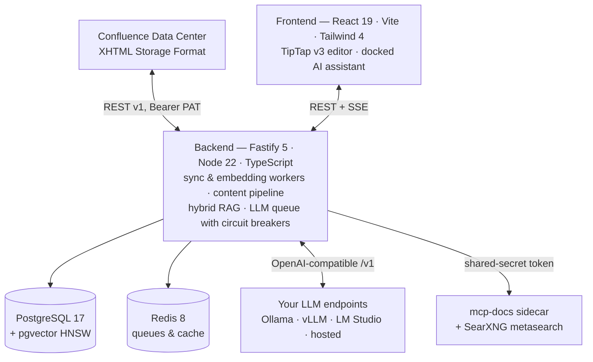

<h1 align="center"> Compendiq</h1>

<p align="center">
  <strong>Ask your own documentation a question. Get a cited answer — then fix the page that gave it to you.</strong>
</p>

<p align="center">
  A self-hosted AI knowledge engine for Confluence Data Center. Your corpus, your models, your hardware.
</p>

<p align="center">
  <a href="https://github.com/Compendiq/compendiq-ce/actions/workflows/pr-check.yml"></a>
  <a href="https://github.com/Compendiq/compendiq-ce/releases"></a>
  
  
  
  <a href="LICENSE"></a>
</p>

<p align="center">
  <a href="#install-in-three-minutes"><b>Install</b></a> &nbsp;&bull;&nbsp;
  <a href="#answers-with-receipts"><b>Features</b></a> &nbsp;&bull;&nbsp;
  <a href="#community-edition-vs-enterprise"><b>Enterprise</b></a> &nbsp;&bull;&nbsp;
  <a href="#documentation"><b>Docs</b></a> &nbsp;&bull;&nbsp;
  <a href="SECURITY.md"><b>Security</b></a>
</p>

---

Your organisation already wrote the answer. It is three spaces away, in a page nobody has
opened since the last reorg. Compendiq syncs your Confluence corpus, embeds it, and puts a
model you host over it — so the answer comes back in seconds, with the page it came from
attached, and you can improve that page without leaving the tab.

```bash
curl -fsSL https://raw.githubusercontent.com/Compendiq/compendiq-ce/main/scripts/install.sh | bash
```

---

## Answers with receipts

An answer you cannot trace is a rumour. Every response cites the pages behind it and deep-links
straight back into Confluence.

- **Hybrid retrieval** — pgvector HNSW similarity and PostgreSQL full-text search, fused with
  Reciprocal Rank Fusion, so exact identifiers and pasted error strings survive alongside
  semantic matches.
- **It refuses rather than invents.** When retrieval confidence falls below your configured
  threshold, Compendiq says it does not know instead of writing something plausible.
- **Streamed as it is written**, with sources appearing beside the text, not in a footnote.
- **Optional rerank stage** for corpora where the top ten matter more than the top hundred, and a
  per-question **Deep Search** for the questions your vocabulary does not match.
- **Point it at a vision model and pictures join the index** — diagrams and screenshots are
  described in text at ingestion, so a text-only chat model can still cite the figure.

## Fix the page, not just the answer

Reading and writing belong in one session. The assistant sits beside the article, not in another
product.

- Improve, restructure, expand, or retone an article — then apply the result to the real page.
- Generate runbooks, how-to guides, architecture decision records, and troubleshooting matrixes
  from a prompt.
- Summaries, automatic tags, quality scores, duplicate detection, and documentation-gap reports
  that run in the background and surface as state, never as homework.
- **Written back in Confluence XHTML Storage Format** — code blocks, panels, task lists, mentions,
  page links, attachments, and draw.io diagrams intact. A read-only chat wrapper cannot do this.

## Your infrastructure, your models

Compendiq is self-hosted software, not a tenant. It talks to LLM endpoints **you** operate: local
Ollama, LM Studio, or vLLM — or any hosted OpenAI-compatible `/v1` API if you prefer one.

- **Nothing leaves your network** in a fully local deployment, and air-gapped installs are a
  documented, supported topology.
- Confluence personal access tokens are **AES-256-GCM encrypted at rest** and never reach the
  browser; production refuses to boot on default or short secrets.
- JWT access tokens with rotating refresh families, RBAC with groups and per-resource permissions,
  a structured audit log, SSRF guarding, and prompt-injection sanitisation on every LLM boundary.
- **No accounts, no phone-home, no usage analytics.** OpenTelemetry exists and is off until you
  turn it on.

## Confluence optional

Turn the integration off per user and Compendiq is a standalone knowledge base — every feature
works against the local corpus, and nothing syncs. Bring content in from Markdown or Notion, drop
documents and images in as AI source material, and export any page to PDF.

## Built for the people who live in it

- A **TipTap v3** editor with vim keybindings, drag-and-drop blocks, find and replace, header
  auto-numbering, syntax detection, and paste-an-image-from-the-clipboard.
- **On-device inline completion** — a WebGPU model in the browser writes ghost text with no server
  model assigned, no cloud call, and no account.
- Keyboard-first throughout: command palette, single-key shortcuts, and a shortcuts modal.
- Light and dark are both designed and tuned, following the OS by default; **WCAG 2.1 AA is
  enforced by tests**, not aspired to.
- Opt-in real-time collaborative editing, a knowledge graph, page verification workflows, version
  history, comments, and engagement analytics.

## Install in three minutes

```bash
curl -fsSL https://raw.githubusercontent.com/Compendiq/compendiq-ce/main/scripts/install.sh | bash
```

Then open **http://localhost:8080** and register — the first account becomes the admin.

> **Requirements:** Linux or macOS with Docker 24+ and Compose v2.20+, 4 GB RAM (8 GB
> recommended), 10 GB disk, and one free port. Plus at least one OpenAI-compatible `/v1`
> endpoint — [Ollama](https://ollama.ai) on the host is the usual choice.

```bash
ollama pull bge-m3          # embeddings (1024-dim default)
ollama pull qwen3:4b        # a fast local chat model, or one of your choosing
```

<details>
<summary><strong>What the installer actually does</strong></summary>

1. Generates high-entropy `JWT_SECRET`, `PAT_ENCRYPTION_KEY`, and infrastructure passwords.
2. Writes `~/compendiq/.env` and `~/compendiq/docker-compose.yml` with those secrets.
3. Pulls verified images from `ghcr.io/compendiq/compendiq-ce-*`.
4. Starts six containers: frontend (nginx), backend (Fastify 5), PostgreSQL 17 with pgvector,
   Redis 8, and the documentation-search MCP server with its SearXNG backend.
5. Polls the readiness probe and opens the setup wizard in your browser.

</details>

<details>
<summary><strong>Custom port, directory, version, and dry runs</strong></summary>

```bash
INSTALL="https://raw.githubusercontent.com/Compendiq/compendiq-ce/main/scripts/install.sh"

# Flags pass through the pipe with `bash -s --`; image tags are semver (`0.8.0`, `0.8`, `latest`)
curl -fsSL "$INSTALL" | bash -s -- --port 9090 --dir /opt/compendiq --version 0.8.0

# Same knobs as environment variables
COMPENDIQ_PORT=9090 INSTALL_DIR=/opt/compendiq curl -fsSL "$INSTALL" | bash

# Validate prerequisites and generated config without installing anything
curl -fsSL "$INSTALL" | bash -s -- --dry-run

# Point at a GPU box elsewhere on the network
OLLAMA_BASE_URL=http://gpu-server:11434 curl -fsSL "$INSTALL" | bash
```

</details>

<details>
<summary><strong>Uninstalling</strong></summary>

```bash
curl -fsSL https://raw.githubusercontent.com/Compendiq/compendiq-ce/main/scripts/uninstall.sh \
  -o /tmp/compendiq-uninstall.sh && bash /tmp/compendiq-uninstall.sh
```

It asks three separate questions — stop the containers, delete the data volumes, delete the
install directory — and every one defaults to No. Add `--dir /opt/compendiq` if you installed
elsewhere. `--yes` answers all three with Yes, data included, so do not reach for it casually;
the script deliberately refuses to run from a pipe without it.

</details>

<details>
<summary><strong>Under the hood</strong></summary>


```mermaid
flowchart TB
  CDC["Confluence Data Center<br/>XHTML Storage Format"] <-->|"REST v1, Bearer PAT"| BE
  BE["Backend — Fastify 5 · Node 22 · TypeScript<br/>sync &amp; embedding workers · content pipeline<br/>hybrid RAG · LLM queue with circuit breakers"]
  BE --> PG[("PostgreSQL 17<br/>+ pgvector HNSW")]
  BE --> RD[("Redis 8<br/>queues &amp; cache")]
  BE <-->|"OpenAI-compatible /v1"| LLM["Your LLM endpoints<br/>Ollama · vLLM · LM Studio · hosted"]
  BE -->|"shared-secret token"| MCP["mcp-docs sidecar<br/>+ SearXNG metasearch"]
  FE["Frontend — React 19 · Vite · Tailwind 4<br/>TipTap v3 editor · docked AI assistant"] <-->|"REST + SSE"| BE
```

**Stack:** Fastify 5 · Node.js 22 · TypeScript · BullMQ · PostgreSQL 17 + pgvector (HNSW;
`bge-m3` 1024-dim by default, Qwen3-Embedding-4B at 2560 dims measured and recommended) ·
Redis 8 · React 19 · Vite · TailwindCSS 4 · Radix UI · TanStack Query · TipTap v3 · Zod
contracts on every API boundary.

Diagrams are source-of-truth and live in [`docs/architecture/`](docs/architecture/README.md);
decisions are recorded in [`docs/ARCHITECTURE-DECISIONS.md`](docs/ARCHITECTURE-DECISIONS.md).

</details>

## Community Edition vs Enterprise

Community Edition is **free and AGPL-3.0, with no artificial resource limits** — no seat caps, no
document caps, no metered AI calls. And it does not shrink: the
[stewardship pledge](docs/STEWARDSHIP.md) commits in writing that every feature shipped under CE
stays under CE, enforceable against a published v0.3.0 baseline.

| | Community Edition | Enterprise |
| :--- | :---: | :---: |
| Confluence sync, cited RAG Q&A, AI authoring | Included | Included |
| Hybrid retrieval, rerank, image analysis | Included | Included |
| Any number of LLM providers and models | Included | Included |
| TipTap editor with Confluence macro round-trip | Included | Included |
| RBAC, groups, audit log, SMTP alerts, backups | Included | Included |
| OIDC / SAML SSO and SCIM provisioning | — | **Enterprise** |
| Per-page RAG permission enforcement | — | **Enterprise** |
| PII detection and AI output review queue | — | **Enterprise** |
| Compliance reports and IP allowlisting | — | **Enterprise** |
| SLA and priority engineering support | — | **Enterprise** |

Enterprise runs the **same unmodified CE images** — it unlocks at runtime, so there is no forked
build and no migration. [Open an Enterprise request](https://github.com/Compendiq/compendiq-ce/issues/new?template=enterprise-interest.md)
or ask in [Discussions](https://github.com/Compendiq/compendiq-ce/discussions).

## Documentation

- [User guide: setup, search, AI features, shortcuts](docs/USER-GUIDE.md)
- [Admin guide: installation, configuration, tuning, troubleshooting](docs/ADMIN-GUIDE.md)
- [API reference](docs/API.md)
- [Deployment topologies: reverse proxy, custom CA, air-gapped](docs/integrations/README.md)
- [Architecture decisions](docs/ARCHITECTURE-DECISIONS.md) and [diagrams](docs/architecture/README.md)
- [Roadmap](docs/ROADMAP.md) · [Stewardship pledge](docs/STEWARDSHIP.md) · [Changelog](CHANGELOG.md)
- [Contributing and local development](CONTRIBUTING.md) · [Security policy](SECURITY.md)

## License

Compendiq Community Edition is free software under the
[GNU Affero General Public License v3.0](LICENSE). You may use, study, modify, and redistribute
it; derivative works must be released under the same license.

<details>
<summary><strong>Third-party content in the retrieval-evaluation fixtures</strong></summary>

The fixture corpora under `backend/src/domains/llm/eval/` are third-party content, are **not**
covered by AGPL-3.0, and ship in no product image:

- [`corpus/`](backend/src/domains/llm/eval/corpus/) — verbatim MIT-licensed documentation
  (fastify, vite, vitest), notices in full in its
  [`LICENSE-ATTRIBUTION.md`](backend/src/domains/llm/eval/corpus/LICENSE-ATTRIBUTION.md).
- [`corpus-de/`](backend/src/domains/llm/eval/corpus-de/) — 262 of 275 pages are German
  translations of that same MIT documentation, with upstream repository, commit, and path recorded
  per page in its `MANIFEST.json`; the licences and holders are those listed under `corpus/`. The
  remaining 13 (`source: synthetic-*`) translate this repository's own fixtures and stay AGPL-3.0.
- [`corpus-de-images/`](backend/src/domains/llm/eval/corpus-de-images/) — built from German
  Wikipedia; page text is CC BY-SA 4.0 (adapted) and each image keeps its own licence, with
  attribution and ShareAlike obligations stated per page and per image in its
  [`LICENSE-ATTRIBUTION.md`](backend/src/domains/llm/eval/corpus-de-images/LICENSE-ATTRIBUTION.md).

</details>

<p align="center">
  <strong>Your knowledge. Your network. Your answers.</strong><br>
  <em>If Compendiq earns its place in your stack, <a href="https://github.com/Compendiq/compendiq-ce">star the repo</a>.</em>
</p>
