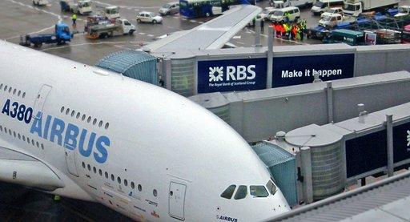
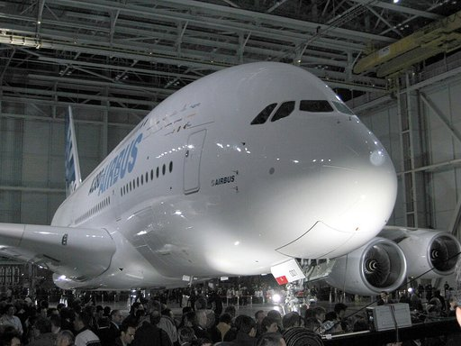
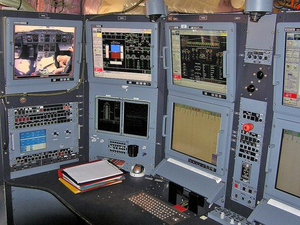

# Airbus A380

Der **Airbus A380** ist ein vierstrahliges Großraum-Langstreckenflugzeug des europäischen Flugzeugherstellers Airbus mit drei durchgehenden Decks (zwei Passagierkabinen und ein Laderaum).

Der Tiefdecker ist mit einer maximalen Kapazität von bis zu 853 Passagieren und einer Spannweite von knapp 80 Metern das größte in Serienfertigung produzierte zivile Verkehrsflugzeug in der Geschichte der Luftfahrt.
Es hat eine Reichweite von max. 15.200 km und eine Reisegeschwindigkeit von etwa 940 km/h (Mach 0,87), max. 961 km/h (Mach 0,89).

Die Endmontage fand in Toulouse und die Kabinenausrüstung in Hamburg-Finkenwerder statt. Der Erstflug wurde am 27. April 2005 mit einer A380-841 absolviert, bis zum 10. März 2018 wurden 331 Maschinen bestellt. Nachdem Emirates angekündigt hatte, die Bestellung um 39 auf 123 Stück zu reduzieren, stellte Airbus die Produktion im Jahre 2021 ein, Emirates erhielt am 16. Dezember 2021 die letzte A380.

## Geschichte

### Vorgeschichte

Die Entwicklung des Airbus A380 geht bis in die 1980er-Jahre zurück, als erste Machbarkeitsstudien bezüglich eines Großflugzeuges sowohl für Passagiere als auch für den Frachtflugverkehr erstellt wurden. In der zweiten Hälfte der 1990er-Jahre ergab sich eine Marktsituation, die aus der Sicht von Airbus eine Realisierung der Pläne gestattete. Diese Einschätzung resultierte zum einen aus der wachsenden Nachfrage nach Großraumflugzeugen, zum anderen aus der Entscheidung des Airbus-Konkurrenten Boeing, keine Gelder für neue Versionen seiner Boeing 747 in Forschung und Entwicklung zu investieren. Als im Jahr 2000 die ersten 50 Kaufabsichtserklärungen vorlagen, begann Airbus 2001 mit der Konstruktion. Während der Konzeptionsphase wurde das Flugzeug als *Airbus A3XX* bezeichnet.

### Entwicklung

Für die Entwicklung des Flugzeuges war sowohl die Erhöhung der möglichen Passagierzahl als auch die Senkung der spezifischen Betriebskosten pro Person und Kilometer gefordert. Die A380 sollte im Vergleich zu anderen modernen Passagierflugzeugen der 1990er-Jahre mit um 15 % geringeren Kosten betrieben werden können. Die Entwicklungsziele konnten nur durch einen umfangreichen Einsatz neuartiger Werkstoffe, wie beispielsweise faserverstärktem Kunststoff und Sandwichkonstruktionen, zur Gewichtseinsparung erreicht werden. Die Rumpfaußenhaut besteht zum Beispiel nur noch an der Unterseite aus Aluminium. Die oberen zwei Drittel sind aus glasfaserverstärktem Aluminium gefertigt.

Die Abmessungen des Flugzeugs übertreffen nicht die 80×80-Meter-Box, wodurch es sich auf bestehenden Rollwegen bewegen und auch die Abfertigungsinfrastruktur der Terminals nutzen kann. Zur schnelleren Passagierabfertigung werden allerdings oft die bestehenden Einrichtungen derart erweitert, dass der Ein- und Ausstieg parallel über beide Decks ablaufen kann. Ziel ist das Erreichen vergleichbarer Turnaround-Zeiten wie bei einstöckigen Großraumflugzeugen.

### Testprogramm

#### Erste öffentliche Präsentation (Rollout)

Der erste für die Flugerprobung gebaute Prototyp mit der Seriennummer (MSN) 001 stand von Oktober 2004 bis Januar 2005 in der Endfertigung. Am 18. Januar 2005 fand schließlich die feierliche Vorstellung der A380 vor versammelter Presse statt. Die Staats- und Regierungschefs der Airbus-Hauptkooperationsländer, Jacques Chirac, Gerhard Schröder, Tony Blair und José Luis Zapatero, waren bei der live im Fernsehen übertragenen Zeremonie anwesend.

#### Strukturbelastungstests

An einem speziell für Strukturbelastungstests gebauten, nicht flugfähigen Exemplar mit der Seriennummer (MSN) 5001 wurde vom 1. September 2005 bis zum 16. Juni 2012 (ursprünglich geplant bis 2008) in einer eigens dafür erbauten Testhalle neben dem Gelände des Flughafens Dresden der größte Struktur-Ermüdungsversuch an einem Zivilflugzeug durchgeführt. Dabei wurden von der IABG und der IMA 60.800 Flüge (Flugzyklen) simuliert. Das entspricht einer Betriebszeit von rund 80 Jahren, dem 3,2-fachen Flugzeugleben der A380. Bei den Lebensdauertests am Airbus A380 setzte die IABG eine neu entwickelte Methode der Versuchssteuerung ein, mit der die Versuchsgeschwindigkeit erheblich gesteigert werden konnte. Die Prüfung erfolgte mit über 180 Hydraulikzylindern der Firma Herbert Hänchen GmbH. Dabei wurden unterschiedliche Bauarten eingesetzt: Differentialzylinder, Gleichlaufzylinder und insbesondere zur Belastung der Tragflächen Synchronzylinder mit einem Hub von bis zu 6500 mm. Dadurch konnten schon frühzeitig verlässliche Aussagen über das Lebensdauerverhalten der Flugzeugzelle gemacht werden. Nach erfolgreich bestandenen 5.000 simulierten Flügen durfte das erste Flugzeug an einen Kunden ausgeliefert werden.

Am 16. Februar 2006 riss bei einem Biegeversuch einer anderen Zelle in Toulouse eine Tragfläche der A380 nach dem Überschreiten der 1,45-fachen Maximallast zwischen den Triebwerken ein. Für die Zulassung eines neuen Flugzeugtyps ist aber das Erreichen der 1,5-fachen Maximallast vorgeschrieben. Airbus löste das Problem durch zusätzliche Leisten an den Längsspanten, die ein Zusatzgewicht von 30 kg bedeuten.

#### Erstflug

Der A380-Erstflug, der wegen technischer Probleme mehrfach verschoben werden musste, fand am 27. April 2005 vor tausenden Zuschauern statt. Die Maschine mit der Seriennummer 001 startete mit einem Startgewicht von 421 Tonnen, dem bis dahin höchsten Startgewicht eines zivilen Verkehrsflugzeuges. Der Erstflug dauerte 3:54 Stunden. Der genaue Termin war vom Wetter abhängig, da bei Südwestwind in Richtung Toulouse hätte gestartet werden müssen, was man aus Sicherheitsgründen vermeiden wollte. Nach dem erfolgreichen Start vom Flughafen Toulouse-Blagnac um 10:29 Uhr auf der Startbahn 32L kreiste die A380 (Luftfahrzeugkennzeichen F-WWOW) während der ersten Erprobungsphase mit ausgefahrenem Fahrwerk in der Nähe von Toulouse. Während des gesamten Fluges wurde sie von einem weiteren Flugzeug begleitet, um das Flugverhalten von außen zu beobachten und mit Videokameras aufzuzeichnen. Nach einer etwa halbstündigen Testphase wurde das Fahrgestell eingefahren und die Flugerprobung fortgesetzt, jedoch nicht, wie ursprünglich geplant, über dem Atlantik, sondern über dem Festland parallel zum Nordrand der Pyrenäen. Um 14:23 Uhr landete das Flugzeug wieder auf der Landebahn 32L. Während der gesamten Flugerprobung wurden Testdaten per Telemetrie über einen Satelliten direkt von der A380 in das Airbus-Testzentrum in Toulouse übertragen.

Durchgeführt wurde der Erstflug von einer sechsköpfigen Besatzung der in Toulouse stationierten Testflugstaffel. Flugkapitän Claude Lelaie, leitender Direktor der Flugzeugsparte, und Chef-Testpilot Kapitän Jacques Rosay teilten sich das Kommando während des Erstfluges. Fernando Alonso, Direktor der Abteilung für Flugtests, war der verantwortliche Versuchsingenieur für die Flugsteuerung und die Flugzeugstruktur. Zudem waren noch Jacky Joye (Systeme), Manfred Birnfeld (Triebwerke) und Gérard Desbois (Flugingenieur, *dritter Mann* im Cockpit) als Testflug-Ingenieure an Bord des Flugzeugs. Wie bei Erstflügen üblich, trug die Besatzung Fallschirme.

Den Erstflug mit den GP7200-Triebwerken absolvierte das Flugzeug mit der Seriennummer 009 und dem Kennzeichen F-WWEA am 24. August 2006.

#### Wirbelschleppentests

Im Juli und August 2006 führte das Deutsche Zentrum für Luft- und Raumfahrt (DLR) in Oberpfaffenhofen im Auftrag von Airbus Wirbelschleppentests durch. Dabei überflog die A380 mehr als 30-mal abwechselnd mit einer Boeing 747-400 den Sonderflughafen Oberpfaffenhofen in Höhen zwischen 80 und 400 m.

Die Wirbelschleppen hinter beiden Flugzeugen wurden mit einem LIDAR vom Boden aus gemessen. Da das Verhalten der Wirbelschleppen bei der Boeing 747-400 bekannt ist, konnten Vergleiche gezogen werden. Die Ergebnisse dieser Tests dienen der Sicherheit im Luftverkehr, da durch sie der Mindestabstand nachfolgend anfliegender Flugzeuge festgelegt werden kann.

Nach Aussagen des DLR entsprechen die Wirbelschleppen der A380 bezüglich ihrer horizontalen Ausdehnung denen einer Boeing 747-400. Im Reiseflug und in Warteschleifen ergeben sich daher keine neuen Einschränkungen. Bei Start und Landung sind die Wirbelschleppen der A380 dagegen stärker ausgeprägt, was eine Erhöhung des erforderlichen Mindestabstands bei der Staffelung folgender Flugzeuge gegenüber dem geltenden ICAO-Abstand um zwei bis vier NM (ca. 3,7 bis 7,4 km) erfordert.

#### Lärmbelastung

Die ICAO Noise Data Base gibt für die A380 eine Lärmbelastung an, die dem Durchschnitt der vergleichbar großen Flugzeuge gleicher Generation entspricht:

- Start/Lateral 94,2 EPNdB
- Anflug 98 EPNdB
- Überflug 96 EPNdB

#### Langstreckenerprobungsflüge

Vom 4. bis zum 8. September 2006 wurden erste Testflüge mit Passagieren an Bord durchgeführt, die sogenannten *Early Long Flights* oder kurz ELF. Die Kabine des Flugzeugs war dabei mit 474 Sitzen ausgestattet. Im Gegensatz zum regulären Kabinenbetrieb (555 Sitze in drei Klassen) wurde bei diesen Testflügen auf allen Sitzplätzen der Business-Class-Service angeboten. Die Flugtickets für die Testflüge wurden unter den etwa 50.000 Airbus-Mitarbeitern weltweit verlost. Ziel der ELF war es, den Komfort an Bord sowie das einwandfreie Funktionieren der Klimaanlage, Bordküchen, Toiletten und der Unterhaltungselektronik unter realen Einsatzbedingungen zu testen. Daher befanden sich unter den 474 Passagieren auch Experten für die oben genannten Systeme, um eventuell auftretende Probleme vor Ort zu analysieren. Das Kabinenpersonal wurde dabei von der Lufthansa gestellt, die somit Erfahrungen im operativen Kabinenbetrieb sammeln konnte.

Im November 2006 startete die A380 zu einer Testflugserie, welche die Langstrecken- und Flughafentauglichkeit des Flugzeugs unter Beweis stellen sollte. Erstes Ziel war am 12. November 2006 der Flughafen Düsseldorf, der seit 2009 als Ausweichflughafen der Lufthansa für Frankfurt geplant ist. Weitere Ziele waren Singapur, Kuala Lumpur, Peking, Shanghai, Hongkong, Tokio, Sydney, Johannesburg und Vancouver.

Am 17. März 2007 landete die A380 (MSN 007) in Frankfurt zu einer Reihe von verschiedenen Tests. Unter realen Voraussetzungen wurden zum ersten Mal Langstreckenflüge mit 483 geladenen Passagieren geflogen. Als Ziele wurden New York (19. März 2007), Hongkong (23. März 2007) und Washington (25. März 2007) (von Frankfurt) und Los Angeles (von Toulouse) ausgewählt. Während der Standzeit in Frankfurt wurde die Bodenabfertigung getestet. Der Rückflug über München nach Toulouse war am 28. März 2007.

#### Evakuierung

Nach internationalen Vorschriften muss ein Flugzeug binnen 90 Sekunden durch die Hälfte der zur Verfügung stehenden Türen und in Dunkelheit komplett evakuiert werden können. Aufgrund der Größe der A380 war das eine besondere Herausforderung. Neben der zeitlichen Komponente spielten auch verschiedene Szenarien eine Rolle. So müssen die Notrutschen auch dann funktionieren, wenn das Flugzeug ohne Fahrwerk landet oder beispielsweise nur das Bugfahrwerk versagt. Letzteres bewirkt einen besonders großen Höhenunterschied zwischen dem Boden und den hinteren Ausgängen.

Der intensiv vorbereitete Evakuierungstest vor Vertretern der Zulassungsbehörden fand am 26. März 2006 in Halle 212 des Airbus-Werkes in Hamburg-Finkenwerder statt und verlief erfolgreich. Innerhalb von 78 Sekunden gelang es 853 Passagieren und 20 Besatzungsmitgliedern, ausschließlich über die Notausgänge auf der rechten Seite das Flugzeug zu verlassen. Unter Berücksichtigung der Zeit für das Öffnen der Türen und Befüllen der Rutschen (etwa 10 bis 15 Sekunden) sprangen somit durchschnittlich alle 1,2 Sekunden je zwei Personen auf eine der doppelbahnigen Notfallrutschen. Um eine realitätsnahe Situation zu simulieren, lagen in der Kabine diverse Gegenstände wie Zeitungen, Decken und Kissen herum und als Lichtquelle stand nur die schwache Notbeleuchtung zur Verfügung. Bei der Evakuierung brach sich ein Testkandidat ein Bein, weitere 32 Personen erlitten leichte Verletzungen, meist Hautabschürfungen. Diese Vorfälle beeinträchtigten den Zulassungsprozess nicht, sie sind bei Evakuierungstests durchaus üblich.

Drei Tage später, am 29. März 2006, bestätigten die Europäische Agentur für Flugsicherheit und die US-Luftfahrtbehörde FAA die maximale Sitzplatzkapazität von 853 Passagieren.

#### Abschluss des Zulassungsprogrammes

Am 30. November 2006 beendete die A380 mit einem letzten Flug von Vancouver über den Nordpol nach Toulouse das Zulassungsprogramm erfolgreich. Am 12. Dezember 2006 erhielt die Passagierversion der A380 mit Triebwerken der Trent-900-Serie – als erstes bis dahin zivil zugelassenes Passagierflugzeug – die kombinierte behördliche Musterzulassung durch die Europäische Agentur für Flugsicherheit (EASA) sowie die US-amerikanische Federal Aviation Administration (FAA). Am 23. April 2007 erhielt die A380 die Typenzulassung von der EASA für den Betrieb mit Triebwerken der Engine-Alliance-GP7200-Serie. Von der FAA war dieser Triebwerkstyp bereits im Dezember 2005 für die A380 zertifiziert worden. Zu diesem Zeitpunkt waren mit dem Triebwerk GP7200 mehr als 111 Flüge und 1348 Flugstunden absolviert worden. Im Juli 2007 gaben FAA und EASA ihre Zulassung der A380 für den Betrieb auch auf Start- und Landebahnen mit nur 45 Metern Breite bekannt. Bis dahin war eine Zulassung ausschließlich für Bahnen ab einer Breite von 60 Metern erfolgt.

#### Liste der Testflugzeuge

1

Manufacturer Serial Number: Hersteller-Seriennummer

2

Die zwei letzten Ziffern geben bei Airbus normalerweise den Triebwerkstyp und dessen Unterversion an; die Strukturtestzellen wurden jedoch nicht mit Triebwerken ausgerüstet.

3

Diese Maschine sollte ursprünglich an Etihad ausgeliefert werden. Etihad hat die A380-Auslieferungen jedoch verschoben. MSN007 ging nun an Emirates, wofür eine Umrüstung auf Engine-Alliance-Triebwerke nötig wurde. Mit der Umrüstung wechselte die Typbezeichnung somit von A380-8*41* (Bezeichnung für Maschinen mit Rolls-Royce Trent 970) zu A380-8*61* (Bezeichnung für Maschinen mit GP7276-Antrieb).

4

Wie MSN007 sollte MSN009 ursprünglich an Etihad gehen, was eine Umrüstung auf Rolls-Royce Trent nötig gemacht hätte. Der neue Abnehmer Emirates wird jedoch den Engine-Alliance-Antrieb beibehalten.

### Auslieferungsschwierigkeiten

Am 29. Oktober 2005 wurde der Flughafen Frankfurt als erster Flughafen außerhalb von Toulouse zur Durchführung von Abfertigungstests angeflogen. Am 8. November 2005 wurde zum ersten Mal das Airbuswerk Hamburg-Finkenwerder von der zweiten Versuchsmaschine MSN 002 angeflogen. In den Jahren 2006, 2008, 2010, 2014, 2016, 2018 und 2022 besuchte je eine A380 die Internationale Luft- und Raumfahrtausstellung Berlin. Der erste Besuch am Flughafen München Franz Josef Strauß fand am 28. März 2007 statt.

Die erste Auslieferung der Passagierversion war ursprünglich für Juni 2006 an Singapore Airlines geplant. Aufgrund von Produktionsproblemen verzögerte sich der Zeitplan jedoch mehrfach, so dass die Erstauslieferung erst am 15. Oktober 2007 stattfinden konnte. Bei derartigen Verzögerungen haben die Fluggesellschaften vertraglich die Möglichkeit, Konventionalstrafen gegenüber Airbus einzufordern, was auch getan wurde. Das geschah im Fall des Airbus A380 durch Schadensersatzzahlungen sowie verbilligte Verkäufe von anderen Flugzeugmodellen, insbesondere des Airbus A330, bzw. Nachbestellungen der A380.

Die Frachtversion A380F sollte Anfang 2009 folgen. Die Verzögerungen bei der Entwicklung führten jedoch zu einer Stornierung des Kunden FedEx und einer Umwandlung der Emirates-Bestellung in Passagiermaschinen. Damit blieben lediglich zehn A380F-Bestellungen der US-Frachtfluggesellschaft UPS Airlines in den Auftragsbüchern, weswegen Airbus am 1. März 2007 bekanntgab, dass man die Entwicklung und Produktion der A380F bis auf weiteres wegen eines Mangels an „kurzfristigen Perspektiven“ aussetzen werde. Ziel sei, sich zunächst auf die Passagiervariante zu konzentrieren, auch wenn man langfristig von einer Wiederaufnahme des Frachterprogramms ausgehe. Die Frachtversion bleibe ein aktiver Bestandteil der A380-Familie, für den auch weiterhin Werbung bei Kunden betrieben werde. Dennoch wird diese Variante seit 2015 nicht mehr auf der Website des Konzerns beworben.

Airbus gab am 13. Juni 2006 bekannt, dass die A380-Auslieferungen, von der ersten Auslieferung abgesehen, wegen Problemen mit der Kabinenelektronik um sechs bis acht Monate verschoben werden müssten. Diese Probleme lagen teilweise an der uneinheitlichen IT-Entwicklungsumgebung: Einige Standorte nutzten die aktuelle Version des CAD-Programms CATIA, das jedoch nicht abwärtskompatibel zur Vorgängerversion ist. Aus diesem Grund muss im Datenaustausch manuell konvertiert werden. Dem neuen Zeitplan zufolge hätten zudem 2007 lediglich neun (gegenüber geplanten 20 bis 25), 2008 nur 26 bis 30 (geplant: 35) und 2009 nur 40 (geplant: 45) A380 ausgeliefert werden sollen.

Am 1. September 2006 wurde durch die mit dem Bau der Startbahnverlängerung beauftragte Realisierungsgesellschaft (ReGe) Hamburg bekanntgegeben, dass die Landebahn etwa zwei Monate früher als ursprünglich geplant fertiggestellt und an Airbus übergeben werde. Diese Terminierung konnte durch Übergabe der Bahnverlängerung an Airbus am 16. Juli 2007 eingehalten werden. Damit waren die Voraussetzungen für Bau und Betrieb des geplanten Auslieferungszentrums für Kunden aus dem Nahen Osten und Europa auf dem Werksgelände in Finkenwerder geschaffen. Innerhalb des neuen EADS-Vorstands gab es zeitweise Überlegungen, die gesamte Auslieferung in Toulouse abzuwickeln. Auf einer Pressekonferenz am 28. Februar 2007 wurde jedoch bekanntgegeben, dass es mit geringen Abstrichen bei der geplanten Auslieferung ab Hamburg bleiben soll.

Am 3. Oktober 2006 gab die Airbus-Mutter EADS bekannt, dass sich die Auslieferung der ersten Maschinen im Schnitt um ein weiteres Jahr verzögern werde. Nach Angaben der französischen Airbus-Zentrale liege der Grund für die Pannen im Hamburger Airbus-Werk. Ein dort verwendetes Designprogramm habe zu kurze, nicht passende Kabel produziert. Das Problem sei im Sommer entdeckt worden, nun werde in Deutschland das erprobte Programm aus der Airbus-Zentrale in Toulouse verwendet. Hamburger Darstellungen zufolge lieferte das Werk Finkenwerder zwar Segmente mit zu kurzen Kabeln, diese Kabel basierten jedoch auf Plänen, die in Toulouse erstellt worden seien. Im Juni 2006, als man zuletzt einen neuen Auslieferungsplan bekanntgab, habe man den benötigten Aufwand unterschätzt und sei nun nach eingehender Prüfung zu dem Schluss gekommen, die Auslieferung nochmals zu verschieben und tiefgreifende Änderungen der Managementstrukturen vorzunehmen, die letztlich zu den Auslieferungsproblemen geführt hätten.

### Erste Auslieferungen

Am 15. Oktober 2007 wurde die erste Maschine (MSN 003) an Singapore Airlines übergeben. Sie wurde am 25. Oktober 2007 auf der Strecke Singapur–Sydney in Dienst gestellt und gehörte dem Fondshaus Dr. Peters Group. 2007 wurde nur diese eine A380 an einen Kunden übergeben. Von Dezember 2018 bis November 2019 wurde diese A380 auf dem Flughafen Tarbes-Lourdes-Pyrénées für die Weiterverwendung der Einzelteile zerlegt.

2008 konnte Airbus entgegen diversen Spekulationen plangemäß zwölf Maschinen ausliefern, im Jahr 2009 sollten es ursprünglich 21 sein. Aufgrund der durch die Wirtschaftskrise geringeren Nachfrage wurde die Produktion aber auf 14 Flugzeuge gesenkt. In den besten Zeiten war einmal die Produktion von 45 Flugzeugen pro Jahr vorgesehen gewesen.

Nach Angaben von Airbus sind trotz der mehrfachen Verzögerungen keine Kunden der Passagierversion abgesprungen. Emirates erklärte zwar unmittelbar nach dem Bekanntwerden der letzten Verzögerung, dass man „alle Optionen prüfen“ werde, orderte zwischenzeitlich aber sogar noch weitere Maschinen. Der damalige Vorstandschef der Lufthansa, Jürgen Weber, unterzeichnete bereits 2001 den ersten Auftrag an Airbus, im Oktober 2009 flog die schon teilweise lackierte A380 mit der Baunummer 038, die am 19. Mai 2010 offiziell an Lufthansa übergeben wurde und seitdem das Kennzeichen *D-AIMA* sowie den Namen *Frankfurt am Main* trug, zur Innenausstattung nach Hamburg-Finkenwerder. Virgin Atlantic Airways teilte im Oktober 2006 mit, dass sie ihre Bestellung um vier Jahre aufschieben und die erste A380 erst 2013 erhalten werde. Die Fluggesellschaft wolle sich vor der Indienststellung vom kommerziellen Erfolg des Flugzeuges bei anderen Betreibern überzeugen. Insgesamt belief sich die Verzögerung der Auslieferungen gegenüber dem ursprünglichen Plan auf 22 Monate.

Diese Verzögerungen stürzten Airbus in eine schwere Krise. Gegenüber früheren Schätzungen wurde das Airbus-Ergebnis zwischen 2006 und 2010 um zusätzliche 2,8 Milliarden Euro (insgesamt 4,8 Mrd. Euro) belastet.

Die MSN 011 wurde am 28. Juli 2008 als erste A380 im Auslieferungszentrum Hamburg an den zweiten Kunden Emirates übergeben. Am 19. September 2008 wurde die erste Maschine (MSN 014) an den dritten Betreiber Qantas ausgeliefert.

Im Februar 2009 wurde die Qualitätsdebatte um die A380 von Managern der Fluggesellschaft *Emirates* erneut entfacht, als sie bei einem Krisentreffen Fotos von teilweise abgerissenen Verkleidungsblechen, defekten Teilen an den Triebwerken und von weiterhin angeschmorten Stromkabeln in einer A380 zeigten. *Emirates* warf *Airbus* vor, dass die häufigen Defekte zu Ausfällen und erheblichen unplanmäßigen Standzeiten der Flugzeuge führten.

Im September 2009 zog die Fluggesellschaft Singapore Airlines eine positive Bilanz von der Eingliederung der ersten zehn A380 in ihre Flotte. Besonders der hohe wirtschaftliche Erfolg wurde gelobt. Das Flugzeug habe sich in den vergangenen zwei Jahren als verlässlich und vor allem als profitabel bewährt. Auch die einfache Wartung wurde lobend erwähnt.
Am 8. Juni 2010 bestellte *Emirates* weitere 32 Flugzeuge mit dem Ziel, im Jahr 2017 insgesamt 90 A380 zu besitzen.

### Bauliche Anpassungen auf Flughäfen (in Kontinentaleuropa)

Das neue Großraumflugzeug verlangt – zumindest in der Passagierversion – auch größere Investitionen in die Flughafeninfrastruktur seitens der Flughafenbetreibergesellschaften:

- Grundsätzlich soll jeder Flugplatz gemäß dem Annex 14 Code F (Spannweite 65 bis 80 m) zertifiziert sein. Allerdings erlaubt die ICAO Ausnahmen für Code-4E-Flugplätze.
- Als erster europäischer Flughafen erhielt München im April 2004 die offizielle Zulassung für den Verkehr mit Luftfahrzeugen vom Typ A380. Mehrere größere Abstellpositionen sind dort in das im Jahre 2003 eröffnete zweite Terminal integriert. Ebenfalls wurde im Jahre 2011 im Zuge der Aufnahme von A380-Linienflügen der Emirates nach München die Position 113 am Terminal 1 mit drei Fluggastbrücken ausgerüstet. Der neu gebaute Satellit des Terminal 2, welcher im April 2016 eröffnet wurde, stellt weitere fünf A380-Positionen am Flughafen bereit.
- Das Terminal 2 in Frankfurt (Baubeginn 1990, Eröffnung 1994) wurde auf die sogenannte 80×80-Meter-Box dimensioniert, ist also für die A380 vorbereitet. Die für die schnelle Abfertigung notwendigen zusätzlichen Fluggastbrücken wurden bislang an mindestens fünf Gates des Terminals 2 installiert. Im Terminal 1, das vorwiegend von Lufthansa genutzt wird, wurden ebenfalls Gates in den Abflugbereichen B und C so gestaltet, dass die A380 dort abgefertigt werden kann. Jeweils drei Fluggastbrücken erlauben an diesen Gates ein simultanes Boarding beider Ebenen. Im Rahmen des Flughafenausbaus kamen im Oktober 2012 weitere vier Positionen am neuen Flugsteig A-Plus hinzu, welche nun den Schwerpunkt der A380-Abfertigung darstellen. Im Januar 2008 wurde der erste Teil der A380-Werft der Lufthansa fertiggestellt.
- Auch am Flughafen Zürich wurden beim zwischen 1999 und 2004 neu erstellten Dock Midfield/Dock E zwei Standplätze für die A380 fest eingeplant. Inzwischen wurde ein Gate bereits mit einer zweigeschossigen Fluggastbrücke umgerüstet.
- Am Flughafen Pulkowo bei Sankt Petersburg wurde im Sommer 2006 eine Start- und Landebahn umgebaut. Sie ist die erste Piste in Russland, die für die A380 zugelassen ist.
- Der Flughafen Berlin Brandenburg ist mit Eröffnung A380-tauglich. Dafür mussten allerdings während des Baus Planungsänderungen vorgenommen werden.
- Am Flughafen Hamburg wurden die Grünstreifen neben beiden Landebahnen mit einem Kunstharz befestigt; zwar waren ab Hamburg zunächst keine Linienflüge geplant, doch ist der Flughafen eine Ausweichstelle für den Airbus-Werksflughafen in Hamburg-Finkenwerder. Mit der Erneuerung des Vorfeldes wurden ab 2017 Fluggastbrücken für die A380 angebaut, womit der Flughafen Hamburg A380-tauglich wurde. Am 29. Oktober 2018 landete die erste A380 im Linienflugbetrieb in Hamburg.
- Der Flughafen Leipzig/Halle ist seit Erstinbetriebnahme der Südbahn 08R/26L am 5. Juli 2007 ebenfalls A380-tauglich.
- Am Flughafen Dresden übernehmen die Elbe Flugzeugwerke Wartungs- und Reparaturarbeiten an Maschinen des Typs für diverse Fluggesellschaften. Dementsprechend ist die Start- und Landebahn in Dresden gleichfalls für die Abfertigung der A380 ausgelegt.
- Die Landebahn des Flugplatzes Hamburg-Finkenwerder wurde für den (vorerst gestoppten) Bau der Frachtversion um 589 m verlängert.
- Der Flughafen Düsseldorf erweiterte am Kopf von Terminal C das Gate C2 mit drei Fluggastbrücken für die A380 und verbreiterte die Rollwege auf 95 Meter. Außerdem wurde der Wartebereich am Gate auf 225 Sitzplätze vergrößert.

### Einsatz im Liniendienst

Im März 2013 wurde die hundertste A380 an Malaysia Airlines ausgeliefert. Mitte Februar 2014 gab Airbus bekannt, dass seit dem Beginn der Nutzung im Liniendienst 55 Millionen Passagiere auf 151.000 Flügen transportiert wurden. Bis Anfang Dezember 2014 wurden im Liniendienst von zu diesem Zeitpunkt 147 eingesetzten Maschinen insgesamt 1.700.000 Flugstunden absolviert und etwa 75 Mio. Passagiere befördert.

### Produktionsende

Im Februar 2019 gab Airbus bekannt, dass die Produktion der A380 bis 2021 eingestellt werde. Grund dafür sei eine Reduzierung der Bestellung des Hauptkunden Emirates von 162 auf 123 Maschinen, was im Gegenzug durch die Bestellung mehrerer kleinerer Airbus-Modelle ausgeglichen wurde. Thomas Enders, damaliger Airbus-CEO, erklärte, dass es aufgrund dessen „keinen nennenswerten A380-Auftragsbestand mehr für eine Fortsetzung der Produktion [gebe] – trotz aller Bemühungen unseres Vertriebs in den vergangenen Jahren, weitere Airlines als Kunden zu gewinnen.“ Gleichzeitig erklärte er, dass in den kommenden zwei Jahren noch insgesamt 17 A380 produziert würden, 14 für Emirates und drei für All Nippon Airways. Dies würde die Zahl der verkauften Maschinen auf insgesamt 251 bringen, weniger als ein Viertel der ursprünglich anvisierten Zahl von 1.200 Maschinen.

Die Entscheidung, die Produktion zu beenden, kam nicht unerwartet, da die A380 dem Konzern schon länger Sorgen bereitete. Vielen Fluggesellschaften erschien das Großflugzeug auch auf sehr langen Strecken nicht mehr wirtschaftlich, da es im Vergleich zu kleineren Airbus-Modellen zwei Triebwerke mehr aufweist und durch das hohe Gewicht einen erhöhten Kerosinverbrauch hat. Als ein weiterer Grund für die rückgängigen Verkaufszahlen gilt die geringe Verbreitung des von Airbus im Flugverkehr anvisierten *Hub-and-Spoke*-Systems. Dabei sollten Passagiere mit Großraumflugzeugen wie der A380 zwischen stark beflogenen Strecken transportiert und mit kleineren Maschinen zu ihrem finalen Ziel gebracht werden. Stattdessen wurde aber das sogenannte *Point-to-point*-System in der Branche immer mehr zum Standard, wobei mit mittelgroßen Flugzeugen mehr Ziele direkt angeflogen werden, was für Passagiere weniger Umstiege bedeutet. Dies führte dazu, dass die Produktion von zeitweise bis zu 30 A380 pro Jahr auf nur noch sechs zurückgefahren wurde.

Am 17. März 2021 verließ die letzte Maschine dieses Typs mit der Fertigungsnummer MSN272 die Fertigungshallen in Toulouse in Richtung Hamburg; sie wurde am 16. Dezember 2021 in Hamburg-Finkenwerder an Emirates übergeben, wo sie das Luftfahrzeugkennzeichen *A6-EVS* erhielt, damit endete auch offiziell nach 251 Exemplaren die Produktion der A380.

Nach Produktionsende und im Rahmen der COVID-19-Pandemie wurden A380-Flotten vieler Fluggesellschaften vorübergehend stillgelegt; ab November 2021 nahmen einige Fluggesellschaften, darunter British Airways, Singapore Airlines und Qatar Airways, A380-Flüge wieder auf. Die Lufthansa plante eine Auflösung ihrer A380-Flotte und gab Flugzeuge an den Hersteller zurück, hat aber Flüge damit ab Juni 2023 wieder aufgenommen. Die erste reaktivierte A380 der Lufthansa wurde am 1. Juni 2023 im regulären Liniendienst von München nach Boston eingesetzt.

## Wirtschaftlichkeit

### Finanzierung der Entwicklung

Das A380-Programm war für Airbus lange Zeit defizitär. Ein gutes Drittel der Entwicklungskosten von 12 Milliarden Euro wurde aus Steuergeldern finanziert. Ob allein die von Airbus geleisteten Aufwendungen wieder eingespielt werden können, war lange offen. Airbus selbst hat im Laufe der Jahre unterschiedliche Angaben zum Erreichen der Gewinnschwelle gemacht und statt der ursprünglich genannten Stückzahl von 230 später das Jahr 2015 genannt. Auf der Jahrespressekonferenz am 12. Januar 2016 teilte Airbus mit, 2015 die Gewinnschwelle erreicht zu haben.

Ein Hindernis zur rentablen Fertigung ergab sich aus der angebotenen Variantenvielfalt der Innenausstattung. 2017 wurde ein sich abzeichnendes Ende der Produktion nach etwas mehr als 251 Flugzeugen für Airbus aufgrund des geringen ökonomischen Gewichts der Typenlinie mehr als Image-Schaden denn als Katastrophe eingeschätzt. Mit der Überbrückung der sich ab 2019 abzeichnenden Produktionslücke (durch die nach zwei Jahren ohne Bestellungen erfolgte zusätzliche Bestellung von 20 Flugzeugen der Emirates) bestand eine Hoffnung auf Bestellungen von chinesischen Gesellschaften.

### Wirtschaftlichkeit für die Betreiber

Der Airbus A380 hat bei einer theoretischen maximalen Bestuhlung von 853 Plätzen, die von keiner Airline verwendet wird, einen Verbrauch von 2,4 Litern Kerosin pro 100 Passagierkilometer. Dieser erhöht sich bei einer reduzierten Bestuhlung von 555 auf 3,5 l/100 Pkm und liegt bei der kleinstmöglichen Variante von nur 362 Plätzen bei 5,2 Litern Kerosin pro 100 Passagierkilometer.

Ihre Überlegenheit in den Kosten pro Passagier spielt die A380 vor allem im Einsatz im Drehkreuz aus. Wo das Prinzip herrscht, viele Passagiere über einen zentralen Flughafen abzuwickeln, der mit möglichst vielen Zulieferflügen zu einem möglichst hohen Passagieraufkommen ausgebaut wird, sind hohe Kapazitäten, wie sie durch die A380 zur Verfügung gestellt werden, von besonders großem Nutzen. Umgekehrt hat vor allem der Hauptkonkurrent Boeing öfter verlautbart, man stelle sich darauf ein, dass Drehkreuzkonzepte aufgrund vermehrter Punkt-zu-Punkt-Verbindungen an Bedeutung abnähmen. Bei Direktflügen würden grundsätzlich geringere Passagierzahlen als im Drehkreuzkonzept anfallen, so dass große Kapazitäten eines einzelnen Flugzeugs auch Überkapazitäten sein könnten und sich so von einem Vor- zu einem Nachteil wandeln würden. Tatsächlich lässt sich nicht feststellen, dass das Drehkreuzkonzept ausläuft.

Die höchste Rentabilität zeigt die A380, wenn eine große Anzahl von Fluggästen direkt (Punkt-zu-Punkt) fliegt. Hierfür müssen die angeflogenen Flughäfen entsprechend ausgerüstet sein. Je kürzer die Strecke, desto entscheidender ist eine schnelle Abfertigung, die bei der A380 unter anderem einen gleichzeitigen Ein-/ bzw. Ausstieg auf beiden Ebenen voraussetzt.

Qatar Airways hatte 2016 dargelegt, dass der wirtschaftliche Betrieb der A380 eng an den Ölpreis gekoppelt ist. Ab 2024 lagen die Passagierzahlen über dem Level von vor der Covid-Pandemie und führten zu Engpässen an einigen Flughäfen. Ebenfalls Qatar Airways hat dabei beschrieben, dass die hohe Auslastung der Sitzplätze auf genau diesen Nischenrouten den wirtschaftlichen Betrieb der A380 langfristig absichert. Für diese wenigen Langstrecken wurde 2023 die Fluggesellschaft Global Airlines neu gegründet, welche speziell die A380 auf transatlantischen Flüge betreiben möchte.

### Flugzeugfinanzierung

Der Fonds *Hansa Treuhand Sky Cloud Airbus A380* gibt als Kaufpreis für einen Airbus A380 den Betrag von 149,2 Millionen Euro bzw. 210 Millionen US-Dollar an. Es handelt sich dabei um ein 2009 an Singapore Airlines ausgeliefertes Flugzeug.

Die Leasinggesellschaft *Hannover Leasing* gibt als Kaufpreis für einen ebenfalls an Singapore Airlines ausgelieferten Airbus A380 den Betrag von 180 Millionen US-Dollar an. Der Kaufpreis liegt etwa 30 Mio. US-Dollar günstiger als für Mitbewerber, da Singapore Airlines den Innenausbau und die Bestuhlung selbst vornimmt.

### Alleinstellungsmerkmal

Der Airbus A380 hat aufgrund seiner maximalen Passagieranzahl ein Alleinstellungsmerkmal, d. h., es existiert kein vergleichbares Flugzeug. Lediglich in den 1990er-Jahren verfolgten mehrere Hersteller bereits ähnliche Pläne: So plante etwa *McDonnell Douglas* mit der MD-12 in den frühen 1990ern ein Großraumflugzeug mit über 500 Sitzplätzen und zwei durchgehenden Passagierdecks. Boeing plante zuerst die 600- bis 800-sitzige Boeing NLA mit zwei durchgehenden Passagierdecks und danach verschiedene Weiterentwicklungen der Boeing 747 und stellte nach dem Scheitern derselben das Konzept des schnellen Sonic Cruisers vor, das jedoch mittlerweile ebenfalls abgebrochen wurde. Boeings CEO Harry Stonecipher kommentierte 2001 die Entscheidung von Airbus mit den Worten „Störe deinen Gegner nicht, wenn er Fehler macht“ (in Anlehnung an ein geflügeltes Wort, Napoleon zugeschrieben). Auch der russische Flugzeughersteller Iljuschin projektierte mit der Iljuschin Il-96-550 ein vergleichbares Modell mit zwei Decks. Ebenso plante Suchoi mit der *KR-860* ein vergleichbares Modell, welches aber nie über die Projektphase hinauskam. Alle diese Projekte scheiterten. Zurzeit sorgen jedoch die kleineren Langstreckenflugzeuge Boeing 787 sowie Airbus A350 für spürbare Konkurrenz. Diese Flugzeuge sind für den Einsatz im Direktflugverkehr anstatt im Drehkreuzkonzept optimiert und bieten trotzdem vergleichbar niedrige Betriebskosten. Weiterhin entwickelte Boeing mit der Boeing 747-8 einen leiseren, sparsameren und gering vergrößerten Jumbojet, der am 28. Februar 2012 erstmals ausgeliefert wurde, dieser ist jedoch kleiner als der Airbus A380.

Auf Langstrecken wird neben dem Flugpreis viel Wert auf Komfort gelegt, sodass sich auch höherpreisige Klassen gut verkaufen. Insbesondere zwischen den Finanzplätzen mit weltweiter Bedeutung besteht eine Nachfrage nach First-Class-Kabinen mit Schlafmöglichkeit. Die A380 ist bei dieser Kundschaft sehr beliebt – Singapore Airlines hat 2024 den zwischenzeitlichen Ersatz mit Boeing-777ER wieder zurückgenommen, und Emirates hat ab 2022 ein Modernisierungsprogramm für die Kabinen aufgelegt.

## Konstruktion und Technik

Der Airbus A380 ist ein vierstrahliger Tiefdecker mit einem im Querschnitt hochovalen Rumpf, an dem die nach hinten gepfeilten Tragflächen und ein Leitwerk in konventioneller Bauweise montiert sind. Wesentliches äußeres Unterscheidungsmerkmal gegenüber anderen Zivilflugzeugen sind die beiden übereinander angeordneten und über die gesamte Rumpflänge verlaufenden Fensterreihen. Das Basismodell der A380-Familie stellt die A380-800 dar, auf die sich die folgenden Abschnitte auch beziehen.

### Rumpf

Um die Passagierkapazität bei gleichbleibender Länge zu erhöhen, bekam die A380 zwei durchgängige Passagierdecks. Zur Verringerung des Luftwiderstandes und um im Oberdeck eine Großraumkabine unterbringen zu können, erhielt er im Gegensatz zur Boeing 747 kein aufgesetztes Oberdeck über dem Vorderrumpf, sondern einen elliptischen Rumpfquerschnitt von 7,15 m Breite und 8,40 m Höhe über die ganze Länge.

Der Flugzeugrumpf hat damit drei durchgehende Decks. Sie werden Ober-, Haupt- und Unterdeck genannt. Im Oberdeck finden bis zu acht Passagiere pro Sitzreihe Platz, während im Hauptdeck pro Reihe bis zu zehn Passagiere untergebracht werden können. Diese beiden Ebenen sind durch zwei Treppen sowie zwei Transportaufzüge für Speisen verbunden. Das Unterdeck ist vor allem für Fracht vorgesehen, allerdings können hier auch Schlafräume für die Besatzung, Toiletten, Restaurants oder Bars eingerichtet werden. In normaler Konfiguration finden dort bis zu 38 LD3-Frachtcontainer Platz. Alle drei Decks sind Teil der Druckkabine. Der Rumpf besteht weitgehend aus den Aluminiumlegierungen Aluminium-Lithium, Aluminium-Kupfer sowie Aluminium-Zink. Die Außenhaut besteht auf der Oberseite aus einem glasfaserverstärkten Metalllaminat *(Glare)*. Die Längsversteifungen (Stringer) des unteren Rumpfbereiches (Bilge) werden durch ein Laserschweißverfahren gefügt. Das hintere Druckschott, der Heckkonus und die Querträger des Oberdecks sind aus kohlenstofffaserverstärktem Kunststoff gefertigt. Der Flügelmittelkasten besteht zum ersten Mal bei einem zivilen Luftfahrzeug auch aus kohlenstofffaserverstärktem Kunststoff. Um Gewicht zu sparen, werden die elektrischen Leitungen, anders als ursprünglich geplant, aus Aluminium anstatt aus Kupfer gefertigt.

Wie der Vorstand des Airbus Future Program, Christian Scherer, am 21. November 2006 bekanntgab, hat der Flugzeugbauer notwendige Gewichtsreduzierungen an der A380 erfolgreich abgeschlossen. Dennoch blieb gegenüber den Planungen ein konzeptionelles Übergewicht von 5,5 Tonnen, was jedoch mit 1,5 % des Leergewichtes innerhalb der vereinbarten Toleranz liegt.

### Cockpit und Avionik

Das Cockpit befindet sich zwischen Haupt- und Oberdeck. Der Zugang erfolgt über das Hauptdeck durch eine schuss- und schlagsichere Tür. Es ist für maximal fünf Personen ausgelegt. Erstmals bei Airbus-Flugzeugen findet sich im Cockpit auch ein *Onboard Maintenance Terminal*, welches das papierlose Cockpit vervollständigt. An diesem Terminal hat das Wartungspersonal Zugriff auf die Logbücher, Wartungshandbücher, Systemparameter und Diagnosesysteme. Zum *papierlosen* Cockpit gehört auch das *Onboard Information Terminal* (OIT). Dort werden beispielsweise interaktive Navigationskarten, Wetterkarten und Checklisten angezeigt. Zudem ist im Cockpit auch ein Zugang zum *Avionics Compartment* zu finden, das die Steuerzentrale des Flugzeugs darstellt und verschiedenste Computer und Komponenten beinhaltet.

Die Avionik basiert überwiegend auf der Architektur der Integrated Modular Avionics (IMA), die Airbus erstmals in der A380 einsetzt. Dabei sind die Avionik-Funktionen für Klimaanlage, Zapfluft, Cockpit-Datenkommunikation und Bord-Boden-Datenrouting, elektrische Stromversorgung, Treibstoff-Management, Fahrgestell, Bremsen und Lenkung auf insgesamt acht verschiedenen Typen von IMA-Rechnern (in redundant doppelter oder vierfacher Ausführung) integriert. Die IMA-Rechner, auch CPIOM (Core Processing Input/Output Module) genannt, basieren auf identischen PowerPC-Prozessoren, jedoch unterscheiden sie sich in den spezifischen Signalschnittstellen für die jeweils auf den Modulen integrierten Systeme.

Die IMA-Rechner sind untereinander über das AFDX-Netzwerk (Avionics Full DupleX Switched Ethernet) verbunden, das zweifach redundant mit je acht zentralen Switches ausgelegt ist. Zusätzliche Input-Output-Module (IOM) dienen dazu, Systeme und Sensoren ohne eigenes AFDX-Interface in das AFDX-Netzwerk einzubinden.

Der überwiegende Teil der IMA-Rechner für die A380 wird von der französischen Thales Group in Kooperation mit der deutschen Diehl Aerospace entwickelt und geliefert. Für einige Cockpit-Funktionen entwickelt Airbus die IMA-Rechner selbst.

### Kabinenelektronik

Das zentrale Kabinen-Management-System besteht aus drei zentralen Rechnern und mehreren Datennetzwerken, die lateral in der Kabine verlegt sind. Die wichtigsten Aufgaben des Kabinen-Management-Systems, das von Airbus auch als *Cabin Intercommunication Data System* (CIDS) bezeichnet wird, sind die Kommunikation der Kabinenbesatzung untereinander und mit dem Cockpit, Durchsagen an die Passagiere (Passenger Address), Steuerung des (farbigen) Lichts in der Kabine sowie die Signale für *Non-Smoking* und *Fasten Seat Belt* anzuzeigen. Darüber hinaus steuert und überwacht das CIDS zahlreiche weitere Kabinensysteme.

Die Netzwerke des CIDS gliedern sich in die *Topline*, *Middleline* und das sogenannte *Panel-Netzwerk*. Über die *Topline*, die oberhalb der *Hatracks* verläuft, sind die passagierbezogenen Geräte wie die Passenger Service Unit (PSU) mit Lautsprechern, Rauchverbot- bzw. Anschnall-Anzeigen und die Ruftasten der Passagiere sowie die Steuergeräte für das Kabinenlicht an die zentralen Rechner angeschlossen. Über die *Middleline* sind die von der Besatzung benötigten Geräte wie zum Beispiel On-Board-Telefone und diverse Geräte für die Signalisierung des Kabinenpersonals angeschlossen. Das Panelnetzwerk verbindet alle Bedienterminals des CIDS. Die Bedienterminals funktionieren ähnlich wie Tablet-PCs mit einer berührungsempfindlichen graphischen Oberfläche. Die Bedien-Terminals (englisch *Flight Attendant Panels*) befinden sich zumeist in den (Eingangs-)Türbereichen.

### Tragflächen

Die Tragflächen weisen bei 25 % Tiefe eine Pfeilung von 33° 30′ auf und tragen zur Reduzierung des induzierten Luftwiderstandes 2,30 m hohe Wingtip Fences aus Verbundwerkstoff an ihren Enden. Im Jahr 2017 stellte Airbus die Version A380plus vor, die unter anderem durch eine veränderte Form der Winglets eine Treibstoffersparnis von bis zu 4 % ermöglichen und ab 2020 zur Verfügung stehen sollte.

Die Rippen bestehen aus kohlenstofffaserverstärktem Kunststoff. Als Auftriebshilfen werden pro Seite an der Flächenvorderkante außen sechs Vorflügel und in den zwei inneren Bereichen Kippnasen angewendet. Die Auftriebshilfen werden durch Kombinationen von Elektro- und Hydraulikmotoren angetrieben. Die Antriebswellen bestehen aus kohlenstofffaserverstärktem Kunststoff. An der Hinterkante gibt es in drei Bereichen Einfachspaltklappen mit einer Fläche von insgesamt 120 m². Das Hochauftriebssystem wird von einem redundanten Rechner betätigt und überwacht.

Die drei Querruder auf jeder Seite werden durch jeweils zwei Antriebe betätigt, diese werden auch parallel zu den Landeklappen zur Auftriebserhöhung abgesenkt. Darüber hinaus gibt es acht Spoiler pro Seite, jeweils mit eigenem Antrieb. Die Tragflächen bestehen im Wesentlichen aus Aluminiumlegierungen.

Im Januar 2012 wurden bei der Reparatur einer durch einen Triebwerksfehler beschädigten A380 der Qantas wenige kleine Risse in den Rippen einer Tragfläche entdeckt. Daraufhin wurden weitere Maschinen untersucht und bei drei Flugzeugen ähnliche Risse gefunden. Nach Angaben von Airbus stellen diese jedoch kein Problem für die Flugsicherheit dar.

### Leitwerke

Der Airbus A380 hat zwei Leitwerke in konventioneller Bauweise, das Höhenleitwerk und das Seitenleitwerk.

Das Seitenleitwerk besteht ausschließlich aus kohlenstofffaserverstärktem Kunststoff. Das Seitenruder ist zweiteilig ausgeführt. Die notwendige große Fläche des Seitenruders würde hohe Kräfte beim seitlichen Ausschlag verursachen und damit stärkere und schwerere Ruderbeschläge notwendig machen. Deshalb wurde das Ruder aufgeteilt, um die Belastungen zu reduzieren. Die beiden Hälften werden jedoch simultan bewegt, so dass es wie ein einziges großes Ruder wirkt. Jede der beiden Steuerflächen wird von zwei Hydraulikaktoren angetrieben.

Das Höhenleitwerk ist wie das Seitenleitwerk und die Hecksektion ebenfalls aus kohlenstofffaserverstärktem Kunststoff hergestellt. Es hat die Fläche einer gesamten Tragfläche eines Airbus A320. Es hat insgesamt vier Höhenruder, die jeweils von zwei Hydraulikaktoren betätigt werden. Zudem befindet sich im Höhenleitwerk auch ein Kraftstofftank, der zur Optimierung des Schwerpunktes individuell und automatisch am Boden gefüllt und im Flug geleert wird. Dieser Trimmtank kann mit 18,6 t Kerosin befüllt werden.

### Triebwerke

#### Strahltriebwerke

Die A380-800 ist mit vier Triebwerken ausgestattet, die an Pylonen unter den Tragflächen montiert sind. Der Kunde hat die Wahl zwischen Triebwerken der Rolls-Royce-Trent-900- oder Engine-Alliance-GP7200-Serien. Rolls-Royce bietet für die A380 das Trent 970 mit 311 kN (70.000 lbf) Schub und das Trent 972 mit 320 kN (72.000 lbf) Schub an. So ausgerüstete A380 erhalten die Unterversion -x41 für das Trent 970 bzw. -x42 für das Trent 972. Für schwerere Varianten wie die A380F und die A380-900 würden zudem die noch einmal stärkeren Varianten Trent 977 mit 340 kN (77.000 lbf) Schub (Unterversion -x43) und Trent 980 mit 356 kN (80.000 lbf) Schub zur Verfügung stehen. Eine A380-800 mit Trent-970-Triebwerken erhält somit die Versionsbezeichnung A380-841, mit Trent 972 wäre es A380-842.

Bei Engine Alliance gibt es momentan nur das GP7270 mit 311 kN (70.000 lbf) Schub (Unterversion -x61) und für geplante schwerere Versionen der A380 das GP7277 mit 343 kN (77.000 lbf) Schub (Unterversion -x63), eine A380-800 mit GP7270-Triebwerken erhält somit die Versionsbezeichnung A380-861.
Beide Triebwerktypen bieten einen statischen Schub auf Meereshöhe und Standardatmosphäre ab 311 kN und sind damit die größten und leistungsfähigsten Triebwerke, die je für ein vierstrahliges Passagierflugzeug entwickelt wurden. Der Fan-Durchmesser beträgt 2,95 Meter, die Triebwerke saugen mehr als 1000 m³ Luft pro Sekunde an.

Eine Besonderheit ist, dass nur die Triebwerke an den inneren Flügelpositionen eine Schubumkehr aufweisen. Die äußeren Triebwerke befinden sich bei den Boeing-747-kompatiblen, üblicherweise 45 m breiten Bahnen bereits über den sogenannten *Schultern*, die aus befestigten Grasflächen neben der Bahn bestehen. Bei der Anwendung der Schubumkehr würden hier Fremdkörper aufgewirbelt werden, die zu Beschädigungen am Rollfeld, an den Triebwerken und an sonstigen Flugzeugteilen führen könnten. Ein weiterer Grund liegt in der Gewichtsersparnis, die dadurch erreicht werden konnte. Zudem wird die Schubumkehr erstmals elektrisch und nicht wie üblich hydraulisch oder pneumatisch betätigt. Beide Triebwerke verwenden zur Steuerung und Regelung dasselbe FADEC-System von Hamilton Sundstrand.

#### Steuerung

Eine Neuerung im zivilen Luftfahrtsektor ist das *Airbus Cockpit Universal Thrust Emulator*-System (kurz *ACUTE*). Dabei werden zur Schubanzeige im Cockpit nicht mehr Triebwerkparameter wie die Wellendrehzahl des *Fans* (N1) oder das Druckverhältnis *EPR* zwischen Einlass- und Auslassdruck (*Engine Pressure Ratio*) verwendet, sondern ein Prozentsatz von 0 % bis 100 %. Das garantiert eine Gemeinsamkeit im Cockpit zwischen den verschiedenen Triebwerktypen, da bei bisherigen Flugzeugtypen die Schubanzeige im Cockpit immer vom Triebwerktyp abhängig war. Der Prozentsatz wird durch das FADEC errechnet und setzt sich aus einer Vielzahl von Parametern zusammen wie zum Beispiel Druckhöhe, Außentemperatur, Triebwerksdrehzahl, Druckdifferenz (EPR).

Anzeige des *ACUTE* im Cockpit:

- Anzeigebereich 0 % bis 100 % positiver Schub bzw. THR *idlerev* bis THR *maxrev* bei aktivierter Schubumkehr. Die Anzeige der Schubumkehr ist aber nicht in Prozent angegeben, sondern dimensionslos und wird nur visuell als Halbkreis dargestellt.
- 100 % *THR* (englisch *Thrust*, deutsch *Schub*) entsprechen dem maximal verfügbaren Schub (TOGA = *Take Off/Go Around*) in der aktuellen Flugphase bei ausgeschalteter *Zapfluft*.
- 0 % THR entsprechen einem abgeschalteten Triebwerk (im *Windmilling*, das heißt das Triebwerk dreht nur durch den Windstrom im Flug).

Das *ACUTE*-System ist die primäre Anzeige für die Schubbestimmung, alle anderen Parameter wie *N1*, *N2* bzw. *N3* (bei Rolls-Royce-Triebwerken) werden nur noch als sekundäre Parameter im ECAM (*Electronic Centralized Aircraft Monitoring*, dt. *Zentrale elektronische Flugzeug-Überwachung*) angezeigt.

#### Hilfstriebwerk

Das Hilfstriebwerk (APU) der A380 stammt von Pratt & Whitney Canada und Hamilton Sundstrand, wobei P&W die Turbine herstellt und HS für die Systemintegration verantwortlich ist. Es befindet sich im Heck des Rumpfs, dem sogenannten Heckkonus. Benutzt wird es zur Bereitstellung von Elektrizität (2 × 115 V bei 400 Hz mit je 120 kVA) für alle hydraulischen und elektrischen Systeme, wenn die Haupttriebwerke abgestellt sind. Zudem liefert es Zapfluft, die zur Versorgung der Klimaanlagen (möglich bis 22.500 ft Flughöhe) und zum Starten der Haupttriebwerke verwendet wird. Falls der Flughafen ein stationäres System zur Energieübertragung hat, kann das Flugzeug auch an dieses angeschlossen werden. Das Hilfstriebwerk ist mit etwa 1,3 MW die bisher stärkste Hilfsgasturbine für Flugzeuge und erreicht 20 % mehr Leistung als die nächstkleinere. Vom Gesamtleistungsbedarf aller Bordsysteme von 1,2 MW werden allein für die Bereitstellung der pneumatischen Energie etwa 900 kW in Anspruch genommen.

#### Ram-Air-Turbine

Bei einem Strom-Totalausfall steht zur Notstromerzeugung eine Ram-Air-Turbine mit 1,625 Metern (64 Zoll) Durchmesser zur Verfügung. Damit ist sie die bisher größte Ram-Air-Turbine auf dem Markt. Hersteller ist Hamilton Sundstrand. Deren Propeller treibt einen luftgekühlten Generator an, der 70 kW Leistung als Notstrom bereitstellt. Die Baugruppe sitzt unter der linken Tragfläche, rechts des inneren Triebwerkes (*Fixed Flap Track Fairing #2*).

### Klimatisierung

Der Airbus A380 hat zwei Klimaanlagen *(packs)*, die jeweils zwei sogenannte *Air Generation Units* (AGUs) beinhalten. Der Vorteil beim Design der AGUs besteht in einer sehr kompakten Bauweise. Die Leistung der *packs* beträgt etwa 450 kW und bewirkt einen Luftstrom in die Kabine von 2,5 bis 2,7 kg/s. Die Versorgung durch Stauluft (ram air) liegt bei 6,5 kg/s. Die Kabinenluft wird bei voller Leistung etwa alle drei Minuten komplett durch Frischluft ersetzt.

Der Kabinendruck im Airbus A380 entspricht dem Luftdruck auf einer Höhe von rund 2.100 m (7.000 ft).

### Hydrauliksystem

#### Hydraulikkreisläufe

Die A380 hat im Unterschied zu herkömmlichen Verkehrsflugzeugen nur noch zwei Hydraulikkreisläufe. Der sonst übliche dritte Hydraulikkreislauf wurde durch lokale elektro-hydraulische Aktoren ersetzt. Diese kommen aber nur zum Einsatz, wenn eines oder beide Hydrauliksysteme ausgefallen sind. Das spart Gewicht, da Leitungen und Ventile entfallen, die sonst durch das gesamte Flugzeug verlegt sind. Weitere erhebliche Gewichtsersparnis bringt die Reduktion des Leitungsquerschnitts der Hydraulikleitungen. Dafür hat Airbus den Systemdruck von den sonst üblichen rund 207 bar auf etwa 345 bar erhöht. Die einzelnen Hydraulikkreisläufe werden zur besseren Unterscheidung in Farben unterteilt. Der erste Hydraulikkreislauf wird als *GREEN* (grün) bezeichnet, der zweite als *YELLOW* (gelb), wobei beide die gleiche Priorität haben.

Den grünen Kreislauf versorgen dabei die Triebwerke 1 und 2 mit jeweils zwei Hydraulikpumpen. Den gelben Kreislauf versorgen dementsprechend die Triebwerke 3 und 4. Die Hydraulikpumpen sind als Axialkolbenpumpen ausgeführt. Zudem hat jeder Hydraulikkreislauf noch zwei elektrisch betriebene Pumpen, die bei abgestellten Triebwerken die Versorgung übernehmen. Das wird benötigt, um beispielsweise die Frachtraumtüren zu öffnen und zu schließen, beim Schleppen des Flugzeuges zur Ansteuerung der Rumpffahrwerklenkung oder auch für Wartungsarbeiten und Kontrollen am Boden, wenn die Triebwerke nicht in Betrieb sind.

#### Hydro-elektrisches ausfallsicheres System

Dieses redundant ausgelegte System (englisch *backup system*) wurde für die A380 neu entwickelt und wurde bisher bei keinem anderen Verkehrsflugzeug verwendet. Die hydraulische Energie wird lokal erzeugt. Bei den Aktoren der Flugsteuerung sitzen dafür direkt an diesen ein Hydraulikreservoir und eine elektrisch betriebene Pumpe. Bei der Brems- und Lenkanlage sind es ebenfalls lokale Hydraulikkreisläufe, die unabhängig von den Hauptkreisläufen Grün und Gelb im Falle eines Ausfalls den Betrieb der Anlagen übernehmen. Bei der A380 werden zwei Arten eingesetzt:

- Flugsteuerung: *Electrical-Hydrostatic Actuators (EHAs)* und *Electrical Backup Hydraulic Actuators (EBHAs)*
- Bremssystem und Fahrwerkslenkung: *Local Electro-Hydraulic Generation System (LEHGS)*

##### EHAs/EBHAs

Als EHAs werden Hydraulikaktoren bezeichnet, die zusätzlich mit eigenem Hydraulikkreislauf mit bürstenlosem Gleichstrommotor, Hydraulikpumpe und Niederdruckspeicher ausgestattet sind. EHAs sind während des Betriebs des Flugzeugs völlig autonom von den Hydraulikkreisläufen des Flugzeuges und haben lediglich eine Füllleitung für den internen Flüssigkeitsspeicher. Zur Versorgung der EHAs wird nur elektrische Energie benötigt. Eine komplexe Leistungselektronik treibt drehzahlgeregelt die Konstantpumpe an, die direkt mit dem Hydraulikzylinder verbunden ist. Die Positionierung des Hydraulikzylinders erfolgt ohne Servoventil direkt über das durch die Pumpe geförderte Hydrauliköl und ist in erster Näherung proportional zur Umdrehungszahl der Pumpe. Ein Richtungswechsel wird durch Reversieren der Pumpe realisiert.

Bei EBHAs geht man noch einen Schritt weiter. Das sind kombinierte Hydraulikaktoren, was bedeutet, dass EBHAs genauso wie EHAs eine durch eine eigene Leistungselektronik versorgte autonome Hydraulikversorgung haben, aber im Normalbetrieb vom entsprechenden Hydraulikkreislauf im Flugzeug gespeist werden. Nur im Notfall kapseln sie sich automatisch ab und fungieren dann als EHAs. Der EBHA stellt also die Kombination eines klassischen Aktors mit Servoventil mit einem EHA dar.

EHAs und EBHAs finden nur bei der Flugsteuerung Anwendung. Mit diesen Geräten kann die A380 rein elektrisch, d. h. bei Ausfall beider Hydrauliksysteme gesteuert werden.

##### LEHGS

LEHGS ist ein eigener, im Notfall unabhängig arbeitender Hydraulikkreislauf. Dieser beinhaltet Förderleitungen, Ventile, Akkumulatoren, Pumpen und Reservoirs. Anwendung findet dieses System im Bereich des Fahrwerks.

### Kraftstoffanlage

Die Kraftstoffanlage dient zur Unterbringung des Kraftstoffes, überwacht die Kraftstoffmenge in jedem Tank und kontrolliert und steuert den Kraftstofftransfer zwischen den einzelnen Tanks. Neben der Kraftstoffversorgung für die Triebwerke kann mit ihrer Hilfe der Flugzeugschwerpunkt gesteuert und die Belastung der Flugzeugstruktur beeinflusst werden. Das Be- und Enttanken steuert die Anlage automatisch. Im Notfall können bis zu 3.100 Liter Kerosin pro Minute abgelassen werden.

Die Kraftstofftanks sind als Integraltanks ausgeführt und sind somit Teil der tragenden Struktur. Die *Outer*, *Feed*, *Mid* und *Inner Tanks* sind in die Tragflächen integriert und der *Trim-Tank* in das Höhenleitwerk. Die Transfer-Tanks sind nur zur Unterbringung des Kraftstoffes gedacht. Der darin enthaltene Kraftstoff wird automatisch zu den jeweiligen Feed-Tanks umgepumpt. Der Trim-Tank dient ebenfalls wie die Transfer-Tanks zur Kraftstofflagerung, zusätzlich kann aber auch der Schwerpunkt während des gesamten Flugprofils automatisch durch gesteuertes Entleeren des Tanks beeinflusst werden. Die Feed-Tanks liefern Kraftstoff an die Triebwerke und werden dazu von den Transfer-Tanks mit Kraftstoff versorgt. Jeder Feed-Tank hat eine separate Abteilung mit einem Fassungsvermögen von 1000 kg, die sogenannte *Collector Cell*, die das Trockenlaufen der Kraftstoffpumpen verhindert.

*Die angegebenen Massen (in Kilogramm) beziehen sich auf eine Kraftstoffdichte von 0,785 kg/l, die Nummerierung der Feed-Tanks läuft von links nach rechts.*

### Fahrwerk

Das Fahrwerk besteht aus einem Bugfahrwerk, zwei Rumpffahrwerken und zwei Tragflächenfahrwerken. Zudem enthält es die Bremsanlage und die Lenkanlage sowie eine Anlage zur Überwachung von Reifendruck, Bremsentemperatur und Druck der Federbeine. Ursprünglich gab es 38 Alternativen in verschiedensten Konfigurationen. Airbus entschloss sich zur jetzigen Anordnung mit sogenannten „Longitudinal Bays“ (Rumpf- und Tragflächenfahrwerk sind in einem Fahrwerkschacht untergebracht). Außerdem musste der Betrieb auf einer 45 m breiten Landebahn und 23 m breiten Rollwegen sowie eine 180°-Wende auf einer 60 m breiten Landebahn ermöglicht werden. Die Fahrwerksanlage hat insgesamt 22 Räder. Davon entfallen zwei Räder auf das Bugfahrwerk mit 1,20 m Durchmesser und einer Breite von 0,50 m, zwölf Räder auf das Rumpffahrwerk und acht Räder auf die Tragflächenfahrwerke. Diese haben jeweils einen Durchmesser von 1,40 m und eine Breite von etwa 0,50 m. Michelin Aircraft Tires konnte durch eine Neukonstruktion der Reifen für die A380 eine Gewichtsersparnis von insgesamt 360 kg nur bei den Reifen erreichen. Jeder Reifen kann mit bis zu 33 t und 378 km/h belastet werden. Das Bugfahrwerk kann bis zu ± 70° mit der Hydraulikanlage und bis zu ± 60° beim Schleppen ausgelenkt werden. Der mechanische Anschlag liegt bei ± 75°. So lässt sich bei asymmetrischem Schub und Differentialbremsung ein Wendekreis von 107,52 m erreichen. Die verwendeten Werkstoffe beim Bugfahrwerk sind hauptsächlich hochfester Stahl, Aluminium sowie ein geringer Anteil Titan. Das Hauptfahrwerk besteht zum größten Teil aus Titan, gefolgt von hochfestem Stahl und einem geringen Teil Aluminium.

Die hydraulische Versorgung der Fahrwerke übernehmen bei den Tragflächenfahrwerken und dem Bugfahrwerk der grüne Hydraulikkreislauf, bei den Rumpffahrwerken der gelbe. Für die Lenkung am Bugfahrwerk und die Bremsen an den Hauptfahrwerken sind LEHGS als Backup vorgesehen. Alle acht Räder der Tragflächenfahrwerke sind gebremst, ebenso wie die vorderen zwei Räderpaare am Rumpffahrwerk mit insgesamt acht Reifen. Das Bremssystem umfasst also insgesamt 16 hydraulisch betätigte Bremspakete aus Kohlenstoff (CFC), die an den jeweiligen Haupt- bzw. Rumpffahrwerken montiert sind. Das Bremssystem hat einen separaten Nothydraulikkreislauf für Notfälle mit eigenem Reservoir, eigener Steuereinheit und elektrischer Hydraulikpumpe. Jedes Rad hat einen Sensor zur Überwachung des Reifendrucks sowie jedes Bremspaket einen Sensor zur Temperaturüberwachung. Auch sind in jedem Federbein Sensoren zur Überwachung des Stickstoffdrucks integriert. Optional können auch Kühlventilatoren in die Radnabe installiert werden. Diese dienen bei kurzen Umlaufzeiten zur Kühlung der Bremspakete. Für die Betätigung der Bremsen gibt es vier Modi, die je nach Situation automatisch aktiviert werden. Diese sind:

- *Normal:* Normale Bremskraft liegt über die entsprechenden Hydraulikkreise an. Steuerung über die Seitenruderpedale
- *Alternate:* Normale Bremskraft liegt über die entsprechenden Hydraulikakkumulatoren *und* einem separat installierten elektrischen Hydraulikkreislauf an. Steuerung über die Seitenruderpedale
- *Emergency:* Verminderte Bremskraft liegt über die entsprechenden Hydraulikakkumulatoren (Anzahl der Bremsbetätigungen limitiert) *oder* einem separat installierten elektrischen Hydraulikkreislauf an. Steuerung über die Seitenruderpedale
- *Ultimate:* Verminderte Bremskraft liegt über die entsprechenden Hydraulikakkumulatoren an (Anzahl der Bremsbetätigungen limitiert). Steuerung via Parkbremshebel

## Fertigung und Logistik

Die Fertigung der Teilkomponenten ist, wie auch bei den anderen Airbus-Modellen, auf die verschiedenen europäischen Airbus-Standorte verteilt. Aus Broughton (GB) kommen die Flügel, Rumpfsektion 18 sowie die Bugsektion 13 und ein Teil der Sektion 15 aus Hamburg-Finkenwerder (D), die Cockpitsektion 11 aus Nantes (F), die Rumpfmittelsektion 15 aus Saint-Nazaire (F), das Seitenleitwerk aus Stade (D), das Höhenleitwerk aus Getafe (E), die Flugsteuerung aus Toulouse (F). In Bremen (D) und Nordenham (D) werden unter anderem Glare-Bauteile der Außenhaut gefertigt, in Bremen außerdem noch die Endmontage der drei Landeklappen pro Tragfläche. Sie bestehen aus zwei Materialien, die innere Landeklappe aus Aluminium, die beiden anderen aus kohlenstofffaserverstärktem Kunststoff; Letztere werden in Stade gebaut. Diese Komponenten werden per Schwertransport oder Transportflugzeug, bei Übergrößen auch per Schiff, aus den Standorten nach Toulouse gebracht. Hinzu kommen die Triebwerke, die nicht von Airbus selbst produziert werden. Außerdem werden die Notrutschen in den USA produziert. Die Endmontage dieser Komponenten erfolgt in Toulouse.

Nach der Überführung des Flugzeugs nach Hamburg-Finkenwerder (D) erfolgen dort die Lackierung der Außenhaut und die Innenausrüstung der Kabine mit Bauteilen von Diehl Aircabin aus Laupheim (D), von dem Airbus-Standort Buxtehude (D) und Teilen anderer Hersteller.

Zwei Standorte sind für die Übergabe der A380 an Kunden vorgesehen: Für Kunden in Europa und dem Nahen Osten erfolgt die Auslieferung in Hamburg-Finkenwerder, für die übrigen Kunden in Toulouse.

## Versionen

Von allen geplanten Versionen der A380 wurde bis heute ausschließlich die mit der Ziffer 8 beginnende Passagierversion realisiert, bei allen anderen handelt es sich lediglich um Planungsphasen. Die auf die Hunderterziffer folgenden Zehner- und Einerstellen kodieren die Triebwerksausstattung und werden im Absatz Triebwerke genauer erläutert.

Alle geplanten Versionen hätten vermutlich die gleichen Tragflächen mit einer Spannweite von 79,8 m besessen.

Für die Pariser Luftfahrtschau 2017 hatte Airbus unter dem Titel A380plus eine Modellüberarbeitung angekündigt. Diese sollte mit neuentwickelten Winglets mit einer Höhe von 4,7 m, davon 3,5 m über der Tragfläche und 1,2 m darunter, ausgerüstet werden. Diese neuen Winglets ersetzten die damals eingebauten Wingtip Fences und steigern die Treibstoffeffizienz des Flugzeugs um 4 %. Durch weitere Optimierungen ergab sich ein größeres maximales Startgewicht von 578 t anstelle von 569 t. Dadurch konnten die Betreiber zwischen einer Reichweitensteigerung um 300 NM auf 8500 NM (ca. 15.740 km) oder zusätzlichen Plätzen für weitere 80 Passagiere wählen.

### A380-700

Die A380-700 (Arbeitstitel: A3XX-50R) wäre eine auf 67,9 Meter gekürzte Version der A380-800 mit einer maximalen Reichweite von etwa 16.200 km für 481 Passagiere in drei Klassen. Es handelt sich lediglich um ein Konzept, dessen Realisierung sehr fraglich ist, da die A380-700 höhere Sitzplatzkosten als die ebenfalls in diesem Segment operierende Boeing 747-8 hätte und daher Bestellungen für Fluggesellschaften unwirtschaftlich wären.

### A380-800

Die A380-800 ist die Basisversion, nach den Planungen aus dem Jahr 2000 sollte sie 555 Sitzplätze in drei Klassen haben. Im Jahr 2007 änderte Airbus die Sitzplatzkapazität zunächst auf 525, im Jahr 2013 dann auf 558 Plätze.

Der Erstflug fand am 27. April 2005 statt. Bei einem maximalen Startgewicht von 560 Tonnen ist das Flugzeug heute für bis zu 853 Passagiere und 20 Besatzungsmitglieder zugelassen; die maximale Reichweite beträgt 15.000 Kilometer, die Dienstgipfelhöhe 13.100 Meter. Erste Kunden waren Emirates, Singapore Airlines, Qantas, Air France und Lufthansa.

Ab Herbst 2009 wurde die A380-800 mit verbesserten elektronischen Schutzmaßnahmen gegen das Überrollen des Landebahnendes und für besseren Kollisionsschutz in der Luft ausgestattet. Dafür wurde eine *Brake to Vacate* (geregeltes Bremsen bis zur Abrollgeschwindigkeit von zehn Knoten Fahrt am vorgewählten Ziel), ROW/ROP (Landebahnüberrollwarnung und Schutz mit automatischer Berechnung der Bremsstrecke abhängig von den Witterungsbedingungen) und APTCAS (mit dem Autopiloten vernetztes automatisches Kollisionswarn- und Ausweichmanöversystem) nachgerüstet.

#### A380-800R

Die Variante A380-800R (anfangs A3XX-100R) ist nie über die Projektphase hinausgekommen. Das Flugzeug hätte zusätzliche Tanks im Frachtraum besessen, eine verstärkte Struktur und deshalb auch ein erhöhtes Abfluggewicht. Ziel wäre eine Erhöhung der Reichweite auf 16.200 Kilometer gewesen.

#### A380-800F

Die A380F wäre eine Frachtvariante der A380-800, deren Entwicklung auf unbestimmte Zeit verschoben wurde. Angestrebt war, bei einer Reichweite von 10.400 Kilometern bis zu 157,4 Tonnen Fracht sowie zwölf Passagiere transportieren zu können. Die Frachtflugvariante war kurzzeitig von ILFC, Emirates, FedEx und UPS Airlines bestellt worden, die aber ihre Order entweder ganz stornierten oder in Bestellungen für die Passagiervariante umwandelten.

### A380-900

Die A380-900, ehemals auch Airbus A3XX-200 genannt, befand sich lediglich im Projektstadium und wäre eine gestreckte Version der A380-800 mit einer Länge von knapp unter 80 Metern gewesen. Die Variante hätte eine verstärkte Struktur benötigt und daher auch ein höheres Abfluggewicht von etwa 590 t. Das hätte stärkere Triebwerke erfordert und eine Reichweite von rund 14.200 km ermöglicht. Die maximale Passagierkapazität läge bei 963 Personen, die typische Kapazität im Drei-Klassen-Layout bei etwa 656 Personen. An dieser Variante haben 2008 nur die Fluggesellschaften Emirates, Air France und Lufthansa Interesse bekundet. Mit der Entwicklung des Flugzeugs wurde daher nie begonnen.

Auf der Pariser Luftfahrtschau 2015 brachte John Leahy eine moderater gestreckte Version mit in etwa dem halben Sitzplatzzuwachs auf ungefähr 650 Sitze in der Basisausführung ins Gespräch. Auch dieser *A380-stretch*-Entwurf wurde nicht weiter verfolgt.

### A380neo und A380plus

Der Erfolg der A320neo führte zum Wunsch neuer Triebwerke auch für die A380, in der Presse teils schon A380NEO genannt. Im September 2014 machte Emirates das Angebot, solche Flugzeuge im Umfang von 29 Milliarden Dollar bestellen zu wollen. Sollten die neuen Triebwerke von Rolls-Royce verwendet werden, würden „definitiv“ 60 bis 70 Modelle bestellt werden. Zehn bis zwölf Prozent weniger Treibstoffverbrauch wurden hierbei erwartet. Der Name *A380neo* für diese Variante stammt dabei von Emirates-Chef Tim Clark. John Leahy und Fabrice Brégier auf der Airbus-Seite äußerten sich zurückhaltend, da sie davon ausgingen, dass sich die Investitionen nicht lohnen würden.

Im Rahmen der Vorstellung der A380-stretch 2015 wurden Vorgespräche mit einem „halben Dutzend“ potentiellen Käufern einer modernisierten A380 geführt. Tim Clark meldete im Juni 2016, dass er Airbus nicht dazu bewegen konnte, eine A380neo aufzulegen. Im Juni 2017 bestätigte Fabrice Brégier, dass es keine A380neo geben wird, aber man andere Möglichkeiten für ein effizienteres Modell evaluieren werde. Zwar gibt es eine Wirtschaftlichkeit für die Betreiber von Flugzeugen mit mehr als 400 Sitzplätzen, Tim Leahy schätzte aber 2017 den gesamten Bedarf in dieser Klasse (einschließlich Boeing 787-8) auf nur 1406 Maschinen bis 2036.

Auf der Pariser Luftfahrtschau 2017 stellte Airbus dann das Konzept *A380plus* vor, mit dem 13 % weniger Treibstoffverbrauch je Passagier versprochen wurde. Verbesserungen der Flügel und der Winglets sollten allein zu 4 % weniger Treibstoffverbrauch führen. Eine andere Aufteilung im Innenraum sollte zu 80 weiteren Sitzplätzen führen. Hinzu kämen geringere Kosten durch verlängerte Wartungsintervalle, auch durch Übernahme von Teilen des A350. Emirates als größter Abnehmer war daran jedoch nicht interessiert.

Auch nach der Entscheidung zur Einstellung der Produktion der A380 äußerte Tim Clark noch im September 2020 Interesse an einer A380neo. Im Juni 2023 wiederholte er den Wunsch und behauptete, dass die nächste Generation der Triebwerke mit Rolls-Royce UltraFan Technik sogar zu 25 % weniger Treibstoffverbrauch führen würden. Emirates-Vorstand Adnan Kazim bekräftigte zeitgleich, dass die Kapazität der A380 wichtig für Dubai sei, und er auf eine leichtere und effizientere Version hofft, die „irgendwann“ wieder gebaut wird. Airbus-Marketingchef Stan Shparberg gab auf der Pariser Luftfahrtschau 2023 allerdings an, dass A350-900 und A350-1000 bereits den Bedarf decken können, insbesondere bei Angeboten an First-Class-Kabinen, aber auch der maximalen Kapazität (es gibt Konfigurationen mit 410 und 440 Sitzplätzen), wobei in der neuesten NPS-Version des A350-1000 auch die Option auf zehn Sitzplätze je Reihe eingeführt wurde. Emirates plante dann diese Modelle auch zu bestellen.

Durch den Streit mit Rolls-Royce über die Wartungsanfälligkeit der Triebwerke wurde der Auftrag von 100–150 A350-1000 allerdings zurückgestellt, über den noch im Oktober 2023 berichtet wurde. Im November 2023 wurde stattdessen über ein Modernisierungsprogramm berichtet, mit dem Emirates die A380-Flotte optimieren und zusätzliche betriebliche Effizienzgewinne erzielen will, um sie so bis mindestens 2041 zu betreiben. Ebenfalls im November 2023 erweiterte Emirates die Bestellung der Boeing 777-9, die ab 2025 das größte Flugzeug (mit bis zu 426 Sitzplätzen) sein wird. Die 200 Stück werden bis 2035 ausgeliefert. Damit wird der Bedarf an Flugzeugen mit größter Kapazität (mit über 400 Sitzplätzen) letztlich abgedeckt.

Emirates hat nachfolgend das Thema A380neo nicht mehr angesprochen, aber forderte im Juni 2024 Nachfolger für A350/B777, da die noch eingesetzten A380 eine Auslastung von 85 % haben und Emirates „in Zukunft ein Flugzeug mit 1.500 Sitzen brauchen werde“. Mit diesem Traum spielt Emirates-Chef Tim Clark darauf an, dass die Rolls-Royce UltraFan-Entwicklung im November 2023 einen Test mit 378 kN absolviert hat, und das Design der Triebwerke bis zu 490 kN ermöglichen könnte – über 50 % mehr als die Triebwerke des A380-900 mit knapp tausend Sitzen. Diese Dimension geht allerdings über eine schlichte Verlängerung des A380 hinaus. Tim Clark selbst geht von einer Entwicklungszeit von 15 Jahren für ein neues Modell aus, das ab 2050 zur Verfügung stehen könnte.

Nachdem sich die Boeing 777X verzögerte, hat sich das Interesse von Emirates auf einen verlängerten Airbus A350 verlagert. Im Februar 2026 bestätigte Emirates, einen angedachten A350-2000 zu kaufen, kurz nachdem auch Rolls-Royce verbesserte Triebwerke ab 2028 in Aussicht gestellt hatte.

## Betreiber

### Größe des Marktes

Seitens Airbus wurde bis etwa 2030 mit insgesamt 1300 Bestellungen im Segment oberhalb 400 Sitzplätzen kalkuliert, von denen man mindestens 50 % hätte erhalten wollen. Demgegenüber sah Boeing, dessen als *Jumbo-Jet* bekannte Boeing 747 nach 36-jähriger Monopolstellung als weltweit größtes Passagierflugzeug abgelöst wurde, einen deutlich geringeren Bedarf in dieser Größenkategorie.

In der Vorhersage aus dem Jahr 2000 vermutete Airbus einen Bedarf von 1235 Flugzeugen in diesem Segment, zeitlich gestaffelt mit 360 Flugzeugen bis 2009 und 875 bis 2019. Andere Angaben aus jener Zeit schätzten den Absatz der nächsten zwei Jahrzehnte sogar auf 1700 Bestellungen für Airbus und 700 für Boeing, einschließlich der Frachtversionen.

Auch 2007 wurde der Bedarf mit 1283 Flugzeugen in dem Segment in den nächsten 20 Jahren überschätzt, es wurde sogar vermutet, dass die Überlastung der großen Flughäfen ansteige und der Absatz auf 1771 Flugzeuge steige. Dabei rechnete man mit dem meisten Absatz im asiatisch-pazifischen Raum (56 %) und einschließlich 415 Frachtversionen mit mehr als 120 Tonnen Kapazität. Im gleichen Jahr schätzte Boeing den Markt mit insgesamt 590 Passagierflugzeugen (B747 oder A380) und 630 Frachtflugzeugen etwas kleiner.

Letztlich erwiesen sich sämtliche Schätzungen als zu optimistisch angesetzt. Airbus schaffte es bis 2018 nicht, die Hälfte der angestrebten Stückzahl zu verkaufen. Eine drohende Produktionseinstellung konnte im Januar 2018 durch einen Großauftrag von *Emirates* in Höhe von 20 festen Bestellungen und 16 Optionen abgewendet werden. Airbus-Chef Tom Enders hielt dadurch die Produktion der A380 bis 2025 für gesichert.
Die letzte A380 wurde am 16. Dezember 2021 an Emirates ausgeliefert.

### Flottenentwicklung

Für die A380 lagen bis Juli 2018 331 Bestellungen vor, diese Zahl schließt alle bereits ausgelieferten Maschinen mit ein. Die Differenz aus Bestellungen und Auslieferungen ergibt die Anzahl noch offener Bestellungen.
Aufgrund der im Herbst 2006 bekanntgewordenen Produktionsprobleme in der Anfangsphase und der damit verbundenen Einnahmeausfälle und Strafzahlungen an die Kunden hätte die A380 erst ab etwa 420 verkauften Flugzeugen die Gewinnzone erreicht. Ursprünglich war man davon ausgegangen, dieses Ziel bereits nach 250 Einheiten zu erreichen.

Nachdem die Lieferprobleme bekannt wurden, gab es Stornierungen für die Frachtversion, während die Passagiervariante von Singapore Airlines, Air France-KLM, Qantas, Lufthansa und Emirates zunächst bestellt wurde.

So bestellte Qantas zunächst 20 Maschinen des Airbus A380, von denen auch zwölf bis Ende 2011 ausgeliefert wurden. Wegen eines starken Gewinneinbruchs Anfang 2012 verschob Qantas im April 2012 aber die restlichen acht Auslieferungen um zunächst sechs Jahre und teilte schließlich im August 2016 mit, dass Qantas keine weitere A380 mehr kaufen werde. Im Februar 2019 stornierte Qantas schließlich die verbliebenen 8 Bestellungen.

Den ersten A380-Neukunden nach etwa zwei Jahren hatte Airbus im September 2007 gewonnen, als British Airways ankündigte, zwölf Exemplare erwerben zu wollen. Alle Maschinen wurden bis zum 22. Juni 2016 ausgeliefert.

Am 13. November 2007 gab Airbus auf der Luftfahrtmesse in Dubai bekannt, dass Prinz Al-Walid ibn Talal als erster Privatkunde eine A380 gekauft habe. Die von ihm bestellte VIP-Variante läuft unter der Bezeichnung *A380 Flying Palace* *(Fliegender Palast)*. Nach Streitigkeiten um die Finanzierung und gescheiterten Zwischenverkäufen wurde der Kauf von Airbus storniert.

Im Mai 2008 musste EADS einräumen, im weiteren Verlauf des Jahres nur zwölf anstelle der ursprünglich geplanten 13 Auslieferungen leisten zu können. 2009 sollten nur 21 statt 25 Maschinen an Kunden übergeben werden. Großkunden wie Emirates und Etihad Airways wurden darüber informiert, dass es bei der Auslieferung der bestellten Flugzeuge zu Verzögerungen von 2,5 bis 3 Monaten kommen könne. Diese Ankündigungen sorgten für Verstimmungen am Aktienmarkt. Grund für die neuerliche Lieferverzögerung war der schwierige Übergang zur vollständigen Serienfertigung.

Am 15. Januar 2009 veröffentlichte Airbus die Absichtserklärung und am 17. November 2009 die tatsächliche Bestellung der französischen Air Austral über zwei A380 in reiner Economy-Bestuhlung mit 840 Sitzplätzen. Air Austral wäre die erste Fluggesellschaft gewesen, die die A380 in nahezu maximaler Konfiguration eingesetzt hätte, aber die Bestellung wurde im April 2016 storniert.

Im Mai 2009 wurde die Auslieferungsmenge erneut gesenkt, diesmal aufgrund von Kundenwünschen, die aus der Wirtschaftskrise resultierten. 2009 wurden nur zehn und 2010 nur 18 Maschinen ausgeliefert.

#### Entwicklung ab 2010

*Emirates* teilte am 8. Juni 2010 mit, weitere 32 Maschinen bestellt zu haben, und erhöhte den bestehenden Auftrag somit auf insgesamt 90 Airbus A380-800.

Am 6. Januar 2011 unterschrieb die südkoreanische Asiana Airlines einen Kaufvertrag über sechs A380.

Im Juli 2014 stornierte die japanische Fluggesellschaft Skymark einen Kaufvertrag über vier Airbus A380 aus dem Jahr 2011, nachdem die Montage des ersten Exemplars bereits abgeschlossen war und dieses seinen Erstflug absolviert hatte.

Am 8. März 2011 gab die US-amerikanische Leasinggesellschaft ILFC bekannt, die bestellten zehn A380 nicht mehr haben zu wollen, und bestellte stattdessen A320neo und A321neo.

Am 29. September 2011 stimmte der Aufsichtsrat der Lufthansa einer Umwandlung von zwei der fünf Optionen zu den bisherigen zehn Festbestellungen zu.

Am 15. November 2011 bestellte *Qatar Airways* im Rahmen der Dubai Air Show 2011 fünf weitere A380 (fest) und schloss ferner eine Option für drei weitere Maschinen ab.

Am 14. März 2013 meldete Airbus die Auslieferung der hundertsten A380. Die Maschine wurde an *Malaysia Airlines* geliefert, die damit ihre sechste und letzte A380 erhielt.

Ebenfalls am 14. März 2013 vermeldete die Deutsche Lufthansa einen Großauftrag an Airbus. Neben 100 A320 wurden auch zwei weitere A380 bestellt. Anfang Oktober 2013 wurden auch die verbliebenen drei Optionen aufgegeben. Damit ergaben sich lediglich 14 Festbestellungen für die Lufthansa.

Am 17. November 2013 gaben *Emirates* und Airbus im Rahmen der Dubai Airshow 2013 eine Bestellung über 50 weitere A380 bekannt.

Am 12. Februar 2014 gab Airbus die Festbestellung der Leasinggesellschaft *Amedeo* (vormals *Doric*) über 20 A380 bekannt.

Am 2. Oktober 2015 meldete Transaero Airlines Insolvenz an; die Gesellschaft hatte vier A380 bestellt, von denen eine schon teilweise fertiggestellt war. Eine Bestellung wurde von *Skymark* für einen unbekannten Kunden übernommen, die übrigen drei Maschinen dieser Bestellung, deren Bestellungen in den Büchern von Airbus Ende Juli 2018 noch als offen gelistet waren übernahm eine Flugzeugleasingfirma namens Air Accord aus Bermuda, über die wenig bekannt ist. In dem als Steuerparadies bekannten Land melden einige Fluggesellschaften seit jeher ihre Maschinen an, um Einfuhrzölle für im Ausland gefertigte Maschinen zu sparen. So betrieb die insolvente *Transaero* einen großen Teil ihrer Flotte mit bermudischen Luftfahrzeugkennzeichen. Bei der Aeroflot, die nach der Insolvenz der *Transaero* die operative Kontrolle über die Gesellschaft übernommen hat, sind sämtliche in Betrieb befindlichen Airbus- und Boeing-Maschinen auf Bermuda registriert, um ebenso die hohen Importsteuern zu vermeiden.

Am 28. Januar 2016 gaben *Iran Air* und *Airbus* eine Bestellung über zwölf A380-800 bekannt. Wegen der Iran-Sanktionen wurde das Geschäft erst verschoben und schließlich storniert. Stattdessen wurden weitere Flugzeuge des Typs A350 bestellt.

Am 29. Januar 2016 teilten *All Nippon Airways* und *Airbus* eine Festbestellung über drei A380-800 mit.

Mit der Veröffentlichung des Orderbuchs am 31. März 2016 machte Airbus bekannt, dass Air Austral die zwei bestellten Maschinen nicht abnimmt, die zwei Exemplare seien stattdessen einem ungenannten Käufer verkauft worden.

Im April 2016 gab Airbus bekannt, ab 2017 die Jahresproduktion der A380 von bisher 24 auf 18 zu senken, im Juli desselben Jahres wurde bekannt, dass ab 2018 die Jahresproduktion auf nur noch zwölf Flugzeuge reduziert werden solle und 2017 beschloss Airbus, ab 2019 nur noch acht Flugzeuge pro Jahr zu bauen.

Im November 2017 hatte *Emirates* während der Luftfahrtschau in Dubai einen angekündigten Großauftrag platzen lassen.

Im Januar 2018 gab Airbus bekannt, dass es seit Januar 2016 keine Neubestellungen mehr gegeben habe. Es werde aber mit *Emirates* über Abnahmen wieder verhandelt, deren Erfolg die Produktion beziehungsweise die Zukunft der A380 maßgeblich entscheide. Am 18. Januar 2018 wurde bekannt, dass *Emirates* 20 neue Flugzeuge bestellt und eine Option auf 16 weitere abgegeben und somit das A380-Programm für weitere zehn Jahre gesichert hat.

Qatar Airways gab Ende Februar 2018 bekannt, dass man nach der Auslieferung der zehnten A380 im April 2018 eine Option auf drei weitere Flugzeuge nicht einlösen will.

Anfang März 2018 stornierte Virgin Atlantic Airways die Bestellung für sechs Flugzeuge, nachdem Liefertermine mehrfach verschoben worden waren – zuletzt auf 2018.

#### Produktionsende und Auswirkungen der COVID-19-Pandemie

Am 13. Februar 2019 gab Airbus bekannt, die Produktion einzustellen, nachdem Emirates angekündigt hatte, die Bestellung um 39 auf 123 Stück zu reduzieren.

Am 13. März 2019 informierte Lufthansa, dass sie im Rahmen einer Bestellung von A350 sechs ihrer vierzehn A380 an Airbus in den Jahren 2022 und 2023 verkaufen werde. Im November 2019 musterte Singapore Airlines, der Erstkunde der A380, nach nur zehn Betriebsjahren zwei Maschinen aus. Da sich kein Käufer für die Maschinen fand, wurde damit begonnen, sie abzuwracken und die Ersatzteile zu verkaufen.

Im Mai 2020 gab Air France bekannt, den Betrieb ihrer A380-Flotte wegen der Corona-Krise einzustellen. Die Ausmusterung war ursprünglich für 2022 vorgesehen. Air France hatte insgesamt neun A380-Jets in ihrer Flotte, einige davon sind im Besitz der Airline, andere geleast, hieß es in einer Mitteilung. Im September 2020 gab Lufthansa ebenso bekannt, dass zusätzlich zu den sechs A380, die an Airbus rückveräußert werden sollten und die im Frühjahr 2020 aufgrund der Corona-Krise bereits vorzeitig stillgelegt worden waren, die verbleibenden acht Flugzeuge in einen sogenannten Langzeitparkmodus überführt werden und nur im Falle einer unerwartet schnellen Markterholung wieder reaktiviert werden. Am 3. November 2020 gab auch Hi Fly bekannt, ihre einzige A380 zum Jahresende an den Leasinggeber zurückzugeben. Die Maschine *(9H-MIP)* wurde Ende Januar 2021 von Beja nach Abu Dhabi überführt.

Am 27. Juni 2022 gab Lufthansa bekannt, dass sie aufgrund der stark gestiegenen Nachfrage nach Flugtickets und der verzögerten Auslieferung bestellter Flugzeuge ihre A380-Flotte im Sommer 2023 reaktivieren will. Am 29. Juni 2022 wurde mitgeteilt, dass Lufthansa vier bis fünf A380 im Sommer 2023 reaktivieren wird. Die restlichen drei Maschinen könnten als Option im Sommer 2024 reaktiviert werden. Weiterhin wurde bekannt gegeben, dass alle im Sommer 2023 reaktivierten A380 am Münchener Flughafen stationiert werden sollen.

Im November 2022 führte China Southern Airlines ihre letzten Linienflüge mit der A380 vor deren geplanter Ausmusterung durch, nachdem man das Muster als einzige Airline überhaupt während der Corona-Pandemie durchgehend betrieben hatte.

#### Wiederaufnahme des Einsatzes nach der COVID-19-Pandemie

Nachdem die Reiserestriktionen in den meisten Ländern ganz oder weitgehend aufgehoben worden waren und der Weltluftverkehr wieder stark zugenommen hatte, begannen etliche Fluggesellschaften damit, ihre abgestellten Airbus A380 wieder einzusetzen oder dies zumindest anzukündigen.

- Mit dem Stand vom Februar 2023 hatten folgende Gesellschaften A380 in Betrieb:
  - All Nippon Airways (2 Stück in Betrieb/noch 1 inaktiv), Asiana Airlines (4/2), British Airways (12/–), Emirates (86/35), Korean Air (5/5), Qantas (6/4), Qatar Airways (8/2), Singapore Airlines (10/5), insgesamt 133 aktiv im Einsatz.
- Zur gleichen Zeit hatten folgende Gesellschaften A380 abgestellt, aber ihre Absicht zur Wiederaufnahme des Betriebs bekundet:
  - Etihad Airways (10), Lufthansa (14), Thai Airways International (6).
- Keine Wiederaufnahme des Betriebs geplant:
  - Air France (6), Malaysia Airlines (6).

Insgesamt waren im Februar 2023 noch 96 Stück abgestellt.

### Tabelle der Festbestellungen und Auslieferungen

Aufgeführt sind ausschließlich die
offiziell in den Auftragsbüchern von Airbus zum Januar 2017 geführten Festbestellungen. Absichtserklärungen werden nicht berücksichtigt. Angaben zu Erstauslieferungsdaten, Triebwerkstypen und Klassenkonfigurationen beziehen sich auf *planespotters.net*.

**Bilder des Airbus A380 in typischer Lackierung der jeweiligen Fluggesellschaft in der chronologischen Reihenfolge der Erstauslieferungen.**

### Gebrauchtmaschinen

Nachdem Singapore Airlines 2017 und 2018 seine ersten fünf in Betrieb genommenen A380 außer Dienst gestellt hat, erweist sich die Weitervermittlung dieser Flugzeuge als äußerst schwierig – es sind kaum Leasingnehmer zu finden, so dass zwei der fünf Maschinen nach nur zehn Betriebsjahren verschrottet wurden. Als erste Maschine wurde von Dezember 2018 bis November 2019 die auf dem Flughafen Tarbes-Lourdes-Pyrénées geparkte MSN003, die auch die erste ausgelieferte Linienmaschine war, zur weiteren Verwendung der Einzelteile zerlegt.

Bislang hat nur ein gebrauchter Airbus A380 einen Abnehmer gefunden:

## Zwischenfälle und Probleme

Seit der Aufnahme des Liniendienstes im Jahre 2007 ereigneten sich bisher (Stand Februar 2024) keine Zwischenfälle, die zu Todesfällen, schwereren Verletzungen oder Totalverlusten führten. Allerdings kam es zu zwei schweren Zwischenfällen durch nicht eingedämmte Triebwerksschäden (*uncontained engine failure*), welche durch die sich oft mit hoher Energie verteilenden Triebwerkstrümmer immer ein hohes Risiko der Gefährdung des Flugzeuges und seiner Insassen bedeuten. Bei beiden Vorfällen gelangen sichere Landungen und es gab keine Verletzten.

### Qantas 32

Am 4. November 2010 kam es zu einem schweren Zwischenfall durch ein uneingedämmtes Versagen des inneren linken Triebwerks (Nr. 2) während des Fluges Qantas 32 an einer A380-842. Teile des sich zerlegenden Triebwerks vom Typ Rolls-Royce Trent 972 durchschlugen an mehreren Stellen die linke Tragfläche, beschädigten Teile des Fahrwerks, des Treibstoffsystems und der Kontroll- und Steuereinrichtungen von Triebwerk 1. In einem Flächentank entstand ein Brand, der wahrscheinlich von selbst erlosch, dabei wurden eines der Hydrauliksysteme und ein Antiblockiersystem beschädigt. Trotz dieser starken Beschädigung wichtiger Systeme und einer nicht mehr auszufliegenden Treibstoffüberlast gelang es der Besatzung 1 h und 45 min nach dem Triebwerksversagen auf dem Flughafen Singapur ohne weitere Schäden zu landen. Es gab keine Verletzten.

### Air France 66

Am 30. September 2017 kam es zu einem weiteren schweren Zwischenfall mit einem uneingedämmten Triebwerksversagen. Während des Air-France-Flugs 66 auf dem Weg von Paris nach Los Angeles rissen beim rechten Außentriebwerk (Nr. 4) vom Typ Engine Alliance GP7200 der gesamte Fan und Teile der Triebwerksummantelung ab. Bei dem Zwischenfall über dem südlichen Grönland wurde niemand verletzt, und die Maschine konnte 1 h und 52 min nach dem Triebwerksversagen sicher auf der kanadischen Militärbasis Goose Bay in Labrador landen.

### Risse in Tragflächenteilen

Anfang Januar 2012 wurde bekannt, dass bei der Reparatur der wegen des Triebwerkschadens in Singapur notgelandeten Qantas A380 in einigen der Metallklammern, welche die Flügelrippen mit der Tragflächen-Außenhaut verbinden, Haarrisse gefunden wurden. Nach Angaben von Airbus waren die Risse nicht auf Belastungen beim Flug, sondern auf Überbeanspruchung bei der Herstellung zurückzuführen. Airbus betonte, dass diese Risse keine unmittelbare Gefahr für die Flugsicherheit darstellten. Ein Reparatur-Werkzeugsatz sei bereits entwickelt und der Herstellungsprozess korrigiert worden. Nachdem am 8. Februar 2012 bei einer Maschine der Qantas 36 Risse festgestellt worden waren, gab die EASA bekannt, dass nun alle 68 derzeit in Dienst stehenden A380 auf diese Risse überprüft werden müssen. Die Rissproblematik soll durch Fehler im Zusammenspiel zwischen Legierung und Design der Rippenfüße entstanden sein.
Ab Mai 2013 wurden Haarrisse an den Tragflächen bei den Elbe Flugzeugwerken in Dresden repariert.

Im November 2013 war Airbus eine weitere Schwachstelle bei einem Dauerbelastungstest aufgefallen, diesmal in der Nähe des Rumpfes am hinteren Ende der Tragflächen. Die betroffenen Flugzeuge können weiter im Einsatz bleiben und sollen bei den regulären Wartungsarbeiten überprüft und repariert werden. Die europäische Luftaufsichtsbehörde schlägt eine Reparatur nach spätestens 4.000 Flügen oder 30.000 Flugstunden vor.
