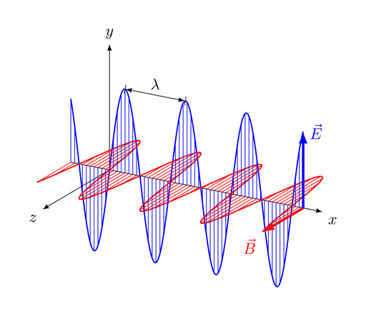
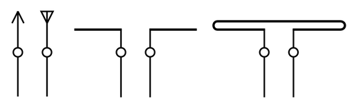
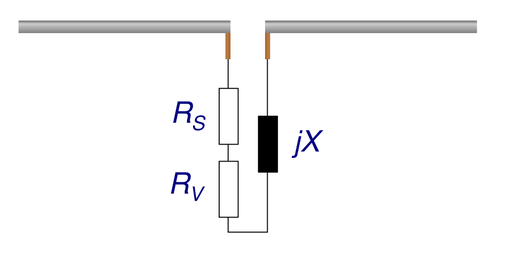

# Antenne

Eine **Antenne** ist eine technische Anordnung zur Abstrahlung und zum Empfang elektromagnetischer Wellen, oft zur drahtlosen Kommunikation. Als Sendeantenne wandelt sie leitungsgebundene elektromagnetische Wellen in Freiraumwellen um, oder umgekehrt als *Empfangsantenne* die als Freiraumwelle ankommenden elektromagnetischen Wellen zurück in leitungsgebundene elektromagnetische Wellen.

Es wird unterschieden zwischen elektrischen Antennen, z. B. eine elektrische Dipolantenne, die die elektrische Komponente zur Erzeugung und Empfang der elektromagnetischen Feldes nutzt, und Magnetantennen, z. B. einem magnetischen Schlitzdipol, primär die magnetische Komponente zum Empfang und bei manchen Typen auch zum Senden der elektromagnetischen Wellen verwendet wird. Im Fernfeld einer Antenne ist nicht zu unterscheiden, ob eine Antenne die elektrische oder magnetische Komponente zur Erzeugung der elektromagnetischen Felder nutzt.

Die Entfernung, ab wann sich bei einer Antenne mit einem Reflektor oder einem Antennen-Array das Fernfeld und damit das Antennendiagramm und der Antennengewinn ausbildet hat, hängt sowohl von der Wellenlänge λ [m] als auch von den physikalischen Abmessungen der Antenne, des Reflektors, sowie des gesamten Antennen-Arrays ab. Der notwendige Abstand bis sich eine kleine Empfangsantenne im Fernfeld der Sendeantenne befindet und umgekehrt, errechnet sich folgendermaßen:

Dabei sind dBreite [m] die maximale physische Abmessung der Antenne und λ [m] die Wellenlänge.

Bei, im Vergleich zur Wellenlänge physikalisch kleinen Antennen bildet sich das Fernfeld schon in kleinen Entfernungen aus. So beginnt das Fernfeld bei einem horizontal polarisierten λ/2-Dipol mit einer Breite von 1,3875 m und einer Wellenlänge von λ = 2,775 m (entspricht 108.100 MHz der tiefsten definierten ILS-LLZ Frequenz) schon ab 1,3875 m. Zum Beispiel beim Antennen-Array des Landekurssenders eines Instrumentenlandesystems (engl. Instrument Landing system Localizer, ILS-LLZ), das aus 12 Dipolantennen-Elementen vor einer ca. 27 m breiten Reflektorwand besteht (Antennentypen: *SEL 12+3* oder *Thales-ILS-4000*) ist bei der gleichen Wellenlänge λ = 2,775 m schon ein Mindestabstand von dfarfield ≥ 526 m nötig, damit sich die Empfangsantenne eines Luftfahrzeuges im Fernfeld befindet. Bei noch breiteren ILS-LLZ-Antennen-Arrays, z. B. mit 20 Dipol-Antennen-Elementen vor einer 49 m breiten Reflektorwand (Typ SEL 20+5 Antenne, ILS-4000) ist der notwendige Mindestabstand schon auf dfarfield ≥1730 m angewachsen, und wächst bei einer weiteren Verbreiterung des ILS-LLZ-Antennen-Arrays auf 75 m mit 32 LPD-Antennen-Elementen (Normac 7000 Ultra-Wide ILS-LLZ-Antennen-Arrays) auf dfarfield ≥ 4054 m an.

Wesentlich für die Funktion einer Antenne ist die Transformation des Wellenwiderstandes der Leitung durch die Antennenanordnung in den Wellenwiderstand des Vakuums. Dabei entsteht wie zuvor beschrieben die elektromagnetische Freiraumwelle erst im Fernfeld. Anordnungen für Frequenzen unterhalb der Schumann-Resonanzen von etwa 16 Hz können aufgrund der großen Wellenlänge von ca. 18.750.000 m auf der Erde keine Freiraumwelle erzeugen.

Die Baugröße von einfachen Antennen liegt für den besten Wirkungsgrad in der Regel in der Größenordnung von ca. einem Viertel der Wellenlänge λ (griechisch: *Lambda*) bei vertikalen Monopol-Antennen auf einer ausreichend großen Reflektorfläche, und mindestens in der Größenordnung der halben Wellenlänge für symmetrische Antennen, z. B. Dipol-Antennen. Durch technische Maßnahmen, z. B. physikalisch sehr dicke Antennen, Endkapazitäten oder Induktivitäten, können auf Kosten des Wirkungsgrads der Antenne die mechanischen Abmessungen innerhalb gewisser Grenzen stark verringert werden. Davon wird vor allem bei sehr niedrigen Frequenzen Gebrauch gemacht, wenn aufgrund der zunehmend größer werdenden Wellenlängen die notwendigen Abmessungen, wenn überhaupt, nicht realisierbar sind. So würde z. B. für einen VLF-Sender (englisch *very low frequency*, dt. Längstwellensender) ein 1/4 λ Strahler von 4360 m Länge benötigt, während jedoch die reale Länge der Antenne des VLF Maschinensenders Grimeton auf 17,2 kHz die an 127 m hohen Türmen an Auslegern angehängt ist nur 2,2 km beträgt. Im 1,5 THz-Frequenzbereich (entspricht 1.500 GHz bzw. 1.500.000 MHz) entspricht 1/2 λ einer Länge von lediglich 1 mm.

Sofern von einer Antenne ein höherer Antennengewinn, eine hohe Richtwirkung oder ein bestimmtes Strahlungsdiagramm benötigt wird, und es können diese Eigenschaften nicht mit einfachen Monopol- oder Dipol-Antenne Strahler erzeugt werden, dann müssen mehrere Richt-Antennen, z. B. Yagi oder Logarithmisch-Periodische-Dipolantenne (LPD) zu einer Phased-Array-Antenne (dt. Gruppenantenne) zusammengeschaltet werden. Alternativ können ggf. die gewünschten Eigenschaften der Antenne durch Reflektoren, z. B. winkel- oder parabolförmige Reflektoren, realisiert werden. Mit zunehmendem Antennengewinn und der damit verbundenen stärkeren Bündelung der Strahlung wird das horizontale und vertikale Strahlungsdiagramm der Hauptkeule schmäler. Jedoch nimmt dabei auch die Stärke der Nebenkeulen des Antennendiagramms zu. Je nach Antennentyp werden dann die mechanischen Abmessungen der Antenne, d. h. Breite, Höhe und/oder Tiefe größer.

## Geschichte

Antennen aus gestreckten Drähten gehen zurück auf den Physiker Heinrich Hertz, der mit seinen Versuchen die theoretischen Vorhersagen des Physikers James Clerk Maxwell aus dem Jahr 1865 überprüfen wollte. Am 11. November 1886 gelang ihm der erste experimentelle Nachweis der Übertragung elektromagnetischer Wellen von einem Sender (Hertzscher Dipol, Hertzscher Oszillator) zu einer Empfangsantenne. Die verwendete Wellenlänge lag mit etwa 2 m im heutigen UKW-Bereich.

Im Jahre 1893 begann Nikola Tesla Experimente mit verschiedenen einfachen Oszillatoren wie Funkenstrecken und konnte Ende 1896 zwischen einer Sendestation in New York und einer 30 Kilometer entfernten Empfangsstation auf zwei Megahertz gute Fernübertragungsergebnisse erzielen. Am 2. September 1897 meldete er zwei Patente (Nr. 649.621 und 645.576) zur drahtlosen Energieübertragung an.

Guglielmo Marconi stellte am 10. Mai 1897 sein Verfahren der Öffentlichkeit vor und sendete Signale über den Bristolkanal. Im Oktober 1897 betrug die Distanz 15 km. Auf Marconi geht auch der Begriff „Antenne“ zurück, der gegen Anfang des 20. Jahrhunderts von den meisten europäischen Sprachen übernommen wurde. Als *antenna* bezeichnete er indes zunächst nur Funkempfänger (erstmals 1895), erst in späteren Schriften dann auch Sendeanlagen. Das Wort „antenna“ bedeutete ursprünglich „Segelstange“ (Rah), war aber auch als zoologische Bezeichnung für die Fühler von Insekten, Spinnentieren oder Schnecken in Gebrauch. Das *Etymologische Wörterbuch der deutschen Sprache* hält daher sowohl eine Ableitung von der Form (Stange) als auch von der Funktion (informationsaufnehmendes Instrument) für möglich. Der Linguist Jost Trier hat in zwei Fachaufsätzen die These vertreten, dass hier die Analogie zur Zoologie, also zu den mit zahlreichen Rezeptoren ausgestatteten tierischen Fühlern entscheidend war.

Mit einer Drachenantenne in 100 m Höhe überbrückte Marconi 1901 als Erster den Atlantik von Irland nach Neufundland. Marconi erhielt 1909 neben Ferdinand Braun den Nobelpreis in Physik für die Entwicklung der drahtlosen Telegraphie. Nach ihm ist die Marconi-Antenne benannt.

Der Erste Weltkrieg markiert 1914 den eigentlichen Beginn der Antennentechnik. Man benutzte zunächst Rahmenantennen als Empfänger, um 1920 folgten Antennenarrays (s. u.), später Hornstrahler und Parabolantennen.

## Prinzip

Ganz allgemein kann man Antennen als Koppelelemente zwischen geführten und ungeführten elektromagnetischen Wellen, d. h. als Wandler zwischen Leitungs- und Freiraumwellen, auffassen. Quelle ist immer ein elektrischer oder magnetischer Dipol. Durch eine (Raum-)Transformation im Nahbereich, bei der die Richtungen der Felder (innerhalb der Fortpflanzungsgeschwindigkeit) gedreht werden, entsteht im Fernbereich die gelöste Wellenfront einer elektromagnetischen Welle.

Elektromagnetische Wellen bestehen aus polarisierten elektrischen und magnetischen Feldern, die sich durch Kopplung wechselseitig erzeugen und im Vakuum ohne Verluste als Transversalwellen räumlich ausbreiten. Bei vorgegebenen Randbedingungen liefern die Maxwellschen Gleichungen eine exakte Beschreibung. In der Praxis berechnet man die Abstrahlung der Energie analytisch durch Modelle oder mit numerischen Näherungsverfahren.

Eine Antenne erzeugt immer sowohl elektrische als auch magnetische Felder. Die Grafik erläutert am Beispiel einer resonanten Dipolantenne, wie aus einem Schwingkreis aus Kondensator und Spule (Start der Animation) durch räumliche Erweiterung (ausklappen der Stäbe, bzw. Erzeugung der Raumtransformation durch 90°-Drehung des elektrischen Feldes) eine Antenne entsteht: Die Leiterstäbe werden dabei je um ±90° nach außen gedreht und zwischen den Stäben wirken elektrische Felder (blau gezeichnet); längs der Leiterstäbe wirken magnetische Felder (rot als Kreis gezeichnet). Die Felder breiten sich nicht unendlich schnell, sondern mit Lichtgeschwindigkeit aus und innerhalb dieses sog. „Informationsdurchmessers“ mit v ≤ c sind die Felder über Ursache und Wirkung gekoppelt (Durchmesser der Kugel: λ/2). Wird die Antenne resonant angeregt, bilden sich geschlossene Feldlinien; das sich ändernde elektrische Feld erzeugt zugehörige magnetische Feldlinien, das sich ändernde magnetische Feld erzeugt zugehörige elektrische Feldlinien. Im Nahbereich der Antenne bildet sich ein Blindfeld, d. h., die Ausbreitung der Felder geschieht von der Quelle weg und wieder zurück. Das sich ausbreitende Feld verliert am Randbereich die Kopplung an die Antenne, wenn sich die Richtung der Feldvektoren umkehrt. Die Felder werden durch die Umkehr abgestoßen und können nicht mehr zurück zur Antenne. Eine elektromagnetische Welle wird in den Raum abgestrahlt. Außerhalb des „Informationsdurchmessers“ (Fernfeld) gibt es keine Kopplung an die Antenne mehr, da die Lichtgeschwindigkeit für die Übertragung von Informationen nicht überschritten werden kann.

Die technische Erzeugung der elektromagnetischen Wellen erfolgt mit einer elektrischen oder einer magnetischen Feldquelle aus einem speisenden Wechselfeld bzw. Wechselstrom.
Dementsprechend gibt es als elementares Grundelement (d. h. Länge < λ/10) zur Felderzeugung nur:

- den elektrischen Dipol (Stabform), sowie
- den magnetischen Dipol (Schleifenform).

Diese werden auch als Grund-Feldelemente bei der numerischen Feldberechnung (Momenten-Methode oder Finite-Elemente-Methode) verwendet.
Alle anderen Antennenformen lassen sich auf diese beiden Grundelemente zurückführen.

Räumlich kann man Antennenformen unterscheiden durch ihre Strahlungslänge in Vielfachen oder Bruchteilen der Wellenlänge λ (griechischer Buchstabe Lambda):

- Länge < λ/10 (Annäherung: linear)
- Länge ≤ λ/2 (Annäherung: sinus- bzw. bei anderem Bezugspunkt cosinusförmig)
- Länge > λ/2 (Annäherung mit Wanderwelle, d. h. ohne Reflexionen: konstant, Annäherung mit stehender Welle, d. h. mit Reflexionen: nichtlinear)

- Zur ersten Kategorie gehören der Elementarstrahler und die verkürzten Antennen.
- Zur zweiten Kategorie gehört der λ/4-Strahler.
- Zur dritten Kategorie ohne Reflexionen bzw. Resonanzen (aperiodische Antennen) gehören die meisten Breitbandantennen, die Hornantenne, alle abgeschlossenen Antennen (Rhombusantenne), große Wendelantenne u. a.
- Zur dritten Kategorie mit Reflexionen bzw. Resonanzen (periodische Antennen) gehören die Yagi-Antennen (mit Reflexionen durch Direktor bzw. Reflektor), die Gruppenstrahler, Backfire-Antenne, die V-Antenne (Rhombusantenne ohne Abschluss), die logarithmisch-periodische-Antenne, u. a.

Entsprechend der o. a. Grundelemente gibt es:

- Antennen, die primär elektrische Felder erzeugen, d. h., sich in Mini-Stäbe zerlegen lassen z. B. ein elektrischer Dipol, und
- Antennen, die primär magnetische Felder erzeugen, d. h., sich in Mini-Schleifen zerlegen lassen, z. B. eine Leiterschleife (magnetischer Dipol).

Im Nahfeld sind jedoch zwischen beiden Antennentypen die Felder reziprok vertauschbar (Babinetsches Prinzip):

- D. h., bei einem elektrischen Dipol verhält sich sein elektrisches Feld wie das magnetische Feld von einem magnetischen Dipol
- und umgekehrt bei einem magnetischen Dipol verhält sich dessen elektrisches Feld wie das magnetische Feld eines elektrischen Dipols (Felder vertauscht).

Im Nahfeld ist noch Blindleistung im Raum gespeichert.
Im Fernfeld haben sich elektrisches und magnetisches Feld miteinander verkoppelt (Verhältnis von elektrischer zu magnetischer Feldstärke entspricht dem Wellenwiderstand des Vakuums, d. h.: E/H = Z0), d. h., es ist dort nicht mehr rückführbar (bzw. unterscheidbar), ob die Feldquelle elektrisch oder magnetisch war und Wirkleistung wandert mit der Welle.

Grundsätzlich wird nach Erzeugung des Wechselstroms im Sender die Sendeleistung über eine Speiseleitung (E/H-Verhältnis der Leitung ist zum Beispiel ca. 50 Ω bei einem Koaxialkabel) an das Antennengebilde abgegeben. Bei der Antenne ist die Impedanz zunächst in etwa physikalisch vorgegeben. So wird ein λ/4-Strahler etwa 36 Ω als E/H-Verhältnis haben. Man versucht, den Blindwiderstandsanteil zu reduzieren (Resonanz) und den Fußpunktwiderstand des Antennengebildes möglichst an die Leitung anzupassen. Wenn das Anpassverhältnis sehr von 1 abweicht, werden Leitungstransformatoren zur Anpassung eingesetzt, welche immer Zusatzverluste haben.
Beispiele:
Kabelimpedanz: Z = 50 Ω, Leitungstransformator: Rv = 2 Ω (Wirbelstromverluste)

- Länge/Lambda = 1/10, Rs = 4 Ω → Wirkungsgrad: 4/(2 + 4) = 67 %
- Länge/Lambda = 1/4, Rs = 36,6 Ω → Wirkungsgrad: 36,6/(2 + 36,6) = 95 %

Antennen, die deutlich kürzer sind als ein Zehntel der Wellenlänge, haben zwar theoretisch dieselbe Feldankopplung an den Raum wie die längeren Antennen mit λ/2, nur praktisch sind bei ersteren die Verluste größer.

### Unterscheidung elektrischer und magnetischer Antenne

Als Bezugspunkt gilt der Feldwellenwiderstand im freien Raum von etwa 377 Ω. E-Feldantennen haben ein überwiegend kapazitives Nahfeld, H-Feldantennen haben ein überwiegend induktives Nahfeld.

### Reziprozität

Reziprozität oder Umkehrbarkeit ist gegeben, wenn in einer Anordnung Ursache und Wirkung miteinander vertauscht werden können, ohne dass sich die charakteristischen Verhältnisse ändern. Antennen sind theoretisch reziprok, können also mit gleichen charakteristischen Eigenschaften sowohl zum Senden als auch zum Empfangen verwendet werden. Das bedeutet, dass einige typische Begriffe für Sendeantennen, zum Beispiel die „Ausleuchtung“ oder der „Überstrahlungsfaktor“ von Reflektoren, auch für reine Empfangsantennen genutzt werden können, da sie für den Empfangsfall einen vergleichbaren Einfluss haben (wie in diesem Beispiel auf die effektive Antennenwirkfläche der Antenne oder das Vor-Rück-Verhältnis). So wird das aktive Element einer Antenne unabhängig davon, ob es als Sendeantenne oder Empfangsantenne genutzt wird, „Strahler“ genannt.

In der Praxis ist die Sendeleistung einer Antenne begrenzt durch Funkenüberschläge, thermische Verluste sowie durch Nichtlinearitäten von Ferriten der eventuell vorhandenen Schwingkreise und Übertrager.

Empfangsantennen werden an die Impedanz des Kabels und den Verstärker leistungsangepasst, Sendeantennen werden an die Impedanz des Kabels angepasst, der Sender hat jedoch, um hohe Effizienz zu erreichen, eine möglichst kleine Quellimpedanz.

Im Zusammenhang mit breitbandigen Signalen (UWB) ist zu beachten, dass Reziprozität nicht bedeutet, dass ein Empfänger mit einer gleichartigen (Breitband)-Antenne wie der Sender eine getreue Kopie des Sendesignals gewinnt.

In der Praxis gilt die Reziprozität nur begrenzt. Eine Antenne, die für den Empfang ausgelegt ist, wird evtl. beschädigt, wenn sie die hohen elektrischen Leistungen einer Sendeanlage abstrahlen soll. Als Sendeantennen sind auch solche Empfangsantennen ungeeignet, deren nichtlineare Elemente wie beispielsweise Ferrite nicht entsprechend ausgelegt sind.

Der Reziprozität widerspricht scheinbar, dass unterhalb von etwa 30 MHz der Wirkungsgrad der Empfangsantenne weniger wichtig ist als der der Sendeantenne. Ursache sind die Rauschtemperatur der Atmosphäre und Störungen durch elektrische Geräte und Gewitter. Diese dominieren auf niedrigen Frequenzen auch bei Empfangsantennen mit sehr schlechtem Wirkungsgrad das Eigenrauschen des Verstärkers. Vorteile bieten große Empfangsantennen auf Grund ihrer Richtwirkung, mit der sie Störungen aus anderen Richtungen ausblenden. Ein typisches Beispiel für eine reine Empfangsantenne mit sehr schlechtem Wirkungsgrad ist die Beverage-Antenne.

### Antennenparameter

Antennen werden durch verschiedene Parameter und Begriffe charakterisiert. Einige der Begriffe entstehen aus der Theorie durch Vereinfachungen.

Folgende Vereinfachungen sind üblich:

- quasioptische Verhältnisse (Fernfeld: Transversalwellen)
- linearer Stromverlauf (Länge < λ/10) oder
- sinusförmiger Stromverlauf (Länge: Vielfaches von λ/4 bzw. λ/2)
- nichtlinearer Stromverlauf (Reflexionsstellen mit Phasenverschiebungen: Länge > λ/4).

Wenn Reflexionsstellen mit Phasenverschiebungen entstehen (Länge > λ/4) werden analytische Berechnungen meist zu kompliziert und stattdessen werden Kennwerte durch Simulation (Finite-Elemente-Modelle) bestimmt und durch Messung verifiziert (Verkürzungsfaktor, Strahlungswiderstand, Bandbreite, Nah- bzw. Fernbereich).

#### Polarisation

Antennen strahlen polarisierte Wellen ab. Als Polarisationsebene wurde die Richtung des elektrischen Feldvektors gewählt. So schwingt bei vertikaler Polarisation der elektrische Feldvektor zwischen oben und unten, bei horizontaler Polarisation zwischen links und rechts. Empfangs- und Sendeantenne sollen in ihrer Polarisation übereinstimmen, andernfalls wird die Signalübertragung stark gedämpft.

Das kann mit zirkular polarisierter Strahlung umgangen werden: Änderungen der Polarisationsebene wie bei rotierenden Satelliten werden dadurch vermieden, da der elektrische Feldvektor nicht in einer Ebene schwingt, sondern rotiert. Zirkular polarisierte Signale kehren ihre Drehrichtung allerdings bei Reflexion um. Man erzeugt sie z. B. mit Kreuzdipolen, wobei horizontal und vertikal polarisierte Wellen gleicher Phasenlage überlagert werden. Bei 90° Phasenverschiebung zwischen der horizontal und der vertikal polarisierten Welle spricht man von *zirkularer Polarisation*. Je nach Phasenfolge spricht man von *rechtszirkularer* oder *linkszirkularer* Polarisation. Sind die beiden Komponenten unterschiedlich stark, entsteht eine *elliptische Polarisation*.

Eine verbreitete Antenne zur Erzeugung zirkular polarisierter Wellen ist die Wendelantenne.

#### Fußpunktwiderstand

Wenn bei Resonanz der Blindwiderstand *jX* einer Antenne verschwindet, ist der Fußpunktwiderstand (oder *Eingangswiderstand*) einer Antenne reellwertig und ergibt sich rechnerisch aus der zugeführten Leistung *P* und dem Strom *I*, der an den Anschlussklemmen gemessen werden kann. Meist wird er zerlegt in die Summe aus Verlustwiderstand und Strahlungswiderstand.

Der Verlustwiderstand enthält Beiträge wie den ohmschen Widerstand der Leitungsdrähte, zusätzlich den Skin-Effekt des Leiters, Verluste im Anpassnetzwerk und bei einer unsymmetrischen Antenne (wie der Groundplane-Antenne) den Erdungswiderstand (zusammengefasste Verluste der spiegelnden Antennenebene).

Nach Art der verwendeten Kabel nutzt man Antennen mit möglichst passendem Fußpunktwiderstand.
Daher gilt:

- In der Unterhaltungselektronik (z. B. für den terrestrischen Fernsehempfang) sind die Antennen für eine Impedanz von 75 Ω ausgelegt.
- Antennen für mobile Funkgeräte haben Fußpunktwiderstände von ca. 50 Ω und niedriger. Die Impedanzen von Sendern haben dort 50 Ω.
- Der Fußpunktwiderstand eines endgespeisten Dipols liegt bei 2200 Ω.

Um den Fußpunktwiderstand der Antenne auf die Impedanz des Kabels anzupassen und so das Stehwellenverhältnis möglichst nahe bei dem Wert 1 zu halten, werden Impedanzwandler oder Resonanztransformatoren eingesetzt.

#### Strahlungswiderstand

→ *Hauptartikel: Strahlungswiderstand*

Der Strahlungswiderstand  beschreibt den Zusammenhang zwischen dem Antennenstrom *I* an den Anschlussklemmen und der abgestrahlten Leistung :

Der Strahlungswiderstand ist die wichtigste Kenngröße einer Antenne, da er direkt proportional der Strahlungsleistung ist, d. h. der Größe, welche beim Abstrahlen genutzt wird.

#### Wirkungsgrad

Bei exakter Anpassung sollte im Idealfall die einer Antenne zugeführte Energie auch vollständig abgestrahlt werden. Dieser Idealfall wird nie erreicht: Ein Teil der zugeführten Energie wird als Verlustleistung in Wärme umgewandelt. Das Verhältnis von abgestrahlter Leistung zur zugeführten Wirkleistung wird als Wirkungsgrad einer Antenne  bezeichnet:

Da die Leistungen bei konstantem Speisestrom proportional zu den entsprechenden Widerständen gesetzt werden können, kann für den Resonanzfall () folgende Beziehung gesetzt werden:

Nicht abgestimmte Langdrahtantennen erreichen selten mehr als 1 % Wirkungsgrad. Die Parabolantenne liegt meistens über 50 %, der Hornstrahler bei 80 % und mehr.

Der Wirkungsgrad hängt auch davon ab, wie ungestört sich das Fernfeld ausbilden kann:

- Frequenzen über 30 MHz strahlen meist in den Freiraum und die entstehenden Wellen sind i. A. weit genug vom Erdboden entfernt, um sich als Abstrahlung davon zu lösen. Die Kugelwelle von horizontalen- und vertikalen Antennen dringt kaum in den Erdboden ein und wird durch Erdverluste wenig reduziert. Die Ausbreitungsbedingungen der Welle sind dann quasioptisch.
- Frequenzen unter 30 MHz erzeugen Kugelwellen mit großer Wellenlänge, was zu immensen Antennenkonstruktionen führt. Die Erdverluste nehmen zu den niedrigen Frequenzen hin immer mehr zu, der Wirkungsgrad der Antennen nimmt immer mehr ab, es werden immer höhere Sendeleistungen benötigt, um die Verluste auszugleichen. Hier gelten nicht die optischen Gesetze. Leitende Gebilde im Nahbereich der Antenne (geerdete Starkstromleitungen, Blitzschutzgerippe in Gebäuden) sind schwer zu vermeiden und absorbieren Energie. Horizontale Antennen haben bei gleichem Abstand vom Erdboden wie Vertikalantennen größere Erdverluste. Um bei 5 MHz mit einer üblichen Antenne dieselbe Strahlungsleistung zu erzeugen wie bei 50 MHz, braucht man ein Vielfaches der Sendeleistung. Vertikale Antennen brauchen ein gut leitendes Erdnetz, um effektiv abzustrahlen, deshalb befinden sich Langwellensender an Flussläufen und Mooren. Bei horizontalen Antennen mit geringem Erdabstand (h < 3/4 λ) wird der Strahlungswiderstand durch Wirbelströme des Erdbereichs reduziert. Es wird mehr Einspeiseleistung als bei Vertikalantennen benötigt (bei gleicher Leistung in der Kugel). Der Wirkungsgrad (das Verhältnis von abgestrahlter zu eingespeister Leistung) ist bei vertikalen Antennen besser. Die horizontal eingespeiste Welle löst sich aber besser vom Erdboden (je weiter vom Erdboden, desto besser). Größere Reichweiten werden mit horizontalen Antennen erreicht.

#### Richtfaktor und Antennengewinn

→ *Hauptartikel: Antennengewinn*

Keine Antenne strahlt gleichmäßig in alle Richtungen. Der Richtfaktor *D* ist das Verhältnis der in Vorzugsrichtung gemessenen Strahlungsintensität zum Mittelwert über alle Richtungen. *D* = 1 entspricht dem als Bezugsantenne verwendeten nicht realisierbaren Isotropstrahler. Der Antennengewinn *G* verwendet im Nenner statt der mittleren Strahlungsintensität die gespeiste Sendeleistung geteilt durch den vollen Raumwinkel (4π). Er berücksichtigt also zusätzlich noch den Wirkungsgrad der Antenne: . Da es einfacher ist, die eingespeiste Energie zu messen, als in allen Richtungen die Strahlungsintensität, wird meist nur der Antennengewinn gemessen und in den Datenblättern kommerzieller Antennen genannt. Beide Größen sind relative Zahlenangaben und werden meist in Dezibel angegeben. Weil aber unterschiedliche Vergleichsantennen zugrunde liegen können, wird der Antennengewinn entweder in dBd, mit dem Bezug der Dipolantenne, oder in dBi mit dem Bezug des Isotropstrahlers, angegeben.

Das Antennendiagramm einer Antenne stellt die Winkelabhängigkeit der Abstrahlung bzw. der Empfangsempfindlichkeit für eine bestimmte Frequenz und Polarisation grafisch dar. Eine verallgemeinerte Form des Antennendiagramms wird auch als Richtcharakteristik bezeichnet. Die in der Praxis gemessenen stark ausgefransten und zerklüfteten Antennendiagramme werden hier einer geometrischen oder theoretisch berechneten Grundform angenähert (z. B. eine Achtercharakteristik für den Dipol oder die Cosecans²-Charakteristik einer Radarantenne).

#### Absorptionsfläche (Wirkfläche)

→ *Hauptartikel: Antennenwirkfläche*

Eine Empfangsantenne entnimmt einer ebenen Welle Energie. Die Strahlungsdichte der Welle ist eine Leistung pro Flächeneinheit. Der empfangenen Leistung kann eine Fläche zugeordnet werden, die effektive Absorptionsfläche *A*W oder Wirkfläche. Für einen *Aperturstrahler* (s. u.) ist die Wirkfläche typischerweise etwas kleiner als die geometrische Fläche *A*. So beträgt (bei 100 % Wirkungsgrad, s. o.) die Wirkfläche eines rechteckigen Hornstrahlers mit den Abmessungen *a* und *b*

Die Absorptionsfläche eines λ/2-Dipols beträgt

Die Wirkfläche ist per definitionem proportional zum Gewinn *G*:

#### Antennenfaktor, Wirksame Antennenlänge (bzw. Effektive Antennenhöhe bei Vertikalantennen)

→ *Hauptartikel: Antennenfaktor*

Der Antennenfaktor AF einer Mess-Antenne ist das (grundsätzlich frequenzabhängige) Verhältnis der elektrischen Feldstärke E der einfallenden Welle zur Ausgangsspannung U der Antenne:

und wird auch als Wandlungsfaktor bezeichnet. Er entspricht nicht dem Kehrwert der Wirksamen Antennenlänge bzw. Effektiven Antennenhöhe, da Messkomponenten im AF mit einbezogen werden und die Effektive Antennenhöhe auch für die Berechnung des Strahlungswiderstands von Sendeantennen benötigt wird. Einheit 1/m. Üblicherweise wird der Antennenfaktor logarithmiert in dB angegeben und als Wandlungsmaß bezeichnet:

:   .

#### Nahbereich und Fernbereich

→ *Hauptartikel: Nahfeld und Fernfeld (Antennen)*

Im Nahbereich erzeugt der elektrische oder magnetische Dipol eine Feldverteilung, bei der ein Großteil der Energie immer wieder in die Antenne zurückfällt. Ab einem bestimmten Abstand schnürt sich die Feldverteilung ab und eine elektromagnetische Welle breitet sich räumlich aus. Dieser Bereich ist als Fernfeld definiert. Eine scharfe Abgrenzung gegen den Nahbereich ist nicht möglich. Eine Voraussetzung für die sich selbstständig fortbewegende Welle ist, dass die Phasenverschiebung zwischen elektrischem und magnetischen Feld verschwindet, während sie in Antennennähe 90° beträgt. Über die Phase lassen sich dadurch Nahbereich, Fernbereich und Übergangsbereich definieren.

#### Bandbreite

Grundsätzlich muss unterschieden werden zwischen:

- resonanten Schmalbandantennen und
- nicht resonanten Breitbandantennen.

Die (Einspeise-)Bandbreite einer resonanten (Schmalband-)Antenne hängt von ihrem Belastungswiderstand ab, d. h., bei ±45° Phasenverschiebung sinkt die Güte (steigt die Dämpfung) des gesamten resonanzfähigen Gebildes. Je kleiner der Lastwiderstand, desto größer die Bandbreite, meist auf Kosten des Wirkungsgrades. Bei aktiven (Empfangs-)Antennen (mit FET-Eingangsstufe) kann der Lastwiderstand viel größer ausgelegt werden, um dadurch die Bandbreite des Systems zu vergrößern.

Bei nicht resonanten Breitbandantennen (Resonanz erst außerhalb ihres Nutzfrequenzbereiches) werden Reflexionen vermieden und die eingespeiste Welle (siehe B. mit 50 Ω Leitungsimpedanz) durch Aufweitung der Speiseleitung langsam an den Feldwellenwiderstand (377 Ω) angepasst. Die Grenzen des Frequenzbereiches werden dabei durch die Halbwertsbreite bestimmt. Das ist der Bereich, in dem die abgestrahlte Energie vom Maximalpunkt aus halbiert wird (−3 dB).
Echte Breitbandantennen sind nicht resonant und durch besondere konstruktive Maßnahmen bleiben ihre elektrischen Eigenschaften in einem weiten Frequenzbereich nahezu konstant (Beispiele sind bikonische Antennen, Spiralantennen und logarithmisch-periodische Antennen). Bei der logarithmisch-periodische Antenne (LPDA) wäre der Einzelstrahler zwar (schwach) resonant, durch das Zusammenwirken mit den Nachbarelementen entsteht jedoch die Breitbandigkeit.

#### Höhe der Antenne über Grund

Die mittlere Montagehöhe der Antenne über Grund, als Effektive Antennenhöhe bei Sendeantennen bezeichnet, ansonsten nur Antennenhöhe, bestimmt die Reichweite bis zu einer Empfangsantenne. Wegen der Frequenzabhängigkeit von Dämpfung der Bodenwelle, Interferenz zwischen Bodenwelle und Raumwelle, Abschattung, oder Beugung an der Erdoberfläche, kann in Abhängigkeit von der Montagehöhe die Reichweite optimiert werden. Sie darf nicht mit der Effektiven Antennenhöhe (Wirksame Länge des Strahlers selbst, zur Berechnung des Strahlungswiderstands der Antenne) verwechselt werden.

## Bauformen

Eine Aufzählung von Antennenarten bzw. -bauformen findet sich in der Kategorie Antennenbauformen.

Die Baugröße einer Antenne muss immer in Relation zur halben Wellenlänge betrachtet werden. Ist eine Antenne deutlich kleiner als ein Viertel der Wellenlänge, wird ihr Strahlungswiderstand sehr klein, weshalb ihr Wirkungsgrad gering wird. Je größer eine Antenne im Vergleich zur halben Wellenlänge wird, umso komplexer wird ihr Strahlungsdiagramm, weil Mehrfachreflexionen entstehen und sich überlagern.

Die von den Abmessungen größten Antennen wurden Ende des 19. und Anfang des 20. Jahrhunderts für Langwellensender (Bereich von 30 kHz bis 300 kHz) oder für Funk-Weitverbindungen zur Kommunikation mit U-Booten als Lang- und Längstwellensender genutzt, z. B. der Längstwellensender Goliath zwischen 15 und 60 kHz (1943 bis 1945).

Die Gliederung von Antennenbauformen kann nach vielen Eigenschaften kategorisiert werden. Meist wird sie nach der Geometrie der Antenne vorgenommen, kann aber auch andere Kriterien (z. B. Bandbreite, Richtcharakteristik, Betriebsfrequenz) erfassen.

Der Isotropstrahler oder Punktstrahler existiert zwar physikalisch nicht, da es keine Antenne gibt die in alle Richtungen den gleichen Gewinn besitzt, wird aber als Referenzantenne bzw. Bezugsantenne zur Angabe des Gewinns von Antennen verwendet verwendet.

Elektromagnetische Wellen sind Transversalwellen und benötigen wegen der Polarität als Feldquellen daher Dipole (elektrische oder magnetische).

- Sind die Dimensionen der Antennenkonstruktionen klein im Vergleich zur halben Wellenlänge, verhält sich die Antennenstromverteilung vereinfacht linear.
- Sind die Dimensionen der Antennenkonstruktionen groß im Vergleich zur halben Wellenlänge, wird die Antennenstromverteilung nichtlinear, es entstehen Moden, und die Antennen werden als Flächenantennen bezeichnet.

Andere Unterteilung von Antennen:

- Linearstrahler (s. u.) (lineare Antennen)
- Flächenstrahler (s. u.) (Flächenantennen):
  - Aperturstrahler (s. u.)
  - Reflektorantennen
- Gruppenantennen (s. u.) bestehen aus vielen zusammengeschalteten gleichartigen Antennen.

Nach Anwendung bzw. Montageart können Antennen auch unterschieden werden in:

- Stationsantennen (fest an einem Ort, oft auf einem Mast)
- Mobilantennen (Betrieb in Fahrzeugen, Schiffen oder Flugzeugen)
- Antennen für tragbare Geräte (Handfunkgeräte, Funktelefone, Mobiltelefone, Smartphones).

### Lineare Antennen

Der Begriff *lineare Antennen* bezeichnet Antennen, die eine linienhafte Stromverteilung in der Antennenstruktur aufweisen. In Praxis wird die Linie, diese muss nicht geradlinig verlaufen, als ein gegenüber der Wellenlänge dünner elektrischer Leiter aus einem metallischen Draht oder aus einem metallischen Stab gebildet. Zu den linearen Antennen gehören alle Formen von Langdrahtantennen sowie Dipolantennen und auch Faltdipole.

Die lineare Antenne ist eine der gebräuchlichsten Strahlerformen. Sie wird beispielsweise als Sendemast in Rundfunksendern im Lang- und Mittelwellenbereich, als Drahtantenne im Kurzwellenrundfunk und auf Kurzwelle im Amateurfunk und Schiffsfunk, und als λ/2-Dipol als Strahler in Yagiantennen im VHF- bis UHF-Bereich sowie als λ/4-Dipol in Stabantennen für Kurzwelle bis jenseits des UHF-Bereiches (Funkdienste, Funktelefone, CB-Funk usw.) eingesetzt. Der Strom entlang der Antennenstäbe bzw. -drähte ist bei Längen unter λ/5 nahezu linear, bei Längen darüber sinusförmig verteilt. Es treten an den Enden (und bei längeren Antennen in Abständen der halben Wellenlänge) Stromknoten () und Spannungsbäuche () auf.

Die sinusförmige Stromverteilung auf Dipolantennen-Stäben wird zwar experimentell gut bestätigt, kann aber zur Berechnung des Eingangswiderstandes einer Antenne nicht herangezogen werden, da Strom und Spannung zeitlich nicht ganz um 90° phasenverschoben sind. Die elektrische Impedanz einer Antenne am Speisepunkt sollte jedoch keinen Blindwiderstandsanteil aufweisen, sie ist im Idealfall der äquivalente Serien- oder Parallelwiderstand, der durch die abgestrahlte Wirkleistung und – in geringem Maße – durch die Antennenverluste entsteht. Die Fußpunktimpedanz einer Antenne ist also ein rein ohmscher Widerstand, er sollte gleich der Leitungsimpedanz (Wellenwiderstand) der speisenden Leitung sein. Weicht die Antennen-Fußpunktimpedanz in ihrem Real- oder Imaginärteil davon ab, müssen Anpassglieder (Spulen, Baluns, π-Glieder, Anpassübertrager) eingesetzt werden.

Bei linearen Antennen ist die Länge im Verhältnis zur Wellenlänge *λ* maßgeblich. Die Verteilung der Strommaxima entlang der Strahler-Elemente einer symmetrischen, gestreckten Antenne ist ebenfalls symmetrisch und feststehend.

#### Halbwellendipol

Ist ohne Längenangabe von einer Dipolantenne die Rede, so ist meist ein Halbwellendipol gemeint. Seine Länge ist die Hälfte der Wellenlänge λ. Er wird symmetrisch gespeist. Im Speisepunkt ist er aufgetrennt; dort liegen ein Strommaximum und ein Spannungsminimum, die Impedanz beträgt 73,2 Ω.

Ein Faltdipol entsteht, indem der Stromweg eines Halbwellendipols auf zwei Wege aufgeteilt wird. In nur einem dieser Wege ist er aufgetrennt, dort liegt der Speisepunkt. Durch die induktive bzw. kapazitive Kopplung an den ungespeisten Stab halbiert sich der Speisestrom bei verdoppelter Speisespannung. Durch diese Impedanztransformation (auf jeder Seite ein λ/4-Transformator) vervierfacht sich beim Faltdipol die Impedanz des Speisepunktes auf etwa 240–300 Ohm. Der Vorteil des Faltdipols ist dessen mögliche geerdete Befestigung am Antennenträger sowie früher die Verwendbarkeit preiswerter symmetrischer Speiseleitungen, der sogenannten Bandleitung.

Eine breitbandigere Form ist der Flächendipol, auch er zählt zu den linearen Antennen.

In Fällen, bei denen eine Richtwirkung nicht erwünscht ist, z. B. bei angestrebtem Rundum-Empfang oder -Senden, kann ein Knickdipol eingesetzt werden, bei dem die beiden Strahlerhälften im Winkel von 90° zueinander angeordnet sind. Alternativ werden die Strahlerhälften auch halbkreisförmig gebogen. Diese Bauform wird als Ringdipol bezeichnet.

#### Viertelwellenstrahler

Der Viertelwellenstrahler, auch als Monopolantenne oder Groundplane-Antenne bezeichnet, ergibt gespiegelt einen Halbwellendipol, wobei nur ein Zweig des Halbwellendipols als Antennenstab benötigt wird. Durch eine gut elektrisch leitfähige Oberfläche oder durch mehrere abstehende Stäbe im Antennenfußpunkt entsteht durch Induktionsströme eine (elektrisch messbare) Spiegelung des Antennenstabes. Je besser die Leitfähigkeit der Spiegelfläche, desto besser wird ein „Gegengewicht“ zum Strahler generiert. Bei einem Handfunkgerät mit elektrischem Strahler wirkt der Körper des Benutzers mit seiner (wirksamen, doch nicht optimalen) Leitfähigkeit als Gegengewicht, bei Kfz-Antennen die gut leitende Karosserie und bei Funktelefonen und vielen Funkfernsteuerungen die Leiterplatte bzw. das Gehäuse.

Verwendet wird der Viertelwellendipol als Antenne für Handfunkgeräte und andere mobile Geräte z. B. in Kraftfahrzeugen.
Er ist der kleinste optimale elektrische Strahler, falls eine gute Spiegelfläche existiert. Kleinere Strahler erkaufen sich die Kleinheit mit höheren Verlusten in den Verkürzungselementen und bilden immer einen Kompromiss.

Als **Teleskopantenne** wird eine in mehrere kleinere Abschnitte unterteilte Antenne, die sich stufenförmig verjüngt und teleskopartig ineinandergeschoben werden kann. Dadurch ergibt ein kleineres und somit besser transportfähiges (im nichtaktiven Zustand) Format für eine Empfangsantenne, damit sie je nach Gerät teilweise oder Ganz mit dem Gerätegehäuse abschließt. Alle Antennenabschnitte müssen einen sehr guten elektrischen Kontakt untereinander haben. Verwendet wird eine solche Teleskopantenne oft bei kleinen Taschenradios und tragbaren Funkgeräten. Teleskopantennen können durch Beschaltung des Fußpunktes mit einer zusätzlichen Induktivität elektrisch verkürzt werden.

#### Ganzwellendipol

Setzt man zwei gleichphasig schwingende Halbwellendipole gestreckt aneinander, entsteht ein sogenannter Ganzwellendipol. Am Speisepunkt in der Mitte liegen ein Stromknoten und gegenphasige Spannungsmaxima, so dass die Impedanz hoch ist (> 1 kΩ). Wie beim Viertelwellendipol halbiert sich die Impedanz, wenn die untere Hälfte durch das Spiegelbild der oberen an einer leitenden Fläche gebildet wird. Eine gängige Antennenimpedanz von 240 Ω bildet sich ebenfalls durch Parallelschaltung von vier Ganzwellenstrahlern in einer Gruppenantenne.

#### Verkürzte lineare Antennen

Ist eine lineare elektrische Antenne kürzer als λ/4, hat die Fußpunktimpedanz eine kapazitive Komponente, die zur Anpassung kompensiert werden muss. Das kann durch Einfügen einer Serien-Induktivität (Verlängerungsspule) nahe beim Speisepunkt, eine zur Speisung parallel geschaltete Spule oder eine Dachkapazität am Antennenende erfolgen. Konstruktionen mit Dachkapazität erreichen eine bessere Stromverteilung und erzeugen einen besseren Wirkungsgrad als solche mit Verlängerungsspule. Eine typische Antenne mit Dachkapazität ist die T-Antenne.

Beispiele für Antennen mit Verlängerungsspulen sind die sogenannten Gummiwurst-Antennen an Handfunkgeräten, CB-Funk-Antennen mit Längen < 3 m und fast alle Antennen in Funkfernsteuerungen unterhalb des 433-MHz-ISM-Bandes (λ/4 = 18 cm).

Unterhalb von etwa 100 MHz ist der Wirkungsgrad einer Antenne nur für Sender wirklich wichtig. Bei reinen Empfangsantennen ist die entscheidende Frage, ob das gesamte Empfangssystem einen ausreichenden Signal-Stör-Abstand erreicht. Bei Antennen ohne starke Richtwirkung dominieren Umgebungsstörungen und das sogenannte atmosphärische Rauschen, nicht aber das Rauschen der Empfänger-Eingangsstufen. In diesem Fall sinken mit dem Wirkungsgrad sowohl das Signal als auch der Störpegel, das Verhältnis bleibt gleich.

Im Mittelwellenbereich sind elektrische Empfangsantennen und ihre Antennenkabel klein gegen die Wellenlänge. Ihre Impedanz am Speisepunkt ist deshalb nahezu kapazitiv. Deshalb verwendete man früher bei hochwertigen Empfängern – vor allem bei Autoradios – diese Kapazität als Kondensator des Eingangskreises. Die Abstimmung erfolgte dabei mit der veränderlichen Induktivität (Variometer) dieses Kreises.

Heute sind die üblichen Autoradio-Antennen in aller Regel *aktive Antennen*, d. h., sie bestehen aus einem kurzen Stab und einem Verstärker mit hochohmigem, kapazitätsarmem Eingang. Die früher üblichen ausziehbaren Antennen sind in Neufahrzeugen kaum noch zu finden. Im Prinzip reicht als Verstärker ein Impedanzwandler wie ein als Sourcefolger beschalteter Feldeffekttransistor. Da eine solche Antenne aber sehr breitbandig ist, muss man das Großsignalverhalten mit erhöhtem Aufwand verbessern.

#### Langdrahtantenne

Bei einer Langdrahtantenne übersteigt die Drahtlänge die halbe Wellenlänge *λ* wesentlich. Die unter diesem Begriff zusammengefassten Antennenbauformen sind alle horizontal polarisiert und unterscheiden sich hauptsächlich durch die Art der Speisung und die Form der Verlegung des Strahlers. Mit zunehmender Länge nähert sich die Hauptstrahlrichtung der Antennenlängsrichtung symmetrisch an. Wird das von der Speisung entferntere Leiterende mit einem Abschlusswiderstand gegen Erde versehen, dann kann sich auf der Antenne keine stehende Welle ausbilden. Man spricht in diesem Fall von einer aperiodischen Antenne, die durch die auf dem Leiter entlanglaufende Wanderwelle ein besseres Vor-Rück-Verhältnis erhält.

Solche langen Antennen haben, besonders bei niedriger Aufhängung (Höhe der Antenne über Grund), einen sehr schlechten Wirkungsgrad. Sie werden aber häufig als Richtantennen für Empfangszwecke (Beverage-Antenne) genutzt.

### Flächenantennen

Der Begriff **Flächenantennen** (oder Flächenstrahler) bezeichnet Antennen, die im Gegensatz zu den linearen Antennen eine leitungsgeführte Welle an einer *Flächenausdehnung*, beispielsweise eine Öffnung in einem Hohlleitersystem, in Freiraumwellen umwandeln und umgekehrt. Flächenstrahler werden bei Frequenzen oberhalb von etwa 1 GHz als Richtstrahler eingesetzt. Ein technisch einfaches Beispiel ist der Rechteckhornstrahler, bei dem ein Rechteckhohlleiter aufgeweitet wird, bis die Öffnung in ihren Abmessungen groß gegenüber der Wellenlänge λ ist.

#### Aperturstrahler

Aperturstrahler sind Antennen, die über eine strahlende Öffnung (Apertur) elektromagnetische Energie abstrahlen oder aufnehmen. Je größer die Öffnung im Verhältnis zur Wellenlänge, desto stärker die Bündelung der Strahlung entsprechend dem Rayleigh-Kriterium. Aperturstrahler haben meistens die Form eines Hohlleiters, der sich allmählich zum Horn aufweitet. Dadurch bleibt die Feldverteilung der eingespeisten Welle weitgehend erhalten und der Übergang in den Freiraum ist nahezu reflexionsfrei.

#### Reflektorantennen

Im einfachsten Fall kann ein Reflektor aus einem einzelnen Antennenelement bestehen der die Abstrahlung im Backbeam (dt. Rückrichtung) minimiert und damit die Richtwirkung in der Hauptstrahlrichtung bzw. den Gewinn vergrößert, z. B. Yagi-Antenne.

Wird die Reflektionsfläche vergrößert, z. B. durch mehrere parallel zueinander angeordnete Antennenstäbe, durch ein Gitternetz mit im Verhältnis zur Wellenlänge kleinen Öffnungen Löchern (max. Größe von etwa 1/10 λ) oder eine metallisch Leitende Fläche mit oder ohne Löcher gebildet, kann die Abstrahlung im Backbeam und die Abstrahlung in Hauptstrahlrichtung signifikant vergrößert werden.

Der Vorteil von aus Antennenstäben, Gitternetzen oder gelochten Reflektionsflächen ist sowohl die Reduzierung der Windlast als auch des Gewichts, was besonders bei sehr großen drehenden Radarantennen, z. B. beim SRE-M-Radar notwendig ist. Sowohl die Form der Reflektionsfläche als auch die Präzision darf nur geringe Abweichungen aufweisen.

Anstelle eines parabolförmigen Spiegels kann im Prinzip auch ein beliebiger Teil des Paraboloiden genutzt werden. So benutzen viele Antennen für den Fernsehsatelliten-Empfang sogenannte Offsetantennen, bei denen der Brennpunkt nicht in der Symmetrieachse liegt, sondern daneben.

Durch Verwendung von Parabol-Antennen kann die Abstrahlung im Backbeam um mehr als 20 dB und die Abstrahlung in Hauptstrahlrichtung bis auf weit über 40 dB erhöht werden.

Sofern Reflektorflächen von mindestens 10 Wellenlängen Durchmesser praktikabel sind, sind Parabolantennen in aller Regel das Mittel der Wahl. Vergleichbare Antennengewinne lassen sich, wenn überhaupt, nur durch Gruppenantennen erreichen, die komplexer aufgebaut sind. Im Brennpunkt eines Parabolspiegels (die Fläche ist ein Paraboloid) sitzt der *Primärstrahler*. Das Strahlungsdiagramm dieser Antenne wird so gewählt, dass sie den Spiegel möglichst gut *ausleuchtet*, ohne darüber hinaus zu strahlen. Dafür eignen sich, je nach Frequenz, z. B. Hornstrahler oder kurze Yagi-Antennen.

### Weitere Formen

Antennen-Bauformen, die sich nicht unter vorgenannte Typen einordnen lassen, sind z. B.:

- Wendelantennen (Abstrahlung in Richtung der Achse einer Draht- oder Streifenwendel, zirkulare Polarisation)
- Vivaldi-Antennen (zweidimensionaler Exponentialtrichter am Ende einer Schlitzleitung)
- Antennen, die durch Schlitze in Hohlleitern entstehen (Abstrahlrichtung quer oder längs zum Hohlleiter)
- Spiralantennen, Abstrahlung beidseitig senkrecht zu einer aus Streifenleitungen gebildeten Spirale, zirkular polarisiert
- Fraktalantenne
- Topfantenne
- Patchantennen und PIFA auf Leiterplatten
- T2FD (Bauform ähnlich einem Faltdipol, durch einen Abschlusswiderstand aber ohne Resonanzeffekte)
- dielektrische Antennen für Mikrowellen
- Schmetterlingsantenne, verschiedene Bauformen, beispielsweise für den Empfang von DVB-T
- *Zimmerantennen* zur Aufstellung oder Installation direkt im Wohnraum nahe einem Empfänger, es werden sowohl Linear- als auch Rahmen- oder Schmetterlingsantennen verwendet, oft auch als Aktivantenne.

### Gruppenantennen

Eine Aufzählung von Gruppenantennen siehe unter Kategorie:Gruppenantenne.

Der Begriff *Gruppenantenne* (auch *Antennenarrays* genannt) bezeichnet Antennen, die aus einer Anzahl von Einzelstrahlern konstruiert sind, deren abgestrahlte Felder sich überlagern und durch konstruktive Interferenz zu einem gemeinsamen Antennendiagramm formen. Als Einzelstrahler können fast alle Antennenbauformen eingesetzt werden, also auch im Aufbau komplizierterer Antennen, wie Yagi-Antennen.

Alle Einzelantennen befinden sich meist geometrisch in einer Ebene senkrecht zur Abstrahlrichtung und müssen jeweils phasenrichtig zueinander gespeist werden. Satelliten-Empfangsantennen, die wie eine flache, meist rechteckige Fläche aussehen, sind typische Vertreter einer Gruppenantenne. Gruppenantennen kann man als den Spezialfall eines Phased Array betrachten, bei dem alle Antennen mit der gleichen Phasenlage angesteuert werden.

#### Phased Array

→ *Hauptartikel: Phased-Array-Antenne*

Eine Verallgemeinerung der Gruppenantenne ist das Phased-Array. Bei dieser Antennengruppe können die einzelnen Strahlerelemente oder Strahlergruppen mit unterschiedlicher Phasenlage und/oder unterschiedlicher Leistung gespeist werden, um ein gewünschtes vertikales und/oder horizontales Antennendiagramm zu erhalten oder dieses zu schwenken. Wenn alle Antennen in einem Antennenarray fix über ein Antennenspeisefeld gespeist werden, entstehen ein oder mehrere fix ausgerichtete Antennendiagramme, z. B. ILS-LLZ. Wenn jedes einzelne Antennenelement elektronisch angesteuert werden kann, kann die Ausrichtung der Antennenkeule elektronisch gesteuert werden, z. B. um damit Ziele bei Radarsensoren, Mobilfunkstellen durch Mobilfunkbasisstationen oder Satelliten für Satelliteninternet zu verfolgen.

#### Monopuls-Antenne

→ *Hauptartikel: Monopuls-Antenne*

Eine Monopuls-Antenne wird z. B. bei modernen Mode S-fähigen SSR- und IFF-Radarsensoren verwendet, um die Genauigkeit der Winkelmessung zur Richtungsbestimmung zwischen dem Monopuls-fähigen Radarsensor und dem Sekundärradar-Transponder eines Luftfahrzeuges, im Vergleich gegenüber den zuerst verwendeten Wanderfensterdetektoren zu verbessern. Ein weiterer Vorteil ist, das dadurch gegenüber zu vormals bis zu über 40 Abfragen des Transponders und dessen Antworten bei SSR- oder IFF-Radarsensoren mit Wanderfensterdetektor (en. Sliding Window Detector), bei Monopuls-fähigen SSR- oder IFF-Radarsensoren eine einzige Abfrage zur Winkelbestimmung ausreicht. Monopulse-fähige SSR- und IFF-Radarsensoren nutzen entweder den Primärspiegel eines Primär-Radars mit oder eine separate Hog-Trough- oder LVA-Antenne. Das Antennendiagramm wird jedoch in zwei Antennenhälften aufgeteilt, eine linke und eine rechte Hälfte wozu z. B. bei Mitnutzung eines Primärradar-Spiegels jeweils ein zusätzliches Feedhorn, links und rechts der Feed-Hörner des Pimärradar-Teils verwendet. Diese beiden Diagramme werden separat in einem Summen und einem Differenzteil verarbeitet. Durch Monopulse-Verarbeitung ist eine zu Primäradarsensoren äquivalente Winkelgenauigkeit möglich ohne das hierzu der Antennengewinn vergrößert werden muss.

Bei vier Quadranten für dreidimensionales Radar werden in einem Monopuls-Diplexer sowohl Summen- als auch Differenzsignale gebildet, die in zwei bis vier identischen Empfangskanälen weiterverarbeitet werden.
Mit diesen Signalen kann ein Rechner die Position eines Zieles innerhalb des Peilstrahls bestimmen.

### Magnetische Antennen

→ *Hauptartikel: Magnetantenne*

Magnetische Antennen verwenden im Gegensatz zu elektrischen Antennen, z. B. einer elektrischen Dipolantenne, die die elektrische Komponente zur Erzeugung und Empfang des elektromagnetischen Feldes nutzen, primär die magnetische Komponente, z. B. bei einem Schlitzdipol, zum Empfang und bei manchen magnetischen Antennen Typen auch zum Senden der elektromagnetischen Wellen verwendet. Im Fernfeld einer Antenne ist jedoch nicht zu unterscheiden, ob eine Antenne die elektrische oder magnetische Komponente zur Erzeugung der elektromagnetischen Felder nutzt.

Je nach Antennentyp können diese weitestgehend nur für den Empfang verwendet werden, z. B. Ferritantenne, Balanced Shielded Loop-Antenne, Rahmenantenne oder H-Feldsonde für Messungen im Nahfeld, während Schlitzantennen, z. B. Ringschlitzantenne oder Balanced Transmit Loop Antennen auch zum Senden verwendet werden können.

Magnetische Antennen können sowohl aus Schlitzen in einer leitenden Fläche bestehen, oder aber aus Spulen mit mindestens einer Windung. Damit eine magnetische Loop-Antenne auch zum Senden verwendet werden kann, muss der Umfang einer Balanced Transmit Loop-Antenne kleiner λ/4, bezogen auf die höchste Betriebsfrequenz, sein. Loop-Antennen mit im Verhältnis zur Wellenlänge auf der Betriebsfrequenz weitaus größeren Umfängen empfangen und strahlen die elektrische, und nicht die magnetische Komponente des elektromagnetischen Felds ab, z. B. Quadantenne.

Die Windung oder Leiterschleife besitzt durch das Vektorfeld eine Richtwirkung (bei stehender Spule eine Achtcharakteristik) und kann, wie alle verkürzten Antennen, gegenüber der Wellenlänge sehr klein sein, wenn die Spule aus mehreren Windungen besteht.

## Simulation

Neben der messtechnischen Bestimmung von Antennenparametern hat die Simulation von Antennen bzw. ganzer Antennensysteme samt in der Nähe befindlicher weiterer Einflussfaktoren (Masten, metallische Abspannseile usw.) per Computer an Bedeutung gewonnen. Die Rechnersimulation erlaubt eine hohe Genauigkeit, wenn es denn gelingt, die Antenne (und gegebenenfalls deren relevante Umgebung) auch genau in den Rechner zu „übernehmen“. Eine ausreichend genaue Modellierung einer Antenne im Rechner wirft aber meistens geringere Probleme auf als die messtechnische Erfassung und ist deshalb auch billiger.
Insbesondere ab Frequenzen im UHF-Bereich und bei sehr kleinen Funkmodulen – z. B. für Nutzung in den ISM-Bändern – wird eine messtechnische Erfassung der Antennenimpedanzwerte deutlich ungenauer sein als eine Simulation.
Gleiches gilt auch für das Abstrahlverhalten bei harmonischen Frequenzen (sog. Oberwellen).
Viele Computerprogramme für die Antennensimulation beruhen auf dem NEC2-Algorithmus (Numerical Electromagnetic Code), der ursprünglich für die US-amerikanischen Streitkräfte entwickelt wurde und frei zugänglich ist.

Mit Hilfe von modernen und handelsüblichen Simulationsprogrammen können die verschiedenen Parameter der Antenne (z. B. die Antennenimpedanz, Strahlungscharakteristik) auch über einen größeren Frequenzbereich berechnet werden.
So kann beispielsweise die räumliche Strahlungscharakteristik anschaulich als dreidimensionale Fläche mit entsprechenden Erhöhungen „Bergen“ und Vertiefungen „Tälern“ als Falschfarbendarstellung visualisiert werden.
Außerdem ist es auch möglich, die Stromverteilung entlang der Antenne anzugeben, um hieraus konstruktive Verbesserungen abzuleiten.

Siehe auch: Momentenmethode (Elektrotechnik)

### Blitzschutz

Werden Antennen im Freien an hohe Masten montiert, welche die Umgebung überragen, so müssen sie vor Blitzschlag geschützt werden. Die Vorschriften dazu sind im Baurecht des jeweiligen Landes oder Staates enthalten. Für Deutschland siehe das Merkblatt des VDE.

Siehe auch: Erdungsmuffe

### Statik

Antennen bieten starkem Wind einen Widerstand, *Windlast* genannt die sich bei Vereisung noch vergrößert. Die Antennen- und Mastkonstruktion muss diese zusätzlichen Kräfte aufnehmen können. Beim Errichten von Antennenanlagen muss diese Windlast, die in den Datenblättern von Antennenherstellern angegeben wird, bei der statischen Berechnung berücksichtigt werden. Aufgrund starker Verformungen der Seilnetzwerke von Vorhangantennen infolge hoher Windlasten ist es erforderlich, die statische Untersuchung nach Theorie III. Ordnung vorzunehmen und die hochfrequenztechnische Antennensimulation am verformten System anzusetzen.

### Vereisung

Antennen, Mastkonstruktionen und Abspannungen können im Winter vereisen. Dabei können das Gewicht der Antennenkonstruktion und die Angriffsfläche für die Windlast erheblich vergrößert werden. Außerdem können durch herabfallende Eisbrocken Menschen verletzt werden. Deshalb sind beim Aufbau und Betrieb einer Antennenanlage mögliche Gefahren, die durch Vereisung entstehen können, zu berücksichtigen.

Durch starke Vereisung kann es zu Verformungen des Antennendiagramms, Reduzierung des Antennengewinns, der Richtwirkung und Vor-/Rückverhältnis einer Antenne kommen, z. B. Antennen-Arrays der Landekurssender von Instrumentenlandesystemen (ILS) die mit Logarithmisch-Periodischen-Dipol-Antennen (LPD, engl. Logarithmic-Periodic-Dipole-Antenna) aufgebaut sind. Für solche Einzelfälle gibt es daher auch die Möglichkeit eine Heizung für eine/jede Einzelantenne nachzurüsten um einer Vereisung vorzubeugen, z. B. für LPD-Antenne die in manchen Antennen-Arrays als Einzelantennen verwendet werden.

Eine andere Möglichkeit, einer Vereisung zu verhindern, ist der Einbau der Antenne in ein Radom oder eine Schutzhülle mit glatter Außenoberfläche. Radome werden z. B. sind z. B. bei Radar-Anlagen, ILS-Landekurssender-Antennen, UHF-Fernsehsendern, oder VHF- und UKW-Sendern angewendet.

## Benennung von Rundfunkprogrammen

Im deutschen Sprachraum dient das Wort *Antenne* auch zur Namensbildung für zahlreiche, meist private Hörfunkprogramme (z. B. in Deutschland *Antenne Bayern* seit 1988, in Österreich *Antenne Steiermark* seit 1995; die einzigen öffentlich-rechtlichen Beispiele sind *Antenne Brandenburg* seit 1990 und *AntenneSaar* seit 2005). Entsprechend ist auch der Veranstalter des zweiten Bundesmux benannt: *Antenne Deutschland*. In Frankreich gab es von 1975 bis 1992 den landesweiten, öffentlich-rechtlichen Fernsehsender *Antenne 2*.
