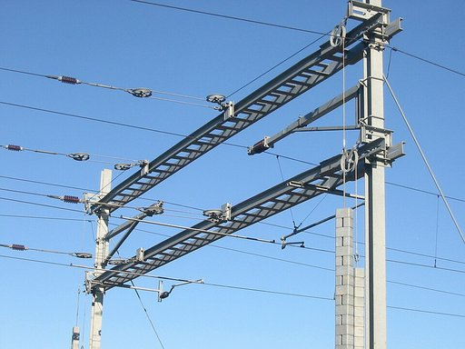
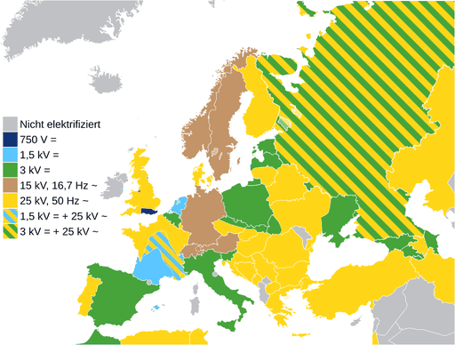
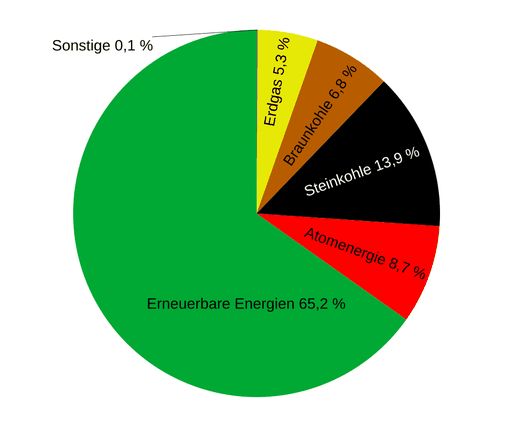

# Bahnstrom

**Bahnstrom** (auch **Bahnenergie** genannt) bezeichnet die elektrische Energie zum Betrieb elektrischer Bahnen. Sie wird überwiegend für den Antrieb von Triebfahrzeugen genutzt. Die Versorgung elektrischer Bahnen mit Bahnstrom wird als **Bahnstromversorgung** oder **Bahnenergieversorgung** bezeichnet. Diese lässt sich in die funktionellen Teilbereiche *Erzeugung*, *Übertragung*, *Verteilung*, *Zuführung* und *Rückführung* des Bahnstroms bzw. der Bahnenergie unterteilen. Dabei stellt die Speisung mobiler Verbraucher über Fahrleitungen und Stromabnehmer den wesentlichen Unterschied zum öffentlichen Stromnetz dar.

Historisch entwickelten sich in den verschiedenen Ländern oder bei unterschiedlichen Bahngesellschaften verschiedene **Bahnstromsysteme** bzw. **Bahnstromarten**, die in der Regel nicht direkt mit dem öffentlichen Stromnetz eines Landes gekoppelt sind, sondern eigene Anlagen benötigen. Dies ist insbesondere bei Betrieb mit Gleichstrom der Fall.

Ein Sonderfall bei Betrieb mit Wechselstrom ist die Abweichung zur in Europa üblichen Netzfrequenz von 50 Hz, die in deutschsprachigen Ländern und Skandinavien bei früher Elektrifikation gewählt wurde und weiterhin vorherrscht. Die Deutsche Bahn, die ÖBB und die SBB nutzen überwiegend einphasigen Wechselstrom, dessen Frequenz ursprünglich mit 16 2⁄3 Hz bei exakt einem Drittel der Netzfrequenz lag, später jedoch zur Vermeidung einseitiger Belastungen in Umformerwerken auf 16,7 Hz erhöht wurde. Die Fahrdraht­spannung beträgt in diesen drei Streckennetzen nominell 15 kV.

## Geschichte

→ *Hauptartikel: Geschichte des elektrischen Antriebs von Schienenfahrzeugen*

Nach Einführung der Eisenbahn 1835 in Deutschland wurden Ende des Jahrhunderts erste Versuche mit verschiedenen elektrischen Systemen und Motoren gemacht, wobei sich 1912 im Deutschen Reich Einphasen-Wechselstrom mit 15 kV und 16 2⁄3 Hz durchsetzte. Deren erste Anwendung im Regelbetrieb fand 1914 auf der niederschlesischen Strecke zwischen Niedersalzbrunn und Halbstadt (siehe Elektrischer Bahnbetrieb in Schlesien) statt.

Wegen der technisch anspruchslosen Regelbarkeit und des hohen Stillstandsdrehmoments erwies sich der Gleichstrom-Reihenschlussmotor als idealer Antrieb für Schienenfahrzeuge. Solche Motoren vertragen aber keine hohe Spannung und benötigen umso höhere Stromstärken, diese wiederum erfordern große und teure Querschnitte der Oberleitung oder Stromschiene. Bei größerem Abstand der Haltepunkte erweist es sich daher als wirtschaftlicher, die Lokomotiven mit Wechselstrom höherer Spannung zu versorgen und einen Transformator einzubauen; die zu dessen ständigem Mittransport erforderliche Energie ist geringer, als es Verluste in den kilometerlangen Fahrleitungen wären.

Das Gewicht eines Transformators ist im Wesentlichen von seinem Eisenkern bestimmt. Dieses wiederum ist annähernd umgekehrt proportional der Frequenz des Wechselstroms. Aufgrund der beherrschbaren Technologie im Transformatorenbau hatte sich eine Frequenz von 50 Hz in den europäischen Netzen durchgesetzt. Durch die an den Kollektoren entstehenden Bürstenfeuer gelang es jedoch nicht, Reihenschlussmotoren im erforderlichen Leistungsbereich mit einer Frequenz von 50 Hz zu betreiben. Daher entstanden Bahnstromnetze mit 25 Hz und 16 2⁄3 Hz. Um mit rotierenden synchronen Umformern *Bahnstrom* aus dem 50-Hz-Stromnetz erzeugen zu können, wählte man die Teilerfaktoren 2 bzw. 3. Der Einsatz von modernen asynchronen Umformern bei einem ganzzahligen Teilungsverhältnis erwies sich bei hohen Leistungen allerdings als problematisch, sodass die Sollfrequenz vieler Netze inzwischen auf 16,7 Hz geändert wurde, wobei 16 2⁄3 Hz innerhalb der Toleranz liegt.

Der heutige Stand der Technik im Bereich der Leistungselektronik macht die verminderte Frequenz des Wechselstroms nicht mehr zwingend. Moderne Fahrzeuge sind meist mit Drehstrommotoren, welche mit Drehstrom aus einem Frequenzumrichter versorgt werden, ausgestattet, mit einem Transformator mit 25 kV Primärspannung und Anzapfung bei 15 kV lassen diese sich als Mehrsystemfahrzeuge ausrüsten. Eine Umstellung des Bahnstroms auf 25 kV ist derzeit im Bereich der Deutschen Bahn nicht möglich, da der erforderliche erhöhte Sicherheitsabstand der Oberleitung zu vorhandenen Brücken nicht gegeben ist. Bei Neubauten werden jedoch größere Abstände eingeplant. Die ausstehende europaweite Vereinheitlichung der Bahnstromsysteme ist im grenzüberschreitenden Verkehr ein verhältnismäßig kleines Problem, die Mehrkosten für den Transformator in Mehrsystemfahrzeugen sind gering im Vergleich mit den Kosten für die mehrfachen Zugsicherungssysteme und die nationalen Zulassungsverfahren.

Außerdem wird der Zeitpunkt einer möglichen Umstellung des Bahnstroms in Deutschland beeinflusst durch die Nutzungsdauer der älteren Baureihen mit Wechselstrommotoren, die sich schwer umrüsten lassen. Die Baureihen 103, 141 und 150 sind bereits ausgemustert, unter den Einheitslokomotiven verbleiben die Baureihen 110, 140, 139, einige der jüngeren Exemplare der 111 sowie der 151. Wenn auch die Reichsbahn-Baureihen 112, 114, 143 und 155 ausgemustert sind, verbleiben im Bestand der Deutschen Bahn ausschließlich Drehstromlokomotiven. Eine Umstellung ist dann relativ einfach, im Gegenzug kann auf die Unterhaltung eines eigenständigen 110-kV-Hochspannungsnetzes verzichtet werden und die Unterwerke können an die Hochspannungsnetze der allgemeinen Energieversorgungsunternehmen angebunden werden. Da die Hochspannungsnetze schon errichtet sind, besteht kein Handlungsbedarf und die Ausmusterung der älteren Baureihen kann noch Jahrzehnte dauern.

In der Nachkriegszeit fiel die Entscheidung, großflächig Dampfloks durch E-Loks zu ersetzen. Anfangs waren nur 5 % der Strecken elektrifiziert, daher stellte sich die Wahl des Stromsystems neu. Um nicht von RWE abhängig zu werden, fiel die Entscheidung, kleinere technische Nachteile und eine Einzellösung in Mitteleuropa in Kauf zu nehmen und ein eigenständiges Bahnstromnetz zu errichten. Zum 1. Juni 1958 nahm die *Zentralstelle für Bahnstromversorgung* (ZBV) aufgrund einer Verfügung des Vorstands der Deutschen Bundesbahn in Frankfurt am Main ihre Arbeit auf.

## Bahnstromsysteme

### Gleichspannung

Fahrzeugseitig ist Gleichspannung die einfachste Lösung. Gleichstrom-Reihenschlussmaschinen waren lange Zeit die besten verfügbaren elektrischen Maschinen für Fahrzeugantriebe. Dies hat sich erst mit der seit den 1970er Jahren nach und nach verfügbaren Halbleiter-Leistungselektronik geändert. Das 1884 errichtete Kraftwerk der Frankfurt-Offenbacher Trambahn-Gesellschaft etwa erzeugte für die erste kommerziell betriebene elektrische Straßenbahnlinie der Frankfurt-Offenbacher Trambahn-Gesellschaft Gleichstrom mit einer Spannung von 300 V.

Da die Fahrzeuge Gleichstrom benötigten, lag es zuvor nahe, sie direkt aus der Fahrleitung mit Gleichstrom zu versorgen. Der größte Nachteil der direkten Versorgung der Fahrzeuge mit Gleichstrom ist die geringe mögliche Fahrleitungsspannung, wodurch sich bei gleicher Leistung die fließenden Ströme und damit die Verluste in der Fahrleitung erhöhen. Da keine Transformation im Fahrzeug erfolgen kann, ist die Spannung durch das Isolationsvermögen der in den Motoren verwendeten Isolierstoffe begrenzt, meist auf 1500 V oder 3000 V.

Der fehlende Haupttransformator im Fahrzeug muss allerdings kein Nachteil sein, denn dadurch lässt sich das Fahrzeug bei gleicher Leistung kürzer bauen und kann daher engere Kurvenradien durchfahren. Weiterhin ist es auch möglich, das Lichtraumprofil niedriger zu halten und das Triebfahrzeug mit einer durchgehenden Plattform auszustatten.

Wo nur relativ kleine Fahrzeugleistungen erforderlich sind, beispielsweise bei Straßenbahnen, oder wo aus mechanischen Gründen ohnehin große Leiterquerschnitte verwendet werden, z. B. bei Stromschienenbetrieb (U-Bahn), wird daher überwiegend Gleichstrom verwendet. Stromschienen können überdies wegen der Bodennähe und der dadurch erforderlichen geringen Isolationsabstände sowieso nur mit niedrigen Spannungen (in der Regel 500 V bis 1200 V) betrieben werden. Bei Straßenbahnen wären große Isolationsabstände zwar umsetzbar, ein Mittelspannungs-Oberleitungsnetz in der Enge von städtischen Straßen zwischen Gebäuden wäre aber zu gefährlich. Bei Stadtbahnen ergibt sich durch die geringeren Isolationsabstände ein niedrigeres Lichtraumprofil und damit ein erheblicher Kostenvorteil beim Bau der innerstädtischen Tunnelstrecken.

Auch bei elektrifizierten Werkbahnen spielen Kurvengängigkeit und das kleinere Lichtraumprofil eine Rolle. Bei Strossengleisen von Tagebauen und vor allem bei Grubenbahnen wird oft sogar eine Seitenfahrleitung verwendet, die Triebfahrzeuge sind dann auch mit ausgefahrenem Stromabnehmer nur so hoch wie die Wagen; zudem können die Wagen von oben beladen werden. Die niedrige Betriebsspannung ist hier sogar von Vorteil, da durch den fliegenden Aufbau der Strossen aufwendige Isolationsmaßnahmen schwierig umzusetzen wären.

Die fehlende Masse des Transformators muss hingegen häufig sogar durch Ballastgewichte ausgeglichen werden, damit das Fahrzeug beim Anfahren nicht schleudert. Die Ballastgewichte lassen sich aber unauffällig am Fahrzeugboden verteilen.

Obwohl diese Vorteile des Gleichstrombetriebs bei Vollbahnen nicht ausgespielt werden können, findet er in einigen Ländern Verwendung, z. B. in Italien, Slowenien, den Niederlanden, Belgien, Osteuropa, Spanien, Südostengland, Südfrankreich, Südafrika und Japan. Dies ist historisch bedingt, Neubaustrecken für den Hochgeschwindigkeitsverkehr wurden auch dort mit dem Stromsystem 20–30 kV und 50 oder 60 Hz errichtet.

Bei Vollbahnen mit Gleichstrombetrieb sind 3000 V Fahrleitungsspannung üblich. Lediglich die Niederlande, Japan und Frankreich verwenden 1500 V, Südostengland sogar nur 750 V (über Stromschienen neben den Gleisen). Da die Leistungen der Triebfahrzeuge vollbahntypisch sehr hoch sind, fließen in der Fahrleitung hohe Ströme, weshalb diese anders konstruiert sein muss, oft handelt es sich um mehrere Leiterseile. Auch die Stromabnehmer der Triebfahrzeuge müssen anders konstruiert sein, da Lichtbögen bei Gleichstrombetrieb nicht selbst verlöschen. Besonders leistungsfähige Triebfahrzeuge müssen mehrere Stromabnehmer an die Fahrleitung anlegen, dies kann Probleme durch Fahrleitungsschwingungen zur Folge haben.

Ein großes Problem stellt im Gleichstrombetrieb die Leistungs- und damit die Geschwindigkeitssteuerung dar. Eine bei elektrischen Triebfahrzeugen grundsätzlich immer genutzte Möglichkeit ist die wahlweise Reihen- und Parallelschaltung der Fahrmotoren. Sind mehr als zwei Fahrmotoren vorhanden, werden diese üblicherweise nur in zwei Gruppen umgeschaltet, da die Isolation im Parallelbetrieb weiterhin nur 3000 V Spannung zulässt. Mit dieser Umschaltmöglichkeit bietet das Fahrzeug nur drei Fahrstufen (nur ein Motor/eine Gruppe, Reihenschaltung, Parallelschaltung). Die naheliegende Möglichkeit, die Leistung der Motoren durch Änderung der Betriebsspannung feiner zu steuern, wie das im Wechselstrombetrieb durch Abgriffe am Haupttransformator geschieht, ist bei Gleichstrombetrieb nicht möglich, da die Fahrdrahtspannung fest ist.

Herkömmliche Gleichstromfahrzeuge besitzen daher zumindest eine der zwei weiteren Möglichkeiten der Leistungssteuerung, manchmal auch beide:

- Zum einen kann durch Vorwiderstände der Strom begrenzt werden, dadurch sinkt das Drehmoment und damit auch die Geschwindigkeit des Fahrzeugs. Nachteilig ist der hohe Energieverbrauch in den Zwischenfahrstufen, da die überschüssige elektrische Energie „verheizt“ wird. Der Vorteil ist, dass die Widerstände auch zur Bremsung des Fahrzeugs eingesetzt werden können, wodurch die mechanische Bremsanlage kleiner dimensioniert werden kann und weniger verschleißt. Von dieser Möglichkeit machen vor allem ältere Straßenbahnfahrzeuge Gebrauch; die Widerstände sitzen wegen der Abwärme auf dem Fahrzeugdach.
- Alternativ oder zusätzlich kann das Drehmoment und damit auch die Geschwindigkeit des Fahrzeugs durch Feldschwächung beeinflusst werden. Der stabile Stellbereich ist bei der Reihenschlussmaschine aber klein, mehr als drei Stufen sind selten.

Dieser Nachteil des Gleichstrombetriebes entfällt bei modernen Fahrzeugen, in denen mit Hilfe der Leistungselektronik die Gleichstrommotoren über eine Chopper-Steuerung gespeist werden oder der Gleichstrom mit einem Frequenzumrichter in Drehstrom umgewandelt wird, sodass die einfachen und robusten Asynchronmotoren verwendet werden können. Dennoch fällt bei modernen Mehrsystem-Triebfahrzeugen die Leistung unter Gleichstrom in der Regel geringer aus, weil der Nachteil relativ zum Wechselstrom hoher zu übertragender Ströme unverändert besteht.

Die Stromversorgung gleichstrombetriebener Bahnen erfolgt schon seit den 1920er Jahren durch Gleichrichtung in aus dem öffentlichen Netz gespeisten Unterwerken, wobei früher Quecksilberdampf- und heute Halbleiter-Gleichrichter zum Einsatz kommen. Die Unterwerke werden auch bei Vollbahnen in der Regel aus dem Mittelspannungsnetz gespeist.

### Wechselspannung

Wechselspannung kann genauso wie für die öffentliche Elektrizitätsversorgung einfach erzeugt (Generator) und in Transformatoren umgespannt und verteilt werden.

Das Stromsystem des Antriebs ist dabei von dem der Energiezuführung zu unterscheiden. Es gibt für jeden Anwendungsfall eine passende Möglichkeit, beliebige Stromsysteme auf Antriebs- und Netzseite mittels Leistungselektronik miteinander zu koppeln. Bei elektronisch geregelten Bahnfahrzeugen mit entsprechenden Wechselrichtern kann der elektrische Energiefluss dabei meist in beiden Richtungen erfolgen, d. h. das Fahrzeug entnimmt für den Antrieb elektrische Energie aus dem Versorgungssystem und kann beim Bremsen zum Verzögern oder bei Bergabfahrt aus Bewegungsenergie elektrischen Energie generieren und zurück in das Netz einspeisen, also rekuperieren.

#### Einphasensysteme

##### Wechselspannung mit Standard-Industriefrequenz

Die weltweit größte Verbreitung bei Bahnen hat Wechselspannung mit der landesüblichen Netzfrequenz (meist 50 Hz, in den USA und teilweise in Japan 60 Hz). Die Betriebsspannung ist dabei meist 25 kV, in den USA (Lake Powell Railroad) und Südafrika (Erzbahn Sishen–Saldanha Bay) gibt es Bahnen mit 50 kV.

Der Vorteil der Verwendung der Standard-Netzfrequenz besteht darin, dass eine Speisung aus dem öffentlichen Stromnetz zumindest theoretisch leicht möglich ist. In der Praxis besteht dabei jedoch die Gefahr von Schieflasten im Landesnetz. Zu deren Vermeidung werden 20 bis 60 km lange Fahrleitungs­abschnitte abwechselnd an die drei verschiedenen Phasen des 50-Hz-Netzes angeschlossen. In der Oberleitung sind zwischen den Fahrleitungsabschnitten Phasenschutzstrecken angeordnet, die von den Triebfahrzeugen mit Schwung und ausgeschaltetem Hauptschalter befahren werden müssen. 50-Hz-Bahnen können nur an Stellen höchster Netzleistung, wo die Schieflast prozentual unbedeutend ist, vom öffentlichen Stromnetz versorgt werden. Ansonsten sind Bahnstromleitungen notwendig.

Die notwendigen Phasentrennstellen sorgen dabei für ungünstigere Speiseverhältnisse in der Oberleitung, da ohne zusätzliche aufwändige Maßnahmen (zusätzliche Verstärkerleitungen oder Autotransformersysteme) jeder Oberleitungsabschnitt nur einseitig gespeist wird und sich dadurch höhere Spannungsabfälle und Speiseverluste ergeben. Gleichzeitig wirken sie sich durch die notwendige Zugkraftunterbrechung auch fahrdynamisch ungünstig aus; das notwendige Ausschalten des Hauptschalters muss dabei insbesondere auf Hochgeschwindigkeitsstrecken, bei denen im Abstand von wenigen Minuten regelmäßig eine neue Phasentrennstelle durchfahren wird, ggf. zusätzlich durch die Zugsicherung überwacht und/oder direkt gesteuert werden.

Erst im 21. Jahrhundert sind durch Fortschritte in der Halbleitertechnik und Leistungselektronik die Kosten für statische Bahnstromumrichter in einen wirtschaftlich interessanten Bereich gesunken. Mit statischen Umrichtern kann die Last aus dem Bahnstromnetz gleichmäßig auf alle Phasen des Landesnetzes verteilt werden, sodass Schief- und Blindlastproblematiken entfallen und Umrichterwerke flexibler auch an niedrigere Spannungsebenen des öffentlichen Stromnetzes angeschlossen werden können. Gleichzeitig können durch die Umrichtung benachbarte Speiseabschnitte nun phasensynchron gespeist werden, sodass die Notwendigkeit von Phasentrennstellen mit ihren oben genannten Nachteilen entfällt. Auch auf aufwändige Autotransformersysteme kann durch die dann unterwerksübergreifend durchgekoppelte beidseitige Einspeisung verzichtet werden.

Anfangs war nachteilig, dass die notwendigen Motoren groß und für die hohe Frequenz nicht geeignet waren, der Wechselstrom deshalb gleichgerichtet werden musste und dazu Leistungselektronik benötigte. Dafür wurden Leistungsgleichrichter benötigt, eine Technik, die erst Anfang der 1940er Jahre beherrscht wurde. Anfangs kamen dabei noch Quecksilberdampfgleichrichter zum Einsatz; erst in den 1960er Jahren setzten sich Halbleitergleichrichter durch.

Die Spannung wurde anfangs wie bei den mit reduzierter Frequenz betriebenen Lokomotiven über Stelltransformatoren geregelt, später wurde eine Regelung über Phasenanschnittsteuerung typischerweise mit Thyristoren eingesetzt.

##### Wechselstrom mit verminderter Frequenz

In einigen europäischen Ländern (Deutschland, Österreich, Schweiz, Schweden, Norwegen) fahren die Eisenbahnen mit Einphasenwechselstrom mit einer gegenüber den öffentlichen Stromnetzen verminderten Frequenz von 16 2⁄3 Hz bzw. 16,7 Hz statt 50 Hz. Eine Ausnahme im deutschsprachigen Raum stellt die Rübelandbahn dar, die seit DDR-Zeiten im Inselbetrieb mit 50 Hz und 25 kV direkt aus dem öffentlichen Netz versorgt wird.

Außerdem gibt es auch Bahnstromsysteme mit 25 Hz. Noch heute werden der Abschnitt New York – Washington des Ostküstennetzes in den USA sowie die Mariazellerbahn in Österreich mit dieser Frequenz betrieben.

Da Wechselspannung eine Transformierung der Fahrdrahtspannung auf die für die Motoren geeignete Spannung zulässt, kann eine deutlich höhere Fahrdrahtspannung gewählt werden als bei Gleichstrombetrieb (anfangs circa 5000 V, heute in den am Anfang des Abschnitts genannten Ländern 15 kV). Die Transformatoren waren als Stelltransformatoren ausgeführt (siehe auch Stufenschalter für Leistungstransformatoren) und ermöglichen eine Spannungsregelung ohne Verwendung von verlustbringenden Widerständen. Die Masse der Transformatoren ist der leistungsbegrenzende Faktor bei Elektrolokomotiven, moderne Umformung durch Halbleiter ausgenommen.

Die gegenüber den öffentlichen Stromnetzen verminderte Frequenz wurde Anfang des 20. Jahrhunderts gewählt, weil es nicht möglich war, große Einphasen-Elektromotoren mit hohen Frequenzen zu betreiben, da es dabei durch die sogenannte transformatorische Spannung zu übermäßiger Funkenbildung am Kommutator kam. Historisch bedingt wurde mit Maschinenumformern oder Generatoren gearbeitet, durch deren Polteilung die Netzfrequenz von 50 Hz gedrittelt wurde, also 16 2⁄3 Hz als Frequenz des Bahnstroms ergab. Der tatsächliche Wert der Frequenz schwankte jedoch abhängig von der Drehzahlkonstanz des Generators.

Bei der Umformung der Bahnenergie mittels mechanisch gekoppelten Synchron-Synchron-Umformern beträgt die Frequenz des Bahnstroms in der Praxis exakt ein Drittel der momentanen Netzfrequenz des speisenden Landesnetzes. Derartige Umformer sind unter anderem in Schweden und im Nordosten Deutschlands in Betrieb.

Trotz der größeren Verbreitung des 50-Hz-Systems betrachten heute nicht alle Experten das 16,7-Hz-System als minderwertig. Wie bereits erwähnt ist die Versorgung einer Bahnlinie mit 50 Hz aus dem Landesnetz wegen der Gefahr einer Schieflast nicht unproblematisch. Die verminderte Netzfrequenz hat zudem den Vorteil, dass die durch Blindleistung verursachten Spannungsabfälle nur ein Drittel so groß sind. (Dementsprechend ist die bei 50 Hz-Speisung übliche höhere Spannung von 25 kV größtenteils zur Kompensation der im Vergleich größeren Induktivitätsverluste und der durch Phasentrennstellen oftmals nur einseitigen Speisung eines Oberleitungsabschnittes notwendig und trägt nur eingeschränkt zur Verringerung der Leitungsverluste im Vergleich zu den typischen 15 kV bei 16,7 Hz-Systemen bei.) Auch ermöglicht der geringere Induktivitätsbelag größere Unterwerksabstände und auf benachbarte Leitungen wirken geringere induktive Effekte. Andererseits müssen die Transformatoren größer sein und die Unterwerke können nicht direkt aus dem öffentlichen Stromnetz versorgt werden. Oft werden aus diesem Grund völlig unabhängige Netze mit Bahnstromleitungen unterhalten. Das Bahnstromnetz ermöglicht es aber auch, den Strom am günstigsten Ort zu produzieren oder einzukaufen. Die Masten dieses Netzes haben üblicherweise zwei Leiterpaare (2× Einphasenleitung).

Eine Untersuchung im Auftrag der Bundesnetzagentur ergab, dass sich das Bahnstromnetz nur unter großem Umbau-Aufwand dazu eignet, die Unterschiede bei der Erzeugung von erneuerbarer Energie überregional auszugleichen.

##### 16 2⁄3 Hz gegenüber 16,7 Hz

Die Netzfrequenz des Bahnstromnetzes wird, ebenso wie die 50-Hz-Netzfrequenz des Europäischen Verbundnetzes, in einem bestimmten Toleranzbereich gehalten. Die aktuelle tatsächliche Netzfrequenz ist unter anderem von der aktuellen Nachfrage und dem aktuellen Angebot an elektrischer Energie abhängig und daher schwankend. Der Toleranzbereich für 16,7-Hz-Systeme im Bahnstromnetz beträgt 16,5 Hz bis 16,83 Hz während 99,5 % eines Jahres und 15,67 Hz bis 17,33 Hz während der restlichen 0,5 % eines Jahres.

Zum Leistungsausgleich zwischen dem Bahnstromnetz und dem Verbundnetz werden unter anderem Umformer eingesetzt. Dabei werden in der Regel eine Einphasen-Synchronmaschine und eine Dreiphasen-Asynchronmaschine mit der dreifachen Polzahl der Synchronmaschine eingesetzt. Eine Maschine arbeitet als Motor, die andere als Generator. Bei den dabei verwendeten doppelt gespeisten Asynchronmaschinen ist ein Schlupf notwendig. Die Einstellung des Leistungsflusses erfolgt mittels Regler über den mit Schleifringen ausgeführten Läuferkreis.

Solange der Sollwert der Netzfrequenz im europäischen Verbundnetz mit 50 Hz exakt das Dreifache des Sollwertes 16 2⁄3 Hz im Bahnstromnetz betrug, kam es besonders in lastschwachen Zeiten zu einer Abnahme des Schlupfs auf Null. In diesem unerwünschten Synchronlauf der Asynchronmaschine bildet sich im Läuferkreis eine stationäre Gleichstromkomponente auf einer Phase, die zu einer punktuellen thermischen Belastung der Maschine führt und in Extremfällen über den thermischen Betriebsschutz eine Notabschaltung auslösen kann.

Zur Abhilfe dieses Problems wurde 1995 die Sollfrequenz des Bahnstroms um 0,2 Prozent oder 1⁄30 Hz auf exakt 16,7 Hz angehoben, um auch in lastschwachen Betriebszeiten einen geringen Schlupf in der Asynchronmaschine zu gewährleisten. Dadurch rotiert der Gleichstromanteil langsam, seine thermische Last verteilt sich gleichmäßig auf die Phasen des Läuferkreises und die Bürsten der Schleifringe, sodass die thermische Belastung der Komponenten in zulässigen Grenzen bleibt. Der unerwünschte Synchronlauf im Maschinensatz tritt nur noch kurzzeitig und nicht mehr stationär auf. Die Heraufsetzung der Sollfrequenz wurde bewusst niedrig gehalten, um auch bei betrieblich bedingten Frequenzabweichungen den oben angeführten Toleranzbereich der bestehenden für 16 2⁄3 Hz optimierten Triebfahrzeuge noch einzuhalten.

Die Bahnstromnetze von Deutschland, Österreich und der Schweiz hoben am 16. Oktober 1995 um 12:00 Uhr die *Sollfrequenz* auf 16,7 Hz an. Bei den auf Leistungselektronik basierenden HGÜ-Kurzkupplungen spielt die Umstellung der Bahnfrequenz keine Rolle, ebenso in elektrisch vom restlichen Bahnnetz isolierten Abschnitten, die mit rotierenden Umformern aus Synchronmaschinen betrieben werden. Skandinavien verwendet weiterhin 16 2⁄3 Hz, weil dort kein Verbundnetz besteht.

#### Zweiphasensysteme

Zweiphasensysteme werden auch als „Zweispannungssysteme“ oder Autotransformatorsystem bezeichnet. Solche Systeme sind bei verschiedenen mit 50 Hz elektrifizierten HGV-Strecken in Frankreich sowie in Belgien, den Niederlanden, Luxemburg und Italien zu finden. Bei den mit 16,7 Hz betriebenen Netzen ging in Deutschland 2001 eine Pilotanlage zwischen Stralsund und Prenzlau in Betrieb, 2020 die Ausbaustrecke München–Lindau. Die schweizerischen SBB und der italienischen RFI betreiben seit 2015 die Strecke Cadenazzo–Luino mit einem Autotransformatorsystem.

#### Dreiphasensysteme (Drehstrom)

Drehstrom, genauer Dreiphasenwechselstrom, ist aufgrund der guten Eigenschaften des Drehstrommotors geradezu prädestiniert für den Eisenbahnantrieb, weil Asynchronmotoren sehr robust und wartungsarm sind, weil sie ohne Bürsten auskommen und bezogen auf ihre Leistung ein relativ geringes Gewicht haben.

##### Verwendung von extern erzeugtem Drehstrom

Die meisten historischen Anwendungen des Drehstromantriebes arbeiteten mit Zuleitung über mehrpolige Oberleitungen. Dabei war nachteilig, dass Asynchronmotoren nur mit bestimmten, von der Frequenz abhängigen Drehzahlen wirtschaftlich betrieben werden können. Demnach müsste also zur Veränderung der Fahrgeschwindigkeit die Frequenz *kraftwerksseitig* verändert werden, solange eine Frequenzumrichtung auf der Lokomotive nicht möglich war. Dies eignete sich aber nur für Versuche, nicht für den praktischen Betrieb. Durch eine besondere Schaltung der Motoren (Polumschaltung) können diese zwar für mehrere Drehzahlen ausgelegt werden, eine feinstufige oder kontinuierliche Veränderung wie bei Gleichstrommotoren ist jedoch nicht möglich.

Ein weiterer Nachteil eines Drehstrom-Bahnsystems ist die Notwendigkeit einer dreipoligen Stromzufuhr, was bei Verwendung der Schienen als einer der Pole eine zweipolige Oberleitung erfordert. Diese ist jedoch kompliziert (vor allem an Weichen und Kreuzungen) und störanfällig (Kurzschlussgefahr).

Tatsächlich fanden Drehstrom-Bahnstromnetze daher nur sehr begrenzt Verwendung: In Norditalien gab es von 1912 bis 1976 längere Zeit ein größeres Drehstromsystem (3600 V 16 2⁄3 Hz). Die Gornergratbahn (750 V 50 Hz) und die Jungfraubahn (1125 V 50 Hz) fahren noch heute mit Drehstrom, außerdem die Chemin de Fer de la Rhune (3000 V 50 Hz) in den französischen Pyrenäen sowie die Corcovado-Bergbahn (800 V 60 Hz).

In den Jahren 1901 bis 1903 gab es Versuchsfahrten mit Drehstrom-Schnelltriebwagen auf einer Militär-Eisenbahn zwischen Marienfelde und Zossen bei Berlin. Dabei wurde eine dreipolige Oberleitung mit übereinander liegenden Drähten verwendet, die seitlich abgegriffen wurden. Am 28. Oktober 1903 wurde dort mit 210,2 km/h ein Geschwindigkeitsweltrekord aller Verkehrsmittel aufgestellt, der erst 1931 mit dem Schienenzeppelin gebrochen wurde, der 230 km/h erreichte.

Zu den Passionsspielen 1900 wurde 1899 die Ammergaubahn mit Drehstrom elektrifiziert. Nachdem der Praxisbetrieb scheiterte, bauten die Siemens-Schuckertwerke die Spannungsversorgung und die Fahrzeuge 1904–1905 erfolgreich auf Einphasen-Wechselspannung mit 15 Hz um.

##### Drehstrom-Antrieb mit bordeigener Drehstrom-Umwandlung

Durch die Verwendung von Leistungselektronik können moderne Lokomotiven in beliebigen Bahnstromnetzen die Vorteile des Drehstroms nutzen, ohne dessen Nachteile bei der Zuführung zum Fahrzeug in Kauf nehmen zu müssen. Spannung und Frequenz können dabei auf elektronischem Weg stufenlos geregelt werden (Frequenzumrichter). Diese Art des Antriebs hat sich heute als allgemein üblich durchgesetzt. Die erste Lokomotive, die Einphasen-Wechselstrom mit Leistungselektronik an Bord in Drehstrom umgewandelt hat, war 1972 die Versuchslok Be 4/4 12001 der Schweizerischen Bundesbahnen. Dabei wurde der nach Brandschaden 1967 ausrangierte Triebwagen 1685 1971–72 zur Lokomotive Be 4/4 (Betriebsnummer 12001) umgebaut, um die Umrichtertechnik mit Drehstrom-Asynchronmaschine zu testen, ähnlich wie sie in den deutschen DE 2500 angewandt wurde. Es wurden aber weltweit erstmals GTO-Thyristoren für eine Elektrolok verwendet. Sie wurde 1975 defekt abgestellt und 1981 abgebrochen. Ein Drehgestell ist im Verkehrshaus Luzern erhalten.

1979 folgten die ersten Exemplare der Baureihe 120 der Deutschen Bundesbahn. Es gab auch Lokomotiven, bei denen die Umformung an Bord mit rotierenden Umformern erfolgte.

## Bahnstromversorgung

### Bereitstellung und Übertragung

Bei der Bereitstellung des Bahnstroms unterscheidet man zwischen der **zentralen** und der **dezentralen Bahnstromversorgung**.

#### Zentrale Versorgung

Bei der zentralen Bahnstromversorgung wird der Bahnstrom über Bahnkraftwerke und große Bahnstromumformer bzw. Bahnstromumrichter bereitgestellt und dann über ein eigenes Bahnstromnetz über Bahnstromleitungen zu den Unterwerken an den Bahnstrecken übertragen. Das Bahnstromnetz erlaubt es daher, Energie ohne Frequenzumformung in andere Regionen zu transportieren. Die verwendeten Umrichter- bzw. Umformerwerke werden aufgrund ihrer Verwendung im Stromerzeugungsnetz auch als *zentrale Umrichter- bzw. Umformerwerke* bezeichnet.

Die zentrale Bahnstromversorgung wird in Deutschland, Österreich und der Schweiz angewandt, deren Bahnstromnetze zudem untereinander verbunden sind.

#### Dezentrale Versorgung

Bei der dezentralen Bahnstromversorgung erfolgt der Energiebezug aus dem öffentlichen Landesnetz mit Industriefrequenz. Die Unterwerke an den Einspeisepunkten haben statische Umrichter oder rotierende Umformer, in dem die Spannung und die Frequenz des allgemeinen Stromnetzes in den Bahnstrom transformiert wird (*dezentrale Umrichter- bzw. Umformerwerke*). Wenn die Züge und das öffentliche Netz mit 50 Hz betrieben werden, reicht ein Trafo aus; ein Bahnstromnetz ist dann nicht nötig. Daher wird diese Lösung in Großbritannien, Nordfrankreich und Südosteuropa favorisiert, Oberleitungsspannung ist dort 25 kV. Auch bei Gleichstrombahnen mit 1,5 kV (unter anderem in den Niederlanden und Südfrankreich) und 3 kV (so beispielsweise in Belgien, Polen und Spanien) wird diese Lösung favorisiert.

Der wesentliche Unterschied zum zentral versorgten Bahnstromnetz liegt darin, dass die Umformerwerke insbesondere zur Phasensynchronisation lediglich über die Oberleitung mit gleichen Umformerwerken parallel geschaltet werden. Separate Bahnstromleitungen bzw. Bahnstromnetze sind hier nicht vorhanden. Dies wird in Schweden, Norwegen, Brandenburg, Mecklenburg-Vorpommern und Teilen von Sachsen-Anhalt praktiziert. Die Steuerung der Anlagen erfolgte früher weitgehend vor Ort, heute örtlich getrennt in den Leitstellen.

#### Strom für Nebenanlagen

Aus Gründen der Netzverfügbarkeit und der Betriebssicherheit werden die Bahnstromversorgung für die Traktion und für die Nebenanlagen in der Regel getrennt geführt. Zudem ist das europäisch weitgehend einheitliche Netz mit der Frequenz von 50 Hz nicht mit allen Netzen der Traktionsversorgung und deren verschiedenen Frequenzen kompatibel.

#### Anwendungsbeispiele

Ein eigenes Bahnstromnetz mit 25-Hz-Einphasen-Wechselspannung hat die Mariazellerbahn. Bei dieser Bahn beträgt die Spannung in den an den Oberleitungsmasten montierten Leiterseilen der Bahnstromleitungen 27 kV und in der Oberleitung 6,5 kV.

In den USA werden einige Strecken der ehemaligen Pennsylvania Railroad zwischen New York, Philadelphia und Washington noch mit Einphasenwechselspannung verminderter Frequenz betrieben (25 Hz, obwohl die Frequenz des öffentlichen Stromnetzes in den USA 60 Hz beträgt), wobei nur noch der Personenverkehr mit elektrischer Traktion verkehrt. Auch diese Bahnen besitzen ein eigenes Hochspannungsnetz, die Leiterseile der Bahnstrom-Hochspannungsleitungen sind hier meistens an den Oberleitungsmasten montiert.

Die italienischen Staatsbahnen verfügten von 1902 bis 1976 für die Versorgung ihrer mit Drehstrom elektrifizierten Strecken (3600 V 15 Hz) in Norditalien über ein mit 60 kV betriebenes Bahnstromnetz, das aus Wasserkraftwerken und einem thermischen Kraftwerk gespeist wurde. Für die Speisung der Fahrleitung kamen auch fahrbare Unterwerke zum Einsatz.

Bei Bahnen, die mit Einphasenwechselspannung von Netzfrequenz oder Gleichspannung betrieben werden, wird die zum Betrieb nötige Energie in den Unterwerken durch Verketten der Phasen des Drehstromsystems (im Fall von Wechselstrombahnen) und mit Gleichrichtung (im Fall von Gleichstrombahnen) gewonnen. Dedizierte Bahnstromleitungen existieren in diesen Fällen nur vereinzelt.

#### Bahnkraftwerke

→ *Hauptartikel: Bahnkraftwerk*

Zur Bereitstellung von Bahnstrom werden durch manche Bahngesellschaften oder durch mit ihnen kooperierende Stromerzeuger spezielle Kraftwerke betrieben.
Die Bahnstromgeneratoren für Wechselstrom mit verminderter Frequenz sind erheblich größer als die für das öffentliche Stromnetz, die zugehörigen Turbinen sind Sonderanfertigungen.

In manchen Fällen sind es kombinierte Anlagen, die wahlweise auch gewöhnlichen Netzstrom erzeugen können.

#### Umformer-/Umrichterwerke

Stand 2018 wird etwa ein Drittel des Bahnstroms in Deutschland über die Strombörse aus dem öffentlichen 50-Hz-Netz eingekauft. Die Schnittstelle zwischen dem öffentlichen Hoch- bzw. Höchstspannungsnetz und dem Bahnstrom-Hochspannungsnetz bildet ein Bahnstromumformer- bzw. Bahnstromumrichterwerk. Während für das öffentliche Höchstspannungsnetz Dreiphasen-Wechselstrom mit Spannungen wie 220 kV oder 380 kV und einer Frequenz von 50 Hz üblich sind, führen Bahnstrom-Hochspannungsnetze fast überall nur eine Wechselstrom-Phase, wobei in Deutschland, Österreich und der Schweiz die Frequenz 16,7 Hz und Spannungen von 66, 110 oder 132 kV üblich sind. Neben den mittlerweile als betagt angesehenen Umformern, bei denen die Netze zwischen Generator und Motor mechanisch durch rotierende Massen zwischen den beiden Stromsystemen gekoppelt sind, werden in Deutschland seit 2002 Systeme ohne mechanische Teile eingesetzt, die allein mit elektronischen Bauteilen den Strom wandeln. In diesem Fall spricht man von Umrichtern. Die Umformerwerke werden sukzessive durch Umrichterwerke ersetzt.

##### Bahnstromumformerwerke in Deutschland

- Zentrale Umformer-/Umrichterwerke

:   → Auflistung im Abschnitt *Zentrale Bahnstromumformerwerke* im Artikel *Liste von Bahnstromanlagen in Deutschland*

- Dezentrale Umformer-/Umrichterwerke

:   → Auflistung im Abschnitt *Dezentrale Bahnstromumrichterwerke* im Artikel *Liste von Bahnstromanlagen in Deutschland*

##### Bahnstromumformerwerke in Österreich

→ Auflistung im Abschnitt *Zentrale Bahnstromumformerwerke* im Artikel *Liste von Bahnstromanlagen in Österreich*

##### Bahnstromumformerwerke in der Schweiz

→ Auflistung im Abschnitt *Zentrale Bahnstromumformerwerke* im Artikel *Liste von Bahnstromanlagen in der Schweiz*

### Verteilung und Zuführung

Die Umwandlung des Bahnstroms in die Spannung und Frequenz des jeweiligen Bahnstromsystems erfolgt über die sogenannte *Bahnstromverteilung*.

#### Unterwerke (Uw)

##### Wechselstrombahnen

Ein Unterwerk entspricht etwa einem Umspannwerk im öffentlichen Netz. Ein Unterwerk transformiert die Energie aus dem Hochspannungsnetz in das Oberleitungsnetz.

Es werden Wechselspannungs-Unterwerke eingesetzt, die Spannungen zwischen 3 und 50 kV bzw. Frequenzen von 16,7 (DB, SBB und ÖBB), 25, 50 oder 60 Hz erzeugen. In Deutschland und Österreich sind Unterwerke nur für die Spannungsänderung zuständig. Im Sprachgebrauch werden daher oftmals auch Umformerwerke als Unterwerke bezeichnet, was jedoch nur eine Verallgemeinerung darstellt.

Bei einem Bahnstrom-Unterwerk der DB, SBB oder ÖBB wird Einphasenwechselspannung aus dem Hochspannungsnetz (siehe oben) von 132, 110 oder 66 kV für die Einspeisung in den Fahrdraht auf 15 kV hinuntertransformiert, die Frequenz von 16,7 Hz ändert sich dabei nicht.

In Deutschland, der Schweiz und einigen anderen Ländern finden auch fahrbare Unterwerke (fUw) Verwendung. Sie sind so aufgebaut, dass sie ohne größere Anpassung auch über das Schienennetz an einen anderen Standort versetzt werden können.

In der Schweiz sind an verschiedenen Stellen Anschlüsse ans Hochspannungsnetz vorbereitet, sodass die fahrbaren Unterwerke bei besonderen Bedürfnissen (Revision an festen Unterwerken, temporäre Großverkehre) an andere Standorte verschoben werden können. Die SBB hat derzeit 18 fahrbare Unterwerke, bestehend aus einem vierachsigen Kommandowagen und einem achtachsigen Transformatorwagen, im Bestand.

##### Gleichstrombahnen

Bei Unterwerken für Gleichspannungssysteme (S-Bahn Berlin und Hamburg, Straßenbahnen, Stadtbahnen, U-Bahnen, Industriebahnen im Bergbau) erfolgt die elektrische Energieversorgung aus dem Mittelspannungsnetz des Verteilnetzbetreibers als Dreiphasenwechselstrom. Über Stromrichtertransformatoren und sechspulsige Brückengleichrichter wird die Fahrleitungsspannung erzeugt. Als Gleichrichter kommen Silizium-Dioden zum Einsatz. Früher wurden hierfür rotierende Umformer und wasser- bzw. luftgekühlte Quecksilberdampfgleichrichter verwendet.

Die Polarität zum Anschluss der Fahrleitung und den Fahrschienen als Rückleitung kann frei gewählt werden. Technisch und wirtschaftlich gibt es keine bevorzugte Variante. Bei den meisten Bahnbetreibern befindet sich der Pluspol an der Fahrleitung. Beispiele für den Minuspol an der Fahrleitung sind die S-Bahn und die Großprofil-U-Bahn in Berlin sowie die Straßenbahnen in Darmstadt und Mainz sowie das Straßenbahnnetz in Mannheim und Heidelberg.

Zur Vermeidung von Streustromkorrosion und Vormagnetisierung von Wechselstromanlagen durch vagabundierende Gleichströme ist der an die zugleich als Rückleitung dienenden Gleise angeschlossene Pol der Gleichspannung entlang der Gleise galvanisch von der Erde getrennt und nur beim Unterwerk über Dioden oder direkt mit systemfremden geerdeten Teilen (z. B. Wasserleitungen) verbunden. Zum Schutz von Personen gegen unzulässig hohe Berührungsspannungen müssen Spannungsbegrenzungseinrichtungen eingesetzt werden, damit das Schienenpotential zwischen den Fahrschienen als Rückleitung und der Bauwerkserde 120 V nicht überschreitet.

### Bahnstromrückführung

Der Stromkreis wird über die Fahrschienen als Rückleiter geschlossen. Fallweise, z. B. bei der Londoner U-Bahn, wird stattdessen eine zusätzliche Stromschiene verwendet.

### Betriebsführung von Bahnstromnetzen

Die Anlagen der Bahnstromversorgung wurden früher in den jeweiligen Stromerzeugern bzw. in kleinen Fernsteuerungseinheiten und heute in Leitstellen gesteuert. Der Nachteil dieses Aufbaus ist, dass bei einem Ausfall einer Versorgungseinheit das gesamte Netz in Mitleidenschaft gezogen werden kann.

Heute wird deshalb der Betrieb der Bahnstromnetze, wie bei allen anderen Elektroenergieversorgungsnetzen, von einer oder mehreren zentralen Leitstellen aus überwacht. Diese tragen je nach Land und auch aus der Historie heraus verschiedene Bezeichnungen wie Lastverteilung, Netzleitstelle, Zentralschaltstelle usw. Die Leitstellen haben unter anderem die Aufgabe, den Schaltzustand der Netze zu überwachen, durch planmäßige Schalthandlungen und Schalthandlungen im Störungsfall die Versorgung zu sichern, planbare Schaltungen unter dem Gesichtspunkt der Versorgungssicherheit zu koordinieren.

#### Deutschland

Die Hauptschaltleitung (HSL) von DB Energie befindet sich am Firmensitz in Frankfurt/Main. Es gibt sieben regionale Zentralschaltstellen (Zes) (Stand 2015) im Netz der Deutschen Bahn. Die rechnergesteuerten ZES befinden sich in Berlin, Köln, München, Leipzig, Lehrte, Borken (Hessen) und Karlsruhe.

#### Österreich

**Zentrale Leitstelle Innsbruck**

Bereits im Jahr 1925, zur Aufnahme des elektrischen Betriebes der Arlbergbahn, wurde zur Aufnahme des Verbundbetriebs der Kraftwerke Spullersee und Schönberg der Lastverteiler in Innsbruck in Betrieb genommen. Dieser hatte die Aufgabe, die Stromerzeugung zu steuern, die Synchronität der einzelnen Kraftwerke zu regeln und die Speisung der Unterwerke mit dem erforderlichen Bahnstrom sicherzustellen.

Seit August 1998 ist der Lastverteiler (Zentrale Leitstelle Innsbruck) in einer der modernsten Leitwarten Europas untergebracht. Von hier aus wird der Maschineneinsatz der Kraft- und Umformerwerke entsprechend der Belastungssituation im Bahnnetz zentral gesteuert und über Online-Programme optimiert. Ebenso werden von der Leitstelle Innsbruck sämtliche 110-kV- bzw. 55-kV-Übertragungsleitungen des ÖBB-Bahnstromnetzes überwacht und die erforderlichen Schaltungen vorgenommen. Die Steuerung von Arbeitseinsätzen, oder Schalthandlungen im Störungsfall zur Fehlereingrenzung und Wiederversorgung für alle österreichischen Übertragungsleitungen liegen damit in einer Hand. Bei Ausfällen von Kraftwerken oder Versorgungsleitungen durch Naturereignisse (heftige Niederschläge, Gewitter, Lawinen) können damit durch rasches Einschreiten großräumige Versorgungsengpässe verhindert werden. Darüber hinaus können erforderliche Maßnahmen, wie Entstörungsaufträge an die zuständigen Mitarbeiter (außerhalb der normalen Dienstzeit an die Rufbereitschaft), Betriebseinschränkungen, Energiefahrplanänderungen auf schnellstem Weg erfolgen.

**Regionale Leitstellen**

Ergänzend zur Zentralen Leitstelle Innsbruck haben die ÖBB vier regionale Leitstellen installiert. Diese haben die Aufgabe, den Lastausgleich zwischen den 56 Unterwerken herzustellen.

#### Schweiz

Die Zentrale Netzleitstelle (ZLS) der SBB wird vom Geschäftsbereich Energie der Division Infrastruktur in Zollikofen betrieben. Von dort aus können die Kraftwerke und fast alle Umrichterwerke ferngesteuert werden.

## Signalstromversorgung

Im Bahnbetrieb werden besonders hohe Anforderungen an die Verfügbarkeit von sicherheitsrelevanten Systemen wie Stellwerke, Bahnübergänge, Signalanlagen oder Notbeleuchtungen gestellt. Diese Systeme werden meist über eine Unterbrechungsfreie Stromversorgung (USV) betrieben, die bei Spannungsausfall die Energie aus Batterien bezieht. Eine andere Möglichkeit ist die Versorgung über das Fahrleitungsnetz – eine Möglichkeit, die vor allem auch früher verwendet wurde, wo noch nicht überall ein zuverlässiges Landesnetz zur Verfügung stand. Heute werden oft USV-Anlagen verwendet, die sowohl aus dem Landesnetz, wie aus der Fahrleitung mit Energie versorgt werden, sodass auch bei hohen Ansprüchen an die Verfügbarkeit keine zusätzlichen Dieselgeneratoren benötigt werden.

Die Zusammenarbeit von elektrischen Triebfahrzeugen mit Gleisfreimeldeanlage, die Gleisstromkreise verwenden, bietet besondere Herausforderungen. Es muss darauf geachtet werden, dass die Rückströme der Fahrzeuge nicht die Gleisfreimeldung so beeinflusst, dass diese fälschlicherweise ein freies Gleis meldet, obwohl ein Fahrzeug darauf steht. Früher wurden deshalb bei Wechselstrombahnen entweder Gleichstromkreise verwendet oder für die Gleiskreise eine von der Fahrstromversorgung abweichende Frequenz gewählt, die auch nicht das Vielfache der Frequenz des Fahrleitungssystems war. So wurden zum Beispiel auf dem Northeast Corridor Gleisstromkreise verwendet, die mit 91 2⁄3 Hz betrieben wurden, was genügend weit weg von den 100 Hz war, dem Vierfachen der Frequenz des Fahrleitungssystems, das mit 11 kV 25 Hz betrieben wurde. Bei Gleichstrombahnen dürfen keine Frequenzen gewählt werden, die mit den durch die sechs- und zwölfpulsigen Gleichrichterbrücken erzeugten Harmonischen zusammenfallen.

Mit der Einführung von Fahrzeugen, die mit Phasenanschnittsteuerung oder Drehstromantrieb arbeiten, mussten spezielle Testverfahren entwickelt werden, mit welchen festgestellt werden kann, dass die Gleisstromkreise durch die Fahrzeuge nicht negativ beeinflusst werden.

Auf dem Northeast Corridor wird die für die Gleisstromkreise verwendete unübliche Frequenz gleichzeitig auch für die Stromversorgung der Tageslichtsignale genutzt. Sie wird von dezentral aufgestellten Einphasenumformern erzeugt, die entweder aus dem Fahrleitungsnetz oder aus dem Landesnetz versorgt werden. Ein Umformer versorgte jeweils potenzialfrei einen 25 bis 30 km langen Abschnitt, sodass die Anlage auch bei einem einfachen Erdfehler weiter betrieben werden kann. Bei Störungen werden die Umformer und die Leitungen automatisch umgruppiert. Die Übertragung erfolgte je nach Gebiet mit Spannungen von 2,2 kV, 3,3 kV oder 6,9 kV.

## Energieverbrauch und -herkunft bei der Deutschen Bahn

Die Deutsche Bahn ist einer der größten Stromverbraucher in Deutschland und verbrauchte 2022 rund 7,5 TWh für Traktionsstrom und 14 TWh für stationäre Energien. Da nur 60 % der Strecke elektrifiziert sind, werden auch 380 Mio. Liter Diesel verbraucht. Im Jahr 2023 sank dieser Wert auf 328 Mio. Liter Diesel. Es gibt 20.000 elektrische Züge und 7.500 Dieselloks.

Der Traktionsstrom der DB Energie GmbH bestand 2017 aus 10,7 % EEG-Umlage-finanziertem Strom, zu 32 % aus anderen erneuerbaren Energien. Aus Kohleverstromung wurden 32 % und aus Kernenergie 13,4 % erzeugt, 11,4 % stammen aus Erdgas, 0,5 % aus anderen fossilen Brennstoffen.

Bis 2030 (Stand 2022) will die Bahn den Anteil an erneuerbarer Energie am Bahnstrom auf 80 % steigern.

Die Ausgaben für Energie liegen bei rund 1,1 Milliarden Euro, bei Gesamtausgaben von rund 37 Milliarden Euro entspricht das knapp 3 % der Gesamtausgaben der Deutschen Bahn (2012).

Die Kosten je Kilowattstunde lagen für die Deutsche Bahn AG 2012 bei 8,75 ct bei 12 TWh. Zum Vergleich, der Preis für Industriestrom lag 2012 in Deutschland im Mittel bei rund 13 ct/kWh.

## Energieverbrauch und -herkunft bei den ÖBB

Die Österreichische Bundesbahnen nutzen laut Eigenaussage Bahnstrom zu 90 % aus Wasserkraft. Ein Drittel des Bahnstrombedarfs in Österreich wird aus Wasserkraftwerken der ÖBB gedeckt.

2023 erklären die ÖBB, dass bis 2030 der Eigenversorgungsgrad mit grünem Bahnstrom von 60 % auf 80 % steigen soll. Die Eigenversorgung der Betriebsanlagen soll von 11 % auf 67 % steigen, dabei soll die Energieeffizienz um 25 % steigen. 2022 wurde in 9 eigenen Wasserkraftwerken Strom produziert. 2023 wird davon das Kraftwerk Spullersee modernisiert, neu in Bau ist das Pumpspeicherkraftwerk Tauernmoos und das Kraftwerk Obervellach II. Die ÖBB betreiben weiters 68 Photovoltaikanlagen (PV): In Wilfleinsdorf, Bruck an der Leitha, NÖ wird seit 2015 – europaweit erstmals – Bahnstrom aus PV erzeugt. Zahlreiche Drehstrom-PV-Anlagen speisen in die Versorgung von Bahnhöfen ein. Ein umfangreiches Ausbauprogramm beider Typen läuft. Seit 2023 produziert in Höflein, NÖ das weltweit erste Windrad Bahnstrom, der direkt in die Oberleitung eingespeist wird. 2023 sollen folgende Strecken neu elektrifiziert werden: Marchegger Ast, Klagenfurt–Weizelsdorf, Koralmbahn Graz–Deutschlandsberg, Koralmbahn Wolfsberg–Klagenfurt.

Durch das Ökosoziale Steuerreformgesetz 2022 Teil I wurde der von Eisenbahnunternehmen aus erneuerbaren Energieträgern selbst erzeugte Bahnstrom von der Elektrizitätsabgabe befreit. Durch das Abgabenänderungsgesetz 2022 wurden auch Steuerbegünstigungen für Bahnstrom aus anderen Energieträgern und für Bahnstrom, der von anderen Unternehmen erzeugt wird, vorgesehen.

## Bahnstrom der Deutschen Bahn und die EEG-Umlage

Mit dem derzeitigen EEG ist die Deutsche Bahn AG von der EEG-Umlage überwiegend befreit, da stromintensive Unternehmen des produzierenden Gewerbes sowie Schienenbahnen in ihrer internationalen und intermodalen Wettbewerbsfähigkeit durch eine besondere Ausgleichsregelung geschützt werden sollen. Auf Grund dieser Regelungen (§ 63 mit zugehörigen Regelungen §§ 64 – 69 EEG 2014) wird auf den Energiebezug nur bis eine Gigawattstunde pro Jahr die EEG-Umlage in voller Höhe berechnet. Für den Energieanteil zwischen einer und 10 Gigawattstunden sind 10 % der EEG-Umlage zu bezahlen, zwischen 10 und 100 Gigawattstunden nur noch 1 % der EEG-Umlage. Die bahneigenen Anlagen sind grundsätzlich von der EEG-Umlage befreit.

Gemäß der Energielieferverträge der DB Energie wird als EEG-Umlage ein Zuschlag von 1,0 Cent bzw. 0,1 Cent je Kilowattstunde (mit genehmigtem Härtefallantrag nach §§ 63 ff. EEG 2014) erhoben.

Anfang 2013 wurden mit der „Energiepreisbremse“ als Änderungsvorschlag von Umweltminister Altmaier beide Regelungen – also die teilweise Befreiung von der EEG-Umlage für stromintensive Unternehmen sowie die Befreiung der Eigenerzeugungsanlagen – zur Diskussion gestellt. Die Deutsche Bahn AG sah sich bei deren Umsetzung mit Mehrausgaben von jährlich 500 Millionen Euro belastet, von denen 137 Millionen Euro durch den möglichen Entfall der geminderten EEG-Umlage entstehen würden und 350 Millionen Euro durch die mögliche Einführung der EEG-Umlage für selbsterzeugten Strom.
