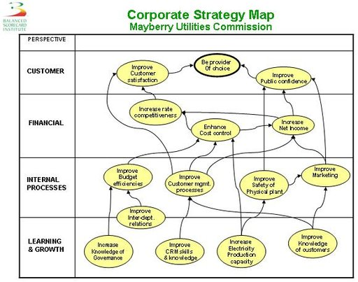
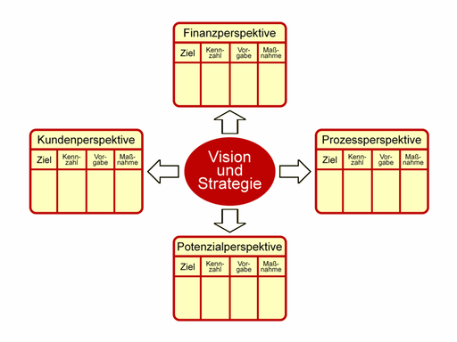
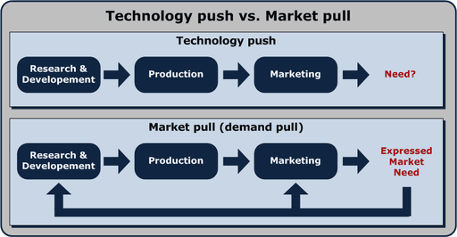

# Balanced Scorecard

**Balanced Scorecard** (**BSC**, englisch für *ausgewogener Berichtsbogen*) ist ein Konzept zur Messung, Dokumentation und Steuerung der Aktivitäten eines Unternehmens oder einer Organisation zu seiner Vision und Strategie.

## Überblick

### Geschichte

Unternehmen entwickelten im Industriezeitalter Steuerungssysteme, welche den effizienten Einsatz von Finanz- und Sachmitteln förderten. Die Schwerpunkte lagen dabei auf finanziellen Kennzahlen wie dem Du-Pont-Kennzahlensystem. Die Umbrüche vom Industriezeitalter ins Informationszeitalter gingen einher mit einem neuen, verschärften Wettbewerb. Immaterielle Vermögenswerte machten immer mehr den Wert eines Unternehmens aus.

Um dieser neuen Herausforderung gerecht zu werden, wurde 1990 eine Studie von mehreren Unternehmen beim Nolan Norton Institute in Auftrag gegeben. Ziel war es, die damals weit verbreiteten finanziellen Kennzahlen (ROCE, ROI) durch andere, nicht-monetäre Kennzahlen zu unterstützen. David P. Norton leitete die Studie, akademische Beratung kam von Robert S. Kaplan. Vertreter von 12 Unternehmen (AMD, American Standard, Apple, BellSouth, CIGNA, Conner Peripherals, Cray Research, DuPont, Electronic Data Systems, General Electric, Hewlett-Packard und Shell Canada) trafen sich daraufhin alle 2 Monate und entwickelten ein neues Performance-Measurement-Modell. Zu Beginn wurden Fallstudien vorhandener Performance-Measurement-Systeme untersucht. Dabei entdeckte man einen Ansatz der Firma Analog Devices. Diese setzte seit 1987 eine *Unternehmens-Scorecard* ein, welche finanzielle Kennzahlen durch nicht-monetäre unterstützte. Daraufhin nahm der damalige Vizepräsident, Arthur M. Schneiderman an einer Sitzung teil und legte den Grundstein der Scorecard. Während dieser Zeit wurde die Scorecard zu einer Balanced Scorecard ausgebaut, als erkannt wurde, dass es einer *Balance* zwischen unterschiedlichen Kennzahlen bedarf. Das waren bspw. ergebnis- und leistungsorientierte Kennzahlen. Die Leistungskennzahlen waren fast ausschließlich monetäre Kennzahlen, während die neu hinzugekommenen Kennzahlen nicht-monetärer Natur waren. Diese werden auch als Leistungstreiber bezeichnet. Auch interne und externe Ziele sollten in *Balance* stehen, was durch die vier verschiedenen Perspektiven abgebildet wird. Hierbei sind die Kunden- und Finanzperspektive in Balance zur Prozess- und Entwicklungsperspektive zu sehen. Die Studie war im Dezember 1990 abgeschlossen. Eine Zusammenfassung der Studie wurde unter dem Titel *The Balanced Scorecard – Measures that Drive Performance* zwei Jahre später im *Harvard Business Review* veröffentlicht.

Als sich nach der Veröffentlichung mehrere Unternehmen meldeten, um Unterstützung bei der Umsetzung zu erhalten, erkannten R. Kaplan und D. Norton, dass eine zweite Runde notwendig war. Die Gründe lagen in den verwendeten Kennzahlen der Unternehmen. Diese waren zu operativ ausgerichtet und nicht mit der Unternehmensstrategie verknüpft. Daraufhin versuchte man die relevanten Hauptkennzahlen (key measurements) aus der Unternehmensstrategie zu ermitteln. Um dies zu erreichen, wurde die Strategie auf *key success factors* heruntergebrochen (top-down reflection). Die Studienleiter veröffentlichten die Ergebnisse in einem zweiten Artikel *Putting the Balanced Scorecard to Work* im HBR.

Diese strategische Performance-Messung (BSC) musste jetzt in ein Performance-Measurement-System eingebettet werden. Die BSC sollte die Strategie des Unternehmens oder einer SGE (Strategische Geschäftseinheit) zum Ausdruck bringen, um dadurch Transparenz und Klarheit unternehmensweit zu schaffen. Dies bildete die Grundlage, um die SGE an der vorhandenen Vision und Strategie auszurichten und sollte ein wesentliches Merkmal für deren Erfolg sein.

Eine 1998 erhobene Studie der Gartner Group ergab, dass bis zum Jahr 2000 mindestens 40 % der Fortune-1000-Unternehmen eine BSC einsetzen möchten. Für den Wirtschaftsraum EMEA ist dieses Managementinstrument weiterhin auf Platz eins.

### Konzept

Das Grundkonzept basiert auf der Idee eines logischen oder physischen Objekts oder Systems, das Informationen und Materie aus seiner Umwelt aufnimmt, verarbeitet, in veränderter Form an seine Umwelt abgibt und als Reaktion darauf eine materielle und/oder immaterielle Wirkung erfährt. Dies geschieht nach dem Schema Eingabe → Verarbeitung → Ausgabe → Resultat/Wirkung/Ergebnis/Gewinn bzw. Input → Process → Output → Return/Outcome/Impact/Result. Die Logik der BSC fragt dabei im Sinne des Kanban oder eines Pull-Push-Prinzips zunächst nach der gewünschten Wirkung (Ziel, Absicht, Ende, Zweck), um davon ausgehend rückwärts bis zum notwendigen Input zu gelangen, also: Return/Outcome/Impact/Result ← Output ← Process ← Input. Da die Gestaltung einer BSC im Prinzip einer Programmierung entspricht, sind vom Grundsatz her auch Programmierhilfen wie Kontrollstrukturen (Struktogramme, Flussdiagramme), Kontrollflusspläne, Petrinetze, Objektorientierung etc. geeignete Arbeitsmittel. Es gibt aber neben allgemeinen Arbeitshilfen wie den unten angeführten natürlich auch kommerzielle und freie Software, die explizit für Balanced Scorecards entwickelt wurde, z. B. von Oracle, IBM und zahlreichen kleineren Anbietern.

Wesensmerkmale der BSC sind dabei:

So lassen sich sowohl die argumentativ-logischen Grundlagen des (Geschäfts-)Systems (Strategie bzw. Validierung) als auch deren operativ-praktische Umsetzung (Controlling bzw. Verifizierung) abbilden und steuern. Kern des Ansatzes ist, wie bei anderen Managementmethoden auch, Graphen, Bäume, Listen und Matrizen zur Strukturierung und Bearbeitung eines Problems, in diesem Fall Organisationsgestaltung, einzusetzen.

### Ziel

Der Begriff BSC wird irrtümlich für verschiedene Arten von kennzahlenbasierten Systemen verwendet. Die BSC, die eine Ursache-Wirkung-Analyse verlangt, ist aber eine originär andere Managementmethode als die deskriptive Prozesskostenrechnung oder das klassische monetäre Kennzahlensystem (siehe etwa Du-Pont-Schema). Aufgrund ihrer flexiblen und damit umfassenden Gestaltungsmöglichkeit ist die Balanced Scorecard ein Instrument zur Einrichtung eines integrierten Managementsystems. Über die Kennziffern zu den Funktionen und Attributen der betrachteten Objekte in der BSC wird es möglich, die Entwicklung der Geschäftsvision zu verfolgen. Auf diese Weise ermöglicht die BSC dem Management, nicht nur die finanziellen Aspekte zu betrachten, sondern auch strukturelle Frühindikatoren für den Geschäftserfolg zu steuern. Mit den Methoden der BSC soll also das Blickfeld des Managements von einer traditionellen, durch finanzielle Aspekte gekennzeichneten Unternehmenssicht auf alle relevanten Teile gelenkt werden und so zu einem ausgewogenen (englisch „balanced“) Bild führen. Die umfassendere Sicht ermöglicht dann konkretere Maßnahmen zur Ausrichtung der Organisation an den vorgegebenen Zielen.

### Vorgehen

#### Aufbau der BSC

Die Dimensionen der BSC werden für den konkreten Einsatz individuell festgelegt. Sie umfassen aber praktisch immer die Finanzperspektive (Return) und die Kundenperspektive (Output), meist auch die Prozessperspektive (Process) und die Potenzial- oder Mitarbeiterperspektive (Input). Ausgehend von einer Strategie, die neben den Shareholdern auch andere Stakeholder (zum Beispiel Mitarbeiter und Lieferanten) berücksichtigt, werden kritische Erfolgsfaktoren (KEF) bestimmt und daraus mit *Key Performance Indicators* (KPI) ein Kennzahlensystem *(scorecard)* erstellt. Die Messgrößen repräsentieren den Erfüllungsgrad der strategischen Ziele. In einem kontinuierlichen Prozess werden Ziele und Zielerreichung überprüft und durch korrigierende Maßnahmen gesteuert.

Konstitutives Element einer Balanced Scorecard ist das Ursache-Wirkungs-Diagramm. Durch die Ursache-Wirkungs-Zusammenhänge wird die Unternehmensstrategie mit der Kundensicht, diese mit der Prozesslogik und die wieder mit Maßnahmen auf Mitarbeiterebene verbunden. Die Logik der Abhängigkeiten führt also fast automatisch durch alle vier gewünschten Sichtweisen.

Die Abhängigkeiten lassen sich einfach ermitteln, indem alle betroffenen Ziele und Erfolgstreiber (Objekte) in einer (Kreuz-)Tabelle (Matrix) sowohl spalten- wie zeilenweise abgetragen werden und daraufhin die jeweiligen Abhängigkeiten und Beziehungen (Funktionen) hinsichtlich ihrer Signifikanz, Relevanz oder auch Validität im Rahmen der Validierung bewertet werden. Nachdem die Abhängigkeiten erarbeitet sind, wird das BSC-Diagramm in eine BSC-*Story* ausformuliert, zum Beispiel: *Um ein besseres finanzielles Ergebnis zu erzielen, müssen mehr Premiumkunden angesprochen werden, die wiederum einen ausgefeilten Betreuungsprozess erwarten, der nur durch gut geschulte Mitarbeiter sichergestellt werden kann.* Dann werden tatsächliche und erwartete Werte der Messgrößen (Attribute) abgebildet und in einem Soll-Ist-Vergleich oder auch Verifizierung abgeglichen. Anschließend werden mögliche und notwendige Maßnahmen, sowohl für das Geschäftssystem wie auf die Scorecard selbst diskutiert, definiert und umgesetzt. Abschließend wird eine Gesamtbewertung vorgenommen. Der Prozess wird regelmäßig wiederholt.

#### Einbinden von Beteiligten und Betroffenen

Um das BSC-Diagramm sinnvoll zu entwickeln, sollten idealerweise Interessenvertreter aus allen Unternehmensbereichen sowie Kunden, Lieferanten und andere Dritte einbezogen werden. Dadurch kann die BSC eine Rolle in einem Veränderungsprozess (Veränderungsmanagement, englisch „change management“) spielen. Wenn viele Betroffene in die Entwicklung der BSC eingebunden werden, wird die Strategie besser akzeptiert und die vorgesehenen Maßnahmen lassen sich besser umsetzen.

Typischerweise werden die strategischen Ziele aus verschiedenen Perspektiven betrachtet: Finanzen, Kunden, Prozesse (interne Abläufe) und Mitarbeiter (Wachstum und Reifung). Andere Perspektiven sind sinnvoll, wenn das Unternehmen starkes Gewicht darauf legt (zum Beispiel Partnermanagement oder Lieferanten-BSC). Für jede der Perspektiven werden Kennzahlen ausgewählt, die die Annäherung an die strategischen Ziele messen. Die Herausforderung liegt in der Auswahl weniger und zugleich relevanter Kennzahlen, die sich idealerweise in den verschiedenen Sichtweisen auch direkt beeinflussen. Beispielsweise sollte ein Kundenindikator so gewählt werden, dass seine Erreichung einen positiven Beitrag auf den übergeordneten Finanzindikator (Umsatz, Gewinn, Rendite oder Zahlungsreichweite) hat.

#### Komplexitätsreduktion

In der BSC sollen die Ziele ausgewogen verfolgt werden. Um dies zu erreichen, werden die Auswirkungen der Maßnahmen auf alle Ziele wiederholt bewertet. Aus psychologischer Sicht erfordert dies eine möglichst geringe Anzahl gleichzeitig zu betrachtender Kennzahlen, typischerweise ein bis zwei pro Perspektive. Insgesamt sollte eine BSC nicht mehr als 20 Kennzahlen haben. An der konsequenten Auswahl und Reduzierung auf wenige Kennzahlen scheitern viele BSCs. Ziel sollte deshalb sein, in **einer** Scorecard den gesamten Bogen von der übergreifenden Story bis zu den wenigen wirklich entscheidenden Erfolgsfaktoren, Messgrößen und Maßnahmen auf der untersten Ebene zu schaffen, sodass das Unternehmenskonzept in seinem Alleinstellungsanspruch (USP) auf einen Blick nachvollziehbar wird.

Um die Größe und Vielfalt von Organisationen abzubilden, können auch BSC für einzelne Unternehmensbereiche aus der Konzern-BSC abgeleitet werden (beispielsweise eine Einkaufs-BSC oder eine Human-Resources-BSC). Die Ziele der Unternehmensbereiche werden so mit den Unternehmenszielen verknüpft.

## Einführung von Balanced Scorecards

Zur Umsetzung und Integration mit Strategie-Diskussion und klassischem Controlling können Demingkreis und kontinuierlicher Verbesserungsprozess aus dem Qualitätsmanagement oder explizite Einführungs- bzw. Umsetzungs-/Durchführungskonzepte verwendet werden. Wesentlich sind folgende allgemeine Schritte (siehe auch *Wesensmerkmale der BSC* oben):

**Einführung vorbereiten**

- Untersuchungs- und Handlungsraum abgrenzen
- Handlungsideen und -maximen bestimmen
- Umfeld-, Situations- und Potenzialanalysen durchführen, z. B. Branchenstrukturanalyse, SWOT-Analyse
- Aufbau und Ablauf der BSC in Struktur und Detail überprüfen

**Leitaussagen entwickeln** (Strategie-/Validierungs-Part)

- Kernprobleme, -anforderungen und -möglichkeiten klären
- Qualitative Ziele (*Wirkungen/Zwecke*) und Erfolgstreiber (*Ursachen/Mittel*) ableiten (Strategy Map)
- Ursache-Wirkung-Zusammenhänge bewerten, z. B. mit Hilfe einer Matrix bzw. Kreuztabelle
- Leitmotive und -aussagen zusammenfassen (*Vision/Mission*)

**Ziele herunterbrechen** (Controlling-/Verifizierungs-Part)

- Messgrößen und Kennzahlen zu Zielen und Treibern entwickeln
- Soll- bzw. Ist-Werte sowie Zeitreihen und Abweichungen zu Kennzahlen ermitteln
- Maßnahmen, Verantwortliche, Termine und Budgets festlegen
- Handlungskonzept ausformulieren (*Story/Strategie*)

**Scorecard einführen**

- Kennzahlen in Controlling, Reporting und Forecasting einarbeiten
- Inhalte der Scorecard kommunizieren
- Umfeld regelmäßig überprüfen
- Perspektiven, Ziele, Treiber, Messgrößen, Kennzahlen, Maßnahmen, Termine, Budgets und Verantwortliche regelmäßig anpassen

Die ersten beiden Blöcke sind tendenziell zur Umwelt hin nach außen, die beiden letzteren eher zur Organisation nach innen gerichtet. Durch definierte Arbeitspakete eines Standardumsetzungskonzeptes wird die notwendige regelmäßige Überarbeitung der BSC ermöglicht. Einzelne Arbeitsschritte können wiederholt werden, wenn sich Eingangsparameter ändern bzw. bei Widersprüchen oder fehlender Selbstverpflichtung der Mitarbeiter. Die BSC kann so im Zeitablauf in der Organisation kontinuierlich weiterentwickelt werden.

## Typische Perspektiven

In der Regel werden vier Perspektiven mit je rund ein bis zwei Zielen sowie korrespondierenden Maßnahmen und den dazugehörigen Kennzahlen verwendet. Wichtig hierbei ist, dass dieses System, anders als fast alle anderen Controllingsysteme, *frei* ist in der Determinierung der Dimensionen (die Anzahl der Perspektiven kann durchaus größer oder kleiner sein). Häufig werden zwar die in der Literatur und nachfolgend beschriebenen Perspektiven verwendet. Die Stärke der BSC liegt jedoch darin, dass zum Beispiel Umweltfaktoren oder eine Ökobilanz ebenso Eingang finden können wie Stakeholder-Betrachtungen oder branchenspezifische Faktoren.

Nachfolgend sind die Perspektiven nach Robert S. Kaplan und David P. Norton aufgeführt:

**Finanzperspektive:** Kennzahlen zum Erreichen der finanziellen Ziele.

- Umsatz pro Vertriebsbeauftragtem: Unterstützt das Wachstum des Unternehmens, nicht notwendigerweise die Profitabilität.
- Kosten pro Stück: Unterstützt das Kostenbewusstsein, hohe Volumina – steht aber der Qualität entgegen.

In der **Kundenperspektive** liegt der Schwerpunkt auf dem Identifizieren der Kunden- und Marktsegmente, auf denen man wettbewerbsfähig sein möchte. Die identifizierten Kunden- und Marktsegmente sind anschließend die Quelle für die finanzwirtschaftlichen Ziele.

Ergebniskennzahlen, auch Kernkennzahlengruppe genannt, sind nach Kaplan bei allen Firmen gleich: Marktanteil, Kundentreue, Kundenakquisition, Kundenzufriedenheit und Kundenrentabilität.

Leistungstreiber sind das Wertangebot des Unternehmens. Da diese von Unternehmen zu Unternehmen unterschiedlich sind, werden nur Eigenschaftsklassen aufgezählt.

- Produkt- und Dienstleistungseigenschaften
- Kundenbeziehungen
- Image und Reputation

**Interne Prozessperspektive** zum Erreichen der internen Prozess- und Produktionsziele

- Prozessqualität: Unterstützt die ausgelieferte Qualität, nicht notwendigerweise einen effektiven und effizienten Produktionsprozess.
- Prozessdurchlaufzeit: Unterstützt schnelle Durchlaufzeiten, geringe Kapitalbindung und wenig Zwischenlager. Kann mittels *Process Performance Management* detailliert und kontinuierlich ausgewertet werden.

**Mitarbeiter-**, **Potenzial-** bzw. **Lern-** und **Wachstumsperspektive:** Kennzahlen zum Erreichen der (langfristigen) Überlebensziele der Organisation

- Umsatzverhältnis neuer Produkte zu alten Produkten: Unterstützt schnelle Neu- und Weiterentwicklung von Produkten.
- Fluktuation von Leistungsträgern aus der Organisation heraus: Unterstützt die langfristige Beschäftigung von Leistungsträgern in der Organisation, fördert Leistungsdifferenzierung, kann Querdenker blockieren.

## Beispiel

In einem Unternehmen soll als wesentliches Teilziel die Kundenorientierung verbessert werden. Die Perspektive ist hier also die des Kunden. Als kritische Faktoren werden dabei eine sehr gute Termintreue, wenige Anlässe zu Beanstandungen und schneller Service bzw. kurze Reparaturdauern gesehen. Gleichzeitig dürfen die Kosten nicht wesentlich erhöht werden.

Damit können etwa die folgenden Kennzahlen eingesetzt werden:

- Anteil nicht eingehaltener Terminzusagen,
- Anteil beanstandeter Produkte nach Auslieferung,
- Durchschnittliche Verweildauer bei Kundendienst und Reparatur,
- Kosten pro Produkt.

Diese werden zunächst ermittelt, etwa zu 20 Prozent nicht eingehaltene Termine, zehn Prozent Beanstandungen und vier Wochen Verweildauer. Im nächsten Jahr sollen dann nur noch weniger als zehn Prozent der Termine nicht eingehalten werden, die Anzahl der Beanstandungen soll auf sieben Prozent verringert werden und die Verweildauer im Schnitt nur noch drei Wochen betragen. Als Maßnahmen kommen Verbesserung der Terminplanung (Termintreue), Verbesserung des Qualitätsmanagements und Vergrößerung der Anzahl Mitarbeiter in der Service- und Reparaturabteilung (Verweildauer) in Betracht. Da die letzte Maßnahme die Kosten wesentlich erhöhen würde, kann auch oder zusätzlich versucht werden, die Effizienz der Abteilung zu verbessern. Ein hoher Krankenstand spricht für eine geringe Mitarbeiterzufriedenheit. Auch Schulungsmaßnahmen sind in den letzten Jahren nicht durchgeführt worden. Als weitere Kennzahlen werden deshalb herangezogen:

- Durchschnittliche Anzahl Krankheitstage
- Durchschnittliche Schulungstage pro Mitarbeiter

## Weiterentwicklungen und Anwendungen

Die Balanced Scorecard als Vorgehenskonzept kann nicht nur auf ein Unternehmen und seine Führung angewandt werden. Weitere Anwendungsgebiete sind zum Beispiel unternehmensübergreifende Projekte. Für diese wurden die Perspektiven der Balanced Scorecard angepasst und mit dem Begriff der Project scorecard belegt.

Der Fokus der Balanced Scorecard liegt auf unternehmensinternen Faktoren, die den Erfolg eines Unternehmens beeinflussen. Basierend auf dem Public-Value-Konzept haben Timo Meynhardt und Peter Gomez eine Public-Value-Scorecard entwickelt, welche die Balanced Scorecard um eine Außensicht ergänzt. Dieses Instrument stellt Wertschöpfung in verschiedenen Dimensionen sowie die dazwischen bestehenden Spannungsfelder ins Zentrum und ermöglicht dadurch eine strukturierte Erfassung der gesellschaftlichen Chancen und Risiken im Unternehmensumfeld. Eine Erweiterung um Umweltaspekte ergibt sich zum Beispiel durch die *Sustainability Balanced Scorecard* mit der Verbindung zum betrieblichen Umweltinformationssystem (BUIS). Dabei können Umweltaspekte in die vier Standardperspektiven einer BSC integriert, indem dort die jeweils relevanten ökologischen Performance-Indikatoren, Zielwerte und Maßnahmen ergänzt werden. Die klassische BSC kann aber auch um eine oder mehrere zusätzliche Perspektiven erweitert werden, welche die relevanten Umweltaspekte zusammenfassen. In der Regel wird dabei die Variante favorisiert, lediglich die Nachhaltigkeits- bzw. Umweltperspektive zu ergänzen.

Eine Weiterentwicklung des Vorgehenskonzeptes der Balanced Scorecard und Anpassung auf interaktive Internet-Anwendungen ist die *collaborative balanced scorecard*. Deren Ergebnis entspricht dem einer Balanced Scorecard. Bei der Erstellung der *collaborative balanced scorecard* wirken jedoch neben Managern auch viele Experten aus der Organisation mit. Das Vorgehen zur Entwicklung ist angelehnt an das Vorgehen der *peer production* in der Softwareentwicklung. Erste Anwendungen eines kollaborativen Ansatzes wurden etwa innerhalb von Xerox erfolgreich durchgeführt. Weiterhin stehen für die Erstellung von Balanced Scorecards zahlreiche Programme zur Verfügung. Für die Visualisierung der Kennzahlen werden oft Kennzahlen-Cockpits verwendet.

Des Weiteren wird ein modifiziertes Modell, dass Balanced-Innovation-Card-Kennzahlensystem (BIC) zur Planung und Kontrolle von Projekten im Innovationsmanagement verwendet. Dieses Modell stellt eine Modifizierung der Balanced Scorecard (BSC) dar, welche bei der Strategieimplementierung und bei der Erreichung von Unternehmenszielen unterstützt. Der Einsatz einer BIC führt zu einer ganzheitlichen Betrachtung des Innovationsmanagements und hat die effiziente Gestaltung des gesamten Innovationsmanagements zum Ziel. Den Rahmen für dieses Modell setzt die durch das Management festgelegte Innovations- oder Unternehmensstrategie. Gleich dem Balanced-Scorecard-Ansatz bestimmen die Ursache-Wirkung-Beziehungen auch das BIC-Modell. Dabei ist die BIC insbesondere für das Innovationsmanagement mittelständischer Unternehmen konzipiert.

## Erkenntnismodell

Da die Balanced Scorecard letztlich auf einem positiven Modell basiert, kann es erkenntnistheoretisch im Sinne einer Falsifizierung sinnvoll sein, die Scorecard statt auf Nutzen, Strategie, Chancen und richtiges Handeln im Gegenteil konsequent auf potenziellen Schaden, Hygiene, Risiken und Fehlervermeidung auszurichten. Dabei müsste entsprechend durchgängig auf die möglichen Fehler mit den größten Schadens-Risiken abgestellt und die BSC konsequent mit einer Fehler-Möglichkeiten- und Einfluss-Analyse (FMEA bzw. FMECA, FMEDA, Fehlerbaumanalyse) ergänzt bzw. integriert oder gleich durch diese ersetzt werden. In diesem Fall wäre die FMEA, der ebenfalls ein Ursache-Wirkungs-Modell zugrunde liegt, auf alle Perspektiven auszudehnen. Das Verhältnis von Regel (Objekt/Funktion) und Ausnahme (Maßnahme) würde dadurch indes umgekehrt und das regelmäßige Handeln grundsätzlich als Vermeidung und Beseitigung von Mängeln, Ausnahmen und Fehlern begriffen (Schadens- statt Nutzen-Orientierung). In der Praxis wird es allerdings wohl am ehesten auf eine Mischung beider Ansätze – QFD und FMEA über alle Perspektiven – hinauslaufen oder wie beim SWOT auf alle 4, nämlich Stärken/Chancen (Nutzenseite) und Schwächen/Risiken (Schadenseite).

## Bewertung

### Chancen

- Balanced Scorecards ermöglichen es, Strategien darzustellen, zu operationalisieren und zu kommunizieren.
- Die Vision bzw. Strategie lässt sich in operatives Handeln (Maßnahmen) herunterbrechen.
- Die Einbeziehung von Lead- (vorlaufend / Ursachen) und Lag-Indikatoren (nachlaufend / Wirkungen) vermittelt ein ausgewogenes (balanced) Bild und ermöglicht eine vorausschauende Planung und Führung. Das Geschäftsmodell lässt sich so durch strukturelle Frühindikatoren hoffentlich erfolgreich steuern.
- Sie ermöglicht die Verknüpfung mehrerer bzw. aller anderen Controllinginstrumente (Kleber-Funktion)
- Sie ermöglicht im Sinne eines SWOT insbesondere die einfache Verbindung der Funktionen von Quality Function Deployment (QFD) für Nutzen bzw. Chancen-Aspekte und Fehler-Möglichkeiten- und Einfluss-Analyse (FMEA) für Schadens- bzw. Risiken-Aspekte für das ganze System (Organisation, Unternehmen etc.) bzw. deren Abbildung über alle Ebenen der BSC.
- Sie offenbart Defizite und wichtige Aufgaben.
- Die Wirkungszusammenhänge zwischen den einzelnen Unternehmenszielen werden deutlich.
- Die einfache Struktur ermöglicht eine Komplexitätsreduktion in der Steuerung.
- Maßnahmen und Verantwortlichkeiten lassen sich begründen.
- Mitarbeiter werden gestärkt: Sie erhalten eine eigene Perspektive. Ihre Tätigkeit leistet einen messbaren Beitrag zur Umsetzung der Gesamtstrategie der Unternehmung.
- Die Balanced Scorecard bezieht neben monetären Zielen auch nichtmonetäre Ziele mit ein, was sie zu einem ganzheitlichen Managementprozess macht.
- Es bietet sich die Möglichkeit einer Einbeziehung bzw. Ausrichtung an dem Gedanken des Shareholder Value bzw. Discounted Cash Flow / Unternehmenswert.

### Risiken

- Eine Balanced Scorecard birgt, wie jedes Kennzahlensystem, die Gefahr, falsche bzw. unrealistische Ziele umzusetzen. Falsche Annahmen und Vorstellungen bzw. Hypothesen über die der eigenen BSC bzw. der eigenen Organisation / Unternehmung zugrundeliegenden Ursache-Wirkungs- bzw. Zweck-Mittel-Beziehungen führen über Modellierung und Operationalisierung letztlich auch zu einer falschen Scorecard und zu falschem Handeln. Auch schlechte Strategien werden durch den professionellen Prozess umgesetzt.
- Es besteht die Gefahr, die Balanced Scorecards mit zu vielen und zu komplexen Zielen zu überfrachten.
- Eine oberflächliche Betrachtung der Balanced Scorecard kann fälschlicherweise zu einer einseitigen Konzentration auf die Kennzahlen, insbesondere vergangenheitsbasierte Kennzahlen, führen. In diesem Fall geht die eigentliche Intention der Balanced Scorecard verloren, die Ausrichtung des Handelns an strategischen Zielen und dem nachhaltigen, zukunftsorientierten Aufbau von Potenzialen (= Handlungsoptionen für die Zukunft).
- Durch die Fixierung auf Kennzahlen kann es zur bewussten Manipulation oder zu einer einseitigen Optimierung der Kennzahlen kommen – insbesondere, wenn die Vergütung der Mitarbeiter an die Erfüllung von Kennzahlen gebunden ist. Daher ist das Prinzip der Ausgewogenheit (Balance zwischen den einzelnen Zielen) zu beachten, um eine Fehlsteuerung zu vermeiden.
- Die unreflektierte Anwendung der Ergebnisse der Prozesskostenrechnung ohne Begleitung durch ein Balanced-Scorecard-Management kann zu gravierenden Fehlentscheidungen führen und somit den Betriebserfolg gefährden.
- Die Operationalisierung kann dazu verführen, sich auf eine Papierform, statt auf das konkret Gegebene zu verlassen und somit sich schnell verändernde Umweltbedingungen nur unzureichend wahrzunehmen und darauf zu reagieren. Dies muss gegebenenfalls durch eine unabhängige oder im Rahmen der BSC besondere *Chancen-Risiken*-Sensorik/-Seismographik (Perspektiven, Objekte, Messgrößen, Kennzahlen) abgefangen werden, ebenso wie *Stärken/Schwächen*-,*Umsatz/Kosten*- oder *Innovations-/Traditions-*Aspekte.
- Vorsicht ist angebracht, wenn Programme die Leistungs- und Verhaltenskontrolle von Mitarbeitern ermöglichen. Wenn derart betroffene Mitarbeiter bei der Einführung nicht ausreichend mitentscheiden konnten, besteht das Risiko fehlender Akzeptanz. Ferner unterliegt eine derartige Verwendung bei Unternehmen in Deutschland mit Betriebsrat der Mitbestimmung nach dem Betriebsverfassungsgesetz.
- Studien zeigen, dass die größten Umsetzungserfolge letztlich durch eine Fokussierung auf die Ziel-Maßnahmen-Verknüpfungen (Relevanz-, Plausibilitäts- bzw. Signifikanz-Kriterium) bzw. das *Maßnahmen-Management* anstelle der Kennzahlenorientierung erreicht werden; d. h. Kennzahlen können die Zielformulierung nicht ersetzen.

### Kritik

Für die Umsetzung der Unternehmensstrategie mit dem Instrument der Balanced Scorecard ist es erforderlich, für jede Planabweichung den Verantwortlichen für die entsprechende Kennzahl heranzuziehen, um die langfristige Akzeptanz sicherzustellen. Dabei sollte beachtet werden, dass der Kennzahlen-Verantwortliche nicht für jede eingetretene Planabweichung verantwortlich gemacht werden kann. Gerade bei exogenen Störungen (z. B. Konjunktur, Rohstoffpreisen etc.) ist der Grund für die Planabweichungen nicht bei den Kennzahlen-Verantwortlichen zu suchen. Daher ist es von grundlegender Bedeutung, dass zwischen zu verantwortenden und nicht zu verantwortenden Planabweichungen klar unterschieden wird. Die beste Möglichkeit, dies zu erreichen, besteht darin, schon bei der Entwicklung einer Balanced Scorecard die einer Kennzahl zuzuordnenden Risiken anzugeben, denn genau diese Risiken beschreiben eine nicht zu verantwortende Abweichung von einem Plan- oder Erwartungswert. Mit dieser Vorgehensweise ist eine Integration von strategischem Management (Balanced Scorecard) und Risikomanagement möglich, was die Effizienz und die logische Konsistenz beider Systeme fördert.

Aktuell spielen Risiken in den Balanced Scorecards kaum eine Rolle, was daran liegen kann, dass Kaplan und Norton in ihrer Beschreibung der Balanced Scorecard diesem Thema nahezu keinen Raum eingeräumt haben. Daher ist eine Weiterentwicklung der traditionellen Balanced Scorecard unter Zuordnung von Risiken, etwa in Form einer Risikomatrix, zu den Kennzahlen eine logische Konsequenz, um die Umsetzung einer wertorientierten Unternehmensstrategie voranzutreiben.
