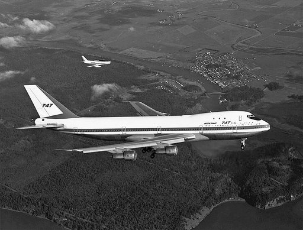
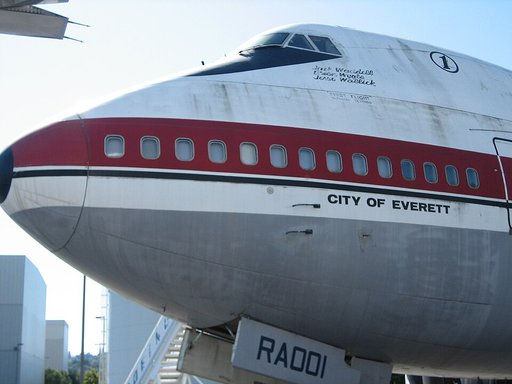
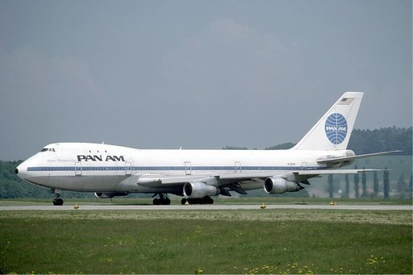

# Boeing 747

Die **Boeing 747**, auch ***Jumbo-Jet*** oder ***Jumbojet*** in Anlehnung an den Elefanten *Jumbo*, ist ein vierstrahliges Großraumflugzeug des US-amerikanischen Flugzeugherstellers Boeing, das seit seiner Entwicklung in den 1960er-Jahren über mehrere Jahrzehnte das weltgrößte Passagierflugzeug war.

Ursprünglich war die Boeing 747 als militärischer Großraumfrachter entworfen worden. Aufgrund der Forderung der US Air Force, dass ein neuer Frachter auch über ein Bugladetor mit hochklappbarer Nase beladen werden sollte, entwarfen alle Wettbewerber ein Flugzeug, bei dem das Cockpit oberhalb des Laderaums angeordnet war. Der Gewinner der Ausschreibung war Lockheed mit der Lockheed C-5 Galaxy. Aus der Anordnung des Cockpits über dem Hauptdeck resultiert die charakteristische Silhouette der Boeing 747 mit „Buckel“ (Oberdeck).

Die 747 absolvierte am 9. Februar 1969 ihren Erstflug und gehört zu den bekanntesten und meistgenutzten Flugzeugtypen. Die Maschine wird hauptsächlich für zivile Zwecke eingesetzt. Das Oberdeck wurde bei den Passagierversionen im Laufe der Entwicklung verlängert und zu einem immer größeren zweiten Fluggastdeck erweitert, das sich in neueren Varianten über das vordere Drittel der Flugzeugkabine erstreckt. Alle Varianten mit langem Oberdeck haben beidseitig große Notausstiegstüren in der Mitte der oberen Kabine.

Nach einigen Jahrzehnten des Wettbewerbs haben sich verbrauchsgünstige zweistrahlige Großraumflugzeuge im Passagierbetrieb durchgesetzt, auch Airbus stellte den Bau der vierstrahligen A340 und A380 ein. Als von vorne beladbarer Frachter ist die 747 noch in dreistelliger Anzahl im Einsatz.

Am 29. Juli 2020 gab Boeing die Einstellung der Produktion der 747 bekannt. Im November 2021 fand die letzte Auslieferung einer (noch vorgehaltenen) Passagiermaschine statt; das letztgebaute Exemplar der 747-8I war bereits im Juli 2017 an Korean Air gegangen. Die letzte Boeing 747 überhaupt verließ als Frachtversion am 6. Dezember 2022 in Seattle die Montagehalle, flog am 18. Dezember erstmals und wurde nach einem Festakt am 31. Januar 2023 tags darauf an die Fluggesellschaft Atlas Air Worldwide ausgeliefert.

## Geschichte

Noch bevor Boeing den CX-HLS (*Cargo Experimental-Heavy Logistics System*) Wettbewerb der US Air Force 1965 für ein neues großes Transportflugzeug gegen Lockheed mit ihrer C-5 Galaxy verloren hatte, trat Pan Am an Boeing heran mit dem Wunsch nach einem Passagierflugzeug mit der doppelten Kapazität der Boeing 707.

Verbürgt ist der Dialog zwischen dem Pan-Am-Chef Juan Trippe und dem Boeing-Chef William Allen, bei dem Trippe sagte: “If you build it, I buy it” („Wenn Sie es bauen, dann kaufe ich es“). Worauf Allen antwortete: “If you buy it, I build it” („Wenn Sie es kaufen, dann baue ich es“). Nach der Bestellung von 25 Flugzeugen durch Pan Am am 13. April 1966 wurde mit der Entwicklung begonnen. Leitender Ingenieur und (zusammen mit Juan Trippe und William Allen) der „Vater“ der Boeing 747 war Joe Sutter. Die Montage des ersten Prototyps begann im Januar 1967, die Rollout-Zeremonie fand am 30. September 1968 statt. Zum Zeitpunkt des Jungfernflugs am 9. Februar 1969 war die 747 das größte Passagierflugzeug der Welt, sie blieb es bis zum Erstflug des Airbus A380 am 27. April 2005.

Zuerst wurde die 747 als ein doppelstöckiges (in etwa zwei 707-Rümpfe übereinander) Flugzeug geplant. Die 747 sollte auch leicht in einen Frachter umzurüsten sein, da bereits (nach damaligen Planungen) Mitte der 1970er-Jahre das amerikanische Überschallflugzeug Boeing 2707 nahezu alle interkontinentalen Passagierflüge übernehmen sollte. Der Umbau war jedoch wegen der schwierigen Beladbarkeit des Oberdecks mit Fracht nicht gut möglich; außerdem befürchtete man, dass Passagiere schlecht aus ihm evakuiert werden könnten. Schließlich wurde ein kreisrunder Rumpf mit großem Durchmesser gewählt, der eine zuvor nicht da gewesene Großraumpassagierkabine und als Frachter die Beladung mit zwei Reihen 8 Fuß (ca. 2,44 m) breiter Luftfrachtcontainer/Paletten unterschiedlicher Länge nebeneinander auf der ganzen Kabinenlänge ermöglichte. Durch das Bugtor in der Flugzeugnase der als Frachter gebauten Maschinen können z. B. bis zu 40 Fuß lange Luftfrachtcontainer oder andere, noch längere, Frachtgüter geladen werden, deren Länge und Breite nur durch die Kabinenmaße der B 747 Grenzen gesetzt sind. Wegen der relativ spitzen Nase der Boeing 747 ist jedoch das nach oben aufklappbare Bugtor (anders als bei Frachtflugzeugen, z. B. Lockheed C-5, Antonow An-124) nicht so breit wie der volle Rumpfdurchmesser, sondern nur 3,45 m × 2,49 m groß, sodass die Container nacheinander geladen werden müssen. Das Bugtor ist auch der Grund dafür, dass das Cockpit ins Oberdeck verlegt wurde. Hinter diesem entstand auch noch im aerodynamisch auslaufenden Oberdeck eine kleine zusätzliche Passagierkabine. Durch den Fußboden des Oberdecks ist die Ladehöhe durch das Bugtor auf etwa 8 Fuß beschränkt. Um die volle Rumpfhöhe zum Laden von 10 Fuß (3,05 m) hohen maximal ca. 20 Fuß langen Paletten nutzen zu können, muss deshalb das Rumpftor auf der hinteren linken Seite benutzt werden. (Um möglichst viele dieser Paletten laden zu können, besitzen auch die Frachtversionen der 747-400 und 747-8 das kurze ursprüngliche Oberdeck. Dieses ist außerdem leichter, sodass die Nutzlast steigt.) Die Boeing 747 selbst stammt damit nicht von Boeings gescheiterten CX-HLS-Plänen ab, jedoch wurde ihr erster Triebwerkstyp aus P&Ws unterlegenem Entwurf für den *CX-HLS*-Wettbewerb entwickelt.

Zum Zeitpunkt der Entwicklung der 747 hatte man noch keine Erfahrung mit derartig großen Zivilflugzeugen. Sie stellten die Boeing-Ingenieure vor zum Teil sehr anspruchsvolle technische Herausforderungen. Unter anderem mussten Rumpf, Tragflächen, Fahrwerk und Triebwerke nach neuen Auslegungsgrundsätzen konzipiert werden. Für die Endmontage der 747 wurde das Boeing-Werk Everett errichtet, welches damals das größte Gebäude der Welt (gemessen am umbauten Raum) war und heute noch, nach dem New Century Global Center, Rang zwei belegt.

Zu Beginn wurden alle 747-Versionen mit dem Pratt & Whitney JT9D ausgerüstet. Dieses Triebwerk war aus dem in der Ausschreibung unterlegenen Entwurf des Triebwerks für das CX-HLS (Cargo Experimental-Heavy Logistics System) entwickelt worden. Später waren auch das CF6-50 von General Electric (unter Beteiligung u. a. der MTU) und das RB211 von Rolls-Royce verfügbar, wobei sich das CF6 als das erfolgreichste Triebwerk erwies. Für die 747-400 sind drei verschiedene Triebwerke erhältlich: General Electric CF6-80C2, Pratt und Whitney PW4000 und Rolls-Royce RB211. Diese hohe Anzahl verschiedener Triebwerke führte zu Problemen, weswegen man sich entschied, bei der neuesten Version 747-8 nur Triebwerke eines Herstellers zu verwenden.

Das Urmodell 747-100 war noch kein kommerzieller Erfolg; den brachte erst das Nachfolgemodell 747-200 ab 1970. Es hatte leistungsfähigere Triebwerke (CF6-50), größere Treibstofftanks (durch Wegfall der Wassertanks zur Leistungssteigerung beim Start) und dementsprechend ein größeres maximales Startgewicht sowie eine größere Reichweite. Die 747-200 wurde bis ins Jahr 1992 hinein gefertigt. Von dieser Variante wurde auch erstmals eine Frachtversion angeboten, deren Erstkunde die Lufthansa war.

Boeing überarbeitete die 747 bis zur Version 400 eher evolutionär. Bei der 747-200 wurden im Wesentlichen andere Triebwerke verwendet und die Struktur für eine bessere Haltbarkeit modifiziert, da die ersten Exemplare vorzeitig Risse im Bereich des oberen Decks bekamen. Die 747-300 bekam ein gestrecktes oberes Deck, wobei die Technik kaum verändert wurde. Auch bei der 747-400, die ab 1988 verkauft wurde, wollte man anfangs auf neue Techniken wie das Glascockpit verzichten, wie sie der Konkurrent Airbus bereits bei der A320 verwendete, doch auf Grund des Drucks der Fluggesellschaften, vor allem der Lufthansa, wurden bei der 747-400 das Cockpit und die Elektronik stark überarbeitet. Die Anzahl der Instrumente, Anzeigen und Schalter wurde von etwa 970 auf etwa 370 reduziert. Durch die neue Avionik mit Teilautomatisierung konnte auf einen Flugingenieur verzichtet werden. Die Spannweite wurde um 2 m vergrößert und die Tragflächenspitzen wurden mit treibstoffsparenden Winglets ausgerüstet.

Boeing erwog Mitte der 1990er-Jahre verschiedene Weiterentwicklungen der 747-400, um der sich abzeichnenden geänderten Wettbewerbssituation durch Entwicklung des Airbus A380 zu begegnen. Nachdem sich jedoch im Gegensatz zum Airbus-Projekt keine Kunden für diese neuen Varianten der 747 fanden, beendete Boeing seine *747X*- bzw. *747X-Stretch*-Pläne und präsentierte stattdessen den Sonic Cruiser. Die Krise der Zivilluftfahrt kurz nach der Jahrtausendwende – verstärkt durch die Terroranschläge am 11. September 2001 – ließ auch dieses Projekt scheitern. Nachdem sich die Zivilluftfahrt 2004 wieder erholt hatte und neue, sparsamere Triebwerke in der Entwicklung waren, stellte Boeing unter dem Namen *Boeing 747 Advanced* einen Plan für eine wirtschaftlichere und leisere Boeing-747-Variante vor. Diese war deutlich kleiner als die A380 und sollte die Marktlücke zwischen den Flugzeugen Airbus A340-600 und Boeing 777-300 sowie der A380 erschließen. Am 15. November 2005 wurde diese Variante unter dem offiziellen Namen Boeing 747-8 der Öffentlichkeit präsentiert. Während sich die Frachtversion 747-8F sofort verkaufte, erhielt Boeing erst nach einer weiteren Rumpfverlängerung und somit Kapazitätssteigerung am 6. Dezember 2006 den ersten Auftrag von der Lufthansa für 20 Exemplare der Passagierversion 747-8I.

Am 16. März 2007 gab Boeing bekannt, die Produktion der 747-400 in der Passagierversion einzustellen. Aus diesem Grund wurden drei Bestellungen von Boeing gekündigt. Die letzte Passagiermaschine des Typs Boeing 747-400 war im April 2005 an China Airlines ausgeliefert worden.

Später schrumpfte der Markt für die 747 deutlich. Boeing konnte für die letzte Version 747-8/-8F ab 2005 nur 155 Bestellungen verzeichnen. Die Fluggesellschaften nahmen zudem mehr 747 außer Betrieb als sie neu bestellten. Die weltweite 747-Flotte verkleinerte sich bis 2013 auf 685 Stück – rund 15 Jahre vorher flogen die Airlines noch mit mehr als 1000 Maschinen dieses Typs.

Größter Abnehmer war bis 1983 Pan American World Airways (*Pan Am*), anschließend Japan Airlines (108 bis zum Jahr 2004 ausgelieferte Maschinen).

Am 24. Februar 2008 erfolgte mit einer regulären Boeing 747-400 ein Flug vom Londoner Flughafen Heathrow nach Amsterdam mit Biokraftstoff anstelle von Kerosin. Der Flug sollte den Ingenieuren wichtige Erkenntnisse über die Nutzung von Biokraftstoff liefern. Dessen Einsatz in der Luftfahrt stellt eine besondere Herausforderung dar, da gewährleistet sein muss, dass der Treibstoff auch in einer Flughöhe von über 10.000 m und Temperaturen von unter −60 °C flüssig bleibt und eine konstante Verbrennungsleistung bietet.

Die letzte Boeing 747 wurde Anfang Februar 2023 an die Fluggesellschaft Atlas Air Worldwide übergeben; Atlas betreibt das Flugzeug im Langzeitcharter und in Teilbemalung von *Apex Logistics* im Pazifikraum. *Apex Logistics* ist ein Tochterunternehmen von Kühne + Nagel.

Zum Zeitpunkt der Auslieferung der letzten Boeing 747 waren noch 385 Maschinen dieses Typs im aktiven Betrieb. Dabei handelte es sich überwiegend um Frachter. Die Hauptbetreiber sind für diese Atlas Air (45 Stück), UPS Airlines (41), Cargolux (29) und Kalitta Air (24). Noch 11 % der Gesamtflotte sind (Stand 2023) als Passagierflugzeuge im Einsatz oder noch kurzfristig geparkt, die meisten davon bei Lufthansa (27 Stück). Von der Passagierversion 747-8I sind 19 bei Lufthansa verblieben, 7 bei Korean Air und 3 bei Air China. Die 747-400 ist in dieser Rolle nur noch bei Lufthansa (8 Stück), bei Air China (2) und Asiana Airlines (1) vorhanden.

Von den Flugzeugen waren 227 Exemplare aus der Serie 747-400 (59 %) in Nutzung und 131 Stück (34 %) aus der neuesten Baureihe 747-8. Nur 7 % stammten noch aus den vorangegangenen Varianten. Sie setzen sich zusammen aus 16 747-200, 6 747-100, 3 747SP und 2 747-300. Alle 747-100 werden von der iranischen Luftwaffe betrieben, Durchschnittsalter 52 Jahre.

## Produktion

Die Endmontage der 747 fand in dem für diesen Zweck neu gegründeten Boeing-Werk Everett statt, in dem sich die mit 13.385.378 m³ nach Volumen zweitgrößte Halle der Welt befindet. Hier wurde um das Flügelmittelstück, das die Tragflächen verbindet, das Rumpfmittelteil montiert und dann der Vorderrumpf und der hintere Rumpfabschnitt daran befestigt.

## Konstruktion

Diese Angaben beziehen sich, wenn nicht anders angegeben, auf die Version 747-400.

### Rumpf

Der Rumpf ist eine Ganzmetall-Halbschalenkonstruktion mit tragender Außenhaut, die mit Längs- und Querspanten vernietet ist. Passagier- und Frachtbereich sind als Druckkabine ausgeführt. Der Passagierraum ist im vorderen Bereich doppelstöckig, der obere Bereich enthält auch das Cockpit, woraus sich eine ungewöhnlich hohe Sitzposition der Piloten ergibt. Unter dem Passagierraum liegt der Frachtraum. Auf jeder Rumpfseite befinden sich je fünf Passagiertüren im Hauptdeck und je eine im Oberdeck, von denen die Türen im oberen Deck ausschließlich als Notausstieg dienen. Ausnahme ist die verkürzte 747-SP, die nur vier Türen auf jeder Rumpfseite des Hauptdecks hat. Es liegen mehr als 275 km Kabel in der 747.

Der charakteristische Buckel sollte in der Ursprungsversion nur den Einbau eines Bugtores zum einfacheren Be- und Entladen von Fracht ermöglichen: Während die unteren Ebenen komplett dem Frachttransport dienten, waren im Buckel das Cockpit und Sitzgelegenheiten für das Begleitpersonal untergebracht. Bei späteren Passagierversionen wurde das Oberdeck zur Schaffung zusätzlicher Passagierkapazität mehrfach erweitert, während reine Frachtversionen durchgängig ein kurzes Oberdeck aufweisen.

Es gibt noch andere Flugzeuge mit einem „Buckel“ über dem Rumpf wie die Budd RB-1 Conestoga, die Bristol 170, die Armstrong Whitworth Argosy und die Aviation Traders ATL-98 Carvair, die auf Basis der Douglas DC-4 von 1961 bis 1969 gebaut wurde und als ideeller Vorläufer der Boeing 747 gilt. Weiterhin verfügen die Frachtflugzeuge Lockheed C-5, Antonow An-124 und die bei dem russischen Überfall auf die Ukraine 2022 zerstörte An-225 über ein Cockpit im Oberdeck des Rumpfes sowie über ein Bugladetor, das sich prinzipiell mit dem der Frachtversionen der 747 vergleichen lässt. Jedoch haben diese keinen Buckel, sondern das Oberdeck liegt vor den Tragflächen der als Schulterdecker angelegten Flugzeuge.

Aufgrund der Länge tritt während des Fluges eine leichte Verformung des Rumpfes auf, die anfangs von den Gierdämpfern nicht ausreichend kompensiert wurde, sodass eine langsame Gierschwingung auftrat. Entdeckt wurde dies auf einem Transatlantikflug zur Pariser Luftfahrtschau, bei dem einige Passagiere im Heck luftkrank wurden. Nach Rüttelversuchen konnte der Fehler lokalisiert und das Gierdämpfer-System angepasst werden. Der Effekt ist seitdem so stark reduziert, dass er von den Passagieren nicht mehr wahrgenommen wird.

### Cockpit

Die Ausführungen der 747 bis zur 747-300 werden von zwei Piloten und einem Flugingenieur geflogen. Ohne Trägheitsnavigationssystem gehörte auch ein Navigator zur Besatzung. Die Flugbesatzung der 747-400 und 747-8 besteht aus zwei Piloten in einem Glascockpit. Dies geschah vor allem auf den Willen der an der Entwicklung beteiligten Lufthansa, da Boeing zuerst dem durch Airbus angestoßenen Trend hin zum Zwei-Mann-Cockpit nicht folgen wollte. Das Cockpit der 747-400 weist leichte Ähnlichkeiten mit den Cockpits der Boeing 757 sowie der Boeing 767 auf. Um die Umschulungszeit von der 747-400 auf die 747-8 kurz zu halten, wurde das Cockpit der 747-8 nur leicht gegenüber dem des Vorgängermodells modernisiert und auf Neuerungen wie Head-up-Displays verzichtet. Piloten mit der Musterberechtigung für die 747-400 können so über eine Differenzierungsschulung schneller die 747-8 fliegen und auf eine deutlich teurere 747-8-eigene Musterberechtigung kann verzichtet werden.

Abhängig von den geltenden gesetzlichen Regelungen des Registrierungsstaats und den Verträgen der Piloten fliegt auf Langstreckenflügen ab einer festgelegten Zeitdauer oder Entfernung ein dritter Pilot mit, so dass sich während des Reiseflugs einer der Piloten ausruhen kann.

### Fahrwerk

Das Fahrwerk ist einziehbar ausgeführt und wird hydraulisch betätigt. Das Bugfahrwerk ist lenkbar. Es trägt ein Zwillingsrad und wird nach vorne eingezogen. Das Hauptfahrwerk besteht aus vier Hauptträgern mit je vier Rädern. Zwei befinden sich am Rumpf und lenken unter bestimmten Bedingungen mit, unter anderem bis zu einem maximalen Ausschlag von 13°, wenn das Bugfahrwerk mindestens 20° eingelenkt ist. Dies soll den minimalen Wendekreis reduzieren. Diese Rumpfträger werden nach vorne eingezogen. Zwei Träger sind an den Tragflächen befestigt und werden nach innen eingezogen. Alle Räder des Hauptfahrwerks sind ab der 747-400 mit kohlenstofffaserverstärkten Bremsscheiben ausgerüstet und von einem Multikanalantiblockiersystem gesteuert. Bei den Vorgängerversionen wurde Stahl als Reibbelag verwendet. Der Wendekreisdurchmesser – gemessen an der kurvenäußeren Tragflächenspitze – beträgt 96,92 m.

### Tragwerk

Das Tragwerk ist freitragend in Ganzmetallbauweise ausgeführt. An den Flügelvorderkanten befinden sich je drei Krügerklappen mit einer Faltnase und neun (bei der 747-400 zehn) variable camber flaps. Auf jeder Tragfläche sind sechs Spoiler angeordnet, von denen die äußeren vier auch zur (aerodynamischen) Rollunterstützung (Drehen um die Längsachse) verwendet werden. Als weitere Hochauftriebshilfen sind an der Flügelhinterkante Dreifach-Spaltklappen nach dem Fowler-System montiert. Die Tragflächen haben jeweils eine Masse von 12.700 Kilogramm.

### Leitwerk

Das Leitwerk ist als freitragendes Ganzmetallleitwerk, in Normalausführung mit als Ganzem trimmbaren Höhenleitwerk ausgeführt.

In einigen Versionen der 747 (747-100, 747-200, 747-SP) wurden im Leitwerk Gewichte aus abgereichertem Uran verbaut, um Flattererscheinungen zu unterdrücken. Dies führte zu zahlreichen Diskussionen, weshalb diese ab ca. 1981 durch Wolfram ersetzt wurden.

### Horizontal Stabilizer Tank (HST)

Die Mehrzahl der Passagierversionen ist mit einem zusätzlichen Tank im Höhenleitwerk ausgerüstet. Der HST dient der Erweiterung der Tankkapazität und verbessert die Schwerpunktlage während des Starts.

Der HST wird bereits am Boden während des Tankvorgangs in Abhängigkeit zur gesamten benötigten Kraftstoffmenge (Ramp Fuel) befüllt. Überschreitet der Ramp Fuel einen Wert von ca. 138 Tonnen, verteilt die Betankungsautomatik das Kerosin zwischen Center Wing Tank und Horizontal Stabilizer Tank im Verhältnis 5,2:1. Unterschreitet während des Reiseflugs die Kraftstoffmenge im Center Wing Tank den Wert von 12.000 US-Gallonen (ca. 36.366 kg), erfolgt automatisch ein Transfer des Kerosins aus dem HST in den Center Wing Tank.

Im Gegensatz zu den Langstreckenflugzeugen von Airbus, bei denen zwecks Trimmung Kerosin zwischen Center Wing Tank und Horizontal Stabilizer Trim Tank (HSTT) hin- und hergepumpt werden kann, erfolgt bei der B747-400 im Flug kein Transfer des Kerosins in Richtung des HST.

Bei der Erprobung der 747-8 traten an einem Flugzeug Flattererscheinungen auf, die Boeing auf die gefüllten HSTs zurückführte. Als kritischer, nicht zu überschreitender Füllgrad wurden 15 % festgelegt; die Flugzeuge der Versionen -8I und -8F werden das Fassungsvermögen von 3.000 US-Gallonen der Tanks aber aus Sicherheitsgründen generell nicht nutzen können. Die Tanks selbst sowie Leitungen und Pumpen bleiben aber in den Flugzeugen. Laut Boeing schränkt das die Reichweite der 747-8 um etwa 400 Seemeilen (ca. 740 km) ein, was aber nur für VIP-Versionen ein Faktor sei, weil die Passagierversionen der Airlines aufgrund des Schwerpunktes den Tank sowieso nicht oder nur in geringem Maße nutzen könnten.

Boeing versuchte – hauptsächlich durch Anpassungen der Software – den HST bis zur ersten Auslieferung einer VIP-Maschine wieder nutzbar zu machen.

## Wirtschaftliche Aspekte

Die Listenpreise der unterschiedlichen Boeing-747-Versionen lagen 2008 zwischen 234 (747-400) und 308 (747-8) Millionen US-Dollar. Damit lag der Listenpreis einer Boeing 747-400 unter dem der kleineren, jedoch jüngeren Boeing 777-300ER mit 257 bis 286,5 Millionen US-Dollar. Insbesondere zu Beginn der Markteinführung des Typs (Ende der 1960er-, Anfang der 1970er-Jahre) war die Boeing 747 auch ein Prestigeobjekt. Die 747 in der Flotte zu haben, war für renommierte Fluggesellschaften ein Muss.

Die Boeing 747 lässt sich in das Marktsegment zwischen den größten Großraumflugzeugen mit nur einem Passagierdeck, dem Airbus A340-600HGW sowie der Boeing 777-300ER, und dem Airbus A380 einordnen. Sie hat beim neuesten Modell 747-8 eine Kapazität von rund 470 Sitzplätzen (in typischer 3-Klassen-Konfiguration); in dieser Größenordnung hatte sie eine Monopolstellung inne. Schon bei der Entwicklung der Boeing 747-400 wurde Augenmerk auf die Wirtschaftlichkeit gelegt, die sich im Vergleich auch heute noch auf hohem Niveau befindet. Das Nachfolgemodell Boeing 747-8 übernahm einige konstruktive Merkmale der Boeing 787. Dies führte zu einer weiteren erheblichen Steigerung der Wirtschaftlichkeit und Umweltverträglichkeit.

Nach Lufthansa-Berechnungsmethode (Lufthansa-Bestuhlung, durchschnittliche Auslastung, durchschnittliche modelltypische Blocklänge) verbraucht die Version 747-400 4,27 Liter Kerosin pro 100 Passagierkilometer (Pkm) Strecke (bzw. 4,27 Liter pro Passagier auf 100 km). Die 747-8 soll nach Boeing-Angaben 15 Prozent weniger Kerosin verbrauchen (3,63 l/100 Pkm), nach Lufthansa-Angaben 3,5 l/100 Pkm.

Im direkten Vergleich hat der Airbus A380 bei einer maximalen Bestuhlung von 853 Plätzen, welche von keiner Airline verwendet wird, einen Verbrauch von 2,4 Liter Kerosin pro 100 Passagierkilometer. Dieser erhöht sich bei einer reduzierten Bestuhlung von 555 auf 3,5 l/100 Pkm und liegt bei der kleinstmöglichen Variante von nur 362 Plätzen bei 5,2 Liter Kerosin pro 100 Passagierkilometer.

## Varianten

### Zivile Varianten

#### 747-100

Die Boeing 747-100 war das erste Modell der 747-Familie und bekam schon bald nach ihrem Erscheinen den Spitznamen *Jumbo*. Von der 747-100 wurden in allen Untervarianten insgesamt 205 Maschinen gebaut. Die letzte gebaute 747-100 war eine -100B SR mit verlängertem Oberdeck, die Japan Air Lines im September 1986 erhalten hat. Alle 747-100 sowie ihre Untertypen sind werksneu als reine Passagierflugzeuge ausgeliefert worden. Infolge der gesunkenen Passagierzahlen durch die erste Ölpreiskrise wurden Mitte der 1970er-Jahre zahlreiche 747-100 eingelagert und nachträglich zu Frachtmaschinen umgebaut.

Der Erstflug des Prototyps fand am 9. Februar 1969 statt. Erstkunde für die 747-100 war Pan American World Airways (Pan Am), die diesen Typ am 22. Januar 1970 erstmals im Liniendienst einsetzte. Erster europäischer Kunde war die Lufthansa, die insgesamt drei 747-100 erhielt. Die 747-100 hatte ein Oberdeck mit drei Fenstern, welches als Lounge-Bereich genutzt werden sollte. Von der Ursprungsversion wurden 167 Flugzeuge produziert, wovon auch das letzte am 2. Juli 1976 an Pan Am ging.

**747-100SCD**

Anfang 1974 ließ Sabena ihre zwei 747-100 vom Boeing-Tochterwerk in Wichita (Kansas) nachträglich zu Kombi-Flugzeugen umbauen, so dass sie im hinteren Kabinenteil bei Bedarf auch Fracht befördern konnten. Die Maschinen erhielten hierzu eine seitliche Frachtluke (**S**ide **C**argo **D**oor) im hinteren linken Rumpfabschnitt sowie einen verstärkten Boden in diesem Bereich des Hauptdecks.

**747-100SF**

Die 747-100SF besaß wie die 747-100SCD eine seitliche Frachtluke, allerdings wurde bei dieser Umbauversion der Boden des gesamten Hauptdecks verstärkt, wodurch sie als reines Frachtflugzeug einsetzbar war. Die ersten SF-Umbauten führte das Boeing-Zweitwerk in Wichita im Jahr 1974 für Flying Tiger Line durch. Die umgerüsteten Flugzeuge waren ursprünglich an United Air Lines ausgeliefert worden. Insgesamt gingen 24 Umbauaufträge von Fluggesellschaften bei Boeing ein. Zusätzlich rüstete Boeing drei 747-100 für die iranische Luftwaffe (IIAF) sowie 19 Pan-Am-Maschinen im Auftrag der US-Streitkräfte entsprechend um. Letztere blieben bei Pan Am im Linieneinsatz und sollten nur im Krisenfall als Militärtransporter genutzt werden (siehe Abschnitt C-19 unter militärische Varianten).

**747-100SR**

Die **S**hort **R**ange-Version der 747-100 ist eine Version für Kurzstreckenflüge mit extrem hohem Passagieraufkommen. Hierzu wurde die Zelle der 747-100 verstärkt und die Startmasse auf 235,8 t reduziert. Die Passagierkapazität konnte vor allem durch eine Verkürzung des Sitzabstands auf bis zu 550 Plätze erhöht werden. Japan Air Lines bestellte als Erstkunde am 30. Oktober 1972 vier Exemplare, von denen sie das erste am 26. September 1973 erhielt. Nach der Entwicklung der 747-100B wurde deren modifizierte und nochmals verstärkte Zelle als Basis für die Kurzstreckenmaschinen genutzt. Diese ab Ende der 1970er-Jahre ausgelieferten Flugzeuge wurden zur Abgrenzung von der ursprünglichen SR-Version auch als 747-100B SR bezeichnet und besaßen eine höhere Startmasse von 258,96 t. Boeing produzierte insgesamt 19 747-100SR und 10 747-100B SR, die alle an die beiden japanischen Gesellschaften Japan Air Lines und All Nippon Airways gingen. Japan Air Lines erhielt am 9. September 1986 die letzte gebaute 747-100B SR. Sie wurde, ebenso wie die vorletzte Maschine, ab Werk mit einem verlängerten Oberdeck (*Stretched Upper Deck*) ausgeliefert (siehe auch Abschnitt 747-200SUD). Eine 747-100SR war vom bisher schwersten Flugunfall mit nur einer einzigen beteiligten Maschine betroffen (siehe Japan-Air-Lines-Flug 123).

**747-100SRF**

Die 747-100SRF ist ein Frachter, der auf der 747-100SR und 747-100B SR basierte. Die Version war nicht werksneu bestellbar. Alle Exemplare sind nachträglich umgerüstet worden.

**747-100B**

Zweite und verbesserte Ausführung der 747-100 mit verstärktem Rumpf, Fahrwerk und Tragflächen. Sie basiert auf der Zelle der -100SR. Das Oberdeck erhielt stets zehn Fenster pro Seite, wie es von der -200 bekannt ist. Iran Air wurde mit der Bestellung einer 747-100B am 1. Juni 1978 Erstkunde der Version und erhielt am 2. August 1979 das erste Exemplar. Nur neun Exemplare wurden gebaut, neben der einen Maschine für Iran Air gingen acht an Saudi Arabian Airlines, davon die letzte am 2. April 1982.

#### 747-200

Eine auf der 747-100 basierende Modellreihe mit höherem maximalem Startgewicht, vergrößerter Treibstoffkapazität und größerer Reichweite, die bei Produktionsbeginn im Jahr 1970 zunächst nur mit Triebwerken des Typs Pratt & Whitney JT9D-7 erhältlich war. Die Flugzeuge konnten ab 1972 auch mit Triebwerken des Typs General Electric CF6-50 sowie ab 1975 mit Rolls-Royce RB211-524B bestellt werden. Boeing bot werkseitig vier zivile Versionen der 747-200 an (B, C, F und M). Einschließlich aller Untertypen wurden insgesamt 389 Stück gebaut. Die Serie lässt sich in der Regel durch eine längere Fensterreihe im Oberdeck von der 747-100 unterscheiden, wobei jedoch zu beachten ist, dass die weitaus meisten bis Anfang 1972 ausgelieferten 747-200B nur drei Oberdeckfenster je Seite besaßen, während die später gefertigten Versionen 747-100B und -100SR zehn Fenster pro Seite hatten.

**747-200B**

Die 747-200B ist ein reines Passagierflugzeug und das Basismodell der 747-200-Modellreihe. Sie basiert auf der 747-100, hat jedoch ein höheres
Startgewicht von maximal 377.842 kg sowie eine vergrößerte Reichweite. Der Prototyp absolvierte am 11. Oktober 1970 seinen Erstflug.
Von der 747-200B wurden 225 Stück gebaut, von denen KLM am 16. Januar 1971 das erste Serienflugzeug erhielt. Swissair bekam ihre erste 747-200B am 29. Januar 1971, Condor ihre erste am 2. April 1971 und Lufthansa ihre erste am 5. Mai 1971. Die ersten 18 ausgelieferten 747-200B hatten ausnahmslos nur drei Oberdeckfenster pro Seite. Qantas erhielt am 30. Juli 1971 die erste Maschine (s/n: 147) mit zehn Fenstern je Oberdeckseite. Die Fertigung wurde jedoch erst im Frühjahr 1972 komplett auf die Version mit der verlängerten Fensterreihe umgestellt. Die letzten beiden gebauten 747-200B gingen 1990 an die US Air Force und werden als VC-25A von der US-amerikanischen Regierung genutzt (siehe unten).

**747-200C**

Diese auch als 747-200B *Convertible* bezeichnete Kombi-Version besitzt Kabinenfenster sowie das Bug-Frachttor der 747-200F und war wahlweise mit oder ohne seitliche(r) Frachtluke im linken Hinterrumpf bestellbar. Der Untertyp kann wie die 747-200M in reiner Passagier-, kombinierter Passagier/Fracht- oder in reiner Frachtkonfiguration eingesetzt werden. Bei gemischter Konfiguration sind die Passagiere durch ein herausnehmbares Schott von der Fracht getrennt. Erstkunde World Airways erhielt am 27. April 1973 die erste 747-200C. Insgesamt wurden nur 13 Maschinen gebaut, von denen die letzte am 26. September 1988 an Martinair ging. Eine an Iraqi Airways ausgelieferte -200C erhielt werkseitig eine speziell angefertigte, rund sechs Tonnen schwere ausfahrbare Ladeplattform, die im Rumpf mitbefördert wurde und eine autarke Be-/Entladung des Flugzeugs erlaubte.

**747-200F**

Sie ist eine reine Frachtversion der 747-200B, stets ausgestattet mit einem zur Beladung nach oben hochklappbaren Bug sowie ab 1974 wahlweise mit einer zusätzlichen Frachtluke auf der linken Rumpfseite. Eingebaut ist ein von zwei Mann bedienbares Ladesystem, das die Be- und Entladung in sehr kurzer Zeit gestattet. Die maximale Nutzlast beträgt 112.491 kg. Erstkunde war die Lufthansa, welche ihre erste Fracht-747 am 9. März 1972 erhielt. Das 73. und letzte Exemplar wurde am 19. November 1991 an Nippon Cargo Airlines ausgeliefert.

**747-200M**

Dieser auch 747-200B *Mixed* oder 747-200B *Combi* genannte Untertyp kann als reines Passagier- oder Frachtflugzeug sowie in fünf frei umrüstbaren Passagier/Fracht-Konfigurationen betrieben werden. Im Gegensatz zur 747-200C besitzt diese Kombi-Version keinen klappbaren Bug, sondern nur eine Frachtluke (Side Cargo Door) im linken Hinterrumpf. Sie wird deshalb gelegentlich als 747-200SCD bezeichnet, obwohl dies keine offizielle Typenbezeichnung ist und seitliche Frachtluken ebenso bei der -200C sowie -200F verbaut wurden. Air Canada hat am 7. März 1975 die erste 747-200B Combi übernommen. Bis zur letzten Auslieferung am 5. April 1988 an Iberia wurden 78 Boeing 747-200M gebaut.

**747-200SUD**

Nach Erscheinen der Boeing 747-300 wurden zwölf 747-200B nachträglich (sowie zwei 747-100B SR für Japan Air Lines vor Auslieferung werkseitig) mit einem um circa 7 m verlängerten Oberdeck (**S**tretched **U**pper **D**eck) ausgestattet, sodass dort bis zu 69 Sitze untergebracht werden konnten. Außerdem wurden die Notausgänge vergrößert und die Treppe zum Oberdeck verändert. Das Gesamtgewicht erhöht sich hierdurch um 2 %. Die niederländische KLM baute ihre zehn 747-200B nacheinander von 1984 bis 1986 in Amsterdam-Schiphol entsprechend um. Zudem rüstete auch die französische UTA zwei Maschinen in ihrer firmeneigenen Werft mit dem verlängerten Oberdeck aus.

Nachdem in den Medien berichtet worden war, dass die Abkürzung *SUD* im Englischen auch für *Sudden Unexplained Death* (später SUDC, *Plötzlicher unerklärlicher Tod*) in Gebrauch war, ebenso wie für *Subjective Units of Distress* (später SUDS, *Subjektive Stresseinheiten*), wurde sie nicht mehr von Boeing verwendet. *SUD* ist daher keine offizielle Typbezeichnung, das heißt, eine Boeing 747-200B mit verlängertem Oberdeck ist offiziell nach wie vor eine 747-200B, keine 747-200SUD. Flugzeuge mit der SUD-Modifikation wurden noch bis zum ersten Quartal 2004 vor allem von KLM genutzt.

#### 747 Trijet (Projekt)

Im Zuge der Entwicklung der 747-SP wurde von Boeing auch eine dreistrahlige Auslegung der verkürzten 747 in Erwägung gezogen. Dabei sollten zwei Triebwerke unter den Tragflächen und das dritte Triebwerk ähnlich der Lockheed L-1011 im Flugzeugheck untergebracht werden. Von der dreistrahligen Konstruktion versprach man sich Gewichts- und Verbrauchseinsparungen. Letztlich wurde dieser Ansatz jedoch wegen der aufwändigen Umkonstruktion nie realisiert. Zwischenzeitlich wurde diese Planung als *Boeing 747-300* bezeichnet.

#### 747-SP

Die ***S**pecial-**P**erformance*-Version der 747 war ursprünglich als verkürzte Version der 747 mit zwei bzw. später drei Triebwerken geplant. Ausgelöst wurde ihre Entwicklung durch das Interesse von Pan Am und Iran Air an einem Ultralangstreckenflugzeug für Nonstop-Flüge auf den Routen New York–Tokyo bzw. Teheran–New York. Tatsächlich wurde sie schließlich als erheblich verkürzte und leichtere vierstrahlige Ultralangstreckenversion der 747-100 gebaut (offizielle Bezeichnung bei Boeing *747-100SP*). Der Rumpf wurde gegenüber der 747-100 und -200 um 14,35 m gekürzt, wodurch ein neues Seitenleitwerk mit vergrößerter Fläche erforderlich wurde, um trotz des verkürzten Hebelarms die gleiche Gierstabilität zu erreichen. Wegen des erheblich kürzeren Rumpfes bürgerte es sich unter Luftfahrtenthusiasten ein, die Bezeichnung *SP* auch als *Short Plane* (dt.: *Kurzes Flugzeug*) auszuformulieren. Da die 747-SP deutlich leichter ist als die 747-100 oder 747-200 und deshalb im Langsamflug nicht so viel Auftrieb braucht, bekam sie auch leichtere einteilige Landeklappen. Pan Am bestellte als Erstkunde am 10. September 1973 fünf Maschinen des Typs *747-SP*.

Der Erstflug erfolgte am 4. Juli 1975, die Typenzulassung durch die FAA am 4. Februar 1976, woraufhin Pan Am ihre erste 747-SP am 5. März 1976 erhielt. Mit der 747-SP können maximal 440 Passagiere über eine Distanz von bis zu 15.780 km befördert werden. Es wurden von 1975 bis 1982 insgesamt 44 Exemplare produziert, von denen das letzte am 29. Dezember 1982 an die chinesische CAAC (heute: Air China) geliefert wurde. Der Typ galt bereits als eingestellt, als am 1. Juni 1986 eine weitere 747-SP von der Regierung der Vereinigten Arabischen Emirate bestellt wurde. Dies war die 45. und letzte produzierte 747-SP; sie gelangte nach einigen Verzögerungen (Erstflug war bereits am 31. März 1987) am 5. Dezember 1989 zur Auslieferung.

Dank der in unveränderter Größe bzw. Leistung von der 747-200B übernommenen Tragflächen und Triebwerke kann die 747-SP wesentlich höher fliegen als die anderen Versionen. Durch den geringen Luftwiderstand in dieser Höhe liegt die Reisegeschwindigkeit bei Mach 0,90. Sie ist damit nach der ausgemusterten Convair Coronado das schnellste kommerzielle Unterschall-Passagierflugzeug und das schnellste sich momentan im Einsatz befindende.

Eine 747-SP der South African Airways flog vom 23. auf den 24. März 1976 mit 50 Passagieren nonstop von Paine Field, US-Bundesstaat Washington, nach Kapstadt, Südafrika. Dies entsprach einer Strecke von 16.560 km, womit diese 747-SP den Weltrekord für den längsten Nonstop-Flug eines zivilen Verkehrsflugzeugs erlangte. Erst 1989 brach eine unbeladene 747-400 (siehe unten) der australischen Qantas diesen Rekord. Von 1976 bis 1979 flog Iran Air mit der 747-SP nonstop die Route Teheran – New York, eine der damals längsten Nonstop-Verbindungen im Regelverkehr.

Ursprünglich war als Name *747-**SB*** geplant: ***S**hort **B**ody*, passend zum um 14,35 m gekürzten Rumpf. Das Flugzeug verlor durch diese deutliche Veränderung der Proportionen jedoch seine elegante Linienführung und wirkte wie ein zu kurzer Rumpf auf zu großen Flügeln. Das reizte einen Scherzbold in der Entwicklungsabteilung von Boeing zur Bemerkung, *SB* stehe für *Sutter’s Balloon* (dt.: *Sutters Ballon*), in Anspielung auf den Entwicklungsleiter Joe Sutter. Dieser Begriff ging wie ein Lauffeuer durch die Firma und veranlasste die Geschäftsleitung in einer fast eintägigen Sondersitzung aller wichtigen Manager, außer natürlich Joe Sutter, den Namen von *SB* geringfügig auf **SP** für ***S**pecial **P**erformance* (dt.: *Besondere Leistung*) zu ändern (Danny Palmer zu Sutter: “We can’t call an airplane ‘Sutter’s balloon’, it doesn’t sound right!” / „Wir können ein Flugzeug nicht ‚Sutters Ballon‘ nennen, das klingt nicht richtig!“).

Die Produktion der SP-Variante wurde zugunsten der neu angekündigten 747-400 eingestellt, welche trotz voller Abmessungen über eine vergleichbare Reichweite wie die SP verfügt. Allerdings ist die Startrollstrecke der 747-SP mit 2332 m kürzer als die der 747-400 mit 2804 bis 3195 m, auch die Landerollstrecke der 747-SP von 1661 m ist kürzer als die der 747-400 mit 1920 m. Die Variante SP kann damit auf wesentlich kürzeren Pisten starten und landen als ihr Nachfolgemodell.

Mit Stand September 2014 befanden sich von den 45 hergestellten Exemplaren noch 15 747-SP im aktiven Dienst, die größten Betreiber waren Saudi Arabian Royal Flight mit drei Exemplaren sowie der Casinobetreiber Las Vegas Sands und der Triebwerkshersteller Pratt & Whitney mit jeweils zwei 747-SP. Als letzte öffentlich zugängliche Passagierfluggesellschaft bot Iran Air am 23. November 2014 den letzten Flug mit einer 747-SP an. Eine der 747-SP, die schon von Pan Am als *Clipper Lindbergh* getauft wurde, wurde zu einem Stratosphären-Observatorium für die Infrarot-Astronomie (SOFIA) umgebaut (siehe unten). Mehrere SP waren als Regierungsmaschinen eingesetzt und eine *(N747A)* als Firmenmaschine von Fry’s Electronics, später auch für die National Hockey League.

Im April 2016 wurde die luxuriös ausgestattete 747-SP des Emirs von Katar zum Verkauf angeboten.

#### 747-300

Die 747-300 entspricht in den Außenmaßen der 747-200, hat allerdings serienmäßig das verlängerte Oberdeck, das nachträglich auch einige 747-100 und -200 erhielten. Sie ist ausgestattet mit Triebwerken der dritten Generation (wahlweise General Electric CF6-80C2B1, Pratt & Whitney JT9D-7R4 oder Rolls-Royce RB211-524D), wodurch sich der Treibstoffverbrauch um bis zu 25 % verringerte. Durch das erweiterte Oberdeck (SUD) und andere Details verbesserte sich die Aerodynamik, sodass die 747-300 eine Reisegeschwindigkeit von Mach 0,85 (ca. 907 km/h) erreicht. Die maximale Reichweite liegt bei etwa 12.400 km.

Am 11. Juni 1980 bestellte Swissair als Erstkunde vier Maschinen dieser Baureihe, zwei Basis-300 und zwei Kombivarianten 300M. Eine Frachtversion wurde nicht angeboten, jedoch baute Boeing später Gebrauchtmaschinen um. Der Prototyp hatte seinen Erstflug am 5. Oktober 1982. Die Auslieferung der Flugzeuge begann im März 1983. Trotz der erheblich verbesserten Leistungen gegenüber der 747-200 wurden zwischen 1982 und 1990 einschließlich aller Untertypen nur 81 Exemplare der 747-300 produziert und ausgeliefert. Der Hauptgrund hierfür war, dass Boeing bereits zwei Jahre nach der Auslieferung der ersten Serienflugzeuge die 747-400 ankündigte, welche über nochmals erheblich gesteigerte Leistungsdaten verfügte und bereits 1989 bei Kunden war.

Mit Stand April 2021 betrieben nur noch TransAviaExport Airlines aus Belarus, Mahan Air aus dem Iran sowie die saudische Regierung je ein Exemplar.

**747-300 (Basis)**

Die Basisversion der 747-300 ist eine reine Passagiermaschine. Das um etwa 7 m gestreckte *stretched upper deck* beherbergt maximal 69 Passagiere inklusive einer neuen platzsparend geraden Treppe zum Hauptdeck (die 747-100 und -200 besaßen noch eine Wendeltreppe). Trotz Erstbestellungen von Swissair wurde die erste Basis-300 am 1. März 1983 an die französische UTA ausgeliefert. Es wurden 56 reine Passagiermaschinen des Typs 747-300 produziert, von denen die letzte am 18. Oktober 1988 an Japan Asia Airways ausgeliefert wurde.

**747-300M**

Diese auch als 747-300 *Combi* bezeichnete Variante kann wahlweise als reine Passagier- oder Frachtmaschine betrieben werden und ist flexibel zwischen diesen beiden Konfigurationen umrüstbar. Erstkunde war Swissair, die am 11. Juni 1980 neben zwei Basis-747-300 auch zwei 747-300M bestellte. Die erste Maschine wurde am 5. März 1983 an Swissair übergeben und ab dem 23. März 1983 als erste 747-300 überhaupt im Liniendienst eingesetzt. Bis zum Produktionsende baute Boeing insgesamt 21 Exemplare dieser Version. Das letzte ging am 25. September 1990 an die belgische Sabena.

**747-300SR**

Wie schon von der 747-100 wurde auch von der 747-300 eine spezielle SR-Variante (*S*hort *R*ange, kurze Reichweite) für den japanischen Inlandsverkehr hergestellt. Die Startmasse wurde auf 272.160 kg verringert, um die Zelle und das Fahrwerk nicht zu stark zu belasten. Die Reichweite wurde auf 3800 km verringert. Die 747-300SR kann maximal 624 Passagiere befördern, davon bis zu 86 im Oberdeck.
Nur vier Maschinen dieser Variante wurden gebaut, die zwischen Dezember 1987 und Februar 1988 an Japan Air Lines ausgeliefert wurden. Japan Airlines musterte das letzte Flugzeug im Jahr 2009 aus.

#### 747-400

Von der 747-400-Serie mit ihren verschiedenen Untervarianten wurden insgesamt 694 Stück produziert. Sie ist damit die meistgebaute Variante der Boeing 747. Bis zur Aufnahme des regulären Betriebs des Airbus A380 2007 war die 747-400 das größte Passagierflugzeug der Welt. Boeing reagierte durch die größere *747-8*, deren Erstflug 2010 stattfand.

Die 400er Serie wurde von Boeing im Oktober 1985 angekündigt, der Rollout erfolgte im Januar 1988 und der erste Flug am 29. April desselben Jahres. Die Musterzulassung mit PW4000-Triebwerken wurde am 10. Januar 1989 erteilt, mit CF6-80C2 am 18. Mai 1989 und mit RB211-524G am 8. Juni 1989.

Die 747-400 basiert auf dem nur wenige Jahre zuvor vorgestellten Zwischenmodell 747-300, mit dem das verlängerte Oberdeck und neue Triebwerke eingeführt wurden, aber viele andere Modernisierungen noch zurückgestellt wurden. Der Konkurrenzdruck wirkte sich auch auf den weitgehend noch konkurrenzlosen Jumbo aus. Dessen Aerodynamik wurde mit der -400 neu gestaltet, durch andere Flügelwurzel und Tragflächen mit 2 m größerer Spannweite und Winglets. Trotz der vergrößerten Spannweite konnte durch die Verwendung von Verbundwerkstoffen und neuen Aluminiumlegierungen das Gewicht der Tragflächen gesenkt werden. Daneben wurde das Cockpit neugestaltet; durch das neue gläserne Cockpit konnte der Flugingenieur entfallen, dessen Aufgaben nun auf die beiden Piloten verteilt wurden. Dafür mussten viele Systeme automatisiert oder vereinfacht werden, die analogen Rundinstrumente wurden größtenteils durch Digital-Bildschirme ersetzt und es wurde ein leistungsfähiges Flight Management System eingebaut. Weitere Änderungen umfassten Treibstofftanks im Heck, verbesserte Triebwerke mit elektronischer Triebwerksregelung (FADEC), eine neugestaltete Inneneinrichtung mit im Gegensatz zu den einfachen Bord-Unterhaltungssystemen der 747-300 völlig neuen Ausstattungen mit wesentlich größeren Kapazitäten und Möglichkeiten. Die 747-400-Serie ist aufgrund der verbesserten Triebwerke um 25 % wirtschaftlicher als die ursprüngliche 747-100 und deutlich leiser. Sie war in allen Passagier-, Fracht- (*747-400F* bzw. *747-400SF*) und kombinierten Versionen *(747-400M)* erhältlich.

Die letzte Bestellung für eine Passagierversion der 747-400 wurde im Dezember 2000 von Qantas für sechs 747-400ER getätigt. Seitdem wurden ausschließlich Frachter der Versionen -400F bzw. -400ERF bestellt.

Am 16. März 2007 gab Boeing den sofortigen Produktionsstopp der Passagiervarianten der 747-400 und den Verzicht auf den Bau der letzten vier noch ausstehenden Bestellungen eines nicht näher genannten Kunden bekannt. Anhand früherer Veröffentlichungen des Herstellers lässt sich jedoch schlussfolgern, dass es sich um einen Auftrag von Philippine Airlines aus dem Jahr 1996 gehandelt habe.

In einigen Konfigurationen genügt die Reichweite der 747-400, um nonstop von New York nach Hongkong zu fliegen, was einem Drittel der Strecke um die Erde entspricht. Im Jahr 1989 flog eine Boeing 747-400 der Qantas nonstop 17.945 km von London nach Sydney, allerdings handelte es sich dabei um einen Testflug mit einer unbeladenen Maschine. Auch dieser Rekord ist mittlerweile von einer Boeing 777 bzw. Airbus A340 (für vierstrahlige Flugzeuge) überboten worden.

Eine 747-400 besteht aus sechs Millionen Einzelteilen, davon sind allein die Hälfte Befestigungselemente, die in 33 verschiedenen Ländern hergestellt werden.

**747-400**

Die erste Version der Serie war die Passagiervariante 747-400. Northwest Airlines erhielt am 26. Januar 1989 als erste Gesellschaft eine 747-400, die am 9. Februar 1989 in Dienst gestellt und nach der Fusion von Northwest mit Delta Air Lines von Delta weiter betrieben wurde. Der Prototyp wurde im Dezember 1989 ebenfalls an Northwest ausgeliefert; am 10. September 2015 fand sein letzter Flug auf der Strecke von Honolulu nach Atlanta statt, danach wurde er ins Delta Heritage Museum überführt.

China Airlines war die erste Fluggesellschaft, die eine neue Inneneinrichtung mit der Bezeichnung *Signature Interior* bestellte. Diese Maschine, die in einer China-Airlines-/Boeing-Bemalung gehalten war, wurde 2005 in Betrieb genommen. British Airways war zeitweise (Dezember 2009) der größte Betreiber der 747-400 mit insgesamt 49 direkt und neu von Boeing erworbenen Maschinen.

Die 442. und letzte 747-400 in der ursprünglichen, reinen Passagierversion wurde am 26. April 2005 an China Airlines ausgeliefert.

**747-400F**

Die 747-400F (Freighter) ist die Frachtversion der 747-400, die über ein modernes Zweimann-Cockpit und über Winglets verfügt, aber – um die Laderaumhöhe nicht unnötig zu beschränken und zur Gewichtsersparnis – wieder das kurze Oberdeck der 747-200 hat und damit auf der Zelle der 747-200F basiert. Das *Main Deck* des Flugzeugs hat eine 2,44 m × 2,44 m große Bugladeklappe und ein 3,10 m × 3,47 m großes seitliches Frachttor; die Fenster im Hauptdeck wurden durch Metall ersetzt. Der Laderaum im Unterdeck *(Belly)* besitzt ebenfalls eine seitliche Frachtklappe für *Unit Load Devices* (kurz *ULD*) mit maximal 1,63 m Höhe. Erstflug dieser Version war am 4. Mai 1993; zum ersten Mal in Dienst gestellt wurde sie am 17. November desselben Jahres bei Cargolux. Größere Abnehmer waren Atlas Air, Cargolux, China Airlines, Korean Air, Nippon Cargo Airlines, Polar Air Cargo und Singapore Airlines. Bis Mai 2009 wurden 126 Exemplare der Version -400F ausgeliefert.

Auch von dieser wurde eine Ultralangstreckenversion, die *747-400ERF* (siehe unten), gebaut, deren Erstkunde Air France war.

**747-400M**

Die 747-400M (*Mixed*), auch 747-400 *Combi* genannt, ist eine kombinierte Passagier- und Frachtversion. Sie flog zum ersten Mal am 30. Juni 1989 und wurde bei KLM am 12. September 1989 in Dienst gestellt. Die -400M verfügt über ein großes Laderaumtor auf der linken Seite im Heck des Rumpfes. Insgesamt wurden von dieser Variante 61 Maschinen gebaut, die letzte wurde am 10. April 2002 an KLM ausgeliefert. Bei dieser Fluggesellschaft sollten die 747-400M zwischen 2016 und 2020 außer Dienst gestellt werden. Wenige weitere Exemplare sind noch im Einsatz.

**747-400D**

Die 747-400D (*Domestic*) ist eine Kurzstreckenversion mit dichter Sitzanordnung und etwas kürzeren Tragflächen ohne Winglets. Diese wurde für Flüge innerhalb von Japan entwickelt und war – bis zur Einführung des Airbus A380 – das Flugzeug mit der höchsten Sitzplatzkapazität der Welt (568 in typischer Konfiguration). Die -400D erlaubt aufgrund der größeren Steifigkeit und geringeren Belastung der Tragflächen durch geringe Treibstoffmengen eine höhere Zahl an Starts und Landungen. Die 747-400D können bei Bedarf auf die Tragflächen der Langstreckenversion umgerüstet werden. Der Erstflug dieser Version war am 18. März 1991. Erstkunde war Japan Airlines, welche am 22. Oktober 1991 die erste Maschine in Betrieb nahm. Bis zur letzten Auslieferung am 11. Dezember 1995 an All Nippon Airways wurden nur 19 Maschinen dieser Kurzstreckenvariante gebaut, von denen acht an JAL und elf an ANA gingen.

**747-400ER**

Als 747-400ER (*Extended Range*) wurde am 28. November 2000 eine Ultralangstreckenversion mit erhöhtem Abfluggewicht aufgelegt. Die -400ER kann entweder 805 km weiter fliegen als die normale 747-400 oder zusätzliche 6800 kg Fracht befördern. Neben aerodynamischen Verbesserungen, wie etwa längeren Winglets, wurden unter anderem die Röhrenbildschirme im Cockpit durch Flachbildmonitore ersetzt und die mechanischen Standbyinstrumente in einem kleinen Minidisplay zusammengefasst.

Nur die australische Qantas bestellte und erhielt sechs Passagier-Exemplare, weitere Bestellungen durch andere Fluggesellschaften wurden nicht getätigt. Die Erstauslieferung erfolgte am 31. Oktober 2002, die letzte 747-400ER wurde am 30. Juli 2003 an Qantas übergeben.

**747-400ERF**

Die 747-400ERF ist die erfolgreichere Nur-Frachtversion der -400ER, aufgelegt am 30. April 2001. Die erste -400ERF wurde über ILFC am 17. Oktober 2002 an Air France geliefert. Insgesamt wurden 40 747-400ERF ausgeliefert.

#### 747LCF *Dreamlifter*

Die *Boeing 747LCF* (*Large* *Cargo* *Freighter*) – in Anlehnung an die Boeing 787 *Dreamliner* zumeist *Dreamlifter* genannt – ist ein Frachtflugzeug-Umbau auf Basis gebrauchter Exemplare der Boeing 747-400. Das Seitenleitwerk wurde jedoch wegen des höheren Aufbaus zur besseren Umströmung durch das deutlich höhere Leitwerk der Boeing 747-SP ersetzt. Die bei der ursprünglichen 747-400 vorhandenen Winglets wurden nach ersten Testflügen entfernt, da diese in Kombination mit dem modifizierten Rumpf zu starken Vibrationen führten.
Der Rumpf der 747LCF hat im oberen Bereich einen wesentlich größeren Durchmesser, um so Teile für die Boeing 787 aufnehmen zu können, die weltweit produziert und zur Endmontage nach Everett geflogen werden. Zum Be- und Entladen wird das Heck zur Seite geschwenkt. Der Frachtraum ist nicht druckbeaufschlagt. Das Kabinenvorderteil entspricht dem einer herkömmlichen 747 und schließt zum Frachtraum mit einem Druckschott ab. Die Maschine ist wesentlich größer als der für ähnliche Aufgaben bestimmte Airbus A300 *Beluga*. Der Dreamlifter wird exklusiv für den Transport von Flugzeugbauteilen der Firma Boeing genutzt. Die Reichweite beträgt 7778 km.

Die Boeing 747LCF wurde am 13. Oktober 2003 angekündigt; mit ihrer Hilfe gelangen die Bauteile der Boeing 787 schneller als mit dem Schiff von den einzelnen Werken, die sich unter anderem in Japan und Italien befinden, zur Endmontage in Everett. An der Entwicklung waren Boeings Entwicklungsstudio in Russland, Rocketdyne und Gamesa Aeronautica aus Spanien beteiligt. Der Umbau der ehemals als Passagierflugzeuge genutzten Boeing 747-400 wurde von der taiwanischen Firma *Evergreen Aviation Technologies* (EGAT) durchgeführt. Der Erstflug eines Dreamlifters erfolgte am 9. September 2006, die Zulassung durch die FAA am 5. Juni 2007. Im März 2011 waren vier Flugzeuge im Einsatz.

Die fertiggestellten Frachter wurden anfangs von Evergreen International Airlines, einer US-Firma, die nicht zur Evergreen Group gehört, betrieben. Seit Mitte 2010 werden die vier Flugzeuge von Atlas Air (GTI) für Boeing betrieben.

#### 747-500X und 747-600X (Projekt)

Boeing plante 1996/97 als Konkurrenz zu den entstehenden A3XX-Plänen von Airbus zwei verschieden lange neue 747-Versionen. Die 747-500X/600X sollten eine Spannweite von 77 Metern und Triebwerke der Typen Engine Alliance GP 7176 bzw. Rolls-Royce Trent 976 erhalten. Die Rumpflänge der 747-500X sollte 76 Meter und die der 747-600X 85 Meter betragen. Mit Drei-Klassen-Bestuhlung hätten sie 462 bzw. 548 Passagiere befördern können. In einer Ein-Klassen-Bestuhlung wären es 700 bzw. 850 Passagiere gewesen. Auch sollten sie einige modernere Systeme aus der Boeing 777 übernehmen, z. B. die Fly-by-Wire-Steuerung.

#### 747-400X, 747X und 747X *Stretch* (Projekt)

Boeing plante in den Jahren 1999 bis Anfang 2001 als Reaktion auf die bevorstehende Angebotsphase vor dem Start des A3XX-Programms von Airbus zwei verschieden lange neue 747-Versionen. Dazu kam noch eine damals 747-400X genannte modernisierte Version der 747-400. Diese wurde als einzige Version in geringen Zahlen als 747-400ER gebaut.

Die 747X und 747X *Stretch* sollten eine Spannweite von 69,77 Metern und Triebwerke der Engine Alliance GP 7100 bzw. Rolls-Royce Trent 600 erhalten. Die Rumpflänge der 747-X sollte 73,47 Meter und die der 747-X Stretch 80,55 Meter betragen. In Drei-Klassen-Bestuhlung hätten sie 442 bzw. 522 Passagiere befördern können. In einer Ein-Klassen-Bestuhlung hätte die 747-X *Stretch* 660 Passagieren Platz geboten. Außerdem sollten die beiden 747X-Versionen eine veränderte Rumpfstruktur aus weniger Einzelteilen erhalten, die billiger wäre. So stark verändert hätte die 747X und 747X *Stretch* eine eigene Zulassung der Luftfahrtbehörden und nicht eine als abgewandelte Version erhalten sollen.

#### 747-8 – Entwicklung

In den 1990er-Jahren wurden unter den Bezeichnungen 747-500/-600 (siehe oben) und 747-700 mehrfach Weiterentwicklungen der 747 avisiert, die jedoch nicht auf genügend Kundeninteresse stießen und daher nicht realisiert wurden. Da Boeing durch die A380 des Konkurrenten Airbus im Bereich der Großflugzeuge (über 400 Sitzplätze) unter Druck geriet, griff der Flugzeugbauer 2004 noch einmal auf das Konzept einer weiterentwickelten 747-400 zurück. Dieses Mal wurde diese Maschine zunächst als *747 Advanced* beworben. Am 14. November 2005 wurde das Projekt schließlich unter dem Namen *747-8* offiziell gestartet. Wie bereits beim Modell 787 verzichtete Boeing bei der neuen 747-Variante auf die letzten beiden Ziffern der Versionsbezeichnung, damit man die Beziehung zur 787 herstellen konnte, von der technische Neuerungen übernommen wurden, d. h. statt 747-800 heißt das Modell offiziell 747-8.

Die 747-8 ist gegenüber der 747-400 weiter vergrößert und sollte die Kapazitätslücke zwischen Boeing 777-300 bzw. Airbus A340-600 und Airbus A380-800 schließen. Die Kapazitätssteigerung geschah durch die Streckung des Rumpfes, womit die Boeing 747-8 mit 76,30 Metern zum längsten Passagierflugzeug der Welt wurde und somit den Airbus A340-600 (75,36 Meter) ablöste. Die zum Zeitpunkt der Produktionseinstellung der 747 in der Erprobung befindliche 777-9 ist mit 76,73 Metern noch geringfügig länger. Sowohl eine Frachter-Variante unter der Bezeichnung *747-8 Freighter* (kurz: *747-8F*) als auch eine Passagiervariante mit dem Namen *747-8 Intercontinental* (kurz: *747-8I*) wurden gebaut. Beide Varianten bekamen aerodynamisch überarbeitete Tragflächen mit neuen Enden (Raked Wingtips), verbesserten Landeklappen und spaltlosen Krügerklappen. Im Rumpf und in den Tragflächen kamen neue leichtere und korrosionsbeständigere Aluminiumlegierungen zum Einsatz.

Zusätzlich wurde ein Cockpit entwickelt, dessen Auslegung sich am Cockpit der 747-400 orientierte, um die Piloten dieses Typs in nur zwei Tagen auf die neue Version umschulen zu können. Das Cockpit der 747-8 erhielt lediglich ein neues Flight Management System der Boeing 777 sowie neue LCD-Bildschirme und ein ISFD wie bei späten Versionen der 747-400, aber beispielsweise keine Head-up-Displays wie bei der 787, um zusätzlichen Schulungsaufwand zu vermeiden.

Für die Umschulung von der 747-Version -400 auf die neue -8I oder -8F ist keine eigene Musterberechtigung erforderlich.

Die wichtigste technologische Neuerung stellten jedoch die von der 787 übernommenen Triebwerke vom Typ General Electric GEnx dar. Diese sollten einen um einen zweistelligen Prozentwert geringeren Verbrauch gegenüber der *400er* Version ermöglichen. Darüber hinaus sollte auch die Lärmemission um weitere 30 % geringer sein. Da Boeing einen Exklusivvertrag mit General Electric abgeschlossen hatte, war die 747-8 nicht mit Triebwerken anderer Hersteller erhältlich. Boeing ging von einem Bedarf von 960 Maschinen im Segment über 400 Sitzplätze bis 2025 aus.

#### 747-8 – Bestellungen

Mit dem offiziellen Programmstart am 14. November 2005 wurden auch erste Bestellungen der 747-8 bekanntgegeben. Trotz vorheriger Ankündigungen, als Erstkunden auch mindestens eine Passagier-Airline gewinnen zu wollen, bestellten zunächst nur Cargolux zehn (plus zehn Optionen) und Nippon Cargo Airlines acht (plus sechs Optionen) 747-8 *Freighter*. Die Aufträge hätten nach Listenpreisen einen Gesamtwert von etwa fünf Milliarden US-Dollar gehabt. Erst am 9. Juni 2006 listete Boeing die erste Bestellung einer Passagierversion der 747-8 für einen VIP-Kunden. Am 6. Dezember 2006 meldete die Lufthansa, dass sie zwanzig 747-8 Intercontinental mit Option auf 20 weitere Maschinen bestellt habe. Insgesamt wurden 155 Maschinen produziert und ausgeliefert, davon 48 in der Passagierversion an vier bis vierzehn Kunden und 107 in der Frachtversion an neun bis dreizehn Kunden (s. auch die gesonderte Liste der 747-8-Bestellungen etwas weiter unten). Größter Kunde war UPS Airlines mit 28 neu gekauften Maschinen.

Während der Entwicklung mussten die Tragflächen zum Teil umkonstruiert werden, was das Gewicht erhöhte. Durch Änderungen am Design konnte Boeing im Dezember 2011 die größtmögliche Startmasse der 747-8 um etwa 6 Tonnen auf 449 Tonnen erhöhen.

#### 747-8 – Produktion

Aufgrund der geringen Nachfrage reduzierte Boeing seit 2013 mehrmals die Produktionsrate der 747-8. Bis April 2013 wurden zwei Flugzeuge im Monat ausgeliefert, von April bis Oktober wurde die Rate auf 1,75 Flugzeuge im Monat gesenkt, seit Mitte Oktober 2013 sollten nur noch eineinhalb Flugzeuge die Werkshallen verlassen. Nachdem im Juni 2015 eine Reduktion der Produktionsrate über 1,3 ab August 2015 auf ein Flugzeug pro Monat ab März 2016 bekannt gegeben wurde, reduzierte Boeing die Prognose im Januar 2016 weiter auf nur noch eine Maschine in zwei Monaten ab September 2016.

#### 747-8F

Die *747-8 Freighter* wurde gegenüber der 747-400F um 5,60 m auf 76,30 m gestreckt und sollte eine Nutzlastkapazität von 134 t besitzen. Um die Gesamtstreckung zu erreichen, wurde die 747-8F vor und hinter der Flügelsektion um einen Teilbetrag gestreckt. Wie bereits die 747-400F besitzt auch die 747-8F kein gestrecktes Oberdeck. Ebenfalls beibehalten wurden die Beladungsmöglichkeiten. Das *Main Deck* des Flugzeugs hat weiterhin eine 2,44 m × 2,44 m große Bugladeklappe und ein 3,10 m × 3,47 m großes seitliches Frachttor. Der Laderaum im Unterdeck *(Belly)* besitzt wie bei der 747-400F eine seitliche Frachtklappe für *Unit Load Devices* (kurz *ULD*) mit maximal 1,63 m Höhe. Ende Oktober 2006 wurde die Konfiguration der 747-8F festgelegt. Der Listenpreis lag 2008 zwischen 301,5 und 304,5 Millionen US-Dollar.

Der Rollout der ersten Maschine erfolgte am 18. November 2009, der Erstflug fand am 8. Februar 2010 um 12:39 Uhr Ortszeit vom Paine Field in Everett mit Cheftestpilot Mark Feuerstein und Tom Imrich an Bord statt. Ursprünglich waren die ersten Auslieferungen ab 2009 geplant. Nach mehreren vorausgegangenen Verzögerungen verschob Boeing im Oktober 2010 die Erstauslieferung erneut auf Mitte 2011.

Während der Testflüge zur Zulassung des neuen Musters erreichte eine 747-8F mit Mach 0,984 fast Schallgeschwindigkeit, als Höchstgeschwindigkeit für die Maschine wurde Mach 0,97 festgelegt.

Die Zulassung der Maschine durch die FAA und die EASA erfolgte am 19. August 2011.

Die erste 747-8F sollte am 19. September 2011 übergeben werden. Es musste jedoch noch nachverhandelt werden, wie es von offizieller Seite hieß. Es wurde vermutet, die 747-8F habe Übergewicht und die Triebwerke verbrauchten deshalb mehr Treibstoff als mit Cargolux vereinbart. Atlas Air bestellte drei der zwölf 747-8F ab und wollte die restlichen neun Maschinen nur abnehmen, wenn sie besser wären als die aktuell in Produktion befindlichen. Nachdem sich Cargolux und Boeing geeinigt hatten, wurde die erste 747-8F am 12. Oktober 2011 an Cargolux übergeben.

Insgesamt wurden 107 Maschinen an neun bis dreizehn Fracht-Fluggesellschaften ausgeliefert (s. auch die gesonderte Liste der 747-8-Bestellungen etwas weiter unten). Größter Kunde war UPS Airlines mit 28 Bestellungen.

#### 747-8I

Die Passagiervariante, *747-8 Intercontinental*, kurz *747-8I* oder auch nur *747-8*, sollte gegenüber der 747-400 ursprünglich um lediglich 3,60 m auf 74,30 m gestreckt werden und damit im Vergleich zum Vorgänger Platz für zusätzliche 34 Passagiere bieten. Damit ergab sich in einer Drei-Klassen-Auslegung eine Kapazität von 450 Passagieren bei einer maximalen Reichweite von 14.816 km. Seit Ende Juni 2006 wurde vermehrt darüber spekuliert, dass Boeing die 747-8I in derselben Länge wie die 747-8F anbieten werde, was sich letztlich mit der ersten größeren Bestellung für die 747-8I am 6. Dezember 2006 bestätigte. In den somit 76,30 m langen Rumpf passen in typischer Drei-Klassen-Ausstattung 467 Passagiere und in Zwei-Klassen-Ausstattung fast 600. Um die Gesamtstreckung zu erreichen, wurde die 747-8I wie der Frachter an zwei Stellen gestreckt, jedoch vor den Tragflächen erst auf Höhe des Oberdecks, sodass dieses ebenfalls verlängert wurde. Es ist 4,1 Meter länger als bei der Vorgängerversion. Die 747-8I bekommt auch eine modernere Innenausstattung und größere Fenster für die Passagiere. Boeing bot über dem hinteren Hauptdeck in bisher ungenutztem Raum den Einbau von Schlafgelegenheiten oder Arbeitszimmer für Passagiere an, die jedoch keine Fenster haben. Alternativ kann dort eine der Bordküchen untergebracht werden, wodurch sich die Sitzplatzzahl in Drei-Klassen-Ausführung auf 479 erhöhen würde. Nach Boeing-Angaben hat die 747-8I trotz der größeren Rumpfstreckung von 5,6 m und dem damit einhergehenden höheren Gewicht mit 14.815 km fast die gleiche Reichweite wie ursprünglich, mit der kleineren Rumpfstreckung, geplant. Das liegt laut Hersteller daran, dass die überarbeiteten Tragflächen sich als effizienter erwiesen als ursprünglich prognostiziert. Boeing entschloss sich daher auf Wunsch potenzieller Kunden, den Rumpf stärker zu strecken, um die Passagierkapazität (statt der Reichweite) weiter zu erhöhen. Der Listenpreis lag 2008 zwischen 293 und 308 Millionen US-Dollar.

Die ersten Aufträge für die *747-8I* umfassten ausschließlich einzelne Flugzeuge, die als VIP-Maschinen an private Käufer gingen. Erst am 6. Dezember 2006 (nachdem sich Boeing zur erweiterten Rumpfstreckung entschlossen hatte) gab die Lufthansa bekannt, dass man einen Kaufvertrag über 20 Boeing 747-8I plus 20 Optionen geschlossen habe. In der Lufthansa-Konfiguration sollte die 747-8I 386 Passagieren Platz bieten. Die Auslieferungen sollten nach Verzögerungen ab 2011, statt wie ursprünglich geplant ab 2010, erfolgen, die Flugzeuge ab 2012 im Liniendienst stehen. Eine zweite Festbestellung der Passagiervariante durch eine Fluggesellschaft wurde am 4. Dezember 2009 bekanntgegeben, als Korean Air Lines erklärte, dass man fünf 747-8I zur Auslieferung zwischen 2013 und 2015 bestellt habe. Der Listenpreis der fünf Maschinen lag nach Angabe von Boeing bei 1,5 Milliarden US-Dollar.

Die 747-8I wurde der Öffentlichkeit am 13. Februar 2011 im Rahmen einer Rollout-Zeremonie im Boeingwerk Everett vorgestellt. Am 20. März 2011 fand der etwa 4,5-stündige Erstflug von Everett aus mit den Piloten Mark Feuerstein und Paul Stemer an Bord statt. Die intern RC001 genannte Maschine profitierte dabei schon von Detailverbesserungen, die die Tests mit der 747-8F hervorgebracht haben. Im Oktober 2012 wurde sie als Regierungsmaschine des Emirates Kuwait mit dem nun aktuellen Kennzeichen 9K-GAA ausgerüstet und in den Farben des Emirates umlackiert.

Die Maschine trug zum Rollout überraschend eine rot-orange-weiße Bemalung und wich damit erheblich von den boeingüblichen Werksfarben blau-türkis-weiß ab. Gerüchten zufolge sollte dieses neue Design auf die erste je der Öffentlichkeit vorgestellte 747 anspielen. Das für die Zulassung des Flugzeuges erforderliche Testprogramm der Passagierversion wurde am 31. Oktober 2011 abgeschlossen, am 14. Dezember 2011 erhielt die 747-8I die erweiterte Musterzulassung der FAA. Am 28. Februar 2012 wurde die erste, für einen VIP-Kunden bestimmte, 747-8I ausgeliefert. Erst die dritte Auslieferung einer 747-8I ging an eine Fluggesellschaft: Sie erfolgte am 25. April 2012 an die Lufthansa.

Die Boeing 747-8I ist die Basis für die nächste Air Force One, wofür im Oktober 2017 zwei Exemplare an das *Presidential Aircraft Recapitalization Program* der US-Luftwaffe geliefert wurden. Eine Analyse der Anforderungen an den Nachfolger hatte zunächst festgestellt, dass vor allem die 747 und der Airbus A380 diese erfüllten; Airbus hatte sich später aus dem Wettbewerb um die Nachfolge zurückgezogen. Nachdem sie in Kalifornien eingelagert worden waren, wurden sie 2019 auf das Kelly Field bei San Antonio überflogen, die erste im März 2019, wo sie ausgerüstet werden.
Im Februar 2025 wurde gemeldet, dass der Programmverlauf um mehrere Jahre verschoben wird. Die Auslieferung kann sich bis Mitte 2029 verzögern.

Mit u. a. 19 von der Lufthansa bestellten Maschinen sowie den acht über Boeing Business Jets georderten VIP-Exemplaren wurden insgesamt 48 *747-8I* bestellt und bis November 2021 ausgeliefert (s. untenstehende Tabelle).

#### 747-X00SF/BCF

Viele alte Passagier-Boeing 747 der Varianten 100, -200, -300 und -400 wurden am Ende ihres Passagierflugzeuglebens in Frachtflugzeuge umgebaut. Nachträglich in Frachtflugzeuge umgebaute Passagiermaschinen werden seit den frühen 1980er Jahren allgemein als *Special Freighter* (SF) bezeichnet. Ursprünglich stand das in den 1970er Jahren eingeführte Kürzel SF für *Strengthened Floor* (verstärkter Kabinenboden). Beim Umbau werden die Passagiersitze entfernt, der Fußboden verstärkt und die Maschinen hinten links im Rumpf mit einer großen Frachtluke ausgerüstet. Sie haben im Gegensatz zu bereits als Frachter ausgelieferten 747-x00F kein Bugtor. Im Frachtraum wird ein automatisches Ladesystem für Container und Paletten installiert. Die SF-Maschinen lassen sich von den 747-x00F an den vorhandenen (jedoch mit Blenden versehenen) Fenstern unterscheiden, über welche die -x00F nicht verfügen. Ebenso verfügen die Typen -300 und -400 der SF-Maschinen über das lange Oberdeck, wogegen alle -x00F über das kurze Oberdeck der ursprünglichen Varianten 100, -200 verfügen, wodurch sich native und nachgerüstete Frachter optisch leicht unterscheiden lassen.

Auch für die seinerzeit noch aktuelle 747-400 lief im Jahr 2004 ein *Special Freighter* Umbauprogramm an. Der Erstkunde war Cathay Pacific, deren erste Maschine am 5. Oktober 2005 in Xiamen, Volksrepublik China, wo die Umrüstungen stattfinden, ihren Erstflug absolvierte. Korean Air hat darüber hinaus die Zulassung von Boeing, mittels entsprechender offizieller Umrüstbausätze ehemalige Passagier-747-400 für sich selbst und andere Fluggesellschaften in Frachter umzubauen. Maschinen, die von Boeing selbst oder durch autorisierte Partner umgebaut wurden, werden offiziell als *747-400BCF* (*B*oeing *C*onverted *F*reighter – etwa: von Boeing umgewandelter Frachter) bezeichnet.

Im Jahr 2005 lagen 34 Bestellungen und 29 Optionen für derartige Umbauten von sieben überwiegend asiatischen Airlines vor.

### Militärische Varianten

#### YAL-1

→ *Hauptartikel: Boeing YAL-1*

Die YAL-1 ist ein auf der 747-400F basierendes fliegendes Laser-Waffensystem der United States Air Force (USAF), das anfliegende Raketen (insbesondere Interkontinentalraketen) mit ihrem in der Nase auf einem Drehturm angebrachten richtbaren chemischen Laser (Chemical Oxygen Iodine Laser – COIL) zerstören soll. Insgesamt waren sieben Maschinen zum Umbau vorgesehen, ein Prototyp flog erstmals im Juli 2002. Im August 2007 wurde ein Test mit einem herkömmlichen Festkörperlaser durchgeführt, bei dem es gelang, eine Zielrakete dauerhaft anzuvisieren. Aus Kostengründen wurde das Programm Anfang 2012 beendet.

#### E-4

→ *Hauptartikel: Boeing E-4*

Die von der 747-200B abgeleitete E-4 wird von der USAF als fliegender Kommandoposten für den Ernstfall eingesetzt, falls die landgestützte Kommunikations-Infrastruktur durch Krieg oder Naturkatastrophen bereits zerstört ist oder eine solche Zerstörung droht. Die E-4 soll als *National Airborne Operations Center (NAOC)* die Befehls- und Kommandogewalt der US-Regierung und der Streitkräfte in diesen Fällen sicherstellen. Für diesen Fall ist eine mehr als 8 km (etwa fünf Meilen) lange Längstwellen-Antenne im Flugzeug installiert, die im Bedarfsfall ausgefahren und hinter dem Flugzeug hergezogen wird und zur Kommunikation mit getauchten U-Booten dient. Gegen den bei Atombombenexplosionen auftretenden elektromagnetischen Puls ist die Elektronik besonders geschützt und bei einem drohenden Angriff mit wärmesuchenden Raketen können elektronische Gegenmaßnahmen und Täuschkörper eingesetzt werden.

Die vier Exemplare der *Boeing E-4* (offizielle Serienbezeichnungen 747-E4A und 747-E4B) gehören zum Arsenal des Air Combat Command (ACC) und sind auf der Offutt Air Force Base in Nebraska stationiert und bilden die *1st Airborne Command and Control Squadron* des *55th Wing*; eine davon befindet sich in ständiger Alarmbereitschaft. Diese Maschinen werden auch *Kneecap* (nach NEACP (National Emergency Airborne Command Post), ihrer ursprünglichen Bezeichnung) genannt und können mit Hilfe von Luftbetankung mehrere Tage ohne Zwischenlandung in der Luft bleiben. Boeing hat zwischen Juli 1973 und Oktober 1974 insgesamt drei Exemplare der E-4A ausgeliefert, gefolgt von einer E-4B am 1. August 1975. Die drei A-Versionen wurden später auf den B-Standard nachgerüstet.

#### C-19

Die USAF rüstete 19 Einheiten der 747-100 zur Variante C-19 um. Diese Flugzeuge standen von den 1970er bis Anfang der 1990er Jahre bei der US-amerikanischen Fluggesellschaft Pan American World Airways im normalen Liniendienst. Im Krisenfall hätten sie der Luftwaffe als Transporter für Soldaten und Fracht unterstellt werden können. Die Maschinen sind mit zusätzlichen größeren Frachtluken, verstärkten Böden und einem Ladesystem ausgestattet, wodurch sich das Leergewicht um rund sechs Tonnen erhöhte. Der 1988 beim Lockerbie-Anschlag zerstörte Jumbo war eine solche Maschine.

#### C-33

Ab März 1994 suchte die USAF nach einer Ergänzung für die noch kleine Flotte ihrer Transportflugzeuge des Typs C-17 *Globemaster III*. Boeing reichte daraufhin zwei Vorschläge auf Basis ihrer 747-400F ein, die die Bezeichnung C-33 erhielten. Das US-Verteidigungsministerium entschied sich im November 1995 aber gegen das Ergänzungsprogramm und beschaffte stattdessen zusätzliche C-17-Transporter.

#### VC-25A

→ *Hauptartikel: Boeing VC-25A*

Die beiden auf der 747-200B basierenden VC-25A der USAF befördern den US-Präsidenten und werden dann als *Air Force One* bezeichnet. Auch diese Maschinen können im Ernstfall als fliegende Kommandozentralen dienen; sie verfügen über modernste Kommunikationseinrichtungen, die vom Oberdeck aus bedient werden und dem Präsidenten vollen Zugriff auf alle militärischen Kommandoebenen bieten. Gegen den bei Atombombenexplosionen auftretenden elektromagnetischen Puls ist die Elektronik besonders geschützt und bei einem drohenden Angriff mit wärmesuchenden Raketen können elektronische Gegenmaßnahmen und Täuschkörper eingesetzt werden. Die Möglichkeit der Luftbetankung erhöht die Reichweite und Unabhängigkeit. Neben 26 Besatzungsmitgliedern können bis zu 76 Fluggäste befördert werden. Als *Air Force One* hatte die *VC-25A* am 6. September 1990 ihren ersten Einsatz.

### Sonstige Varianten

#### Shuttle Carrier Aircraft

→ *Hauptartikel: Shuttle Carrier Aircraft*

Zwei 747-100 wurden von der NASA zum *Shuttle Carrier Aircraft* (SCA) umgebaut. Die erste Maschine trug ab 1977 den Raumfährenprototyp Enterprise huckepack zu dessen Segelflügen, später auch ausgelieferte oder in Kalifornien gelandete Space Shuttles zum Kennedy Space Center in Florida, allerdings mit Zwischenstopp wegen verringerter Reichweite. Die zweite Maschine wurde erst 1991 hinzugefügt. Seit die Shuttles zu Museen geflogen wurden, sind die SCA nur noch Ersatzteilspender für die SOFIA-Maschine.

Der 747 SCA vergleichbar war die sowjetische Antonow An-225, die als Transporter für die Raumfähre Buran aus der An-124 entwickelt wurde und später als ukrainische Frachtmaschine diente. Die Antonow sind Schulterdecker mit Tragflächen an der Rumpfoberseite; aufgrund des damit geringen Abstandes zu den Tragflächen einer Raumfähre mussten die Tragflächen aufwendig verbreitert werden, was bei der Tiefdecker-Boeing nicht nötig war. Deswegen wurde auch keine Lockheed C-5 umgebaut.

#### Stratospheric Observatory For Infrared Astronomy

→ *Hauptartikel: Stratosphären-Observatorium für Infrarot-Astronomie*

Das Stratospheric Observatory For Infrared Astronomy *(SOFIA)* ist ein fliegendes Teleskop auf Basis einer *Boeing 747-SP*, das die NASA seit den 1980ern gemeinsam mit dem Deutschen Zentrum für Luft- und Raumfahrt (DLR) entwickelte.

Der Umbau aus einer 747-SP erfolgte bei L3Communications in Waco, Texas. Ab 2007 absolvierte SOFIA Testflüge. Auch zwei deutsche Forschergruppen arbeiteten an der Instrumentierung dieses Observatoriums: KOSMA vom I. Physikalischen Institut der Universität zu Köln und das Max-Planck-Institut für extraterrestrische Physik. Die Boeing 747-SP wurde wahrscheinlich als Plattform für SOFIA gewählt, da sie höher fliegen kann als die anderen 747-Versionen und so in 12 bis 15 Kilometer Höhe 99 % des störenden Wasserdampfs unter sich lässt. Im Mai 2010 fand die erste astronomische Testmessung statt; seitdem wurden zahlreiche wissenschaftliche Flüge durchgeführt. Die Entwicklungsphase wurde im Mai 2014 offiziell abgeschlossen.

Am 30. September 2022 führte SOFIA das letzte Mal einen Forschungsflug durch. Die NASA hat sich entschlossen, das Forschungsprojekt aufgrund zu hoher Betriebskosten einzustellen. Nach Angaben der amerikanischen Raumfahrtagentur liegen die jährlichen Betriebskosten des Flugzeuges nur knapp unter denen des Weltraumteleskops Hubble. Rein gemessen an der Anzahl der wissenschaftlichen Veröffentlichungen bleibt SOFIA dabei allerdings deutlich hinter Hubble zurück.

#### Boeing 747 als Löschflugzeug (Supertanker)

Die Evergreen Supertanker sind zwei durch Evergreen International Airlines umgebaute und betriebene Boeing 747.

Die Supertanker haben als Löschflugzeuge eine Löschmittelkapazität von 77.600 Liter (20.500 US-Gallonen).
Die bis dahin größten genutzten Löschflugzeuge, zwei entsprechend umgerüstete DC10-10, können rund 45.000 Liter (12.000 US-Gallonen) Löschmittel aufnehmen.

Als besondere Stärke des Supertankers gilt, dass er durch sein druckluftbetriebenes Tanksystem den Wasserabwurf auch unterbrechen kann und somit in der Lage ist, bei einem einzigen Einsatz mehrere Brandherde nacheinander zu bekämpfen. Die eingeschränkte Manövrierfähigkeit im Vergleich zu kleineren Löschflugzeugen gilt als Nachteil. Des Weiteren gab es Überlegungen, den Supertanker zum Bekämpfen von Ölverschmutzungen auf See mittels Abwurf von Bindemitteln einzusetzen. Auch wurde über eine Verwendung im Katastrophenschutz zur Dekontaminierung großer Gebiete (z. B. bei radioaktiver Verstrahlung, chemischer Vergiftung und bakteriologischer Verseuchung) nachgedacht.

Einsätze (Auswahl):

- Der Supertanker mit dem Kennzeichen N479EV wurde zum ersten Mal bei Waldbränden in Spanien im Juli 2009 eingesetzt. Das Flugzeug war zu dieser Zeit zu Werbezwecken in Spanien, Frankreich und Deutschland unterwegs.
- Im Dezember 2010 wurde derselbe Supertanker zur Bekämpfung großflächiger Waldbrände in Israel eingesetzt.

Evergreen meldete im Dezember 2013 Insolvenz an und stellte seinen Flugbetrieb ein. Die beiden Supertanker mit den Kennzeichen N479EV und N490EV wurden 2017 bzw. 2013 im Marana Pinal Airpark abgewrackt.

Im November 2016 wurde das Flugzeug N744ST, eine 747-400 des 2015 gegründeten Unternehmens *Global SuperTanker Services, LLC*, nach Israel gesandt und ab Januar 2017 wurde das Flugzeug für 20 Tage in Chile eingesetzt.

Im August 2019 wurde dieser Supertanker zur Bekämpfung der Waldbrände in Bolivien eingesetzt.

## Nutzung

Viele der großen Linienfluggesellschaften der Welt verfügten über die Boeing 747. Die größten Flotten wurden im November 2015 von British Airways, Korean Air und Atlas Air betrieben. In Deutschland besaß die Lufthansa noch 18 Exemplare der 747-400 (von einst 30); darüber hinaus war sie Erstkunde für die 747-200F (5) und die 747-8I (19); auch die 747-100 (3) und 747-200-Passagierversion (23) gehörten zur Flotte. Mit der Liberalisierung des US-Luftverkehrsmarktes sank in den USA die Nutzung des „Jumbo“. Dies liegt einerseits an der schwierigen finanziellen Situation vieler Gesellschaften, die zum Untergang vieler ehemals großer 747-Betreiber (unter anderem Pan Am und TWA) führte. Die Liberalisierung des US-Luftverkehrsmarktes führte außerdem dazu, dass viele US-Gesellschaften (unter anderem American Airlines und Continental Airlines) die 747 wieder aus ihren Flotten nahmen und durch kleinere Typen ersetzten, um häufigere Inlandsverbindungen anbieten zu können. Zeitweise betrieben in Nordamerika nur Delta Air Lines, nach der Übernahme der Northwest Airlines, und United Airlines Exemplare der Passagier-747; über größere 747-Frachter-Flotten verfügen Atlas Air und UPS Airlines. Die erste russische Fluggesellschaft, die eine (gebrauchte) 747-200 erwarb, war die Frachtfluggesellschaft AirBridgeCargo, eine Tochtergesellschaft der Volga-Dnepr Airlines.

### Stückzahlen

Die 747 war ein über lange Zeiträume erfolgreiches Produkt; etwa 90 Fluggesellschaften (plus mehrere ungenannte Kunden) erwarben dieses Modell. Insgesamt wurden 1574 Boeing 747 produziert. Die erste gebaute Maschine verblieb zu Testzwecken bei Boeing, wurde nie ausgeliefert und ist heute museal erhalten; die übrigen 1573 Exemplare wurden bis Anfang Februar 2023 ausgeliefert:

### Betreiber

2015 betrieben folgende Fluggesellschaften mindestens zehn Boeing 747:

Nachdem United Airlines und Delta Air Lines die Boeing 747 im November 2017 bzw. im Januar 2018 ausmusterten, ist Atlas Air der letzte US-amerikanische Betreiber des Jumbos, der ihn noch auf Passagierflügen einsetzt.
Auch bei japanischen Fluggesellschaften ist die 747 als Passagiermaschine nicht mehr im Einsatz. Die beiden größten ehemaligen Betreiber, All Nippon Airways und Japan Airlines, haben ihre Maschinen alle ausgeflottet und setzen für Kapazitäten von 500 Passagieren mittlerweile die Boeing 777 ein.

British Airways plante zunächst, die Boeing 747-400 bis zum Jahr 2024 auszumustern und durch Maschinen der Typen Boeing 787, Boeing 777 und Airbus A350 zu ersetzen.
Nachdem Qantas, KLM und Virgin Atlantic infolge des Passagierrückgangs durch die COVID-19-Pandemie bis April 2020 ihre Boeing 747-400 stillgelegt hatten, kündigte British Airways ebenfalls deren Ausflottung noch für dasselbe Jahr an.

Mit Stand Juli 2018 waren 594 Maschinen der Boeing 747 zugelassen und befinden sich entweder im aktiven Dienst oder sind vorübergehend abgestellt:

Die iranische Luftwaffe ist alleiniger Betreiber aller verbliebenen Exemplare der 747-100. Die fünf Maschinen, die alle zwischen 1969 und 1971 gebaut wurden, sind gleichzeitig die ältesten des Typs 747, die noch genutzt werden.

Die Baureihen 747-100, -200 und -SP sind mittlerweile nicht mehr als Passagiermaschinen in Betrieb.

Eine der drei verbliebenen aktiven 747-300 ist ein Passagierflugzeug der Mahan Air. Bei der 1986 gebauten Maschine mit dem Luftfahrzeugkennzeichen EP-MND, die zuvor bei der UTA und Air France in Betrieb war, handelt es sich um die älteste aktive Passagierversion der 747 und die einzige des Typs 747-300, die noch genutzt wird. Darüber hinaus ist noch eine 747 mit VIP-Ausstattung in Betrieb, die 1983 fabrikneu an die saudische Regierung ausgeliefert wurde. Bei der weiteren noch aktiven 747-300 handelt es sich um einen zur Frachtmaschine umgebauten ehemaligen Passagierjet, der 1990 an die Sabena neu ausgeliefert wurde und heute bei der belarussischen Transaviaexport Cargo Airline in Betrieb ist. Diese Maschine ist die 81. ausgelieferte Boeing 747-300 und damit das letzte gebaute Exemplar dieser Baureihe.

### Regierungsmaschinen

Neben den USA mit ihrer *VC-25A* (Air Force One) setzen auch einige weitere Staaten die Boeing 747 als Regierungsflugzeug ein. So verfügte etwa die Regierung von Japan über zwei 747-400 zur Beförderung des Premierministers, des Kaisers (Tennō) mit der Kaiserin sowie weiteren ranghohen Offiziellen des Landes. Die Maschinen besaßen ein ähnliches Markierungsschema wie die US-amerikanische Air Force One, das Wort *Japan* in Kanji und Englisch auf dem Rumpf ausgeschrieben, einen roten Streifen von vorne bis hinten entlang der Fenster und der Hinomaru als Hoheitszeichen (Kokarde) der japanischen Luftwaffe *(Japan Air Self-Defense Force)* an der Seitenflosse und den beiden Tragflächen. Die Maschinen trugen die militärischen Kennzeichen 20-1101 bzw. 20-1102 und besaßen hochmoderne Kommunikationstechnik, deren Art und Umfang jedoch unbekannt ist; weitere Details wurden ebenfalls nie veröffentlicht (siehe auch *Japanese Air Force One*). Des Weiteren benutzen die Regierungen von Bahrain, Brunei, Oman, Katar, Saudi-Arabien, Südkorea, Indien und der Türkei das Flugzeug. Die argentinische Regierung mietet für Auslandsreisen der Präsidentin eine Boeing 747-200 der Aerolíneas Argentinas an, da die Boeing 757 der argentinischen Luftwaffe nicht über genügend Reichweite verfügt. Dazu wird das Rufzeichen auf T-01 abgeändert und die Maschine mit dem Staatswappen versehen.

### Privatflugzeuge

Die Boeing 747 wird neben dem Einsatz als Zivil-, Militär-, Regierungs- und Löschflugzeug auch von einigen vermögenden Privatpersonen als Privatflugzeug genutzt. Zu diesen besonders ausgestatteten Boeing 747 gehören z. B. die 747-430 des Sultans von Brunei oder die 747-400 von Prinz al-Walid ibn Talal.

Die britische Rock-Band Iron Maiden setzte während einiger weltumspannender Tourneen Boeing 757 in Kombi-Konfiguration ein, für Bühnenmaterial und Passagiere, wobei das gruselige Band-Maskottchen *Eddie* auf der Leitfläche abgebildet war und die *Ed Force One* von Sänger Bruce Dickinson dank seiner Pilotenlizenz selber geflogen wurde. Für die Welttournee 2016 wurde eine geräumigere Boeing 747-400 gemietet und entsprechend gestaltet.

## Zwischenfälle

→ *Hauptartikel: Liste der Totalverluste der Boeing 747*

Insgesamt wurden von Beginn des kommerziellen Einsatzes im Januar 1970 bis Oktober 2025 65 Boeing 747 als irreparabel beschädigt („damaged beyond repair“) eingestuft.

Bei diesen Ereignissen kamen insgesamt 3848 Menschen ums Leben, davon allein 583 Personen bei der Flugzeugkatastrophe von Teneriffa im März 1977, bei der zwei 747 am Boden kollidierten. Bei 35 der 64 Vorfälle waren dagegen keine Todesfälle zu beklagen. Die 747-100 bis -300 weisen eine Verlustrate von 2,85 Maschinen bezogen auf eine Million Flüge auf; bei der 747-400 liegt die Zahl bei 0,86 Totalverlusten pro einer Million Flüge.

## Technische Daten

Übersicht der technischen Daten der wichtigsten 747-Varianten.

## Boeing 747 in Museen

Der Prototyp der Boeing 747 steht im Museum of Flight in Seattle. Eine Boeing 747-100 der Air France ist im Musée de l’air et de l’espace am Pariser Flughafen Le Bourget zu besichtigen. Im Technik-Museum Speyer befindet sich die ehemalige Boeing 747-230 *Schleswig-Holstein* der Lufthansa (Kennzeichen *D-ABYM*), welche z. B. einen begehbaren Rumpf und große Teile des sonstigen Innenraumes zu bieten hat. Die auf den Stand der Boeing 747-300 gebrachte Version 200 *Louis Blériot* der KLM wird im Aviodrome am Flughafen Lelystad ausgestellt. Eine Boeing 747-238B (*City of Bunbury*) der Qantas Airways ist im Qantas Founders Outback Museum in Longreach zu finden. Je eine 747-SP und eine 747-200 befinden sich im Museum der South African Airways in der Nähe von Johannesburg. Des Weiteren befindet sich eine zum Jumbo-Hostel umgebaute 747-200 der ehemaligen Fluggesellschaft Transjet auf dem Flughafen in Stockholm. Im Flieger-Flab-Museum in Dübendorf steht das Cockpit der 747-338 ex VH-EBW und ist ab Mai 2017 als öffentlicher Simulator zugänglich. Im Februar 2019 wurde eine ausrangierte Boeing 747 vom Amsterdamer Flughafen Schiphol quer über Kanäle und eine eigens abgesperrte Autobahn zum nahegelegenen Corendon Village Hotel in Badhoevedorp geschleppt, um dort aufgestellt zu werden. Eine Boeing 747-100 ist im Evergreen Aviation & Space Museum in McMinnville im US-Bundesstaat Oregon zu besichtigen. Eine Boeing 747-400 der Delta Air Lines steht im Delta Flight Museum in Atlanta, Georgia in der Nähe des Atlanta Hartsfield-Jackson Flughafen.

## Sonstiges

Es ist möglich, zwischen Triebwerk 2 und dem Rumpf ein fünftes Triebwerk zu installieren, jedoch nur, um dieses zu transportieren und ohne Funktion. Davon wurde in der Vergangenheit bereits mehrfach Gebrauch gemacht.

Eine Boeing 747-200 der El Al transportierte während der Operation Salomon auf einem Flug 1135, nach zwei Geburten während des Fluges sogar 1137 Passagiere (nach anderen Quellen 1086/1088 Passagiere); ausgelegt ist die Maschine für 480 Passagiere.

Eine 747 wird in dem 1972 erschienenen Lied *It Never Rains in Southern California* des britischen Musikers Albert Hammond erwähnt; ebenso in dem 1976 veröffentlichten Lied *Amelia* von Joni Mitchell. Auch im Lied *Calling America* des Electric Light Orchestra von 1986 wird die Boeing 747 erwähnt. Die britische Heavy-Metal-Band Saxon widmete mit *747 (Strangers in the Night)* von 1980 der Boeing 747 ein ganzes Lied. In dem Song *Ain’t No Fun (Waiting Round to Be a Millionaire)* von 1976 singen AC/DC von einem *Jumbo-Jet*.
