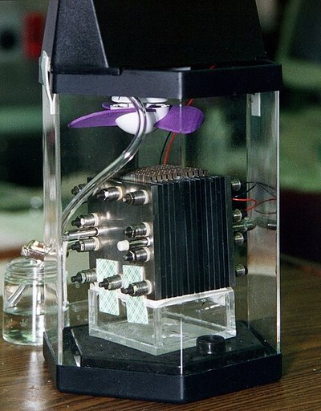
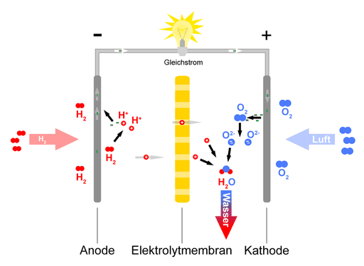
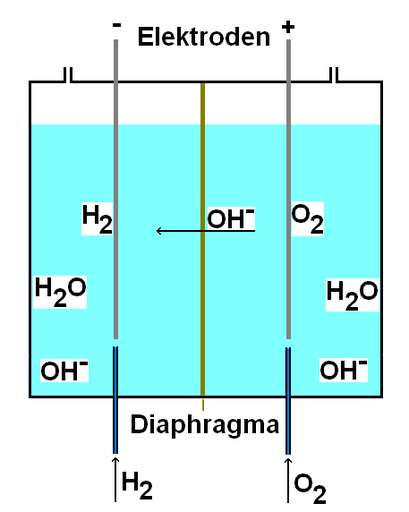

# Brennstoffzelle

Eine **Brennstoffzelle** ist eine technische Anlage, die zu den elektrischen Energiequellen zählt: Sie wandelt die chemische Reaktionsenergie eines kontinuierlich zugeführten Brennstoffes und eines Oxidationsmittels in elektrische Energie um. Mit Brennstoffzelle ist oft eine Wasserstoff-Sauerstoff-Brennstoffzelle gemeint. Bestimmte Brennstoffzellentypen können statt Wasserstoff andere Brennstoffe nutzen, insbesondere Methanol, Butan oder Erdgas. Zusammen mit den Akkumulatoren und den Batterien gehören Brennstoffzellen zu den galvanischen Zellen.

Brennstoffzellen sind keine Energiespeicher, sondern Energiewandler, denen ein Brennstoff (Energie in chemisch gebundener Form) zugeführt wird. Ein komplettes Brennstoffzellensystem kann aber zusätzlich einen Brennstoffspeicher enthalten.

Die gemessen an der Zahl der installierten Systeme wichtigste Anwendung der Brennstoffzelle ist – vor allem in Japan – die Versorgung von Gebäuden mit Wärme und Elektrizität (Mikro-Kraft-Wärme-Kopplung) in Brennstoffzellenheizungen. In Japan wurden bis Ende 2025 über 582.000 Brennstoffzellenheizungen ausgeliefert.

Auch für den innerbetrieblichen Warentransport, vor allem mit Gabelstaplern sowie für andere Brennstoffzellenfahrzeuge, wird die Technik genutzt. Ende 2024 wurden über 97.000 Straßenfahrzeuge mit Hilfe von Brennstoffzellen angetrieben. Mehr als ein Drittel davon fuhren in Südkorea, 2590 in Deutschland. Die meisten (67.800 oder 69 %) waren Personenkraftwagen, es wurden aber auch 8700 Brennstoffzellenbusse und diverse Lastkraftwagen genutzt.

Eine weitere nach Gerätezahl häufige Anwendung der Brennstoffzelle ist die Stromversorgung netzferner Geräte wie Messstationen oder Elektrogeräte beim Camping. Für diesen Zweck verwendet man Direktmethanolbrennstoffzellen.

## Vergleich mit Wärmekraftmaschinen

Die Gewinnung von elektrischer Energie aus chemischen Energieträgern erfolgt zumeist durch Verbrennung und Verwendung der entstehenden heißen Gase zum Betrieb einer Wärmekraftmaschine mit nachgeschaltetem Generator. So wird die chemische Energie zunächst durch Verbrennung in thermische Energie und dann in mechanische Arbeit umgewandelt, aus der schließlich im Generator Strom erzeugt wird.

Eine Brennstoffzelle ist demgegenüber geeignet, die Umformung ohne die Umwandlung in Wärme und Kraft zu erreichen, und ist dadurch potenziell effizienter. Im Unterschied zur Verbrennungskraftmaschine wandelt sie chemische Energie unmittelbar in elektrische Energie um und unterliegt nicht dem inhärent schlechten Wirkungsgrad der Verbrennungskraftmaschinen. Die theoretisch erreichbare Nutzarbeit ist allein durch die freie Enthalpie der chemischen Reaktion beschränkt und kann damit höher sein als bei der Koppelung einer Wärmekraftmaschine (Carnot-Wirkungsgrad) mit einem Generator zur Stromerzeugung.

Insbesondere die Schwierigkeiten bei Lagerung und Transport von Wasserstoff machen deutlich, dass zur Abschätzung der Effizienz die Energieverluste entlang der gesamten Wirkkette betrachtet werden müssen, also einschließlich des Aufwands zur Herstellung und Speicherung des Energieträgers.

## Geschichte

Das Prinzip der Brennstoffzelle wurde 1838 von Christian Friedrich Schönbein entdeckt, als er zwei Platindrähte in verdünnter Schwefelsäure mit Wasserstoff bzw. Sauerstoff umspülte und zwischen den Drähten eine elektrische Spannung bemerkte. Sir William Robert Grove erkannte zusammen mit Schönbein die Umkehrung der Elektrolyse und das Erzeugen von Strom.

Recht bald war man von den Brennstoffzellen begeistert: Man hoffte, Kohle und Dampfmaschinen zu ersetzen. 1875 schrieb Jules Verne in seinem Buch „Die geheimnisvolle Insel“ über die Wasserstofftechnologien:

> „Ich bin davon überzeugt, meine Freunde, daß das Wasser dereinst als Brennstoff Verwendung findet, daß Wasserstoff und Sauerstoff, seine Bestandteile, zur unerschöpflichen und bezüglich ihrer Intensität ganz ungeahnten Quelle der Wärme und des Lichts werden. Der Tag wird nicht ausbleiben, wo die Kohlenkammern der Steamer und die Tender der Lokomotiven statt der Kohle diese beiden Gase vielleicht in komprimiertem Zustand mitführen werden, die unter den Kesseln eine enorme Heizkraft entwickeln.“

Wegen der Erfindung des elektrischen Generators durch Werner von Siemens, damals *Dynamomaschine* genannt, geriet die als „galvanische Gasbatterie“ bezeichnete Erfindung in Vergessenheit. Die Dynamomaschine war in Verbindung mit der Dampfmaschine bezüglich Brennstoff und Materialien relativ einfach und unkompliziert und wurde zu dieser Zeit der komplexen Brennstoffzelle vorgezogen. Wilhelm Ostwald machte sich um die theoretische Durchdringung der Brennstoffzelle verdient; 1894 erkannte er ihr hohes Potenzial gegenüber den Wärmekraftmaschinen.

Erst in den 1950er Jahren wurde die Idee wieder aufgegriffen, da in der Raumfahrt und beim Militär kompakte und leistungsfähige Energiequellen benötigt wurden. Die Brennstoffzelle wurde ab 1963 erstmals an Bord eines Satelliten und für die Gemini- und Apollo-Raumkapseln eingesetzt. In den Apollo-Mondmissionen diente sie als meist zuverlässiger Energielieferant. Während der Apollo-13-Mission explodierte einer der beiden Sauerstofftanks im Servicemodul und beschädigte dabei die Sauerstoffleitung des anderen Sauerstofftanks, so dass alle drei Brennstoffzellen abgeschaltet werden mussten.

1959 wurde der erste Prototyp eines größeren brennstoffzellenbetriebenen Fahrzeuges vorgestellt, der Brennstoffzellentraktor der Firma Allis-Chalmers.

In den 1990er Jahren forderte die Umwelt-Gesetzgebung in Kalifornien von jedem Hersteller Fahrzeuge mit niedrigen Emissionen. Seither wurden im Bereich Forschung und Entwicklung von Brennstoffzellen international große Fortschritte erzielt.

### Meilensteine der Entwicklung

→ *Hauptartikel: Geschichte der Brennstoffzellen*

## Aufbau

Eine Brennstoffzelle besteht aus Elektroden, zwischen denen sich ein Elektrolyt (Ionenleiter) befindet. Als Elektrolyt kann eine Flüssigkeit, beispielsweise Laugen oder Säuren, oder Alkalicarbonatschmelzen verwendet werden. Bei Hochtemperaturbrennstoffzellen wird ein Feststoff als Elektrolyt verwendet, etwa ionenleitende Keramik, die dann einen Festelektrolyten bildet. Auch Membranen werden genutzt. Sie sind semipermeable Membranen, die nur für eine Ionensorte, z. B. Protonen, durchlässig sind. Eine Membran kann auch zwei verschiedene flüssige Elektrolyte voneinander trennen.

Die Elektrodenplatten bzw. Bipolarplatten bestehen meist aus Metall oder Kohlenstoff, z. B. aus einem Kohlenstofffilz. Sie sind mit einem Katalysator beschichtet, etwa Platin oder Palladium.

Die Energie liefert eine Reaktion von Sauerstoff mit dem Brennstoff. Hierbei handelt es sich häufig um Wasserstoff, es werden aber auch organische Verbindungen wie Methan oder Methanol eingesetzt. Beide Reaktionspartner werden über die Elektroden kontinuierlich zugeführt.

Die theoretische Spannung einer Wasserstoff-Sauerstoff-Brennstoffzelle ist 1,23 V bei einer Temperatur von 25 °C. In der Praxis werden jedoch im Betrieb nur Spannungen von 0,5–1 V erreicht; nur im Ruhezustand oder bei kleinen Strömen werden Spannungen oberhalb 1 V erhalten. Die Spannung ist vom Brennstoff, von der Qualität der Zelle und von der Temperatur abhängig. Um eine höhere Spannung zu erhalten, werden mehrere Zellen zu einem *Stack* (engl. für ‚Stapel‘) in Reihe geschaltet. Unter Last bewirken die chemischen und elektrischen Prozesse ein Absinken der Spannung (nicht bei der Hochtemperatur-Schmelzkarbonatbrennstoffzelle, MCFC).

Bei der Niedertemperatur-Protonenaustauschmembran-Brennstoffzelle (*Proton Exchange Membrane Fuel Cell,* PEMFC; oder *Polymer Electrolyte Fuel Cell,* PEFC) ist der Aufbau wie folgt:

1. Bipolarplatte als Elektrode mit eingefräster Gaskanalstruktur, beispielsweise aus leitfähigen Kunststoffen (durch Zugabe von zum Beispiel Carbon-Nanoröhrchen elektrisch leitend gemacht);
2. poröse Carbon-Papiere;
3. Reaktivschicht, meist auf die Ionomermembran aufgebracht. Hier stehen die vier Phasen Katalysator (Pt), Elektronenleiter (Ruß oder Carbon-Nanomaterialien), Protonenleiter (Ionomer) und Porosität miteinander in Kontakt;
4. protonenleitende Ionomermembran: gasdicht und nicht elektronenleitend.

### Alternativen zur Speicherung von flüssigem oder gasförmigem Wasserstoff

Eine mögliche Alternative zur direkten Wasserstoffspeicherung in Drucktanks oder Kryotanks sind Metallhydride oder andere chemische Wasserstoffspeicher. Bei den letzteren wird aus Treibstoffen wie Methanol oder aus geeigneten Kohlenwasserstoffen wie Dibenzyltoluol kurz vor Gebrauch der Wasserstoff durch katalytische Verfahren und/oder Erhitzen gewonnen. Sofern der Brennstoff regenerativ gewonnen wurde (z. B. Methanolherstellung aus Müll oder aus CO2 mit erneuerbarem Strom), so wird bei einer Dampfreformierung zu wasserstoff-haltigem Gas kein zusätzliches CO2 emittiert.

### Bedeutende Brennstoffzellentypen

Die bis 2018 wichtigsten Brennstoffzellentypen sind:

Neben der Klassifizierung nach Zelltypen wird teilweise auch die Klassifizierung nach Brennstoffzellen-System-Typen angewandt. Ein Beispiel hierfür ist die Indirekte Methanolbrennstoffzelle.

#### Alternative Brennstoffe

Theoretisch können alle Brennstoffe auch in Brennstoffzellen genutzt werden. Versuche dazu gab es vor allem mit verschiedenen Alkoholen, insbesondere auch mit den Alkoholen Ethanol (Direktethanolbrennstoffzelle), Propanol, und Glycerin da diese im Vergleich zum oben genannten Methanol deutlich weniger giftig sind. Auch mit Aldehyden (namentlich Formaldehyd, einschließlich Paraformaldehyd), Ketonen und mit verschiedenen Kohlenwasserstoffen wurde experimentiert, außerdem mit Diethylether und Ethylenglycol. Gut erforscht und weit entwickelt ist auch die Verwendung von Ameisensäure (Methansäure) in der Ameisensäure-Brennstoffzelle. Mit Glucose in Form des körpereigenen Blutzuckers betriebene Brennstoffzellen könnten medizinische Implantate mit Strom versorgen, siehe Bio-Brennstoffzelle.

Auch die Verwendung von Kohlenstoff – im Gegensatz zu den bisher behandelten festen, flüssigen oder gelösten Brennstoffen ein unlöslicher Feststoff – in Brennstoffzellen ist möglich und wird intensiv erforscht, siehe Kohlenstoff-Brennstoffzelle. Die Verwendung von Kohle oder Koks als Primärenergiequelle wäre aufgrund ihrer leichten Verfügbarkeit vorteilhaft, aber die praktische Umsetzung hat sich als schwierig erwiesen.

Auch kohlenstofffreie Verbindungen, vor allem Ammoniak (Ammoniak-Brennstoffzelle) oder Hydrazin (Hydrazin-Brennstoffzelle), aber auch Natriumborhydrid, können als Energielieferanten für Brennstoffzellen dienen.

#### Alternative Oxidationsmittel

Die meisten Brennstoffzellen nutzen den Luftsauerstoff als Oxidationsmittel. In der Raumfahrt und in U-Booten wird reiner Sauerstoff aus Drucktanks verwendet. Für Sonderanwendungen, z. B. für militärische Zwecke, könnten statt Sauerstoff auch Oxidationsmittel wie Wasserstoffperoxid oder Salpetersäure verwendet werden. Auch mit Halogenen, insbesondere mit Chlor, wurde experimentiert. Mit den genannten alternativen Oxidationsmitteln sind pro Zelle besonders hohe Spannungen möglich.

#### Reversible Brennstoffzelle

Bei der Reversiblen Brennstoffzelle (en. *reversible* oder *regenerative fuel cell, RFC*) wird der Prozess der Stromerzeugung so umgekehrt, dass durch einen von außen aufgezwungenen Strom der Brennstoff wieder zurückgewonnen wird. Sie besteht im einfachen Fall aus einer Wasserstoff-Brennstoffzelle, die auch als Elektrolyseur betrieben werden kann. Wenn Brennstoffzellen- und Elektrolyseprozess in einer Zelle ablaufen können, wird Gewicht gespart und Komplexität vermindert. Damit eignet sich eine Kombination aus reversibler Brennstoffzelle und Brennstofftank als Energiespeicher und als Ersatz von Akkumulator-Systemen.

#### Mikrobielle Brennstoffzelle

Mikroorganismen, insbesondere Bakterien, können organische Verbindungen unter Abgabe elektrischer Energie umsetzen und erlauben so den Aufbau einer mikrobiellen Brennstoffzelle (*microbial fuel cell*, MFC), einem bioelektrischen System.

## Chemische Reaktionen

Die Gesamtreaktion einer Brennstoffzelle entspricht der Verbrennungsreaktion des Brennstoffes. Daher nennt man die Umsetzung in einer Brennstoffzelle auch „kalte Verbrennung“, wobei direkt (d. h. ohne Umweg über Wärmeenergie) elektrische Energie erhalten wird.

### Wasserstoff-Sauerstoff-Brennstoffzelle

Das Prinzip dieser Brennstoffzelle basiert auf der nachfolgenden Reaktionsgleichung des Wasserstoffs (H2):

Viele Brennstoffzellentypen können diese Reaktion zur Gewinnung elektrischer Energie nutzen. Der heute für viele Anwendungen wichtigste Brennstoffzellentyp dafür ist die Protonenaustauschmembran-Brennstoffzelle (PEMFC). Eine solche Brennstoffzelle verwendet in der Regel Wasserstoff als Energieträger und erreicht einen Wirkungsgrad von etwa 60 %. Das Kernstück der PEMFC ist eine Polymermembran, die ausschließlich für Protonen durchlässig ist (also nur für H+-Ionen), die so genannte *proton exchange membrane* (PEM) die z. B. aus Nafion besteht. Das Oxidationsmittel, für gewöhnlich Luftsauerstoff, ist dadurch räumlich vom Reduktionsmittel getrennt.

Der Brennstoff, hier Wasserstoff, wird an der Anode katalytisch unter Abgabe von Elektronen zu Kationen oxidiert. Diese gelangen durch die Ionen-Austausch-Membran in die Kammer mit dem Oxidationsmittel. Die Elektronen werden aus der Brennstoffzelle abgeleitet und fließen über einen elektrischen Verbraucher, zum Beispiel eine Glühlampe, zur Kathode. An der Kathode wird das Oxidationsmittel, hier Sauerstoff, durch Aufnahme der Elektronen zu Anionen reduziert, die unmittelbar mit den Wasserstoffionen zu Wasser reagieren.

Brennstoffzellen mit einem solchen Aufbau heißen Polyelektrolyt-Brennstoffzellen, PEFC (für *Polymer Electrolyte Fuel Cell*) oder auch Protonenaustauschmembran-Brennstoffzelle, PEMFC (für *Proton Exchange Membrane Fuel Cell*). Die verwendeten Membranen sind saure Elektrolyten.

Redox-Reaktionsgleichungen für eine PEMFC:

Es gibt auch alkalische Wasserstoff-Brennstoffzellen. Sie arbeiten jedoch nur mit hochreinem Wasserstoff und Sauerstoff. In ihnen werden die Gase durch poröse, katalytisch wirksame Elektroden in eine basische Lösung eingeleitet.

Die dort ablaufenden Redox-Reaktionen lauten:

### Andere Brennstoffzellen

Für die Reaktionsgleichungen der Direktmethanolbrennstoffzelle siehe hier, für die der Direktethanolbrennstoffzelle hier und für die Ammoniak-Brennstoffzelle hier.

## Elektrischer Wirkungsgrad, Kosten, Lebensdauer

Am Institut für Energieforschung am Forschungszentrum Jülich wurden im Jahr 2003 für Brennstoffzellensysteme folgende Testergebnisse erzielt:

Moderne SOFC-Systeme erreichen Wirkungsgrade von bis zu 65 % für neue Anlagen, welche im Laufe der gesamten Lebensdauer (ca. 5 bis 8 Jahre) auf etwa 50 % absinkt. Die initialen Kapitalkosten betragen ca. $7,000 - $8,000 pro kW. Kosten und Wirkungsgrad des Gesamtsystems sind auch von den Nebenaggregaten abhängig, bei einem Brennstoffzellen-Fahrzeug z. B. von der Antriebsbatterie, dem Elektroantrieb und dem Aufwand zur Bereitstellung des Brennstoffzellen-Brennstoffes.

Die Lebensdauer einer PAFC-Brennstoffzelle liegt zwischen 80.000 Betriebsstunden für stationäre und 6.500 Betriebsstunden für mobile Systeme (80.000 Betriebsstunden entsprechen 3333 Dauerbetriebstagen oder 9,1 Dauerbetriebsjahren).

Hochtemperaturbrennstoffzellen können zur Erhöhung des Wirkungsgrades mit einer Mikrogasturbine gekoppelt werden, sodass sie kombiniert Wirkungsgrade von über 60 % erreichen.

## Anwendungen

Die ersten Anwendungen von Brennstoffzellen ergaben sich in Bereichen wie Militär und Raumfahrt, in denen die Kosten eine untergeordnete Rolle spielten und die spezifischen Vorteile die Kostenvorteile der Dieselgeneratoren überwogen. Brennstoffzellen sind leichter als Akkumulatoren sowie zuverlässiger und leiser als Generatoren. Die geringen Geräuschemissionen und die Möglichkeit, Brennstoffzellen nach sehr langer Inaktivität zuverlässig zu betreiben, trugen zu einer anfangs oft militärischen Nutzung sowie einem Einsatz in Notstromversorgungen bei. Zudem können Brennstoffzellen in Kombination mit einem Elektromotor Bewegungsenergie in verschiedenen Einsatzbereichen effizienter erzeugen als Verbrennungsmotoren, etwa wegen des konstanten Drehmomentverlaufs des Elektromotors oder der besseren Regelbarkeit Ersterer.

Eine Stärke von Brennstoffzellensystemen liegt in der im Vergleich mit anderen Wandlertechnologien hohen Energiedichte, wodurch sich das frühzeitige Interesse des Militärs und der Raumfahrt an dieser Technik erklärt.

Die folgende Tabelle gibt eine Übersicht über die geschätzte Zahl der weltweit pro Jahr ausgelieferten Systeme mit Brennstoffzellen, sowie die geschätzte Gesamtleistung aller im angegebenen Jahr verkauften Systeme in Gigawatt:

Die Zahl der pro Jahr ausgelieferten Brennstoffzellensysteme wuchs im Zeitraum von 2015 bis 2022 von 60.000 Geräten auf rund 89.200 Systeme. Von den 2016 weltweit 62.000 verkauften Brennstoffzellensystemen wurden die meisten, nämlich über 50.000, für stationäre Anwendungen gebraucht. Abgesehen vom Coronajahr 2020 war die insgesamt ausgelieferte Leistung von Jahr zu Jahr gestiegen. Von der 2020 ausgelieferte Gesamtleistung von rund 1 GW verteilten sich 35 MW auf Fördertechnik, vor allem Gabelstapler, 0,85 GW auf Straßen- und Schienenfahrzeuge (Autos, Busse, Lastwagen, Triebfahrzeuge) und 0,17 GW auf stationäre Anwendungen. 2022 wurden 15.400 Personenkraftwagen verkauft, die zusammen eine Brennstoffzellenleistung von 1,5 GW hatten. Damit waren 62 % der in diesem Jahr verkauften Brennstoffzellenleistung (2,49 GW) in PKW enthalten.

### Stationärer Einsatz

Siehe auch: Wasserstoffwirtschaft und Methanolwirtschaft

Für stationäre Anlagen zur stromgewinnenden Heizung:

→ *Hauptartikel: Brennstoffzellenheizung*

Der stationäre Einsatzbereich eines Brennstoffzellensystems erstreckt sich über einen weiten Leistungsbereich, angefangen bei kleinen Systemen mit einer Leistung von zwei bis fünf Kilowatt elektrischer Leistung – beispielsweise als Hausenergieversorgung – bis hin zu Systemen im niedrigen Megawattbereich. Größere Systeme werden in Krankenhäusern, Schwimmbädern oder für die Versorgung von kleinen Kommunen eingesetzt. Europas größtes Brennstoffzellenkraftwerk in Mannheim hatte mit Stand September 2016 eine Leistung von 1,4 MW.

Eine stromerzeugende brennstoffzellenbasierte HyO-Heizanlage („Hy“ = Hydrogenium = Wasserstoff und „O“ = Oxygenium = Sauerstoff; Mini-Blockheizkraftwerk = Mini-BHKW) besteht aus mehreren Komponenten. Im Idealfall des Bezugs von – möglichst klimaneutral erzeugtem – Wasserstoff wird eine mit geringem Aufwand herstellbare PEM-BZ (Polymer-Elektrolyt-Membran-Brennstoffzelle) eingesetzt. Solange noch kein regenerativ hergestellter Wasserstoff als Brennstoff zur Verfügung steht, sondern stattdessen fossiles oder biogenes Methan (Erdgas oder „BioErdgas“), ist eine aufwändige und störungsanfällige Reformer-Einheit erforderlich. Diese verwandelt das Methan in Wasserstoff zum direkten Betrieb der brennstoffzellenbasierten HyO-Anlage und in CO2 als Abgas. Die zweite Komponente ist die Brennstoffzelle (BZ), die für den chemischen Prozess (Oxidation des zugeführten Wasserstoffs), wobei Strom und Wärme erzeugt werden, Sauerstoff aus der Umgebungsluft verwendet. Hinzu kommen noch die elektrische Leistungselektronik und die dazugehörige Regelung der Betriebsführung. Zur Deckung von thermischen Lastspitzen sind meist zusätzliche herkömmliche erdgasbetriebene Wärmeerzeuger installiert.

Für den stationären Anwendungsbereich kommen alle Typen von Brennstoffzellen in Betracht. Aktuelle Entwicklungen beschränken sich auf die SOFC, die MCFC und die PEMFC. Die SOFC und die MCFC haben den Vorteil, dass – bedingt durch die hohen Temperaturen – Erdgas direkt als Brenngas eingesetzt werden kann. Der Entzug von Wasserstoff (H2) aus dem Methan (CH4) des Gasleitungsnetzes („Reformierungsprozess“) verläuft dabei innerhalb der Hochtemperaturbrennstoffzelle (HT-BZ), was beim Einsatz von Methan einen separaten Reformer überflüssig macht. Die im Niedertemperaturbereich arbeitende PEM-Brennstoffzelle hingegen benötigt bei Methan-Einsatz für die Erzeugung von Wasserstoff eine separate Reformer-Einheit mit einer aufwändigen Gasreinigungsstufe, weil das Reformat weitgehend von Kohlenstoffmonoxid (CO) befreit werden muss. CO entsteht bei jeder Reformierung von Kohlenwasserstoffen. CO ist bei diesem BZ-Typ ein Katalysatorgift und würde sowohl die Leistung als auch die Lebensdauer der Brennstoffzelle deutlich verringern.

Beim Betrieb der Hochtemperaturzellen SOFC und MCFC kann die heiße Abluft zur Sterilisation von Gegenständen genutzt werden. Als Notstromerzeuger sind sie wegen der längeren Anfahrphase ungeeignet. Ein Niedertemperatur-PEMFC-System hingegen kann sich bei plötzlichem Notstrombedarf innerhalb von Sekundenbruchteilen selbsttätig in Betrieb setzen.

Das Digitalfunknetz der Behörden und Organisationen mit Sicherheitsaufgaben (BOS) in Deutschland nutzt unter anderem auch Brennstoffzellen zur Notstromversorgung und damit zur Sicherstellung des Betriebs bei Stromausfällen. Die Betriebsdauer mit Notstromversorgung der Digitalfunkstandorte ist dabei auf mindestens 72 Stunden ausgelegt. In Bayern kommen vorwiegend Brennstoffzellen zur Härtung aller rund 900 Digitalfunkstandorte (Vollhärtung) zum Einsatz. Hierfür wurde ein Haushaltsbudget von 110 Millionen Euro veranschlagt.

#### Betriebsweise

Bei der stationären BZ-Anwendung in Form von Heizungen steht derzeit die Wärmeproduktion gegenüber der Stromproduktion im Vordergrund. Diese Systeme werden deshalb meist wärmebedarfsgeführt betrieben. Das bedeutet, dass die Systemleistung nach der benötigten Wärmemenge geregelt wird, wobei der erzeugte elektrische Strom in das öffentliche Stromnetz eingespeist wird. Stationäre BZ-Systeme werden am besten mit einer geringen Leistungsmodulation betrieben. Idealerweise wird der Wärmegrundlastbedarf komplett über das BZ-BHKW gedeckt. (Wärme-)Lastspitzen werden über konventionelle Heizgeräte abgedeckt. Auf diese Weise arbeitet das stationäre BZ-System bei lediglich einem einzigen konstanten Lastpunkt. Dadurch kann das System auf den maximalen Wirkungsgrad hin ausgelegt werden. Die Lebensdauer einer BZ ist in erster Annäherung durch die Anzahl der Start-Stopp-Zyklen bestimmt, da diese die ungünstigste Auswirkung auf die Katalysatoren im Inneren zeigen.

Für eine PEM-Brennstoffzelle mit geschlossener Kathode gilt, dass sie in ausgeschaltetem Zustand beidseitig – also auch sauerstoffseitig – abgedichtet werden sollte. Das vereinfacht einen erneuten Start, da die für den Betrieb notwendige Feuchtigkeit beibehalten wird, und sich keine schädlichen Gase ansammeln können. Sofern die Lagerung bei Temperaturen unter dem Gefrierpunkt erfolgen soll, muss die Brennstoffzelle komplett ausgetrocknet werden, um Schäden durch Eisbildung zu verhindern.

#### Gabelstapler und andere Flurförderzeuge

Gabelstapler, motorisierte Hubwagen und andere Flurförderzeuge werden oft in Lager- oder Fabrikhallen und damit in Innenräumen eingesetzt, wo keine mit Benzin oder Diesel betriebene Verbrennungsmotoren verwendet werden dürfen. Daher sind sie oft elektrisch angetrieben, zumeist mit einem Akkumulator als Energiespeicher. Wenn die Gabelstapler nur tagsüber im Einsatz sind, ist die nächtliche Ruhezeit lang genug, um ihre Akkumulatoren zu laden. Sollen Flurfördergeräte aber im Schichtbetrieb rund um die Uhr oder zumindest mit begrenzten Pausenzeiten genutzt werden, erfordern akkubasierte Systeme einen Laderaum mit Wechselakkus. In solchen Fällen werden zunehmend mit Brennstoffzellen betriebene Gabelstapler und Hubwagen verwendet, da diese sich in wenigen Minuten mit Wasserstoff betanken lassen und so mit kleinerem Betriebsaufwand und geringerem Platzbedarf fast ununterbrochen zur Verfügung stehen. Dieser Trend ist vor allem in den USA verbreitet, wo die Einführung von Brennstoffzellen staatlich gefördert wurde, z. B. mit Steuergutschriften, beschleunigter Abschreibung oder mittels Subventionen. Daher werden in den USA eine zunehmende Zahl von Flurförderzeugen mit Brennstoffzellen betrieben: Im Juni 2011 waren in den USA mehr als 1500 Gabelstapler damit ausgestattet, im Oktober 2013 mehr als 4000, im Dezember 2015 mehr als 7500 (davon allein bei Walmart 2800), im November 2016 mehr als 11.000 und bis Dezember 2020 waren in den USA über 35.000 ausgeliefert worden. Weltweit waren 2020 mehr als 36.100 Flurfördergeräte mit Brennstoffzellen ausgestattet, über 400 in Kanada, 325 in Frankreich, 250 in Japan und 162 in Deutschland. 2021 kamen 13.400 Gabelstapler hinzu, 2022 weitere 9.650. Die Logistikbranche ist damit ein wichtiger Markt für Brennstoffzellen, auch wenn der Marktanteil, gemessen an den jährlichen Verkaufszahlen von Gabelstaplern, die eine Million Geräte übersteigen, klein ist. Aufgrund der Investitionskosten für eine Wasserstofftankstelle (Gastanks, Leitungen, Zapfstelle) amortisiert sich eine wasserstoffbetriebene Gabelstaplerflotte erst ab einer Größe von 50 Fahrzeugen. Im August 2016 waren in Nordamerika brennstoffbetriebene Flotten im Schnitt 130 Fahrzeuge groß.

#### Straßenverkehr

→ *Hauptartikel: Brennstoffzellenfahrzeug*

Der wichtigste Markt für Brennstoffzellenfahrzeuge 2020 und 2021 war Südkorea: 2021 wurden dort 8.500 Brennstoffzellenautos und damit 55 % der weltweiten Stückzahl verkauft. Die für 2021 weltweit meistproduzierten Automodelle – sie machten 98 % der Verkäufe aus – waren der Toyota Mirai und an erster Stelle der Hyundai Nexo. Bis Ende 2020 waren über 3.200 Brennstoffzellenbusse in den Verkehr gebracht worden, davon 2.800 in China, 99 in Japan und 79 in Deutschland.

Die Zahl der mit Brennstoffzelle (BZ) betriebenen Straßenfahrzeuge hat sich in den letzten Jahren deutlich erhöht: Bis Dezember 2020 waren 25.011 BZ-Autos, über 3.100 BZ-Busse und über 1.200 BZ-Lastwagen in den Verkehr gebracht worden. Die meisten Brennstoffzellenautos, nämlich 10.041, wurden in Südkorea zugelassen; der zweitgrößte Markt war Kalifornien, im Rest der USA gibt es keine öffentlichen Wasserstofftankstellen, wo bis Juli 2020 ungefähr 9.000 BZ-Autos fuhren. Weitere Länder mit BZ-Autos waren Japan mit 3.947 Autos, Deutschland mit 951, Frankreich mit 375, die Niederlande mit 314, Norwegen mit 159 und Österreich mit 41.

Neben dem Toyota Mirai mit über 7.000 verkauften Exemplaren bis zum März 2019 vertrieb allein Hyundai im europäischen Markt über 500 Hyundai ix35 FCEV sowie insgesamt über 600 Hyundai Nexo.

Im Jahr 2017 wurden weltweit über 3.300 Personenkraftwagen mit Wasserstoff-Brennstoffzellenantrieb verkauft: über 2.600 Toyota Mirai, über 500 Honda Clarity FCEV und knapp 200 Hyundai ix35/Tucson FCEV. 2018 wurden in den USA über 2.300 Wasserstoffautos verkauft, darunter 1700 Toyota Mirai und über 600 Honda Clarity Fuel Cell. Eine wachsende Anzahl von Brennstoffzellenfahrzeugen (Autos und Busse) wird in China hergestellt: 629 Einheiten 2016/2017, 1527 im Jahr 2018, und 1170 in der ersten Hälfte des Jahres 2019.

Ein Auslöser für die erheblichen Anstrengungen zur Forschung und Entwicklung der Brennstoffzellen war der *Zero emission act* bzw. das *Zero Emission Vehicle mandate (ZEV)* in den USA, die vorsahen, dass Autos zukünftig abgasfrei fahren sollen. Für das Jahr 2003 war vorgesehen, dass 10 % aller neu zugelassenen Fahrzeuge in Kalifornien diesem Gesetz unterliegen sollten. Kurz vorher, nach massivem Druck der amerikanischen Automobilindustrie, wurde das ZEV jedoch gekippt, obgleich es weiterhin diskutiert wird.

Durch den verstärkten Einsatz von emissionsfreien Fahrzeugen in Ballungszentren und Großstädten wird eine Verbesserung der dortigen Luftqualität erwartet. Ein Nebeneffekt wäre allerdings, dass die Emissionen vom Ort der Fahrzeugnutzung dorthin verlagert werden, wo der Wasserstoff hergestellt wird, soweit das nicht unter Anwendung klimaneutraler Verfahren erfolgt (siehe auch Grüner Wasserstoff). Für die Wasserstoffherstellung gibt es mehrere Möglichkeiten mit unterschiedlicher Effizienz.

Für den breiten Einsatz der mobilen Wasserstoffanwendungen ist der gleichzeitige Aufbau von Wasserstofftankstellen erforderlich; davon waren Ende 2020 weltweit 553 in Betrieb. Für die Mitnahme von Wasserstoff in Fahrzeugen werden heute praktisch nur noch Druckbehälter verwendet. Andere Formen der Wasserstoffspeicherung sind möglich, beispielsweise in Metallhydriden oder bei niedriger Temperatur als flüssiger Wasserstoff. Bei der Gesamtbeurteilung des Energieeffizienz ist dabei der hohe Energiebedarf für die Komprimierung (bis 700 bar) oder die Verflüssigung (etwa −250 °C) zu beachten, der den Gesamtwirkungsgrad (Well-to-Wheel) der Fahrzeuge mit Wasserstoffspeichern deutlich senkt.

Trotz des hohen Wirkungsgrads der Brennstoffzelle gestaltet sich auch die Abfuhr der Abwärme auf dem vergleichsweise niedrigen Temperaturniveau der PEM-Brennstoffzelle von etwa 80 °C als problematisch, denn im Gegensatz zum Verbrennungsmotor beinhaltet das relativ kalte Abgas (Wasserdampf) nur eine vergleichsweise geringe Wärmemenge. Demzufolge ist man bestrebt, die Betriebstemperatur der PEM-Brennstoffzelle auf über 100 °C anzuheben, um leistungsstärkere Brennstoffzellen-Automobile mit mehr als 100 kW realisieren zu können.

Bei Temperaturen unterhalb des Gefrierpunkts könnte die Startfähigkeit der Brennstoffzelle aufgrund gefrierenden Wassers beeinträchtigt sein. Es muss sichergestellt sein, dass die elektrochemische Reaktion, insbesondere die Diffusion der Brenngase, nicht durch Eisbildung behindert wird. Das kann beispielsweise durch eine geeignete Elektrodenstruktur erzielt werden. In der Praxis sind weder Kälte noch Hitze ein Problem für Brennstoffzellenautos.

#### Fahrzeugentwicklung

→ *Hauptartikel: Brennstoffzellenfahrzeug*

In Europa lieferten die Bushersteller Mercedes-Benz und Van Hool Stadtbusse mit Wasserstoffantrieb, die im normalen Linienbetrieb getestet wurden. In Hamburg lief ein derartiger Versuch von 2010 bis Ende 2018.

Mit Wasserstoff angetriebene, 2017 vorgestellte Prototypen von Elektrofahrzeugen von Hyundai oder Toyota erreichen Reichweiten von bis zu 800 km.

Der Autohersteller Ford gab am 24. Juni 2009 bekannt, dass die Arbeit an Brennstoffzellen eingestellt wird. Ford setzt stattdessen lieber auf Batterien. Im Dezember 2010 erklärte Ford allerdings, dass intern weiter an der Brennstoffzelle gearbeitet werde. Ford ist an einem Joint Venture (Automotive Fuel Cell Cooperation Corp.; kurz: AFCC) mit der Daimler AG beteiligt. In Toronto (Kanada) werden dafür Brennstoffzellen und Stacks gefertigt. Die Entwicklung erfolgt wesentlich bei der Daimler-Tochter NuCellSys GmbH in Kirchheim unter Teck/Nabern.

Daimler (Mercedes-Benz) besaß als einziger Fahrzeughersteller eine komplette eigene Fertigungsfabrik der Stacks und Brennstoffzellen. Mercedes-Benz brachte im November 2018 den GLC F-Cell auf den Markt. Es handelt sich um eine Kombination einer Lithium-Ionen-Batterie (9,3 kWh) mit einer Brennstoffzelle, weswegen die Kombination auch als Brennstoffzellen-Plug-in-Hybrid bezeichnet wird. Mit einem 155-kW-Elektromotor und einer auf 160 km/h abgeregelten Höchstgeschwindigkeit erreicht das Fahrzeug im NEFZ-Zyklus eine Reichweite von 430 km mit dem Wasserstoffvorrat (bei Tankzeiten von 3 Minuten) zuzüglich 50 km aus der Batterie. Wegen der Neuheit der Technologie und des fehlenden Netzes von Wasserstoff-Tankstellen wurde das Fahrzeug nur bei wenigen Großstadthändlern auf der Basis eines Full-Service-Mietmodells angeboten. 2020 gab Mercedes-Benz bekannt, sich aufgrund der Vorteile batterieelektrischer PKW künftig auf die Entwicklung von Brennstoffzellen in Bussen und LKW zu konzentrieren. Mitte 2024 sollen hierzu die ersten Erprobungs-LKW ausgeliefert werden.

Mit dem Toyota Mirai wurde im Dezember 2014 eines der ersten Serien-Brennstoffzellen-Fahrzeuge neuer Generation vorgestellt; seit September 2015 wird es auch in Deutschland ausgeliefert. Der Elektromotor leistet 114 kW, die Höchstgeschwindigkeit liegt bei 178 km/h. Der Wasserstoff wird in zwei getrennten Tanks gespeichert, die bei 700 bar jeweils 2,5 kg Wasserstoff aufnehmen und nach Herstellerangaben eine Reichweite von 500 km ermöglichen.

Opel wollte ab 2015 erste Modelle mit Brennstoffzellenantrieb in Serie fertigen und den Aufbau einer flächendeckenden Infrastruktur für Wasserstofftankstellen parallel zur Markteinführung vorantreiben. Zur Auslieferung kam es jedoch nicht. Nach der Trennung von GM und Opel im Jahr 2017 wurde im Jahr 2018 in Rüsselsheim ein Kompetenzzentrum für die Entwicklung von Brennstoffzellen für die gesamte Groupe PSA angesiedelt.

Volkswagen sah die Brennstoffzelle noch 2017 als dringlich an und plante den Einsatz vor allem in größeren Fahrzeugen und der oberen Mittelklasse und Oberklasse. Die Entwicklung erfolgte vorwiegend bei Audi. VW-Chef Herbert Diess sprach sich jedoch im Jahr 2019 gegen die Brennstoffzellentechnologie aus. Diese sei nicht so gut für die Umwelt, wie behauptet werde. 2021 schrieb er, dass Wasserstoff für „Stahl, Chemie, Luftfahrt“ gebraucht werde und deshalb nicht im Auto eingesetzt werden sollte. Wasserstoff sei „viel zu teuer, ineffizient, langsam und schwierig auszurollen und zu transportieren“. Zudem zeige der Markt ohnehin, dass keine Wasserstoffautos absehbar seien. Das Programm wurde beendet.

BMW stellt nach mehreren Verschiebungen seit 2022 eine Kleinserie des BMW iX5 mit Toyota-Technik her, die seit Ende 2023 getestet wird.

In Kooperation mit Toyota will BMW ab 2028 eine Serienproduktion von Wasserstoffautos mit Brennstoffzellen beginnen.

#### Luftfahrt

→ *Hauptartikel: Wasserstoffflugzeug*

Seit Mitte 2005 sind Brennstoffzellen auch in der Luftfahrt anzutreffen. Eine erste Drohne, deren Elektromotoren von einer Brennstoffzelle angetrieben werden, startete in Yuma, Arizona. Das DLR arbeitete an der Integration der Brennstoffzellentechnik in das unbemannte Forschungsflugzeug *HyFish,* das im März 2007 in der Nähe von Bern erfolgreich seinen Erstflug absolvierte.

Auch an anderer Stelle sind Forschungsaktivitäten in der Luftfahrt im Gange. Zu Beginn des Jahres 2008 wurde in einem Testflug ein umgebauter Airbus A320 mit einer Brennstoffzelle als Backup-System für die Energieversorgung an Bord getestet. Als positiver Nebeneffekt kann das erzeugte Wasser für die Bordversorgung eingesetzt werden, was das Abfluggewicht senkt.

Am 3. März 2008 betrieb Boeing zum ersten Mal ein kleines Flugzeug, eine Dimona von Diamond Aircraft, mit einem Hybridantrieb: Elektromotor mit Lithium-Ionen-Akkus und Brennstoffzelle. Nach dem Aufstieg mit beiden Energiequellen auf 1000 Meter Höhe wurde der Akkumulator abgetrennt und der Pilot flog die ersten 20 Minuten der Fluggeschichte mit Brennstoffzelle. Entwickelt wurde der Antrieb von Boeing Research & Technology Europe (BR&TE) in Madrid mit europäischen Industriepartnern.

Der erste (öffentliche) vollständige Flug (Start – Platzrunde – Landung) eines pilotengesteuerten und ausschließlich mit elektrischer Energie aus Brennstoffzellen angetriebenen Flugzeuges fand am 7. Juli 2009 in Hamburg statt. Bei dem Flugzeug handelte es sich um den Motorsegler *Antares DLR-H2,* mit 20 Metern Spannweite, der vom Deutschen Zentrum für Luft- und Raumfahrt (DLR) sowie den Projektpartnern Lange Aviation, BASF Fuel Cells und Serenergy (Dänemark) sowie in enger Zusammenarbeit mit Airbus in 15 Monaten entwickelt und hergestellt wurde.

#### Raumfahrt

Brennstoffzellen werden seit langem als Energiewandler in der Raumfahrt (Gemini, Apollo, Space Shuttle) verwendet.

Die amerikanischen Space Shuttles verwendeten Brennstoffzellen mit einer maximalen Dauerleistung von 3 × 7 kW für die Stromversorgung des Orbiters. Das bei den Brennstoffzellen anfallende Wasser konnte im Lebenserhaltungssystem verwendet werden.

#### Schifffahrt

Seit 2009 ist in Amsterdam das Rundfahrtboot Nemo H2 im Einsatz. Es hat zwei Polymerelektrolytbrennstoffzellen mit zusammen 80 kW Höchstleistung.

Bei U-Booten ist Deutschland der einzige Anbieter eines serienmäßig hergestellten Modells mit Brennstoffzellen-Zusatzantrieb. TKMS liefert in Kooperation mit Siemens und Nordseewerke Emden seit 2005 die U-Boot-Klasse 212 A mit einem solchen Antrieb (AIP: *air independent propulsion*) aus. Er leistet etwa 300 kW und ermöglicht eine Schleichfahrt ohne den 1050-kW-Dieselgenerator. Ebenso hat die U-Boot-Klasse 214 (vom selben Hersteller) Brennstoffzellen an Bord. In Bau befindet sich derzeit die spanische S-80-Klasse, die ebenfalls einen außenluftunabhängigen Brennstoffzellen-Antrieb hat. Die erste Einheit soll laut Planung 2022 in Dienst gestellt werden.

Ende 2009 wurde eine Schmelzcarbonat-Brennstoffzelle (MCFC) mit 320 kW zur elektrischen Energieversorgung des Bordnetzes auf dem norwegischen Bohrinselversorger Viking Lady installiert, um Erfahrungen im Schiffsbetrieb zu sammeln.

2017 startete der Katamaran *Energy Observer* eine Weltumfahrung mit Solarenergie, wobei auch eine 22-kW-Brennstoffzelle zum Einsatz kommt.

Die Passagier- und Autofähre *MF Hydra* ist seit März 2023 für Norled AS im Betrieb. Sie gehört zum Schiffstyp LMG 80-DEH2 und trägt bis zu 295 Passagiere, 8 Crewmitglieder und 80 Fahrzeuge und wird mit flüssigem Wasserstoff betankt. Sie überquert einen Fjord bei Hjelmeland im Südwesten von Norwegen.

#### Schienenverkehr

→ *Hauptartikel: Brennstoffzellenantrieb von Triebfahrzeugen*

Der französische Bahnhersteller Alstom gab am 24. September 2014 auf der Innotrans in Berlin bekannt, dass ab 2018 Züge des Typs Coradia mit Brennstoffzellenantrieb zunächst in Niedersachsen getestet und später in Hessen, Nordrhein-Westfalen und Baden-Württemberg eingesetzt werden. Die Verträge über die Lieferung von 14 Brennstoffzellen-Zügen sowie für ihre 30-jährige Instandhaltung und Energieversorgung wurden am 9. November 2017 unterzeichnet. Zwei der Züge haben im September 2018 den Pilotbetrieb im EVB-Netz zwischen Cuxhaven, Bremerhaven, Bremervörde und Buxtehude aufgenommen. In Hessen startete am 13. April 2018 ein Coradia-iLint-Brennstoffzellenzug zu einer Demonstrationsfahrt.

Im Juli 2019 zog Alstom nach mehr als 100.000 gefahrenen Kilometern eine positive Bilanz und kündigte an, bis 2021 insgesamt 14 Brennstoffzellenzüge zu betreiben.

### Fehlgeschlagene Markteinführungsversuche für mobile Elektronik oder Elektrogeräte

Im Zuge der zunehmenden weltweiten Verbreitung von mobiler Elektronik (einschließlich Handys, Personal Digital Assistants, Smartphones und Tabletcomputern) spielt die möglichst lange Laufzeit von Akkus eine herausragende Rolle. Allerdings ist diese je nach Grad der Nutzung auf wenige Stunden bis Tage begrenzt. Besonders Vielreisende sind oft gezwungen, zwischendurch ihr Gerät aufzuladen. Um die Abhängigkeit von der Steckdose zu verringern, wurden verschiedene kleine, tragbare Brennstoffzellensysteme und die dazugehörigen Brennstoffkartuschen entwickelt. Dabei wurden entweder Wasserstoff oder Butan oder Methanol als Brennstoffe verwendet. Obwohl viele Firmen funktionsfähige Prototypen vorgeführt und eine baldige Markteinführung angekündigt hatten, kamen diese Systeme nur selten auf den Markt oder verschwanden bald wieder, z. B. bei den Direktmethanolbrennstoffzellen. Der Hauptgrund dafür ist im schnellen Preisverfall von Lithium-Ionen-Akkumulatoren zu sehen: im Vergleich zu einer damit bestückten Powerbank sind Brennstoffzellen deutlich teurer.

Beispielsweise entwickelte das Unternehmen *Lilliputian Systems* tragbare Brennstoffzellen, mit deren Hilfe sich Smartphones auch unterwegs und ohne Nutzung einer Steckdose mehrere Male aufladen lassen. Die Markteinführung war für 2012 geplant. Die tragbaren Brennstoffzellen hatten einen USB-Anschluss und einen Tank mit Butangas, das die notwendige Energie liefert. Im Juli 2014 meldete das Unternehmen aus Wilmington, Massachusetts, Insolvenz an.

Die Firma *Intelligent Energy* bot seit Anfang 2015 eine Wasserstoff-Brennstoffzelle namens *Upp* zum Aufladen von Smartphones an. Mit einer Wasserstoffkartusche sollten drei bis fünf Ladevorgänge eines iPhones 6 möglich sein. 2017 wurde das Unternehmen mit Hinweis auf kaum vorhandene Werte verkauft.

Die Firma *eZelleron* wollte mit der Brennstoffzelle *Kraftwerk* auf Basis von Butangas Energie für das elfmalige Laden eines Smartphones zur Verfügung stellen. Die Markteinführung via Crowdfunding war für Anfang 2016 geplant und wurde erst auf Januar 2017, dann auf August 2017 verschoben. Ende 2017 wurde von weiteren Verzögerungen berichtet, und im März 2018 begann ein Prozess wegen des Vorwurfs der Insolvenzverschleppung.

Die Schweizerischen Bundesbahnen (SBB) führten ab Frühjahr 2014 versuchsweise in den rollenden Minibars mit Wasserstoff betriebene Brennstoffzellen ein, um unterwegs genug Energievorrat für die eingebaute Espressomaschine zu haben. Die bisher verwendeten üblichen Akkumulatoren wären für diese energieaufwendige Aufgabe zu schwer gewesen. Es wurden zwölf Stück in Betrieb gesetzt, jedoch bereits 2016 wieder eingestellt. Der Versuch sei gescheitert.
