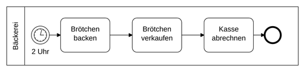
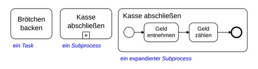
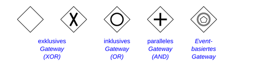

# Business Process Model and Notation

Die **Business Process Model and Notation** (**BPMN**, auf Deutsch *Modell und Notation für Geschäftsprozesse*) ist eine grafische Spezifikationssprache in der Wirtschaftsinformatik und im Prozessmanagement. Sie stellt Symbole zur Verfügung, mit denen Fach-, Methoden- und Informatikspezialisten Geschäftsprozesse und Arbeitsabläufe erfassen, modellieren, dokumentieren, gestalten, ausführen, messen, überwachen und steuern können, um die mit der Unternehmensstrategie abgestimmten Ziele zu erreichen. BPMN gilt als De-facto-Standard für Geschäftsprozessmodellierung.

## Entwicklung

Die BPMN wurde ab 2001 durch den IBM-Mitarbeiter Stephen A. White erarbeitet und im Mai 2004 von der *Business Process Management Initiative* (BPMI) veröffentlicht, einer Organisation, die Standards im Bereich der Geschäftsprozessmodellierung definiert hatte. BPMN ermöglicht den einfacheren Austausch von Geschäftsprozessmodellen mithilfe einer standardisierten grafischen Notation. Die von Stephen A. White verwendeten Swimlanes zur Prozessvisualisierung wurden 1985 von Hartmut F. Binner für sein Prozessmodellierungs-Tool „Sycat“ entwickelt. BPMN wurde im Juni 2005 durch die Object Management Group (OMG) zur weiteren Pflege übernommen. Die BPMI fusionierte gleichzeitig mit der OMG, so dass die BPMN ähnlich wie die Unified Modeling Language (UML) ab diesem Zeitpunkt als Standard der OMG galt. Seit 2006 ist BPMN in der Version 1.0 somit offiziell ein OMG-Standard. 2008 erschien Version 1.1, 2009 Version 1.2.

Die aktuelle Version des BPMN-Standards, BPMN 2.0, wurde im Januar 2011 von der OMG verabschiedet und im Januar 2014 durch die Veröffentlichung der Version 2.0.2 nur leicht korrigiert.

## Gegenstand

Der Schwerpunkt der BPMN liegt auf der *Notation*, d. h. auf der grafischen Darstellung von Geschäftsprozessen. BPMN definiert auch die *Semantik*, d. h. die Bedeutung der Symbole, wobei es diesem Aspekt weniger Gewicht beimisst und keinen Wert auf formale Definitionen legt. Diagramme in der BPMN heißen *Business Process Diagram* (BPD) und sollen die Abbildung oder Entwicklung von Prozessen unter menschlichen Experten unterstützen.

### Version 2.0

Die seit März 2011 freigegebene Version 2.0 standardisiert ein XML-basiertes Format, in dem BPMN-Diagramme gespeichert werden können. Es dient dem Austausch zwischen unterschiedlichen Werkzeugen, zum Beispiel zwischen Werkzeugen für die Modellierung, die Simulation oder die Ausführung von Prozessmodellen.

BPMN 2.0 bietet folgende Erweiterungen gegenüber den 1.x Versionen:

- Formale Beschreibung, was es bedeutet, ein Element der BPMN auszuführen (englisch *execution semantics*).
- Möglichkeit, BPMN selbst zu erweitern.
- Verfeinerte Möglichkeiten, Ereignisse zu komponieren und korrelieren.
- Bessere Unterstützung für die Beschreibung der Beteiligung von Menschen an den Prozessen (englisch *human interaction*).
- Zusätzliches Modell für die Choreografie von Prozessen.

Am 15. Juli 2013 wurde die BPMN 2.0.1 in der ISO/IEC 19510:2013 zum internationalen Standard erhoben.

Die im Dezember 2013 von der Object Management Group als Standard veröffentlichte Version 2.0.2 stellt die aktuellste Version dar.

Ein weiterer Aspekt im Prozessmanagement ist die Fähigkeit zur Darstellung der gesamten Prozesslandschaft einer Organisation in einer Prozesslandkarte und die Verknüpfung von Geschäftsobjekten mit den Aktivitäten und Message Flows. Ersteres steht auch mit der Version 2.0 noch nicht zur Verfügung. Die Zuordnung zu Organisation und Rollen ist nur rudimentär mit Hilfe der Pools und Lanes möglich, aber nicht mit einem Organisationsmodell verknüpft.

BPMN 2.0 ermöglicht eine Entwicklung hin zum BPM-Round-Trip-Engineering. Fachmedien schreiben ihr das Potential zu, die Lücke zwischen Organisation und IT zu schließen. Erste Erfahrungen mit dem XML-basierten Format der BPMN 2.0 zeigen wiederum noch eine Reihe von Lücken, etwa im Bereich Benutzer-Interaktion.

## Verbindung zu Ausführungssprachen

Maschinell lesbare Prozessbeschreibungen wurden bisher in Ausführungssprachen für Geschäftsprozesse formuliert, zum Beispiel in der *WS-Business Process Execution Language* (WS-BPEL) oder in der *XML Process Definition Language* (XPDL), beides XML-basierte Sprachen für die Beschreibung von Prozessen. BPMN, BPEL und XPDL ergänzen sich wechselseitig, indem BPEL und XPDL dort eingesetzt werden, wo BPMN Lücken aufweist, nämlich in der Ausführungssemantik und im Speicherformat.

Der BPMN-Standard definiert, wie ein BPMN-Diagramm in BPEL übersetzt werden sollte, damit die beschriebenen Prozesse durch eine Software ausgeführt werden können. Dabei ist die Ausdrucksmächtigkeit von BPMN und BPEL nicht deckungsgleich. Zu beachten ist, dass BPMN-Modelle in der Regel unterspezifiziert sind und ausführungsrelevante Details abstrahieren. Zudem wird die Übersetzung eines BPMN-Modells in ein BPEL-Schema in einigen Fällen zu semantischen Abweichungen führen. Beispielsweise beruht BPEL auf dem Blockkonzept, das eine paarige Symmetrie aufspaltender und zusammenführender Gateways vorsieht, während BPMN diese Einschränkung nicht kennt.

Eine analoge Übersetzung definiert die *Workflow Management Coalition* (WfMC) für BPMN und XPDL. Abbildungen auf weitere Sprachen, wie zum Beispiel auf ebXML, das *Business Process Specification Schema*, sind geplant, aber noch nicht ausformuliert.

## Beziehung zu anderen Modellierungssprachen

BPMN ist verwandt mit anderen Sprachen/Notationen, die in der Informatik für die Modellierung und Visualisierung von Geschäftsprozessen eingesetzt werden.

- Die Informatik kennt seit langem diverse Formen von Ablaufdiagrammen, mit denen Programmabläufe veranschaulicht werden. Die BPMN reiht sich in die Tradition dieser Notationen ein.
- BPMN ist verwandt mit den Ereignisgesteuerten Prozessketten (EPK).

Die Object Management Group (OMG) hat eine Reihe von Modellierungsstandards veröffentlicht, die in der Branche mittlerweile als Triple Crown of Business Process Management bezeichnet wird. Zu diesen Sprachen gehört neben der BPMN auch die CMMN (Case Management Model and Notation), sowie die DMN (Decision Model and Notation).

## Notation

Die grafischen Elemente der BPMN werden eingeteilt in

- *Flow Objects* – die Knoten (Activity, Gateway und Event) in den Geschäftsprozessdiagrammen
- *Connecting Objects* – die verbindenden Kanten in den Geschäftsprozessdiagrammen
- *Pools* und *Swimlanes* – die Bereiche, mit denen Aktoren und Systeme dargestellt werden
- *Artifacts* – weitere Elemente wie *Data Objects*, *Groups* und *Annotations* zur weiteren Dokumentation

Der Ablauf erfolgt in der Regel horizontal und von links nach rechts, analog zu der Zeitachse bei physikalischen Diagrammen. Bei Schleifen, Wiederholungen, Revisionen o. ä. wird die Rückkehr an einen früheren Punkt der Prozesskette ggf. durch eine Sequenzflussverbindung deutlich gemacht.

### Flow Objects

Eine **Activity** (Aktivität) beschreibt eine Aufgabe, die in einem Geschäftsprozess zu erledigen ist. Sie wird als Rechteck mit abgerundeten Ecken dargestellt. Eine elementare *Activity* heißt *Task*, er beschreibt die verschiedenen Aufgaben innerhalb eines Prozesses und wird mit sogenannten Sequenzflüssen zu einer Kette verbunden. Komplexere *Activities* werden als *Subprocess* bezeichnet. Ein Subprozess (Teilprozess) kann benutzt werden, um innerhalb eines Prozesses einen Abschnitt oder Teilprozess zusammenzufassen. Das hilft, die Übersicht zu bewahren. So können verschiedene Detaillevel erreicht werden, falls sehr große und komplexe Prozess dargestellt werden müssen. Sie unterscheiden sich in der Notation durch ein +-Symbol. *Subprocesses* können in kollabiertem oder expandiertem Zustand dargestellt werden. Eine weitere *Activity* ist eine Aufrufaktivität (Call Activity), sie funktioniert ähnlich wie ein Subprozess und ist optisch ein Task mit breiterer Umrandung. Der Unterschied zu einem Subprozess ist, dass der Prozess nicht direkt lokal definiert ist, sondern durch ein Link aufgerufen wird. Das bedeutet, man kann einen Subprozess, der in vielen Prozessen benötigt wird, extern definieren und verlinken. Anschließend kann der Subprozess beliebig geändert werden ohne in einen der anderen Prozesse einzugreifen.

Ein **Gateway** (Zugang) stellt einen Entscheidungspunkt dar (Split/Fork), oder einen Punkt, an dem verschiedene Kontrollflüsse zusammenlaufen (Join/Merge). Es wird als auf der Spitze stehendes Quadrat gezeichnet. (Anm.: Die englischsprachigen Vorgaben sprechen hier von *Diamond Shape*, was zwar als Raute übersetzt wird, doch als Symbol wird das Quadrat vorgegeben.) Je nach Symbol im Inneren des Quadrats steht es für einen AND-, einen OR- oder einen XOR-*Gateway*. Darüber hinaus werden weitere Symbole innerhalb des Quadrats für ereignisbasierte und komplexe Gateways verwendet.

Ein **Event** (Ereignis) ist etwas, das sich in einem Geschäftsprozess ereignen kann, zum Beispiel das Eintreffen einer Nachricht, das Erreichen eines bestimmten Datums oder das Auftreten einer Ausnahmesituation. *Events* werden in drei Klassen eingeteilt:

- nach ihrer Position im Geschäftsprozess in *Start*-, *Intermediate*- und *End-Event*.
- nach ihrer Wirkung im Geschäftsprozess in *Catching-Event* (reagiert auf Auslöser) und *Throwing-Event* (liefert Ergebnis).
- nach ihrer Art in *Timer-*, *Message-*, *Exception-Event* etc. Pro *Event*-Typ kennt die Notation ein eigenes Symbol, das im Innern des Kreissymbols für den *Event* angezeigt wird.

### Connecting Objects

**Sequence Flows** verbinden *Activities*, *Gateways* und *Events*. Sie stellen dar, in welcher Reihenfolge *Activities* ausgeführt werden. Ein *Conditional Flow* wird nur dann durchlaufen, wenn eine bestimmte Bedingung wahr ist, ein *Default Flow* nur, wenn kein anderer *Sequence Flow* durchlaufen werden kann.

Ein **Message Flow** zeigt an, dass zwei *Lanes* oder *Pools* in einem *Business Process Diagramm* oder zwei Elemente daraus Meldungen austauschen. *Message Flows* verbinden *Lanes*, *Pools* oder *Flow Objects* nur temporär miteinander.

Eine **Association** verbindet Artefakte mit den Flussobjekten und zeigt damit das Verhältnis der verschiedenen Elemente an. Die Association kann gerichtet oder ungerichtet sein.

### Pools und Swimlanes (Schwimmbahnen)

Ein **Pool** beschreibt die Grenze eines Sequenzflusses. Sequenzflüsse dürfen einen Pool nicht verlassen. Diese Eigenschaft von Pools eignet sich dazu darzustellen, in welchen Grenzen Hoheit über den Prozess ausgeübt werden kann. So gibt es grundlegend immer eine Grenze zwischen Kunde und Unternehmen. Denn Kunden gehören nicht in den Hoheitsbereich eines Unternehmens, in dem diese Prozesse stattfinden können. Da Unternehmen und Kunde im Sinne von BPMN unterschiedliche Prozessteilnehmer darstellen, heißen die XML-Elemente der Pools „participants“.

Da Kunden nicht orchestriert werden können, müssen diese als „black-box“-Pools dargestellt werden. Diese Pools enthalten keine Notationssymbole.

Eine **Lane** ist eine Unterteilung eines *Pools*, die sich über die komplette Länge des Pools erstreckt. Lanes besitzen keine Ausführungssemantik und sind wie Groups ausschließlich grafische Elemente.

Es ist sinnvoll, vor der Modellierung eine Konvention für die Verwendung von Pools und Lanes festzulegen. Häufig werden Pools und Lanes für die Abbildung von organisatorischen Einheiten verwendet.

### Artifacts

Eine **Annotation** ist ein Kommentar, der einem Element eines Geschäftsprozesses zugeordnet werden kann.

Ein **Data Object** repräsentiert ein Artefakt, das der Geschäftsprozess bearbeitet. Mit *Data Objects* können sowohl elektronische Objekte wie Dokumente oder Datensätze als auch physische Objekte wie Brötchen oder Bücher dargestellt werden.

Eine **Group** ist ein Hilfsmittel, um Elemente eines Geschäftsprozess visuell zusammenzufassen. Sie ist nicht zu verwechseln mit einem *Subprocess*.

Ein **Datenspeicher** dient als Darstellung für eine Datenbank oder ähnliches. Er wird ebenfalls mit einer Assoziation verbunden und gibt beispielsweise an, ob ein Flow Object auf eine Datenbank zugreift.

### Verkettung und Kontrollfluss-Muster

Die Verkettung der *Flow Objects* untereinander wird mittels Kontrollfluss-Muster modelliert, die die Bedingungen für die Verkettungsfolge definieren. Es entstehen Modelle, die Verkettungen folgender Typen enthalten können:

- modale Verkettungen (Modallogik, möglich / notwendig)
- finale Verkettungen (vor – nach)
- kausale Verkettungen (Aussagenlogik, wenn – dann)
- temporale Verkettungen (früher – später – gleichzeitig)

*Nick Russell, Wil M. P. van der Aalst und Arthur H. M. ter Hofstede* beschreiben folgende 20 Kontrollfluss-Muster für die Modellierung von Workflows:
