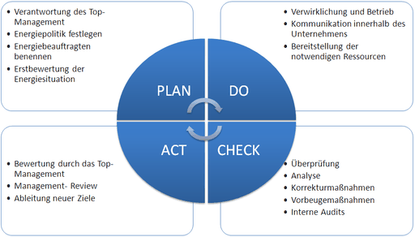
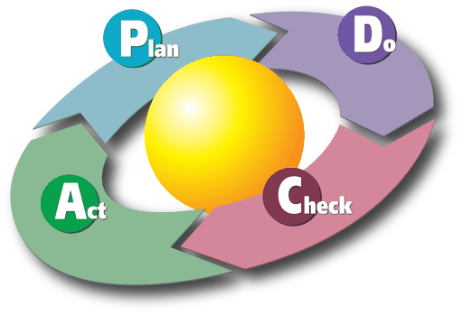
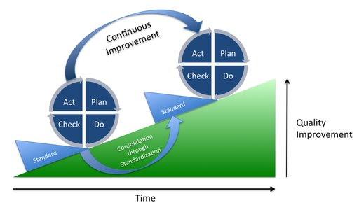

# Demingkreis

Der **Demingkreis** oder auch das **Deming-Rad**, der ***Shewhart Cycle*** oder der ***PDCA*-Zyklus** ist ein iterativer drei- oder vierphasiger Prozess für das Lernen und die Verbesserung in einer Organisation. *PDCA* steht hierbei für das Englische *Plan – Do – Check – Act*, was im Deutschen auch mit „Planen – Umsetzen – Überprüfen – Handeln“ übersetzt wird. Die Ursprünge des Prozesses liegen in der Qualitätssicherung, er wurde vom US-amerikanischen Physiker Walter Andrew Shewhart entwickelt.

## Begriff und Geschichte

In den 1930ern arbeitete Shewhart an der Qualitätsverbesserung in einem Werk von Western Electric. Aus den Erkenntnissen entwickelte William Edwards Deming mit anderen einen Lehrgang „Statistical Process Control“ (Statistische Prozesslenkung), den während der Kriegsjahre ca. 35000 Ingenieure in den USA besuchten. 1939 veröffentlichte Shewhart ein Buch mit dem Titel „Statistische Methode aus der Sicht der Qualitätskontrolle“, das von Deming überarbeitet wurde. Dort findet man die erste Version des „Shewhart-Zyklus“:

:   Specification → Production → Inspection

Der Hintergedanke war die systemische Betrachtung der Produktionsprozesse. Allerdings gefiel Shewhart die aufeinanderfolgende Darstellung nicht.

> “These three steps must go in a circle instead of in a straight line, as shown … It may be helpful to think of the three steps in the mass production process as steps in the scientific method. In this sense, specification, production and inspection correspond respectively to making a hypothesis, carrying out an experiment, and testing the hypothesis. The three steps constitute a dynamic scientific process of acquiring knowledge”

> „Diese drei Schritte müssen in einem Kreis verlaufen, statt wie gezeigt in einer geraden Linie … Es kann hilfreich sein, sich die drei Schritte als wissenschaftliche Methode in den Massenprozessen vorzustellen. In diesen Sinne korrespondieren Spezifikation, Produktion und Prüfen mit ‚Hypothese erstellen‘, ‚Experiment durchführen‘ und ‚Überprüfen der Hypothese‘. Diese drei Schritte stellen einen dynamischen, wissenschaftlichen Prozess des Wissenserwerbs dar.“

– Walter Andrew Shewhart

Der Shewhart-Zyklus wurde somit als Kreis dargestellt um die fortgesetzte Anwendung des Prinzips zu veranschaulichen.

Der Begriff *Deming-Kreis* leitet sich von W. Edwards Deming (1900–1993) ab. Der amerikanische Physiker und Statistiker hatte bei Shewhart studiert, seine Ideen aufgegriffen und verbreitet und damit das Qualitätsmanagement maßgeblich beeinflusst. Dadurch wurde ihm der Zyklus zugesprochen und in vielen Ländern als Demingkreis oder ähnliches bezeichnet. Deming selbst sprach durchgehend vom **Shewhart-Zyklus**, da er die Idee Shewhart zusprach. Alternativ wird aus Abkürzung der Schritte des Zyklus die Bezeichnungen PDCA-Zyklus oder in deutscher Übersetzung PTCA-Zyklus (für Planen; Tun = Durchführen; Checken = Überprüfen; – Aktion = Agieren/Handeln) verwendet.

Als die amerikanischen Besatzungstruppen in Japan unter General Douglas MacArthur Qualitätsprobleme mit den lokal produzierten Funkgeräten hatten, wurde auf Vorschlag einiger Qualitätssicherungsexperten Deming von Ishikawa Ichirō, dem Vater von Ishikawa Kaoru, für einen Vortrag eingeladen. Am 13. Juli 1950 hielt Deming einen Vortrag vor den Führungskräften von 21 Branchen in Japan. Die Gruppe um Ishikawa würde für die folgenden Jahrzehnte die Qualitätsentwicklung in Japan entscheidend beeinflussen, während die statistischen Methoden in den USA nach dem Krieg bedeutungslos wurden.

## Vier Schritte

Deming fügte dem dreistufigen Prozess Shewharts einen weiteren Schritt hinzu, um die evolutionäre Qualitätsentwicklung darzustellen. Damit bekam der Prozess die heute übliche vierstufige Darstellungsform. Ein Shewhart-Zyklus wurde eine Stufe in dem kontinuierlichen Verbesserungsprozess eines Systems. Gemäß dem von Deming bevorzugten Human-Relations-Ansatz rückte er das Arbeitssystem (Gemba) in den Mittelpunkt: „Gehe an den Ort des Geschehens“ und stellt vor allem die Mitarbeiter vor Ort mit ihrer exakten Kenntnis der Situation am Arbeitsplatz in den Mittelpunkt der Planung.

Der PDCA-Zyklus besteht aus vier Elementen:

Plan
:   der jeweilige Prozess muss vor seiner eigentlichen Umsetzung geplant werden: *Plan* umfasst das Erkennen von Verbesserungspotentialen (in der Regel durch den Arbeitnehmer beziehungsweise Teamleiter vor Ort), die Analyse des aktuellen Zustands sowie das Entwickeln eines neuen Konzeptes (unter intensiver Einbindung des Arbeitnehmers).

Do
:   *Do* bedeutet entgegen weit verbreiteter Auffassung nicht die Einführung und Umsetzung auf breiter Front, sondern das Ausprobieren beziehungsweise Testen und praktische Optimieren des Konzeptes mit schnell realisierbaren, einfachen Mitteln (z. B. provisorische Vorrichtungen) an einem einzelnen Arbeitsplatz [wieder unter starker Einbindung des Arbeitnehmers (*Gemba*)].

Check
:   der im Kleinen realisierte Prozessablauf und seine Resultate werden sorgfältig überprüft und bei Erfolg für die Umsetzung auf breiter Front *allgemein* freigegeben.

Act
:   in der Phase *Act* wird die neue *allgemeine Vorgabe* auf breiter Front eingeführt, festgeschrieben und regelmäßig auf Einhaltung überprüft (Audits). Hier handelt es sich tatsächlich um eine „große Aktion“, die im Einzelfall umfangreiche organisatorische Aktivitäten (z. B. Änderung von Arbeitsplänen, NC-Programmen, Stammdaten, die Durchführung von Schulungen, Anpassung von Aufbau- und Ablauforganisation) sowie erhebliche Investitionen (an allen vergleichbaren Arbeitsplätzen, in allen Werken) umfassen kann. Die Verbesserung dieses Standards beginnt wiederum mit der Phase *Plan*.

## Anwendung

Der PDCA-Zyklus beschreibt die Phasen im kontinuierlichen Verbesserungsprozess (KVP). KVP ist die Grundlage aller Qualitätsmanagement-Systeme. Damit wird im Unternehmen eine stetige Verbesserung der Prozesse und Abläufe verfolgt mit dem Ziel, die Effizienz, Kunden- und Mitarbeiterzufriedenheit des Unternehmens zu verbessern.

In Industrieunternehmen und im Dienstleistungssektor gehört er zu den Standardverfahren. KVP und PDCA-Zyklus sind grundlegende Bestandteile der Normenfamilien ISO 9000, ISO 14000, ISO/IEC 20000 und ISO/IEC 27001 *Information technology – Security techniques – Information security management systems requirements specification* und im BSI-Standard 100-1: *Managementsysteme für Informationssicherheit (ISMS)*.

Nach jedem PDCA-Zyklus sind die Maßnahmen durch einen *SDCA*-Zyklus zu standardisieren. Nach jeder Einführung eines festgelegten Standards (**S**tandardize) wird dieser Standard praktiziert (**D**o), das Verfahren auf Richtigkeit und Funktionstüchtigkeit überprüft (**C**heck) und bei Notwendigkeit geändert (**A**ction). Diese Action ist dann im Regelfall das Planen eines weiteren PDCA-Zyklus.

Ein prozessorientierter Ansatz ist Bestandteil des Qualitätsmanagementsystems nach ISO 9001. Der Plan-Do-Check-Act (PDCA) Zyklus ist ein bewährtes Werkzeug, um einen prozessorientierten Ansatz im Unternehmen umzusetzen.
