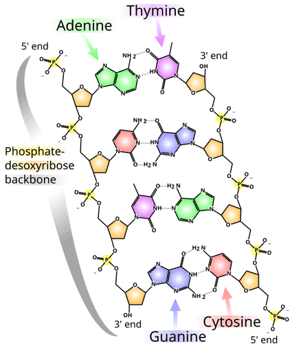
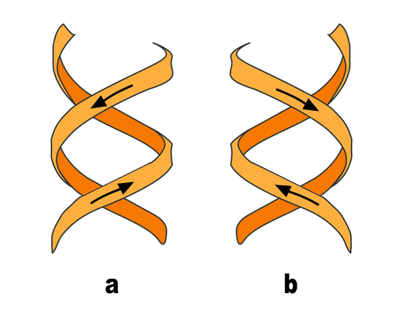
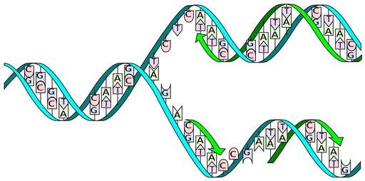

# Desoxyribonukleinsäure

**Desoxyribonukleinsäure** (), meist kurz als **DNA** (Abkürzung für englisch deoxyribonucleic acid), seltener auch als **DNS** abgekürzt, ist eine aus unterschiedlichen Desoxyribonukleotiden aufgebaute Nukleinsäure. Sie trägt die Erbinformation bei allen Lebewesen und den DNA-Viren. Das langkettige Polynukleotid enthält in Abschnitten von Genen besondere Abfolgen seiner Nukleotide. Diese DNA-Abschnitte dienen als Matrizen für den Aufbau entsprechender Ribonukleinsäuren (RNA), wenn genetische Information von DNA in RNA umgeschrieben wird (siehe Transkription). Die hierbei an der DNA-Vorlage aufgebauten RNA-Stränge erfüllen unterschiedliche Aufgaben; sie sind als rRNA (englisch ribosomal RNA), als tRNA (englisch transfer RNA) und als mRNA (englisch messenger RNA) an der Biosynthese von Proteinen beteiligt (siehe Proteinbiosynthese). Im Falle einer *Messenger*- oder Boten-RNA (mRNA) stellt die Abfolge von Nukleinbasen die Bauanleitung für ein Protein dar.

Die Grundbausteine von DNA-Strängen sind vier verschiedene Nukleotide, die jeweils aus einem Phosphatrest, dem Zucker Desoxyribose sowie einer von vier Nukleinbasen (Adenin, Thymin, Guanin und Cytosin; oft mit A, T, G und C abgekürzt) bestehen. Die Basenabfolge von Nukleotidsequenz in bestimmten DNA-Strangabschnitten enthält Information. Umgeschrieben in den Einzelstrang einer mRNA gibt deren Basensequenz bei der Proteinbiosynthese die Abfolge von Aminosäuren (Aminosäuresequenz) im zu bildenden Protein vor. Hierbei wird drei aufeinanderfolgenden Basen – je einem Basentriplett als Codon – jeweils eine bestimmte Aminosäure zugeordnet und diese mit der vorigen verknüpft, sodass ein Polypeptid entsteht. So werden an einem Ribosom mithilfe von tRNA entsprechend dem genetischen Code Bereiche der Basensequenz in eine Aminosäurensequenz übersetzt (siehe Translation).

Das Genom einer Zelle liegt zumeist als DNA-Doppelstrang vor, bei dem die beiden Stränge durch komplementäre Basenpaare verbunden sind und räumlich die Form einer Doppelhelix bilden. Bei der Replikation werden sie entwunden und getrennt jeweils durch Basenpaarung wieder komplementär ergänzt, sodass anschließend zwei (nahezu) identische doppelsträngige DNA-Moleküle vorliegen. Fehler beim Replikationsvorgang sind eine Quelle für Mutationen, die nach Kernteilung und Zellteilung in entstandenen Zellen als Veränderung genetischer Information vorliegen und weitergegeben werden können.

In den Zellen von Eukaryoten, zu denen Pflanzen, Tiere und Pilze gehören, ist der Großteil der DNA im Zellkern (lateinisch nucleus, daher *nukleäre DNA* oder nDNA) als Chromosomen organisiert. Ein kleiner Teil befindet sich in den Mitochondrien und wird dementsprechend mitochondriale DNA (mtDNA) genannt. Pflanzen und Algen haben außerdem DNA in Photosynthese betreibenden Organellen, den Chloroplasten bzw. Plastiden (cpDNA). Bei Bakterien und Archaeen – den Prokaryoten, die keinen Zellkern besitzen – liegt die DNA im Cytoplasma meist zirkulär vor (siehe Bakterienchromosom). Manche Viren speichern ihre genetische Information in RNA statt in DNA (siehe RNA-Virus).

## Bezeichnung

Die Bezeichnung *Desoxyribonukleinsäure* ist ein Wort, das sich aus mehreren Komponenten zusammensetzt: *des* (von des-), *oxy* (erste beiden Sprechsilben von Oxygenium für Sauerstoff), *ribo* (erste beiden Silben von Ribose) – somit *Desoxyribo* (für Desoxyribose) – und *nukleinsäure* (von Nuklein und Säure). Im deutschen Sprachgebrauch wird die Desoxyribonukleinsäure inzwischen überwiegend mit der englischen Abkürzung für *deoxyribonucleic acid* als *DNA* bezeichnet, während die Abkürzung *DNS* nach dem Duden als „veraltend“ gilt.

## Entdeckungsgeschichte

1869 entdeckte der Schweizer Arzt Friedrich Miescher in einem Extrakt aus Eiter eine durch milde Säurebehandlung aus den Zellkernen der Leukozyten gewonnene Substanz, die er **Nuklein** nannte. Miescher arbeitete damals im Labor von Felix Hoppe-Seyler im Tübinger Schloss. 1892 (bzw. 1897 posthum, nachdem der zu Grunde liegende Brief veröffentlicht wurde) führte der „späte“ Miescher auf Basis seiner biochemischen Erkenntnisse hinsichtlich der Komplexität von Nukleinen und Proteinen als erster den Schrift- oder Code-Vergleich für den noch zu entdeckenden Träger der Erbinformation als Forschungshypothese in die Genetik ein. 1889 isoliert der Deutsche Richard Altmann aus dem Nuklein Proteine und die Nukleinsäure. Weitere Erkenntnisse zur Nukleinsäure gehen auf die Arbeiten von Albrecht Kossel (siehe „Die Entdeckung der Nukleinbasen“) zurück, für die er 1910 mit dem Nobelpreis für Physiologie oder Medizin ausgezeichnet wurde. Im Jahr 1885 teilte er mit, dass aus einer größeren Menge Rinder-Bauchspeicheldrüse eine stickstoffreiche Base mit der Summenformel C5H5N5 isoliert wurde, für die er, abgeleitet von dem griechischen Wort „aden“ für Drüse, den Namen Adenin vorschlug. 1891 konnte Kossel (nach Altmanns Verfahren) Hefe-Nukleinsäure herstellen und Adenin und Guanin als Spaltprodukte nachweisen. Es stellte sich heraus, dass auch ein Kohlenhydrat Bestandteil der Nukleinsäure sein musste. Kossel wählte für die basischen Substanzen Guanin und Adenin sowie seine Derivate den Namen Nucleinbasen.

1893 berichtete Kossel, dass er aus den Thymusdrüsen des Kalbes Nukleinsäure gewonnen und ein gut kristallisiertes Spaltprodukt erhalten hatte, für das er den Namen Thymin vorschlug. 1894 isolierte er aus den Thymusdrüsen eine weitere (basische) Substanz. Kossel gab ihr den Namen Cytosin.

Nachdem am Ende des 19. Jahrhunderts – im Wesentlichen durch die Synthesen Emil Fischers – die Strukturformeln des Guanins und Adenins als Purinkörper und des Thymins als Pyrimidinkörper endgültig aufgeklärt worden waren, konnte Kossel mit Hermann Steudel (1871–1967) auch die Strukturformel der Nukleinbase Cytosin als Pyrimidinkörper zweifelsfrei ermitteln. Es hatte sich inzwischen erwiesen, dass Guanin, Adenin sowie Thymin und Cytosin in allen entwicklungsfähigen Zellen zu finden sind.

Die Erkenntnisse über diese vier Nukleinbasen sollten für die spätere Strukturaufklärung der DNA von wesentlicher Bedeutung sein. Es war Albrecht Kossel, der sie – zusammen mit einem Kohlenhydrat und der Phosphorsäure – eindeutig als Bausteine der Nukleinsäure charakterisierte:

„Es gelang mir, eine Reihe von Bruchstücken zu erhalten … welche durch eine ganz eigentümliche Ansammlung von Stickstoffatomen gekennzeichnet sind. Es sind hier nebeneinander … das Cytosin, das Thymin, das Adenin und das Guanin.“ (Nobelvortrag am 12. Dezember 1910).

Der aus Litauen stammende Biochemiker Phoebus Levene schlug eine kettenartige Struktur der Nukleinsäure vor, in welcher die Nukleotide durch die Phosphatreste zusammengefügt sind und sich wiederholen. 1929 konnte er in Zusammenarbeit mit dem russischen Physiologen Efim London (1869–1932) den Zuckeranteil der „tierische Nukleinsäure“ als Desoxyribose identifizieren (J. Biol. Chem.1929, 83. Seiten 793-802). [5a] Erst nachfolgend wurde sie als Desoxyribonukleinsäure bezeichnet. Es wurde erkannt, dass sie auch in pflanzlichen Zellkernen vorkommt.

Als wirksamer Bestandteil der Chromosomen bzw. des Kernchromatins wurde die DNA bereits 1932 von K. Voit und Hartwig Kuhlenbeck angesehen. 1937 publizierte William Astbury erstmals Röntgenbeugungsmuster, die auf eine repetitive Struktur der DNA hinwiesen.

1943 wies Oswald Avery nach, dass die Transformation von Bakterien, das heißt die Weitergabe erblicher Information von einem Bakterien-Stamm auf einen anderen (heute horizontaler Gentransfer genannt), auf der Übertragung von DNA beruht. Dies widersprach der damals noch allgemein favorisierten Annahme, dass nicht die DNA, sondern Proteine die Träger der Erbinformation seien. Unterstützung in seiner Interpretation erhielt Avery 1952, als Alfred Day Hershey und Martha Chase nachwiesen, dass DNA die Erbinformation des T2-Phagen enthält.

Den strukturellen Aufbau der DNA zu entschlüsseln und im Modell nachzubilden, gelang dem US-Amerikaner James Watson und dem Briten Francis Crick am 28. Februar 1953. Ihre Entdeckung publizierten sie in der April-Ausgabe 1953 des Magazins *Nature* in ihrem berühmten Artikel *Molecular Structure of Nucleic Acids: A Structure for Deoxyribose Nucleic Acid*. Watson kam 1951 nach England, nachdem er ein Jahr zuvor an der Indiana University Bloomington in den USA promoviert hatte. Er hatte zwar ein Stipendium für Molekularbiologie bekommen, beschäftigte sich aber vermehrt mit der Frage des menschlichen Erbguts. Crick widmete sich in Cambridge gerade erfolglos seiner Promotion über die Kristallstruktur des Hämoglobinmoleküls, als er 1951 Watson traf.

Zu dieser Zeit war bereits ein erbitterter Wettlauf um die Struktur der DNA entbrannt, an dem sich neben anderen auch Linus Pauling am California Institute of Technology (Caltech) beteiligte. Watson und Crick waren eigentlich anderen Projekten zugeteilt worden und besaßen kein bedeutendes Fachwissen in Chemie. Sie bauten ihre Überlegungen auf den Forschungsergebnissen der anderen Wissenschaftler auf. Watson sagte, er *wolle das Erbgut entschlüsseln, ohne Chemie lernen zu müssen.* In einem Gespräch mit dem renommierten Chemiker und Ersteller der Chargaff-Regeln, Erwin Chargaff, vergaß Crick wichtige Molekülstrukturen, und Watson machte im selben Gespräch unpassende Anmerkungen, die seine Unkenntnis auf dem Gebiet der Chemie verrieten. Chargaff nannte die jungen Kollegen im Anschluss „wissenschaftliche Clowns“.

Watson besuchte Ende 1952 am King’s College in London Maurice Wilkins, der ihm DNA-Röntgenaufnahmen von Rosalind Franklin zeigte. Das geschah ohne Wissen und gegen den Willen von R. Franklin. Watson sah sofort, dass es sich bei dem Molekül um eine *Doppel*-Helix handeln musste; Franklin hatte dies natürlich ebenfalls erkannt und eine mathematische Analyse der Beugungsdaten durchgeführt. Auch der Bericht mit den Berechnungsergebnissen von Franklins Analyse wurde heimlich an Watson und Crick weitergegeben. Damit gelang es Watson und Crick in kürzester Zeit, die Molekularstruktur am Cavendish-Laboratorium der Universität von Cambridge korrekt herzuleiten. Ihr Doppelhelix-Modell der DNA mit den Basenpaaren in der Mitte wurde am 25. April 1953 in der Zeitschrift *Nature* publiziert.

Diese denkwürdige Veröffentlichung enthält gegen Ende den Satz „It has not escaped our notice that the specific pairing we have postulated immediately suggests a possible copying mechanism for the genetic material“. („Es ist unserer Aufmerksamkeit nicht entgangen, dass die spezifische Paarung, die wir als gegeben voraussetzen, unmittelbar auf einen möglichen Vervielfältigungsmechanismus für das genetische Material schließen lässt.“)

„Für ihre Entdeckungen über die Molekularstruktur der Nukleinsäuren und ihre Bedeutung für die Informationsübertragung in lebender Substanz“ erhielten Watson und Crick zusammen mit Maurice Wilkins 1962 den Nobelpreis für Medizin. Rosalind Franklin, deren Röntgenbeugungsdiagramme wesentlich zur Entschlüsselung der DNA-Struktur beigetragen hatten, war zu diesem Zeitpunkt bereits verstorben und konnte daher nicht mehr nominiert werden. Ihr Anteil an der Entdeckung wurde vom Nobelkomitee nicht erwähnt.

Für weitere geschichtliche Informationen zur Entschlüsselung der Vererbungsvorgänge siehe „Forschungsgeschichte des Zellkerns“ sowie „Forschungsgeschichte der Chromosomen“ und „Chromosomentheorie der Vererbung“.

## Aufbau und Organisation

### Bausteine

Die Desoxyribonukleinsäure ist ein langes Kettenmolekül (Polymer) aus vielen Bausteinen, die man Desoxyribonukleotide oder kurz *Nukleotide* nennt. Jedes Nukleotid hat drei Bestandteile: Phosphorsäure bzw. Phosphat, den Zucker Desoxyribose sowie eine heterozyklische Nukleobase oder kurz Base. Die Desoxyribose- und Phosphorsäure-Untereinheiten sind bei jedem Nukleotid gleich. Sie bilden das Rückgrat des Moleküls. Einheiten aus Base und Zucker (ohne Phosphat) werden als Nukleoside bezeichnet.

Die *Phosphatreste* sind aufgrund ihrer negativen Ladung hydrophil, sie geben DNA in wässriger Lösung insgesamt eine negative Ladung. Da diese negativ geladene, in Wasser gelöste DNA keine weiteren Protonen abgeben kann, handelt es sich streng genommen nicht (mehr) um eine Säure. Der Begriff Desoxyribonuklein*säure* bezieht sich auf einen ungeladenen Zustand, in dem Protonen an die Phosphatreste angelagert sind.

Bei der *Base* kann es sich um ein Purin, nämlich Adenin (*A*) oder Guanin (*G*), oder um ein Pyrimidin, nämlich Thymin (*T*) oder Cytosin (*C*), handeln. Da sich die vier verschiedenen Nukleotide nur durch ihre Base unterscheiden, werden die Abkürzungen A, G, T und C auch für die entsprechenden Nukleotide verwendet.

Die fünf Kohlenstoffatome einer *Desoxyribose* sind von 1' (sprich *Eins Strich*) bis 5' nummeriert. Am 1'-Ende dieses Zuckers ist die Base gebunden. Am 5'-Ende hängt der Phosphatrest. Genau genommen handelt es sich bei der Desoxyribose um die 2-Desoxyribose; der Name kommt daher, dass im Vergleich zu einem Ribose-Molekül eine alkoholische Hydroxygruppe (OH-Gruppe) an der 2'-Position fehlt (d. h. durch ein Wasserstoffatom ersetzt wurde).

An der 3'-Position ist eine OH-Gruppe vorhanden, welche die Desoxyribose über eine sogenannte Phosphodiester-Bindung mit dem 5'-Kohlenstoffatom des Zuckers des nächsten Nukleotids verknüpft (siehe Abbildung). Dadurch besitzt jeder sogenannte *Einzelstrang* zwei verschiedene Enden: ein 5'- und ein 3'-Ende. DNA-Polymerasen, die in der belebten Welt die Synthese von DNA-Strängen durchführen, können neue Nukleotide nur an die OH-Gruppe am 3'-Ende anfügen, nicht aber am 5'-Ende. Der Einzelstrang wächst also immer von 5' nach 3' (siehe auch DNA-Replikation weiter unten). Dabei wird ein Nukleosidtriphosphat (mit drei Phosphatresten) als neuer Baustein angeliefert, von dem zwei Phosphate in Form von Pyrophosphat abgespalten werden. Der verbleibende Phosphatrest des jeweils neu hinzukommenden Nukleotids wird mit der OH-Gruppe am 3'-Ende des letzten im Strang vorhandenen Nukleotids unter Wasserabspaltung verbunden. Die Abfolge der Basen im Strang codiert die genetische Information.

### Die Doppelhelix

DNA kommt normalerweise als schraubenförmige Doppelhelix in einer Konformation vor, die B-DNA genannt wird. Zwei der oben beschriebenen Einzelstränge sind dabei aneinandergelagert, und zwar in entgegengesetzter Richtung: An jedem Ende der Doppelhelix hat einer der beiden Einzelstränge sein 3'-Ende, der andere sein 5'-Ende. Durch die Aneinanderlagerung stehen sich in der Mitte der Doppelhelix immer zwei bestimmte Basen gegenüber, sie sind „gepaart“. Die Doppelhelix wird hauptsächlich durch Stapelwechselwirkungen zwischen aufeinanderfolgenden Basen desselben Stranges stabilisiert (und nicht, wie oft behauptet, durch Wasserstoffbrückenbindungen zwischen den Strängen).

Es paaren sich immer Adenin und Thymin, die dabei zwei Wasserstoffbrücken ausbilden, oder Cytosin mit Guanin, die über drei Wasserstoffbrücken miteinander verbunden sind. Eine Brückenbildung erfolgt zwischen den Molekülpositionen 1═1 sowie 6═6, bei Guanin-Cytosin-Paarungen zusätzlich zwischen 2═2. Da sich immer die gleichen Basen paaren, lässt sich aus der Sequenz der Basen in einem Strang die des anderen Strangs ableiten, die Sequenzen sind *komplementär* (siehe auch: Basenpaar). Dabei sind die Wasserstoffbrücken fast ausschließlich für die Spezifität der Paarung verantwortlich, nicht aber für die Stabilität der Doppelhelix.

Da stets ein Purin mit einem Pyrimidin kombiniert wird, ist der Abstand zwischen den Strängen überall gleich, es entsteht eine regelmäßige Struktur. Die ganze Helix hat einen Durchmesser von ungefähr 2 nm und windet sich mit jedem Zuckermolekül um 0,34 nm weiter.

Die Ebenen der Zuckermoleküle stehen in einem Winkel von 36° zueinander, und eine vollständige Drehung wird folglich nach 10 Basen (360°) und 3,4 nm erreicht. DNA-Moleküle können sehr groß werden. Beispielsweise enthält das größte menschliche Chromosom 247 Millionen Basenpaare.

Beim Umeinanderwinden der beiden Einzelstränge verbleiben seitliche Lücken, sodass hier die Basen direkt an der Oberfläche liegen. Von diesen *Furchen* gibt es zwei, die sich um die Doppelhelix herumwinden (siehe Abbildungen und Animation am Artikelanfang). Die „große Furche“ ist 2,2 nm breit, die „kleine Furche“ nur 1,2 nm.

Entsprechend sind die Basen in der großen Furche besser zugänglich. Proteine, die sequenzspezifisch an die DNA binden, wie Transkriptionsfaktoren, binden daher meist an der großen Furche.

Auch manche DNA-Farbstoffe, wie DAPI, lagern sich an einer Furche an.

Die kumulierte Bindungsenergie zwischen den beiden Einzelsträngen hält diese zusammen. Kovalente Bindungen sind hier nicht vorhanden, die DNA-Doppelhelix besteht also nicht aus einem Molekül, sondern aus zweien. Dadurch können die beiden Stränge in biologischen Prozessen zeitweise getrennt werden.

Neben der eben beschriebenen B-DNA existieren auch A-DNA sowie eine 1979 von Alexander Rich und seinen Kollegen am MIT erstmals auch untersuchte, linkshändige, sogenannte Z-DNA. Diese tritt besonders in G-C-reichen Abschnitten auf. Erst 2005 wurde über eine Kristallstruktur berichtet, welche Z-DNA direkt in einer Verbindung mit B-DNA zeigt und so Hinweise auf eine biologische Aktivität von Z-DNA liefert.
Die folgende Tabelle und die daneben stehende Abbildung zeigen die Unterschiede der drei Formen im direkten Vergleich.

Die Stapel der Basenpaare (*base stackings*) liegen nicht wie Bücher exakt parallel aufeinander, sondern bilden Keile, die die Helix in die eine oder andere Richtung neigen.
Den größten Keil bilden Adenosine, die mit Thymidinen des anderen Stranges gepaart sind. Folglich bildet eine Serie von AT-Paaren einen Bogen in der Helix. Wenn solche Serien in kurzen Abständen aufeinander folgen, nimmt das DNA-Molekül eine gebogene bzw. eine gekrümmte Struktur an, welche stabil ist. Dies wird auch Sequenz-induzierte Beugung genannt, da die Beugung auch von Proteinen hervorgerufen werden kann (die sogenannte Protein-induzierte Beugung). Sequenzinduzierte Beugung findet man häufig an wichtigen Stellen im Genom.

### Chromatin und Chromosomen

→ *Hauptartikel: Chromatin und Chromosom*

Organisiert ist die DNA in der eukaryotischen Zelle in Form von Chromatinfäden, genannt Chromosomen, die im Zellkern liegen. Ein einzelnes Chromosom enthält von der Anaphase bis zum Beginn der S-Phase *einen* langen, durchgehenden DNA-Doppelstrang (in einem Chromatid). Am Ende der S-Phase besteht das Chromosom aus *zwei* identischen DNA-Fäden (in zwei Chromatiden).

Da ein solcher DNA-Faden mehrere Zentimeter lang sein kann, ein Zellkern aber nur wenige Mikrometer Durchmesser hat, muss die DNA zusätzlich komprimiert bzw. „gepackt“ werden. Dies geschieht bei Eukaryoten mit sogenannten Chromatinproteinen, von denen besonders die basischen Histone zu erwähnen sind. Sie bilden die Nukleosomen, um die die DNA auf der niedrigsten Verpackungsebene herumgewickelt wird. Während der Kernteilung (Mitose) wird jedes Chromosom zu seiner maximal kompakten Form kondensiert. Dadurch können sie mit dem Lichtmikroskop besonders gut in der Metaphase identifiziert werden.

### Bakterielle und virale DNA

In prokaryotischen Zellen liegt die doppelsträngige DNA in den bisher dokumentierten Fällen mehrheitlich nicht als lineare Stränge mit jeweils einem Anfang und einem Ende vor, sondern als zirkuläre Moleküle – jedes Molekül (d. h. jeder DNA-Strang) schließt sich mit seinem 3'- und seinem 5'-Ende zum Kreis. Diese zwei ringförmigen, geschlossenen DNA-Moleküle werden je nach Länge der Sequenz als Bakterienchromosom oder Plasmid bezeichnet. Sie befinden sich bei Bakterien auch nicht in einem Zellkern, sondern liegen frei im Plasma vor. Die Prokaryoten-DNA wird mit Hilfe von Enzymen (zum Beispiel Topoisomerasen und Gyrasen) zu einfachen „Supercoils“ aufgewickelt, die einer geringelten Telefonschnur ähneln. Indem die Helices noch um sich selbst gedreht werden, sinkt der Platzbedarf für die Erbinformation. In den Bakterien sorgen Topoisomerasen dafür, dass durch ständiges Schneiden und Wiederverknüpfen der DNA der verdrillte Doppelstrang an einer gewünschten Stelle entwunden wird (Voraussetzung für Transkription und Replikation). Viren enthalten je nach Typ als Erbinformation entweder DNA oder RNA. Sowohl bei den DNA- wie den RNA-Viren wird die Nukleinsäure durch eine Protein-Hülle geschützt.

### Chemische und physikalische Eigenschaften der DNA-Doppelhelix

Die DNA ist bei neutralem pH-Wert ein negativ geladenes Molekül, wobei die negativen Ladungen auf den Phosphaten im Rückgrat der Stränge sitzen. Zwar sind zwei der drei sauren OH-Gruppen der Phosphate mit den jeweils benachbarten Desoxyribosen verestert, die dritte ist jedoch noch vorhanden und gibt bei neutralem pH-Wert ein Proton ab, was die negative Ladung bewirkt. Diese Eigenschaft macht man sich bei der Agarose-Gelelektrophorese zu Nutze, um verschiedene DNA-Stränge nach ihrer Länge aufzutrennen. Einige physikalische Eigenschaften wie die freie Energie und der Schmelzpunkt der DNA hängen direkt mit dem GC-Gehalt zusammen, sind also sequenzabhängig.

#### Stapelwechselwirkungen

Für die Stabilität der Doppelhelix sind hauptsächlich zwei Faktoren verantwortlich: die Basenpaarung zwischen komplementären Basen sowie Stapelwechselwirkungen *(stacking interactions)* zwischen aufeinanderfolgenden Basen.

Anders als zunächst angenommen, ist der Energiegewinn durch Wasserstoffbrückenbindungen vernachlässigbar, da die Basen mit dem umgebenden Wasser ähnlich gute Wasserstoffbrückenbindungen eingehen können. Die Wasserstoffbrücken eines GC-Basenpaares tragen nur minimal zur Stabilität der Doppelhelix bei, während diejenigen eines AT-Basenpaares sogar destabilisierend wirken. Stapelwechselwirkungen hingegen wirken nur in der Doppelhelix zwischen aufeinanderfolgenden Basenpaaren: Zwischen den aromatischen Ringsystemen der heterozyklischen Basen entsteht eine dipol-induzierte Dipol-Wechselwirkung, welche energetisch günstig ist. Somit ist die Bildung des ersten Basenpaares aufgrund des geringen Energiegewinnes und des -verlustes recht ungünstig, jedoch die Elongation (Verlängerung) der Helix ist energetisch günstig, da die Basenpaarstapelung unter Energiegewinn verläuft.

Die Stapelwechselwirkungen sind jedoch sequenzabhängig und energetisch am günstigsten für gestapelte GC-GC, weniger günstig für gestapelte AT-AT. Die Unterschiede in den Stapelwechselwirkungen erklären hauptsächlich, warum GC-reiche DNA-Abschnitte thermodynamisch stabiler sind als AT-reiche, während Wasserstoffbrückenbildung eine untergeordnete Rolle spielt.

#### Schmelzpunkt

Der *Schmelzpunkt der DNA* ist die Temperatur, bei der die Bindungskräfte zwischen den beiden Einzelsträngen überwunden werden und diese sich voneinander trennen. Dies wird auch als *Denaturierung* bezeichnet.

Solange die DNA in einem kooperativen Übergang denaturiert (der sich in einem enggefassten Temperaturbereich vollzieht), bezeichnet der Schmelzpunkt die Temperatur, bei der die Hälfte der Doppelstränge in Einzelstränge denaturiert ist. Von dieser Definition sind die korrekten Bezeichnungen „midpoint of transition temperature“ bzw. Mittelpunktstemperatur Tm abgeleitet.

Der Schmelzpunkt hängt von der jeweiligen Basensequenz in der Helix ab. Er steigt, wenn in ihr mehr GC-Basenpaare liegen, da diese entropisch günstiger sind als AT-Basenpaare. Das liegt nicht so sehr an der unterschiedlichen Zahl der Wasserstoffbrücken, welche die beiden Paare ausbilden, sondern viel mehr an den unterschiedlichen Stapelwechselwirkungen *(stacking interactions).* Die stacking-Energie zweier Basenpaare ist viel kleiner, wenn eines der beiden Paare ein AT-Basenpaar ist. GC-Stapel dagegen sind energetisch günstiger und stabilisieren die Doppelhelix stärker. Das Verhältnis der GC-Basenpaare zur Gesamtzahl aller Basenpaare wird durch den GC-Gehalt angegeben.

Da einzelsträngige DNA UV-Licht etwa 40 Prozent stärker absorbiert als doppelsträngige, lässt sich die Übergangstemperatur in einem Photometer gut bestimmen.

Wenn die Temperatur der Lösung unter Tm zurückfällt, können sich die Einzelstränge wieder aneinanderlagern. Dieser Vorgang heißt *Renaturierung* oder *Hybridisierung.* Das Wechselspiel von De- und Renaturierung wird bei vielen biotechnologischen Verfahren ausgenutzt, zum Beispiel bei der Polymerase-Kettenreaktion (PCR), bei Southern Blots und der In-situ-Hybridisierung.

### Kreuzförmige DNA an Palindromen

→ *Hauptartikel: Palindromische Sequenz*

Ein Palindrom ist eine Folge von Nukleotiden, bei denen sich die beiden komplementären Stränge jeweils von rechts genauso lesen lassen wie von links.

Unter natürlichen Bedingungen (bei hoher Drehspannung der DNA) oder künstlich im Reagenzglas kann sich diese lineare Helix als Kreuzform (cruciform) herausbilden, indem zwei Zweige entstehen, die aus dem linearen Doppelstrang herausragen. Die Zweige stellen jeweils für sich eine Helix dar, allerdings bleiben am Ende eines Zweiges mindestens drei Nukleotide ungepaart. Beim Übergang von der Kreuzform in die lineare Helix bleibt die Basenpaarung wegen der Biegungsfähigkeit des Phosphodiester-Zucker-Rückgrates erhalten.

Die spontane Zusammenlagerung von komplementären Basen zu sog. Stamm-Schleifen-Strukturen wird häufig auch bei Einzelstrang-DNA oder -RNA beobachtet.

### Nicht-Standard-Basen

Gelegentlich werden in Viren und zellulären Organismen Abweichungen von den oben genannten vier kanonischen Basen (Standard-Basen) Adenin (A), Guanin (G), Thymin (T) und Cytosin (C) beobachtet; weitere Abweichungen können künstlich erzeugt werden.

#### Natürliche Nichtstandard-Basen

1. Uracil (U) wird normalerweise nicht in der DNA gefunden, es tritt lediglich als Abbauprodukt von Cytosin auf. In mehreren Bakteriophagen (bakteriellen Viren) wird Thymin jedoch durch Uracil ersetzt:
   - *Bacillus-subtilis*-Bakteriophage PBS1 (Spezies Bacillus-Virus PBS1, wissenschaftlich *Takahashivirus PBS1*) und „PBS2“ (vorgeschlagene Spezies „Bacillus-Phage PBS2“) – beide Spezies sind vom Morphotyp der Myoviren.
   - Yersinia-Phage phiR1-RT (Spezies Yersinia-Virus R1RT, wiss. *Tegunavirus r1rt*), Morphotyp *Myoviren*
   - „Staphylococcus-Phage S6“ (alias Staphylococcus aureus Bacteriophage 15, ebenfalls Morphotyp *Myovirien*)
   - Uracil wird auch in der DNA von Eukaryoten wie *Plasmodium falciparum* (Apicomplexa) gefunden. Es ist dort in relativ geringen Mengen vorhanden (7–10 Uracileinheiten pro Million Basen).
2. 5-Hydroxymethyldesoxyuridin (hm5dU) ersetzt Thymidin im Genom verschiedener *Bacillus*-Phagen der Spezies Bacillus-Virus SPO1 (wiss. *Okubovirus SPO1*, Familie *Herelleviridae* und Morphotyp Siphoviren. Es sind dies die Phagen SPO1, SP8, SP82, „Phi-E“ alias „ϕe“ und „2C“)
3. 5-Dihydroxypentauracil (DHPU, mit Nukleotid 5-dihydroxypentyl-dUMP, DHPdUMP) wurde als Ersatz für Thymidin im Bacillus-Phagen SP15 (auch SP-15, Spezies *Thornevirus SP15*, Morphotyp Myoviren) beschrieben.
4. Beta-d-glucopyranosyloxymethyluracil (Base J), ebenfalls eine modifizierte Form von Uracil, wurde in verschiedenen Organismen gefunden: Den Flagellaten *Diplonema* und *Euglena* (beide Excavata: Euglenozoa) sowie allen Gattungen der Kinetoplastiden. Die Biosynthese von J erfolgt in zwei Schritten: Im ersten Schritt wird ein spezifisches Thymidin in DNA in Hydroxymethyldesoxyuridin (HOMedU) umgewandelt, im zweiten wird HOMedU zu J glykosyliert. Es gibt einige Proteine, die spezifisch an diese Base binden. Diese Proteine scheinen entfernte Verwandte des Tet1-Onkogens zu sein, das an der Pathogenese der akuten myeloischen Leukämie beteiligt ist. J scheint als Terminationssignal für RNA-Polymerase II zu wirken.
5. 2,6-Diaminopurin (alias 2-Aminoadenin, Base D oder X, DAP): 1976 wurde festgestellt, dass der „Cyanobacteria-Phage S-2L“ („*Cyanophage S-2L*“, informelle Gattung „*Cyanostylovirus*“, evtl. Familie „*Cyanostyloviridae*“ oder „*Styloviridae*“, Morphotyp Siphoviren), dessen Wirte Spezies der Gattung *Synechocystis* sind, alle Adenosinbasen in seinem Genom durch 2,6-Diaminopurin ersetzt. Drei weitere Untersuchungen folgten im Jahr 2021, eine Zusammenfassung findet sich auf sciencealert (Mai 2021). Ähnliches gilt für „Acinetobacter-Phage SH-Ab 15497“ (en. „*Acinetobacter phage SH-Ab 15497*“), ebenfalls Morphotyp Siphoviren, und weitere Vertreter dieses Morphotyps sowie dem der Podoviren.
6. Wie 2016 herausgefunden wurde, ist 2'-Desoxyarchaeosin (dG+) im Genom mehrerer Bakterien und im Escherichia-Phagen 9g (alias Enterobacteria-Phage 9g, Spezies Escherichia-Virus 9g, wiss. *Nonagvirus nv9g*, Unterfamilie *Queuovirinae*, Morphotyp Siphoviren) vorhanden.
7. 6-Methylisoxanthopterin
8. 5-Hydroxyuracil

#### Natürliche modifizierte Basen (Methylierungen u. a.)

In natürlicher DNA kommen auch modifizierte Basen vor. Insbesondere werden Methylierungen der kanonischen Basen im Rahmen der Epigenetik untersucht:

1. Zunächst wurde im Jahr 1925 5-Methylcytosin (m5C) im Genom von *Mycobacterium tuberculosis* gefunden. Im Genom des *Xanthomonas oryzae*-Bakteriophagen Xp12 (Xanthomonas phage Xp12), Gattung *Bosavirus*, Familie *Mesyanzhinovviridae*, Morphotyp Siphoviren) und des Halovirus ΦH (Spezies Halobacterium-Virus phiH, wiss. *Myohalovirus phiH*, Familie *Vertoviridae*, Morphotyp Myoviren) ist das gesamte Cystosin-Kontingent durch 5-Methylcytosin ersetzt.
2. Einen kompletten Ersatz von Cytosin durch 5-Glycosylhydroxymethylcytosin (*syn.* Glycosyl-5-hydroxymethylcytosin) in den Phagen T2, T4 und T6 der Spezies *Escherichia-Virus T4* (Gattung *Tequatrovirus*, Unterfamilie *Tevenvirinae*, Morphotyp Myoviren) wurde 1953 beobachtet.
3. Wie 1955 entdeckt wurde, ist N6-Methyladenin (6mA, m6A) in der DNA von Colibakterien vorhanden.
4. N6-Carbamoylmethyladenin wurde 1975 in den Bakteriophagen Mu (Spezies Escherichia-Virus Mu, wiss. *Muvirus mu*, mit Enterobacteria-Phage Mu, Morphotyp Myovirien) und Lambda-Mu beschrieben.
5. 7-Methylguanin (m7G) wurde 1976 im Phagen DDVI („*Enterobacteria phage DdVI*“ alias „DdV1“, Gattung *Tequatrovirus* , früher *T4virus*) von *Shigella disenteriae* beschrieben.
6. N4-Methylcytosin (m4C) in DNA wurde 1983 beschrieben (in *Bacillus centrosporus*).
7. 1985 wurde 5-Hydroxycytosin im Genom des *Rhizobium*-Phagen RL38JI gefunden.
8. α-Putrescinylthymin (Alpha-Putrescinylthymin, putT) und α-Glutamylthymidin (Alpha-Glutamylthymidin) kommt im Genom sowohl des *Delftia*-Phagen ΦW-14 (Phi W-14, Spezies ‚*Dellftia virus PhiW14*‘, Gattung *Ionavirus*, Familie *Myovriridae*) als auch des *Bacillus*-Phagen SP10 (Spezies „*Bacillus phage SP-10*“, Familie *Herelleviridae*, Morphotyp Siphoviren) vor.
9. 5-Dihydroxypentyluracil wurde im *Bacillus*-Phagen SP15 (auch SP-15, Spezies Bacillus-Virus SP15, wiss. *Thornevirus SP15*, Morphotyp Myoviren) gefunden.

Die Funktion dieser nicht-kanonischen Basen in der DNA ist nicht bekannt. Sie wirken zumindest teilweise als molekulares Immunsystem und helfen, die Bakterien vor einer Infektion durch Viren zu schützen.

Nicht-Standard und modifizierte Basen bei Mikroben sind aber noch nicht alles:

1. Es wurde auch über vier Modifikationen der Cytosinreste in humaner DNA berichtet. Diese Modifikationen bestehen aus dem Zusatz folgender Gruppen:
   - Methyl (–CH3)
   - Hydroxymethyl (–CH2OH)
   - Formyl (–CHO)
   - Carboxyl (–COOH)
      Es wird angenommen, dass diese Modifikationen regulatorische Funktionen haben, Stichwort Epigenetik.
2. Uracil ist in den Centromer-Regionen von mindestens zwei menschlichen Chromosomen (6 und 11) zu finden.

#### Synthetische Basen

Basis der Nukleinsäuren-Komplementarität sind Zahl und räumliche Ausrichtung der funktionellen Gruppen, welche die Wasserstoffbrückenbindungen zwischen den Purin- und Pyrimidinbasen ermöglichen. Dabei fungiert ein Wasserstoff der Aminogruppe (–NH2) oder der Wasserstoff des Stickstoffs im Heterozyklus als Donor (D), Carbonylsauerstoff oder heterozyklischer Stickstoff mit einem nichtbindenden Elektronenpaar als Akzeptor (A).

Theoretisch ergeben sich für die Kombination von Purinen (pu) mit komplementären Pyrimidinen (py) 12 Kombinationsmöglichkeiten für drei Wasserstoffbrückenbindungen:

Damit ist es möglich, den genetischen Code um vier neue Basenpaare zu erweitern, was zu 448 neuen Codons führt. Mit einer modifizierten Polymerase lässt sich eine DNA, die auch diese Basenpaare enthält, replizieren.

Untersuchungen mit diesem modifizierten Replikationssystem haben gezeigt, dass die DNA-Reparaturenzyme nicht, wie das bis dahin gültige Modell vorschlug, die kleine Furche der DNA-Doppelhelix entlangwandern und den Nukleotidstrang nach nichtbindenden Elektronenpaaren der Wasserstoffbrücken-Donatoren absuchen.

Im Labor wurde DNA (und auch RNA, siehe Nukleosid-modifizierte mRNA) mit weiteren künstlichen Basen (Xenobasen) versehen. Ziel ist es meist, damit unnatürliche Basenpaarungen (englisch unnatural base pairs, UBP) zu erzeugen:

- Im Jahr 2004 wurde DNA erzeugt, die statt der vier Standardnukleobasen (A, T, G und C) ein erweitertes Alphabet mit sechs Nukleobasen (A, T, G, C, dP und dZ) enthielt. Dabei steht bei diesen zwei neuen Basen dP für 2-Amino-8-(1′-β-D-2′-desoxyribofuranosyl)-imidazo[1,2-*a*]-1,3,5-triazin-4(8*H*)-on und dZ für 6-Amino-5-nitro-3-(1′-β-D-2′-desoxyribofuranosyl)-2(1*H*)-pyridon.
- Im Jahr 2006 wurden erstmals eine DNA mit um eine Benzolgruppe bzw. eine Naphthylgruppe erweiterten Basen untersucht (je nach Stellung der Erweiterungsgruppen entweder xDNA bzw. xxDNA oder yDNA bzw. yyDNA genannt).
- 5-Chlorouracil (UCl) – *Escherichia coli* kann durch Konditionierung nach ca. 1000 Generationen dazu gebracht werden, diese Base in die eigene DNA einzubauen (Mutzel *et al.*, 2011).
- Yorke Zhang *et al.* berichteten zur Jahreswende 2016/2017 über halbsynthetische Organismen mit einer DNA, die um die Basen X (alias NaM) und Y' (alias TPT3) bzw. die (Desoxyribo-)Nukleotide dX (dNaM) und dY' (dTPT3) erweitert wurde, die miteinander paaren. Vorausgegangen waren Versuche mit Paarungen auf Basis der Basen X und Y (alias 5SICS), d. h. der Nukleotiden dX und dY (alias d5SICS). Weitere Basen, die mit 5SICS paaren können, sind FEMO und MMO2.
- Anfang 2019 wurde über DNA und RNA mit jeweils acht Basen (vier natürliche und vier synthetische) berichtet, die sich alle paarweise einander zuordnen (Hachimoji-DNA).
- Unter den weiteren für bestimmte Anwendungen in Betracht gezogenen Xenobasen befinden sich Aminoadenin und Isoguanin.

### Enantiomere

DNA tritt in Lebewesen als D-DNA auf; L-DNA als Enantiomer (Spiegelmer) kann allerdings synthetisiert werden (gleiches gilt analog für RNA). L-DNA wird langsamer von Enzymen abgebaut als die natürliche Form, was sie für die Pharmaforschung interessant macht.

## Genetischer Informationsgehalt und Transkription

→ *Hauptartikel: Gen, Genetischer Code und Transkription (Biologie)*

DNA-Moleküle spielen als Informationsträger und „Andockstelle“ eine wichtige Rolle für Enzyme, die für die Transkription zuständig sind. Weiterhin ist die Information bestimmter DNA-Abschnitte, wie sie etwa in operativen Einheiten wie dem Operon vorliegt, wichtig für Regulationsprozesse innerhalb der Zelle.

Bestimmte Abschnitte der DNA, die sogenannten Gene, codieren genetische Informationen, die Aufbau und Organisation des Organismus beeinflussen. Gene enthalten „Baupläne“ für Proteine oder Moleküle, die bei der Proteinsynthese oder der Regulation des Stoffwechsels einer Zelle beteiligt sind. Die Reihenfolge der Basen bestimmt dabei die genetische Information. Diese Basensequenz kann mittels Sequenzierung zum Beispiel über die Sanger-Methode ermittelt werden.

Die Basenabfolge (Basensequenz) eines Genabschnitts der DNA wird zunächst durch die Transkription in die komplementäre Basensequenz eines sogenannten Ribonukleinsäure-Moleküls überschrieben (abgekürzt RNA). RNA enthält im Unterschied zu DNA den Zucker Ribose anstelle von Desoxyribose und die Base Uracil anstelle von Thymin, der Informationsgehalt ist aber derselbe. Für die Proteinsynthese werden sogenannte mRNAs verwendet, einsträngige RNA-Moleküle, die aus dem Zellkern ins Cytoplasma hinaustransportiert werden, wo die Proteinsynthese stattfindet (*siehe* Proteinbiosynthese).

Nach der sog. „Ein-Gen-Ein-Protein-Hypothese“ wird von einem codierenden Abschnitt auf der DNA die Sequenz jeweils eines Proteinmoleküls abgelesen. Es gibt aber Regionen der DNA, die durch Verwendung unterschiedlicher *Leseraster* bei der Transkription jeweils mehrere Proteine codieren. Außerdem können durch alternatives Spleißen (nachträgliches Schneiden der mRNA) verschiedene Isoformen eines Proteins hergestellt werden.

Neben der codierenden DNA (den Genen) gibt es nichtcodierende DNA, die etwa beim Menschen über 90 Prozent der gesamten DNA einer Zelle ausmacht.

Die Speicherkapazität der DNA ist extrem hoch und konnte bisher nicht technisch nachgebildet werden. Die in einem Teelöffel getrockneter DNA enthaltene Information entspricht einer Größenordnung von einer Billion Compact Discs zu je 650 Megabyte.

## DNA-Replikation

→ *Hauptartikel: Replikation*

Die DNA kann sich nach dem *semikonservativen* Prinzip mit Hilfe von Enzymen selbst verdoppeln (replizieren), sodass aus einem Doppelstrang zwei identische Doppelstränge werden. Die vorliegende doppelsträngige Helix muss dafür durch das Enzym *Helikase* aufgetrennt werden, nachdem sie von der Topoisomerase entspiralisiert wurde. Die entstehenden beiden Einzelstränge dienen jeweils als Matrize für die zwei zu synthetisierenden komplementären Gegenstränge. An die vorliegenden Einzelstränge können sich in Basenpaarung passende Nukleotide anlagern.

Die eigentliche DNA-Synthese, d. h. die Bindung der zu verknüpfenden Nukleotide, wird durch Enzyme aus der Gruppe der *DNA-Polymerasen* vollzogen. Ein zu verknüpfendes Nukleotid muss in der Triphosphat-Verbindung – also als Desoxyribonukleosidtriphosphat – vorliegen. Durch Abspaltung zweier Phosphatteile wird die für den Bindungsvorgang benötigte Energie frei.

Das Enzym Helikase trennt den entwundenen Doppelstrang auf und bildet so eine *Replikationsgabel,* zwei auseinander laufende DNA-Einzelstränge. In diesem Bereich markiert ein *RNA-Primer*, gebildet mit dem Enzym Primase, den Startpunkt der DNA-Neusynthese. An dieses RNA-Molekül hängt die DNA-Polymerase nacheinander Nukleotide, die denen der DNA-Einzelstränge komplementär entsprechen.

Die Verknüpfung von Nukleotiden zu einem DNA-Strang kann immer nur in 5'→3'-Richtung erfolgen. Entlang der Matrize des *Leitstrangs*, an dem alten 3'→5'-Strang, ist dies unterbrechungsfrei in Richtung der sich immer weiter öffnenden Replikationsgabel möglich.

Die Synthese entlang der Matrize des *Folgestrangs*, an dem alten 5'→3'-Strang, kann dagegen nicht kontinuierlich auf die Replikationsgabel zu verlaufen, sondern nur von dieser weg. Dabei ist der alte Doppelstrang zu Beginn der Replikation nur ein Stück weit geöffnet, sodass in Gegenrichtung nur ein kurzes Stück des neuen komplementären DNA-Strangs entstehen kann. Daher wird der komplementäre Strang stückweise synthetisiert, wobei die DNA-Polymerase jeweils nur etwa hundert bis tausend Nukleotide verknüpft. Hat sich die Replikationsgabel etwas weiter geöffnet, so wird ein neuer RNA-Primer an der Gabelung gebildet, der die DNA-Polymerase für das nächste Strangstück initiiert.

Bei der Synthese des neuen 3'→5'-Strangs wird deshalb pro DNA-Syntheseeinheit jeweils ein neuer RNA-Primer benötigt. Primer und zugehöriges DNA-Strangstück bezeichnet man als *Okazaki-Fragment*. Die einzelnen RNA-Primer werden anschließend wieder abgebaut. Die dadurch entstehenden Lücken im neuen DNA-Strang werden dann durch spezielle DNA-Polymerasen mit komplementären DNA-Nukleotiden ergänzt.

Zum Abschluss verknüpft das Enzym *Ligase* die noch nicht miteinander verbundenen neuen DNA-Strangabschnitte zu einem einzigen Strang.

## Mutationen und andere DNA-Schäden

→ *Hauptartikel: Mutation, DNA-Schaden und DNA-Reparatur*

Mutationen von DNA-Abschnitten – zum Beispiel Austausch von Basen gegen andere oder Änderungen in der Basensequenz – führen zu Veränderungen des Erbgutes, die zum Teil tödlich (letal) für den betroffenen Organismus sein können.

In seltenen Fällen sind solche Mutationen aber auch von Vorteil; sie bilden dann den Ausgangspunkt für die Veränderung von Lebewesen im Rahmen der Evolution. Mittels der Rekombination bei der geschlechtlichen Fortpflanzung wird diese Veränderung der DNA sogar zu einem entscheidenden Faktor bei der Evolution: Die eukaryotische Zelle besitzt in der Regel mehrere Chromosomensätze, d. h., ein DNA-Doppelstrang liegt mindestens zweimal vor. Durch wechselseitigen Austausch von Teilen dieser DNA-Stränge, das Crossing-over bei der Meiose, können so neue Eigenschaften entstehen.

DNA-Moleküle können durch verschiedene Einflüsse beschädigt werden. Ionisierende Strahlung, wie zum Beispiel UV- oder γ-Strahlung, Alkylierung sowie Oxidation können die DNA-Basen chemisch verändern oder zum Strangbruch führen. Diese chemischen Änderungen beeinträchtigen unter Umständen die Paarungseigenschaften der betroffenen Basen. Viele der Mutationen während der Replikation kommen so zustande.

Einige häufige DNA-Schäden sind:

- die Bildung von Uracil aus Cytosin unter spontanem Verlust einer Aminogruppe durch Hydrolyse: Uracil ist wie Thymin komplementär zu Adenin.
- Thymin-Thymin-Dimerschäden verursacht durch photochemische Reaktion zweier aufeinander folgender Thyminbasen im DNA-Strang durch UV-Strahlung, zum Beispiel aus Sonnenlicht. Diese Schäden sind wahrscheinlich eine wesentliche Ursache für die Entstehung von Hautkrebs.
- die Entstehung von 8-Oxoguanin durch Oxidation von Guanin: 8-Oxoguanin ist sowohl zu Cytosin als auch zu Adenin komplementär. Während der Replikation können beide Basen gegenüber 8-Oxoguanin eingebaut werden.

Aufgrund ihrer mutagenen Eigenschaften und ihres häufigen Auftretens (Schätzungen belaufen sich auf 104 bis 106 neue Schäden pro Zelle und Tag) müssen DNA-Schäden rechtzeitig aus dem Genom entfernt werden. Zellen verfügen dafür über ein effizientes DNA-Reparatursystem. Es beseitigt Schäden mit Hilfe folgender Strategien:

- Direkte Schadensreversion: Ein Enzym macht die chemische Änderung an der DNA-Base rückgängig.
- Basenexcisionsreparatur: Die fehlerhafte Base, zum Beispiel 8-Oxoguanin, wird aus dem Genom ausgeschnitten. Die entstandene freie Stelle wird anhand der Information im Gegenstrang neu synthetisiert.
- Nukleotidexcisionsreparatur: Ein größerer Teilstrang, der den Schaden enthält, wird aus dem Genom ausgeschnitten. Dieser wird anhand der Information im Gegenstrang neu synthetisiert.
- Homologe Rekombination: Sind beide DNA-Stränge beschädigt, wird die genetische Information aus dem zweiten Chromosom des homologen Chromosomenpaars für die Reparatur verwendet.
- Replikation mit speziellen Polymerasen: DNA-Polymerase η kann zum Beispiel fehlerfrei über einen TT-Dimerschaden replizieren. Menschen, bei denen Polymerase η nicht oder nur eingeschränkt funktioniert, leiden häufig an Xeroderma pigmentosum, einer Erbkrankheit, die zu extremer Sonnenlichtempfindlichkeit führt.

## Denaturierung

Die Basenpaarung von DNA wird bei verschiedenen zellulären Vorgängen denaturiert. Die Basenpaarung wird dabei durch verschiedene DNA-bindende Proteine abschnittsweise aufgehoben, z. B. bei der Replikation oder der Transkription. Der Ort des Denaturierungsbeginns wird als Denaturierungsblase bezeichnet und im Poland-Scheraga-Modell beschrieben. Jedoch wird die DNA-Sequenz, die Steifigkeit und die Torsion nicht miteinbezogen. Die Lebensdauer einer Denaturierungsblase beträgt zwischen einer Mikrosekunde und einer Millisekunde.

Im Labor kann DNA durch physikalische und chemische Methoden denaturiert werden. DNA wird durch Formamid, Dimethylformamid, Guanidiniumsalze, Natriumsalicylat, Sulfoxid, Dimethylsulfoxid (DMSO), verschiedene Alkohole, Propylenglykol und Harnstoff denaturiert, meist in Kombination mit Wärme. Auch konzentrierte Lösungen von Natriumhydroxid denaturieren DNA. Bei den chemischen Methoden erfolgt eine Absenkung der Schmelztemperatur der doppelsträngigen DNA.

## DNA-Reinigung und Nachweis

DNA kann durch eine DNA-Reinigung, z. B. per DNA-Extraktion, von anderen Biomolekülen getrennt werden. Der qualitative Nachweis von DNA (welche DNA vorliegt) erfolgt meistens durch eine Polymerase-Kettenreaktion, eine isotherme DNA-Amplifikation, eine DNA-Sequenzierung, einen Southern Blot oder durch eine In-situ-Hybridisierung. Der quantitative Nachweis (wie viel DNA vorliegt) erfolgt meistens durch eine qPCR, bei gereinigten Proben mit nur einer DNA-Sequenz kann eine Konzentration auch durch Photometrie bei einer Wellenlänge von 260 nm gemessen werden. Eine Extinktion von 1 einer gereinigten DNA-Lösung entspricht bei doppelsträngiger DNA einer Konzentration von 50 µg/mL, bei einzelsträngiger DNA entspricht dies 33 µg/mL und bei einzelsträngigen Oligonukleotiden liegt die Konzentration darunter, abhängig von der Zusammensetzung an Nukleinbasen (siehe DNA-Extraktion#Quantifizierung). Durch interkalierende Farbstoffe wie Ethidiumbromid, Propidiumiodid oder SYBR Green I sowie durch furchenbindende Farbstoffe wie DAPI, Pentamidine, Lexitropsine, Netropsin, Distamycin, Hoechst 33342 oder *Hoechst 33258* kann DNA angefärbt werden. Weniger spezifisch gebundene DNA-Farbstoffe und Färbemethoden sind z. B. Methylenblau, der Carbocyanin-Farbstoff Stains-all oder die Silberfärbung. In der Histologie wird DNA durch eine Feulgen-Reaktion oder eine Gallocyanin-Färbung nachgewiesen. Durch *Molecular Combing* kann DNA gestreckt und ausgerichtet werden.

## „Alte“ DNA

Als aDNA („ancient DNA“; alte DNA) werden Reste von Erbgutmolekülen in toten Organismen bezeichnet, wenn keine direkten Verwandten des beprobten Organismus mehr leben. Auch wird die DNA des Menschen dann als aDNA bezeichnet, wenn das Individuum mindestens 75 Jahre vor der Probenuntersuchung verstorben ist.
