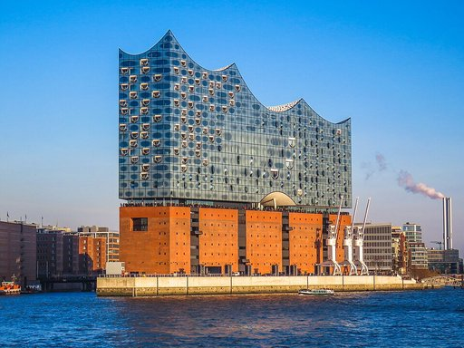
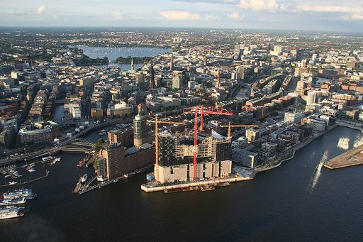
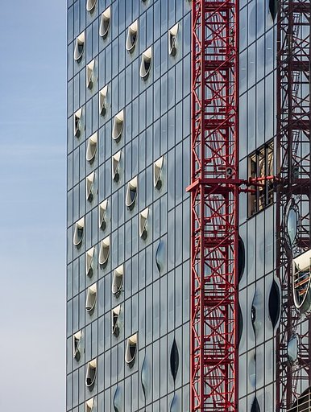

# Elbphilharmonie

Die **Elbphilharmonie** (umgangssprachlich **Elphi**) ist ein im Januar 2017 eröffnetes Konzerthaus in Hamburg. Sie wurde mit dem Ziel geplant, ein neues Wahrzeichen der Stadt und ein „Kulturdenkmal für alle“ zu schaffen. Das 110 Meter hohe Gebäude im Stadtteil HafenCity liegt am rechten Ufer der Norderelbe an der Spitze des Großen Grasbrooks zwischen den Mündungen der Hafenbecken Sandtorhafen und Grasbrookhafen. Es wurde unter Einbeziehung der Hülle des früheren Kaispeichers A (Baujahr 1963) errichtet. Auf diesen Sockel wurde ein moderner Aufbau mit einer Glasfassade gesetzt, die an Segel, Wasserwellen, Eisberge oder einen Quarzkristall erinnern soll. Die Lage am Kaiserhöft ist von der einstigen industriellen Hafennutzung und der neugotischen Backsteinarchitektur der Speicherstadt geprägt. Die Elbphilharmonie ist das höchste bewohnte Gebäude Hamburgs.

Das Konzept des Konzerthauses geht auf eine 2001 vorgestellte Idee des Hamburger Projektentwicklers Alexander Gérard zurück. Der Bau wurde dann 2007 durch die Bürgerschaft unter Bürgermeister Ole von Beust beschlossen. Entwurf und Planung der Philharmonie stammen im Wesentlichen vom Basler Architekturbüro Herzog & de Meuron. Bauherr war die *Elbphilharmonie Bau KG*, deren Teilgesellschafter und Hauptfinanzier die Freie und Hansestadt Hamburg mit Steuermitteln ist. Das Gebäude wurde in ihrem Auftrag vom Baudienstleister Hochtief errichtet.

Die Fertigstellung des Gebäudes war nach einem mehrjährigen Vorlauf für das Jahr 2010 vorgesehen, verzögerte sich jedoch mehrfach, u. a. auch bedingt durch einen anderthalbjährigen Baustopp im öffentlichen Bereich. Erst nach einer umfangreichen Projektneuordnung zwischen den Architekten, dem Bauherren und der Baufirma kurz nach der Wahl des Bürgermeisters Olaf Scholz wurde weitergebaut.

Durch die Verzögerungen und die Überschreitung der ursprünglich veranschlagten Baukosten wurde die Elbphilharmonie bereits lange vor der Fertigstellung bundesweit bekannt: Die Baukosten betrugen am Ende mit rund 866 Millionen Euro mehr als das Elffache der mit ursprünglich 77 Millionen Euro geplanten Summe. Der im neuen Vertrag vereinbarte Termin für die Bau- und Schlüsselübergabe am 31. Oktober 2016 wurde eingehalten. Die Einweihung des Konzertbereichs wurde am 11. und 12. Januar 2017 mit dem Konzert „Zum Raum wird hier die Zeit“ des NDR Elbphilharmonie Orchesters gefeiert (Konzertprogramm). Der Kleine Saal wurde am 12. Januar 2017 vom Ensemble Resonanz eingeweiht. Im ersten Jahr nach der Eröffnung besuchten rund 850.000 Menschen die über 600 Konzerte in der Elbphilharmonie, über 4,5 Millionen Besucher pilgerten auf die Plaza, mehr als 70.000 Menschen nahmen an Konzerthausführungen und über 60.000 am Musikvermittlungsprogramm des Hauses teil.

## Bauwerk

Der Entwurf des Schweizer Architektenbüros *Herzog & de Meuron* sah auf dem damals noch bestehenden Baukörper des backsteinernen Kaispeichers A von 1963 einen gläsern verkleideten Aufbau mit markant geschwungener Dachform vor, die auch „gläserne Welle“ genannt wurde. Ziel war ein charakteristisches Merkmal des Baukörpers, um in Hamburg eine unverwechselbare Silhouette zu formen. Entgegen den allerersten Planungen wurde der ehemalige Speicher für den Bau vollständig entkernt. Nur die denkmalgeschützte Fassade und Teile der Fundamente blieben erhalten. Die lastverteilende Bodenplatte des Gebäudes ist auf 1732 Pfählen gegründet, die tief in das Flussbett gerammt wurden. Der 12.500 t schwere, eigenständige Baukörper des Großen Konzertsaales ist mit insgesamt 342 Stahlfederpaketen unten und 34 im Dachbereich schalltechnisch vom Gesamtgebäude vollständig entkoppelt. Der passgenaue Aufbau erhielt eine Glasfassade aus insgesamt 1100 einzelnen Glaselementen, die jeweils aus vier Glasscheiben bestehen. Alle Scheiben erhielten einen eingearbeiteten Licht- und Wärmeschutz durch aufgedruckte gerasterte Folien. 595 Glaselemente sind individuell gekrümmt. Ein einziges dieser Glasfenster kostete etwa 72.000 Euro. Nach Aussage der Architekten erwecken die gebogenen Fassadenteile den Eindruck eines riesigen Kristalls, der den Himmel, das Wasser und die Stadt immer wieder anders reflektiert.

Das Gebäude hat 26 Geschosse, wobei es vom Erdgeschoss bis zur Plaza im achten Obergeschoss von der Fassade des Kaispeichers A umschlossen wird, eines ehemaligen Kakao-, Tee- und Tabakspeichers an exponierter Stelle des alten Hamburger Hafens südlich der Speicherstadt. Es hat am höchsten Punkt an der Kaispitze eine Höhe von rund 110 Metern, der niedrigste Punkt an der Ostfassade liegt etwa 30 Meter tiefer. Damit hat das Gebäude den rechteckigen Radisson-Hotel-Bau um wenige Meter als höchstes bewohntes Gebäude in Hamburg abgelöst. Bedingt durch die Keilform des Speichers ist der Raumkörper der Elbphilharmonie im Osten 85 und im Westen 22 Meter breit.

Den Hauptzugang zum Haus bilden unter anderem eine über 80 Meter lange, leicht gewölbte Rolltreppe und eine kürzere, gerade Rolltreppe, die gemeinsam das Erdgeschoss mit der *Plaza* verbinden, einer kostenfrei und zur Mengenbegrenzung durch Tickets geregelt zugänglichen Aussichtsebene in Höhe des früheren Kaispeicher-Dachs. Der Fahrgast sieht über den größten Abschnitt der zweieinhalb Minuten dauernden Fahrstrecke zunächst nur, dass er auf ein Licht zufährt. Bewegt werden die Stufen der 21 Meter ansteigenden Rolltreppe nicht wie üblich mit einem Antrieb von oben, sondern von vier dezentralen Antrieben, die elektronisch synchronisiert sind. Die Neigung der Stufen sinkt von anfangs 23 Grad auf etwa 11 Grad am Ende der Treppenfahrt. Die Stufen, die zunächst die für Rolltreppen übliche Höhe haben, sind oben nur noch wenige Zentimeter hoch. Die *Tube* (Röhre) genannte Treppe führt direkt auf ein großes *Panoramafenster* an der Schmalseite des Gebäudes zum Hafen hin. Zusätzlich zur Tube erschließen insgesamt 29 Aufzugsanlagen und elf Treppenhäuser das gesamte Gebäude.

Die Lasten durch den Großen Konzertsaal sind sehr ungleich verteilt. Dies erforderte acht unregelmäßig angeordnete große Innenstützen sowie deren Schrägstellung. Zusätzlich hat das Fehlen der Außenstützen auf der Plaza schräge Stützen in den beiden darüber befindlichen Geschossen notwendig gemacht.

## Musikalisches Programm

In der Elbphilharmonie wird Musik aus verschiedenen Genres präsentiert. Regelmäßig sind die renommiertesten Orchester der Welt im Großen Saal zu Gast, etwa die Berliner Philharmoniker, das Royal Concertgebouw Orchestra, die Wiener Philharmoniker oder das New York Philharmonic. Das NDR Elbphilharmonie Orchester spielt als Residenzensemble wöchentlich neue Programme und prägt damit das Profil des Hauses. Neben Orchesterkonzerten gibt es auch Kammermusik, Klavierabende, Orgel-, Jazz-, World- und Popkonzerte.

Nahezu täglich finden Konzerte in der Elbphilharmonie statt: im Großen Saal, dem Kleinen Saal und dem Kaistudio.

Hinzu kommt das Musikvermittlungsprogramm mit mehr als 1000 Veranstaltungen wie Workshops und Konzerten für Schulklassen und Familien.

Verantwortet wird das Programm vom Generalintendanten der Elbphilharmonie und Laeiszhalle Christoph Lieben-Seutter. Die Konzerte werden sowohl von der Elbphilharmonie selbst veranstaltet (Veranstalter: HamburgMusik), als auch von externen Konzertveranstaltern und Ensembles, die die Säle mieten.

Große Namen der Klassik wie Sir Simon Rattle, Yuja Wang, Kirill Petrenko, Daniel Barenboim, Klaus Mäkelä oder Igor Levit sind regelmäßig in der Elbphilharmonie zu erleben.

### Festivals und Schwerpunkte

In der Elbphilharmonie finden regelmäßig verschiedene Festivals und Schwerpunkte statt. Im Format „Reflektor“ erhalten ausgewählte Künstler symbolisch den Schlüssel zur Elbphilharmonie und dürfen das Programm ihres eigenen, mehrtägigen Festivals selbst bestimmen und Gastkünstler einladen.

Bisherige Reflektor-Künstler waren: Bryce Dessner (2017), Yaron Herman (2018), Laurie Anderson, Nils Frahm (2019), Manfred Eicher (2020), Max Richter, Anoushka Shankar (2021), John Zorn (2022), Angélique Kidjo, Bill Frisell (2023), André Heller, Marc Ribot (2024), Sophie Hunger (2025), Brad Mehldau (2026).

#### Internationales Musikfest Hamburg

Das Internationale Musikfest Hamburg findet jährlich im Mai statt. Während fünf Wochen treten viele nationale und internationale Gäste auf, neben der Elbphilharmonie auch in der Laeiszhalle und an weiteren Spielorten. Das Programm des Festivals kombiniert klassische Musik mit Zeitgenössischem. Dazu gibt es verschiedene Komponisten-Schwerpunkte. Das Internationale Musikfest Hamburg wird von der Elbphilharmonie in Zusammenarbeit mit verschiedenen Kulturveranstaltern und Orchestern der Stadt umgesetzt.

Das Festival fand zum ersten Mal 2014 und zunächst alle 2 Jahre statt. Seit 2018 wird das Festival jährlich veranstaltet. Jährlich sind große Stars zu Gast, so etwa die Sopranistin Barbara Hannigan, die Pianisten Daniil Trifonov, Lang Lang, Krystian Zimerman oder Maurizio Pollini oder die Dirigenten Sir Simon Rattle, Teodor Currentzis und Klaus Mäkelä.

Regelmäßig gibt es große, außergewöhnliche Opernproduktionen, so etwa 2024 eine Aufführung von Olivier Messiaens vierstündiger Oper „Saint François d’Assise“, dirigiert von Kent Nagano, mit rund 300 Mitwirkenden, eindrucksvoller Lichttechnik und einem schwebenden Engel oder 2019 György Ligetis „Le Grand Macabre“ mit dem NDR Elbphilharmonie Orchester unter Alan Gilbert.

Jedes Jahr steht das Festival unter einem anderen Motto, zuletzt etwa „Liebe“ (2023), „Krieg und Frieden“ (2024), „Zukunft“ (2025) oder „Ende“ (2026).

#### Elbphilharmonie Visions

2023 riefen die Elbphilharmonie und das NDR Elbphilharmonie Orchester das Festival „Elbphilharmonie Visions“ ins Leben, das sich der Orchestermusik des 21. Jahrhunderts widmet und seitdem alle zwei Jahre stattfindet. Als „Momentaufnahme der gegenwärtigen Musikwelt“ bezeichnete der Dirigent und Festival-Initiator Alan Gilbert die erste Ausgabe. Nach der zweiten Ausgabe 2025 schrieb die FAZ, Elbphilharmonie Visions habe sich „als eines der wichtigsten Festivals für neue Musik etabliert“.

Zum Festival gehört auch ein Kompositionspreis, der von der Hamburger Claussen-Simon-Stiftung gestiftet wird. 2023 ging der Preis an die Schwedin Lisa Streich, sie komponierte das Werk „Flügel“. Preisträger 2025 war Alex Paxton; sein Stück „World Builder, Creature“ wurde vom NDR Elbphilharmonie Orchester unter Alan Gilbert uraufgeführt.

#### Weitere Festivals

Junge Künstler präsentieren sich in der Elbphilharmonie in Konzertreihen wie „Fast Lane“ und „Tea Time“ oder dem Festival „Rising Stars“.

### Residenzensembles

Das NDR Elbphilharmonie Orchester hat den Großen Saal der Elbphilharmonie am 11. Januar 2017 mit einem feierlichen Konzert eröffnet. Seitdem prägt es als Residenzorchester das musikalische Profil des Hauses. Gegründet 1945 als Orchester des Nordwestdeutschen Rundfunks wurde es seitdem von vielen großen Chefdirigenten geprägt. Zur Elbphilharmonie-Eröffnung stand Thomas Hengelbrock am Pult, seit 2019 heißt der Chefdirigent Alan Gilbert. Der gebürtige Amerikaner wechselte vom New York Philharmonic Orchestra nach Hamburg.

### Musikvermittlung

Neben dem Konzertbetrieb ist ein Hauptziel der HamburgMusik gGmbH die Musikvermittlung: Unter der Leitmotiv Elbphilharmonie Kompass wurden bereits ab dem Jahr 2010 Kinderkonzerte in verschiedenen Hamburger Stadtteilen, Workshops sowie Künstlerbegegnungen und Musiktheater angeboten. Hier engagierten sich unter anderem die Stiftung Elbphilharmonie und die Cyril-und-Jutta-A.-Palmer-Stiftung mit Zuschüssen. Nach Eröffnung der Elbphilharmonie wurde das Musikvermittlungsangebot für alle Altersklassen umfangreich ausgebaut. Das Klingende Museum Hamburg zog aus der Laeiszhalle in den Kaispeicher der Elbphilharmonie und wurde in Elbphilharmonie Instrumentenwelt umbenannt. Für Kinder, Schulklassen und Kitas werden pro Saison rund 1.000 Veranstaltungen angeboten: Konzerte, Musiktheater, Instrumentenworkshops, fünf Laien-Ensembles und Rahmenveranstaltungen zu ausgewählten Konzerten.

Auch für Erwachsene gibt es viele Angebote, um Musik zu entdecken und selbst mitzumachen. In den fünf Mitmach-Ensembles proben Laienmusiker wöchentlich zusammen, das Publikumsorchester spielt zwei Mal im Jahr öffentliche Konzerte im Großen Saal. Zum vielfältigen Workshop-Angebot gehört unter anderem ein DJ Workshop für FLINTA\*.

Regelmäßig gibt es Sonderkonzerte, so fand etwa 2024 ein „Live-Gaming-Konzert“ im Großen Saal statt: Der Youtube- und Twitch-Streamer Staiy spielte Videospiele auf einer Leinwand im Großen Saal und wurde von dem Orchester ensemble reflector und der Geräuschemacherin Simone Nowicki begleitet, die in Echtzeit auf das reagierten, was auf dem Bildschirm passierte.

Mit der Konzertreihe „Ferne Klänge“ schafft die Elbphilharmonie ein barrierefreies Konzerterlebnis unter anderem für Menschen mit Demenz und ihre Angehörigen.

Seit 2021 organisiert die Elbphilharmonie im Zweijahresrhythmus die „Elbphilharmonie Jazz Academy“, bei der junge Jazzmusiker eine Woche lang von Profis lernen und am Ende zusammen mit ihnen auftreten.

Die mehrtägige Konferenz The Art of Music Education (TAoME) wird regelmäßig von der Elbphilharmonie zusammen mit der Körber-Stiftung veranstaltet und bietet Akteure aus ganz Europa eine Plattform für professionellen Austausch.

## Nutzung

Das Gebäude hat eine Brutto-Grundfläche von etwa 125.000 Quadratmetern. Es enthält Konzertsäle, ein Hotel, Gastronomie und 45 Wohnungen.

### Öffentlicher Raum: Die Plaza

Zwischen Backsteinsockel und Glasaufbau befindet sich in 37 Metern Höhe ein öffentlich zugänglicher Platz, der als Zugangsebene für das Foyer der Konzertsäle und zum Hotel dient. Teil der Plaza ist ein Außenrundgang um das gesamte Gebäude. Von hier bietet sich eine Aussicht über die Norderelbe, den Hafen, HafenCity und die Innenstadt sowie Einblicke nach oben in die verschiedenen Ebenen des Konzertfoyers.

Der Boden der Plaza ist mit ca. 188.000 roten Ziegelsteinen gepflastert, die nach den Vorgaben der Architekten dem Aussehen des historischen Speichers entsprechen. Zur Realisierung suchten die Bauleute eine Ziegelei, die diese Ziegel – sogar mit kleinen Fehlern wie das Vorbild vom Kaispeicher – brennen konnte. Zur Verlegung gaben die Architekten genaueste Hinweise.

Bereits vor der offiziellen Eröffnung besuchten ab November 2016 bis zu 16.000 Gäste täglich die Elbphilharmonie Plaza. Ende Februar 2017, weniger als vier Monate nach der Eröffnung, zählte die Plaza der Elbphilharmonie bereits ihren millionsten Besucher. Die Marke von 10 Millionen Besuchern wurde Anfang Juni 2019 erreicht. 2025 wurde die 25-Millionen-Besucher-Marke geknackt.

### Konzertsäle

Nutzer der Konzertsäle ist die *HamburgMusik gGmbH*. Bereits vor der Einweihungsfeier organisierte diese Gesellschaft sogenannte „Elbphilharmonie Konzerte“ sowohl in der Laeiszhalle als auch an weiteren Spielstätten in Hamburg. Generalintendant der Elbphilharmonie und der Laeiszhalle ist seit 2007 Christoph Lieben-Seutter. Das NDR Elbphilharmonie Orchester ist im Haus das Residenzorchester, das Ensemble Resonanz Residenzensemble. Zentrum eines umfangreichen Musikvermittlungsangebotes ist die Elbphilharmonie Instrumentenwelt im ehemaligen Kaispeicher-Bereich des Hauses.

Es gibt den großen Konzertsaal mit 2100 Sitzplätzen, einen Kleinen Saal mit 550 Plätzen sowie einen dritten Saal, das *Kaistudio 1*, mit 170 Sitzplätzen. Das Foyer um den großen Saal ist mit Eichenparkett ausgelegt.

- Der Große Saal folgt dem Prinzip einer „Weinberg-Architektur“, die auf den Architekten Hans Scharoun und seinen Entwurf der Berliner Philharmonie (1957) zurückgeht. Bei dieser Bauweise liegt die Bühne leicht versetzt in der Mitte des Saals, während sich die weinbergartig nach oben ansteigenden Ränge darumherum gruppieren. In der Elbphilharmonie ist kein Sitzplatz weiter als 30 Meter vom Dirigentenpult entfernt. Der Saal ist 25 Meter hoch.

:   Der international renommierte Akustiker Yasuhisa Toyota wurde engagiert, um die bestmögliche Klangwirkung für diesen Raum zu erreichen. Toyota hat bereits die Konzepte von mehr als fünfzig anderen Konzerthäusern und Konzerthallen weltweit erstellt. Um die Raumakustik des Großen Saales zu prüfen, ließ Toyota ein fünf mal fünf Meter großes Modell im Maßstab 1:10 anfertigen. Auf seine Messungen hin wurde über der Bühne im Großen Saal ein Reflektor angebracht, der die auftretenden Schallsignale individuell nach ihrem Entstehungsort in jeweils genau definierte Richtungen verteilt. Zur Optimierung früher Reflexionen wurde der Saal mit insgesamt 10.000 CNC-gefrästen Gipsfaserplatten verkleidet, mit einer Fläche von 6500 Quadratmetern. Jede einzelne dieser Platten ist ein Unikat, zwischen 35 und 200 Millimetern dick und hat ein Flächengewicht zwischen 30 und 125 kg/m². Die dreidimensionale Oberfläche der Paneele besteht aus einem sich nicht wiederholenden Muster von Vertiefungen, Riefen und pyramidalen Kegeln, auch *Microshaping* genannt, die mittels mathematischer Algorithmen am Computer erstellt wurden. Über die gesamte Wandfläche des Saales verteilt sind rund eine Million faustgroßer Zellen, die den Schall gezielt individuell streuen. Diese akustische Innenwandverkleidung wird auch „Weiße Haut“ genannt, der Architekt Jacques Herzog zieht diesem Begriff allerdings Assoziationen wie etwa Krustentiere oder Muscheln vor. Ursprünglich für die Dämmung bereits eingelegte Fäden zwischen den Platten mit einer Gesamtlänge von vier Kilometern mussten wieder entfernt werden, an ihre Stelle trat Silikon. Gleichwohl stand die Akustik im Großen Saal anfangs in der Kritik von Akustikern und Dirigenten. „In der Elbphilharmonie hört man nichts. Endlich sagt es mal einer laut“. 2019 veröffentlichte Jürgen Kesting in der F.A.Z einen kritischen Artikel über die Akustik in der Elbphilharmonie. Drei Jahre später beobachtete er, dass der Klang sich, wie vom Akustiker Yasuhisa Toyota angekündigt, entwickelt habe – ein Eindruck, den auch Musiker bestätigten: „Die Akustik sei, wie kritisch gesagt wurde, so hell-durchsichtig, dass sie wirkliche Verschmelzung erschwere. Dass der Klang sich, wie ein Hamburger Oboist im Jargon eines Orchesterspielers sagte, „gesetzt“ habe, dass er homogener und runder geworden sei, bestätigte Franz Welser-Möst im Gespräch mit der F.A.Z.“ Die renommierte britische Musikjournalistin Fiona Maddocks beschreibt die Akustik in The Observer als warm und ausgewogen: „In orchestral music, every instrument is audible, pinging, transparent, but the effect is warm and integrated, rather than analytical.“

- Der Kleine Saal besitzt Wandpaneele aus gefrästen und gewölbten Eichenhölzern aus dem Loire-Tal, die ebenfalls individuell gestaltet sind, um eine optimale Akustik zu gewährleisten. Er dient vorwiegend der Aufführung von Kammermusik und steht darüber hinaus weiteren Nutzungen wie Jazzkonzerten oder Banketten offen.

### Konzertorgel

Die Orgel im Großen Saal wurde von der Orgelbaufirma Johannes Klais Orgelbau (Bonn) erbaut. Entwicklung und Herstellung dauerten insgesamt acht Jahre und wurden auch während des Baustopps fortgeführt. Da das Instrument hier – im Gegensatz zu anderen Konzertsälen – mitten in den Zuschauerrängen platziert ist, mussten die Prospektpfeifen mit einer Spezialbeschichtung geschützt werden. Das Instrument verfügt über 69 Register mit 4.765 Pfeifen, wovon 380 aus Holz bestehen; verteilt sind sie auf vier Manualwerke (zwei schwellbar) und Pedal. Von den 84 Pfeifenreihen sind die ersten 7 Register (8′ und 4′) im Chorwerk mit bis zu 73 Pfeifen besetzt, haben also 12 Töne mehr, als Tasten auf den Klaviaturen vorhanden sind, und sind für die Superoktavkoppeln bis c5 ausgebaut. Der Organist kann das Instrument von zwei viermanualigen, äußerlich nahezu baugleichen Spieltischen bespielen: einer ist fest an die Orgel angebaut, der andere Spieltisch ist fahrbar und wird zum Spielen auf der Orchesterbühne positioniert. Vier Register sind als Fernwerk im Decken-Reflektor des Saales untergebracht, darunter die durchschlagenden Stentorklarinetten; das Fernwerk lässt sich an jedes Manual und an das Pedal frei koppeln. Chor- und Solowerk können von den zugehörigen Manualen abgekoppelt werden, das Schwellwerk nur am elektrischen Spieltisch. Die Orgel hat eine Breite und eine Höhe von jeweils etwa 15 Metern und eine Tiefe von etwa 3 Metern; sie wiegt ca. 25 t. Der maximale Windverbrauch liegt bei ca. 180 m³ pro Minute. Die Spieltraktur des festen Spieltisches ist mechanisch, die des mobilen Spieltisches und die Registertrakturen sind elektrisch.

**Disposition:**

- *Koppeln:*
  - *Normalkoppeln:* III/I, IV/I, FW/I, I/II, III/II, IV/II, FW/II, IV/III, FW/III, FW/IV, I/P, II/P, III/P, IV/P, FW/P
  - *Suboktavkoppeln:* I/I, III/III, IV/IV, FW/FW
  - *Superoktavkoppeln:* I/I, III/III, IV/IV, FW/FW, IV/P, P/P
  - Äquallage ab: I, III, IV, FW
- *Spielhilfen:* elektronische Setzeranlage

### Hotel

Im Ostteil der 6. bis 20. Etage des Gebäudes befindet sich das Fünf-Sterne-Hotel „The Westin Hamburg“ mit 244 Zimmern und Suiten, das von der Marriott International gehörenden Hotelkette Westin Hotels & Resorts betrieben wird. Die Eröffnung fand am 4. November 2016 statt. In der 6. Etage sind ein Spa-Bereich mit Pool, Saunen und Fitnessbereich und im 7. OG ein Konferenzbereich und ein Restaurant für 170 Gäste eingerichtet. Die Lobby ist im 8. Stock untergebracht, der Zugang ist von der öffentlichen Plaza (nur für Hotelgäste) und mit Aufzügen aus dem Eingangsbereich im Erdgeschoss möglich.

### Gastronomie

Im Westteil des Kaispeichers, dem Backsteinsockel der Elbphilharmonie, befindet sich die Gastronomie „Störtebeker“, die auf drei Etagen von der Störtebeker Braumanufaktur zusammen mit der east Hotel & Restaurant GmbH betrieben wird. In der 5. Etage befindet sich ein Restaurant mit Bar für insgesamt 220 Gäste, im 6. OG gibt es einen Shop- und Bierverkostungs-Bereich. Auf der Plaza im 8. OG befindet sich außerdem ein Deli mit Snacks und Getränken im Angebot. Zusätzlich zur Störtebeker-Gastronomie gibt es im Hotel und im Konzertbereich der Elbphilharmonie weitere gastronomische Angebote.

### Eigentumswohnungen

Neben der kulturellen Nutzung der Konzertsäle und des musikpädagogischen Bereichs umfasst das Gebäude 45 gehobene Wohneinheiten, die mit Kaufpreisen von bis zu 10 Millionen Euro zu den teuersten der Stadt gehören.

### Parkhaus

Im ehemaligen Kaispeicher gibt es neben dem Kaistudio 1 und Räumlichkeiten für den musikpädagogischen Bereich auch ein Parkhaus mit 433 Stellplätzen, von denen 170 den Hotelgästen und den Besitzern der Eigentumswohnungen vorbehalten sind. Parkhausbetreiber ist Apcoa Parking.

### Städtisches Marketingkonzept

Die Elbphilharmonie wurde frühzeitig von der für die Entwicklung und Vermarktung der HafenCity zuständigen *HafenCity Hamburg GmbH* neben dem 2008 eröffneten Internationalen Maritimen Museum Hamburg und dem ehemals geplanten Science Center als zentrale kulturelle Einrichtung der HafenCity beworben. Über die Nutzung als Konzerthaus hinaus wollte der Senat ein international sichtbares Wahrzeichen für Hamburg und die HafenCity schaffen und hat dazu Werbe- und Imagekampagnen durchgeführt. Die Eröffnung wurde von der Hamburger Behörde für Kultur und Medien, der HamburgMarketing GmbH und der HamburgMusik gGmbH mit einer Kampagne begleitet, um die internationale Wahrnehmung Hamburgs zu stärken.

## Öffentliche Wirkung

Das Projekt war aufgrund seiner Kostenentwicklung und insbesondere des steigenden Beitrages der Stadt Hamburg lange Zeit umstritten.

Seit Vertragsunterzeichnung zwischen Hamburg als Auftraggeber und dem Konsortium Adamanta im Jahr 2007 waren die Baukosten erheblich gestiegen. In einem Interview mit der Tagesschau im Januar 2013 erklärte der Bauingenieur und Ordinarius des Lehrstuhls für Bauprozessmanagement und Immobilienentwicklung an der TU München, Josef Zimmermann:

:   „Ein Fachmann wusste von Anfang an, dass die Elbphilharmonie für den veranschlagten Preis nicht zu bauen ist. Man kann sich nur darüber wundern, dass immer wieder so getan wird, als ob das ginge. Trotzdem war es nicht falsch, die Oper in Sydney oder auch die Elbphilharmonie zu bauen. Solche Projekte sind von immenser volkswirtschaftlicher und kultureller Bedeutung.“

Anlässlich des Richtfestes skandierten einige Demonstranten, das Gebäude sei ein „Schandmal für die Reichen“.
Das *Haspa Trendbarometer 2010* ermittelte im Juli 2010, dass 69 Prozent der Bürger die Ansicht äußerten, dass Projekte wie die Elbphilharmonie „das Image von Hamburg als Kulturmetropole aufwerten“.

Auch die aus Sicht der Öffentlichkeit intransparenten Verhandlungen zwischen den Akteuren und die Verzögerung der Fertigstellung wurden mehrfach kritisiert.

Mit der Projektneuordnung und später mit der Fertigstellung sowie der weltweit beachteten Eröffnung wandelte sich das Image der Elbphilharmonie; das neue Wahrzeichen beschert der Stadt national und international ein großes und positives Medienecho.

„Selbst Experten rätseln immer noch, wie es mit einem einzelnen, spektakulären Gebäude gelingen konnte, den Geist und das Image einer ganzen Stadt zu verändern.“, schreibt die Neue Zürcher Zeitung.

Die Treppen der Elbphilharmonie gelten als potenziell gefährlich, auf den Treppen wurden 34 Stürze von Konzertbesuchern registriert.

### Trivia

Im Dezember 2017 präsentierte der aus Hamburg stammende Designer Karl Lagerfeld seine Métiers d’art-Kollektion für das Modehaus Chanel im großen Konzertsaal.

2018 wurde die Elbphilharmonie zur Kulisse der Kinderserie „Die Pfefferkörner“. Dreharbeiten zur Folge „Das Wunderkind“ fanden auf der Tube, in den Foyers und im Großen Saal statt.

Im Herbst 2021 verwandelte sich die Elbphilharmonie in ein mobiles Impfzentrum. Hunderte Hamburger ließen sich im Backstage des Konzerthauses gegen Covid impfen.

Im Großen Saal der Elbphilharmonie klebten sich 2022 zwei Umweltaktivisten der „Letzten Generation“ an das Dirigentenpult. Das Konzert konnte mit einer Verspätung von 6 Minuten trotzdem stattfinden.

Im Frühjahr 2022 brachte die Elbphilharmonie in Kooperation mit dem Westin Hotel rund 40 Geflüchtete aus der Ukraine unter. Es konnte insgesamt 26 Erwachsenen und elf Kindern eine Unterkunft geboten werden, darunter viele Menschen mit Behinderung, die von einem Pflegedienst betreut wurden.

Im Juni 2023 wurde das Engagement der amerikanischen Künstlerin Nahre Sol als „Creator in Residence“ für die Saison 2023/24 bekannt gegeben. Sie ist damit die erste Medienschaffende, die diese neu geschaffene Rolle übernehmen wird. Ihre Nachfolger in dieser Rolle waren die australische Internetpersönlichkeit Derrick Gee und britische Content Creatorin Daria Challah.

2024 trat der Streamer Staiy im Großen Saal der Elbphilharmonie auf und spielt live die Computerspiele „Lost Ember“ und „Journey“. Musikalisch wurde der Stream live von dem Ensemble Reflektor begleitet und von Geräuschemacherin Simone Nowicki vertont. Die Veranstaltung wurde live auf der Plattform „Twitch“ gestreamt.

Der Youtuber und Mountainbiker Fabian Wibmer absolvierte 2025 einen Stunt auf dem Dach der Elbphilharmonie. Vor dem Rückwärts-Salto von Wibmer, diente das Dach des Konzerthauses bereits als Kulisse für einen Musikvideo-Dreh. Die Blaskapelle Meute von Bandchef Thomas Burhorn drehte ihr Musikvideo zum Song *Slip*, der sich auf dem Album *Puls* von 2020 befindet, auf dem Dach der Elbphilharmonie.

Im April 2026 landete die Elbphilharmonie auf der Liste der „Most Controversial Buildings of All Time“ der New York Times. Das Konzerthaus wurde als Beispiel dafür genannt, wie Kontroversen altern und aus Skandalbauten Publikumsmagneten werden können: „Once it was finished, the public perception completely changed. Everyone loves it“.

## Geschichte

### Vorgeschichte des Standortes

Die Elbphilharmonie steht auf dem ehemaligen *Kaiserhöft*, der im Zuge der Hafenbaumaßnahmen zum offenen Tidehafen 1865 durch die Begradigung der *Johns’schen Ecke* entstand. Auf dieser Kaispitze zwischen Sandtorhafen und Grasbrookhafen errichtete der damalige Wasserbaudirektor Johannes Dalmann 1875 den *Kaiserspeicher* am Kaiserkai, der 1893 in Dalmannkai umbenannt wurde. Der Westturm mit seinem Zeitball war lange das Wahrzeichen des Hafens. Im Zweiten Weltkrieg wurde das Hauptgebäude schwer beschädigt, nur der Turm blieb intakt.

1963 wurde die Ruine gesprengt. Zwischen 1963 und 1966 wurde der Kaispeicher A nach Entwürfen von Werner Kallmorgen errichtet. Er ist ein Beispiel der Architektur der Nachkriegsmoderne in Hamburg. Das Gebäude diente der Lagerung von Kakao, Tabak und Tee. Aus dieser Zeit stammen quasi als Zeugen die drei von einem Freundeskreis renovierten Halbportalkräne am Ostende des Elbkais. Später verlor der Speicher mit der Verlagerung des Stückguthandels in andere Teile des Hafens seine ursprüngliche Nutzung. Im Alltag wurde er deshalb oft „Kakaobunker“ genannt. 1990 endete diese Nutzung.

### 2001 bis 2006: Planung

Das Projekt Elbphilharmonie begann mit der privaten Initiative des Architekten Alexander Gérard und seiner Ehefrau, der Kunsthistorikerin Jana Marko. Sie entwickelten die Idee und das Nutzungskonzept und stellten es als Alternative zum damals geplanten „Media City Port“ im Oktober 2001 dem Hamburger Senat vor, der zunächst zurückhaltend und skeptisch auf das Vorhaben reagierte. Ende 2002 kündigte der damalige Bürgermeister Ole von Beust den Bau eines Kulturzentrums im neuen Stadtteil Hafencity an: Er stelle sich „eine neue Musikhalle“ vor, die ca. 50 Millionen Euro kosten werde. Kultursenatorin Dana Horáková sympathisierte mit der Idee eines „Aquadome“, einem Konzertsaal mit eingebautem Show-Aquarium.

Gérard und Marko gewannen im Jahr 2003 *Herzog & de Meuron* für eine Zusammenarbeit. Eine Ausschreibung fand nicht statt; nur der Architekt Stephan Braunfels klagte dagegen. Der erste Entwurf der Architekten wurde im Juni 2003 der Öffentlichkeit vorgestellt. Im Dezember 2003 traf der Senat die Grundsatzentscheidung für den Bau der Elbphilharmonie unter dem Vorbehalt technischer und wirtschaftlicher Machbarkeit.

Im Mai 2004 bestellte der Senat Hartmut Wegener förmlich als Projektkoordinator für den Bau der Elbphilharmonie mit allen Kompetenzen. Der Projektkoordinator wurde direkt beim Amt des Ersten Bürgermeisters angebunden, erhielt eine Begleitgruppe des Senats zu seiner Unterstützung und bediente sich der *ReGe Hamburg* als Managementgesellschaft zur Wahrnehmung seiner Bauherren-Aufgaben. Nach dem Scheitern einer Joint-Venture-Lösung mit dem Projektentwickler und Investor Dieter Becken und Gérard übernahm die Stadt im November 2004 das Projekt allein und trat in den Architektenvertrag mit *Herzog & de Meuron* ein.

Eine Machbarkeitsstudie bewertete im Juli 2005 auf Basis der Vorentwurfsplanung der Architekten das Projekt als technisch und wirtschaftlich machbar und schätzte die Netto-Baukosten nach vorliegendem Planungsstand auf 186 Millionen Euro. Der Senat beschloss daraufhin das Projekt weiterzuverfolgen bei einem Finanzierungsbeitrag der öffentlichen Hand von 77 Millionen Euro. Die restlichen Kosten sollten durch die private Mantelbebauung und Spenden abgedeckt werden. Die Bürgerschaft bewilligte die nötigen Planungsmittel. Ein europaweiter Investorenwettbewerb zu Bau, Betrieb und Finanzierung der Elbphilharmonie wurde gestartet. Im Oktober 2005 wurde die *Stiftung Elbphilharmonie* gegründet, sie trägt seitdem durch Gewinnung von Spenden und Zustiftungen zur Realisierung des Projekts bei.

### Geschichte der Verträge, die Finanzierung

Im Herbst 2006 wurde der Bauantrag gestellt. Im November 2006 gab Ole von Beust (CDU) das Ergebnis des europaweiten Bieterwettbewerbs bekannt. Das Angebot des Konsortiums *Adamanta* (Hochtief und Commerzbank), das den Zuschlag erhielt, belief sich auf 241,3 Millionen Euro.

Die Bürgerschaft stimmte der Realisierung der Elbphilharmonie und dem städtischen Finanzierungsbeitrag am 28. Februar 2007 einstimmig zu und verpflichtete hierzu die *Elbphilharmonie Hamburg Bau GmbH & Co. KG*, die durch die *ReGe Hamburg Projekt-Realisierungsgesellschaft mbH* vertreten wurde.

Die Projektentwicklung war gekennzeichnet von massiven Kostensteigerungen und erheblichen zeitlichen Verzögerungen. Vor der Auftragsvergabe wurde im Rahmen der Grundlagenermittlung ein Investitionsvolumen von 77 Millionen Euro für die Freie und Hansestadt errechnet. Bei Vertragsabschluss im Jahr 2007 hatte sich dieser Betrag auf 114 Millionen Euro erhöht. Nach mehrmaligen Nachverhandlungen einigten sich der Hamburger Senat und das Unternehmen Hochtief, das durch den neuen Vertrag in die Rolle des Generalunternehmers gesetzt wurde, im Dezember 2012 auf eine Netto-Endbausumme von 575 Millionen Euro – einschließlich der Planungskosten.

Am 23. April 2013 verkündete Hamburgs Erster Bürgermeister Olaf Scholz, dass das Projekt die Hamburger Steuerzahler insgesamt 789 Millionen Euro kosten werde. Insgesamt werden vom Hamburger Senat für die Elbphilharmonie Kosten von 866 Millionen Euro angegeben, zusätzlich finanziert durch Spenden und Zusatzeinnahmen. Darin sind Kosten für die 45 Luxuswohnungen nicht enthalten.

Die Fertigstellung des Gebäudes war zunächst für 2010 geplant, wurde im Laufe der Entwicklung jedoch mehrfach verschoben. Das Richtfest fand nach dreijähriger Bauzeit im Mai 2010 statt. Die Abnahme erfolgte nach der im Juni 2013 durch die Hamburgische Bürgerschaft beschlossenen Neuordnung am 31. Oktober 2016. Die Plaza wurde am 4. November 2016 eröffnet. Der Konzertbetrieb wurde am 11. Januar 2017 aufgenommen, dafür wurden 1000 Freikarten verlost, für die sich mehr als 200.000 Personen beworben hatten. Für die ersten drei Wochen nach der Eröffnung mit einer Serie von Konzerten mit international bekannten Künstlern und Orchestern waren alle Karten schnell ausverkauft.

### 2007 bis 2015: Bauausführung

Die Grundsteinlegung erfolgte am 2. April 2007. Hamburgs damaliger Erster Bürgermeister Ole von Beust (CDU), die Kultursenatorin Karin von Welck, der Vorstandsvorsitzende der *Hochtief Construction AG*, Henner Mahlstedt, Pierre de Meuron vom Architekturbüro *Herzog & de Meuron* und der Projekt-Koordinator des Senats für die Elbphilharmonie, Hartmut Wegener, legten eine Bauzeichnung, eine Urkunde, eine aktuelle Tageszeitung und eine Sondermünze der Elbphilharmonie in eine Zeitkapsel in den Grundstein.

Am darauf folgenden Tag begannen die Bauarbeiten. Im ersten Schritt erhielt der Kaispeicher A ein blaues Stahlkorsett aus A-Blöcken, um die Fassade zu stützen. Gleichzeitig begann die vollständige Entkernung des denkmalgeschützten Bauwerkes mit dem Abtragen des Daches. Zu den bereits vorhandenen 1111 Stahlbetonpfählen wurden 621 zusätzliche eingebaut. Die Montage der Fenster-Elemente begann Mitte Dezember 2009. Die ersten der im Durchschnitt 3,5 Meter hohen, 5 Meter breiten und 1,5 Tonnen schweren Elemente wurden in circa 40 Meter Höhe angebracht. Das Richtfest fand nach rund dreijähriger Bauzeit vom 28. bis zum 30. Mai 2010 statt. Die Fassade war zu diesem Zeitpunkt fast zur Hälfte fertiggestellt. „Ein Fenster kostet etwa 20.000 Euro, 1089 Elemente sind es insgesamt“, erklärte Hochtief-Manager Möller auf dem Fest. Am Tag nach dem Richtfest besichtigten 4000 Besucher beim „Tag der Plaza“ die Baustelle.

Im August 2011 sollten etwa 150 der verbauten Fenster aufgrund einer Forderung der Bauaufsichtsbehörde zur zusätzlichen Sicherung der Fassadenkletterer, die die Fenster reinigen sollen, wieder entfernt werden. Ende September 2011 teilte die Firma Hochtief mit, „die weitere Erstellung der Ausführungsplanung TGA (technischen Gebäudeausstattung) komplett einzustellen“. Während der Generalplaner *Herzog & de Meuron* für alle anderen Gewerke nach der Entwurfsplanung auch die Ausführungsplanung erstellte, lag diese zu Tragwerk und TGA nach der Schnittstellenliste als Bestandteil des Leistungsvertrages bei Hochtief. Dies führte dazu, dass die Fachplaner von Hochtief und der Architekt sich gegenseitige Behinderung vorwarfen, weil der jeweils andere seine Pläne nicht liefere, nur verspätet oder mangelhaft weitergebe. Im Oktober 2011 verkündete Hochtief nach Vorlage der 3. Revision des Brandschutzkonzepts durch die Generalplaner und den damit verbundenen erheblichen notwendigen Umplanungen, die Bauarbeiten in einigen Teilbereichen der Elbphilharmonie ruhen zu lassen. Neben der Rolltreppe, der Fassadensanierung des Kaispeichers und der TGA betraf dies insbesondere das Dach.

Gegen die Genehmigungsplanung der Tragwerksplanung des Architekten bzw. seines als Fachplaner beauftragten Statikers machte Hochtief bereits 2009 Sicherheitsbedenken geltend. Die Statik wurde, wie gesetzlich vorgeschrieben, im Auftrag der Bauaufsichtsbehörde von einem Prüfingenieur für Bautechnik geprüft und musste nachgebessert werden. Auf Bitte von Hochtief wurde die geprüfte Statik auch der *Behörde für Stadtentwicklung und Umwelt* als zuständige Bauaufsichtsbehörde vorgelegt und von dieser ebenfalls freigegeben. Der Baukonzern Hochtief indes sah seine Bedenken gegen die Statik danach nicht als ausgeräumt an. Die durch das Unternehmen eingeschalteten Gutachter kämen in Simulationen und Berechnungen zu dem Ergebnis, dass für die Stahlbetonkonstruktion die erforderlichen Sicherheiten nicht nachgewiesen werden könnten.

Ende Mai 2012 erklärte sich Hochtief bereit, weiterzubauen. Am 26. November 2012 verkündete das Unternehmen, dass die Dachkonstruktion des Gebäudes erfolgreich abgesenkt werden konnte und die Dachlasten somit wie gewünscht verteilt werden, ohne die Stabilität des Baus zu beeinträchtigen. Damit ruht die ca. 2000 Tonnen schwere Dachkonstruktion nun nicht mehr auf sieben Stützpfeilern, sondern ausschließlich auf den Wänden des Gebäudes.

### Eröffnung 2017

Die feierliche Einweihung des Konzertbereichs erfolgte am 11. und 12. Januar 2017 mit dem Konzert „Zum Raum wird hier die Zeit“ des NDR Elbphilharmonie Orchesters mit jeweils über 2000 Besuchern. Es sprachen der Bundespräsident Joachim Gauck, Hamburgs Erster Bürgermeister Olaf Scholz, der Generalintendant der Elbphilharmonie Christoph Lieben-Seutter und der Schweizer Architekt Jacques Herzog. Neben dem Präsidenten des Bundestages Norbert Lammert, dem Präsidenten des EU-Parlaments Martin Schulz und der Bundeskanzlerin Angela Merkel waren Mitglieder des Bundeskabinetts unter den Gästen (die Umweltministerin Barbara Hendricks und der Landwirtschaftsminister Christian Schmidt). Etwa 1000 Eintrittskarten waren in einer Lotterie für Hamburger verlost worden. Auch viele Spender für die Philharmonie waren gekommen. Während des Eröffnungskonzerts am 11. Januar 2017 wurde die Fassade der Elbphilharmonie durch eine Lichtshow illuminiert, bei der die Konzertmusik in bewegte Bilder umgesetzt wurde. Am 12. Januar 2017 eröffnete das Ensemble Resonanz mit dem Programm *Into the Unknown* den Kleinen Saal der Elbphilharmonie.

Im ersten Halbjahr nach der Eröffnung des neuen Konzerthauses umfasste das dicht gestaffelte Programm Konzerte unterschiedlicher Sparten – von Orchesterkonzerten mit internationalen Dirigenten wie Riccardo Muti und Solisten wie Cecilia Bartoli über Jazzgrößen wie Brad Mehldau bis zu den Einstürzenden Neubauten und kleineren Themenfestivals wie *Salam Syria*. Einen großen Anteil am Programm hatten auch die Hamburger Orchester: das NDR Elbphilharmonie Orchester, das Philharmonische Staatsorchester Hamburg und das Ensemble Resonanz. Am 27. Januar 2017 weihte die lettische Organistin Iveta Apkalna als Titularorganistin der Elbphilharmonie die Orgel im Großen Saal mit einem Solokonzert ein. Mehrere Konzerte wurden im Laufe der Saison aus dem Großen Saal per Livestream übertragen. Im Rahmen des G20-Gipfels in Hamburg fand im Juli 2017 ein Konzert auf Einladung von Bundeskanzlerin Angela Merkel unter Leitung von Kent Nagano in Anwesenheit von u. a. US-Präsident Donald Trump, dem französischen Präsident Emmanuel Macron, dem russischen Präsident Wladimir Putin und weiteren Regierungschefs statt. Ende August 2017 gab es ein kostenloses Konzertkino auf dem Vorplatz der Elbphilharmonie. Künstler der Spielzeit 2017/18 waren unter anderem Peter Eötvös, Sir Simon Rattle, Daniil Trifonov, das Symphonieorchester des Bayerischen Rundfunks unter Mariss Jansons, Barbara Hannigan und die US-amerikanische Rockband The National. Schwerpunkte und Festivals waren Schuberts Liederzyklus *Eine Winterreise*, der Musik des Kaukasus, Georg Philipp Telemann und tschechischen Komponisten gewidmet. Weiterhin veranstaltet die HamburgMusik gGmbH auch Reihen und Konzerte in der Laeiszhalle.

### Nachbesserungen 2017

Nachdem es – besonders im Großen Saal – wegen fehlender Markierungen zu mehreren Stürzen mit zum Teil schweren Knochenbrüchen gekommen war, wurde in der spielfreien Zeit vom 13. Juli bis zum 5. August 2017 mit Markierungen und Gummileisten nachgebessert. Dabei wurden auch blindengerechte Anforderungen berücksichtigt. Die Kosten der Maßnahmen wurden auf 300.000 € geschätzt. Noch vor der Eröffnung waren Optimierungen der Akustik im Kleinen Saal durch die Bearbeitung einer Saalwand vorgenommen worden.

### Schäden 2017

Nach einem Wasserschaden im April 2017 musste das Foyer des Kleinen Saals ab Anfang September aufwändig saniert werden. Der Holzfußboden sowie das Mauerwerk wurden beschädigt, die Dämmung von Schimmel befallen. Die Teilsperrung des Bereichs dauerte bis Anfang Februar 2018 an, die Kosten der Sanierung in Millionenhöhe sollen durch eine Versicherung abgedeckt sein.

## Betrieb

Die Elbphilharmonie wird durch die SPIE GmbH verwaltet und betrieben, ein Subunternehmer der – durch die Stadt Hamburg – beauftragten Baufirma Adamanta. Die Beauftragung Adamantas hat eine Laufzeit von 20 Jahren (bis 2037) und kostet 144,8 Millionen Euro, d. h. ca. 7,2 Millionen Euro pro Jahr.

Im Februar 2011 reichte der Verband der Deutschen Konzertdirektionen e. V. Klage wegen Verdrängungswettbewerbs gegen das Land Hamburg und die *HamburgMusik gGmbH* („Elbphilharmonie Konzerte“) beim Hamburger Landgericht ein. Der Zusammenschluss privater Konzertveranstalter warf der *HamburgMusik gGmbH* Missbrauch öffentlicher Subventionen vor. Mit Preisdumping würden private Anbieter vom Markt gedrängt. Am 22. Dezember 2011 wies das Landgericht Hamburg die Klage ab. Das Gericht verneinte, dass eine unlautere Verdrängung anderer Anbieter stattfinde. Das Ziel der Zuschauergewinnung durch niedrige Preise rechtfertige die Kostenunterdeckung. Das Landgericht erachtete es aus wirtschaftlicher Sicht für nachvollziehbar, dass einige besonders attraktive Konzerte nicht kostendeckend angeboten würden, um damit Interesse an anderen Veranstaltungen zu wecken. Das Oberlandesgericht bestätigte diese Auffassung.

### Hotel-Betrieb und -Finanzierung

Das Hotel wird von der „Marriott International“-Gruppe unter der Marke „Westin“ betrieben. Als Hotel-Managerin war seit der Eröffnung Dagmar Zechmann eingesetzt – sie verließ das Haus im März 2018. Küchenchef ist der Österreicher Martin Kirchgasser.

Das Westin zahlt eine Pacht an die Baufirma „Adamanta“, die wiederum zahlt an die *Bau KG*. Kalkuliert wird, dass die 244 Zimmer bei rund 18.000 Euro pro Vermietung pro Jahr knapp 4,5 Millionen Euro einbringen. Entgegen der Machbarkeitstudie von 2005, in der dem Hotel noch ausreichende Wirtschaftlichkeit zugesagt wurde, berechneten die Gutachter im Sommer 2008 aufgrund veränderter Voraussetzungen, dass das Hotel dem Investor einen Verlust von 20 Millionen Euro bringen würde. Der ursprüngliche Investor wandte sich daraufhin ab. Stattdessen sprang in dieser Situation die Stadt Hamburg ein und wurde Bauherr des Hotelbereichs. Die Baufirma „Adamanta“ erstellte das Hotel in Folge für 129 Millionen Euro auf Kosten der Stadt.

Insgesamt sollen für den Bau des Luxushotels rund 200 Millionen Euro aus Hamburger Steuergeldern verwendet worden sein. Der Baukosten-Anteil von 103,3 Millionen Euro ergibt mit den 25,3 Millionen Euro für „weitere Projektkosten“ insgesamt 128,6 Millionen Euro. Zur Finanzierung wurde diese Baukosten-Forderung von der Baufirma „Adamanta“ als Kreditvertrag an ein Konsortium aus HSH-Nordbank und Bayerischer Landesbank verkauft.

Die Baukosten wurden so zu Bankschulden, die mit dem Kredit über 20 Jahre abbezahlt werden sollen. Der Zinssatz beträgt 4,85 % für 20 Jahre, erst 2030 werden die Kredite getilgt sein. Die Banken erhalten somit je nach Abzinsungsfaktor zwischen 20 und 90 Millionen Euro aus Hamburg. Für ebenfalls 20 Jahre Gebäudebetrieb übernimmt die Stadt Hamburg insgesamt 103 Millionen Euro. Hamburg selbst bezieht Einnahmen lediglich durch die Pacht des Hotelbetreibers.

Bis zum Ende der Kreditlaufzeit sollen durch die laufenden Pachteinnahmen die Zinsen bezahlt und durch den Verkauf des Hotels im Jahr 2032 die Baukosten der *Bau KG* gedeckt werden. Mit der Bauzeitverlängerung (Nachtrag 4) beginnen aber auch die Pachteinnahmen mehr als 1½ Jahre später als geplant, die Zinsen fallen jedoch seit Mai 2010 an. Allein diese Verschiebung soll 12,9 Millionen Euro kosten.

Der Bund der Steuerzahler hat diese Investition auf Kosten der Steuerzahler deutlich kritisiert. Kritiker wie die Partei Die Linke ziehen als Fazit: „Während Adamanta mit sicherem Geld aus dem Deal geht, bleibt der Stadt ein dickes Bündel aus Schulden und Risiken.“

### Betriebskosten

Zu den jährlichen Betriebskosten der Elbphilharmonie zählt die Fensterreinigung.
Die umfangreichen Fensterfronten werden von speziell ausgebildeten Industriekletterern einer bayerischen Glasreinigungsfirma mit extra vollentsalztem Wasser gereinigt. Die Fensterputzer dürfen sich dabei jeweils für sechs Stunden am Tag, davon maximal drei Stunden ohne Unterbrechung, außen vor den Fenstern abseilen. Dreimal jährlich wird der drei Wochen dauernde Putzvorgang durchgeführt und kostet jeweils rund 52.000 Euro (davon ca. 50.000 Euro für Personalkosten und ca. 2.000 Euro für Material und Wasser).

### Verkehrserschließung

Die Erschließung über den ÖPNV erfolgt durch Bahn, Bus und Elbfähre. Die nächstgelegene Schnellbahnhaltestelle ist die rund 450 Meter nordwestlich gelegene Station Baumwall der Linie U3, die im Dezember 2016 in *Baumwall (Elbphilharmonie)* umbenannt wurde. Die Station und der Fußweg zwischen der Haltestelle und der Philharmonie wurden in Hinblick auf ihre Erschließungsfunktion für die Philharmonie im Jahr 2013 nach Entwürfen von Herzog & de Meuron umgestaltet. So erhielt die Station einen zusätzlichen Ausgang, der auf eine angedeutete Platzfläche unterhalb des U-Bahn-Viadukts führt. In den Jahren 2014 und 2015 wurde weiterhin die den Traditionsschiffhafen/Sandtorhafen überspannende Mahatma-Gandhi-Brücke durch einen Neubau ersetzt, der gegenüber dem Ursprungsbau über deutlich breitere Fußwege verfügt und so der Funktion der Brücke für die Erschließung der Philharmonie Rechnung trägt. Eine gestalterische Verbindung zur Elbphilharmonie wird durch ein auf das Gebäude abgestimmtes Beleuchtungskonzept der Platzfläche und des Fußweges zum Konzerthaus in Form von auf die Philharmonie zustrebenden Lichtbalken geschlagen. Diese Lichtbalken finden sich in der Philharmonie selbst in Form von Strahlenkränzen im Foyer des Großen Saals und wirken dabei auch in den umgebenden Stadtraum hinein.

Die Strecke der U4 untertunnelt das Gebäude zwar nahezu in rund 40 Metern Tiefe, auf eine Haltestelle wurde jedoch aufgrund der zu erwartenden Kosten verzichtet. Die nächstgelegene Station der U4 ist Überseequartier, etwa einen Kilometer östlich der Philharmonie.

Die nächstgelegene Bushaltestelle ist *Am Kaiserkai (Elbphilharmonie)* in der nördlich der Philharmonie gelegenen Straße *Am Sandtorkai*. Südöstlich des Konzerthauses befindet sich der Fähranleger *Elbphilharmonie*, der seit Dezember 2012 von der Linie 72 der HADAG bedient wird.

Für den motorisierten Individualverkehr stehen im Parkhaus der Elbphilharmonie 433 Stellplätze zur Verfügung.

### Sonstige Nutzung

Darüber hinaus finden regelmäßig von Kampf der Künste organisierte Poetry Slams in der Elbphilharmonie statt.

Die Blaskapelle Meute von Bandchef Thomas Burhorn drehte ihr Musikvideo zum Song *Slip*, der sich auf dem Album *Puls* von 2020 befindet, auf dem Dach der Elbphilharmonie.

## Bauphase

### Verträge

Die Fertigstellung des Gebäudes war zunächst für 2010 geplant, dann aber immer wieder verschoben worden. Im März 2011 wurde die Eröffnung für 2013 angekündigt, doch im August 2011 kam es zu weiteren Verzögerungen, so dass später 2014 oder 2015 ins Auge gefasst wurden. Die Machbarkeitsstudie vom Juli 2005 wies Gesamtkosten von 186 Millionen Euro aus. Von dieser Summe sollte die Freie und Hansestadt Hamburg 77 Millionen Euro tragen. Bei Vertragsabschluss 2007 betrugen die Gesamtkosten bereits 241,3 Millionen Euro mit einem Anteil von 114,3 Millionen Euro für die Stadt. Im Jahr 2008 wurden die erheblichen Nachtragsforderungen von Hochtief verhandelt, ein zähes Ringen fand monatelang statt. Wegen der aus seiner Sicht verkanteten Situation wünschte der Senat im September 2008 einen personellen Wechsel an der Spitze des Projekts. Der Projektkoordinator Hartmut Wegener legte daraufhin seine Ämter nieder. Dies wurde in der Öffentlichkeit als Rausschmiss des Projektkoordinators durch den Bürgermeister Ole von Beust interpretiert.

Bei Nachtragsverhandlungen zwischen der *Elbphilharmonie Hamburg Bau GmbH & Co. KG* und der Adamanta wurde im November 2008 ein Nachtrag 4 in Höhe von 137 Millionen Euro ausgehandelt. Zusammen mit weiteren eigenen Mehrkosten auf städtischer Seite belief sich dieser Nachtrag auf Mehrkosten von 209 Millionen Euro. Die Gesamtkosten für den öffentlichen Bereich erhöhten sich damit von 190,9 auf 399,9 Millionen Euro. Unter Berücksichtigung der zugesagten Spenden belief sich der Kostenanteil der Freien und Hansestadt Hamburg auf 323 Millionen Euro. Anfang 2010 und Anfang 2011 wurden erneut Nachforderungen geltend gemacht. Im Herbst 2011 gab das Bauunternehmen bekannt, das Gebäude erst im November 2014 übergeben zu können.

Im August 2011 wurden die Gesamtkosten durch Hochtief auf 476 Millionen Euro veranschlagt. Diese Schätzungen basierten auf Mehrkostenforderungen und Kosten durch die Bauverzögerung. Die Adamanta hatte seit November 2008 Mehrkostenforderungen in Höhe von etwa 40 Millionen Euro geltend gemacht. Deren Berechtigung wurde von der Stadt Hamburg bestritten. Demgegenüber forderte die Stadt 40 Millionen Euro Vertragsstrafe. Nach dem durch Hochtief veranlassten Baustopp im Oktober 2011 hob der Senat in einem Bericht an die Bürgerschaft hervor, dass Hochtief alle bauaufsichtlich geprüften und genehmigten Unterlagen zur Statik des Saaldaches vorlägen, die wichtig und notwendig seien, um bauen zu können. Die Mehrkosten wurden von der Stadt somit nicht anerkannt. Nachdem die Stadt Hamburg mit der Aufkündigung von Verträgen gedroht hatte, erklärte sich Hochtief kurz vor Ablauf des Ultimatums Ende Mai 2012 bereit, die Arbeiten an der Dachkonstruktion wieder aufzunehmen.

Im Juli 2012 einigten sich nun das Bauunternehmen und die Stadt Hamburg auf ein Eckpunktepapier, das den Fertigstellungstermin auf den Sommer 2015 festlegte. Es sah außerdem vor, dass das Bauunternehmen Hochtief zusammen mit den verantwortlichen Architekten und Fachplanern innerhalb eines Jahres ein Konzept vorlegt, wie die zukünftigen Baupläne der Elbphilharmonie aussehen sollen. Anschließend werden weitere zwei Baujahre eingeplant. Mitte Dezember 2012 wurde bekannt, dass der Bau weitere 195 Millionen Euro mehr kosten wird, zuzüglich weiterer Kosten für Steuern, Zinsen und für die durch die Bauverzögerung notwendig gewordene weitere Beauftragung der ReGe und ihrer Projektmanager. Hochtief und die Stadt Hamburg einigten sich darauf, das Gebäude für höchstens 575 Millionen Euro bei einer Übergabe der öffentlichen Bereiche zum 30. Juni 2016 zu realisieren. Die Abnahme des Gesamtgebäudes („Schlüsselübergabe“) wurde vertraglich zum 31. Oktober 2016 zugesichert. Hochtief sollte dafür die mit der Planung beauftragte Arbeitsgemeinschaft zukünftig führen und wesentlich mehr Verantwortung übernehmen.

Ende Juni 2013 stimmte die Hamburgische Bürgerschaft dem neuen Vertrag zu und genehmigte zusätzliche Baukosten von 195 Millionen Euro. Hochtief war damit verpflichtet, das Konzerthaus bis Oktober 2016 zum Festpreis von 575 Millionen Euro fertigzustellen. Hamburg verzichtete im Gegenzug auf Schadenersatzforderungen. Die Stadt trug von den Gesamtkosten 521 Millionen Euro (Stand: Dezember 2012). Bei den 575 Millionen Euro handelt es sich um den Nettopreis. Darin enthalten sind die Mehrkosten für den Generalplaner Herzog & de Meuron mit Höhler + Partner, der zudem zum Generalunternehmer wechselte.

Hochtief war nun verpflichtet, das Haus bis Ende Juni 2016 fertigzustellen und Ende Oktober 2016 zu übergeben. Pro Werktag Verzögerung wurde eine Vertragsstrafe von 575.000 Euro fällig, maximal 28,75 Millionen Euro. Das Unternehmen bildete für Risiken nach Brancheninformationen eine Rückstellung von rund 80 Millionen Euro.

Die Neuordnungsvereinbarung war am 28. Februar 2013 verhandelt worden. Entsprechend der Vereinbarung vom 28. Februar 2013 übernimmt Hochtief ferner sämtliche Planungs- und Baurisiken. Die zu diesem Zeitpunkt noch ausstehenden Planungen sollte Hochtief in einer Arbeitsgemeinschaft zusammen mit den Architekten Herzog & de Meuron und Höhler + Partner erbringen. Damit war das Dreiecksverhältnis zwischen Stadt, Generalunternehmer und Generalplaner bereinigt. Das „HdM-Label“ – die Einhaltung der Qualitätsansprüche der Architekten – wird von Hochtief ebenfalls garantiert. Außerdem mussten die Qualitätsvorgaben des Akustikers Toyota (Nagata Acoustics) von Hochtief umgesetzt werden, denn dessen Zustimmung war eine weitere Voraussetzung für die Endabnahme durch die Stadt. Weitere Kernpunkte der Neuordnung waren: gesonderte Kündigungsrechte der Stadt, mit Strafzahlungen versehene (pönalisierte) konkrete Zwischentermine sowie mit Hochtief gemeinsam beauftragte öffentlich bestellte und vereidigte Sachverständige zur Kontrolle der vertragskonformen Umsetzung. Für die Übernahme sämtlicher Risiken und zusätzlicher (Bau-)Leistungen und der Mehrkosten für den Generalplaner zahlte die Stadt der Adamanta 195 Millionen Euro zusätzlich. Der Vertragsentwurf ist im Internet, um Betriebs- und Geschäftsgeheimnisse teilweise geschwärzt, veröffentlicht worden. Die Hamburgische Bürgerschaft hat die Neuordnung des Projektes Elbphilharmonie am 19. Juni 2013 beschlossen.

Im Januar 2015 wurde bekannt gegeben, dass die Elbphilharmonie mit einem Konzert am 11. Januar 2017 der Öffentlichkeit feierlich übergeben werden solle. Nach der Schlüsselübergabe im Oktober, der Eröffnung der Plaza im November und drei Testkonzerten fand das erste öffentliche Konzert dann wie geplant statt.

Insgesamt regeln sieben Verträge den Bau des Gebäudes, das Betreiben und Finanzieren des kommerziellen Mantels und den Verkauf der Luxus-Wohnungen. Zudem gibt es sowohl zum Bürgschaftsvertrag der Bayerischen Landesbank als auch zum Leistungsvertrag mit Adamanta insgesamt fünf Nachträge. Im Oktober 2012 beantragte die Volksinitiative *Transparenz schafft Vertrauen* im Rahmen des am 6. Oktober 2012 in Kraft getretenen Hamburgischen Transparenzgesetzes (siehe auch Informationsfreiheit > Hamburg), die Offenlegung der Elbphilharmonieverträge, die schließlich am 17. Dezember 2012 zunächst auf der Website der Elbphilharmonie für Interessierte veröffentlicht wurden. Dort wurden auch im April 2013 die Neuordnungsvereinbarung und sämtliche hiermit verbundenen Vertragsänderungen oder -ergänzungen veröffentlicht. Ferner wurden die Anlagen zur Neuordnungsvereinbarung ins Internet gestellt. Sie sind (Stand Januar 2017) nunmehr auf einer Website der Stadt Hamburg einzusehen. Sämtliche Verträge und Anlagen wurden zusammen mit den Senatsakten zur Neuordnung der Bürgerschaft im April 2013 zur Einsicht übergeben.

### Projektneuordnung: Vereinbarungen und Vertragsänderungen

**Zusätzliche Leistungen von Hochtief**

- Übernahme sämtlicher Planungs- und Baurisiken
- Erstellung der ausstehenden Ausführungsplanung in einer neu gegründeten Arbeitsgemeinschaft mit den Architekten
- garantierte Einhaltung der Qualitätsansprüche der Architekten („HdM Label“); zur Sicherstellung der vertragskonformen Qualitäten und der Funktionsfähigkeit der Planung und der Bauausführung wurde vereinbart, dass gemeinsam ausgewählte öffentlich bestellte und vereidigte Sachverständige planungs- und baubegleitend beauftragt werden
- garantierte Einhaltung der Vorgaben des Akustikers Yasuhisa Toyota und Umsetzung zukünftiger Optimierungen des Akustikplaners
- vertraglich zugesicherte Zwischentermine; die Stadt erhält für den Konfliktfall gesonderte Kündigungsrechte. Die Stadt kann unter anderem kündigen, wenn Hochtief bestimmte Zwischentermine nicht einhält oder es zu einem vorzeitigen Ende der Zusammenarbeit von Hochtief mit den Architekten kommt, soweit der Konflikt von Hochtief verschuldet wird. Hochtief muss Strafzahlungen an die Stadt leisten, sollten Zwischentermine nicht eingehalten werden.
- garantierter Fertigstellungstermin 31. Oktober 2016

**Zusätzliche Leistungen der Architekten (Herzog & de Meuron und Höhler + Partner)**

- Mitarbeit an der Erstellung der fehlenden Planung
- Sicherstellung der Planungsqualitäten („HdM-Label“)
- kontinuierliche qualitätssichernde Begleitung der baulichen Realisierung

**Zeitplan für den Bau**

- zunächst Erarbeitung der ausstehenden Ausführungsplanung durch die Arbeitsgemeinschaft des Generalunternehmers und der Architekten
- am 19. Juni 2013: Zustimmung zu den Verträgen durch die Hamburgische Bürgerschaft
- 15. September 2013: Fertigstellung koordinierte 3D-Planung für den Großen Saal und zugehörige Technikzentrale zur Bauausführung; Vorlage des Sicherheitskonzeptes für das Gesamtgebäude
- 30. November 2013: Fertigstellung gesamter Rohbau
- 31. Mai 2014: Fertigstellung Elementfassade
- 15. August 2014: Fertigstellung Dichtungsebene Dach (regendicht)
- 30. April 2015: Fertigstellung Hotel (ohne Inneneinrichtung), Technikbereich über Großem Konzertsaal 18. bis 23. Obergeschoss
- 31. Januar 2016: Fertigstellung Weiße Haut im Großen Konzertsaal
- Übergabe des Konzertbereichs der Elbphilharmonie bis 30. Juni 2016
- Abnahme der Elbphilharmonie bis 31. Oktober 2016

**Mehrkosten für die Stadt**

- 195 Millionen Euro (netto) für die zusätzlichen Leistungen von Hochtief und Architekten für Planung und Bau
- Hinzu kommen Steuern, Zinsen, sonstige Projekt- und Kosten für die durch die Bauverzögerung notwendig gewordene weitere Beauftragung der ReGe und ihrer Projektmanager in Höhe von 61,6 Millionen Euro.

Nach Aussage der Hamburger Kulturbehörde ist die steuerliche Lage „sehr kompliziert“, so dass nicht klar ist, welche Kosten noch durch Forderungen des Finanzamtes entstehen.

### Finanzierung

Der Bau der Elbphilharmonie wurde durch die *Freie und Hansestadt Hamburg*, durch das *Investorenkonsortium IQ²* (Adamanta), in dem sich die *Hochtief AG* und die *Commerz Real AG* zusammengeschlossen haben, sowie durch Spenden aus der Stiftung Elbphilharmonie finanziert. Ursprünglich sollte der prozentuale Kostenanteil der Hansestadt durch mehrere private Großspenden in vielfacher Millionenhöhe relativ gering gehalten werden, Ende 2012 machten die gesammelten Spenden nur noch etwa 10 Prozent der Gesamtbaukosten aus.

In einer Machbarkeitsstudie aus dem Jahr 2005 wurde erarbeitet, dass neben dem Anteil der Stadt und der Investoren eine Spendensumme von 30 Millionen Euro durch private Personen aufgebracht werden müsse, um die Umsetzung des Projektes zu gewährleisten. Die erhoffte Spendensumme konnte bereits im selben Jahr durch eine Großspende in Höhe von 30 Millionen Euro vom Unternehmer-Ehepaar Hannelore und Helmut Greve aufgebracht werden. Weitere Großspenden in Höhe von 10 Millionen Euro von Michael Otto, dem Präsidenten des in Hamburg ansässigen Versandhauses Otto, und von der Hermann Reemtsma Stiftung folgten. Am 31. Oktober 2005 wurde die „Stiftung Elbphilharmonie“ gegründet, um weitere Spenden und Zustiftungen einzuwerben.

Das Angebot des Konsortiums Adamanta (Hochtief + Commerzbank) von 2006, das den Zuschlag erhielt, belief sich auf 241 Millionen Euro, davon sollten 114 Millionen Euro von der Stadt Hamburg getragen werden. Weitere 103 Millionen Euro sollten durch ein Public Private Partnership über die Mantelbebauung (Hotel, Gastronomie und Parken) privat finanziert und der Rest über Spenden aufgebracht werden. Mit der Vergabe einher ging eine Ausweitung der Bruttogeschossfläche von 84.000 auf 120.000 m² sowie die Integration eines dritten Konzertsaals. Damit ergaben sich aus der Gesamtangebotssumme Baukosten in Höhe von 2000 Euro je m² BGF (Bruttogeschossfläche) [zum Vergleich: die Kosten des im Jahr 2001 fertiggestellten Staatstheaters Mainz lagen insgesamt bei 4456 Euro je m² BGF].

Die Summe der eingegangenen Spenden für das Bauprojekt betrug bis Ende 2012 rund 69 Millionen Euro.

### Untersuchungsausschüsse

→ *Hauptartikel: Parlamentarischer Untersuchungsausschuss Elbphilharmonie*

Im Mai 2010 wurde auf Antrag der SPD ein Parlamentarischer Untersuchungsausschuss „Elbphilharmonie“ eingesetzt, der den Vorwurf einer intransparenten Kosten- und Vertragsstruktur sowie der mangelhaften Unterrichtung der Bürgerschaft durch den Senat überprüfen sollte. Der Untersuchungsausschuss schloss seine Arbeit mit dem Ende der 19. Legislaturperiode ab. Seine Kritik richtete sich insbesondere gegen die Vertragsstruktur des Bauvertrags, das Fehlen eines abgestimmten Terminplans und eines abschließend definierten Bausolls, die aus Sicht des Ausschusses verfrühte Ausschreibung und die unzureichende personelle Ausstattung der städtischen Projektgesellschaft. Zudem wurde die Einigungssumme in Höhe von 30 Millionen Euro, die Teil des Nachtrags 4 war, moniert.

Auf Antrag der Fraktionen der SPD, der GAL, der FDP und der Fraktion Die Linke wurde auch in der 20. Legislaturperiode ein Parlamentarischer Untersuchungsausschuss zur „Elbphilharmonie“ eingesetzt, der erstmals am 19. April 2011 zusammentrat. Der zweite Parlamentarische Untersuchungsausschuss kam u. a. zu dem Fazit, dass die Kostensteigerung zum einen auf die „stetige Vergrößerung des Projektes“ in der frühen Phase zurückzuführen sei, zudem sei die Planung bei Ausschreibung und Vertragsschluss noch nicht weit genug fortgeschritten gewesen, und darüber hinaus seien die Kosten (Budgets) weitaus zu niedrig angesetzt worden.

Es gab zwei Entwürfe eines Abschlussberichts des zweiten Untersuchungsausschusses Elbphilharmonie der Hamburgischen Bürgerschaft. Ein erster, im Sommer 2013 vorgelegter Entwurf wurde als zu einseitig zurückgewiesen. Am 4. April 2014 legte der Parlamentarische Untersuchungsausschuss seinen 640-seitigen Abschlussbericht vor. Das Dokument benennt mehrere Mängel. So sei die Ausschreibung 2006 erfolgt, obwohl die zu Grunde liegende Planung noch nicht abgeschlossen und die städtische Realisierungsgesellschaft mit der Prüfung der Nachträge überfordert gewesen sei.

Der Bericht benannte erstmals auch sechs Personen und zwei Unternehmen, die hauptsächlich die Kostensteigerungen verursachten oder als verantwortlich dafür gelten: Hartmut Wegener (bis Herbst 2008), Heribert Leutner (sein Nachfolger), Ole von Beust, Karin von Welck, Volkmar Schön, Herzog & de Meuron (Architekten), Ute Jasper (Rechtsanwältin) und das Baukonsortium um Hochtief.

## Modelle des Bauwerks an anderer Stelle

In der Modell-Schauanlage Miniatur Wunderland in der benachbarten Speicherstadt wurde die Kopie der Elbphilharmonie bereits 2013 noch vor ihrem Vorbild mit einem Miniatur-Konzert im aufklappbaren *Großen Saal* eingeweiht. Zur Einweihung des Modells waren mehr als 100 Journalisten, 300 Gäste sowie offizielle Vertreter der Stadt und des Orchesters anwesend. Die Kopie ist 83 cm hoch und steht im Hamburg-Teil der dortigen Modelleisenbahnanlage neben Wahrzeichen aus Hamburg wie den St. Pauli-Landungsbrücken oder dem *Hamburger Michel* und Wahrzeichen aus aller Welt. Das Modell wurde in 13.000 Arbeitsstunden geschaffen.

Ebenfalls gibt es sie als ein optisch stark reduziertes Miniaturbauwerk im Kesselhaus – Hafenmodell der HafenCity (Holz, Plexi). Dieses Modell stellt einen früheren Entwurf dar, der im Vergleich zum finalen Entwurf einige deutlich erkennbare Unterschiede aufweist.

Am 2. Januar 2017 erschien die Elbphilharmonie-Sonderbriefmarke der Deutschen Post AG. Sie zeigt eine beleuchtete Ansicht des Gebäudes von der Landseite her und hat einen Wert von 145 Cent.

Im Sommer 2017 sorgte ein von einem privaten Lego-Fan gebautes Lego-Modell der Elbphilharmonie für Medienecho.

Markante gestalterische Elemente, wie die geschwungene Dachlinie, fanden Eingang in eine *Elbphilharmonie Limited Edition* von acht Flügeln der Firma Steinway & Sons. Das Punkteraster der Fenster wird in der Innenseite des Deckels dargestellt, die Dachlinie im Notenpult. Die Modelle B-211 und O-180 sind verfügbar und unterscheiden sich auch in anderen Merkmalen (Logo der Elbphilharmonie auf der Tastenklappe und den Bankknöpfen) von den Serienmodellen.
