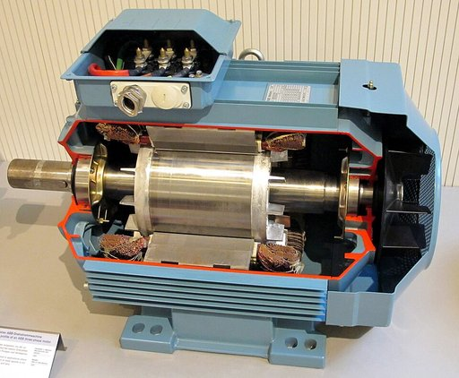
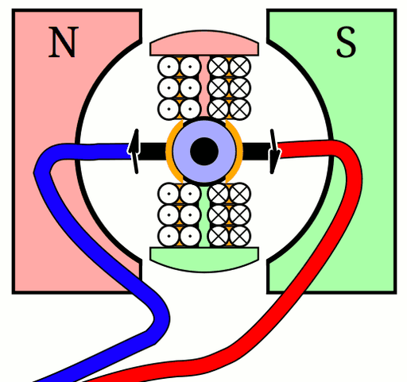
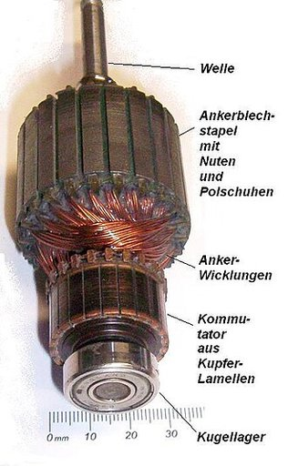

# Elektromotor

Ein **Elektromotor** ist ein elektromechanischer Wandler (elektrische Maschine), der elektrische Leistung in mechanische Leistung umwandelt. In herkömmlichen Elektromotoren erzeugen stromdurchflossene Leiterspulen Magnetfelder, deren gegenseitige Anziehungs- und Abstoßungskräfte in Bewegung umgesetzt werden. Damit ist der Elektromotor das Gegenstück zum sehr ähnlich aufgebauten Generator, der Bewegungsleistung in elektrische Leistung umwandelt. Elektromotoren erzeugen meist rotierende Bewegungen, sie können aber auch für translatorische Bewegungen gebaut sein (Linearantrieb). Elektromotoren werden zum Antrieb vieler Gerätschaften, Arbeitsmaschinen und Fahrzeuge eingesetzt.

## Geschichte

Der Benediktinermönch Andreas (Andrew) Gordon experimentierte bis zu seinem Tod 1751 mit Elektrizität und erfand einen horizontal drehenden Metallstern, der sich bei elektrostatischer Entladung dreht; Stromversorgung war eine Leidener Flasche. Als Professor an der Universität Erfurt wurden seine Veröffentlichungen unter Gelehrten beachtet und verbreitet, mitunter jedoch ohne den Erfinder zu nennen.

1820 entdeckte der dänische Physiker und Philosoph Hans Christian Ørsted die magnetische Wirkung des elektrischen Stroms, ein grundlegendes Phänomen des Elektromagnetismus. Ein Jahr später veröffentlichte Michael Faraday seine Arbeitsergebnisse über „elektromagnetische Rotation“. Er konstruierte eine Vorrichtung, bei der ein elektrischer Leiter um einen festen Magneten rotierte und im Gegenexperiment ein beweglicher Magnet um einen festen Leiter. 1822 entwickelte Peter Barlow das nach ihm benannte Barlow-Rad. Der britische Wissenschaftler William Sturgeon erfand 1832 einen weiteren Motorvorläufer. Auf dem europäischen Kontinent wirkten Ányos Jedlik (1827) und Hermann Jacobi an der Weiterentwicklung des Gleichstrom-Elektromotors. So entwickelte Jacobi bereits 1834 den ersten praxistauglichen Elektromotor in Potsdam und stattete 1838 in Sankt Petersburg ein zwölf Personen fassendes Boot mit dem von ihm entwickelten 220 Watt starken Motor aus, was somit zugleich die erste Anwendung eines Elektromotors in der Praxis darstellte. Auch der US-amerikanische Grobschmied Thomas Davenport entwickelte in Vermont einen Kommutatormotor. Auf sein Design wurde ihm am 25. Februar 1837 ein Patent erteilt.

Damit war um 1837/1838 die Grundlage für einen elektromotorischen Antrieb bekannt und auch bis zur anwendungstauglichen Arbeitsmaschine entwickelt. Werner von Siemens ließ im Jahre 1866 seine Dynamomaschine patentieren. Sie ermöglichte erstmals eine Erzeugung elektrischer Energie in größerem Umfang. Dies verhalf dem Elektromotor zum Durchbruch für eine praxistaugliche weitverbreitete Anwendung. Daneben gab es zu jener Zeit auch einige technische Entwicklungen von andersartigen Elektromotoren, welche aber letzten Endes keine Bedeutung erlangten. Dazu zählt unter anderem der Egger-Elektromotor, welcher ähnlich wie eine Dampfmaschine aufgebaut ist, und das 1867 entwickelte „Elektrische Kraftrad“ von Johann Kravogl.

Ab etwa 1880 wurden in vielen Staaten Elektronetze und Kraftwerke aufgebaut. In Deutschland war beispielsweise Emil Rathenau mit seiner Allgemeinen Electricitäts-Gesellschaft Vorreiter und in Amerika Thomas Alva Edison. Mit der großflächigen Bereitstellung von elektrischer Energie breitete sich der Elektromotor dann schnell aus. Gemeinsam mit der Chemischen Industrie war diese Elektrifizierung das wichtigste Merkmal der zweiten industriellen Revolution. Die öffentlichen Pferdebahnen wurden durch elektrische Straßenbahnen ersetzt, und im Gewerbe verwendete man nun Elektromotoren anstatt der Dampfmaschine zum Antrieb verschiedenster Arbeitsmaschinen.

Siehe auch: Technik in der Industrialisierung

## Grundprinzip/​Funktionsweise

Die Drehbewegung eines Elektromotors beruht auf den Anziehungs- und Abstoßungskräften, die mehrere Magnetfelder aufeinander ausüben (Lorentzkraft). Im üblichen Elektromotor gibt es einen feststehenden Außenteil sowie einen sich darin drehenden Innenteil. Entweder besitzt einer davon Permanentmagneten und der andere elektrische Spulen, oder beide Komponenten besitzen Spulen. Jede stromdurchflossene Spule erzeugt ein Magnetfeld, dessen Ausrichtung (Nordpol/Südpol) abhängig von der Stromrichtung ist – fließt der Strom in entgegengesetzter Richtung durch die Spule, so wird auch das Magnetfeld umgedreht. Durch fortwährendes Umschalten der Stromrichtung bzw. passendes „Umpolen“ der Spulen während des Umlaufs wird eine kontinuierliche Drehung des Innenteils erreicht.

### Begriffe

Stator
:   Der feststehende, magnetisch wirkende Teil eines Elektromotors wird Stator genannt. Bei Elektromotoren liegt der Stator meistens außen und ist mit dem Gehäuse verbunden; liegt der Stator innen, so nennt man den Motor „Außenläufer“. Das Stator-Gehäuse ist meist auch der Träger der mechanischen Befestigungselemente.

Rotor
:   Der sich bewegende (meistens: rotierende), magnetisch wirkende Teil eines Elektromotors, der die Motorwelle dreht. Er besteht aus der Welle, dem Anker und einer Spule, wenn der Anker kein Permanentmagnet ist.

Anker
:   Eisenkern des Rotors, um den die Rotorspule(n) gewickelt ist/sind.

Polschuh
:   Schuhform-ähnliche Ausbuchtung des Eisens eines Magnetkerns, die das Magnetfeld an diese Stelle leiten/bündeln soll.

Kommutator
:   Eine Scheibe mit elektrischen Anschlüssen, die Segmente der Scheibe sind; die Scheibe dreht sich mit der Rotorwelle. An den Anschlüssen sind die Spulen angeschlossen; die Kommutatorscheibe polt während eines Umlaufs die Spulen um. Die genaue Funktionsweise ist im nachfolgenden Abschnitt erklärt.

### Gleichstrommotor (Kommutatormotor)

→ *Hauptartikel: Gleichstrommaschine*

Der (feststehende) Stator kann bei einem Gleichstrommotor ein Dauermagnet mit Polschuhen sein, jedoch ist auch eine Fremderregung über eine Erregerspule anstatt des Dauermagneten möglich. Bei einem Wechselstrom-Kommutatormotor oder auch Universalmotor befindet sich im Stator hingegen immer eine Erregerspule. Wird Strom durch diese Spule geleitet, baut sich das Erregerfeld (Magnetfeld) auf (Ørsted-Prinzip).

Im Inneren des Stators ist ein Rotor, der in den meisten Fällen aus einer Spule mit Eisenkern (dem sogenannten Anker) besteht, der drehbar im Magnetfeld zwischen den Polschuhen des Stators gelagert ist.

Die Stromzuführung für den Anker erfolgt über einen segmentierten Kommutator und Schleifkontakte (Kohlebürsten). Schickt man durch den Rotor Strom, entsteht auch hier ein Magnetfeld, das jetzt in Wechselwirkung mit dem Magnetfeld des Stators tritt. Er dreht sich somit um seine eigene Achse und schaltet über den sich mitdrehenden Kommutator immer die passenden Wicklungen in den Stromweg und kann so elektrische Arbeit in mechanische Arbeit umwandeln.

Hätte ein solcher Motor keinen Kommutator, würde sich der Anker so weit drehen, bis das Rotormagnetfeld zum Statorfeld gleichgerichtet ist. Damit er an diesem „toten Punkt“ nicht stehen bleibt, wird der Strom in den Ankerspulen mit Hilfe des Kommutators (auch Stromwender oder Kollektor genannt) bei jedem neuen Segment umgeschaltet. Der Kommutator besteht aus Metallsegmenten, die eine durch schmale Streifen nichtleitenden Materials (Kunststoff, Luft) unterbrochene Zylinder- oder Kreisfläche bilden. An den Segmenten sind die Ankerwicklungen angeschlossen. Am Kommutator liegen, durch Federn angedrückt, meist zwei Kohlebürsten an, die den Strom zuführen. Mit jeder Drehung des Rotors wird die Stromrichtung durch die Ankerwicklungen geändert und es gelangen diejenigen Leiter in das Magnetfeld des Stators, deren Stromfluss so gerichtet ist, dass ein Drehmoment erzeugt wird.

Das Magnetfeld im Rotor steht – relativ zum Stator – fest; der Eisenkern des sich drehenden Ankers muss daher zur Vermeidung von Wirbelströmen aus einem Blechstapel bestehen.

Nach diesem Prinzip können auch Wechselstrommotoren gebaut werden, wenn das Erregerfeld mit dem Wechselstrom ebenfalls seine Polung ändert (Universalmotor). Dann muss auch der Stator aus einem Blechpaket bestehen.

### Wechsel- und Drehstrommotoren

Bei Wechselstrom kann auch auf einen Kommutator verzichtet werden, wenn die Umdrehungszahl im Rhythmus des Wechselstromes erfolgt; das dann mit umlaufende Magnetfeld des Rotors wird dann erzeugt:

- durch vom Erregerfeld induzierte Ströme in einer Kurzschlusswicklung (Asynchronmotor)
- durch Magnetisierung eines Eisenkernes mit Polen (Reluktanzmotor, Schrittmotor)
- durch Dauermagnete (Schrittmotor, elektronisch kommutierter Gleichstrommotor, Synchronmotor)
- durch einen elektrisch erregten Läufer (siehe z. B. Polrad oder Erregersysteme für Synchronmaschinen)

Solche Motoren besitzen daher kein oder ein geringes Anlaufmoment. Sie benötigen eine Anlaufhilfe, können jedoch mit Wechselstrom mit mehr als nur einer Phase auch selbst starten:

- Drehstrommotoren werden mit Drehstrom betrieben, der aus drei um 120° phasenverschobenen Wechselspannungen besteht und so ein Drehfeld erzeugt
- Kondensator- und Spaltpolmotoren erzeugen sich aus einem einphasigen Wechselstrom selbst eine Hilfsphase (ein Drehfeld) zum Anlauf.
- Schrittmotoren und Reluktanzmotoren werden mit frequenzveränderlichem Wechselstrom und/oder mit mehreren Phasen betrieben, damit sie „im Tritt“ bleiben bzw. keine Schrittverluste auftreten.
- Synchronmotoren benötigen eine Starthilfe oder schaukeln/schwingen sich von selbst „in Tritt“.

## Arten

### Drehfeld- und Wanderfeld-Maschinen

- Drehstrommotor
  - Bürstenloser Gleichstrommotor
  - Drehstrom-Asynchronmaschine
    - Schleifringläufermotor
  - Drehstrom-Synchronmaschine (Permanent- oder fremderregt)
  - Kaskadenmaschine
  - Schrittmotor
- Linearmotor
- Torquemotor
- Transversalflussmaschine
- Wechselstrommotor
  - Kondensatormotor
  - Reluktanzmotor
  - Spaltpolmotor
  - Synchronmotor/Einphasenasynchronmotor

### Stromwender- bzw. Kommutator-Maschine

- Gleichstrommotor
- Repulsionsmotor
  - elektrisch erregter (fremderregter) Gleichstrommotor
    - Nebenschlussmaschine
    - Reihenschlussmotor
    - Verbundmotor
  - permanent erregter Gleichstrommotor
- Universalmotor (für Gleich- und Wechselstrom)

### Sonstige

Es gibt einige Arten von Elektromotoren, die heute keine wirtschaftliche Bedeutung haben.

- Egger-Elektromotor
- Kugellagermotor
- Unipolarmaschine
  - Barlow-Rad
  - Homopolarmotor

Elektrostatische Motoren verwenden statt Magnetfelder elektrische Felder, die von Ladungen erzeugt werden. Aufgrund der hohen benötigten Spannungen und einem niedrigeren Wirkungsgrad sind diese Motoren jedoch nur für kleine Kräfte und Maßstäbe relevant.

## Anwendungen

Elektromotoren kommen sowohl ungeregelt als auch geregelt zum Einsatz. In einfachen Fällen kommen ungeregelte Drehstrommotoren mit Stern-Dreieck-Umschaltungen zur Anwendung. Diese sind jedoch nur zur Lösung primitiver Antriebsaufgaben geeignet. In den meisten Fällen in der heutigen Praxis liegen anspruchsvollere Antriebsprobleme vor, sodass die Elektromotoren durch eine Regelung geregelt werden müssen. Handelt es sich dabei um größere Leistungen, die erforderlich sind, so müssen noch leistungselektronische Stellglieder zwischen Regelung und Elektromotor dazwischengeschaltet werden. Kommen Regelung und Elektromotor zusammen und bilden sie gemeinsam eine funktionelle Einheit, so spricht man vom „Elektroantrieb“. Per se ist also ein Elektromotor nicht an eine Regelung gebunden; in vielen praktischen Fällen hat sich jedoch gerade deren Zusammenwirken als zweckmäßig erwiesen.

In der Vergangenheit fanden Elektromotoren zunächst praktische Verwendung als Antrieb von Straßenbahnen und etwas später als Universalantrieb zur Ersetzung von Dampfmaschinen in Fabriken und wurden zu diesem Zweck über Riementriebe zum Antreiben mechanischer Webstühle und dergleichen eingesetzt. Mit der Einführung von Fließbändern in der Industrie wurden Elektromotoren dann zum Antriebsmittel ganzer Industriezweige schlechthin.

Im Bereich Verkehr und Mobilität kamen Elektromotoren erstmals bei Elektrolokomotiven und Elektrischen Bahnen zum Tragen, später in Elektrokarren und in Gabelstaplern. Mit der Weiterentwicklung von Akkus werden heute Elektroautos mit immer größerer Reichweite gebaut und gelten wegen der hohen Effizienz des Elektroantriebs als Alternative zum Verbrennungsmotor in der Zukunft. Entwicklungen in der Leistungselektronik brachten einen weiteren Anwendungsschub – von da ab konnten die wartungsfreien, preiswerten Asynchronmotoren auch für drehzahlvariable Antriebe eingesetzt werden.

Heute werden Elektromotoren in großer Zahl in Maschinen, Automaten, Robotern, Spielzeug, Haushaltsgeräten, Elektronikgeräten (zum Beispiel Videorekorder, Festplatten, CD-Spieler), in Ventilatoren, Rasenmähern, Kranen usw. eingesetzt. Die große Bedeutung des Elektromotors für die heutige moderne Industriegesellschaft spiegelt sich auch im Energieverbrauch wider: Elektromotoren haben einen Anteil von über 50 Prozent am Stromverbrauch in Deutschland.

### Elektromotoren in mobilen Anwendungen

Elektromotoren werden in Kraftfahrzeugen, bei Schienenfahrzeugen wie E-Loks und Straßenbahnen und teilweise auch in Schiffen angewendet, unter anderem bei U-Booten und Torpedos. Lediglich bei Luftfahrzeugen findet der Elektromotor als Antrieb des Fahrzeugs kaum Anwendung, gewinnt durch die Verbreitung von Drohnen und Elektroflügen jedoch auch in diesem Bereich eine zunehmende Bedeutung.

Viele Elektrofahrzeuge wie die meisten Elektroautos, E-Scooter, Pedelecs, Drohnen usw. zehren aus der in einem Akkumulator gespeicherten Energie. Es sind jedoch auch andere Möglichkeiten der Energieversorgung verbreitet:

Fahrzeugantriebs-Konzepte mit Elektromotoren, bei denen eine nichtelektrische Energiequelle im Fahrzeug mitgeführt wird:

- Brennstoffzellen-Antrieb: Ein Projekt ist zum Beispiel HyFLEET:CUTE, die Weiterführung des Projektes CUTE. Probleme bestehen in der Lebensdauer und den Kosten der Brennstoffzellen. Brennstoffzellen werden auch bei manchen U-Booten als Energiequelle genutzt.
- Hybridantrieb (zum Beispiel Toyota Prius): Ein Ottomotor wird mit einem Elektromotor/Generator kombiniert und mit Akkumulatoren gepuffert (Vorteile im Teillastbereich/Stadtbetrieb, hoher Fahrkomfort, Nutzbremsung (Rekuperation), Pufferung auch mit Doppelschichtkondensatoren).
- Gyroantrieb: Als Energiespeicher dient ein Schwungrad mit einem Generator, der die Fahrmotoren antreibt (wird unter anderem bei Gyrobussen angewendet, geringe Reichweite, Nutzbremsung möglich).
- Kernenergieantrieb: Im Fahrzeug wird ein Kernkraftwerk mitgeführt. Verbreitet ist diese Möglichkeit bei U-Booten und einigen Schiffen, darunter auch zivile Schiffe wie der Eisbrecher Lenin.
- Eine weitere mobile Anwendung ist der dieselelektrische Antrieb; hier erzeugt ein Dieselaggregat elektrischen Strom, der die Fahrmotoren antreibt. Nutzbremsung ist nicht möglich, wenn nicht zusätzlich Akkumulatoren mitgeführt werden. Dieselelektrische Antriebe finden sich in Schiffen, Lokomotiven und U-Booten (hier ergänzt durch einen Akkumulator).

Fahrzeugantriebs-Konzepte mit Elektromotoren, bei denen die Energie während der Fahrt aus der Umwelt entnommen wird:

- Elektrisch angetriebene Schienenfahrzeuge erhalten den Strom meist aus einer Oberleitung oder aus Stromschienen, seltener sogar direkt aus der Fahrschiene.
- Obusse erhalten ihre Stromversorgung aus einer Oberleitung. Auch hier kann Nutzbremsung stattfinden, wenn das speisende Netz dafür ausgelegt ist oder Akkumulatoren installiert werden. Auch Doppelschichtkondensatoren werden hierbei angewendet.
- Solarfahrzeuge nutzen das auf das Fahrzeug einstrahlende Sonnenlicht, um die benötigte elektrische Energie zur Fortbewegung zu erzeugen.

Gründe für den Elektroantrieb von Fahrzeugen sind:

- Extrem große Elastizität – auf ein schaltbares Getriebe und einen Anlasser kann daher völlig verzichtet werden. Bereits beim Anfahren liegt unter Volllast das maximale Drehmoment an, weshalb auch keine Anfahrhilfen wie Kupplungen etc. erforderlich sind
- hoher Wirkungsgrad (insbesondere auch bei Teillastbetrieb, wichtig bei Batteriebetrieb)
- Hoher Fahrkomfort durch einfache Bedienung (auch wichtig bei elektrischen Rollstühlen)
- Geringere Abmessung und geringere Masse als vergleichbarer Verbrennungsmotor; dadurch platzsparender Einbau direkt in der Nähe der Räder möglich.
- Keine Emissionen; daher Einsatz in abgassensiblen Bereichen möglich (Werkhallen, Tunnelgebiete und Wohngebiete etwa)
- Geringere Betriebskosten (sehr lange Motor-Lebensdauer, geringere Wartung).
- Einfacher Aufbau einschließlich einfacherem Kühlsystem.
- Einrichtung einer elektromotorischen Bremse die eine Nutzbremsung mit Energierückgewinnung ermöglicht und keine Wartungsarbeiten wegen Verschleiß benötigt, wie es bei herkömmlichen Bremssystemen der Fall ist.

Trotz dieser Vorteile wird der Elektromotor bisher wenig in Pkw und Lkw eingesetzt. Grund ist insbesondere die begrenzte maximale Reichweite bzw. die hohe Masse der Energiespeicher (Akkumulatoren) sowie deren lange Ladezeit.

### Anwendungen in der Industrie

Die vielfältigen Anwendungsgebiete von Elektromotoren in der Industrie lassen sich in zwölf Gebiete aufteilen. Die ersten vier befassen sich mit dem Materialfluss. Die nächsten vier mit kontinuierlichen oder getakteten Produktionsstraßen und die letzten beiden mit Prozessen, die auf die Werkstücke einwirken.

1. Förderantriebe: Anforderungen an die Antriebe sind eine hohe Lebensdauer, Robustheit und Zuverlässigkeit, niedriger Wartungsaufwand, hohe Modularität und geringer Energieverbrauch. Die Antriebe werden meist im Dauerbetrieb eingesetzt, Beschleunigungen spielen daher eine untergeordnete Rolle.
2. Fahrantriebe werden an Fahrzeugen zum Materialtransport eingesetzt, beispielsweise bei fahrerlosen Transportsystemen, Portalkranen, Regalbediengeräten oder Elektrohängebahnen. Für das genaue Anfahren von Positionen wird eine hohe Präzision der Antriebe gefordert.
3. Hubantriebe sollen Güter senkrecht nach oben fördern. Dazu zählen Krane, Hubtische, Lastenaufzüge und Bauaufzüge.
4. Positionierantriebe dienen dazu, einzelne Güter von einem Punkt zu einem anderen zu befördern. Dazu zählt das Bestücken von elektronischen Bauteilen, die Zuführung und Entnahme von Werkstücken bei Produktionsmaschinen und Montageautomaten. Die Mehrheit dieser Antriebe ist als linearer Direktantrieb ausgeführt.
5. Koordinierte Antriebe für Roboter: Industrieroboter haben häufig bis zu sechs Achsen die gleichzeitig während der Bewegung eine bestimmte Soll-Lage haben sollen. Eine Koordinierung der einzelnen Antriebe ist daher nötig, um die gewünschte Bewegung des Roboterarmes zu erzeugen.
6. Gleichlaufantriebe werden bei Produktionsprozessen eingesetzt, bei denen ein kontinuierliches Produkt als Endlosmaterial hergestellt wird. Dazu zählen das Transportieren, Walzen, Beschichten, Wickeln und Zwirnen sowie das Bedrucken.
7. Wickelantriebe stehen oft am Anfang oder Ende einer kontinuierlichen Fließproduktion. Sie werden beispielsweise in Stahlwerken eingesetzt, um Bleche zu Coils aufzuwickeln und im Maschinenbau und der Fahrzeugindustrie, um sie wieder abzuwickeln. Weitere Beispiele sind das Auf- und Abwickeln von Draht, Garn oder Papier. Da das aufgewickelte Material mit der Zeit eine immer größeren Umfang hat, nimmt bei gleichbleibender Drehzahl die Umfangsgeschwindigkeit zu. Um ein Reißen des Produktes zu verhindern, müssen die Antriebe über den Umfang des aufgewickelten Materials geregelt werden.
8. Taktantriebe für Querschneider und Fliegende Sägen werden bei der kontinuierlichen Produktion genutzt, um das Fließmaterial zu vereinzeln, beispielsweise durch Absägen eines Abschnittes. Besondere Anforderungen ergeben sich daraus, dass das Material sich während des Trennprozesses weiterbewegt.
9. Antriebe für elektronische Kurvenscheiben zählen zu Antrieben mit ungleichförmiger Bewegung. Ein Stanzwerkzeug soll sich beispielsweise langsam senken, um eine gute Arbeitsqualität am Werkstück zu erreichen und schnell heben. Weitere Anwendungen sind Kleben, Schweißen, Biegen und Schneiden.
10. Antriebe für Umformprozesse: Hierzu zählt das Pressen von Stahlblechen, das Extrudieren von Kunststoffen, das Tiefziehen oder das Gesenkschmieden.
11. Haupt- und Werkzeugantriebe bei Werkzeugmaschinen. Sie dienen zum Antrieb von Fräsen, Bohrern und Drehmaschinen. Dies ist der einzige industrielle Anwendungsfall, zu dem reichhaltige ingenieurwissenschaftliche Literatur vorliegt.
12. Antriebe für Pumpen und Ventilatoren.

## Wirkungsgrad und Effizienz

Technologisch veraltete Elektromotoren führen zu einem erhöhten Energieverbrauch. 1998 wurde eine freiwillige Vereinbarung zwischen dem europäischen Sektorkomitee für elektrische Antriebe CEMEP und der Europäischen Kommission getroffen.
In dieser heute veralteten Vereinbarung wurden drei Wirkungsgradklassen definiert:

- EFF3 = Motoren mit niedrigem Wirkungsgrad
- EFF2 = Motoren mit verbessertem Wirkungsgrad
- EFF1 = Motoren mit erhöhtem Wirkungsgrad

Im Jahr 2009 wurde eine neue weltweit geltende Normierung für die Effizienzklassen (EN 60034-30:2009) eingeführt.
Die folgenden Wirkungsgradklassen für Niederspannungs-Drehstrom-Asynchronmotoren im Leistungsbereich von
0,75 kW bis 375 kW sind heute geltend:

- IE1 = Standard Wirkungsgrad (vergleichbar EFF2, Vertrieb seit Juni 2011 nur noch eingeschränkt gestattet)
- IE2 = Hoher Wirkungsgrad (vergleichbar EFF1)
- IE3 = Premium Wirkungsgrad
- IE4 = Super Premium (> 97 % realisiert)
- IE5 = Ultra Premium

Seit 16. Juni 2011 dürfen ungeregelte Motoren (0,75–375 kW) nur noch ab Leistungsklasse IE2 in Verkehr gebracht werden. Der Anteil hocheffizienter Motoren soll stetig ausgebaut werden. Beispiele sind die permanenterregten Synchronmotoren mit höchsten Wirkungsgraden.

Ab dem 1. Juli 2021 dürfen ungeregelte Motoren (0,75–375 kW) nur noch ab Leistungsklasse IE3 in Verkehr gebracht werden.

## Fertigung

Die einzelnen Komponenten des Elektromotors werden unabhängig voneinander hergestellt. Die wichtigsten sind das Gehäuse, der Stator, die Welle und der Rotor. Anschließend erfolgt die Endmontage.

### Fertigung der Gehäuse

Das eigentliche Gehäuse wird auf beiden Seiten von Deckeln abgeschlossen, die beim Elektromotor als Lagerschilde bezeichnet werden, da sie auch zum Lagern der Motorwelle mittels Kugellagern dienen. Die einzelnen Prozessschritte für die Lagerschilde und das Gehäuse stimmen jedoch überein. Beide werden zunächst durch Gießen oder Fließpressen grob in Form gebracht, danach erfolgt die Feinbearbeitung mit Drehen, Bohren und Schleifen und zuletzt die Reinigung. Die Details hängen von der produzierten Stückzahl ab.

Gießen mit Formen aus Sand wird nur bei geringen Stückzahlen eingesetzt, beispielsweise bei der Prototypenfertigung. Für mittlere und größere Stückzahlen eignen sich der Druckguss und der Schleuderguss sowie das Strangpressen. Der Druckguss ist mit einem Anteil von 60 % das häufigste Verfahren. Hier besteht die Form aus Stahl und kann etwa 80.000-mal abgegossen werden. Die benötigten Maschinen kosten zwischen 700.000 Euro und einer Million Euro, sodass eine Mindeststückzahl von etwa 15.000 erreicht werden muss, um wirtschaftlich zu sein. Schleudergussanlagen kosten dagegen nur etwa 60.000 bis 100.000 Euro. Am teuersten sind Strangpressanlagen mit 8 Mio. Euro. Sie eignen sich daher nur für sehr große Serien, weisen dann aber die niedrigsten Stückkosten auf.

Nach dem Gießen oder Strangpressen werden die Gehäuse entgratet. Die weitere Feinbearbeitung geschieht meist auf Bearbeitungszentren, die auf das Drehen, Bohren, Fräsen und Schleifen spezialisiert sind. Zu den Aufgaben gehört das Ausdrehen der Innenkontur, die Feinbearbeitung von Rändern und das Bohren von Durchgängen oder Gewinden.

Die Reinigung der Gehäuse geschieht bei kleinen Serien meist durch Bestrahlen mit Trockeneis (sogenanntes Trockeneisstrahlen) oder mit kleinen Kugeln (Kugelstrahlen). Dadurch werden Gießrückstände, Späne, Stäube und sonstige Schmutzpartikel entfernt. Bei mittelgroßen Serien geschieht die Reinigung mittels Ultraschallbad. Bei Großserien werden Durchlauf-Reinigungsanlagen eingesetzt, die aus einer Aufgabestation bestehen, aus Reinigungs- und Spülzonen, der Trockenzone und der Übergabestation.

### Fertigung der Blechpakete

Die eigentlichen leistungserzeugenden Komponenten, also der Rotor und der Stator, werden aus Blechpaketen zusammengebaut. Gegenüber der Vollmaterialbauweise haben Blechpakete den Vorteil, dass sie Wirbelströme verhindern und so den Wirkungsgrad erhöhen. Beim Zusammenbau der Bleche zu Paketen ist es wichtig, Kurzschlüsse zu vermeiden. Die einzelnen Bleche sind daher mit einem Isolator beschichtet. Sie werden aus Elektroband hergestellt. Dabei handelt es sich um Bleche aus einem siliziumhaltigen Stahl, der verbesserte magnetische Eigenschaften aufweist. Da seine Produktion recht aufwendig ist, wird es von Elektromotor-Herstellern eingekauft. Die Fertigung der Blechpakete geschieht in mehreren Schritten: Ausschneiden der Bleche, Stapeln, dauerhaftes Fügen (Kleben, Schweißen etc.) und eine Nacharbeit.

Für kleinere Serien oder Prototypen wird das Blech mittels Laser- oder Wasserstrahlschneiden getrennt. Bei größeren Serien ist das Stanzen wirtschaftlicher. Anschließend werden die Bleche gestapelt. Beim Stanzen kann dies direkt in der Maschine geschehen, während bei den anderen Verfahren ein weiterer Prozessschritt nötig ist. Zum Fügen der Blechpakete gibt es zahlreiche Möglichkeiten. In der Massenproduktion werden häufig Nasen an einzelnen Blechen nach unten gedrückt, in Aussparungen der darunterliegenden Schichten. Häufig ist dieser Schritt direkt in das Stanzen integriert. Nach dem Stapeln können die einzelnen Lagen auch zusammengeschweißt werden. Dies ist bei deutlich niedrigeren Stückzahlen wirtschaftlich, hat jedoch den Nachteil, dass eine elektrisch leitende Verbindung entsteht, die die Entstehung von Wirbelströmen begünstigt. Da die Schweißnähte an Stellen angebracht werden können, die für das magnetische Feld von geringer Bedeutung sind, sind die Nachteile beim Wirkungsgrad gering. Eine andere Möglichkeit ist die Verwendung von Backlack. Hier werden nach dem Stanzen die einzelnen Bleche mit Backlack beschichtet und gestapelt und anschließend im Ofen gebacken. Dadurch werden einerseits die Schichten zusammengeklebt und andererseits auch isoliert.

Als letzter Schritt kann eine Nachbearbeitung geschehen, die den Wirkungsgrad etwas erhöhen. Dazu zählt das Spannungsarmglühen, Außenrunddrehen, Entgraten und eine Nachlackierung. Da die Effizienzsteigerungen gering sind, wird dies vor allem bei Großmotoren praktiziert.

### Fertigung des Stators

Der Stator ist mit einem Anteil von 35 % an den Gesamtkosten das teuerste Bauteil. Dies liegt an der aufwendigen Produktion und dem teuren Material. Die einzelnen Prozessschritte sind Isolieren der Komponenten, Wickeln der Spulen, Bearbeiten der Wicklung und Imprägnieren.

Zwischen dem Blechpaket und den Wicklungen der Spulen wird Isolatorpapier verwendet, um Spannungsüberschläge zu vermeiden. Der für die Spulen benötigte Draht wird mittels Drahtziehen hergestellt, anschließend mit einer isolierenden Lackschicht und danach mit einer Gleitschicht überzogen, die das Wickeln erleichtert.

In der Spulenwickeltechnik haben sich zahlreiche Methoden und Verfahren etabliert zur Herstellung der Spulen. Die wichtigsten sind die Linear-, Flyer- und Nadelwickeltechnik. Die Anlagen für die Spulenwicklungen kosten zwischen 150.000 Euro für einfache Maschinen und gehen bis zu 4 Millionen Euro für Anlagen der Großserienproduktion.

Nachdem die Spulen in den Stator eingebaut wurden, werden die Enden der Drähte kontaktiert und geprüft.

### Fertigung der Welle

Der Kostenanteil der Welle liegt mit nur 5 % sehr niedrig. Die Herstellung geschieht in drei Schritten: Grobbearbeitung im weichen Zustand, Härten und die Feinbearbeitung durch Schleifen.

Die erste Formgebung geschieht bei großen Stückzahlen meist durch Schmieden, insbesondere mittels Gesenkschmieden. Bei kleineren und mittleren Stückzahlen werden Bearbeitungszentren eingesetzt wie bei der Herstellung der Gehäuse. Zum Härten werden konventionelle Wärmebehandlungsmethoden eingesetzt, darunter das Induktionshärten, das Einsatzhärten und das Nitrierhärten. In allen Fällen wird danach durch Hartdrehen oder Schleifen die endgültige Form präzise erzeugt.

### Fertigung des Rotors

Bei Motoren mit Permanentmagneten sind die Fertigungsschritte Magnetisieren, Magnetbestückung, Wellenmontage und Auswuchten austauschbar, verschiedene Reihenfolgen aber mit jeweils eigenen Vor- und Nachteilen behaftet.

Bei Asynchronmotoren wird stattdessen ein Rotorkäfig verwendet. Meistens wird er mittels Druckguss gefertigt. Beim Prototypenbau wird er auch aus Stäben und Ringen zusammengelötet. Hochwertige Käfige bestehen aus Kupfer, das eine größere Leitfähigkeit aufweist als Aluminium aber auch etwa viermal teurer ist und erst bei 1084 °C schmilzt. Aluminiumlegierungen dagegen schmelzen bereits bei 600 °C. Daher lassen sich Alugussformen etwa 50.000-mal abgießen, Formen für Kupfer dagegen nur 100-mal. Üblicherweise wird die Schmelze direkt in die Rotornuten gegossen.

### Endmontage

Wegen der Vielfalt der verschiedenen Motorbauarten und möglichen Stückzahlen gibt es bei der Endmontage große Bandbreiten und Varianten von der ausschließlich manuellen Montage bis zur vollautomatischen Montagelinie.

Zuerst wird der Stator in das Gehäuse gebaut. Dies kann mit Aufschrumpfen, Einpressen oder Kleben geschehen. Danach wird das Rotorpaket in den Stator eingebracht.

Der nächste Schritt ist die Montage der Sensorik. Beim Asynchronmotor ist dies ein Drehzahlmesser und bei Motoren mit Permanentmagnet ein Positionsmesser (Inkrementalgeber). Sie werden ebenfalls aufgeschrumpft, eingepresst oder geklebt. Außerdem werden Temperatursensoren verbaut.

Anschließend erfolgt die Kontaktierung der Sensoren und der einzelnen Phasen mit dem Anschlussstecker.

Danach werden die Lagerschilde mit Kugellagern bestückt und am Gehäuse angebracht. Im letzten Schritt erfolgt die Endprüfung auf Sicht sowie die Widerstands-, Isolations-, Funktions- und Hochspannungsprüfung sowie einer Prüfung der Leistungselektronik.
