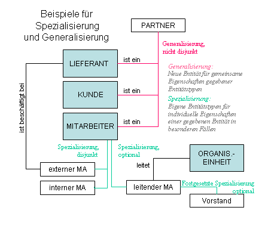
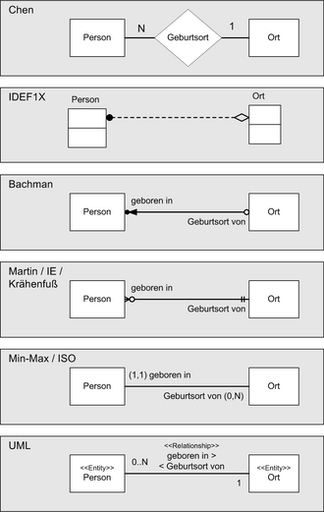

# Entity-Relationship-Modell

Das **Entity-Relationship-Modell** – kurz **ER-Modell** oder **ERM** (mit der sinngemäßen Bedeutung „Modell [zur Darstellung] von Dingen / Gegenständen / Objekten und deren Beziehungen“) – dient dazu, im Rahmen der semantischen Datenmodellierung den in einem gegebenen Kontext (z. B. einem Projekt zur Erstellung eines Informationssystems) relevanten Ausschnitt der realen Welt zu bestimmen und darzustellen. Das ER-Modell besteht im Wesentlichen aus einer Grafik (*ER-Diagramm*, Abk. ERD) sowie einer Beschreibung der darin verwendeten Elemente.

Ein ER-Modell dient sowohl in der konzeptionellen Phase der Anwendungsentwicklung der Verständigung zwischen Anwendern und Entwicklern (dabei wird nur das *Was* behandelt, d. h. fachlich-sachliche Gegebenheiten, nicht das *Wie*, z. B. die Technik) als auch in der Implementierungsphase als Grundlage für das Design der – meist relationalen – Datenbank.

Der Einsatz von ER-Modellen ist der De-facto-Standard für die Datenmodellierung, auch wenn es unterschiedliche grafische Darstellungsformen für Datenmodelle gibt.

Das ER-Modell wurde 1976 von Peter Chen in seiner Veröffentlichung *The Entity-Relationship Model* vorgestellt. Die Beschreibungsmittel für Generalisierung und Aggregation wurden 1977 von John M. Smith und Diane C. P. Smith eingeführt. Danach gab es mehrere Weiterentwicklungen, so Ende der 1980er Jahre durch Wong und Katz.

## Begriffe

Grundlage der Entity-Relationship-Modelle ist die Typisierung von Objekten, ihrer Beziehungen untereinander und der *über sie* zu führenden Informationen (genannt **Attribute**).

### Grundlegende Komponenten

In Diskussionen, Beispielen und Konzepttexten wird auf *Objekte und Gegebenheiten der realen Welt* (im Betrachtungskontext) Bezug genommen; diese werden genannt:

- Entität (Entity): individuell identifizierbares Objekt der Wirklichkeit; z. B. der Angestellte Müller, das Projekt 3232
- Beziehung (Relationship): Verknüpfung / Zusammenhang zwischen zwei oder mehreren Entitäten; z. B. Angestellter Müller *leitet* Projekt 3232.
- Eigenschaft (englisch attribute): *Was* über eine Entität (im Kontext) von Interesse ist; z. B. das Eintrittsdatum des Angestellten Müller.

Im Rahmen der Modellierung werden aus den vorgenannten Sachverhalten *gleichartige Typen* gebildet und im Modell exakt definiert und beschrieben. Diese Typen unterscheiden sich nach:

- Entitätstyp: repräsentieren Aspekte der realen Welt auf abstraktem Niveau z. B. Angestellter, Projekt, Buch, Autor, Verlag
- Beziehungstyp (Relationship-Typ): beschreiben den Zusammenhang zwischen Entitätstypen z. B. Angestellter *leitet* Projekt
- Attribut: beschreiben Entitätstypen oder Beziehungstypen näher, z. B. Nachname, Vorname und Eintrittsdatum im Entitätstyp Angestellter. Das Attribut oder die Attributkombination, durch deren Wertausprägungen Entitäten eindeutig erkennbar sind, d. h. diese identifizieren, heißen identifizierende(s) Attribut(e); zum Beispiel ist das Attribut Projektnummer im Entitätstyp Projekt ein identifizierendes Attribut.

### Besondere Sachverhalte

Zur Beschreibung und Darstellung besonderer Sachverhalte kennt die ER-Modellierung folgende Konstrukte:

- Starker Entitätstyp: Die Identifikation einer Entität ist durch einen oder mehrere Werte von Attributen des gleichen Entitätstyps möglich; so ist z. B. die Auftragsnummer für den Entitätstyp Auftrag identifizierend.
- Schwacher Entitätstyp: Zur Identifikation einer solchen Entität ist ein Attributwert einer anderen mit der schwachen Entität in Beziehung stehenden Entität starken Typs erforderlich; so ist z. B. für die Identifikation des schwachen Entitätstyps „Raum“ neben der Raumnummer auch die Angabe eines Gebäudes eines anderen starken Gegenstandtyps „Gebäude“ erforderlich. In Erweiterungen des ER-Modells wie bspw. dem SERM werden Schwacher Entitätstyp und dazugehöriger Beziehungstyp zu einem sogenannten ER-Typen zusammengezogen, wodurch Diagramme kompakter werden.
- Kardinalität: Die Kardinalität legt (auf der Ebene Beziehungstyp) für jeden der beteiligten Entitätstypen fest, an wie vielen konkreten Beziehungen (dieses Typs) seine Entitäten beteiligt sein können oder müssen. Zur Darstellung der Kardinalität wurden verschiedene Notationsformen entwickelt, von denen Modellierungswerkzeuge meist eine bestimmte unterstützen.
- Reflexive (selbstbezügliche) Beziehung: Beziehung zwischen einzelnen Entitäten ein und desselben Entitätstyps, somit ein Beziehungstyp zwischen demselben Entitätstyp (zum Beispiel die Baumstruktur einer Aufbauorganisation durch „Organisationseinheit *gliedert sich in* Organisationseinheit“ und die Netzstruktur einer Stückliste durch „Teil *wird verwendet in* Teil“). Synonym: Rekursive Beziehung.
- Grad oder Komplexität eines Beziehungstyps: Anzahl der Entitätstypen, die an einem Beziehungstyp beteiligt sind. Die Regel ist der Grad 2 (binärer Beziehungstyp); selten tritt der Grad 3 (ternärer Beziehungstyp) oder ein höherer Grad auf. Ternäre und höhergradige Beziehungstypen lassen sich näherungsweise durch Einführung eines neuen Entitätstyps (der dem ursprünglichen Beziehungstyp entspricht) auf binäre Beziehungstypen zurückführen. Beispiel: *Mitarbeiter betreut Lieferant (für Produktgruppe)*; neuer Entitätstyp *Lieferantenbetreuung* mit Beziehungen zu den drei ursprünglichen Entitätstypen. Ein solches Vorgehen kann aber verlustbehaftet sein, d. h., es gibt Sachverhalte, die nur durch mehrstellige Beziehungstypen exakt darstellbar sind.
- Beziehungsattribute: Üblicherweise haben Beziehungstypen keine Attribute, da sie lediglich die beteiligten Entitätstypen miteinander verbinden. Sind jedoch zusätzlich Attribute erforderlich, so kann aus dem Beziehungstyp – wie bei höhergradigen Beziehungen – ein eigenständiger Entitätstyp mit Beziehungstypen zu den ursprünglich beteiligten Entitätstypen geschaffen werden. Dem neuen (schwachen) Entitätstyp wird dann das Attribut zugeordnet (zum Beispiel *Projektbeteiligungsgrad* beim Beziehungstyp *Angestellter arbeitet am Projekt*). Je nach angewendeter Modellierungsmethodik können auch „attributive“ Beziehungen formuliert werden, häufig wird jedoch ersatzweise das Bilden neuer Entitätstypen praktiziert.
- Abgeleitete Attribute: Abgeleitete Attribute bieten die Möglichkeit, bestimmte Werte auf indirektem Wege aus anderen Datenquellen zu gewinnen. Es besteht daher keine zwingende Notwendigkeit, sie direkt in einer Datenbank zu speichern. Ein exemplarisches Beispiel hierfür ist das Attribut "Alter" eines Mitarbeiters, das mühelos durch die Berechnung des Unterschieds zwischen dem "Geburtsdatum" und dem aktuellen "Tagesdatum" ermittelt werden kann.
- Uminterpretationen in Datenbankmodellen können in speziellen Situationen dazu führen, dass Beziehungen gleichzeitig als Entitätsmengen betrachtet werden oder umgekehrt, dass Entitäten als Beziehungen interpretiert werden können. Solche Uminterpretationen betreffen sowohl Beziehungstypen als auch Entitätstypen. Ein uminterpretierter Entitätstyp wird somit gleichzeitig als Entitätstyp und als Beziehungstyp betrachtet. Dies wird durch die Überlagerung der Symbole für Entitäten (Rechteck) und Beziehungen (Raute) in der Darstellung verdeutlicht.

## Beziehungen mit spezieller Semantik

Die inhaltliche Bedeutung der Beziehungstypen zwischen Entitätstypen kommt im ER-Diagramm lediglich durch einen kurzen Text in der Raute (meistens ein Verb) oder als Beschriftung der Kante zum Ausdruck, wobei es dem Modellierer freigestellt ist, welche Bezeichnung er vergibt. Nun gibt es Beziehungen mit spezieller Semantik, die relativ häufig bei der Modellierung vorkommen. Daher hat man für diese Beziehungstypen spezielle Bezeichner und grafische Symbole definiert. Spezialisierung und Generalisierung sowie Aggregation und Zerlegung sind ergänzende Beschreibungsmittel mit einer speziellen Semantik. Mit diesen beiden speziellen Beziehungstypen können die Gegebenheiten der Realwelt exakter und ihrer tatsächlichen Bedeutung entsprechend modelliert und dargestellt werden. Mit fest definierten Namen und speziellen grafischen Symbolen wird gezeigt, dass es sich um semantisch vorbesetzte Beziehungen mit speziellen Regeln handelt.

Diese meist nur in semantischen Datenmodellen speziell modellierten Entitäts- und Beziehungstypen können datenbanktechnisch auf unterschiedliche Weise implementiert werden, etwa (modellierungs-identisch) als jeweils eigene Tabellen oder in gemeinsamen Tabellen mit die Sonderbeziehung kennzeichnenden Kommentaren oder Attributbezeichnungen. Die Umsetzungsentscheidung hierüber erfolgt (wie auch die Bestimmung der Kardinalität für diese speziellen Beziehungen) in den Aktivitäten der Datenbankmodellierung.

### Spezialisierung und Generalisierung mittels *is-a*-Beziehung

Bei der **Spezialisierung** wird ein Entitätstyp als Teilmenge eines anderen Entitätstyps erkannt und deklariert, wobei sich die spezialisierte Entitätsmenge durch besondere Eigenschaften (nur für sie geltende Attribute und/oder Beziehungen) gegenüber der übergeordneten (Supertyp), generalisierten Menge auszeichnet. Da es sich bei einem Einzelobjekt (Subtyp) der spezialisierten Menge und der generalisierten Menge um *dasselbe* Einzelobjekt handelt, gelten alle Eigenschaften – insbesondere die Identifikation – und alle Beziehungen des generalisierten Einzelobjektes auch für das spezialisierte Einzelobjekt. Spezialisierungstypen (Subtypen) erben alle Attribute von einem übergeordneten Generalisierungstyp (Supertyp). Die Verbindung zwischen Supertyp und Subtyp kann auf verschiedene Arten auftreten:

1. Totale Spezialisierung: Jede Instanz eines Supertyps entspricht mindestens einem Subtyp (Beispiel: Supertyp "Geschäftspartner" mit Subtypen "Bank", "Lieferant", "Kunde", "Mitarbeiter"; Ein "Geschäftspartner" muss mindestens einem Subtypen wie "Lieferant" zugeordnet sein).
2. Disjunkte Spezialisierung: Eine Instanz eines Supertyps kann nur einem Subtyp entsprechen (Beispiel: Supertyp "Mitarbeiter" mit Subtypen "Angestellter", "Arbeiter", "Azubi"; Ein Mitarbeiter kann nur in einer der drei Rollen beschäftigt sein, mehrfache Zuordnungen sind nicht möglich).
3. Überlappende Spezialisierung: Jede Instanz eines Supertyps kann mehreren Subtypen gleichzeitig angehören (Beispiel: Supertyp "Geschäftspartner" mit Subtypen "Bank", "Lieferant", "Kunde", "Mitarbeiter"; Ein "Geschäftspartner" kann den Subtypen "Lieferant" und "Kunde" gleichzeitig zugeordnet sein).
4. Partielle Spezialisierung: Nicht jede Instanz eines Supertyps muss einem Subtypen angehören (Beispiel: Supertyp "Dokument" mit Subtypen "Brief", "Notiz", "E-Mail"; Ein "Dokument" muss nicht zwangsläufig einem Subtypen zugeordnet werden, wenn zum Zeitpunkt des Anlegens in der Datenbank noch nicht klar ist, ob es als "Brief" oder "E-Mail" klassifiziert werden soll).

Beziehungstypen der Art „Spezialisierung / Generalisierung“ werden durch *is-a* / *can-be* („ist ein“ / „kann ein … sein“) beschrieben. Für *is-a* wird gelegentlich auch *a-kind-of* („eine Art …“) benutzt. Es handelt sich hierbei um 1:c-Beziehungen.

Beispiel zur *is-a*-Beziehung:

:   Flugreise *is-a* Reise

und in anderer Leserichtung:

:   Reise *can-be* Flugreise,

mit Eigenschaften wie Reisedatum, Reisepreis (bei Reise) und Beziehungen zu Entitätstyp Flug (bei Flugreise).

Die hier beschriebene *is-a*-Beziehung (zwischen identischen Einzelobjekten) darf nicht mit der *is-element-of*-Beziehung (der Zugehörigkeit eines Einzelobjekts zu einem anderen) verwechselt werden, für die gelegentlich auch die Schreibweise *is-a* verwendet wird, wie z. B. *Flug is-a Flugreise* (was semantisch falsch wäre).

Während Spezialisierungen durch Bildung von Teil-Entitätsmengen aus gegebenen Entitäten entstehen, werden bei der **Generalisierung** gemeinsame Eigenschaften und Beziehungen, die in verschiedenen Entitätstypen vorkommen, zu einem neuen Entitätstyp zusammengefasst. Jedem Element in der spezialisierten Entitätsmenge entspricht ein Element in der generalisierten Entitätsmenge. Die übergeordnete Entitätsmenge wird als Generalisierungstyp (Supertyp) bezeichnet und ist durch eine IS-A-Beziehung mit den untergeordneten Spezialisierungstypen (Subtyp) verbunden. Die Identifikationsschlüssel der Generalisierungsbeziehung müssen dabei übereinstimmen. So können z. B. Kunden und Lieferanten zusätzlich zu Geschäftspartnern zusammengeführt werden, da Name, Anschrift, Bankverbindung etc. sowohl bei den Kunden als auch bei den Lieferanten vorkommen.

Der entstehende Generalisierungs-Beziehungstyp geht in diesem Beispiel vom Geschäftspartner aus und führt zu den beiden Entitätstypen Kunde und Lieferant. Ob die Beziehung in konkreten Einzelfällen nur für Entitäten aus nur einem der beiden oder aus beiden Entitätstypen auftreten kann oder muss, ist durch die Kardinalität festzulegen.

Die vorstehende Unterscheidung zwischen Spezialisierung und Generalisierung ergibt sich lediglich aus der Reihenfolge, in der Entitätstypen beim Modellieren identifiziert wurden; im Ergebnis entstehen immer Beziehungstypen, die in der einen Richtung Spezialisierung, in der anderen Generalisierung sind. Bei Bedarf können für denselben Entitätstyp *mehrere Spezialisierungen / Generalisierungen* auftreten. Beispiel: Mitarbeiter kann spezialisiert werden zu externer MA oder interner MA (disjunkt) und zusätzlich zu „leitender Mitarbeiter“. Auch können spezialisierte Entitätstypen nochmals (fortgesetzt, kaskadiert) spezialisiert / generalisiert werden.

Die visuelle Darstellung von Spezialisierungen und Generalisierungen ist im ursprünglichen ERM-Diagramm nicht vorgesehen, wird aber in Erweiterungen wie z. B. dem SERM verwendet.

### Aggregation und Zerlegung mittels *is-part-of*-Beziehung

Werden mehrere Einzelobjekte (z. B. Person und Hotel) zu einem eigenständigen Einzelobjekt (z. B. Reservierung) zusammengefasst, dann spricht man von Aggregation.
Dabei wird das übergeordnet eigenständige Ganze Aggregat genannt; die Teile, aus denen es sich zusammensetzt, heißen Komponenten. Aggregat und Komponenten werden als Entitätstyp deklariert.

Bei Aggregation/Zerlegung wird zwischen Rollen- und Mengenaggregation unterschieden:

Eine Rollenaggregation liegt vor, wenn es mehrere rollenspezifische Komponenten gibt, diese zu einem Aggregat zusammengefasst werden und es sich um eine 1:c-Beziehung handelt.

Beispiel zur *is-part-of*-Beziehung:

:   Fußballmannschaft *is-part-of* Fußballspiel und Spielort *is-part-of* Fußballspiel

und in anderer Leserichtung:

:   Fußballspiel *besteht-aus* Fußballmannschaft und Spielort.

Eine Mengenaggregation liegt vor, wenn das Aggregat durch Zusammenfassung von Einzelobjekten aus genau einer Komponente entsteht. Hier liegt eine 1:cN-Beziehung vor.

Beispiel zur Mengenaggregation:

:   Fußballspieler *is-part-of* Fußballmannschaft

und in anderer Leserichtung:

:   Fußballmannschaft *besteht-aus* (mehreren, N) Fußballspielern.

### ER-Diagramme

Die grafische Darstellung von Entitäts- und Beziehungstypen (stellvertretend und durch Typisierung abgeleitet aus den im gegebenen Kontext identifizierten Entitäten und Beziehungen) wird *Entity-Relationship-Diagramm (ERD)* oder *ER-Diagramm* genannt. Dies ist eine Übersicht/Grafik über alle relevanten Entitäten und deren Zusammenhänge, wodurch u. U. ein komplex erscheinendes, netzartiges Gebilde entsteht. Bei sehr großen Modellen werden aus Gründen der Übersichtlichkeit i. d. R. *Teilmodelle* (Ausschnitte aus dem Gesamtmodell) dargestellt. Umgangssprachlich werden ERDs z. T. vereinfachend „Datenmodell“ genannt; im weiteren Sinn versteht man aber hierunter auch die textlichen Beschreibungen.

**Notationsformen in ER-Diagrammen:**

Es sind unterschiedliche Darstellungsformen in Gebrauch. Entitätstypen werden meistens als Rechteck dargestellt, Beziehungstypen als dazwischen angeordnete Verbindungslinien mit unterschiedlichen Linienenden oder Beschriftungen, die die Kardinalität der Beziehungen darstellen.

Es gibt heute eine Vielzahl unterschiedlicher *Notationen*, die sich unter anderem in Klarheit, Umfang der grafischen Sprache, Unterstützung durch Standards und Werkzeuge unterscheiden. Im Folgenden finden sich einige wichtige Beispiele, die vor allem deutlich machen, dass bei allen grafischen Unterschieden die Kernaussagen der ER-Diagramme nahezu identisch sind.

Von besonderer − zum Teil historischer − Bedeutung sind unter anderem:

- die Chen-Notation von Peter Chen, dem Entwickler der ER-Diagramme, 1976; erweitert um die Darstellung von Attributen durch die Modifizierte Chen-Notation (MC-Notation)
- die IDEF1X als langjähriger De-facto-Standard bei US-amerikanischen Behörden;
- die Bachman-Notation von Charles Bachman als weit verbreitete Werkzeug-Diagramm-Sprache;
- die Martin-Notation (Krähenfuß-Notation) als weit verbreitete Werkzeug-Diagramm-Sprache (Information Engineering);
- die (min, max)-Notation von Jean-Raymond Abrial, 1974.
- UML als Standard, den selbst ISO in eigenen Normen als Ersatz für ER-Diagramme verwendet. Attribute (im Schaubild nicht zu sehen) können als Klassenattribute dargestellt werden; Relationship-Attribute hingegen werden mit Hilfe von Assoziationsklassen modelliert.

Alle nebenstehenden Notationen drücken auf ihre Art den folgenden Sachverhalt aus:

- *Eine Person ist in einem (1) Ort geboren. Ein Ort ist Geburtsort von beliebig vielen (N) Personen.*
- Ob jede Person auf einen Geburtsort verweisen *muss* (ggf. gäbe es den Ort ‚Unbekannt‘) und/oder ob es auch Orte geben kann, an denen (lt. Datenbestand) *keine Person* geboren wurde, wird in der Chen-Notation nicht und bei den anderen Notationsformen mit unterschiedlichen Symbolen grafisch dargestellt.

Die (min, max)-Notation unterscheidet sich grundlegend von den anderen Notationsformen im Hinblick auf die Bestimmung der Kardinalität und die Position, an der die Häufigkeitsangabe im ER-Diagramm vorgenommen wird. Bei allen anderen Notationen wird die Kardinalität eines Beziehungstyps dadurch bestimmt, dass für eine Entität des einen Entitätstyps nach der Anzahl der möglichen beteiligten *Entitäten* des anderen Entitätstyps gefragt wird. Bei der Min-Max-Notation hingegen ist die Kardinalität anders definiert. Hierbei wird für jeden der an einem Beziehungstyp beteiligten Entitätstyp nach der kleinst- und größtmöglichen Anzahl der *Beziehungen* gefragt, an denen eine Entität des jeweiligen Entitätstyps beteiligt ist. Das jeweilige Min-Max-Ergebnis wird bei dem Entitätstyp notiert, für den die Frage gestellt wurde.

Der zahlenmäßige Unterschied zwischen Min-Max-Notation und allen anderen Notationen tritt erst bei ternären und höhergradigen Beziehungstypen hervor. Bei binären Beziehungstypen ist der Unterschied lediglich in einer Vertauschung der Kardinalitätsangaben ersichtlich.

Kardinalitätsnotationen mit n ohne Min-Max-Angabe bergen ein semantisches Defizit. Denn ihnen fehlt die Angabe, ob der Wert n die 0 einschließt oder nicht, die Beziehung also optional auftreten kann. Ob z. B. bei einer 1:n-„leitet“-Beziehung zwischen Mitarbeiter und Projekt ein Projekt, wenn auch nur temporär, ohne Leitungs-Mitarbeiter sein darf, bleibt offen – und muss explizit verbal definiert werden.

### Beschreibung der Modellkomponenten

Während das ER-Diagramm die im Kontext relevanten Entitäten und ihre Beziehungen (auf der Typ-Ebene) zeigt, werden Details über jeweils eigene Beschreibungen festgehalten. Die Dokumentation dient dem Zweck, die erarbeiteten Sachverhalte einheitlich und klar verstehen und kommunizieren zu können (einheitliche Begriffe!) und für die nachfolgenden Projektphasen der Implementierung die aus konzeptioneller Sicht möglichen Angaben bereitzustellen.

Beispiele für mögliche Inhalte:

- Für Entitäten: Name, Kurzname, Definition, Beispiel(e), weitere Erläuterungen, geschätzte Mengen, neu oder schon vorhanden, …
- Für Beziehungen: Kurzbezeichnung, beteiligte Entitätstypen, Beziehungsaussage 1 („MA leitet Projekt“), Beziehungsaussage 2 (in umgekehrter Richtung), Kardinalität, evtl. weitere Bedingungen für die Beziehung („nur bei Privatpersonen“), …
- Für Attribute: Name, Kurzname, Definition, Beispiel, weitere Erläuterungen, Informationsformat (z. B. Zahl, 2 Dezimalstellen), Wertebereich (von 1 bis 99), für Entity identifizierend (ja/nein/teilweise), …

Konkret werden die Inhalte durch eingesetzte Modellierungswerkzeuge oder auch organisationsspezifisch (z. B. über Dokumenten-Templates) festgelegt. Falls im ER-Modell Objekte vorkommen, die in der Organisation bereits existieren, werden diese üblicherweise in der schon vorhandenen Form verwendet (Kopien, …). Umgekehrt gehen neue Objekte aus dem ERM nach Projektende in das zentrale Datenmodell des Unternehmens ein.

## Einsatz des ERM beim Datenbankdesign

Das ER-Modell wird häufig im Zusammenhang mit dem Design von Datenbanken genutzt. Hierbei wird, das semantische ERM erweiternd oder dieses als Copy-Basis nutzend, ein neues ER-Modell erzeugt und dieses so erweitert, dass es die Grundlage für die Implementierung der Datenbank bildet. Die Umsetzung der in der Realwelt erkannten (und modellierten) Datensachverhalte in ein Datenbankschema erfolgt dabei in mehreren Schritten:

- Erkennen und Zusammenfassen von Entitäten zu *Entitätstypen* durch Abstraktion (z. B. Die Kollegen Fritz Maier und Paul Lehmann und viele weitere zum Entitätstyp *Angestellter*);
- Erkennen und Zusammenfassen von Beziehungen zwischen je zwei Objekten zu einem *Beziehungstyp* (Beispiel: Der Angestellte Paul Lehmann leitet das Projekt *Verbesserung des Betriebsklimas*, der Angestellte Fritz Maier leitet das Projekt *Effizienzsteigerung in der Verwaltung*. Diese Feststellungen führen zum Beziehungstyp „Angestellter leitet Projekt“.);
- Bestimmung der *Kardinalitäten*, d. h. der Häufigkeit des Auftretens (Wie z. B. Ein Projekt wird immer von genau einem Angestellten geleitet, ein Angestellter darf mehrere Projekte leiten).

Diese Schritte lassen sich in einem ER-Modell nach den oben gezeigten Beispielen darstellen.

Weiter sind folgende Schritte notwendig, deren Ergebnis häufig jedoch nicht grafisch dargestellt, sondern nur als beschreibender Text ergänzt wird:

- Bestimmung und detailliertere Beschreibung der relevanten *Attribute* der einzelnen Entitätstypen – wie Feldlänge, Wertebereiche, Pflichtfeld usw.
- Bestimmen geeigneter Attribute eines Entitätstyps als *identifizierende(s) Attribut(e)*, so genannte Schlüsselattribute. Gegebenenfalls sind künstliche Schlüssel zu definieren.
- Festlegen weiterer Details zur *Umsetzung von Beziehungstypen* – wie Pflichtbeziehung, Fremdschlüssel oder Beziehungstabelle, referentielle Integrität.
- Generierung des *Schemas* einer relationalen Datenbank mit all seinen Tabellen- und zugehörigen Felddefinitionen mit ihren jeweiligen Datentypen.

Abhängig von den verwendeten Modellierungswerkzeugen – und Vorgaben zur Projektmethodik – muss nicht immer zwischen ERM und Datenbankmodell unterschieden werden. Dies kann z. B. bei kleinen Datenbankprojekten oder bei Datenbankaufgaben der Fall sein, wo das Datenbankdesign unter Nutzung von Endbenutzer-Datenbanken (z. B. Microsoft Access) erstellt wird und die Dokumentation inkl. ERD über Funktionen desselben Systems unterstützt wird.

Auch ist es (werkzeugabhängig) möglich, Modellinhalte zur Konzeption der Datenbank in ein anderes Werkzeug zu überführen und dort weiter zu bearbeiten. Besonders in diesem Fall sollte für die Konsistenz der beiden Entwurfsebenen gesorgt werden.

## Überführung in ein relationales Modell

Die Überführung eines Entity-Relationship-Modells in das Relationen-Modell basiert im Wesentlichen auf den folgenden Abbildungen:

- Entitätstyp → Relation
- Beziehungstyp → Fremdschlüssel; im Falle eines n:m-Beziehungstyps → zusätzliche Relation
- Attribut → Attribut.

Die genaue Überführung, die automatisiert werden kann, erfolgt in 7 Schritten:

1. Starke Entitätstypen: Für jeden starken Entitätstyp wird eine Relation *R* mit den Attributen  mit *k* als Primärschlüssel und  als Attribute der Entität erstellt.
2. Schwache Entitätstypen: Für jeden schwachen Entitätstyp wird eine Relation *R* erstellt mit den Attributen  mit dem Fremdschlüssel *k* sowie dem Primärschlüssel , wobei  den schwachen Entitätstyp und *k* den starken Entitätstyp identifizieren.
3. 1:1-Beziehungstypen: Für einen 1:1-Beziehungstyp der Entitätstypen *T*, *S* wird eine der beiden Relationen um den Fremdschlüssel für die jeweils andere Relation erweitert.
4. 1:N-Beziehungstypen: Für den 1:N-Beziehungstyp der Entitätstypen *T*, *S* wird die mit der Kardinalität N (bzw. 1 in min-max-Notation) eingehende Relation *T* um den Fremdschlüssel der Relation *S* erweitert.
5. N:M-Beziehungstypen: Für jeden N:M-Beziehungstyp wird eine neue Relation *R* mit den Attributen  mit  für die Attribute der Beziehung sowie  bzw.  für die Primärschlüssel der beteiligten Relationen erstellt.
6. Mehrwertige Attribute: Für jedes mehrwertige Attribut in *T* wird eine Relation *R* mit den Attributen , mit  als mehrwertiges Attribut und *k* als Fremdschlüssel auf *T* erstellt.
7. n-äre Beziehungstypen: Für jeden Beziehungstyp mit einem Grad  wird eine Relation *R* erstellt mit den Attributen  mit  als Fremdschlüssel auf die eingehenden Entitätstypen sowie  als Attribute des Beziehungstyps. Wenn alle beteiligten Entitytypen mit Kardinalität  eingehen, so ist der Primärschlüssel die Menge aller Fremdschlüssel. In allen anderen Fällen umfasst der Primärschlüssel  Fremdschlüssel, wobei die Fremdschlüssel zu Entitytypen mit Kardinalität  in jedem Fall im Primärschlüssel enthalten sein müssen.
