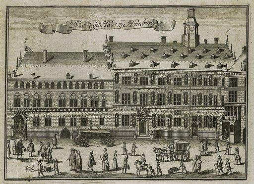
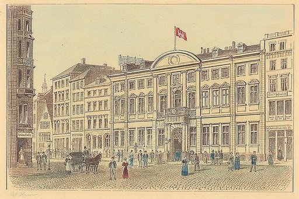
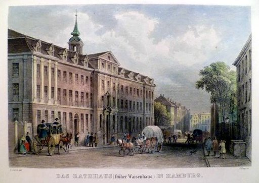

# Hamburger Rathaus

Das **Hamburger Rathaus** ist der Sitz der Bürgerschaft und des Senats der Freien und Hansestadt Hamburg. Das prachtvolle Gebäude am Rathausmarkt wurde in den Jahren 1886 bis 1897 unter der Leitung des Architekten Martin Haller im Stil der Neorenaissance errichtet. Der Turm hat eine Höhe von 112 Metern und ist neben den Türmen der Hamburger Hauptkirchen eine bedeutende Landmarke im Hamburger Stadtbild. An den Innenhof mit dem Hygieia-Brunnen schließt sich auf der Rückseite das Gebäude der Hamburger Börse und Handelskammer an.

## Geschichte

### Die Vorgänger

Das heutige Rathaus ist vermutlich das sechste Rathaus der Stadtgeschichte. Die beiden ersten entstanden um 1200 in der Neustadt am Hopfenmarkt und in der erzbischöflichen Altstadt westlich vor dem Dom. Nach der Vereinigung beider Städte entstand um 1230 ein gemeinsames Rathaus an der Ecke *Kleine Johannisstraße* / *Dornbusch*, das beim Stadtbrand von 1284 zerstört wurde. Einzig das Kellergewölbe blieb erhalten und diente als Ratsweinkeller und Weinlager. Das darauf errichtete Gebäude erhielt später den Namen Eimbecksches Haus, weil es eine Ausschank-Konzession für Einbecker Bier besaß. Der Ratsweinkeller stürzte 1842 beim Großen Brand zur Hälfte ein. Eine geborgene Bacchus-Figur steht noch heute im Rathaus am Treppenabgang zum Ratsweinkeller von der Großen Johannisstraße.

Um 1290 wurde ein viertes, größeres Rathaus auf dem *Neß* nahe der Trostbrücke erbaut (heute Standort des Hauses der Patriotischen Gesellschaft). Der auf einer Fläche von 26 mal 17 Metern mit einer zweigeschossigen Halle errichtete Backsteinbau wurde nach und nach erweitert. Das Niedergericht kam hinzu und zu Beginn des 17. Jahrhunderts ein Renaissance-Anbau. 1619 zog die Hamburger Bank mit ein. Dieses Gebäude-Ensemble in direkter Nachbarschaft zur alten Hamburger Börse bildete über mehrere Jahrhunderte das politische und wirtschaftliche Zentrum Hamburgs, lediglich unterbrochen von der Zeit der Zugehörigkeit Hamburgs zum französischen Kaiserreich 1811–14, als die Mairie vorübergehend im Görtz-Palais am Neuen Wall untergebracht war.

### Provisorien nach dem Großen Brand

Beim Großen Brand von 1842 wurde das Rathaus an der Trostbrücke gesprengt, um eine Brandschneise zu schaffen und das Feuer aufzuhalten. Die Sprengung gelang jedoch nur unvollständig und die Flammen, die in den Trümmern ausreichend Nahrung fanden, konnten sich über die Schneise weiter ausbreiten. Einige Standbilder von deutschen Kaisern, die seit 1640 an der Fassade dieses Rathauses eingefügt waren, sind erhalten geblieben und nun an der Außenfassade des Museums für Hamburgische Geschichte zu sehen. Auch sind mit Brandschutt verschmolzene Silberbarren des Silberschatzes im Phönix-Saal des Rathauses ausgestellt.

Nach der Zerstörung des alten Rathauses wurde das 1785 an der *Admiralitätstraße* erbaute und im Zweiten Weltkrieg zerstörte Waisenhaus zum provisorischen Rathaus und Sitz des Senats. Eine Gedenkplatte und ein Portalbogen vor Ort sind davon erhalten. Die Bürgerschaft (und ebenso die Hamburger Konstituante von 1848/50) tagte bis zur Fertigstellung des neuen Rathauses im großen Saal der Patriotischen Gesellschaft, dessen Haus 1847 an der Stelle des alten Rathauses errichtet wurde.

### Planung und Bau des heutigen Rathauses

Als Standort des neuen Rathauses wurde ein Platz an der *kleinen Alster*, auf der Rückseite der neuen Börse ausgewählt, die als einziges Gebäude in diesem Gebiet über den Brand gerettet wurde. Die Realisierung des Baus dauerte allerdings 43 Jahre von den ersten Wettbewerbsentwürfen 1854 (43 Entwürfe) und von 1876 (128 Entwürfe) über die endgültige Annahme 1884 bis zur Fertigstellung 1897. Das Fundament des Rathauses ist aufgrund der Bodenbeschaffenheit auf mehr als 4000 Eichenpfählen gegründet. Die Baukosten betrugen 11 Millionen Goldmark umgerechnet etwa 80 Millionen Euro.

Gebremst wurde das Vorhaben zunächst durch den vorrangigen Wiederaufbau der Stadt nach dem Brand, die politischen Umbrüche der Revolution von 1848/49, der Wirtschaftskrise von 1857, die deutschen Einigungskriege 1864–1871, die Folgen des Zollanschlusses Hamburgs an das Reich 1881–1888, den Bauarbeiter-Streik 1889 und die Choleraepidemie von 1892. Vor allem aber die Tatsache, dass viele Stimmen sich über die Gestaltung und den Bauplatz einbrachten, ohne eine Entscheidung zu treffen, führten zu großen Verzögerungen.

Eine Vielzahl bekannter Architekten war mit Entwürfen vertreten (z. B. Gottfried Semper, William Lindley, Alexis de Chateauneuf, George Gilbert Scott – Sieger 1854, Ludwig Bohnstedt, Julius Carl Raschdorff, Mylius & Bluntschli – Sieger 1876, Otto Wagner). Die konkrete Planung erfolgte schließlich durch den 1880 gegründeten *Rathausbaumeisterbund*, eine Gruppe von insgesamt neun Architekten unter der Leitung von Martin Haller. Neben Haller gehörten dem Rathausbaumeisterbund Leopold Lamprecht, Bernhard Hanssen, Emil Meerwein, Johannes Grotjan, Wilhelm Hauers, Hugo Stammann, Gustav Zinnow und Henry Robertson an. Der zweite Entwurf des Rathausbaumeisterbundes wurde schließlich genehmigt und ab 1886 in Form des heutigen Gebäudes ausgeführt.

> „Es sei mir gestattet, auch über das Aeussere des Gebäudes noch wenige Worte zu verlieren. Der Hauptbau ist im Stil deutscher Renaissance einheitlich durchgeführt. Die aus inneren Raumbedürfnissen allmälig hervorgegangene Vermehrung der Achsenzahl und das aus gleicher Rücksicht später hinzugefügte zweite Obergeschoss geben der Facade eine vorwiegend verticale Theilung und damit eine Harmonie mit dem aufstrebenden Thurm, welche unser ursprünglicher Plan vermissen liess. […]
> Der reiche Figurenschmuck in Bronce und Kupfer, wie ihn in gleicher Ausdehnung wohl kaum ein anderes Gebäude der Welt aufzuweisen hat, sowie die Stein statuen der Hoffacade und die von Denoth's Meisterhand geschaffenen Fensterbekrönungen des Hauptgeschosses beseitigen den monotonen Eindruck, welchen eine so häufige Wiederholung des gleichen Facaden-Systems hervorgerufen hätte. Die Form des Thurmhelms, das Product jahrelanger architektonischer Studien, lässt das weltliche Gebäude, schon aus der Ferne gesehen, sich wirksam von unsern zahlreichen Kirchen unterscheiden. - Dass der Fernblick von der Lombardsbrücke aus unter dem Zusammenfallen des Rathhausthurms mit demjenigen der Nicolaikirche leidet, ist vielleicht der einzige Vorwurf, welchen man jenen umsichtigen Männern machen kann, die s. Z. den schönen Plan zum Wiederaufbau der Stadt nach dem grossen Brande entwarfen.“

– Martin Haller: Vortrag zum Rathausbau vor dem *Verein für Kunst und Wissenschaft zu Hamburg* am 8. November 1897

### Zustand nach 1945

Trotz der massiven Bombardements Hamburgs während des Zweiten Weltkriegs blieb das Rathaus, abgesehen von einer geringen Beschädigung am Turm, völlig unversehrt, so dass der Originalzustand fast unverändert erhalten geblieben ist.

## Fassade

Der zweiflügelige Granit- und Sandsteinbau besitzt eine 111 Meter breite Fassade, dominiert von einem 112 Meter hohen Mittelturm, dessen Höhe der Breite des ganzen Gebäudes entspricht. Das Dach ist kupfergedeckt. Die Sandsteinanteile bestehen vor allem aus Wünschelburger Sandstein. Die Gesamtwirkung der Fassade entsteht durch die Kombination von italienischen und norddeutschen Renaissance-Elementen.

Das prächtige schwarze Eingangsportal mit üppigem Rankenwerk und verknäuelten Rosetten und Figuren ist ein Zeugnis der Kunstfertigkeit des Hamburger Kunstschmiedehandwerks.

Die kupferne Turmspitze krönt ein vergoldeter Reichsadler, seine vier Steingiebel verzieren vier in Kupfer getriebene Wappenfähnchen haltende Ritter.

Über den Erdgeschoss-Außenfenstern sind die Wappen diverser hanseatischer Familien angebracht.

### Der Phönix

Am Turmschaft zwischen der großen Turmuhr und dem Wappen von Hamburg erinnert die sogenannte *Phönix-Laube* an die große Brandkatastrophe Anfang Mai 1842. Fünfzig Jahre später wurde am 7. Mai 1892 das Richtfest des „neuen Rathauses“ gefeiert. Die von dem Bildhauer Aloys Denoth geschaffene vollplastische Phönix-Figur
breitet seine Flügel aus, um neugeboren aus dem Feuer aufzusteigen. Ein Medaillon darunter zeigt in vergoldeter Zeichnung das alte 1842 abgebrannte Rathaus mit der darüber schwebenden Parole *RESURGAM* (*ich werde wieder auferstehen*). Die darunter in Gold angebrachten Daten *1842-6.May-1892* markieren den Verlust des alten Rathauses im großen Brand und die Fertigstellung des neuen Rohbaus.

### Die Kaiser

Auf der Rathausmarktseite stehen zwischen den Fensternischen zwanzig Könige und Kaiser des Heiligen Römischen Reiches, von Karl dem Großen bis Franz II. jeweils 600 kg schwer in Bronze. Über den Monarchen thronen am Mittelturm die Darstellungen der bürgerlichen Tugenden: Tapferkeit, Frömmigkeit, Eintracht und Klugheit *(v.l.n.r.)*. Dass die bürgerlichen Tugenden oberhalb der Kaiser angeordnet sind, versinnbildlicht die Freiheit der Stadt Hamburg gegenüber der Krone, da Hamburg keine Kaiserstadt, sondern eine Hansestadt war. Über dem Haupteingang befindet sich zudem ein Mosaik, das die hamburgische Landesallegorie Hammonia darstellt.

Die chronologische Reihenfolge geht von Karl dem Großen über dem Hauptportal nach links über Ludwig den Frommen bis zu Lothar III v. Sachsen und nach rechts über Friedrich Barbarossa bis zu Franz II.

### Die bürgerlichen Berufe

Über 28 Fenster der Repräsentationsetage wurden auf die Fensterverdachung 28 Charakterbüsten für Vertreter der bürgerlichen Berufe gesetzt.

In diesen Figuren hat der Bildhauer Aloys Denoth bekannte Persönlichkeiten jener Zeit porträtiert. Heinz-Jürgen Brandt stellt in seinem Buch dar, dass diese Figurenreihe von den Zeitgenossen als willkommene Belebung der Fassade und als Darstellung des bürgerlichen Fleißes lebhaft begrüßt wurde.

Die Aufzählung hier beginnt an der Großen Johannisstraße und endet am Alten Wall. Entsprechend der Gliederung des Rathauses befinden sich auf der Rathausmarkt-Seite links das Bildnis des Bürgerschaftspräsidenten (Nr. 4) und rechts das Bildnis des Bürgermeisters (Nr. 21).

Im Folgenden sind Fotos der Fassade und alte Fotos der Gipsmodelle von Aloys Denoth *(mit geringfügigen Unterschieden zur endgültigen Ausführung)* zu sehen.

## Dachlandschaft

Als Bekrönungsfiguren auf dem Dach befinden sich die Schutzpatrone der fünf Hamburger Hauptkirchen, der ehemaligen Vorstädte und der beiden aufgelösten Klöster, die einst am Standort des heutigen Rathauses und der Börse bestanden:

- Katharina für die Katharinenkirche – geschaffen von dem Bildhauer Aloys Denoth (Hamburg) (1851–1893) (Rathausmarkt – links)
- Michael für die Michaeliskirche – geschaffen von dem Bildhauer August Vogel (Berlin) (1859–1932) (Rathausmarkt rechts)
- Petrus für die Petrikirche – geschaffen von dem Bildhauer Wilhelm Kumm (Berlin) (1861–1939?) (Alter Wall)
- Jakob für die Jacobi-Kirche – geschaffen von dem Bildhauer Engelbert Peiffer (Hamburg) (1830–1896) (Alter Wall)
- Nikolaus für die Nikolaikirche – geschaffen von dem Bildhauer Rudolf Thiele (Hamburg) (1856–1930) (Große Johannisstraße)
- Paulus für die Vorstadt St. Pauli – geschaffen von dem Bildhauer Robert Ockelmann (Dresden) (1859–1915) (Innenhof Nordwestgiebel)
- Georg für die Vorstadt St. Georg – geschaffen von dem Bildhauer Bruno Kruse (Berlin) (1855–?) (Innenhof Südostgiebel)
- Maria Magdalena für das Marien-Magdalenen-Kloster – geschaffen von dem Bildhauer Friedrich Offermann (Dresden) (1859–1913) (Große Johannisstraße)
- Johannes für das Johanniskloster – geschaffen von dem Bildhauer Otto Dobbertin (Hamburg) / Friedrich Offermann (Dresden) (1859–1913) (Große Johannisstraße)

Außerdem sind auf vier kleineren Giebeln zum Innenhof Schildknappen mit den Wappen der vier Hanse-Außenkontore (Brügge, Nowgorod, London und Bergen) zu sehen.

## Innenhof (Ehrenhof)

Zusammen mit der 1841 erbauten Börse hat das Rathaus einen prächtigen Innenhof, der vom *Alten Wall* und der *Großen-Johannis-Straße* aus öffentlich zugänglich ist. Der Innenhof mit seinen reichdekorierten Fassaden im Stil der italienischen und norddeutschen Renaissance und dem zentralen *Hygieia-Brunnen*, ist architektonisch gesehen einer der wohl anspruchsvollsten und gelungensten Plätze der Stadt (siehe unten).

In etwa zwölf Metern Höhe wird der Hof von sechs Nischenfiguren gesäumt. Die Figuren stellen **Bischöfe und Grafen** dar, die für die Geschichte der Stadt Hamburg von Bedeutung waren.

- Bischof Ansgar (801–865) – geschaffen von dem Bildhauer Arthur Boué (Berlin) (1868–1905)
- Bischof Adaldag (um 900–988) – geschaffen von dem Bildhauer Friedrich Everding (Bremen)
- Bischof Adalbert (um 1000–1072) – geschaffen von dem Bildhauer Wilhelm Wandschneider (Berlin) (1866–1942)
- Herzog Heinrich der Löwe (1129–1195) – geschaffen von dem Bildhauer Heinrich Möller (Dresden) (1835–1929)
- Graf Adolf III. von Schauenburg (1164–1225) – geschaffen von dem Bildhauer Robert Ockelmann (Dresden) (1859–1915)
- Graf Adolf IV. (1205–1261) – geschaffen von dem Bildhauer Carl Friedrich Echtermeyer (Braunschweig) (1845–1910)

## Hygieia-Brunnen

→ *Hauptartikel: Hygieia-Brunnen (Hamburg)*

Im Innenhof des Rathauses befindet sich der *Hygieia-Brunnen*, gestaltet 1895/1896 von dem Bildhauer Joseph von Kramer (1841–1908), einem Bruder von Theodor von Kramer. Die weibliche Bronzefigur, die *Hygieia*, eine Allegorie für Gesundheit, tritt auf einen Drachen, der symbolisch für die Choleraepidemie von 1892 steht. Auch praktisch steht dieser Brunnen für Hygiene, da sich in seinem Sockel die Einlässe des Belüftungssystems des Rathauses befinden. Ursprünglich war auf dem Platz eine Figur des Handelsgottes Merkur geplant. Nach der großen Choleraepidemie mit Tausenden von Toten entschied man sich aus Pietätsgründen jedoch für die Göttin der Reinheit. Die die Hygieia umgebenden Figuren stellen den Nutzen und die Verwendung des Wassers dar.

## Erdgeschoss

Insgesamt 647 Räume befinden sich im Rathaus. Neben Räumen für die Arbeit der Bürgerschaftsfraktionen und des Senates, der Haustechnik, Archiven und Bibliothek sind insbesondere die repräsentativen Säle des ersten Obergeschosses sehenswert. Sie sind ebenso wie die Außenfassade im Stil der Zeit mit allegorischen Darstellungen versehen und als Ausdruck des Bürgerstolzes der Stadtrepublik reich ausgestattet.

### Turmhalle

Vom Rathausmarkt kommt man durch das große schmiedeeiserne Eingangstor in die achteckige Turmhalle aus unverputztem geschliffenen Sandstein.

Das kunstvolle Eingangstor, ebenso wie das Tor zum sog. Senatsgehege, wurde in der Werkstatt des Schlossermeisters Eduard Schmidt, des ersten Vorsitzenden der Hamburger Gewerbekammer gefertigt. „Das Metall ist zu einem üppig wuchernden, nach allen Seiten züngelnden Rankenwerk mit dicht verknäuelten Rosetten ausgeschmiedet worden.“

Die acht Rippen des Gewölbes der Turmhalle zeigen – nach Art mittelalterlicher Baumeisterporträts – im Sockel die Brustbilder von jungen Handwerkern aus den Bauberufen mit ihren Zunftwappen: Maler, Schlosser und Tischler, Maurer, Steinmetz, Zimmermann, Glaser und Dachdecker. Sie wurden geschaffen von dem Bildhauer Carl Börner. Diese acht Handwerker waren tatsächlich am Bau beteiligt.

### Diele

Durch den Haupteingang erreicht man zunächst die Diele, eine große Säulenhalle. Hier beginnen auch die regelmäßig stattfindenden Führungen (auch fremdsprachliche) durch die repräsentativen Räume von Parlament und Senat, soweit dort stattfindende Veranstaltungen dies zulassen. Nach Anmeldung ist die Teilnahme als Zuschauer an Bürgerschaftssitzungen möglich. Zu ebener Erde angelegt, spiegelt die Diele das Regiment der Bürger architektonisch wider – im Gegensatz zu anderen Herrschaftshäusern soll der Bürger hier nicht zu den Machthabern hinaufsteigen müssen. Auf den Säulen der Diele befinden sich medaillonförmige Reliefs bürgerlicher Persönlichkeiten, die im Kontrast zu den Kaisern der Außenfassade die bürgerlichen Werte repräsentieren. Ausgewählt wurden Juristen, Theologen, Philologen, Historiker, Naturforscher, Kaufleute, Bankiers, Dichter, Maler, Architekten und „Wohltäter“. Ausschließlich aus der letzten Kategorie setzen sich die Bürgerinnen zusammen, die auf der so genannten *Frauensäule* abgebildet sind.

In der Reihenfolge des kleinen Buches von Harald Richert befinden sich an den Säulen und zusätzlich auch an der Wand zum Innenhof die Reliefporträts folgender „Verdienter Hamburger“ (Reihenfolge wie im Buch, von der Bürgerschaftstreppe zur Senatstreppe zurück zur Bürgerschaftstreppe und dann zum Innenhof).

1. Johann Klefeker (Jurist, 1698–1775)
2. Johann Carl Knauth (Jurist, 1800–1876)
3. Matthäus Schlüter (Jurist, 1648–1719)
4. Isaac Wolffson (Jurist, 1817–1895)
5. Hermann Baumeister (Jurist, 1806–1877)
6. Nicolaus Adolf Westphalen (Jurist, 1793–1854)
7. Erdmann Neumeister (Theologe, 1671–1756)
8. Johannes Aepin (Theologe, 1499–1553)
9. Johannes Bugenhagen (Theologe, 1485–1558)
10. Nikolaus Staphorst (Theologe, 1679–1731)
11. Joachim Heinrich Campe (Philologe, 1746–1818)
12. Johann Hinrich Wichern (Philologe, 1808–1881)
13. Hermann Samuel Reimarus (Philologe, 1694–1768)
14. Michael Richey (Philologe, 1678–1761)
15. Otto Beneke (Historiker, 1812–1891)
16. Johann Martin Lappenberg (Historiker, 1794–1865)
17. Johann Georg Büsch (Nationalökonom, 1728–1800)
18. Adolf Soetbeer (Historiker, 1814–1892)
19. Franz Encke (Astronom, 1791–1865)
20. Joachim Jungius (Naturforscher, 1587–1657)
21. Heinrich Hertz (Naturforscher, 1857–1894)
22. Carl Rümker (Naturforscher, 1788–1862)
23. Georg Heinrich Sieveking (Kaufmann, 1751–1799)
24. Johannes Schuback (Kaufmann, 1732–1817)
25. Heinrich Schröder (Kaufmann, 1784–1883)
26. Martin Johann Jenisch (Kaufmann, 1760–1827)
27. Salomon Heine (Bankier, 1767–1844)
28. Heinrich Johann Merck (Kaufmann, 1770–1853)
29. Peter Averhoff (Bankier, 1723–1809)
30. Caspar Voght (Kaufmann, 1752–1839)
31. Charlotte Paulsen (Fürsorgerin, 1797–1862)
32. Emilie Wüstenfeld (Sozialpädagogin, 1817–1874)
33. Mathilde Arnemann (Armenpflegerin, 1809–1896)
34. Amalie Sieveking (Frauenrechtlerin, 1794–1859)
35. Friedrich Gottlieb Klopstock (Dichter, 1724–1803)
36. Friedrich von Hagedorn (Dichter, 1708–1754)
37. Barthold Heinrich Brockes (Dichter, 1680–1747)
38. Gotthold Ephraim Lessing (Dichter, 1729–1781)
39. David Christopher Mettlerkamp (Bleidecker, 1774–1850)
40. Albert Methfessel (Musiker, 1785–1869)
41. Heinrich Barth (Forschungsreisender, 1821–1865)
42. Friedrich Christoph Perthes (Buchhändler, 1772–1843)
43. Johannes Brahms (Komponist, 1833–1897)
44. Friedrich Ludwig Schröder (Theaterdirektor, 1744–1816)
45. Carl Philipp Emanuel Bach (Komponist, 1714–1788)
46. Felix Mendelssohn Bartholdy (Komponist, 1809–1847)
47. Hermann Kauffmann (Maler, 1808–1889)
48. Philipp Otto Runge (Maler, 1777–1810)
49. Martin Gensler (Maler, 1811–1881)
50. Johannes Dalmann (Wasserbauingenieur, 1823–1875)
51. Andreas Schlüter (Bildhauer, 1662–1714)
52. Gottfried Semper (Architekt, 1803–1879)
53. Ernst Georg Sonnin (Architekt, 1713–1794)
54. Balthasar Denner (Maler, 1685–1749)
55. Christian Friedrich Wurm (Staatsrechtler, 1803–1859)
56. Gabriel Riesser (Jurist, 1806–1863)
57. Franz Andreas Meyer (Ingenieur, 1837–1901)
58. Moritz Heckscher (Jurist, 1797–1865)
59. Justus Brinckmann (Museumsdirektor, 1843–1915)
60. Alfred Lichtwark (Museumsdirektor, 1852–1914)
61. Albert Ballin (Reeder, 1857–1918)
62. Carl von Ossietzky (Politiker, 1889–1938)
63. Elise Averdieck (Sozialpädagogin, 1808–1907)
64. Johannes Wedde (Publizist, 1843–1890)

## Treppenhäuser

Von der Diele führen zwei große Treppenhäuser jeweils zum Senats- (rechts) bzw. Bürgerschaftsflügel (links). Die Diele ist öffentlich zugänglich. Am Aufgang zur Bürgerschaft, auf halber Treppe zum Plenarsaal, wurde 1981 eine Gedenktafel zur Erinnerung an die während der NS-Zeit ermordeten 25 Bürgerschaftsabgeordneten angebracht. Es waren 17 Abgeordnete der Kommunistischen Partei (KPD), fünf Abgeordnete der Sozialdemokratischen Partei (SPD) und drei aus bürgerlich-demokratischen Parteien, die durch Maßnahmen von SA- und SS-Einheiten, in den nationalsozialistischen Konzentrationslagern oder im Exil während der stalinistischen Säuberungen ihr Leben ließen.

### Das Senatstreppenhaus

Der Lebensbaum am Eingang des Senatsgeheges: Das goldene „Sandsteingewände“ um das Rankenwerk des schmiedeeisernen Gittertors hat eine gobelinartige kostbare Wirkung und leitet hinein in das prächtige Senatstreppenhaus. Was aber hat der Bildhauer Carl Börner zwischen den Eichenzweigen versteckt? Allerlei kleine Tiere, ein Eichhörnchen, einen Specht und am Scheitel des Bogens einen Uhu.

### Das Bürgerschaftstreppenhaus

An der Decke des Treppenhauses zum Sitzungssaal der Bürgerschaft sind 11 Gemälde des Malers Hermann de Bruycker (1858–1950). Sie zeigen, wie das Leben eines Hamburger Bürgers verlief, von seiner Geburt bis ins Alter – jedenfalls zur Zeit des Rathausbaues:

1. Kindheit
2. Jugendjahre
3. Gesellen- und Wanderjahre
4. Militärdienst
5. Hochzeit
6. Bürgereid
7. Familienleben
8. Handel
9. Bauen und Erhalten
10. Wissenschaft und Lehre
11. Alter und Tod

### Großer Festsaal

Den *großen Festsaal*, in dem alljährlich die Matthiae-Mahlzeit, das älteste Festmahl der Welt stattfindet, schmücken Bilder des Künstlers Hugo Vogel, die erst 1909 vollendet wurden. Der große Festsaal ist über das Senatstreppenhaus zu erreichen.

Vom Bürgerschaftstreppenhaus aus sind bei Rathausführungen folgende Räume im ersten Obergeschoss zugänglich bzw. einsehbar:

### Plenarsaal

Die *Lobby der Bürgerschaft* ist ein Vorraum zum Plenarsaal und wird als Treffpunkt während der Plenarsitzungen benutzt.

Der *Plenarsaal* dient den Sitzungen der Bürgerschaft. Der Plenarsaal wird seitlich flankiert von den Sitzungsräumen A und B für die Fraktionen und die Ausschüsse.

### Repräsentative Räume

Die Flucht der Räume mit Blick auf den Rathausmarkt zwischen Bürgerschaft und Senat beginnt mit dem *Bürgersaal*. Dort tagt der Ältestenrat der Bürgerschaft.

Es folgt der *Kaisersaal*. Es ist der zweitgrößte Saal im Rathaus. Er wurde bereits 1895 zur Einweihung des Nord-Ostsee-Kanals (ursprünglich *Kaiser-Wilhelm-Kanal* genannt) provisorisch fertiggestellt. Kaiser Wilhelm II dinierte hier. Der Kaisersaal ist Handel und Seefahrt gewidmet.

Im *Saal der Republiken/Turmsaal* findet der öffentliche Neujahrsempfang für Jedermann seitens des Ersten Bürgermeisters statt. Hier befinden sich die allegorischen Darstellungen der Stadtrepubliken Athen, Rom, Venedig und Amsterdam des Malers Ferdinand Wagner. Der Turmsaal liegt in der Mitte zwischen Bürgerschaft und Senat. Über ihm befindet sich der Rathausturm.

Der *Bürgermeistersaal* präsentiert Büsten Hamburger Bürgermeister des 19. Jahrhunderts und das Bild *Einzug des Hamburger Senats in das neue Rathaus im Jahr 1897*.

Das *Waisenzimmer* ist vielleicht nicht das prunkvollste, aber sicher eines der denkwürdigsten Zimmer. Hier schmücken, von 80 Knaben des Hamburger Waisenhauses (gegen Bezahlung), hergestellte Kerbholzschnitzereien Wände und Türen. Zudem wurde die Ausstattung der Räume durch zahlreiche Schenkungen von Hamburger Bürgern ergänzt.

Der *Phönix-Saal* erinnert an den Hamburger Brand und an den Wiederaufbau der Stadt nach dem Brand und dem Zweiten Weltkrieg. Die Wände sind mit einer rotgoldenen Velourstapete bedeckt. Im Phönixsaal finden einmal monatlich standesamtliche Trauungen statt. Zwei zusammengeschmolzene Silberbarren erinnern an den Großen Brand. An der Wand befindet sich ein Plan der Stadt, in dem die durch den Brand zerstörten Flächen rot gekennzeichnet sind.

Es folgt das kleine *Konferenzzimmer* mit Bildern von früheren Ratsherren.

Das *Bürgermeisteramtszimmer* liegt in der nördlichen Ecke des Rathauses und wird für Gespräche des Bürgermeisters mit Besuchern genutzt. Das Goldene Buch für Ehrengäste hat hier seinen Platz. Es ist eine Kassette in Form eines Buches mit losen Blättern aus bayerischem Büttenpapier. Vom 26. Oktober 1897, dem Datum der Rathauseröffnung, bis zum Jahr 2014 trugen sich hier 520 hochrangige Persönlichkeiten ein.

In der *Ratsstube* finden dienstags um 11:00 Uhr die Senatssitzungen statt. Die Ratsstube wird eingenommen von einem hufeisenförmigen Tisch, um den herum ledergepolsterte, genagelte Stühle mit Armlehnen angeordnet sind. An der Stirnseite befinden sich die etwas größeren Stühle für den Ersten und den Zweiten Bürgermeister. Die Bürgermeisterstühle werden durch einen Holzbaldachin und einen Wandbehang hervorgehoben. Daran nehmen die stimmberechtigten Bürgermeister und Senatoren teil, die beratenden Staatsräte sowie die Leitung der Pressestelle und zwei Protokollführer. Die Sitzungen finden ganzjährig statt. Es handelt sich um geschlossene Sitzungen. Der Zweite Bürgermeister vertritt im Bedarfsfall den Ersten Bürgermeister, der dienstälteste Senator den Zweiten Bürgermeister. Die Ratsstube wird durch ein Oberlicht mit Tageslicht erhellt (Erklärung: über dem Senat nur der Himmel).

Hinter der Ratsstube befindet sich die „Ratslaube“, ein kleiner Besprechungsraum für die Senatoren. Als besonderen Schmuck hat sie auf der Straßenseite zum Alten Wall Glasmalereien über die Seefahrt und zu Neuwerk, die gegenüberliegende Seite ist mit Wandkacheln in Delfter Blau mit Darstellungen der Schlösser in Bergedorf und Ritzebüttel versehen. Die Laube wird nur für Besprechungen im kleinen Kreis genutzt und ist nicht Bestandteil von Rathausführungen. In der blauen Stunde sind die Glaskunstbilder vom Alten Wall manchmal gut zu erkennen.

Die Silberkammer mit dem *Hamburger Silberschatz* ist nur in Sonderführungen zu besichtigen. Es beherbergt Silber-Stiftungen aus den letzten ca. 150 Jahren.

Das Senatstreppenhaus führt hinab zur Rathausdiele.

## Zweites Obergeschoss

Vom zweiten Obergeschoss aus sind die Bürgerschaftslogen, die Senatslogen und die Pressetribüne des Plenarsaals zu erreichen. Hier befindet sich auch das Rathaus-Studio des NDR.

## Die Restaurierung des Rathauses vor dem Jubiläum 1997

Rechtzeitig vor dem großen Jubiläum im Jahr 1997 wurde das Rathaus umfangreich renoviert. Es gelang Bürgermeister Henning Voscherau mit Senat und Bürgerschaft, die Medien sowie viele Hamburger Bürger und Unternehmen für diese große Aufgabe zu gewinnen. Die Medien (insbesondere das Hamburger Abendblatt) berichteten ausführlich. Eine Überraschung war die plötzlich wiederbelebte Fassade des Rathauses. Da das Rathaus nach über 90 Jahren und zwei Weltkriegen schwarz geworden war, konnte man die liebevollen Details nicht mehr wahrnehmen. Senat und Bürgerschaft bedankten sich u. a. durch die Nennung der Namen aller Spender in der Turmhalle.

Für die zahlreichen Baustellen seien hier drei besondere Projekte genannt:

### Die Kaiserstatuen

Es gelang Bürgermeister Voscherau, Paten für die Restaurierung der 20 Kaiser zu finden – ohne, dass ihnen vorher bekannt war, wie groß der Umfang sein würde (und wie viel es kosten würde – nämlich 75.000 DM pro Kaiser – insgesamt also 1,5 Mio. DM). Die Arbeiten führte die Restauratorin Betina Roß durch.

### Die Ledertapeten von Georg Hulbe

Der Lederkünstler Georg Hulbe hatte bereits den Berliner Reichstag mit Ledertapeten ausgestattet und für das Gestühl gepunztes Leder gefertigt. Sie gefielen den Hamburgern so gut, dass Hulbe auch für das neue Hamburger Rathaus sein Können einsetzen sollte. So bekamen der Kaisersaal und der Bürgermeistersaal Ledertapeten und ebenfalls das Gestühl erhielt das gepunzte Wappen von Hamburg. Nach fast 100 Jahren war es dringend notwendig, sie zu restaurieren und teilweise zu ergänzen. Die spezialisierte Hamburger Lederpunzer-Werkstatt *"Vanino & Henkel"* führte diese Arbeiten durch.

### Das Bürgermeisterfenster im Bürgermeisteramtszimmer

Für das Bürgermeisteramtszimmer schuf der Münchner Glasmaler Gustav van Treeck 1897 nach eigenen Entwürfen die Dreiviertelporträts der drei Bürgermeister Johannes Versmann, Johannes Christian Eugen Lehmann und Johann Georg Mönckeberg (Politiker, 1839) mit deren Familienwappen und ihren Wahlsprüchen. Diese Fenster wurden durch den Krieg vernichtet. Anlässlich der Renovierung des Hamburger Rathauses zum Jubiläum 1997 wurden diese Fenster nach einem alten Foto durch das Hamburger Glaskunstatelier Hempel rekonstruiert.
