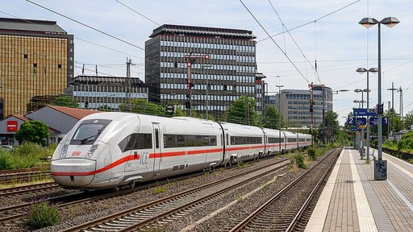
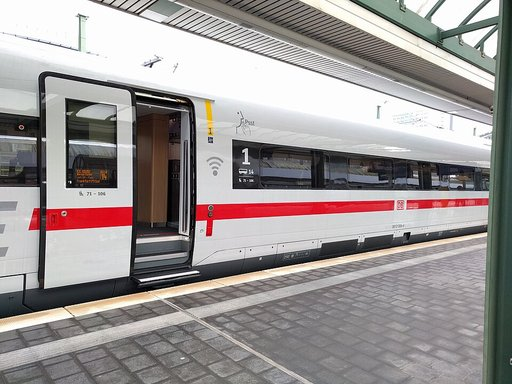
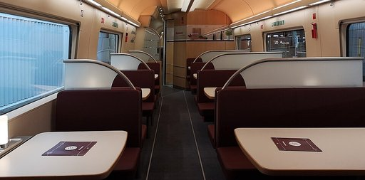

# ICE 4

Als **ICE 4** bezeichnet die Deutsche Bahn einen Typ der Hochgeschwindigkeitszüge Intercity-Express (ICE) für den Personenfernverkehr, der seit 2017 im Einsatz ist. Bis September 2015 wurden die Züge unter ihrem Projektnamen als **ICx** geführt. Mit der Entwicklung und dem Bau von 137 Zügen wurde Siemens Mobility beauftragt. Die Baureihenbezeichnung für die Triebwagen ist **412** und für die antriebslosen Mittel- und Steuerwagen **812**. Zwölfteilige Einheiten verkehren seit Dezember 2017 im Regelbetrieb, siebenteilige seit Dezember 2020. Im Februar 2021 wurde erstmals ein dreizehnteiliger Zug im Fahrgastbetrieb eingesetzt. Der zuletzt gefertigte ICE 4 ist seit Februar 2024 in Betrieb.

## Fahrzeuge

Die Züge sind Triebzüge (ohne Lokomotiven) für den Personenverkehr. Sie werden, anders als die ersten beiden ICE-Baureihen, über mehrere eigenständige angetriebene Wagen, die über die Zuglänge verteilt sind, angetrieben. Im Gegensatz zu den Einheiten der Bauarten ICE T und ICE 3 ist die Traktionsausrüstung jedoch nicht mehr auf mehrere Wagen verteilt.
Die Triebwagen sind an den Drehgestellen mit außengelagerten Radsätzen erkennbar. Die innere und äußere Form der Fahrzeuge entspricht im Wesentlichen dem ICE-Standard. Im Unterschied zu allen bisherigen ICE-Zügen werden die mit rund 28 Metern längeren Wagenkästen der ICE-4-Flotte aus Stahl gefertigt. Dabei wird – erstmals im Stahl-Schienenfahrzeugbau – Laserschweißtechnik verwendet.
Das Design wurde von der Deutschen Bahn, Bombardier und Siemens gemeinsam entwickelt. Das Außendesign der Züge wurde 2015 mit dem Red Dot Design Award ausgezeichnet. Ebenfalls für das Außendesign wurde der ICE 4 mit dem German Design Award 2016 in der Kategorie Transportation ausgezeichnet.

### Konfigurationen

Die Triebzüge werden aus sechs Wagentypen gebildet:

- nicht angetriebene Endwagen (Steuerwagen)
- angetriebene Mittelwagen
  - Sitzwagen
  - Servicewagen mit Stromabnehmer
- nicht angetriebene Mittelwagen
  - Sitzwagen
  - Sitzwagen mit Stromabnehmer
  - Bordrestaurant

Neben den Grundkonfigurationen aus sieben beziehungsweise zwölf Wagen sind 22 weitere Zusammenstellungen aus 5 bis 14 Wagen vom Hersteller vorgesehen.

**Legende:**

- 1 = 1. Klasse
- 2 = 2. Klasse
- EW = Endwagen
- MW = Mittelwagen
- RW = Restaurantwagen
- **TW** = Traktionswagen (Powercar), jeweils zwei angetriebene Drehgestelle mit je 37,5 kN Zugkraft und 825 kW Dauerleistung
- -H = Hilfsbetriebe
- -P = Stromabnehmer (Pantograph)
- -R = Mehrzweckabteil / Kleinkindabteil
- ZUB = Zugbegleiterabteil

Zwei siebenteilige Triebzüge können in Doppeltraktion verkehren. Fünfteilige Einheiten sollen dabei mit zwei angetriebenen Wagen gebildet werden, sechs- und siebenteilige mit drei, acht- und neunteilige mit vier, zehn- bis zwölfteilige mit fünf bzw. sechs sowie dreizehn- und vierzehnteilige mit sechs bzw. sieben angetriebenen Wagen. Zugelassen werden sollen zunächst vier dieser zusätzlichen Varianten. Eine vierzehnteilige Einheit wäre 400 Meter lang.

Die Garnituren werden aus fünf verschiedenen Wagentypen gebildet. Die Mittelwagen der zweiten Klasse sind in beiden Varianten baugleich. Der nur in zehnteiligen Zügen vorgesehene Mittelwagen erster Klasse wird aus diesen Wagen abgeleitet.

Die Mittelwagen sind 28,75 Meter lang, die Endwagen 29,11 Meter. Damit sind sie länger als die meisten bisherigen Intercity-Wagen, die eine Länge von 26,4 Meter haben. Durch die verlängerten Wagen besteht ein 200 Meter langer Zug nicht mehr aus acht, sondern aus sieben Wagen. Der Zug hat bei gleicher Zuglänge einen Wagenübergang weniger, was Platz für fünf zusätzliche Sitzreihen schafft. Platz für weitere Sitzreihen entstand durch ein verändertes Sitzkonzept, den Wegfall größerer Elektronikschränke im Fahrgastraum sowie eine veränderte Anordnung von Funktionsflächen (beispielsweise Fahrradabteilen).

Die äußere Wagenkastenbreite beträgt 2852 Millimeter, die innere 2642 Millimeter. Die Einstiege sind auf Bahnsteighöhen zwischen 550 und 760 Millimeter über SO ausgelegt. Die Züge sind für Umgebungstemperaturen zwischen −25 und +45 °C ausgelegt.

Die folgende Übersicht zeigt die technischen Daten der geplanten und gebauten Konfigurationen:

### Aufbau der real umgesetzten ICE 4

Die zwölfteiligen Triebzüge erhalten Triebzugnummern, deren Zählung bei *9001* beginnt. Sie werden aus angetriebenen Mittelwagen der Baureihe 412 und antriebslosen Mittel- und Endwagen der Baureihe 812 gebildet. Die siebenteiligen Triebzüge erhalten Triebzugnummern von *9201* bis *9237*, die dreizehnteiligen Triebzüge haben die Triebzugnummern *9451* bis *9500* erhalten.

Folgende Tabelle gibt eine Übersicht über den Aufbau der ICE-4-Triebzüge. Angetriebene Wagen sind hervorgehoben, jene mit Stromabnehmer kursiv. Beim siebenteiligen Triebzug ist die erste Ziffer der Ordnungsnummer unterschiedlich, da dieser planmäßig in Mehrfachtraktion verkehren soll.

Seit 2018 gibt es drei Vorzugsvarianten, die aus einem zwölfteiligen Zug gebildet werden können. Alle drei Varianten sollten 2018 zugelassen werden, um im Folgejahr bei Bedarf zum Einsatz kommen zu können.
Im März 2019 wurde in den Triebzug 9014 versuchsweise ein dreizehnter Wagen, ein Triebwagen der Baureihe 2412 zwischen den Wagen 3 und 4 eingestellt, um damit Versuchsfahrten unter anderem zu Störstrom- und Bremswegemessungen zu absolvieren. Beim ersten komplett 13-teilig ausgelieferten Triebzug 9451 befindet sich der gegenüber den zwölfteiligen Einheiten neu hinzu gekommene Wagen 2412 751 hingegen an der Position 2 nach dem Endwagen der zweiten Klasse. Der erste als siebenteilig geplante Triebzug 9201 wurde für Versuchszwecke aus sechs Wagen gebildet. Während der Zulassungsfahrten im März 2019 fehlte der Bistrowagen 8812 201.

### Ausstattung

Die zwölfteiligen Triebzüge der Baureihe 412 umfassen 830 reguläre Sitzplätze und zwei Klappsitze. Die Wagen sind als reine Großraumwagen ausgebildet. Im Unterschied zu früheren ICE-Zügen verfügen die ICE 4, abgesehen von Kleinkindabteilen, über keine regulären Abteile mehr. Die Deutsche Bahn begründete dies mit einer seit den 1980er Jahren zurückgehenden Nachfrage nach Abteilplätzen.

Die Sitzplatznummern sind an der Lehne zum Gang angebracht und verfügen über eine taktile Oberfläche (Brailleschrift), die für Blinde lesbar ist. Beim Zurücklehnen klappen die Sitze nicht mehr zurück, stattdessen schiebt sich der Sitz in seiner Sitzschale nach vorne. In den Zügen sind auch fensterlose „Wandfensterplätze“ vorhanden. Etwa jeder dritte „Fensterplatz“ bietet kein Fenster oder eine eingeschränkte Aussicht. Eine flexible Konstruktion ermöglicht die nachträgliche Anpassung von Sitzabständen.

Es sind zwei Einstiegsbereiche (vier Außentüren) je Wagen vorhanden, mit Ausnahme bei den Speisewagen, die mit beidseitigen Ladetüren ausgerüstet sind. Im Servicewagen steht dabei beidseitig je ein Hublift für Rollstuhlfahrer zur Verfügung. 22 Sitzplätze sind im Bordrestaurant des Speisewagens vorhanden (in 7-teiligen Zügen nur 16 Sitzplätze), im selben Wagen befinden sich auch ein Stehbistro sowie Rollstuhl-Stellplätze. Die Züge verfügen über 24 Toiletten (zwei je Wagen mit Ausnahme des Restaurantwagens, darunter eine Personal- und eine barrierefreie Toilette im Servicewagen). Im Servicewagen sind ferner ein Zugbegleiterabteil, ein Pausenraum, ein Kleinkindabteil, ein Familienbereich und ein Rollstuhlbereich untergebracht.

Die Züge verfügen über einen Internetzugang. Die Außenanbindung erfolgt über mehrere Mobilfunkanbieter gleichzeitig. Mobilfunkverstärker wurden ebenso eingebaut.

Neben der weißen Hauptbeleuchtung wird an der Decke der Wagen eine tageszeitabhängige Beleuchtung durch rote, grüne und blaue LEDs erzeugt. Dabei sind 152 verschiedene Lichtakzente möglich. Neben farbigem Licht wird auch rein weißes Licht erzeugt.
Zur Fahrgastinformation sind bis zu sechs Bildschirme je Wagen vorhanden. In den Wagen sind in Deckengondeln TFT-Bildschirme (19 Zoll) und in den Einstiegsbereichen 15-Zoll-Bildschirme verbaut. Das Fahrgastinformationssystem kann automatische, mehrsprachige Ansagen erzeugen. Erstmals in der ICE-Flotte werden Reservierungsdaten beim ICE 4 nicht mehr per Diskette, sondern per Funk eingespielt.

Die Klimaanlagen der Züge sind für Außentemperaturen von −25 bis +45 °C ausgelegt. Zwischen −20 und +40 °C Außentemperatur soll es keine Komforteinschränkungen geben. Je Wagen sind im Dachbereich zwei Kaltdampf-Klimakompaktgeräte von Faiveley Transport eingebaut, die auch einzeln arbeiten können.

#### Erste Klasse

Auf die erste Wagenklasse entfallen 205 Sitzplätze, dies sind ein Viertel der vorhandenen Plätze des Triebzugs. Diese befinden sich in den vier Wagen 10 bis 14, wobei im Wagen 10 zudem Bordrestaurant und -bistro untergebracht sind. Die Wagen 11 bis 14 verfügen jeweils an einem Wagenende über „abteilähnliche Bereiche“, wobei es sich um jeweils sechs bis acht abgetrennte Großraumplätze handelt. Der Endwagen der ersten Klasse ist als Ruhebereich ausgewiesen.

Der Sitzabstand der Reihensitze beträgt in der ersten Klasse 930 mm und entspricht damit dem Sitzabstand der zweiten Klasse in den ICE 1 und ICE 2; der Sitzteiler vis-à-vis beträgt 2000 mm. Die Kniefreiheit wird mit 900 mm angegeben. Die lichte Weite des Mittelganges in der ersten Klasse beträgt 620 mm und entspricht damit in etwa der Breite des Mittelgangs in der zweiten Klasse früherer ICE-Bauarten (ICE 1 und ICE 2). In der ersten Klasse sind die Rückenlehnen um bis zu 38 Grad neig- und die Sitzfläche um fünf Zentimeter nach vorn ausziehbar. Jeder Sitzplatz der ersten Klasse verfügt über eine eigene Steckdose. Im Gegensatz zur zweiten Klasse verfügen die Plätze der ersten auch über Leseleuchten und Fußstützen.

#### Zweite Klasse

Auf die zweite Wagenklasse entfallen die ersten acht Wagen eines jeden Triebzuges, hier finden sich 627 Sitzplätze. Diese sind mit Ausnahme des Kleinkindabteils ausschließlich in Großraumbereichen angeordnet. Die Wagen zwei bis sieben umfassen jeweils 88 Sitzplätze in 26 Reihen, unterbrochen durch vier große (versetzt zueinander angeordnete) Gepäckregale.
Die Endwagen der zweiten Klasse verfügen über 61 Sitze (hiervon zwei Klappsitze), davon entfallen acht Plätze auf einen „Abteilbereich“ genannten Großraum hinter dem Führerstand. Im Gegensatz zu den meisten anderen ICE-Baureihen verfügen die ICE-4-Einheiten in diesen Wagen über acht Fahrradstellplätze.
Der Servicewagen (Wagen 9), der sich an das Bordbistro anschließt, bietet 38 Sitzplätze. 33 hiervon entfallen auf einen Großraum, der überwiegend als Familienbereich ausgewiesen ist, aber auch die vier Rollstuhlstellplätze umfasst. Fünf Sitzplätze sind im Kleinkindabteil zu finden. Hier und im Familienbereich befinden sich Stellplätze für Kinderwagen.

Der Sitzabstand in der zweiten Wagenklasse umfasst bei den Reihensitzen 856 mm und fällt damit gut 7 cm enger aus als in früheren ICE-Generationen (Beispiel ICE 1); der Sitzteiler bei Vis-à-vis-Plätzen beträgt 1900 mm. Die Sitzbreite zwischen den Armlehnen ist mit 460 mm unwesentlich geringer bemessen als in den bisherigen ICE-Baureihen. Die Kniefreiheit wird mit 826 mm angegeben. Mit nur 509 mm fällt die Gangbreite gut zehn Zentimeter geringer aus als in den ICE 1. Die Breite der Armlehnen wurde ebenfalls reduziert, sie liegt bei nur noch 40 bis 60 Millimetern. Die Rückenlehnen der Sitze der zweiten Klasse sind um bis zu 32 Grad neigbar. Die Sitztiefe ist nicht mehr verstellbar. Je Doppelsitz der zweiten Klasse ist eine Steckdose angebracht.

### Antrieb

Die angetriebenen Mittelwagen werden als *Powercars* bezeichnet und nehmen je einen Transformator, einen Traktionsstromrichter, einen Hilfsbetriebeumrichter und vier Fahrmotoren auf. Die Triebwagen der beiden Zugvarianten unterscheiden sich lediglich in ihrer Getriebeübersetzung für die beiden vorgesehenen Höchstgeschwindigkeiten.

Transformator und Stromrichter werden über eine gemeinsame Kühlanlage mit Öl bzw. Wasser gekühlt. Die Gleichstromkomponenten der mehrsystemfähigen Züge werden in nicht angetriebenen Mittelwagen unterflur angebracht. Die installierte Traktionsleistung je angetriebenen Mittelwagen liegt bei 1,65 Megawatt. Jeder Zug hat zwei Stromabnehmer für das Netz der DB und der ÖBB mit einer Palettenbreite von 1950 mm, die auf dem Mittelwagen 2 und dem Antriebswagen 2 ZUB untergebracht sind. K3s-Züge mit SBB-Ausrüstung erhalten auf diesen Wagen je einen Stromabnehmer für das Netz der SBB mit einer Palettenbreite von 1450 mm.

### Fahrzeugsteuerung und Zugbeeinflussung

Die Kommunikation innerhalb der Wagen sowie innerhalb des Zugverbandes erfolgt auf Basis des Bahnautomatisierungssystems *SIBAS PN*. Das Train Communication Network besteht hierarchisch aus den beiden Netzwerkebenen Zugbus ETB (Ethernet Train Bus) und Wagenbus PROFINET. Über Knoten (sog. Gateways) sind die Wagenbusse mit dem Zugbus verbunden. Beide Systeme basieren auf Ethernet. Der Zugang zu einzelnen Komponenten erfolgt über einen webbasierten Zugang. Ebenfalls per Ethernet wurde ein Netzwerk aufgebaut, mit dem beispielsweise WLAN oder Unterhaltungsangebote übertragen werden. Durch die Trennung der Netzwerke für Fahrzeugsteuerung und Fahrgastinformation soll auf neue Anforderungen schneller reagiert werden können.

Als Zugbeeinflussungssysteme sind die punkt- (PZB) und die linienförmige Zugbeeinflussung (LZB) sowie ETCS vorgesehen. Anfang November 2018 wurde die Zulassung für den ETCS-Betrieb in Deutschland bekanntgegeben.

### Drehgestelle

Die angetriebenen Mittelwagen sitzen auf Triebdrehgestellen. Diese wurden von Siemens auf Basis des SF500 konstruiert und besitzen je zwei Fahrmotoren.
Diese übertragen über eine Bogenzahnkupplung und ein achsreitendes Stirnradgetriebe das Drehmoment auf die Radsätze.
Der Rest des Zuges rollt auf Laufdrehgestellen.

Im Gegensatz zu früheren ICE-Baureihen laufen die antriebslosen Wagen auf (leichteren) Laufdrehgestellen mit innengelagerten Radsätzen. Die Laufdrehgestelle sollen eine aktive Radsatzsteuerung zur radialen Einstellung der Radsätze im Bogen erhalten. Sie werden von Bombardier Transportation geliefert. Ein modularer Aufbau ermöglicht, ganze Baugruppen zu tauschen und außerhalb des Zuges zu reparieren.

Mit voll funktionsfähigen Bremsen verfügen die Triebzüge in Bremsstellung Rel+Mg über 195, in Rel über 175 und in R über 141 Bremshundertstel.

### Sonstiges

Die siebenteiligen Züge werden nach TSI-Klasse 2 ausgelegt, die zwölfteiligen nach Klasse 1. Die Zulassung nach Klasse 1 erfordert unter anderem eine erweiterte Bremsausrüstung und eine Achslagerüberwachung. Ferner sind die Anforderungen in Bezug auf Luftdruckschwankungen größer.

Die maximale Steigung beträgt 40 Promille, der kleinste befahrbare Bogenradius 150 Meter.

Die Bodenwannen erhalten eine Schlagschutzbeschichtung gegen Schotterflug.

Die Führerstandsenden der Steuerwagen erhalten wie alle Triebzüge des Hochgeschwindigkeitsverkehrs Scharfenbergkupplungen des Typs 10, die Endwagen 6812.2 und 7812.2 für die siebenteiligen Einheiten wegen des vorgesehenen Einsatzes in Mehrfachtraktion zusätzlich Kontaktaufsätze.

## Geschichte

### Ausschreibung

Die Ausschreibung der ICE-4-Züge erfolgte unter dem Arbeitstitel *ICx* ab Sommer 2008. Nach eigenen Angaben handelte es sich dabei um die bislang größte Ausschreibung der Bahn. Die Planungen aus dem Jahr 2008 sahen vor, dass mit den neuen Triebzügen bis etwa 2020 die Garnituren der Intercity/Eurocity-Züge ersetzt werden, bis 2025 die Fahrzeuge der ICE 1 und 2. Später könnten auch die ICE 3 optional durch ICE-4-Züge ersetzt werden. Dem rund 300-seitigen, technisch-funktionalen Lastenheft der Ausschreibung lagen dabei rund 8900 Einzelanforderungen zu Grunde. Diese wurden aus rund 900 Gesichtspunkten eines betrieblich-kommerziellen Lastenheftes des zukünftigen Betreibers abgeleitet, wobei es hier beispielsweise um Einsatz, Aussehen, Sitzplätze, Komfort, aber auch um die Instandhaltung geht. Die detaillierten, funktionalen Vorgaben sollen Qualität gewährleisten, für die Umsetzung dieser Vorgaben ist die herstellende Industrie verantwortlich. 27 Prozent der Kriterien sind dabei zwingend zu erfüllen, 22 Prozent sind aus Sicht des Bestellers wünschenswert, drei Prozent sind optional vorgesehen. In das Konzept flossen Fahrplankonzepte und Nachfragekonzepte für die Jahre 2015, 2020 und 2025 ein. Für die ICE-Nachfolgerzüge war in der Ausschreibung zunächst noch eine Höchstgeschwindigkeit von 250 km/h vorgesehen, zudem war eine Höchstgeschwindigkeit von 280 km/h als Option anzubieten. Nach dem Planungsstand von 2009 sollten ab 2012 zwei Vorserienzüge fahrplanmäßig im Testbetrieb eingesetzt werden.

Die Entwicklungskosten sollten vollständig von der Industrie getragen werden und die Züge erst bei Abnahme bezahlt werden. Eine Vorfinanzierung, wie sie bis dahin üblich war, war nicht vorgesehen. Die Deutsche Bahn erwartete deutlich niedrigere Kosten je Sitzplatz als bei den bisherigen ICE-Zügen. Angestrebt wurden 2009 (zum Preisniveau von 2015) Kosten je Sitzplatz von etwa 25.000 Euro – wenig oberhalb des Niveaus des hochwertigen Regionalverkehrs. Über so genannte *Qualitätsmeilensteine* sollte die Qualität der beschafften Züge sichergestellt werden.
Der Auftrag sollte an einen einzelnen Anbieter, nicht jedoch an ein Konsortium vergeben werden, um Mehrkosten und unklare Zuständigkeiten zu vermeiden.

### Vergabe

Sechs Bieter zeigten Interesse, unter anderem Alstom mit dem AGV und dem TGV Duplex. Zwei Bieter machten konkrete Angebote, über die verhandelt wurde: Ein Konsortium aus Siemens und Bombardier forderte rund sechs Milliarden Euro für die rund 300 Züge, während Alstom mit verschiedenen Ausstattungsvarianten im Umfang von fünf bis acht Milliarden Euro antrat. Das Alstom-Angebot habe nicht den Anforderungen der Ausschreibung entsprochen.

Als Ende Januar 2010 Siemens als *bevorzugter Anbieter* genannt wurde, wurde vorgesehen, dass Bombardier als Zulieferer von Siemens mehr als ein Drittel der Leistungen des Gesamtauftrages erbringen solle. Der Auftrag sollte ab 2013/2014 zum Tragen kommen und die Produktionskapazität von Siemens am Standort Krefeld-Uerdingen bis 2025 auslasten.

Es folgten langwierige Preisverhandlungen, die sich über das Jahr 2010 hinaus hinzogen, weil die Preisvorstellungen von DB und Industrie weit auseinander lagen. Bahnchef Rüdiger Grube schloss dabei eine Neuausschreibung des Auftrags nicht aus, soweit keine Einigung erzielt werden könne. Nach Informationen aus dem Unternehmen pochte die DB in den Verhandlungen auf einen Preis je Sitzplatz von 30.000 Euro.
Strittig waren zudem Haftungsregeln, mit denen sich die Bahn nach den Erfahrungen mit Pannen bei ICEs umfassend absichern wollte.

### Beschaffung

Im April 2011 einigten sich die Vorstände von DB und Siemens über den Kauf. Am 21. April 2011 stimmte der Aufsichtsrat der Deutschen Bahn dem Vertrag mit einem Auftragsvolumen von fünf Milliarden Euro zu. Die Deutsche Bahn bestellte dabei sofort 130 Zuggarnituren, die ab Ende 2016 ausgeliefert werden sollten. Im Rahmen des bis 2030 laufenden Vertrags waren Konditionen zum Kauf weiterer Züge festgelegt. Bombardier fungierte dabei als *bevorzugter Zulieferer*, mit einem wertmäßigen Anteil am Gesamtauftrag von rund einem Drittel. Der Kaufpreis werde ohne Anzahlung in Raten bezahlt, wobei 60 Prozent des Kaufpreises bei Ablieferung fällig werden.

Am 9. Mai 2011 wurde das achttausendseitige Vertragswerk vom Vorstandsvorsitzenden der DB, Rüdiger Grube, und dem Vorsitzenden des Vorstandes der Siemens AG, Peter Löscher, unterzeichnet. Das Auftragsvolumen für die ersten 220 Triebzüge betrug 6,3 Mrd. Euro. Auf den Zulieferer Bombardier entfielen davon 2,1 Mrd. Euro. Es war der größte jemals in Deutschland erteilte Auftrag für die Bahnindustrie, der größte Auftrag der Deutschen Bahn sowie der größte Auftrag für Siemens.

Gemäß Rahmenvertrag waren ursprünglich bis zu 300 Züge einschließlich der Lieferungen nach dem Jahr 2020 vorgesehen. 130 fest bestellte Züge sollten von 2017 bis 2020 geliefert werden. Mitte September 2013 wurde durch einen Pressebericht bekannt, dass die Deutsche Bahn im Zuge von „Leistungsänderungen“ bereits Anfang 2013 die Zahl der nach 2020 zu beschaffenden Züge um 31 auf 59 reduziert hatte. Der Wert der abbestellten Züge wurde mit einer Milliarde Euro angegeben. An deren Stelle würden Doppelstockzüge von Bombardier beschafft. Damit könnten mehrere hundert Millionen Euro eingespart werden.

Zunächst wurde ein Vorführmodell eines Endwagens im Maßstab 1:1 hergestellt, um die Verwendbarkeit der Sitzplatzanordnungen und Komforteinrichtungen durch Versuchspersonen testen zu lassen.
Auf der InnoTrans 2012 zeigte die Deutsche Bahn an ihrem Stand erstmals das Modell. Seit Ende 2013 ist dieses Modell und das eines weiteren Wagens im DB-Museum Nürnberg ausgestellt.

Für die Aus- und Fortbildung wurde die Beschaffung eines entsprechenden Simulators für rund 1,8 Millionen Euro vereinbart. Dessen Aufbau in Fulda wurde im April 2017 begonnen, gefolgt von der Inbetriebnahme.

Die erste Serie von 130 Triebzügen sollte 45 sieben- und 85 zwölfteilige Triebzugeinheiten umfassen. Sie sollen die Intercity-Garnituren mit Wagen aus den Baujahren 1971 bis 1991 ersetzen. Eine Zulassung für Deutschland und Österreich für alle ICE 4 sowie zusätzlich für die Schweiz für die zwölfteiligen Triebzüge ist vorgesehen.[veraltet]
Die geplanten 59 Garnituren der zweiten Serie sollten bis 2025 die heutigen ICE-1- und ICE-2-Züge ersetzen. In dem im März 2015 vorgestellten Fernverkehrskonzept der Deutschen Bahn ist die Beschaffung dieser zweiten Serie bis 2030 nicht vorgesehen. Die Züge der zweiten Serie sollen für Deutschland, Österreich und die Schweiz zugelassen werden. Eine Zulassung für Frankreich, Luxemburg, Italien, Polen und Tschechien war als Option vorgesehen. Eine optional vorgesehene dritte Tranche sollte als Ersatz der ICE 3 dienen. Dazu waren 80 Garnituren mit einer Höchstgeschwindigkeit von 249 km/h vorgesehen. Die erste Serie aus dem bis Ende 2030 laufenden Rahmenvertrag wurde mit Vertragsunterzeichnung abgerufen, die Beschaffung der zweiten Serie war fest geplant. Die Option für die dritte Tranche konnte jederzeit eingelöst werden.

Anfang April 2017 wurde der Vertrag erneut überarbeitet und es erfolgte eine Bestelländerung auf 100 zwölf- sowie 19 siebenteilige Einheiten. Diese Änderung wurde im Hinblick auf zu erwartende höhere Reisendenzahlen getroffen. Im Juni 2018 sollte der Aufsichtsrat der DB entscheiden, ob zusätzliche ICE-4-Triebzüge bestellt werden sollen. Um ein über bisherige Planungen hinausgehendes Fahrgastwachstum zu bewältigen, sollten 18 zusätzliche ICE 4 beschafft werden. 50 weitere Einheiten sollen von 12 auf 13 Wagen erweitert werden. Durch die dabei vorgesehene Ergänzung eines angetriebenen Wagens der 2. Klasse werden rund 90 zusätzliche Sitzplätze geschaffen und die Traktionsleistung der Züge erhöht, um einen problemlosen Einsatz auf der Schnellfahrstrecke Köln–Rhein/Main zu gewährleisten.

Im September 2018 wurde die Finanzierung zur Beschaffung von zusätzlichen 18 siebenteiligen Einheiten genehmigt, sieben weniger als in der ursprünglichen Planung. Der Rest blieb unverändert. Die Auslieferung der dreizehnteiligen Züge soll nach Auslieferung der zwölfteiligen 2021 beginnen. Die Auslieferung der nachbestellten Siebenteiler soll ab 2023 erfolgen. Der Auftragswert beträgt zusammen 610 Millionen Euro, wovon rund ein Drittel auf Bombardier entfällt. Insgesamt bestellt sind 1511 Wagen, aus denen 50 zwölf-, 50 dreizehn- sowie 37 siebenteilige Züge gebildet werden. Die verbleibenden zwei Endwagen dienen als Reserve. Die beiden Wagen wurden Anfang 2021 geliefert und stehen in Berlin-Rummelsburg als Reserve für die ICE-4-Flotte. Bis Mitte 2022 wurden 19 siebenteilige Triebzüge in Betrieb genommen.

### Produktion und Inbetriebnahme

Standorte

Die Züge wurden an folgenden sieben Standorten gefertigt:

- Siemens-Werk Krefeld
- Siemens-Werk Nürnberg
- Siemens-Werk Graz (ehemalige SGP)
- Bombardier-Werk Hennigsdorf bei Berlin
- Bombardier-Werk Görlitz
- Bombardier-Werk Siegen
- Bombardier-Werk Breslau (ehemalige Państwowa Fabryka Wagonów)

Produktionsverteilung

Die ICE-4-Triebzüge wurden an den Siemens-Standorten in Erlangen und Krefeld-Uerdingen sowie an den Bombardier-Standorten Hennigsdorf und Siegen entwickelt. Große Teile der Montage, darunter die meisten Mittelwagen, sowie die Werksinbetriebssetzung werden ebenfalls im Siemens-Werk in Krefeld-Uerdingen abgewickelt. Die Triebdrehgestelle stammen aus dem Siemens-Werk in Graz.
Nach Abschluss der Design- und Konstruktionsphase bei Siemens und Bombardier begann im April 2014 die Fertigung des ersten Vorserienzuges. Den Rohbau der Stahlwagenkästen liefern Bombardier in Görlitz sowie in Breslau. Alle End- und einige Mittelwagen montiert Bombardier im Werk in Hennigsdorf. Die Laufdrehgestelle wurden von Bombardier in Siegen hergestellt.

Planungen

Vor Auslieferung der ersten Serie sollten, nach dem Planungsstand von Mitte 2012, ab September 2015 zwei Vorserienzüge geliefert werden, die 14 Monate lang unter realen Bedingungen getestet werden: Zunächst zwei Monate ohne und anschließend zwölf Monate mit Fahrgästen. Im Februar 2018 fuhren die Züge im regulären Betrieb von Hamburg-Altona (teilweise auch von Kiel) nach München Hbf und zurück sowie von Hamburg-Altona/Kiel nach Stuttgart Hbf und zurück.

2012 sollte der Bau erster Komponenten beginnen (Stand: April 2012). Die Produktion der Vorserienzüge sollte Mitte 2013 beginnen. Die Lieferung war für 2014 geplant, anschließend sollten sie elf Monate im Betrieb erprobt werden. Die Serienproduktion sollte 2015 beginnen. Im Prüfcenter Wegberg-Wildenrath sollten die Züge gebildet werden. Pro Jahr sollten 20 Züge gefertigt werden.
Der erste Vorserienzug sollte spätestens im Januar 2015 fertig sein und anschließend in Betrieb genommen werden. Die Zulassungsfahrten waren Stand Juni 2014 für Herbst 2015 vorgesehen. Ab August 2015 waren Hochtastfahrten mit einer zwölfteiligen Einheit vorgesehen. Der erste Zug sollte Stand Oktober 2014 im Sommer 2015 der Öffentlichkeit vorgestellt werden. Ab Mitte 2016 sollte dieser Zug im Probebetrieb mit Fahrgästen eingesetzt werden, dies verschob sich auf 2017. Mit dem Fahrplanwechsel am 10. Dezember 2017 erfolgte der Einsatz im regulären Fahrgastverkehr. Bis Juli 2016 sollte die Schulung des Zug- und Instandhaltungspersonals beginnen.

Produktionsschritte

Anfang März 2014 wurde der erste lackierte Wagenkasten auf der Straße von Görlitz nach Krefeld transportiert. Am 22. Dezember 2014 verließ die erste fünfteilige Einheit das Werk in Hennigsdorf und wurde nach Wegberg-Wildenrath transportiert. Im Juli und August 2015 wurden vier ICE-4-Wagen bei Versuchen in der Klimakammer Wien-Arsenal Temperaturen zwischen −30 und +45 °C unterzogen.
Es wurden letztlich sieben Vorserienzüge gebaut.

Zulassung

Die Züge sollten nach einem neuen, vereinfachten Verfahren zugelassen werden. Das engere Projektteam umfasst rund 60 Mitarbeiter. Im weiteren Umfeld, einschließlich der Entwickler, seien rund 500 Mitarbeiter mit dem Projekt befasst. Einschließlich von Fertigern unter Unterlieferanten seien zehntausende Menschen mit dem Projekt befasst. 50 der 130 Triebzüge sollen im Rahmen einer siebenjährigen Überwachungsphase im Betrieb verstärkt beobachtet werden.

Im September 2015 war ein ICE 4 im Rahmen von Hochtastfahrten der DB Systemtechnik erstmals auf dem öffentlichen Bahnnetz unterwegs. Mit den Zügen 9001 bis 9006 werden dabei Nachweise für die Zulassung erbracht.

Im Rahmen von Versuchen wurde im Frühjahr 2016 die Räumung eines mit 243 Fahrgästen besetzten ICE 4 binnen drei Minuten erprobt. Die Zulassungsfahrten wurden im ersten Halbjahr 2016 abgeschlossen. Bis Ende September 2017 fanden Versuchsfahrten mit einem ICE 4 in der Schweiz statt, die für das zugehörige Zulassungspaket und den grenzüberschreitenden Verkehr nötig sind. U. a. wurden Stromabnehmer und Fahrtechnik geprüft, hierfür wurde der Zug mit zwölf Messradsätzen ausgerüstet.

Öffentlichkeit

In einer Ausschreibung wurden die Züge Mitte 2015 als *ICE 4* bezeichnet. Ende September 2015 kündigte der Vorstandsvorsitzende der DB, Rüdiger Grube, an, die bislang unter dem Arbeitstitel *ICx* geführten Züge als *ICE 4* zu bezeichnen.
Im Dezember 2015 stellten Bundesverkehrsminister Alexander Dobrindt und Bahnchef Rüdiger Grube einen Zug in Berlin vor. Dabei war ein 14-monatiger Probebetrieb ab Herbst 2016 auf der Linie Hamburg–München vorgesehen, davon 12 Monate mit Fahrgästen. Die Züge sollten in den Fahrplanlagen eines ICE 1 verkehren und bei Ausfällen kurzfristig durch diese ersetzt werden. Ein Zugpaar sollte dabei zwischen Nürnberg und München über die Schnellfahrstrecke Nürnberg–Ingolstadt fahren, das andere über Augsburg. Erkannte Mängel sollten noch während der Fertigung beseitigt werden.
Im September 2016 fand die offizielle Vorstellung des ICE 4 auf der unteren Ebene des Berliner Hauptbahnhofs statt. Als Vorführzug diente die Einheit 9005.

### Probebetrieb – Auffälligkeiten

Im Probebetrieb traten zunächst, abgesehen von defekten Mülleimern und langsamen Sensoren an Türen, keine Probleme auf. Ende Januar 2017, nach 140 000 Kilometern, traten erstmals in einzelnen Wagen und bei Geschwindigkeiten von über 230 km/h Vibrationen auf. Als Ursache wurde ein nicht optimaler Rad-Schiene-Kontakt in Folge eines veränderten Schienenprofils und glatter Schienen vermutet. Laut Hersteller und Betreiber handelte es sich um ein reines Komfortproblem. Das Eisenbahn-Bundesamt verlangte, die Auswirkungen des Verschleißverhaltens von Radprofilen neu zu bewerten. Soweit bis Herbst 2017 keine dauerhafte technische Lösung gefunden werde, müssten die Radsätze häufiger abgedreht werden. Ende Juli 2017 lief eine Erprobung verschiedener technischer Lösungsmöglichkeiten. Durch geänderte Radprofile sollten die Vibrationen vermieden werden. Bei neuen Brücken wie der Neckarbrücke Wendlingen wird das Resonanzrisiko der ICE 4 nunmehr gesondert bewertet.

### Auslieferung

Bis Ende 2018 waren 25 Züge im Einsatz, davon 19 im planmäßigen Betrieb und 6 als Reserve sowie für Schulungszwecke. Ab Dezember 2018 sollten nunmehr 25 Triebzüge zusätzlich auf den Linien Berlin–Leipzig–Erfurt–Frankfurt (Main)–Stuttgart–München, Hamburg–Berlin–Leipzig–Erfurt–München sowie Berlin–Halle (Saale)–Erfurt–München im Einsatz sein. Im März 2019 waren von 27 bis dahin ausgelieferten Triebzügen 23 im Planeinsatz.
Im April 2019 wurde die Abnahme weiterer Züge durch die Deutsche Bahn gestoppt. Grund seien fehlerhafte Schweißverbindungen, die im Rahmen von Wareneingangsprüfungen festgestellt wurden. Die bereits ausgelieferten 25 Züge waren nach Unternehmensangaben nicht sicherheitsrelevant beeinträchtigt. Trotzdem wurden eine Meldung an das Eisenbahn-Bundesamt übermittelt und Ersatzkonzepte für den Fall erarbeitet, dass die Züge aus dem Verkehr gezogen werden müssen. Es soll sich um eine falsch ausgeführte Form von Schweißnähten an der Bodenplatte bereits betrieblich eingesetzter Wagen handeln. Die Laufleistung der betroffenen Fahrzeuge soll auf 600 000 km begrenzt worden sein.[veraltet] Zuvor soll es aufgrund notwendiger Nachschweißungen zu Lieferverzögerungen gekommen sein. Am 17. Juli 2019 teilten Bombardier und Siemens mit, die DB würde „ab sofort“ die Abnahme und Betriebsaufnahme weiterer ICE-4-Züge wieder aufnehmen. Fünf Triebzüge sollten kurzfristig abgenommen werden, womit insgesamt 30 Triebzüge zur Verfügung stünden. Die Unternehmen hätten sich mit DB und EBA auf ein Ausbesserungs- und Prüfkonzept geeinigt, mit dem die Mängel im laufenden Betrieb zwischen 2020 und 2023 im Rahmen der Gewährleistung durch Bombardier ausgebessert werden sollten. Laut DB-Angaben von Ende Oktober 2019 lag die Auslieferung im Plan.

Mitte Juni 2019 erwartete die DB, dass Züge ab 600 000 km Laufleistung durch das EBA stillgelegt würden. Ab dem 1. September 2019 sollten bei jeweils zwei Zügen Längsträger getauscht werden. Dies sollte etwa drei Monate pro Zug in Anspruch nehmen, wodurch etwa zwölf Züge „im Stillstand“ sein sollten.

Die Auslieferung der ersten Serie, bestehend aus 50 zwölf- und 19 siebenteiligen Einheiten plus zwei Reserve-Endwagen, war zum August 2021 abgeschlossen. Stand Dezember 2021 lief die Auslieferung der zweiten Serie bestehend aus 50 dreizehn- und weiteren 19 siebenteiligen Einheiten, wovon 20 dreizehnteilige Einheiten der Deutschen Bahn zum Fahrplanwechsel im Dezember 2021 zur Verfügung stehen sollten.

### Sieben- und Dreizehnteilige Einheiten, Ausland

Im Februar 2019 liefen Testfahrten der ersten siebenteiligen Einheit, noch in sechsteiliger Konfiguration (ohne Bordbistro). Die ersten siebenteiligen Züge sollten ab Ende 2020 im Fahrgastbetrieb in Deutschland und Österreich eingesetzt werden. 2020 sollten 19 siebenteilige ICE 4 ausgeliefert werden, 2021 sollte die Auslieferung von dreizehnteiligen Einheiten beginnen. Die siebenteilige Einheit 412 206 stand Mitte April 2020 als erste kurz vor der Abnahme, die Auslieferung der ersten Züge sollte Mitte 2020 beginnen, um ab Dezember 2020 eingesetzt zu werden.

Seit Dezember 2019 kommen die ICE-4-Züge im Schweizverkehr zum Einsatz, zunächst auf der Linie Hamburg–Basel–Zürich–Chur. Ab Juni 2020 sollte die Linie Berlin–Basel–Bern–Interlaken folgen. Der Triebzug 9017 war bereits am 5. August 2019 zu Zwecken der Personalschulung nach Zürich überführt worden.

Mitte Februar 2021 wurde der erste dreizehnteilige Zug (Tz 9452) an DB Fernverkehr geliefert. Er wurde ab 20. Februar 2021 im Fahrgastbetrieb auf zwei täglichen ICE-Leistungen zwischen Berlin und Basel erprobt. Im Juni 2021 sollten die Züge im regulären Betrieb eingesetzt werden. Mitte September 2022 umfasste die Flotte 103 Triebzüge. Mitte April 2023 wurde der letzte dreizehnteilige ICE 4 von der DB übernommen. Mitte 2023 waren 37 kurze ICE-4-Triebzüge abgeliefert. Am 19. Februar 2024 wurde der letzte der 137 ICE-4-Triebzüge (Triebzug 9237) an die Deutsche Bahn ausgeliefert.

### Ausblick

Zur Umsetzung des zweiten Gutachterentwurfs des Deutschland-Takts sollten 123 weitere Hochgeschwindigkeitszugeinheiten für eine Geschwindigkeit von 300 km/h benötigt werden. Hierfür kämen ICE 4 aufgrund ihrer geringeren Höchstgeschwindigkeit nicht in Betracht.

### Technische Änderungen

Die ursprüngliche Konzeption der Züge sah vor, mit 2,5 Fahrgästen je Meter Zuglänge einen neuen deutschen Rekord aufzustellen. Nachdem der DB-Vorstand ein 1:1-Modell des geplanten Fahrgastraums begutachtet hatte, kritisierte er die hohe Sitzplatzdichte, die geringen Gepäckaufbewahrungsmöglichkeiten sowie zu enge Einstiegsräume speziell bei der Fahrradmitnahme. Auch der Kundenbeirat der DB kritisierte den aus seiner Sicht zu engen Sitzabstand, der daraufhin geändert wurde.

Nach den ursprünglichen Planungen sollten die Endwagen erster Klasse 52 Sitzplätze aufnehmen, die Endwagen der zweiten Klasse 63 Sitze sowie acht Fahrradstellplätze und zwei Klappsitze. In weiteren Mittelwagen der zweiten Klasse (angetrieben und nicht angetrieben) sollten je 100 Sitzplätze untergebracht werden. Im Speisewagen der siebenteiligen Einheiten waren 29 Sitzplätze der ersten Klasse sowie 17 Plätze im Restaurant vorgesehen; die Speisewagen der zehnteiligen Einheiten sollten 23 Sitzplätze der ersten Klasse und 23 Plätze im Restaurant haben. Die Servicewagen der Siebenteiler sollten über 47 Sitzplätze der zweiten Klasse, sechs Sitzplätze in einem Multifunktionsabteil und zwei Rollstuhlstellplätze verfügen; in denen der Zehnteiler waren neben einem gleich großen Multifunktionsanteil 43 Sitzplätze und drei Rollstuhlstellplätze vorgesehen. Die nur in der zehnteiligen Konfiguration vorkommenden Mittelwagen der ersten Klasse haben 66 Sitzplätze (angetriebene Wagen) bzw. 69 Sitzplätze (nicht angetriebene Wagen).

Der Aufsichtsrat der Deutschen Bahn entschied wegen erhöhter Fahrgastzahlen-Prognosen im März 2013 über eine Aufstockung des ICE-4-Auftrags. Die bislang zehnteilig vorgesehenen Garnituren wurden auf zwölf Wagen erweitert. Durch die insgesamt 170 zusätzlichen Wagen stieg die Zahl der Sitzplätze je Zug von 724 auf 830. Die technischen Anforderungen wurden auf die TSI-Klasse 1 erhöht. Die Höchstgeschwindigkeit wurde dabei von 249 auf 250 km/h angehoben. Der Innenraum wurde höherwertig gestaltet und sollte mehr Platz für Gepäck bieten, die Lichtfarbe passt sich der Tageszeit an. Die Gänge sollten vergrößert werden.
Die Mehrkosten des Maßnahmenpakets wurden auf 600 Millionen Euro beziffert. Der Anteil Bombardiers daran beträgt 336 Millionen Euro. Durch die geplanten Änderungen verzögerte sich der Betriebsbeginn für die zwölfteiligen Züge um ein Jahr, für die siebenteiligen Züge um vier Jahre.
Bei den Siebenteilern wurde die Zahl der Sitzplätze von 499 auf 456 reduziert, die Ausrüstung der Züge für verschiedene Stromsysteme entfiel. Die Züge können damit nicht mehr in den Niederlanden eingesetzt werden.

Eine Anhebung der Höchstgeschwindigkeit auf 265 km/h wurde ab 2018 erwogen und im Februar 2020 angekündigt; die Zulassungsprozesse dafür waren bereits 2018 im Gang. Damit sollen technische Reserven des Fahrzeugs für einen pünktlicheren Betrieb genutzt werden. 265 km/h gilt dabei als die höchstmögliche zulässige Geschwindigkeit vzul, die Züge mit ihrem bisherigen technischen Ausbaustand erreichen können. Zwischen Juli 2021 und März 2022[veraltet] sollte die 265 km/h ermöglichende Software auf den Triebzügen eingespielt werden. Um die neue Höchstgeschwindigkeit zu fahren, muss sie im Fahrplan zugelassen und im Führerraum angeschrieben sein. Ferner dürfen nur Triebzüge, die nicht mehr der zweijährigen Herstellergewährleistung unterliegen (im Mai 2021 waren dies 25 Triebzüge), das Software-Update erhalten. Im August 2021 wurde der erste Triebzug mit 265 km/h im Fahrgastbetrieb eingesetzt. Im Februar 2024 waren 35 ICE-4-Triebzüge für 265 ​km/h zugelassen. Im Zuge von Versuchsfahrten erreichten im April 2021 zwölf- und dreizehnteilige Triebzüge 292 km/h. Die zulässige Geschwindigkeit der siebenteiligen Einheiten bleibt auf 250 km/h beschränkt. Mittels einer neuen Fahrzeugsoftware, die 2023 eingespielt wurde, dürfen diese kurzen Züge zukünftig auf der Schnellfahrstrecke Köln–Rhein/Main eingesetzt werden.

### Namensgebung

→ *Hauptartikel: Liste benannter IC/ICE-Fahrzeuge#Namensgebung IC/ICE-Züge nach Regionen*

Die Triebzüge sollen nach deutschen Regionen, Flüssen oder Bergen benannt werden.

Ursprünglich war geplant gewesen, die Züge nach deutschen historischen (verstorbenen) Persönlichkeiten aus den Bereichen Kultur, Politik, Wissenschaft, Wirtschaft und Sport zu benennen. Zur Namensgebung der 25 Züge, die 2018 und 2019 ausgeliefert werden sollten, konnten Vorschläge bei der Deutschen Bahn eingereicht werden. Aus den 19.400 Einreichungen mit über 2500 Namensvorschlägen wählte eine Jury 25 Namen aus. Im November 2016 wurde der erste Zug von Margot Käßmann, Rüdiger Grube und Gerhard Robbers auf den Namen Martin Luther getauft. Von weiteren Zugtaufen auf den Namen von Personen sah die Deutsche Bahn ab, nachdem die vorgesehene Benennung eines Zuges nach Anne Frank auf Kritik gestoßen war. Der Triebzug *Martin Luther* behielt seinen Namen.

### Betrieb

Rund 14 000 Mitarbeiter meldeten sich im Herbst 2016 für Testfahrten an. Der Regelbetrieb der Züge begann im Dezember 2017 schrittweise. Die Fahrradmitnahme war ab dem 10. Dezember 2017 möglich.

Nach der ersten Planung von 2011 sollten die ersten ICE-4-Züge auf folgenden Linien eingesetzt werden:

- Hamburg–Rhein/Ruhr–Rhein/Main–Süddeutschland (ab 2016)
- Berlin–Hannover–Amsterdam (ab 2016)
- Berlin–Kassel–Rhein/Main–Stuttgart–München (ab 2016)
- Berlin–Kassel–Rhein/Main–Basel (ab 2016)
- Hamburg–Berlin–Leipzig/Halle–Erfurt–Nürnberg–München (nach Fertigstellung der Schnellfahrstrecke Nürnberg–Erfurt im Jahr 2017).

Ab 2019 sollten zwölfteilige ICE-4-Triebzüge auf der Schnellfahrstrecke Köln–Rhein/Main eingesetzt werden. Ab 2020 sollte eine stündliche Sprinter-Verbindung zwischen Berlin und München eingerichtet werden, soweit die Auslieferung der ICE 4 planmäßig vorankommt. Ab Dezember 2020 sollte darüber hinaus eine neue, zweistündliche ICE-Sprinter-Linie zwischen Berlin und Köln angeboten werden.

Nach Realisierung der ersten beiden Stufen sollte laut Planungsstand 2011 etwa 70 Prozent des Umsatzes von DB Fernverkehr mit ICE-4-Triebzügen erbracht werden. Hersteller und Betreiber planten, über sieben Jahre Betriebsdaten über die Zuverlässigkeit der Fahrzeuge auszutauschen.

2018 häuften sich Beschwerden über die Sitzqualität. Insbesondere großgewachsene Reisende kritisieren die Sitze als unbequem, vor allem auf längeren Reisen über vier Stunden. Zwischen Januar 2017 und Oktober 2018 gingen 280 Beschwerden ein. Mit modifizierten Polstern sollen die Sitze bequemer werden. Nachdem Tests mit mehreren hundert Probanden positiv verlaufen seien, sollte ab Dezember 2018 die Erprobung optimierter Polster in einem Triebzug erfolgen. Begleitend liefen Befragungen. Auch der Sitzabstand, der Raumeindruck sowie der Ausstattungsstandard hinsichtlich Sitzkomfort und Innenraumdesign wurde bemängelt. Im Oktober 2019 kündigte die DB an, ab 2020 insgesamt fast 60 000 Sitze in ICE 3 und 4 durch eine neue Bauart auszutauschen. Die Sitze seien bequemer und zuvor, in drei Varianten, von 600 Personen im Sitzlabor sowie 5800 Fahrgästen im Regelbetrieb getestet worden. Die neuen Sitze seien als weicher und ergonomischer wahrgenommen worden. Die Serienumrüstung begann im Juli 2020, neu ausgelieferte Züge sind seit Herbst 2020 mit den neuen Sitzen ausgerüstet. Unter anderem erhalten die neuen Sitze Rückenpolster mit Memory-Schaum, die Polsterkontur an der Lendenwirbelsäule wurde verringert, Armlehnen stärker gepolstert sowie das Sitzkissen um 3 cm weiter ausfahrbar gemacht.

Die ersten beiden siebenteiligen Einheiten wurden ab 11. November 2020 auf einzelnen Zügen (Zugpaar ICE 641/651 und ICE 642/652) der Linie 10 Berlin–Köln/Düsseldorf erprobt. Seit dem Fahrplanwechsel im Dezember 2020 werden die siebenteiligen Triebzüge vor allen Dingen zwischen Köln, Hannover und Berlin auf der Linie 10 eingesetzt.

Dreizehnteilige ICE 4 sollen auf der Linie 42 (Dortmund–Stuttgart–München) sowie ab 2021 schrittweise auf der Linie 20 (Hamburg–Hannover–Frankfurt–Basel, Schweiz) eingesetzt werden.[veraltet] Sie werden in der Öffentlichkeitsarbeit der Deutschen Bahn als „XXL-ICE“ bezeichnet. Seit dem Fahrplanwechsel im Juni 2022 kommen 32 dieser Züge zum Einsatz.

Eine Reihe von Verbesserungen, mit dem die Bedienung der Züge für Triebfahrzeugführer vereinfacht werden soll, wurden bis 2019 umgesetzt.

Seit dem kleinen Fahrplanwechsel am 11. Juni 2023 verkehrt eine siebenteilige Einheit als Zugpaar ICE 118/119 „Bodensee“ auf der Relation Innsbruck–Bregenz–Lindau–Friedrichshafen–Stuttgart–Mainz–Köln–Bochum–Dortmund.

Der EC 114 bzw. EC 115 von Münster über München und Salzburg nach Klagenfurt wurde zum Fahrplanwechsel bis zum 15. Juli 2024 probeweise zum ICE 114 bzw. ICE 115. Die bis dahin verwendeten Zuggarnituren (bestehend aus einer Lok der ÖBB-Baureihe 1116 und EC-Reisezugwagen) wurden durch einen ICE 4 der Baureihe 412 ersetzt.

Im Rahmen eines Forschungsprojekts soll ein Triebzug für eine Fernsteuerung auf dem Gelände des ICE-Werks Köln-Nippes ausgerüstet werden.

## Instandhaltung

Leitwerk für die Instandhaltung ist das ICE-Werk Hamburg. Alle Instandhaltungsstufen an den 100 geplanten Triebzügen sollen dort abgearbeitet werden. Bis Ende 2020 sollen 60 Millionen Euro in die Modernisierung des Werkes investiert werden. Während des Probebetriebs sollten die Züge in den ICE-Werken Hamburg und München instand gehalten werden.[veraltet]

Erster geplanter Instandhaltungsort für die Triebzüge ist der Betriebsbahnhof Berlin-Rummelsburg.

Ein 220 Millionen Euro teurer Ausbau des ICE-Bahnbetriebswerks Köln-Nippes diene laut Angaben der Deutschen Bahn vor allen Dingen der Wartung der ICE-4-Züge. Infolge von Personalmangel in beiden Werken erfolgt die Instandhaltung mit Unterstützung von Siemens.
Anfang 2020 standen die ICE 4 länger und häufiger in den Werken als ursprünglich erwartet.

Die erste Hauptuntersuchung wurde im Oktober 2020 abgeschlossen.
Die DB beauftragte Siemens im Januar 2021, die nach 1,65 Millionen Laufkilometern notwendige IS-600-Revision an 40 Triebzügen durchzuführen. Die Umsetzung soll ab Mitte 2021 in Wegberg-Wildenrath erfolgen. Der Auftrag beinhaltet eine Option über die Revision an 50 weiteren Triebzügen.

Die schwere Instandhaltung soll in dem im Januar 2024 eröffneten Werk in Cottbus erfolgen.

## Triebzugübersicht und Auslandszulassung

Als erste ICE-Baureihe war die Baureihe ICE 4 ab Werk mit WLAN ausgerüstet.

Einige Triebzüge (9001, 9008, 9009, 9012, 9014, 9024, 9025, 9026, 9028, 9031, 9034, 9041, 9045, 9047, 9050) trugen zwischen 2018 und 2022 grüne Zierstreifen mit der Aufschrift „Deutschlands schnellster Klimaschützer“ an den Endwagen. Ab Frühjahr 2022 wurden alle grünen Zierstreifen und Klimaschutz-Schriftzüge bei Instandhaltungsarbeiten wieder durch normale rote Streifen ersetzt, eine Erneuerung der grünen Beklebung fand nicht mehr statt.

## Auszeichnungen

- Red Dot Design Award 2015
- German Design Award 2015
