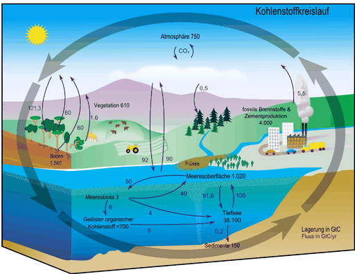
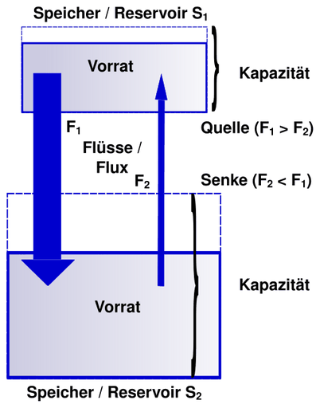
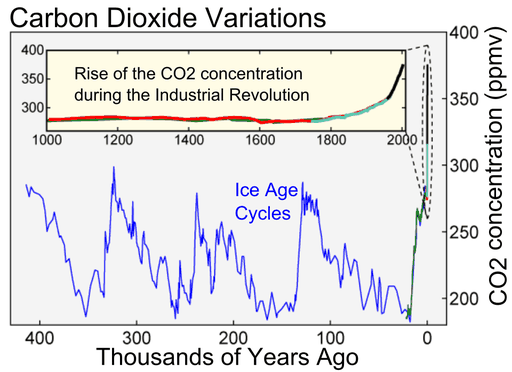

# Kohlenstoffkreislauf

Unter **Kohlenstoffkreislauf** oder **Kohlenstoffzyklus** versteht man das System der chemischen Umwandlungen kohlenstoffhaltiger Verbindungen in den globalen Systemen Lithosphäre, Hydrosphäre, Erdatmosphäre, Biosphäre und Pedosphäre sowie den Austausch dieser Verbindungen zwischen diesen Erdsphären.
Die Kenntnis dieses Kreislaufs einschließlich seiner Teilprozesse ermöglicht es unter anderem, die Eingriffe des Menschen in das Klima und damit ihre Auswirkungen auf die globale Erwärmung abzuschätzen und angemessen zu reagieren.

## Systembetrachtung

Das System „Erde“ wird als geschlossenes System betrachtet. Zufuhr von Kohlenstoff beispielsweise durch Meteorite oder kernchemische Vorgänge und Verlust von Kohlenstoff beispielsweise durch Raumfahrt werden dabei außer Acht gelassen. Unter dieser Bedingung kann man den Gesamtkohlenstoffgehalt des Systems „Erde“ als konstant betrachten.

Der Kohlenstoffzyklus des Systems Erde gliedert sich in die fünf Teilsysteme Atmosphäre, Hydrosphäre, Lithosphäre, Biosphäre und Pedosphäre. Im Erdsystem Kryosphäre, also der Gesamtheit aller Eismassen des Planeten, ist nur wenig Kohlenstoff in Form von fossilem CO2 vorhanden. Sie enthalten alle Kohlenstoff in unterschiedlichen Formen. Unter diesem Aspekt können sie als *Kohlenstoffspeicher* verstanden werden. (Statt Kohlenstoffspeicher sagt man auch *Kohlenstoffreservoir* oder *Kohlenstoffpool*.) Ein solcher Speicher hat eine Speicherkapazität und einen gespeicherten *Kohlenstoffvorrat*. Ein Kohlenstoffspeicher ist durch die Speicherformen des Kohlenstoffs charakterisiert. So speichert die Lithosphäre Kohlenstoff unter anderem in Form von Carbonatgesteinen (Kalkstein), die Biosphäre in Form organischer Kohlenstoffverbindungen sowie in Kalkskeletten der Tiere.

Zwischen den Kohlenstoffspeichern gibt es *Kohlenstoffflüsse* (auch *Kohlenstoff-Fluxe*). Wichtige Kenngrößen, die sich aus den Flüssen ergeben, sind Verweildauer im Speicher und die pro Zeitspanne zu- und abfließenden Mengen an Kohlenstoff (Flussraten).

Gibt ein Speicher (S1) pro Zeitspanne mehr Kohlenstoff an einen anderen Speicher (S2) ab, als er aus diesem aufnimmt, handelt es sich bei S1 um eine *Kohlenstoffquelle* in Bezug auf S2, während S2 eine Kohlenstoffsenke ist. Im Zusammenhang mit dem Kohlenstoffzyklus ist das *Kohlenstoffbudget*, auch *Kohlenstoffbilanz*, eine budgetmäßige Aufstellung der Zu- und Abflüsse eines Kohlenstoffspeichers. (Der Begriff Kohlenstoffbudget kann – vor allem in der Klimapolitik – auch speziell die Aufnahmekapazität der Atmosphäre bezeichnen, die noch verbleibt, bis die globale Temperatur eine bestimmte Grenze überschreitet, siehe CO2-Budget.)

Die hier skizzierten Begriffe werden in der Biogeochemie allgemein für beliebige Speicher und auch für andere Stoffkreisläufe als den des Kohlenstoffs verwendet. Im Zusammenhang mit dem gegenwärtigen Klimawandel werden sie oft in Bezug auf die Atmosphäre als Referenz-Kohlenstoffspeicher verwendet.

Flussraten können sich ändern. Beispielsweise wird damit gerechnet, dass die relative Aufnahmefähigkeit der Ozeane mit zunehmender CO2-Konzentration in der Atmosphäre abnimmt. Kohlenstoffspeicher können infolge der relativen Änderung von Flussraten ihre Rolle vertauschen. Aus einer Kohlenstoffsenke kann eine Kohlenstoffquelle werden und umgekehrt.

So tauschen beispielsweise die terrestrische Biosphäre und die Atmosphäre im Jahresverlauf ihre Rollen: Im nordhemisphärischen Winter ist die Biosphäre für die Atmosphäre eine Kohlenstoffquelle, im nordhemisphärischen Sommer wird sie zur Senke. Denn auf der Nordhalbkugel befindet sich erheblich mehr Vegetation in deutlichem Abstand zum Äquator als auf der Südhalbkugel (z. B. borealer Nadelwald, gemäßigter Regenwald). Sie betreibt im Winter kaum Photosynthese, weil es zu kalt ist und das Licht fehlt. Global betrachtet gibt deshalb die gesamte terrestrische Biosphäre im nordhemisphärischen Winter mehr CO2 ab, als sie aufnimmt. Dieser natürliche Rollenwechsel zeigt sich im halbjährlichen Auf und Ab der Keeling-Kurve, die den CO2-Gehalt der Atmosphäre darstellt.

Aber auch durch menschliche Eingriffe können aus Kohlenstoffsenken Kohlenstoffquellen werden: In einem gesunden Moor mit ausreichend hohem Grundwasserspiegel versinken Pflanzen, die bei ihrem Wachstum CO2 aus der Atmosphäre entnommen haben. Dort verrotten sie nicht, weil der Sauerstoff fehlt. Langfristig entsteht aus ihnen Torf und später Braunkohle. Das Moor ist eine Kohlenstoffsenke in Bezug zur Atmosphäre. Wird aber der Grundwasserspiegel durch Drainagen abgesenkt oder gar Torf abgebaut, dann gerät Luft an das organische Material und es verrottet, CO2 wird frei. Aus der Kohlenstoffsenke ist eine Kohlenstoffquelle geworden. Alleine aus den trockengelegten Mooren Deutschlands entweichen jährlich 45 Millionen Tonnen CO2.

## Kohlenstoffspeicher

Kohlenstoff ist im Universum und auf der Erde ein relativ seltenes Element (Prozent-Angaben bedeuten Atomzahlenverhältnisse):

- Häufigste Elemente im Universum: Wasserstoff (92,7 %) und Helium (7,2 %), (**Kohlenstoff** dagegen nur 0,008 %)
- Häufigste Elemente der Erdkruste: Sauerstoff 49 %, Eisen 19 %, Silicium 14 %, Magnesium 12,5 % (**Kohlenstoff** dagegen nur 0,099 %)
- Häufigste Elemente im menschlichen Körper: Wasserstoff (60,6 %), Sauerstoff (25,7 %) und **Kohlenstoff** (10,7 %)

Die globale Kohlenstoffmenge beträgt 75 Millionen Gt.

### Atmosphäre

In der Atmosphäre befanden sich mit Stand 2017 ca. 850 Gt Kohlenstoff. Das sind rund 0,001 % des globalen Gesamt-Kohlenstoffes. Die Atmosphäre und die Biosphäre sind die kleinsten Kohlenstoffspeicher. Der Kohlenstoffgehalt der Atmosphäre reagiert also auf Änderung der Flussraten besonders empfindlich. Aufgrund biochemischer Vorgänge weist die Atmosphäre jedoch die höchsten Kohlenstoff-Flussraten auf und ist damit Bestandteil der kurzfristigen Kreisläufe.

Die mengenmäßig dominierende Kohlenstoffverbindung (und Abbauprodukt weiterer Spurengase) ist das Kohlenstoffdioxid (CO2). Da durch die Verbrennung fossiler Energieträger seit Beginn der Industrialisierung den Stoffflüssen in der Umwelt zuvor langfristig gebundener Kohlenstoff als CO2 hinzugefügt wird, steigt die Konzentration von Kohlenstoffdioxid in der Erdatmosphäre. Sie betrug 426 ppm (Stand Jan. 2025) – ein Anstieg von knapp 150 Parts per million (ppm) gegenüber dem vorindustriellen Wert von ca. 280 ppm.

Insgesamt wurden seit Beginn der Industrialisierung ca. 635 Gt Kohlenstoff (entspricht ca. 2300 Gt CO2) durch fossile Energieträger freigesetzt, von denen etwa knapp die Hälfte in der Atmosphäre verblieb und jeweils gut ein Viertel von Ozeanen und Landökosystemen aufgenommen wurde (Stand 2019).

Weitere kohlenstoffhaltige Gase in der Atmosphäre sind Methan mit 1,7 ppm, das Kohlenmonoxid mit 50–200 ppb und die halogenierten Kohlenwasserstoffe mit ca. 0,7 ppb.

### Hydrosphäre

Der Begriff der Hydrosphäre wurde in der Geschichte unterschiedlich verwendet und definiert. Teilweise verstand man darunter die Gesamtheit allen irdischen Wassers in allen Aggregatszuständen. Für den Kohlenstoffkreislauf ist nur das flüssige Wasser der Erdoberfläche relevant. Denn hier finden die Flüsse kohlenstoffhaltiger Gase und anderer Materialien statt. Modernere Definitionen von Hydrosphäre beschränken sich daher auf diesen Bereich. Nach dieser Definition enthält die Hydrosphäre 38.000 Gigatonnen Kohlenstoff, wovon jedoch nur ein kleiner Teil (im Oberflächenwasser) in direktem Austausch mit der Atmosphäre steht, während sich über 97 % in der Tiefsee befinden.

Die Polkappen, Eisschilde und Gletscher werden als Kryosphäre bezeichnet. In ihnen ist fossiles Kohlendioxid enthalten, das nicht am Kreislauf teilnimmt. Grundwasser wird zur Lithosphäre gerechnet, das Wasser im Erdboden zur Pedosphäre. Gasförmiges Wasser, also der Wasserdampf ist das wirksamste Treibhausgas und sorgt für den natürlichen Treibhauseffekt. Es gehört zur Atmosphäre.

### Lithosphäre

Die Lithosphäre umfasst die äußeren festen Gesteinsschichten der Erde und stellt mit 99,95 % des globalen Gesamtkohlenstoffs den größten Kohlenstoffspeicher dar. Aufgrund der geringen Flussraten ist die Lithosphäre Bestandteil der langfristigen Kohlenstoffkreisläufe.

**Gashydrate** sind Komplexe aus Wasser und Gas ohne feste chemische Verbindung. Wasser hat aufgrund der Wasserstoffbrückenbindung eine Art Gitterstruktur. Diese bietet Hohlräume oder Zwischenräume für andere Moleküle. Verschiedene Gase können diese Räume besetzen und mit dem Wasser einen räumlichen Komplex, das Gashydrat bilden. Natürliche Gashydrate bilden sich vor allem aus Methan, Kohlendioxid und Schwefelwasserstoff. Methanhydrate kommen auf dem Meeresboden oder in Lockersedimenten vor in einer Tiefe von 440 Meter bis 650 Meter. Nur in diesem Bereich sind die Temperatur- und Druckverhältnisse zu ihrer Bildung geeignet. Dort haben die Gashydrate dann eine feste Konsistenz.

### Biosphäre

Der Begriff Biosphäre bezeichnet die Gesamtheit aller auf der Erde existierenden Lebewesen und den Raum, in dem sie vorkommen.

Das Leben auf der Erde basiert auf der Verwendung des Elements Kohlenstoff. Im Laufe der Evolution haben die Lebewesen die Fähigkeit erworben, daraus eine große Zahl unterschiedlicher Verbindungen und Produkte herzustellen. Sie machen sich die globalen Kohlenstoffkreisläufe zu Nutze, einzelne können sogar elementaren Kohlenstoff herstellen.

Speicherformen des Kohlenstoffs in der Biosphäre sind vor allem organische Stoffe. 90 % der Biomasse besteht aus Polysacchariden. In der Reihenfolge der Häufigkeit sind dies Cellulose, Lignin und Chitin. Sie haben Strukturaufgaben bei Pflanzen, Pilzen und Gliederfüßern (hier als Außenskelette).

Anorganische Kohlenstoffverbindungen haben nur einen geringen Anteil, beispielsweise Carbonate (in der Regel Calciumcarbonat CaCO3). Sie dienen als Baustoff für Außenskelette bei Mollusken, Foraminiferen und Coccolithophoridae, Innenskelette aus Carbonaten bei Korallen.

Auf die Landlebewesen entfallen 700 GtC, auf die marinen Lebensformen 3 GtC. Insgesamt speichert die Biosphäre 703 GtC. Sie ist also ein kleiner Kohlenstoffspeicher. Wie bei der Atmosphäre sind jedoch die Kohlenstoff-Flüsse zu den anderen Systemen sehr lebhaft.

### Pedosphäre

Als Pedosphäre bezeichnet man die oberste Schicht der globalen Landflächen. Sie besteht aus Verwitterungsprodukten der Gesteine und aus organischem Material, dem Humus. Zusammen mit Wasser und Luft bietet sie Raum für verschiedene Lebensformen. Funktionell steht sie mit allen anderen Geosphären in Verbindung. Im Boden befindet sich mindestens die vierfache Menge Kohlenstoff wie in der Atmosphäre. Das Institut für Agrarwissenschaften – Fachbereich Bodenkunde – geht von einem globalen Kohlenstoffgehalt der Pedosphäre von 2500 Gt aus. Allein der weltweite C-Gehalt der Moore beträgt 900 Gt Da sich ein großer Teil des im Boden gespeicherten Kohlenstoffs in Permafrostböden befindet, wird mit Fortschreiten der globalen Erwärmung und Abtauen der Permafrostböden ein Teil davon freigesetzt werden. Doch auch aus Böden in anderen Erdregionen können durch die globale Erwärmung zunehmend gewaltige Mengen Kohlenstoff freigesetzt werden.
Der Boden Deutschlands (0–90 cm Tiefe) enthält 5 Gt C, die landwirtschaftlich genutzten Böden 2,4 Gt C und die Böden der Wälder 1,3 Gt C. Die größten Kohlenstoffvorräte befinden dabei sich in Böden unter Dauergrünland (181 Tonnen Kohlenstoff pro Hektar). Deutlich weniger ist es beim Waldboden (100tC/ha), dicht gefolgt vom Ackerboden (95tC/ha).

## Vorgänge innerhalb der Systeme

### Atmosphäre

Innerhalb der Troposphäre (5 km Höhe an den Polen, 15 km am Äquator) finden intensive physikalische Transportvorgänge statt. Durch die vertikalen und horizontalen Luftbewegungen kommt es zu einer beständigen Durchmischung. Die CO2-Konzentration in den unteren Schichten der Atmosphäre ist daher überall gleich.

Nur an Orten, die über längere Zeit hinweg vor Wind geschützt sind, kann sich CO2 am Boden ansammeln.
Beispiel: Kohlenstoffdioxidseen in Bergwerken oder in Höhlen, die in vulkanisch aktiven Gebieten liegen.

Laut IPCC-Report 2007 betrugen die laufenden CO2-Emissionen durch Verbrennung fossiler Energieträger 1990 weltweit 6,4 Gigatonnen Kohlenstoff pro Jahr, die durch Änderung der Landnutzung 1,6 GtC/a. Gleichzeitig wurden 2,2 GtC in der Hydrosphäre (Ozeane) und 2,6 GtC an Land deponiert (Pedosphäre und Biosphäre zusammen).

Durch diese lebhaften CO2-Flüsse wird eine theoretische einmalige CO2-Emission nach 30 Jahren zu 50 % wieder aus der Atmosphäre entfernt. Weitere 30 % verbleiben Jahrhunderte, die restlichen 20 % Jahrtausende in der Atmosphäre.

Organische Spurenstoffe werden mit Zeitkonstanten von einem Tag bis zehn Jahren zu CO2 (und Wasser) oxidiert. Dies betrifft vor allem Methan und die halogenierten Kohlenwasserstoffe. Der Abbau geschieht zum größten Teil durch das fotochemisch erzeugte freie Hydroxylradikal (OH). Es zerstört 3,7 GtC an Treibhausgasen pro Jahr.

### Hydrosphäre

In die Wasseransammlungen wie Meere oder Seen werden etwa 92 Gt Kohlenstoff pro Jahr eingelagert und 90 Gt wieder freigesetzt.

Es ergibt sich also ein langfristiger Verbleib von ca. 2 GtC/a.

#### Transportvorgänge

- *Biologische Kohlenstoffpumpe:* Im lichtdurchfluteten oberen Wasserbereich wächst Phytoplankton und baut durch Photosynthese Kohlenstoff aus Kohlendioxid in seine Biomasse ein. Nach Absterben sinken die mikroskopischen Algen in tiefere Wasserschichten ab. Auf dem Weg in die Tiefe (oder schon vorher) werden sie von anderen Organismen gefressen und verdaut. Dabei wird der Kohlenstoff der Biomasse als Kohlendioxid wieder freigesetzt. Der Anteil, der nicht gefressen wird, sinkt zum Meeresgrund, wo der Kohlenstoff deponiert wird. Dieser Mechanismus gilt nicht nur für Plankton. Größere absinkende marine Organismen transportieren ebenfalls Kohlenstoff in Form von Meeresschnee langfristig auf den Grund der Ozeane. Meeresschnee enthält heute auch einen Anteil an Mikroplastik. In geologischen Zeiträumen wird der auf den Meeresboden abgesunkene Kohlenstoff durch Oxidation mineralisiert und zu carbonathaltigem Sedimentgestein umgewandelt.

- *Physikalische Kohlenstoffpumpe:* CO2 löst sich physikalisch (zunächst chemisch unverändert) im Meerwasser. Hauptsächlich durch den Vorgang der thermohalinen Zirkulation an den Polen der Erde wird das gelöste Kohlenstoffdioxid in die Tiefsee verbracht, wo es sich mit der Zeit anreichert.

Die Ozeane nahmen im Zeitraum von 1994 bis 2007 insgesamt 34 Gt Kohlenstoff auf, das entspricht 31 % der menschengemachten Kohlenstoffdioxidemissionen in diesem Zeitraum. Der Preis dafür war eine Versauerung der Meere mit Absinken des pH-Wertes um 0,1. Die Leistung der Ozeane als Kohlenstoffsenke ist über die letzten 200 Jahre konstant, die Aufnahmekapazität nicht erschöpft.

Dies könnte sich jedoch ändern, wenn die thermohaline Zirkulation zusammenbricht oder die Versauerung der Ozeane ein Ausmaß annimmt, das es den marinen Organismen unmöglich macht, weiterhin Kohlenstoff in organisches oder anorganisches Material einzulagern.
Beides sind klassische Kippelemente im Erdklimasystem.

#### Chemie des gelösten Kohlendioxids und der Versauerung

Zwischen den verschiedenen Formen des anorganischen Kohlenstoffs besteht ein chemisches Gleichgewicht (die Prozentangaben gelten für die Bedingungen T = 10 °C, pH = 8, Salzgehalt 34,3 ‰ – so wie sie zum Beispiel in weiten Bereichen der Ozeane herrschen):

Wenn die CO2-Konzentration der Atmosphäre geringfügig steigt, nimmt die Hydrosphäre vermehrt Kohlenstoffdioxid auf, um das relative Gleichgewicht wiederherzustellen. Größere Änderungen von Konzentrationen ändern aber die Gleichgewichtslage, wenn die Grenzen der Aufnahmekapazitäten erreicht werden. Änderungen der Bedingungen ändern ebenfalls die Gleichgewichtslage, etwa wenn die Aufnahmekapazitätsgrenze von CO2 im Wasser sinkt. Eine globale Erwärmung etwa verschiebt das Gleichgewicht nach links.

### Lithosphäre

#### Sedimentation

Bei der Sedimentation sinken schwerlösliche anorganische und organische Stoffe langsam zu Boden. Die Sinkgeschwindigkeit hängt von der Teilchengröße und der Dichte des Wassers ab und kann in ungestörtem Wasser sehr niedrig sein. Im Kohlenstoffkreislauf spielt die Sedimentation der Kalkskelette der Coccolithophoridae eine große Rolle.

#### Diagenese

Diagenese ist die langfristige Verfestigung loser Sedimente durch chemische, physikalische und biotische Umwandlungen. Dabei wird zum Beispiel aus den Kalkskeletten der Mikroorganismen Kalkgestein. Organische Ablagerungen werden unter bestimmten Bedingungen, wie sie in sauerstoffarmen, warmen Flachmeeren herrschen, stufenweise in anorganische oder andere organische Stoffe umgewandelt. Es entstehen Kerogene (zum Beispiel in Ölschiefer), Teerstoffe (Bitumen), Kohle, Graphit und Erdöl sowie Methan. Die Diageneserate beträgt 0,2 Gt C pro Jahr.

#### Metamorphose

Gesteinsmetamorphose ist die langfristige Umwandlung von festem Gestein auf Grund von erhöhtem Druck und erhöhter Temperatur: Durch Subduktion von Sedimenten des Meeresbodens werden Druck und Temperatur erhöht. An der Grenzfläche von Kalk- und Silicatsedimenten (Sand) finden folgende chemische Umwandlungen statt:

:   Calcit wird zu Calciumsilicat (Wollastonit)

:   Dolomit wird zu Speckstein beziehungsweise Talk

Das hierbei freiwerdende CO2 löst sich im flüssigen Magma und wird dann bei einem Vulkanausbruch frei oder entweicht gleich über Klüfte oder Vulkane.
Durch tektonische Veränderungen werden die entstandenen Silicate an die Oberfläche transportiert und der Verwitterung ausgesetzt.

### Biosphäre

Durch Pflanzen werden pro Jahr etwa 123 Gt Kohlenstoff gebunden (Bruttoprimärproduktion), davon werden 60 Gt durch pflanzliche Atmung wieder in die Atmosphäre freigesetzt, der Rest wird als Biomasse gebunden (Nettoprimärproduktion) oder in den Erdboden eingetragen. Die mikrobielle Zersetzung und Atmung setzen etwa 60 Gt frei. Der Mensch verursacht, hauptsächlich durch Verbrennung fossiler Brennstoffe, aber auch durch die Zement-Herstellung, bei der ebenfalls CO2 frei wird, den Übergang von jährlich etwa 9 Gt Kohlenstoff aus der Lithosphäre in die Atmosphäre. Innerhalb der Biosphäre findet ein Kohlenstoff-Fluss statt von den organische Stoffe erzeugenden autotrophen Organismen zu den organische Stoffe verbrauchenden heterotrophen Organismen. Durch Wind und Tiere wird organisches Material verfrachtet.

### Pedosphäre

Der größte Teil des organischen Pflanzenmaterials der Nettoprimärproduktion der Biosphäre wird durch Mikroorganismen wieder abgebaut. Der darin enthaltene Kohlenstoff gelangt als CO2 wieder in die Atmosphäre. Neben dem mikrobiellen Abbau geschieht dies auch durch Brände oder Ernten.
Von den 120 GtC/Jahr der Bruttoprimärproduktion gelangt lediglich der kleine Teil von 1 GtC/Jahr langfristig in den Boden, wo der Kohlenstoff z. B. in Mooren über Jahrtausende dem Kreislauf entzogen wird. Dieser Teil wird auch als Nettobiomproduktion bezeichnet.
Trotz des geringen jährlichen Zuflusses ist die Pedosphäre nach der Lithosphäre der größte Kohlenstoffspeicher.

## Kohlenstoff-Teilkreisläufe

Ein Speicher ist sowohl Quelle als auch Senke für Kohlenstoff-Flüsse.

Zwischen den Kohlenstoff-Speichern erfolgt ein ständiger Austausch durch chemische, physikalische, geologische und biologische Prozesse.

### Kurzfristiger anorganischer Kreislauf

Nach einer Studie um Li Yu von der Lanzhou University kommt es in endorheischen Becken (stehende Gewässer ohne Ablauf) mit hoher Verdunstungsrate zur Abscheidung von anorganischem Kohlenstoff. Beispiele für solche endorheische Becken sind der Aralsee oder das Okavangodelta. Yu schätzt, dass auf diese Weise jährlich und weltweit ca. 0,152 Gt Kohlenstoff in der Lithosphäre festgelegt werden.

Ein weiterer schnell ablaufender Prozess der Bildung von Karbonatgesteinen ist das Entstehen von Beachrock an tropischen Meeresküsten. Unter geeigneten Bedingungen kommt es innerhalb von Jahren oder sogar Monaten zur Gesteinsbildung mit Festlegung von Kohlenstoff.

### Langfristiger anorganischer Kreislauf

Hierbei handelt es sich um geochemische Prozesse, die in einem Zeitraum von mehreren tausend bis Milliarden Jahren ablaufen können.

Hierbei handelt es sich im Wesentlichen um Kohlenstoffflüsse, die mit der Lithosphäre im Zusammenhang stehen.

Die hierfür ablaufenden Prozesse sind Sedimentation, Diagenese, Gesteinsmetamorphose, Verwitterung und Vulkanismus.

#### Mechanische Verwitterung

→ *Hauptartikel: Verwitterung#Physikalische Verwitterung*

Durch thermische Spannungen (Beispiel Frostsprengung), Druck (Beispiel Gletscher) sowie durch Wind- und Wassererosion können große Gesteinsblöcke in immer kleinere Portionen zerteilt werden. Durch Fließgewässer wird dieses zerkleinerte Material verfrachtet und in den Mündungsgebieten wieder abgelagert. Diese Sedimente können wieder durch Subduktion der Metamorphose unterworfen werden.

#### Chemische Verwitterung

→ *Hauptartikel: Chemische Verwitterung*

Verwitterung von Kalk- und Silikatgestein entzieht durch Vermittlung von Wasser der Atmosphäre CO2. Das dabei entstehende Hydrogencarbonat ist löslich und verbleibt in der Hydrosphäre.

- *Calcitverwitterung:* (Siehe auch: Karst, Doline, Höhle)

- *Dolomitverwitterung:*

- *Silikatverwitterung:*

Durch Subduktion gelangt SiO2 (Quarzsand) und CaCO3 (Kalk) unter die Erdkruste. Dort werden sie durch die Hitze verschmolzen und reagieren zu Silikat und CO2 welche dann wiederum durch Vulkane an die Erdoberfläche gelangen. Dieser Kreislauf wird Carbonat-Silicat-Zyklus genannt. Es wird mehr CO2 gebunden, als ausgestoßen wird, so dass der CO2-Gehalt der Atmosphäre vermindert wird.

Erfolgt die Verwitterung von Kalkgestein durch andere Säuren, zum Beispiel Schwefelsäure, die aus von Vulkanen abgegebenem Schwefelwasserstoff und Schwefeldioxid durch Oxidation und Reaktion mit Wasser entstehen kann, wird CO2 an die Atmosphäre abgegeben:

#### Ausfällung

Aus einer gesättigten Calciumhydrogencarbonat-Lösung wird durch Erhöhung des pH-Werts Calcit ausgefällt, wobei CO2 frei wird:

.

Diese Reaktion wird insbesondere durch eine Erhöhung des pH-Werts (basisch) infolge CO2-Verbrauchs (autotrophe Organismen) und durch hohe Wasserverdunstung verstärkt. (Siehe auch: Stalaktit, Stalagmit, Sinterterrasse)

Organismen wie Muscheln, Schnecken und Einzeller führen ebenfalls eine Calcitausfällung durch, um damit Skelette, Gehäuse und Schalen aufzubauen. Besondere Bedeutung haben dabei marine Kleinorganismen (Foraminiferen und Coccolithophoriden), deren Außenskelette nach Absterben der Organismen sedimentieren und so Kalksedimente bilden, und Korallen, die Korallenstöcke aus Calciumcarbonat aufbauen. Über Korallenriffen ist die CO2-Konzentration deutlich erhöht. Alle Riffe der Erde (285.000 km²) fällen Schätzungen zufolge 0,64 Gt Calciumcarbonat pro Jahr aus. Dabei werden über 0,28 Gt CO2 freigesetzt. Davon wird allerdings nur ein Teil an die Atmosphäre abgegeben (siehe dazu auch: Klimageschichte).

Der Kreislauf wird auf zwei Wegen wieder geschlossen:

1. Durch Metamorphose (siehe oben) wird wieder CO2 an die Atmosphäre abgegeben und
2. durch tektonische Veränderungen werden Korallenstöcke, Sedimentgesteine und Silicatgesteine an die Oberfläche verfrachtet und damit der Verwitterung ausgesetzt.

### Kurzfristiger organischer Kreislauf

Hierbei handelt es sich um biochemische Prozesse der Assimilation und Dissimilation, um die Wanderung des Kohlenstoffs durch die Lebensformen der Biosphäre. *Kurzfristig* bedeutet dabei etwa die Lebensspanne eines Menschen. Die Prozesse können rasch ablaufen und jahreszeitlichen Schwankungen unterliegen. So steigt während des Winters auf der Nordhalbkugel der CO2-Gehalt der Atmosphäre an, weil die Pflanzen wegen des geringeren Lichteinfalls und der niedrigeren Temperaturen weniger Photosynthese betreiben.

- Durch die Photosynthese von Pflanzen, Algen (Phytoplankton) und Bakterien werden aus CO2 mithilfe der Lichtenergie organische Stoffe (Corg) hergestellt.
- Durch die Zellatmung wird aus diesen Stoffen Kohlenstoff mithilfe von Sauerstoff wieder zu CO2 oxidiert. Viele Organismen betreiben unter Sauerstoffmangel Gärung, wobei die organischen Stoffe unvollständig zu anderen organischen Stoffen wie Methan abgebaut werden und teilweise zu CO2 umgesetzt (mineralisiert) werden.

### Langfristiger organischer Kreislauf

Auf rasch ablaufende biochemische Prozesse folgen langfristige geologische Prozesse. Sedimentiertes, organisches Material wird unter anoxischen Bedingungen nicht mehr vollständig abgebaut, nur ein geringer Teil wird durch anaerobe Organismen zersetzt. Durch Überdeckung mit weiteren Sedimentschichten und Absinken in größere Tiefen steigen Druck und Temperatur. Dadurch werden die organischen Biomoleküle unter Luftabschluss in Kohlenwasserstoffe (Erdöl und Erdgas) oder Kohlenstoff (Kohle) umgewandelt. Umgekehrt können an die Oberfläche gelangende fossile Brennstoffe auf natürliche Weise oder durch den Menschen wieder zu CO2 oxidieren. Ein wichtiger Teilzyklus ist der des Methanhydrats, das im Ozean an den Kontinentalhängen und im Permafrost aus überwiegend biogen gebildetem CH4 aber auch per Austritt aus Erdgasquellen als Feststoff abgelagert wird.

- **Erdöl:** Hauptentstehungszeit des Erdöls war in den letzten 300 Millionen Jahren. Es entstand in lagunenartigen, warmen Flachmeeren aus herabsinkenden Mikroorganismen in eine sauerstoffarme Bodenschicht. Der Mangel an Sauerstoff verhinderte den weiteren Abbau des organischen Materials und ließ in Erdölmuttergesteinen Kerogen entstehen, aus dem sich Erdöl oder Erdgas bilden kann. Später wurden diese Schichten mit anderen Sedimenten abgedeckt und durch geodynamische Vorgänge in größere Gesteinstiefen verschoben. Ab ausreichenden Druck und einer Temperatur von 60 °C – 160 °C wird das Ölfenster erreicht, d. h. die Bedingungen, unter denen sich das organische Material in Erdöl verwandelt. Bei höheren Temperaturen geht es ins Erdgasfenster über, d. h. es werden kurzkettigere Kohlenwasserstoffe gebildet. Durch Wanderung („Migration“) in sog. Fallen entstehen daraus Lagerstätten. An die Oberfläche tretendes Erdöl verliert die leicht flüchtigen Verbindungen und verfestigt zu zähflüssigem Asphalt, Erdpech oder Erdwachs (siehe: Asphaltsee).

:   Siehe auch: Erdöl #Entstehung

- **Kohle:** Kohlelagerstätten entstanden aus Sumpfwäldern, überwiegend im Oberkarbon und Perm vor etwa 320 bis 250 Millionen Jahren. Sie wurden regelmäßig überflutet und dabei mit Sedimenten abgedeckt. Durch die Inkohlung der pflanzlichen Biomasse bildeten sich Kohleflöze. Wenn Kohle durch tektonische Vorgänge an die Erdoberfläche verfrachtet wird, kann sie zu CO2 oxidieren.

:   Siehe auch: Kohle #Entstehung

## Eingriffe des Menschen in den Kohlenstoffkreislauf

### Erhöhung der Kohlenstoffdioxid-Konzentration der Atmosphäre

#### Historische Betrachtung

Während des Paläozänen-Eozänen Temperaturmaximums vor 56 Millionen Jahren kam es durch Vulkanismus zu atmosphärischen CO2-Konzentrationen von über 2000 ppm. Innerhalb einiger tausend Jahre erhöhte sich die Durchschnittstemperatur der Atmosphäre um 5 Grad.

Die Analyse von Eisbohrkernen aus der Antarktis zeigt, dass die Kohlenstoffdioxid-Volumenkonzentration der Atmosphäre in den letzten 800.000 Jahren 300 ppm nie überschritten hat. Während der Eiszeiten war sie mit 180 ppm niedriger als während der Warmzeiten.

#### Aktuelle Entwicklung

Seit Beginn der Industrialisierung stieg die Konzentration stark.
Die blaue Kurve in der Grafik rechts ergibt sich aus kontinuierlichen Messungen der Global-Atmosphere-Watch-Station (GAW-Station) Mauna Loa auf Hawaii seit 1958. Sie wird Keeling-Kurve genannt. Aus diesen Messungen ergeben sich jährliche Anstiege des CO2-Gehalts der Atmosphäre entsprechend mehreren Gigatonnen Kohlenstoff (Gt C). Etwa ein Drittel des atmosphärischen CO2-Anstiegs der letzten 150 Jahre ist auf Entwaldung zurückzuführen.
Die im Folgenden aufgeführten anthropogenen Emissionen werden zum Teil von den durch CO2 versauernden Ozeanen aufgenommen und ein Teil von durch CO2 üppiger wachsenden Landpflanzen; nur knapp die Hälfte verbleibt in der Atmosphäre.

2018 stiegen die globalen, durch fossile Brennstoffnutzung verursachten CO2-Emissionen auf 37,9 Gt CO2/a (+1,9 % zum Vorjahr). Im weltweiten Mittel haben sich die jährlichen CO2-Emissionen pro Kopf zwischen 1990 und 2018 von 4,25 t auf 4,97 t erhöht. In der EU wurden 2018 insgesamt 3,5 Gt CO2 ausgestoßen, pro Person 6,8 Gt CO2. In Deutschland gingen die jährlichen CO2-Emissionen von 1018 MtCO2 in 1990 auf 753 Mt CO2 in 2018 zurück, was einer Pro-Kopf-Emission von 12,868 t CO2 bzw. 9,146 t CO2 entspricht. In Österreich stiegen die CO2-Emissionen im selben Zeitraum von 62,9 Mt CO2/a (8,147 t CO2/a/Kopf) auf 71,4 Mt CO2/a (8,163 t CO2/a/Kopf); in der Schweiz sanken sie von 45,0 Mt CO2/a (6,735 t CO2/a/Kopf) auf 40,9 Mt CO2/a (4,792 t CO2/a/Kopf) An den gesamten Treibhausgasemissionen hat CO2 den größten Anteil, daneben spielen Methan, Lachgas und die halogenierten Kohlenwasserstoffe eine wichtige Rolle.

Siehe auch: Liste der größten Kohlenstoffdioxidemittenten

### Folgen der Eingriffe des Menschen in den Kohlenstoffkreislauf

#### Erhöhung der Durchschnittstemperaturen in der Atmosphäre

Im Bereich der Naturwissenschaften besteht weitgehender Konsens, dass der derzeitige Anstieg der Durchschnittstemperaturen auf die direkte oder indirekte menschengemachte Emission von kohlenstoffhaltigen Treibhausgasen zurückzuführen ist.
Indirekt gelangte CO2 durch die Entwaldung der letzten 150 Jahre in die Atmosphäre. Sie ist zu einem Drittel an der globalen Erwärmung beteiligt. Durch die Verbrennung fossiler Brennstoffe gelangt Kohlenstoff direkt in Form von CO2 in die Erdatmosphäre. Insgesamt „produzierte“ die Menschheit an der Schwelle zum 21. Jahrhundert etwa 8,7 Gt C je Jahr. Das labile Gleichgewicht wird gestört. Die Folge ist die globale Erwärmung, wozu maßgeblich der wachsende Anteil des Treibhausgases CO2 in der Erdatmosphäre beiträgt.

#### Auswirkungen auf die Photosynthese

Für die Photosynthese der Landpflanzen wäre eine Kohlenstoffdioxid-Volumenkonzentration in der Atmosphäre von 1000 ppm optimal (derzeit 400ppm siehe 2.1). Von daher wäre eine Steigerung der Photosyntheserate bei steigenden CO2-Gehalten der Atmosphäre vorstellbar. Diese fällt allerdings unterschiedlich aus. Die verschiedenen Pflanzenarten können im Wesentlichen in zwei Gruppen des Fotosythesestoffwechsels gegliedert werden: Die C3-Pflanzen und die C4-Pflanzen. Zu den ersteren gehören Kulturarten wie Weizen, Reis, Zuckerrübe und Kartoffel. Sie profitieren deutlich von einer Kohlendioxiddüngung. Bei C4-Pflanzen (Amarant, Mais, Zuckerrohr) ist dies kaum der Fall. Die C3-Pflanzen haben jedoch das Problem, dass das für die Carboxylierung verantwortliche Enzym (RuBisCO) temperaturabhängig reagiert. Infolge ansteigender Temperaturen verringert sich die Carboxylierungsrate der Rubisco.

Neben der Änderung der Kohlenstoffdioxid-Konzentration in der Atmosphäre und den steigenden Temperaturen müssen die Landpflanzen auch mit mehr Trockenstress zurechtkommen.

Betrachtet man die Photosynthese der marinen Ökosysteme, so steht zu befürchten, dass deren Leistung zurückgeht. Ursachen sind die Erhöhung der Wassertemperaturen und das Absinken des pH-Wertes. Phytoplankton produziert weniger Material und reduziert die Wirkung der biologischen Kohlenstoffpumpe.

#### Versauerung der Meere

Die Erhöhung der Kohlenstoffdioxidkonzentration in der Atmosphäre führt zu einer vermehrten Lösung von CO2 im Meerwasser. Durch die Bildung von Kohlensäure wird der pH-Wert des Wassers erniedrigt (saurer). In den letzten 200 Jahren ist ungefähr die Hälfte des durch Verbrennung von fossilem Kohlenstoff freigesetzten Kohlendioxids (525 Gt CO2) von den Meeren aufgenommen worden. Der pH-Wert ist dabei um 0,1 gefallen. Eine zunehmende Versauerung der Ozeane bedroht eine Vielzahl von Meeresorganismen – angefangen von mikroskopischen Algen über Muscheln bis hin zu den Korallenriffen. Kalkbildende Arten, besonders jene, die die Kalkart Aragonit produzieren, werden durch die Versauerung gefährdet. Aragonit löst sich besonders leicht in saurem Wasser. Die Versauerung könnte den Kohlenstofftransport von den oberen Schichten in die Tiefsee vermindern. Die Versauerung könnte sich zu einem der Kippelemente im Erdklimasystem entwickeln.

### Schätzungen zu neuen möglichen Kohlenstoff-Senken

#### Technische Lösungen

Unter dem Begriff Climate Engineering werden willkürliche Eingriffe in das Erdsystem zusammengefasst, die das Ziel haben, die Durchschnittstemperaturen zu senken.

→ *Hauptartikel: Geoengineering*

Soweit diese den Kohlenstoffkreislauf betreffen, spricht man auch von Negativen Emissionstechnologien.

→ *Hauptartikel: Negative Emissionen*

Diese verfolgen alle das Ziel, Kohlendioxid langfristig dem Kreislauf zu entziehen. Beispiele sind Düngung der Ozeane mit Eisen zur Steigerung der CO2−Aufnahme, Versenkung von CO2 in der Tiefsee oder Deponierung in Lagerstätten an Land (**C**arbon dioxide **C**apture and **S**torage CCS).

→ *Hauptartikel: CO2-Abscheidung und -Speicherung*

Der Weltklimarat sieht für diese Techniken noch weiteren Forschungsbedarf.

#### Aufforstung

Aufforstung kann eine wirksame Maßnahme sein, um dem Anstieg des CO2 Gehalts der Atmosphäre entgegenzuwirken. Bislang ging man davon aus, die negativen Auswirkungen von vorausgegangener Entwaldung umkehren zu können. Modellierungen zeigen allerdings, dass der Effekt noch höher ist. Höhere Temperatur und CO2 Gehalt stärken das Potential zur Kohlenstoffspeicherung durch Wiederaufforstung.

Entscheidend wird sein, wann bei einer forstlichen Neuanlage die Kohlenstoffspeicherung mengenmäßig einsetzt.
Einen starken Einfluss auf die Kohlenstoffspeicherung einer Aufforstungsfläche haben Faktoren wie Sonneneinstrahlung und Feuchte. Die Strahlungsintensität wird vor allem durch den Breitengrad bestimmt, auf dem die Fläche liegt.
So kann man in den ersten 20 Jahren in borealen Zonen Kohlenstoffspeicherleistungen von 0,6 bis 1,4 Tonnen Kohlenstoff pro Jahr und Hektar erwarten. In den gemäßigten Zonen sind es 0,4 bis 8,6 tC/a\*ha und in den Tropen 2,1 bis 27 tC/a\*ha. Für Deutschland ist ein Wert von 2,8 tC/a\*ha für 20-jährige Kulturen anzunehmen. Über alle Baumarten gemittelt steigt die Speicherleistung nach Untersuchungen des Karl-Gayer-Instituts bis zum Alter von 60 Jahren in Deutschland auf ein Maximum von 6,4tC/a\*ha. Bei älteren Bäumen sinkt sie wieder. Generell ist festzustellen, dass die Kohlenstoffspeicherleistung von Aufforstungsflächen sehr stark von den Rahmenbedingungen abhängt und erheblichen Schwankungen unterworfen ist. Besonders bei vorheriger Nutzung der Fläche als Grünland ist mit starken Kohlenstoffverlusten im Boden nach der Aufforstung zu rechnen. Ein entsprechendes Beispiel in Kanada ergab eine negative C-Gesamtbilanz der ersten 20 Jahre. Nach Angaben der Bayerischen Landesanstalt für Wald und Forstwirtschaft (LWF) steigt die Fähigkeit der Bäume Kohlenstoff zu binden mit dem Alter kontinuierlich immer weiter an. Diese Erkenntnis gilt für alle untersuchten Baumarten. Bei der Betrachtung der Einzelbäume hatten diejenigen mit dem größten Stammdurchmesser die höchste C-Speicherleistung. Bei der Betrachtung von Beständen waren es diejenigen mit dem größten Holzvorrat.

#### Nachhaltige Wald- und Holznutzung

Schließt man sich dem Standpunkt der Bayerischen Landesanstalt für Wald und Forstwirtschaft an und geht davon aus, dass die Fähigkeit der Bäume, Kohlenstoff zu speichern, mit dem Alter beständig zunimmt, dann wäre es aus Sicht des Klimaschutzes am besten, man würde sie gar nicht bewirtschaften. Sie würden dann stetig weiter der Atmosphäre Kohlenstoff entziehen und für Jahrhunderte festlegen.

Diese isolierte Betrachtung ist allerdings ein fiktives Szenario. Nachfrage an Holzprodukten besteht weiterhin. Sie würde schnell aus nicht nachhaltig bewirtschafteten Wäldern gedeckt werden oder man würde auf andere, weniger umweltfreundliche Materialien ausweichen.

Die Bewirtschaftung des Waldes mit dem Ziel der Erzeugung langlebiger Holzprodukte (Bauholz, Möbel) gilt daher als umweltfreundlich.

Dies gilt insbesondere im Falle einer sogenannten Kaskadennutzung, also einer mehrfachen Nutzung über einen möglichst langen Zeitraum. Nach einem oder mehrmaligem Recycling stünde am Ende der Kaskade dann die energetische Nutzung.

Die Nutzung von Holz für Papier und Zellstoff entspricht nicht diesen Kriterien. Jährlich werden in Deutschland 9,3 Millionen m³ Holz für die Papier- und Zellstoffindustrie verbraucht. Dies deckt aber nicht den Bedarf. Zusätzlich wird Zellstoff aus China und Südamerika importiert. Der Papier- und Zellstoffverbrauch pro Person und Jahr in Deutschland liegt bei 100 kg. Brasilien ist für Deutschland das bedeutendste Importland mit 850.000 Tonnen Zellstoff in 2009. Dort wächst ein Eukalyptus in Monokultur in 8 Jahren zur Hiebreife.

Die Beurteilung der Frage, ob eine energetische Nutzung von Holz nachhaltig und aus dem Aspekt des Klimaschutzes sinnvoll ist, hängt sehr stark von den Rahmenbedingungen ab. Für den Fall, dass das Material aus Durchforstungen oder Ernterückständen besteht, so trifft das sicher zu. Die Herstellung von Brennmaterial aus Rundholz ist eher nicht sinnvoll.

Neben den Zielen der Biodiversität, des Schutzes von Boden und Wasser, neben sozialen und wirtschaftlichen Funktionen hat die europäische Forstpolitik das Ziel der Kohlenstoffspeicherung als vorrangig für den Waldbau erkannt.

#### Nachhaltige Landwirtschaft

Der Boden (Pedosphäre) ist ein großer Kohlenstoffspeicher. Durch verschiedene Prozesse in der Landwirtschaft wurde in der Vergangenheit dem Boden Kohlenstoff entzogen und in die Atmosphäre entlassen. Die problematischsten Vorgänge waren Entwaldung, Trockenlegung, Mineraldüngung, Kalkung, Bodenerosion, Umwandlung von Grünland in Ackerland.
Der Boden hat durchaus das Potential, wieder Kohlenstoff aufzunehmen und langfristig zu halten. Hierzu müssen die Bewirtschaftungsmethoden geändert und angepasst werden. Neben der Korrektur der traditionellen Bewirtschaftungsweise können Einbringung von organischem Material (Gründüngung, Mist, Erntereste), schonende Bodenbearbeitung (Grubbern statt Pflügen), Verzicht auf Bodenbearbeitung in Trockenphasen und kontinuierliche Bodenbedeckung hilfreich sein. Empfohlen wird auch die Verwendung mehrjähriger Kulturen und die Anlage von Hecken und Feldgehölzen.
Unter dem Stichwort Carbon Farming wird geprüft, ob der Aufbau des Kohlenstoffgehalts landwirtschaftlicher Böden quantifiziert und finanziell honoriert werden kann.
