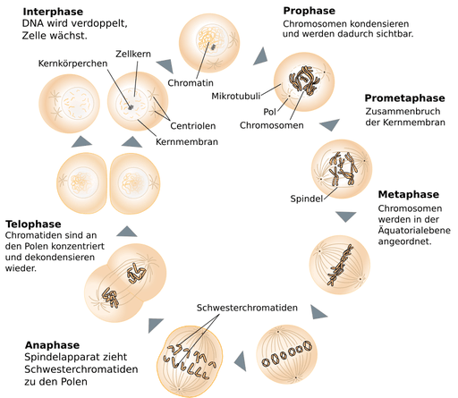
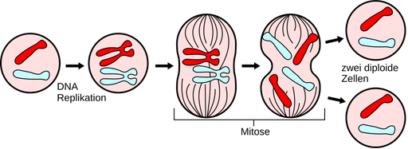
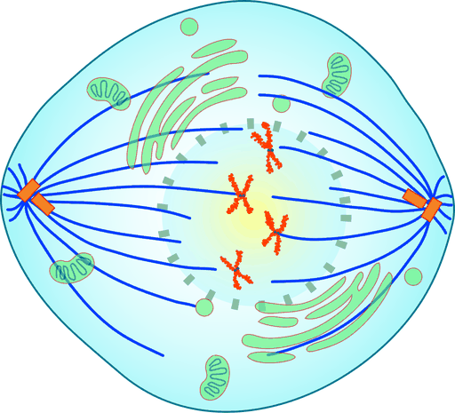

# Mitose

Als **Mitose** (von griechisch μίτος *mitos* ‚Faden‘) oder **Karyokinese** (von griechisch κάρυον *karyon* ‚Kern‘ und κίνησις *kinesis* ‚Bewegung‘), auch **indirekte Kernteilung** genannt, wird die Teilung des Zellkerns bezeichnet, bei der zwei Tochterkerne mit gleicher genetischer Information entstehen. Sie findet bei Zellen eukaryotischer Lebewesen statt – Prokaryoten haben keinen Zellkern – und geht zumeist einer Teilung der ganzen Zelle voraus, aus der zwei Tochterzellen hervorgehen.

Im Zellzyklus sich teilender Zellen von Eukaryoten sind Kernteilung und Zellteilung aneinander gekoppelt. Mitose und Zytokinese werden so zusammen auch als Mitose- oder **M-Phase** bezeichnet. Während der Interphase zwischen einander folgenden Mitosen wird das DNA-Molekül eines Chromosoms verdoppelt (Replikation), wonach jedes Chromosom aus zwei gleichen Schwester-Chromatiden besteht. Bei der Mitose werden diese Chromatiden dann getrennt und aufgeteilt, sodass jeder Tochterkern je eine identische Hälfte als Tochterchromosom erhält. Damit kann an zwei Tochterzellen jeweils eine identische Kopie des gesamten chromosomalen Genoms der Mutterzelle weitergegeben werden.

Bei der Mitose findet keine Änderung des Chromosomensatzes statt, der Ploidiegrad bleibt gleich. War die Ausgangszelle haploid, so sind auch die Kerne der Tochterzellen haploid. War die Ausgangszelle diploid, so sind auch die Kerne der Tochterzellen diploid.

Von der Mitose abzugrenzen ist die Meiose mit grundlegend anderer Weise der Kernteilung, bei der in der Reduktionsteilung die Schwester-Chromatiden nicht getrennt, sondern gemeinsam einem Tochterkern zugeteilt werden. Sie ist in den Generationenzyklus eingebunden und führt zu einer Reduktion des Chromosomensatzes sowie genetisch verschiedenen Tochterzellen.

## Geschichte

Eine Zellteilung beobachtete unter dem Mikroskop erstmals der Tübinger Botaniker Hugo von Mohl 1835 bei der Grünalge *Cladophora glomerata*, danach auch bei Landpflanzen. Teilungsformen tierischer Zellen beschrieb Robert Remak 1841 zunächst an embryonalen Blutzellen, 1851 die Teilungen der befruchteten Eizelle beim Huhn mit der Entwicklung dreier unterschiedlicher Keimblätter. Er stellte die Bedeutung des Phänomens der Zellteilung für die Bildung neuer Zellen heraus und vermutete, dass auch die neuen Zellkerne durch Teilung gebildet werden. In den folgenden Jahren sahen andere Zellforscher Teilungsvorgänge an den Zellen vieler Pflanzen und Tiere. Hugo von Mohl hatte eine für das Verständnis der Lebensvorgänge im Nachhinein wichtige Entdeckung gemacht. Der Berliner Arzt Rudolf Virchow fasste sie 1855 in dem Ausspruch *Omnis cellula e cellula* oder

> „Wo eine Zelle entsteht, da muss eine Zelle vorausgegangen sein […].“

– Rudolf Virchow

Noch aber herrschten unklare Vorstellungen über den Feinbau der damals bekannten Zellbausteine und ihre Funktion. Dies betraf insbesondere den Zellkern und seine Rolle bei der Teilung. Erst mit der Weiterentwicklung der Mikroskope und der Färbetechniken in der zweiten Hälfte des 19. Jahrhunderts konnten die Forscher neue Erkenntnisse gewinnen. So beschrieb 1873 der Giessener Zoologe Anton Schneider bei dem Plattwurm *Mesostoma ehrenbergii* („Glas-Strudelwurm“) die ablaufenden Veränderungen des Kerns bei der Teilung wie auch eine rosettenförmige Anordnung verdickter Stränge in „Aequatorialebene“.

Auch dem Bonner Botaniker Eduard Strasburger fielen 1874 in einem Präparat sich teilender Zellen *Teilungsstadien* auf mit *Kernspindeln* anstelle eines normalen Zellkerns, in denen längliche, gekrümmte oder abgewickelte Fadengebilde sichtbar waren. Wegen ihrer starken Anfärbbarkeit nannte der Kieler Anatom Walther Flemming deren Substanz *Chromatin* und bezeichnete den gesamten Vorgang der indirekten Kernteilung 1879 als „Mitose“ (nach dem griechischen Wort für „Faden“). Zuvor hatte er an Zellen des Feuersalamanders festgestellt, dass sich jeder Faden in zwei parallele trennt, dass die neuen Kerne je aus der vollen Hälfte einer Spindel entstehen – und dass nichts übrig bleibt. Der Berliner Anatom Wilhelm Waldeyer schlug im Jahre 1888 die Bezeichnung *Chromosomen* vor. Bei genauerer mikroskopischer Untersuchung stellte man fest, dass jedes Chromosom aus zwei gleichen Hälften besteht, den *Chromatiden*. Diese liegen eng aneinander, sind aber nur an einer Stelle, dem Centromer, miteinander verbunden.

Chromosomen entdeckte man nicht nur in Pflanzen- und Tierzellen, sondern auch in einigen (eukaryoten) Einzellern. Im Laufe der Zeit fand man heraus, dass jede Pflanzen- und Tierart in allen Körperzellen eine arttypische Anzahl von Chromosomen besitzt. Die Anzahl liegt zwischen zwei Chromosomen beim Pferdespulwurm (*Ascaris megalocephala univalens*) und einigen hundert bei manchen Pflanzen.

## Funktion der Mitose

Die Mitose ermöglicht es, die in den Chromosomen enthaltene genetische Information so aufzuteilen, dass zwei Tochterzellkerne wieder die gleiche Erbinformation erhalten. Dafür muss das Erbgut im Kern einer Mutterzelle zuvor – während der vorangehenden Interphase des Zellzyklus – verdoppelt worden sein. Jedes Chromosom, das nach einer Kernteilung zunächst aus einem Chromatid besteht, hat nach der Verdopplung zwei identische Schwesterchromatiden, die am Centromer zusammenhängen. Diese werden in den Mitosephasen verdichtet, angeheftet, angeordnet, je aufgetrennt und jeweils auseinanderbewegt, sodass zwei räumlich verschiedene – jedoch nach Anzahl und Art der Chromosomen identische – geordnete Ansammlungen entstehen, zwischen denen der Kern dann geteilt wird.

Bei einzelligen Eukaryoten bildet die Karyokinese zusammen mit der Zytokinese die Grundlage für ihre Vermehrung, wenn sich die Zelle nach einer Mitose teilt. Bei manchen dieser Protisten verläuft die Mitose ähnlich wie bei den mehrzelligen Eukaryoten als *offene Mitose*, das heißt, die Kernhülle wird vorübergehend zerlegt. Doch bleibt bei verschiedenen anderen Protisten die Kernhülle erhalten, sodass eine *geschlossene Mitose* stattfindet.

Bei mehrzelligen Eukaryoten ist die Mitose die Voraussetzung für die Bildung eines neuen Zellkerns und gewöhnlich – von einigen Ausnahmen abgesehen – auch für die Bildung neuer Zellen. In mehrzelligen Organismen wie den Menschen findet eine Zellteilung im Verlauf ihrer Entwicklung nicht mehr bei allen entwickelten Zelllinien statt. So vermehren sich Nervenzellen und Muskelzellen nach abgeschlossener Differenzierung nicht mehr. Diese Zellen verlassen post-mitotisch den Teilungszyklus und treten in die sogenannte *G0-Phase* ein, sodass die DNA gar nicht erst repliziert wird (siehe Zellzyklus). Reife rote Blutkörperchen des Menschen können sich nicht mehr teilen, da ihnen ihr Zellkern dann fehlt und somit keine Mitose eingeleitet werden kann. Epithelzellen im Darm und in der Oberhaut hingegen vermehren sich wesentlich häufiger als der Durchschnitt und erneuern so innere und äußere Oberflächen des Körpers.

Die eigentliche Kernteilung dauert bei menschlichen Zellen in der Regel ungefähr eine Stunde; die zwischen den Mitosephasen ablaufende Interphase des Zellzyklus sich fortlaufend teilender Zellen währt deutlich länger, abhängig vom Zelltyp etwa 12–24 Stunden. Bei anderen Organismen kann die Mitosedauer länger sein, wie bei der Ackerbohne mit etwa zwei Stunden, oder kürzer, wie bei der Fruchtfliege, wo sie oft nur 9 Minuten lang ist.

Die Mitose kann durch verschiedene sogenannte Mitogene angeregt werden. Eingeleitet wird der Kernteilungsvorgang dann durch den Mitose-promoting factor (MPF), dem Proteinverbund von Cyclin B mit einer davon abhängigen Kinase (CDK 1).

### Abgrenzung der Meiose

Von der Mitose abzugrenzen ist eine besondere Art von Kernteilung, bei der eine Reduktion des Chromosomensatzes erfolgt und keine identischen Tochterkerne entstehen. Sie tritt als Meiose oder *Reifeteilung* bei der Bildung von Keimzellen für die geschlechtliche Vermehrung auf und kann aus einer diploiden Ausgangszelle in zwei Teilungsschritten vier haploide Zellen entstehen lassen. Hierbei wird im ersten Schritt (*Reduktionsteilung*) der Chromosomensatz halbiert, während die zweite Teilung (*Äquationsteilung*) in etwa dem Ablauf einer Mitose entspricht.

## Formen einer Mitose

Mitosen in den Zellen eukaryoter Organismen laufen nach einem ähnlichen Prozessschema ab, doch nicht alle in gleicher Form. So lassen sich danach, ob während der Karyokinese die das Karyoplasma mit den Chromosomen umhüllende Kernmembran abgebaut wird oder nicht, *offene* und *geschlossene* Mitosen unterscheiden, sowie als Zwischenform mit teilweisem Abbau oder Durchbrüchen der Kernhülle eine *halboffene* Mitose. Daneben können hinsichtlich der Ausbildung des Spindelapparates annähernd achsensymmetrische Formen als „Orthomitose“ (*mittig ausgerichtet*) von anderen mit exzentrischen Spindeln geschieden werden, die als „Pleuromitose“ (*seitlich verlagert*) bezeichnet werden. Mit Bezug auf eine erhaltene Kernhülle ist darüber hinaus nach der Lage der Spindelpole die Unterscheidung in *intranukleäre* versus *extranukleäre* Formen möglich.

Eine Zellkernteilung findet überhaupt nur in Zellen von Lebewesen der Domäne der Eukaryoten (*Eukaryota*) statt, denn die der Bakterien (*Bacteria*) und der Archaeen (*Archaea*) haben keinen Kern. Die eukaryotischen Lebewesen werden taxonomisch unterschiedlich klassifiziert und in verschiedenen Gruppen, Obergruppen oder Übergruppen zusammengefasst. Eine Mitose der geschlossenen Form findet sich innerhalb jeder der *supergroups*, eine Mitose der offenen Form ebenfalls, ausgenommen für Excavata, die ausschließlich geschlossene Mitosen zeigen.

- Eine *offene Orthomitose* ist typisch für Säugetiere wie für andere Metazoa, und für Landpflanzen; sie tritt aber auch bei einigen Protisten auf.

- Eine *halboffene Orthomitose* kommt in verschiedenen Varianten bei Euamöben vor und bei grünen Flagellaten wie *Raphidophyta* oder beispielsweise *Volvox*.

- Eine *halboffene Pleuromitose* ist typisch für die meisten Apicomplexa, beispielsweise Plasmodien.

- Eine *geschlossene Orthomitose* findet sich bei Kieselalgen, bei Wimperntierchen, bei einigen Microsporidien, einzelligen Hefen und auch bei mehrzelligen Pilzen.

- Eine *geschlossene intranukleäre Pleuromitose* ist typisch für Kinetoplastiden, beispielsweise Trypanosomen, für Oxymonadiden, Foraminiferen, Strahlentierchen sowie einige grüne Flagellaten.

- Eine *geschlossene extranukleäre Pleuromitose* tritt bei Trichomonaden und bei Dinoflagellaten auf.

### Übersicht

Die Mitose wird in mehrere Phasen eingeteilt, die fließend ineinander übergehen. Während in der klassischen deutschen Literatur oft vier Hauptphasen der Mitose unterschieden werden, wobei auf die Prophase die Metaphase folgt, wird besonders in der englischsprachigen Literatur die Prometaphase als dazwischenliegende eigenständige Phase betrachtet, womit fünf Phasen der Mitose voneinander abgesetzt sind. In dieser Prometaphase zerfällt die Kernhülle für eine offene Mitose bei Zellen von Tieren und Pflanzen.

- In der *Prophase* der tierischen Zelle trennen sich die beiden Zentrosomen und wandern an entgegengesetzte Pole der Zelle. Die Zentrosomen wirken als Mikrotubuli-organisierende Zentren (englisch *microtubule organising center*, MTOC) und sind je Ausgangspunkte für die Bildung der Mitosespindel. In höheren Pflanzen übernehmen andere Zellbestandteile die Aufgabe als MTOC, denn deren Zellen besitzen keine Zentrosomen. Die Chromosomen kondensieren, werden damit lichtmikroskopisch sichtbar, und sind nur jetzt in der oft dargestellten X-Form zu sehen (während der Interphase liegen sie in ausgestreckter Form bis mehrere Zentimeter lang vor, als dünne fadenähnliche Gebilde). Da die Chromosomen bereits zuvor in der Interphase verdoppelt wurden, bestehen sie aus je zwei identischen Schwestern-Chromatiden, die noch am Centromer zusammenhängen. Das Ende der Prophase ist erreicht, wenn die Kernhülle fragmentiert (englischsprachige Literatur) oder wenn die Kondensation der Chromosomen abgeschlossen ist (klassische deutsche Literatur).
- In der *Prometaphase* zerfällt die Kernhülle und die Spindelfasern des Spindelapparats dringen von beiden Polen her in den Bereich des jetzt hüllenlosen Karyoplasmas ein. Von den sternförmig ausgehenden *astralen* und den überlappend verbindenden *polaren* werden dabei die Kinetochor-Mikrotubuli unterschieden, die im Bereich des Centromers ansetzen. Die Chromosomen können nun mittels der anhaftenden Mikrotubuli bewegt, ausgerichtet und angeordnet werden.
- In der *Metaphase* werden die stark kondensierten *Metaphasechromosomen* durch die Mikrotubuli als Spindelfasern zwischen den Spindelpolen in der *Äquatorialebene* ausgerichtet. Die Metaphase ist abgeschlossen, wenn alle Chromosomen in dieser *Metaphaseplatte* angekommen, aufgereiht und ihre Kinetochoren von beiden Polen her mit Mikrotubuli verbunden sind.
- In der *Anaphase* werden die beiden Chromatiden eines Chromosoms getrennt und längs der Spindelfasern jeweils mit dem Centromer voran in entgegengesetzter Richtung zu den Spindelpolen hin auseinandergezogen. So sammelt sich an jedem Pol ein vollständiger Satz an Chromatiden bzw. Tochterchromosomen. Damit ist die Basis für die zwei Tochterkerne geschaffen. Die Anaphase gilt als beendet, wenn sich die Chromosomen der beiden zukünftigen Tochterkerne nicht mehr weiter auseinanderbewegen.
- Als *Telophase* wird die letzte Phase der Mitose bezeichnet. Sie folgt übergangslos auf die vorausgegangene Anaphase. Die Kinetochorfasern depolymerisieren, die Kernhülle wird wieder aufgebaut und die Chromosomen dekondensieren. Nach Abschluss der Dekondensation können die Gene wieder abgelesen werden, der Kern hat wieder die Arbeitsform.

Auf die Telophase folgt in den meisten Fällen die Zytokinese, mit der die Tochterkerne dann zwei Tochterzellen zugewiesen werden können. Diese Zellteilung ist jedoch nicht Bestandteil der Mitose.

### Prophase

Die Prophase (altgriechisch πρό pro ‚vor‘) beginnt, nachdem in der Interphase die Replikation der DNA erfolgte, mit dem Kondensieren des zuvor locker gepackten Chromatins, womit die Chromosomen lichtmikroskopisch als fadenähnliche Strukturen erkennbar werden. Die zunächst noch langen dünnen Chromosomen bestehen jeweils aus einem Chromatidenpaar, das am zentralen Centromer zusammengehalten wird. Die Chromatiden falten und verdichten sich zunehmend. In dieser komprimierten Form ist die DNA nicht mehr ablesbar, eine Transkription von Genen unmöglich und die codierte Information nicht mehr exprimierbar. Daher lösen sich in der Prophase die Nukleoli als sichtbare Kernkörperchen auf, denn auch die Produktion der Ribosomenbestandteile kann wegen der Chromosomenverdichtung nicht mehr stattfinden.

#### Kondensation der Chromosomen

Während der Interphase liegt das Chromatin im Zellkern dekondensiert vor, der durchgehende DNA-Doppelstrang eines Chromosoms wird an vielen Stellen nur locker von verpackenden Proteinen umgeben und ist somit zugänglich. Zu Beginn der Prophase verdichten und verkürzen sich die Chromatinfäden durch Bindung von Condensinen zunehmend durch Faltung und mehrfache Windung in Schleifen, Wendeln und Doppelwendeln. Durch ihre hochgradige Spiralisierung entstehen lichtmikroskopisch sichtbare Gebilde, die Kernschleifen oder Chromatiden eines Chromosoms. Dies sind insofern neue Strukturen, als sie eine kompaktere, für den Transport geeignete Form der Chromatinfäden darstellen. Auch ist in diesem Zustand der DNA-Abschnitt eines Gens nicht zugänglich und dieses so nicht exprimierbar.

In der Prophase zeigt jedes Chromosom einen Längsspalt, denn es besteht aus zwei Chromatiden mit je einer replizierten DNA-Kopie. Mindestens an einer Einschnürungsstelle, dem Centromer, werden die Chromatiden zusammengehalten.

#### Spindelfaserbildung

In tierischen Zellen sind ebenfalls durch Verdopplung schon während der Interphase zwei Zentrosomen (mit je einem Zentriolenpaar) entstanden. Sie wandern nun jeweils auf gegenüberliegende Seiten des Kerns und bilden so die Pole der Spindel.
Mit den Zentrosomen wird der Aufbau des Spindelapparates aus Mikrotubuli organisiert. Diese stellen die Spindelfasern dar und werden aus Tubulin-Untereinheiten durch Polymerisation aufgebaut; sie können auch wieder depolymerisieren – ebenso wie andere Mikrotubuli des Zytoskeletts, wenn sich die Zelle abrundet. Zunächst werden von den Zentrosomen sternförmig ausgehende Spindelfasern gebildet, man spricht so auch von einer *Aster* bzw. von *astralen Mikrotubuli*.

Für die Mikrotubuli organisierenden Zentren (MTOC) sind weniger die Zentriolenpaare selbst als vielmehr mit diesen assoziierte Faktoren in der (perizentriolären) Umgebung eines Zentrosoms wichtig (nach selektiver laserchirurgischer Zerstörung der Zentriolen kann die Funktionalität der ausgebildeten Kernspindel unbeeinträchtigt bleiben). Ohne Zentriolen bzw. Zentrosomen kommen pflanzliche Zellen aus, wo andere Gebilde die Aufgabe übernehmen, Mikrotubuli als Elemente des Spindelapparats zu organisieren. Auch die *Spindelpolkörper* in Zellen von Ständerpilzen haben keine Zentriolen.

### Prometaphase

Bei einer offenen Mitose wird die Kernhülle vorübergehend abgebaut. Dies beginnt in der Prometaphase durch Phosphorylierung der Lamine, die damit nicht mehr als stabilisierende Intermediärfilamente der inneren Membranseite der doppelten Kernmembran anliegen. Die zu entgegengesetzten Polen weiter auseinandergeschobenen Zentrosomen bilden danach Ausgangspunkte für Spindelfasern. Die aussprossende Spindel dringt von beiden Polen her in das Nukleoplasma vor, wobei durch Überlappung Verbindungen zwischen den Polen entstehen, *polare Mikrotubuli* genannt. An den Centromeren der Chromosomen bilden sich dreischichtige Kinetochore, denen sich sogenannte *Kinetochor-Mikrotubuli* anheften. Diese sind für den Transport – der erst später getrennten Chromatiden – eines Chromosomen zuständig und ordnen sich parallel zu den Polfasern an.

#### Zerfall der Kernhülle

Die Prometaphase beginnt bei tierischen Zellen mit dem Auflösen der Kernhülle. Die aus diesem Zerfall hervorgehenden Fragmente sind von Anteilen des Endoplasmatischen Retikulums kaum noch unterscheidbar.

Bei einer Reihe von eukaryoten Einzellern (Protozoa) bleibt die Kernhülle während des Vorgangs der Kernteilung intakt und bietet Anheftungsstellen für die Kernspindeln. Bei Trichomonaden und manchen Dinoflagellaten liegen die Zentriolen im Zytoplasma außerhalb der erhaltenen Kernhülle; die beiden Halbspindeln des extranukleären Spindelapparats treten via Kernhülle in Kontakt zu den Chromosomen.

#### Vervollständigung des Spindelapparates

Die von den Zentrosomen ausgehenden Sternfasern oder *astralen Mikrotubuli* nehmen Kontakt mit anderen Elementen des Zytoskeletts auf. Auch entstehen überlappende Mikrotubulibildungen von einem Pol der Zelle zum anderen, Polfasern bzw. *polare Mikrotubuli*. An den Centromeren der Chromosomen befinden sich sogenannte Kinetochore. Als spezifische mehrschichtige Proteinstrukturen dienen sie der Bindung von Tubulin und führen zur Polymerisation von Mikrotubuli, die sich als *Kinetochor-Mikrotubuli* jeweils in Richtung der Pole bilden. Diese ermöglichen die Bewegung und Ausrichtung eines Chromosoms sowie die anschließende Trennung seiner Chromatiden im Bereich des Centromers.

### Metaphase

Die Metaphase (altgriechisch μετά meta ‚zwischen‘) ist die zweite Phase der Mitose, wenn man die Prometaphase nicht als eigenständige Phase betrachtet.

Die Chromosomen sind nun nahezu maximal verkürzt. Durch Zug und Schub des Spindelapparates werden sie transportiert und so mit etwa gleichem Abstand zu den beiden Spindelpolen dazwischen in der *Äquatorialebene* angeordnet. Damit liegen die Chromosomen nebeneinander in einer Ausgangsstellung, aus der heraus die Schwesterchromatiden anschließend auseinandergezogen werden können. Dies geschieht jedoch erst, nachdem all ihre Kinetochoren mit Mikrotubuli verbunden sind.

#### Metaphasenplatte

Die Anordnung der Chromosomen in der Äquatorialebene mit etwa gleichem Abstand zu den Spindelpolen wird auch als *Metaphasenplatte* bezeichnet. Mikroskopische Aufnahmen dieser Phase dienen zur visuellen Identifikation einzelner Chromosomen eines Chromosomensatzes, um den Karyotyp zu bestimmen. Wenn die Chromosomen exakt mittig ausgerichtet sind, hat die Metaphasenplatte von oben betrachtet ein sternförmiges Aussehen, was als „Monaster“ bezeichnet wird.

In diese Phase fällt auch ein Checkpoint der Mitose: Erst nach Anheftung von Mikrotubuli seitens beider Pole der bipolaren Spindel kann die zwischen den Chromatiden (durch Cohesine) bestehende Bindung gelöst werden. Die Metaphase geht in die Anaphase über, wenn sich die Schwesterchromatiden der Chromosomen an der Centromerstelle trennen; danach wandern diese als Tochterchromosomen, die jetzt nur noch aus einem Chromatid bestehen, zu den entgegengesetzten Polen.

### Anaphase

Während der Anaphase werden die beiden Chromatiden eines Chromosoms voneinander getrennt und in verschiedene Richtungen bewegt. Die Schwesterchromatiden werden damit zu Tochterchromosomen (Ein-Chromatid-Chromosomen), die längs der Spindelfasern zu den entgegengesetzten Polen der Spindel transportiert werden. Hierbei verkürzen sich die Kinetochorfasern. Währenddessen können sich die Mikrotubuli der Polfasern verlängern, wodurch die Pole voneinander abrücken.

#### Chromatidenwanderung

Die Kinetochormikrotubuli liegen etwa parallel zu den Polfasern. Nach neueren Forschungen wird angenommen, dass für das Auseinanderdriften der Chromatiden nicht Zugkräfte von den Polrichtungen ausschlaggebend sind, sondern Motorproteine an den Kinetochoren, welche entlang der Mikrotubulifilamente in Richtung der Zentrosomen wandern. Dieser Mechanismus folgt dann einem Prinzip, nach dem auch die Dynein- beziehungsweise Kinesinproteine längs eines Mikrotubulus ziehen. Die Chromatiden werden so aus ihrer zentralen Position in der äquatorialen Ebene langsam zu den Polen hin auseinandergezogen.

#### Anaphase I und Anaphase II

In der Anaphase kann unterschieden werden zwischen dem Auseinanderrücken der Chromosomen – als Anaphase I – und dem Auseinanderrücken der Spindelpole – als Anaphase II.

#### Einleitung der Zellteilung

Die gleichzeitige Verlängerung der polaren Mikrotubuli hat den Effekt, dass die beiden Polregionen, die sich in der Zelle gebildet haben, weiter voneinander abgeschoben werden und so bessere Voraussetzungen vorliegen für die Zytokinese. Eine spätere Zellteilung kann schon in dieser Phase der Kernteilung vorbereitet werden, auch durch Interaktionen mit Aktinfilamenten im Rindenanteil des Zytoskeletts unterhalb der Zellmembran. Die anschließende Telophase, mit der die Zellkernteilung abgeschlossen wird, beginnt mit dem Eintreffen der Chromosomen an den beiden Polen.

### Telophase

In der Telophase (altgriechisch τέλος telos ‚Ende‘) erreichen die Tochterchromosomen schließlich die Spindelpole und die immer weiter verkürzten Kinetochorfasern zerfallen weitgehend. Die polaren Fasern können sich zunächst noch weiter verlängern, bis die Pole ihren maximalen Abstand erreicht haben, dann löst sich der Spindelapparat auf. Größtenteils aus Fragmenten der alten Kernmembran wird nun die Kernhülle der Tochterkerne aufgebaut. Die Chromosomen dekondensieren wieder. Auch die Nukleoli erscheinen wieder als Körperchen im jeweiligen Kern (Nukleus).

Die Teilung des Zytoplasmas und damit der Zelle wird durch die Zytokinese beschrieben.

### Zytokinese

In den meisten Fällen kommt es nach abgeschlossener Karyokinese durch Zytokinese zur Teilung der Zelle. In einem Zellzyklus sind Mitose und Zellteilung gekoppelt in der *Mitosephase*.

Bei sich teilenden tierischen Zellen wird während der Telophase oder bereits der Anaphase ein kontraktiler Ring aus Aktinfasern gebildet, der zusammen mit Myosin soweit verengt wird, bis die Einschnürungen der Zellmembran fusionieren und durch diese *Teilungsfurche* getrennte Tochterzellen voneinander absetzt werden.

Bei sich teilenden pflanzlichen Zellen wird während der Telophase in der Äquatorebene eine besondere Mikrotubulistruktur gebildet, die als Phycoplast oder als Phragmoplast die Zelle quer durchspannt und ihre Zytokinese veranlasst, die durch eine trennende Furche oder über eine scheidende Platte vollzogen wird.

In der nachfolgenden Interphase des Zellzyklus, genauer deren Synthese- oder S-Phase, können in den neugebildeten Zellen die Chromatinfäden wiederum – durch Replikation des DNA-Doppelstrangs eines Chromosoms sowie die duplizierende Synthese seiner assoziierten Proteine – verdoppelt werden, sodass ein weiteres Mal eine Mitose möglich ist. An diese kann sich dann eine erneute Zellteilung anschließen.

## Mitose ohne Zellteilung

Im Anschluss an die Mitose als Kernteilung muss jedoch nicht in jedem Fall eine Zellteilung stattfinden, die Zytokinese als Teilung in Tochterzellen zählt nicht zur eigentlichen Mitose.

Auf eine Mitose folgt manchmal keine Zytokinese. Bei den mehrzelligen Tieren kann die Differenzierung von Geweben zu hochgeordneten Zusammenhängen führen, in denen funktionstragende Zellen sich nicht mehr teilen. So sind im Nervengewebe die meisten vernetzten Neuronen postmitotisch nicht teilungsfähig. Auch reife Herzmuskelzellen haben keine Teilungsfähigkeit.

Auf eine Mitose folgt manchmal noch eine Mitose. Mehrkernige Zellen können nicht nur durch Fusion von Zellen entstehen – wie bei Muskelfasern oder Osteoklasten –, sondern auch dadurch, dass Kernteilungen ohne Zellteilung aufeinanderfolgen.

Bei der Konjugation von Wimpertierchen (*Ciliata*) wird zwischen zwei einzelligen Individuen Genmaterial über eine Plasmabrücke ausgetauscht. Hierbei laufen nach meiotischen Kernteilungen auch zwei Mitosen ab, ohne dass Zellplasma aufgeteilt wird bzw. eine Vermehrung stattfindet.

Im Lebenszyklus mancher Apicomplexa, zu denen auch einige einzellige Parasiten des Menschen gehören, kommt es vor, dass sich der Zellkern zunächst mehrmals teilt, vor der Aufteilung in Tochterzellen (Schizogonie). Eine solche, *Schizont* genannte mehrkernige Zelle von Plasmodien kann bei Malariaerkrankungen innerhalb der roten Blutkörperchen gefunden werden. Bei Plasmodium falciparum, dem Erreger der *Malaria tropica*, enthält ein Blutschizont im typischen Fall 16, bei Plasmodium malariae oft 8 Zellkerne. Die im Folgeschritt durch Zellteilung entstehenden Merozoiten werden anschließend ins Blut freigesetzt, bei der *Malaria quartana* meist in synchronisierten Zyklen von rund 72 Stunden.

Die Plasmodien von Schleimpilzen (*Myxomyceten*) können zahlreiche Zellkerne innerhalb einer gemeinsamen Zellmembran aufweisen, so mehrere Tausend bei Myxogastria. Bei anderen Arten sogenannter Schleimpilze (*Dictyostelia*) schließen sich hingegen viele Einzelzellen zu einem Aggregationsverband zusammen, der als Pseudoplasmodium bezeichnet wird und erhaltene Zellgrenzen erkennen lässt.

Davon zu unterscheiden ist ein Synzytium als gemeinsamer Zellzusammenhang, der entsteht, wenn Zellen so miteinander verschmelzen, dass ihre zellmembranbestimmten Grenzen zumindest teilweise aufgehoben sind. Eine solche Zellverschmelzung kann auch als einzige große Zelle betrachtet werden, deren Zellkerne jedoch von vielen verschiedenen Zellen stammen. Ein derartiges Synzytium tritt in der ontogenetischen Entwicklung eines Menschen zu Anfang auf, wenn der Trophoblast Anschluss sucht an Gefäße in der versorgenden Gebärmutterschleimhaut, mit seinem Synzytiotrophoblast genannten Anteil. Auch hier finden dann Mitosen statt, ohne dass sich unmittelbar eine Zellteilung anschließt. Bei der Taufliege *Drosophila melanogaster* beginnt ihre Embryonalentwicklung damit, dass im befruchteten Ei in rascher Folge eine Reihe von Kernteilungen ablaufen, bevor denn Zytoplasmabereiche um die Kerne – dieses polyenergide, sogenannte synzytiale Blastoderm hat etwa sechstausend – durch die Zellmembran in einzelne Zellen aufgeteilt werden.
