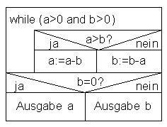
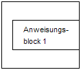
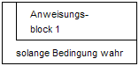

# Nassi-Shneiderman-Diagramm







Ein **Nassi-Shneiderman-Diagramm** ist ein Diagrammtyp zur Darstellung von Programmentwürfen im Rahmen der Methode der strukturierten Programmierung. Es wurde 1972/1973 von Isaac Nassi und Ben Shneiderman entwickelt und ist in der DIN-Norm 66261 festgelegt.

Da Nassi-Shneiderman-Diagramme Programmstrukturen und Kontrollstrukturen darstellen, werden sie auch als **Struktogramme** bezeichnet.

## Verwendung

Die Strukturierte Programmierung zerlegt das Gesamtproblem, das man mit dem gewünschten Algorithmus lösen will, in immer kleinere Teilprobleme – bis schließlich nur noch elementare Grundstrukturen wie Sequenzen und Kontrollstrukturen zur Lösung des Problems übrig bleiben. Diese können dann durch ein Nassi-Shneiderman-Diagramm visualisiert werden. Die Vorgehensweise entspricht der sogenannten Top-down-Programmierung, in der zunächst ein Gesamtkonzept entwickelt wird, das dann durch eine Verfeinerung der Strukturen des Gesamtkonzeptes aufgelöst wird.

Böhm und Jacopini haben 1966 nachgewiesen, dass sich jeder beliebige Algorithmus ohne unbedingte Sprunganweisung (GOTO) formulieren lässt. Für Nassi-Shneiderman-Diagramme lassen sich trivial die Kontrollstrukturen moderner Programmiersprachen finden; für Programmablaufpläne kann dies wesentlich schwieriger sein.

## Sinnbilder nach Nassi-Shneiderman

Die meisten der nachfolgenden Strukturblöcke können ineinander geschachtelt werden. Das aus den unterschiedlichen Strukturblöcken zusammengesetzte Struktogramm ist im Ganzen rechteckig, also genauso breit wie sein breitester Strukturblock.

### Process Symbol

### Decision Symbol

→ *Hauptartikel: Bedingte Anweisung und Verzweigung*

Alternative Begriffe: Verzweigung, Alternative, Selektion.

#### Ein möglicher Block

#### Zwei mögliche Blöcke

#### Beispiel für Verschachtelung

#### Case-Statement

### Schleifen

→ *Hauptartikel: Schleife (Programmierung)*

#### Iteration Symbol

#### Begin-End Symbol

#### Sonderfall: End=true

#### Sonderfall: Begin=true

#### Sonderfall: Begin=End=true

### Break

### Blockaufruf

### Parallel-Processing Symbol

## Füllregeln

### Allgemeingültigkeit

Struktogramme sollten keine programmiersprachenspezifische Befehlssyntax enthalten. Sie müssen so programmiersprachenunabhängig formuliert werden, dass die dargestellte Logik einfach zu verstehen und als Codiervorschrift in jede beliebige Programmiersprache umzusetzen ist.

### Deklaration

Weil sie ursprünglich für prozedurale Programmiersprachen entwickelt wurden, bildete man in Struktogrammen nur die Prozedur und keine Deklarationsbereiche von Variablen und Konstanten ab (einfaches Struktogramm). Dadurch ist jedoch nicht sofort deutlich, welcher Datentyp einer Variablen zugeordnet werden muss. Die Deklaration von Variablen und Konstanten ist im ersten Anweisungsblock vorzunehmen. Diese Nassi-Shneiderman-Diagramme bezeichnet man dann als erweiterte Struktogramme.

### Exklusivität

Jede Anweisung erhält einen eigenen Strukturblock (Sinnbilder nach DIN 66261). Selbst mehrere Anweisungen gleicher oder ähnlicher Art dürfen nicht in einem Strukturblock zusammengefasst werden.

Jede Anweisung muss mindestens aus einer Zuweisung bestehen (beispielsweise *Zielvariable* ← *Zielvariable* \* *AndereVariable*). Eine Zuweisung wird durch einen nach links gerichteten Pfeil dargestellt. Ältere Struktogramme benutzen alternativ aus alten Pascal-Zeiten als Zuweisungszeichen den Doppelpunkt gefolgt vom Gleichheitszeichen (*Zielvariable* := *Zielvariable* \* *AndereVariable*). Das Ziel einer Anweisung steht immer links vom Zuweisungszeichen. Rechts davon steht die Quelle.

Über jedes Struktogramm gehört ein Name, um die Identifikation durch Ereignis- oder (Unter-)Programmaufrufe gewährleisten zu können.

## Praxisrelevanz

In der Softwareentwicklung werden Nassi-Shneiderman-Diagramme heute selten eingesetzt. Dort werden vorrangig erweiterte Programmablaufpläne (Aktivitätsdiagramme der UML) verwendet.

Im Informatik-Unterricht der Sekundarstufe II werden Struktogramme verwendet, damit Schüler den Aufbau logischer Abläufe, die für die Programmierung nötig sind, trainieren können. Die Erstellung von Struktogrammen aufgrund von Beschreibungen betrieblicher Problemstellungen, die wegen wiederkehrender gleicher Vorgehensweise automatisiert werden können, ist immer noch Bestandteil vieler schulischer Abschlussprüfungen.

In der Entwicklungsumgebung EasyCODE wird direkt anhand von Nassi-Shneiderman-Diagrammen der Programmfluss festgelegt.

Nassi-Shneiderman-Diagramme können auch in technischer Dokumentation eingesetzt werden.

Die Programmiersprache Scratch stellt Programme visuell als Struktogramme dar.

## Beispieldiagramme

### Einfaches Struktogramm

Das folgende Beispiel zeigt den Ablauf des euklidischen Algorithmus zur Berechnung des größten gemeinsamen Teilers zweier Zahlen.

### Erweitertes Struktogramm

**als Nassi-Shneiderman-Diagramm …**

**… und die Umsetzung in VBA:**

```
  Option Explicit
  Private Sub btnZensur_Click()
    Dim intZensur As Integer, strZensur As String
    intZensur = InputBox("Geben Sie die Zensur als Zahl ein.")
    Select Case intZensur
       Case 1: strZensur = "sehr gut"
       Case 2: strZensur = "gut"
       Case 3: strZensur = "befriedigend"
       Case 4: strZensur = "ausreichend"
       Case 5: strZensur = "mangelhaft"
       Case 6: strZensur = "ungenügend"
       Case Else: strZensur = "ungültig"
    End Select
    MsgBox "Ihre eingegebene Zensur in Worten: " & strZensur
  End Sub
```

## Freie Struktogramm-Editoren

- Struktog.: Struktogrammeditor - Lehrstuhl für Didaktik der Informatik der TU Dresden (DDI)
- sbide: Javascript-basierter Struktogrammeditor mit C-Code-Generierung und Simulator zur Visualisierung des Programmablaufs
- Structorizer: Open-source Struktogramm-Editor für Windows/Linux/Mac
- Struktograf
- Struktogrammer
- Struktogrammeditor (whiledo)
- Hamster-Struktogrammeditor (HaSE): Ergänzung zum Hamster-Simulator des Java-Hamster-Modells.
