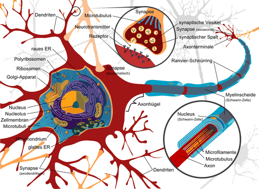
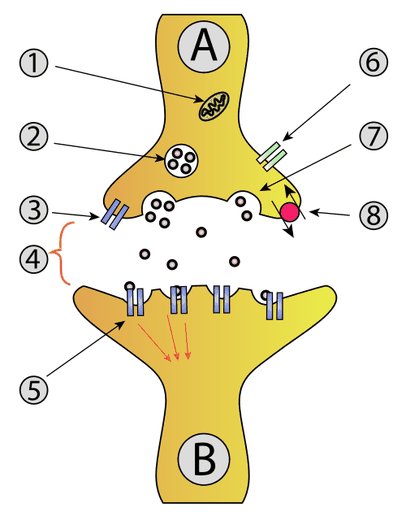
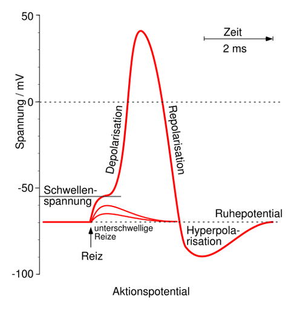

# Nervenzelle

Eine **Nervenzelle**, auch **Neuron** (von altgriechisch νεῦρον neũron „Flechse, Sehne, Nerv“) genannt, ist eine auf Erregungsleitung und Erregungsübertragung spezialisierte Zelle, die als Zelltyp in Gewebetieren und damit in nahezu allen vielzelligen Tieren vorkommt. Die Gesamtheit aller Nervenzellen eines Tieres bildet zusammen mit den Gliazellen das Nervensystem.

Eine typische Säugetier-Nervenzelle hat einen Zellkörper und Zellfortsätze zweierlei Art: die Dendriten und den Neuriten bzw. das Axon. Die verästelten Dendriten nehmen vornehmlich Erregung von anderen Zellen auf. Der von Gliazellen umhüllte Neurit eines Neurons kann über einen Meter lang sein und dient zunächst der Fortleitung einer Erregung dieser Zelle in die Nähe anderer Zellen. Dabei wird eine Spannungsänderung über den Fortsatz weitergeleitet, indem kurzzeitige Ionenströme durch besondere Kanäle in der Zellmembran zugelassen werden.

Die Enden der Axonen stehen über Synapsen in Kontakt zu anderen Nervenzellen, Muskelzellen (neuromuskuläre Endplatte) oder zu Drüsenzellen. An ihnen wird die Erregung selten unmittelbar elektrisch weitergegeben, sondern meist mittels Botenstoffen (Neurotransmittern) chemisch übertragen. Einige Nervenzellen können auch Signalstoffe in die Blutbahn abgeben, z. B. modifizierte Neuronen im Nebennierenmark oder im Hypothalamus als Sekretion von Neurohormonen.

Schätzungen nach besteht das menschliche Gehirn bei einer Masse von anderthalb Kilogramm aus fast neunzig Milliarden Nervenzellen und etwa ähnlich vielen Gliazellen.

Die Nervenzelle ist die strukturelle und funktionelle Grundeinheit des Nervensystems. Ihre Bezeichnung als *Neuron* geht auf Heinrich Wilhelm Waldeyer (1881) zurück.

## Aufbau

### Zellkörper

→ *Hauptartikel: Perikaryon*

Jede Nervenzelle besitzt einen Körper, der wie bei anderen Zellen als Soma oder neuroanatomisch als Perikaryon bezeichnet wird. Das Perikaryon umfasst hier den plasmatischen Bereich (Neuroplasma) um den Zellkern, ohne Zellfortsätze wie Neurit und Dendriten. Der Zellkörper enthält neben dem Zellkern im Cytoplasma verschiedene Organellen wie raues und glattes Endoplasmatisches Retikulum, Mitochondrien, den Golgi-Apparat und weitere. Charakteristisch für den Zellkörper von Neuronen ist das verdichtete Auftreten des Endoplasmatischen Retikulums und dessen Ansammlung als Nissl-Substanz zu Nissl-Schollen, die dagegen in den Fortsätzen und auch im Axonhügel fehlen. Im Soma werden alle Proteine und weitere wichtige Substanzen gebildet, die für die Funktion der Nervenzelle notwendig sind; abhängig von Typ und Größe des Neurons misst sein Perikaryon zwischen 5 µm und mehr als 100 µm.

Erregungen von anderen Zellen werden lokal auf die verästelten Dendriten übertragen und breiten sich als elektrische Spannungsänderungen über die Membran der Nervenzelle aus, mit zunehmender Entfernung schwächer werdend. Einander überlagernd laufen sie im Bereich des Perikaryons zusammen, wo sie gesammelt und integrierend verarbeitet werden. Dies geschieht durch räumliche und zeitliche Summation der verschiedenen Änderungen des Membranpotentials.

Vom Ergebnis der Summation am Ort des Axonhügels hängt es ab, ob hier nun das Schwellenpotential überschritten und somit jetzt ein Aktionspotential gebildet wird oder nicht (siehe Alles-oder-nichts-Gesetz). Entstehende Aktionspotentiale sind Ausdruck der Erregung einer Nervenzelle. Sie werden aufeinanderfolgend über den Axonfortsatz weitergeleitet. An dessen Endigungen wird die Erregung auf andere Zellen übertragen.

### Dendriten

→ *Hauptartikel: Dendrit (Biologie)*

Vom Zellkörper einer Nervenzelle gehen, wie um 1907 erstmals Ross Granville Harrison in einer Gewebekultur beobachtete, verschiedene plasmatische Fortsätze aus. Die Dendriten (griechisch δένδρον dendron, deutsch ‚Baum‘) sind fein verästelte Nervenzellfortsätze, die vom Soma auswachsen und Kontaktstellen für andere Zellen bilden, deren Erregung hier auf die Nervenzelle übertragen werden kann. Über eine Synapse wird das Neuron mit einer bestimmten Zelle verknüpft und nimmt mit der lokal zugeordneten postsynaptischen Membranregion eines Dendriten Signale auf. Der Dendritenbaum einer einzigen Nervenzelle kann mehrere Tausend solcher synaptischen Kontakte aufweisen, über die ihr verschiedene Signale zufließen, die je lokal als bestimmte Veränderungen des postsynaptischen Membranpotentials abgebildet werden. Die einzelnen Kontaktstellen können jeweils unterschiedlich gestaltet werden; bei manchen Neuronen finden sich dafür besondere Ausbildungen in Form dendritischer Dornen. Allein die synaptische Aktivierung am Dendriten vermag schon Veränderungen zu bewirken, die noch lange anhalten können (siehe synaptische Plastizität).

### Axonhügel

→ *Hauptartikel: Axonhügel*

Einen besonderen, von Nissl-Schollen freien Bereich des Zellkörpers bildet der Ursprungskegel des Neuriten oder Axonhügel, aus dem das eine Axon einer Nervenzelle hervorgeht. Hier ist das Schwellenpotential deutlich niedriger, sodass postsynaptische Potentiale am ehesten an dieser Stelle des Perikaryons ein Aktionspotential auszulösen vermögen. Die im anschließenden ersten Abschnitt des Axons, seinem Initialsegment, gebildeten Aktionspotentiale werden über das Axon fortgeleitet. Der Axonhügel ist damit jener Ort, an dem postsynaptische Potentialänderungen integriert und in Serien von Aktionspotentialen überführt werden und somit analoge in digitale Signale umcodiert. Durch sein niedriges Schwellenpotential und die Lage des Axonhügels wird sichergestellt, dass im Falle einer Erregung der Nervenzelle Aktionspotentiale an dieser Stelle entstehen und über ihr Axon weitergeleitet werden.

### Axon

→ *Hauptartikel: Axon und Nervenfaser*

Das Axon (griechisch ἄξων axōn, deutsch ‚Achse‘) einer Nervenzelle ist der am Axonhügel entspringende gliaumhüllte Neurit, über den ihre Erregung an andere Zellen weitergeleitet wird. Im initialen Abschnitt ausgelöste Aktionspotentiale werden über das Axon und dessen Seitenzweige (Kollaterale) bis in die terminalen Abschnitte fortgeleitet, die meist als präsynaptische Endigung ein Endknöpfchen bilden. Abhängig vom Ort der Zielzelle und je nach Art und Größe der Nervenzelle treten dabei in Länge und Durchmesser der Axone beträchtliche Unterschiede auf. Die Axone der Nervenzellen von Säugetieren sind etwa 0,05 µm bis 20 µm dick und bei Menschen ungefähr zwischen 1 µm und 1 m lang.

Im Verlauf werden diese Fortsätze der Nervenzellen von Gliazellen des Nervensystems – im peripheren von den Schwann-Zellen und im zentralen von der Oligodendroglia – umhüllt. Axon und Hülle bilden zusammen eine Nervenfaser. Wenn Gliazellen den Achsenzylinder durch mehrfache Umwicklungen einhüllen, entsteht aus ihren Membranlamellen eine isolierende Mark- oder Myelinscheide um das Axon, wobei an den Zellgrenzen jeweils eine schmale Lücke bleibt – Ranvier-Schnürring bzw. -Knoten (Nodus) genannt – zwischen den einzelnen Gliazellen aufeinander folgender Abschnitte (Internodien). Dieser Aufbau kennzeichnet markhaltige Nervenfasern und ermöglicht eine schnellere sprungweise Erregungsleitung als bei den sogenannten marklosen Nervenfasern mit einfacher Umhüllung ohne Myelinscheide.

Im Zytoplasma des Axons (Axoplasma) ist ein besonders strukturiertes Zytoskelett aus Neurofibrillen und Mikrotubuli zu finden, das insbesondere dem axonalen Transport innerhalb dieses, oft außerordentlich langen, Zellfortsatzes dient. Darüber werden die im Soma synthetisierten Proteine und Membranhüllen zum terminalen Axon transportiert (*anterograd*). Doch auch in umgekehrter Richtung findet ein rascher Stofftransport in Richtung Zellkörper statt (*retrograder Transport*).

#### Myelinscheide

→ *Hauptartikel: Myelinscheide*

Die Einhüllung eines Axons durch Gliazellen mit abschnittsweise isolierenden, mehrfachen Umwicklungen wird Markscheide oder Myelinscheide (griechisch μυελός myelos, deutsch ‚Mark‘) genannt. Solche markhaltigen Nervenfasern leiten Signale etwa zehnmal schneller als marklose gleichen Axondurchmessers und erlauben damit einem Organismus entsprechend raschere Reaktionen auf Reize der Umgebung. Während im Zentralnervensystem Oligodendrozyten Axone myelinisieren, sind es im peripheren Verlauf Schwannsche Zellen, die ein Axon umhüllen und sich bis fünfzigmal darum wickeln für die Myelinscheide. Da sich die Biomembranen der beiden Gliazelltypen etwas unterscheiden, hat das Myelin peripher eine andere Zusammensetzung aus Phospholipiden und Proteinen als zentral.

Eine einzelne Schwann-Zelle baut umwickelnd in eng gepackten Schichten, die fast nur aus Lamellen ihrer Zellmembran bestehen, einen etwa 1 mm langen Myelinscheidenabschnitt für das innenliegende Axon auf. Ein myelinisierter Axonabschnitt (Internodium) setzt sich am Knoten (Nodus) vom nächsten ab. Die Myelinscheide wird somit längs aus einer Reihung von Gliazellen gebildet und zwischen benachbarten in regelmäßigen Abständen von schmalen sogenannten Ranvierschen Schnürringen unterbrochen. Diese spielen für die Übertragung von Aktionspotentialen entlang des myelinisierten Axons eine wesentliche Rolle. Denn hier springen die Spannungsänderungen wegen der isolierenden Hülle nun depolarisierend von Schnürring zu Schnürring (saltatorische Erregungsleitung), wo dann ein Aktionspotential aufgebaut wird, während dieses bei nicht-myelinisierten Nervenfasern auf ganzer Länge der Axonmembran (Axolemm) fortschreitend geschieht und so länger dauert. Der initiale und der terminale Teil eines Axons sind in der Regel nicht myelinisiert.

#### Endknöpfchen

→ *Hauptartikel: Präsynaptische Endigung*

Ein Axon und jede seiner Aufzweigungen zu Kollateralen endet mit einem sogenannten *Endknöpfchen*, auch *Endkölbchen* beziehungsweise *Endplatte* oder *Axonterminale* genannt, das den präsynaptischen Teil einer Synapse darstellt. Synapsen verknüpfen Nervenzellen untereinander oder mit anderen Zellen so, dass eine Erregung auf einzelne nachgeschaltete Zellen übertragen werden kann.

Das Endknöpfchen am terminalen Axon dient hierbei als *Präsynapse* der „Senderzelle“. Im Bereich unter der präsynaptischen Zellmembran enthält es in gesonderten Membranhüllen synaptischer Bläschen (synaptische Vesikel) abgepackte Moleküle eines Neurotransmitters. Erreicht bei Erregung ein fortgeleitetes Aktionspotential das Endköpfchen, so strömen durch spannungsabhängige Calciumkanäle vermehrt Calcium-Ionen (Ca2+) in die präsynaptische Endigung. Dieser kurzfristige Calcium-Einstrom löst eine Kette von Interaktionen zwischen besonderen Proteinen aus, in deren Folge synaptische Vesikel an die präsynaptische Zellmembran gelagert werden und hier durch Membranfusion verschmelzen. Der Vesikelinhalt mit Neurotransmitter wird so per Exozytose in den schmalen Zwischenzellraum freigesetzt.

Auf der gegenüberliegenden Seite des synaptischen Spalts befindet sich als *Postsynapse* der postsynaptische Membranbereich der „Empfängerzelle“, die hier mit Rezeptoren bestückt ist, an welche die Transmittermoleküle binden. Daraufhin werden Ionenkanäle geöffnet, was an der postsynaptischen Membran zu einer Änderung der elektrischen Spannung führt, die sich auf benachbarte Regionen ausbreitet. Der synaptische Spalt zwischen den beiden Zellen ist als etwa 30 nm schmaler Zwischenraum ein Teil des Extrazellularraums, in dem sich die Transmittermoleküle per Diffusion verteilen.

### Synapse

→ *Hauptartikel: Synapse*

#### Funktion

Die Synapse ist die Stelle, an der Erregung von einer Zelle auf eine andere übertragen werden kann. Dabei wird zumeist ein Neurotransmitter benutzt, um die schmale Lücke zwischen den Zellen, synaptischer Spalt genannt, zu überbrücken. Synapsen lassen sich als Schnittstellen zwischen Zellen auffassen, über die Nervenzellen mit anderen Zellen kommunizieren.

Eine einzelne Nervenzelle kann über zahlreiche Synapsen mit anderen Zellen in Beziehung sein, bezüglich der eingehenden Signale ebenso wie der ausgehenden. Eine Purkinjezelle des Kleinhirns beispielsweise nimmt über rund 100.000 dendritische Synapsen Eingangs-Signale anderer Neuronen auf. Eine Körnerzelle im Kleinhirn sendet über mehrere hundert Synapsen Ausgangs-Signale an andere Neuronen, auch Purkinjezellen. Die Gesamtzahl an Synapsen im menschlichen Gehirn wird auf etwas unter einer Billiarde geschätzt.

Die Neuronen als Teile des Nervensystems sind selten unmittelbar durch elektrische Synapsen miteinander verbunden, sondern zumeist über chemische Synapsen. Diese Übertragung von Signalen mittels Botenstoffen kann in verschiedener Art modifiziert bzw. moduliert werden. Die Bedingungen der Signalübertragung liegen somit nicht völlig fest, sondern sind in gewissen Grenzen formbar, was als synaptische Plastizität bezeichnet wird. Auf diese Weise miteinander verknüpft, bilden Neuronen insgesamt ein formbares neuronales Netzwerk, das sich durch den Akt der Nutzung in seiner Wirkung verändern kann (neuronale Plastizität).

Informationstechnisch lassen sich Grundzüge der Vernetzung von Neuronen stark vereinfacht nachbilden. Ebenso lässt sich ein künstliches neuronales Netz mit anderer Architektur entwerfen, das beispielsweise schrittweise so trainiert werden kann, dass es zur Erkennung komplexer Muster geeignet ist. Hierbei verankert sich der Lernprozess in Verschiebungen der Gewichtungen zwischen Neuronenelementen bzw. ihres Schwellwertes.

#### Neurotransmitter

→ *Hauptartikel: Neurotransmitter*

Neurotransmitter dienen an chemischen Synapsen als Botenstoffe für die Erregungsübertragung von einer Nervenzelle auf eine andere Zelle (*Transmission*). Die Transmitter werden bei Erregung der „Senderzelle“ präsynaptisch ausgeschüttet, überbrücken den synaptischen Spalt zwischen den Zellen und werden postsynaptisch von der „Empfängerzelle“ mittels besonderer Rezeptorproteine empfangen. Diese erkennen das jeweilige Transmittermolekül spezifisch an seiner räumlichen Form und Ladungsverteilung durch komplementäre Strukturen und binden es reversibel.

Die Bindung führt zu einer Umbildung der Rezeptorstruktur (Konformationsänderung). Dies kann direkt (*ionotrop*) auslösend oder mittelbar (*metabotrop*) anstoßend die Öffnung von Ionenkanälen in der Membran beeinflussen, dadurch kurzzeitig Ionenströme zulassen und damit vorübergehend eine Änderung des Membranpotentials dieser Region herbeiführen. Je nach Ausstattung der postsynaptischen Membran wird als lokale Antwort dann eine Potentialdifferenz (postsynaptisches Potential, PSP) hervorgerufen, welche entweder die Erregung der Empfängerzelle begünstigt bzw. auslöst (erregend, exzitatorisches PSP) oder aber deren Erregung für kurze Zeit erschwert bzw. verhindert (hemmend, inhibitorisches PSP).

Die mittels des Transmitters übertragene Erregung wirkt an einer chemischen Synapse also entweder erregend oder hemmend auf die nachgeordnete Zelle, was durch die Rezeptortypen und die Ionensorten der beeinflussten Membrankanäle in der jeweils verknüpften Zelle festgelegt wird. Bei neuromuskulären Synapsen beispielsweise werden Impulse erregter Nervenzellen an motorischen Endplatten mittels Acetylcholin (ACh) als Transmittersubstanz auf Muskelfasern übertragen und wirken auf diese Effektoren erregend, das postsynaptische Endplattenpotential kann also ein Aktionspotential dieser Zellen auslösen. In den Muskelzellen führt dieses zur Kontraktion, was sich am zugehörigen Erfolgsorgan als Verkürzung des Muskels zeigen kann. Begrenzt wird die Wirkung des möglicherweise erneut bindenden Transmitters hier vor allem durch dessen enzymatische Zerlegung (Acetylcholinesterase) im synaptischen Spalt.

## Arbeitsweise

Eine Nervenzelle erhält ein Signal, indem Neurotransmitter, die beispielsweise von einer vorgelagerten Zelle ausgeschüttet wurden, an spezielle Rezeptoren in der postsynaptischen Membran in den Dendriten oder auch des Somas der zu erregenden Zelle anbinden. Ist die Erregung auf diese Weise übertragen, wird sie über die Dendriten an das Soma der Nervenzelle und von dort zum Axonhügel weitergeleitet. Jede der eingehenden Depolarisationen an den verschiedenen Synapsen der Nervenzelle verändert dabei das Membranpotential an der axonalen Membran, wo bei Überschreiten eines Schwellenwertes ein Aktionspotential ausgelöst wird. Generell gilt: Je näher eine Synapse am Soma ansetzt, desto stärker ist ihr Einfluss auf die Nervenzelle, je länger der Weg, den die Erregung zurücklegen muss, desto schwächer wird der Einfluss. Eine stärkere Reizung eines Dendriten resultiert also in einer stärkeren Depolarisierung (siehe zweiten Graph im Bild rechts). Nahezu gleichzeitig einlaufende Reize addieren sich in ihrer Wirkung, was bedeutet, dass sich innerhalb der Zelle und am Axonhügel ein Erregungspotential aufbaut (Summation).

Im Axonhügel entscheiden nun bestimmte Faktoren nach den Regeln des Alles-oder-nichts-Gesetzes über das Auslösen eines Aktionspotentials, wobei entschieden wird, ob das Schwellenpotential erreicht und überschritten wurde. Ist dies der Fall, kommt es jetzt zur Freisetzung des Aktionspotentials entlang des Axons durch die Depolarisation des Axons. Das wiederum geschieht an der Biomembran, dem sogenannten Axolemm, welches den intrazellulären Bereich (Innen) vom extrazellulären Bereich (Außen) abgrenzt.

Im Inneren des Axons wie auch außerhalb der Membran befinden sich Ionen. Die Biomembran des Axons bewirkt, dass zwischen Innen und Außen verschiedene Konzentrationen der Ionen bestehen, so dass an der Außenwand des Axons eine andere elektrische Ladung anliegt als Innen – das Zellinnere ist negativ geladen. Man spricht von einer Polarisation oder einem Ruhepotential. Die Herstellung und Aufrechterhaltung der Polarisation verrichtet die Axolemm mit Hilfe einer Natrium-Kalium-Pumpe, benannt nach den Ionen der Elemente Natrium und Kalium, die bei der Erregungsübertragung eine wichtige Rolle spielen. Diesen Vorgang nennt man aktiven Transport, da bei ihm Energie zugeführt werden muss. Wandert nun ein Aktionspotential durch die Änderung des Konzentrationsgefälles der Ionen innerhalb des Axons am Axon entlang bis zum Endknöpfchen, so stößt dieser elektrische Impuls am Ende des Axons an eine Grenze, da eine Übertragung des elektrischen Signals durch den synaptischen Spalt zwischen den beiden Zellen nicht möglich ist. Der Reiz wird chemisch über die Synapsen weitergeleitet und analog dem schon beschriebenen Vorgang auf eine andere Zelle übertragen.

Sobald ein Aktionspotential ausgelöst wurde, braucht die Zelle Zeit, um das Membranpotential wieder aufzubauen (Repolarisation). Während dieser Pause, auch Refraktärphase genannt, kann kein neues Aktionspotential ausgelöst werden. Wenn also von nacheinander einlaufenden Reizen einer so stark ist, dass die Zelle ein Aktionspotential bildet und der nachfolgende Reiz während der Refraktärzeit einläuft, bildet die Zelle dafür kein neues Aktionspotential aus.

Je mehr Aktionspotentiale die Zelle pro Zeitspanne abfeuert, desto stärker ist der Reiz. Die Erregungsleitung ist grundsätzlich in beide Richtungen möglich. Bedingt durch die Inaktivierung der Natrium-Kanäle erfolgt die Weiterleitung der Aktionspotentiale bevorzugt in eine Richtung. Man sagt auch, die Nervenzelle feuert. Dies kann sie in einer Sekunde bis zu 500-mal.

Voraussetzung für die Funktion des Neurons ist also seine Fähigkeit, einen elektrischen Impuls zu empfangen und weiterzuleiten. Dabei spielen wichtige Faktoren eine Rolle: die elektrische Erregbarkeit (den Impuls empfangen), das Ruhepotential (die Möglichkeit, ihn zu integrieren), das Aktionspotential (ihn weiterzuleiten und zu übertragen) und die Erregungsleitung (ihn zielgerichtet zu übertragen).

### Morphologische Unterscheidung

Die im Nervensystem anzutreffenden Neuronen können sich auf mehrere Weise in Aufbau und Funktion unterscheiden. Optisch lassen sie sich dabei gut durch die Art und Anzahl ihrer Fortsätze klassifizieren.

#### Unipolare Nervenzellen

→ *Hauptartikel: Unipolare Nervenzelle*

Es gibt *unipolare Nervenzellen*, die nur mit einem einzigen, kurzen Fortsatz ausgestattet sind, der in der Regel dem Neurit bzw. Axon entspricht. Man findet sie beispielsweise als primäre Sinneszellen in der Netzhaut des Auges.

#### Bipolare Nervenzellen

→ *Hauptartikel: Bipolare Nervenzelle*

Eine *Bipolare Nervenzelle* ist ein Neuron mit zwei Fortsätzen. Bipolare Zellen sind spezialisierte Sensorneuronen für die Vermittlung bestimmter Sinne. Als solche sind sie Teil der sensoriellen Informationsübertragung für Geruchssinn, Sehsinn, Geschmackssinn, Tastsinn, Gehör und Gleichgewichtssinn.

Als Beispiele werden meistens die bipolaren Zellen der Retina und der Ganglien des Hör-Gleichgewichtsnervs angegeben. Wenn genauere Angaben fehlen, bezieht sich der Begriff gewöhnlich auf die zur Netzhaut gehörenden Zellen.

#### Multipolare Nervenzellen

Eine sehr häufig vorkommende Gruppe sind die *multipolaren Nervenzellen*. Sie besitzen zahlreiche Dendriten und ein Axon. Diesen Zelltyp findet man zum Beispiel als motorische Nervenzelle im Rückenmark.

#### Pseudounipolare Nervenzellen

→ *Hauptartikel: Pseudounipolare Nervenzelle*

Ebenfalls über zwei Fortsätze verfügen die *pseudounipolaren Nervenzellen*. Dort jedoch gehen Dendrit und Axon nahe dem Zellkörper ineinander über. Man findet sie bei sensiblen Nervenzellen, deren Perikaryen in den Spinalganglien liegen. Die Erregung durchläuft so nicht erst das Perikaryon, sondern geht direkt vom dendritischen auf das neuritische Axon über.

### Unterscheidung nach Myelinisierung

Eine weitere optische Unterscheidungsmöglichkeit ist die Ausprägung der Myelinscheide durch Schwannsche Zellen im Bereich des Axons. Es existiert hier sowohl eine markhaltige als auch eine marklose Form, wobei diejenigen Nervenfasern als markhaltig bezeichnet werden, deren Axone mit einer starken Myelinscheide umhüllt sind. Ist diese Myelinscheide sehr dünn, wird die betreffende Nervenfaser als markarm oder marklos bezeichnet (bei ausdifferenzierten Zellen).

### Funktionelle Unterscheidung

Eine weitere Möglichkeit der Unterscheidung bieten die einzelnen Funktionen der Nervenzellen. Allgemein unterscheidet man hier die motorischen Neuronen, die sensorischen Neuronen und die Interneuronen.

- Sensorische und sensible Neuronen, auch als afferente Nervenzellen bezeichnet, leiten über Nerven oder Nervenfasern Informationen von den Rezeptoren der Sinnesorgane oder aus verschiedenen Organen an Gehirn und Rückenmark bzw. zu den Nervenzentren des Darmes weiter. Die übermittelten Informationen dienen der Wahrnehmung und der motorischen Koordination.
- Motorische Neuronen, auch als efferente Nervenzellen oder Motoneuronen bezeichnet, übermitteln die Impulse von Gehirn und Rückenmark zu den Muskeln oder Drüsen und lösen dort beispielsweise eine Kontraktion der Muskelzellen aus oder sorgen für die Absonderung von Sekreten bzw. die Ausschüttung von Hormonen.
- Interneuronen bilden die größte Menge an Neuronen im Nervensystem und sind nicht spezifisch sensorisch oder motorisch. Sie verarbeiten Informationen in lokalen (örtlichen) Schaltkreisen, oder vermitteln Signale über weite Entfernungen zwischen verschiedenen Körperbereichen. Sie haben eine Vermittlerfunktion. Man unterscheidet hier zwischen lokalen, regionalen, segmentalen und intersegmentalen Interneuronen.

### Pigmentablagerungen

In bestimmten Kernen des zentralen Nervensystems werden im Normalzustand Ablagerungen von Pigment innerhalb der Nervenzellen beobachtet. Besonders auffällig ist das Neuromelanin in der Substantia nigra und dem Locus caeruleus, das den Neuronen ein charakteristisches braun-schwarzes Aussehen verleiht und diese Kerngebiete bereits mit bloßem Auge erkennen lässt. Der Anteil des gelblichen Lipofuszin nimmt mit dem Alter zu und wird insbesondere im Nucleus dentatus des Kleinhirns und dem unteren Kern der Olive beobachtet. Bei bestimmten dementiellen Erkrankungen, wie dem Morbus Alzheimer werden charakteristische eosinophile Einschlusskörperchen der Nervenzellen beobachtet.

### Wirkung von Giften

Nervengifte wirken in der Regel auf die vorhandenen Eiweißstrukturen der Zelle und stören auf diese Weise den Informationsaustausch unter den Neuronen. Es gibt zahlreiche Beispiele für solche Neurotoxine, eins davon ist Diisopropylfluorphosphat (DFP). Gelangt DFP in den Körper, so bindet es dort irreversibel an das Enzym Acetylcholinesterase, welches für den Abbau von Acetylcholin in der Synapse von beispielsweise Motoneuronen verantwortlich ist. Dadurch steigt die Konzentration des Transmitters Acetylcholin im synaptischen Spalt und es kommt zu einer Dauererregung der innervierten Muskelzelle. Die folgende Übererregung kann im betroffenen Organismus zu schweren Krämpfen und bis zum letalen Ausgang (Tod) führen.

Tetrodotoxin (TTX, Gift des Kugelfisches) blockiert Natriumkanäle. Tetraethylammonium (TEA) blockiert Kaliumkanäle.

Einige bekannte Gifte sind
