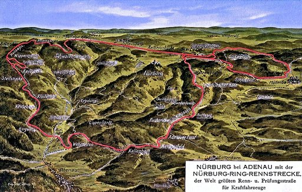
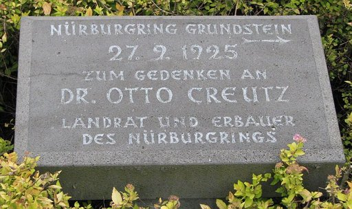
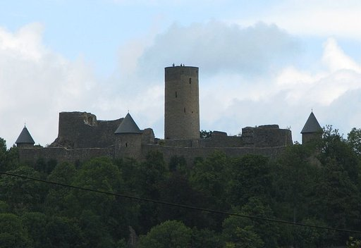

# Nürburgring

Der **Nürburgring** ist eine Motorsport-Rennstrecke in der Eifel rund um die namensgebende Burg und wurde am 18. Juni 1927 eingeweiht. Die ursprünglich insgesamt bis etwa 28 Kilometer lange „Gebirgs-Renn- und Prüfungsstraße“ war in ihrer Urform bis 1982 in Betrieb. Der Nürburgring ist die längste permanente Rennstrecke der Welt.

## Aktuelle Rennstrecke und Betreiber

1984 wurde im Bereich der Start-und-Ziel-Schleife und der Südschleife die damals „modernste und sicherste Grand-Prix-Strecke der Welt“ eröffnet. Die zunächst 4,5 Kilometer lange Strecke wurde direkt an die 20,8 Kilometer lange Nordschleife angebunden. Beide Teilstrecken können zu einem 26 Kilometer langen Gesamtkurs zusammengefasst werden, der jedoch nur in abgeänderter Form für Rennen benutzt wird: Bei NLS/VLN-Rennen ohne die „Müllenbachschleife“ (24,433 Kilometer), beim 24-Stunden-Rennen ohne die „Mercedes-Arena“ (25,378 Kilometer). Weiterhin kann die Grand-Prix-Strecke in die „Sprintstrecke“ (sogenannte kurze Variante) und die Müllenbachschleife (südlicher Teil der Strecke) unterteilt werden.
Im Zuge des Projekts „Nürburgring 2009“ wurde ab 2007 in rund zweijähriger Bauzeit ein großes Freizeitzentrum mit Achterbahn, Einkaufszentrum, das Eifeldorf „Grüne Hölle“ mit Discothek Eifel Stadl, Hotel und Feriendorf in unmittelbarer Nähe der Rennstrecke errichtet.

Nachdem die *Nürburgring GmbH* im Sommer 2012 Insolvenz angemeldet hatte, wurde die Strecke zum 1. Januar 2015 an den Autoteilezulieferer Capricorn zusammen mit der Motorsportfirma Getspeed verkauft. Ab Ende Oktober 2014 hielt der russische Milliardär Wiktor Charitonin durch die *NR Holding* zwei Drittel der Anteile am Nürburgring und hatte damit die Capricorn-Anteile übernommen. Ein weiteres Drittel gehörte weiterhin Getspeed. 2016 änderten sich die Eigentumsverhältnisse erneut. Der Minderheitsgesellschafter Getspeed gab seine Anteile bis auf 1 % an die NR Holding ab, die dementsprechend heute 99 % der Anteile an der Rennstrecke hält.

Betrieben wird der Nürburgring durch die *Nürburgring 1927 GmbH & Co. KG*, eine 100-%-Tochter der Nürburgring Eigentümergesellschaft. Nach eigenen Angaben schreibt die Nürburgring 1927 GmbH & Co. KG schwarze Zahlen. Zum Veranstaltungsangebot gehören nach wie vor Motorsportereignisse wie das *ADAC RAVENOL 24h-Rennen*, aber auch Musikfestivals wie *Rock am Ring* und Sportveranstaltungen. Daneben wird die Strecke wochentags für Testfahrten und andere fahraktive Veranstaltungen genutzt. Im vermarktbaren Zeitraum von Mitte März bis Mitte November sind nach Angaben des Nürburgrings beide Abschnitte – Grand-Prix-Strecke und Nordschleife – täglich voll ausgelastet.

### 1904 bis 1925: Idee und Planung

Im Jahr 1904 veranstaltete der Belgische Automobilclub ein Rundstreckenrennen in den Ardennen, in Italien wurde zur gleichen Zeit der *Coppa Florio* ausgetragen und in den USA wurde der *Vanderbilt Cup* veranstaltet. All diese Rennen waren gut besucht und erfreuten sich hoher Beliebtheit, sodass am 17. Juni 1904 in Homburg v. d. Höhe das *Gordon-Bennett-Rennen* stattfinden konnte. Das Rennen, bei dem Fahrer aus Deutschland, der Schweiz, Frankreich, England, Italien und den USA teilnahmen, führte zu einer grundlegenden Erkenntnis in Deutschland: Der Motorsport ist populär und bringt auch finanziell große Erfolge, kann aber aus Aspekten der Sicherheit der Fahrer und Zuschauer und aus logistischen Gründen nicht mehr auf deutschen Landstraßen ausgetragen werden. Daher wurde schnell klar, dass man in Deutschland eine vom Straßenverkehr unabhängige Strecke braucht, auf der auch die deutschen Automobilhersteller ihre Modelle erproben können.

Kaiser Wilhelm II. ließ daraufhin Pläne für eine Rennstrecke ausarbeiten, die für diese Anforderung geeignet war. Schnell kristallisierte sich die Eifel als bestgeeigneter Ort für solch eine Strecke heraus: Sie verfügte über eine niedrige Besiedlung, über Hochflächen und Täler sowie einige große ebene Flächen. Die extremen Steigungen und Gefälle waren ideale Voraussetzungen für eine Rennstrecke mit großen Höhenunterschieden. Nach 1907 verlor der Motorsport jedoch schnell wieder an Popularität und die Planungsarbeiten am Projekt wurden eingestellt.

Nach dem Ersten Weltkrieg erlebte das Automobil in Deutschland einen erheblichen Aufschwung; die Zahl der Automobil- und Motorradfabriken stieg schnell an. Die zunehmende Motorisierung sorgte für eine Wiederbelebung des Motorsports. Allgemeiner Deutscher Automobil-Club (ADAC) und der Automobilclub von Deutschland (AvD) förderten den Motorsport, sodass zunehmend Veranstaltungen stattfanden und sich ihm immer mehr Menschen verschrieben. Der Wunsch nach einer geeigneten Rennstrecke kam wieder auf, also wurden die Pläne von 1907 wieder aufgegriffen.

### Strukturförderung

Als Standort für die neue Rennstrecke wurde erneut die Eifel ausgewählt. Neben den oben angesprochenen geographischen Vorteilen beachtete man einen weiteren Punkt: Die Eifel war auch nach dem Ersten Weltkrieg eine sehr strukturschwache Region mit geringer Industrialisierung (die ansässige Tabak- und Tuchindustrie spielte kaum mehr eine Rolle), Ackerbau konnte in der Eifel wegen steiniger Böden in nur geringem Umfang betrieben werden. Somit kamen die Planer zur Erkenntnis, dass der Bau der Rennstrecke in der Eifel eine Verbesserung der Wirtschafts- und Infrastruktur bewirken könnte.
Zur Förderung der regionalen Wirtschaftsstruktur trug die Rennstrecke in den ersten Jahren ihres Bestehens nur bedingt bei, obwohl der Nürburgring zur besucherstärksten Rennstrecke im Deutschen Reich noch vor der Berliner Avus wurde. An Renntagen gingen die Zuschauerzahlen in die Hunderttausende. Davon profitierten regionale Anbieter aus der Nahrungsmittelbranche (Bäckereien, Metzgereibetriebe) und der Gastronomie. Der erhoffte Mehrabsatz von regionalem Wein ließ sich allerdings nicht erreichen. Übernachtungsbetriebe erzielten an den Tagen von Rennveranstaltungen gute Auslastungen, sofern sie in der Nähe der Rennstrecke angesiedelt waren. Längere Urlaubsaufenthalte im Ahrtal abseits der wenigen Tage im Jahr mit motorsportlichen Veranstaltungen blieben in den Jahren bis 1933 auch bedingt durch die Weltwirtschaftskrise hinter den Erwartungen zurück.

### Rennsport in der Eifelregion vor Baubeginn

Bevor der Bau beschlossen wurde, führte der ADAC-Rheinland das 1. Eifelrennen durch.
Auf einer 33 km langen Rundstrecke bei Nideggen fanden am 15. Juli 1922 Rennen in vier Tourenwagen- und fünf Motorradkategorien statt. Insgesamt 134 Fahrer nahmen teil. Dieses erste Eifelrennen besuchten etwa 40.000 Zuschauer, wodurch die Entscheidung, einen Rennkurs zu bauen, gefördert wurde. Der ADAC Gau Rheinland nahm die Planung in die Hand.
Mitte des Jahres 1923 nahm der ADAC Verhandlungen mit der Stadt Münstereifel auf. Dort hatte man den Stadtwald als Gelände angeboten. Die Verwirklichung scheiterte jedoch, da die zur Finanzierung der Trasse erforderlichen Kredite nicht bewilligt wurden.

Im Rahmen des Zweiten Eifelrennens, das in der Zeit vom 17. bis 19. Juli 1924 stattfand, kam es zu einer entscheidenden Unterhaltung zwischen Hans Weidenbrück, Pächter der Nürburger Gemeindejagd, Xaver Weber, Kreistagsmitglied von Adenau, und Hans Pauly, Gemeindevorsteher von Nürburg. Bei der Diskussion über die während eines Rennens drohenden Gefahren für Fahrer und Zuschauer erinnerte Weidenbrück an die im Jahr 1907 begonnenen, aber nicht beendeten Planungen zum Bau einer Rennbahn. Er trug die Vorteile des Gebiets in der Gegend zwischen Adenau und Mayen zusammen, stellte sie in Kontrast zum aktuellen Austragungsort des Eifelrennens um Nideggen und wurde daraufhin beauftragt, seinen Plan dem ADAC in Köln vorzutragen. Nach einer ersten Besprechung zwischen dem ADAC und Weidenbrück gründete Letzterer einen eigenen Automobilclub, dessen einziger Zweck es war, den Bau der Rennstrecke im Westen Deutschlands in die Tat umzusetzen. Vorsitzender dieses Clubs wurde Otto Creutz, der neugewählte Landrat des Kreises Adenau.

### 1925 bis 1927: Die Bauphase

Es verging kein Monat, bis beim ADAC erneut über den Bau einer Rennstrecke nachgedacht wurde, dieses Mal jedoch sehr intensiv. Nach diesem Treffen begann Creutz nun, das Konzept zum Bau dieser Rennstrecke zu entwickeln. Die in sich geschlossene „endlose“ Rennstrecke sollte ihm zufolge auch um die Nürburg führen. Ein wichtiges Detail wurde vom ADAC dabei von Beginn an berücksichtigt und in die Überlegungen eingebunden: Die Rennstrecke sollte keine Verbindung zum öffentlichen Straßennetz haben, dennoch sollte nach den Wünschen Creutz’ ein gewisser „Landstraßencharakter“ entstehen. Dabei wurde jedoch nicht aus den Augen verloren, dass die neue Rennstrecke auch eine Teststrecke für Fahrzeugerprobungen werden sollte. Daher sollten möglichst viele Eigenschaften von europäischen Landstraßen simuliert werden, so zum Beispiel langgezogene Streckenabschnitte für das Testen hoher Geschwindigkeiten sowie kurvenreiche Steigungen (insgesamt waren mehr als 170 Kurven geplant) mit Gradienten von bis zu 17 Prozent.

Am 15. April 1925 traf Creutz sich – unterstützt vom Zentrum – mit Vertretern des Preußischen Wohlfahrtsministerium und des Reichsverkehrsministeriums in Berlin. Er legte die Wichtigkeit des Baus der Rennstrecke im „ärmsten Kreis im Lande Preußen“ dar und bezeichnete sie als „Notstandsmaßnahme im Rahmen der produktiven Erwerbslosenfürsorge.“

Danach war der Bau der Strecke endgültig beschlossen. Die Kosten wurden mit 2,5 Millionen Reichsmark kalkuliert. Ende April 1925 begannen die Vermessungsarbeiten, nachdem vorher schon kleinere Arbeiten am geplanten Streckenverlauf durchgeführt worden waren. Am 20. Mai 1925 bestätigte Johannes Fuchs das Baugelände, am 13. Juni des gleichen Jahres wurde das Ingenieurbüro Gustav Eichler, Ravensburg, beauftragt, die Bauleitung zu übernehmen. Drei Tage später gingen die offiziellen Pressemitteilungen an die deutsche Sportpresse, die bereits am 24. Juni den Lageplan und die Bauentwürfe veröffentlichte. Das Ingenieurbüro fertigte einen Kostenvoranschlag in Höhe von 4 Millionen Reichsmark an. Unberücksichtigt blieben dabei die Aufwendungen für die erforderlichen Hochbauten, da diese Arbeiten nicht zu den Notstandsarbeiten gehörten und dementsprechend nicht mit Steuermitteln finanziert werden durften.

Die Planungen für die Rennstrecke sahen wie folgt aus: Die Gesamtlänge der Strecke sollte 28,3 Kilometer betragen. Dazu wurden verschiedene Streckenführungen entworfen. Der längste Streckenteil war die *Nordschleife* mit einer Länge von 22,8 Kilometern. Daneben wurden auch die Strecken der *Südschleife* mit einer Länge von 7,7 Kilometern und der *Start-und-Ziel-Schleife* mit einer Länge von 2,2 Kilometern festgelegt. Die längste Gerade sollte 2,6 Kilometer lang sein und bis zum Tiergarten reichen. Die durchschnittliche Breite der Bahn wurde mit acht Metern angesetzt. Die Streckenführung sollte Gefälle von elf Prozent und Steigungen bis 17 Prozent aufweisen, daneben wurde eine *Steilstrecke* mit einer Steigung von bis zu 27 Prozent entworfen. Darüber hinaus wurden ein zweistöckiges *Start-und-Ziel-Haus,* sowie eine Boxengasse mit 50 Boxen und ein modernes, für die damalige Zeit, großzügiges Rennfahrerlager (das heutige Historische Fahrerlager) mit 70 abschließbaren Garagen für die Teams geplant. Diese Zahlen sind teilweise heute noch aktuell.

Die Arbeiten an der neuen Rennstrecke begannen am 1. Juli 1925, obwohl die erforderliche Baugenehmigung erst Anfang August erteilt wurde. Am 13. August erklärte das Preußische Wohlfahrtsministerium die Bauten formell zu *großen Notstandsarbeiten*.
Der Landkreis Adenau konnte nicht die benötigte Anzahl an Arbeitern aufbringen. Deshalb wurden Arbeitskräfte aus den Regierungsbezirken Koblenz und Köln nach Adenau gebracht. Zur Unterbringung dieser Arbeiter wurden Baracken errichtet.

Am 27. September fand die offizielle Grundsteinlegung statt, die Johannes Fuchs durchführte. Im Rahmen dieses offiziellen Baubeginns bekam die Rennstrecke den vom Regierungspräsidenten Francis Kruse vorgeschlagenen Namen *Nürburgring*. Namensgeber war die Burgruine Nürburg bzw. die gleichnamige Ortschaft, die ebenso wie Quiddelbach, Herschbroich und Breidscheid innerhalb der heute 20,8 Kilometer langen Nordschleife liegen.

Zu Beginn des Jahres 1926 waren über 2.100 Bauarbeiter beschäftigt, zu Höchstzeiten arbeiteten sogar 2.500 Menschen an der Fertigstellung. Insgesamt leisteten sie etwa 784.500 Tagewerke, bewegten 152.097 Kubikmeter Erdreich, 184.693 Kubikmeter Gestein und verarbeiteten 11.119 Kubikmeter Beton.

Zur Vermarktung der Strecke wurde zum 25. Februar 1927 eine *Reklame-Gesellschaft „Nürburg-Ring“ GmbH* gegründet. Bereits im Jahr zuvor, zum 20. März 1926, wurde „Nürburg-Ring“ als Wortmarke angemeldet, der Markenschutz wurde allerdings erst nach ungewöhnlich langer Prüfdauer durch das Reichspatentamt zum 5. Juni 1929 unter der Warenzeichennummer 403.841 erteilt. Im April 1926 erschien bereits vor Fertigstellung des Baus der Rundstrecke die erste Ausgabe einer Zeitschrift namens *Nürburgring*; sie wurde mit einer Auflage von 12.000 Exemplaren gedruckt. Die ersten Fahrten auf fertiggestellten Abschnitten des Nürburgrings wurden am 28. August vom ADAC Adenau durchgeführt. Zur selben Zeit musste die Baukostenplanung von zuvor 5 Millionen Reichsmark auf etwa 8,1 Millionen Reichsmark und später nochmals auf 14,1 Millionen Reichsmark nach oben korrigiert werden. Bereits zwei Jahre nach Baubeginn konnte der Nürburgring eröffnet werden.

### 1927 bis 1970

Der erste Geschäftsführer des Nürburgrings war ab 1927 Alex Döhmer aus Köln. Die Premiere war am Samstag, 18. Juni 1927, mit dem Eifelrennen für Motorräder über den Gesamtkurs mit 28 km bzw. einen Tag später mit einem Automobilrennen, das Rudolf Caracciola gewann. Er befand die *erste Gebirgs-, Renn- und Prüfungsstrecke* mit ihren vielen Kurven, Gefällen und Sprunghügeln als *bärig schwer*.

Von Anfang an konnte die Strecke auch abends oder an rennfreien Wochenenden gegen Gebühr von jedermann mit einem Straßenfahrzeug befahren werden.
Der Kurs gilt in der klassischen, bis 1976 genutzten 22,8 km langen Nordschleifenvariante bis heute als eine der schwierigsten Grand-Prix-Strecken der Welt. Jackie Stewart bezeichnete die von Wald und Hecken umgebene *Berg-und-Tal-Bahn* als *grüne Hölle*. Der Höhenunterschied zwischen den Streckenabschnitten bei Breidscheid einerseits und der Hohen Acht bzw. der Nähe von Nürburg andererseits beträgt fast 300 Meter.
Zudem gab es die weniger bekannte, 7,7 Kilometer lange Südschleife, die durch die Gemarkung Müllenbach führte. Die Möglichkeit, beide zu einem etwa 28 Kilometer langen Kurs zu verbinden, wurde ab 1931 nur noch selten genutzt, wie etwa bei dem 84-stündigen Marathon de la Route in den 1960er-Jahren. Es wurden auch Sprintrennen auf dem nur 2,2 km langen Kurs um den Start-Ziel-Bereich herum veranstaltet (der Start-und-Ziel-Schleife oder Beton-Schleife), der auch zum Aufwärmen bzw. zum Starten der Stoppuhr vor einer Trainingsrunde über die volle Strecke diente.

Bereits beim Großen Preis von Deutschland 1928 verunglückte mit Čeněk Junek ein bekannter Fahrer tödlich. Während des gleichen Rennens verunglückte Ernst von Halle im *Kesselchen* und starb am nächsten Tag an den Folgen dieses Unfalls. Beiden tödlichen Unfällen folgten weitere in den 1930er-Jahren. Unter anderem kollidierte beim Großen Preis von Deutschland 1937 Ernst von Delius mit Richard Seaman und starb am Tag nach dem Unfall. Mit dem Argentinier Onofre Marimón verunglückte 1954 erstmals ein Formel-1-Fahrer auf dem Nürburgring tödlich. Beim Großen Preis von Deutschland 1958 starb der Brite Peter Collins. Einige Tage nach dem Grand Prix 1966 starb der Fahrer John Taylor an den bei seinem Unfall erlittenen Brandverletzungen. Gerhard Mitter nahm 1969 mit einem Formel 2 von BMW am Training der Formel 1 teil und verunglückte am *Schwedenkreuz* tödlich. Die enge Strecke mit Hecken an vielen Stellen unmittelbar am Fahrbahnrand geriet seit Ende der 1960er-Jahre angesichts der immer schnelleren Fahrzeuge zunehmend in die Kritik.

Im Jahr 1970 erwirkten die Formel-1-Fahrer kurzfristig einen Boykott, woraufhin der Große Preis von Deutschland vorübergehend auf dem Hockenheimring ausgetragen wurde. Dieser Hochgeschwindigkeitskurs war nach dem tödlichen Unfall von Jim Clark 1968 umgebaut worden, wobei insbesondere Schutzplanken zum Einsatz kamen, die am dreimal so langen Nürburgring noch fehlten.

### 1970 bis 1983

Nach Umbauarbeiten auf der Nordschleife 1970/71 kehrte die Formel 1 für zweimal drei Jahre in die Eifel zurück, wobei allerdings jeweils weitere Umbaumaßnahmen verlangt wurden. Bedingt durch die Hanglage konnten an vielen Stellen jedoch keine der geforderten breiten Auslaufzonen angelegt werden, da es enorme Erdbewegungen erfordert hätte. Zudem hatten die Ambulanzen bei Unfällen immer kilometerlange Wege zurückzulegen. Die kürzere Südschleife wurde nicht umgebaut und ab Mitte der 1970er-Jahre gar nicht mehr für Rundstreckenrennen benutzt. Dafür fanden mehrere Bergrennen mit Start in Müllenbach statt. Bei einem offiziellen Besuch am 3. April 1973 in Rheinland-Pfalz fuhr Bundespräsident Gustav Heinemann als „Co-Pilot“ von Willi Kauhsen in einem Porsche 917/10 TC mit und legte dabei eine Runde auf der teilweise verschneiten Nordschleife zurück.

Der Vertrag mit dem Nürburgring lief im Jahr 1976 aus. Auch wenn es oft heißt, der schwere Feuerunfall Niki Laudas am 1. August 1976 sei der Grund für die endgültige Verlegung des Formel-1-Rennens nach Hockenheim gewesen, wurde das endgültig erst im März 1977 nach einer Streckenbesichtigung entschieden, da die von den Fahrern geforderten Streckenanpassungen bis zum Großen Preis im Juli 1977 nicht hätten verwirklicht werden können.

Ein Grand Prix der Motorrad-Weltmeisterschaft fand zuletzt 1980 auf der Nordschleife statt. Andere Rennserien wie Formel-2-EM, Deutsche Rennsport-Meisterschaft (DRM), ADAC-1000-km-Nürburgring, Sportwagen-Weltmeisterschaft usw. liefen trotz Bedenken noch bis 1983, auch während der laufenden Umbauarbeiten, allerdings auf einem auf 20,8 Kilometer verkürzten Kurs mit einer provisorischen Boxenanlage.

In den Jahren 1981 (im Februar) und 1982 (im Januar) wurden auf der Nordschleife zwei Schlittenhunderennen abgehalten.

### Seit 1983: Die neue Grand-Prix-Strecke

Nachdem die Formel 1 ab 1977 nur noch in Hockenheim gefahren war und andere internationale Serien auch abzuwandern gedroht hatten, wurden die Möglichkeiten einer Erneuerung des Nürburgrings diskutiert. 1979 waren die Planungen bereits weit fortgeschritten und eine 6,6 km lange neue Strecke mit 2 Boxenanlagen wurde konkret diskutiert, aber aufgrund der hohen Baukosten dann doch wieder verworfen. Die Wahl fiel letztlich auf eine aus Kostengründen nur etwa 4,5 Kilometer lange, moderne Rennstrecke, die lediglich die Start-und-Ziel-Gerade mit der alten Rennstrecke gemeinsam hatte. Die ursprüngliche Südschleife wurde aufgegeben und in öffentlichen Verkehrsbereich umgewidmet bzw. als Zufahrtswege zu Parkplätzen verwendet. Die verkürzte Nordschleife samt der kleinen Boxenanlage von 1983 besteht weiterhin, sie kann weitgehend unabhängig vom Betrieb auf der benachbarten Grand-Prix-Strecke benutzt werden, zum Beispiel von der RCN und GLP.

1984 wurde die Grand-Prix-Strecke mit ihren breiten Auslaufzonen mit einer live im deutschen Fernsehen übertragenen Veranstaltung eingeweiht. Das erste auf der neuen Strecke ausgetragene Rennen war ein Schaurennen mit 20 identischen Mercedes-Benz 190 E 2.3-16-Tourenwagen, bei dem viele hochkarätige Rennfahrer der damaligen Zeit antraten, darunter neun ehemalige Formel-1-Weltmeister: Jack Brabham (1959, 1960, 1966), Phil Hill (1961), Denis Hulme (1967), James Hunt (1976), Alan Jones (1980), Niki Lauda (1975, 1977 – der Titel von 1984 lag zu diesem Zeitpunkt noch in der Zukunft), Keke Rosberg (1982), Jody Scheckter (1979) und John Surtees (1964). Weitere aus der Formel 1 bekannte Namen waren Elio de Angelis, Jacques Laffite, Stirling Moss, Alain Prost, Carlos Reutemann und John Watson. Sieger wurde jedoch der damals noch wenig bekannte brasilianische Formel-1-Neuling Ayrton Senna, der den ursprünglich für seinen Landsmann Emerson Fittipaldi vorgesehenen Wagen übernommen hatte und dem es als einzigem gelang, sich nicht von dem ohne Training aus der letzten Reihe gestarteten Niki Lauda überholen zu lassen.

Im Winter 1994 und im Mai 1997 wurde die *Veedol-Schikane* (später *NGK-Schikane* und nun wieder *Veedol-Schikane*) umgebaut. Diese engere Streckenführung verringert die Geschwindigkeit der Fahrzeuge deutlich. Darüber hinaus wurde hier 1997 eine gesonderte Streckenführung für Motorradrennen eingerichtet, die auch beim 24-Stunden-Rennen genutzt wird.

2002 wurde die Strecke mit dem Bau der *Mercedes-Arena* auf etwa 5,1 Kilometer erweitert. Zudem wurde 2000 die Boxenanlage komplett neu gebaut, mit insgesamt 33 Garagen, die so hoch sind, dass sie sich auch für Trucks eignen.
Die Formel-1-Weltmeisterschaft trug 1984 und 1985 zwei Rennen auf dem neuen Nürburgring aus, aber ab 1986 fand der Große Preis von Deutschland wieder auf dem Hockenheimring statt. Im Gegenzug wechselte die Motorrad-Weltmeisterschaft in den 1990er-Jahren für einige Läufe von Hockenheim in die Eifel, fährt aber seit 1998 am Sachsenring.
Von 1995 bis 2006 fand jährlich ein zweites Formel-1-Rennen in Deutschland statt, das als Grand Prix von Europa bezeichnet wurde (1997 und 1998 als Großer Preis von Luxemburg, da der Europa-Grand-Prix 1997 als Saisonabschluss in Jerez und 1998 gar nicht ausgetragen wurde). Die Distanz betrug nach dem Umbau 2002 jeweils 60 Runden bzw. 308,863 Kilometer.

2006 wurde bekannt, dass Formel-1-Promoter Bernie Ecclestone trotz bestehender Verträge mit beiden Rennstrecken ab 2007 nur noch einen Grand-Prix-Lauf pro Jahr in Deutschland zulassen wollte, jeweils im jährlichen Wechsel auf dem Hockenheim- und Nürburgring. Der deutsche Grand Prix 2007 wurde auf dem Nürburgring als Großer Preis von Europa ausgetragen, einen *Großen Preis von Deutschland* gab es in diesem Jahr nicht. Da die Namensrechte dafür beim Automobilclub von Deutschland liegen, fand dieser Grand Prix erst wieder 2008 auf dem Hockenheimring statt.

Im Januar 2007 warf der rheinland-pfälzische Rechnungshof den Rennstreckenbetreibern Missmanagement vor. Die Formel-1-Veranstaltungen 2004 und 2005 hätten jeweils rund neun Millionen Euro Verlust verursacht. Der von Bernie Ecclestone kontrollierten *Formula One Administration Ltd. (FOA)* seien dabei jährlich etwa 16 Millionen Euro Antrittsgeld gezahlt worden. Die Gesamtkosten pro Grand Prix würden jährlich um etwa zehn Prozent steigen.

Am 25. März 2007 teilte der Nürburgring-GmbH-Geschäftsführer Walter Kafitz mit, dass die „Shell“-S-Kurve zwischen Dunlop-Kehre und Kumho-Kurve (Nr. 11) in *Michael-Schumacher-S* umbenannt werden sollte. Schumacher kam am 22. Juli 2007 im Rahmen des Großen Preises von Europa persönlich zur *Taufe* der Kurve an die Strecke.

Nahe dem Freizeit- und Businesszentrum wurde 2010 ein Biomasse-Heizwerk in Betrieb genommen. Betreiberin ist die zum Energiekonzern RWE gehörende OIE AG.

Im Juni 2021 wurde die erste Kurve der Nordschleife nach dem Streckenabschnitt „T13“ offiziell nach der im März 2021 verstorbenen Rennfahrerin Sabine Schmitz benannt.

### Streckenführungen

Start-und-Ziel-Gerade und Boxengasse des Nürburgrings. (Der schnurgerade Streckenabschnitt erscheint auf dem Bild aus fototechnischen Gründen gebogen.)

### Sonstige Motorsportveranstaltungen

Bis in die 1980er gab es auf der Südschleife Bergrennen, mit Start in Müllenbach, dem tiefsten Punkt der Südschleife. Gefahren wurde entgegen der üblichen Richtung hoch zu Start und Ziel. Da dann die Rückführung weiter im Kreis zurück nach Müllenbach führte, war ein unterbrechungsloser Betrieb möglich. Solche Bergrennen konnten innerhalb eines Tages mit allen Trainings- und Wertungsläufen durchgeführt werden.

In Verbindung mit der 20,8 Kilometer langen Nordschleife können bis zu 25,9 Kilometer lange Varianten kombiniert werden, auf denen Tourenwagen mehrstündige VLN-Langstreckenrennen austragen und zudem das 24-Stunden-Rennen. Hier befinden sich bis zu 190 Autos unterschiedlicher Modifikationsgrade, Hubraum- und Antriebsklassen gleichzeitig im Rennen, wobei sich rund 700 Fahrer (Amateure und Profis) an den Lenkrädern ablösen.

Eine der wichtigsten Veranstaltungen der europäischen Oldtimer-Szene mit bis zu 30.000 Besuchern findet jedes Jahr Anfang August statt, der AvD-Oldtimer-Grand-Prix. Auf der Grand-Prix-Strecke werden Rennwagen aus verschiedenen Epochen zu Renn- und Gleichmäßigkeitsläufen bewegt. Parallel dazu treffen sich viele Oldtimer-Clubs auf den Parkplätzen rund um den Nürburgring. Im Juni 2025 wird auf Basis der etablierten historischen Läufe des 24h Qualifiers, des 24h-Rennens und dem 1000-km-Rennen eine neue historische Langstrecken-Rennserie, die Deutsche Historische Langstrecken-Meisterschaft gegründet.

Am ersten Juliwochenende 2026 wird auf dem Nürburgring erstmals ein Lauf der 24H Series ausgetragen. Mit den *Michelin 12H Nürburgring* findet zugleich das letzte 12-Stunden-Rennen der Saison statt. Im Rahmenprogramm treten zudem der Radical Cup Europe sowie der Prototype Cup Europe (der Nachfolgeserie des Prototype Cup Germany) an.

Im Bereich der Müllenbach-Schleife im südlichen Teil der GP-Strecke gibt es neben dem normalen Asphaltkurs noch zusätzliche Schotterpassagen, wodurch hier vom ADAC (Regional-Club Nordrhein) von 1991 bis einschließlich 1997 auch Rallycross-Rennen organisiert werden konnten. Als internationale Prestige-Wettbewerbe dieser Disziplin dürfen die *FIA Internations-Cup*-Rennen (ein Rallycross-Europapokal für Nationalmannschaften) der Jahre 1992 und 1993 angesehen werden. Außerdem fand in diesem „Rallycross-Stadion Müllenbachschleife“ im Jahre 1989 das zweite Race of Champions der Automobilsport-Geschichte statt.

Von 1984 bis 2001 betrieb die Familie Zakowski auf der Fläche der heutigen *Mercedes-Arena* und Multifunktionsfläche eine je nach Streckenführung bis zu 1.300 Meter lange Outdoor-Kart-Strecke mit durchgehend mindestens 8 Meter Fahrbahnbreite. Das *Zakspeed-Kart-Motodrom* befand sich direkt unterhalb des ehemaligen Hubschrauberlandeplatzes und war laut zeitgenössischer Werbung des Nürburgrings zu der Zeit eine der größten Kartstrecken der Welt.

Für den 12. und 13. Dezember 2020 wurde dieser *Mixed Surface Track* reaktiviert, damit hier zukünftig auch ein Lauf zur FIA-Rallycross-Weltmeisterschaft stattfinden kann. Aufgrund der Corona-Lage in Deutschland wurde das Rennen jedoch kurzfristig abgesagt, der erste deutsche Rallycross-WM-Lauf auf den 31. Juli und 1. August 2021 terminiert. Doch auch dieser Termin wurde aufgrund der Juli-Unwetter in der Eifel erneut verschoben, jetzt soll das Rennen am 27. und 28. November 2021 stattfinden. Allerdings wird die Piste künftig im Gegenuhrzeigersinn, statt wie in den 1990ern im Uhrzeigersinn, befahren und die Schotterschleife am äußersten Ende des Areals für die sogenannte *Joker Lap* genutzt.

Wertungsprüfungen der Rallye Köln-Ahrweiler führen alljährlich über die Reste der Südschleife sowie in umgekehrter Fahrtrichtung über die Nordschleife.

### Andere Veranstaltungen

- Bekannt ist auch das Musikfestival Rock am Ring, das bis 2014 jährlich im Fahrerlager-Bereich auf dem Nürburgring stattfand und danach in die nahegelegene Gemeinde Mendig umzog. Seit 2017 findet es wieder am Nürburgring statt. Zu diesem mehrtägigen Rock-Event kamen jedes Jahr rund 80.000 Besucher. 2013 wurde bei dem ausverkauften Festival mit über 87.000 Besuchern ein neuer Rekord verzeichnet.
- Die Nordschleife war außerdem von 1978 bis 2015 Austragungsort des Nürburgring-Laufs, der ab 2004 zusammen mit verschiedenen Radsport-Veranstaltungen (unter anderem einem 24-Stunden-Radrennen) das Event *Rad & Run am Ring* bildete.
- Auf dem Nürburgring fand außerdem schon dreimal die UCI-Straßen-Weltmeisterschaften statt, in den Jahren 1927, 1966 (Weltmeister Rudi Altig) und 1978.
- Seit 2003 findet die Radsportveranstaltung Rad am Ring auf der Nordschleife und im Gelände zwischen dem Start- und Zielbereich und der Nürburg statt. Im Jahr 2012 nahmen daran über 5.000 Radsportler im Rahmen von Rennrad und Mountainbike-Rennen teil. Gestartet wird als Einzelfahrer, in 2er-, 4er- und 8er-Teams bei einem 24-Stunden- oder Jedermann-Rennen, oder beim Tourenfahren.
- Seit 2011 findet der Fisherman’s Friend StrongmanRun rund um den Nürburgring statt. Bei dem Hindernislauf, der dem englischen Vorbild Tough Guy Race ähnelt, nehmen jährlich rund 13.000 Läufer teil. Im Jahr 2014 umfasste die Strecke 2 Runden à 12 km mit 17 Hindernissen pro Runde.
- *Anlassen* ist der Titel einer jährlichen Saisonauftakt-Veranstaltung im April mit ökumenischem Gottesdienst für Motorradfahrer am Nürburgring, die seit dem Frühjahr 1999 stattfindet. Am 28. April 2024 kamen 45.000 Besucher.
- Zu den regelmäßigen Veranstaltungen zählt auch der Nürburgring Drift Cup, der in der Müllenbachschleife des Grand-Prix-Kurses ausgetragen wird und internationale Fahrer der Driftszene anzieht.

### Andere Nutzung

Wenn die Nordschleife des Nürburgrings nicht für Veranstaltungen oder Fahrzeugtests genutzt wird, kann jedermann gegen eine Gebühr mit einem für den öffentlichen Verkehr zugelassenen PKW bei sog. Touristenfahrten auf der Nordschleife fahren. Dies wird auch für die Grand-Prix-Strecke angeboten, jedoch nur an wenigen Tagen.

Genutzt wird die gesamte Strecke auch für Sportfahrerlehrgänge, bei denen Rennfahreraspiranten und Rennsport-Interessierte die Ideallinie auf dem Ring erlernen können, für Testfahrten der Automobil-Industrie und der Presse sowie für vieldiskutierte Rekordrunden.

Im Zuge der Hilfsaktionen zur Hochwasserkatastrophe im Juli 2021 wurden die Fahrerlager, das Event-Center sowie die Parkflächen in der Umgebung als Bereitstellungsraum und Logistik- und Verpflegungszentrum für die Hochwasserhilfe genutzt. Einheiten des Katastrophenschutzes, der Bundeswehr und anderer Organisationen wurden von hier in den Einsatz in den betroffenen Gebieten geschickt und nutzten das Gelände für Ruhepausen. Von hier fanden zudem Versorgungsflüge per Außenlast mit Hubschraubern statt.

### Neue Gebäude und Attraktionen

Unter dem Projektnamen *Nürburgring 2009* wurden ab 22. November 2007 das Erlebniswelt-Gebäude sowie der anschließende Parkplatz abgerissen und das Umfeld des Nürburgrings um- und ausgebaut. An Stelle der gesprengten Haupttribüne T3 gegenüber den Boxen entstand eine neue Haupttribüne mit Platz für 5.000 Personen. Im oberen Teil der Tribüne wurde eine VIP-Lounge für 600 Personen eingerichtet. Ein wesentlicher Teil dieses Tribünengebäudes wurde für Büros der Verwaltung des Nürburgrings verwendet. Sie sind durch eine aufwändige Schallschutzverglasung in Richtung der Rennstrecke abgeschirmt. Bis dahin war die Verwaltung in den aus der Anfangszeit der Rennstrecke stammenden Häusern A und B an der Bundesstraße 258 untergebracht.

Bis Sommer 2009 entstand zwischen der Bundesstraße und der Start-Ziel-Gerade eine Erlebnismeile, der sogenannte *ring°boulevard*, dort wurden Ladenlokale führender Automobilhersteller und Zulieferer angesiedelt. Des Weiteren wurde der Boulevard mit einer 4.000 m² großen Halle mit 4.500 Sitzplätzen, zusätzlich zum bestehenden Dorint-Hotel einem neuen 4-Sterne-Hotel (Lindner Hotels AG, an der Tribüne T4) und einem Indoor-Themenpark ergänzt. Jenseits der Bundesstraße entstand mit dem *Eifeldorf* eine Ansammlung von Restaurants und Discotheken. Bei Meuspath wurde ein Motorsport-Feriendorf eingerichtet, das zusätzliche Übernachtungsmöglichkeiten in rund 100 Ferienhäusern bietet.

Die offizielle Eröffnung des „neuen Nürburgrings“ fand am 10. Juli 2009 statt, ein Großteil der neuen Attraktionen war zu diesem Zeitpunkt allerdings noch nicht in Betrieb. Die größte Attraktion sollte der sogenannte Ring-Racer werden – eine Achterbahn, deren Besonderheit die enorme Beschleunigung am Start war. Dieser *Launch Coaster* wurde mit Luftdruck beschleunigt. Er wurde symbolisch beim Großen Preis mit Prominenten eröffnet. Nachdem es während der Testfahrten im Sommer 2009 zu zwei Explosionen mit Verletzten gekommen war, wurde das Fahrgeschäft nicht in Betrieb genommen. Erst am 31. Oktober 2013 wurde der Vollbetrieb aufgenommen. Jedoch wurde bereits am 3. November 2013 der Fahrbetrieb wieder vollständig eingestellt.

Das Projekt *Nürburgring 2009*, in das rund 350 Millionen Euro aus Steuergeldern flossen, führte im Sommer 2009 zum Rücktritt des rheinland-pfälzischen Finanzministers und Aufsichtsratschefs der Nürburgring GmbH, Ingolf Deubel.

Außenansicht der neuen Gebäude des Projektes Nürburgring 2009
mit Lindner-Hotel, ring°racer, Warsteiner Event-Center, ring°arena, ring°boulevard und ring°werk (von links nach rechts)

Der damalige rheinland-pfälzische Ministerpräsident Kurt Beck hatte betont, das Projekt werde den Steuerzahler keinen Euro kosten. Als Berater wurden die Macher des gescheiterten Space Park Bremen engagiert. Bei der Suche nach Investoren wurden dubiose Finanzvermittler beauftragt und unter anderem zum Beweis der Liquidität des Bundeslandes Rheinland-Pfalz eine Summe von 95 Millionen Euro nach Liechtenstein überwiesen. Nachdem kein Investor gefunden worden war, wurde die gesamte Investition zumindest vorläufig aus Steuergeldern finanziert und mit dem Bau begonnen. In die Kritik geriet Landesfinanzminister Ingolf Deubel, da die Finanzierung des Ausbaus über hochspekulative Fonds, Liechtensteiner Konten und unbekannte Geschäftspartner in Dubai stattfinden sollte. Am 7. Juli 2009 trat Deubel auf Grund der Kritik am Geschäftsgebaren eines Schweizer Vermittlers bei der Privatfinanzierung des geplanten Freizeitzentrums zurück. Zudem war beim kritisch berichtenden Journalisten Wilhelm Hahne eine Hausdurchsuchung durchgeführt worden.

In Kreisen der privatwirtschaftenden Gastronomie des Umlandes wurde das Projekt abgelehnt, da aus ihrer Sicht an Stelle der versprochenen Strukturverbesserung eine mit Steuergeldern subventionierte Konkurrenz entstand. Die Renditeerwartungen des Landes an die Investitionen – Kurt Beck sprach im Jahr 2007 von einer Amortisierung bereits nach drei Jahren – waren „völlig aus der Luft gegriffen und unrealistisch, da die erforderlichen Rahmenbedingungen und Zahlen am Nürburgring nicht realisierbar sind“.

### Strafrechtliche Konsequenzen

Ab Oktober 2012 lief gegen Ingolf Deubel ein Prozess vor dem Landgericht Koblenz, wobei ihm Untreue im Zusammenhang mit der gescheiterten Privatfinanzierung des Freizeitparks vorgeworfen wurde. Im April 2014 wurde er wegen Untreue und uneidlicher Falschaussage im Untersuchungsausschuss des Landtags Rheinland-Pfalz zu einer Haftstrafe von drei Jahren und sechs Monaten verurteilt. Der ebenfalls angeklagte ehemalige Geschäftsführer der Nürburgring GmbH, Walter Kafitz, wurde wegen Untreue in sieben Fällen zu einer Bewährungsstrafe von einem Jahr und sieben Monaten verurteilt. Gegen den ehemaligen Controller der Nürburgring GmbH, Michael Nuß, verhängte das Gericht wegen vier Untreue-Fällen eine Bewährungsstrafe von acht Monaten. Während des Prozesses kam es zu Differenzen zwischen Deubel und Nuß, nachdem Letzterer ausgesagt hatte, Deubel sei die treibende Kraft hinter zahlreichen verhängnisvollen Entscheidungen gewesen. Deubel habe, obwohl er bloß Aufsichtsrat der Nürburgring GmbH war, immer wieder Anordnungen erteilt und faktisch oft die Geschäfte geführt. Die Verteidiger von Deubel und Nuß legten Revision ein und der Generalbundesanwalt sprach sich dafür aus, das Verfahren vor dem Landgericht Koblenz teilweise erneut durchzuführen. In einem erneuten Prozess wurde Deubel im Januar 2020 zu zwei Jahren und drei Monaten Haft verurteilt. Nachdem der BGH eine Revision im September 2020 verworfen hatte, wurde das Urteil rechtskräftig und Deubel musste die Haftstrafe antreten.

Am 16. September 2009 startete im Landtag ein aufwändiger Untersuchungsausschuss, der die Verantwortlichkeiten der gescheiterten Privatfinanzierung offenlegen sollte. Ein am 2. Dezember 2009 von der Landesregierung Rheinland-Pfalz vorgestelltes Zukunftsprojekt sah die Teilung in eine Betriebs- und eine Betreibergesellschaft vor, der Hauptgeschäftsführer der Nürburgring GmbH, Walter Kafitz wurde entlassen. Die Teilung in Betriebs- und Betreibergesellschaft geschah zum 2. Mai 2010, sowohl die beiden Rennstrecken (Grand-Prix-Strecke und Nordschleife) als auch die neu geschaffene Erlebniswelt inklusive der beiden neuen Hotels und des neuen Ferienparks in Drees wurden seitdem durch die neugegründete Nürburgring Automotive GmbH betrieben. Diese gehört zu je 50 Prozent der Lindner Hotels AG und dem Immobilienentwickler Mediinvest. Die Nürburgring GmbH bestand seit diesem Zeitpunkt als reine Besitzgesellschaft, die zu 90 Prozent dem Land Rheinland-Pfalz gehörte. Diese besaß und verwaltete seitdem alle Immobilien des Freizeit- und Geschäftszentrums.

Im Dezember 2012 deckte die Wochenzeitung *Die Zeit* auf, dass die Staatsanwaltschaft Koblenz und das Landeskriminalamt Rheinland-Pfalz bereits im März 2009 den Schweizer Geschäftsmann Urs Barandun unter die Lupe genommen hatten, nachdem ein Informant dem LKA darüber berichtet hatte, dass es in der Vergangenheit bereits zu Auffälligkeiten bei Geschäften von Barandun gekommen war. Gegen Barandun wurde 2019 vor dem Landgericht Mainz wegen Urkundenfälschung verhandelt, im März 2020 wurde er freigesprochen.

## Insolvenz und Verkauf

Am 7. Februar 2012 beschloss die Landesregierung Rheinland-Pfalz, den Pachtvertrag mit der Nürburgring Automotive GmbH zu kündigen, da Pachtzahlungen an die Nürburgring GmbH ausgeblieben waren. Unrentable Teile des Vergnügungsparks sollten geschlossen werden, außerdem war die Streichung von 92 Stellen geplant.

Da die vom Land Rheinland-Pfalz im Juli 2012 beantragten Beihilfen in Höhe von 13 Millionen Euro durch die EU-Kommission nicht rechtzeitig genehmigt wurden, leitete die Nürburgring GmbH ein Verfahren zur drohenden Zahlungsunfähigkeit ein. Am 18. Juli 2012 fand eine Insolvenz-Unterrichtung der Mitarbeiter statt, ab 23. Juli 2012 übernahm der Insolvenzverwalter die Geschäftsführung der Nürburgring GmbH.

Der Haushalts- und Finanzausschuss des Landtags aktivierte am 1. August 2012 Rücklagen in Höhe von 254 Millionen Euro, um eine Bürgschaft für einen der insolventen Betreibergesellschaft gewährten Kredit zu bedienen. Ministerpräsident Beck bat den Landtag um Entschuldigung.

Das Insolvenzverfahren wurde am 2. November 2012 offiziell eröffnet. Ziel der Insolvenz in Eigenverwaltung war die Neuvermarktung der Rennstrecke. Im April 2013 sollte der Verkauf der Rennstrecke beginnen. Durch ein Gesetz oder eine Widmung sollte sichergestellt werden, dass auch zukünftig Privatpersonen die Rennstrecke nutzen könnten. Ein Käufer sollte bis Ende 2013 gefunden werden.
Mitte Mai 2013 wurden Rennstrecke, Freizeitpark und Hotel zum Verkauf angeboten. Die Ausschreibung lief bis 12. Juni 2013. Laut Angaben des Insolvenzverwalters wurde das Gesamtpaket mit rund 120 Millionen Euro bewertet. Der Gesamtverlust für den Steuerzahler betrug rund 330 Millionen Euro.

Am 11. März 2014 gaben die Gläubiger bekannt, dass der Nürburgring für 77 Millionen Euro an den Automobilzulieferer Capricorn zusammen mit der Motorsportfirma Getspeed verkauft wird. Capricorn gab bekannt, weitere 25 Millionen Euro in den Nürburgring investieren und das Erlebnisdorf „Grüne Hölle“ sowie die Achterbahn mit dem Wirksamwerden der Übernahme zum 1. Januar 2015 sofort schließen zu wollen. Seit Ende Oktober 2014 hält der russische Milliardär Wiktor Charitonin durch seine NR Holding zwei Drittel der Anteile am Nürburgring. Er hat damit die Capricorn-Anteile übernommen. Ein weiteres Drittel gehört weiterhin Getspeed.

Die Europäische Union prüft, ob die Beihilfen im Umfang von 480 Millionen Euro rechtmäßig gezahlt wurden. Bereits zu Beginn des Verkaufsverfahrens wurde bekannt, dass mögliche Investoren fällige Beihilfe-Rückforderungen nicht übernehmen würden. Auch Capricorn hat für den Fall, dass Beihilfen zurückgefordert werden, ein Rücktrittsrecht im Kaufvertrag vereinbart. Am 1. Oktober 2014 wurde bekannt, dass die EU-Kommission Beihilfen in Höhe von 456 Millionen Euro für unvereinbar mit den Beihilfevorschriften der EU hält. Der Europäische Gerichtshof hob die Entscheidung der EU-Kommission 2021 auf, weil die Kommission nicht geprüft habe, ob bereits die Erteilung des Zuschlags als solche gegen das Diskriminierungsverbot verstoße.

## Vom Rennsportmuseum zum Ringwerk

Am 22. Oktober 1984 wurde nach 13-monatiger Bauzeit das *Rennsportmuseum Nürburgring* mit einer Ausstellung von Renn- und Sportwagen sowie Rennmotorrädern eröffnet. Museumsdirektor war Peter Ludes. Die Baukosten in Höhe von 4,5 Millionen DM waren recht hoch. Dies schlug sich in den Eintrittspreisen nieder. Erwachsene zahlten 10 DM, mehr als das Doppelte im Vergleich zu vielen anderen Museen.

Am Anfang war das Museum ein fast quadratischer zweigeschossiger Bau mit Eingangshalle vor dem Sporthotel „Tribüne“. Auf einer Gesamtfläche von etwa 2500 Quadratmetern bot es Platz für etwa 40 Wagen und etwa 35 Motorräder. Zur ersten Ausstellung gehörten Alfa Romeo Tipo 158 Alfetta, Amilcar Type CGSS, BMW 328 und M1, Bugatti Type 35 A und Type 37 A, Jaguar E-Type Lightweight, Mercedes-Benz 300 SL, 450 SLC 5,0 und W 125, Opel RAK2 (Nachbau), Porsche F1-804, 908, 911 Carrera RSR und 917 sowie Rennmotorräder unter anderem von BMW, BSA, DKW, Norton, NSU und Schüttoff. Die Fahrzeuge waren zum Teil Leihgaben und wurden häufig ausgetauscht.

Anfang 1988 schloss sich das Museum mit elf anderen der größten deutschen Oldtimer- und Technik-Privatmuseen zur Interessengemeinschaft der deutschen Museen für Auto, Motor + Technik zusammen. Die anderen Museen waren das Auto-Museum Hillers in Tremsbüttel und Hamburg, das Motor Technica Museum Bad Oeynhausen in Bad Oeynhausen, das Automuseum Ibbenbüren in Ibbenbüren, das Raule Automobilmuseum in Eppstein, die Rosso Bianco Collection in Aschaffenburg, das Motorsportmuseum Hockenheimring, das Technik-Museum Sinsheim, das Deutsche Zweirad- und NSU-Museum in Neckarsulm, das Motormuseum Öhringen in Öhringen, das Deutsche Automuseum im Schloss Langenburg und das Automobilmuseum von Fritz B. Busch in Wolfegg.

Ab 2004 war das Museum Teil der *Erlebniswelt am Nürburgring*. Inzwischen heißt es **Ringwerk** (Eigenschreibweise *ring°werk*). Es wird als Erlebnismuseum dargestellt, das neben den Fahrzeugen auch andere Exponate zum Thema Nürburgring ausstellt und Rennsimulatoren für Besucher bereithält.

Am 2. Februar 2026 schloss das Ringwerk, laut Nürburgring, wegen umfangreicher Umbaumaßnahmen. Das Gebäude wird künftig neu ausgerichtet und bietet perspektivisch Flächen für Partner aus der Automobilbranche. Gleichzeitig ist auch wieder ein Erlebnismuseum am Nürburgring geplant – der genaue Zeitpunkt der Wiedereröffnung steht jedoch aktuell noch nicht fest.

### Streckendaten

- Streckenlänge: 5,148 Kilometer
- Rundendistanz: 60 Runden (308,863 Kilometer)
- Länge der Boxengasse: 381,4 Meter

##### 22,8-km-Strecke (1951–1976)

- Qualifikation: **6:58,6 min** (Niki Lauda, Ferrari, 1975)
- Rennen: **7:06,4 min** (Clay Regazzoni, Ferrari, 1975)

##### 4,5-km-Strecke (1984–2001)

- Qualifikation: **1:14,960 min** (Michael Schumacher, Ferrari, 2001)
- Rennen: **1:18,354 min** (Juan Pablo Montoya, Williams, 2001)

##### 5,1-km-Strecke (seit 2002)

- Qualifikation: **1:25,269 min** (Valtteri Bottas, Mercedes, 2020)
- Rennen: **1:28,139 min** (Max Verstappen, Red Bull, 2020)

#### Nordschleife (1951–1976)

**Rekordsieger**
Fahrer: Juan Manuel Fangio/Jackie Stewart (je 3) • Fahrernationen: Großbritannien (10) • Konstrukteure: Ferrari (8) • Motorenhersteller: Ferrari (8) • Reifenhersteller: Goodyear (8)

#### Grand-Prix-Kurs (1984–2020)

**Rekordsieger**
Fahrer: Michael Schumacher (5) • Fahrernationen: Deutschland (7) • Konstrukteure: Ferrari (6) • Motorenhersteller: Ferrari/Renault (je 6) • Reifenhersteller: Bridgestone (7)

## Veranstaltungsradio

Der Nürburgring verfügte bis 2023 über einen UKW-Sender für ein Veranstaltungsradio, der auf der Frequenz 87,7 MHz mit 50 W ERP arbeitete. Die Antenne befand sich in 44 Metern Höhe auf einem Stahlgittermast bei 50°20′22,59″N 6°56′51,02″O. Der Sender diente, wenn keine Veranstaltung stattfand, zur Verbreitung des Programms von RPR1. Bei Rock am Ring wurde SWR3 ausgestrahlt.

Seit dem 2. April 2025 sendet auf der Frequenz ein Non-Stop-Musikprogramm unter der Bezeichnung „Nürburg 87komma7“. Dieses steht weder inhaltlich noch organisatorisch in Zusammenhang zum Nürburgring.
