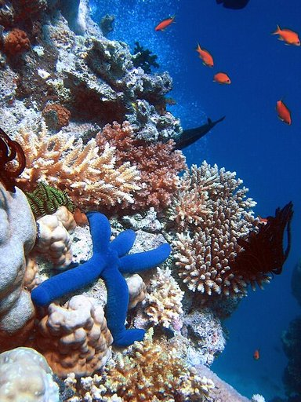
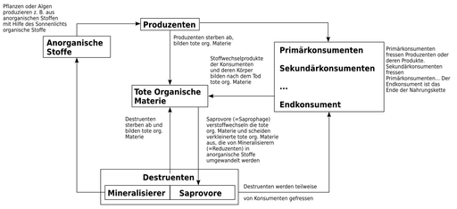
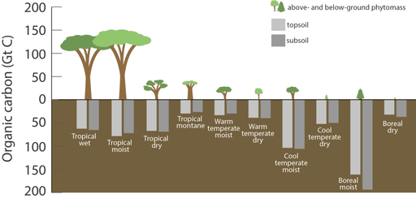

# Ökosystem

**Ökosystem** (altgriechisch οἶκος oikós, deutsch ‚Haus‘ und σύστημα sýstema, deutsch ‚das Zusammengestellte, das Verbundene‘) ist ein Fachbegriff der ökologischen Wissenschaften. Ein Ökosystem besteht aus einer Lebensgemeinschaft von Organismen mehrerer Arten (Biozönose) und ihrer unbelebten Umwelt, die man als Habitat oder Biotop bezeichnet.

Der Begriff Ökosystem wird in den Naturwissenschaften in einem werturteilsfreien Sinne gebraucht. In Politik und Alltagswelt wird dagegen oftmals so gesprochen, als seien Ökosysteme an sich schützenswert. Wenn dies geschieht, sind nicht Ökosysteme im Allgemeinen gemeint, sondern ganz bestimmte Ökosysteme oder Biotope, die man als nützlich, wertvoll oder schützenswert ansieht.

Die Bezeichnung wird bisweilen auch in anderen Bedeutungszusammenhängen verwendet, etwa in der Wirtschaft *(Ökonomie)* oder Informationstechnik.

## Abgrenzung des Begriffs

### Definitionen

Ein Ökosystem ist ein „dynamischer Komplex von Gemeinschaften aus Pflanzen, Tieren und Mikroorganismen sowie deren nicht lebender Umwelt, die als funktionelle Einheit in Wechselwirkung stehen“. Diese gängige Definition wird in der Biodiversitätskonvention verwendet. Sehr ähnlich sind folgende Definitionen von Ökologen:

- „Beziehungsgefüge der Lebewesen untereinander (Biozönose) und mit ihrem Lebensraum (Biotop)“ – Matthias Schaefer
- „Ökologisches System, bestehend aus allen Organismen in einem Gebiet und der physikalischen Umgebung, mit der sie interagieren“ – Terry Chapin
- „Zusammenfügung von Organismen unterschiedlicher Kategorien (Arten oder Lebensformen), zusammen mit ihrer abiotischen Umwelt, in Raum und Zeit“ – Kurt Jax

Wesen und Eigenschaften eines Ökosystems werden dabei von den Ökologen unterschiedlich aufgefasst: Einige gehen von ihrer tatsächlichen Existenz aus, die von den Forschern nur entdeckt und beschrieben wird (ontologischer Ansatz). Die meisten Forscher betrachten sie aber als durch den Beobachter erst „geschaffene“ Abstraktionen, die für einen bestimmten Zweck angemessen sein müssen, aber in anderem Zusammenhang auch anders definiert und abgegrenzt werden könnten (epistemologischer Ansatz).

Betrachten wir zur Erläuterung ein bestimmtes Ökosystems, etwa einen Nadelwald im Norden Skandinaviens, in dem Kiefern vorherrschen. Ist es noch das gleiche Ökosystem, wenn dort stattdessen nach einigen Jahren deutlich mehr Fichten als Kiefern wachsen? Wenn also die häufigsten Nadelbaumart durch eine andere ersetzt wurde? Einige Ökologen sagen, dass das Ökosystem seinen Charakter verändert hat, wenn seine Lebensgemeinschaft sich durch so einen Austausch von Arten stark verändert hat. Für andere wäre es noch dasselbe System, da seine allgemeine Gestalt und wichtige ökologische Prozesse wie die Primärproduktion in etwa gleich geblieben sind. Für sie wäre es erst dann ein anderes System, wenn sich seine funktionalen Komponenten, also Energie- und Stoffflüsse verändern. Für diese Ökologen ist die Artenzusammensetzung weniger bedeutsam.

### Ähnliche Begriffe

Zusammenhängende großräumige Ökosysteme eines konkreten Raumes werden auch als Ökoregion oder Biom bezeichnet.

Die Grundtypen großräumiger terrestrischer und aquatischer Ökosysteme bezeichnet man auch als Biome. Zu unterscheiden sind hier die wissenschaftliche und die landläufige Verwendung des Begriffs Ökosystem: Vieles, was populär unter „Ökosystem“ läuft, würde man fachlich meist eher als „Biom“ bezeichnen. Der Begriff des Bioms geht auf Frederic Edward Clements zurück, erfuhr seine heutige Prägung aber stark durch den Geobotaniker Heinrich Walter. Biome (bzw. als kleinere Einheit: Biogeozönosen) sind empirisch und deskriptiv abgeleitete Ausschnitte der Erdoberfläche, die durch eine bestimmte Lebensgemeinschaft (vor allem: Vegetation) charakterisiert werden können. Der funktionale Aspekt des Öko-„Systems“ kann dabei in den Hintergrund treten. Biome können als Ökosysteme betrachtet werden, müssen es aber nicht; häufig werden sie rein biogeographisch gefasst. Da der Begriff aber außerhalb der Fachöffentlichkeit völlig ungebräuchlich ist, steht in populären Veröffentlichungen dafür meist „Ökosystem“. Biome, hier am Beispiel der Wälder, wären zum Beispiel tropischer Regenwald, gemäßigter Regenwald, borealer Nadelwald, subtropischer Hartlaubwald, Lorbeerwald, gemäßigter (temperater) Laubwald.

Vergleichbare Ökosysteme getrennter Großräume, die zwar nach ihrem Erscheinungsbild ähnlich aufgebaut sind, jedoch nicht in der Artenzusammensetzung, können zu abstrakten Einheiten zusammengefasst werden (z. B. borealer Nadelwald, Wüste, Steppe). Je nach Betrachtung wird in der Fachliteratur u. a. von Pflanzen- oder Vegetationsformationen, Vegetationszonen, Zonobiomen oder Ökozonen gesprochen.

## Eigenschaften von Ökosystemen

### Einteilung

Grundsätzlich werden die großen Lebensgemeinschaften in zwei Kategorien gegliedert: Als **terrestrische Ökosysteme** werden alle bezeichnet, die sich auf der Landoberfläche befinden und nicht primär aus Wasser bestehen. Zumeist wird der Begriff Biom synonym verwendet. Demgegenüber stehen die **aquatischen Ökosysteme** der Gewässer, die nochmals nach dem Salzgehalt des Wassers in die *marinen Ökosysteme* der Meere und die **limnischen Ökosysteme** der stehenden und fließenden Süßwasserlebensräume differenziert werden.

### Größe und Grenzen

Die Definition von „Ökosystem“ beinhaltet keine Einschränkung auf eine bestimmte Größe (Skalenunabhängigkeit), sei diese Größe nun räumlich oder funktional definiert. Ökosysteme können also unterschiedliche Größen aufweisen. So kann ein sich zersetzender Baumstumpf als Ökosystem verstanden werden; ebenso der Wald, in dem der Baumstumpf steht. Von vielen Ökologen wird der Begriff Ökosystem jedoch eher in größeren Zusammenhängen verwendet. Als größtes Ökosystem gilt die Biosphäre, die die Gesamtheit aller terrestrischen und aquatischen Ökosysteme einschließt.

Als offene Systeme haben Ökosysteme keine tatsächlichen Systemgrenzen gegenüber der übrigen Biosphäre. Abgegrenzte Ökosysteme sind durch den Untersucher ausgewählte Konstrukte. Die Abgrenzung ist also eine pragmatisch (durch die Fragestellung, das Untersuchungsinteresse oder das zur Verfügung stehende Budget) begründete Entscheidung und entspricht nicht unbedingt einer tatsächlich vorfindlichen Abgrenzung in der Natur. Idealerweise sollten Teilsysteme ausgewählt werden, deren Beziehungsgefüge innerhalb bedeutsamer ist als dasjenige nach außen, die also durch möglichst basale und möglichst wenige Wechselwirkungen mit ihrer Umgebung verknüpft sind. Für die räumliche Abgrenzung und Verortung eines Ökosystems wurde der Begriff Ökotop geprägt, der außerhalb der Landschaftsökologie aber nicht sehr gebräuchlich ist.

Zum besseren Verständnis der Zusammenhänge konstruieren Wissenschaftler gelegentlich stark vereinfachte Ökosysteme im Labor, die nur wenige Arten enthalten; dafür hat sich der Fachbegriff „Mikrokosmen“ eingebürgert.

### Beziehungen

Der Systembegriff impliziert eine funktionale, über eine bloße morphologische/topographische Beschreibung hinausgehende Betrachtung von kausalen Beziehungen, vor allem in Gestalt von Stoff- und Energieflüssen. Wird ein Naturausschnitt als Ökosystem betrachtet, wird oft ein Verständnis der natürlichen Regelmäßigkeiten und Zusammenhänge durch die Bildung eines Modells der Wirklichkeit angestrebt. Ein solches Modell kann verbal, graphisch oder mathematisch sein. In der Ökosystemforschung werden beispielsweise meist quantitative Modelle angestrebt, die sich in mathematischer Sprache ausdrücken lassen. Einige Aspekte von Ökosystemen lassen sich durch Systeme von Differentialgleichungen ausdrücken. Verwendet werden auch Begriffe der Thermodynamik und statistischen Physik.

Zwischen der Organismengemeinschaft eines Ökosystems existieren vielfache Wechselbeziehungen und Abhängigkeiten. Hierzu zählen beispielsweise die trophischen Beziehungen verschiedener Arten des Ökosystems, wie Stoffaustausch zwischen Primärproduzenten und heterotrophen Gliedern der Nahrungskette in Form von symbiotischer Beziehung (Mykorrhiza), Parasitismus und Saprophilie.

Die Organismen der Biozönose beeinflussen den Stoffkreislauf und werden beeinflusst durch die abiotischen Faktoren. Diese werden in der Botanik als Standortfaktoren bezeichnet.

### Offenheit, Dynamik, Komplexität

In der Wissenschaft wird der Ökosystembegriff als, etwas unscharfe, Betrachtungsebene verwendet, die die Ökologie der Lebensgemeinschaften mit Ansätzen der Systemtheorie und Kybernetik verbindet. Der Begriff ist aber eher ein Paradigma, der einen bestimmten Blickwinkel vorgibt, und kann nicht zur Vorhersage konkreter Eigenschaften des Forschungsgegenstands verwendet werden. Einige Ökologen vermeiden den Begriff sogar ganz, weil aus ihrer Sicht die Lebensgemeinschaft und ihre Ökologie zur Bearbeitung hinreichen; so wird er in einem sehr weit verbreiteten Lehrbuch der Ökologie nicht verwendet.

Zur Beschreibung der allgemeinen Eigenschaften von Ökosystemen werden oft folgende Begriffe eingesetzt:

- **offen:**  Ökosysteme sind offene Systeme, die zur Erhaltung ihres Systemzustands einen Energiefluss durch das System benötigen.
- **dynamisch:**  Ökosysteme verharren meist nicht an festen Punkten ihres Zustandsraumes, sondern es finden auf verschiedenen räumlichen und zeitlichen Skalen dynamische Entwicklungen statt. Zu diesen zählen Sukzessionsvorgänge, aber auch Entwicklungen mit geschlossener Phasenraumkurve und viele andere Formen der Dynamik. Daneben gibt es langfristige Selbstorganisations- und Anpassungsprozesse, die ein Ökosystem fortwährend verändern können;
- **komplex:**  Ökosysteme haben biotische und abiotische Elemente und Strukturen. Diese Strukturen sind durch Wechselwirkungen miteinander verbunden. Mit der Anzahl der im System verwirklichten Wechselwirkungen steigt seine Komplexität an. Die Beziehung zwischen der Komplexität einerseits und der Stabilität von Ökosystemen andererseits ist aktives Forschungsgebiet der Ökologie.

Die Anwendung des Ökosystemsbegriffs auf einen Naturausschnitt allein kann jedoch nicht zur Vorhersage der spezifischen Eigenschaften, Strukturen oder Prozesse des Naturausschnitts verwendet werden. Ökosysteme können z. B. vergleichsweise komplex oder einfach aufgebaut sein, sich eher stabil oder eher instabil verhalten, nahe an einem Gleichgewichtszustand verharren oder sich fernab davon bewegen. Die Betrachtung als Ökosystem gibt lediglich einen gewissen analytischen Blickwinkel vor.

## Funktionsprinzipien von Ökosystemen

Bei Betrachtung der Organismen eines Ökosystems wird verbreitet von den konkreten Arten abstrahiert und eher ihre funktionelle Rolle im Systemganzen betont. Das bedeutet, dass einzelne Arten bezüglich ihrer Funktion oft in gewissem Sinn als gegeneinander austauschbar betrachtet werden.
Die Organismen können unterteilt werden nach ihrer trophischen Funktion im System als

- Primärproduzenten, die organische Stoffe aus anorganischen Stoffen und Energie (Sonnenlicht, chemische Energie) aufbauen. Dies sind vor allem grüne Pflanzen, die Photosynthese betreiben, und autotrophe Bakterien und Archaeen, die auch chemische Energie nutzen können;
- Konsumenten, die sich von den Produzenten, anderen Konsumenten oder von Destruenten ernähren. Es handelt sich insbesondere um Tiere einschließlich des Menschen. Konsumenten geben dabei Kohlenstoffdioxid und mehr oder weniger energiereiche organische Substanz ab (Urin, Kot, Körperabrieb, Haare und Leichen). Die Konsumenten werden weiter untergliedert in Konsumenten erster Ordnung, die Pflanzenfresser (Phytophage oder Herbivore) und Konsumenten höherer Ordnungen, zusammen als Fleischfresser (Karnivore) bezeichnet. Wichtigste Karnivore sind die Räuber (Prädatoren).
- Destruenten, welche die abgestorbenen Produzenten und Konsumenten, deren Ausscheidungen oder Organe (z. B. Pflanzenstreu und Falllaub), abbauen und zuletzt mineralisieren, also wieder in abiotische Stoffe zurückführen. Die funktional entscheidenden Destruenten sind insbesondere Bakterien und Pilze.

Unterschieden werden oft zwei Teil-Nahrungsnetze. Die Grundlage beider Nahrungsnetze sind die grünen Pflanzen (oder ggf. die anderen Primärproduzenten). Die Pflanzen werden ganz oder in Teilen von speziellen Konsumenten, den Phytophagen (= *Pflanzenfressern*). verzehrt. Dies geschieht etwa, wenn ein Eichenspinner die Blätter einer Eiche frisst, eine Miesmuschel kleine Algen einstrudelt oder ein Mensch eine Möhre verzehrt. Dies ist das Konsumenten-Nahrungsnetz. Oft fallen aber große Mengen abgestorbenen Pflanzenmaterials an, die ohne Zwischenschaltung von Konsumenten von den Destruenten abgebaut werden. Dadurch kann sich eine sehr große Gemeinschaft an Destruenten aufbauen. Diese Destruenten werden ihrerseits z. B. von bakterien- und pilzfressenden Arten gefressen. Hierher gehören viele Protozoen, Nematoden und Oligochaeten, aber auch Arthropoden wie Hornmilben und Springschwänze. Diese Organismen bilden dann ein Destruenten-Nahrungsnetz.

Verschiedene Substanzen können auf ihrem Weg durch das Ökosystem verfolgt werden. Dies gilt zum Beispiel für das Wasser und auch für einzelne chemische Elemente (C, N, P etc.). Die Ökosystemforschung untersucht die sich ergebenden Stoffkreisläufe und bildet sie in Stoffflussdiagrammen und komplexen Modellen ab. Gleiches gilt für den Energiefluss. Der Begriff des „Stoffkreislaufs“ deutet an, dass viele Stoffe mehrfach im Ökosystem umgesetzt werden. Allerdings hängt dies von der Art des Ökosystems ab. So ist der Kreislaufanteil in einem Wald für viele Elemente eher hoch. Dies gilt insbesondere für Elemente, die nicht regelmäßig als Gas in die Atmosphäre abgegeben werden. Dagegen ist das Ökosystem eines Flusses vom ständigen, nicht wiederkehrenden Substanzdurchsatz geprägt. Werden geologische Zeiträume betrachtet, so fällt auf, dass erhebliche Stoff- und Elementmengen für (ggf. hunderte) Millionen Jahre aus dem Kreislauf ausscheiden (siehe z. B. Kalkstein, Kohleflöz).

Ökosysteme beeinflussen sich gegenseitig durch Informations-, Substanz- und Energieflüsse. Der Aufbau und die Veränderung von Ökosystemen kann starke Rückwirkungen auf die abiotischen Faktoren haben. Die einzelnen Wirkmechanismen und deren relative Bedeutung sind ein aktives Forschungsfeld. Z. B. beeinflussen marine Ökosysteme durch ihren Stoff- und Energiehaushalt die Atmosphäre und damit auch terrestrische Ökosysteme. Ein Beispiel globaler Wechselbeziehungen ist die Zunahme des Treibhauseffekts und der dadurch verursachte Klimawandel. Um aus dieser Erkenntnis praktischen Nutzen zu ziehen, muss die relative Stärke der Wechselwirkungen bekannt sein.

### Thermodynamische Interpretation

Physikalische Begriffe aus der Thermodynamik können auch auf Ökosysteme angewendet werden, entweder in qualitativer Form als Analogien oder zur Modellierung und Vorhersagen. Schlüsselbegriffe für die thermodynamische Interpretation sind die Entropie und die Dissipation. Die Entwicklung und Erhaltung von Leben findet dabei weitab des Thermodynamischen Gleichgewichts statt.

Als physikalisch offene Systeme können Ökosysteme komplexe Strukturen aufbauen. Die geringe Entropie in der Biosphäre wird durch Erhöhung der Entropie in ihrer (physikalischen) Umwelt mehr als ausgeglichen. Dies ist nur in einer Umgebung möglich, die ebenfalls fernab des Gleichgewichts ist. Ein Ökosystem benötigt also einen thermodynamischen Gradienten als Antrieb: Es muss einerseits (energetische oder stoffliche) Ressourcen von außen erhalten, und auf der anderen Seite „Abfälle“ mit einer höheren Entropie als diejenige der Ressourcen abgeben. Für die Erde als Ganzes besteht dieser Gradient großteils aus der Differenz zwischen der energiereichen Sonneneinstrahlung und dem kalten Weltall, in das energieärmere Wärmestrahlung abgegeben wird.

Die Entropie-Produktion eines Ökosystems ist nicht direkt messbar, da wichtige Teilgrößen (v. a. die chemische Energie der lebenden Biomasse) nicht messbar (bzw.: noch nicht einmal befriedigend definierbar) sind. Ökologen versuchen verschiedene Größen zu definieren, um dieses Problem zu umgehen. Mit diesen Größen sollen allgemeine Aussagen über Ökosysteme möglich werden, die Vorhersagen zur Struktur und Entwicklung von Ökosystemen zulassen. Wichtige Ansätze sind: Ascendancy (in etwa: „Aufstieg“), Emergie (mit einem „m“ in der Mitte), Exergie und Öko-Exergie.

### Kontrollmechanismen

In der Ökologie ist es bis heute umstritten, wodurch die Dynamik und Struktur von Ökosystemen letztlich kontrolliert wird. Traditionell gibt es zwei Grundannahmen:

- Von unten nach oben (engl. „bottom-up“): Primärproduzenten produzieren diesem Ansatz zufolge etwa soviel Biomasse, wie ihre Ressourcen erlauben. Ein Teil davon steht Primärkonsumenten (Herbivoren) zur Verfügung. Aufgrund der energetischen Verluste können diese nicht mehr als 10 % der genutzten Nahrungsenergie für den Aufbau ihrer eigenen Biomasse nutzen. Dies setzt sich in den weiteren trophischen Niveaus (Konsumenten zweiter, dritter … Ordnung) fort. Die Länge der Nahrungsketten wird durch die Produktivität begrenzt, weil irgendwann die verbleibende Energie nicht mehr für ein weiteres trophisches Niveau ausreicht. Als Begründer dieser Theorie gilt der Limnologe Raymond L. Lindeman
- Von oben nach unten (engl. „top-down“): Diesem Modell zufolge wird die Biomasse und Produktion grünen Pflanzen von den Herbivoren kontrolliert und gesteuert. Die Herbivoren wären durchaus imstande, mehr oder weniger die gesamte Biomasse für sich zu nutzen. Die Welt bleibt nur deshalb so grün, weil auch die Produktion der Herbivoren durch Prädatoren in Schach gehalten wird.

Alternativen oder Varianten zu diesen Grundmodellen existieren in größerer Zahl.

- Ein neueres Modell betont die besondere Rolle von Umwelt-Stressfaktoren auf das Artengefüge. Demnach wirken sich ungünstige Umweltfaktoren stärker auf die Konsumenten als auf die Produzenten aus (z. B., weil die Umwelt weniger vorhersagbar wird und starke Schwankungen für Arten höher in der Nahrungskette stärkere Auswirkungen haben). Demnach wären in für die Organismen günstigen Ökosystemen die Konsumenten entscheidend. Unter ungünstigen Umweltbedingungen (und damit geringer Produktivität) wäre die Konkurrenz der Pflanzen ausschlaggebend. In der ökologischen Wissenschaft hat jedes dieser Modelle seine Anhänger. Auch Kombinationen der Grundmodelle wurden in großer Zahl vorgeschlagen (z. B.).

## Zeitliche Dimension von Ökosystemen

Als natürliche Systeme besitzen Ökosysteme eine räumliche und eine zeitliche Dimension. Auf der zeitlichen Ebene versucht man bei der Erforschung die ablaufenden Veränderungen, das heißt die Dynamik des Systems, zu verstehen. Systeme können dabei mehr oder weniger unverändert bleiben, oder sie unterliegen (gerichteten oder zufälligen) Veränderungen. Da lebende Organismen auf Veränderungen reagieren können, können in Ökosystemen, anders als in unbelebten Systemen, selbstregulierende Prozesse ablaufen, durch die die Reaktion des Systems auf Veränderungen unter Umständen nur schwer vorhersagbar ist. Für die holistisch-organismische Denkschule in der Forschung sind diese selbstregulierenden Prozesse von alles entscheidender Bedeutung, für sie ist ein Ökosystem daher analog zu einem lebenden Organismus. Die stärker reduktionistisch ausgerichtete Hauptströmung der Wissenschaft erkennt die sich bei der Entwicklung der Systeme ergebenden Muster und Regelmäßigkeiten an, hält aber die starke Betonung der Konstanz, die sich aus der Organismus-Metapher ergibt, für nicht angemessen. Völlig chaotisch und ungeregelt ablaufende Veränderungen zu erforschen ist allerdings zwar möglich, aber wissenschaftlich wenig ergiebig, da man so gewonnene Erkenntnisse kaum auf irgendetwas außerhalb des untersuchten Systems selbst verallgemeinern könnte. Die Ökosystemforschung konzentriert sich daher meist auf mehr oder weniger konstante Systeme oder zumindest auf solche, deren Veränderung auf erklärende Faktoren zurückgeführt werden kann. Ausgangspunkt der Forschung sind daher (wie generell in der Wissenschaft) Muster und Regelmäßigkeiten in der Natur selbst.

### Dynamik und Konstanz, Stabilität

In zahlreichen untersuchten Ökosystemen beobachtet man bei Untersuchungen über einen längeren Zeitraum keine wesentlichen Veränderungen, sie sind zeitlich stabil. Die Stabilität ist trivial, wenn sich die Umweltfaktoren und die abiotischen Komponenten des Systems nicht verändert haben. Interessanter ist es, wenn ein System auch bei Veränderung äußerer Faktoren seine Stabilität erhalten kann. Die Erforschung dieser Zusammenhänge wurde lange Zeit durch die Mehrdeutigkeit des Stabilitätsbegriffs behindert. Grimm und Wissel fanden z. B. in einer Literaturstudie 163 verschiedene Definitionen von Stabilität, die sich auf 70 Konzepte bezogen. Heute wird (nach Pimm 1984) meist unterschieden: *Persistenz* (man beobachtet wenig Veränderungen bei Beobachtungen über lange Zeit), *Resilienz* (Das System kehrt nach Störungen wieder in seinen Ausgangszustand zurück), *Resistenz* (Das System bleibt bei Störungen lange unverändert).

Stabilität und Konstanz in Ökosystemen sind dabei von der betrachteten räumlichen und zeitlichen Skala abhängig. Die Populationsgröße einer Art mag z. B. Jahr für Jahr schwanken, aber auf längere Sicht in gleicher Höhe bleiben. Stabilität und Stabilitätsbedingungen von Ökosystemen, vor allem der Zusammenhang zwischen Stabilität und Komplexität, sind aktive Forschungsfelder der ökologischen Wissenschaften. Die traditionellen Ansichten, das Ökosysteme in der Regel im ökologischen Gleichgewicht seien und ihre Stabilität mit Erhöhung der Artenzahl oder der Biodiversität ansteigt, werden seit etwa 30 Jahren zunehmend in Zweifel gezogen.

### Der Begriff „Störung“

Bei der zeitlichen Entwicklung eines Ökosystems ist der Begriff der Störung ein Schlüsselbegriff. Ohne Störungen unterliegt ein System ausschließlich endogener Dynamik, Veränderungen können z. B. durch Wechselwirkungen der beteiligten Arten untereinander ablaufen. Wichtig ist in diesem Zusammenhang, dass in der Ökologie der Begriff der Störung völlig werturteilsfrei genutzt wird. Eine Störung ist nichts *per se* Schlechtes; oft lassen sich bestimmte Ökosysteme sogar nur durch regelmäßige Störungen erhalten (siehe unten).

Die Größe einer Population kann durch das Beziehungsgefüge auf einer bestimmten Höhe eingeregelt werden, oder, z. B. durch zeitlich verzögerte Reaktionen, können zyklische Schwankungen auftreten (für Säugetierpopulationen z. B.). Gerichtete, dauerhafte Veränderungen des Systems bezeichnet man als Sukzession. Eine Störung ist ein von außerhalb dieses internen Beziehungsgefüges einwirkender, das System verändernder Faktor. Häufig wird zwischen seltenen und großen Störungen (Katastrophen) und kleineren und wiederkehrenden Störungen unterschieden. Der Störungsbegriff ist dabei ebenfalls skalenabhängig, z. B. kann das Abfressen durch ein weidendes Tier für eine einzelne Pflanze als Störung, für das Ökosystem Wiese aber als konstituierender und systemimmanenter Faktor gewertet werden. Einen Versuch zur absoluten Definition von Störungen haben White und Pickett unternommen, eine Definition für klimatische Extremereignisse als Störung liefert Smith. Das zeitliche Muster der Störungen oder *Störungsregime* ist ein prägender Faktor für viele Ökosysteme, wiederkehrende Störungen wie Mahd oder Beweidung im Grünland, Überflutungen im Auwald, aber auch katastrophische Störungen wie Waldbrand oder Sturmwurf in Waldökosystemen können Struktur und Zusammensetzung eines Ökosystems entscheidend prägen.

## Gefährdung und Bewertung von Ökosystemen

### Bewertung

„Ökosystem“ im biologisch-wissenschaftlichen Sinn ist ein wertfreier Begriff. Die Rede von der *Existenz* eines bestimmten Ökosystems oder der Stabilität eines seiner Zustände impliziert daher auf dieser begrifflichen Ebene nicht von sich aus eine positive Wertschätzung; Bemühungen zum Schutz von Ökosystemen sind gesondert zu begründen. Naturwissenschaft kann solche Begründungen nicht liefern, da sie gehalten ist, immer wertfreie Beschreibungen und Erklärungen zu liefern. So sind die nach Zerstörung eines hoch entwickelten Ökosystems auftretenden Zustände genauso als Ökosystem anzusprechen wie der Ausgangszustand, solange noch irgendeine Form von Leben in ihnen auftritt. Einen Wert besitzt ein Ökosystem nur dann, wenn sie ihm durch eine Wertentscheidung von Menschen zugewiesen worden ist. Eine Ansicht dazu ist, dass die Wertentscheidung dabei außerhalb der Naturwissenschaft steht. Sie kann durch wissenschaftliche Argumente gestützt, aber nicht aus der Wissenschaft oder aus der wissenschaftlich beschriebenen Natur abgeleitet werden (vgl. hierzu: Naturalistischer Fehlschluss, Humes Gesetz).

Beispielsweise sind der Erhalt der menschlichen Zivilisation, das Vermeiden von Leid, der Schutz von menschlichem Leben, der Erhalt der ausgeprägten Bewohnbarkeit der Erde und eine Beibehaltung oder Erhöhung der menschlichen Lebensqualität Ziele, die nicht naturwissenschaftlich eindeutig als „gut“ eingestuft werden können: dazu bedarf es einer subjektiven Bewertung, die etwa auf ethischen bzw. moralischen Auffassungen beruht.

#### Erhaltung zwecks Ökosystemdienstleistungen vs. Naturschutz

Werte, die einem Ökosystem zugeschrieben werden, können sich auf seine funktionale Ebene beziehen, man spricht dann oft von Ökosystemfunktionen und Ökosystemdienstleistungen (engl. *ecosystem services*). Beispielsweise könnte die Erhaltung eines Waldes mit seiner Funktion als Kohlenstoff-Speicher zur Verhütung des Treibhauseffekts, mit seiner erosions­verhütenden Rolle an Steilhängen oder mit seiner positiven Rolle für die Neubildung von nutzbarem Grundwasser, und nicht zuletzt durch das hier geerntete Holz oder das erlegte Wild begründet werden.

Ökosystemdienstleistungen sind häufig ersetzbar. So ist denkbar, dass mit entsprechendem technischen und finanziellen Aufwand CO2 in tiefe Gesteinsschichten eingepresst und damit der Atmosphäre entzogen wird. Erosionsschutz könnte auch durch Grasland, Grundwasserschutz durch den Einsatz technischer Filter oder aufbereitetes Oberflächenwasser substituiert werden. Umweltökonomische Studien zeigen, dass die Kosten einer technischen Substitution oft jedoch so hoch sind, dass natürliche oder naturnahe Ökosysteme schon aus wirtschaftlichen Gründen nicht leichtfertig degradiert werden sollten. Zu bedenken ist weiterhin, dass die Nutzbarkeit eines Ökosystems auch durch stete Einflüsse graduell immer mehr herabgesetzt werden kann, was bei einer kurzzeitigen Betrachtung nicht erkennbar ist. Innerhalb der Umweltökonomie hat sich zum Studium der Ökosystem-Dienstleistungen ein Spezialgebiet herausgebildet (siehe TEEB-Studie).

Der Schutz natürlicher Ökosysteme beruht zu einem großen Teil allerdings nicht auf dieser rein funktionalen Ebene. Wenn Menschen die Artenvielfalt bestimmter Ökosysteme erhalten wollen, tun sie dies in der Regel nicht aus funktionalen Gründen (obwohl sich Menschen finden, die dies z. B. mit der Erhaltung ungewöhnlicher Naturstoffe als Basis für neue Medikamente begründen wollen). Vielmehr wird hier der Vielgestaltigkeit und Komplexität der Natur ein eigener Wert zugesprochen. Umweltökonomen tun sich etwas schwer mit dieser Begründung, weil sie sich nicht in das universelle Wertmedium der Ökonomie, d. h. Geld, umrechnen lässt. Hilfsweise wird versucht, den Wert dadurch zu fassen, dass in Befragungen abgefragt wird, wie viel Geld die Befragten zur Rettung natürlicher Ökosysteme abzugeben bereit wären.

Die menschlichen Bemühungen, Ökosysteme zur Erhaltung der Natur selbst, z. B. der Artenvielfalt, zu schützen, werden als Naturschutz zusammengefasst. Die meisten Bemühungen, die auf die funktionale Ebene, d. h. direkte Nutzbarkeit und Ökosystemdienstleistungen abzielen, sind die Domäne des Umweltschutzes.

Die verschiedenen Begründungen und Werte, die zur Erhaltung von Ökosystemen herangezogen werden, können untereinander in Konflikt geraten. Genutzte Ökosysteme werden durch die Nutzung verändert und sind damit nicht mehr völlig autonom und natürlich. Heute ist durch die globalen Emissionen aus technischen Prozessen davon auszugehen, dass es praktisch keine vollkommen unbeeinflussten Naturlandschaften mehr gibt. Die Ökologie teilt die Ökosysteme in diesem Zusammenhang nach dem Grad der menschlichen (anthropogenen) Beeinflussung in sogenannte Hemerobie-Grade ein. Je geringer der Grad, desto geringer der anthropogene Einfluss. Oft wird bei der Wertung zwischen der völligen Zerstörung und der Degradation von Ökosystemen aufgrund starker menschlicher Einflüsse unterschieden. Die intaktesten Ökosystem-Komplexe liegen in den *oligohemeroben* (naturnahen, gering beeinflussten) Wildnis­gebieten der Erde. Die Artenvielfalt genutzter Ökosysteme nimmt häufig mit steigender Hemerobie ab, sie kann aber auch zunehmen. Für terrestrische Ökosysteme und deren Biodiversität stellt in Mitteleuropa etwa die Intensivierung der landwirtschaftlichen Nutzung von Gunstflächen bei gleichzeitiger Nutzungsaufgabe von marginalen Flächen ein großes Problem dar. Auf traditionelle Nutzungsformen beruhende Kulturlandschaften wie Heiden und Magerrasen versucht der Naturschutz aufgrund ihrer Artenvielfalt zu erhalten. Er schränkt damit ihre Nutzbarkeit für den Menschen ein. Verschärft treten diese Konflikte in ärmeren Staaten mit weiträumigen und artenreichen Ökosystemen, die aber kaum nutzbar sind, auf. Letztes Argument für ihre Erhaltung ist dann oft ihre Bedeutung für den Tourismus aus den reichen Staaten. Zunehmend wird aber auch über direkte Transferzahlungen der reichen an die armen Nationen geredet.

Im globalen Maßstab spielen heute vor allem die Belastungsgrenzen der Erde eine zentrale Rolle, da ihre Überschreitung die Stabilität und Funktionalität der ökosystemischen Gesamtzusammenhänge auf der Erde gefährden, die die Grundlage allen Lebens bilden. Diese weltumspannenden Verknüpfungen werden auch im Rahmen der Gaia-Hypothese diskutiert, die die Erde mit einem Organismus vergleicht.

### Wissenschaft

Über 15.000 Wissenschaftler haben 2017 eine eindringliche Warnung an die Menschheit veröffentlicht, die belegt, dass viele Ökosystemdienstleistungen erheblich gefährdet sind und die Chancen ihres Erhaltes derzeit negativ eingeschätzt werden.

#### Rascher Ökosystem-Wandel („Ökosystem-Kollaps“)

Siehe auch: Kippelemente im Erdklimasystem

Im März 2020 zeigten Forscher, dass größere Ökosysteme schneller als zuvor vermutet komplett kollabieren können, der Amazonas-Regenwald etwa (zu einer Savanne) in ~50 und die Korallenriffe der Karibik in ~15 Jahren.

## Begriffsgeschichte

Die Ansicht, dass Lebewesen und Lebensräume gemeinsam betrachtet werden müssen, lässt sich in der Wissenschaft bis ins 19. Jahrhundert zurückverfolgen, als John Scott Haldane davon schrieb, dass „die Teile eines Organismus und seine Umgebung ein System formen“. 1928 sprach der Leipziger Biologe und Limnologe Richard Woltereck von „Ökologischen Gestalt-Systemen“.

1935 schuf der britischen Biologe und Geobotaniker Arthur George Tansley unabhängig davon den heutigen Begriff „ecosystem“ (Ökosystem). Seine Definition von „ecosystem“: „das gesamte System (im physikalischen Sinne) unter Einschluss nicht nur des Komplexes der Organismen, sondern auch des ganzen Komplexes der physikalischen Faktoren, die das formen, was wir die Umwelt nennen – die Habitatfaktoren im weitesten Sinn.“ „(In den Systemen)… gibt es ständigen Austausch in verschiedenster Form innerhalb des Systems, nicht nur zwischen den Organismen, sondern zwischen organischem und anorganischem Bereich.“ ist in dieser Form bis heute uneingeschränkt weiter gültig. Sein Systembegriff ist der eines teilweise Beobachter-konstruierten, gedanklichen Isolats (*mental isolate*).

Unmittelbarer Anlass für Tansleys Formulierung war eine Serie von Artikeln des südafrikanischen Ökologen John Phillips über das *Wesen* der biotischen Gemeinschaft (*biotic community*). Phillips war angeregt durch den Holismus Jan Christiaan Smuts'. Phillips trat in diesen Artikeln für eine „starke“ Interpretation der biotischen Gemeinschaft im Sinne des von Frederic Edward Clements geprägten Konzepts eines Komplexorganismus ein. Tansley wendet sich mit seinem eher mechanistischen Vorschlag in scharfer Form gegen die Verwendung einer im wissenschaftstheoretischen Sinne idealistischen, empirisch nicht zugänglichen Organismus-Metapher, zu der sein Begriff ausdrücklich als Alternative dienen sollte.

Die Entwicklung eines physikalisch geprägten Ökosystembegriffs hat wichtige Grundlagen in der europäischen und nordamerikanischen Gewässerökologie, insbesondere der Limnologie. 1877 hatte der Kieler Zoologieprofessor Karl August Möbius den Begriff der Biozönose für die organismische Vergesellschaftung in Austern­bänken geprägt. Im Jahr 1887 sprach Stephen Alfred Forbes, ein Limnologe aus Illinois, Seen als „organische Systeme“ mit zyklischen Stoffumsätzen (*matter cycling*) an, in denen übergeordnete Steuerungsmechanismen ein Gleichgewicht aufrechterhielten. Während die Arbeiten Forbes’ außerhalb des US-amerikanischen Mittelwestens wenig rezipiert wurden, baute August Thienemann ab 1891 in Plön die Hydrobiologische Abteilung der Kaiser-Wilhelm-Gesellschaft auf. Von dort aus verbreitete Thienemann seine Ansicht von Seen als biotischen Systemen, die sich aus der Interaktion von Lebewesen und Umwelt ergeben („Lebensraum (*Milieu*) und Lebensgemeinschaft (*Biocoenose*) als eine feste, organische Einheit“, 1916). Thienemann verwendet dabei den mit „Ökosystem“ weitgehend identischen (aber der holistischen, organismischen Sichtweise von Clements und Phillips näher stehenden) Begriff des Holocoens, den der Entomologe Karl Friedrichs 1927 eingeführt hatte.

Ab den 1920er Jahren begannen zunehmend genauere Analysen von Nahrungsketten und den darin ablaufenden Stoff- und Energieumsätzen aufzutauchen (z. B. Charles Sutherland Elton, E.V. Borutsky, Chancey Juday). Diese Studien führten 1939 zu Thiemanns Unterscheidung von Produzenten, Konsumenten (Herbivore und Karnivore) und Reduzenten. Die erste systematische empirische Anwendung erfuhr Tansleys Ökosystemkonzept Ende der 1930er Jahre durch den in Minnesota arbeitenden Limnologen Raymond Laurel Lindeman, der die erste Komplettdarstellung der Energieumsätze in einem (See-)Ökosystem vorlegte. Eine weitere einflussreiche Forschungsrichtung war die vom Russen Wladimir Iwanowitsch Wernadski begründete Biogeochemie, die sich den Stoffaustausch zwischen Lebewesen und Umwelt als Austausch innerhalb eines chemischen Systems vorstellte. 1944 schuf der sowjetische Biologe Wladimir Nikolajewitsch Sukatschow daraus seinen Begriff der „Biogeozönose“, der im osteuropäischen Raum lange Zeit anstelle von Ökosystem verwendet wurde (von geographisch geprägten Landschaftsökologen teilweise bis heute). In Zusammenarbeit mit Lindemann verbreitete George Evelyn Hutchinson den russischen Ansatz.

Zum internationalen Durchbruch verhalf dem Ökosystem-Konzept der amerikanische Ökologe Eugene P. Odum. Odum veröffentlichte 1953 sein kurzes Lehrbuch „Principles of Ecology“. Dessen erste Seiten entfalten implizit jenes Forschungsprogramm, dem die Ökosystemforschung bis Ende der 1960er Jahre weitgehend folgte.

2022 schlugen Forschende des IUCN die Nomenklatur von Ökosystemen nach funktionalen Merkmalen vor, was auch Implikationen auf die Benennung einzelner Lebewesen habe. Der Vorstoß wird als mögliche Ablösung der auf Carl von Linné beruhenden Taxonomie gehandelt.

## Verwendung der Bezeichnung außerhalb der Ökologie

Wirtschaft

Ursprünglich aus dem Englischen entlehnt wird der Begriff *ecosystem* auch auf den Bereich der Wirtschaft übertragen und steht dann für die Gesamtheit der Akteure innerhalb einer Branche (*business ecosystem*). Im Deutschen spricht man auch von *Wirtschaftsökosystemen* oder *Unternehmensökosystemen*. Im Speziellen wird mit Blick auf die Gründerszene bzw. die Förderung des Unternehmertums auch von *Gründerökosystemen* und *Start-up-Ökosystemen* gesprochen. Diesen Begriff versucht das RKW zu etablieren. Das bekannteste Beispiel eines ganzheitlichen Startup-Ökosystems ist das Silicon Valley, in Europa auch die urbanen Viertel von Berlin.

Siehe auch: „Gründer-Ökosystem“ im Artikel Unternehmertum

Informationstechnik

Mit dem Begriff *digitales Ökosystem* wird im übertragenen Sinne in der Informationstechnik eine Soft- und Hardware-Architektur bezeichnet, welche auf jeweils ganz eigenen Geräten, Systemen und Zugangsvoraussetzungen beruht und damit entsprechendes Zubehör voraussetzt und hervorbringt. Ein Beispiel für ein geschlossenes *digitales Ökosystem* sind die Produkte des Unternehmens Apple.

Siehe auch: Geschlossene Plattform

Astrobiologie

Auch in der Astrobiologie wird der Begriff für möglicherweise existierende extraterrestrische („außerirdische“) Ökosysteme auf Exoplaneten und Exomonden verwendet.
