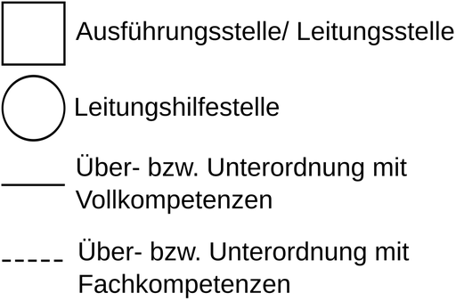
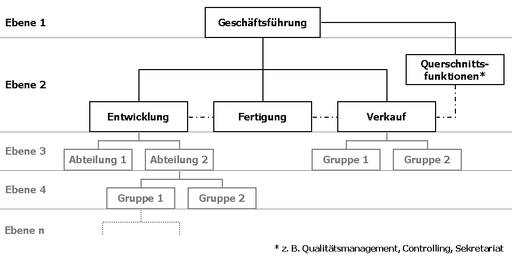

# Organigramm

Das **Organigramm** (Kofferwort aus Organisation und Diagramm bzw. Kurzform von **Organisationsdiagramm**, auch *Organisationsplan, Organisationsschaubild, Strukturplan, Stellenplan*) ist eine grafische Darstellung der Aufbauorganisation einer Organisation, welche deren organisatorische Einheiten, Aufgabenverteilung (bzw. Hierarchieebenen) und Kommunikationsbeziehungen offenlegt. Damit werden die Leitungsbeziehungen zwischen den einzelnen Organisationseinheiten in übersichtlicher Form abgebildet. Es wurde erstmals von dem Eisenbahnmanager Daniel Craig McCallum (1815–1878) um 1855 angewendet.

## Allgemeines

Übliche Darstellungsformen in der Praxis sind das horizontale und das vertikale Organigramm sowie Mischformen aus beiden. Zur Visualisierung werden Symbole verwendet, beispielsweise werden Linienstellen im Regelfall als Kästchen (mit oder ohne Stelleninhaber) und unterstützende Stellen als Kreise (Stabsstellen) sowie deren Verbindungen als durchzogene Linien dargestellt.

Auskünfte über folgende organisatorische Sachverhalte sind in einem Organigramm enthalten:

- Verteilung betrieblicher Aufgaben auf Stellen und Abteilungen
- hierarchische Struktur der Aufbau- bzw. Leitungsorganisation und der Weisungsbeziehungen
- Einordnung von Leitungshilfsstellen
- Personelle Besetzung (Stäbe, Stellen, Abteilungen)

Wichtige Spielregeln einer Organisation werden für alle sichtbar, seine Innenwirkung darf deshalb nicht unterschätzt werden, es ist die Landkarte jedes Unternehmens. Die formale Erstellung von Organigrammen ist meist firmenintern festgelegt. Bei der Erstellung eines Organigramms ist der Detaillierungsgrad von Bedeutung. Es sollte geprüft werden, ob jeder Mitarbeiter des Unternehmens abgebildet werden soll oder ob einzelne Mitarbeitergruppen ausreichend sind. Handelt es sich etwa um eine Reorganisation, muss jede Stelle berücksichtigt werden.

## Grafische Darstellung

Bezüglich der grafischen Darstellung gibt es keine allgemein gültige Regelung, allerdings hat sich in der Praxis Folgendes etabliert:

Des Weiteren gibt es folgende Möglichkeiten der Darstellung:

- In einem Rechteck steht nur eine Person, die die jeweilige Stelle innehat.
- Rechtecke, die eine Verbindung nach unten haben, beinhalten die Rolle des Vorgesetzten; z. B. ist Ebene 1 der Ebene 2 vorgesetzt etc. (Längsverbindungen).
- Querschnittfunktionen sind als unterstützende oder fachlich bestimmende Stellen meist als Stabsstelle neben der Geschäftsführung in Form eines Kreises dargestellt. In der Darstellung ist die Unterstützung zusätzlich durch eine gestrichelte Linie angegeben (Querverbindungen).
- Die Anzahl der einem Vorgesetzten direkt unterstellten Mitarbeiter wird als Subordinationsspanne bzw. als Leitungs- oder Führungsspanne bezeichnet

Beispiel für ein Organigramm:

## Vor- und Nachteile

Ein solcher Organisationsplan hat nicht nur Vorzüge zu verzeichnen, sondern er ist auch kritisch zu betrachten. Während in kleinen Unternehmen nur wenige Hierarchiestufen zu verzeichnen sind, gibt es in Großunternehmen viele Stufen der Hierarchie (mit Bereichen, Abteilungen, Gruppen und Einzelstellen).

## Software

Es gibt eine Reihe von Software-Produkten, mit denen man unter anderem auch Organigramme zeichnen kann. Dazu gehören Dia, KDissert und Kivio für Linux, Microsoft Visio oder Microsoft PowerPoint, SmartDraw und LibreOffice Draw für Windows und Mac OS X und OmniGraffle für Mac OS X. Plattformübergreifendes Erstellen und Bearbeiten von Organigrammen ist unter anderem mit der Web-Anwendung orginio oder den Diagrammeditoren yEd und diagrams.net (auch als Web-Anwendung verfügbar) möglich.

Darüber hinaus gibt es dezidierte Organigramm-Software wie z. B. Ingentis org.manager oder OrgPlus, welche Organigramme basierend auf vorhandenen Daten (wie z. B. aus SAP, PeopleSoft oder Oracle ERP) erstellen können.
