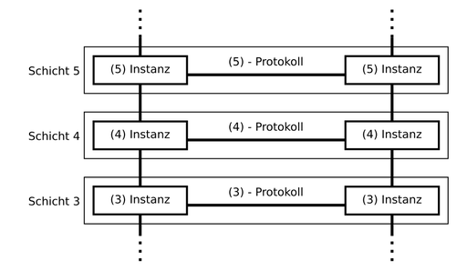
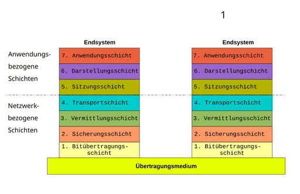

# OSI-Modell

Das **ISO/OSI-Referenzmodell** (englisch Open Systems Interconnection model) ist ein Referenzmodell für Netzwerkprotokolle als Schichtenarchitektur. Es wird seit 1983 von der International Telecommunication Union (ITU) und seit 1984 auch von der International Organization for Standardization (ISO) als Standard veröffentlicht. Seine Entwicklung begann im Jahr 1977.

Zweck des OSI-Modells ist es, Kommunikation über unterschiedlichste technische Systeme hinweg zu beschreiben und die Weiterentwicklung zu begünstigen. Dazu definiert dieses Modell sieben übereinanderliegende Schichten (englisch layers) mit jeweils eng begrenzten Aufgaben. Daher spricht man auch von **OSI-Layern**. In der gleichen Schicht mit klaren Schnittstellen definierte Netzwerkprotokolle sind einfach untereinander austauschbar, selbst wenn sie wie das Internet Protocol eine zentrale Funktion haben.

## Motivation

In einem Computernetz werden den verschiedenen Clients Dienste unterschiedlichster Art durch andere Hosts bereitgestellt. Dabei gestaltet sich die dafür erforderliche Kommunikation komplizierter, als sie zu Beginn erscheinen mag, da eine Vielzahl von Aufgaben bewältigt und Anforderungen bezüglich Zuverlässigkeit, Sicherheit, Effizienz usw. erfüllt werden müssen. Die zu lösenden Probleme reichen von Fragen der elektronischen Übertragung der Signale über eine geregelte Reihenfolge in der Kommunikation bis hin zu abstrakteren Aufgaben, die sich innerhalb der kommunizierenden Anwendungen ergeben.

Aufgrund dieser Vielzahl von Aufgaben wurde das OSI-Modell eingeführt, bei dem die Kommunikationsabläufe in sieben Ebenen (auch Schichten genannt) aufgeteilt werden. Dabei werden auf jeder einzelnen Schicht die Anforderungen separat umgesetzt.

Die verwendeten Instanzen müssen sowohl auf der Sender- als auch auf der Empfängerseite nach festgelegten Regeln arbeiten, um die Verarbeitung von Daten zu ermöglichen. Die Festlegung dieser Regeln wird in einem Protokoll beschrieben und bildet eine logische, *horizontale* Verbindung zwischen zwei Instanzen derselben Schicht.

Jede Instanz stellt *Dienste* zur Verfügung, die eine direkt darüberliegende Instanz nutzen kann. Zur Erbringung der Dienstleistung bedient sich eine Instanz selbst der Dienste der unmittelbar darunterliegenden Instanz. Der reale Datenfluss erfolgt daher *vertikal*. Die Instanzen einer Schicht sind genau dann austauschbar, wenn sie sowohl beim Empfänger als auch beim Sender ausgetauscht werden können.

## Die sieben Schichten

Der Abstraktionsgrad der Funktionalität nimmt von Schicht 1 bis zur Schicht 7 zu.

Das OSI-Modell im Überblick (siehe im Vergleich dazu das TCP/IP-Referenzmodell):

### Schicht 1 – Bitübertragungsschicht (Physical Layer, PHY)

Die Bitübertragungsschicht (englisch physical layer) ist die unterste Schicht. Diese Schicht stellt mechanische, elektrische, physikalische und weitere funktionale Hilfsmittel zur Verfügung, um physische Verbindungen zu aktivieren bzw. zu deaktivieren, sie aufrechtzuerhalten und Bits darüber zu übertragen. Das können zum Beispiel elektrische Signale, optische Signale (Lichtleiter, Laser), elektromagnetische Wellen (drahtlose Netze) oder Schall sein. Die dabei verwendeten Verfahren bezeichnet man als übertragungstechnische Verfahren. Geräte und Netzkomponenten, die der Bitübertragungsschicht zugeordnet werden, sind zum Beispiel die Antenne und der Verstärker, Stecker und Buchse für das Netzwerkkabel, der Repeater, der Hub, der Transceiver, das T-Stück und der Abschlusswiderstand (Terminator).

Auf der Bitübertragungsschicht wird die digitale Bitübertragung auf einer leitungsgebundenen oder leitungslosen Übertragungsstrecke bewerkstelligt. Die gemeinsame Nutzung eines Übertragungsmediums kann auf dieser Schicht durch statisches Multiplexen oder dynamisches Multiplexen erfolgen. Dies erfordert neben den Spezifikationen bestimmter Übertragungsmedien (zum Beispiel Kupferkabel, Lichtwellenleiter, Stromnetz) und der Definition von Steckverbindungen noch weitere Elemente.

Darüber hinaus muss auf dieser Ebene gelöst werden, auf welche Art und Weise ein einzelnes Bit übertragen werden soll: In Rechnernetzen werden Informationen in Form von Bit- oder Symbolfolgen übertragen. In Kupferkabeln und bei Funkübertragung sind modulierte, hochfrequente, elektromagnetische Wellen die Informationsträger, in Lichtwellenleitern Lichtwellen einer oder mehrerer bestimmter Wellenlängen. Die Informationsträger können abhängig von der Modulation nicht nur zwei Zustände für *null* und *eins* annehmen, sondern gegebenenfalls weitaus mehr. Für jede Übertragungsart muss daher eine Codierung festgelegt werden. Das geschieht mit Hilfe der Spezifikation der Bitübertragungsschicht eines Netzes.

Hardware auf dieser Schicht: Repeater, Hubs, Leitungen, Stecker, u. a.

Protokolle und Normen: V.24, V.28, X.21, RS 232, RS 422, RS 423, RS 499

### Schicht 2 – Sicherungsschicht (Data Link Layer)

Aufgabe der Sicherungsschicht (englisch Data Link Layer; auch *Abschnittssicherungsschicht*, *Datensicherungsschicht*, *Verbindungssicherungsschicht*, *Verbindungsebene*, *Prozedurebene*) ist es, eine zuverlässige, das heißt weitgehend fehlerfreie Übertragung zu gewährleisten und den Zugriff auf das Übertragungsmedium zu regeln. Dazu dient das Aufteilen des Bitdatenstromes in Blöcke – auch als *Frames* oder *Rahmen* bezeichnet – und das Hinzufügen von Prüfsummen im Rahmen der Kanalkodierung. So können fehlerhafte Blöcke vom Empfänger erkannt und entweder verworfen oder sogar korrigiert werden – je nach Protokoll ist es möglich, fehlerhafte Blöcke durch redundante Informationen zu sichern (FEC, Forward Error Correction) oder erneut anzufordern (ARQ, Automatic Repeat Request).

Eine „Datenflusskontrolle“ ermöglicht es, dass ein Empfänger dynamisch steuert, mit welcher Geschwindigkeit die Gegenseite Blöcke senden darf. Die internationale Ingenieursorganisation IEEE sah die Notwendigkeit, für lokale Netze auch den konkurrierenden Zugriff auf ein Übertragungsmedium zu regeln, was im OSI-Modell nicht vorgesehen ist.

Nach IEEE ist Schicht 2 in zwei Unter-Schichten *(sub layers)* unterteilt: LLC (Logical Link Control, Schicht 2b) und MAC (Media Access Control, Schicht 2a). In einer älteren Definition der OSI-Schichten enthält Schicht 2 viele Media-Access-Control-Anteile nicht; diese Funktionen müssen dort von höheren OSI-Schichten übernommen werden.

Hardware auf dieser Schicht: Bridge, Switch (Multiport-Bridge)

Das Ethernet-Protokoll beschreibt sowohl Schicht 1 als auch Schicht 2, wobei auf dieser als Zugriffskontrolle CSMA/CD zum Einsatz kommt.

Protokolle und Normen, die auf anderen Schicht-2-Protokollen und -Normen aufsetzen: HDLC, SDLC, DDCMP, IEEE 802.2 (LLC), RLC, PDCP, ARP, RARP, STP, Shortest Path Bridging, LLDP

Protokolle und Normen, die direkt auf Schicht 1 aufsetzen: IEEE 802.11 (WLAN), IEEE 802.4 (Token Bus), IEEE 802.5 (Token Ring), FDDI

### Schicht 3 – Vermittlungsschicht (Network Layer)

Die Vermittlungsschicht (englisch network layer; auch *Paketebene, Netzwerkschicht oder Paketvermittlungsebene*) sorgt bei leitungsorientierten Diensten für das Schalten von Verbindungen und bei paketorientierten Diensten für die Weitervermittlung von Datenpaketen sowie die Stauvermeidung (englisch congestion avoidance). Die Datenübertragung geht in beiden Fällen jeweils über das gesamte Kommunikationsnetz hinweg und schließt die Wegsuche (Routing) zwischen den Netzwerkknoten ein. Da nicht immer eine direkte Kommunikation zwischen Absender und Ziel möglich ist, müssen Pakete von Knoten, die auf dem Weg liegen, weitergeleitet werden. Weitervermittelte Pakete gelangen nicht in die höheren Schichten, sondern werden mit einem neuen Zwischenziel versehen und an den nächsten Knoten gesendet.

Zu den wichtigsten Aufgaben der Vermittlungsschicht zählt das Bereitstellen netzwerkübergreifender Adressen, das Routing bzw. der Aufbau und die Aktualisierung von Routingtabellen und die Fragmentierung von Datenpaketen. Aber auch die Aushandlung und Sicherstellung einer gewissen Dienstgüte fällt in den Aufgabenbereich der Vermittlungsschicht.

Neben dem Internet Protocol zählen auch die NSAP-Adressen zu dieser Schicht. Da ein Kommunikationsnetz aus mehreren Teilnetzen unterschiedlicher Übertragungsmedien und -protokolle bestehen kann, sind in dieser Schicht auch die Umsetzungsfunktionen angesiedelt, die für eine Weiterleitung zwischen den Teilnetzen notwendig sind.

Hardware auf dieser Schicht: Router, Layer-3-Switch (BRouter).

Protokolle und Normen: X.25, ISO 8208, ISO 8473 (CLNP), ISO 9542 (ESIS), IP, IPsec, ICMP, VRF-Instanz.

### Schicht 4 – Transportschicht (Transport Layer)

Zu den Aufgaben der Transportschicht (englisch Transport Layer; auch *Ende-zu-Ende-Kontrolle*, *Transport-Kontrolle*) zählt die Segmentierung des Datenstroms, die Stauvermeidung (englisch congestion avoidance) und die Sicherstellung einer fehlerfreien Übertragung.

Ein Datensegment ist dabei eine Service Data Unit, die zur Datenkapselung auf der vierten Schicht (Transportschicht) verwendet wird. Es besteht aus Protokollelementen, die Schicht-4-Steuerungsinformationen enthalten. Als Adressierung wird dem Datensegment eine Schicht-4-Adresse vergeben, also ein Port. Das Datensegment wird in der Schicht 3 in ein Datenpaket gekapselt.

Die Transportschicht bietet den anwendungsorientierten Schichten 5 bis 7 einen einheitlichen Zugriff, so dass diese die Eigenschaften des Kommunikationsnetzes nicht zu berücksichtigen brauchen.

Fünf verschiedene Dienstklassen unterschiedlicher Güte sind in Schicht 4 definiert und können von den oberen Schichten benutzt werden, vom einfachsten bis zum komfortabelsten Dienst mit Multiplexmechanismen, Fehlersicherungs- und Fehlerbehebungsverfahren.

Protokolle und Normen: ISO 8073/X.224, ISO 8602, TCP, UDP, SCTP, DCCP.

### Schicht 5 – Sitzungsschicht (Session Layer)

Die Schicht 5 (Steuerung logischer Verbindungen; engl. *Session Layer*; auch *Sitzungsschicht*, Kommunikationsschicht, Kommunikationssteuerungsschicht) sorgt für die Prozesskommunikation zwischen zwei Systemen. Hier findet sich unter anderem das Protokoll RPC (Remote Procedure Call).
Um Zusammenbrüche der Sitzung und ähnliche Probleme zu beheben, stellt die Sitzungsschicht Dienste für einen organisierten und synchronisierten Datenaustausch zur Verfügung. Zu diesem Zweck werden Wiederaufsetzpunkte, so genannte Fixpunkte (Check Points), eingeführt, an denen die Sitzung nach einem Ausfall einer Transportverbindung wieder synchronisiert werden kann, ohne dass die Übertragung wieder von vorne beginnen muss.

Protokolle und Normen: ISO 8326 / X.215 (Session Service), ISO 8327 / X.225 (Connection-Oriented Session Protocol), ISO 9548 (Connectionless Session Protocol)

### Schicht 6 – Darstellungsschicht (Presentation Layer)

Die Darstellungsschicht (englisch Presentation Layer; auch *Datendarstellungsschicht*, *Datenbereitstellungsebene*) setzt die systemabhängige Darstellung der Daten (zum Beispiel ASCII, EBCDIC) in eine unabhängige Form um und ermöglicht somit den syntaktisch korrekten Datenaustausch zwischen unterschiedlichen Systemen. Auch Aufgaben wie die Datenkompression und die Verschlüsselung gehören zur Schicht 6. Die Darstellungsschicht gewährleistet, dass Daten, die von der Anwendungsschicht eines Systems gesendet werden, von der Anwendungsschicht eines anderen Systems gelesen werden können. Falls erforderlich, agiert die Darstellungsschicht als Übersetzer zwischen verschiedenen Datenformaten, indem sie ein für beide Systeme verständliches Datenformat, die ASN.1 (Abstract Syntax Notation One), verwendet.

Protokolle und Normen: ISO 8822 / X.216 (Presentation Service), ISO 8823 / X.226 (Connection-Oriented Presentation Protocol), ISO 9576 (Connectionless Presentation Protocol)

### Schicht 7 – Anwendungsschicht (Application Layer)

Dienste, Anwendungen und Netzmanagement.
Die Anwendungsschicht stellt Funktionen für die Anwendungen zur Verfügung. Diese Schicht stellt die Verbindung zu den unteren Schichten her. Auf dieser Ebene findet auch die Datenein- und ausgabe statt. Die Anwendungen selbst gehören nicht zur Schicht.

Anwendungen: Webbrowser, E-Mail-Programm, Instant Messaging

### Beispiel

Die Ebenen des verbreiteten Netzwerk-Systems „TCP/IP über Ethernet“ entsprechen nicht exakt dem OSI-Modell und sind daher teilweise OSI-Schichten-übergreifend.

### Kurzzusammenfassung

7. Schicht / **Anwendung**: Funktionen für Anwendungen sowie die Dateneingabe und -ausgabe.

6. Schicht / **Darstellung**: Umwandlung der systemabhängigen Daten in ein unabhängiges Format.

5. Schicht / **Sitzung**: Steuerung der Verbindungen und des Datenaustauschs.

4. Schicht / **Transport**: Zuordnung der Datenpakete zu einer Anwendung.

3. Schicht / **Vermittlung**: Routing der Datenpakete zum nächsten Knoten.

2. Schicht / **Sicherung**: Segmentierung der Pakete in Frames und Hinzufügen von Prüfsummen.

1. Schicht / **Bitübertragung**: Umwandlung der Bits in ein zum Medium passendes Signal und physikalische Übertragung.

## Allgemeines

Das OSI-Referenzmodell wird oft herangezogen, wenn es um das Design von Netzwerkprotokollen und das Verständnis ihrer Funktionen geht. Auf der Basis dieses Modells sind auch Netzwerkprotokolle entwickelt worden, die fast ausschließlich von Anbietern der öffentlichen Kommunikationstechnik verwendet wurden. Im privaten und kommerziellen Bereich wird hauptsächlich die TCP/IP-Protokoll-Familie eingesetzt. Das TCP/IP-Referenzmodell ist sehr speziell auf den Zusammenschluss von Netzen *(internetworking)* zugeschnitten.

Die nach dem OSI-Referenzmodell entwickelten Netzprotokolle haben mit der TCP/IP-Protokollfamilie gemeinsam, dass es sich um hierarchische Modelle handelt. Es gibt aber wesentliche konzeptionelle Unterschiede: OSI legt die Dienste genau fest, die jede Schicht für die nächsthöhere zu erbringen hat. TCP/IP hat kein derartig strenges Schichtenkonzept wie OSI. Weder sind die Funktionen der Schichten genau festgelegt noch die Dienste. Es ist erlaubt, dass eine untere Schicht unter Umgehung zwischenliegender Schichten direkt von einer höheren Schicht benutzt wird. TCP/IP ist damit erheblich effizienter als die OSI-Protokolle. Nachteil bei TCP/IP ist, dass es für viele kleine und kleinste Dienste jeweils ein eigenes Netzprotokoll gibt. OSI hat dagegen für seine Protokolle jeweils einen großen Leistungsumfang festgelegt, der sehr viele Optionen hat. Nicht jede kommerziell erhältliche OSI-Software hat den vollen Leistungsumfang implementiert. Daher wurden OSI-Profile definiert, die jeweils nur einen bestimmten Satz von Optionen beinhalten. OSI-Software unterschiedlicher Hersteller arbeitet zusammen, wenn dieselben Profile implementiert sind.

Zur Einordnung von Kommunikationsprotokollen in das OSI-Modell siehe auch:

- AppleTalk
- IPX Internetwork Packet Exchange

## Das Referenzmodell für die Telekommunikation

Das Konzept des OSI-Modells stammt aus der Datenwelt, die immer Nutzdaten (in Form von Datenpaketen) transportiert. Um die Telekommunikationswelt auf dieses Modell abzubilden, waren Zusätze erforderlich. Diese Zusätze berücksichtigen, dass in der Telekommunikation eine von den Datenströmen getrennte Zeichengabe für den Verbindungsauf- und -abbau vorhanden ist, und dass in der Telekommunikation die Geräte und Einrichtungen mit Hilfe eines Management-Protokolls aus der Ferne konfiguriert, überwacht und entstört werden können. ITU-T hat für diese Zusätze das OSI-Modell um zwei weitere Protokoll-Stacks erweitert und ein generisches Referenzmodell standardisiert (ITU-T I.322). Die drei Protokoll-Stacks werden bezeichnet als

- Nutzdaten (User Plane)
- Zeichengabe (Control Plane)
- Management (Management Plane)

Jede dieser „Planes“ ist wiederum nach OSI in sieben Schichten strukturiert.

## Standardisierung

Das genormte Referenzmodell wird in der ISO weiterentwickelt. Der aktuelle Stand ist in der Norm ISO/IEC 7498-1:1994 nachzulesen. Das technische Komitee „Information Processing Systems“ hatte sich das Ziel gesetzt, informationsverarbeitende Systeme verschiedener Hersteller zur Zusammenarbeit zu befähigen. Daher kommt die Bezeichnung „Open Systems Interconnection“.

An der Arbeit im Rahmen der ISO nahm auch der Ausschuss *Offene Kommunikationssysteme* des DIN teil, der dann den ISO-Standard auch als deutsche Industrienorm in der englischen Originalfassung des Textes übernahm. Auch ITU-T übernahm ihn: In einer Serie von Standards X.200, X.207, … sind nicht nur das Referenzmodell, sondern auch die Services und Protokolle der einzelnen Schichten spezifiziert.

Weitere Bezeichnungen für das Modell sind *ISO/OSI-Modell*, *OSI-Referenzmodell*, *OSI-Schichtenmodell* oder *7-Schichten-Modell*

Standardisierungsdokumente:

- ISO 7498-1, textgleich mit DIN ISO 7498, hat den Titel *Information technology – Open Systems Interconnection – Basic Reference Model: The basic model*.
- ITU-T X.200, X.207, …

## Analogie

Das OSI-Modell lässt sich durch folgende Analogie aus dem Geschäftsleben beschreiben:

Ein Firmenmitarbeiter möchte seinem Geschäftspartner eine Nachricht senden. Der Mitarbeiter ist mit dem Anwendungsprozess, der die Kommunikation anstößt, gleichzusetzen. Er spricht die Nachricht auf ein Diktiergerät. Sein Assistent bringt die Nachricht auf Papier. Der Assistent wirkt somit als Darstellungsschicht. Danach gibt er die Nachricht an den Sekretär, der den Versand der Nachricht verwaltungstechnisch abwickelt und damit die Sitzungsschicht repräsentiert. Der Hauspostmitarbeiter (gleich Transportschicht) bringt den Brief auf den Weg. Dazu klärt er mit der Vermittlungsschicht (gleich Briefpost), welche Übertragungswege bestehen, und wählt den geeigneten aus. Der Postmitarbeiter bringt die nötigen Vermerke auf den Briefumschlag an und gibt ihn weiter an die Verteilstelle, die der Sicherungsschicht entspricht. Von dort gelangt der Brief zusammen mit anderen in ein Transportmittel wie LKW oder Flugzeug und nach eventuell mehreren Zwischenschritten zur Verteilstelle, die für den Empfänger zuständig ist.

Auf der Seite des Empfängers wird dieser Vorgang in umgekehrter Reihenfolge durchlaufen, bis der Geschäftspartner die Nachricht auf ein Diktiergerät gesprochen vorfindet.

Diese Analogie zeigt nicht auf, welche Möglichkeiten der Fehlerüberprüfung und -behebung das OSI-Modell vorsieht, da diese beim Briefversand nicht bestehen.

## Merksprüche

Es gibt einige Eselsbrücken/Informatik-Merksprüche zu den Namen der einzelnen OSI-Schichten, die gerne zum einfacheren Merken verwendet werden. Wohl mitunter einer der populärsten Sprüche lautet *“**P**lease **D**o **N**ot **T**hrow **S**alami **P**izza **A**way”* (*Physical Layer*, *Data Link Layer* usw.). Eine deutsche Variante ist *„**A**lle **d**eutschen **S**tudenten **t**rinken **v**erschiedene **S**orten **B**ier“* (Anwendungsschicht, Darstellungsschicht, …). Eine sehr eingängige deutsche Eselsbrücke für die englischen Namen der Schichten lautet *„**A**lle **P**riester **s**aufen **T**equila **n**ach **d**er **P**redigt“* und in der englischen Variante *„**A**ll **P**eople **S**eem **t**o **N**eed **D**ata **P**rocessing“*.

Wer sich die Sitzungsschicht lieber als Kommunikationsschicht merken möchte, kann sich das eingängige Kunstwort 'andakotraversibi' (laut aussprechen) merken. Es setzt sich aus den Anfangssilben der Schichtennamen zusammen.

## Nicht im OSI-Modell verortete weitere Schichten

→ *Hauptartikel: Layer 8*

Das OSI-Modell wird gelegentlich – oft scherzhaft – um im Modell nicht existierende weitere Schichten erweitert. Da die oberste, siebte Schicht dem Benutzer am nächsten liegt, kann z. B. neben den Endgeräten selbst auch der Benutzer einer 8. Schicht zugeordnet werden, wenn das für eine Kommunikationsfallbeschreibung als sinnvoll erachtet wird.
