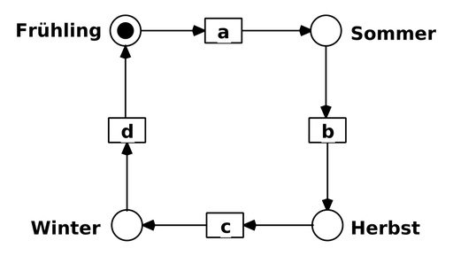
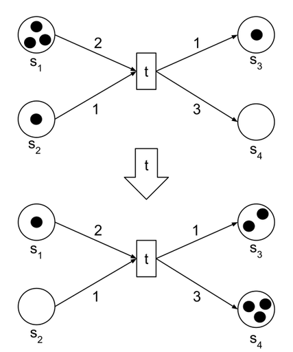
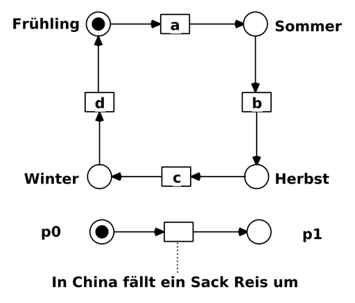

# Petri-Netz

Als **Petri-Netze** werden Modelle diskreter, vorwiegend verteilter Systeme bezeichnet.
Der Informatiker Carl Adam Petri hat sie in den 1960er Jahren ausgehend von endlichen Automaten entwickelt, zunächst noch nicht in der heute gebräuchlichen Form.
Dabei hat Petri nach grundlegenden Prinzipien zur Beschreibung nebenläufiger Schaltvorgänge gesucht, die später zu axiomatischen Theorien der Nebenläufigkeit verdichtet wurden.

Heutzutage werden Varianten von Petri-Netzen nicht nur in der Informatik zur Modellierung verwendet, sondern z. B. auch in der theoretischen Biologie, bei Geschäftsprozessen, im Maschinenbau, der Logistik und vielen anderen Gebieten. Viele andere Modellierungstechniken wie z. B. Aktivitätsdiagramme der UML 2 haben Prinzipien der Petri-Netze übernommen.

## Allgemeine Symbolik und Beschreibung

In der Grundausführung stellt sich ein Netz als ein Graph dar, der aus zwei Arten von Knoten aufgebaut ist, die *Stellen* (oder auch *Plätze*) bzw. *Transitionen* genannt werden. Die Knoten sind durch gerichtete Kanten verbunden, wobei eine Kante genau eine Stelle mit einer Transition oder umgekehrt verbindet. Ursprünglich hat Petri ungetypte Knoten betrachtet. Ein Netz mit solchen Knoten wird als Stellen/Transitions-Netz (kurz: S/T-Netz bzw. P/T-Netz aus dem Englischen zurückübersetzt als Platz/Transitions-Netz) bezeichnet.

Später wurden Netze mit durch Marken getypten Knoten und somit Attributen zu den Knoten eingeführt, welche als Prädikate an Transitionen und Kanten ausgewertet werden. Ein Netz mit Marken und dadurch getypten Knoten wird daher Prädikat/Transitions-Netz genannt, wobei die englischsprachige Bezeichnung Coloured Petri Net (CPN) – gefärbtes Petri-Netz – mindestens genauso häufig anzutreffen ist. Die Stellen können mit beliebig vielen Marken belegt sein. Eine solche Markierung stellt einen verteilten Zustand des Systems dar.

Die Dynamik eines Netzes ergibt sich aus dem Schalten von Transitionen: schaltet eine Transition, so entnimmt sie Marken aus den Stellen in ihrem unmittelbaren Vorbereich und legt Marken in die Stellen in ihrem Nachbereich, und zwar jeweils so viele, wie an den Kanten angegeben ist. Solange die Transition mehr Marken benötigt, als tatsächlich dort liegen, kann sie noch nicht schalten.

## Mathematische Darstellung eines Petri-Netzes

Ein P/T-Netz kann als ein Quintupel  dargestellt werden, dabei ist

- (Disjunktheit) und
- die (in aller Regel endliche) Menge der Stellen
- die (ebenfalls endliche) Menge der Transitionen
- die Flussrelation, die die Kanten angibt. Kanten verbinden also stets Stellen mit Transitionen oder andersherum, niemals Stellen mit Stellen oder Transitionen mit Transitionen.
- die Kantengewichtungsfunktion, erweitert auf  durch
- die Anfangsmarkierung

Die Dynamik der Netze wird im nächsten Abschnitt erläutert.

## Dynamik der Petri-Netze

Um die Dynamik und weitere Eigenschaften von Petri-Netzen zu beschreiben, sind folgende Definitionen und Bezeichnungen hilfreich.

### Vor- und Nachbereich

Der Vorbereich von , bezeichnet mit , ist die Menge aller Knoten, von denen eine Kante zum Knoten  führt: .

Der Nachbereich von , bezeichnet mit , ist die Menge aller Knoten, zu denen eine Kante vom Knoten  aus führt:
.

Beim Schalten einer Transition  wird aus jeder Stelle  des Vorbereichs der Transition eine Anzahl an Marken entnommen und in jede Stelle  des Nachbereichs der Transition eine Anzahl an Marken hinzugefügt. Die Anzahl der hinzugefügten bzw. entnommenen Marken jeder Stelle  richtet sich nach dem Gewicht der Kante zwischen der Transition und der Stelle .

### Schaltregel

Die Schaltregel in P/T-Netzen stellt sich wie folgt dar: Eine Transition  kann aus einer Markierung  schalten (notiert ) und das Netz in den Zustand  bringen, genau dann, wenn
die Schaltbedingung für  erfüllt ist für alle Stellen  ( ist dann aktiviert bzw. schaltfähig):

und die Folgemarkierung  für alle Stellen  erfüllt ist:

- .

Das Schalten der aktivierten Transition  ergibt also die neue Markierung . Man schreibt dann .

### Schaltsequenz und Erreichbarkeit

Eine Folge von Transitionen  mit  heißt **Schaltfolge** oder **Schaltsequenz**. Kann eine Schaltfolge auf eine Markierung  angewendet werden, so dass bei jedem Schritt die Schaltbedingung erfüllt ist, so heißt die Schaltsequenz **anwendbar** auf . Ob eine Schaltfolge anwendbar ist oder wie eine bestimmte Markierung erreicht werden kann, ergibt das Erreichbarkeitsproblem. Gibt es eine anwendbare Schaltfolge , die die Anfangsmarkierung  in  überführt, so ist die Markierung  **erreichbar**. Die Menge aller erreichbaren Markierungen  wird **Erreichbarkeitsmenge** genannt.

Durch die Schaltregel ergibt sich, nach Art einer operationalen Semantik, ein vielleicht unendlicher beschrifteter Graph mit Wurzel , der Erreichbarkeitsgraph, aus dem alle möglichen Schaltfolgen und damit einhergehenden Zustandsänderungen des Netzes abgelesen werden können. Es ist allerdings zu beachten, dass dies noch keine echt nebenläufige Semantik ist, da von jeder nebenläufigen Ereignismenge nur die Sequentialisierungen als Schaltfolgen betrachtet werden können.

Das Vier-Jahreszeiten-Netz  aus Abbildung 0a hat aufgrund seiner sehr simplen Struktur einen sehr einfachen Erreichbarkeitsgraphen, der ebenso wie  vier Zustände hat und vier Übergänge, die genau den Transitionen entsprechen.

Das Netzbeispiel aus Abbildung 0b hat dagegen doppelt so viele erreichbare Zustände, da unabhängig von der Jahreszeit der Sack Reis umgefallen sein kann oder auch nicht. Dieses Netz zeigt auch die Eignung von Petri-Netzen zum Darstellen verteilter Zustände und kausal unabhängiger, „nebenläufiger“ Ereignisse in verschiedenen Teilen des Systems – „In China fällt ein Sack Reis um“ und „a“ können unabhängig voneinander schalten, da sie weder eine gemeinsame Vorbedingung haben noch eines vom anderen abhängt.

## Modellieren mit Petri-Netzen

Für Petri-Netze sind ganz unterschiedliche Varianten und Ausprägungen vorgeschlagen worden. In den 1960er und 1970er Jahren wurden zunächst elementare Varianten untersucht; heutzutage werden oft „high-level“-Formen verwendet. Sie sind formal aufwendiger, beschreiben aber das modellierte System intuitiv genauer und unmittelbarer.

### Einführendes Beispiel

Als einführendes Beispiel eines High-level-Netzes zeigt Abb. 1 ein von Einzelheiten weitestgehend abstrahierendes Modell eines Keksautomaten: Im Anfangszustand befindet sich eine Münze im Eingabeschlitz des Automaten. Damit kann der Automat einen Schritt durchführen: Er kassiert die Münze und legt eine Keksschachtel in das Ausgabefach. So entsteht der Endzustand.

Abbildung 2 verfeinert und erweitert das Modell in seinem Anfangszustand, indem nun das Verhalten des Inneren des Automaten sichtbar wird, zusammen mit der möglichen Rückgabe der eingeworfenen Münze.

### Komponenten von Petri-Netzen

Der genaue Sinn der Abbildungen 1 und 2 folgt aus den universellen Modellierungsprinzipien von Petri-Netzen: In einem (gegebenen oder geplanten diskreten) System identifiziert man eine Reihe von Komponenten, die im Petri-Netz-Modell explizit dargestellt werden. Dazu gehören:

- *Speicherkomponenten*, die Gegenstände oder Datenelemente enthalten können (im Beispiel: Eingabeschlitz, Entnahmefach, Kasse, Signalplatz, Keksspeicher, Rückgabe) und denen Bedingungen zugeordnet werden. Im Modell werden sie als *Plätze* bezeichnet und graphisch als Kreise oder Ellipsen dargestellt;
- *Aktivitäten*, die Speicherinhalte verändern können (in Abb. 1: **t**, in Abb. 2: **a**, **b**, **c**). Alle Aktivitäten werden unbedingt nach Schalten der Plätze ausgeführt. Im Modell werden sie als *Transitionen* bezeichnet und graphisch als Quadrat oder Rechteck dargestellt.
- *Zustände*, also wechselnde Verteilungen von Gegenständen oder Datenelementen in Speicherkomponenten. (Abb. 2 beschreibt einen Zustand mit einer Münze im Eingabeschlitz und 3 Keksschachteln im Keksspeicher. Alle anderen Speicherkomponenten sind leer.) Im Modell bildet eine Verteilung von Marken auf die Plätze eine *Markierung* mit Bedingungen. Graphische Darstellungen (wie die in Abb. 1 und Abb. 2) zeigen üblicherweise die *Anfangsmarkierung*, die den Anfangszustand des Systems beschreibt.
- *Gegenstände* oder *Datenelemente*, die im System vorkommen, d. h. erzeugt, transformiert und verbraucht werden (im Beispiel: Münzen, Keksschachteln und Signale). Im Modell werden sie als *Marken* bezeichnet und graphisch möglichst „intuitiv“ dargestellt.
- *Übergänge* von Zuständen in neue Zustände als Beschreibung der Zustandswechsel: (im Beispiel: der Übergang vom Anfangs- zum Endzustand in Abb. 1 und vom Anfangs- zu einem Zwischenzustand in den Abbildungen Abb. 2 und Abb. 3). Im Modell kann man solche Schritte intuitiv als „Fluss von Marken durch die Kanten“ auffassen.

### Schritte

Von einer gegebenen Markierung  eines Petri-Netz-Modells aus ist eine neue Markierung  erreichbar, indem eine Transition  *eintritt*. Dazu muss  in  *aktiviert* sein.  ist in  aktiviert, wenn jeder bei  endende Pfeil an einem Platz  beginnt, der eine Marke enthält, die am Pfeil selbst notiert ist. In Abb. 1 ist **t** also aktiviert; in Abb. 2 sind **a** und **c** aktiviert, nicht aber **b**. Wenn eine aktivierte Transition  eintritt, verschwinden die oben beschriebenen Marken von ihren Plätzen, und für jeden bei  beginnenden Pfeil  entsteht gemäß seiner Anschrift eine Marke auf dem Platz, wo  endet.

Auf diese Weise entsteht in Abb. 1 aus der Anfangsmarkierung durch Eintritt von **t** die Endmarkierung. Aus Abb. 2 entsteht durch Eintritt von **a** die in Abb. 3 gezeigte Markierung.

Die „abstrakte“ Marke (schwarzer Punkt) auf dem **Signal**-Platz von Abb. 3 aktiviert nun zusammen mit einer Keksschachtel im **Speicher** die Transition **b**. Indem **b** eintritt, erscheint schließlich eine Keksschachtel im **Entnahmefach**. In Abb. 2 ist auch die Transition **c** aktiviert. Tritt **c** (statt **a**) ein, entsteht eine Markierung mit einer Münze in **Rückgabe**.

Mit der obigen Regel zum Eintritt von Transitionen sieht man unmittelbar, dass  oder  Münzen im **Einwurfschlitz** zu entsprechend vielen Schachteln im **Entnahmefach** führen. Mit einer zweiten Münze im **Einwurfschlitz** kann die Transition **a** unmittelbar nach ihrem ersten Eintritt wiederum eintreten, unabhängig vom (ersten) Eintritt von **b**.

### Das Verhalten verteilter Systeme

Das obige Beispiel zeigt vielfältige Bezüge zwischen den Aktivitäten eines verteilten Systems. Dementsprechend kann der Eintritt zweier Transitionen in unterschiedlicher Weise zusammenhängen. In Abb. 2 beispielsweise:

nichtdeterministisch
:   **a** und **c** treten alternativ zueinander ein. Die Münze im Einwurfschlitz aktiviert die beiden Transitionen **a** und **c**. Indem eine von beiden eintritt, ist die andere nicht mehr aktiviert. Welche der beiden Transitionen eintritt, wird nicht modelliert.

geordnet
:   **a** tritt vor **b** ein: Um einzutreten, benötigt **b** eine Marke, die **a** vorher erzeugt hat.

nebenläufig
:   Nachdem – wie in Abb. 3 – **a** eingetreten ist, kann mit einer zweiten Münze im Einwurfschlitz (in Abb. 2 nicht dargestellt) **a** ein zweites (oder **c** ein erstes) Mal eintreten, nebenläufig zum (d. h. unabhängig vom) Eintritt von **b**.

### Elementare Netze

Abbildung 4 zeigt ein Petri-Netz-Modell des Keksautomaten, in dem die Marken für Münzen, Signale und Keksschachteln nicht unterschieden werden: Alle werden gleichermaßen als „schwarze“ Marken dargestellt. Dabei tragen Pfeile keine Inschrift (nach der Systematik der Abbildungen 1 bis 3 müsste jeder Pfeil mit „“ beschriftet sein). In dieser Form sind Petri-Netze in den 1960er Jahren entstanden und häufig als *Platz-/Transitionsnetze* bezeichnet worden. Die Regeln zum Eintritt einer Transition  sind in diesem Fall besonders einfach:  ist aktiviert, wenn jeder bei  endende Pfeil bei einem Platz beginnt, der mindestens eine Marke enthält. Diese Marken verschwinden beim Eintritt von  und es entsteht eine neue Marke auf jedem Platz, an dem ein bei  beginnender Pfeil endet.

Solche einfachen Marken sind intuitiv angemessen, wenn (verteilter) *Kontrollfluss* modelliert wird, wie beispielsweise im Schema des wechselseitigen Ausschlusses in Abb. 5: Jeder der beiden Prozesse  und  („links“ und „rechts“) durchläuft zyklisch die drei Zustände **lokal**, **wartend**, **kritisch**. Der Schlüssel sorgt dafür, dass niemals beide Prozesse zugleich **kritisch** sind.
In diesem Beispiel trägt jeder Platz immer entweder *keine* oder *eine* Marke. Man kann jeden Platz daher als eine *Bedingung* auffassen, die gelegentlich *erfüllt* und gelegentlich *unerfüllt* ist. Solche Netze werden häufig als *Bedingungs-/Ereignisnetze* bezeichnet.

### Eigenschaften von Petri-Netz-Modellen

Wichtige Eigenschaften eines Systems sollten sich in seinem Modell widerspiegeln. Ein Petri-Netz muss daher nicht nur Verhalten, sondern auch *Eigenschaften* eines Systems darstellen. Beispielsweise hat in den Netzen der Abbildungen 2, 3 und 4 jede erreichbare Markierung  die Eigenschaft

Dabei bezeichnet  für einen Platz  die Anzahl der Marken auf  in der Markierung . Für jede Münze in der Kasse ist also eine Keksschachtel abgegeben worden oder (mit einer Marke auf Signal) wird noch abgegeben.
Entsprechend gilt für Abb. 5

Es ist also immer höchstens *ein* Prozess in seinem kritischen Zustand.
Eine naheliegende, aber schon für elementare Systemnetze überraschend komplizierte Fragestellung ist die *Erreichbarkeit* einer beliebig gewählten Markierung :

Es hat Jahre gedauert, bis dafür ein Algorithmus gefunden und somit die Entscheidbarkeit dieses Erreichbarkeitsproblems nachgewiesen wurde. Weitere wichtige Eigenschaften eines elementaren Systemnetzes  sind:

- *terminiert*: Jede in der Anfangsmarkierung beginnende anwendbare Schaltsequenz von  erreicht irgendwann einen *Deadlock*, d. h. eine Markierung, die keine Transition aktiviert. Diese Markierung heißt *tot* (die Keksautomaten terminieren).
- ist *deadlockfrei*: In  sind keine Deadlocks erreichbar (der wechselseitige Ausschluss ist deadlockfrei).
- ist *lebendig*: Von jeder erreichbaren Markierung aus ist für jede Transition  eine Markierung erreichbar, die  aktiviert (der wechselseitige Ausschluss ist lebendig).
- ist *schwach lebendig*: Zu jeder Transition  von  gibt es eine erreichbare Markierung, die  aktiviert (Keksautomat und wechselseitiger Ausschluss sind beide schwach lebendig).
- ist *-beschränkt* für eine Zahl : Jeder Platz enthält unter jeder erreichbaren Markierung höchstens  Marken (der Keksautomat ist 3-beschränkt, der wechselseitige Ausschluss ist 1-beschränkt). Ein 1-beschränktes Petri-Netz heißt *sicher*.
- ist *reversibel*: Die Anfangsmarkierung ist von jeder erreichbaren Markierung aus erreichbar (der wechselseitige Ausschluss ist reversibel).
- hat einen *Homestate*: Ein Homestate von  ist eine Markierung, die von jeder erreichbaren Markierung aus auf jeden Fall erreicht wird. Weder der Keksautomat noch der wechselseitige Ausschluss hat einen Homestate.

Zu beachten ist, dass die Eigenschaften Lebendigkeit, Beschränktheit und Reversibilität unabhängig voneinander sind.

Außerdem gelten folgende Sätze:

- ist genau dann beschränkt, wenn seine Erreichbarkeitsmenge  endlich ist.
- Ein Kausalnetz  ist genau dann nicht beschränkt, wenn es eine Transition  mit  und  gibt, d. h. eine Transition, zu der keine Kante führt, aber von der mindestens eine Kante zu einer Stelle führt.
- Jedes lebendige und beschränkte Petri-Netz ist stark zusammenhängend.
- Eine gewöhnliche Zustandsmaschine  ist genau dann lebendig, wenn sie stark zusammenhängend ist und  nicht der Nullvektor ist, d. h. mindestens eine Marke im Netz ist.
- Ein Kausalnetz  ist genau dann lebendig, wenn es keine Stelle  mit  und  gibt, d. h. keine Stelle, zu der keine Kante führt, aber von der mindestens eine Kante zu einer Transition führt.
- Ein gewöhnlicher Synchronisationsgraph  ist genau dann lebendig, wenn es in jedem gerichteten Kreis in  mindestens eine Stelle  mit  gibt, d. h. jeder Kreis enthält mindestens eine Marke.
- Das Erreichbarkeitsproblem ist entscheidbar.
- Für jedes Petri-Netz ist es entscheidbar, ob es lebendig ist.

### Nachweis von Eigenschaften

Bei allen beschriebenen Eigenschaften stellt sich die Frage, wie man sie für ein gegebenes anfangsmarkiertes Netz beweist oder widerlegt (vgl. Verifikation). Alle genannten Eigenschaften sind für elementare Netze entscheidbar, allerdings nur mit Algorithmen, deren Komplexität für die Praxis viel zu groß ist. In der Praxis werden deshalb Algorithmen für hinreichende oder notwendige Bedingungen verwendet. Diese Algorithmen beruhen auf *Platzinvarianten*, *anfangsmarkierten Fallen*, der *Markierungsgleichung* und dem *Überdeckungsgraphen* eines Systemnetzes.

### Erreichbarkeit

Das Erreichbarkeitsproblem für Petri-Netze besteht darin, für ein gegebenes Petri-Netz  und eine Markierung  zu entscheiden, ob . Es geht darum, den oben definierten Erreichbarkeitsgraphen so lange zu durchlaufen, bis die gesuchte Markierung erreicht ist oder nicht mehr gefunden werden kann. Dies kann schwierig sein, denn der Erreichbarkeitsgraph ist im Allgemeinen unendlich, und es ist nicht einfach zu bestimmen, wann ein sicherer Abbruch möglich ist. Es wurde bewiesen, dass das Erreichbarkeitsproblem entscheidbar ist. Es wurden Arbeiten veröffentlicht, die sich mit effizienten Lösungsansätzen befassen. Im Jahr 2018 verbesserten Czerwiński et al. die untere Schranke und zeigten, dass das Erreichbarkeitsproblem nicht in der Komplexitätsklasse ELEMENTARY liegt. Im Jahr 2021 wurde unabhängig voneinander von Jerome Leroux sowie von Wojciech Czerwiński und Łukasz Orlikowski gezeigt, dass dieses Problem Ackermann-vollständig und somit nicht primitiv-rekursiv ist.

Obwohl die Erreichbarkeit ein geeignetes Werkzeug zur Erkennung fehlerhafter Zustände zu sein scheint, weist der konstruierte Graph in praktischen Problemen meist viel zu viele Zustände auf, um sie zu berechnen. Um dieses Problem zu beheben, wird üblicherweise lineare temporale Logik in Verbindung mit dem Baumkalkül verwendet, um zu beweisen, dass solche Zustände nicht erreichbar sind. Die lineare temporale Logik nutzt die Semi-Entscheidungstechnik, um zu prüfen, ob ein Zustand tatsächlich erreichbar ist. Dazu werden notwendige Bedingungen für das Erreichen des Zustands ermittelt und anschließend bewiesen, dass diese Bedingungen nicht erfüllt werden können.

### Softwarewerkzeuge

Seit den 1980er-Jahren entstand eine Vielzahl unterschiedlicher Softwarewerkzeuge zur Erstellung und zur Analyse von Petri-Netzen. Als universelles Werkzeug für High-level-Netze hat sich insbesondere das Werkzeug *CPN Tools* durchgesetzt. Daneben gibt es eine Vielzahl spezifischer Werkzeuge für spezielle Netzvarianten, beispielsweise zur Analyse zeitbehafteter und stochastischer Netze oder für spezielle Anwendungsbereiche, beispielsweise service-orientierter Architekturen.

### Die allgemeinste Form von High-level-Netzen

Das Modell des Keksautomaten in (Abb. 1 – Abb. 3) ist ein Beispiel eines *high-level Netzes*. Die volle Ausdrucksstärke solcher Netze erreicht man mit Hilfe von *Variablen* und *Funktionen* in den Inschriften der Pfeile. Als Beispiel modelliert Abb. 6 eine Variante des Keksautomaten mit 4 Münzen im Eingabeschlitz. Für die 4. Münze gibt es keine Schachtel im Speicher; die Münze soll also auf jeden Fall zurückgegeben werden. Dazu enthält Abb. 6 einen Zähler, deren Marke die Anzahl verfügbarer Schachteln angibt. Die Transition **a** wird aktiviert, indem die Variable **x** den aktuellen Wert dieser Marke annimmt. Zusätzlich ist **a** mit der Bedingung **x** > 0 beschriftet, die zum Eintritt von **a** erfüllt sein muss. Damit reduziert jeder Eintritt von **a** den Zählerwert um 1 und **a** ist beim Wert 0 nicht mehr aktiviert. Jede weitere Münze landet dann also über **c** in der Rückgabe.

### Spezialfall *free-choice*

Im Modell des Keksautomaten der Abbildungen 2, 3 und 4 wählt die Marke im Einwurfschlitz nichtdeterministisch eine der Transitionen **a** oder **c**. Diese Wahl hängt von keinen weiteren Vorbedingungen ab; sie ist *frei*.

Im System des wechselseitigen Ausschlusses aus Abb. 5 hat der Schlüssel die Wahl zwischen den Transitionen **b** und **e**. Diese Wahl hängt aber zusätzlich davon ab, dass auch  und  markiert sind. Sie ist *nicht* frei.

Ein Netz  ist ein Free-choice-Netz, wenn schon seiner Struktur nach alle Wahlmöglichkeiten frei sind, falls also für zwei Pfeile, die am selben Platz  beginnen, gilt: Sie enden an Transitionen, an denen keine weiteren Pfeile enden. Abbildung 7 skizziert diese Bedingung. Offensichtlich sind alle Modelle des Keksautomaten Free-choice-Netze, nicht aber der wechselseitige Ausschluss in Abb. 5.

Ob eine der in oben beschriebenen Eigenschaften gilt oder nicht gilt, ist für Free-choice-Netze mit effizienten Algorithmen entscheidbar.

### Verallgemeinerungen elementarer Netze

Schon in den 1970er Jahren wurden elementare Netze um zahlreiche weitere Ausdrucksmittel ergänzt. Drei davon seien hier geschildert:

- *Pfeile gewichten*: Jedem Pfeil ist als „Gewicht“ eine natürliche Zahl  zugeordnet. Bei Eintritt der mit dem Pfeil verbundenen Transition fließen dann  Marken (statt nur einer Marke) durch den Pfeil.
- *Die Kapazität der Plätze beschränken*: Jedem Platz  wird als „Schranke“ eine natürliche Zahl  zugeordnet. Wenn beim Eintritt einer Transition  mehr als  Marken auf  entstehen würden, ist  nicht aktiviert. Abbildung 8 zeigt ein Beispiel.
- *Einen Platz auf Abwesenheit von Marken testen*: Ein Platz  ist mit einer Transition  durch eine neuartige „Inhibitor“-Kante verbunden.  ist *nicht* aktiviert, wenn  eine oder mehrere Marken trägt. Abbildung 9 skizziert diese Konstruktion.

Gewichtete Pfeile und kapazitätsbeschränkte Plätze steigern nicht wirklich die Ausdruckskraft: Man kann sie mit intuitiv plausiblen Mitteln simulieren. Hingegen kann man mit Inhibitorkanten tatsächlich mehr ausdrücken und konsequenterweise weniger entscheiden. Insbesondere ist die Erreichbarkeit für Netze mit Inhibitorkanten nicht entscheidbar.
Weitere Ausdrucksmittel sind gelegentlich erforderlich, um wirklich genau zu modellieren, wie sich ein verteiltes System verhält. Beispielsweise wollen wir im System des wechselseitigen Ausschlusses in Abb. 5 darstellen, dass jeder der beiden Prozesse für immer in seinem lokalen Zustand, aber nicht für immer in seinem kritischen Zustand verharren darf. Dazu unterscheiden wir die *kalte* Transition **a** („tritt nicht unbedingt ein, wenn sie aktiviert ist“) von der *heißen* Transition **b** („tritt ein, wenn sie aktiviert ist“). Mit den Transitionen **b** und **e** ist es noch komplizierter: Wenn wir jedem wartenden Prozess garantieren möchten, dass er irgendwann einmal kritisch wird, müssen wir *Fairness* für **b** und **e** verlangen. Mit dem Unterschied zwischen heißen und kalten Transitionen und mit der Forderung von Fairness kann man die Menge der „gemeinten“ Abläufe eines Petri-Netzes sehr viel genauer charakterisieren.

### Zeitbehaftete und stochastische Netze

Wenn Transitionen geordnet eintreten, in Abb. 2 beispielsweise erst **a** dann **b**, soll diese Ordnung kausal und nicht zeitlich interpretiert werden. Dann ist es konsequent, in Abb. 2 mit einer zweiten Münze im Eingabeschlitz das erste Eintreten von **b** und das zweite Eintreten von **a** als *unabhängig* voneinander aufzufassen und nicht als *gleichzeitig*.

Dennoch gibt es Systeme mit Aktionen, deren *Dauer* modelliert werden soll, oder die in irgendeiner Weise an Uhren orientiert sind. Zur Modellierung solcher Systeme wurden zahlreiche Varianten zeitbehafteter Petri-Netze vorgeschlagen. Dabei werden Plätze, Transitionen, Marken und Pfeile mit Zeitstempeln und Zeitintervallen versehen. Diese Zusätze regeln die Aktivierung von Transitionen und erzeugen neue Zeitstempel nach dem Eintritt einer Transition.

Wenn zwei Transitionen  und  um dieselbe Marke einer Markierung  konkurrieren (beispielsweise konkurrieren in Abb. 5 **b** und **e** um die Marke auf Schlüssel) und wenn  immer wieder erreicht wird, will man gelegentlich modellieren, dass  mit der Wahrscheinlichkeit  und  mit der Wahrscheinlichkeit  eintritt. Dafür eignet sich die breit ausgebaute Theorie der *stochastischen* Netze.

### Höhere Petri-Netze

Um Systeme, die mobile Komponenten als Teilsysteme enthalten, einheitlich zu beschreiben, wurden Petri-Netz-Formalismen entwickelt, bei denen die Marken wiederum als Netzinstanzen interpretiert werden. Bei diesen sogenannten Netzen in Netzen sind etliche Semantik-Varianten möglich, die sich unter anderem hinsichtlich der Frage unterscheiden, ob Marken als Netzexemplare oder lediglich als Referenzen zu verstehen sind.

Diese Formalismen entspringen einer objektorientierten Betrachtungsweise, bei der Exemplare von Klassen (Netzmustern) erzeugt werden können und eine Kommunikation zwischen Objekten über definierte Schnittstellen möglich ist.

Einige der frühen Vertreter sind die Objekt-Petri-Netze von Lakos (heute angesichts intensiver Weiterentwicklung hauptsächlich von historischer Bedeutung) und Valk, der diese zusammen mit Jessen ursprünglich im Kontext von Auftragssystemen einführte.

### Der Anfang

Die Forschung zu Petri-Netzen begann mit der Dissertation von Carl Adam Petri im Jahr 1962. Diese Arbeit wurde zunächst kaum beachtet; die Theoretische Informatik hat damals andere Fragestellungen verfolgt und für die Praxis kamen Petris Vorschläge zu früh. Ein erster Durchbruch im Bereich der Theorie kam Ende der 1960er-Jahre mit der Verwendung von Petris Ideen im Project MAC des MIT. In den 1970er Jahren wurden Platz-/Transitionsnetze weltweit studiert, allerdings recht oft aus dem verengten Blickwinkel formaler Sprachen.

### Die Entwicklung seit den 1980er-Jahren

Seit Beginn der 1980er Jahre wurden ganz unterschiedliche Varianten von High-level-Netzen vorgeschlagen, die Gegenstände, Datenelemente oder Symbole als Marken verwenden. Diese Formalismen erhöhen die Ausdruckskraft von Platz-/Transitionsnetzen beträchtlich. Zugleich konnten viele Analysetechniken von Platz-/Transitionsnetzen auf diese Formalismen verallgemeinert werden.

Mit zunehmendem Interesse an verteilten Systemen und verteilten Algorithmen wurden und werden seit den 1980er-Jahren zahlreiche neue Modellierungstechniken vorgeschlagen. Petri-Netze haben sich gegenüber diesen Neuentwicklungen behauptet; vielfach werden sie als Maßstab für die Qualität und die Ausdrucksmächtigkeit für Modelle verteilter Systeme verwendet. Einen Überblick über zahlreiche Anwendungsbereiche von Petri-Netzen gibt.

### Aktuelle Themen

Mit Petri-Netzen werden heutzutage Systeme modelliert, deren Verhalten aus diskreten, lokal begrenzten Schritten besteht. Das sind oft Systeme, die Rechner integrieren oder die mit Rechnern simuliert werden. Zu den derzeit besonders viel versprechenden Anwendungen von Petri-Netzen gehört die Modellierung von Prozessen der Systembiologie, der Geschäftsprozesswelt und der Service-orientierten Architekturen.

### Fertigungsprozesse

Die Vorteile der Verwendung von Petri-Netzen zur Modellierung von Fertigungsprozessen sind vielfältig. Ihre Vielseitigkeit beruht auf ihrer Universalität. Beispielsweise können sie zur Modellierung des Betriebs technischer Komponenten in der Produktion, von Hardware- und Softwareprozessen, wirtschaftlichen Faktoren, die intelligente Fertigungsprozesse beeinflussen, eingesetzt werden. Das Konzept der intelligenten Fertigung umfasst verschiedene Systemebenen umfasst, die gemäß dem ISA-95-Standard klassifiziert sind.

Produktionssysteme bestehen aus vielen Elementen. Je nach Branche können dies beispielsweise Roboter, Maschinen, Förderbänder, Lager und andere sein. Diese Elemente verfügen über eine eigene Betriebslogik, um die Produktion zu unterstützen und zu ermöglichen. Diese Logik wird in den Zuständen des Petri-Netzes abgebildet.

Ein generisches Basiselement für eine Maschine kann beispielsweise zwei Zustände haben: „Leerlauf“ und „Ausgelastet“. Abhängig von der Komplexität der Aufgabe, die eine Maschine ausführen muss, kann ihr Zustandsraum weiter ausgearbeitet werden, um beschreibendere Zustände einzuschließen, die während der Produktion gesteuert oder beobachtet werden müssen. So kann man eine Maschine zunächst als einfaches Petri-Netz darstellen, das nur diese beiden Zustände „Leerlauf“ und „Ausgelastet“ enthält. Diese können dann erweitert werden, um zusätzliche Details über die Maschine zu modellieren. Bei der Modellierung eines Fertigungsprozesses kann das Modell in mehrere Ströme unterteilt werden. Diese Ströme enthalten auch die entsprechenden Übergangstypen im Petri-Netz, welche die Zustandsänderungen des Systems in Abhängigkeit von der Ausführung bestimmter Operationen oder Ereignisse beschreiben. Diese Zerlegung ermöglicht somit eine detailliertere Analyse und Steuerung einzelner Elemente des Produktionsprozesses und verbessert dessen Effizienz und Vorhersagbarkeit.

### Logistik

Zeitgesteuerte farbige Petri-Netze eignen sich hervorragend zur Beschreibung logistischer Prozesse. Ein logistisches System besteht aus physikalisch verteilten Teilsystemen mit einer komplexen Interaktionsstruktur und ist somit ein typisches Beispiel für ein diskretes dynamisches System. Zweitens haben jüngste Entwicklungen im Bereich der Logistik die Steuerung logistischer Prozesse verkompliziert. Die Integration logistischer Aktivitäten führt häufig zu komplexen Steuerungsproblemen. Daher besteht Bedarf an einem integrierten Rahmenwerk für die Modellierung und Analyse logistischer Systeme.

Oft wird die Problemstellung vereinfacht, um analytische Lösungen zu ermöglichen. Aus diesem Grund sind viele Ergebnisse in diesem Bereich nicht allgemein anwendbar und erfordern die Beratung durch einen Experten. Beispiele hierfür sind die Anwendung von Warteschlangennetzen auf Terminplanungsprobleme und die Anwendung linearer Programmierung auf die Transportplanung. Obwohl diese Analysemethoden helfen, Einblicke in das Problem zu gewinnen, sind sie nur in recht spezifischen Situationen anwendbar. Darüber hinaus beschreiben einige der in diesem Bereich berichteten Ergebnisse Techniken für Probleme, die in der Praxis gar nicht existieren. Ein Forschungszweig konzentriert sich auf praktische Logistikprobleme. Die Ergebnisse sind oft qualitativer und informeller Natur. Die in diesem Bereich verwendeten Ansätze sind hauptsächlich disziplinorientiert, d. h. sie konzentrieren sich auf einen spezifischen Aspekt der Logistik. Beispiele hierfür sind die Forschung zu Kundenservice, Lagertechnik, Kommunikationseinrichtungen und Personalbedarf.

## Anwendungsgebiete

- Asynchroner Schaltkreis
- Nebenläufige Programmierung
- Paralleler Algorithmus
- Softwareentwurf
- Verwaltung von Arbeitsabläufen
- Verifikation von nebenläufigen Prozessen
- Automatisierung (Steuerungstechnik)
- Stoffstromnetz
- Geschäftsprozessmodellierung
