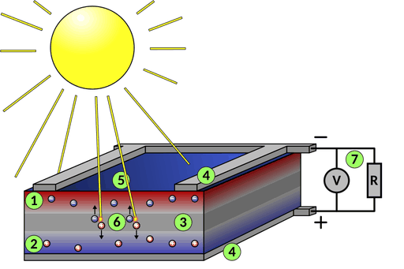
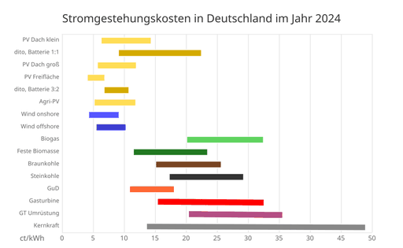
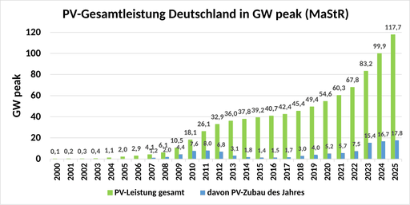

# Photovoltaik

Unter **Photovoltaik** bzw. **Fotovoltaik** versteht man die direkte Umwandlung von Lichtenergie, meist aus Sonnenlicht, mittels Solarzellen in elektrische Energie. Seit 1958 wird sie in der Raumfahrt genutzt, später diente sie auch zur Energieversorgung einzelner elektrischer Geräte wie Taschenrechnern oder Parkscheinautomaten. Heute ist mit großem Abstand die netzgebundene Stromerzeugung mit Photovoltaikanlagen auf Dachflächen und mit Freiflächenanlagen das wichtigste Anwendungsgebiet.

Ende 2025 waren weltweit Photovoltaikanlagen mit einer Leistung von ca. 2,8 Terawatt (TW, 1 TW = 1000 GW) installiert, wobei mehr als 600 GW neu zugebaut wurden. Zwischen 2016 und 2025 stieg die weltweit installierte Photovoltaik-Leistung mit einer Wachstumsrate von durchschnittlich 27 % pro Jahr. Nach einer 2019 erschienenen Arbeit in Science wird erwartet, dass die installierte Leistung bis 2030 ca. 10 TW erreichen und 2050 bei 30 bis 70 TW liegen könnte. Die Stromerzeugung aus Photovoltaik lag 2025 bei 2.778 TWh; das waren 8,7 % der weltweiten Stromerzeugung. Damit lag sie erstmals vor der Windenergie (2715 TWh) und nur noch minimal hinter der Kernenergie (2812 TWh). Binnen eines Jahres stieg die PV-Stromerzeugung um 636 TWh bzw. 29,7 % an. Mit Stand April 2026 verdoppelt sich die Solarstromerzeugung alle drei Jahre. In 42 Staaten lieferte die Photovoltaik 2025 mindestens 10 % der Stromerzeugung; den größten Anteil hatte sie in Ungarn mit 25 %.

Die Internationale Energieagentur hielt 2020 fest, dass Photovoltaikanlagen, die auf guten Standorten und mit günstigen institutionellen Bedingungen errichtet werden, inzwischen die günstigste Form der Stromerzeugung der Geschichte seien. Dank der durch Massenproduktion stark gefallenen Preise der Anlagenkomponenten war damit die lange Zeit akzeptierte Einschätzung überholt, dass die Photovoltaik die teuerste Form der Stromerzeugung mittels erneuerbarer Energien sei. Bereits 2014 lagen die Stromgestehungskosten der Photovoltaik in bestimmten Regionen der Erde auf gleichem Niveau oder sogar niedriger als bei fossilen Konkurrenten. Unter Berücksichtigung externer Kosten der fossilen Stromerzeugung (d. h. Umwelt-, Klima- und Gesundheits­schäden) war Solarstrom schon davor bereits konkurrenzfähig; tatsächlich waren diese Kosten jedoch nur zum Teil internalisiert.

Von 2011 bis 2017 fielen die Kosten der Stromerzeugung aus Photovoltaik um fast 75 %. In den USA waren 2017 bei Solarparks bereits Vergütungen von unter 5 US-Cent/kWh (4,3 Euro-Cent/kWh) üblich; ähnliche Werte waren zu diesem Zeitpunkt unter günstigen Umständen auch in anderen Staaten möglich. In mehreren Staaten wurden 2017 in Ausschreibungen sogar Rekordwerte von 3 US-Cent/kWh (2,6 Euro-Cent/kWh) erreicht. 2020 wurden mehrere Solarparks vergeben, bei denen die Vergütung deutlich unter 2 US-Cent/kWh liegt. Das mit Stand April 2020 günstigste bezuschlagte Angebot liegt bei 1,35 US-Cent/kWh (1,17 ct/kWh) für einen Solarpark in Abu Dhabi. Das Juni 2022 günstigste bezuschlagte Angebot lag bei 1,04 US-Cent/kWh für einen Solarpark in Saudi-Arabien. Auch in Deutschland liegen die Stromgestehungskosten von neu errichteten Photovoltaik-Großanlagen seit 2018 niedriger als bei allen anderen fossilen oder erneuerbaren Energien.

## Geschichte der Photovoltaik

→ *Hauptartikel: Geschichte der Photovoltaik*

Die Photovoltaik basiert auf der Fähigkeit bestimmter Materialien, Licht direkt in Strom umzuwandeln. Der Photoelektrische Effekt wurde bereits im Jahre 1839 von dem französischen Physiker Alexandre Edmond Becquerel entdeckt. Dieser wurde daraufhin weiter erforscht, wobei insbesondere Albert Einstein mit seiner 1905 erschienenen Arbeit zur *Lichtquantentheorie* großen Anteil an dieser Erforschung hatte, für die er 1921 mit dem Nobelpreis für Physik ausgezeichnet wurde. 1954 gelang es, die ersten Silizium­solarzellen mit Wirkungsgraden von bis zu 6 % zu produzieren. Die erste technische Anwendung wurde 1955 bei der Stromversorgung von Telefonverstärkern gefunden. In Belichtungsmessern für die Photographie fand Photovoltaik weite Verbreitung.

Seit Ende der 1950er Jahre werden Photovoltaikzellen in der Satellitentechnik verwendet; als erster Satellit mit Solarzellen startete Vanguard 1 am 17. März 1958 in die Erdumlaufbahn und blieb bis 1964 in Betrieb. In den 1960er und 1970er Jahren führte die Nachfrage aus der Raumfahrt zu Fortschritten in der Entwicklung von Photovoltaikzellen, während Photovoltaikanlagen auf der Erde nur für bestimmte Inselanlagen eingesetzt wurden.

Ausgelöst durch die Ölkrise von 1973/74 sowie später verstärkt durch die Nuklearunfälle von Harrisburg und Tschernobyl, setzte jedoch ein Umdenken in der Energieversorgung ein. Seit Ende der 1980er Jahre wurde die Photovoltaik in den USA, Japan und Deutschland intensiv erforscht; später kamen in vielen Staaten der Erde finanzielle Förderungen hinzu, um den Markt anzukurbeln und die Technik mittels Skaleneffekten zu verbilligen. Infolge dieser Bemühungen stieg die weltweit installierte Leistung von 700 MWp im Jahr 2000 auf 2.246 GWp im Jahr 2024 an und wächst stetig weiter.

Anfang 2021 initiierte ein Branchenverband eine „European Solar Initiative“ mit dem Ziel, bis 2025 in Europa eine Produktionskapazität von 20 GW an Photovoltaik aufzubauen. Die Initiative wird von der EU-Kommission unterstützt. Angesichts gestiegener Transport- und gesunkener Produktionskosten soll die Produktion in Europa wettbewerbsfähig mit der Herstellung in Asien sein. Stand 2021 planten mehrere Unternehmen, in europäischen Ländern neue Kapazität zur Produktion von Solarmodulen und Vorprodukten zu schaffen. Zum Vergleich: Die chinesische Solarindustrie hatte Ende 2021 eine jährliche Produktionskapazität von 361 GW an Solarmodulen.

2024 betrug der weltweite Marktanteil von kristallinen Siliziumzellen über 90 %. Prognosen gehen davon aus, dass Siliziumzellen auch langfristig die dominierende Photovoltaik-Technik bleiben und gemeinsam mit Windkraftanlagen die „Arbeitspferde“ der Energiewende sein werden.

### Schreibweise

Der Begriff Photovoltaik leitet sich aus dem griechischen Wort für „Licht“ (φῶς, *phos*, im Genitiv: φωτός, *photos*) sowie aus der Einheit für die elektrische Spannung, dem Volt (nach Alessandro Volta) ab. Die Photovoltaik ist ein Teilbereich der Solartechnik, die weitere technische Nutzungen der Sonnenenergie einschließt.

Üblicherweise wird die Schreibung *Photovoltaik* und die Abkürzung *PV* angewendet. Seit der deutschen Rechtschreibreform ist die Schreibweise *Fotovoltaik* ebenfalls eine zulässige Schreibung. Im deutschen Sprachraum ist die Schreibweise *Photovoltaik* die gebräuchliche Variante. Auch im internationalen Sprachgebrauch ist die Schreibweise PV üblich. Für technische Fachgebiete ist auch die Schreibweise in der Normung (hier ebenfalls *Photovoltaik*) ein Kriterium.

## Technische Grundlagen

Zur Energiewandlung wird der photoelektrische Effekt von Solarzellen genutzt, die ihrerseits wiederum zu so genannten Solarmodulen verbunden werden. Die erzeugte Elektrizität kann direkt genutzt, in Stromnetze eingespeist oder in Akkumulatoren gespeichert werden. Zur Einspeisung in Wechselspannungs-Stromnetze wird die erzeugte Gleichspannung von einem Wechselrichter umgewandelt. Das System aus Solarmodulen und den anderen Bauteilen (Wechselrichter, Stromleitung) wird als Photovoltaikanlage bezeichnet.

### Funktionsprinzip

Das Photovoltaik-Funktionsprinzip wird hier am Beispiel einer Dünnschicht-Solarzelle aus Silizium erläutert (waferbasierte Silizium-Solarzellen funktionieren anders, siehe Solarzelle#Funktionsprinzip). Silizium ist ein Halbleiter. Die Besonderheit von Halbleitern ist, dass durch zugeführte Energie (z. B. in Form von Licht bzw. elektromagnetischer Strahlung) in ihnen freie Ladungsträger erzeugt werden können.

1. Die obere Siliziumschicht ist mit Elektronendonatoren (Elektronenspender, z. B. Phosphoratome) durchsetzt. Daher gibt es hier zusätzliche Elektronen, die frei beweglich sind (n-dotierter Bereich bzw. n-Schicht).
2. Die untere Siliziumschicht ist mit Elektronenakzeptoren (Elektronenempfänger, z. B. Boratome) durchsetzt. Daher gibt es hier zusätzliche Fehlstellen bzw. Löcher, die frei beweglich sind (p-dotierter Bereich bzw. p-Schicht).
3. Im Grenzbereich der beiden Schichten (p-n-Übergang) kompensieren die freien Elektronen der n-Schicht die Fehlstellen bzw. Löcher der p-Schicht, d. h. sie besetzen die Fehlstellen im Valenzband. Dadurch gibt es in diesem Bereich praktisch keine frei beweglichen Ladungsträger (Verarmungszone): Oben herrscht Elektronen- und unten Fehlstellenmangel. Weil es in diesem Bereich aber auch die ortsfesten Donatoren (positiv geladen) und Akzeptoren (negativ geladen) gibt, bildet sich dort ein ständig vorhandenes internes elektrisches Feld aus (Pluspol bei der n-Schicht, Minuspol bei der p-Schicht). Die Verarmungszone ist also zugleich eine Raumladungszone.
4. Die p- und n-dotierten Bereiche sind mit externen Kontakten versehen. Die Unterseite ist ganzflächig kontaktiert, auf der Oberseite gibt es schmale Gridfinger, die in Stromsammelbahnen münden. Auf der Siliziumoberfläche zwischen Gridfingern und Stromsammelbahnen befindet sich eine Anti-Reflex-Schicht.
5. Photonen (Lichtquanten, „Sonnenstrahlen“) gelangen in die Solarzelle.
6. Photonen mit ausreichender Energiemenge übertragen in der Verarmungszone ihre Energie an die locker gebundenen Elektronen im Valenzband des Siliziums. Das löst diese Elektronen aus ihrer Bindung und hebt sie ins Leitungsband, wobei im Valenzband jeweils eine Fehlstelle bzw. ein Loch entsteht; beide sind frei beweglich. Einige dieser Elektron-Loch-Paare verschwinden nach kurzer Zeit durch Rekombination wieder. Viele freie Ladungsträger driften – bewegt vom internen elektrischen Feld – in die gleichartig dotierten Bereiche (s. o.) und gelangen zu den Kontakten; d. h. die Elektronen werden von den Löchern getrennt, die Elektronen driften nach oben, die Löcher nach unten. Eine Spannung und ein nutzbarer Strom entstehen, solange weitere Photonen ständig freie Ladungsträger erzeugen.
7. Der „Elektronen“-Strom fließt durch den „äußeren Stromkreis“ zur unteren Kontaktfläche der Zelle und rekombiniert dort mit den zurückgelassenen Löchern.

### Nennleistung und Ertrag

Die Nennleistung von Photovoltaikanlagen wird häufig in der Schreibweise Wp (Watt Peak) oder kWp angegeben und bezieht sich auf die Leistung bei Testbedingungen, die in etwa der maximalen Sonnenstrahlung in Deutschland entsprechen. Die Testbedingungen dienen zur Normierung und zum Vergleich verschiedener Solarmodule. Die elektrischen Werte der Bauteile werden in Datenblättern angegeben. Es wird bei 25 °C Modultemperatur, 1000 W/m² Bestrahlungsstärke und einer Luftmasse (abgekürzt AM von englisch *air mass*) von 1,5 gemessen. Diese Standard-Testbedingungen (meist abgekürzt STC von englisch *standard test conditions*) wurden als internationaler Standard festgelegt. Können diese Bedingungen beim Testen nicht eingehalten werden, so muss aus den gegebenen Testbedingungen die Nennleistung rechnerisch ermittelt werden.

Zum Vergleich: Die Strahlungsstärke der Sonne im erdnahen Weltall (Solarkonstante) beträgt 1361 W/m². Da das Verhältnis von der Oberfläche zur Querschnittsfläche 4 zu 1 beträgt, kommen davon im Mittel ca. 342 W/m² am Boden an.

Ausschlaggebend für die Dimensionierung und die Amortisation einer Photovoltaikanlage ist neben der Spitzenleistung vor allem der Jahresertrag, also die Menge der gewonnenen elektrischen Energie. Die Strahlungsenergie schwankt tages- und jahreszeitlich sowie wetterbedingt. So kann eine Solaranlage in Deutschland im Juli gegenüber dem Dezember einen bis zu zehnmal höheren Ertrag aufweisen. Tagesaktuelle Einspeisedaten mit hoher zeitlicher Auflösung sind für die Jahre ab 2011 im Internet frei zugänglich.

Der Ertrag pro Jahr wird in Wattstunden (Wh) oder Kilowattstunden (kWh) gemessen. Standort und Ausrichtung der Module sowie Verschattungen haben wesentlichen Einfluss auf den Ertrag, wobei in Mitteleuropa Dachneigungen von 30 – 40° und Ausrichtung nach Süden den höchsten Ertrag liefern. An der maximalen Sonnenhöhe (Mittagssonne) orientiert, sollte in Deutschland bei einer Festinstallation (ohne Nachführung) die optimale Neigung im Süden des Landes ca. 32°, im Norden ca. 37° betragen. Praktisch empfiehlt sich ein etwas höherer Neigungswinkel, da dann sowohl zweimal am Tag (am Vormittag und am Nachmittag) als auch zweimal im Jahr (im Mai und im Juli) die Anlage optimal ausgerichtet ist. Bei Freiflächenanlagen werden deshalb in aller Regel derartige Ausrichtungen gewählt. Zwar lässt sich die über das Jahr verteilte, durchschnittliche Sonnenhöhe und damit die theoretisch optimale Neigung für jeden Breitengrad exakt berechnen, jedoch ist entlang eines Breitengrades die tatsächliche Einstrahlung durch verschiedene, meist geländeabhängige Faktoren unterschiedlich (z. B. Verschattung oder besondere lokale Wetterlagen). Da auch die anlagenabhängige Effektivität bezüglich des Einstrahlungswinkels unterschiedlich ist, muss die optimale Ausrichtung im Einzelfall standort- und anlagenbezogen ermittelt werden. Bei diesen energetischen Untersuchungen wird die standortbezogene Globalstrahlung ermittelt, welche neben der direkten Sonneneinstrahlung auch die über Streuung (z. B. Wolken) oder Reflexion (z. B. in der Nähe befindliche Hauswände oder den Erdboden) einfallende Diffusstrahlung umfasst.

Der spezifische Ertrag ist als Wattstunden pro installierter Nennleistung (Wh/Wp bzw. kWh/kWp) pro Zeitabschnitt definiert und erlaubt den einfachen Vergleich von Anlagen unterschiedlicher Größe. In Deutschland kann man bei einer gut ausgerichteten fest installierten Anlage pro Modulfläche mit 1 kWp mit einem Jahresertrag von ca. 1.000 kWh rechnen, wobei die Werte zwischen etwa 900 kWh in Norddeutschland und 1150 kWh in Süddeutschland liegen.

### Montagesysteme

#### Aufdach-/Indach-Montage

Bei den Montagesystemen wird zwischen Aufdach-Systemen und Indach-Systemen unterschieden. Bei einem Aufdach-System für geneigte Hausdächer wird die Photovoltaik-Anlage mit Hilfe eines Montagegestells auf dem Dach befestigt. Diese Art der Montage wird am häufigsten gewählt, da sie für bestehende Dächer am einfachsten umsetzbar ist.

Bei einem Indach-System ist eine Photovoltaik-Anlage in die Dachhaut integriert und übernimmt deren Funktionen wie Dachdichtigkeit und Wetterschutz mit. Vorteilhaft bei solchen Systemen sind die optisch attraktivere Erscheinung sowie die Einsparung einer Dachdeckung, sodass der höhere Montageaufwand oftmals kompensiert werden kann.

Die Aufdach-Montage eignet sich neben Ziegeldächern auch für Blechdächer, Schieferdächer oder Wellplatten. Ist die Dachneigung zu flach, können spezielle Haken diese bis zu einem gewissen Grad ausgleichen. Die Installation eines Aufdach-Systems ist in der Regel einfacher und preisgünstiger als die eines Indach-Systems. Ein Aufdach-System sorgt zudem für eine ausreichende Hinterlüftung der Solarmodule. Die Befestigungsmaterialien müssen witterungsbeständig sein.

Eine weitere Form ist die Flachdachmontage. Da Flachdächer gar nicht oder nur leicht geneigt sind, werden durch das Montagesystem die Module zwischen 6 und 13° angewinkelt. Häufig wird auch eine Ost-West-Neigung genutzt, um eine höhere Flächenausnutzung zu erreichen. Um die Dachhaut nicht zu beschädigen, wird bei ausreichender Tragfähigkeit des Dachs das Montagesystem durch Ballastierung befestigt. Ballastsysteme verhindern das Eindringen von Wasser, indem sie mit Gewicht auf dem Dach aufliegen, statt durchbohrt zu werden.

Das Indach-System eignet sich bei Dachsanierungen und Neubauten, ist jedoch nicht bei allen Dächern möglich. Ziegeldächer erlauben die Indach-Montage, Blechdächer oder Bitumen­dächer nicht. Auch die Form des Dachs ist maßgebend. Die Indach-Montage ist nur für ausreichend große Schrägdächer mit günstiger Ausrichtung zur Sonnenbahn geeignet. Generell setzen Indach-Systeme größere Neigungswinkel voraus als Aufdach-Systeme, um einen ausreichenden Regenwasserabfluss zu ermöglichen. Indach-Systeme bilden mit der übrigen Dacheindeckung eine geschlossene Oberfläche und sind daher aus ästhetischer Sicht attraktiver. Zudem weist ein Indach-System eine höhere mechanische Stabilität gegenüber Schnee- und Windlasten auf. Die Kühlung der Module ist jedoch weniger effizient als beim Aufdach-System, was die Leistung und den Ertrag etwas verkleinert. Eine um 1 °C höhere Temperatur reduziert die Modulleistung um ca. 0,5 %.

#### Freiflächen-Montage

Bei den Montagesystemen für Freiflächen-Anlagen wird zwischen Festaufständerung und Trackingsystemen unterschieden. Bei der Festaufständerung wird abhängig vom Untergrund ein Stahl- oder Aluminiumgestell durch Rammung im Boden verankert oder auf Betonblöcken verschraubt; der Winkel der Module wird nach der Montage nicht mehr verändert.

Trackingsysteme folgen dem Sonnenverlauf, um immer eine optimale Ausrichtung der Module zu gewährleisten. Dadurch erhöht sich die Ausbeute, aber es erhöhen sich auch die Investitionskosten sowie die Betriebskosten für Wartung und die benötigte Energie für die Nachführung. Es wird unterschieden zwischen einachsiger Nachführung – entweder nur horizontal (das Panel folgt dem Sonnenstand vom Sonnenaufgang bis zum -untergang von Ost nach West) oder nur vertikal (das nach Süden ausgerichtete Panel dreht sich je nach Höhe der Sonne über dem Horizont) und der zweiachsigen Nachführung – horizontal und vertikal. Dadurch erhöhen sich die Erträge gegenüber der Festaufständerung: in mitteleuropäischen Breitengraden bei nur einachsiger Nachführung um ungefähr 20 % und bei zweiachsiger Nachführung um über 30 %.

Freiflächen-Photovoltaikanlagen lassen sich auch mit anderen Nutzungsformen wie der Landwirtschaft kombinieren, wodurch sich eine doppelte Flächennutzung ergibt. Eine solche Form ist die Agri-Photovoltaik, die die simultane Nutzung landwirtschaftlicher Flächen für die Nahrungsmittelproduktion und die Stromerzeugung bezeichnet. So ist mit geneigt aufgeständerten PV-Modulen eine darunterliegende Wiese als Schafweide nutzbar, aber auch der Anbau verschiedener Feldfrüchte oder eine Überdachung von Aquakulturen mit Photovoltaik ist möglich. Japan hat 2013 das erste staatliche Förderprogramm für Agriphotovoltaik eingeführt. Die weltweite Kapazität von Agri-Photovoltaik-Anlagen lag Stand 2021 bei 14 GW. Agri-Photovoltaik-Systeme sind trotz der im Vergleich zu normalen Freiflächenanlagen höheren Kosten wirtschaftlich besonders in Bereichen der Landwirtschaft geeignet, in denen die Photovoltaik-Anlagen Schutzvorrichtungen ersetzen können, z. B. im Obst- und Gemüsebau.

Es existieren zudem Schwimmende Photovoltaikanlagen auf Gewässerflächen, bei denen die Module auf Kunststoff-Schwimmkörpern montiert werden. Fraunhofer-ISE schätzt das Potenzial für schwimmende PV-Anlagen alleine in Deutschland auf 25 % der durch Braunkohleabbau zerstörten Flächen auf 55 GWp, wenn diese geflutet werden.

#### Balkonkraftwerk

→ *Hauptartikel: Balkonkraftwerk*

Balkonkraftwerke sind kleine Photovoltaikanlagen, die direkt am Balkon, an der Hauswand oder auf der Terrasse montiert werden können. Sie bieten Endverbrauchern eine einfache Möglichkeit, selbst Solarstrom zu erzeugen und den Eigenverbrauch zu reduzieren, wenn die Nutzung der Dachfläche nicht möglich ist (etwa bei Wohnkomplexen oder in Mietobjekten). Typischerweise bestehen diese Mini-Solaranlagen aus ein bis zwei Solarmodulen und einem Wechselrichter, der den erzeugten Gleichstrom in nutzbaren Wechselstrom umwandelt.

Ein großer Vorteil dieser Systeme ist die unkomplizierte Installation. Viele Modelle können ohne aufwendige Genehmigungsverfahren oder Handwerker montiert und über eine gewöhnliche Steckdose mit dem Hausstromnetz verbunden werden. In Deutschland und Österreich liegt die maximal erlaubte Einspeiseleistung derzeit bei 800 Watt.

#### Verlegung im Gleisbett

Im Frühjahr 2025 wurde durch das Schweizer Start-up *Sun-Ways* in der Nähe des Bahnhofs in Buttes im Kanton Neuenburg ein Pilotprojekt zur Einbringung von Photovoltaik-Modulen im Gleisbett in Betrieb genommen. Auf dem 100 Meter langen Streckenabschnitt wurden 48 Solarmodule je 380 Watt verlegt. Dies entspricht einer installierten Leistung von etwa 18 Kilowatt.

### Entwicklungen

→ *Hauptartikel: Solarzelle*

Der Großteil der Photovoltaikanlagen weltweit basiert auf Siliziumtechnik. Daneben konnten verschiedene Dünnschichttechniken Marktanteile gewinnen. So finden auch weitere Halbleiter Verwendung wie Cadmiumtellurid oder Galliumarsenid. Bei sogenannten Tandem-Solarzellen kommen Schichten unterschiedlicher Halbleiter zur Anwendung.

Als sehr aussichtsreich wurden aufgrund der günstigen Herstellung die Entwicklung von Solarmodulen auf Basis von Verbindungen (meist Halogeniden) mit Perowskitstruktur beurteilt. Die Zellen können deutlich dünner als Siliziumzellen gebaut werden. Problematisch waren um 2014 jedoch die geringe Haltbarkeit und der Bleigehalt.

Ein weiteres Forschungsziel ist die Entwicklung organischer Solarzellen (*Organische Photovoltaik* (OPV)). Dem Fraunhofer-Institut für Solare Energiesysteme ISE in Freiburg gelang es 2014 zusammen mit Partnern, eine günstige organische Solarzelle auf flexibler Folie herzustellen.

## Nutzung

### Weltweites Nutzungspotenzial

Die auf die Erdatmosphäre auftreffende Sonnenenergie beträgt jährlich 1,56 · 1018 kWh, was knapp dem 12.000fachen des Primärenergieverbrauchs der Menschheit im Jahr 2005 (1,33 · 1014 kWh/Jahr) entspricht. Von dieser Energie erreicht etwa die Hälfte die Erdoberfläche, womit sie potentiell für die photovoltaische Energiegewinnung nutzbar ist. Einer 2017 im Fachjournal Nature Energy erschienenen Studie zufolge kann die Photovoltaik bis zum Jahr 2050 ca. 30–50 % des weltweiten Strombedarfs technisch und wirtschaftlich decken und damit die dominierende Art der Stromerzeugung werden. Hierbei ist bereits berücksichtigt, dass zu diesem Zeitpunkt das Energiesystem stromlastiger sein wird als derzeit, sodass die Photovoltaik dann auch mittels Sektorenkopplung zu einer erheblichen Dekarbonisierung weiterer Sektoren wie dem Verkehrssektor oder dem industriellen Energieverbrauch beitragen könnte.

Die Einstrahlung hängt von der geographischen Lage ab: Nahe dem Äquator, beispielsweise in Kenia, Indien, Indonesien, Australien oder Kolumbien, ist aufgrund der hohen Einstrahlungsdichte die Ausbeute pro Fläche höher und die potentiell erreichbaren Stromgestehungskosten sind niedriger als in Mitteleuropa. Zudem schwankt am Äquator der Energieertrag im Jahresverlauf viel weniger als an höheren Breitengraden (relativ gleichbleibende saisonale Sonnenstände und Zeiten zwischen Sonnenauf- und -untergang).

Siehe auch: Solarenergie/Tabellen und Grafiken

### Absatzentwicklung

Ende 2023 waren weltweit rund 1600 GW Photovoltaik installiert. Historisch übertraf der Zubau häufig die Prognosen von Wissenschaftlern und sogar Umweltorganisationen. Zwischen 1998 und 2015 wuchs die weltweit installierte Photovoltaik-Leistung um durchschnittlich 38 % pro Jahr. Dies war deutlich stärker als die meisten Wachstumsszenarien angenommen hatten. So wurden die tatsächlichen Wachstumsraten historisch nicht nur wiederholt durch die Internationale Energieagentur, sondern auch durch den IPCC, den Wissenschaftlichen Beirat der Bundesregierung Globale Umweltveränderungen sowie Greenpeace unterschätzt. 2026 dürfte das erste Jahr sein, indem mehr elektrische Energie aus Photovoltaik gewonnen wurde als durch Kernenergie, schon 2025 war dies äußerst knapp ausgefallen.

Der Zubau neuer Anlagen hält aus mehreren Gründen an:

- die Modulpreise sind deutlich gesunken
- das allgemeine Niveau der Preise für elektrischen Strom gleicht sich den staatlich subventionierten Preisen an
- die meisten Länder der Welt betreiben eine Niedrigzinspolitik (siehe Finanzkrise ab 2007); deshalb bevorzugen Investoren diese risikoarme Anlagemöglichkeit mit relativ hoher Rendite.

### Einsatzfelder

Neben der Stromgewinnung zur Netz-Einspeisung bzw. als Ergänzung zur Netz-Einspeisung wird die Photovoltaik auch für mobile Anwendungen und Anwendungen ohne Verbindung zu einem Stromnetz, so genannte Inselanlagen, eingesetzt. Hier kann häufig die Gleichspannung auch direkt genutzt werden. Am häufigsten finden sich daher akkugepufferte Gleichspannungsnetze. Neben Satelliten, Solarfahrzeugen oder Solarflugzeugen, die oft ihre gesamte Energie aus Solarzellen beziehen, werden auch alltägliche Einrichtungen, wie Wochenendhäuser, Solarleuchten, elektrische Weidezäune, Parkscheinautomaten, Wohnwagen oder Taschenrechner von Solarzellen versorgt.

Inselanlagen mit Wechselrichter können auch Wechselspannungsverbraucher versorgen. In vielen Ländern ohne flächendeckendes Stromnetz ist die Photovoltaik eine Möglichkeit, elektrische Energie preisgünstiger zu erzeugen als z. B. mit einem Dieselgenerator.

Auch die Einbindung von Photovoltaikanlagen und Solarbatterien in bestehende Inselnetze stellt eine Möglichkeit dar, die Kosten der Energieproduktion deutlich zu verringern.

## Wirkungsgrad

Der Wirkungsgrad ist das Verhältnis zwischen momentan erzeugter elektrischer Leistung und eingestrahlter Lichtleistung. Je höher er ist, desto geringer kann die Fläche für die Anlage gehalten werden. Beim Wirkungsgrad ist zu beachten, welches System betrachtet wird (einzelne Solarzelle, Solarpanel bzw. -modul, die gesamte Anlage mit Wechselrichter bzw. Laderegler und Akkus und Verkabelung). Der Ertrag von Solarmodulen ist zudem auch temperaturabhängig. So ändert sich die Leistung eines monokristallinen Siliziummoduls um −0,4 % pro °C, bei einer Temperaturerhöhung von 25 °C nimmt die Leistung somit um ca. 10 % ab. Eine Kombination von Solarzellen und thermischem Sonnenkollektor, sogenannte photovoltaisch-thermische Sonnenkollektoren, steigert den Gesamtwirkungsgrad durch die zusätzliche thermische Nutzung, und kann den elektrischen Wirkungsgrad aufgrund der Kühlung der Solarzellen durch die thermischen Kollektoren verbessern.

Die mit Solarzellen erzielbaren Wirkungsgrade werden unter standardisierten Bedingungen ermittelt und unterscheiden sich je nach verwendeter Zelltechnik. Der Mittelwert des nominellen Wirkungsgrads waferbasierter PV-Module lag 2014 bei etwa 16 % (nach dem Jahr der Markteinführung), bei Dünnschicht-Modulen liegt er um 6–11 %. Eine Tabelle von Wirkungsgraden einzelner Zelltechniken findet sich hier. Besonders große Wirkung wird von Mehrfachsolarzellen mit Konzentrator erreicht; hier wurden im Labor bereits Wirkungrade bis ca. 46 % erreicht. Durch die Kombination von Solarzellen unterschiedlicher spektraler Empfindlichkeit, die optisch und elektrisch hintereinander angeordnet sind, in Tandem- oder Tripelschaltung wurde der Wirkungsgrad speziell bei amorphem Silicium erhöht. Allerdings begrenzt bei einer solchen Reihenschaltung stets die Zelle mit dem geringsten Strom den Gesamtstrom der Gesamtanordnung. Alternativ wurde die Parallelschaltung der optisch hintereinander angeordneten Solarzellen in Duo-Schaltung für Dünnschichtzellen aus a-Si auf dem Frontglas und CIS auf dem Rückseitenglas demonstriert.

Ein Vorteil dieser Technik ist, dass mit einfachen und günstigen optischen Einrichtungen die Solarstrahlung auf eine kleine Solarzelle gebündelt werden kann, die der teuerste Teil einer Photovoltaikanlage ist. Nachteilig ist hingegen, dass konzentrierende Systeme wegen der Lichtbündelung zwingend auf Nachführsysteme und eine Kühleinrichtung für die Zellen angewiesen sind.

### Performance Ratio

Die *Performance Ratio* (PR) – häufig auch Qualitätsfaktor (Q) genannt – ist der Quotient aus dem tatsächlichen Nutzertrag einer Anlage und ihrem Sollertrag. Der „Sollertrag“ berechnet sich aus der eingestrahlten Energie auf die Modulfläche und dem nominalen Modul-Wirkungsgrad; er bezeichnet also die Energiemenge, die die Anlage bei Betrieb unter Standard-Testbedingungen (STC) und bei 100 % Wechselrichter-Wirkungsgrad ernten würde.

Real liegt der Modulwirkungsgrad auch bei unverschatteten Anlagen durch Erwärmung, niedrigere Einstrahlung etc. gegenüber den STC unter dem nominalen Wirkungsgrad; außerdem gehen vom Sollertrag noch die Leitungs- und Wechselrichterverluste ab. Der Sollertrag ist somit eine theoretische Rechengröße unter STC. Die Performance ratio ist immer ein Jahresdurchschnittswert. Beispielsweise liegt die PR an kalten Tagen über dem Durchschnitt und sinkt vor allem bei höheren Temperaturen sowie morgens und abends, wenn die Sonne in einem spitzeren Winkel auf die Module scheint.

Die Performance Ratio stieg mit der Entwicklung der Photovoltaik-Technik deutlich an: Von 50–75 % in den späten 1980er Jahren über 70–80 % in den 1990er Jahren auf mehr als 80 % um ca. 2010. Für Deutschland wurden ein Median von 84 % im Jahr 2010 ermittelt, Werte von über 90 % werden in der Zukunft für möglich gehalten. Quaschning gibt mit durchschnittlich 75 % niedrigere Werte an. Demnach können gute Anlagen Werte von über 80 % erreichen, bei sehr schlechten Anlagen sind jedoch auch Werte unter 60 % möglich, wobei dann häufig Wechselrichterausfälle oder längerfristige Abschattungen die Ursache sind.

### Verschmutzung und Reinigung

Wie auf jeder Oberfläche im Freien (vergleichbar mit Fenstern, Wänden, Dächern, Auto usw.) können sich auch auf Photovoltaikanlagen unterschiedliche Stoffe absetzen. Dazu gehören beispielsweise Blätter und Nadeln, klebrige organische Sekrete von Läusen, Pollen und Samen, Ruß aus Heizungen und Motoren, Sand, Staub (z. B. auch Futtermittelstäube aus der Landwirtschaft), Wachstum von Pionierpflanzen wie Flechten, Algen und Moosen sowie Vogelkot.

Bei Anlagen mit Neigungswinkel um 30° ist die Verschmutzung gering; hier liegen die Verluste bei ca. 2–3 %. Stärker wirkt sich Verschmutzung hingegen bei flachen Anstellwinkeln aus, wo Verschmutzungen bis zu 10 % Verluste verursachen können. Bei Anlagen auf Tierställen von landwirtschaftlichen Betrieben sind auch höhere Verluste möglich, wenn Schmutz aus Lüftungsschächten auf der Anlage abgelagert wird. In diesen Fällen ist eine Reinigung in regelmäßigen Abständen sinnvoll.

Stand der Technik zur Reinigung ist die Verwendung von vollentsalztem Wasser (Demineralisiertes Wasser), um Kalkflecken zu vermeiden. Als weiteres Hilfsmittel kommen bei der Reinigung wasserführende Teleskopstangen zum Einsatz. Die Reinigung sollte durchgeführt werden, ohne Kratzer an der Moduloberfläche zu verursachen. Zudem sollten Module überhaupt nicht und Dächer nur mit geeigneten Sicherheitsvorkehrungen betreten werden.

Auch mit einer Wärmebildkamera kann man die Verschmutzung feststellen. Verschmutzte Stellen auf den Modulen sind bei Sonneneinstrahlung wärmer als saubere Stellen.

### Degradation

Als Degradation wird die Abnahme des Wirkungsgrades mit zunehmendem Alter einer Photovoltaikanlage bezeichnet. Wie stark eine Solaranlage degradiert, wird vor allem von den Klima- und Witterungsverhältnissen bestimmt. So beschleunigen dauerhaft erhöhte Temperaturen oder extreme Wettererscheinungen den Prozess der Degradation. Weitere Einflussfaktoren sind die Art der Montage, die Nutzungsdauer und das Material sowie die Verarbeitung der Solarzellen. In Deutschland wurde für kristalline Aufdachanlagen eine durchschnittliche jährliche Degradation der Nennleistung von ca. 0,15 % nachgewiesen. Hinzu kommt eine lichtinduzierte Degradation (LID) von 1 bis 2 %, die in den ersten Tagen nach Inbetriebnahme der Anlage eintrifft. Oft wird ein maximaler Leistungsrückgang von 10 bis 15 % über 25 bis 30 Jahre Betriebsdauer von Herstellern für ihre Photovoltaikanlagen angegeben. Dünnschichtmodule aus amorphem Silizium können durch die initiale lichtinduzierte Degradation bis zu 30 % ihrer Leistung verlieren.

## Integration in das Energiesystem

Siehe auch: Integration regenerativer Erzeuger in das Energiesystem und Energiewende

Photovoltaik ist eine Energietechnik, deren Energiegewinnung wetterabhängig und für sich alleine nicht grundlastfähig ist. Um eine planbare, sichere Energieversorgung zu gewährleisten, muss Photovoltaik daher mit weiteren grundlastfähigen Erzeugern, Energiespeichern, Sektorenkopplungstechnologien o. ä. kombiniert werden. Während in vielen Staaten konventionelle Wärmekraftwerke diese Rolle übernehmen, sind in vollständig erneuerbaren Energieversorgungssystemen andere Optionen nötig. Mittel- bis langfristig wird daher der Aufbau einer Energiespeicher-Infrastruktur für nötig erachtet, wobei zwischen Kurzfristspeichern wie Pumpspeicherkraftwerken, Batterien usw. und Langfristspeichern wie Power-to-Gas unterschieden wird. Bei letzterer Technologie wird in Phasen hoher Ökostromproduktion ein Speichergas erzeugt (Wasserstoff oder Methan), das bei geringer Ökostromproduktion wieder rückverstromt werden kann. Darüber hinaus existieren ebenfalls grundlastfähige erneuerbare Energien wie Biomassekraftwerke und Geothermiekraftwerke, die Schwankungen ausgleichen können. Deren Potential ist in Deutschland aber stark begrenzt. Hilfreich sind ebenfalls intelligente Stromnetze, die es erlauben, Verbraucher mit Lastverschiebepotential wie Wärmepumpenheizungen, E-Autos, Kühlschränke usw. vorwiegend bei hoher Erzeugung aus erneuerbaren Energien zu speisen. So führte etwa Volker Quaschning 2018 aus, wie beispielsweise in einem intelligenten Stromnetz bei hoher Solarstromeinspeisung steuerbare Kühlschränke tiefer herunterkühlen könnten als üblich, und anschließend einige Zeit ohne Stromzufuhr auskommen, während Wärmepumpen vorab Wärme produzieren. Weitere Ausgleichseffekte können eine Kombination von Wind- und Solarenergie sowie ein überregionaler Stromaustausch ermöglichen, die wie die zuvor genannten Optionen den Speicherbedarf reduzieren können.

### Schwankung des Angebots

Die Erzeugung von Solarstrom unterliegt einem typischen Tages- und Jahresgang, überlagert durch Wettereinflüsse. Diese lassen sich durch Wetterbeobachtung einigermaßen zuverlässig vorhersagen.

Inzwischen liefert Photovoltaik in einigen Staaten ganzjährig relevante Anteile am Stromverbrauch und deckt in den Mittagsstunden sonniger Sommertage nicht selten fast den kompletten Strombedarf. Durch die jahreszeitlichen und täglichen Schwankungen liegt jedoch in vom Äquator entfernten Gebiete die Einspeisung im Sommer in der Mittagszeit am höchsten, während im Winter, den Morgen- und Abendstunden sowie bei schlechtem Wetter weniger Solarleistung zur Verfügung steht. Allerdings liefern Windkraftanlagen im Winter mehr Strom als im Sommer, sodass sich Photovoltaik und Windenergie jahreszeitlich sehr gut ergänzen. Um die statistisch vorhersagbaren Tages-, Wetter- und Jahresschwankungen auszugleichen, sind aber auch Speichermöglichkeiten und schaltbare Lasten zur Verbrauchsanpassung (Smart-Switching in Verbindung mit Smart-Metering) erforderlich.

Tagesaktuelle Einspeisedaten (für Deutschland) sind für die Jahre ab 2011 im Internet frei zugänglich.

### Übertragung

Bei einer dezentralen Stromversorgung durch viele kleine Photovoltaikanlagen (PVA) im Leistungsbereich einiger 10 kW liegen Quelle und Verbraucher nah beieinander; es gab daher anfangs kaum Übertragungsverluste (Stand 2009). Der PVA-Betreiber speist die nicht selbst verbrauchte Leistung in das Niederspannungsnetz ein. Durch einen weiteren erheblichen Ausbau der Photovoltaik entstanden regional Überschüsse, die per Stromnetz in andere Regionen transportiert oder für den nächtlichen Bedarf gespeichert werden müssen.

### Energiespeicherung

→ *Hauptartikel: Batteriespeicher, Energiespeicher und Speicherkraftwerk*

Bei Inselanlagen wird die gewonnene Energie in Speichern, meist Akkumulatoren, gepuffert. Die deutlich häufigeren Verbundanlagen speisen den erzeugten Strom direkt in das Verbundnetz ein, wo er sofort verbraucht wird. Photovoltaik wird so zu einem Teil des Strommixes. Bei kleinen PV-Anlagen werden zur Steigerung der Eigenverbrauchsquote immer häufiger Speichersysteme eingesetzt. Durch den bis 10 kWp steuerfreien Strom aus dem Speichersystem ergibt sich bei Stromgestehungskosten unter dem aktuellen Endkundenstrompreis eine Ersparnis gegenüber der Nutzung des Netzstromes.

#### Inselanlage

→ *Hauptartikel: Photovoltaisches Inselsystem*

Bei Inselanlagen müssen die Unterschiede zwischen Verbrauch und Leistungsangebot der Photovoltaikanlage durch Energiespeicherung ausgeglichen werden, z. B., um Verbraucher auch nachts oder bei ungenügender Sonneneinstrahlung zu betreiben. Die Speicherung erfolgt meist über einen Gleichspannungszwischenkreis mit Akkumulatoren, die Verbraucher bei Bedarf versorgen können. Neben Bleiakkumulatoren werden auch neuere Akkutechnologien mit besserem Wirkungsgrad wie Lithium-Titanat-Akkumulatoren eingesetzt. Mittels Wechselrichter kann aus der Zwischenkreis-Spannung die übliche Netzwechselspannung erzeugt werden.

Anwendung finden Inselanlagen beispielsweise an entlegenen Standorten, für die ein direkter Anschluss an das öffentliche Netz unwirtschaftlich ist. Darüber hinaus ermöglichen autonome photovoltaische Systeme auch die Elektrifizierung einzelner Gebäude (wie Schulen oder Ähnliches) oder Siedlungen in „Entwicklungsländern“, in denen kein flächendeckendes öffentliches Stromversorgungsnetz vorhanden ist. Bereits heute sind derartige Systeme in vielen nicht-elektrifizierten Regionen der Welt wirtschaftlicher als Dieselgeneratoren, wobei bisher jedoch häufig noch die Subventionierung von Diesel die Verbreitung hemmt.

#### Verbundanlage

Bei kleineren Anlagen wird alle verfügbare bzw. über dem Eigenverbrauch liegende Leistung in das Verbundnetz abgegeben. Fehlt sie (z. B. nachts), beziehen Verbraucher ihre Leistung von anderen Erzeugern über das Verbundnetz. Bei größeren Photovoltaikanlagen ist eine Einspeiseregelung per Fernsteuerung vorgeschrieben, mit deren Hilfe die Einspeiseleistung reduziert werden kann, wenn die Stabilität des Versorgungsnetzes das erfordert. Bei Anlagen in einem Verbundnetz kann die lokale Energiespeicherung entfallen, da der Ausgleich der unterschiedlichen Verbrauchs- und Angebotsleistungen über das Verbundnetz erfolgt, üblicherweise durch Ausregelung durch konventionelle Kraftwerke. Bei hohen Anteilen von Solarstrom, die mit konventionellen Kraftwerken nicht mehr ausgeglichen werden können, werden jedoch weitere Integrationsmaßnahmen notwendig, um die Versorgungssicherheit zu garantieren.

Hierfür kommen eine Reihe von Power-to-X-Technologien in Frage. Neben der Speicherung sind diese insbesondere Flexibilisierungsmaßnahmen wie z. B. der Einsatz von Power-to-Heat, Vehicle-to-Grid oder die Nutzung intelligenter Netze, die bestimmte Verbraucher (z. B. Kühlanlagen, Warmwasserboiler, aber auch Wasch- und Spülmaschinen) so steuern, dass sie bei Erzeugungsspitzen automatisch zugeschaltet werden. Aus Effizienzgründen sollten zunächst bevorzugt auf die Flexibilisierung gesetzt werden, bei höheren Anteilen müssen ebenfalls Speicherkraftwerke zum Einsatz kommen, wobei zunächst Kurzfristspeicher ausreichen und erst bei sehr hohen Anteilen variabler erneuerbarer Energien auf Langfristspeicher wie Power-to-Gas gesetzt werden sollte.

Um einen Ausfall großer Stromerzeuger abzusichern, müssen Kraftwerksbetreiber Reserveleistung bereithalten. Dies ist bei Photovoltaik bei einer stabilen Wetterlage nicht notwendig, da nie alle PV-Anlagen gleichzeitig in Revision oder Reparatur sind. Bei einem hohen Anteil dezentraler Photovoltaik-Kleinanlagen muss jedoch eine zentrale Steuerung der Lastverteilung durch die Netzbetreiber erfolgen.

Während der Kältewelle in Europa 2012 wirkte die Photovoltaik netzunterstützend. Im Januar/Februar 2012 speiste sie zur Mittagsspitze zwischen 1,3 und 10 GW Leistung ein. Aufgrund des winterbedingt hohen Stromverbrauchs musste Frankreich ca. 7–8 % seines Strombedarfs importieren, während Deutschland exportierte.

## Wirtschaftlichkeit

### Volkswirtschaftliche Betrachtung

Solarstrom verursacht geringere Umweltschäden als Energie aus fossilen Energieträgern oder Kernkraft und senkt somit die externen Kosten der Energieerzeugung (s. a. externe Kosten bei Stromgestehungskosten).

Noch im Jahre 2011 betrugen die Kosten der Vermeidung von CO2-Emissionen durch Photovoltaik 320 € je Tonne CO2 und waren damit teurer als bei anderen erneuerbaren Energiequellen. Demgegenüber lagen die Kosten der Energieeinsparung (z. B. durch Gebäudeisolierung) bei 45 € je Tonne CO2 oder darunter und konnten teilweise sogar finanzielle Vorteile erwirtschaften. Durch die starke Kostensenkung der Photovoltaik sind die Vermeidungskosten einer Hausdachanlage in Deutschland jedoch auf ca. 17–70 € je Tonne CO2 gefallen, womit die Solarstromerzeugung günstiger ist als die Kosten für Klimawandelfolgeschäden, die mit 80 € je Tonne CO2 angesetzt werden. In sonnenreicheren Gegenden der Welt werden sogar Vorteile bis ca. 380 € je Tonne vermiedener CO2-Emissionen erzielt.

Wie viele CO2-Emissionen durch Photovoltaik tatsächlich vermieden werden, hängt dabei auch von der Koordination des EEGs mit dem EU-Emissionshandel ab; außerdem von der für die Herstellung der Module verwendeten Energieform.

Siehe auch: Abschnitt „Interaktion mit Emissionshandel“ unter „Erneuerbare-Energien-Gesetz“

### Betriebswirtschaftliche Betrachtung

#### Anschaffungskosten und Amortisationszeit

Die Anschaffungskosten einer PV-Anlage bestehen aus Materialkosten wie Module, Wechselrichter, Montagesystem und Komponenten für die Verdrahtung und den Netzanschluss. Zusätzlich entstehen Kosten für Montage und Netzanschluss. Den größten Anteil an den Kosten hatten früher mit 40–50 % die Module, aufgrund des Preisverfalls spielen deren Kosten heute nahezu keine Rolle mehr. Abhängig von der Größe der PV-Anlage kann der Netzanschluss einen großen Teil der Investitionssumme ausmachen. Bei kleinen Dachanlagen bis 30 kWp ist der Netzanschluss des Hauses gesetzlich vorgesehen, bei höheren Leistungen kann, um das Niederspannungsnetz nicht zu überlasten, in das Mittelspannungsnetz eingespeist werden, welches zusätzliche Kosten für das Verlegen der Kabel und einen Transformator oder spezielle Wechselrichter am Netzanschluss verursacht.

Die Anlagenkosten unterscheiden sich abhängig von der Montage-Art und Höhe der installierten Leistung (Stand 2018).

- PV Dach Kleinanlagen (5–15 kWp): 1200–1400 €/kWp
- PV Dach Großanlagen (100–1000 kWp): 800–1000 €/kWp
- PV Freifläche (ab 2 MWp): 600–800 €/kWp

Dieser Preis enthält neben den Modulen auch Wechselrichter, Montage und Netzanschluss.

Eine in Deutschland installierte Anlage liefert je nach Lage und Ausrichtung einen Jahresertrag von etwa 700 bis 1100 kWh und benötigt bei Dachinstallation 6,5 bis 7,5 m² Fläche pro kWp Leistung.

Die Amortisation ist von vielen Faktoren abhängig: vom Zeitpunkt der Inbetriebnahme, der Sonneneinstrahlung, der Modulfläche, Ausrichtung und Neigung der Anlage sowie dem Anteil der Fremdfinanzierung. Die langjährige und zuverlässige Förderung durch die Einspeisevergütungen des deutschen EEGs war ein entscheidender Faktor für die starken Kostensenkungen der Photovoltaik.

#### Stromgestehungskosten

Photovoltaik galt lange als die teuerste Form der Stromerzeugung mittels erneuerbarer Energien. Durch den starken Preisrückgang hat sich dies mittlerweile geändert, so dass Photovoltaik inzwischen konkurrenzfähig zu anderen regenerativen und konventionellen Arten der Stromerzeugung ist. In manchen Teilen der Welt werden PV-Anlagen seit Mitte der 2010er Jahre ganz ohne Förderung installiert. Die Internationaler Energieagentur schrieb in der 2020 erschienenen Ausgabe des World Energy Outlook, dass die Photovoltaik inzwischen "bei Projekten mit kostengünstiger Finanzierung, die qualitativ hochwertige Ressourcen nutzen […] zur "günstigste Stromquelle der Geschichte" geworden sei. Der Weltklimarat IPCC hielt in seinem 2022 erschienenen Sechsten Sachstandsbericht fest, dass die Stromerzeugung mit Photovoltaikanlagen inzwischen in vielen Regionen der Erde *günstiger* ist als die Stromerzeugung mit fossilen Energieträgern. Alleine zwischen 2015 und 2020 fielen die Kosten der Solarstromerzeugung um 56 %. Die Kosten für Batterien zur Speicherung sanken im gleichen Zeitraum sogar um 64 %.

Die konkreten Stromgestehungskosten der PV-Stromerzeugung sind abhängig von den jeweiligen Verhältnissen. In den USA sind z. B. Vergütungen von unter 5 US-Cent/kWh (4,3 Euro-Cent/kWh) üblich. Ähnliche Werte werden auch für andere Staaten wirtschaftlich darstellbar gehalten, wenn die Strahlungs- und Finanzierungsbedingungen günstig sind. Bei den per Stand 2017 günstigsten Solarprojekten wurden in Ausschreibungen Stromgestehungskosten von 3 US-Cent/kWh (2,6 Euro-Cent/kWh) erreicht bzw. diese Werte selbst ohne Subventionen noch leicht unterboten.

Durch die Massenproduktion sinken die Preise der Solarmodule, seit 1980 fielen die Modulkosten um 10 % pro Jahr; ein Trend, dessen weitere Fortsetzung wahrscheinlich ist. Mit Stand 2017 sind die Kosten der Stromerzeugung aus Photovoltaik binnen 7 Jahren um fast 75 % gefallen. Nach Swansons Law fällt der Preis der Solarmodule mit der Verdopplung der Leistung um 20 %.

Mit Stand 2021 sind neu gebaute große Photovoltaikanlagen die günstigsten Kraftwerke in Deutschland (siehe Tabelle rechts). Bereits im dritten Quartal 2013 betrugen die Stromgestehungskosten zwischen 7,8 und 14,2 ct/kWh bzw. 0,09 und 0,14 $/kWh. Damit lagen die Stromgestehungskosten von Photovoltaikanlagen bereits zu diesem Zeitpunkt auf dem gleichen Niveau wie die Stromgestehungskosten von neuen Kernkraftwerken wie Hinkley Point C mit prognostizierten Kosten von 0,14 $/kWh im Jahr 2023. Ein direkter Vergleich ist jedoch schwierig, da eine Reihe von weiteren Faktoren wie die wetterabhängige Produktion von der Photovoltaik, die Endlagerung sowie die Versicherung der Anlagen berücksichtigt werden müssen.

Im Januar 2014 war in mindestens 19 Märkten die Netzparität erreicht; die Wirtschaftlichkeit für Endverbraucher wird von einer Vielzahl an Analysedaten gestützt. Das Deutsche Institut für Wirtschaftsforschung (DIW) stellt fest, dass die Kosten für Photovoltaik bislang weit schneller gesunken sind als noch vor kurzem erwartet. So sei in einem jüngsten Bericht der EU-Kommission noch von Kapitalkosten ausgegangen worden, die „bereits heute zum Teil unterhalb der Werte liegen, die die Kommission für das Jahr 2050 erwarte“.

Als günstigster Solarpark weltweit galt bis Anfang 2016 eine Anlage in Dubai, der eine Einspeisevergütung von 6 US-Cent/kWh erhält (Stand 2014). Im August 2016 wurde dieser Rekord bei einer Ausschreibung in Chile deutlich unterboten. Dort ergaben sich für einen 120-MWp-Solarpark Stromgestehungskosten von 2,91 US-Cent/kWh (2,52 ct/kWh), was nach Angaben von Bloomberg L.P. die niedrigsten Stromgestehungskosten sind, die jemals bei einem Kraftwerksprojekt weltweit erzielt wurden. Bis 2020 halbierten sich diese Werte noch einmal. Im April 2020 erhielt im Al-Dhafra-Solarpark ein Bieter den Zuschlag, der den Bau des 2-GW-Solarparks zu einer Vergütung von 1,35 US-Cent/kWh (1,17 ct/kWh) zugesagt hat. Zuvor waren bereits weitere Projekte mit unter 2 US-Cent/kWh vergeben worden.

#### Modulpreise

Die Modulpreise sind in den letzten Jahrzehnten stark gesunken, getrieben durch Skaleneffekte, technologische Entwicklungen, Normalisierung des Solarsiliziumpreises und durch den Aufbau von Überkapazitäten und Konkurrenzdruck bei den Herstellern. Lag der Modulpreis 1975 noch bei über 125 $ pro Watt, waren es 2022 nur noch 0,26 $/Watt (siehe Grafik rechts). Insbesondere seit 2008 ist eine starke Verbilligung feststellbar, die weiter anhält.

Infolge der Marktankurbelung durch Einspeisevergütungen in Deutschland, Italien und einer Reihe weiterer Staaten kam es zu einem drastischen Kostenrückgang bei den Modulpreisen, die von 6 bis 7 USD/Watt im Jahr 2000 auf 4 $/Watt im Jahr 2006 und 0,4 $/Watt im Jahr 2016 zurückgingen. 2018 lagen die Modulpreise im globalen Schnitt bereits unter 0,25 $/Watt. Historisch betrachtet fielen die Modulpreise über die vergangenen 40 Jahre um 22,5 % pro Verdopplung der installierten Leistung. Die Großhandelspreise für Mainstream Photovoltaikmodule lagen im November 2024 bei 0,10 €/Watt.

## Umweltauswirkungen

### Produktion

Die Umweltauswirkungen bei der Silizium- und der Dünnschicht-Technologie sind die typischen der Halbleiterfertigung, mit den entsprechenden chemischen und energieintensiven Schritten. Die Reinstsiliziumproduktion bei der Silizium-Technik ist aufgrund des hohen Energieaufwandes und dem Aufkommen an Nebenstoffen maßgebend. Für 1 kg Reinstsilizium entstehen bis zu 19 kg Nebenstoffe, da dieses meist von Zulieferfirmen produziert wird, ist die Auswahl der Lieferfirmen und deren Produktionsmethode unter Umweltaspekten entscheidend für die Umweltbilanz eines Moduls. Bei einer Untersuchung im Jahr 2014 war der Kohlendioxid-Fußabdruck eines in China hergestellten und in Europa zur Stromerzeugung installierten Photovoltaikmoduls auch ohne Berücksichtigung der für den Transport benötigten Energie durch den in China größeren Einsatz von nicht regenerativ erzeugter Energie, insbesondere aus der Verstromung von Kohle, doppelt so groß wie beim Einsatz eines in Europa hergestellten Photovoltaikmoduls.

Bei der Dünnschicht-Technik ist die Reinigung der Prozesskammern ein sensibler Punkt. Hier werden teilweise die klimaschädlichen Stoffe Stickstofftrifluorid und Schwefelhexafluorid verwendet. Bei der Verwendung von Schwermetallen wie der CdTe-Technologie wird mit einer kurzen Energierücklaufzeit auf der Lebenszyklus-Basis argumentiert.

### Betrieb

2011 bestätigte das Bayerische Landesamt für Umwelt, dass CdTe-Solarmodule im Fall eines Brandes keine Gefahr für Mensch und Umwelt darstellen.

Durch die absolute Emissionsfreiheit im Betrieb weist die Photovoltaik sehr niedrige externe Kosten auf. Liegen diese bei Stromerzeugung aus Stein- und Braunkohle bei circa 6 bis 8 ct/kWh, betragen sie bei Photovoltaik nur etwa 1 ct/kWh (Jahr 2000). Zu diesem Ergebnis kommt ein Gutachten des Deutschen Zentrums für Luft- und Raumfahrt und des Fraunhofer-Instituts für System- und Innovationsforschung. Zum Vergleich sei der dort ebenfalls genannte Wert von 0,18 ct/kWh externer Kosten bei solarthermischen Kraftwerken genannt.

### Treibhausgasbilanz

Auch wenn es im Betrieb selbst keine CO2e-Emissionen gibt, so lassen sich Photovoltaikanlagen derzeit noch nicht CO2e-frei herstellen, transportieren und montieren. Die rechnerischen CO2e-Emissionen von Photovoltaikanlagen betrugen 2013 je nach Technik und Standort zwischen 10,5 und 50 g CO2e/kWh, mit Durchschnitten im Bereich 35 bis 45 g CO2e/kWh. Eine neuere Studie aus dem Jahr 2015 ermittelte durchschnittliche Werte von 29,2 g/kWh. Verursacht werden diese Emissionen durch Verbrennung fossiler Energien insbesondere während der Fertigung von Solaranlagen. Mit weiterem Ausbau der erneuerbaren Energien im Zuge der weltweiten Transformation zu nachhaltigen Energieträgern verbessert sich die Treibhausgasbilanz damit automatisch. Ebenfalls sinkende Emissionen ergeben sich durch die technologische Lernkurve. Historisch betrachtet sanken die Emissionen um 14 % pro Verdopplung der installierten Leistung (Stand 2015).

Nach einem ganzheitlichen Vergleich der Ruhr-Universität Bochum von 2007 lag der CO2e-Ausstoß bei der Photovoltaik noch bei 50–100 g/kWh, wobei vor allem die verwendeten Module und der Standort entscheidend waren. Im Vergleich dazu lag er bei Kohlekraftwerken bei 750–1200 g/kWh, bei GuD-Gaskraftwerken bei 400–550 g/kWh, bei Windenergie und Wasserkraft bei 10–40 g/kWh, bei der Kernenergie bei 10–30 g/kWh (ohne Endlagerung), und bei Solarthermie in Afrika bei 10–14 g/kWh.

### Energetische Amortisation

→ *Hauptartikel: Energetische Amortisation und Erntefaktor*

Die Energetische Amortisationszeit von Photovoltaikanlagen ist der Zeitraum, in dem die Photovoltaikanlage die gleiche Energiemenge geliefert hat, die während ihres gesamten Lebenszyklus benötigt wird; für Herstellung, Transport, Errichtung, Betrieb und Rückbau bzw. Recycling.

Sie betrug 2011 zwischen 0,75 und 3,5 Jahren, je nach Standort und verwendeter Photovoltaik-Technik. Am besten schnitten CdTe-Module mit Werten von 0,75 bis 2,1 Jahren ab, während Module aus amorphem Silizium mit 1,8 bis 3,5 Jahren über dem Durchschnitt lagen. Mono- und multikristalline Systeme sowie Anlagen auf CIS-Basis lagen bei etwa 1,5 bis 2,7 Jahren. Als Lebensdauer wurde in der Studie 30 Jahre für Module auf Basis kristalliner Siliziumzellen und 20 bis 25 Jahren für Dünnschichtmodule angenommen, für die Lebensdauer der Wechselrichter wurden 15 Jahre angenommen. Bis zum Jahr 2020 wurde eine Energierücklaufzeit von 0,5 Jahren oder weniger für südeuropäische Anlagen auf Basis von kristallinem Silizium als erreichbar angesehen.

Bei einem Einsatz in Deutschland wurde die Energie, die 2011 zur Herstellung einer Photovoltaikanlage benötigt wird, in Solarzellen in etwa zwei Jahren wieder gewonnen. Der Erntefaktor lag unter für Deutschland typischen Einstrahlungsbedingungen bei mindestens 10, eine weitere Verbesserung wurde für wahrscheinlich gehalten. Die Lebensdauer wird auf 20 bis 30 Jahre geschätzt. Seitens der Hersteller werden für die Module im Regelfall Leistungsgarantien für 25 Jahre gegeben. Der energieintensiv hergestellte Teil von Solarzellen kann 4- bis 5-mal wiederverwertet werden.

Nach einer 2021 abgeschlossenen Studie im Auftrag des Umweltbundesamtes entstehen bezogen auf eine Nutzungsdauer von 30 Jahren durch die Herstellung, den Betrieb und die Entsorgung einer Photovoltaikanlage mit monokristallinen Modulen rechnerische Emissionen in Höhe von 43-63 g CO2-Äquivalent/kWh. Photovoltaikanlagen amortisieren sich in Deutschland Stand 2021 nach Angaben des Amtes in ein bis zwei Jahren energetisch.

### Flächenverbrauch

PV-Anlagen werden überwiegend auf bestehenden Dach- und über Verkehrsflächen errichtet, was zu keinem zusätzlichen Flächenbedarf führt. Freilandanlagen in Form von Solarparks nehmen demgegenüber zusätzliche Flächen in Anspruch, wobei häufig bereits vorbelastete Areale wie z. B. Konversionsflächen (aus militärischer, wirtschaftlicher, verkehrlicher oder wohnlicher Nutzung), Flächen entlang von Autobahnen und Bahnlinien (im 110-Meter-Streifen), Flächen, die als Gewerbe- oder Industriegebiet ausgewiesen sind, oder versiegelte Flächen (ehem. Deponien, Parkplätze etc.) verwendet werden. Werden Photovoltaikanlagen auf landwirtschaftlicher Fläche errichtet, was in Deutschland derzeit nicht gefördert wird, kann es zu einer Nutzungskonkurrenz kommen. Hierbei muss aber berücksichtigt werden, dass Solarparks verglichen mit der Bioenergie­erzeugung auf gleicher Fläche einen um ein Vielfaches höheren Energieertrag aufweisen. So liefern Solarparks pro Flächeneinheit etwa 25 bis 65 mal so viel Strom wie Energiepflanzen. Die für ein Megawatt Freiflächen-Photovoltaik benötigte Fläche ist mit dem technischen Fortschritt deutlich zurückgegangen. Wurden im Jahr 2006 noch 4,1 Hektar / Megawatt benötigt, waren es 2019 nur noch 1,2 Hektar / Megawatt.

In Deutschland können auf Dach- und Fassadenflächen mehr als 200 GW Photovoltaikleistung errichtet werden; auf brachliegenden Ackerflächen u. ä. sind über 1000 GW möglich. Damit existiert in Deutschland für die Photovoltaik ein Potential von mehr als 1000 GW, womit sich pro Jahr weit mehr als 1000 TWh elektrischer Energie produzieren ließen; deutlich mehr als der derzeitige deutsche Strombedarf. Da damit jedoch insbesondere in den Mittagsstunden sonniger Tage große Überschüsse produziert würden und enorme Speicherkapazitäten aufgebaut werden müssten, ist ein solch starker Ausbau nur einer Technik nicht sinnvoll und die Kombination mit anderen erneuerbaren Energien erheblich zweckmäßiger. Wollte man den gesamten derzeitigen Primärenergiebedarf Deutschlands mit Photovoltaik decken, d. h. ca. 3800 TWh, würde dafür ca. 5 % der Fläche Deutschlands benötigt. Problematisch ist hierbei die jahreszeitlich und im Tagesverlauf stark schwankende Erzeugung, sodass ein Energiesystem, das ausschließlich auf Solarstrom basiert, unplausibel ist. Für eine vollständig regenerative Energieversorgung ist in Deutschland vielmehr ein Mix verschiedener erneuerbarer Energien erforderlich, wobei die größten Potentiale dabei bei der Windenergie liegen, gefolgt von der Photovoltaik.

Ohne weiteren Flächenverbrauch lässt sich eine Photovoltaik-Ausstattung von Dachflächen von Bahnen, Bussen, LKWs, Schiffen, Flugzeugen und anderen Fahrzeugen realisieren.

### Solarstrahlungsbilanz von PV-Modulen

Abhängig vom Material wird unterschiedlich viel Solarstrahlung reflektiert. So hat der unterschiedliche Reflexionsgrad (die Albedo) auch Auswirkung auf das globale Klima – auch als Eis-Albedo-Rückkopplung bekannt. Wenn stark reflektierende Flächen aus Schnee und Eis an den Polen und in Grönland kleiner werden, wird mehr Solarstrahlung von der Erdoberfläche absorbiert und der Treibhauseffekt wird verstärkt.

Aus einem Wirkungsgrad der PV-Module von 18 % und dem reflektierten Anteil der Solarstrahlung ergibt sich ein Albedo von ca. 20 %, was im Vergleich zu Asphalt mit 15 % sogar eine Verbesserung darstellt und gegenüber Rasenflächen mit ebenfalls 20 % Albedo keinen nachteiligen Effekt hat. Der erzeugte PV-Strom ersetzt Strom aus Verbrennungskraftwerken, somit wird zusätzlich die Freisetzung von CO2 reduziert.

### Recycling von PV-Modulen

Stand 2015 lief die einzige Recyclinganlage (spezialisierte Pilotanlage) für kristalline Photovoltaikmodule in Europa im sächsischen Freiberg. Die Sunicon GmbH (früher Solar Material), ein Tochterunternehmen der SolarWorld, erzielte dort im Jahr 2008 eine massenbezogene Recyclingquote bei Modulen von durchschnittlich 75 % bei einer Kapazität von ca. 1200 Tonnen pro Jahr. Die Abfallmenge von PV-Modulen in der EU lag 2008 bei 3.500 Tonnen/Jahr. Geplant war durch weitgehende Automatisierung eine Kapazität von ca. 20.000 Tonnen pro Jahr.

Zum Aufbau eines freiwilligen, EU-weiten, flächendeckenden Systems zur Wiederverwertung gründete die Solarindustrie als gemeinsame Initiative im Jahr 2007 den Verband PV CYCLE. Es werden in der EU bis 2030 ansteigend ca. 130.000 t ausgediente Module pro Jahr erwartet. Als Reaktion auf die insgesamt unbefriedigende Entwicklung fallen seit 24. Januar 2012 auch Solarmodule unter eine Novellierung der Elektroschrott- WEEE-Elektronikrichtlinie (Waste Electrical and Electronic Equipment Directive). Für die PV-Branche sieht die Novelle vor, dass 85 Prozent der verkauften Solarmodule gesammelt und zu 80 Prozent recycelt werden müssen. Bis 2014 sollten alle EU-27-Mitgliedsländer die Verordnung in nationales Recht umsetzen. Man will dadurch die Hersteller in die Pflicht nehmen, Strukturen für die Wiederverwertung bereitzustellen. Die Trennung der Module von anderen Elektrogeräten wird dabei bevorzugt. Bereits existierende Sammel- und Recyclingstrukturen sollen zudem ausgebaut werden.

In Deutschland fällt die Entsorgung ausgedienter Solarmodule unter das Elektro- und Elektronikgerätegesetz. Danach muss die Recyclingquote bei Solaranlagen bei mindestens 80 Prozent liegen. Das Aufkommen an verschrotteten Photovoltaikmodulen war zwischenzeitlich gering: 2018 wurden nach Zahlen des Bundesumweltministeriums deutschlandweit knapp 8.000 Tonnen erfasst, ein weiterer Anstieg wurde erwartet.

Stand 2025/2026 hat sich der Markt für PV-Modul-Recycling in Europa industriell etabliert. Größter spezialisierter PV-Recycler in Deutschland ist die Reiling Gruppe (Marienfeld/Münster); in der dortigen, 2023 in Betrieb gegangenen Anlage wurden 2024 rund 11.000 Tonnen Altmodule verarbeitet, für 2025 waren mindestens 15.000 Tonnen geplant. First Solar betreibt am Standort Frankfurt (Oder) ein Recycling für Cadmiumtellurid-Dünnschichtmodule, Veolia seit 2018 in Rousset (Provence) eine industrielle Recyclinganlage. Der europäische Industrieverband PV Cycle meldet für silizium-basierte Module Recyclingquoten von bis zu 96 %. Forschung zu hochwertigem Wafer- und Silizium-Recycling betreiben insbesondere das Fraunhofer-Centrum für Silizium-Photovoltaik in Halle (Saale) sowie das Fraunhofer-Institut für Solare Energiesysteme (ISE) in Freiburg. Die EU-Branchenverbände rechnen mit einem jährlichen Altmodul-Aufkommen von bis zu 500.000 Tonnen Mitte/Ende der 2020er-Jahre, eine Studie der IRENA prognostiziert weltweit kumuliert 60–78 Millionen Tonnen bis 2050.

## Staatliche Behandlung

→ *Hauptartikel: Erneuerbare Energien und Energiewende nach Staaten*

Die Erzeugung elektrischen Stroms mittels Photovoltaik wird in vielen Staaten gefördert. Nachstehend ist eine (unvollständige) Liste von verschiedenen regulatorischen Rahmenbedingungen in einzelnen Staaten aufgeführt.

### Deutschland

→ *Hauptartikel: Photovoltaik in Deutschland und Erneuerbare-Energien-Gesetz*

Ende 2023 waren in Deutschland 3,7 Millionen Photovoltaikanlagen mit einer installierten Gesamtleistung von 82,6 GW in Betrieb und am 18. Juli 2024 90,4 GW.

Bis zum Jahresende 2025 stieg die installierte Photovoltaikleistung auf rund 117 GW; zu diesem Zeitpunkt waren nach Angaben des Statistischen Bundesamtes knapp 4,8 Millionen Anlagen installiert.

In Deutschland werden PV-Anlagen nach dem Erneuerbare-Energien-Gesetz gefördert. Seit dem Jahr 2012 liegen die Stromgestehungskosten in Deutschland unterhalb des Haushaltsstrompreises, womit die Netzparität erreicht ist.

#### Steuerliche Behandlung

Bei einem Jahresumsatz bis 22.000 € (bis 2019 bis 17.500 €) gilt die Kleinunternehmerregelung nach § 19 UStG. Als Kleinunternehmer muss man keine Umsatzsteuer an das Finanzamt bezahlen, darf dem Abnehmer aber auch keine Umsatzsteuer in Rechnung stellen. Auch auf den Eigenverbrauch muss der Kleinunternehmer keine Umsatzsteuer an das Finanzamt entrichten

Ein umsatzsteuerpflichtiger Unternehmer (Kleinunternehmer können zur Steuerpflicht optieren) bekommt die Vorsteuer auf alle Investitionen erstattet, muss aber zusätzlich zur Einspeisevergütung dem Abnehmer die Umsatzsteuer in Rechnung stellen und an das Finanzamt abführen. Auf den Eigenverbrauch muss ein umsatzsteuerpflichtiger Unternehmer ebenfalls die Umsatzsteuer an das Finanzamt entrichten.

Für die Einkünfte aus der Photovoltaikanlage gilt § 15 EStG. Diese Einkünfte werden in der Regel durch eine Gewinnermittlung mittels Einnahmen-Überschuss-Rechnung ermittelt, worin alle Investitionen, Abschreibungen, die Einspeisevergütung und auch der Eigenverbrauch einfließen. Ein eventueller Verlust mindert die Steuerlast, wenn hierbei keine Liebhaberei vorliegt. Es wäre eine Liebhaberei, wenn sich anhand der auf die Betriebsdauer der Anlage gerichteten Berechnung von vornherein ergeben hat, dass der Betrieb der Anlage keinen Gewinn erwirtschaftet. Soweit einschlägige Renditeberechnungsprogramme einen Steuervorteil berücksichtigen, muss diese Problematik berücksichtigt werden.

Seit dem 2. Juni 2021 können Betreiber von Kleinanlagen bis 10,0 kW/kWp diese auf Antrag als Liebhaberei, also ohne Gewinnerzielungsabsicht, betreiben. Voraussetzung hierfür ist u. a., dass der erzeugte Strom neben der Einspeisung ausschließlich in der eigenen Wohnung genutzt wird.

Da es für die Gewerbesteuer einen Freibetrag von 24.500 € für natürliche Personen und Personengesellschaften gibt (§ 11 Abs. 1 Nr. 1 GewStG), fallen meist nur große Anlagen unter die Gewerbesteuer.

Einen deutliche Verbesserung in der steuerlichen Behandlung von PV Anlagen ergibt sich durch das „Jahressteuergesetz 2022“. Mit diesem Gesetz wurden einige Änderungen beschlossen, welche die Installation und den Betrieb privater PV Anlagen vereinfachen und vergünstigen. Insbesondere sind dies:

- Auf die Lieferung von Photovoltaikanlagen fällt keine Umsatzsteuer mehr an, sofern diese nicht größer sind als 30 kWp.
- Als Kleinunternehmer fällt bei der Einspeisung von Strom keine Umsatzsteuer mehr an. Es entfällt dann aber auch der Vorsteuerabzug für Wartungs- und Reparaturarbeiten.
- Die Ertragssteuer, also die Versteuerung der Einkünfte aus dem Verkauf des erzeugten Stroms entfällt für Anlagen bis zu 30 kWp. Evtl. anfallende Verluste können dann aber auch nicht steuerlich geltend gemacht werden.

#### Dämpfender Effekt auf die Börsenstrompreise

PV liefert mittags die höchsten Erträge. Dies stimmt mit der Mittagsspitze der Absatzlast überein. Solarenergie dämpft daher die Großhandelspreise zur Mittagszeit („Merit-Order-Effekt“). Somit sind in den letzten Jahren die Spotpreise zur Mittagszeit parallel zum Ausbau der Solarenergie im Vergleich zum durchschnittlichen Spotpreis stark zurückgegangen. Im Sommer ist die Mittagsspitze bei den Strompreisen verschwunden. Die maximalen Preise werden morgens und abends erreicht.

Der Strompreis an der Strombörse war bis zum Jahr 2008 kontinuierlich gestiegen und erreichte in jenem Jahr das Maximum von 8,279 Cent/kWh. Durch das vermehrte Auftreten der erneuerbaren Energien geriet der Strompreis unter Druck. Im ersten Halbjahr 2013 betrug der mittlere Strompreis an der Strombörse nur noch 3,75 Cent/kWh und für den Terminmarkt 2014 lag dieser im Juli 2013 bei 3,661 Cent/kWh. Im Jahr 2022 führte jedoch der extreme Anstieg der Gaspreise über den Merit-Order-Effekt wieder zu einem extremen Anstieg der Strompreise. Die Entspannung auf dem Gasmarkt ließ die extremen Preisausschläge wieder zurückgehen. Das Strompreisniveau 2024 an der Börse war jedoch mit monatlichen Durchschnitts-Spotpreisen zwischen 6,1 und 10,1 ct/kWh und Terminpreisen für die Folgejahre von über 8 ct/kWh unverändert hoch.

### Schweiz

→ *Hauptartikel: Photovoltaik in der Schweiz*

In der Schweiz werden Betreiber einer Photovoltaik-Anlage durch den Bund gefördert. Das kostenorientierte Einspeisevergütungssystem (EVS) wird durch einen Netzzuschlag finanziert, der von allen Kunden pro verbrauchte Kilowattstunde bezahlt wird. Dadurch soll das EVS allen Produzenten von erneuerbarem Strom einen fairen Preis garantieren. Darüber hinaus haben Betreiber von Photovoltaik-Anlagen die Möglichkeit, eine feste Einmalvergütung (EIV) zu erhalten. Die Einmalvergütung ist eine einmalige Investitionshilfe zur Förderung kleinerer Photovoltaik-Anlagen. Sie beträgt bis zu 30 % der Investitionskosten. Dabei wird unterschieden zwischen der Einmalvergütung für Kleinanlagen (KLEIV) und der Einmalvergütung für Grossanlagen (GREIV).

Auch die Energieversorger fördern Photovoltaik-Anlagen durch Einspeisevergütungen. Besonders Betreiber kleinerer Photovoltaik-Anlagen profitieren davon. Zusätzlich bieten auch einige Kantone und Gemeinden Förderungen an. Die Koordination der Förderprogramme erfolgt durch Pronovo.
