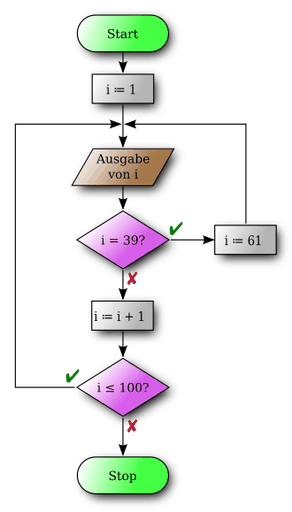
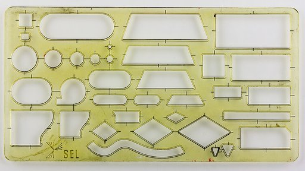

# Programmablaufplan

Ein **Programmablaufplan** (**PAP**) ist ein Ablaufdiagramm für ein Computerprogramm, das auch als *Flussdiagramm* (engl. *flowchart*) oder *Programmstrukturplan* bezeichnet wird. Es ist eine grafische Darstellung zur Umsetzung eines Algorithmus in einem Programm und beschreibt die Folge von Operationen zur Lösung einer Aufgabe.

Die Symbole für Programmablaufpläne sind nach der **DIN 66001** genormt. Dort werden auch Symbole für Datenflusspläne definiert. Programmablaufpläne werden oft unabhängig von Computerprogrammen auch zur Darstellung von Prozessen und Tätigkeiten eingesetzt (z. B. als Beschreibung des Arbeitsablaufs bei der Angebotserstellung in einem Handelsunternehmen). Im Bereich der Softwareerstellung werden sie nur noch selten verwendet. Pseudocode bietet einen ähnlichen Abstraktionsgrad, ist jedoch einfacher zu erstellen und in der Regel sehr viel einfacher zu verändern als ein Ablaufdiagramm.

Das Konzept der Programmablaufpläne stammt, ebenso wie das etwas jüngere Nassi-Shneiderman-Diagramm (Struktogramm), aus der Zeit des imperativen Programmierparadigmas. Bei der Abbildung objektorientierter Programmkonzepte durch UML finden erweiterte Programmablaufpläne (Aktivitätsdiagramme) Anwendung.

## Elemente

Hauptsächlich werden die folgenden Elemente verwendet:

- 6.4.1: Kreis; Oval / Rechteck mit gerundeten Ecken: Terminator

- 6.3.1: Pfeil, Linie: Verbindung zum nächstfolgenden Element

- 6.1.1: Rechteck: Operation (Tätigkeit)

- 7.2.4: Rechteck mit doppelten, vertikalen Linien: Unterprogramm ausführen

- 6.1.3: Raute: Verzweigung / Entscheidungen

- 6.2.1: Parallelogramm: Ein- und Ausgabe (ist in der DIN 66001 von 1982 zwar definiert, soll jedoch nicht für PA verwendet werden)

## Beispiel

Die nebenstehende Abbildung zeigt eine Zählschleife.
Die Zählvariable i wird vor Beginn der Schleife auf ihren Startwert i=1 gesetzt. Danach wird die erste Anweisung der Schleife, das Ausgeben der Variable i, ausgeführt. Die nachfolgende zweite Anweisung ist eine Auswahl, die prüft, ob i den Wert 39 besitzt. Wenn dies der Fall ist, wird i auf den Wert 61 gesetzt und die Schleife beginnt mit dem nächsten Durchlauf. Falls i nicht 39 ist, wird i in der nachfolgenden Anweisung um eins erhöht und anschließend geprüft, ob die Schleifenfortsetzungsbedingung i≤100 gültig ist. Falls ja, erfolgt ein nochmaliger Schleifendurchlauf. Ausgegeben würden alle natürlichen Zahlen von 1 bis 39 sowie 61 bis 100 (jeweils einschließlich). Falls nein, endet die Schleife.

## Erstellung

Programmablaufpläne wurden anfangs manuell erstellt, alsbald unterstützt durch spezielle Zeichenschablonen.

Mittlerweile bieten viele Grafik- und Büro-Programme Vorlagen zum vereinfachten Erstellen von Programmablaufplänen, unterstützende Funktionen oder spezielle Module. Spezielle Programme bieten oft zusätzliche Fähigkeiten wie zum Beispiel automatisches Entflechten („kreuzungsfrei machen“) von Pfeilen und Verknüpfungslinien, oder das Prüfen auf Korrektheit entsprechend der DIN. Mitunter können Ablaufpläne aus Pseudocode oder aus Quellcode einer bestimmten Programmiersprache automatisch generiert werden, oder es kann umgekehrt aus einem Programmablaufplan der zugehörige Quellcode in einer bestimmten Programmiersprache erstellt werden.

## Datenfluss- und Programmablaufpläne nach TGL 22451

In der DDR waren Datenfluss- und Programmablaufpläne nach TGL 22451 genormt. Dabei orientierten sich die definierten Sinnbilder im Wesentlichen an der DIN 66001. Abweichungen gab es vor allem in der Vorgabe der Sinnbildgrößen, des Rasters (inklusive Koordinatensystem zum besseren Auffinden von Sprungstellen) eines Programmablaufplans auf einer Dokumentenseite, sowie in speziellen Flusslinien für die Parallelverarbeitung.

Sinnvoll war die Festlegung, dass bei einer Zusammenführung die Richtung über eine zusätzliche Pfeilspitze anzugeben ist.

Neben dem Datenfluss- und Programmablaufdiagramm definierte die TGL 22451 auch eine Kurzschreibweise für die Darstellung eines Programms mit Hilfe der Programmlinienmethode.

Für das Anfertigen von Diagrammen nach TGL 22451 gab es spezielle Papiervordrucke, auf denen das Raster für die Anordnung der Sinnbilder (Blockfelder) vorgedruckt wurde.
