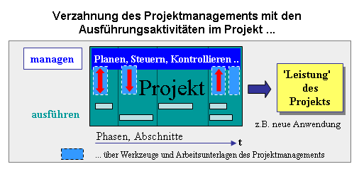
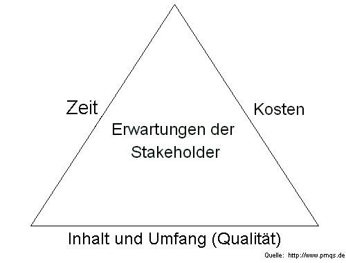

# Projektmanagement

Als **Projektmanagement** (**PM**) wird das Initiieren, Planen, Steuern, Kontrollieren und Abschließen von Projekten bezeichnet. Viele Begriffe und Verfahrensweisen im Projektmanagement sind etabliert und standardisiert.

*Abgrenzung:* Das ergänzende Gegenstück zum Projektmanagement ist das Prozessmanagement. Damit werden Prozesse standardisiert und strukturiert, die auf ein effizientes Erreichen von Unternehmenszielen ausgerichtet sind, welche nicht in Form von ‚Projekten‘ bearbeitet werden. Das Projektmanagement (als Spezialfall von Prozessen) kann somit auch Gegenstand von Aktivitäten im Prozessmanagement sein.

## Definitionen Projektmanagement

Projektmanagement wird je nach Quelle textlich unterschiedlich, inhaltlich aber weitgehend übereinstimmend definiert:

- DIN-Norm (DIN 69901-5:2009-01): „Gesamtheit von Führungsaufgaben, -organisation, -techniken und -mitteln für die Initiierung, Definition, Planung, Steuerung und den Abschluss von Projekten.“
- ISO-Norm (ISO 21500:2012; deutsche Norm als DIN ISO 21500:2016-02): „Projektmanagement ist die Anwendung von Methoden, Hilfsmitteln, Techniken und Kompetenzen in einem Projekt. Es umfasst das […] Zusammenwirken der verschiedenen Phasen des Projektlebenszyklus.“
- PMBOK Guide: „Die Anwendung von Wissen, Fähigkeiten, Werkzeugen und Methoden auf Projektaktivitäten, die der Erfüllung der Projektanforderungen dienen.“
- PRINCE2: „Projektmanagement ist die Planung, Delegierung, Überwachung und Steuerung aller Aspekte eines Projekts. Dazu gehören die Motivation der Beteiligten, die Projektziele zu erreichen, und zwar innerhalb der zu erwarteten Leistungsziele für Zeit, Kosten, Qualität, Umfang, Nutzen und Risiken.“
- IPMA ICB 4.0: „Das Projektmanagement befasst sich mit der Anwendung von Methoden, Tools, Techniken und Kompetenzen für ein Projekt, um Ziele zu erreichen. Es wird mithilfe von Prozessen umgesetzt und umfasst die Integration verschiedener Phasen des Projektlebenszyklus.“
- Etymologie: leitet sich ab von lateinisch proiectum ‚das nach vorne Geworfene‘ und lat. *manum agere* ‚an der Hand führen‘.

### Stakeholdererwartungen

Der Projektmanager hat die Aufgabe, die Erwartungen der *Stakeholder* an das Projekt so weit wie möglich zu erfüllen. Die für die Erhebung der Erwartungen meist verwendete Methode ist die Projektumfeldanalyse. Als Stakeholder bezeichnet man dabei jede Person oder Organisation, deren Interessen durch den Verlauf oder das Ergebnis des Projekts betroffen sind. Dabei wird typischerweise zwischen aktiven und passiven Stakeholdern unterschieden. Die aktiven Stakeholder sind die meist direkt im Projektumfeld befindlichen Projektbetroffenen:

- Projektleiter und Projektteam
- Auftraggeber
- Sponsoren des Projekts (Macht- und Fachsponsoren)
- Benutzer / Endkunde des Projektprodukts
- Trägerorganisation des Projekts (d. h. die Organisation/Firma, in der das Projekt durchgeführt wird)

Daneben gibt es die passiven Stakeholder, welche eher im weiteren Umfeld eines Projekts angesiedelt sind. Beispielsweise Umweltverbände, Gewerkschaften, Behörden etc.

### Steuerungsgrößen

Der Projektmanager bewegt sich bei der Planung und Steuerung des Projekts zwischen den Größen

- Zeit: Projektdauer und Termine,
- Kosten,
- Inhalt, Umfang und Qualität der Projektergebnisse.

Diese drei Größen bilden das sogenannte Magische Dreieck und stehen in einer Zielkonkurrenz zueinander, beispielsweise in folgenden Situationen:

- Um den Termin zu halten, werden Überstunden geleistet und zusätzliches Personal beschäftigt; dies erhöht die Personalkosten.
- Um bei einem *gedeckelten* Projekt die Kosten im Rahmen zu halten, werden Leistungen gestrichen; dies senkt die Qualität des Ergebnisses.
- Um die Qualität des Projektergebnisses sicherzustellen, wird zusätzliche Zeit in Tests investiert und der Termin verschoben.

Um den Projekterfolg zu gewährleisten, muss der Projektmanager zunächst die Interessen der *Stakeholder* transparent machen und dann gemeinsam mit ihnen eine Projektplanung erstellen. Letztendlich wird mit dem Auftraggeber eine Priorität dieser Größen festgelegt, auf der dann die Projektsteuerung aufgebaut wird. Das Projektreporting beschreibt das Projekt (oder die einzelnen Ergebnistypen des Projekts) dann immer in Bezug auf diese drei Größen.

Wenn die Organisationsform eines Unternehmens Ressourcenkonflikte erwarten lässt (zum Beispiel Matrixorganisation), wird manchmal eine vierte Steuergröße „Personal“ beschrieben. Auch wenn Personal sonst ein Teil der Kosten ist (Personalkosten), kann es entscheidend sein, bestimmte Personen (Experten) im Projekt zu haben. Dies sollte explizit beschrieben und allen *Stakeholdern* transparent sein. Abweichungen werden im Projektreporting transparent gemacht.

Das magische Dreieck zeigt auch, dass eine Änderung an einer der Steuergrößen automatisch zu Änderungen an einer oder beiden anderen Größen führt.

### Personelle Besetzung

Die Leitung des Projekts liegt beim Projektleiter. Er ist gegenüber dem Auftraggeber für das Projekt verantwortlich und berichtspflichtig. Dem Projektteam ist er sachlich weisungsberechtigt. Ob er auch disziplinarisch weisungsberechtigt ist, hängt von der Art der Projektorganisation ab.

Der erfolgreiche Projektmanager benötigt

- Kenntnisse des Projektmanagements,
- allgemeines Managementwissen,
- produkt- und dienstleistungsspezifisches Wissen,
- Kenntnisse über die Kunden und Stakeholder
- Prozesskenntnis bezüglich der Projektprodukterstellung und der Trägerorganisation
- Ausdauer und Belastbarkeit,
- eine ganzheitliche und nachhaltige Denkweise,
- zwischenmenschliche und kommunikative Fähigkeiten.

Neben dem methodischen Können sind die sozialen Fähigkeiten eines Projektmanagers für den Projekterfolg entscheidend. Projektmanagement ist immer auch Risiko- oder Chancenmanagement: In jedem Projekt treten ungeplante Situationen auf. Einen guten Projektmanager macht aus, dass er solche Situationen früh erkennt, mit geringen Reibungsverlusten wieder in den Griff bekommt und die sich bietenden Möglichkeiten nutzt. Projektmanager sollen daher über Erfahrungen in Kommunikation und Konfliktmanagement, Teambildung und Motivation verfügen. Anreizsysteme spielen dabei eine zentrale Rolle.

Bei intern nicht vorhandenen Kapazitäten kann die Rolle des Projektleiters auch extern vergeben werden.

Je nach Größe und Komplexität des Projektes können Aufgaben im Projektmanagement delegiert, geteilt oder in Personalunion bearbeitet werden:

- Eine Möglichkeit besteht darin, das Projekt in Teilprojekte zu unterteilen, die klar voneinander abgegrenzt sein müssen. Jeweils ein Teilprojektleiter übernimmt dann die Steuerung dieser Teilprojekte und berichtet an den Projektleiter.
- Eine andere Möglichkeit ist die Teilung nach Aufgabenbereichen. Beispielsweise können das Termin- und das Kostenmanagement oder das Risiko- und das Qualitätsmanagement jeweils bestimmten Personen mit entsprechender Qualifikation zugeordnet werden.

### Wahl der Vorgehensweise

Aufgrund verschiedener Strukturen und Methoden des Projektmanagements (PM) (siehe auch Abschnitt 4.3f, PM-Systeme und Projektphasen), für die teilweise eigene Vorgehensmodelle existieren, richtet sich die Wahl der Vorgehensweise zur Durchführung eines Projekts (inkl. des Projektmanagements) meist nach:

- Vorgaben der Organisation oder des Auftraggebers (Richtlinien)
- Größe des Projekts (zum Beispiel Anzahl Personentage)
- Komplexität des Projekts, wobei man nach technischer und sozialer Komplexität unterscheidet
- Branche des Projekts, falls ein branchen-/produktspezifisches Vorgehensmodell verwendet wird
- weiteren Projektart-Kategorisierungen wie zum Beispiel Entwicklungsprojekt, Lernprojekt, Wartungsprojekt, …

Mit der Projektdurchführung kann eine einzige, aber auch mehrere tausend Personen befasst sein. Entsprechend reichen die Werkzeuge des Projektmanagements von einfachen To-Do-Listen bis hin zu komplexen Organisationen mit ausschließlich zu diesem Zweck gegründeten Unternehmen und massiver Unterstützung durch Projektmanagementsoftware. Daher ist eine der Hauptaufgaben des Projektmanagements vor Projektbeginn die Festlegung, welche Projektmanagementmethoden in genau diesem Projekt angewendet und gewichtet werden sollen. Eine Anwendung aller Methoden in einem kleinen Projekt würde zur Überadministrierung führen, also das Kosten-Nutzen-Verhältnis in Frage stellen.

### Übergreifendes Management von Projekten

- **Programmmanagement**: Unter Programmmanagement versteht man die Koordination, Lenkung und Kontrolle einer „Menge von Projekten, die miteinander verknüpft sind, ein gemeinsames übergeordnetes Ziel verfolgen und die spätestens mit der Erreichung der Zielsetzung enden.“ (DIN 69909)
- **Projektportfoliomanagement**: Im Projektportfoliomanagement werden die Projekte und/oder Programme eines Unternehmens verwaltet. Das Portfoliomanagement konsolidiert die Kennzahlen aller Projekte und/oder Programme eines Unternehmens, sowohl laufender als auch geplanter. Damit liefert es dem Unternehmensmanagement projektübergreifende Information zur Steuerung des Gesamtbestandes an Projekten und/oder Programmen.
- **Multiprojektmanagement**: Werden mehrere Projekte, Programme und/oder Portfolios gleichzeitig gesteuert und koordiniert, spricht man im deutschsprachigen Raum auch von Multiprojektmanagement. Multiprojektmanagement, das häufig etwa bei großen Unternehmen anzutreffen ist, stellt besondere Herausforderungen an die Beteiligten, weil hier Zusammenhänge, z. B. konkurrierende Ressourcen, über mehrere Projekte hinweg koordiniert werden müssen. Ein Spezialfall wird z. T. auch *Enterprise Project Management (EPM)* genannt; dabei sind diese Projekte unternehmensweit und organisationsübergreifend zu steuern. Multiprojektmanagement kann als Form der unternehmensweiten Ressourcensteuerung unbegrenzt eingesetzt werden.
- **Großprojektmanagement**: Großprojektmanagement ist dem Programmmanagement ähnlich, wobei das Programmmanagement in der Regel Einzelprojekte eines Themenbereichs steuert und das Großprojektmanagement die Teilprojekte eines Großprojekts koordiniert.

### Software-Werkzeuge

Nahezu alle Teilbereiche des Projektmanagements werden heutzutage durch Projektmanagementsoftware unterstützt. Sie gestattet dem Projektmanager, die Planinhalte für das Projekt vorzugeben, so dass anschließend alle Beteiligten dort ihre jeweiligen Arbeitsaufgaben und -fortschritte abfragen bzw. eintragen können. Sie ermöglichen eine Auswertung des aktuellen Projektstands nach diversen Gesichtspunkten (beispielsweise hinsichtlich Frist- oder Budgeteinhaltung), auch mit Hilfe von grafischen Darstellungen (beispielsweise Gantt-Diagrammen). Zu vorab definierten *Meilensteinen* oder zum Abschluss werden *Reports* generiert.

Für bestimmte Teilbereiche des Projektmanagements kommt speziell darauf ausgerichtete Software zum Einsatz. Daneben wird häufig allgemeingültige Software (wie Textbearbeitung, Tabellenkalkulation, …) verwendet, zum Teil unter Verwendung von Mustervorlagen.
Zur *Kommunikation* werden praktisch immer Mailsysteme benutzt, in virtuellen Projektteams oder mit verteilten Stakeholdern häufig auch Webkonferenzsysteme und elektronische Meetingsysteme, die die Durchführung von Meetings und Workshops über das Internet ermöglichen.

Wikis werden als Werkzeuge für das *Wissensmanagement* ebenfalls im Projektmanagement eingesetzt.

Die Unternehmen und Organisationen wenden PM-Werkzeuge in der Praxis in hohem Maß unterschiedlich an. Dabei wird teilweise auch ERP-Software verwendet, die das ganze Unternehmen abbildet, gleichzeitig über Projektmanagementfunktionen verfügt und auch bei der Abrechnung der Projekte unterstützt.

## Erfolgsfaktoren

Um das häufige Scheitern von Projekten (siehe auch Chaos-Studie) gibt es anhaltende Diskussionen. Als wesentlicher Faktor werden dabei oft Mängel im Projektmanagement genannt.

Projektmanagement *als* Erfolgsfaktor

Das professionelle Management ist als zentrales Erfolgskriterium von Projekten zu sehen. Insbesondere sind

- die Projektgrenzen und die Projektziele adäquat zu definieren
- Projektpläne zu entwickeln und einem periodischen Controlling zu unterziehen
- Projekte prozessorientiert zu strukturieren
- die Projektorganisation und Projektkultur projektspezifisch zu gestalten
- eine spezifische Projektkultur zu entwickeln
- Projektwiderstände gezielt zu lösen und
- die Beziehungen des Projekts zum Projektkontext zu gestalten.

Projektmanagement leistet einen Beitrag zur Sicherung des Projekterfolgs, kann diesen aber nicht allein sichern, da es auch weitere Faktoren wie z. B. die Unternehmensstrategie, Wettbewerbssituation etc. gibt, die den Projekterfolg beeinflussen.

Solche **Voraussetzungen *für* erfolgreiches PM**, die nur außerhalb des Projektmanagements erfüllt werden können, sind z. B.:

- Commitment der Stakeholder: ‚Sponsor‘ für das Projekt, Akzeptanz des Projekts und seiner Ziele
- Angemessene Projekt-Infrastruktur: Organisation, Methoden und Werkzeuge sind verfügbar
- Kompetenz der dem Projekt zugeteilten Personen

Darüber hinaus erschöpft sich ‚Projekte erfolgreich führen‘ nicht im Beherrschen der PM-Methodik. Vielmehr wird der Erfolg in hohem Maß auch von den persönlichen Eigenschaften und Fähigkeiten („weiche Faktoren“) aller Beteiligten inkl. der Projektmanager bestimmt.

Zum Beispiel fließt in wirkmächtigen, englischsprachigen Traditionen „gold plating“ über das Zeitmanagement ein; der Begriff wird i. e. S. idealerweise bei Anwendung mitdefiniert: „Unter Gold Plating versteht man bessere Regeln als die EU-Mindeststandards.“ „Schutznormen aus dem Sozial- und Umweltbereich (...) seien vom Gold-Plating Projekt ausgenommen.“ Overengineering sei thematisch verwandt.

Bei **Unregelmäßigkeiten und Störungen** im Projektablauf spricht man von Projektdiskontinuitäten. Diese können oft nicht im Rahmen des normalen Projektmanagements bewältigt werden und bedürfen gesonderter Methoden.

## Widerstände

Das Auftreten von Widerständen bei einzelnen Projektteilnehmern oder Projektbetroffenen kommt regelhaft in Projekten vor. Der richtige und konsequente Umgang mit aufkommenden Widerständen trägt zum Erfolg des Projekts bei und obliegt dem Projektmanager.

Projektwiderstände sind meist auf eine mangelnde Akzeptanz und Umsetzungsbereitschaft der Projektinhalte zurückzuführen. Dabei sind die drei Dimensionen der Leistung relevante Einflussfaktoren, deren Betrachtung bei Widerständen zur Bewältigungsstrategie gehört: Leistungsbereitschaft, Leistungsfähigkeit und Leistungsmöglichkeit. Alle drei Dimensionen von Leistung müssen bei den einzelnen Projektbeteiligten – in unterschiedlichem Ausmaß – gegeben sein.

Folgende sechs Schritte bieten einen ganzheitlichen Umgang mit Widerständen im Projektmanagement und zeigen einen Weg zur lösungsorientierten Herangehensweise auf:

**Akzeptanz**: Widerstand im Projekt ist nicht zu ignorieren, sondern zu akzeptieren. Eine Leugnung von Widerstand gefährdet das Projekt.

**Ursachenklärung**: Wo liegt die Ursache für den Widerstand? Identifikation ursächlicher Positionen, Ansprüche und Fehlinformationen für den Widerstand.

**Rationale**: Sachliche Analyse des Widerstands zur Identifikation valider (Widerstands-)Argumente. Unterscheidung zwischen emotionaler und sachlicher Argumentationsbasis.

**Einschätzung**: Bewertung und lösungsorientierte Einordnung der Widerstandsargumentation. Welche Bedeutung hat der Widerstand für das Projekt?

**Reaktion**: Ausführung der erarbeiteten Bewältigungsstrategie unter Berücksichtigung der einzelnen Ursachen des Widerstands.

**Kommunikation**: Die Bewältigung des Widerstands, etwaige Lösungsansätze oder aus dem Widerstand resultierende Anpassungen im Projekt sind offen und transparent an alle Projektbeteiligten zu kommunizieren.

## Standards und Normen

In den Normen und Standards sind *Projektmanagement-Methoden und Vorgehensmodelle* zu unterscheiden. Während sich erstere auf bestimmte Teildisziplinen des Projektmanagements (Risiken, Anforderungen, Terminplanung, …) beziehen, versucht man mit sog. Vorgehensmodellen die Abfolge der Tätigkeiten, also die Prozesse für das Projekt und das PM möglichst präzise festzulegen; weit verbreitet ist das V-Modell.

Die Aufgabenstellungen, Methoden, Instrumente und Ebenen des Projektmanagements sind im Wesentlichen gut bekannt und dokumentiert. Weltweit gibt es Verbände und Gremien, die sich dem Projektmanagement verschrieben haben.
Grundkenntnisse darüber werden in den Studiengängen der Ingenieurwissenschaft, Wirtschaftswissenschaft und Informatik vermittelt. Normierungsinstitute und PM-Verbände setzen sich zum Ziel, eine möglichst weit verbreitete, einheitliche Begriffsbasis und Terminologie zu etablieren und zu fördern.

Für den *Praxiseinsatz* legen Unternehmen/Organisationen in der Form von PM-Handbüchern, PM-Leitfäden etc. fest, wie das PM in ihren Projekten konkret anzuwenden ist. Die einzelnen Vorgaben beziehen sich dabei i. d. R. auf Standards wie sie in diesem Kapitel genannt werden, sie werden dabei aber häufig unternehmens- oder situationsspezifisch angepasst (reduziert, vereinfacht, individuell ergänzt, auf Werkzeuge adaptiert, …) und sie berücksichtigen Besonderheiten, die sich ergeben aus:

- dem Projektgegenstand, beispielsweise Erstellung von Software, Rückbau eines Kernkraftwerks, Aufforstung einer Wüstenregion;
- der Projekttyp – ein Forschungs- oder Entwicklungsprojekt, ein Investitionsprojekt oder ein Organisationsprojekt;
- der Projektgröße;
- weiteren Gegebenheiten und Gepflogenheiten im Unternehmen bzw. die Organisationskultur

### Internationale Projektmanagement-Standards

- **Normungsorganisationen**: Die International Organization for Standardization (ISO) hat mit der ISO 21500 einen Leitfaden zum Projektmanagement und mit der ISO 10006 einen Leitfaden für Qualitätsmanagement in Projekten herausgegeben. Die DIN 69901 des Deutschen Instituts für Normung ist dabei stark in die ISO 21500 eingegangen.
- **Regierungen**: PM-Standards, die ursprünglich als nationale Regierungsstandards konzipiert wurden und mittlerweile international in Betrieben zum Einsatz kommen: PRINCE2 entwickelt von der britischen Regierung, PM² entwickelt von der Europäischen Kommission oder HERMES entwickelt von der Schweizer Bundesverwaltung.
- **Verbände**: PM-Standards, die in den 1990er Jahren von Projektmanagementverbänden verfasst wurden und mittlerweile international in Betrieben zum Einsatz kommen: PMBOK Guide des US-amerikanischen Project Management Institute (PMI) oder die Individual Competence Baseline (ICB) der International Project Management Association (IPMA).

### Internationale Projektmanagement-Zertifizierungen

Seit Mitte der 1990er Jahre haben sich Projektmanagement-Zertifizierungen etabliert. Die folgenden drei PM-Standards dominieren dabei den Zertifizierungsmarkt:

### Projektmanagement-Systeme

Um die Arbeits- und Organisationsform Projektmanagement in einem Unternehmen zu verankern, sind entsprechende Rahmenbedingungen und Spielregeln notwendig. Es müssen ganzheitliche, leistungsfähige Projektmanagement-Systeme geschaffen werden, die im Regelfall Standards, Maßnahmen und Tools in folgenden Bereichen enthalten:

Organisation
:   Die organisatorische Verankerung des Projektmanagements muss im jeweiligen Unternehmen eindeutig geklärt sein. Hierzu zählen beispielsweise die Definition von klaren Rollen, Kompetenzen und Verantwortlichkeiten (insbesondere das Zusammenspiel Linie – Projekt), die Einrichtung einer zentralen Organisationseinheit für Projektmanagement (zum Beispiel Project Management Office, Project Competence Center) oder die Festlegung von PM-Karrierepfaden und Anreizsystemen.

Methodik
:   Im Bereich der Methodik werden Standards, Instrumente, Methoden, Richtlinien und Prozesse definiert, die bei Projekten zur Anwendung kommen sollen. Die Methodik wird in der Regel individuell für die jeweilige Organisation festgelegt. In vielen Fällen wird die im Projekt verwendete Methodik in einem Projektmanagementhandbuch dokumentiert.

Qualifizierung
:   Damit Projektmanagement erfolgreich angewendet werden kann, müssen Führungskräfte, Projektleiter und -mitarbeiter entsprechend für ihre Rolle vorbereitet und dafür qualifiziert werden. Seminare, Training-on-the-Job oder Projekt-Coaching sind weit verbreitete Instrumente zur Qualifizierung, ebenso wie die Zertifizierung bei einer der anerkannten Organisationen.

Software
:   Es müssen IT-gestützte Strukturen geschaffen werden, die einen effizienten Informations- und Kommunikationsfluss gewährleisten sowie die Projektplanung und -steuerung über den gesamten Projektverlauf unterstützen. Am Markt existieren eine Vielzahl von PM-Tools und umfangreichen PM-Lösungen, die diverse Funktionalitäten bieten.

Die derzeit gültige Norm 69901:2009 definiert Projektmanagementsysteme als „System von Richtlinien, organisatorischen Strukturen, Prozessen und Methoden zur Planung, Überwachung und Steuerung von Projekten“. Die mittlerweile nicht mehr gültige Norm DIN 69905 definierte hingegen Projektmanagementsysteme noch als „organisatorisch abgrenzbares Ganzes, das durch das Zusammenwirken seiner Elemente in der Lage ist, Projekte vorzubereiten und abzuwickeln.“

Außerdem hat die Organisationsform der Trägerorganisation Einfluss auf die Projekte. Die bekanntesten Organisationsformen sind:

- Linienorganisation (funktionsbezogene Organisation)
- Matrixorganisation (Mischsicht)
- Projektorientierte Organisation

## Projektphasen

→ *Hauptartikel: Projektphase*

Projektphasen sind zeitliche Abschnitte, die im Vorgehensmodell für ein Projekt festgelegt sind. Die Phasen bilden den Rahmen, in dem jeweils einzelne Aktivitäten mit ihrem Arbeitsinhalt (was tun?) und ihren Ergebnissen festgelegt werden. Diese Aktivitäten werden im Projektmanagement (Teilbereich Aufgabenmanagement) gesteuert und kontrolliert. Üblicherweise enden die Projektphasen mit definierten Meilensteinen. Je nach Projektart, Projektprodukt, Branche etc. sind Phasenmodelle i. d. R. *individuell* auf die Aufgabenstellung ausgerichtet (z. B. für Investitionsprojekte).

Die Gliederung der Projektaktivitäten in Phasen ist in Reinform eine Vorgehensweise nach dem Wasserfallmodell, alternativ kann sie jedoch auch iterativ angelegt sein, z. B. um Projektergebnisse bei bestimmten Situationen nochmals zu überarbeiten.

Ein Beispiel für ein Phasenmodell *im Allgemeinen* (mit Aufzählung darin anfallender PM-Aufgaben) ist:

- **Projektdefinition:** Das Ziel des Projekts wird festgelegt, Chancen und Risiken werden durch eine Ist-Aufnahme analysiert und die wesentlichen Inhalte festgelegt. Kosten, Ausmaß und Zeit werden grob geschätzt; bei großen Projekten kann dies durch eine Machbarkeitsstudie unterstützt werden. Am Ende dieser Phase steht der formelle Projektauftrag.
- **Projektplanung:** In dieser Phase wird das Projektteam organisiert, und es werden Aufgabenpläne, Ablaufpläne, Terminpläne, Kapazitätspläne, Kommunikationspläne, Kostenpläne, Qualitätspläne und das Risikomanagement festgelegt. Hierbei spielen Meilensteine eine wichtige Rolle. Dabei handelt es sich um wesentliche und zentrale Ereignisse während des Projektverlaufs, an denen der aktuelle Projektstand mess- und überprüfbar ist und der Projektfortschritt beurteilt werden kann.
- **Projektdurchführung und -kontrolle:** Diese Phase umfasst, abgesehen von der Durchführung selbst, für das Projektmanagement die Kontrolle des Projektfortschritts und die Reaktion auf projektstörende Ereignisse. Erkenntnisse über gegenwärtige oder zukünftige Abweichungen führen zu Planungsänderungen und Korrekturmaßnahmen.
- **Projektabschluss:**  Die Ergebnisse werden präsentiert und in dokumentierter Form übergeben. In einem Review wird das Projekt rückblickend bewertet; die gemachten Erfahrungen werden häufig in einem Lessons-Learned-Bericht festgehalten. Der Projektleiter wird vom Auftraggeber entlastet.
- Unter Umständen **Projektabbruch:** Das Projekt wird abgebrochen, ohne dass die Projektziele erreicht sind.

Ähnlich kurz definiert auch der als Demingkreis bekannte PDCA-Zyklus ein allgemeines 4-Phasen-Vorgehen, das nach Plan, Do, Check und Act (i. S. Einführung) unterscheidet. Dieses allgemeine Vorgehen kann ‚generisch‘, für ganze Projekte oder auch für einzelne Projektabschnitte (Phasen) angewendet werden.

Ein *Phasenmodell in der Softwareentwicklung* könnte eine feinere Phasenstruktur aufweisen und zum Beispiel wie folgt aussehen. Die Aufgaben des Projektmanagements sind dabei nicht als Projektphase definiert, sondern werden als global wahrzunehmende Projekt-Rolle unterstellt:

- Analyse
- Machbarkeitsstudie
- Entwurf / Konzeption
- Umsetzung
- Test
- Pilotierung
- Rollout bei den Anwendern
- Kontrolle und Optimierung
- Abschluss

In der aktuellen Projektmanagement-Literatur wird die strenge Phaseneinteilung („Wasserfallmodell“) des klassischen Projektmanagements oft infrage gestellt. So können sich Phasenverläufe auch überlappen, zirkulär oder iterativ angelegt sein und so die Erzeugung von Inkrementen vorsehen. Rapid Prototyping und adaptive/agile Methoden, die ihren Ursprung in der Softwareentwicklung haben, sind Beispiele dafür. Auch sind hybride Ansätze, also Mischformen aus planartigen mit adaptiven Strukturen/agilen Methoden (z. B. PRINCE2 Agile, PMI-ACP, AgilePM) gebräuchlich.

Es wird kritisiert, dass ein universell gültiger Phasenansatz der Unterschiedlichkeit von Projekten nicht gerecht werde. „One size doesn’t fit all.“ Dennoch baut auch die neue DIN-Normenreihe 69900 darauf auf. Eine PM-Aufgabe ist deshalb, das Vorgehen für ein konkretes Projekt, ausgehend von Standardmodellen, zweckentsprechend zu skalieren; z. B. Projektphasen und Arbeitsstrukturen (z. B. der Produktentwicklung) zusammenzufassen und nicht erforderliche Projektaktivitäten auszuklammern.

## Geschichte

„Projektplanung gibt es, seit Menschen größere Vorhaben gemeinschaftlich durchführen. Weder ein militärischer Feldzug, noch die Errichtung großer Gebäude (Tempel, Festungen), noch beispielsweise eine lange Seereise zur Entdeckung der Westpassage nach Indien sind vorstellbar, ohne dass die Verantwortlichen diese Projekte detailliert geplant hätten. Doch geschah dies lange Zeit formlos, allein aufgrund der Erfahrungen und Kenntnisse der Verantwortlichen; erst im 20. Jahrhundert sollten diese informellen Verfahren zusammengetragen, systematisiert und in die wissenschaftlich aufbereitete Form gebracht werden, unter der heute Projektmanagement betrieben wird.“

Henry Gantt entwickelte 1910 den Balkenplan (auch Gantt-Diagramm genannt). Unabhängig davon hatte Karol Adamiecki eine ähnliche Methode mit den Namen *Harmonogram* und *Harmonograf* bereits 1896 entwickelt. Gantts Methode kam erstmals bei einem größeren Bauvorhaben, der Errichtung des 1935 fertiggestellten Hoover Dam, zum Einsatz. Die erste Dokumentation der Vorgehensweise beim Projektmanagement wurde vermutlich im Rahmen des Manhattan-Projekts vorgenommen.

Eine weitere Entwicklung des Projektmanagements war dann für den Wettlauf ins All erforderlich – vor allem für das Apollo-Programm.
