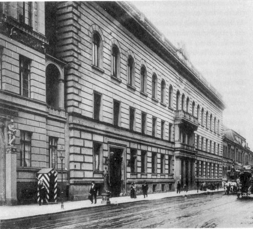
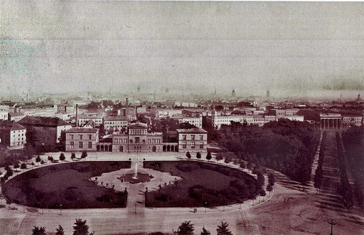
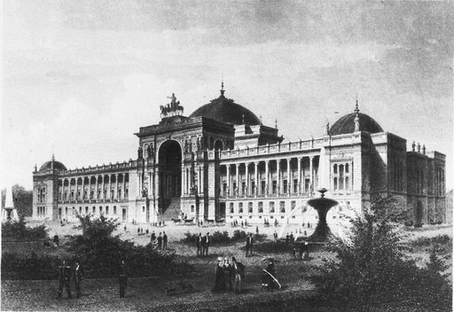

# Reichstagsgebäude

Das **Reichstagsgebäude** (umgangssprachlich kurz: **Reichstag**; offiziell: *Plenarbereich Reichstagsgebäude*; inoffiziell auch *Bundestag* oder *Wallot-Bau*) am Platz der Republik in Berlin ist seit 1999 Sitz des Deutschen Bundestages. Seit 1994 tritt hier auch die Bundesversammlung zur Wahl des deutschen Bundespräsidenten zusammen.

Der Bau, ein Nationalsymbol Deutschlands, wurde nach Plänen des Architekten Paul Wallot zwischen 1884 und 1894 im Stil der Neorenaissance im Ortsteil Tiergarten am linken Ufer der Spree errichtet. Er beherbergte sowohl den Reichstag des Deutschen Kaiserreiches als auch den der Weimarer Republik. Zunächst tagte dort auch der Bundesrat des Kaiserreichs. Nach schweren Beschädigungen durch den Reichstagsbrand von 1933 und den Zweiten Weltkrieg wurde das Gebäude in den 1960er Jahren in modernisierter Form wiederhergestellt und diente Ausstellungen und Sonderveranstaltungen. Von 1995 bis 1999 wurde der Reichstag für die 1991 beschlossene dauerhafte Nutzung als Parlamentsgebäude von Norman Foster grundlegend umgestaltet. Am 19. April 1999 fand die Schlüsselübergabe an Bundestagspräsident Wolfgang Thierse statt. Seither tagt dort der Deutsche Bundestag. Eine Landmarke im Stadtbild ist die begehbare Glaskuppel über dem Plenarsaal nach einer Idee von Gottfried Böhm.

Der Reichstag gilt mit jährlich fast drei Millionen Besuchern als das weltweit meistbesuchte Parlamentsgebäude.

### Provisorien

Erster Sitz eines Reichstages in Berlin war das Gebäude des Preußischen Herrenhauses in der Leipziger Straße 3. Hier tagte ab 1867 der Reichstag des von Preußen dominierten Norddeutschen Bundes. Nach der Gründung des Deutschen Reiches 1871 kamen die Abgeordneten der süddeutschen Staaten hinzu, sodass ein größeres Gebäude benötigt wurde. Man zog zunächst in das Preußische Abgeordnetenhaus (Leipziger Straße 75). Bald erwies sich auch dieses als zu klein. Der Reichstag verabschiedete am 19. April 1871 einen Antrag, in dem es hieß: „Die Errichtung eines den Aufgaben des deutschen Reichstags entsprechenden und der Vertretung des deutschen Volkes würdigen Parlamentshauses ist ein dringendes Bedürfnis.“ Ein anderer, mit Blick auf den kurz zuvor errungenen Sieg über Frankreich und die Reichsgründung stark nationalistisch formulierter Antrag für den Neubau fand keine Mehrheit.

Eine *Reichstagsbaucommission* sollte die Vorbereitungen für einen „würdigen“ Neubau treffen. Es galt, den Bauplatz festzulegen, das Bauprogramm zu entwickeln, einen Architektenwettbewerb auszuschreiben und für eine geeignete Übergangslösung zu sorgen. Ein Provisorium war schnell gefunden: In nur 70 Tagen wurde das Gebäude Leipziger Straße 4, zuvor Sitz der Königlichen Porzellanmanufaktur, für den Parlamentsbetrieb tauglich gemacht. Man rechnete mit einer Übergangszeit von fünf bis sechs Jahren. Tatsächlich wurden es 23 Jahre.

### Grundstück

Die Probleme begannen mit der Wahl eines passenden Grundstücks für den Neubau. Nach kurzer Suche bestimmte die Parlamentsbaukommission einen Bauplatz auf der Ostseite des damaligen *Königsplatzes* (heute: Platz der Republik). Allerdings stand dort noch das Palais Raczyński des polnischen Grafen Atanazy Raczyński, eines preußischen Diplomaten und Kunstsammlers. Die Kommissionsmitglieder glaubten jedoch, mit der Unterstützung des Kaisers Wilhelm I. und damit letztlich auch mit der Zustimmung des Grafen rechnen zu können, und schrieben einen internationalen Wettbewerb für dieses Grundstück aus.

Den Wettbewerb, an dem über hundert Architekten teilnahmen, entschied im Juni 1872 Ludwig Bohnstedt aus Gotha für sich. Sein Entwurf fand große öffentliche Zustimmung, konnte aber nicht realisiert werden, weil sich Graf Raczyński weigerte, sein Grundstück zur Verfügung zu stellen. Und Wilhelm I. zeigte wenig Neigung, ein Enteignungsverfahren zu betreiben, obwohl auch er den Standort passend fand.

Nach und nach verständigte sich die Kommission auf einen alternativen Standort weiter östlich näher zur Stadtmitte. Bismarck, Wilhelm I. und die konservativen Abgeordneten lehnten diesen Bauplatz allerdings vehement ab, da der Reichstag damit in die Nähe des Stadtschlosses rückte, was als politische Aufwertung des Parlamentes gedeutet wurde. Im Jahr 1881 konnte auf die erste Standort-Wahl zurückgegriffen werden, da der Graf 1874 verstorben war. Sein Sohn hatte das Raczyński-Palais noch im selben Jahr an den Preußischen Staat verkauft.

## Planung

Im Dezember 1881 beschloss der Reichstag, das Baugelände zu erwerben. Eine lebhafte öffentliche Diskussion entstand um die Frage, ob Ludwig Bohnstedt außer Konkurrenz beauftragt werden sollte, seinen siegreichen Entwurf von 1872 umzuarbeiten und auszuführen.

Im Februar 1882 wurde dann aber ein neuer Wettbewerb ausgeschrieben, zu dem diesmal nur Architekten „deutscher Zunge“ zugelassen waren – eine Forderung des Verbandes deutscher Architekten- und Ingenieurvereine. Hohe Preisgelder luden zur Teilnahme ein. Auch Bohnstedt beteiligte sich wieder, blieb aber ebenso chancenlos wie auch zum Beispiel Heinrich von Ferstel. Aus 189 anonymen Einsendungen gingen die Entwürfe von Paul Wallot aus Frankfurt am Main und Friedrich von Thiersch aus München als Sieger hervor; beide erhielten am 24. Juni 1882 erste Preise. Da aber Wallot eindeutig mehr Stimmen auf seiner Seite hatte (19 von 21), bekam er den begehrten Auftrag. Am 9. Juni 1883 wurde der dazugehörige Haushalt genehmigt. Vorangegangen war ein Rededuell von August Reichensperger, der einen neugotischen Entwurf (als „germanische Architektur“) Wallots Renaissancebau vorzog, und dessen Befürworter Robert Gerwig.

Für den Architekten begann ein langwieriger und mühevoller Arbeitsprozess, eine ständige Auseinandersetzung mit mehreren zuständigen Instanzen. Nach einem Beschluss von 1880 sollte die Akademie des Bauwesens beim zukünftigen Neubau eines Reichstagsgebäudes unbedingt als Berater eingeschaltet werden – eine unglückliche Regelung, weil viele Akademiemitglieder am vorhergehenden Wettbewerb mit eigenen Entwürfen beteiligt waren. Unkorrektes Verhalten ließ sich der Akademie nicht nachweisen, aber ihre häufige, ungewöhnlich pedantische Kritik an Wallots Arbeit rief Zweifel an ihrer Objektivität hervor, die in der Öffentlichkeit auch geäußert wurden.

Die Bauabteilung im preußischen Ministerium der öffentlichen Arbeiten als zweite Gutachterinstanz verlangte ebenfalls weitreichende Änderungen. Wallot selbst blieb nach außen hin geduldig und beklagte sich nur in persönlichen Briefen. Er musste in Abständen von wenigen Monaten immer neue Entwürfe für die Anordnung der Innenräume und die Gestaltung der Fassaden liefern. Unabhängige Beobachter glaubten am Ende, den prämierten Entwurf nicht mehr wiederzuerkennen.

Schließlich konnte am 9. Juni 1884 der Grundstein gelegt werden. Viel Militär und nur wenige Parlamentarier nahmen an der verregneten Zeremonie teil. Drei Hohenzollern hatten die Hauptrollen: Kaiser Wilhelm I. sowie sein Sohn und sein Enkel – die späteren Kaiser Friedrich III. und Wilhelm II. Es wurde kolportiert, dass beim Hammerschlag Wilhelms I. das symbolische Werkzeug zersprungen sei.

## Architektur

Das Reichstagsgebäude weist folgende Daten in Zahlen auf:

### Außengestalt

Der Reichstag wurde als eines der ersten großen Gebäude mit dem seinerzeit noch neuartigen Portlandzement mit Stahlarmierung (Moniereisen, heute: Stahlbeton) errichtet.

Während der Bauarbeiten entwickelte sich die Kuppel zum besonderen Problem. Verschiedene Einsprüche hatten Wallot gezwungen, sie von ihrer zentralen Position über dem Plenarsaal zur westlichen Eingangshalle zu verlegen. Nach diesem Plan wurde das Bauwerk nun von der Berliner Steinmetzfirma Zeidler & Wimmel errichtet. Der plastische Schmuck stammte vom Bildhauer Friedrich Volke. Je weiter der Bau vorankam, desto mehr kam der Architekt zu der Überzeugung, dass die erzwungene Änderung rückgängig gemacht werden müsse. In zähen Verhandlungen erreichte er die Zustimmung dafür. Inzwischen waren die tragenden Wände um das Plenum schon errichtet; Berechnungen ergaben aber, dass sie für die geplante steinerne Kuppel zu schwach waren: Der aus einzelnen gemauerten Wänden gebildete Tambour, auf dem das Widerlager der Kuppel ruhen sollte, konnte die rechtwinklig zu den Wänden wirkende horizontale Schubkomponente nicht aufnehmen. Im Jahr 1889 fand der im Berliner Reichseisenbahnamt beschäftigte Bauingenieur Hermann Zimmermann außerhalb seiner dienstlichen Tätigkeit eine Lösung: Er reduzierte die Kuppelhöhe von 85 m auf knapp 75 m und schlug eine relativ leichte, technisch anspruchsvolle Konstruktion aus Stahl und Glas vor. Zimmermann entwarf ein stählernes Raumfachwerk, dessen unterer achteckiger Ring durch ein raffiniertes Auflagersystem so konstruiert wurde, dass die vier Wände nur in ihren Ebenen belastet wurden, d. h. jede Wand statisch als Scheibe wirkte. Zimmermanns Raumfachwerk war äußerlich und innerlich statisch bestimmt und konnte somit allein mit Hilfe der Gleichgewichtsbedingungen berechnet werden. Dies ergab, dass die Lagerung (äußere statische Bestimmtheit) der Kuppel ein zwangsfreies Ausdehnen bzw. Zusammenziehen z. B. infolge Temperaturänderung erlaubte. Dieses Kuppelsystem ging als Zimmermann-Kuppel – als „geniale Tragwerksmaschine“ – in die Geschichte der Bautechnik ein. Zimmermann selbst publizierte die baustatische Analyse seiner Kuppel in verallgemeinerter Form erst 1901. Die Zimmermann-Kuppel versorgte den Plenarsaal mit natürlichem Licht und gab dem Parlamentsgebäude den gewünschten würdigen Abschluss. Darüber hinaus galt sie als Wahrzeichen für die Innovationskraft und Leistungsfähigkeit deutscher Bauingenieure auf Basis der Baustatik in ihrer Vollendungsphase (1875–1900). So ist Zimmermanns Reichstagskuppel auch ein Triumph der klassischen Baustatik.

Wilhelm II., seit 1888 als Kaiser im Amt, hatte anfangs noch eine recht positive Einstellung zum Reichstagsgebäude. Er unterstützte Wallot auch in der Frage, wo die Kuppel zu platzieren sei, obwohl er sie prinzipiell als Ärgernis empfand – weil er darin ein Symbol für die Ansprüche des ungeliebten Parlaments sah und weil sie höher war als die Kuppel des Berliner Stadtschlosses mit ihren 67 m. Seit etwa 1892 wurde eine zunehmende Abneigung des Kaisers gegenüber dem Gebäude deutlich; er bezeichnete es als „Gipfel der Geschmacklosigkeit“ und „völlig verunglückte Schöpfung“ und schmähte es inoffiziell als „Reichsaffenhaus“. Gegen Wallot entwickelte er eine deutliche persönliche Aversion, vermutlich weil der seinen Änderungswunsch spontan abgelehnt hatte. Er verweigerte dem Architekten mehrere Auszeichnungen, für die er vorgesehen war. Seinem Vertrauten Philipp zu Eulenburg teilte er brieflich mit, es sei ihm gelungen, Wallot im persönlichen Gespräch mehrfach zu beleidigen.

Paul Wallot entwickelte den Bau in dem für Regierungsbauten üblichen zeitgenössischen Reichsstil, einer architektonischen Spielart des Historismus: Für die Außenform verwendete er hauptsächlich Formen der italienischen Hochrenaissance (Neorenaissance) und verband sie mit einigen Elementen der deutschen Renaissance, mit etwas Neobarock und einer damals hochmodernen Stahl- und Glaskonstruktion der Kuppel. Das Ergebnis empfanden viele Zeitgenossen nicht als gelungene Synthese, sondern als wenig überzeugendes Neben- und Durcheinander. Traditionalisten lehnten die technische Modernität der Kuppel ab; jüngere Kritiker konnten sich nicht mit dem massiven Quaderbau im Stil der Renaissance anfreunden. Besonders drastisch urteilte der einflussreiche Berliner Stadtbaurat und erfolgreiche Architekt Ludwig Hoffmann: Er nannte das Gebäude einen „Leichenwagen erster Klasse“. Andere Quellen berichten aber, dass die Mehrheit der deutschen Architekten den Bau nachdrücklich gelobt habe.

Am 5. Dezember 1894 fand die Schlussstein-Setzung in Gegenwart des Kaisers und der Kaiserin statt.
Wieder war es eine vorwiegend militärische Veranstaltung, bei der die kaiserliche Urkunde verlesen wurde:

> „Wir Wilhelm, von Gottes Gnaden deutscher Kaiser und König von Preußen, thun kund und fügen zu wissen, daß wir beschlossen haben, im Namen der Fürsten und freien Städte des Reiches in Gemeinschaft mit den verfassungsmäßigen Vertretern des deutschen Volkes den Schlußstein zu dem Hause zu legen, in welchem die gesetzgebenden Körperschaften fortan ihrer Arbeit walten sollen. Der erhabene Gründer des Reiches, Kaiser Wilhelm I., welcher am 9. Juni 1884 den Grundstein legte, hat die Vollendung des Werkes nicht mehr schauen dürfen, und auch sein ruhmgekrönter Sohn, Kaiser Friedrich, wurde nach Gottes Rathschluß von uns abgerufen. Wie wir das Gedächtniß dieser unserer Vorfahren in der Kaiserwürde dankerfüllten Herzens segnen, so wird, dessen sind wir gewiß, ihr Andenken für alle Zeiten im deutschen Volke fortleben. Zehn Jahre mühevoller Arbeit sind über der Errichtung dieses Baues dahingegangen. Zur Ehre des geeinten Vaterlandes erhebt er sich festgefügt durch deutsche Hände, ein Zeugniß deutschen Fleißes, deutscher Kraft. So soll er nunmehr seiner Bestimmung übergeben werden; in seinen Räumen walte der Geist der Gottesfurcht, der Vaterlandsliebe und der Eintracht. Dieser Geist erfülle die Männer, welche berufen sind, hier des Reiches Wohlfahrt zu fördern. Es bleibe ein Baudenkmal der großen Zeit, in welcher als Preis des schwer errungenen Sieges das Reich zu neuer Herrlichkeit erstanden ist, eine Mahnung den künftigen Geschlechtern zu unverbrüchlicher Treue in der Pflege dessen, was die Väter mit ihrem Blute erkämpft haben. Das walte Gott!“

– Bericht in *Das Vaterland* vom 6. Dezember 1894

Wallot führte den Kaiser durch das Gebäude; Wilhelm II. ließ öffentlich nur anerkennende Worte hören. In seiner Thronrede zur Reichstagseröffnung sagte der Kaiser:

> „Möge Gottes Segen auf dem Hause ruhen, möge die Größe und Wohlfahrt des Reiches das Ziel sein, das alle zur Arbeit in seinen Räumen Berufenen in selbstverleugnender Treue anstreben!“

Die Baukosten betrugen 24 Millionen Goldmark (kaufkraftbereinigt in heutiger Währung: rund 209,2 Millionen Euro). Sie wurden aus den Reparationen beglichen, die Frankreich nach dem verlorenen Krieg von 1870/1871 zu zahlen hatte. Es wurden 30.000 m³ schlesischer Sandstein und über 32 Millionen Ziegelsteine verbaut.

### Innenausstattung

Das Reichstagsgebäude war für seine Aufgaben im Allgemeinen gut vorbereitet. Die Haustechnik war ganz auf der Höhe der Zeit. Ein eigenes Kraftwerk versorgte das Gebäude mit elektrischem Strom. Es gab eine zentrale Heizungssteuerung mit Temperaturfühlern, elektrische Ventilatoren, Doppelfenster, Telefone, Toiletten mit Wasserspülung und dergleichen. Außer den Sitzungssälen für Reichstag und Bundesrat waren vorhanden: ein Lesesaal, diverse Sprechzimmer, ein Erfrischungsraum, Garderoben, Wasch- und Umkleideräume usw. Die Bibliothek umfasste 90.000 Bände, als sie eingerichtet wurde, und war auf 320.000 Bände ausgelegt. Das Reichstagsarchiv enthielt schon bald Millionen von Schriftstücken, die mit einem sinnreichen pneumatischen Aufzugssystem in den Lesesaal geschickt werden konnten.

Ein Mangel allerdings war bald zu erkennen – es fehlte an ausreichenden Arbeitsräumen für alle Abgeordneten. Im Vergleich zu anderen europäischen Parlamentsbauten war das Gebäude mit seiner Grundfläche von 138 m × 96 m relativ klein. Die Nöte eines fiktiven Abgeordneten wurden so beschrieben: „Was nützten ihm […] die feingeschnitzten Holzpaneele, die einzig schöne Aussicht auf den Königsplatz […], wenn er keinen leeren Stuhl fand und keinen freien Arbeitstisch zum ruhigen Lesen und Schreiben?“ Auch Umbauten in den folgenden Jahren konnten das Problem nicht beseitigen. Das Verhältniswahlrecht der Weimarer Republik ließ die Zahl der Abgeordneten dann sogar von 397 auf über 600 ansteigen. Gegen Ende der 1920er Jahre wurden Erweiterungsbauten nördlich des Reichstags geplant, für die ein Architektenwettbewerb veranstaltet wurde. Die Planungen wurden allerdings nicht mehr ausgeführt.

Für die Innenräume wurde ein beschränkter Wettbewerb ausgeschrieben, zu dem u. a. Gustav Schönleber, Eugen Bracht und Franz Stuck eingeladen wurden. Schmuckformen – Giebel mit Fächerrosetten über den Türen, Obelisken, gedrechselte Säulen, Girlanden und allegorische Figuren – waren in repräsentativen Renaissancegebäuden, zum Beispiel in den Rathäusern wohlhabender Städte, oft in großer Fülle angebracht und schmückten nun ganz ähnlich auch das Reichstagsgebäude. Diese aufwendige Gestaltung wurde von Betrachtern als typisch deutsch aufgefasst und war auch so gemeint – als Gegengewicht und Ergänzung zu einer Außenansicht, die trotz anderer Zutaten vor allem den Eindruck der damals weitverbreiteten „internationalen Neorenaissance“ vermittelte. Die meisten Räume, auch der große Sitzungssaal, waren in gängiger historistischer Formensprache mit Holz ausgekleidet – mit Eiche, Esche, gebeizter Kiefer und Tropenhölzern. Zum Teil sprachen raumakustische Gründe dafür; jedenfalls war Holz preiswerter als Stein. Ganz wesentlich ging es aber auch um Stilfragen; denn Wallot entwarf die Innenräume, einschließlich des Mobiliars, großenteils im Stil der deutschen Renaissance des 16. und 17. Jahrhunderts.

Der Frankfurter Glasmaler Alexander Linnemann, der mit Wallot befreundet war, entwarf und produzierte zahlreiche Glasfenster.

### Weitere Verzierungen

Die künstlerische Ausgestaltung war mit der Schlusssteinlegung 1894 noch nicht abgeschlossen. Sie war vor allem darauf angelegt, die 1871 hergestellte Einheit des Reiches auszudrücken.

#### Giebel der Säulenhalle

Das Reichswappen im Giebel über dem Haupteingang und die Kaiserkrone, umrahmt von einem Hermelin auf der Kuppelspitze, symbolisierten das erreichte Ziel, ebenso eine Germaniagruppe von Reinhold Begas über der Spitze des Hauptportals. Auf beiden Seiten des Wappens stehen Figuren, die Nord- und Süddeutschland repräsentieren. Auf der linken Seite des Giebels werden Handel und Gewerbe durch Figuren repräsentiert, während auf der rechten Seite Wissenschaft und Kunst abgebildet sind.

#### Wappenbäume des Säulenportals

An vielen Stellen wurde darauf Bezug genommen, dass das Deutsche Reich sich aus mehreren Staaten zusammensetzte – etwa mit den Wappen der deutschen Staaten und mit den personifizierten Flüssen Rhein und Weichsel, die links und rechts des Hauptportals am Westeingang des Reichstagsgebäudes zu sehen sind, sowie weiteren (heute nicht mehr vorhandenen) deutschen Städtewappen und Flusssymbolen in den Fenstern der Westfassade. Auf jeder Krone der beiden Wappenbäume sitzt jeweils ein Adler, der mit gespannten Flügeln in seinen Fängen die Kaiserkrone, das Symbol der Einheit, trägt. Fruchtbarkeit und Reichtum der deutschen Erde bilden den Nährboden für die deutschen Stammbäume, der (norddeutschen) Eiche (linkes Relief) und der (süddeutschen) Fichte (rechtes Relief), die der Kaiserkrone und Einheit entgegenstreben. Als ornamentales Beiwerk werden einzelne Wappen von Wappenhaltern flankiert, die Allegorien für Wehrkraft, Gelehrsamkeit und Kunstgewerbe sind. Die Reliefs wurden von 1893 bis 1894 nach Zeichnungen des Reichstagsarchitekten Paul Wallot von dem Berliner Bildhauer Otto Lessing, Urgroßneffe des Dichters Gotthold Ephraim Lessing, modelliert.

Die 25 Gründungsstaaten des Deutschen Kaiserreichs, die in den zehn Wappen links und rechts des Haupteingangs dargestellt werden, sind:

#### Bedeutung der Sandsteinfiguren

Die 16 Figuren sind zeitgemäße allegorische Darstellungen an den 4 Ecktürmen, die sowohl für kulturelle und wissenschaftliche Errungenschaften als auch für die Handwerkskunst und das Militär stehen.

Sie stehen teils in Bezug zu den damaligen Räumen im Inneren (Bibliothek unter dem Nordostturm, Erfrischungsraum unter dem Südwestturm), lassen aber auch Bezüge zu den Himmelsrichtungen erkennen (Schifffahrt und Großindustrie im Nordwesten Deutschlands, Weinbau im Südwesten u. a.). Dabei standen die vier Ecktürme zugleich für die vier Königreiche innerhalb des Kaiserreiches, Bayern, Preußen, Sachsen und Württemberg. Um auch selbst dem Gedanken der Reichseinheit Rechnung zu tragen – und um regionale Eifersüchteleien möglichst zu vermeiden –, war der Architekt bei der Auswahl der Künstler für das Dekorationsprogramm darauf bedacht, Mitarbeiter aus allen Landesteilen Deutschlands heranzuziehen.

Im Frühjahr 1896 wurden an der Ostseite des Gebäudes zwei von dem Münchener Bildhauer Rudolf Maison aus Kupfer geschaffene Reiterstatuen von Reichsherolden aufgestellt.

Wallot, von den ständigen, oft unsachlichen Auseinandersetzungen nun doch zermürbt, nahm 1899 eine Professur in Dresden an, wurde aber bis zu seinem Tode im Jahr 1912 wegen der künstlerischen Ausschmückung des Reichstags immer wieder konsultiert.

#### Bismarck-Nationaldenkmal

Vor dem Reichstagsgebäude wurde in den Jahren 1897–1901 das Bismarck-Nationaldenkmal errichtet, ebenfalls von Reinhold Begas. Es wurde 1938–1939 zusammen mit der Siegessäule versetzt.

### Widmungsinschrift

→ *Hauptartikel: Dem deutschen Volke*

Wallot hatte als Widmung des Gebäudes bestimmt, dass der Architrav des Westportals die Inschrift „Dem deutschen Volke“ erhalten solle – was auf eine lebhafte publizistische Debatte, mutmaßliche Ablehnung beim Kaiser und eine Reihe von Gegenvorschlägen stieß. Deshalb blieb die vorgesehene Stelle über 20 Jahre lang leer. Während des Ersten Weltkriegs gab der Unterstaatssekretär im Reichskanzleramt, Arnold Wahnschaffe, den Anstoß, die Inschrift jetzt anzubringen, um dem Ansehensverlust des Kaisers in der Bevölkerung entgegenzuwirken. Der Kaiser ließ mitteilen, eine ausdrückliche Genehmigung der Inschrift werde er nicht erteilen; er habe aber keine Bedenken, wenn die Reichstagsausschmückungs-Kommission eine solche beschließe. Einen Tag später gab der Präsident des Reichstags, Johannes Kaempf, bekannt, dass die Inschrift nun angebracht werden solle.

Architekt und Industriedesigner Peter Behrens legte im Herbst 1915 den Gestaltungsentwurf des Schriftzuges vor. Er wurde aus zwei erbeuteten und eingeschmolzenen Geschützrohren aus den Befreiungskriegen 1813–1815 mit 60 cm hohen Buchstaben in der Gießerei *S. A. Loevy* hergestellt und zwischen dem 20. und dem 24. Dezember 1916 angebracht.

Nach dem Totalumbau des Gebäudes im ausgehenden 20. Jahrhundert wurde in der Öffentlichkeit noch einmal um das Zitat gestritten: Kritiker brachten zum Ausdruck, dass mit „Dem deutschen Volke“ lediglich die deutsche (Ur-)Bevölkerung angesprochen würde. Die inzwischen zahlreichen Zuwanderer aus anderen Ländern seien ausgeschlossen. So entstand im Rahmen der Kunst am Bau eine Art Gegenprojekt: In einem der Innenhöfe des Gebäudes legte der Konzeptkünstler Hans Haacke einen längsrechteckigen Garten an, in den die aus allen Teilen Deutschlands kommenden Abgeordneten Erde und Pflanzen aus ihrem Herkunftsgebiet mitbrachten und einpflanzten. Dieser Garten trägt die aus großen weißen Versalien gebildete und von oben deutlich sichtbare Inschrift „Der Bevölkerung“.

## Wettbewerbe um die Erweiterung des Reichstags am Ende der 1920er Jahre

Um architektonisch und städtebaulich geeignete Möglichkeiten zur Erweiterung der Bürokapazitäten für Abgeordnete und Reichstagsverwaltung zu sondieren, wurde die Hochbauabteilung des preußischen Finanzministeriums unter Leitung Martin Kießlings Ende der 1920er Jahre damit beauftragt, Architektenwettbewerbe durchzuführen. Diese knüpften an einen 1912 durchgeführten Wettbewerb zur Neugestaltung des Königsplatzes an, den der Architekt Otto March gewonnen hatte. Die Aufgabenstellung der Wettbewerbe und die abgegebenen Entwürfe wurden 1930 in der Zeitschrift *Städtebau* von ihrem Herausgeber Werner Hegemann leidenschaftlich kommentiert. Hegemann übte an dem bestehenden Reichstagsgebäude, dessen Abriss er wegen seiner „maßstabslosen“, „plumpen“ und „zuchtlosen Bauformen“ befürwortete, massive Kritik und sprach sich für einen Büroturm nördlich des Reichstages als vorzugswürdige Lösung aus. Unter den 17 Wettbewerbsteilnehmern befanden sich Karl Wach aus Düsseldorf, Georg Holzbauer und Franz Stamm aus München, Hans Heinrich Grotjahn aus Leipzig, Wilhelm Kreis aus Dresden, Heinrich Straumer aus Berlin, Paul Meißner aus Dresden, German Bestelmeyer aus München, Adolf Abel aus Köln, Gottlob Schaupp aus Frankfurt am Main sowie Rudolf Klophaus, August Schoch und Erich zu Putlitz aus Hamburg. Wegen Geldmangels – Deutschland war von der Weltwirtschaftskrise stark betroffen – kam keiner der Entwürfe zur Ausführung. Allein die im Rahmen der Wettbewerbe angeregte Versetzung der Berliner Siegessäule wurde 1938/1939 verwirklicht.

## Reichstagsbrand und Zeit des Nationalsozialismus

→ *Hauptartikel: Reichstagsbrand*

Am 30. Januar 1933 ernannte der Reichspräsident Paul von Hindenburg den NSDAP-Führer Adolf Hitler zum Reichskanzler; am 1. Februar löste er den Reichstag auf. In der Nacht zum 28. Februar 1933 schlugen Flammen aus der Kuppel des Reichstagsgebäudes. Der Plenarsaal und einige umliegende Räume brannten aus. Es handelte sich eindeutig um Brandstiftung; die Schuldfrage ist bis heute nicht zweifelsfrei geklärt. Die Nationalsozialisten waren Nutznießer des Brandes. Noch in derselben Nacht gingen sie mit massivem Terror gegen politische Gegner vor. Sie veranlassten den Reichspräsidenten, am folgenden Tag die *Reichstagsbrandverordnung zum Schutz von Volk und Staat* zu unterzeichnen. § 1 setzte die wesentlichen Grundrechte zeitweilig außer Kraft, § 5 ermöglichte die Todesstrafe für das politische Delikt „Hochverrat“.

Die konstituierende Sitzung des neuen Parlaments am 21. März 1933, dem „Tag von Potsdam“, fand nach dem Reichstagsbrand statt. Entgegen einer weitverbreiteten Meinung hat Hitler niemals eine Rede im Reichstagsgebäude gehalten. Hitler hielt alle seine Reichstagsreden in der zum Parlamentsgebäude umfunktionierten Krolloper.

Im Mai 1933 wurde der niederländische Kommunist Marinus van der Lubbe zusammen mit prominenten Mitgliedern der KPD vor dem Reichsgericht in Leipzig wegen der Brandstiftung angeklagt. Die Anklage versuchte, den Brand als Signal für einen bewaffneten Staatsstreich darzustellen. In dem politischen Schauprozess erhielt van der Lubbe aufgrund eines zweifelhaften Geständnisses und der eigens gegen ihn gerichteten Lex van der Lubbe die Todesstrafe und wurde im Januar 1934 hingerichtet. Die Mitangeklagten Georgi Dimitroff und Ernst Torgler mussten aus Mangel an Beweisen freigesprochen werden. Der Reichstagsbrandprozess wurde für die Veranstalter zu einem Desaster, vor allem wegen der rhetorischen Überlegenheit Dimitroffs in seinen Rededuellen mit Joseph Goebbels und Hermann Göring.

Während der Reichstag, in dem seit Juli 1933 nur noch nationalsozialistische Abgeordnete saßen, gegenüber in der Krolloper tagte, wurde die Kuppel des Reichstagsgebäudes notdürftig instand gesetzt, der zerstörte Plenarbereich jedoch nicht. Im Haus fanden Propaganda-Ausstellungen wie *Der ewige Jude* und *Bolschewismus ohne Maske* statt. Zeitweilig waren hier auch Modelle der geplanten *Welthauptstadt Germania* untergebracht, einer städtebaulichen Großmachtphantasie, die Albert Speer in engem Kontakt mit Hitler entworfen hatte. Die „Halle des Volkes“ mit einer Kuppelhöhe von 290 m sollte unmittelbar neben dem Reichstagsgebäude entstehen.

Im Jahr 1938 wurde im Rahmen der Planung für die Nord-Süd-Achse entschieden, das Gebäude zu erhalten und durch Woldemar Brinkmann umbauen zu lassen, wobei der Plenarsaal vergrößert werden sollte. Beabsichtigt wurde, das Reichstagsgebäude nach dem Umbau „wieder seiner Bestimmung als Versammlungsstätte des Reichstages“ zuzuführen.

Im Zweiten Weltkrieg diente das Gebäude mit vermauerten Fenstern als Luftschutzbunker. Die AEG produzierte dort Elektronenröhren, ein Lazarett wurde eingerichtet, und von 1943 bis 1945 befand sich hier die gynäkologische Station der nahegelegenen Charité. Etwa 60–100 Kinder kamen im Reichstagsgebäude zur Welt. Außerdem fanden Umbauarbeiten für Verteidigungsmaßnahmen statt, wie aus der Veröffentlichung von Michael S. Cullen hervorgeht: „Im Jahr 1941 wurden die vier Ecktürme des Reichstagsgebäudes für die Luftverteidigung umgerüstet. Man entfernte die dekorativen Turmhauben und ersetzte sie durch massive Plattformen aus Stahlbeton, auf denen leichte Flugabwehrgeschütze (Flak) (2-cm-Flak 38) installiert wurden. Die Fenster der Türme wurden zum Schutz der dort gelagerten Munition und der Mannschaften weitgehend zugemauert.“

Die Rote Armee sah im Reichstagsgebäude eines der Schlüsselsymbole des nationalsozialistischen Deutschlands. Während der Schlacht um Berlin wurde der Reichstag nach heftigen Kämpfen, die vom 28. April bis zum späten Abend des 1. Mai 1945 andauerten, von der 150., 171. und 207. Infanteriedivision des 79. Infanteriekorps der 3. Stoßarmee der 1. Weißrussischen Front und anderen Kampfverbänden eingenommen. Neun rote Sowjetfahnen waren aus Moskau eingeflogen worden. Am 30. April 1945 wurde die Fahne der 150. Schützendivision als *Banner des Sieges* zunächst über dem Eingangsportal und dann gegen 22:40 Uhr auf dem Dach des Gebäudes aufgepflanzt. Politoffiziere verbreiteten später, die Fahne habe bereits gegen 14:25 Uhr über Berlin geweht. Gegen 15 Uhr hatte der Befehlshaber der 3. Stoßarmee, General Kusnezow, im Gefechtsstand bei Marschall Schukow angerufen und diesem gemeldet: „Unser rotes Banner weht auf dem Reichstag!“ Er teilte Schukow aber auch mit: „An einigen Stellen der oberen Stockwerke und in den Kellern wird immer noch gekämpft.“ Das später zur Medienikone gewordene Foto *Auf dem Berliner Reichstag, 2. Mai 1945* des Militärfotografen Jewgeni Chaldej zu diesem Ereignis musste wegen der damals anhaltenden Kämpfe kurz danach nachgestellt werden; erst am Abend des 1. Mai kapitulierten die letzten Verteidiger im Keller des Hauses. Das Foto symbolisiert das Ende des Zweiten Weltkriegs in Europa, gleichzeitig das Ende von Hitler-Deutschland und damit den Sieg über den deutschen Faschismus.

## Zeit der deutschen Teilung

Unmittelbar nach Ende des Zweiten Weltkriegs stand das zuletzt heftig umkämpfte Reichstagsgebäude als Teilruine in einer von Trümmern geprägten Umgebung. Die Freiflächen ringsherum dienten der hungernden Bevölkerung zum Anbau von Kartoffeln und Gemüse. Am 22. November 1954 sprengten sowjetische Spezialisten die Kuppel – wegen angeblicher statischer Unsicherheit und um das beschädigte Gebäude zu entlasten. Diese Begründung wird in kritischen Texten als „fragwürdig“ bezeichnet. In den folgenden Jahren beschränkte sich die neu gegründete Bundesbauverwaltung darauf, das Bauwerk zu sichern.

Im Jahr 1955 beschloss der Bundestag die völlige Wiederherstellung. Allerdings war die Art der Nutzung im geteilten Deutschland noch ungewiss. Der Architekt Paul Baumgarten erhielt 1961 als Gewinner eines zulassungsbeschränkten Wettbewerbs den Auftrag für Planung und Leitung des Wiederaufbaus, der 1973 beendet war. Zahlreiche Schmuckelemente der Fassade wurden abgeschlagen, die Ecktürme wurden in der Höhe reduziert. Die beschädigte, aber in großen Teilen erhaltene, aufwendige Innenarchitektur wurde fast vollständig vernichtet, Überreste hinter Abdeckplatten versteckt; neue Zwischengeschosse vergrößerten die Nutzfläche und veränderten dabei weitgehend die ursprüngliche Raumstruktur. Der Plenarsaal wurde gut doppelt so groß und hätte alle Abgeordneten eines wiedervereinigten Deutschland aufnehmen können. Seit dem Viermächte-Abkommen von 1971 durften keine Plenarsitzungen des Bundestages in Berlin abgehalten werden. Nur Ausschuss- oder Fraktionssitzungen waren in den neu eingerichteten Räumen möglich.

Baumgartens Eingriffe (deren Kosten 110 Millionen Mark betrugen) – von der Bundesbaudirektion unterstützt oder vorgeschrieben – erscheinen im 21. Jahrhundert allzu rigoros, erklären sich aber aus der historischen Situation. Er verwendete die Formensprache seiner Zeit, der Moderne der 1960er Jahre. Dekorative Gestaltung war tabu. Gerade Linien und glatte Flächen dominierten. Insbesondere die repräsentativen Bauten des ausgehenden 19. Jahrhunderts galten als schwülstig, überladen, wenig erhaltenswert. Denkmalpflegerische Gesichtspunkte hatten kaum Gewicht. Dazu kam im Falle des Reichstagsgebäudes ein spezielles Motiv, jenseits ästhetischer Erwägungen: das Haus war ursprünglich, trotz seiner parlamentarischen Bestimmung, das Symbol einer vordemokratischen Staatsform gewesen. Darauf folgten eine schwache Demokratie und eine brutale Diktatur. Gerade hatten die Deutschen zu einer noch jungen Demokratie zurückgefunden. Es schien also nur folgerichtig, sich mit deutlichen Einschnitten, mit einer strikt zeitgenössischen Ästhetik erkennbar von der Vergangenheit abzusetzen.

Während der Teilung Berlins lag das Reichstagsgebäude im Britischen Sektor, aber die Berliner Mauer verlief unmittelbar an der Ostseite des Gebäudes. Der „einsame, zerschossene Reichstag“ wurde zum Symbol – als „Sandsteinkoloß im Niemandsland zwischen den feindlichen Weltsystemen“. Im Gebäude war ein Museum über den Bundestag und die Geschichte des Reichstagsgebäudes eingerichtet. Für ausländische Staatsgäste gehörte der Besuch der Außenterrassen mit Blick über die Berliner Mauer zum üblichen Programm. Seit 1971 wurde im Gebäude die Ausstellung „Fragen an die Deutsche Geschichte“ gezeigt und von mehreren Millionen Interessenten besucht.

Auf Initiative von Bundeskanzler Helmut Kohl und seinem Bundesbauminister Oscar Schneider erstellte Gottfried Böhm von der RWTH Aachen 1985 ein Gutachten, wie das Gebäude künftig – insbesondere im Fall einer Wiedervereinigung – genutzt werden könnte und welche Umbauten dafür erforderlich wären. Das Gutachten wurde vertraulich behandelt. Böhm entwarf bis 1988 eine für Besucher begehbare Glaskuppel, die Offenheit und demokratische Teilhabe symbolisieren sollte.

Nach der deutschen Wiedervereinigung am 3. Oktober 1990 fand am 4. Oktober die erste Sitzung des Deutschen Bundestags im wiedervereinigten Deutschland im Reichstagsgebäude statt; erstmals mit den 144 Abgeordneten, die von der frei gewählten Volkskammer für die Zeit bis zur ersten gesamtdeutschen Wahl in den Bundestag entsandt wurden. In der Sitzung wurden die neuen Bundesminister vereidigt und Bundeskanzler Helmut Kohl gab seine Regierungserklärung ab.

### Grundsatzbeschluss und seine Umsetzung

„Sitz des Deutschen Bundestages ist Berlin“ – dies bestimmte der Bundestag nach einer intensiven und kontrovers geführten Debatte im Hauptstadtbeschluss am 20. Juni 1991 in Bonn mit einer knappen Mehrheit von 338 zu 320 Stimmen. Der Ort für die Plenarsitzungen sollte das Reichstagsgebäude sein. Die Umsetzung dieses Beschlusses erforderte einen Umbau zu einem modernen Parlamentsgebäude. Dieser dauerte bis 1999. Der 14. Deutsche Bundestag verabschiedete sich in Bonn in die parlamentarische Sommerpause und trat am 8. September 1999 erstmals im neuen Plenarsaal des Reichstagsgebäudes zusammen.

### Wettbewerb

Für den Umbau des Reichstagsgebäudes wurde 1993 ein Realisierungswettbewerb ausgeschrieben. Die wesentlichen Planungskriterien waren Transparenz, Übersichtlichkeit und eine vorbildliche Energietechnik. Aus 80 eingereichten Entwürfen wurden drei Preisträger gleichrangig ausgewählt: Foster + Partners (England), Pi de Bruijn (Niederlande) und Santiago Calatrava (Spanien). Norman Foster hatte ein freistehendes, transparentes Dach über dem eigentlichen Gebäude und Teilen der Umgebung geplant – ein Vorschlag, der aus ästhetischen Erwägungen („Deutschlands größte Tankstelle“), aber auch wegen der zu erwartenden Kosten von 1,3 Milliarden Mark keine ausreichende öffentliche Zustimmung fand. In einer Überarbeitungsphase setzte er sich dann mit einem völlig neuen Entwurf gegen seine beiden Mitwettbewerber durch.

Auch in dem neuen Entwurf hatte Foster für das Dach des Reichstags keine Kuppel vorgesehen. In seinen Erläuterungen distanzierte er sich sogar ausdrücklich von jeder Erhebung auf dem Dach, die „aus rein symbolischen Gründen“ gebaut würde; weder einen Schirm (ähnlich dem ursprünglichen Entwurf) noch eine Kuppel könne er empfehlen. Diese Position ließ sich nicht halten. In den Jahren 1994/1995 mussten auf Druck der politischen Entscheidungsträger die Vorschläge für die Gestaltung des Daches mehrfach überarbeitet werden. Am 8. Mai 1995 wurde Fosters endgültiger Entwurf für eine gläserne, begehbare Kuppel vorgestellt, dem die Abgeordneten zustimmten. Der Architekt Calatrava erhob daraufhin den Vorwurf, dies sei ein Plagiat seines eigenen Wettbewerbsbeitrags, der eine transparente Kuppel ähnlicher Form vorsah. Nach Gutachten und Gegengutachten setzte sich die Ansicht der meisten Fachleute durch, wonach für ein traditionelles architektonisches Gestaltungselement wie eine Kuppel kein besonderer Rechtsschutz beansprucht werden könne. Außerdem hatte schon anlässlich der Ausrichtung des Wettbewerbs 1992 Gottfried Böhm seinen Entwurf für eine Kuppel veröffentlicht, die er 1988 im Auftrag des Bundeskanzlers Helmut Kohl entworfen hatte. Dieser Entwurf zeigt bereits eine Glaskonstruktion mit spiralförmig aufsteigenden Gehwegen für Besucher und ist offensichtlich die Grundlage für die schließlich von Norman Foster widerwillig realisierte Kuppel.

Der Auftrag an Foster für den Umbau des Parlamentssitzes war mit der strikten Auflage verbunden, dass die Gesamtkosten 600 Millionen Mark nicht übersteigen durften, einschließlich aller Aufwendungen für die Kuppel sowie der Nebenkosten und Honorare.

### Verhüllter Reichstag

Das Künstlerpaar Christo und Jeanne-Claude hatte sein Projekt „Verhüllter Reichstag“ (englisch Wrapped Reichstag) seit 1971 propagiert. Im Januar 1994 fand im Bonner Bundestag eine abschließende Plenardebatte darüber statt, ob ein nationales Symbol von der Bedeutung des Reichstags Objekt einer solchen Kunstaktion werden sollte. Die Mehrheit stimmte dafür. Vom 24. Juni bis zum 7. Juli 1995 war das Gebäude vollständig mit silberglänzendem, brandsicherem Gewebe verhüllt und mit blauen, gut drei Zentimeter starken Seilen verschnürt. Die sommerliche Aktion nahm rasch den Charakter eines Volksfestes an. Fünf Millionen Besucher waren in den zwei Wochen anwesend. Die Resonanz in den internationalen Medien machte das Reichstagsgebäude weltweit bekannt.

### Innenausbau

Die letzte Veranstaltung im Reichstagsgebäude vor dem Umbau fand am 2. Dezember 1994 statt. Ende Mai 1995 waren die Vorbereitungen für die Bauarbeiten abgeschlossen – die Asbestsanierung und die Freilegung ursprünglicher Gebäudestrukturen. Zahlreiche Originalbestandteile wurden geborgen und später in den fertigen Bau einbezogen. Respekt vor der historischen Gebäudesubstanz war eine der Forderungen, die an die Architekten gestellt worden waren. Spuren der Geschichte sollten auch nach dem Umbau sichtbar bleiben. Dazu gehören auch Graffiti sowjetischer Soldaten in kyrillischer Schrift aus den Maitagen 1945, die nach der Eroberung Berlins angebracht wurden („Hitler kaputt“, „Kaukasus-Berlin“). Texte mit rassistischen oder sexistischen Aussagen wurden in Abstimmung mit russischen Diplomaten entfernt, die Übrigen werden im umgebauten Reichstag gezeigt.

Ende Juli 1995 – unmittelbar nach dem „Verhüllten Reichstag“ – begannen die eigentlichen Umbauarbeiten. Zunächst wurden die Um- und Einbauten Baumgartens aus den 1960er Jahren beseitigt; 45.000 Tonnen Schutt waren abzutransportieren. Um die Stabilität des geänderten Gebäudes zu garantieren, kamen zu den 2300 Stützpfählen, die Paul Wallot einst im Untergrund des Gebäudes hatte versenken lassen, 90 neue hinzu.

Mit dem Rohbau konnte im Juni 1996 begonnen werden. Im Zentrum des Gebäudes entstand ein Neubau im Altbau. Er umfasst hauptsächlich den Plenarsaal, der sich über alle drei Hauptgeschosse erstreckt. Er ist 1200 m² groß (bei Wallot waren es 640 m², bei Baumgarten 1375 m²) und wurde so verändert, dass das Präsidium jetzt wieder auf der Ostseite platziert ist, wie in der Anfangszeit des Gebäudes. Der Plenarsaal wird zusätzlich durch ein Spiegelsystem erhellt, das Tageslicht von der Kuppel in den Saal umleitet. Besucher erreichen die Tribünen im Plenum über ein eigens eingebautes Zwischengeschoss. Im zweiten Stock befinden sich Büro- und Empfangsräume des Bundestagspräsidenten und der Sitzungssaal des Ältestenrates; im dritten Obergeschoss sind die Büroräume der Abgeordneten und der Fraktionen sowie die zentrale Presselobby untergebracht. Eine Dachterrasse mit Restaurant für die Abgeordneten ist nach vorheriger Sicherheitsüberprüfung auch für die Öffentlichkeit zugänglich. Haustechnik, Küche und Garderobe befinden sich im Erdgeschoss und im Keller.

Die Nord- und Südflügel, etwa zwei Drittel des Gebäudes, verblieben als historischer Bestand und wurden lediglich saniert.

Im Neubau kamen zeitgemäße Materialien wie Sichtbeton, Glas und Stahl zum Einsatz, im Altbaubereich vorwiegend Kalk- und schlesischer Sandstein in hellen, warmen Farbtönen. Ein neu entwickeltes Farbkonzept soll zur Übersichtlichkeit im Gebäude beitragen. Insgesamt neun, zum Teil sehr kräftige Farben kennzeichnen verschiedene Bereiche. Die Räume erhielten umlaufende starkfarbige Holzpaneele – was in Bezug auf die dort gezeigten Kunstwerke zum Teil als problematisch empfunden wurde.

Für die Bestuhlung war zunächst Hellgrau vorgesehen, doch die Abgeordneten des Bundestages wehrten sich dagegen. Daraufhin beauftragte Foster den dänischen Designer Per Arnoldi, einen anderen Farbton zu finden; heraus kam *Reichstag-Blue*. Die Form der Bestuhlung, auf der die Abgeordneten und Regierungsmitglieder Platz nehmen, heißt Figura.

### Kuppel

Die nachträglich konzipierte Kuppel, ohne Anlehnung an ihr historisches Vorbild, hat sich zur vielbesuchten Attraktion und zu einem Wahrzeichen Berlins entwickelt. Angemeldete Besucher können das Gebäude durch das Westportal betreten. Nach einer Sicherheitskontrolle können sie mittels eines Aufzuges zunächst auf das 24 Meter hoch gelegene begehbare Dach (im hinteren Bereich der Dachterrasse befindet sich das kleine Restaurant *Käfer*) gelangen. Die dort aufgelagerte Kuppel hat die Gestalt eines halben Rotationsellipsoids mit einem Durchmesser von 38 m und einer Höhe von 23,5 m. Ihr Stahlskelett besteht aus 24 senkrechten Rippen in Abständen von 15° und 17 waagerechten Ringen in Abständen von 1,65 m mit einer Masse von rund 800 Tonnen, verkleidet mit 3000 m² Glas mit einer Masse von etwa 240 Tonnen. An der Innenseite winden sich zwei rund 1,8 m breite und um 180° versetzte spiralförmige Rampen von jeweils 230 m Länge zu einer Aussichtsplattform hinauf – 40 m über Bodenniveau – beziehungsweise entgegengesetzt wieder hinunter zur Dachterrasse. Die Scheitelhöhe der Kuppel liegt bei 47 m über dem Boden – deutlich niedriger als bei Paul Wallot. Bis November 2010, solange die Kuppel frei zugänglich war, wurden täglich im Durchschnitt 8000 Besucher gezählt. Die Zahl fiel stark, als der Zugang aus Sicherheitsgründen beschränkt wurde, liegt aber inzwischen bei durchschnittlich drei Millionen Besuchern pro Jahr. Zwischen 2002 und 2019 hat der Besucherdienst des Bundestages 42,3 Millionen Gäste betreut, die das Gebäude samt Kuppel besichtigt haben. Die Besucher konnten auch Debatten verfolgen oder sich durch das Haus führen lassen.

Aufgrund von Terrorwarnungen (die *Berliner Morgenpost* sprach von einer „Gefahr islamistischer Anschläge“) war die Kuppel vom 22. November bis zum 4. Dezember 2010 für Besucher geschlossen. Danach war sie für Einzelpersonen und Gruppen wieder geöffnet, allerdings nur nach vorheriger Online-Anmeldung. Seit Juli 2012 ist eine Anmeldung vor Ort mit einem Vorlauf von zwei Stunden möglich.

Die Kuppel des Reichstags weist folgende Daten auf:

### Integriertes Energiekonzept

Beim Umbau des Reichstagsgebäudes in den 1990er Jahren entstand ein Bauwerk, das in seiner Berücksichtigung ökologischer Faktoren für Planer und Ingenieure vorbildlich sein sollte. Das Heiz- und Energiesystem besteht aus einer Kombination von Solartechnik und mechanischer Belüftung, der Nutzung des Untergrundes als saisonaler Kälte- und Wärmespeicher (Geothermie), Blockheizkrafttechnik, Kraft-Wärme-Kopplung und der Verwertung nachwachsender Rohstoffe.

Spezielle Verglasungen und Dämmungen verringern Wärmeverluste. Eine Solarstromanlage von mehr als 300 m² auf dem Dach des Reichstagsgebäudes und zwei Blockheizkraftwerke, die mit Bio-Dieselkraftstoff aus Mecklenburg-Vorpommern betrieben werden, können zusammen 82 Prozent des Strombedarfs des Reichstags und der umliegenden Parlamentsgebäude liefern. Im Sommer nutzen Absorptionskältemaschinen einen Teil der Abwärme der Motoren, um die Gebäude zu kühlen. Ein anderer Teil wird dazu verwendet, salzhaltiges Wasser, das aus einem Reservoir in rund 300 m Tiefe unter dem Gebäude hochgepumpt wird, auf etwa 70 °C zu erhitzen. Danach wird es wieder in den Untergrund geleitet und dort gespeichert; im Winter steht es zur Beheizung der Gebäude zur Verfügung. Ein anderes Wasservorkommen in 60 Metern Tiefe kann die winterliche Kälte speichern und bei besonders hohen Sommertemperaturen zur Klimatisierung der Bauwerke beitragen. Durch diese und einige weitere Faktoren werden die jährlichen CO2-Emissionen des Reichstagsgebäudes von rund 7000 auf 400–1000 Tonnen reduziert. Bei einer Nettogrundfläche von 40.047 m² (Grundfläche Reichstagsgebäude: 13.290 m²) liegt der Energiebedarf bei 270,9 kWh/(m² × a), was deutlich unter dem EnEV-Anforderungswert für modernisierte Altbauten und sogar für Neubauten liegt.

Auch die Kuppel, die vor allem als prägnantes architektonisches Element wahrgenommen wird, ist in das Energiekonzept einbezogen. Sie dient zugleich der Belichtung und der Entlüftung des darunter gelegenen Plenarsaals. Tageslicht wird über 360 trichterförmig angeordnete Spiegel in den Saal geleitet. Um blendfreies Licht zu gewährleisten und bei starker Sonneneinstrahlung eine zu große Aufheizung zu verhindern, kann ein Teil der Spiegel durch einen beweglichen, computergesteuerten, je nach Sonnenstand wirksamen Schirm abgedeckt werden. Im Inneren des Spiegeltrichters wird verbrauchte Luft über eine Abluftdüse zum höchsten Punkt des Gebäudes geleitet und entweicht durch eine kreisrunde Öffnung in der Kuppelmitte; auf diesem Weg passiert sie noch eine Wärmerückgewinnungsanlage, die ihr verwertbare Restenergie entziehen kann. Eine Vorrichtung unmittelbar unter der Kuppelöffnung fängt Regenwasser ab. Für die Versorgung des Reichstags mit Frischluft hatte Wallot Belüftungsschächte einbauen lassen. Diese Schächte wurden jetzt wieder freigelegt und nutzbar gemacht.

### Fertigstellung

Am 19. April 1999 fand die symbolische Schlüsselübergabe an den Präsidenten des Deutschen Bundestages Wolfgang Thierse sowie eine erste Plenarsitzung statt. Der Umbau war nach rund vier Jahren Bauzeit termin- und kostengerecht abgeschlossen. Der eigentliche Umzug des Bundestages erfolgte in der Sommerpause; mit der Sitzung vom 8. September 1999 nahm das Parlament die reguläre Arbeit im Reichstagsgebäude auf.

### Provisorium

Bedingt durch Sicherheitsmaßnahmen stehen seit 2011 Containergebäude südwestlich des Reichstagsgebäudes, durch die angemeldete Besucher des Bundestages zu Führungen gelangen. Diese Container waren ursprünglich als temporäre Lösung gedacht, bestehen jedoch bis heute und sind baurechtlich problematisch. Sie stehen nur mit einer Sondergenehmigung, da eine feste Installation an dieser Stelle nicht zulässig ist. Bundestagsvizepräsident Wolfgang Kubicki bezeichnete die Container als „Schandfleck“ für die drittgrößte Wirtschaftsnation der Welt und betonte, dass sie so schnell wie möglich durch eine dauerhafte Lösung ersetzt werden müssten.

Bund und Land Berlin prüften im Lauf des Jahres 2012, ob es sinnvoll wäre, ein unterirdisches Besucherzentrum nach dem Vorbild des Besucherzentrums des US-Parlaments in Washington zu errichten. Allerdings entschloss sich die Bau- und Raumkommission des Ältestenrates des Bundestages Ende 2015, an der Scheidemannstraße gegenüber dem Reichstagsgebäude ein „Besucher- und Informationszentrum“ (BIZ) zu planen. Das Besucherzentrum wird auf dem Gelände des bisherigen Berlin-Pavillons errichtet, der hierfür abgerissen wird. Von dieser zentralen Anlaufstelle sollen Besucher durch einen Tunnel den Reichstag betreten können. Dazu wurde ein Architektenwettbewerb ausgeschrieben, der im Januar 2017 von einem Schweizer Architektenbüro gewonnen wurde. Ungeachtet des geplanten Fertigstellungstermins im Jahr 2023 wurde kein Zeitpunkt zum Baubeginn festgelegt, weshalb Bundestagsvizepräsident Wolfgang Kubicki im Juli 2018 erklärte, das Vorhaben voranbringen zu wollen. Obwohl Kubicki im September 2018 das geplante 6600 m² große Gebäude mit Verweis auf das zehnmal größere Besucherzentrum des Kapitols in Washington als zu klein kritisierte, möchte man u. a. aus Kostengründen an dem Schweizer Siegerentwurf festhalten.

### Sicherheitsgraben

Nach einem Beschluss der Bau- und Raumkommission vom 6. Juli 2018 soll vor dem Westportal zusätzlich quer über den Platz der Republik ein 2,5 m tiefer und bis zu 10 m breiter *Aha!-Graben* sowie an den Seiten zur Rampe ein Sicherheitszaun mit Toren errichtet werden. Der Graben soll sich über 130 Meter parallel zum Gebäude erstrecken und am Nord- und Südende durch jeweils 55 Meter lange, 2,5 Meter hohe Metallzäune ergänzt werden.

Der Graben folgt dem Konzept des „Aha-Grabens“ aus der Landschaftsarchitektur, das eine optisch unsichtbare Barriere schafft, aber dennoch einen effektiven Schutz bietet. Diese Bauweise wurde unter anderem durch die Sicherheitsmaßnahmen am kanadischen Parlament inspiriert. Im Februar 2020 befürwortete der Bundestag das Vorhaben mehrheitlich. Die Bauarbeiten begannen 2024 und sollen 2030 beendet sein.

### Dauerhafte Lösung

2011 begann der Ältestenrat des Bundestages den Bau eines Besucherzentrums zu prüfen. Eine Machbarkeitsstudie für ein unterirdisches Zentrum wurde 2012 in Auftrag gegeben. 2014 wurde ein Architekturwettbewerb für ein oberirdisches Zentrum ausgeschrieben, zu dem 187 Beiträge eingingen. Anfang 2017 gewann der Entwurf der Züricher Arbeitsgemeinschaft Markus Schietsch Architekten mit dem Landschaftsarchitekten Lorenz Eugster. Durch einen Besuchertunnel unterhalb der Scheidemannstraße gelangen die Gäste zur großen Freitreppe, von wo sie das Westportal betreten. Der Tunnel endet jedoch nicht direkt im Reichstagsgebäude, sondern davor, sodass ein Sicherheitsbereich zwischen Graben und Reichstag erhalten bleibt. Der Hauptausschuss des Berliner Abgeordnetenhauses schuf mit der Zustimmung zum Grundstückskaufvertrag mit dem Bund nach langem Streit im März 2021 die Voraussetzung für nächste Schritte zu einem dauerhaften Besucherzentrum. Im Dezember 2021 schloss das Bundesamt für Bauwesen und Raumordnung die Entwurfs- und Genehmigungsplanung ab und übergab die Projektverantwortung an die Bundesanstalt für Immobilienaufgaben.

Da Sicherheitsbedenken Umplanungen am Besucherzentrum erforderten, sollte der Baubeginn im Jahr 2025 erfolgen. In unmittelbarer Nähe des Besucherzentrums wird zudem die neue Trasse der „City-S-Bahn“ S21 der Deutschen Bahn verlaufen, was zusätzliche bauliche Herausforderungen mit sich bringt. Die Fertigstellung ist für 2030 vorgesehen, bei einer Steigerung der Baukosten von 150 Millionen auf 192,5 Millionen Euro, die laut Kubicki noch auf 250–270 Millionen Euro anwachsen könnten.
Laut einem Bericht der *Augsburger Allgemeinen* vom April 2025 war der Baustart zu dieser Zeit noch nicht erfolgt und sein Zeitpunkt weiterhin unklar.

## Kunst im Reichstag

→ *Hauptartikel: Kunstwerke im Reichstagsgebäude*

Das Reichstagsgebäude ist der wichtigste Komplex im Gesamtkonzept für die künstlerische Ausgestaltung der Bauten des Deutschen Bundestages im Berliner Spreebogen. Der Kunstbeirat des Parlaments entschied über Vorschläge, die von externen Sachverständigen erarbeitet worden waren. Eine auf das Gebäude bezogene Arbeit war schon vorhanden und sollte nach dem Umbau übernommen werden. 18 weitere Künstler wurden eingeladen, neue Werke für den Reichstag zu schaffen, unter ihnen, in Hinblick auf den ehemaligen Viermächtestatus Berlins, Kunstschaffende aus England (Norman Foster als Architekt), Frankreich (Christian Boltanski), Russland (Grisha Bruskin) und den USA (Jenny Holzer). Ebenso wie die deutschen Künstler von internationalem Rang waren sie aufgefordert, mit ihren Werken zu dem geschichtsbeladenen Ort Stellung zu nehmen. Zusammen mit einer Reihe von Ankäufen und Leihgaben entstand so im Reichstag eine bedeutende Sammlung zeitgenössischer Kunst. Insgesamt sind nahezu 30 Künstler mit ihren Arbeiten vertreten.

Einige Arbeiten seien hier kurz erwähnt:

- Katharina Sieverding gestaltete 1992 eine Erinnerungsstätte für jene Abgeordneten, die von den Nationalsozialisten verfolgt und ermordet wurden. Ihre Rauminstallation in der Abgeordneten-Lobby zeigt ein großformatiges, fünfteiliges Fotogemälde zu den Themen Zerstörung und Wiedergeburt sowie drei Gedenkbücher, die auf Holztischen angeordnet sind.
- Sigmar Polke und Gerhard Richter sahen sich in der westlichen Eingangshalle vor der Aufgabe, ihre Arbeiten auf 30 m hohen Wänden zu platzieren. Richter entwickelte mit hintermalten Glastafeln von insgesamt 21 m Höhe in den Farben Schwarz, Rot und Gelb eine mehrdeutige Variation zu den deutschen Landesfarben. Polke ließ fünf Leuchtkästen mit spielerischen Bildcollagen aus Politik und Geschichte anbringen.
- Jenny Holzer installierte in der nördlichen Eingangshalle eine Stele, auf der senkrechte Leuchtschriftbänder ablaufen. Sie geben Reden und Zwischenrufe von Abgeordneten aus der Zeit zwischen 1871 und 1992 wieder, die auf Wunsch der Künstlerin fortlaufend aktualisiert werden sollen.
- In der südlichen Eingangshalle sind große Leinwände von Georg Baselitz angebracht, Gemälde mit Motiven nach Caspar David Friedrich. Diese Motive hat Baselitz, wie bei ihm seit Ende der 1960er Jahre üblich, auf den Kopf gestellt, um die Bedeutung der formalen Elemente zu verstärken.
- Bernhard Heisig lieferte das Gemälde *Zeit und Leben*. Mit Anklängen an den deutschen Expressionismus wird in einer Fülle von Einzelbildern ein Überblick über bedeutsame Motive deutscher Geschichte gegeben.
- Als Dauerleihgabe wurde der *Tisch mit Aggregat* von Joseph Beuys aufgestellt: ein aus Bronze gegossener Tisch, darauf ein Kästchen, davor am Boden zwei Kugeln, zwischen oben und unten Verbindungskabel. Eine Reflexion über den Fluss natürlicher und technischer Energien.
- Hans Haacke entwarf eine Installation für den nördlichen Innenhof. Ein schmaler rechteckiger Holztrog sollte von den Abgeordneten mit Erde aus ihren Wahlkreisen gefüllt werden (was nur sehr zögernd geschah). Sichtbar blieb eine Inschrift in Leuchtbuchstaben: „Der Bevölkerung“. Eventueller spontaner Pflanzenwuchs sollte sich selbst überlassen bleiben.

Das Kunstprogramm wurde schon während der Auswahlphase sehr kontrovers diskutiert. Die Beteiligung Heisigs etwa rief energische Proteste hervor unter dem Vorwurf, als einst „staatsnaher“ Maler in der DDR sei er nicht berufen zu repräsentativer künstlerischer Arbeit im Parlamentsgebäude einer Demokratie. Noch heftiger verlief die Debatte um den Entwurf von Haacke. Der hatte mit seiner Leuchtschrift die zentrale Inschrift im Westgiebel („Dem Deutschen Volke“) variiert und damit den Verdacht ausgelöst, er wolle sich von deren Aussage distanzieren. Der Künstler selbst ließ wissen, er halte zwar den Volksbegriff für belastet durch die jüngere deutsche Geschichte, sehe aber in seiner Arbeit nur einen Denkanstoß, kein grundsätzlich negatives Urteil. Nach drei Sitzungen des Kunstbeirats und einer Plenardebatte wurde auch diese Arbeit akzeptiert.

Die Gesamtausgaben für Kunstwerke im Reichstagsgebäude betrugen acht Millionen Mark, dies entsprach der damals rechtlich vorgegebenen Quote für Kunstprojekte bei öffentlichen Gebäuden (→ Kunst am Bau). Die Anschaffungspreise der einzelnen Kunstwerke wurden nicht veröffentlicht.

Die parlamentarischen Kontroversen erinnern an eine Auseinandersetzung von 1899. Während die malerische Ausgestaltung des Reichstages bis dahin vornehmlich von Historien- und Dekorationsmalern ohne nennenswerten künstlerischen Anspruch ausgeführt worden war, erhielt nun der Münchner Maler Franz von Stuck auf Veranlassung Wallots den Auftrag, Gemälde für das Foyer des Reichstagspräsidenten zu schaffen. Er stellte zwei schmale Bilder vor, jeweils 22 m lang, die unterhalb der Decke montiert werden sollten. Die Zustimmung von Kollegen und Kunstsachverständigen war einhellig, die Ablehnung durch die Abgeordneten auch. Die Bilder wurden nicht angebracht.

Vor der Südwestecke des Gebäudes befindet sich seit 1992 das Denkmal zur Erinnerung an 96 von den Nationalsozialisten ermordete Reichstagsabgeordnete.

### Ausrufung der Republik

Vom zweiten Westbalkon links neben dem Hauptportal rief am Nachmittag des 9. November 1918 der SPD-Fraktionsvorsitzende Philipp Scheidemann die „Republik in Deutschland“ aus. An dieser Stelle ist heute eine Gedenktafel angebracht. Scheidemanns Rede ist in unterschiedlichen Versionen überliefert, die häufig in Dokumentationen zu hörende Tonaufnahme entstand erst nachträglich. 1928 zitierte er sich selbst in seinen Memoiren:

> „Arbeiter und Soldaten! Furchtbar waren die vier Kriegsjahre. Grauenhaft waren die Opfer, die das Volk an Gut und Blut hat bringen müssen. Der unglückselige Krieg ist zu Ende. Das Morden ist vorbei. Die Folgen des Kriegs, Not und Elend, werden noch viele Jahre lang auf uns lasten. Seid einig, treu und pflichtbewusst! Das Alte und Morsche, die Monarchie, ist zusammengebrochen. Es lebe das Neue! Es lebe die Deutsche Republik!“

Einige Stunden später proklamierte Karl Liebknecht vom Berliner Stadtschloss aus die „Freie Sozialistische Republik“ (Räterepublik).

### 1920: Blutbad vor dem Reichstag

Ein Versuch der USPD und der KPD, notleidende Berliner Arbeitermassen für einen neuen Anlauf zur Errichtung einer Räteherrschaft zu mobilisieren, endete am 13. Januar 1920 in dem Blutbad am Reichstagsgebäude.

### Unterirdischer Gang

Bei den Umbaumaßnahmen nach der Wiedervereinigung wurde ein Gang mit Heizungsrohren entdeckt. Er verband einst das Reichstagsgebäude mit dem Reichstagspräsidentenpalais, das heute Sitz der Deutschen Parlamentarischen Gesellschaft ist. Ein Teil des Heizungsganges ist während der Umbauarbeiten herausgetrennt worden und steht nun als isoliertes Objekt in der Fußgängerunterführung vom Reichstag zum Jakob-Kaiser-Haus.

### Bundesadler

In zahlreichen Entwürfen schlug Norman Foster neue Lösungen für die Gestaltung des Bundesadlers im Plenarsaal vor, den er sich vor allem schlanker wünschte. Die Abgeordneten entschieden sich jedoch für eine vergrößerte Kopie der rundlichen Form, die der Bildhauer Ludwig Gies einst für das Bonner Parlament entworfen hatte (ironische Bezeichnung: „Fette Henne“). Foster übernahm aber die Gestaltung der Rückseite des Adlers, der in Berlin vor einer Glaswand hängt und deshalb anders als vorher in Bonn von beiden Seiten zu sehen ist. Der neue Adler, von Foster auf der Rückseite signiert, ist mit 58 m² um etwa ein Drittel größer als der alte und wiegt 2,5 Tonnen.

### Beflaggung der Türme

Drei Türme des Reichstagsgebäudes werden jeweils mit der Bundesflagge und ein Turm mit der Europaflagge beflaggt. Die Flaggen messen fünf mal sieben Meter, sind ständig aufgezogen und werden nachts angestrahlt. Im April 2022 genehmigte Bundesinnenministerin Nancy Faeser (SPD) auf Gebäuden des Bundes das Hissen der Regenbogenflagge für besondere Anlässe wie den Christopher Street Day 2022. Im Juni kündigte auch Bundestagspräsidentin Bärbel Bas an, die Beflaggung am Tag des Christopher Street Day zu ändern. Die Flagge mit den sechs bunten Streifen wehte auf dem Südwestturm des Reichstagsgebäudes. Zwei weitere Flaggen wurden vor dem Ost- und Westportal aufgezogen.

### Flagge der Einheit

→ *Hauptartikel: Flagge der Einheit*

In der Nacht vom 2. zum 3. Oktober 1990 um Mitternacht wurde anlässlich der Deutschen Einheit auf dem Platz der Republik die „Flagge der Einheit“ gehisst, die bis heute Tag und Nacht weht (nachts wird sie angestrahlt) und sechs mal zehn Meter misst.

### Andachtsraum

→ *Hauptartikel: Andachtsraum im Reichstagsgebäude*

Im ersten Obergeschoss befindet sich ein Andachtsraum, der den Abgeordneten als Ort der Besinnung dient.
