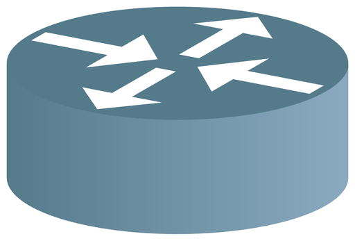
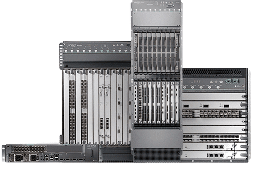
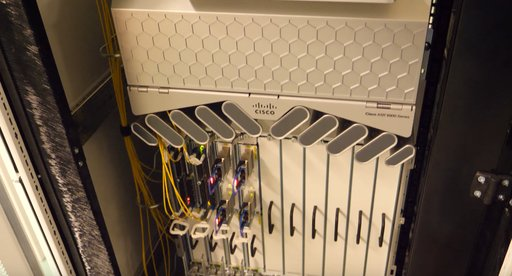

# Router

**Router** ( oder ) oder **Netzwerkrouter** sind Netzwerkgeräte, die Netzwerkpakete zwischen mehreren Rechnernetzen weiterleiten können. Sie werden am häufigsten zur Internetanbindung, zur sicheren Kopplung mehrerer Standorte (Virtual Private Network) oder zur direkten Kopplung mehrerer lokaler Netzwerksegmente, gegebenenfalls mit Anpassung an unterschiedliche Netzwerktechniken (Ethernet, DSL, PPPoE, ISDN, ATM etc.) eingesetzt.

Router treffen ihre *Weiterleitungsentscheidung* anhand von Informationen aus der Netzwerk-Schicht 3 (für das Internet-Protokoll ist das der Netzwerkanteil in der IP-Adresse). Viele Router übersetzen zudem zwischen privaten und öffentlichen IP-Adressen (Network Address Translation (NAT) bzw. Port Address Translation (PAT)) oder bilden Firewall-Funktionen durch ein Regelwerk ab.

Die für die Kopplung von Heimnetzwerken ans Internet ausgelegten Router nennt man auch **Internetrouter**.

## Funktionsweise

Router arbeiten auf Schicht 3 (Vermittlungsschicht/Network Layer) des OSI-Referenzmodells. Ein Router besitzt mindestens eine *Schnittstelle* (englisch Interface), die Netze anbindet. Schnittstellen können auch virtuell sein, wenn diese z. B. zum Vermitteln von Daten zwischen virtuellen Netzen (VLAN) verwendet werden. Beim Eintreffen von Datenpaketen muss ein Router anhand der OSI-Schicht-3-Zieladresse (z. B. dem Netzanteil der IP-Adresse) den besten Weg zum Ziel und damit die passende Schnittstelle bestimmen, über welche die Daten weiterzuleiten sind. Dazu bedient er sich einer lokal vorhandenen Routingtabelle, die angibt, über welchen Anschluss des Routers oder welchen lokalen oder entfernten Router welches Netz erreichbar ist.

Router können Wege auf drei verschiedene Arten lernen und mit diesem Wissen die Routingtabelleneinträge erzeugen.

- direkt mit der Schnittstelle verbundene Netze: Sie werden automatisch in eine Routingtabelle übernommen, wenn ein Interface mit einer IP-Adresse konfiguriert wird und dieses Interface aktiv ist ("link up").
- statische Routen: Diese Wege werden durch einen Administrator eingetragen. Sie dienen zum einen der Sicherheit, sind andererseits nur verwaltbar, wenn ihre Zahl begrenzt ist. Die Skalierbarkeit ist für diese Methode ein limitierender Faktor.
- dynamische Routen: In diesem Fall lernen Router erreichbare Netze durch ein Routingprotokoll, das Informationen über das Netzwerk und seine Teilnehmer sammelt und an die Mitglieder verteilt.

Die Routingtabelle ist in ihrer Funktion einem Adressbuch vergleichbar, in dem nachgeschlagen wird, ob ein Ziel-IP-Netz bekannt ist, also ob ein Weg zu diesem Netz existiert und, wenn ja, welche lokale Schnittstelle der Router zur Vermittlung der Daten zu diesem verwenden soll. Die Routing-Entscheidung erfolgt üblicherweise nach der Signifikanz der Einträge; spezifischere Einträge werden vor weniger spezifischen gewählt. Eine vorhandene Default-Route stellt dabei die am wenigsten spezifische Route dar, welche dann genutzt wird, wenn zuvor kein spezifischer Eintrag für das Ziel(-Netz) existiert. Bei einem Bezug der gesamten Internet-Routing-Tabelle im Rahmen des Inter-AS-Routing ist es üblich, keine Default-Route vorzuhalten.

Einige Router beherrschen Policy-basiertes Routing (für strategiebasiertes Routing). Dabei wird die Routingentscheidung nicht notwendigerweise auf Basis der Zieladresse (OSI-Layer 3) getroffen, sondern es können auch andere Kriterien des Datenpaketes berücksichtigt werden. Hierzu zählen beispielsweise die Quell-IP-Adresse, Qualitätsanforderungen oder Parameter aus höheren Schichten wie TCP oder UDP. So können zum Beispiel Pakete, die HTTP-Inhalte (Web) transportieren, einen anderen Weg nehmen als Pakete mit SMTP-Inhalten (Mail).

Router können nur für Routing geeignete Datenpakete, also von routingfähigen Protokollen, wie IP (IPv4 oder IPv6) oder IPX/SPX, verarbeiten. Andere Protokolle, wie die ursprünglich von MS-DOS und MS-Windows benutzten NetBIOS und NetBEUI, die nur für kleine Netze gedacht waren und von ihrem Design her nicht routingfähig sind, werden von einem Router standardmäßig nicht weitergeleitet. Es besteht jedoch die Möglichkeit, solche Daten über Tunnel und entsprechende Funktionen, wie Datalink Switching (DLSw), an entfernte Router zu vermitteln und dort dem Ziel zuzustellen. Pakete aus diesen Protokollfamilien werden in aller Regel durch Systeme, die auf Schicht 2 arbeiten, also Bridges oder Switches, verarbeitet. Professionelle Router können bei Bedarf diese Bridge-Funktionen wahrnehmen und werden Layer-3-Switch genannt. Als Schicht-3-System enden am Router alle Schicht-2-Funktionen, darunter die Broadcastdomäne. Das ist insbesondere in großen lokalen Netzen wichtig, um das Broadcast-Aufkommen für die einzelnen Teilnehmer eines Subnetzes gering zu halten. Sollen allerdings Broadcast-basierte Dienste, wie beispielsweise DHCP, über den Router hinweg funktionieren, muss der Router Funktionen bereitstellen, die diese Broadcasts empfangen, auswerten und gezielt einem anderen System zur Verarbeitung zuführen können (Relay-Agent-Funktion).

Außerdem sind Ein- und Mehrprotokoll-Router (auch Multiprotokoll-Router) zu unterscheiden. Einprotokoll-Router sind nur für ein Netzwerkprotokoll wie IPv4 geeignet und können daher nur in homogenen Umgebungen eingesetzt werden. Multiprotokoll-Router beherrschen den gleichzeitigen Umgang mit mehreren Protokollfamilien, wie DECnet, IPX/SPX, SNA, IP und anderen. Heute dominieren IP-Router das Feld, da praktisch alle anderen Netzwerkprotokolle nur noch eine untergeordnete Bedeutung haben und, falls sie zum Einsatz kommen, oft auch gekapselt werden können (NetBIOS over TCP/IP, IP-encapsulated IPX). Früher hatten Mehrprotokoll-Router in größeren Umgebungen eine wesentliche Bedeutung, damals verwendeten viele Hersteller unterschiedliche Protokollfamilien, daher kam es unbedingt darauf an, dass vom Router mehrere Protokoll-Stacks unterstützt wurden. Multiprotokoll-Router finden sich fast ausschließlich in Weitverkehrs- oder ATM-Netzen.

Wichtig ist die Unterscheidung zwischen den *gerouteten Protokollen* (wie Internet Protocol oder IPX) und *Routing-Protokollen*. Routing-Protokolle dienen der Verwaltung des Routing-Vorgangs und der Kommunikation zwischen den Routern, die so ihre Routing-Tabellen austauschen (beispielsweise BGP, RIP oder OSPF). Geroutete Protokolle hingegen sind die Protokolle, die den Datenpaketen, die der Router transportiert, zugrunde liegen.

## Typen (Bauformen)

### Backbone-Router, Hardware-Router

Die Hochgeschwindigkeitsrouter (auch Carrier-Class-Router) im Internet (oder bei großen Unternehmen) sind heute hochgradig auf das Weiterleiten von Paketen optimierte Geräte, die viele Terabit Datendurchsatz pro Sekunde in Hardware routen können. Die benötigte Rechenleistung wird zu einem beträchtlichen Teil durch spezielle Netzwerkinterfaces dezentral erbracht, ein zentraler Prozessor (falls überhaupt vorhanden) wird nicht oder nur sehr wenig belastet. Die einzelnen Ports oder Interfaces können unabhängig voneinander Daten empfangen und senden. Sie sind entweder über einen internen Hochgeschwindigkeitsbus (Backplane) oder kreuzweise miteinander verbunden (Matrix). Meist sind solche Geräte für den Dauerbetrieb ausgelegt (Verfügbarkeit von 99,999 % oder höher) und besitzen redundante Hardware (Netzteile), um Ausfälle zu vermeiden. Üblich ist es auch, alle Teilkomponenten im laufenden Betrieb austauschen oder erweitern zu können (hot plug). In den frühen Tagen der Rechnervernetzung war es dagegen üblich, handelsübliche Workstations als Router zu benutzen, bei denen das Routing per Software implementiert war.

### Border-Router

Ein *Border-Router* oder *Edge-Router* kommt meistens bei Internetdienstanbietern (Internet Service Provider) zum Einsatz. Er muss die Netze des Teilnehmers, der ihn betreibt, mit anderen Peers (Partner-Routern) verbinden. Auf diesen Routern läuft überwiegend das Routing-Protokoll BGP.

Zur Kommunikation zwischen den Peers kommt meist das Protokoll EBGP (External Border Gateway Protocol) zum Einsatz. Dieses ermöglicht dem Router den Datentransfer in ein benachbartes autonomes System.

Um den eigenen Netzwerkverkehr zu priorisieren, setzen die Betreiber oft Type of Service Routing und Methoden zur Überwachung der Quality of Service (QoS) ein.

### High-End-Switches

Bei manchen Herstellern (beispielsweise bei Hewlett-Packard) finden sich die Hochgeschwindigkeitsrouter (auch Carrier-Class-Router, Backbone-Router oder Hardware-Router) nicht unter einer eigenen Rubrik *Router*. Router werden dort gemeinsam mit den besser ausgestatteten Switches (Layer-3-Switch und höher, Enterprise Class) vermarktet. Das ist insoweit logisch, als Switches ab dem gehobenen Mittelklasse-Bereich praktisch immer die Routingfunktionalität beherrschen. Technisch sind das Systeme, die, ebenso wie die als Router bezeichneten Geräte, hochgradig auf das Weiterleiten von Paketen (Router: anhand der OSI-Schicht-3-Adresse wie die IP-Adresse, Switch: anhand der OSI-Schicht-2-Adresse, der MAC-Adresse) optimiert sind und viele Gigabit Datendurchsatz pro Sekunde bieten. Sie werden per Managementinterface konfiguriert und können wahlweise als Router, Switch und natürlich im Mischbetrieb arbeiten. In diesem Bereich verschwimmen auch finanziell die Grenzen zwischen beiden Geräteklassen mehr und mehr.

### Software-Router

Anstatt spezieller Routing-Hardware können gewöhnliche PCs, Laptops, Nettops, Unix-Workstations und -Server als Router eingesetzt werden. Die Funktionalität wird vom Betriebssystem übernommen und sämtliche Rechenoperation von der CPU ausgeführt. Alle POSIX-konformen Betriebssysteme beherrschen Routing von Haus aus und selbst MS-DOS konnte mit der Software KA9Q von Phil Karn mit Routing-Funktionalität erweitert werden.

Windows bietet in allen NT-basierten Workstation- und Server-Varianten (NT 3.1 bis Windows 10 / Server 2019) ebenfalls Routing-Dienste. Die Serverversion von Apples Mac OS X enthält Router-Funktionalität.

Das freie Betriebssystem OpenBSD (eine UNIX-Variante) bietet neben den eingebauten, grundlegenden Routingfunktionen mehrere erweiterte Routingdienste, wie OpenBGPD und OpenOSPFD, die in kommerziellen Produkten zu finden sind. Der Linux-Kernel enthält umfassende Routing-Funktionalität und bietet sehr viele Konfigurationsmöglichkeiten, kommerzielle Produkte sind nichts anderes als Linux mit proprietären Eigenentwicklungen. Es gibt ganze Linux-Distributionen, die sich speziell für den Einsatz als Router eignen, beispielsweise Smoothwall, IPFire, IPCop oder Fli4l. Einen Spezialfall stellt OpenWrt dar, diese erlaubt es dem Benutzer eine Firmware zu erstellen, die auf einem embedded Gerät läuft und sich über SSH und HTTP konfigurieren lässt.

Der entscheidende Nachteil von Software-Routern auf PC-Basis ist der hohe Stromverbrauch. Gerade im SoHo-Bereich liegen die Stromkosten innerhalb eines Jahres höher als der Preis für ein eingebettetes Gerät.

### Virtuelle Router

Ein virtueller Router, kurz vRouter, übernimmt die Funktionalität eines Routers in einem virtuellen Format, anstatt ein dediziertes Hardwaregerät zu nutzen. Er wird insbesondere in Netzwerken mit virtuellen Maschinen genutzt und verbindet zwei oder mehr virtuelle Netzwerke oder das virtuelle mit dem physischen Netzwerk. Außerdem können mehrere zusammengeschlossene Router zur Redundanz eine virtuelle Routerinstanz abbilden, z. B. mit VRRP oder HSRP.

### DSL-Router

Ein Router, der einen PPPoE-Client zur Einwahl in das Internet via xDSL eines ISPs beinhaltet und gegenwärtig Network Address Translation (NAT) in IPv4-Netzen zur Umsetzung einer öffentlichen IPv4-Adresse auf die verschiedenen privaten IPv4-Adressen des LANs beherrscht, wird als *DSL-Router* bezeichnet. Häufig sind diese DSL-Router als Multifunktionsgeräte mit einem Switch, einem WLAN Access Point, nicht selten mit einer kleinen TK-Anlage, einem VoIP-Gateway oder einem DSL-Modem (xDSL jeglicher Bauart) ausgestattet.

2025 stellte die Deutsche Telekom den *NeoCircuit* genannten Prototyp eines DSL-Routers vor, der sich unter anderem aus der Hauptplatine eines Fairphone 2 zusammensetzt. Durch einen Anteil von 70 Prozent wiederverwendeter Komponenten solle CO2-Bilanz geringer ausfallen als vergleichbare Routermodelle.

### Firewall-Funktionalität in DSL-Routern

Fast alle DSL-Router sind heute NAT-fähig, mithin in der Lage Netzadressen zu übersetzen. Weil ein Verbindungsaufbau aus dem Internet auf das Netz hinter dem NAT-Router nicht ohne weiteres möglich ist, wird diese Funktionalität von manchen Herstellern bereits als NAT-Firewall bezeichnet, obwohl nicht das Schutzniveau eines Paketfilters erreicht wird. Die Sperre lässt sich durch die Konfiguration eines Port Forwarding umgehen, was für manche Virtual Private Network- oder Peer-to-Peer-Verbindungen notwendig ist. Zusätzlich verfügen die meisten DSL-Router für die Privatnutzung über einen rudimentären Paketfilter, teilweise auch stateful. Diese Paketfilter kommen bei IPv6 zum Einsatz. Wegen des Wegfalls von NAT wird Port Forwarding wieder zu einer einfachen Freigabe des Ports. Als Betriebssystem kommt auf vielen Routern dieser (Konsumer-)Klasse Linux und als Paketfilter meist iptables zum Einsatz. Einen Content-Filter enthalten solche Produkte zumeist nicht. Eine wohl sichere Alternative sind freie Paketfilter-Distributionen auf Basis wohl sichererer Betriebssysteme, zum Beispiel OPNsense.

### Schutzmaßnahmen bei DSL- und WLAN-Routern

Bei entdeckten Programmierfehlern kann ein Router-Hersteller ein neues Software-Update bereitstellen, um nachzubessern bzw. Sicherheitslücken zu schließen. Wird der Router dann nicht auf den neuesten Stand gebracht, gefährdet man die eigene Netzwerksicherheit zusätzlich. Daher ist es auch zum Schutz der persönlichen Daten unerlässlich, dass in regelmäßigen Abständen ein Software-Update durchgeführt wird.

Weitere Maßnahmen, um Router zu schützen:

- nur aktuelle WLAN-Verschlüsselungen (WPA3 oder WPA2) verwenden
- vom Hersteller vorgegebene Passwörter ändern, nur sichere Passwörter wählen
- die SSID umbenennen
- Deaktivieren von WPS und der Fernadministration
- Deaktivieren von UPnP-Funktionen, die beliebiger Software das Öffnen von Netzwerkports ermöglicht
- Absichern von Diensten, die per Portweiterleitung aus dem Internet erreicht werden können
- eine leistungsfähige (*dedizierte*) stateful-Firewall wie pfSense oder OPNsense (letztere mit ASLR und LibreSSL) mit einem reinen DSL-Modem

### WLAN-Router

Die Kombination aus Wireless Access Point, Switch und Router wird häufig als *WLAN-Router* bezeichnet. Das ist solange korrekt, wie es Ports für den Anschluss mindestens eines zweiten Netzes, meist einen WAN-Port, gibt. Das Routing findet zwischen den mindestens zwei Netzen, meist dem WLAN und WAN statt (und falls vorhanden zwischen LAN und WAN). Fehlt dieser WAN-Port, handelt es sich lediglich um Marketing-Begriffe, da reine Access Points auf OSI-Ebene 2 arbeiten und somit Bridges und keine Router sind. Häufig sind WLAN-Router keine vollwertigen Router, da sie oft die gleichen Einschränkungen wie DSL-Router (PPPoE, NAT) haben. Bei IPv6 entfällt bei diesen Geräten NAT. Falls noch zusätzlich Tunnelprotokolle wie 6to4 verwendet werden, müssen sie auch beherrscht werden.

### Router in der Automatisierung

Mit der Durchdringung von Netzwerktechnik in der industriellen Automatisierung werden verstärkt Modem-Router mit externem Zugang über Telefon- und Mobilfunkverbindungen eingesetzt. Industriegeräte sind Software-Router auf Basis von embedded Linux, die nicht auf hohen Durchsatz, sondern auf mechanische Robustheit, Befestigung im Schaltschrank und Langlebigkeit optimiert sind.

### Software- oder Hardware-Router

Generell leisten Software-Router überwiegend im nicht professionellen Umfeld wertvolle und umfangreiche Dienste. Allgemein gibt es für Software-Router zwei unterschiedliche Implementierungsarten, zum einen dedizierte Router, dabei wird ein PC, eine Workstation oder ein Server so gut wie ausschließlich als Router eingesetzt (häufig als DHCP-, DNS-Server oder Firewall); zum anderen nicht dedizierte Router, hier übernimmt ein Server zusätzlich zu seinen bestehenden Aufgaben noch das Routing. Beide Systeme sind für den performance-unkritischen Bereich gut geeignet und können mit professionellen Lösungen, vor allem was die Kosten angeht, konkurrieren, in der Leistungsfähigkeit sind sie meist unterlegen.

Das liegt unter anderem daran, dass solche Systeme bislang häufig noch auf einem klassischen PCI-Bus mit 32-Bit-Busbreite und 33-MHz-Taktung (PCI/32/33) beruhten. Über einen solchen Bus lassen sich theoretisch 1 GBit/s (1000 MBit/s, entspricht etwa 133 MByte/s) im Halb-Duplex-Modus (HDX) leiten; da die Netzwerkpakete den PCI-Bus in diesem Fall zweimal passieren, (Karte–PCI–Arbeitsspeicher–CPU–Arbeitsspeicher–PCI–Karte) reduziert sich der maximal routbare Datenstrom eines darauf basierenden Software-Routers auf etwa 0,5 GBit/s. Ethernet wird heute fast immer geswitcht und im Voll-Duplex-Modus FDX betrieben, damit kann beispielsweise Gigabit-Ethernet, obwohl es Namen wie *1 GBit/s Ethernet*, *1GbE* oder *1000BASE-T* anders vermuten lassen, bereits 2 GBit/s (je 1GbE in jede Richtung) übertragen. Daraus folgt, dass ein System auf PCI/32/33-Basis die netzwerkseitig theoretisch mögliche maximale Übertragungsrate von 2 GBit/s keinesfalls erreichen kann. Systeme mit einem PCI/64/66-Bus können busseitig etwa 4 GBit/s leisten, gerade ausreichend für die Spitzenlast zweier 1GbE-Schnittstellen im FDX-Modus. Noch höherwertige klassische (legacy) Server-Systeme verfügen über schnellere Schnittstellen (PCI-X 266 oder besser), sowie über mehrere unabhängige PCI-Busse. Sie können ohne Probleme höhere Durchsatzraten erzielen, aber haben typischerweise einen hohen Energieverbrauch. Weshalb besonders im dedizierten Routerbetrieb, die Kosten-Nutzen-Frage steht. Hardware-Router mit spezialisierten CPUs und anwendungsspezifisch arbeitenden Chipsätzen (anwendungsspezifische integrierte Schaltung kurz ASIC) schaffen das weitaus energieeffizienter.

Erst durch die Einführung von PCI Express (mit 2 GBit/s bei Version 1.x und 4 GBit/s pro Lane bei Version 2.x im FDX-Modus – und mehr) steht auch bei Standard-PCs eine ausreichende Peripherie-Transferleistung für mehrere 1GbE-Verbindungen (auch 10GbE) zur Verfügung, so dass sich energieeffiziente, durchsatzstarke Software-Router aus preiswerter Standardhardware bauen lassen. Da bislang alle Werte theoretischer Art sind und in der Praxis nicht nur Daten durch den Bus geleitet werden, sondern Routing-Entscheidungen getroffen werden müssen, wird ein Software-Router möglicherweise weiter an Leistung einbüßen. Vorsichtigerweise sollte in der Praxis nur von der Hälfte des theoretisch möglichen Datendurchsatzes ausgegangen werden. Bei solchen Datenraten ist mit einem Software-Router zumindest das Kosten-Leistung-Verhältnis gut und ausreichend.

Hardware-Router aus dem High-End-Bereich sind, da sie über spezielle Hochleistungsbusse oder „cross bars“ verfügen können, in der Leistung deutlich überlegen – was sich auch im Preis widerspiegelt. Zusätzlich sind diese Systeme für den ausfallsicheren Dauerbetrieb ausgelegt (Verfügbarkeit von 99,999 % und höher). Einfache PCs können da nicht mithalten, hochwertige Server und Workstations verfügen ebenfalls über redundante Komponenten und eine für viele Anwendungsfälle ausreichend hohe Ausfallsicherheit.

Manche so genannte Hardware-Router bestehen tatsächlich aus PC-Komponenten. Lediglich das Gehäuse oder die zum Teil mechanisch veränderten PCI-Steckplätze und das „kryptische“ Betriebssystem erwecken den Anschein, es handle sich um Spezialsysteme. Zwar arbeiten diese Systeme meist sehr robust und zuverlässig, dennoch wird das Routing per Software durchgeführt.

#### Routing-Cluster

Um beispielsweise 1GbE- oder 10GbE-Netze performant routen zu können, wird nicht unbedingt ein hochpreisiger Hardware-Router benötigt. Geringe Einbußen bei der Übertragungs-Geschwindigkeit vorausgesetzt, lassen sich *Routing-Cluster* einsetzen. Dieser kann aus je einem Software-Router (etwa als Workstation mit zwei PCI Express 10GbE-LAN-Karten) pro Ethernet-Strang aufgebaut sein. Die Software-Router werden über einen professionellen Switch mit genügend vielen Ports und entsprechend hoher Durchsatzrate (einige Hundert GBit/s) miteinander verbunden. Im Unterschied zu Netzen mit zentralem Backbone entspricht die maximale Datendurchsatzrate des gesamten *Routing-Clusters* der maximalen Durchsatzrate des zentralen Switches (einige Hundert GBit/s). Optional können die Cluster redundant (per High-Availability-Unix oder HA-Linux) ausgelegt sein. Solche Cluster-Systeme benötigen zwar relativ viel Platz und erreichen nicht die Leistung und Zuverlässigkeit von Hochgeschwindigkeitsroutern, dafür sind sie höchst modular, gut skalierbar, vergleichsweise performant und dennoch kostengünstig. Sie werden eingesetzt, wo Kosten höher als Leistung bewertet werden, beispielsweise in Schulen oder Universitäten.

## Aussprache

Der Begriff *Router* ist von gleichbedeutend englisch *router* entlehnt, und dies kommt von *to route* (+ *er*)  (AE auch ) für „leiten, lotsen, steuern“.

Im britischen Englisch überwiegt heutzutage die Aussprache . In den USA ist daneben auch  zu hören. Im deutschsprachigen Raum wird das Gerät meist  ausgesprochen.
