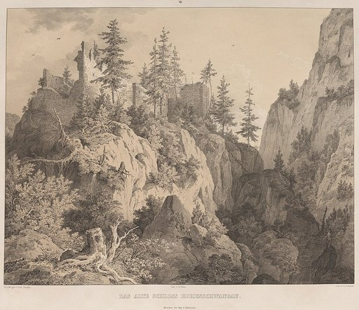
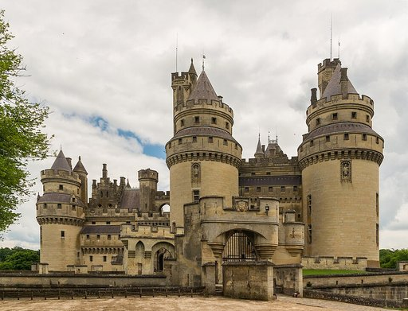
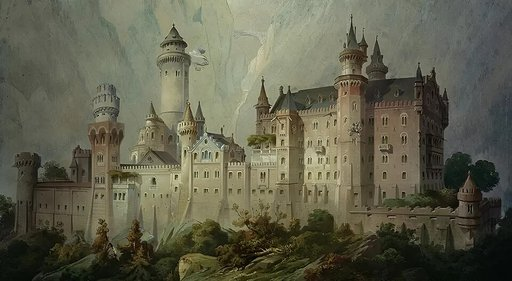

# Schloss Neuschwanstein

**Schloss Neuschwanstein** ist ein Baudenkmal in der bayerischen Gemeinde Schwangau. Die Dreiflügelanlage wurde in den Jahren 1869 bis 1892 im Auftrag des Königs Ludwig II. von Bayern nach Plänen von Eduard Riedel im Stil der Neuromanik erbaut. Als architektonisches Vorbild dienten mittelalterliche Ritterburgen. Hervorzuheben sind der *Thronsaal*, das *Schlafzimmer* und der *Sängersaal*. Mit über einer Million Besuchern zählte es 2024 zu den meistbesuchten und berühmtesten Sehenswürdigkeiten Deutschlands.

## Geschichte

### Vorgeschichte

Erstmals urkundlich erwähnt wurde ein „Castrum Swangowe“ im Jahr 1090. Damit gemeint waren die im Mittelalter an der Stelle des heutigen Schlosses Neuschwanstein stehenden zwei kleinen Burgen: die aus einem Palas und einem Bergfried bestehende Burg Vorderhohenschwangau, an der Stelle des heutigen Palas, und, nur durch einen Halsgraben getrennt, ein befestigter Wohnturm namens Hinterhohenschwangau, der sich dort befand, wo zwischen dem heutigen Ritterhaus und der Kemenate auch Ludwig II. einen hohen Bergfried geplant hatte, zu dessen Errichtung es aber nicht mehr kam. Beide Gebäude gingen auf die Herren von Schwangau zurück, die in der Region als Lehensnehmer der Welfen (bis 1191) und der Staufer (bis 1268), danach als reichsunmittelbare Ritter ansässig waren bis zu ihrem Aussterben im Jahre 1536. Der Minnesänger Hiltbolt von Schwangau stammte aus diesem Geschlecht. Hinterhohenschwangau war wahrscheinlich der Geburtsort von Margareta von Schwangau, der Ehefrau des Minnesängers Oswald von Wolkenstein. Als 1363 Herzog Rudolf IV. von Österreich Tirol unter habsburgische Herrschaft brachte, verpflichteten sich Stephan von Schwangau und seine Brüder, ihre Festen Vorder- und Hinterschwangau, die Burg Frauenstein und den Sinwellenturm dem österreichischen Herzog offenzuhalten. Eine Urkunde von 1397 nennt zum ersten Mal den „Schwanstein“, das heutige Schloss Hohenschwangau, das um diese Zeit unterhalb der älteren Doppelburg auf einer Anhöhe zwischen Alpsee und Schwansee errichtet worden war. Ab dem 16. Jahrhundert befand sich die reichsunmittelbare Herrschaft Schwangau unter der Oberhoheit der Wittelsbacher, welche die Burg Schwanstein zur Bärenjagd sowie als Sitz für jüngere Söhne und später für ein Pfleggericht nutzten. Sie hatten den gesamten Besitz 1567 aus dem Nachlass der bankrotten Augsburger Patrizierfamilie Baumgartner erworben.

Im 19. Jahrhundert waren die beiden oberen Burgen zu Ruinen verfallen, die Überreste Hinterhohenschwangaus zu einem „Sylphenturm“ genannten Aussichtsplatz umgestaltet. Ludwig II. verbrachte einen Teil seiner Kindheit in der Nähe der Burgruinen auf dem benachbarten Schloss Hohenschwangau, das sein Vater König Maximilian II. um 1837 von einer spätmittelalterlichen Burg zu einem wohnlichen Schloss im Sinne der Romantik hatte umgestalten lassen. Hohenschwangau war ursprünglich als Schloss Schwanstein bekannt, seine neue Bezeichnung erhielt es erst während des Wiederaufbaus. Damit wurden die Namen der Burg Schwanstein und der älteren Doppelburg Vorder- und Hinterhohenschwangau vertauscht. Maximilian II. hatte 1855 Baurat Eduard Riedel beauftragt, für den Turm von Hinterhohenschwangau zunächst einen Aussichtspavillon in Glas-Eisen-Konstruktion zu entwerfen, im Jahr darauf einen Plan für die Reparatur des Turms und die Herstellung eines Zimmers mit einem Zeltdach darüber. Beides wurde zurückgestellt.

Die oberhalb des Wohnschlosses gelegenen Ruine waren dem Kronprinzen – wie auch der Frauenstein und der Falkenstein – häufiges Wanderziel und deshalb gut bekannt. 1859 zeichnete er die Überreste der Vorderhohenschwangauer Burg erstmals in sein *Tagebuch*. 1837 pries ein anonymer Verfasser das wiederaufgebaute Schloss Hohenschwangau als „die Wiege einer neuen Romantik“ und schwärmte von dem Gedanken, dass „auch die Ruinen von dem vorderen Schlosse Schwangau (gemeint war die Doppelburg Vorder- und Hinterhohenschwangau), die mit Falkenstein und Hohen-Freyberg ein langgezogenes Dreieck bilden, zu einem großen einfachen Fest- und Sängersaal wiederaufgerichtet werden …“. Damit war die Idee eines Wiederaufbaus der Ruinen im Sinne einer Wiedergeburt des Austragungsortes des Sängerkriegs auf der Wartburg geboren; 20 Jahre bevor die thüringische Wartburg durch Hugo von Ritgen wiederaufgebaut wurde und 30 Jahre bevor Ludwig II. die Idee in die Tat umsetzte, indem er auf dem „Jugend“ genannten Burgfelsen von Vorder- und Hinterhohenschwangau ein neues „Sängerschloss“ nach dem Vorbild der Wartburg errichten ließ.

### Entwurf

Nach der Regierungsübernahme durch den jungen König 1864 war der Wiederaufbau der Burgruine Vorderhohenschwangau – des späteren Schlosses Neuschwanstein – das erste größere Schlossbauprojekt Ludwigs II. Er plante damit nichts Außergewöhnliches: In ganz Europa bauten sich zur gleichen Zeit gekrönte Häupter und Adelsfamilien Schlösser und Burgen in historischen Stilen oder ließen bedeutende mittelalterliche Monumente rekonstruieren. Kurz nach dem väterlichen Hohenschwangau hatte Ludwigs Onkel, der vom Mittelalter begeisterte König Friedrich Wilhelm IV. von Preußen, im Zuge der zeitgenössischen Burgenrenaissance das Schloss Stolzenfels und von 1850 bis 1867 die Burg Hohenzollern wiedererrichten lassen. Der hannoversche König hatte von 1858 bis 1869 das Schloss Marienburg gebaut. Die britische Königin Victoria ließ ab 1845 Osborne House und kurz darauf Balmoral Castle umbauen, nachdem ihr Onkel Georg IV. schon zwischen 1820 und 1830 Windsor Castle bedeutend erweitert hatte. Ein weiteres Beispiel aus Europa war ab 1840 der Bau des Palácio Nacional da Pena durch den portugiesischen König Ferdinand II. Zur gleichen Zeit ließen die Fürsten zu Schwarzenberg das böhmische Schloss Frauenberg errichten und die Fürsten von Urach das Schloss Lichtenstein bauen. Auch die umfangreiche Restaurierung der Hohkönigsburg im Elsass durch den deutschen Kaiser, die allerdings erst im frühen 20. Jahrhundert stattfand, gehört dazu.

Dem als Sinnbild einer Ritterburg gedachten Neuschwanstein folgten mit Linderhof noch ein Lustschloss aus der Epoche des Rokoko und mit Schloss Herrenchiemsee ein barocker Palast, der als Denkmal für die Zeit des Absolutismus stand. Angeregt zum Bau Neuschwansteins wurde Ludwig II. durch zwei Reisen: Im Mai 1867 besuchte er mit seinem Bruder Otto die wieder aufgebaute Wartburg bei Eisenach, im Juli desselben Jahres besichtigte er in Frankreich Schloss Pierrefonds, das damals von Eugène Viollet-le-Duc für Kaiser Napoleon III. von einer Burgruine zu einem historistischen Schloss umgestaltet wurde. Im Verständnis des Königs entsprachen beide Bauten einer romantischen Darstellung des Mittelalters, ebenso wie die musikalischen Sagenwelten Richard Wagners. Dessen Werke *Tannhäuser* und *Lohengrin* hatten den König nachhaltig beeindruckt. Am 15. Mai 1868 teilte er dem befreundeten Komponisten in einem Brief mit: „Ich habe die Absicht, die alte Burgruine Hohenschwangau bei der Pöllatschlucht neu aufbauen zu lassen, im echten Styl der alten deutschen Ritterburgen.“

Durch den Tod seines 1848 abgedankten Großvaters Ludwig I. konnte der junge König ab 1868 dessen Apanage einbehalten, wodurch ihm umfangreiche finanzielle Mittel zur Verfügung standen. Der König wollte mit dem entstehenden Bauprojekt in der ihm aus Kindertagen vertrauten Landschaft ein privates Refugium abseits der Hauptstadt München schaffen, in dem er seine Vorstellung des Mittelalters erleben konnte, zumal das von ihm gern genutzte Schloss Hohenschwangau jeweils während der Sommermonate von seiner ungeliebten Mutter, der Königin Marie, besetzt war. Die Entwürfe für das neue Schloss lieferte der Münchner Theatermaler Christian Jank, umgesetzt wurden sie durch den Architekten Eduard Riedel. Überlegungen, die Burgruinen in den Bau zu integrieren, wurden wegen der damit verbundenen technischen Schwierigkeiten nicht weiter verfolgt. Erste Pläne für das Schloss, die sich stilistisch an der Nürnberger Burg orientierten und einen schlichten Neubau anstelle der alten Burg Vorderhohenschwangau vorsahen, wurden wieder verworfen und von zunehmend umfangreicheren Entwürfen ersetzt, die zu einem größeren Schloss nach dem Vorbild der Wartburg bei Eisenach führten. Der König bestand auf einer detaillierten Planung und ließ sich jeden Entwurf zur Genehmigung vorlegen. Sein Einfluss auf die Entwürfe reichte so weit, dass das Schloss vor allem als seine eigene Schöpfung und weniger als die seiner beteiligten Architekten gelten kann.

### Bau

Die Ruinen der Burg Vorderhohenschwangau und der Sylphenturm wurden 1868 komplett abgebrochen, die Reste des alten Bergfrieds gesprengt. In einem weiteren Brief an Wagner kündigte Ludwig an: „…in jeder Hinsicht schöner und wohnlicher wird diese Burg werden als das untere Hohenschwangau….“ Die Bauarbeiten am Torhaus begannen im Februar 1869, die Grundsteinlegung für den Palas erfolgte am 5. September 1869. 1869 bis 1873 wurde der Torbau errichtet und vollständig eingerichtet, so dass Ludwig hier zeitweilig wohnen und die Bauarbeiten beobachten konnte. 1874 übernahm Georg von Dollmann die Leitung der Baumaßnahmen von Eduard Riedel. Im Jahr 1880 war Richtfest für den Palas, der 1884 bezogen werden konnte, im selben Jahr ging die Bauleitung an Julius Hofmann über, der den in Ungnade gefallenen Dollmann ablöste. Die Wünsche und Ansprüche Ludwigs II. wuchsen mit dem Bau ebenso wie die Ausgaben, und die Entwürfe und Kostenvoranschläge mussten mehrfach überarbeitet werden. So war anstelle des großen Thronsaales ursprünglich nur ein bescheidenes Arbeitszimmer geplant, und vorgesehene Gästezimmer wurden aus den Entwürfen wieder gestrichen, um Platz für einen Maurischen Saal zu schaffen, der aufgrund der ständigen Geldknappheit nicht realisiert werden konnte. Die für 1872 vorgesehene Fertigstellung des Schlosses verzögerte sich wiederholt. Ursprünglich wurde Neuschwanstein als *Neue Burg Hohenschwangau* bezeichnet, seinen heutigen Namen trägt es seit 1886.

Das Schloss wurde in konventioneller Backsteinbauweise errichtet und mit anderen Gesteinsarten verkleidet. Der weiße Kalkstein der Fassadenflächen stammt aus dem nahe gelegenen Steinbruch *Alter Schrofen*. Die Sandsteinquader für die Portale und Erker stammen aus Schlaitdorf am Schönbuchrand in Württemberg. Für die Fenster, die Gewölbebogenrippen, Säulen und Kapitelle wurde Untersberger Marmor aus der Gegend von Salzburg verwendet. Für den nachträglich in die Pläne eingearbeiteten Thronsaal musste ein Stahlgerüst eingezogen werden. Um den Transport der Baumaterialien zu erleichtern, wurden ein Gerüst errichtet und ein Dampfkran aufgestellt, der das Material zur Baustelle heraufzog. Ein weiterer Kran sorgte für Erleichterung auf der Baustelle selbst. Der damals neu gegründete Dampfkessel-Revisionsverein, der spätere Technische Überwachungsverein TÜV, überprüfte regelmäßig die Kessel der beiden Kräne auf ihre Sicherheit.

Die Großbaustelle war etwa zwei Jahrzehnte lang der größte Arbeitgeber der Region. 1880 arbeiteten täglich rund 200 Handwerker auf der Baustelle, nicht berücksichtigt Lieferanten und andere indirekt am Bau beteiligte Personen. Zu Zeiten, als der König besonders enge Termine und dringende Änderungen forderte, sollen es bis zu 300 Arbeiter pro Tag gewesen sein, die auch in der Nacht beim Schein von Öllampen ihren Dienst taten. Statistiken aus den beiden Jahren 1879/1880 belegen eine immense Menge an Baumaterialien: 465 Tonnen Salzburger Marmor, 1550 Tonnen Sandstein, 400.000 Ziegelsteine und 2050 Kubikmeter Holz für das Baugerüst. Sehr modern war die am 3. April 1870 gegründete soziale Einrichtung „Verein der Handwerker am königlichen Schlossbau zu Hohenschwangau“. Der Zweck des Vereins war, bei geringen eigenen Monatsbeiträgen und verstärkt durch erhebliche Zuschüsse des Königs, für erkrankte oder verletzte Bauarbeiter eine Lohnfortzahlung zu garantieren. Die Baufirma bürgte, ähnlich einer heutigen Sozialversicherung oder Berufsgenossenschaft, für das Gehalt über 15 Wochen gegen einen Betrag von 0,70 Mark. Für die Nachkommen der beim Bau tödlich Verunglückten gab es eine Rente – zwar niedrig, aber zur damaligen Zeit nicht üblich. Statistiken berichten von 39 Familien, denen diese Rente zugesprochen wurde, was für damalige Bauten und deren Arbeitsbedingungen auffällig wenige sind.

### Nutzung

Als Dank für den Kaiserbrief erhielt Ludwig II. im Zuge der Reichsgründung von Otto von Bismarck erhebliche Zuwendungen aus dem Welfenfonds; seine Finanzlage wurde aber durch weitere Bauprojekte immer schlechter. Der Palas und das Torhaus Neuschwansteins waren bis 1886 im Außenbau weitgehend fertiggestellt; ab 1884 konnte der König den Palas erstmals bewohnen. Ludwig II. lebte bis zu seinem Tod 1886 insgesamt nur 172 Tage im Schloss, das bis dahin noch einer Großbaustelle glich. 1885 empfing er dort anlässlich ihres 60. Geburtstags seine auf dem unteren Hohenschwangau residierende Mutter, die vormalige Königin Marie. Neuschwanstein sollte Ludwig II. gewissermaßen als bewohnbare Theaterkulisse dienen. Es war als „Freundschaftstempel“ dem Leben und Werk Richard Wagners gewidmet, der es jedoch nie betreten hat. Trotz seiner Größe war das Schloss nicht für die Aufnahme eines Hofstaats vorgesehen; es bot lediglich der Privatwohnung des Königs und Zimmern für die Dienerschaft Raum. Die Hofgebäude dienten weniger Wohn- als vielmehr dekorativen Zwecken. So war zum Beispiel der Bau der Kemenate – die erst nach Ludwigs Tod vollendet wurde – eine direkte Reminiszenz an den zweiten Akt von Lohengrin; dort ist eine Kemenate Schauplatz einiger Szenen.

Ludwig II. bezahlte seine Bauprojekte aus Privatvermögen und dem Einkommen seiner Zivilliste. Die Staatskasse wurde (anders als oft kolportiert) für seine Bauten nicht belastet. Die Baukosten Neuschwansteins betrugen bis zum Tod des Königs 6.180.047 Mark, ursprünglich veranschlagt waren 3,2 Millionen Mark. Seine privaten Mittel reichten für die ausufernden Bauprojekte jedoch nicht mehr aus, daher musste der König oft neue Kredite aufnehmen. 1883 war er bereits mit über 7 Millionen Mark verschuldet; 1885 drohte ihm erstmals eine Pfändung. Die Streitigkeiten um die Verschuldung des Staatsoberhaupts veranlassten die bayerische Regierung 1886, den König zu entmündigen und für regierungsunfähig erklären zu lassen. Ludwig II. hielt sich zur Zeit seiner Entmündigung am 9. Juni 1886 in Neuschwanstein auf; es war das letzte seiner selbst in Auftrag gegebenen Schlösser, das er bewohnte. Ludwig ließ die wegen seiner bevorstehenden Absetzung am 10. Juni 1886 nach Neuschwanstein gereiste Regierungskommission im Torhaus festsetzen. Nach einigen Stunden wurde sie freigelassen. Am 11. Juni erschien eine zweite Kommission unter der Leitung Bernhard von Guddens. Der König musste Neuschwanstein daraufhin am 12. Juni 1886 verlassen und wurde nach Schloss Berg verbracht.

Beim Tode des Königs im Starnberger See am folgenden Tag, den 13. Juni 1886, war Neuschwanstein noch nicht fertiggestellt. Ludwig II. wollte das Schloss niemals der Öffentlichkeit zugänglich machen, aber schon sechs Wochen nach seinem Tod wurde es für Besucher geöffnet. Mit den Eintrittsgeldern in Höhe von zwei Mark pro Person wurde ein Teil der Kredite bezahlt. Die Schlösser fielen als Erbe an Ludwigs Bruder Otto, der schon 1872 für geisteskrank und damit nicht regierungsfähig erklärt worden war. Ludwigs Onkel Luitpold übernahm die Regierungsgeschäfte; die „Administration des Vermögens seiner Majestät des Königs Otto von Bayern“ war für die Nachlassverwaltung zuständig. Ihr gelang es, die Bauschulden bis 1899 abzubezahlen. Um einen reibungslosen Besichtigungsverlauf des Schlosses zu gewährleisten, wurden einige bis dahin unvollendete Räume fertiggestellt und die Kemenate sowie das Ritterhaus zumindest als Außenbau errichtet. Zunächst durften sich die Besucher frei im Schloss bewegen, was zur Folge hatte, dass das Mobiliar sehr schnell verschliss. 1886 erschien ein erster gemeinsamer Schlossführer für Herrenchiemsee, Linderhof und Neuschwanstein. Die nicht sehr umfangreiche Publikation beschrieb nur einzelne Kunstgegenstände und erwähnte die am Bau beteiligten Architekten und Künstler.

### Nachgeschichte

Nach Ausrufung der Republik am 9. November 1918 ging Luitpolds Nachfolger Ludwig III. ins Exil nach Ungarn. Die bayerische Regierung erklärte am 11. November 1918 die bayerische Zivilliste (den ehemaligen Besitz des Hauses Wittelsbach) zu Staatsbesitz. Langwierige Auseinandersetzungen zwischen Bayern und dem Haus Wittelsbach folgten. Die ehemalige Königsfamilie hatte ihr privates Vermögen zu Beginn des 19. Jahrhunderts in diese Zivilliste eingebracht und damit den fast zahlungsunfähigen bayerischen Staat vor dem Bankrott bewahrt. Im Gegenzug hatte dieser sich dazu verpflichtet, für den Unterhalt der königlichen Familie zu sorgen. Die Verhandlungen endeten im Januar 1923 mit einem Kompromiss: Die Zivilliste wurde zwischen Bayern und dem Haus Wittelsbach geteilt. Schloss Neuschwanstein kam dabei in staatlichen Besitz; aus dem familiären Teil ging der noch heute bestehende Wittelsbacher Ausgleichsfonds (WAF) hervor.

Beide Weltkriege überstand das Schloss ohne Schäden. Der Einsatzstab Reichsleiter Rosenberg, eine Unterorganisation der NSDAP, ließ bis 1944 im Schloss in Frankreich geraubte Beutekunst deponieren. Der Einsatzstab fotografierte und katalogisierte die Kunstgegenstände, darunter Teile des Genter Altars und des Abendmahlsaltars von Dirk Bouts. Nach Kriegsende wurden im Schloss 39 Fotoalben gefunden, die den Umfang des Raubes dokumentierten und die heute im Amerikanischen Nationalarchiv aufbewahrt werden. Am Ende des Zweiten Weltkrieges wurden auf dem Schloss Goldschätze der Deutschen Reichsbank gelagert; sie wurden in den letzten Kriegstagen an einen bis heute unbekannten Ort verschleppt. Dem Schloss drohte im April 1945 kurzzeitig eine Sprengung durch die SS, die verhindern wollte, dass die dort gelagerten Kunstschätze in Feindeshand übergingen. Das Vorhaben wurde vom damit beauftragten SS-Gruppenführer nicht in die Tat umgesetzt; Soldaten vom US-Kunstschutz erreichten das Schloss am 28. April 1945.

Nach dem Zweiten Weltkrieg nutzte die Bayerische Archivverwaltung einige Räume im Schloss Neuschwanstein als provisorisches Bergungslager für Archivalien, weil viele Räumlichkeiten in München ausgebombt waren.

Im Jahr 2002 stürzten in der Nähe Neuschwansteins Trümmerstücke eines Meteoriten auf die Erde, die seitdem unter dem Namen Neuschwanstein katalogisiert sind.

## Schloss

### Außenarchitektur

#### Vollendete Anlagen

Das Schloss befindet sich oberhalb des heutigen Ortsteils Hohenschwangau der Gemeinde Schwangau bei Füssen im südöstlichen bayerischen Allgäu. Die Anlage besteht aus mehreren einzelnen Baukörpern, die über eine Länge von rund 150 Metern auf dem Kamm eines früher *Jugend* genannten Felsenrückens errichtet wurden. Das langgezogene Bauwerk hat zahlreiche Türme, Ziertürmchen, Giebel, Balkone, Zinnen und Skulpturen. Die Fensteröffnungen haben in Anlehnung an den romanischen Stil meist die Form von Bi- und Triforien. Die Kombination der Einzelbauten vor dem Hintergrund des Tegelbergs und der Pöllatschlucht im Süden und der seenreichen Hügellandschaft des Voralpenlands im Norden bietet aus allen Himmelsrichtungen unterschiedliche pittoreske Ansichten des Schlosses. Es wurde als romantisches Ideal einer Ritterburg entworfen. Anders als „echte“ Burgen, deren Gebäudebestände meist das Ergebnis mehrerer Bautätigkeiten sind, wurde Neuschwanstein als gewollt asymmetrischer Bau in einem Zug geplant und in Abschnitten errichtet. Für eine Burg typische Merkmale wurden zitiert; echte Verteidigungsanlagen – das wichtigste Merkmal eines mittelalterlichen Adelssitzes – wurden nicht gebaut.

Man betritt die Schlossanlage durch das symmetrische, von zwei Treppentürmen flankierte Torhaus. Das nach Osten gerichtete Torgebäude ist der einzige Bau des Schlosses, dessen Wandflächen in kontrastreichen Farben gestaltet sind; die Außenmauern sind mit roten Ziegeln, die Hoffassaden mit gelbem Kalkstein verkleidet. Das Dachgesims ist mit umlaufenden Zinnen abgeschlossen. In dem von einem Staffelgiebel überragten Obergeschoss der Toranlage befand sich die erste Wohnung Ludwigs II. auf Neuschwanstein, der von dort vor der Fertigstellung des Palas gelegentlich die Bauarbeiten verfolgte. Die ebenerdigen Geschosse des Torhauses sollten als Wirtschaftsbauten die Stallungen des Schlosses aufnehmen. Der vom bayerischen Königswappen bekrönte Durchgang des Torhauses führt direkt in den Hof; dieser hat zwei Ebenen. Die untere Hofebene wird vom Torgebäude im Osten und dem Sockel des sogenannten Viereckturms und des Galeriebaus im Norden begrenzt, die südliche Seite des Hofs ist offen gelassen und gewährt einen Blick auf die umgebende Berglandschaft. Die westliche Seite des Hofs ist durch eine gemauerte Böschung begrenzt, deren polygonal hervorspringende Ausbuchtung den Chor der nicht realisierten Kapelle samt Bergfried markiert. Daneben führt eine Freitreppe zur oberen Ebene.

Das auffälligste Gebäude der Hofebene ist der 45 Meter hohe Viereckturm. Er wurde, wie die meisten der Hofgebäude, zu dekorativen Zwecken errichtet. Von seiner umlaufenden Aussichtsplattform hat man einen weiten Blick über das Voralpenland. Die obere Ebene des Hofs wird im Norden durch das Ritterhaus begrenzt. Der dreigeschossige Bau ist über eine durchlaufende, mit Blendarkaden gestaltete Galerie mit dem Viereckturm und dem Torhaus verbunden. Im Verständnis der Burgenromantik war das Ritterhaus der Aufenthaltsort der Männergesellschaft auf einer Festung; auf Neuschwanstein waren dort Dienst- und Hauswirtschaftsräume vorgesehen. An der südlichen Seite des oberen Hofs befindet sich die ebenfalls dreigeschossige Kemenate, die als *Damenhaus* das Gegenstück zum Ritterbau war. Die links gelegene Kemenate (mit überdachtem Balkon für Elsa von Brabant), der mittige Palas und die geplante Kapelle folgen somit genau den Regieanweisungen Richard Wagners für die Kulisse der *Burg zu Antwerpen* im zweiten Aufzug von *Lohengrin*. Im Pflaster der Hoffläche ist der Grundriss der ursprünglich geplanten Schlosskapelle integriert.

Die westliche Seite des Hofs wird vom Palas begrenzt. Er ist Haupt- und Wohngebäude des Schlosses; dort sind die Prunkzimmer des Königs und die Räume der Dienerschaft. Der Palas ist ein mächtiger, fünfgeschossiger Baukörper, dessen Grundriss leicht abknickt und dem Verlauf des Felsenrückens folgt. In seinen Winkeln sind zwei Treppentürme eingefügt, von denen der nördliche mit 65 Metern Höhe das Dach des Schlosses um mehrere Stockwerke überragt. Beide Türme erinnern mit ihren vielgestaltigen Dächern an das Vorbild des Schlosses von Pierrefonds. Die nach Westen gerichtete Fassade des Palas trägt einen zweistöckigen Söller mit Blick auf den Alpsee, nach Norden ragen ein niedriger Treppenturm und die Anlage des Wintergartens aus dem Baukörper. Der gesamte Palas ist mit einer Vielzahl dekorativer Schornsteine und Ziertürmchen geschmückt, die Hoffassaden mit farbigen Fresken versehen. Der hofseitige Giebel wird von einem kupfergetriebenen Löwen, der westwärts gerichtete Außengiebel von einer Ritterfigur bekrönt.

Die Architektur und Innenausstattung sind von der Neuromanik des 19. Jahrhunderts geprägt; das „Märchenschloss“ gilt als ein Hauptwerk des Historismus und typisch für die Architektur des 19. Jahrhunderts. Auf eklektizistische Weise werden Formen der Romanik (einfache geometrische Figuren wie Quader und Rundbögen), der Gotik (emporstrebende Linien, schlanke Türme, filigraner Bauschmuck) und der byzantinischen Kunst (Ausstattung des Thronsaales) vermengt und mit technischen Errungenschaften des 19. Jahrhunderts ergänzt. Die im Stil der Lüftlmalerei dargestellten Figuren der Patrona Bavariae und des Heiligen Georg befinden sich auf der Hoffassade des Palas; die nicht ausgeführten Entwürfe für die Galerie des Ritterhauses deuteten bereits Formen des Jugendstils an.

#### Unvollendete Anlagen

Zum Zeitpunkt des Todes Ludwigs II. 1886 war das Schloss unvollendet. Der Torbau und der Palas waren im Außenbau weitgehend fertiggestellt, der Viereckturm noch eingerüstet. Die bis 1886 noch nicht begonnene Kemenate wurde bis 1892 errichtet, aber – ebenso wie das Ritterhaus – nur vereinfacht ausgeführt. Die Galerie des Ritterhauses sollte ursprünglich in naturalistischen Formen gestaltet werden. Die Säulen waren als Baumstämme und die Kapitelle als deren Kronen geplant. Die Kemenate sollte mit weiblichen Heiligenfiguren geschmückt werden. Für das Kernstück der Schlossanlage, den im oberen Hof geplanten 90 Meter hohen runden Bergfried mit der dreischiffigen Schlosskapelle im Unterbau, waren bis dahin nur die Fundamente gelegt, der weitere Bau schließlich eingestellt. Ein südlicher Verbindungsflügel zwischen Torhaus und Kemenate kam nicht mehr zur Ausführung. Auf die Anlage des geplanten Burggartens mit Terrassen und Springbrunnen, der seinen Platz westlich des Palas finden sollte, wurde nach dem Tod des Königs ebenfalls verzichtet. Im Jahr 2008 verbreitete Meldungen, dass die Bayerische Schlösserverwaltung bis 2011 eine Vollendung des Schlosses nach den ursprünglichen Plänen anstrebe, entpuppten sich als Aprilscherz.

Die Ausstattung der königlichen Wohnräume im Inneren des Schlosses konnte bis 1886 größtenteils abgeschlossen werden, die Vorhallen und die Gänge wurden bis 1888 vereinfacht ausgemalt. Der vom König gewünschte *Maurische Saal*, der seinen Platz unterhalb des Thronsaals gefunden hätte, wurde nicht mehr realisiert, ebenso wenig das sogenannte *Ritterbad*, das nach dem Vorbild des Ritterbads der Wartburg als mittelalterliches Taufbad dem Ritterkult huldigen sollte. Ein für die Kemenate geplantes *Brautgemach* (nach einem entsprechenden Schauplatz in *Lohengrin*) blieb unausgeführt, ebenso die ursprünglich für das erste und das zweite Geschoss des Palas angedachten Gästezimmer und ein großer Bankettsaal. Ein vollständiger Ausbau des als „Privathaus“ gedachten Neuschwansteins war jedoch von vornherein nicht geplant, und so gab es bis zum Tode des Königs für zahlreiche Räume nicht einmal ein Nutzungskonzept. Erst die Eingangsfront der Kapelle mit dem Kirchenportal hätte dem oberen Burghof den vom König von Anfang an gewünschten szenischen Effekt aus dem 2. Akt von Richard Wagners Oper *Lohengrin* verliehen, und erst die Masse des 90 Meter hohen Bergfrieds hätte den Baukörpern von Palas, Kemenate und Ritterbau den architektonischen Zusammenhang gegeben, für den sie entworfen wurden. So blieb Neuschwanstein ein vielbewunderter, aber missverständlicher Torso. Ein weiteres von Ludwig II. geplantes, Neuschwanstein ähnliches Projekt – die in Sichtweite ca. 20 km entfernte Burg Falkenstein – kam mangels Geld nicht über das Planungsstadium hinaus.

### Innenarchitektur

#### Prunkräume

Nach seiner Vollendung hätte das Schloss über 200 verschiedene Innenräume besessen, inklusive der Räumlichkeiten für Gäste und Bedienstete sowie für die Erschließung und Versorgung. Fertiggestellt und ausgestattet wurden rund 15 Zimmer und Säle. Der Palas beherbergt in seinen unteren Stockwerken Wirtschaftsräume und Dienerzimmer sowie die Räume der heutigen Schlossverwaltung. Die oberen Geschosse beherbergen die Prunkräume des Königs: Der vordere Baukörper nimmt im dritten Obergeschoss die Wohnräume auf, darüber folgt der Sängersaal. Der nach Westen gerichtete hintere Baukörper ist in den oberen Geschossen fast vollständig durch den Thronsaal ausgefüllt. Die Grundfläche der verschiedenen Stockwerke beträgt insgesamt fast 6.000 m2.

Die beiden größten Räume des Schlosses sind der Thron- und der Sängersaal. Der größte Raum des Schlosses ist der 27 mal 10 Meter messende *Sängersaal*, der sich im nach Osten gerichteten Trakt des Palas im vierten Obergeschoss über der Wohnung des Königs befindet. Der Neuschwansteiner Sängersaal vereinigt in sich die Vorbilder des Sänger- und des Festsaals der Wartburg und war eines der Lieblingsprojekte des Königs für sein Schloss. Eine Seite des Raums wurde mit Themen aus *Lohengrin* und *Parzival* ausgeschmückt. Die andere Seite wird durch eine tribünenartige Galerie erschlossen, die dem Vorbild aus der Wartburg entstammt. Den Abschluss der östlichen Stirnseite bildet eine durch Arkaden gegliederte Bühne, die als *Sängerlaube* bezeichnet wird. Der Sängersaal war nie für Hoffeste des menschenscheuen Königs vorgesehen. Er diente vielmehr, ähnlich wie der Thronsaal, als begehbares Denkmal, in dem die Ritter- und Minnekultur des Mittelalters dargestellt wurde. Die erste Aufführung, ein Konzert anlässlich des 50. Todestages von Richard Wagner, fand 1933 statt.

Der 20 mal 12 Meter große Thronsaal befindet sich im nach Westen ausgerichteten Trakt des Palas und belegt dort mit 13 Metern Höhe das dritte und vierte Obergeschoss. Er wurde nach dem Vorbild der Allerheiligen-Hofkirche in der Münchner Residenz gestaltet und von Julius Hofmann entworfen. Der zweigeschossige, zweitgrößte Saal des Schlosses wird an drei Seiten von farbigen Arkadenstellungen umgeben und endet in einer Apsis, die den – nie fertiggestellten – Thron Ludwigs aufnehmen sollte. Die Wandmalereien schuf Wilhelm Hauschild. Ein nach dem Tod des Königs vollendetes Mosaik ziert den Boden des Saals, der Leuchter ist einer byzantinischen Krone nachempfunden. Der sakral anmutende Thronsaal vereinte, dem Wunsch des Königs folgend, den Schauplatz der *Gralshalle* aus *Parzival* mit einem Sinnbild des Gottesgnadentums, einer Verkörperung der uneingeschränkten Herrschergewalt, über die Ludwig als Staatsoberhaupt einer konstitutionellen Monarchie nicht mehr verfügte. Den Boden ziert das wohl aufwendigste Mosaikwerk Deutschlands. Es besteht aus mehr als 1,5 Mio. ca. 1 cm2 großen Natursteinbruchstücken. Aufgrund der starken Abnutzung der Oberfläche wurde der Boden durch eine fotorealistische Kopie auf Basis eines Fotobodens geschützt. Dieser besteht aus über 100 Mrd. Bildpunkten.

#### Wohnräume

Für Ludwig II. wurden auch kleinere Wohnräume geschaffen; sie wurden noch zu seinen Lebzeiten weitgehend fertiggestellt. Die königliche Wohnung befindet sich im dritten Obergeschoss des Schlosses im ostwärts gerichteten Trakt des Palas. Sie besteht aus acht Wohnräumen und mehreren kleineren Räumen. Ungeachtet der prunkhaften Ausstattung mögen die Wohnräume durch ihre bescheidene Größe und ihre Möblierung mit Sofas und Sitzgruppen für heutige Besucher verhältnismäßig modern erscheinen. Auf repräsentative Bedürfnisse vergangener Zeiten, als sich das Leben eines Monarchen noch weitgehend öffentlich abspielte, legte Ludwig II. keinen Wert. Die Ausstattung mit Wandgemälden, Gobelins, Möbeln und anderem Kunsthandwerk nimmt immer wieder Bezug auf die Lieblingsthemen des Königs: die Gralslegende, die Werke Wolframs von Eschenbach und deren Interpretation durch Richard Wagner.

Das nach Osten ausgerichtete Wohnzimmer ist mit Themen aus der Lohengrin-Sage ausgeschmückt. Die Möblierung mit einem Sofa, Tisch und Sesseln sowie Sitzgelegenheiten in einem nach Norden gerichteten Alkoven wirken intim und wohnlich. Dem Wohnzimmer benachbart ist eine kleine Grotte, die den Übergang zum Arbeitszimmer bildet. Der ungewöhnliche, ursprünglich mit einem künstlichen Wasserfall und einer 'Regenbogenmaschine' ausgestattete Raum ist mit einem kleinen Wintergarten verbunden. Er nimmt als Darstellung der Grotte im Hörselberg Bezug auf Wagners *Tannhäuser*, ebenso das Dekor des Arbeitszimmers. Sie ähnelt der (größeren) Venusgrotte im Schlosspark von Linderhof. Dem Arbeitszimmer gegenüber ist das mit Themen aus der Welt des Minnesangs ausgeschmückte Esszimmer. Da sich die Küche in Neuschwanstein drei Stockwerke tiefer befindet, konnte dort kein „Tischlein-deck-Dich“ (ein über eine Mechanik im Boden versenkbarer Speisetisch) wie im Schloss Linderhof und auf Schloss Herrenchiemsee installiert werden.
Zwischen der Küche und dem Esszimmer gibt es stattdessen einen Speisenaufzug. Das dem Speisezimmer benachbarte Schlafzimmer und die daran anschließende Hauskapelle sind die einzigen neugotisch gestalteten Räume des Schlosses. Im Schlafzimmer des Königs dominiert ein mächtiges, mit Schnitzwerk verziertes Bett. An dem mit zahlreichen Fialen dekorierten Betthimmel und den Wandverkleidungen aus Eichenholz arbeiteten 14 Schnitzer über vier Jahre. In diesem Raum wurde Ludwig in der Nacht vom 11. zum 12. Juni 1886 festgenommen. Dem Schlafzimmer benachbart ist eine kleine, dem Heiligen Ludwig – dem Namenspatron des Bauherren – geweihte Hauskapelle.

Die Dienerschaftsräume im Untergeschoss des Palas sind spärlich mit Mobiliar aus massiver Eiche eingerichtet. Neben je einem Tisch und einem Schrank gibt es noch je zwei 1,80 m lange Betten. Die Räume waren mit Fenstern aus undurchsichtigem Glas vom Gang, der von der Freitreppe zur Haupttreppe führte, abgegrenzt, so dass der König ungesehen ein und aus gehen konnte. Den Dienern war es verboten, die Haupttreppe zu benutzen; sie mussten die schmalere und steilere Dienerschaftstreppe nutzen. Viele Räume des Schlosses wurde außerdem mit etlichen technischen Raffinessen ausgestattet, die dem neuesten Stand des späten 19. Jahrhunderts entsprachen. So verfügte es unter anderem über eine batteriebetriebene Klingelanlage für die Dienerschaft und Telefonleitungen. Die Küchenausstattung enthielt einen Rumfordherd, der den Spieß durch Eigenwärme in Bewegung setzte und somit seine Umdrehungen der Hitze anpassen konnte. Die produzierte warme Luft wurde einer Calorifère-Heizung zugeführt. Auch eine eigene Warmwasseraufbereitung für das fließende Wasser war bereits eingebaut, für damalige Zeiten ebenso ein Novum wie die Toiletten mit automatischer Spülung.

## Rezeption

### Tourismus

Neuschwanstein ist eine der bekanntesten Sehenswürdigkeiten Bayerns und Deutschlands. Eigentümer des Schlosses ist der Freistaat Bayern; es wird von der Bayerischen Verwaltung der staatlichen Schlösser, Gärten und Seen betreut.

Ludwig II. errichtete Schloss Neuschwanstein nicht als Repräsentationsbau oder zur Machtdemonstration, sondern ausschließlich als seinen privaten Rückzugsort. Im Gegensatz dazu steht die heutige Bedeutung des Schlosses als eines der wichtigsten Touristenziele Deutschlands. Der Deutsche Tourismusverband macht auf internationaler Ebene mit Neuschwanstein Werbung für Bayern als ein Land der Märchenschlösser. So nimmt es nicht Wunder, dass bei einer Umfrage der Deutschen Zentrale für Tourismus (DZT) unter 15.000 ausländischen Gästen über deren liebstes Besucherziel das Schloss Neuschwanstein Platz 1 erreichte. Im nationalen Vergleich wählten 350.000 Teilnehmer die Schlossanlage in der ZDF-Show *Unsere Besten – die Lieblingsorte der Deutschen* indes nur auf Rang 19. Bei der Abstimmung über die neuen Weltwunder im Jahr 2007 war Schloss Neuschwanstein auf dem achten Platz zu finden.

Seit ihrer Öffnung für den Besucherverkehr im Todesjahr Ludwigs zählt die Anlage beständig steigende Gästezahlen. Allein in den ersten acht Wochen besuchten rund 18.000 Menschen das Schloss. 1913 zählte es über 28.000 Gäste, 1939 waren es bereits 290.000. Bis 2001 war die Zahl auf jährlich rund 1,3 Millionen Besucher angewachsen, darunter 560.000 Deutsche und 385.000 Amerikaner sowie Engländer. Drittstärkste Gruppe waren in jenem Jahr 149.000 Japaner. Bis 2005 wurden insgesamt über 50 Millionen Besucher gezählt. 2013 wurde mit 1,52 Millionen Besuchern ein neuer Jahresrekord aufgestellt, das waren 31 Prozent der gesamten Besucher in den staatlichen Schlössern, Burgen und Residenzen. Damit ist Schloss Neuschwanstein das meistbesuchte Schloss der Bayerischen Schlösserverwaltung und deren einzige Anlage, die mehr Gewinn einbringt als Kosten verursacht. 2004 wurden über 6,5 Millionen Euro an Einnahmen verbucht. Die Anlage zählt in der Hochsaison von Juni bis August durchschnittlich mehr als 6.000 Besucher am Tag, an manchen Tagen bis zu 10.000. Aufgrund des hohen Andrangs müssen Gäste ohne Voranmeldung zum Teil mit mehreren Stunden Wartezeit rechnen. Der Ticketverkauf erfolgt – vor Ort und online – ausschließlich über das Ticketcenter in Hohenschwangau. Aus Gründen der Sicherheit ist es nur im Rahmen einer etwa 35-minütigen Führung möglich, das Schloss zu besichtigen. Daneben gibt es noch sogenannte Themenführungen, die sich beispielsweise mit den Sagenwelten der jeweiligen Bilder befassen.

Der mit Neuschwanstein verbundene Massentourismus ist für die Region nicht nur ein lukratives Geschäft, sondern bringt auch Probleme mit sich. Vor allem in den Sommermonaten ist die Verkehrssituation rund um die Königsschlösser Hohenschwangau und Neuschwanstein extrem angespannt. Der ausufernde Parksuchverkehr in Schwangau wirkt belastend auf die Bewohner, und der sich stauende Verkehr in der Augsburger Straße in Füssen ist zu einem Drittel auf den An- und Abreiseverkehr der Schlosstouristen zurückzuführen. Seit über 20 Jahren stehen die Stadt Füssen und die Gemeinde Schwangau in Verhandlung zur Beseitigung ihrer Verkehrsprobleme, doch die verschiedenen Interessenlagen und gegensätzliche Positionen der Beteiligten führten bislang zu keiner Lösung. Trotz langer Parkplatzsuche sowie Schlangestehen vor dem Ticketcenter und dem Schlossportal reißt der Besucherstrom nach Schloss Neuschwanstein nicht ab, denn: „Der Nimbus des ‚Märchenkönigs‘ übt offensichtlich auf die Umwelt eine derartige Faszination aus, dass jeder Versuch, die Besucherströme auf andere, weniger besuchte Objekte abzulenken, bisher vergeblich war und wohl auch bleiben wird.“

Mit dem schnell einsetzenden Besucherinteresse nach Öffnung des Schlosses begann auch der Handel mit Souvenirs zur Anlage. 1886 wurden gleich zwei Schlossführer veröffentlicht. Einer war wahrscheinlich von der Administration des Vermögens von König Otto herausgegeben worden, der zweite wurde unter der Federführung von Nepomuk Zwickh privat in Augsburg publiziert. Zu den frühen Andenken gehört auch ein silberner Löffel aus einer Löffel-Serie vom späten 19. Jahrhundert, der eine Email-Abbildung Neuschwansteins auf der Laffe zeigt. Er befindet sich heute im Metropolitan Museum of Art in New York. Heute gibt es unzählige Andenken rund um Neuschwanstein und seinen Erbauer, vom Würfelzucker über Seidentücher und 3D-Puzzles bis hin zu Marzipanfiguren. Die bayerische Schlösserverwaltung ließ 2005 „Neuschwanstein“ als Wortmarke für eine Vielzahl von Waren- und Dienstleistungen registrieren, um mehr Einfluss auf Souvenirs und Dienstleistungen in Zusammenhang mit dem Schloss auszuüben. Der Deutsche Bundesverband Souvenir Geschenke Ehrenpreise e. V. ging jedoch 2007 gegen diesen Eintrag juristisch an und hatte damit Erfolg: Das deutsche Bundespatentgericht ordnete 2010 die Löschung der Marke an. Die von der Schlösserverwaltung dagegen eingelegte Rechtsbeschwerde vor dem Bundesgerichtshof war nur zum Teil erfolgreich, sodass Reiseandenken und -bedarf weiterhin mit „Neuschwanstein“ beworben werden dürfen.

Die Bayerische Staatsregierung investiert regelmäßig Summen in Millionenhöhe in die Erhaltung des Schlosses und in die touristische Erschließung der Anlage. 1977 musste der Felsberg unter der Kemenate für 500.000 DM saniert werden. Mit rund 640.000 DM schlug die damalige Sanierung der Marienbrücke zu Buche, während für die Erneuerung der Schlossdächer 2,1 Millionen Mark aufgewendet werden mussten. In den 1980er Jahren war das Abtäufen eines Treppenhauses und die Anlage eines weiteren Besucheraufgangs nötig geworden. Sie kosteten insgesamt 4,2 Millionen Mark. In der Zeit von 1990 bis 2008 gab der Freistaat weitere 14,5 Millionen Euro für Instandhaltungsmaßnahmen – darunter die Instandsetzung der einzigen Zufahrtsstraße sowie eine jahrelange Fassadensanierung – und die Verbesserung der Besucherbetreuung aus. Auch die Innenräume müssen regelmäßig instand gesetzt und restauriert werden. So wurden 2009 und 2011 für über 425.000 Euro die original erhaltenen Textilien im Schlaf- sowie Wohnzimmer Ludwigs II. restauriert und durch Licht- sowie Tastschutz vor weiterem Verfall bewahrt.

Die Schlösserverwaltung warnt davor, dass mit jährlich etwa 1,5 Millionen Besuchern das Schloss an die Grenzen seiner Kapazität gelangt sei. Die Besuchermassen würden – zusammen mit dem alpinen Klima und dem Licht – die wertvollen Möbel und Textilien stark belasten. Eine besondere Rolle scheint dabei die von den Besuchern ausgeatmete Luftfeuchtigkeit zu spielen. Wissenschaftler sollen untersuchen, inwiefern diese Belastung des Innenraumklimas verringert werden kann.

Eine Attraktion für die Besucher von Neuschwanstein ist vor der Besichtigung eine 1,2 Kilometer lange Kutschfahrt vom Ort bis etwa 400 Meter vor das Schloss. Die Kutschen sind jeweils mit zwei Pferden bespannt und überwinden auf ihrem Weg einen Höhenunterschied von 150 Metern. Tierrechtler beanstandeten seit Langem die hohe Belastung der Pferde mit dem etwa 1,4 Tonnen schweren Gefährt, obwohl die Tiere nach drei Berganfahrten ausgewechselt werden. Einer der Kutschunternehmer erdachte daraufhin eine technische Lösung, um die Pferde bei ihrer Arbeit zu entlasten und im November 2019 ging der erste Wagen mit leistungsstarkem Elektromotor an der Hinterachse auf die Strecke, der den Pferden das Bergaufziehen erleichtert. Eine Software steuert den Motor so, dass die Pferde nur noch einen Bruchteil der Zugleistung erbringen müssen, und zwar unabhängig von der Personenanzahl in der Kutsche. Jedes Pferd muss gleichbleibend 80 Kilogramm den Berg hinauf befördern. Die Kosten für die Ausrüstung mit dem Motor betragen 100.000 Euro pro Kutsche. Bei Bergabfahrt unterstützt der Elektromotor die Bremsen der Kutsche.

### Kunst und Kultur

Neuschwanstein gilt als Sinnbild für die Burgenromantik und ist weltweit bekannt. Architekturkritiker haben Neuschwanstein, das zu den letzten großen Schlossbauprojekten des 19. Jahrhunderts gehört, häufig als kitschig bewertet; heute zählen die Bauten Ludwigs II. und insbesondere Neuschwanstein zu den Hauptwerken des europäischen Historismus.

In amerikanischer Werbung ist es das meistgenutzte Burgenmotiv. Schon im Mai 1954 zeigte die amerikanische Illustrierte *Life* in einer Sonderausgabe über das deutsche Wirtschaftswunder Schloss Neuschwanstein auf seiner Titelseite. Das Schloss inspirierte Künstler wie Andy Warhol, der es zum Thema einer seiner Pop-Art-Sequenzen machte, nachdem er es 1971 besucht hatte.

Die historischen Tatsachen, dass der Bauführer Heinrich Herold durch einen Schuss ins Herz ums Leben kam und dass ein Anbau des Torgebäudes bei einem Bergrutsch in die Tiefe stürzte, nutzt der ehemalige Neuschwanstein-Kastellan Markus Richter für historische Romane.

Schloss Neuschwanstein war Vorbild für mehrere Bauten auf der ganzen Welt, allen voran für das Sleeping-Beauty-Schloss im Disneyland Resort im kalifornischen Anaheim. Auch das Dornröschen-Schloss im Disneyland Paris wurde dem bayerischen „Märchenschloss“ nachempfunden und folgt der internationalen Einordnung, die den Anblick von Neuschwanstein mit Disneys Cinderella bzw. mit Aschenputtel in Verbindung bringt. Ähnliches gilt für das Excalibur Hotel & Casino in Las Vegas. Der 1990 eröffnete, 290 Millionen Dollar teure Komplex zeigt starke Anlehnungen an Neuschwanstein. In Deutschland ließ der Kommerzienrat Friedrich Hoepfner in der Karlsruher Haid-und-Neu-Straße von 1896 bis 1898 seine „Hoepfner-Burg“ nach Plänen von Johann Hantschel errichten. Der als Betriebsgebäude für Hoepfners Brauerei errichtete Bau zeigt ebenfalls Reminiszenzen an Schloss Neuschwanstein.

Das Schloss diente unzählige Male als Kulisse für Verfilmungen über das Leben Ludwigs II. Es war zum Beispiel Drehort für Filme wie Helmut Käutners *Ludwig II.* von 1955 und Luchino Viscontis *Ludwig II.* von 1973. Auch die Filmbiografie Ludwig II. von Peter Sehr und Marie Noëlle aus dem Jahr 2012 wurde an Originalschauplätzen gedreht. Die Anlage kam aber nicht nur bei Verfilmungen des Lebens Ludwigs II. zum Einsatz. Zum Beispiel inszenierte Erich Kobler 1955 seine beiden Grimm’schen Märchenverfilmungen *Schneeweißchen und Rosenrot* und *Schneewittchen*, bei denen das Schloss als Königsschloss fungierte. Daneben fanden Teile der Dreharbeiten zu Ken Hughes’ Fantasy-Komödie *Tschitti Tschitti Bäng Bäng* aus dem Jahr 1968 dort statt, und in Mel Brooks’ 1987 veröffentlichter Star-Wars-Parodie *Spaceballs* stellte Schloss Neuschwanstein das Zuhause von Prinzessin Vespa auf dem Planeten Druidia dar. Auch für Peter Zadeks *Die wilden Fünfziger* von 1983 und in dem 2008 erstmals ausgestrahlten TV-Spielfilm *Die Jagd nach dem Schatz der Nibelungen* diente Neuschwanstein als Kulisse. Auch im Film *The King’s Man: The Beginning* von 2021 ist das Schloss zu sehen. In dem DEFA-Märchenfilm *Die vertauschte Königin* von Dieter Scharfenberg findet in der Anfangssequenz ein Schlossmodell Verwendung, das eine Adaption Neuschwansteins ist. Auch für die in dem Film *Sherlock Holmes: Spiel im Schatten* digital gestaltete Festung in den Schweizer Alpen diente Schloss Neuschwanstein neben der Festung Hohenwerfen als Vorlage.

Das Schloss ist einer der Hauptschauplätze für das interaktive PC-Spiel *Gabriel Knight: The Beast Within.*

### Briefmarken und Münzen

Neuschwanstein war mehrmals Motiv auf Briefmarken der Deutschen Bundespost, zum ersten Mal auf der 50-Pfennig-Marke der von 1977 bis 1982 erschienenen Dauermarkenserie Burgen und Schlösser (Michel-Nummer Bund 916 und Berlin 536). Als Nächstes war es 1986 auf der Sondermarke zum 100. Todestag von König Ludwig II. im Hintergrund zu sehen (Michel-Nummer 1281). 1994 wurde das Schloss auf der Sondermarke mit der Beschreibung „Schloss Neuschwanstein und Blick auf die Alpen“ (Michel-Nummer 1742) aus der Serie *Bilder aus Deutschland* ein drittes Mal abgebildet. Anlässlich des Jubiläums von 150 Jahren deutsch-japanischen Beziehungen gab die Japanische Post einen Briefmarkenblock heraus. Auf der 80-Yen-Briefmarke dieses 10er-Blocks ist das Schloss Neuschwanstein abgebildet.

Mit dem Erstausgabetag 1. September 2022 wurde Neuschwanstein zum vierten Mal auf einer Briefmarke der Deutschen Post abgebildet: Ein Luftbild des Schlosses bildete den Auftakt der neuen Sondermarken-Serie *Sehenswürdigkeiten in Deutschland* mit einem Nennwert von 85 Eurocent. Der Entwurf stammt von dem Grafiker Jan-Niklas Kröger vom Grafik-Team der Deutsche Post Zentrale in Bonn.

Die 2006 begonnene „Bundesländer-Serie“ stellt jedes Jahr ein Bauwerk des Bundeslandes auf einer 2-Euro-Gedenkmünze dar, das die Bundesratspräsidentschaft innehat. Im Jahr 2012 stellte Bayern den Präsidenten und somit auch das Motiv, in diesem Fall das Schloss Neuschwanstein. Schon zwei Jahre zuvor hatte der Pazifikstaat Palau 2010 eine 5-Dollar-Farbmünze aus Silber mit dem Schloss Neuschwanstein prägen lassen. Die Sammlermünzenserie „World of Wonders“ zeigt Bauwerke aus der ganzen Welt.

## Denkmalschutz

Schloss Neuschwanstein ist ein durch das Bayerische Landesamt für Denkmalpflege geschütztes Baudenkmal und als solches in der Liste der Baudenkmäler in Schwangau (Nummer D-7-77-169-33) eingetragen. Es zählt zu den nach der Haager Konvention zum Schutz von Kulturgut bei bewaffneten Konflikten geschützten Kulturgütern.

Ab 2015 war Schloss Neuschwanstein zusammen mit drei weiteren Bauwerken König Ludwigs II., Schloss Linderhof, dem Königshaus am Schachen und Schloss Herrenchiemsee, beim Welterbezentrum in Paris auf der deutschen Vorschlagsliste zur Ernennung zum UNESCO-Welterbe eingetragen, im Juli 2025 wurden die Königsschlösser zum Welterbe ernannt. und sind daher nach dem *Übereinkommen zum Schutz des Natur- und Kulturerbes der Welt* (Welterbekonvention der UNESCO von 1972) besonders geschützt.
