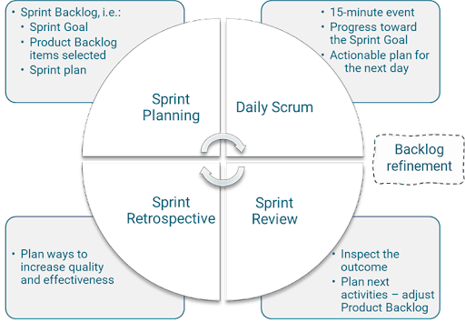
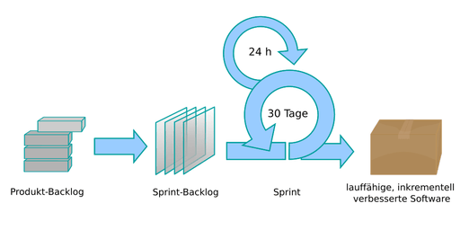
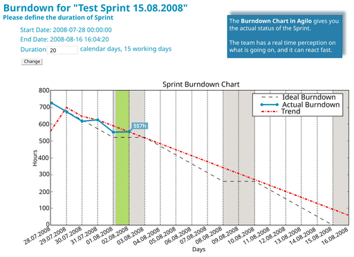

# Scrum

**Scrum** (englisch für „Gedränge“) ist ein Vorgehensmodell des Projekt- und Produktmanagements, insbesondere zur agilen Softwareentwicklung. Es wurde in der Softwaretechnik entwickelt, ist aber davon unabhängig. Scrum wird inzwischen in vielen anderen Bereichen eingesetzt. Es ist eine Umsetzung von Lean Development für das Projektmanagement. Der Begriff ist dem Rugby entlehnt und bezeichnet dort eine kreisförmige Aufstellung von zwei Mannschaften, die gemeinschaftlich versuchen, dem Gegner keinen Raum zu überlassen.

## Geschichte und Grundlegendes

Die Anfänge von Scrum lassen sich auf Ikujirō Nonaka und Hirotaka Takeuchi zurückverfolgen. Inspiriert von deren Erkenntnissen schuf Jeff Sutherland eine neue Rolle für die Projektleiter. Diese wurden zu Teammitgliedern, und ihre Rolle war eher die eines Moderators als die eines Managers. Zusammen mit Ken Schwaber formalisierte er Scrum ab 1993. Dabei wurde Scrum durch die Theory of Constraints und das Toyota-3M-Modell (Muda, Mura, Muri) beeinflusst, die Idee eines *Daily Meetings* stammt von James Coplien. Auf der OOPSLA 1995 wurde dann der erste Konferenzbeitrag über Scrum veröffentlicht. Darin schrieb Schwaber: „Scrum akzeptiert, dass der Entwicklungsprozess nicht vorherzusehen ist. Das Produkt ist die bestmögliche Software, die Kosten, die Funktionalität, die Zeit und die Qualität einbeziehend“ (Ken Schwaber: Gloger: *Scrum. Produkte zuverlässig und schnell entwickeln.*). Der Begriff *Scrum* stammt aber von Nonaka und Takeuchi, die damit das Gedränge (englisch *scrum*) im Rugby als Analogie für außergewöhnlich erfolgreiche Produktentwicklungsteams beschrieben. Diese Teams arbeiten als kleine, selbst-organisierte Einheiten und bekommen von außen nur eine Richtung vorgegeben, bestimmen aber selbst die Taktik, wie sie ihr gemeinsames Ziel erreichen.

2002 veröffentlichte Ken Schwaber mit Mike Beedle, einem der ersten Scrum-Anwender, mit *Agile Software Development with Scrum* das erste Buch über Scrum, 2004 folgte Schwabers *Agile Project Management with Scrum*. 2007 erschien schließlich Ken Schwabers drittes Buch *The Enterprise and Scrum*. Darin geht es nicht mehr bloß um die Einführung von Scrum in Software-Entwicklungsteams, sondern um die Ausweitung auf das gesamte Unternehmen. Spätestens seit der ersten jährlichen Umfrage von VersionOne (2006) ist Scrum die gängigste agile Methode.

Parallelen zu Scrum finden sich in der schlanken Produktion (englisch *lean production*), die ihren Ursprung in japanischen Unternehmen hat. Sie strebt eine bessere Wertschöpfung durch verstärkte Zusammenarbeit an. Nonaka und Takeuchi führen den Erfolg solcher Unternehmen auf ein gelungenes Wissensmanagement zurück. Im westlichen Verständnis der, heute überholten, „alten Schule“ sei die Ressource Wissen auf Worte und Zahlen begrenzt. Wissen kann nach diesem Verständnis erworben oder antrainiert werden. Japanische Firmen hingegen sehen in dieser Art von Wissen nur die Spitze eines Eisbergs. Für sie ist Wissen in erster Linie *implizit* („tacit“). Dieses implizite Wissen sei subjektiv und intuitiv und enthalte Realitäts- und Zukunftsvorstellungen. Während explizites Wissen sich leicht darstellen und verarbeiten lässt, ist dies bei implizitem Wissen deutlich schwerer. Unternehmen wie Toyota oder Canon profitieren vom impliziten Wissen ihrer Mitarbeiter, indem sie hohen Wert auf die Interaktion zwischen ihren Mitarbeitern legen.

Scrum stellt einen bewussten Kontrast zur, heute weitgehend überholten, „traditionellen“ Befehls-und-Kontroll-Organisation dar, in der, möglichst wenig qualifizierte, Mitarbeitende möglichst detaillierte Arbeitsanweisungen vom qualifizierten Management erhalten. Stattdessen setzt Scrum auf hochqualifizierte, interdisziplinäre Teams. Diese bekommen zwar klare Zielvorgaben, sind jedoch eigenverantwortlich für die Umsetzung. Dieser Ansatz schafft den nötigen Freiraum, damit Teams ihr Fachwissen und ihre Kreativität selbstbestimmt entfalten können – statt starr vorgegebene Prozesse abzuarbeiten.

Scrum verkörpert die Werte der agilen Software-Entwicklung, die 2001 im agilen Manifest von Ken Schwaber, Jeff Sutherland und anderen formuliert wurden:

- Individuen und Interaktionen sind wichtiger als Prozesse und Werkzeuge.
- Funktionierende Software ist wichtiger als umfassende Dokumentation.
- Zusammenarbeit mit dem Kunden ist wichtiger als Vertragsverhandlungen.
- Reagieren auf Veränderung ist wichtiger als das Befolgen eines Plans.

Scrum besteht aus nur wenigen Regeln. Diese beschreiben vier Ereignisse, drei Artefakte und drei Rollen (Verantwortlichkeiten), die den Kern (englisch *core*) ausmachen. Die Regeln sind im *Scrum Guide* beschrieben; es gibt eine weitere Kurzdarstellung im *Agile Atlas.* Das Scrum-Framework muss durch Techniken für die Umsetzung der Ereignisse, Artefakte und Rollen konkretisiert werden, um Scrum tatsächlich umsetzen zu können. Der Kern von Scrum wurde von den Umsetzungstechniken getrennt, um einerseits die zentralen Elemente und Wirkungsmechanismen klar zu definieren, andererseits um große Freiheiten bei der individuellen Ausgestaltung zu lassen.

Der Ansatz von Scrum ist empirisch, inkrementell und iterativ. Er beruht auf der Erfahrung, dass viele Entwicklungsprojekte zu komplex sind, um in einen vollumfänglichen Plan gefasst werden zu können. Ein wesentlicher Teil der Anforderungen und der Lösungsansätze ist zu Beginn unklar. Diese Unklarheit lässt sich beseitigen, indem Zwischenergebnisse geschaffen werden. Anhand dieser Zwischenergebnisse lassen sich die fehlenden Anforderungen und Lösungstechniken effizienter finden als durch eine abstrakte Klärungsphase. In Scrum wird neben dem Produkt auch die Planung iterativ und inkrementell entwickelt. Der langfristige Plan (das Product Backlog) wird kontinuierlich verfeinert und verbessert. Der Detailplan (das Sprint Backlog) wird nur für den jeweils nächsten Zyklus (den Sprint) erstellt. Damit wird die Projektplanung auf das Wesentliche fokussiert.

Die empirische Verbesserung fußt auf drei Säulen:

Transparenz
:   Fortschritt und Hindernisse eines Projektes werden regelmäßig und für alle sichtbar aufgezeigt.

Überprüfung
:   Projektergebnisse und Funktionalitäten werden regelmäßig abgeliefert und bewertet.

Anpassung
:   Anforderungen an das Produkt, Pläne und Vorgehen werden nicht ein für alle Mal festgelegt, sondern kontinuierlich und detailliert angepasst. Scrum reduziert die Komplexität der Aufgabe nicht, strukturiert sie aber in kleinere und weniger komplexe Bestandteile, die Inkremente.

Ziel ist die schnelle und kostengünstige Entwicklung hochwertiger Produkte entsprechend einer formulierten Vision. Die Umsetzung der Vision in das fertige Produkt erfolgt nicht durch die Aufstellung möglichst detaillierter Lasten- und Pflichtenhefte. In Scrum werden die Anforderungen in Form von Eigenschaften aus der Anwendersicht formuliert. Die Liste dieser Anforderungen ist das Product Backlog. Diese Anforderungen werden Stück für Stück in ein bis vier Wochen langen Intervallen, sogenannten Sprints umgesetzt. Am Ende eines Sprints steht bei Scrum die Lieferung eines fertigen Teilprodukts (das Product Increment). Das Produktinkrement sollte in einem Zustand sein, dass es an den Kunden ausgeliefert werden kann (*potentially shippable product*). Im Anschluss an den Zyklus werden Produkt, Anforderungen und Vorgehen überprüft und im nächsten Sprint weiterentwickelt.

Scrum ist für Teams mit einer Größe von drei bis neun Entwicklern konzipiert. Größere Projekte benötigen ein weitergehendes oder alternatives Framework, das die Koordination mehrerer Teams organisiert. Wenn diese Koordination den gleichen Prinzipien wie Scrum folgt, spricht man von Skalierungs-Frameworks oder agilen Projektmanagementmethoden.

## Verantwortlichkeiten

Das Scrum Framework kennt drei Führungsverantwortungen: Product Owner, Entwickler und Scrum Master. Die Gesamtheit dieser Verantwortlichkeiten wird als Scrum-Team bezeichnet. Ein Scrum-Team tritt mit den Beteiligten in Kontakt, den sogenannten Stakeholdern. Fortschritt und Zwischenergebnisse sind für alle Stakeholder transparent. Stakeholder dürfen bei den meisten Ereignissen zuhören.

Verschiedene Autoren haben argumentiert, dass weitere Rollen einbezogen werden sollten, wenn man Scrum als Management-Framework verstehen will. Da sich Scrum jedoch auf das Team fokussiert und kein Management-Framework ist, sind diese Rollen nicht in das Scrum Framework aufgenommen worden. Die drei Verantwortlichkeiten haben sich als ausreichend für die Organisation eines Teams erwiesen. Für die Organisation größerer Einheiten und mehrerer Teams gibt es spezielle Skalierungs-Frameworks. Diese Frameworks definieren weitere Rollen, die in großen agilen Entwicklungsorganisationen benötigt werden.

### Product Owner

Der Product Owner ist für die Eigenschaften und den wirtschaftlichen Erfolg des Produkts verantwortlich. Er gestaltet das Produkt mit dem Ziel, seinen Nutzen zu maximieren. Der Nutzen könnte sich beispielsweise am Umsatz des Unternehmens orientieren. Er erstellt, priorisiert und erläutert die zu entwickelnden Produkteigenschaften, und er urteilt darüber, welche Eigenschaften am Ende eines Sprints fertiggestellt wurden. Er ist eine Person, kein Komitee. Ihm allein obliegt die Entscheidung über das Produkt, seine Eigenschaften und die Reihenfolge der Implementierung. So balanciert er Eigenschaften, Auslieferungszeitpunkte und Kosten.

Zur Festlegung der Produkteigenschaften verwendet der Product Owner das Product Backlog. Darin trägt er in Zusammenarbeit mit dem Entwicklungsteam und den Stakeholdern die Anforderungen an das Produkt ein. Der Product Owner ordnet, priorisiert, detailliert und aktualisiert das Product Backlog regelmäßig im *Product Backlog Refinement*.

Als Produktverantwortlicher hält der Product Owner regelmäßig Rücksprache mit den Stakeholdern, um deren Bedürfnisse und Wünsche zu verstehen. Dabei muss er die Interessen und Anforderungen unterschiedlicher Stakeholder verstehen und abwägen.

In der Praxis erhalten Product Owner häufig nicht die Vollmacht, die notwendigen Entscheidungen verbindlich zu treffen – abweichend von der Rollenkompetenz, die in Scrum eigentlich vorgesehen ist. Häufig werden Product Owner auch mit fremden Aufgaben überlastet.

### Entwickler

Die Entwickler sind für die Lieferung der Produktfunktionalitäten in der vom Product Owner gewünschten Reihenfolge verantwortlich. Zudem tragen sie die Verantwortung für die Einhaltung der vereinbarten Qualitätsstandards. Das Scrum-Team organisiert sich selbst. Es lässt sich von niemandem, auch nicht vom Scrum Master, vorschreiben, wie es Backlogeinträge umzusetzen hat.

Ein Scrum-Team sollte in der Lage sein, das Ziel eines jeweiligen Sprints ohne größere äußere Abhängigkeiten zu erreichen. Deshalb ist eine interdisziplinäre Besetzung des Scrum-Teams wichtig, z. B. mit Architekt, Entwickler, Tester, Dokumentationsexperte und Datenbankexperte. Gute und schlechte Ergebnisse werden nie auf einzelne Teammitglieder, sondern immer auf das Scrum-Team als Einheit zurückgeführt. Das ideale Teammitglied ist sowohl Spezialist als auch Generalist, damit es Teamkollegen beim Erreichen des gemeinsamen Ziels helfen kann.

Ein Scrum-Team besteht aus höchstens zehn Mitgliedern. Es muss einerseits groß genug sein, alle benötigten Kompetenzen zu vereinigen, andererseits steigt mit wachsender Teamgröße der Koordinierungsaufwand.

Zu den weiteren Aufgaben eines Scrum-Teams zählt die Schätzung des Umfangs der Einträge im Product Backlog (im Product Backlog Refinement). Außerdem bricht das Scrum-Team in der Sprint Planung die für einen Sprint ausgewählten Einträge aus dem Product Backlog in Arbeitsschritte, sogenannte Tasks, herunter, deren Bearbeitung in der Regel nicht länger als einen Tag dauert. Das Ergebnis ist das Sprint Backlog.

Team-Mitglieder haben bisweilen Schwierigkeiten, die interdisziplinären Anforderungen zu akzeptieren. So mag beispielsweise ein Entwickler nicht verstehen, warum er auch die Arbeit eines Testers leisten soll. Dahinter steht jedoch der Gedanke, dass ein starkes Team den Unwägbarkeiten eines Projektes wesentlich besser gewachsen ist als eine Sammlung individueller Talente. Falls jemand mit einer Aufgabe nicht zurechtkommt, kann ein anderer helfen, das Sprint-Ziel zu erreichen. Fällt jemand für einige Zeit aus, so ist ein interdisziplinäres Team besser in der Lage, die fehlende Expertise zu kompensieren.

### Scrum Master

Der Scrum Master ist dafür verantwortlich, dass Scrum als Rahmenwerk gelingt. Dazu arbeitet er mit dem Entwicklungsteam zusammen, gehört aber selbst nicht dazu. Er führt die Scrum-Regeln ein, überprüft deren Einhaltung und kümmert sich um die Behebung von Störungen und Hindernissen. Dazu gehören mangelnde Kommunikation und Zusammenarbeit sowie persönliche Konflikte im Entwicklungsteam, welchen effektiv mit gesunder und klarer Kommunikation begegnet werden sollte, Störungen in der Zusammenarbeit zwischen Product Owner und Entwicklungsteam sowie Störungen von außen, beispielsweise Aufforderungen der Fachabteilung zur Bearbeitung zusätzlicher Aufgaben während eines Sprints. Der Scrum Master moderiert die Sprint Retrospektive und oft auch das Sprint Planning und Backlog Refinement.

Ein Scrum Master ist gegenüber dem Entwicklungsteam eine dienende Führungskraft. Er gibt einzelnen Team-Mitgliedern keine Arbeitsanweisungen. Weder beurteilt er sie, noch belangt er sie disziplinarisch. Der Scrum Master ist als Coach für den Prozess und die Beseitigung von Hindernissen verantwortlich. Unterschiedliche Teams und Situationen erfordern vom Scrum Master ein situatives Führen.

Zu Beginn einer Scrum-Implementierung ist der Scrum Master eine Vollzeitstelle, da die Umstellung der Abläufe, das Zusammenwachsen des Teams und das Einlernen der Rollen meist aufwändig sind. Er bildet das Team in Scrum aus. Ist Scrum erst einmal etabliert, kann der Scrum Master seine Rolle als Change-Manager wahrnehmen. Er hat dann die Zeit und auch die nötige Erfahrung, um Scrum im Unternehmen bekannt zu machen und dessen Akzeptanz zu steigern.

## Stakeholder

Stakeholder sind Rollen außerhalb von Scrum. Die folgenden Rollen können helfen, die unterschiedlichen Stakeholder und deren Aufgaben zu differenzieren.

### Kunden

Den Kunden wird das Produkt nach Fertigstellung zur Verfügung gestellt. Kunden können je nach Situation sowohl interne Fachabteilungen als auch externe Personen oder Gruppen sein. Es ist Aufgabe des Product Owners, seine Kunden durch Lieferung des Wunschproduktes zu begeistern. Deshalb sollten Product Owner und Kunden für die Dauer des Projektes im engen Austausch stehen. Vor Beginn der Entwicklung sollte der Product Owner ein möglichst genaues Verständnis von der Wunschvorstellung seiner Kunden gewinnen. Die Kunden sollten schon nach den ersten Sprints Gelegenheit haben, sich die neuen Funktionalitäten anzuschauen und hierzu Feedback zu geben.

### Anwender

Anwender sind diejenigen Personen, die das Produkt benutzen. Ein Anwender kann, muss aber nicht zugleich Kunde sein. Die Rolle des Anwenders ist für das Scrum-Team von besonderer Bedeutung, denn nur der Anwender kann das Produkt aus der Perspektive des Nutzers beurteilen. Anwender und Kunden sollten beim Sprint Review und beim *Product Backlog Refinement* hinzugezogen werden, um das Produkt zu erproben und Feedback zu geben.

### Management

Das Management trägt Verantwortung dafür, dass die Rahmenbedingungen stimmen. Dazu gehören die Bereitstellung von Räumen und Arbeitsmitteln, aber auch generell die Unterstützung für den eingeschlagenen Kurs. Das Management ist dafür verantwortlich, das Scrum-Team vor externen Arbeitsanforderungen zu schützen, adäquate personelle Besetzungen zu finden sowie den Scrum Master dabei zu unterstützen, Hindernisse auszuräumen.

## Sprint

Ein Sprint ist ein Arbeitsabschnitt, in dem ein Inkrement einer Produktfunktionalität implementiert wird. Er beginnt mit einem Sprint Planning und endet mit Sprint Review und -Retrospektive. Sprints folgen unmittelbar aufeinander. Während eines Sprints sind keine Änderungen erlaubt, die das Sprintziel beeinflussen.

Ein Sprint umfasst ein Zeitfenster von ein bis vier Wochen. Alle Sprints sollten idealerweise die gleiche Länge haben, um so dem Projekt einen Takt zu geben. Ein Sprint wird niemals verlängert – er ist zu Ende, wenn die Zeit um ist.

Ein Sprint kann vorzeitig vom Product Owner abgebrochen werden, wenn das Sprint-Ziel nicht mehr erreicht werden soll, beispielsweise weil sich die Zielvorgaben von Stakeholdern oder generell Marktbedingungen ändern. In diesem Fall wird der aktuelle Sprint mit einer Sprint-Retrospektive beendet und der neue Sprint ganz normal mit Sprint Planning begonnen. Der Scrum-Guide beschreibt Sprint-Abbrüche als Ressourcen-intensiv und unüblich.

## Ereignisse

In Scrum spricht man von Ereignissen oder Events statt von Meetings, um klarzustellen, dass es sich um Arbeit handelt. Alle Ereignisse von Scrum haben feste Zeitfenster (Timeboxen), die nicht überschritten werden sollen.

### Sprint Planning

Im Sprint Planning werden drei Fragen beantwortet:

- **Warum** ist der kommende Sprint wichtig?
- **Was** müssen wir tun, um das Sprintziel zu erreichen?
- **Wie** wird die daraus resultierende Arbeit im kommenden Sprint erledigt?

#### Teil 1: Festlegung des *Warum*

Im ersten Schritt des Sprint Plannings einigt sich das Scrum-Team auf ein gemeinsames Sprintziel. Das Sprintziel sorgt erstens für den notwendigen Fokus während des kommenden Sprints. Zweitens ist es ein unabdingbares Element zur Selbstorganisation. Drittens ist ohne ein Sprintziel kein Commitment des Scrum Teams möglich.

#### Teil 2: Festlegung des *Was*

Der Product Owner stellt dem Entwicklungsteam die im Product Backlog festgehaltenen Produkteigenschaften in der zuvor priorisierten Reihenfolge vor. Das Product Backlog sollte im Sprint zuvor im *Product Backlog Refinement* so weit vorbereitet worden sein, dass es geordnet, gefüllt und die Einträge für den nächsten Sprint geschätzt sind.

Das gesamte Scrum-Team arbeitet im zweiten Teil der Planung daran, ein gemeinsames Verständnis für die im Sprint zu erledigende Arbeit zu entwickeln, die notwendig ist, um das Sprintziel zu erreichen. Dabei werden die Eigenschaften und die Akzeptanzkriterien besprochen, beispielsweise die Gebrauchstauglichkeit. Außerdem einigt sich der Product Owner mit dem Entwicklungsteam auf die Kriterien, die am Ende des Sprints darüber entscheiden, ob die neue Funktionalität fertig ist oder nicht (siehe *Definition of Done*). Ziel ist die Fertigstellung eines auslieferbaren Produkts: ein Produktinkrement, das hinreichend getestet und integriert ist, um für den Benutzer freigegeben werden zu können.

Anschließend prognostizieren die Entwickler die Anzahl der Product-Backlog-Einträge, die sie im nächsten Sprint liefern können. Die Entscheidung, wie viele Einträge im nächsten Sprint umgesetzt werden, liegt alleine bei den Entwicklern, während die Entscheidung über die Reihenfolge alleine beim Product Owner liegt. Deshalb müssen beide konstruktiv zusammenarbeiten.

Die ursprüngliche Beschreibung von Scrum verwendete den Begriff *Commitment* (Verpflichtung) statt *Forecast* (Prognose); dies wurde 2011 angepasst, weil es häufig zu Fehlentwicklungen zulasten der Qualität führte.

#### Teil 3: Festlegung des *Wie*

Im dritten Teil des Sprint Plannings planen die Entwickler des Scrum Teams im Detail, welche Aufgaben (Tasks) zum Erreichen des Sprintziels und zur Lieferung der prognostizierten Product-Backlog-Einträge notwendig sind. Diese Planung macht das Entwicklungsteam, wobei der Product Owner für Fragen in Reichweite sein sollte. Oftmals bilden sich zur Beantwortung der Wie-Frage Kleingruppen, in denen verschiedene Aspekte wie z. B. Architektur, Datenelemente und Schnittstellen geklärt werden.

Das Ergebnis dieses Vorgehens ist das Sprint Backlog: der detaillierte Plan für den nächsten Sprint. Er enthält das Sprintziel, die für den Sprint geplanten Product-Backlog-Einträge, sowie die Aufgaben zu deren Umsetzung. Häufig wird dafür ein Taskboard als Technik verwendet.

### Daily Scrum

Zu Beginn eines jeden Arbeitstages trifft sich das Entwicklerteam zu einem max. 15-minütigen Daily Scrum, bei dem Scrum Master und Product Owner häufig anwesend, jedoch nicht aktiv beteiligt sind, falls sie nicht selbst Backlogelemente bearbeiten. Zweck des Daily Scrum ist der Informationsaustausch. Im Daily Scrum werden keine Probleme gelöst – vielmehr geht es darum, sich einen Überblick über den aktuellen Stand der Arbeit zu verschaffen. Dazu hat sich bewährt, dass jedes Teammitglied mit Hilfe des *Taskboards* sagt, was es seit dem letzten Daily Scrum erreicht hat, was es bis zum nächsten Daily Scrum erreichen möchte, und was dabei im Weg steht.

Beim Daily Scrum kann offensichtlich werden, dass die Erledigung einer Aufgabe länger als geplant dauert. Dann ist es sinnvoll, den Task in kleinere Aufgaben aufzuteilen, die dann auch von anderen Mitgliedern des Entwicklungsteams übernommen werden können.

Treten beim Daily Scrum Fragen auf, die sich nicht innerhalb der strikten 15-Minuten-Vorgabe beantworten lassen, so werden sie entweder notiert und dem Scrum Master übergeben, oder ihre Beantwortung wird auf ein späteres Meeting, häufig direkt im Anschluss, verlegt.

### Sprint Review

Das Sprint Review steht am Ende des Sprints. Hier überprüft das Scrum-Team das Inkrement, um das Product Backlog bei Bedarf anzupassen. Das Entwicklungsteam präsentiert seine Ergebnisse und es wird überprüft, ob das zu Beginn gesteckte Ziel erreicht wurde. Das Scrum-Team und die Stakeholder besprechen die Ergebnisse und was als Nächstes zu tun ist.

Im Sprint Review ist die Beteiligung von Kunden und Anwendern wichtig, da diese die fertige Funktionalität des Inkrements benutzen und validieren können. Hieraus ergibt sich wichtiges Feedback für die weitere Produktgestaltung. Es kann sogar passieren, dass die Funktionalität alle Abnahmekriterien erfüllt und dennoch aus der Perspektive des Benutzers unbrauchbar ist, beispielsweise wenn ein Button an einer schwer auffindbaren Stelle platziert wurde. Häufig entsteht während des Reviews ein lebhafter Dialog, in dem den Anwesenden neue Funktionalitäten einfallen.

Das Ergebnis des Sprint Review ist das vom Product Owner notierte Feedback der Stakeholder. Dies ist eine notwendige Information bei der weiteren Gestaltung des Product Backlogs im nächsten Product-Backlog-Refinement.

Es ist Aufgabe des Product Owners, die entwickelten Funktionalitäten zu begutachten. Anhand der im Sprint Planning 1 festgelegten Bedingungen entscheidet er, ob sie abgenommen werden können oder nicht. Dabei soll er keine Kompromisse eingehen: Ein Team hat auch dann sein Ziel verfehlt, wenn es eine „fast fertige“, aber noch nicht getestete Funktionalität liefert. In diesem Fall kehren die nicht fertiggestellten User Stories in das Product Backlog zurück und werden vom Product Owner neu priorisiert. Die Abnahme ist aber nicht primärer Gegenstand des Sprint Reviews, bei dem es vorrangig um das Feedback der Stakeholder geht. Die Abnahme der Funktionalitäten des Produktinkrements wird daher häufig im Rahmen des Sprints umgesetzt.

Das Sprint-Review dauert maximal 1 Stunde je Sprint-Woche.

### Sprint-Retrospektive

Die Sprint-Retrospektive steht am Ende eines Sprints. Hierbei überprüft das Scrum-Team seine bisherige Arbeitsweise, um sie in Zukunft effizienter und effektiver zu machen. Der Scrum Master unterstützt das Scrum-Team darin, gute Praktiken und Verbesserungen zu finden, die im nächsten Sprint umgesetzt werden. Die Retrospektive ist ein gemeinsames Ereignis des Scrum-Teams.

Das Team soll seine Arbeitsweise offen und ehrlich überprüfen können. Dazu müssen Kritik und unangenehme Wahrheiten offen geäußert werden können. Das schließt auch Gefühle und Empfindungen ein. Die Retrospektive soll daher in einem geschützten Raum ablaufen. Stakeholder dürfen nur auf Einladung dazukommen. Als Struktur für die Sprint-Retrospektive haben sich fünf Phasen bewährt.

Die Verbesserungsmaßnahmen werden dokumentiert und geplant. Hierfür gibt es unterschiedliche Techniken. Einige Teams nutzen eine eigene Liste mit Hindernissen und Verbesserungsmaßnahmen (das Impediment Backlog), andere Teams nehmen Hindernisse und die entsprechenden Aufgaben in das Sprint Backlog auf.

Die Sprint-Retrospektive dauert maximal 45 min je Sprint-Woche, also maximal drei Stunden für einen Vier-Wochen-Sprint.

#### Unterschied zwischen einer Sprint-Retrospektive und einem Sprint Review

Der Sprint Review geht der Sprint-Retrospektive voraus und dient dazu, die Ergebnisse eines Sprints im Team zu präsentieren. Die verantwortliche Person stellt während des Sprint Reviews fest, ob das Team die festgelegten Ziele erreicht hat und, ob der Output die Kriterien erfüllt. Die Sprint-Retrospektive fokussiert sich mehr auf die Effektivität und Effizienz des Teams während des Sprints. Dabei wird diskutiert, ob alle Prozesse funktioniert haben und was gegebenenfalls verbessert werden könnte. Die Retrospektive bietet Teams die Möglichkeit, Verbesserungen einzuplanen und erfolgreiche Praktiken aufzubauen oder im folgenden Sprint fortzusetzen.

### Product Backlog

Das Product Backlog ist eine geordnete Auflistung der Anforderungen an das Produkt. Das Product Backlog ist dynamisch und wird ständig weiterentwickelt. Alle Arbeit, die das Entwicklungsteam erledigt, muss ihren Ursprung im Product Backlog haben. Der Product Owner ist für die Pflege des Product Backlogs verantwortlich. Er verantwortet die Reihenfolge bzw. Priorisierung der Einträge.

Das Product Backlog ist nicht vollständig und erhebt auch nicht diesen Anspruch. Zu Beginn eines Projektes enthält es die bekannten und am besten verstandenen Anforderungen. Die Priorisierung der Eintragungen erfolgt unter Gesichtspunkten wie wirtschaftlicher Nutzen, Risiko und Notwendigkeit. Eintragungen mit der höchsten Priorität werden als erste im Sprint umgesetzt. Das Risiko einer Anforderung kann durch eine Analyse ihrer Abhängigkeiten zu anderen Anforderungen bestimmt werden. Diese Abhängigkeiten werden auch als Rückverfolgbarkeit (englisch requirements traceability) bezeichnet und im Werkzeug, welches das Product Backlog verwaltet (z. B. Issue Tracker), als Nebenprodukt erfasst.

Die Anforderungen im Product Backlog sollten nicht technisch, sondern fachlich und anwenderorientiert sein. Eine Möglichkeit, um diese Sichtweise zu unterstützen, ist die Formulierung der Produkteigenschaften als User Stories. Die dabei für jede User Story erwünschten Eigenschaften wurden von Bill Wake zum Akronym *INVEST* zusammengefasst. Es steht für:

- **I**ndependent – unabhängig. Sie sollte nach Möglichkeit nicht von anderen User Stories abhängen.
- **N**egotiable – verhandelbar. Sie sollte keine Umsetzungsdetails festlegen.
- **V**aluable – nützlich. Ihre Umsetzung erhöht den Gebrauchswert des Produkts für den Endkunden.
- **E**stimable – schätzbar. Der Aufwand für die Umsetzung muss abschätzbar sein.
- **S**mall – klein. Der Aufwand für die Umsetzung sollte überschaubar sein. Erstrebenswert sind einige Arbeitstage, maximal einige Wochen.
- **T**estable – überprüfbar. Ihre erfolgreiche Umsetzung sollte sich mit objektiven Kriterien überprüfen lassen.

#### Product Backlog Refinement

Das Product Backlog Refinement (früher auch *Backlog Grooming* genannt) ist ein fortlaufender Prozess, bei dem der Product Owner und das Entwicklungsteam gemeinsam das Product Backlog weiterentwickeln. Hierzu gehören:

- Schätzen von Einträgen
- Ordnen der Einträge
- Löschen von Einträgen, die nicht mehr wichtig sind
- Hinzufügen von neuen Einträgen
- Detaillieren von Einträgen
- Zusammenfassen von Einträgen
- Planung von Releases

Für die Gestaltung des Produkts und des Product Backlogs können Stakeholder wertvolle Informationen liefern, indem sie dem Scrum-Team erklären, wie sie sich eine Funktionalität im alltäglichen Gebrauch wünschen. Daher gibt es meistens auch Product-Backlog-Refinement-Treffen zusammen mit ausgewählten Stakeholdern.

Das Product Backlog Refinement sollte nicht mehr als 10 % der Zeit des Entwicklungsteams in Anspruch nehmen.

### Sprint Backlog

Das Sprint Backlog ist der aktuelle Plan der für einen Sprint zu erledigenden Aufgaben. Es umfasst die Product-Backlog-Einträge, die für den Sprint ausgewählt wurden, und die dafür nötigen Aufgaben (z. B. Entwicklung, Test, Dokumentation). Das Sprint Backlog wird laufend nach der Erledigung einer (Teil-)Aufgabe von den Team-Mitgliedern aktualisiert. Dies dient zur Übersicht des aktuellen Bearbeitungsstands. Um es für alle sichtbar zu machen, wird häufig ein Taskboard genutzt.

### Product Increment

Das Inkrement ist die Summe aller Product-Backlog-Einträge, die während des aktuellen und allen vorangegangenen Sprints fertiggestellt wurden. Am Ende eines Sprints muss das neue Inkrement in einem nutzbaren Zustand sein und der Definition of Done entsprechen.

### Transparenz des Fortschritts

Zum Kern von Scrum gehört eine Transparenz über den Fortschritt des Produkts und des Sprints – innerhalb und außerhalb des Teams. Während das Produktinkrement den Fortschritt am deutlichsten sichtbar macht, so sind dennoch andere Techniken zur Fortschrittstransparenz notwendig. Im Kern von Scrum wird für die Transparenz des Fortschritts keine spezifische Technik vorgegeben. Typischerweise werden hierzu Burndown-Grafiken verwendet.

### Definition of Done

Die Definition of Done (DoD) ist ein gemeinsames Verständnis des Scrum-Teams, unter welchen Bedingungen eine Arbeit als fertig bezeichnet werden kann. Sie enthält für gewöhnlich Qualitätskriterien, Einschränkungen und allgemeine nicht-funktionale Anforderungen. Mit zunehmender Erfahrung des Scrum-Teams entwickelt sich die Definition of Done weiter. Sie enthält dann strengere Kriterien für höhere Qualität.

Dazu gehört beispielsweise das Schreiben von Kommentaren, Unit Tests und Design-Dokumenten. Die DoD wird von den Beteiligten zu Beginn eines Projektes festgelegt und wird im Laufe der Entwicklung angepasst. Die DoD hilft zu Beginn eines Sprints, die Anzahl und den Umfang der Tasks festzulegen. Es müssen aber nicht alle Ereignisse der DoD auf jede User Story zutreffen. Am Ende des Sprints dient die DoD neben den Akzeptanzkriterien jedes Product Backlog Eintrags dazu, zu entscheiden, ob ein Product-Backlog-Eintrag als fertig akzeptiert wird. Die Verantwortung für die Einhaltung der Kriterien der DoD obliegt dem Team.

## Ergänzende Techniken

In Verbindung mit Scrum werden die folgenden Techniken häufig genutzt. Diese Techniken gehören nicht zum Kern von Scrum und zu allen Techniken gibt es mehrere Alternativen.

### User Story

User Stories sind eine Technik zur Beschreibung von Anforderungen aus der Perspektive eines Benutzers unter Verwendung von Alltagssprache. In Scrum werden User Stories zur Formulierung der Product-Backlog-Einträge verwendet. Eine User Story beschreibt, welche Produkteigenschaft der Benutzer will und warum.

User Stories folgen im Allgemeinen diesem Muster:

*Als [NUTZER] will ich [FUNKTION oder EIGENSCHAFT], damit [ZWECK].*

Bei einem Projekt zur Entwicklung eines städtetauglichen Elektrofahrrads könnte eine User Story demnach folgendermaßen lauten:

*Als 30-jährige Geschäftsfrau möchte ich auf dem Weg zur Arbeit nur wenig in die Pedale treten müssen, damit ich nicht verschwitzt in der Firma ankomme.*

Es ist Aufgabe des Product Owners und des Teams, im Product Backlog Refinement zu klären, was genau damit gemeint ist und welches die Akzeptanzkriterien sein sollen. So könnte zum Beispiel vereinbart werden, dass bis zu einer Steigung von maximal 20 Prozent der elektrische Antrieb so stark sein muss, dass die Fahrerin nicht mehr als 50 Watt durch eigenes Treten beisteuern muss. Zudem muss das Entwicklungsteam mit dem Product Owner klären, ob sich diese User Story überhaupt in einem Sprint erledigen lässt oder ob sie in kleinere Stories heruntergebrochen werden muss. Sobald eine User Story umgeschrieben oder um weitere Information ergänzt wird, werden auch diese Änderungen im Product Backlog festgehalten.

Fragen nach dem Wie, also nach der technischen Umsetzung einer User Story, gehören ins Sprint Planning und werden nicht im Product Backlog, sondern im Taskboard mit Hilfe der einzelnen Tasks festgehalten.

### Taskboard

Das Taskboard ist eine Technik zur Visualisierung des Sprint Backlogs. Darauf lässt sich jederzeit erkennen, welche Einträge aus dem Product Backlog für den Sprint ausgewählt wurden, welche Aufgaben dazu zu bearbeiten sind und in welchem Bearbeitungszustand diese Aufgaben sind. Das Taskboard ist eine Kanban-Tafel.

Typischerweise besteht das Taskboard aus vier Spalten. In der ersten Spalte *Anforderungen* werden die Einträge aus dem Product Backlog eingetragen, die das Entwicklungsteam für diesen Sprint ausgewählt hat – in der vom Product Owner priorisierten Reihenfolge. Die drei weiteren Spalten enthalten die Aufgaben oder Tasks, die zur Umsetzung der jeweiligen Anforderung notwendig sind, in ihrem jeweiligen Bearbeitungszustand. Die zweite Spalte enthält alle noch zu erledigenden Aufgaben, die nächste Spalte diejenigen in Bearbeitung und die letzte Spalte alle erledigten.

Im Daily Scrum erklärt jedes Mitglied des Entwicklungsteams anhand des Taskboards, an welcher Aufgabe es am Vortag gearbeitet hat und ob diese erledigt wurde. Tasks, die an einem Tag nicht beendet werden konnten oder bei denen Hindernisse den Fortschritt aufhalten, werden markiert. In diesem Fall sollten die Aufgaben zur Beseitigung des Hindernisses in das Taskboard aufgenommen werden. So können Hindernisse schnell identifiziert und die Beseitigungsmaßnahmen transparent gemacht werden.

### Planungspoker

Scrum schreibt keine spezifische Methode vor, Aufwände abzuschätzen. Bei einer guten Schätzmethode sollten die Beteiligten zunächst unbeeinflusst von den anderen Teilnehmern schätzen. Andererseits sollte die Methode in annehmbarer Zeit zu einem akzeptierten und validen Ergebnis führen.

Jeder Teilnehmer erhält einen Satz Spielkarten. Diese sind mit Schwierigkeitsgraden oder Story Points bedruckt, beispielsweise in der Systematik:

- trivial, einfach, mittel, schwierig, sehr schwierig, extrem schwierig
- (XXS), XS, S, M, L, XL, (XXL): *T-Shirt Sizes*
- 0, ½, 1, 2, 3, 5, 8, 13, 20, 40, 100 orientieren sich an den ersten Fibonacci-Zahlen 1, 2, 3, 5, 8, 13, 21, 34, 55, 89 … Diese werden häufig gewählt, um der zunehmenden Unsicherheit in der Schätzung schwererer Aufgaben gerecht zu werden. Häufig gibt es außerdem Karten mit Unendlichkeitssymbol ∞, Kaffeetasse als Pausensymbol und Fragezeichen.

Das Planungsspiel läuft folgendermaßen:

1. Der Product Owner stellt die User Story vor, die es zu schätzen gilt.
2. Das Team klärt in der Diskussion mit dem Product Owner seine Fragen zu der Story.
3. Jedes Teammitglied wählt für sich eine Karte, die seiner Ansicht nach der Schwierigkeit der Story entspricht.
4. Alle gewählten Karten werden gleichzeitig aufgedeckt.
5. Die Teilnehmer mit der niedrigsten und der höchsten Schätzung erklären ihre Beweggründe.
6. Der Prozess wird wiederholt, bis ein Konsens gefunden ist.
7. Das Spiel wird wiederholt, bis alle User Stories geschätzt sind.

Bei einer größeren Zahl von User Stories ist es zweckmäßig, eine Zeitvorgabe pro Story zu vereinbaren und diese jeweils mit einer Sanduhr oder Stoppuhr zu überwachen. Ist die Zeit abgelaufen, ohne dass die Story geschätzt werden konnte, so ist das ein Indiz dafür, dass die Beschreibung nicht gut verständlich ist und neu verfasst werden sollte. Bei größeren Projekten (z. B. ein Backlog mit über hundert User Stories und zehn Teilnehmenden) ist Planungspoker schwierig anzuwenden, da nicht in einem vertretbaren Zeitaufwand geschätzt werden kann. Hierfür schlägt Boris Gloger eine Alternative namens *Magic Estimation* vor, die Planungspoker in Genauigkeit und Geschwindigkeit übertrifft.

### Impediment Backlog

Das Impediment Backlog ist eine Technik, mit welcher der Scrum Master öffentlich alle Arbeitsbehinderungen sammelt. Es handelt sich um eine Liste von Hindernissen, Aufgaben zu ihrer Lösung und ihren aktuellen Status. Eine andere Technik ist es, Behinderungen und die Beseitigungsmaßnahmen auf dem Taskboard mit zu pflegen.

### Burn-Down-Chart

Das Burn-Down-Chart dient der Visualisierung bereits geleisteter und noch verbleibender Arbeit. Es gibt zwei Varianten:

- Als Sprint Burndown wird es zur Verfolgung des Sprintfortschritts verwendet.
- Als Release Burndown wird es zur Verfolgung des Produktfortschritts über mehrere Sprints hinweg verwendet.

Beim Sprint Burndown wird auf der horizontalen Achse der Zeitverlauf in Tagen und auf der vertikalen Achse die Anzahl der noch zu erledigenden Tasks aufgetragen. So ergibt sich eine Linie von offenen Aufgaben, die im Idealfall am Sprintende die Nulllinie trifft. Über das Sprint Burndown ist es möglich, die Erreichung des Sprint-Ziels besser abzuschätzen. Das Entwicklungsteam aktualisiert im Daily Scrum das Sprint Burndown.

Alternativ können beim Sprint Burndown statt der Anzahl der Tasks auch die Summe der geschätzten Aufwände für jeden einzelnen Task eingetragen werden. Dies erfordert jedoch eine Schätzung der Restaufwände für alle Tasks, so dass diese Variante mehr Aufwand erfordert. Da die Genauigkeit bei Tasks mit einem Aufwand von maximal einem Tag nur geringfügig besser wird, hat sich das Zählen der Tasks bei vielen Teams durchgesetzt.

Beim Release Burndown wird auf der horizontalen Achse der Zeitverlauf in Sprints und auf der vertikalen Achse die Anzahl der noch zu erledigenden Product-Backlog-Einträge aufgetragen, beispielsweise in Story Points. Ändert sich der Umfang des Product Backlog, so wird dies unterhalb der horizontalen Achse eingetragen. Bei jedem Sprint aktualisiert der Product Owner das Release Burndown. Mit Hilfe des Release Burndown kann der Product Owner Umfang und Liefertermin des aktuellen Releases bestimmen.

### Fünf Phasen einer Retrospektive

Als Struktur einer Sprint-Retrospektive haben sich fünf Phasen bewährt:

1. Zuerst werden die Voraussetzungen für eine offene Atmosphäre geschaffen. Die Teilnehmer sollen sich wohl dabei fühlen, offene Punkte zu diskutieren. Dabei gilt die Annahme, dass jeder die bestmögliche Arbeit geleistet hat, die er oder sie leisten konnte, und zwar unabhängig davon, welche offenen Punkte festgestellt werden.
2. Zweitens werden Informationen gesammelt. Dies geschieht oft, indem man zurückblickt und ermittelt, was gut gelaufen ist und was nicht.
3. Im dritten Schritt werden Erkenntnisse gewonnen. In dieser Phase klären Teams normalerweise, warum Dinge geschehen sind, damit nicht nur Symptome kuriert, sondern die tatsächlichen Ursachen erkannt werden.
4. Viertens entscheidet man, was zu tun ist. Das umfasst Vereinbarungen über sinnvolle und realistische Schritte, die im nächsten Sprint umgesetzt werden sollen.
5. Zu guter Letzt wird die Retrospektive abgeschlossen.

Für die Gestaltung der fünf Schritte gibt es eine Vielzahl von möglichen Vorgehensweisen.

## Adaptionen von Scrum

Obwohl der Scrum Guide die essentiellen Elemente von Scrum vorschreibt, scheinen viele Unternehmen signifikant davon abzuweichen. Die wenigste Variation findet sich in der Sprint-Länge, den Treffen, der Teamgröße und im Requirements Engineering. Die Unternehmen variieren am ehesten in den Rollen, der Aufwandsschätzung und der Qualitätssicherung. Für einige der Abweichungen gibt es gute Gründe, oft aber sind die Abweichungen das Resultat einer nicht vollständigen Umsetzung von Scrum in einer hierarchischen, nicht-agilen Organisation.

Zur Skalierung von Scrum auf große Projekte mit vielen Mitarbeitern und Scrum-Teams bzw. für gesamte Unternehmen gibt es mehrere Ansätze. Die bekanntesten sind:

- Scrum of Scrums
- Large-Scale Scrum (LeSS)
- seit 2011: Scaled Agile Framework (SAFe)
- seit 2015: Nexus von Ken Schwaber
- seit 2018: Scrum@Scale von Jeff Sutherland

### Keine Erfolgsgarantie

Erfolgsgarantien kann Scrum, wie viele andere Prozesse und Vorgehensmodelle, nicht bieten.

### Verwertung gewonnener Erkenntnisse

Laut den Machern von Scrum muss man sich bei Verwendung von Scrum darauf einstellen, dass die ursprünglichen Einschätzungen permanent über- oder untertroffen werden. Scrum zeigt, laut seinen Erfindern, vom ersten Tag an Abweichungen vom Soll-Zustand an. Wie gut die Produktentwicklung mit Scrum funktioniert, hängt nach Angaben der Entwickler von Scrum davon ab, wie das Scrum-Team die gewonnenen Erkenntnisse anwendet. Nach Schwaber kann auch ein „Team von Idioten“ nach Scrum arbeiten. Das Team liefert am Ende jedes Sprints zuverlässig Produktinkremente, hält alle Meetings ab und verteilt die Rollen nach Scrum. Wenn aber das Scrum-Team die Ergebnisse nicht nutzt, um anders zu arbeiten und Anpassungen vorzunehmen, wird auch das Produkt nicht besser oder früher fertig sein.

### Rollenkonflikte

Die Selbstorganisation im Entwicklungsteam impliziert, dass Hierarchien in Frage gestellt werden. Mitglieder, die nicht bereit sind, ihre bisherige Position innerhalb des Entwicklungsteams aufzugeben, können daher Konflikte erzeugen. Scrum fordert, dass alle Teammitglieder vielfältige Aufgaben eines Sprints bearbeiten können. Jemand, der sich exklusiv als Tester, Programmierer oder Architekt sieht, passt nicht optimal in ein Entwicklungsteam nach Scrum.

### Machtkonflikte

Scrum kennt innerhalb eines Entwicklungsteam keine Hierarchien. Entweder kann ein Mitglied einen wertvollen Beitrag leisten oder aber nicht. Viele Unternehmen teilen ihre Mitarbeiter aber in Stufen ein, welche auch unterschiedlich entlohnt werden. Ein System-Architekt verdient mehr als ein Senior-Entwickler, ein Junior-Entwickler weniger als ein Senior-Entwickler. Wer hat das Sagen, wenn beide zusammenarbeiten müssen? Scrum nimmt keine Rücksicht auf den Rang eines Mitarbeiters. Konflikte bleiben da nicht aus. Warum sollte ein Junior-Entwickler Entscheidungen fällen dürfen? Wird ein Scrum-Team aus existierenden Entwicklungsteams übernommen, erwarten die Junior-Entwickler, dass ein Senior-Entwickler die Entscheidungen für sie fällt. Senior-Entwickler sind dagegen nicht bereit, Macht abzugeben, und meinen, Entscheidungen mit den Fachabteilungen allein fällen zu müssen.

### Juristische Erwägungen

Im Rahmen von Werkverträgen und vor dem Hintergrund der Produkthaftung kann die Anwendung von Scrum begrenzt sein. Es besteht eine stärkere Unschärfe über die zu erbringende Leistung und deren Abnahmekriterien als bei traditionellen Vorgehensweisen. Bei Streitigkeiten kann dies dazu führen, dass keine eindeutige Aussage zur Vertragserfüllung getroffen werden kann. In der Fachliteratur werden Vorschläge angeboten, wie Werkverträge für Scrum-Projekte zu gestalten sind.

## Zertifizierung

2003 war das Jahr, in dem die ersten zertifizierten Scrum Master von Ken Schwaber ausgebildet wurden. Mit der *ScrumAlliance*, der *Scrum.org* und der *Scrum Inc.* haben die Entwickler von Scrum drei Zertifizierungsstellen gegründet, die den *Scrum Guide* als gemeinsamen und zentralen Standard anerkennen. Daneben finden sich mittlerweile auch agile Erweiterungen und Anpassungen der etablierten Projektmanagement-Anbieter sowie zahlreiche nicht-offizielle Scrum-Zertifizierungen.

## Werkzeuge

Es gibt diverse Werkzeuge wie Redmine (verschiedene Plugins verfügbar), OpenProject, Jira oder Azure DevOps, die darauf ausgelegt sind, die Einführung von Scrum und die darin anfallenden Prozesse zu erleichtern.
