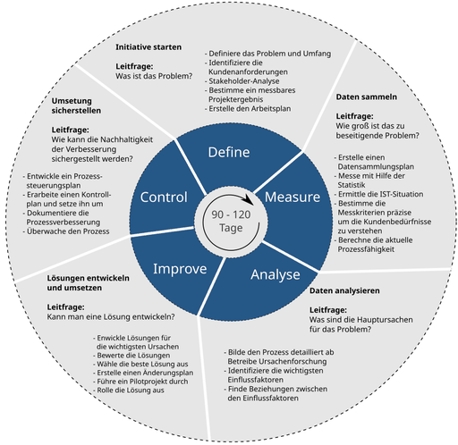
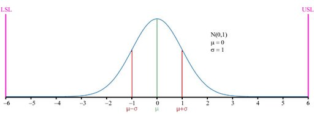

# Six Sigma

**Six Sigma** (6σ) ist ein Managementsystem zur Prozessverbesserung, statistisches Qualitätsziel und zugleich eine Methode des Qualitätsmanagements. Ihr Kernelement ist die Beschreibung, Messung, Analyse, Verbesserung und Überwachung von Geschäftsvorgängen mit statistischen Mitteln. Es ist eine Methode mit einem umfassenden Set an Werkzeugen zur systematischen Verbesserung oder Neugestaltung von Prozessen. Dabei folgt der Projektstrukturplan bei Prozessverbesserungsprojekten der Vorgehensweise Define – Measure – Analyze – Improve – Control (DMAIC). Six-Sigma-Projekte verfolgen letztlich die Verbesserung des Unternehmensergebnisses, indem sie die Verschwendung von Ressourcen reduzieren, die für die Herstellung unbrauchbarer Produkte, die Entsorgung, den Reklamationsprozess usw. eingesetzt werden.

Der Name „Six Sigma“ stammt aus der statistischen Qualitätskontrolle und bezieht sich auf den Umstand, dass in einer Normalverteilung fast alle Ergebnisse innerhalb einer Bandbreite von ±6 Standardabweichungen (σ) um den Mittelwert liegen, englisch ausgesprochen „Six Sigma“. Sie soll identisch sein mit der Bandbreite der akzeptierten Toleranz des betrachten Qualitätsmerkmals, denn dann sind auch fast alle gefertigten Teile akzeptabel. Damit ist die zulässige Standardabweichung bekannt. Nun muss der Fertigungsprozess so gestaltet werden, dass diese Standardabweichung auch eingehalten wird. Das ist relativ leicht zu prüfen und zu überwachen.

## Geschichtliche Entwicklung

Die Vorläufer von Six Sigma wurden in den 1970er Jahren erst im japanischen Schiffbau eingeführt, später in der japanischen Elektronik- und Konsumgüterindustrie. Six Sigma wurde 1987 von Motorola in den USA entwickelt. Große Popularität erlangte der Six-Sigma-Ansatz durch Erfolge bei General Electric (GE). Damit verbunden ist der Name des Managers Jack Welch, der 1996 Six Sigma bei GE einführte.

Heute arbeiten zahlreiche Großunternehmen mit Six Sigma – nicht nur in der Fertigungsindustrie, sondern auch im Dienstleistungssektor. Viele dieser Unternehmen erwarten von ihren Lieferanten Nachweise über Six-Sigma-Qualität in den Produktionsprozessen. Mehr als zwei Drittel (69 %) der Unternehmen nutzen Six Sigma zur Prozessverbesserung, während nur ein Drittel (31 %) die Methode zur Neuentwicklung von Prozessen einsetzt.

Im Produkt- und Prozessentwicklungsbereich kommen abgewandelte DMAIC- bzw. Prozessmanagement-Prozesse zum Einsatz, die unter dem Begriff Design for Six Sigma (DFSS, DMADV) zusammengefasst werden. Auch für den Bereich der Software-Entwicklung gibt es eine Variante von Six Sigma.

Seit 2001 wird Six Sigma in vielen Implementierungen mit den Methoden des Lean Management kombiniert und als *Lean Sigma* oder **Lean Six Sigma** bzw. *Six Sigma + Lean* bezeichnet.

Im Zuge der Nachhaltigkeitsdiskussion von Prozessveränderungen ist seit 2005 zunehmend das Prozessmanagement (im Sinne von *Management von Geschäftsprozessen im Tagesgeschäft*, aber nicht vorrangig im Sinne der GPM-IT-Tool-Thematik) als Ergänzung zu den Projektmethodiken *DMAIC* und *DFSS* ein Thema.

## Standards und Normen

Im Jahr 2011 erschien mit der ISO 13053-2011 die erste Norm für Six Sigma. Motorola hat keinen *Body of Knowledge* herausgegeben und damit auch keine einheitliche Zertifizierungsgrundlage für Six Sigma geschaffen. Seit Ende der 90er Jahre gibt es daher vermehrt Anbieter von Six-Sigma-Zertifizierungen mit jeweils unterschiedlich inhaltlicher Ausrichtung.

## Rollen und Aufgaben

Six-Sigma-Verbesserungsprojekte werden von speziell ausgebildeten Mitarbeitern geleitet. Das führungspsychologische Konzept von Six Sigma beruht auf Rollendefinitionen, die sich an den *Rangkennzeichen* (Gürtelfarbe) japanischer Kampfsport­arten orientieren (vgl. Dan und Kyū):

- Der *Champion* steht auf der höchsten Hierarchiestufe im Six-Sigma-Projekt. Bei Magnusson, Kroslid, Bergman werden mehrere Champions klassifiziert:
  - Der *Leiter des Strategischen Managements* ist ein langjährig erfolgreicher Unternehmer, der lehrende Veranstaltungen an Universitäten leitet. Die Kennzeichnung erfolgt über den *Initialen Gürtel* (englisch *initial belt*).
  - Der *Auslieferungschampion* ist ein Mitglied der Unternehmensleitung; er ist der Motor und Fürsprecher für Six Sigma im Unternehmen.
  - Der *Projektchampion* (auch *Projektsponsor*) ist in der Regel ein Mitglied des mittleren Managements und Auftraggeber für einzelne Six-Sigma-Projekte im Unternehmen. Diese Manager sind zugleich häufig auch die Prozesseigner für den zu verbessernden Prozess.
- Der *Schwarze Meistergürtel* (englisch *master black belt*) ist ein Vollzeitverbesserungsexperte; er wirkt als Coach, Trainer und Ausbilder.
- Der *Schwarze Gürtel* (englisch *black belt*) ist ebenfalls auf Vollzeitbasis als Verbesserungsexperte tätig; er übernimmt Projektmanagementaufgaben und hat eingehende Kenntnisse in der Anwendung der verschiedenen Six-Sigma-Methoden. Die Rollenbeschreibung von Schwarzen Gürteln sieht die Umsetzung von vier Verbesserungsprojekten pro Jahr mit einer resultierenden Kürzung der Ausgaben um jeweils 200.000 Euro vor (je nach Größe des Unternehmens), sowie die übergeordnete Begleitung von etwa vier weiteren Projekten.
- Der *Grüne Gürtel* (englisch *green belt*) ist im Management angesiedelt – dies sind meist Abteilungsleiter, Gruppenleiter, Planer oder Meister, die in Projektteams arbeiten oder auch selbst, unter Berichterstattung an einen Schwarzen Gürtel, Projekte in ihren Aufgabengebieten und interdisziplinäre Teams leiten.

Daneben gibt es je nach Unternehmen – im Rang unterhalb des Grünen Gürtels – auch „inoffizielle“ Gürtelfarben wie weiß, gelb und blau. Diese übernehmen keine Projektleitungsaufgaben.

Einer allgemeinen Richtlinie zufolge – in vielen Büchern zitiert – sollte in den Unternehmen pro 100 Mitarbeiter ein Schwarzer Gürtel aktiv sein („1-Prozent-Regel“). Ein Schwarzer Meistergürtel soll etwa 20 (erfahrene) Schwarze Gürtel betreuen. Auf jeden Schwarzen Gürtel wiederum kommen etwa 20 Grüne Gürtel.

## Die Six-Sigma-Toolbox

Im Rahmen der DMAIC-Phasen findet eine Vielfalt von Qualitätstechniken Anwendung, die Six Sigma von der bestehenden Qualitätsmanagement-Praxis übernommen hat. Die folgende Tabelle stellt eine Übersicht dar:

## Der Six-Sigma-Kernprozess: DMAIC

Der DMAIC-Zyklus (Define, Measure, Analyze, Improve, Control) ist die zentrale Vorgehensweise im Rahmen von Six Sigma zur systematischen Verbesserung bestehender Prozesse. Er dient dazu, Prozesse messbar zu machen, Ursachen von Abweichungen zu identifizieren und nachhaltige Verbesserungen umzusetzen.

### Define (D)

In dieser Phase wird der zu verbessernde Prozess identifiziert, dokumentiert und das Problem mit diesem Prozess beschrieben. Dies geschieht meistens in Form einer Projekt-Charta. Diese beinhaltet außerdem:

- den gewünschten Zielzustand,
- die vermuteten Ursachen für die derzeitige Abweichung vom Zielzustand,
- die Projektdefinition (Mitglieder, Ressourceneinsatz, Zeitplanung)

Neben der Projektcharta werden meistens weitere Werkzeuge verwendet, so z. B.:

- Problemdefinition unter Verwendung der Kepner-Tregoe-Analyse.
- SIPOC (Supplier, Input, Process, Output, Customer) – hier wird, wie beim Flowchart auch, der Prozess dargestellt, um ein besseres Verständnis davon zu bekommen, was innerhalb des Prozesses geschieht. Dabei werden teilweise auch Kundenanforderungen (Customer Requirements) an den Output des Prozesses sowie dessen Anforderungen an die Inputs (Process Requirements) formuliert.
- CTQ-Baum (Critical to Quality) – Beschreibung, welche messbaren, kritischen Parameter qualitätsbestimmend sind.
- VoC (Voice of the Customer) – Methode, um von einem verbalen Kundenproblem (z. B.: „Das Gerät ist schwierig zu bedienen“) auf konkrete Zielgrößen zur Eliminierung des Problems zu gelangen (z. B.: „Das Gerät braucht auf jedem Knopf eine aussagekräftige Beschriftung in Schriftgröße 12. Die Knöpfe müssen in einer logischen Reihenfolge angeordnet sein.“). In der Define-Phase gehört VoC zu den wichtigsten Werkzeugen, da hiermit vermieden werden kann, dass der Kunde am Ende unzufrieden mit den Ergebnissen ist, weil er andere Erwartungen hatte.
- Scope In/Scope Out – Die Abgrenzung, welche Aspekte oder Bereiche Untersuchungsbestandteil des Projekts sein sollen und welche nicht.

### Measure (M)

**Measure (M)**
In dieser Phase wird die Leistungsfähigkeit des bestehenden Prozesses anhand geeigneter Kennzahlen erfasst. Ziel ist es, den Ist-Zustand des Prozesses auf Basis verlässlicher Daten zu quantifizieren und mit den Kundenanforderungen zu vergleichen.

Ein zentraler Bestandteil ist die Bewertung der Prozessfähigkeit, häufig unter Verwendung statistischer Kennzahlen. Zudem wird die Qualität der eingesetzten Messsysteme überprüft, beispielsweise durch eine Messsystemanalyse (MSA), um die Zuverlässigkeit der erhobenen Daten sicherzustellen.

### Analyze (A)

Ziel der Analysephase ist es, die Ursachen dafür zu finden, warum der Prozess die Kundenanforderungen bislang noch nicht im gewünschten Maß erfüllt. Dazu werden Prozessanalysen wie z. B. Wertschöpfungs-, Materialfluss- oder Wertstromanalysen, sowie Datenanalysen (Streuung) erstellt. Bei der Datenanalyse werden die in der vorigen Phase erhobenen Prozess- oder Versuchsdaten unter Einsatz statistischer Verfahren ausgewertet, um die wesentlichen Streuungsquellen zu identifizieren und die tieferliegenden Ursachen des Problems zu erkennen.

Angewandte Werkzeuge in dieser Phase:

- C&E-Matrix (Causes & Effects) – weiteres Werkzeug zur Aufstellung von Ursache-Wirkungs-Hypothesen,
- Durchlaufzeitanalyse,
- Hypothesentests,
- Ishikawa-Diagramm – zur Bestimmung der ersten Hypothesen zu Ursache-Wirkungs-Zusammenhängen,
- Paretodiagramm,
- Regressionsanalyse,
- Streudiagramm (Scatter Plot),
- Wertschöpfungsanalyse.

### Improve (I) (bzw. Engineer (E) bei neuen Prozessen)

Nachdem verstanden wurde, wie der Prozess funktioniert, wird nun die Verbesserung geplant, getestet und schließlich eingeführt. Hierbei werden Werkzeuge angewandt, die auch außerhalb von Six Sigma weit verbreitet sind, beispielsweise:

- Platzzifferverfahren
- K.-o.-Analyse
- Kriterienbasierte Matrix
- Kosten-Nutzen-Analyse
- Soll-Prozessdarstellung
- Poka Yoke
- Brainstorming und andere kreative Techniken zur Erzeugung von Lösungsideen
- FMEA (Failure Mode and Effects Analysis) – Methode zur Ermittlung von Implementierungsrisiken der Verbesserungsideen

### Control (C)

Der neue Prozess wird mit statistischen Methoden überwacht. Dies geschieht überwiegend mit SPC-Regelkarten. Darüber hinaus werden von der Fachliteratur weitere ausgewählte Methoden aufgeführt, die für eine nachhaltige Aufrechterhaltung von Verbesserungen wichtig sind, wie:

- Prozessdokumentation
- Prozessmanagement- und Reaktionsplan
- Precontrol
- Projekterfolgsberechnung.

Die Six Sigma Roadmap zeigt einen Leitfaden zum chronologischen Einsatz der wichtigsten Werkzeuge.

Der Aufwand für ein DMAIC ist hoch, so dass sich die Umsetzung erst lohnt, wenn die zu erwartenden Wertschöpfungszuwächse aus dem verbesserten Prozess höher als 50.000 EUR ausfallen. Man strebt eine Projektlaufzeit von vier bis fünf Monaten an.

## Six Sigma als statistisches Qualitätsziel

In aller Regel kommt es bei jedem Qualitätsmerkmal zu unerwünschter Streuung in den Prozessergebnissen. Auch der Durchschnitts- oder Erwartungswert liegt oft nicht genau auf dem Zielwert.

Im Rahmen einer so genannten Prozessfähigkeitsuntersuchung werden solche Abweichungen vom Idealzustand in Beziehung zum Toleranzbereich des betreffenden Merkmals gesetzt. Dabei spielt die Standardabweichung des Merkmals (Buchstabe: σ; gesprochen: Sigma) eine wesentliche Rolle. Sie misst die Streubreite des Merkmals, also wie stark die Merkmalswerte voneinander abweichen.

Je größer die Standardabweichung im Vergleich zur Breite des Toleranzbereichs ist, desto wahrscheinlicher ist eine Überschreitung der Toleranzgrenzen. Ebenso gilt, je weiter sich der Mittelwert vom Zentrum des Toleranzbereichs entfernt (also je näher er an eine der Toleranzgrenzen heranrückt), desto größer der Überschreitungsanteil. Deswegen ist es sinnvoll, den Abstand zwischen dem Mittelwert und der nächstgelegenen Toleranzgrenze in Standardabweichungen zu messen. Dieser Abstand geteilt durch 3 σ ist der Prozessfähigkeitsindex Cpk; es gilt also Cpk = 1, wenn der Mittelwert 3 σ von der nächstgelegenen Toleranzgrenze entfernt ist.

Der Name „Six Sigma“ resultiert aus der Forderung, dass die nächstgelegene Toleranzgrenze mindestens sechs Standardabweichungen (6σ, englisch ausgesprochen „Six Sigma“) vom Mittelwert entfernt liegen soll („Six-Sigma-Level“, Cpk = 2). Nur wenn diese Forderung erfüllt ist, kann man davon ausgehen, dass praktisch eine „Nullfehlerproduktion“ erzielt wird, die Toleranzgrenzen also so gut wie nie überschritten werden.
Da die meisten Produkte aus diversen einzelnen Bauteilen bestehen und außerdem in mehreren Prozessen bzw. Prozessschritten gefertigt werden, reicht eine zuverlässige Streuung von ± 3 σ nicht aus, um eine nahezu fehlerfreie Produktion sicherzustellen. Wird 6σ nicht eingehalten, kann man entweder versuchen, die Streubreiten des Fertigungsprozesses zu verkleinern oder den Fertigungsprozess so umzugestalten, dass auch größere Abweichungen von den Sollwerten zu befriedigenden Ergebnissen beim Produkt führen und somit die Toleranzen aufgeweitet werden können.

### Erwarteter Fehleranteil beim Six-Sigma-Level

Bei der Berechnung des erwarteten Fehleranteils wird zusätzlich in Betracht gezogen, dass Prozesse in der Praxis, über längere Beobachtungszeiträume gesehen, unvermeidbaren Mittelwertschwankungen ausgesetzt sind. Es wäre also zu optimistisch, davon auszugehen, dass der Abstand zwischen dem Mittelwert und der kritischen Toleranzgrenze immer konstant 6 Standardabweichungen betragen würde. Basierend auf Praxisbeobachtungen hat es sich im Rahmen von Six Sigma eingebürgert, eine langfristige Mittelwertverschiebung um 1,5 Standardabweichungen einzukalkulieren. Wenn eine solche Mittelwertverschiebung tatsächlich eintreten sollte, wäre der Mittelwert also statt 6 nur noch 4,5 σ von der nächstgelegenen Toleranzgrenze entfernt.

Deswegen wird der Überschreitungsanteil für die Grenze 6σ mit 3,4 DPMO (Fehler pro Million Möglichkeiten, englisch *defects per million opportunities*) angegeben. Dies entspricht bei dem häufigsten Verteilungstyp, der Normalverteilung, der Wahrscheinlichkeit, dass ein Wert auftritt, der auf der Seite mit der nächstgelegenen Toleranzgrenze um mindestens 4,5 Standardabweichungen vom Mittelwert abweicht und somit die Toleranzgrenze überschreitet. Die nachfolgende Tabelle nennt DPMO-Werte für verschiedene Sigma-Level; alle diese Werte kalkulieren die erwähnte Mittelwertverschiebung um 1,5 σ ein. Der für 3 σ angegebene DPMO-Wert entspricht also zum Beispiel dem einseitigen Überschreitungsanteil für 1,5 σ, der für 4 σ entspricht dem einseitigen Überschreitungsanteil für 2,5 σ usw.

## Erfolgsfaktoren für die Nutzung der Six-Sigma-Methode

Die Fachliteratur nennt viele kritische Erfolgsfaktoren, die nachfolgend gelistet sind:

- Management-Einbindung – Da die Einführung von Six-Sigma eine strategische Entscheidung ist, zählt die Management-Unterstützung zu den wichtigsten Erfolgsfaktoren. Auch nach der Einführung hängt die langfristige Erfolgssicherung stark vom Engagement der Geschäftsführung ab.
- Six-Sigma-Methodenkenntnis – Die Six-Sigma-Methode kombiniert die bekannten Qualitätssicherungs-Methoden und wendet diese in einem systematischen Vorgehen an. Um dieses Vorgehen einsetzen zu können, ist ein entsprechendes Training der Mitarbeiter erforderlich.
- Verbindung zur Geschäftsstrategie – Die Six-Sigma-Methode hat als vorrangiges Ziel die Unternehmensergebnisse zu verbessern und gleichzeitig den Kundennutzen zu steigern. In der Geschäftsstrategie werden die Belange von Kunden und Unternehmen verbunden.
- Verbindung zum Kunden – Die Six-Sigma-Methode zielt neben der Verbesserung der Unternehmensergebnisse darauf ab, die Kundenzufriedenheit zu erhöhen. Dazu müssen die Kundenforderungen bekannt sein. Jedes Six-Sigma-Projekt beginnt deshalb mit einer Analyse der externen und internen Kundenanforderungen.
- Projektauswahl – Der Auswahl von erfolgversprechenden Projekten mit Blick auf die nachhaltige Erfüllung der Kundenanforderungen zu reduzierten Kosten kommt eine besondere Bedeutung zu. Wichtig ist auch die Messbarkeit der qualitativen Verbesserungen, ebenso wie die Nachweisbarkeit des finanziellen Erfolges. Zusätzlich ist im Rahmen der Projektauswahl auf Projektrealisierbarkeit innerhalb einer festgelegten Projektlaufzeit zu achten.
- organisatorische Infrastruktur – Eine unterstützende Organisation, die u. a. aus einer ausreichenden Anzahl an Belts besteht, ist für ein erfolgreiches Six-Sigma-Unternehmen zwingend notwendig.
- Änderung der Kultur – Mehrjährige Six-Sigma-Anwendung führt dazu, dass sich der Fokus von reiner Kostenreduzierung hin zur Erhöhung des Kundennutzens verschiebt.
- Projektmanagement-Fähigkeiten der Belts – Da die Six-Sigma-Methode u. a. auf erfolgreichem Projektmanagement beruht, sind ausreichende Projektmanagement-Fähigkeiten erforderlich um die verschiedensten Meilensteine und Zeitziele zu erreichen.
- Verbindung zu Lieferanten – Der Grund für die Zusammenarbeit mit maßgeblichen Lieferanten liegt darin, dass sich die Verbesserungen in den Produkten und Prozessen der Lieferanten auf das Six-Sigma-Unternehmen übertragen.
- Training der Belts in der Six-Sigma-Methode – Für eine erfolgreiche Six-Sigma-Umsetzung ist es wichtig, dass eine „kritische Masse“ an ausreichend trainierten Mitarbeitern erreicht wird.
- Verbindung zur Personalplanung – Es sind sowohl Anforderungen an das analytisch-statistische Denkvermögen als auch an Soft Skills wie Kommunikationsfähigkeit, Teamfähigkeit und Führungsfähigkeit bei den Belts vorauszusetzen.

## Six-Sigma-Projekte

Six Sigma wird ausschließlich in Form von Projekten umgesetzt. Die Resultate eines Six-Sigma-Programms hängen vom Ergebnis der einzelnen Projekte ab. Daher müssen der Projektauswahl und der konkreten Projektarbeit besondere Beachtung geschenkt werden. Die direkte Verantwortung für die Projektergebnisse liegt beim Prozesseigner.

Folgende Rahmendaten gelten als Erfolgsfaktoren:

- Projektlaufzeit: 3 bis 6 Monate
- Projektvolumen: bei großen Unternehmen im Durchschnitt 250.000 €, bei mittelständischen Unternehmen im Durchschnitt 100.000 €
- Projektrahmen: thematisch und organisatorisch abgrenzbar
- Prozessfokus: es liegt ein sich wiederholender Prozess mit einem sich wiederholenden, messbaren Prozessoutput vor

Aus einer Befragung geht folgende Rangliste für die Auswahlkriterien von Six-Sigma-Projekten hervor:

- Jährliche Kosteneinsparung: 68 %
- Prozessfehlerhäufigkeit: 66 %
- Kundenzufriedenheit: 44 %
- Wiederholender Ablauf: 34 %
- Begrenzter Umfang: 28 %

Einer der häufigsten Gründe bei Fehlschlägen von Six-Sigma-Projekten ist die Auswahl der falschen Projekte.

## Kombination von Six Sigma mit anderen Methoden

Six Sigma lässt sich problemlos mit anderen Methoden kombinieren, die es in idealer Weise ergänzen. In den meisten Unternehmen wird Six Sigma mit den Methoden des Lean Management zum Lean Six Sigma ergänzt. Für die Auswahl der Six Sigma Projekte ist die Anwendung der Theorie of Constraints (TOC) sinnvoll, da Projekte, die einen Engpass beseitigen, die größten Erfolge haben – sogenannte Durchbruchserfolge. Mehr als ein Drittel (36 %) kombiniert Six Sigma mit Customer Relationship Management (CRM). Etwa ein Viertel der Anwendung kombiniert Six Sigma mit Benchmarking, Supply Chain Management und digitaler Transformation. Vor der Digitalisierung eines Prozesses sollte auf jeden Fall zuerst der Prozess optimiert werden.

## Six Sigma in der Finanzindustrie

In den letzten Jahren werden immer häufiger Six-Sigma-Projekte auch in der Finanzindustrie umgesetzt.
Hier gibt es eine Vielzahl von Prozessen (z. B. die Preisfestlegung von Finanzinstrumenten), für die es unverzichtbar ist, dass sie zügig und fehlerfrei ablaufen. Ist diese Fehlerfreiheit nicht gewährleistet, entstehen rasch unangenehme Konsequenzen mit hohen Folgekosten (z. B. hohe Steuerrückforderungen). Fehler bei der Stammdaten- und Marktdatenversorgung (z. B. eine fehlerhafte Kursversorgung) können schnell unerwünschte
direkte und indirekte Folgekosten verursachen. Mögliche Auswirkungen wären zum Beispiel hängende Orders im System, eine falsche Preisberechnung oder Fehler im Reporting. Im Rahmen eines Six Sigma Projektes können die Ursachen solcher Probleme identifiziert und messbar gemacht werden. Es können individuelle Lösungsansätze entwickelt werden, die zu einer Prozessoptimierung führen.
