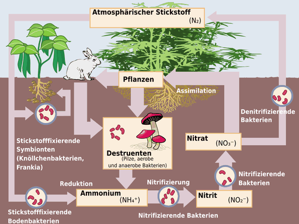
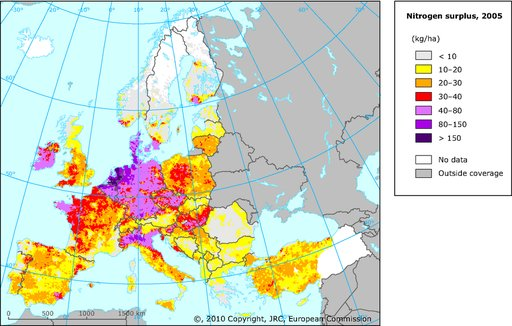

# Stickstoffkreislauf

Der **Stickstoffkreislauf** oder **Stickstoffzyklus** ist die stetige Wanderung und biogeochemische Umsetzung des Bioelementes Stickstoff in der Erdatmosphäre, in Gewässern, in Böden und in Biomasse.

## Hintergrund

In der Erdatmosphäre befinden sich 1015 Tonnen Stickstoff, fast ausschließlich als molekularer Luft-Stickstoff (N2). Andere stickstoffhaltige Gase in der Atmosphäre, wie z. B. die Stickoxide und Ammoniak spielen demgegenüber mengenmäßig keine große Rolle, wohl aber als Luftverunreinigungen. Diese Gase gelangen als Nebenprodukte von oxidativ verlaufenden Prozessen bei Bränden und Explosionen (Blitzschlag, Vulkanismus, Verbrennungsmotoren) oder bei reduktiv verlaufenden Abbauprozessen (Ausscheidungen, Fäulnis) als Luftverunreinigungen in die Atmosphäre. Als wasserlösliche Verbindungen werden diese Gase durch den Regen ausgewaschen, nehmen dann am Stickstoffkreislauf teil, können aber allein den Stickstoffbedarf von Pflanzen und anderen Lebewesen bei Weitem nicht decken.

Stickstoff muss von allen Lebewesen aufgenommen werden, denn das chemische Element Stickstoff ist Bestandteil von Aminosäuren in Proteinen, von Nukleinsäuren, von speziellen Lipiden, wie den Sphingolipiden und von weiteren essentiell benötigten Substanzen. Für Wachstum und Unterhalt müssen deshalb alle Lebewesen stickstoffhaltige Verbindungen mit der Nahrung aus der Umgebung aufnehmen (Stickstoff-Assimilation). Durch die Ausscheidungen der Lebewesen und nach ihrem Tod wird der Stickstoff aus der toten Biomasse wieder freigesetzt, letztlich ebenfalls in Form von stickstoffhaltigen Verbindungen. Im Mittelpunkt des Stickstoffkreislaufs in den Oberflächenschichten der Erde stehen also Lebewesen.

Dass der Stickstoffkreislauf trotz seiner Engpässe funktioniert, zeigen Stoffbilanzen und Abschätzungen. Demnach wurde der verfügbare Stickstoff während der Erdgeschichte im Durchschnitt schon 900- bis 1000-mal von Lebewesen in ihren Körper eingebaut und wieder ausgeschieden, während er jedoch rund 900.000-mal ein- und ausgeatmet wurde, ohne dass er dabei chemisch verändert wurde. Zum Vergleich: Der Luft- und ozeanische Sauerstoff der Erde wurde bisher im Durchschnitt rund 60-mal von der „Fabrik Leben“ benutzt, in Biomasse eingebaut und wieder ausgeschieden.

Die Moleküle des Elementes Stickstoff N2 bestehen aus je zwei kovalent über eine Dreifachbindung miteinander verbundenen Stickstoffatomen. Da die Dreifachbindung nur unter hohem Energieaufwand aufgebrochen werden kann, ist das Molekül N2 sehr reaktionsträge und kann weder von Pflanzen noch von Tieren direkt für die Biosynthese z. B. von Proteinen und den anderen essentiellen Produkten genutzt werden. Nur spezielle Bakterien, insbesondere Cyanobakterien, Knöllchenbakterien, und einige in Symbiose mit derartigen Bakterien an bzw. in ihren Wurzeln lebenden Pflanzen (Leguminosen, wie z. B. Erbsen, Bohnen, Linsen, Luzerne, Lupine) können den Luft-N2-Stickstoff nutzen (siehe Diazotrophie und Stickstofffixierung) und in komplexe stickstoffhaltige Verbindungen wie z. B. Aminosäuren und Proteine umwandeln. Andere Pflanzen sind auf die Zufuhr einfacher, wasserlöslicher Stickstoffverbindungen, wie z. B. Ammonium (NH4+), Nitrat (NO3−)-Ionen oder Harnstoff, als Stickstoffquelle angewiesen und müssen diese Verbindungen über Düngemittel oder Gülle zugeführt bekommen.

### Stickstofffixierung

→ *Hauptartikel: Stickstofffixierung*

Im Zusammenhang mit dem Ablauf des natürlichen Stickstoffkreislaufs versteht man unter **Stickstofffixierung** die Umwandlung des gasförmigen, molekularen, chemisch inerten Luft-Stickstoffs (N2) in wasserlösliche Stickstoff-Verbindungen, die von Pflanzen und anderen Lebewesen aufgenommen werden können. Damit ist die Stickstofffixierung der erste und grundlegende Vorgang im Rahmen des Stickstoffkreislaufs. Man schätzt die Menge des jährlich fixierten Stickstoffs auf über 120 Millionen Tonnen.

Stickstofffixierung kann *biotisch* oder *abiotisch* erfolgen:

- Abiotisch:
  - bei der oxidativen Bildung von wasserlöslichen Stickoxiden (Nitrit und Nitrat), die als Nebenprodukte bei Verbrennungen, Explosionen (Automotoren) oder Blitzschlag entstehen
  - technisch (Haber-Bosch-Verfahren) bei der reduktiven Bildung von Ammoniak bzw. von wasserlöslichen Ammoniumverbindungen

Diese Produkte sind Bestandteile von Stickstoffdünger.

- Biotisch, durch bestimmte freilebende oder in Symbiose mit Pflanzen lebende Mikroorganismen. Mehrere Gruppen von Prokaryoten sind zur biotischen Stickstofffixierung in der Lage:
  - freilebend aerob: Cyanobakterien (früher auch als „Blaugrüne Algen“ oder „Blaualgen“ bezeichnet), Bakterien der Gattung Azotobacter
  - freilebend anaerob: Bakterien der Gattung Clostridium, grüne photosynthetische Bakterien, Methanobacterium (Archaea)
  - In Symbiose mit Pflanzen: Bakterien der Gattungen Frankia (Ordnung Actinomycetales) und Bradyrhizobium und die sogenannten Knöllchenbakterien aus der Familie der Rhizobiaceae. Rhizobium-Bakterien etwa fixieren N2 in Symbiose mit Schmetterlingsblüten-Gewächsen (Fabaceae). Frankia-Bakterien leben in Symbiose mit verschiedenen Arten der Erle, beispielsweise *Alnus glutinosa*, aber auch mit dem Sanddorn oder der exotischen Kasuarina *Casuarina equisetifolia*

### Nitrifikation

→ *Hauptartikel: Nitrifikation*

In einem zweistufigen, aerob verlaufenden Prozess können zwei Gruppen von Bakterien, Nitritbakterien (z. B. *Nitrosomonas*) und Nitratbakterien (z. B. *Nitrobacter*), unter Energiegewinn Ammoniak über die Zwischenstufe Nitrit zu **Nitrat** oxidieren:

### Stickstoffassimilation

Pflanzen können Ammonium (NH4+) assimilieren, bevorzugen aber meist Nitrat (NO3−), wobei der Boden nicht angesäuert wird.
Die anorganischen Stickstoffverbindungen Ammonium und Nitrat werden von Pflanzen und Mikroorganismen aufgenommen und zum Aufbau von stickstoffhaltigen organischen Verbindungen, zum Beispiel Proteinen und Nukleinsäuren, verwendet.

### Ammonifikation

→ *Hauptartikel: Ammonifikation*

Durch Primärproduzenten sowie Primär- und Sekundärkonsumenten (s. Nahrungskette) wird ständig organisches Material in Form stickstoffhaltiger Exkremente oder abgestorbener Materie produziert. Den darin enthaltenen Stickstoff können Destruenten (Zersetzer) wie Pilze und Bakterien als Ammoniak (NH3) bzw. als Ammonium-Ionen (NH4+) freisetzen. Diese stehen dann dem Ökosystem als anorganische Mineralstoffe zur Verfügung und können von autotrophen Organismen (Pflanzen u. a.) verwertet werden.

### Nitratreduktion zu Nitrit

Wenn unter anoxischen Bedingungen kein Sauerstoff zur Verfügung steht, können bestimmte Bakterien anstelle von Sauerstoff (O2) Nitrat als Oxidationsmittel für die Oxidation von organischen Stoffen als energieliefernde Reaktion nutzen. Nitrat wird dabei zu Nitrit (NO2−) reduziert, das auf manche Organismen giftig wirkt.

### Denitrifikation

→ *Hauptartikel: Denitrifikation*

Denitrifizierende, fakultativ anaerobe Bakterien wie z. B. Arten der Gattungen Pseudomonas, Paracoccus, Flavobacterium, können – wenn unter anoxischen Bedingungen kein Sauerstoff zur Verfügung steht – Nitrat und auch Nitrit als Oxidationsmittel für die Oxidation organischer Stoffe oder von H2 nutzen und auf diese Weise Energie gewinnen, wobei Nitrat und Nitrit über mehrere Zwischenstufen zu elementarem N2 reduziert werden, der schließlich zum größten Teil wieder in die Atmosphäre entweicht. Da es sich bei diesen Prozessen in weitestem Sinn um Formen anaerober Atmung handelt, werden sie zuweilen zusammenfassend auch als *Nitratatmung* bezeichnet.

## Bedeutung der Umsetzungen

Die Umsetzungen im Stickstoff-Kreislauf bewegen jährlich insgesamt 250-300 Mio. t Stickstoff, was aber nur ein Millionstel des Stickstoffs in der Atmosphäre ausmacht. Die erheblichen Emissionen von gesundheitsgefährdenden Stickoxiden als Nebenprodukte von Verbrennungen (Kraftfahrzeuge) und die Emissionen von Ammoniak aus Düngemittelproduktion und Tierhaltung können zu Umweltproblemen führen. Die verschiedenen N-O- und N-H-Verbindungen können durch Stickstoffdeposition eine Eutrophierung (Überdüngung) von Böden und Gewässern bewirken. Durch Nitratauswaschung aus überdüngten Böden wird das Grundwasser belastet. Darüber hinaus wirken Stickoxide als Säurebildner („Saurer Regen“).

## Stickstoffkreislauf in Seen

Der in organischen Stoffen, zum Beispiel in toter Biomasse, gebundene Stickstoff wird durch Destruenten in der tropholytischen Schicht zu Ammonium (NH4+) umgewandelt. Unter aeroben Verhältnissen oxidieren aerobe Bakterien das freigesetzte Ammonium bei der Nitrifikation zu Nitrit (NO2−) und weiter zu Nitrat (NO3−).

In Wasser setzt sich Ammoniak mit Wasser zu Ammonium-Ionen (NH4+) um, wodurch OH-Ionen entstehen und deshalb der pH-Wert ansteigt:

Liegen anaerobe Verhältnisse vor, wie zum Beispiel durch die Sauerstoffzehrung aerober und fakultativ anaerober Mikroorganismen, können bestimmte anaerobe Bakterien Nitrat über Nitrit zu Ammonium reduzieren. Dieser Vorgang wird als *Nitratammonifikation* bezeichnet. Andere Bakterien wandeln Nitrat bei der Denitrifikation zu Stickstoff (N2) um, indem sie es für ihren oxidativen Energiestoffwechsel als Oxidans verwenden. Das entstandene N2 wird freigesetzt und gelangt dadurch in die Atmosphäre.

In der trophogenen Schicht entzieht Phytoplankton Stickstoff aus dem noch vorhandenen Nitrat und Ammonium für die Synthese körpereigener Stoffe, zum Beispiel Proteine und Nukleinsäuren. Dadurch wird also neue Biomasse produziert. Diese Biomasse gelangt nun in die Nahrungskette. Konsumenten 1. und 2. Ordnung geben das beim Abbau organischer Stoffe gebildete Ammoniak wieder in den Stickstoffkreislauf ab.

Zusätzlich binden einige Bakterien, zum Beispiel einige Arten von Cyanobakterien, elementaren Stickstoff N2 durch Reduktion zu NH3 (*Stickstoff-Fixierung*). Durch Absterben dieser Bakterien gelangt zusätzlich Stickstoff in den Kreislauf.

Der Stickstoffkreislauf ist nun geschlossen.

## Bedeutung des Stickstoff-Kreislaufs in Fischteichen

1. Zu viele Fische, Fütterung, Pflanzenreste und Laub reichern das Teichwasser mit organischem Material an, in dem Stickstoff-Verbindungen enthalten sind. Auch zum Nachfüllen verwendetes Regenwasser aus Zisternen, Pollenflug und Gartendünger tragen zur *Überdüngung* des Teiches bei.
2. Mikroorganismen zersetzen die Biomasse unter Verbrauch von Sauerstoff und setzen dabei den enthaltenen Stickstoff als Ammonium bzw. giftiges Ammoniak frei. Ab pH-Wert 8,5 liegt davon so viel als Ammoniak vor, dass es für Fische bedrohlich ist; (das pH-Optimum liegt bei 7–8).
3. Die nitrifizierenden Bakterien, z. B. Bakterien der Gattungen Nitrosomonas und Nitrobacter, oxidieren beides unter oxischen Bedingungen zu Nitrat (Nitrifikation). Dieses Endprodukt des Eiweißabbaus ist wichtiger Mineralstoff aller Pflanzen und für Fische ungefährlich.
4. Durch Pflanzenreste kommt totes organisches Material in den Teich, wodurch der Kreislauf geschlossen wird.

**Auswirkungen von Störungen**

1. Die Teichpflanzen können das Nitrat meist nur teilweise verbrauchen. Die überschüssige Menge wird bei jedem Kreislauf größer und überdüngt das Wasser. Algen nehmen überhand und trüben den Teich.
2. Ist der Überschuss aufgebraucht, sterben die meisten Algen ab. Ihre Zersetzung durch Mikroorganismen verbraucht viel Sauerstoff, vor allem nachts. Wenn die Fische an der Oberfläche nach Luft schnappen, ist dies ein sicherer Hinweis auf Sauerstoffmangel.
3. Unter anoxischen Bedingungen, die im Sediment (Schlamm) oder – bei starker Sauerstoffzehrung infolge starker Belastung mit organischen Stoffen – auch im Wasserkörper herrschen können, reduzieren viele Bakterien Nitrat zu Nitrit, das für Fische giftig ist.

**Behebung der Störungen**

1. Sauerstoffmangel lässt sich technisch beheben, indem Sauerstoff aus der Luft eingebracht wird, z. B. durch Umpumpen des Wassers, Wasserspiele, Bachläufe und Quellsteine.
2. Dennoch bleibt das Wasser trüb, weil die überschüssigen Mineralstoffe noch im Wasser sind und zur nächsten Algenblüte führen. Darum ist das überschüssige Nitrat zu entfernen – etwa durch bakterielle Denitrifikation.

## Zur Situation in Deutschland

In Deutschland werden jährlich im Mittel 20 bis 40 Kilogramm Stickstoff je Hektar über den Luftweg als Stickstoffdeposition eingetragen; zu etwa gleichen Teilen in reduzierter und oxidierter Form. Dieses Überangebot an Stickstoff ist eine Hauptgefährdung der Biodiversität, da an Stickstoffmangel angepasste Arten durch nitrophile Arten verdrängt werden. Über 70 Prozent der in Deutschland auf der Roten Liste stehenden Gefäßpflanzen sind Stickstoff-Mangelanzeiger. Hinzu kommt der Eintrag durch Stickstoffdünger in der Landwirtschaft.

Am 28. April 2016 hat die EU-Kommission eine seit Jahren vorbereitete Klage gegen Deutschland wegen der Nicht-Einhaltung der Nitrat-Richtlinie an den Europäischen Gerichtshof übermittelt. Seit Jahren werden in Deutschland die Grenzwerte für Nitrat in Gewässern überschritten. Nach Einschätzung der EU-Kommission unternimmt die Bundesregierung dagegen nicht genug. Die 2016 diskutierte Düngeverordnung gilt als Indiz dafür.
