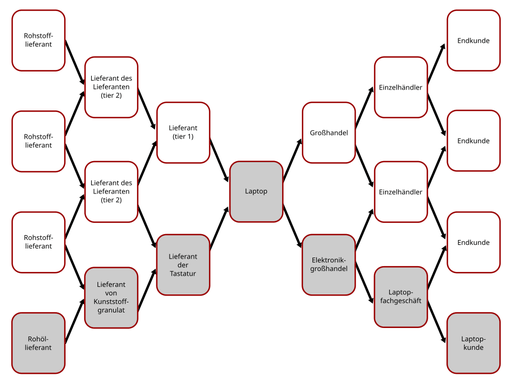

# Supply-Chain-Management

Das **Lieferkettenmanagement** oder **englisch Supply-Chain-Management (SCM)** umfasst alle Prozesse zur Planung, Steuerung, Überwachung, Dokumentation und Optimierung der Lieferkette eines Unternehmens oder einer Organisation. Dies beinhaltet Aktivitäten von der Beschaffung von Ausgangsmaterialien über die Produktion bis hin zum fertigen Produkt oder zur Dienstleistung (Service) und deren Auslieferung an die Kunden. Mittels bestimmter Management-Konzepte und Methoden versucht das SCM, den dynamischen Ablauf bzw. Pfad entlang dieser Kette zu kontrollieren, steuern und zu verbessern. Man spricht auch von einer Wertschöpfungslehre entlang einer Wertschöpfungskette.

Lieferkettenmanagement kommt in zahlreichen zivilen Wirtschaftsbranchen zum Einsatz, aber auch in militärischen Organisationen, wie beispielsweise in Gestalt der Defense Logistics Agency (DLA) des Department of Defense (DOD). Mehr dazu siehe die Militärlogistik. Lieferkettenmanagement kann auch innerhalb eines einzelnen Unternehmens über verteilte Standorte wie Produktion, Wartung, Service und Logistik hinweg stattfinden. Darüber hinaus wird das Thema von Ökonomen akademisch erforscht.

Im folgenden Artikel wird die Abkürzung SCM synonym für Lieferkettenmanagement verwendet.

## Lieferkettenmanagement im Überblick

Lieferkettenmanagement ist die systematische und integrierte Ausübung von Managementprozessen mit verschiedenen strategischen Zielen, wie beispielsweise dem Risikomanagement der Lieferkette, der Reduktion von Kosten, der Steigerung der Resilienz (vgl. auch Resiliente Lieferkette), der Nachhaltigkeit, der Wettbewerbsfähigkeit und der Produktivität. Darüber hinaus umfasst es die zeitnahe, effiziente und effektive Beschaffung von Material in einem internationalen und multidimensionalen Handelsumfeld. Dies ist spätestens seit den 1990er Jahren der Fall.

Zu den Herausforderungen zählen unerwartete Ereignisse (z. B. höhere Gewalt) in der Lieferkette wie abrupte und signifikante Schwankungen bei der Verfügbarkeit, den Preisen, der Qualität oder den Lieferzeiten von Bezugsmaterialien, die den Produktionsprozess oder die Auslieferung beeinträchtigen.

### Datenbasiertes Lieferkettenmanagement

Die moderne Computertechnologie und die Verbreitung des Internets seit den 2000er Jahren haben auch die Methoden des Supply-Chain-Managements (SCM) verändert. Die digitale Transformation und Industrie 4.0 ermöglichen bzw. erfordern eine datenbasierte Lieferkettenverwaltung, um beispielsweise Entscheidungen in Echtzeit treffen zu können. Dazu ist eine umfassende Informationstechnologie (IT) innerhalb eines Unternehmens oder einer Organisation notwendig. Hier spielt Supply-Chain-Management-Software eine weitere Rolle.

### Integration weiterer Disziplinen

Das Supply-Chain-Management (SCM) ist eng verzahnt mit dem Beschaffungsmanagement, Beschaffungslogistik, Einkaufsmanagement, Lieferantenmanagement, Logistik, Qualitätsmanagement, Compliance, Due-Diligence, Vertragsrecht und anderen Geschäftsprozessen. Des Weiteren existieren die Fakultäten Supply-Chain-Engineering, Supply-Chain-Controlling und Supply-Chain-Monitoring.

Weitere verwandte Themengebiete (teilweise auch historisch) sind: Operations Research, Operations Management, Entscheidungstheorie, Wertschöpfung, Enterprise-Resource-Planning (EPR) und Kundenbeziehungsmanagement (CRM).

## Lieferkettemanagement als System

Der Wettbewerb in globalen Märkten, kurze Produkteinführungszeiten, kurze Produktlebenszyklen und hohe Kundenerwartungen haben das Management von Lieferketten ins Zentrum betriebswirtschaftlicher Entscheidungen gerückt.

Sogenannte „arbeitsteilige Lieferketten“ entwickelten sich aufgrund einer Tendenz der Unternehmen sich auf eine Kernkompetenz zu fokussieren. Diese Entwicklung geht einher mit dem Offshoring und Outsourcing sowie einer Verringerung der Fertigungstiefe und dem Bezug von Vorprodukten von Zulieferern oder Lieferanten.

Im Ergebnis konkurrieren auf den jeweiligen Zielmärkten nicht vertikal integrierte Einzelhersteller bzw. vollintegrierte Unternehmen, sondern stattdessen komplex strukturierte Lieferketten, die sich aus verbundenen, aber unabhängigen Unternehmen zusammensetzen.

Wettbewerbsvorteile erlangen solche dezentral organisierten Systeme durch eine marktadäquate Konfiguration ihrer Struktur sowie durch Koordination und Integration der autonom gesteuerten Aktivitäten in der Lieferkette. Diese Überlegung hat zum Lieferkettenmanagement geführt. Supply-Chain-Managements (SCM) geht damit über die klassische Ausrichtung der Betriebswirtschaftslehre am System „Unternehmen“ hinaus und befasst sich mit dem System „Lieferkette“.

Die besonderen Eigenschaften des Gesamtsystems „Lieferkette“ ergeben sich aus dem dynamischen Zusammenwirken der Lieferkettenglieder. Diese Systemeigenschaften lassen sich nicht aus der Summe der allein auf die einzelnen Unternehmen bezogenen Eigenschaften der beteiligten Einzelglieder ableiten. Vielmehr treten als Ergebnis der komplexen, dynamischen Interaktion der Einzelglieder neue Eigenschaften des Gesamtsystems hervor (Emergenz).

## Lieferkettenmanagement als Wissenschaft

Die wissenschaftliche Auseinandersetzung mit dem Lieferkettenmanagement stützt sich deshalb, was die mathematische Seite anbelangt, u. a. auf die Erkenntnisse der Systemtheorie sowie der Chaos- und Komplexitätsforschung. Aus betriebswirtschaftlicher Sicht finden bei der Analyse von Lieferkettenmanagement-Problemstellungen Erklärungsansätze der neuen Institutionenökonomik (Transaktionskostentheorie, Theorie der Verfügungsrechte, Prinzipal-Agent-Theorie) sowie der Ressourcenorientierung Anwendung. Ein anderer Ansatz zur Beschreibung des Systems Lieferkette ist die Beziehungsorientierung (*relational view*), die sich aus der Ressourcenorientierung entwickelt hat.

## Geschichte

Das Konzept des Lieferkettenmanagement wurde erstmals in den 1980er Jahren von den Beratern Oliver und Webber verwendet. Oliver war zu der Zeit der verantwortliche Partner in London bei Booz Allen Hamilton für Operations Management. Er hatte die Grundidee und der Physiker und später Berater Wolfgang Partsch setzte Konzept als Projektleiter bei Landis & Gyr in Zug (Schweiz) im Jahre 1981 um. Dies war zugleich das erste offizielle Supply-Chain-Management-Projekt der Welt. Dabei entwickelte Partsch auch die damalige Analyse-Methodik.

## Definitionen

Für das Lieferkettenmanagement, auch Supply-Chain-Management (SCM) genannt, existieren einige Definitionen, die sich im Laufe der Zeit verändert haben. Bislang konnte sich keine dieser Definitionen endgültig durchsetzen. Gemeinsam haben typische Definitionen Begriffen wie Koordination und Integration. Die Definitionen betonen die Harmonisierung von Abläufen zwischen den Mitgliedern der Lieferkette. Sie stellen funktionsübergreifende Geschäftsprozesse in den Mittelpunkt, um Wertschöpfungsvorteile für die gesamte Lieferkette zu erzielen.

Die folgende Punkteliste enthält eine Sammlung und Auswahl verschiedener Definitionen:

- Eine frühe, flussorientierte Definition stammt von Cooper und Ellram (1990). Demnach ist Supply-Chain-Management ein integrativer Ansatz, um den Gesamtfluss eines Absatzkanals (englisch distribution channel) vom Lieferanten bis zum Endkonsumenten zu steuern.
- Eine mehr auf das Netzwerk gerichtete Definition stammt von Harland (1996). Demnach ist Supply-Chain-Management das Management eines Netzwerks miteinander verbundener Betriebe, die an der letztlichen Bereitstellung von Produkt- und Dienstleistungspaketen beteiligt sind, die vom Endkunden angefordert werden.
- Die Enzyklopädie Britannica definiert Supply-Chain-Management (SCM) als „Prozess der Steuerung des Flusses von Ressourcen, Aktivitäten und Personen, die an der Produktentwicklung beteiligt sind – von der Produktion oder Beschaffung der Rohstoffe bis hin zum Verkauf und der Auslieferung des Endprodukts.“

- Der Council of Supply Chain Management Professionals (CSCMP) definiert (2026) Supply-Chain-Management wie folgt:

> „Supply chain management encompasses the planning and management of all activities involved in sourcing and procurement, conversion, and all logistics management activities. Importantly, it also includes coordination and collaboration with channel partners, which can be suppliers, intermediaries, third party service providers, and customers. In essence, supply chain management integrates supply and demand management within and across companies.“

> „Das Supply-Chain-Management umfasst die Planung und Steuerung sämtlicher Aktivitäten im Zusammenhang mit Beschaffung, Fertigung sowie dem gesamten Logistikmanagement. Von wesentlicher Bedeutung ist dabei auch die Koordination und Zusammenarbeit mit Partnern in der Wertschöpfungskette – etwa Lieferanten, Zwischenhändlern, externen Dienstleistern und Kunden. Im Kern integriert das Supply-Chain-Management das Management von Angebot und Nachfrage sowohl innerhalb von Unternehmen als auch unternehmensübergreifend.“

– CSCMP’s Definition of Supply Chain Management (2026)

- Eine Definition nach Mentzer et al. (2001) definiert Lieferkettenmanagement als:

> „...innerbetrieblich und entlang der Lieferkette auch zwischenbetrieblich die auf das Gesamtsystem ausgerichtete strategische Koordinierung zwischen den traditionellen Geschäftsfunktionen und den taktischen Entscheidungen zwischen diesen Geschäftsfunktionen mit dem Ziel der Verbesserung der langfristigen Leistungsfähigkeit der einzelnen Unternehmen und der Lieferkette als Ganzes.“

- Eine weitere deutsche Definition existiert in Gablers Wirtschaftslexikon, siehe dort.

### Standardisierung und SCM-Modell

Der 1996 gegründete Supply-Chain Council (SCC) hat das SCOR-Modell zu einem Standard entwickelt hat, um die Supply-Chain-Funktionen nach einheitlichen Kriterien zu strukturieren und damit auch bewerten zu können. SCC ging 2014 in der Association for Supply Chain Management (ASCM) auf, welche das Modell heute weiter vertritt.

### „Breite“ und „Tiefe“ des Supply-Chain-Managements

Lieferkettenmanagement bzw. Supply-Chain-Management (SCM) ist „breit“ aufgestellt, da es unterschiedliche Geschäftsfunktionen verzahnt, darunter Logistik, Produktion, Qualitätsmanagement, Rechnungswesen und andere Geschäftsprozesse. Durch diese breite Betrachtung verschwimmen die Grenzen zwischen den traditionellen Geschäftsfunktionen und SCM. Es ist „tief“ strukturiert, da es die strategische, taktische und operative Phase des Managements umfasst:

- Die erste Phase wird als strategisches Supply-Chain-Management bezeichnet. Sie ist durch Unternehmensentscheidungen mit langfristigen Auswirkungen gekennzeichnet. Hierzu zählen Entscheidungen bezüglich Auslagerung (outsourcing), Lieferantenwahl und Standortplanung für Lager und Fabriken. Wesentlich in dieser Phase ist die Auswahl einer passenden Supply-Chain-Strategie entsprechend den Produkt- und Marktanforderungen. Um diese Bedeutung und die Bedeutung des Supply-Chain-Engineerings in dieser Phase zu betonen, wird sie auch Supply-Chain-Strategie- oder -Design-Phase genannt.
- Die zweite Phase wird als taktisches Supply-Chain-Management bezeichnet. Vorbestimmt durch das in der vorhergehenden Phase festgelegte Design, werden hier Entscheidungen mit einem Zeithorizont zwischen einem Vierteljahr und einem Jahr getroffen. Dieser kürzere Zeitrahmen erlaubt bessere Vorhersagen als Grundlage für die Entscheidungen. Hierzu zählen Entscheidungen bezüglich Bestandspolitik, Fertigungsmenge, Beziehungen der zu versorgenden Märkte und Orte, von denen beschafft werden soll. Diese Phase wird auch als Supply-Chain-Planungsphase bezeichnet, da hier Fertigungspläne erstellt werden.
- Die dritte Phase wird als operatives Supply-Chain-Management bezeichnet. Sie ist durch Unternehmensentscheidungen in einem Zeitrahmen auf Tages- bis Wochenbasis gekennzeichnet, in dem kaum Unsicherheit über Nachfrageinformationen besteht. Das Supply-Chain-Design aus der ersten Phase und die Pläne aus der zweiten Phase werden als gegeben hingenommen, um in dieser Phase nun eingehende Kundenaufträge angemessen zu handhaben. Zu typischen Entscheidungen in dieser Phase zählen jene über Ablaufplanung, Picklisten, Verladung und Beziehungen zwischen Bestellung und Bestand.

## Abgrenzung zur Logistik

→ *Hauptartikel: Logistik*

Lieferkettenmanagement bzw. Supply-Chain-Management (SCM) und Logistik werden gelegentlich synonym verwendet. In der Tat zielen SCM wie Logistik auf die Gestaltung von Objektflüssen (Güter, Informationen, Werte) entlang der Prozessstufen der Lieferkette, wobei sie auf eine Steigerung des (End-)Kundennutzens (Effektivität) und auf eine systemweite Verbesserung des Kosten-Nutzen-Verhältnisses (Effizienz) zielen.

Insbesondere bei Transport und Lagerhaltung im Unternehmen macht der Übergang zum modernen Supply-Chain-Management einen qualitativen Sprung. Während die Logistik die Objektflüsse weitgehend unabhängig von institutionellen Fragestellungen betrachtet, bezieht das SCM die Strukturierung und Koordination autonom agierender unternehmerischer Einheiten in einem Wertschöpfungssystem explizit in die Analyse ein. Das SCM betont somit in Abgrenzung zur Logistik den interorganisationalen Aspekt der logistischen Management-Aufgabe. Das Supply-Chain-Management kann vielmehr als ein neuer Ansatz der Betriebswirtschaftslehre angesehen werden, der sich auch über die Grenzen des Betriebes erstreckt. Er beinhaltet nicht nur die Logistik, sondern alle anderen Felder der Betriebswirtschaftslehre z. B. Marketing, Produktion, Unternehmensführung, Unternehmensrechnung und Controlling.

Internationale Autoren vertreten eine „unionistische“ Perspektive, nach der die Logistik ein Bestandteil des sowohl *breiten* als auch *tiefen* SCM sei (siehe nächster Unterabschnitt). Der im deutschsprachigen Raum verbreitete Ansatz einer betriebswirtschaftlich ausgerichteten Logistik beinhaltete dabei oft bereits ein ganzheitliches Management entlang der gesamten Wertschöpfungskette, bevor sich die englische Betitelung *Supply-Chain-Management* durchsetzte.

## Problemstellungen des Lieferkettenmanagement

Typische Problemstellungen des Lieferkettenmanagement bzw. Supply-Chain-Management (SCM) entstehen beispielsweise aus dem Peitscheneffekt. Der zweite Unterabschnitt gibt eine systematische Übersicht.

### Peitscheneffekt – Bullwhip Effect

→ *Hauptartikel: Peitscheneffekt (Supply-Chain-Management)*

Eine bekannte Beobachtung im SCM stammt von Procter & Gamble: Bei der Betrachtung der Bestellungen für Windeln, deren Nachfrage vom Endverbraucher aufgrund des täglichen Bedarfs der Säuglinge recht konstant verläuft, fiel dem Unternehmen auf, dass die Bestellzahlen im Einzelhandel – und noch stärker im Großhandel – schwanken. Am stärksten pflanzten sich diese Schwankungen zu den Lieferanten der Materialien fort, die in den Windeln verarbeitet werden. Dieses Phänomen der Aufschaukelung von Bestellschwankungen in vorgelagerter Richtung der Lieferkette tritt in vielen Branchen auf und wird als Peitscheneffekt (englisch bullwhip effect) bezeichnet. Es ist für das SCM derartig bedeutend, dass es auch als „erstes Gesetz dynamischer Lieferketten“ bezeichnet wurde. Es lassen sich insbesondere vier Ursachen für den Peitscheneffekt identifizieren:

- Verarbeitung von Nachfragesignalen: Hierbei wird die beobachtete Nachfrage als Signal für die zukünftige Nachfrage aufgefasst, was oft jedoch nicht der Fall ist.
- Auftragsbündelung: Aufgrund von Transaktionskosten ist eine Bestellung in jeder Periode oft nicht wirtschaftlich, sodass sich eine Bündelung von Aufträgen lohnt. Dies führt zu Prognoseproblemen in vorgelagerte Richtung der Lieferkette.
- Engpasspoker: Ein Lieferant rationiert proportional zu den Bestellungen seiner Kunden aufgrund eines Lieferengpasses die Lieferungen, wodurch die Kunden zur Erhöhung ihrer Ration mehr bestellen als sie benötigen.
- Preisschwankungen: Vermutet ein Abnehmer steigende Preise, so ist damit zu rechnen, dass die derzeitige Nachfrage steigt und sich der Abnehmer Vorräte anlegt, die nicht auf die aktuelle Nachfragesituation abgestimmt sind.

Es wurden zahlreiche Gegenmaßnahmen vorgeschlagen, von denen der gemeinsame Zugriff auf Informationen über Bestellzahlen durch alle Mitglieder der Lieferkette eine bedeutende Rolle einnimmt. Im Zusammenhang mit der Bedarfsermittlung für Kaufteile wird die Fortschrittszahl als eine Methode vorgeschlagen, den Peitscheneffekt zu vermeiden, da hier die Lieferanten mit dem Hersteller über gemeinsame kumulative Bedarfszahlen verbunden sind.

### Übersicht über Problemstellungen des Supply-Chain-Managements

- Kooperation und Wettbewerb zwischen den Mitgliedern einer Supply Chain (können dezentral gesteuerte Supply Chains wettbewerbsfähiger sein als vertikal integrierte Wettbewerber – und warum?)
- Allokation von Leistungsprozessen und Dispositionsrechten sowie von Kosten- und Finanzierungslasten bzw. -risiken und die Verteilung von Wertschöpfungsanteilen in der Supply Chain
- Konfiguration der Prozessstrukturen in der Supply Chain
- Nutzung und Ausgestaltung alternativer Koordinationsformen: bspw. durch zentrale Planung mittels zweckmäßig konstruierter Anreizsysteme und abgestimmten Zielen, Performance Management und Performance Measurement Systemen, durch systemweite Informationstransparenz oder durch unternehmensübergreifendes, organisatorisches Lernen mit entsprechender Verhaltensanpassung der autonom handelnden Einheiten
- Abbau von Fehlerquellen und Störpotenzialen an den Schnittstellen der Supply-Chain-Glieder (Qualitätsmanagement); Robustheit der Supply Chain gegen Störungen
- Bewältigung der Nachteile ungleich verteilten Wissens und verzerrter Informationsausbreitung in der Supply Chain (Informationsasymmetrien); beispielhaft durch den so genannten Peitscheneffekt *(bullwhip effect)* zum Ausdruck gebracht
- Ganzheitliches Bestandsmanagement für mehrstufige Lagerhierarchien (Echelon Inventory Planning)
- Bewältigung von Komplexität und Variantenvielfalt in der Supply Chain (insbesondere Postponement und Entkopplungspunkt)

## Praktische Umsetzung des Lieferkettenmanagement

Als früher Ausdruck der Hinwendung der Industrie zu Lieferkettenmanagement- bzw. Supply-Chain-Management (SCM)-Konzepten kann die etwa 1980 einsetzende Just-in-time-Produktion (JIT) angesehen werden. JIT zielt auf eine zeitlich eng koordinierte Kopplung der Produktionsprozesse von Hersteller und Lieferant. Besondere Beachtung fand dieses Konzept in der Automobilindustrie. Voraussetzung für eine erfolgreiche Umsetzung des JIT-Gedankens waren neben der gezielten Flexibilisierung und qualitativen Stabilisierung der Leistungsprozesse auf der Lieferseite insbesondere die logistische Kopplung der Produktionsprozesse von Lieferant und Hersteller über die Verbrauchsermittlung, unter weitgehendem Verzicht auf Lagerbestände als Problempuffer, sowie unter Verwendung standardisierter Ladungsträger und Prozesse. Exemplarische Bedeutung hat in diesem Zusammenhang die aus Japan kommende Kanban-Steuerung erlangt (Pull-Prinzip in der Produktionssteuerung).

Im Handel und in der Konsumgüterindustrie manifestiert sich das SCM insbesondere als Teil des Efficient-Consumer-Response-Konzeptes (ECR). Hierbei handelt es sich um eine branchenweite Initiative zur optimalen Angebotsstruktur für Konsumenten in Handelshäusern bei gleichzeitiger Rationalisierung von Supply-Chain-Prozessen. Das Konzeptgebäude stützt sich auf ein Set spezifischer Basistechnologien (z. B. Barcodes, Standards für den elektronischen Datenaustausch), logistischer Standardprozesse (z. B. Cross-Docking, Vendor Managed Inventory oder Co-Managed Inventory) und einen Prozess marketingorientierter Angebotsoptimierung: Category Management, die in einem übergreifenden gemeinsamen Planungsprozess (Collaborative Planning, Forecasting and Replenishment) verknüpft sind.

Eine branchenübergreifende Initiative maßgeblicher Großunternehmen hat mit der Erarbeitung des „Supply-Chain Operations Reference“-Modells (SCOR-Modell) die Grundlage für die modellhafte Darstellung, die Leistungsmessung und den Leistungsvergleich sowie für das Reengineering von Supply-Chain-Prozessen geschaffen. Das SCOR-Modell will die Kommunikation über Supply-Chain-Strukturen und Supply-Chain-Prozesse zwischen den beteiligten Unternehmen erleichtern, indem es einen allgemeinen begrifflichen und konzeptionellen Bezugsrahmen hierfür schafft.

Zunehmenden Einsatz finden spezifische Software-Systeme, die auf die operative Planung und Steuerung der Supply-Chain-Aktivitäten gerichtet sind. Diese Systeme werden bspw. als Advanced Planner and Optimizer (APO), Advanced Planning and Scheduling (APS) oder auch als Enterprise Resource Planning-II-Systeme bezeichnet. Als Betreiber solcher Planungssysteme bieten sich insbesondere große elektronische Marktplätze an.

Supply-Chain-Management-Software tendiert neuerdings dazu, den Zustand der Lieferkette nahezu in Echtzeit darzustellen. Dazu werden die Güter entlang der Kette an bestimmten Übergabepunkten mit Hilfe von BDE-Systemen erfasst. Dies kann z. B. durch Scannen eines individuellen Barcodes oder durch Lesen eines RFID-Tags erfolgen. Durch die Möglichkeit der Verknüpfung dieser Echtzeitdaten mit im System hinterlegten Sollzeiten besteht die Möglichkeit, mit Hilfe eines Supply Chain Event Management (SCEM) gezielt in das Logistiksystem eingreifen zu können.

In letzter Zeit wird zunehmend auch die explizite Betrachtung finanzieller Aspekte des SCM im Rahmen der Supply-Chain-Finanzierung diskutiert. Hierbei geht es darum, das Anlage- und Umlaufvermögen in Supply Chains so zu finanzieren, dass die Kapitalkosten der beteiligten Unternehmen minimiert wird.

## Grenzen des Lieferkettenmanagements

Die Transportkosten sind durch die Liberalisierung und das Ausflaggen gesunken, daher spielt der Transportaufwand pro Volumen- oder Masseneinheit oft keine Rolle in der Planung. Besonders JIT-Systeme erzeugen aber zwei wesentliche Probleme in der Praxis:

- durch KEP-Dienste und kleinteilige Lieferungen überlastete Docks und Laderampen
- durch lange und häufige Transportvorgänge verletzliche Strukturen (Verkehrsstaus, Streiks, Naturgewalten, …)

Telematik-Systeme können hier die Symptome lindern, ohne allerdings die auslösenden Probleme zu kurieren. Abhilfe wird durch klare Vorgaben geschaffen, die Druck zur Kooperation unter den Zulieferern ausüben und eine Risikominimierung durch Einführung zusätzlicher Kriterien bei der Planung der Wertschöpfungskette. Regionale Zukäufe verringern die Latenzzeiten, erhöhen also die Regelbarkeit des Systems und vermindern das Risiko langer Transportwege.

- Mangelnde Absprache zwischen Auftraggeber und Lieferer, fehlende und falsche Spezifikationen können trotz eines gut durchdachten Supply-Chain-Managements zu großen Schadensfällen im Feld/beim Kunden führen.

## Verträge zur Optimierung der kompletten Lieferkette

Das ultimative Ziel des SCM ist die Effizienzoptimierung der Lieferkette. Hier kommen mehrere Verfahren zum Einsatz, um das Inventarrisiko zwischen den Beteiligten aufzuteilen und so den Profit der gesamten Lieferkette zu erhöhen. Wenn z. B. der Hersteller eines saisonabhängigen und sich im Trend immer wieder verändernden Produktes (z. B. modische Bekleidungsstücke) einen Einzelhändler beliefert, trägt der Einzelhändler das gesamte Risiko von Leftovers (nicht verkaufter Ware). Diese Ware kann er zwar in der nächsten Saison oder auf einem Sekundärmarkt zu einem reduzierten Preis anbieten, jedoch entstehen dadurch Opportunitätskosten für den geschmälerten Gewinn je verkaufter Einheit. Es kann natürlich auch sein, dass der diskontierte Verkaufspreis unter dem Beschaffungspreis des Einzelhändlers liegt, weshalb der Einzelhändler sogar einen realen Verlust je unverkaufter Produkteinheit erleidet, die er dann später verbilligt anbieten muss. Es ist anzunehmen, dass der Hersteller seine Waren in einem eigenen Laden verkaufen will und so die Gewinnoptimierung der Lieferkette im Fokus hat. Nun können verschiedene Verfahren in Form von Verträgen zwischen Herstellern und Händlern zum Einsatz kommen, um den Gewinn der Lieferkette und den aller Beteiligten zu steigern.

### Rückkaufvereinbarung

Einer dieser Verträge ist der Buy-Back-Vertrag, eine Rückkaufvereinbarung. Bei einer Rückkaufvereinbarung erklärt sich der Hersteller bereit, alle unverkauften Produkteinheiten des Händlers für einen Bruchteil des Beschaffungspreises zurückzukaufen. So kann der Händler eine größere Order des Herstellers bestellen und dennoch ein niedrigeres Risiko von Leftovers genießen. Es gibt mehrere Möglichkeiten, warum der Hersteller einem Buy-Back-Vertrag zustimmen könnte. Zum Beispiel könnte der Hersteller die unverkaufte Ware zurückkaufen wollen, um sein Markenimage zu schützen. Als Hersteller von Designerware will man den Kunden das Gefühl geben, dass die Ware etwas Besonderes ist und dass sie populär ist, um den hohen Preis zu rechtfertigen. Dieses Ziel ist aber nur schwer zu erreichen, wenn gerade diese Kunden am Ende der Saison diese Produkte mit den Niedrigpreisetiketten in den Schaufenstern sehen. Des Weiteren entstehen durch solche Verkäufe am Ende der Saison so genannte „strategische Käufer“, die zwar das Geld haben, um während der Saison die Ware zu kaufen, aber gezielt bis zum Ende der Saison warten, um die Produkte dann verbilligt zu kaufen.

### Revenue-Sharing-Vertrag

Eine weitere Vertragsart ist das Revenue Sharing. Bei diesem Vertrag verkauft der Hersteller dem Händler die Ware zu einem verbilligten Beschaffungspreis und als Ausgleich beteiligt der Händler den Hersteller am Gewinn aus dem Verkauf der Ware.
Zu einem großen Einsatz dieses Verfahrens ist es in der Videoverleih-Industrie gekommen. Früher haben die Filmstudios den Videotheken die Videos für je 60 bis 70 US-Dollar verkauft und die Videotheken durften den gesamten Gewinn behalten. Deshalb mussten die Videotheken bei einer normalen Leihgebühr das Video ca. 20-mal verleihen, bis sich diese Investition amortisiert hatte. Dies führte dazu, dass die Händler bei Filmen nur eine geringe Anzahl an Videos gekauft haben, da die Nachfrage bei neuen Videos in der Regel anfangs sehr hoch ist, später jedoch sehr schnell zu sinken beginnt. Dieser Engpass zwischen Nachfrage und Angebot führte dazu, dass die Kunden sich nach anderen Möglichkeiten zur schnellen Verfügbarkeit neuer Filme umsahen und sie daraufhin z. B. zu Pay-TV Kanälen gewechselt sind. Da die Kosten zur Herstellung eines Videotapes sehr niedrig sind, war es zur Optimierung der gesamten Supply Chain naheliegend, den Videotheken zusätzliche Videotapes zur Verfügung zu stellen. Dies führte zu einer Reduzierung des Beschaffungspreises auf 8 US-Dollar, jedoch mussten die Händler den Studios nun einen 50%igen Anteil am Gewinn abgeben. Dadurch hat sich die Amortisation auf weniger als sechsmaliges Verleihen reduziert und es wurde lukrativ für die Videotheken, mehr Tapes von den Studios zu kaufen. Diese Erhöhung der Verfügbarkeit wurde dann in den USA genutzt für die „Guaranteed to be there“ und „Go home happy“ Marketing-Kampagnen.

### Quantity flexibility contract

Bei diesem Vertrag bestellt der Händler eine Menge Q vom Hersteller und kann, nachdem die Saison angefangen hat und er durch die anfänglichen Verkäufe die Saisonnachfrage einschätzen kann, die Bestellmenge beim Hersteller zu einem bestimmten Prozentsatz nach oben oder unten korrigieren. Dabei erhält er den vollen Beschaffungspreis je zurückgegebener Ware vom Hersteller zurück.

### Options Contract

Bei diesem Vertrag kann der Händler beim Hersteller, unter Nachfrageungewissheit, eine gewisse Anzahl an Optionen vor der Saison kaufen. Dabei ist der Preis je Option ein Bruchteil des eigentlichen Beschaffungspreises, z. B. werden nur die Produktionskosten des Herstellers durch den Optionspreis abgedeckt. Daraufhin hat er später, wenn der Händler die wahrscheinliche Nachfrage berechnen kann, die Möglichkeit, diese gekaufte Anzahl an Optionen beim Hersteller für einen zusätzlichen Betrag (in der Regel die Differenz zwischen dem eigentlichen Beschaffungspreis und dem Optionspreis) zu aktivieren. Der Händler bekommt dann die Menge an Produkten für seine Anzahl an aktivierten Optionen von dem Hersteller geliefert. Für nicht aktivierte Optionen entstehen keine zusätzlichen Kosten für den Händler. Bei dieser Art von Vertrag wird das Risiko von Leftover-Kosten für den Händler reduziert und der Hersteller muss nicht befürchten, auf den Produktionskosten seiner Produkte sitzen zu bleiben, falls der Händler die Order widerruft.

## Wirtschaftliche und sicherheitspolitische Dimensionen

Eine wichtige Rolle spielen auch sich stetig verändernde Märkte, Lieferanten und Zulieferer sowie regulatorische Anforderungen, Gesetze (z. B. die Europäische Lieferkettenrichtlinie, das Lieferkettengesetz oder das Lieferkettensorgfaltspflichtengesetz) und Import-/Export-Barrieren. Dazu zählen auch die „Environmental, Social und Governance“ (ESG)-Anforderungen.

Aufgrund der oben genannten und anderer Herausforderungen haben die internationalen Krisen seit den 2020er Jahren einen Einfluss auf sich verändernde Lieferketten. Zunächst hatte die Coronapandemie im Jahr 2019 einen signifikanten Einfluss auf Lieferketten, gefolgt vom Russisch-Ukrainischen Krieg im Jahr 2022 und weiteren Veränderungen, wie einer neuen Zollpolitik der USA. Die Pandemie übte einen Einfluss auf die Verfügbarkeit von Halbleiterprodukten aus (siehe Chipkrise), der russisch-ukrainische Krieg störte die Energielieferketten und die Zollpolitik der Regierung Trump II störte die Exporte von beispielsweise Automobilen (siehe Autokrise). Entlang dieser Entwicklungen veranlassen Regierungen eine strategische Neukalibrierung der Lieferketten, beispielsweise in Bezug auf Hochtechnologie und deren Rohstoffe (Halbleiter), wie es in der Initiative „Pax Silica“ geschieht, oder die Verfügbarkeit der Metalle der seltenen Erden und anderer knapper Rohstoffe. Eine Vielzahl neuer Gesetze wurden verkündet, z. B. das Gesetz über die unternehmerischen Sorgfaltspflichten in Lieferketten. Um sich an eine neue Ära struktureller Volatilität anzupassen, ist ein neues Lieferkettenmanagement notwendig.

## Nachhaltiges Lieferkettenmanagement

Eine zunehmende Bedeutung im SCM nimmt das Nachhaltige Lieferkettenmanagement (englisch Sustainable Supply-Chain-Management (SSCM)) ein. Es ist ein unternehmensübergreifender Managementansatz zur Steuerung der Güter- und Informationsflüsse in einer Lieferkette mit dem Ziel nachhaltiger Entwicklung. Das SSCM geht aus dem Ansatz des Supply-Chain-Management hervor. Es setzt sich demnach mit dem Management von Informations-, Kapital- und Ressourcenflüssen sowie mit der Zusammenarbeit zwischen den Unternehmen einer Wertschöpfungskette auseinander und entwickelt dieses in verschiedener Hinsicht weiter.

Zunächst orientiert sich ein SSCM an der nachhaltigen Entwicklung, berücksichtigt also Ökologie, Ökonomie und Gesellschaft. Diese Kriterien lassen sich aus Ansprüchen der Stakeholder, wie etwa der Kunden, ableiten. Durch die Anpassung seines Zielsystems strebt das SSCM danach, die konventionelle Lieferkette nachhaltig zu gestalten. Für ein nachhaltiges Supply-Chain-Management spielt sowohl die Herkunft von Produkten als auch deren Nutzung und Entsorgung nach dem Verkauf eine Rolle. Der Übergang von linearen zu zirkulären Lieferketten wird als Kreislaufwirtschaft bezeichnet.

## Digitales Lieferkettenmanagement

Das wirtschaftliche Potential für das Management von Lieferketten mit den Mitteln der Digitalisierung wird häufig als sehr hoch eingeschätzt. Fachjournale, wie das Journal of Business Logistics, das Journal of Operations Management und das International Journal of Physical Distribution & Logistics Management haben bereits mehrere Spezialausgaben zu verschiedenen Aspekten der Digitalisierung im SCM veröffentlicht.

So werden vor allem der additiven Fertigung sowie der Blockchain-Technologie ein großes wirtschaftliches Potential zugesprochen. Die additive Fertigung verspricht große Vorteile v. a. in der Produktion von Ersatzteilen, da die langfristige Lagerhaltung von langsam drehenden Ersatzteilen wegfällt. Gleichzeitig besteht jedoch das Risiko, das durch die neue Technologie Lieferketten gänzlich neu strukturiert werden und bisherige Produktionswege neu gedacht werden müssen.

Für internationale Logistikunternehmen wie DHL oder UPS wird das Konzept Digitaler Zwilling immer wichtiger für die Steuerung und Optimierung ihrer weltweiten logistischen Dienstleistungen.
