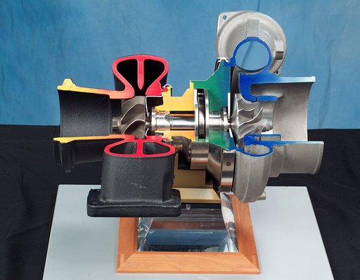
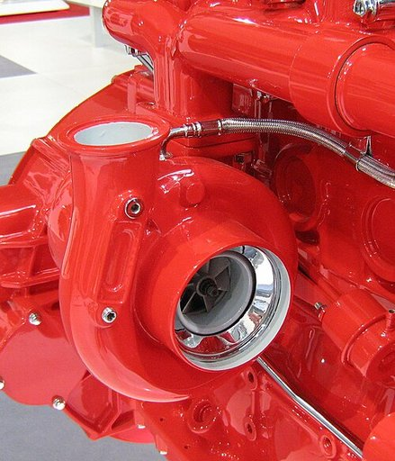
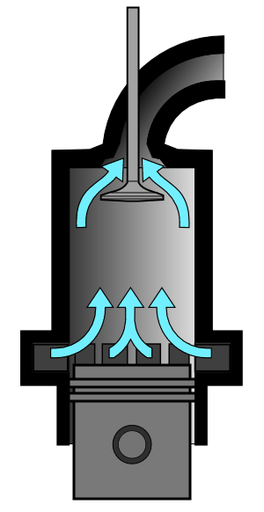

# Turbolader

Als **Turbolader**, auch **Abgasturbolader** (**ATL**) oder umgangssprachlich auch *Turbo*, wird ein Nebenaggregat des Verbrennungsmotors zur Verdichtung der zugeführten Luft bezeichnet (Motoraufladung). Die Motorleistung oder die Effizienz wird gegenüber einem Motor, der die Luft lediglich ansaugt (Saugmotor), gesteigert. Das Wirkprinzip des Turboladers besteht darin, einen Teil der Energie des Motorabgases mittels einer Turbine und eines Verdichters zu nutzen, um eine größere Luftmasse in den Zylinder einströmen zu lassen. Dadurch kann mehr Kraftstoff verbrannt werden und die Ansaugarbeit des Kolbens entfällt.

Erfinder des Turboladers ist der Schweizer Alfred Büchi, der im Jahre 1905 ein Patent über die *Gleichdruck-* oder auch *Stauaufladung* anmeldete. In den 1930er-Jahren wurden von der Adolph Saurer AG aus Arbon Diesel-Lastwagen als erste Straßenfahrzeuge mit Turbolader produziert.

## Aufbau und Arbeitsweise

Der Abgasturbolader besteht im Wesentlichen aus einer Abgasturbine und meist noch einem Verdichter auf einer gemeinsamen Welle. Die kinetische Energie der heißen Abgase wird genutzt, indem sie die Turbine radial durchströmen (Radialturbine) und dadurch das Turbinenlaufrad und die dazugehörige Welle in Drehbewegung versetzen. Von der Turbinenwelle wird ein Verdichter, meist ein Radialverdichter angetrieben, der Frischluft ansaugt und in die Zylinder des Motors drückt. Die Luftzuführung in die Zylinder wird somit erhöht und die Ansaugarbeit der Kolben entfällt. Die Aufladung regelt sich im Grunde selbst, so steigt beim Gasgeben die Energie der Abgase, der Abgasdruck erhöht sich und somit auch die zugeführte Frischluftmenge und Sauerstoff-Menge, sodass mehr Kraftstoff verbrannt werden kann.

In beiden Fällen ergibt die vorverdichtete Ansaugluft eine Leistungssteigerung. Ein großer Teil der Energieverluste entsteht bei thermodynamischen Kreisprozessen wie dem Diesel- oder dem Otto-Kreisprozess durch nicht genutzte Abgaswärme und den Abgas-Restdruck (typisch 0,5–1 bar Überdruck beim Saugmotor, beim Turbo 1–3 bar Überdruck), weil das Gas wegen des begrenzten Verdichtungsverhältnisses nicht mehr weiter expandiert werden kann. Beim Saugmotor wird es ungenutzt in den Auspuff entlassen. Effektiver ist es, einen Teil dieser Restenergie durch weitere Expansion in einer Abgasturbine zurückzugewinnen. Sie wirkt im Betrieb als Wärmekraftmaschine, sobald die dafür erforderliche Turbinendrehzahl erreicht ist. Es entfällt dabei die Ansaugarbeit des Kolbens, gleichzeitig kann in der größeren Luftmenge im Zylinder mehr Kraftstoff verbrannt werden. Dies führt zu höherem Motor-Mitteldruck, höherem Drehmoment und folglich auch mehr Leistung.

Die Abgasturbine ist nicht immer mit einem Verdichter gekoppelt. Ihre Wellenleistung kann untersetzt auf die Kurbelwelle des Motors gekoppelt werden (Turbo-Compound-Motor). Die Abgasturbine kann zusätzlich zum Verdichter auch einen elektrischen Generator antreiben, der eine sonst von der Kurbelwelle anzutreibende Lichtmaschine entlastet oder sogar überflüssig macht.

### Aufladung beim Zweitakt-Motor

Von den üblichen Viertaktmotoren unterscheiden sich Zweitaktmotoren bezogen auf den Turbolader vor allem dadurch, dass während des Startvorgangs noch keine Abgasenergie zur Verfügung steht. Da der Turbolader also während des Startvorgangs nicht den Ladungswechsel (Spülung) bewirken kann, wird für diese Phase ein weiteres Gebläse benötigt. Im einfachsten Fall könnte dies eine Kurbelgehäusespülung sein, bei großen Schiffsmotoren ist es ein elektrisch zuschaltbares Gebläse.

Zusätzlich muss am Ende des Spülvorgangs der Auslasskanal früher geschlossen werden, um zum Aufbauen eines Ladedrucks ausreichend Zeit zu schaffen. Auch dies kann im einfachsten Fall erreicht werden durch die Anordnung der Spülkanäle oder bei großen Schiffsmotoren durch Anordnung der Einlasskanäle und die Steuerzeiten des Auslassventils.

### Ladeluftkühlung

Anders als im Saugmotor, bei dem sich die angesaugte Luft wegen des Unterdrucks adiabatisch im Ansaugtakt abkühlt, führt die Kompression zu einer deutlichen Erwärmung der Luft um bis zu 180 °C. Weil warme Luft eine geringere Dichte hat, lässt sich die Füllung und damit die Leistung des Motors noch weiter steigern, indem die Ladeluft nach der Kompression durch einen Ladeluftkühler gekühlt wird. Ladeluftkühlung wird bei praktisch allen modernen aufgeladenen Motoren angewandt. Da der Ladeluftkühler einen Strömungswiderstand hat und so den vom Verdichter erzeugten Druck wieder etwas vermindert, sollte er eine Abkühlung um mehr als 50 °C bewirken, um die erwünschte Leistungssteigerung gegenüber einem Motor ohne Ladeluftkühlung zu erzielen.

Darüber hinaus kann die Ladeluft auch durch eine zusätzliche Wassereinspritzung oder Einspritzung eines Wasser-Alkohol-Gemisches direkt in den Ansaugtrakt gekühlt werden, was eine weitere Steigerung der Leistung ermöglicht.

### Leistungsregelung

Einfache ungeregelte Turbolader haben – wie alle Turbomaschinen – einen engen Betriebsbereich mit bestem Wirkungsgrad, der sich nur schwer auf das Motorkennfeld abstimmen lässt. Ein auf die Maximalleistung des Motors ausgelegter Lader würde bei mittlerer Leistung zu wenig Druck aufbauen, bei niedrigem Gasdurchsatz tritt sogar ein Ansaugdruckverlust ein, weil das langsame Verdichterrad der Strömung beim Ansaugen im Wege steht (siehe auch Turboloch). Es gibt verschiedene Techniken und Auslegungsarten, dieses Problem zu entschärfen, verbreitet sind vor allem Bypass-Ventil / Wastegate, verstellbare Leitschaufeln (Variable Turbinengeometrie, VTG) und Registeraufladung. Die Techniken können auch kombiniert zum Einsatz kommen.

### Drehzahl und Lagerung der Turboladerwelle

Vor dem Zweiten Weltkrieg erreichten Turbolader Drehzahlen in der Größenordnung von 10.000 Umdrehungen pro Minute; kleine, moderne Turbolader können Drehzahlen bis zu 400.000 Umdrehungen pro Minute erreichen (zum Beispiel Smart Dreizylinder-Turbodiesel). Neben der Reibungswärme von Wellenlagerung und -abdichtung wird auch über das Gehäuse der sehr heißen Abgasturbine viel Wärme der Lagerung zugeführt. Die Lagereinheit ist üblicherweise an den Schmierölkreislauf des Motors angeschlossen, so dass im laufenden Betrieb diese Wärme mit dem Schmieröl in den Motor abgeführt wird. Insbesondere wenn der Motor aus hoher Last schnell gestoppt wird, kann es dagegen zu Problemen mit Stauwärme kommen, die zu einem Verkoken des Schmieröls in der Lagereinheit führen kann. Die Lagereinheiten moderner Turbolader werden deshalb wassergekühlt oder der Motor verfügt über eine elektrische Hilfspumpe, die bei abgestelltem Motor den Turbolader einige Zeit nachkühlt. Diese „wassergekühlten“ Turbolader sind zu unterscheiden von wassergekühlten Turboladern, bei denen (auch) das Turbinengehäuse durch einen Wassermantel gekühlt wird.

Teilweise werden zusätzlich zu den Gleitlagern ein oder zwei keramische Kugellager eingesetzt. Kugelgelagerte Turbolader haben eine geringere Reibung, was sie schneller ansprechen lässt. Das beschleunigt den Drehzahlanstieg des Laders und lässt den Ladedruck früher einsetzen.

### Vorteile

Die Abgasturboaufladung ermöglicht die Steigerung des mittleren Effektivdrucks und damit von Drehmoment und Leistung bei gegebenem Hubvolumen. Das günstigere Verhältnis des mittleren Effektivdrucks zu Spitzendruck erlaubt ein (relativ zu den gesteigerten Leistungsdaten) schwächeres Triebwerk, so dass dieses oft vom nicht aufgeladenen Motor weitgehend unverändert übernommen werden kann. Dies ermöglicht eine höhere Leistungsdichte, d. h. der ursprüngliche Motor mit annähernd unveränderten Abmessungen und Gewicht liefert mehr Leistung oder für die gleiche Leistung wird eine kleinere Maschine benötigt (Downsizing). Daraus wiederum ergeben sich Möglichkeiten der Kraftstoffeinsparung.

Das Leistungspotential der Turboaufladung wurde in den 1980er-Jahren in Formel-1-Motoren deutlich, als die stärksten Turbomotoren mit auf 1,5 l begrenztem Hubraum im Training Leistungen von mehr als 750 kW erreichten. An modernen, aufgeladenen Motoren kann die Leistungscharakteristik des Motors durch Dimensionierung des Turboladers und Regelung des Ladedrucks in weiten Grenzen an die Erfordernisse des Einsatzfalls angepasst werden.

Abgasturbolader nutzen die ansonsten ungenutzt entweichende Energie der Abgase gegenüber mechanischer (Nutz-)Energie des Motors bei mechanisch angetriebenen Motoraufladesystemen (Kompressoren usw.). Die Abgasturboaufladung hat damit eine Steigerung des Motorwirkungsgrads zufolge, während mechanische Lader tendenziell eine Verschlechterung des Motorwirkungsgrads bewirken. Bei hohen Ladegraden steigt zwar die im Abgas vor dem Turbolader enthaltene Energie, diese wird aber im Turbolader in Nutzenergie verwandelt. Hinter dem Turbolader ist die enthaltene Energie (Abgastemperatur) dagegen geringer, das 'Gesamtsystem Motor mit Turboaufladung' hat also einen besseren Wirkungsgrad.

Verglichen mit Motoren ohne Aufladung sind der Wirkungsgrad und damit die Möglichkeiten der Kraftstoffeinsparung beim Turbo sogar erheblich günstiger.

### Nachteile

Nach mehr als 100 Jahren Entwicklungs- und Optimierungsarbeit hat sich der Turbolader allgemein gegen andere Aufladesysteme durchgesetzt, nur bei Nachrüst- und Bastlerlösungen spielen mechanisch angetriebene Lader wegen ihres geringeren Integrationsbedarfs in den Motor noch eine Rolle. Auch Saugmotoren verlieren immer mehr an Bedeutung (außer sehr kleine Motoren, Spezialanwendungen und große, amerikanische Benzinmotoren).

In einzelnen Anwendungsbereichen (z. B. Explosionsschutz) stört die hohe Oberflächentemperatur oder Wärmeabstrahlung des Turboladergehäuses. Zu den typischen Problemen früher turbogeladener Motoren gehörte das „Turbo-Pfeifen“, was besonders bei Lastwechseln zu hören war, wenn also bei hoher Motorlast und -drehzahl vom Gas gegangen wurde. Verursacht wurde es durch strömungstechnisch unvorteilhafte Gestaltung der Turbinenräder. Auch das schnelle Abstellen eines betriebsheißen Motors konnte zu Problemen führen, siehe Drehzahl und Lagerung der Turboladerwelle. Weitere zwischenzeitlich behobene „Kinderkrankheiten“ wurden im Lastwechselbetrieb sichtbar.

#### Lastwechsel

In der Anfangszeit waren Turbolader sehr groß, sehr schwer, ließen sich dadurch kaum raumsparend am Verbrennungsmotor anbringen und waren wenig für Lastwechselbetrieb geeignet. Daimler-Benz bot deshalb für seine Industrie-Dieselmotoren nach dem Zweiten Weltkrieg parallel Turbolader oder Kompressor als Auflademethode an. Erst Fortschritte bei Werkstoffeigenschaften und Fertigungstechnik machten eine Verkleinerung möglich, diese wiederum sorgte für eine Verbesserung der Betriebscharakteristika des Systems Turboaufladung.
Beispiel PKW-Motor: Bei hoher Motordrehzahl und maximaler Last nimmt der Fahrer den Fuß vom Gas, der Motor geht in den Schiebebetrieb, schlagartig wird der Abgasturbine nicht mehr maximal Wärme zugeführt, sondern durch den hohen Volumenstrom mit niedriger Temperatur erheblich Wärme entzogen. Im nächsten Moment gibt der Fahrer wieder Vollgas und die eben ausgekühlte Turbine wird wieder aufgeheizt. Diese abrupten Temperaturschwankungen können insbesondere an den Turbinenschaufeln unmittelbar oder längerfristig zu Rissen oder Brüchen führen.

Abgasturbine und Verdichter liefern als Strömungsmaschinen durch ihre progressive Leistungscharakteristik tendenziell bei niedrigen Motordrehzahlen und -lasten zu wenig bzw. bei hohen Drehzahlen und Lasten zu viel Verbrennungsluft. Bei einem turbogeladenen Verbrennungsmotor mit fest eingestellter Drehzahl könnte eine Drehzahlbegrenzung des Motors als Regelung ausreichen. Je breiter jedoch der nutzbare Drehzahlbereich oder je ausgefeilter z. B. der Drehmomentverlauf moduliert sein soll, desto höhere Ansprüche werden an diese Regelung gestellt: Wastegate, variable Turbinengeometrie (VTG, VNT), sequentielle Aufladung, Turbolader mit elektrischem Hilfsantrieb sowie Eingriffe in das Motormanagement sind 2024 etablierte Methoden, die es erlauben, relativ kleinere Turbolader zu verwenden und damit bereits bei niedrigeren Motordrehzahlen einen ausreichend hohen Ladedruck sicherzustellen, ohne dass bei Höchstdrehzahl und -last des Motors der Turbolader überfordert wird.

#### Turboloch

Lastwechsel führen aber noch zu einem weiteren Problem. Wird bei niedriger Motorlast und -drehzahl Vollgas gegeben, dann muss die geringe im Abgas enthaltene Energiemenge dafür ausreichen, die Abgasturbine (langsam) zu beschleunigen, damit diese über den Verdichter mehr Verbrennungsluft für den Verbrennungsprozess im Motor liefern kann. Erst dadurch wird eine größere Energiemenge im Abgas geliefert, mit der die Abgasturbine weiter beschleunigt werden kann. Die so entstehende geringe Effektivität des Turboladers bei geringer Last/Drehzahl wird als „Turboloch“ bezeichnet. Dieser Effekt wird weiter verstärkt durch die Kompressibilität der Gassäulen in Abgas- und Ansaugtrakt sowie das Massenträgheitsmoment der Turbinen-Verdichtereinheit im Turbolader.
Bereits seit Jahrzehnten wird daran gearbeitet, Abgasturbolader kompakter zu bauen und damit auch das Massenträgheitsmoment zu reduzieren. Jüngeren Datums sind dedizierte Turbomotoren mit Impulsaufladung (statt der früheren Staudruckaufladung) mit optimierten Gaswechselkanälen: Die Abgasleitung vom Auslassventil zum Turbolader möglichst kurz und mit möglichst geringem Schadraum und Wärmeverlusten, die Ansaugleitung vom Verdichter zum Einlassventil ebenfalls möglichst kurz mit minimalem Schadraum und minimalem Wärmeeintrag vom Zylinderkopf in die Verbrennungsluft. Dank dieser Maßnahmen spielt das Turboloch auch bei PKW-Motoren heute keine Rolle mehr.

## Ladedruck-Regelung

Die Welle des Abgasturboladers dreht sich durch die antreibenden steigenden Abgasmengen mit steigender Motordrehzahl und -leistung immer schneller. Je schneller sich die Turbine dreht, desto mehr Luft fördert der Verdichter, was durch die wachsende Abgasmenge wiederum die Turbine weiter beschleunigt. Bei einer bestimmten Drehzahl erreicht der Verdichter seine Fördergrenze, auch drohen die mechanischen und thermischen Grenzen des Turboladers oder des Motors überschritten zu werden (zum Beispiel die Reibung in den Lagern). Die bei niedrigen Drehzahlen gewünschte Aufladung des Motors kann also in höheren Bereichen problematisch werden. Daher müssen Turbolader ohne Ladedruckregelung so ausgelegt sein, dass sie bei Volllast gerade an ihrer Leistungsgrenze arbeiten, wodurch ein sehr großes Turboloch entsteht. Um dies zu vermeiden, werden Abgasturbolader heute mit einer Ladedruckregelung versehen, die ermöglicht, dass der Lader bereits bei niedrigen Abgasströmen eine hohe Leistung hat und trotzdem bei hohen Drehzahlen die Belastungsgrenze nicht überschreitet; die Verdichterdrehzahl erreicht ein Drehzahlplateau. Diese Regelung kann auf unterschiedliche Arten erfolgen. Etabliert hat sich die Regelung über ein Wastegate (überwiegend bei Ottomotoren) oder über verstellbare Leitschaufeln (VTG, hauptsächlich bei Dieselmotoren). Bei modernen Systemen berechnet das Motorsteuergerät einen Soll-Ladedruck. Ein Drucksensor, der üblicherweise vor der Drosselklappe positioniert wird, liefert den aktuellen Ist-Ladedruck an das Motorsteuergerät. Die Ladedruckregelung hat dabei die Aufgabe, möglichst schnell den Unterschied zwischen Soll- und Ist-Ladedruck auszugleichen. Hierzu bewegt die Ladedruckregelung das vorhandene Stellglied (Wastegate oder VTG) als Stellwert.

Geregelt werden beide Aktoren entweder pneumatisch-mechanisch oder elektrisch. Bei der pneumatischen Lösung befindet sich auf der Verdichterseite ein Geber: Ab einem gewissen Ladedruck verstellt er das Wastegate oder die Leitschaufeln zunehmend, was einer weiteren Erhöhung des Ladedrucks entgegenwirkt. Bei neueren Motoren wird vermehrt auf elektrische Stellglieder gesetzt, die neben „auf“ oder „zu“ auch Zwischenpositionen einstellen können. Ein Vorteil der elektrischen Regelung ist, dass das Ventil im gesamten Kennfeldbereich unabhängig vom Ladedruck eingestellt werden kann. Dadurch kann der Steller auf unterschiedliche Anforderungen reagieren (wie Schubabschaltung). Zusätzlich kann der Ladedruck kurzzeitig erhöht werden, um einen „Over-Boost“ zu ermöglichen. Außerdem besitzen elektrische Regelungen eine höhere Stellgeschwindigkeit und höhere Zuhaltekräfte, um bei einem Wastegate-Ventil die Leckage zu verringern.

Siehe auch: Motoraufladung

### Wastegate

Eine Variante der Ladedruckregelung ist das *Bypassventil* (auch *Wastegate* genannt) im Abgasstrom. Dieses Ventil kann einen Teil des Abgasstroms an der Turbine vorbeileiten, um so eine Erhöhung des Ladedrucks zu vermeiden. Hierdurch lässt sich ein Lader einsetzen, der bereits bei niedrigen Drehzahlen genügend Ladedruck produziert, und so das Turboloch verkleinert. Bei höheren Laderdrehzahlen wird ein Teil des Abgasmassenstroms an der Turbine vorbeigeleitet, um den Lader nicht zu überlasten. Es ist üblich, dass das Bypassventil als Klappe direkt im Turbinengehäuse integriert ist (siehe Bild rechts). Diese Methode der Ladedruckregelung hat allerdings den Nachteil, dass bei geöffnetem Wastegate nicht mehr die Energie des gesamten Abgases genutzt wird, sondern nur noch ein Teil. Das Bypassventil und seine Stellglieder sind aufgrund ihrer Position im heißen Abgasstrom (ca. 1000 °C) thermisch hoch belastet und damit störanfällig. Das war einer der Gründe, warum einzelne Motorenbauer sich von der Turboaufladung von Ottomotoren wieder abwendeten und Kompressorsysteme verwendeten, die ohne Bauteile im Abgasstrom arbeiten.

Das Wastegate wird häufig mit einer Druckdose geregelt. Unterdruckdosen werden gegenüber Überdruckdosen bevorzugt. Da die systembedingt hohen Temperaturen am Turbolader, zu einer hohen thermischen Belastung der weichmacherhaltigen Unterdruckleitungen und schließlich zu deren Materialermüdungen (Rissen) führen, besitzen neuere Turbolader immer häufiger ein elektronisch gesteuertes Wastegate. Dadurch sinkt die Fehleranfälligkeit und das Wastegate kann schneller und präziser eingestellt werden. Durch den Entfall von Druckleitungen, sinkt zudem der benötigte Bauraum des Gesamtsystems.

### Verstellbare Leitschaufeln (Variable Turbinengeometrie, VTG)

→ *Hauptartikel: Variable-Turbinengeometrie-Lader*

Turbinen mit verstellbaren Leitschaufeln arbeiten ähnlich wie eine Francis-Turbine. Die Leitschaufeln im Abgasstrom vor dem Turbinenrad sind verstellbar, wodurch bei niedrigem Durchsatz dem Gas ein höherer Drehimpuls (in Form einer höheren Tangentialgeschwindigkeit) mitgegeben werden kann. Sie sind im Turbinengehäuse unmittelbar vor dem Turbineneintritt angeordnet. Die Anstellwinkel der Leitschaufeln werden dabei so geregelt, dass bei wenig Gasdurchsatz das Abgas durch reduzierte Strömungsquerschnitte tangential beschleunigt und auf die Turbinenschaufeln geleitet wird, was die Drehzahl der Turbine und somit die Leistung des Verdichters erhöht. Umgekehrt kann bei hohem Gasdurchsatz durch große Querschnitte die Strömungsgeschwindigkeit verringert werden.

Honda nutzte 1989 seine Erfahrungen mit Turbomotoren aus der Formel 1 und brachte eine *Wing turbo* genannte Variante des Honda Legend mit einem VTG-Turbo auf den Markt. Die Regelung steuerte ein Digitalrechner. Der 2-Liter-Motor leistete 142 kW (193 PS) bei 6000/min.

Turbolader mit VTG gibt es seit 1996 auch in Dieselmotoren für PKW. Der *TDI*-Dieselmotor mit direkter Einspritzung von VW/Audi mit einer maximalen Leistung von 81 kW (110 PS) erreichte durch die variable Turbinengeometrie als erster PKW-Antrieb einen Motor-Wirkungsgrad von über 40 %. Die verstellbaren Leitschaufeln haben sich inzwischen bei Dieselmotoren als Standard durchgesetzt.

Siehe auch: Turbodiesel

Porsche setzte im 911 Turbo (997) (Verkaufsstart in Deutschland war im Juni 2006) seinen ersten Ottomotor mit VTG ein. Um den mit bis zu 1000 °C gegenüber Dieselmotoren erheblich höheren Abgastemperaturen standhalten zu können, müssen hochwarmfeste Legierungen (Wolfram-Stähle) eingesetzt werden.
Entwickelt wurde der moderne VTG-Turbolader für Ottomotoren in enger Zusammenarbeit mit *BorgWarner Turbo Systems*.
VW nutzt im „1.5 TSI BlueMotion“ erstmals einen VTG-Lader bei einem Großserien-Ottomotor. Da der Motor, bedingt durch früh schließende Einlassventile, verhältnismäßig niedrige Abgastemperaturen hat (~860 °C), ist der Einsatz möglich. Entwickelt wurde der Lader von Honeywell.
Ein weiterer bekannter Begriff für Turbolader mit verstellbaren Leitschaufeln ist auch *VNT* (Variable Nozzle Turbine). Diese Bezeichnung wird von Honeywell für deren Turbosysteme mit variabler Turbinengeometrie unter dem Markennamen *Garrett* verwendet.

### Wirkungsweise ohne Umluftventil

Wenn die Drosselklappe bei Ottomotoren geschlossen wird, stößt die in Bewegung befindliche Luftsäule auf die Klappe. Die Luftsäule (Drucksäule) kehrt um, läuft vor das sich drehende Verdichterrad des Turboladers und bremst dieses stark ab, was bei hohem Ladedruck auf Dauer zur Zerstörung des Turboladers führen kann (oder bei einem defekten Umluftventil). Außerdem sind starke Strömungsgeräusche hörbar, weil die Strömung am Verdichter abreißt („Pumpen“).

### Wirkungsweise mit Umluftventil

Um dieses ineffektive Abbremsen zu verhindern, wird die Luft über das Umluftventil abgelassen. So kann sich der Lader frei weiterdrehen, ein erneuter Druckaufbau wird verkürzt und ein schnelleres Beschleunigen des Turboladers zugunsten eines besseren Ansprechverhaltens nach dem Schaltvorgang erzielt.

Universelle (meist als offene Systeme vorgesehene) Lader aus dem Zubehörmarkt lassen sich fast immer in einem festgelegten Bereich auf das Ansprechen bei einer bestimmten Druckschwelle einstellen. Bei werksseitig eingebauten Ladern ist dies seltener, um unsachgemäße Veränderungen der Werkseinstellung zu verhindern.

Umluftventile sind heutzutage in fast allen Turbolader-Ottomotoren eingebaut und werden auch bei amerikanischen Indy-500-Rennfahrzeugen eingesetzt.

### Offene / Geschlossene Systeme

Beim *offenen* System wird die überschüssige Luft nicht zurück in den Ansaugkanal (geschlossenes Umluftventil/System), sondern nach außen abgeleitet. Systeme mit einem Ventil sind üblich. Teilweise werden auch Systeme mit zwei integrierten Ventilen verwendet, die einen feinfühligeren Überdruckablass ermöglichen. Der Anbau an einen Motor mit Luftmassenmesser kann problematisch sein, da die Luft, die ins Freie statt in den Ansaugtrakt gelangt, bereits vom Motorsteuergerät erfasst wurde und die Kraftstoffmenge zur richtigen Gemischbildung darauf angepasst wird. Als Folge der fehlenden Luft kommt es zu einer Überfettung des Gemisches, die Motorleistung sinkt, der Motor kann stottern, die Lambdasonde und der Katalysator können durch in den Auspuff gelangendes Benzin, das sich entzündet, zerstört werden. Daher ist von einem Umbau auf ein offenes System (ohne Neuprogrammierung des Motorsteuergerätes) dringend abzuraten. Außerdem entspricht das Fahrzeug so nicht mehr der Allgemeinen Betriebserlaubnis (ABE), da ungefilterte ölhaltige Abgase (durch die Ölschmierung des Turboladers und der Kurbelgehäuseentlüftung, die in das Ansaugsystem führt) in die Umwelt abgelassen werden.

### Ventilarten

Beim Umluftventil sind zwei Ventilarten gängig, Membran oder Kolben. Der Kolben spricht feinfühliger an und schließt schneller, jedoch besteht die Gefahr eines Kolbenklemmers und damit einer Fehlfunktion (bleibt offen oder öffnet nicht).

Da ein elektrischer Steller deutlich schneller ist als ein herkömmlicher pneumatischer, wird bei einigen Motoren ein elektrisch gesteuertes Ventil verwendet. Über ein Steuergerät oder eine einfache elektrische Schaltung wird das elektrische Ventil geöffnet oder geschlossen und kann damit auch unabhängig vom Druck beliebig gesteuert werden. Dabei ist auch die Nutzung in einem Dieselmotor möglich, dort hat es jedoch keinen technischen Sinn, da ohne Drosselklappe, und dient lediglich dem Showeffekt durch das je nach Ladedruck laute Abblasgeräusch bei einem offenen System.

Das charakteristische Geräusch bei Membranventilen ist ein hell pfeifendes Zischen, wogegen Kolbenventile bei hohem Ladedruck nur laut zischen und bei niedrigem Ladedruck zum „Flattern“ neigen. Jedoch variieren die Ablassgeräusche auch stark je nach Bauart und Hersteller dieser Ventile.

Technisch nicht ganz korrekt ist, dass die elektronisch gesteuerten Ventile (technisch gesehen überflüssige Ventile bei Dieselmotoren) ebenfalls als *Blow-Off-* bzw. Pop-Off-Ventile bezeichnet werden, da die Blow-Off-Ventile im eigentlichen Sinne stets druckgesteuert sind.

### Gängige Bezeichnungen

Englischsprachige Bezeichnungen für Abblasventil, Ablassventil oder (Schub-)Umluftventil, die auch häufig verwendet werden, sind unter anderem: Blow-Off-Valve (BOV), Pop-Off-Valve (POV) (eingedeutscht: „Pop-Off-Ventil“)

### Staudruckaufladung

In der Anfangszeit waren Turbolader groß, schwer und wenig für Lastwechselbetrieb geeignet. Gewicht und mehr noch die Größe, d. h. der Durchmesser, der Turbinenräder sorgten für ein hohes Massenträgheitsmoment, so dass diese nur langsam und mühsam Drehzahlanpassungen an geänderte Lastzustände nachvollzogen, ganz zu schweigen von den ungleich hochfrequenteren Impulsen einer Stoßaufladung. Hinzu kamen Mängel in der Standfestigkeit der Turbinenräder. Es brauchte jahrzehntelange Weiterentwicklung diese Probleme zu beheben. Diese Turbolader wurden dann an weitgehend unveränderten Dieselmotoren angebaut, der Einsatz an Ottomotoren beschränkte sich die längste Zeit auf Bastlerlösungen oder Motorsport.

Bei der Staudruckaufladung werden die Abgase aller Zylinder in einem einflutigen Sammelrohr zusammen- und einem einzelnen Turbolader zugeführt (bei größeren oder V-Motoren waren auch mehrere Turbolader möglich). Ziel war, einen möglichst gleichmäßigen Abgasstrom am Turbolader zu erhalten. Vor der Abgasturbine stauen sich die Abgase und treiben diese durch das Druckgefälle zur hinter der Turbine liegenden Abgasanlage an. Man nahm dabei in Kauf, dass die Abgase in der relativ geräumigen Abgasanlage teilweise expandierten (und damit einen Teil ihrer Energie verloren) und durch den Staudruck (= erhöhter Abgasgegendruck) der Gaswechsel beeinträchtigt wurde.

### Stoßaufladung

Die Stoßaufladung oder Impulsaufladung zielt darauf ab, dass die kinetische Energie der beim Öffnen des Auslassventils sich ausbreitenden Druckwellen möglichst gezielt und unmittelbar auf die Abgasturbine(n) geleitet werden. Ein in diesem Moment noch geöffnetes Auslassventil eines anderen Zylinders würde dazu führen, dass die Druckwelle sich auch in Richtung auf diesen Zylinder ausbreiten könnte. Dies würde dazu führen, dass nicht nur verbranntes Abgas in diesen anderen Zylinder gedrückt würde (und dort die Menge verbrennbaren Gases reduziert), sondern schwächt auch den Impuls der Druckwelle, die auf die Abgasturbine zuläuft. Zu jedem gegebenen Zeitpunkt darf also nur ein Auslassventil geöffnet sein.

Bei Motoren ab vier Zylindern ist das nur noch durch getrennte Abgaskanäle zu gewährleisten, bei einem Vierzylinder-Reihenmotor mit üblicher Zündfolge würden also die beiden mittleren und die beiden äußeren Zylinder in je einem Abgaskanal zusammengefasst werden. Zusätzlich soll der Schadraum, also das Volumen des Abgaskanals, klein gehalten werden, weshalb das Abgassammelrohr möglichst dicht am Zylinderkopf gehalten oder am besten in den Zylinderkopf integriert wird. Schließlich versucht man die Abgaskanäle bis zur Abgasturbine im Querschnitt möglichst eng zu halten, so dass die Gase nicht (unnötig) expandieren können. Jeder Abgaskanal mündet in seinen eigenen Abgasturbolader, oder seitdem diese verfügbar sind, in einen Twin-Scroll- oder Dual-Volute-Lader für 2 Abgaskanäle. Beim Sechszylinder-Reihenmotor ist die Abgasführung wesentlich einfacher: die drei vorderen und die drei hinteren Zylinder werden zusammengefasst. Insbesondere bei V-Motoren kann es aus baulichen Gründen notwendig sein, den Turbolader nicht seitlich neben den Zylindern, sondern über dem Schwungrad anzuordnen. In dem Fall unterscheidet sich das Sammelrohr durch seine mehrflutige Ausführung von dem bei Staudruckaufladung.

Die modernere Stoßaufladung erlaubt eine bessere Ausnutzung der im Abgas enthaltenen Energie und damit höhere Ladegrade. Wirkungsgrad und Ansprechverhalten im Lastwechselbetrieb werden ebenfalls tendenziell verbessert. Neben den höheren technologischen Anforderungen an den Turbolader selbst erfordert sie aber auch weitergehende Anpassungen des Verbrennungsmotors.

### Twin-Scroll-Lader

Twin-Scroll-Lader unterscheiden sich von anderen Ladern durch die abweichende Gestaltung des Turbinengehäuses. Das Spiralgehäuse der Twin-Scroll-Turbine wird durch einen Flutenteiler in zwei parallel verlaufende Strömungskanäle eingeteilt. In Verbindung mit einem zweiflutigen Abgaskrümmer ermöglicht dies eine getrennte Zuführung der Abgase auf das Turbinenlaufrad. Der Twin-Scroll-Lader ist damit eine kostengünstige und raumsparende Alternative zu zwei einzelnen Turboladern. Seit etwa den 2010er Jahren wird der Twin-Scroll-Lader weit verbreitet eingesetzt. Eine etwas abweichende Bauart ist der Dual-Volute-Lader, bei dem die beiden Abgasströme nicht nebeneinander, sondern übereinander auf das Turbinenrad geführt werden.

Der Twin-Scroll-Lader darf nicht mit einem Scrollverdichter („G-Lader“) verwechselt werden, der eine Kolbenmaschine ist.

### Biturbo / Twin Turbo

Biturbo oder Twin Turbo sind Werbetermini und bezeichnen die parallele Verwendung von zwei Ladern. *Bi* ist die lateinische Vorsilbe für *zwei*, Twin bedeutet „Zwilling“ (englisch). Bei dieser Konstruktionsform werden anstelle eines einzelnen großen zwei kleinere Lader verwendet, wodurch ein kleinerer Schadraum, ggf. geringere Trägheitsmomente und ein besseres Ansprechverhalten beim Gasgeben erreicht werden können. Die Abgasführung in nebenstehendem Bild würde bei einem Vierzylindermotor mit üblicher Zündfolge auf eine „minderwertige“ Staudruckaufladung hindeuten, speziell vor Verfügbarkeit der Twin-Scroll-Lader war aber auch eine Anordnung von 2 Turboladern mit Stoßaufladung denkbar oder eine sequentielle oder mehrstufige Aufladung.

Mit steigender Zylinderzahl steigt zwangsläufig der Schadraum der Abgasanlage, so dass in diesen Fällen häufig zwei oder mehr Turbolader verwendet werden, Motoren mit z. B. 16 Zylindern verfügen oft über 4 Turbolader, so auch die Bugatti-Modelle EB110, Veyron und Chiron.

### Sequenzieller Biturbo

Bei einem sequenziellen Biturbo werden nicht beide Turbinen ständig durch die Abgase angetrieben, sondern die zweite Turbine wird erst bei entsprechendem Leistungsbedarf zugeschaltet und treibt dann den zweiten Verdichter an. Ist das geschehen, arbeiten die Lader nach dem Prinzip des Biturbos parallel. Im Allgemeinen stehen beiden Turboladern die Abgase aller Zylinder zur Verfügung, sie sind nicht jeweils einer Zylinderbank zugeordnet, wodurch bei niedrigen Drehzahlen der erste Turbolader durch die Abgase aller Zylinder betrieben werden kann.
Ziel dieser Technik ist eine bessere Nutzbarkeit des Drehzahlbandes. Im oberen Drehzahlbereich hat man den Vorteil der größeren Fördermenge zweier Turbolader, während in den niedrigen Drehzahlbereichen die geringe Masseträgheit nur einer Turbine ein schnelles und frühes Aufbauen des Ladedrucks und damit ein gutes Ansprechverhalten bewirkt.
Beispiele:

- Ottomotor: Der 3,0-l-Reihensechszylinder-Twinturbo, der ab 1993 im Toyota Supra (JZA80) verwendet wurde (der Supra wird als Twin Turbo bezeichnet, nicht als Biturbo).
- Dieselmotor: Der 2,2-l-Vierzylinder-Biturbo-Dieselmotor von Ford/PSA (DW12BTED4); der 2.0 CDTI BiTurbo (143 kW/195 PS, 400 Nm Drehmoment) von Opel (seit Januar 2012 im Opel Insignia erhältlich)

### Registeraufladung

Als Registeraufladung (auch sequentielle Aufladung genannt) bezeichnet man die parallele abwechselnde Verwendung von Turboladern. Dabei wird ein kleinerer Lader, der schon bei geringem Abgasstrom und aufgrund der geringen Massenträgheit schneller hochdreht, für niedrige Motordrehzahlen verwendet. Bei größerer Abgasmenge wird auf einen großen Turbolader umgeschaltet, der dann genügend Luftmasse und Druck für den hohen Frischluftbedarf höherer Motordrehzahlen bereitstellt. Die unterschiedlichen Turbolader können besser auf ihren Wirkungsbereich abgestimmt werden und der kleine Lader verringert das sogenannte „Turboloch“: Bei niedrigen Motordrehzahlen war der zumeist große Lader nicht in der Lage, eine ausreichend hohe Turbo-Drehzahl zu erreichen, um damit einen Überdruck im Ansaugbereich aufzubauen. Unterhalb dieser kritischen Marke arbeitet ein normaler Turbomotor eher als Saugmotor, unter Umständen sogar noch gedrosselt durch die „bremsenden“ Turbinenschaufeln und die geringere Verdichtung, die jedem Turbomotor immanent ist. Die Registeraufladung ist im Automobilbau allerdings bis heute nur bei wenigen leistungsstarken Motoren anzutreffen. Erstes (Klein-)Serienfahrzeug mit Registerturbo war der Porsche 959.

Es gibt auch Aufladekonzepte mit einer Kombination aus Registeraufladung und mehrstufiger Aufladung, so bei den Motoren der BMW-Modelle 535d (Baureihe E60/61), 335d, 123d, bei einigen Ausführungen der Mercedes-Benz-Dieselmotoren OM646, OM651 und der 180-PS-Ausführung des Saab-9-3-Dieselmotors. Dabei arbeiten die Verdichter des kleineren und des größeren Laders in Reihe auf der Ansaugseite. Ist der Leistungsbedarf niedrig, wird die Luft nur durch den Verdichter des kleineren Laders komprimiert. Bei höherer Last wird dann durch Steuerung des Abgasstroms und geregelte Überbrückung des ersten Verdichters der größere Lader wirksam. Durch eine Kennfeldregelung der Gassteuerung auf der Abgas- wie auf der Frischgasseite im Zusammenspiel mit der Kraftstoffeinspritzung können Drehmomentschwankungen im Übergangsbereich weitgehend unterdrückt werden.

### Mehrstufige Aufladung

Bei einer mehrstufigen Aufladung wird die Luft durch mehrere hintereinander geschaltete Verdichter komprimiert. Die so erreichbaren Verdichtungsverhältnisse sind auch unter Bedingungen stark verringerten Außendrucks sinnvoll einsetzbar, so dass diese Technik zuerst bei der Entwicklung von Flugmotoren eine Rolle spielte. Bei mehrstufiger Aufladung wurden zunächst mechanische Lader und Turbolader kombiniert. So enthielt der Versuchsmotor Daimler-Benz DB624 (Prüfstandserprobung ab 1944) eine Kombination aus zwei mechanischen Getriebeladern und einem Abgasturbolader. Die konzipierte Volldruckhöhe lag bei 15.000 bis 17.000 Metern.

Beim Antrieb des ab 1989 entwickelten Höhenforschungsflugzeugs Grob Strato 2C war ein mehrstufiger Turbolader vorgesehen, dessen erste und zweite Stufe aus dem Nieder- und dem Mitteldruckverdichter eines Dreiwellen-Turboproptriebwerks (Pratt & Whitney Canada PW127) bestanden. Alle Komponenten waren in der Triebwerksgondel untergebracht. Nach dem Passieren der Turbine des Turboladers wurde das Abgas in die Turbinensektion des ursprünglichen Turboprop-Verdichters geleitet. Die von den Verdichterstufen komprimierte Luft wurde dem Verdichter des Turboladers und dann dem Motor zugeführt. Das Druckverhältnis betrug maximal 1:45, was große Ladeluftkühler notwendig machte. Die konzipierte Volldruckhöhe lag bei 24.000 Metern, die maximale Flughöhe bei 26.000 Metern. Das Projekt wurde schließlich aus finanziellen und politischen Gründen nicht weiterverfolgt.

In der Moderne wird die mehrstufige Aufladung an großen Dieselmotoren verwendet, z. B. MTU Baureihe 1163 und MTU 8000.

### Turbo-Compound

Bei der Turbo-Compound-Technik wird eine Abgasturbine in den Abgasstrom integriert, um so Nutzenergie aus dem Abgas zu gewinnen. Die Compoundturbine kann in Kombination mit einem Kompressor und/oder einem vorgeschalteten Abgasturbolader betrieben werden. Napier erprobte Ende der 1940er-Jahre Compoundtriebwerke. Diese Napier Nomad genannten Dieseltriebwerke kamen nicht über das Versuchsstadium hinaus.

Die gewonnene mechanische Energie der Compoundturbine kann über ein Getriebe in die Kurbelwelle des Antriebsmotors eingeleitet werden, um Nutzleistung und Wirkungsgrad zu erhöhen. Oder es kann z. B. ein Generator antreiben werden, um elektrische Energie zu erhalten.

### Ladeluftkühler

Da das Vorkomprimieren die Lufttemperatur erhöht und somit der angestrebten Vergrößerung der Ansaugluftmenge entgegenwirkt, wurden Ladeluftkühler entwickelt, um diesen Nachteil wieder auszugleichen. Ladeluftkühler erhöhen immer auch den thermodynamischen Wirkungsgrad des Motors.

### Kombination mit Kompressor

Um das Turboloch zu vermeiden, kann man im unteren Drehzahlbereich einen Kompressor verwenden, der mit Magnetkopplung zu- und abkoppelbar ist. Bei mittlerer Drehzahl laufen beide Lader, bei höheren Drehzahlen alleine der Turbo. Beispiel: Volkswagen TSI-Motoren.

### Anwendung bei Dieselmotoren

→ *Hauptartikel: Turbodiesel*

Bei Dieselmotoren für PKW wie auch für LKW ist der Abgas-Turbolader mittlerweile „Stand der Technik“. Bereits vor dem Zweiten Weltkrieg kamen Turbolader teilweise an Großdieselmotoren, etwa für Schiffe und Lokomotiven, zum Einsatz. Ab den 1950er Jahren wurden Turbodiesel in einzelnen LKW verwendet, später auch in kleineren Kraftfahrzeugen. Bei PKW kam der Turbodiesel erstmals 1978 im Mercedes 300 SD zur Anwendung und verbreitete sich zunehmend. Auf abgasregulierten Märkten spielen Dieselmotoren ohne Aufladung (oberhalb 18,5 kW) praktisch keine Rolle mehr.

### Anwendung bei Ottomotoren

Bei Ottomotoren ergeben sich verglichen mit dem Dieselmotor eine Anzahl zusätzlicher Herausforderungen, die erst gelöst werden mussten, weshalb sich die Turboaufladung hier erst wesentlich später verbreitete.

Die höheren Abgastemperaturen in Ottomotoren erfordern hochwarmfeste Werkstoffe. Das Turboloch tritt bei Ottomotoren potentiell stärker als bei Dieselmotoren auf. Es konnte durch Fortschritte bei der Konstruktion (verstellbare Leitschaufeln, kleinere und somit schneller ansprechende Lader, leichtere Schaufelräder mit geringerer Massenträgheit) und in der Regelungstechnik aber stark reduziert werden. Bei (früheren) Ottomotoren mit äußerer Gemischbildung sorgten Spülverluste für erhöhten Kraftstoffverbrauch, weil durch die Ventilüberschneidung Frischgas unverbrannt direkt in den Auspufftrakt gelangen konnte. Der Kraftstoff in dem durch die Turboaufladung bereits vorverdichtete (und damit erwärmte) Frischgas konnte sich leicht vorzeitig erzünden und damit Motorklopfen oder Motorklingeln verursachen. Der Klopfbeginn kann mittels hochoktanigem Treibstoff, durch einen wirksamen Ladeluftkühler oder durch Wasser-Methanol-Einspritzung nach oben versetzt werden. In den meisten Fällen wurden jedoch die Steuerzeiten verändert und die Verdichtung herabgesetzt, um diesem Effekt vorzubeugen. Mit der Verbreitung der Benzindirekteinspritzung ab den 2000er Jahren wurde das Problem obsolet. Seitdem überwiegen auch beim Ottomotor die Vorteile, weshalb gegenwärtig bei einem Großteil der Ottomotoren auf die Aufladung mittels Turbolader gesetzt wird. Auch in der Formel 1 war der (früher dort laut Reglement untersagte, ab der Saison 2014 jedoch wieder eingeführte) Turbomotor den Saugmotoren in Verbrauch und Leistung überlegen.

#### Verwendung bei Pkw

Erste aufgeladene Motoren wurden ab 1910 in den A.L.F.A.-24-HP-Modellen eingebaut, die aus den vom gleichen Hersteller entwickelten Flugzeugen übernommen wurden (siehe unten). Großserien-PKW mit aufgeladenen Ottomotoren kamen zuerst in den USA ab 1961 als Oldsmobile F-85 *Jetfire* (Aluminium-V8 mit 215 cui ≈ 3,5 Liter Hubraum, 160 kW, 218 SAE-PS und Methanol-Wasser-Einspritzung, bis 1963 im Programm) und ab 1962 als Chevrolet Corvair Spyder (Sechszylinder-Boxer-Turbo, Hubraum: 145 cui; ≈ 2,4 Liter, 110 kW, 150 SAE-PS) auf den Markt.

In Europa rüstete der Schweizer Ingenieur und Unternehmer Michael May ab 1966 zunächst Ford 20M und später auch andere Pkw-Modelle mit Turboladern aus. In Deutschland gingen 1973 mit dem BMW 2002 turbo und 1975 mit dem Porsche 911 turbo turbogeladene Pkw in Serienproduktion. Beide hatten Benzineinspritzung und einen Turbolader. Der Ladedruck betrug 0,55 beziehungsweise 0,8 bar. Da es sich jeweils um Sportwagen handelte, erlangten die Fahrzeuge keine große Verbreitung. 1978 kam der Saab 99 Turbo auf den Markt, bei dem ein schnell ansprechender, kleiner Turbolader mit einem Steuerventil (Wastegate) kombiniert wurde. Die Höchstleistung wurde nur wenig gesteigert, aber der Motor lieferte ein hohes Drehmoment bei niedrigen Drehzahlen.

Lancia hat schon 1985 im Motorsport (für die „Gruppe B“) einen mit Abgasturbolader *und* Kompressor aufgeladenen Rennmotor entwickelt und diesen Motor in den laut Homologations-Regeln vorgeschriebenen 200 Serienmodellen des Lancia Delta S4 eingesetzt. Nissan baute 1988 in einer Motorsport-Kleinserie des Modells Micra ebenfalls einen solchen Motor ein, der allerdings aus nur 0,9 Litern Hubraum 81 kW (110 PS) und ein spezifisches Drehmoment von 144 Nm/l bei 4800/min erzielte. Der VW-TSI-Großserienmotor (Golf GT, 1,4 L mit 125 kW/170 PS, ab 2005) kombiniert Direkteinspritzung mit einem Turbolader für hohe Drehzahlen und einem Roots-Kompressor für niedrige; der Motor erreicht ein spezifisches Drehmoment von 200 Nm/l bereits bei 1500/min.

Die Entwicklungstendenz geht seit den 2010er Jahren zu sogenannten Downsizing-Konzepten, bei denen kleinere Motoren mit Aufladung an die Stelle größerer nicht aufgeladener Motoren treten. Ziel beim Downsizing (dt. Verkleinerung) ist ein geringerer Verbrauch durch Entdrosselung des Motors. Weitere Vorteile ergeben sich aus vermindertem Gewicht und einer verminderten Reibung. 2024 bieten Großserienhersteller von Pkw überwiegend Ottomotoren mit Turboaufladung an. Nicht aufgeladene Motoren werden für Einstiegsmodelle, Spezialversionen oder in den USA als traditionelle V8-Motoren eingesetzt.

#### Verwendung bei Motorrädern

Anfang der 1980er-Jahre wurden auch Serienmotorräder (Honda CX 500 Turbo, Yamaha XJ 650 Turbo, Kawasaki Z750 Turbo) ohne großen Markterfolg mit Turboladern angeboten. Die ersten Turbo-Motorräder bot kurz zuvor die US-Tuningfirma *BAE Magnum* auf Basis der Harley-Davidson-Modelle *Sportster* und *Super Glide* an. Die plötzliche Leistungsentfaltung beim Erreichen einer bestimmten Motordrehzahl machte diese Motorräder besonders beim Beschleunigen (auch wegen des im Vergleich zum PKW deutlich geringeren Gewichts) schwerer beherrschbar.

### Turboaufladung in der Luftfahrt

Im Ersten Weltkrieg fanden Versuche statt, Abgasturbinen mit Ladegebläsen mechanisch zu koppeln und so einen Abgasturbolader zu schaffen. Vor und während des Zweiten Weltkriegs wurde die Entwicklung dann weiter vorangetrieben, jedoch wurde die Motorentechnik bis zum Kriegsende von der mechanischen Aufladung („supercharged“) dominiert. In Deutschland gab es zusätzliche Turbolader (mehrstufige Aufladung) nur für besondere Höhenanwendungen, zunächst in den verschiedenen Ausführungen des Junkers Gegenkolben-Zweitaktdiesel-Flugmotores Jumo 207, und in nennenswerten Stückzahlen im BMW 801TJ-0.

In den USA erhielt die Lockheed P-38 den Allison V-1710 mit General-Electric-Turbolader.

Nach dem Krieg wurden bis zur Einführung der Turboprop- und Turbinen-Strahltriebwerke für Linienmaschinen einige Jahre zum Teil sehr hochentwickelte Motoren mit Abgasturbinen (nicht -turbolader) wie zum Beispiel der Wright R-3350 gebaut. Die Kurbelwelle trieb über ein Zweiganggetriebe den Radialverdichter an. Die drei Abgasturbinen waren über Flüssigkeitskupplungen und Zahnräder mit der Kurbelwelle verbunden. Sie lieferten 550 hp (410 kW) zusätzliche Leistung.

Heute werden Motoren mit Abgasturbolader, hauptsächlich Ottomotoren, vor allem bei Privat- und Geschäftsreiseflugzeugen der mittleren Kategorien verwendet. Es muss zwischen zwei unterschiedlichen Verfahren der Turboaufladung unterschieden werden:

#### Turbo supercharging

Der Druck im Ansaugtrakt (Upper deck, Ladedruck) kann mittels Drosselklappenverstellung bis teilweise weit über den der Volldruckhöhe angehoben werden. Dem Motor kann dadurch eine Mehrleistung gegenüber der Nennleistung entnommen werden (Startleistung). Diese ist in den meisten Fällen auf maximal fünf Minuten begrenzt. Motoren dieser Bauart haben eine geringere Verdichtung als die Saugversionen. Beispiele: TSIO-520-UB (Continental, Beech Bonanza B36TC), TIO-540-AE2A (Lycoming, Piper Malibu Mirage). Die Nachteile dieser Version liegen bei verstärkten Verschleißerscheinungen durch Mehrbelastung und höhere Betriebstemperaturen.

#### Turbo normalizing

Der durch die Drosselklappenverstellung vorgegebene Druck im Ansaugtrakt (Upper deck, Ladedruck) wird über einen hydraulischen Regler und ein Abblaseventil (Waste gate) konstant gehalten. Der maximal mögliche Ladedruck entspricht dem bei Volldruckhöhe. Der Motor ist bis auf den Lader wie die Saugversion aufgebaut, kann aber seine maximale Nennleistung wegen des konstanten Ladedrucks bis in sehr große Höhen (>20.000 ft) abgeben.

#### Ladeluftkühler

Dem Ladeluftkühler wurde bei Flugmotoren während sehr langer Zeit keine Bedeutung zugemessen, da man vom Anwendungsfall im Automotor ausging (erzeugen von Mehrleistung durch höhere Luftdichte). Dadurch entsprach die Lebensdauer von turbogeladenen Flugmotoren aufgrund der zusätzlichen Temperaturbelastung durch die erhitzte Ladeluft lange Zeit nicht den Angaben der Hersteller, was mit erhöhtem (Reparatur)-Aufwand verbunden war. Moderne Ladersysteme haben hocheffiziente Ladeluftkühler, die es dem Betreiber in allen Arbeitspunkten und auch bei extremen Witterungsverhältnissen (Hochsommer, Wüstenbetrieb usw.) möglich machen, die Temperatur des Motors (vor allem die der Zylinderköpfe) innerhalb der für die Lebensdauer der Motoren und die Unterhaltskosten erträglichen Grenzen zu halten.

Durch Aufladung wird das Fliegen in größeren Höhen ermöglicht, was wegen des dort geringeren Luftwiderstandes wirtschaftliche Vorteile bringt. Durch den mit zunehmender Höhe geringer werdenden Außendruck der Luft verbessert sich ferner die Effizienz der Abgasturbine, was den Aufwand einer Aufladung für Leistungsklassen zwischen Saugmotor und Turboprop rechtfertigt. Ein Beispiel eines aufgeladenen Motors ist der Rotax 914 des Bombardier-Konzerns. Die Produktionsvorbereitung des Bombardier V300T ist seit 2006 eingestellt und auch die Zertifizierung wird nicht mehr betrieben.

In den letzten Jahren wurden auch Turbomotoren für kleinere Flugzeuge entwickelt (zum Beispiel der *Thielert-Diesel*), deren Vorteile im geringen Verbrauch und in der einfachen Bedienung liegen.

## Hersteller von Turboladern

- Accelleron Industries
- BorgWarner Turbo Systems (Schwitzer & 3KWarner, ehemals Turbolader-Sparte von KKK)
- BMTS Technology (ehemals Bosch Mahle Turbo Systems)
- Caterpillar
- Continental AG
- Cummins Turbo Technologies (Holset)
- Hitachi Warner Turbo Systems (Joint Venture von Hitachi und BorgWarner)
- Honeywell Turbo Technologies (Garrett)
- HKS Turbos
- IHI Charging Systems International
- Komatsu
- Kompressorenbau Bannewitz (KBB)
- MAN Diesel & Turbo
- Mitsubishi Heavy Industries
- MTU Friedrichshafen
- NAPIER Turbochargers
- Pierburg
- Garrett AiResearch
