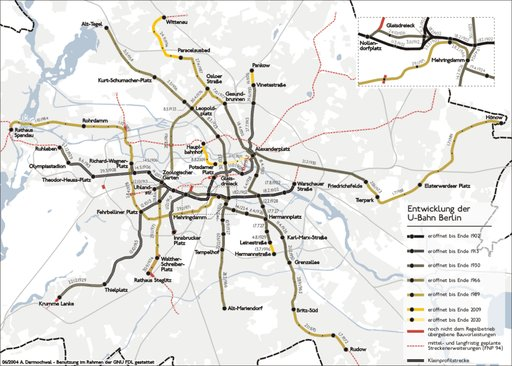
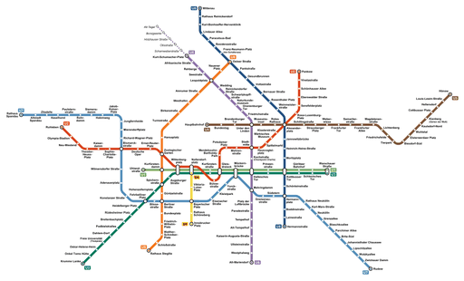
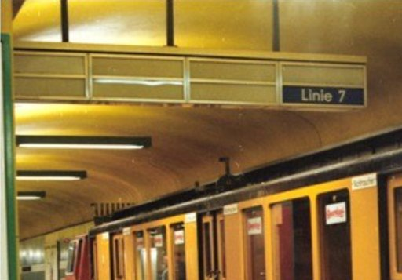

# U-Bahn Berlin

Die **Berliner U-Bahn** bildet zusammen mit der S-Bahn und den Metrolinien bei Straßenbahn und Bus das Rückgrat des öffentlichen Personennahverkehrs (ÖPNV) in Berlin. Die U-Bahn wurde 1902 als *Hoch- und Untergrundbahn* eröffnet und ist heute auf ein Netz von vier Klein- und fünf Großprofil-Linien mit 175 Bahnhöfen und einer Gesamtlänge von 155,4 Kilometern ausgedehnt, das von den Berliner Verkehrsbetrieben (BVG) betrieben wird. Dabei kommen 1250 Fahrzeuge zum Einsatz. Als Bahnstrom wird eine Gleichspannung von 750 Volt verwendet, die über eine Stromschiene zugeführt wird.

Für die U-Bahn verzeichnete die BVG im Jahr 2019 ihren Fahrgastrekord mit rund 596 Millionen (2018: rund 583 Millionen) Fahrgastfahrten. Aufgrund der COVID-19-Pandemie sank die Zahl der Fahrgastfahrten im Jahr 2021 auf etwa 359 Millionen. Im Linienverkehr legten im Jahr 2021 die U-Bahn-Züge 22,3 Millionen (2011: 20,9 Millionen) Nutzzugkilometer zurück.
Im Jahr 2024 beförderte die U-Bahn wieder rund 554,3 Millionen Fahrgäste.

Die Berliner U-Bahn unterhält das größte U-Bahn-Netz im deutschsprachigen Raum.

## Geschichte

→ *Hauptartikel: Geschichte der Berliner U-Bahn*

Die erste Untergrundbahn Berlins entstand 1895 als Verbindungstunnel zwischen zwei AEG-Fabriken. Dennoch setzte sich später Siemens mit seinem preiswerteren Modell beim Tunnelbau durch. Im Jahr 1902 nahm in Berlin die erste elektrische Untergrundbahn für den öffentlichen Personenverkehr ihren Betrieb auf. Die Bahn, die großteils als Hochbahn ausgeführt war, verband Berlin mit dem unmittelbar angrenzenden Charlottenburg. Auf einem kurzen Stück verlief sie durch das mit beiden baulich verbundene Schöneberg.

Als Untergrundbahn wurden nur der Bahnhof Potsdamer Platz mit einem kurzen davor liegenden Tunnelstück und die Strecke auf Charlottenburger Gebiet mit ihren drei Bahnhöfen Wittenbergplatz, Zoologischer Garten und Knie ausgeführt.

Das mit Berlin verwachsene Schöneberg eröffnete 1910 die erste kommunale U-Bahn Deutschlands. Als weitere deutsche Städte mit U-Bahnen folgten Hamburg (1912), München (1971) und Nürnberg (1972).

Der U-Bahn-Ausbau wird allgemein in drei Entwicklungsphasen unterteilt:

1. bis 1913: Aufbau des Kleinprofilnetzes in Berlin, Schöneberg, Charlottenburg, Wilmersdorf und Dahlem – bei diesem Netz ist die Wagenbreite an Straßenbahnmaße angelehnt, also 2,3 Meter
2. bis 1930: Aufbau des Großprofilnetzes – bei diesem Netz beträgt die Wagenbreite 2,65 Meter
3. ab 1953: Netzausbau nach dem Zweiten Weltkrieg

Zum Ende des 19. Jahrhunderts begann man nach Lösungen für die Verkehrsprobleme der Agglomeration aus Berlin und seinen zu Großstädten herangewachsenen Vororten zu suchen. Nachdem viele Vorschläge eingereicht und verworfen worden waren, wurde am 15. Februar 1902 die erste Strecke *(Stammstrecke)* zwischen Stralauer Thor (unweit des heutigen Bahnhofs Warschauer Straße) und dem Bahnhof Zoologischer Garten eingeweiht; sie erhielt einen Abzweig zum Potsdamer Platz. Sie war noch weitgehend als Hochbahn angelegt. Planungen für weitere Verbindungen folgten umgehend: insbesondere auch die damals noch selbstständigen Städte Wilmersdorf, Schöneberg und Charlottenburg begannen eigene Strecken zu entwerfen, die bald bis nach Dahlem im Südwesten, dem Deutschen Stadion im Westen sowie (vorerst) dem Spittelmarkt in der Berliner Innenstadt führen sollten.

Bereits vor dem Ersten Weltkrieg und dem Zusammenschluss Berlins mit seinem Umland zu „Groß-Berlin“ im Jahr 1920 wurden Pläne für eine stadteigene U-Bahn-Strecke zwischen Wedding und Tempelhof beziehungsweise Neukölln, die sogenannte *Nord-Süd-Bahn*, entworfen und einige wenige Bahnhöfe und Tunnelabschnitte im Rohbau fertiggestellt. Dazu zählt beispielsweise der Bahnhof Leopoldplatz (zwischenzeitlich umfassend umgebaut, heute U6). Auch die AEG nahm eine eigene U-Bahn, die *GN-Bahn*, von Gesundbrunnen über Alexanderplatz bis Leinestraße in Neukölln in Angriff. Der Bau dieser neuen Linien verlief jedoch aufgrund der Weltwirtschaftskrise und der Hyperinflation schleppend. In den 1930er Jahren kam noch eine U-Bahn-Strecke zwischen Alexanderplatz und Friedrichsfelde hinzu. Alle diese neuen Linien wurden – im Gegensatz zu den bereits bestehenden – für ein größeres Wagenprofil *(Großprofil)* gebaut.

Während des Zweiten Weltkriegs wurden große Teile des U-Bahn-Netzes beschädigt oder zerstört. Hinzu kam ein Wassereinbruch durch die Sprengung der Tunneldecke des Nord-Süd-Tunnels der Berliner S-Bahn unter dem Landwehrkanal, der über einen Verbindungsgang am Bahnhof Friedrichstraße weite Teile der U-Bahn-Tunnel flutete. Dennoch wurden die Kriegsschäden zügig repariert, sodass bald das gesamte Streckennetz bedient werden konnte.

Die nächste Krise folgte mit dem Bau der Berliner Mauer 1961, die den West- vom Ostteil der Stadt trennte. Die heutige U-Bahn-Linie U2 wurde dadurch ebenfalls in einen West- und einen Ostteil getrennt. Die Nord-Süd-Linien fuhren ohne Halt durch die sogenannten „Geisterbahnhöfe“ des Ostteils. Ausnahme war der Bahnhof Friedrichstraße. Er war Grenzübergang nach Ost-Berlin und Umsteigepunkt zur Nord-Süd-S-Bahn und Stadtbahn. Für das Verkehrsaufkommen innerhalb des damaligen Stadtbezirkes Mitte, das bis zur Grenzschließung von den beiden Nord-Süd-Linien bedient wurde, richtete man zwei dem Verlauf der U-Bahn folgende Buslinien ein.

Siehe auch: Tränenpalast

Besonders nach dem Mauerbau wurde die zur Deutschen Reichsbahn gehörende S-Bahn von den West-Berlinern weitgehend boykottiert („Der S-Bahn-Fahrer zahlt den Stacheldraht“) und die U-Bahn bekam eine noch stärkere Bedeutung für den Massenverkehr der Inselstadt.

In der Zeit des Kalten Kriegs wurde daher das U-Bahn-Netz in West-Berlin stark erweitert. So wurde mit der U-Bahn-Linie U9 eine Nord-Süd-Verbindung unter Umgehung des Ostteils der Stadt geschaffen; die U7 stellte eine Verbindung zwischen Rudow im Südosten und Spandau im Westen her. Auch die Linien U6 (ehemalige *Nord-Süd-Bahn*) und U8 (ehemalige *GN-Bahn*) wurden erweitert. In Ost-Berlin hingegen wurde nur die Großprofil-Linie E (heute: U5) stadtauswärts verlängert, 1973 wurde der Bahnhof Tierpark neu eröffnet. In den Jahren 1988/1989 wurde die Linie E zur Erschließung der großen Neubaugebiete bis an den Stadtrand nach Hönow verlängert. Jedoch gab es auch hier wie im Westteil der Stadt großzügige U-Bahn-Planungen, etwa einer Linie nach Weißensee.

Nach dem Fall der Mauer wurden die getrennten U-Bahn-Teilnetze wieder verbunden, die „Geisterbahnhöfe“ im Ostteil der Stadt wiedereröffnet. Seitdem wurden einige Strecken verlängert, hauptsächlich, um Anschlüsse an die S-Bahn zu schaffen. Außerdem wurden die Pläne zur Verlängerung der U5 in die nordwestliche Mitte der Stadt, die es bereits seit den 1930er Jahren gab, wieder aufgegriffen. Die auch als „Kanzler-U-Bahn“ bekannte Strecke, die seit dem 8. August 2009 nur zwischen Brandenburger Tor über Bundestag zum Hauptbahnhof – getrennt vom Restnetz – fuhr, hieß bis zu ihrer Verbindung mit der vom Alexanderplatz kommenden U5-Strecke *U55*. Die Verknüpfung zwischen U55 (Hauptbahnhof – Brandenburger Tor) und U5 (Alexanderplatz – Hönow) wurde am 4. Dezember 2020 eröffnet.

## Linien

### Betrieb

Das Berliner U-Bahn-Netz wurde in früheren Zeiten mit einigen Linienverzweigungen betrieben. In der Nachkriegszeit wurden jedoch fast alle Linien so umgebaut, dass sie jetzt unabhängig voneinander und kreuzungsfrei verkehren. Einzige heutige Ausnahme ist der Streckenabschnitt zwischen Wittenbergplatz und Warschauer Straße, den sich die Linien U1 und U3 teilen.

In der Hauptverkehrszeit werden die Linien im 4- oder 5-Minuten-Takt befahren, in der Nebenzeit im 5- oder 10-Minuten-Takt. Außerdem gibt es seit 2003 in den Nächten von Freitag zu Sonnabend und von Sonnabend zu Sonntag einen U-Bahn-Nachtverkehr im 15-Minuten-Takt. Außer der U4 verkehren dann alle Linien. In den übrigen Nächten fahren parallel zu den U-Bahn-Strecken Nachtbusse im 30-Minuten-Takt.

Das U-Bahn-Netz umfasst neun Linien:

Die Linie U12 bestand von 1993 bis 2003 als Nachtverkehrslinie. Zu bestimmten Anlässen wie Bauarbeiten oder Großveranstaltungen wird die Linie U12 von der Warschauer Straße in Richtung Ruhleben eingesetzt. Die Linienführung ist dabei eine Kombination aus den Läufen der U1/U3 und U2, wobei von Ruhleben kommend die Strecke der U2 nach dem Wittenbergplatz verlassen wird, um den Nollendorfplatz unterirdisch zu befahren und von dort der U-Bahn-Stammstrecke zu folgen, die im Regelbetrieb von den Linien U1 und U3 bedient wird.

Die Linie U55 wurde von 2009 bis 2020 zwischen Hauptbahnhof und Brandenburger Tor betrieben. Mit der Fertigstellung des noch fehlenden Teilstücks zwischen Brandenburger Tor und Alexanderplatz erfolgte am 4. Dezember 2020 der „Lückenschluss“ und die Linie U55 ging in der Linie U5 auf.

Die Linien mit den meisten Fahrgästen sind die Großprofillinien U7 und U9, gefolgt von der U6. Im Kleinprofil befördert die U2 die meisten Fahrgäste, während es bei der U4 am wenigsten im Gesamtnetz sind.

Die Umstellung der Linienbezeichnungen von Buchstaben auf Zahlen erfolgte in West-Berlin am 1. März 1966. Damals wurde im Kleinprofilnetz die Stammstrecke der Linie B mit dem Linienast AI zur Linie 1, die AII zur Linie 2, die BII zur Linie 3, die BI zur Linie 4 und die AIII zur Linie 5. Im Großprofilnetz wurde die Stammstrecke der Linie C mit dem Linienast CII zur Linie 6, der Linienast CI zur Linie 7, die Linie D zur Linie 8 und die Linie G zur Linie 9. 1984 wurden, im Zuge der Übernahme der S-Bahn durch die BVG, den U-Bahn-Linien der Buchstabe „U“ (bzw. „S“ bei der S-Bahn) vorangestellt, beispielsweise wurde so aus der Linie 1 die U1.

### Ausbauplanung

Die folgende Auflistung befasst sich mit den langfristigen Planungen bzw. Trassenfreihaltungen des Berliner U-Bahn-Netzes entsprechend dem Berliner Flächennutzungsplan (neue Bahnhöfe sind in der Tabelle *kursiv* dargestellt):

#### Beschlossene und laufende Ausbauprojekte

Die Linie U3 soll in der Zeit von 2026 bis 2031 bis zum Mexikoplatz verlängert werden, das beschloss der Senat im Februar 2024.[veraltet] Der Ausbau der Neubaustrecke beträgt rund 1,3 km und endet südwestlich des Mexikoplatzes, hinter dem gleichnamigen S-Bahnhof. So sind ein zweigleisiger Streckentunnel, zwei Seitenbahnsteige von ca. 155 Metern Länge und eine Kehranlage südwestlich der Bahnsteige geplant.

#### Weitere Planungen

Weitere Neu- und Ausbauprojekte werden immer wieder seitens des Senats überprüft (Details in den jeweiligen Artikeln).

Ein Masterplan der BVG von 2023 unter dem Titel „Expressmetropole Berlin“ schlägt neben Verlängerungen der bestehenden Linien vor, eine Ringlinie U0 durch die Berliner Außenbezirke zu bauen und die meisten bestehenden Strecken bis zum Stadtrand zu verlängern. Die Idee einer Ringlinie wurde im Februar 2025 von der seinerzeitigen Verkehrssenatorin Ute Bonde wieder aufgegriffen.

Neben den offiziellen Planungen gibt es auch zivilgesellschaftliche Debattenbeiträge zur Erweiterung der U-Bahn.

## Strecken

Das Berliner U-Bahn-Netz verfügt über rund 155,4 Kilometer Streckenlänge und 175 U-Bahnhöfe. Auf der mit 32 Kilometern längsten Strecke verkehrt die Linie U7. Sie ist die längste komplett im Tunnel verlaufende Schienenstrecke in Deutschland. Ähnlich dem Londoner Netz sowie dem von New York bestehen mit dem sogenannten *Klein- und Großprofil* zwei verschiedene Lichtraumprofile für Strecken und Fahrzeuge mit Wagenbreiten von 2,30 bzw. 2,65 Meter.

Die Bauwerke der Berliner U-Bahn werden den Strecken zugeordnet. Die Gesamtlänge der Bauwerke betrug im Jahr 2001 im Kleinprofil 46,195 km, im Großprofil 106,577 km. Früher lagen Teile des Netzes außerhalb Berlins. Durch Eingemeindungen und Grenzverschiebungen verlaufen inzwischen sämtliche Strecken der U-Bahn Berlin innerhalb der Grenzen des Landes Berlin. Dies ist eine Besonderheit der Berliner U-Bahn, denn die übrigen U-Bahn-Netze in Deutschland erstrecken sich zumindest in kleinem Umfang auch auf das Gebiet von Nachbarkommunen. Der U-Bahnhof Hönow befindet sich unmittelbar an der Grenze zu Brandenburg.

Eine Unterscheidung zwischen den Strecken- und Linienbezeichnungen entstand erst im Jahr 1966, als die West-Berliner BVG zur Vereinfachung der Fahrgastinformation eine durchgehende Nummerierung der Linien mit arabischen Ziffern einführte. Hierbei wurde die U-Bahn-Linie auf der Kreuzberger Stammstrecke, dem ältesten Abschnitt der Berliner Hoch- und Untergrundbahn, zur Linie 1 (zuvor: Linie B). Die später errichtete Innenstadtlinie wurde zur Linie 2 (zuvor: Linie A). Den an dieses Netz anschließenden Kleinprofilstrecken im Berliner Westen wurden die Liniennummern 3, 4 und zeitweilig 5 zugewiesen.

Die später errichtete erste Großprofilstrecke Berlins (mit den Ästen CI und CII) aus den 1920er Jahren erhielt folgerichtig die Linienbezeichnung Linie 6. Der Abzweig nach Neukölln (Ast CI) wurde zur Zeit der Umstellung der Linienbezeichnungen zur eigenständigen Linie 7 ausgebaut. Das Streckenbauwerk der Linie 7 wurde zur besseren Abgrenzung und, um die neue Eigenständigkeit wiederzugeben, in *H* umgetauft.

Die weiteren Großprofilstrecken in West-Berlin, die der Linie 8 (Strecke D) und der Linie 9 (Strecke G), wurden entsprechend ihrer Eröffnungsjahre fortlaufend nummeriert. Da zum Zeitpunkt der Wiedervereinigung der beiden Stadthälften die Kleinprofillinie 5 nicht mehr existierte, wurde der in Ost-Berlin verkehrenden ehemaligen Linie E die U5 zugewiesen.

Mit der Errichtung der Linie E in den 1920er Jahren war der Bau einer Strecke Weißensee–Alexanderplatz–Schöneberg eng verknüpft. Diese Strecke wurde beim Bau des Gemeinschaftsbahnhofs unter dem Alexanderplatz als Bauvorleistung berücksichtigt und erhielt daher die Bezeichnung Linie F. Der West-Berliner Senat verfolgte auch nach der Teilung der Stadt die alten Planungen zur Linie F, sodass weitere Vorratsbauten der nunmehr bis Steglitz angedachten Strecke F entstanden. Unter der Steglitzer Schloßstraße wurde ein Gemeinschaftsbauwerk der Strecken F und G errichtet. Als Besonderheit wechselt hier die heutige U-Bahn-Linie U9 für ein kurzes Stück auf das Bauwerk der Strecke F.

Die U-Bahn-Strecken haben folgende Bezeichnungen:

Die Strecke AIII (Deutsche Oper – Richard-Wagner-Platz) wurde 1970 für den Fahrgastverkehr stillgelegt. Sie dient jetzt als Betriebsstrecke zwischen dem Klein- und dem Großprofilnetz.

Die Betriebsleitstelle der Berliner U-Bahn befindet sich in einem Gebäude in der U-Bahn-Betriebswerkstatt Friedrichsfelde. Von dort aus wird der Betrieb überwacht und bei Störungen eingegriffen.

Siehe auch: Gleisanlagen der Berliner U-Bahn

### Bahnhöfe

Jeder Bahnhof ist zusätzlich zu seiner Bezeichnung mit einem aus ein bis vier Buchstaben bestehenden Kürzel versehen, das für betriebsinterne Zwecke vorgesehen ist. Die Kürzel dienen unter anderem zur genauen Identifizierung der Bahnsteigebene, beispielsweise an Kreuzungsbahnhöfen. Die Kürzel älterer Bahnhöfe wurden mit einem Großbuchstaben und eventuell darauf folgenden Kleinbuchstaben versehen, die seit der deutschen Wiedervereinigung neu eröffneten oder umbenannten Stationen haben dagegen ausschließlich Kürzel mit Großbuchstaben.

Unter den 175 Hoch- und U-Bahnhöfen gibt es einige, die sich aufgrund besonderer Merkmale von anderen abheben:

In dem vergleichsweise hoch frequentierten U-Bahnhof Hermannplatz ähnelt die unten gelegene Haltestelle der Linie U7 in ihrer Gestaltung einem Sakralbau. Sie ist sieben Meter hoch (mit einer Unterbrechung dort, wo die U8 kreuzt), 132 m lang und 22 m breit und wurde als Teil der Nord-Süd-U-Bahn errichtet. Da während der Entstehung am Hermannplatz das Kaufhaus Karstadt eröffnet wurde, zahlte der Karstadt-Konzern eine vergleichsweise hohe Geldsumme zur Ausgestaltung dieses Bauwerks und bekam dafür einen auch heute noch bestehenden Direktzugang zur Haltestelle. Eine weitere Besonderheit ist, dass hier die ersten Rolltreppen bei der U-Bahn eröffnet wurden. Heute treffen sich hier die Linien U7 und U8.

Auch der Alexanderplatz weist einige Besonderheiten auf. Die Zahl der dort verkehrenden U-Bahn-Linien (U2, U5, U8) ist mit drei vergleichsweise hoch, nur der U-Bahnhof Nollendorfplatz weist mit vier Linien (U1–U4) mehr Linien auf. Der erste Teil des Bahnhofs wurde 1913 im Zuge der Strecke der heutigen Linie U2 erbaut. In den 1920er Jahren wurde der Platz sowohl ober- als auch unterirdisch komplett umgestaltet, denn damals wurden die Bahnsteige für die zu bauenden Strecken D (heute: Linie U8) und E (heute: U5) errichtet. Der Umbau des Bahnhofs wurde damals vom U-Bahn-Hauptarchitekten Alfred Grenander gestaltet. Es entstand eine sachliche, in blau-grün gehaltene U-Bahn-Station. Bei der Errichtung wurde die erste unterirdische Ladenpassage Berlins eröffnet, diese ist heute beim Umsteigen zwischen den Linien U2 und U8 zu sehen.

Die Station Wittenbergplatz wurde 1902 nach Plänen von Paul Wittig als einfacher Bahnhof mit zwei Seitenbahnsteigen gebaut. Im Jahr 1912 wurde der Bahnhof nach Entwürfen von Alfred Grenander komplett umgestaltet, da zwei neue Linien, Richtung Dahlem und Kurfürstendamm, dazugekommen waren. Nun entstand ein Bahnhof mit fünf Gleisen und drei nebeneinander liegenden Bahnsteigen, ein sechstes Gleis war vorbereitet worden. Zu dieser Umgestaltung gehörte auch das neue Empfangsgebäude, das passend zum Wittenbergplatz und dem gegenüberliegenden Kaufhaus des Westens (KaDeWe) repräsentativ erbaut wurde. Heute kommen hier die Linien U1, U2 und U3 zusammen. Er ist damit der Bahnhof mit den meisten Bahnsteigen auf einer Ebene.

Der Name des Bahnhofs Gleisdreieck geht auf eine Gleisführung zurück, die heute nicht mehr existiert. Das Dreieck selbst wurde bis zum Eröffnungsjahr 1902 erbaut. Bereits früh gab es Pläne für einen Umbau, da die Linienführung den Bedürfnissen nicht mehr gerecht wurde. Ausschlaggebend war dann ein Unfall am 26. September 1908, bei dem zwischen 18 und 21 Menschen starben. Der Um- und Ausbau des heutigen Turmbahnhofs dauerte bei laufendem Betrieb bis 1912. Nach dem Zweiten Weltkrieg wurde der Betrieb am 21. Oktober (unterer Bahnsteig) beziehungsweise 18. November (oberer Bahnsteig) 1945 wieder aufgenommen. Die Strecke nach Pankow wurde jedoch im August 1961 durch den Mauerbau unterbrochen. Ab dem Jahr 1972 fuhr am unteren Bahnsteig kein Zug mehr, denn der Betrieb der Linie U2 bis zum Gleisdreieck lohnte sich aufgrund des Parallelverkehrs mit der Linie U1 nicht. Reaktiviert wurde der untere Bahnsteig bereits 1983, als die Versuchsstrecke der führerlosen Magnetbahn (M-Bahn) vom Gleisdreieck zum Bahnhof Kemperplatz gebaut wurde. Diese wurde jedoch nach der politischen Wende abgebaut, da sie den Betrieb der wiederzueröffnenden durchgehenden U2 blockierte. Seit 1993 kreuzen sich hier wieder die Züge der grünen und der roten Linie, mit der Verlängerung der U3 am 7. Mai 2018 bis zum Bahnhof Warschauer Straße die Linien U1 und U3 auf der oberen Ebene mit der U2 auf der unteren.

Die Bahnhöfe der Linie U3 (vormals: Linie A) der bis zur Gebietsreform von 1920 selbstständigen Stadt Wilmersdorf sind zwischen Hohenzollernplatz und Breitenbachplatz auffallend schön ausgestaltet. Der U-Bahnhof Heidelberger Platz sticht durch seine kathedralenähnliche Hallenkonstruktion besonders heraus. Von den alten Bahnhöfen ist er der einzige, der eine doppelte Höhe aufweist, die sich aus dem Umstand ergab, dass die Ringbahn in Tieflage am südlichen Ausgang kreuzte. Der direkte Übergang zur S-Bahn wurde erst zu deren Wiederinbetriebnahme 1993 eingerichtet. Der U-Bahnhof Dahlem-Dorf hat ein reetgedecktes Fachwerk-Empfangsgebäude.

In der Anfangszeit der U-Bahn wurden Bahnsteige mit unterschiedlichen Längen gebaut, teilweise sogar auf derselben Linie. Mittlerweile sind alle Bahnhöfe so ausgebaut, dass auf allen Großprofilstrecken Sechs- (Zuglänge rund 100 m) und auf den stark belasteten Kleinprofilstrecken Achtwagenzüge (Zuglänge rund 110 m) verkehren können. Neubauten erfolgen seit den 1950er Jahren nur noch in dieser Form. Entgegen anderen Netzen, wie der Metro Lissabon oder der Métro Paris, folgt der Aufbau der Berliner U-Bahnhöfe darüber hinaus nicht immer demselben Schema. Ein Großteil der Bahnhöfe weist allerdings die Gemeinsamkeit eines Mittelbahnsteigs auf. Beim Bau der Linie U9 wurden für die bestehende Strecken der U1, U3 und U6 an den Umsteigebahnhöfen hingegen neue Seitenbahnsteige errichtet. So konnte der Eingriff in die Bestandstunnel gering gehalten werden. Ähnlich verfuhr man bei der Errichtung der U6-Ebene am Bahnhof Unter den Linden, an dem die U5 gekreuzt wird. Bis auf wenige andere Ausnahmen beschränken sich ansonsten alle Seitenbahnsteige auf die ältesten Abschnitte im Kleinprofil, die bis März 1908 eröffnet wurden.

An lediglich drei aller Berliner U-Bahnhöfe halten verschiedene U-Bahnlinien an einem gemeinsamen Bahnsteig auf derselben Ebene. Am U-Bahnhof Mehringdamm treffen sich die Linien U6 und U7, wobei die Züge der U6 an der jeweils äußeren und die der U7 an der jeweils inneren Bahnsteigkante der insgesamt zwei Bahnsteige halten. Der U- und Hochbahnhof Nollendorfplatz weist drei Ebenen auf. Während auf der oberen Ebene die Züge der Linie U2 halten, verkehren auf der mittleren Ebene die Züge der Linien U1 und U3 an einer gemeinsamen Bahnsteigkante in Richtung Warschauer Straße, während gegenüber die der Linie U4 beginnen und enden. Auf der unteren Ebene verkehren die Züge in Richtung Wittenbergplatz, wobei eine Bahnsteigkante gemeinsam von der U1 und U3 aus Richtung Warschauer Straße genutzt wird, während am Nollendorfplatz endende Züge der U3 von der gegenüberliegenden Bahnsteigkante abfahren. Auch am U-Bahnhof Wittenbergplatz halten die Züge verschiedener Linien auf einer Ebene. An einem Mittelbahnsteig verkehren die Linien U1, U2 und U3 in Richtung Westen bzw. Süden, an einem zweiten Mittelbahnsteig die U2 und U3 in Richtung Osten. Die U1 in Richtung Osten hält an einem dritten Bahnsteig, bei dem nur eine Bahnsteigkante bedient wird. Die Bahnhöfe zwischen Kurfürstenstraße und Warschauer Straße werden gemeinsam von der U1 und U3 bedient, wobei die Züge an der jeweils selben Bahnsteigkante halten.

Von August bis Oktober 2015 experimentierte die BVG mit einem kostenlosen WLAN-Zugang im U-Bahnhof Osloer Straße. Nach positiver Resonanz und einer erfolgreichen Testphase folgte schließlich die Erweiterung auf die verbleibenden U-Bahnhöfe im Streckennetz. Seit Juli 2016 werden die Bahnhöfe kontinuierlich an das kostenlose WLAN angebunden, sodass nur noch 13 Bahnhöfe fehlen (Stand 2. Januar 2017). Die Zugangspunkte befinden sich in der Regel in der Bahnsteigmitte. Mit dem kostenlosen Angebot sollen auch Touristen in Berlin angesprochen werden, die keinen Mobilfunkvertrag mit einem deutschen Anbieter besitzen, und so der Berlin-Tourismus weiter belebt werden. Die Kosten für diese erste Ausbaustufe belaufen sich auf rund 4,9 Millionen Euro.

Siehe auch: Liste der Berliner U-Bahnhöfe

### Barrierefreiheit

Seit den 1990er Jahren wird im Berliner Nahverkehr vorrangig auch eine barrierefreie, also ungehinderte Nutzbarkeit für Personen mit Rollstühlen, Kinderwagen oder Rollatoren hergestellt, was sich einerseits in der Niveaugleichheit von Fahrzeugen und Bahnsteigen, bei Bussen und Straßenbahnen an Niederflurfahrzeugen zeigt, andererseits auch die Errichtung entsprechender Rampen und Aufzüge an den Bahnhöfen und Haltestellen erfordert. Letzteres sollte bis 2020 für alle (damals 173) Bahnhöfe des U-Bahn-Netzes abgeschlossen sein, Ende Dezember 2020 war das für 138 Bahnhöfe erfüllt. Dabei wird jeweils auch ein Blindenleitsystem installiert.

### Ehemalige Bahnhöfe

*Stralauer Tor* ist der Name eines ehemaligen U-Bahnhofs in Berlin, auf der nördlichen Spreeseite zwischen den Bahnhöfen Warschauer Straße und Schlesisches Tor gelegen. Er wurde im Jahr 1902 eröffnet und 1924 in *Osthafen* umbenannt, bevor er im Zweiten Weltkrieg völlig zerstört wurde. Heute sind nur noch die Stützen am Viadukt erkennbar. Er wurde als einziger kriegszerstörter U-Bahnhof nicht wieder aufgebaut.

Der am 18. Februar 1902 eröffnete U-Bahnhof *Potsdamer Platz* wurde am 28. September 1907 geschlossen. Als Ersatz wurde rund 120 Meter nordöstlich ein neuer Bahnhof mit dem Namen *Leipziger Platz* eröffnet, der später in *Potsdamer Platz* umbenannt wurde. Der alte Bahnsteig wurde abgebrochen. Auf dieser Fläche befindet sich heute ein Abstellgleis.

Der U-Bahnhof *Nürnberger Platz* wurde am 1. Juli 1959 geschlossen, weil in unmittelbarer Nähe die Station *Spichernstraße* als Umsteigemöglichkeit zur neuen Linie G (heute: U9) gebaut wurde und zwar unter der Nutzung des breiten Kehrgleis-Tunnels des Bahnhofs *Nürnberger Platz* (Richtung *Hohenzollernplatz* gelegen). Heute ist nichts mehr von diesem U-Bahnhof vorhanden. Die wegen des ehemaligen Bahnsteigs größere Breite des Tunnels dort wurde für die Anlage zweier Kehrgleise des Bahnhofs *Spichernstraße* genutzt. Als Ersatz für den abgerissenen Bahnhof wurde die neue Station *Augsburger Straße* erbaut.

Vom 14. Mai 1906 bis zum 1. Mai 1970 existierte am Richard-Wagner-Platz in Charlottenburg ein U-Bahnhof, der bis zum 31. Januar 1935 den Namen *Wilhelmplatz* trug und danach *Richard-Wagner-Platz* hieß. Die Strecke wurde 1906 als Verlängerung vom Bahnhof *Knie* (heute: U-Bahnhof Ernst-Reuter-Platz) aus in Betrieb genommen, sie zweigte im Bahnhof *Bismarckstraße* (heute: U-Bahnhof Deutsche Oper) zum *Wilhelmplatz* hin ab. Der ehemals westliche Endpunkt der Stammstrecke wurde in der Nachkriegszeit nur noch von Pendelzügen zwischen den letzten beiden Stationen bedient, zunächst unter der Bezeichnung AIII, von 1966 an als *Linie 5*. Am 2. Mai 1970 wurde die Station auf Grund des Baus der U7 geschlossen und durch den am 28. April 1978 auf dieser Linie eröffneten U-Bahnhof Richard-Wagner-Platz ersetzt. Die ehemaligen Streckengleise führen als Betriebsgleise noch bis zur südlichen Bahnhofseinfahrt.

Mit der Eröffnung des Streckenabschnitts der U5 von Alexanderplatz bis Brandenburger Tor am 4. Dezember 2020 und der gleichzeitigen Inbetriebnahme des Bahnhofs Unter den Linden wurde der Bahnhof *Französische Straße* der U6 geschlossen, die Züge fahren nun ohne Halt durch.

### Ungenutzte Bahnhöfe und Tunnel

In Berlin gibt es bereits zahlreiche bauliche Vorleistungen für geplante U-Bahn-Strecken. Am Potsdamer Platz befindet sich der Rohbau eines U-Bahnhofs für eine künftige Linie von Charlottenburg nach Weißensee. Allerdings sind die Realisierungschancen sehr gering. Im U-Bahnhof finden im Zuge einer Zwischennutzung häufig Veranstaltungen statt.

Beim Bau der damaligen Linie D (heutige U8) wurde ein geplanter *U-Bahnhof Oranienplatz* errichtet. Lange Zeit wurde er vom Energieversorger Bewag als Schaltstelle genutzt. Die geradlinige Führung der U-Bahn-Strecke unter der Dresdener Straße wurde zugunsten eines Anschlusses des Moritzplatzes verworfen. Daraus erklärt sich heute noch der 90-Grad-Bogen zwischen den Bahnhöfen Moritzplatz und Kottbusser Tor. Das Tunnelstück unter der Dresdener Straße wurde damals teilweise nur eingleisig ausgeführt. Es ist heute in drei Teilstücke unterteilt, da zu DDR-Zeiten auch dieser Tunnel an der oberirdischen Grenzlinie mit einer Mauer verschlossen wurde. Eine weitere Betonwand trennt den Tunnel vom oben genannten Bahnhof Oranienplatz. Aufgrund von Statikproblemen und der unzureichenden Tragfähigkeit für die darüber liegende Dresdener Straße wurde der Tunnel bis Juli 2015 verfüllt.

Für eine früher geplante, aber nach der politischen Wende verworfene U-Bahn-Linie U10 wurden an den U-Bahnhöfen Rathaus Steglitz, Schloßstraße, Walther-Schreiber-Platz, Innsbrucker Platz und Kleistpark Bahnhöfe oder Vorbauten fertiggestellt. Der Bahnhof Schloßstraße ist als Umsteigebahnhof mit übereinanderliegenden Richtungsbahnsteigen angelegt worden. Auf der einen Seite führt die Linie U9 zum Rathaus Steglitz beziehungsweise zur Osloer Straße im Ortsteil Gesundbrunnen, allerdings verkehrt sie auf den eigentlich für die U10 gedachten Gleisen und nutzt am Endbahnhof Rathaus Steglitz den für die U10 gedachten Bahnsteig und die zugehörige Kehranlage. Die anderen Bahnsteige sind ungenutzt und können mitunter bei Besichtigungen besucht werden.

Am U-Bahnhof Jungfernheide ist, ähnlich wie unter der Schloßstraße, ein doppelgeschossiger U-Bahnhof für die geplante Verlängerung der U5 errichtet worden. Die ungenutzten Bahnsteigseiten sind mit Zäunen abgesperrt. Der bereits miterrichtete Tunnelstutzen in Richtung des ehemaligen Flughafens Tegel wird als Feuerwehr-Übungsanlage genutzt.

Ein weiterer Tunnel, der einst die Strecke der heutigen Linie U4 mit einer Werkstatt in der Otzenstraße (Schöneberg) verband, existiert noch zu einem Teil. Die Aufstellgleisanlage des Bahnhofs Innsbrucker Platz wurde beim Bau des Autobahntunnels Anfang der 1970er Jahre abgerissen. Der anschließende Tunnel, beginnend unter der Eisackstraße, ist noch auf etwa 270 Meter Länge begehbar und endet an der ehemaligen Ausfahrt zur Betriebswerkstatt der Schöneberger Linie in der Otzenstraße. Auf dem Gelände der ehemaligen Werkstatt befindet sich heute eine Schule.

Ein etwa 60 Meter langes Tunnelstück befindet sich unter der Kreuzung von Masurenallee und Messedamm am Internationalen Congress Centrum (ICC). Es wurde zusammen mit der dortigen großen Fußgängerunterführung, direkt darunter gebaut und wird für eine über die langfristig am U-Bahnhof Adenauerplatz vorbeiführende, als neugeplante U-Bahn-Linie U3 verlängerte Verbindung Uhlandstraße – Theodor-Heuss-Platz vorgehalten und währenddessen als Lager genutzt. Am U-Bahnhof Adenauerplatz selbst existiert bereits ein Bahnhofsrohbau für diese Linie, der beim Bau der U-Bahn-Linie U7 und des dortigen Straßentunnels miterrichtet worden war.

Am Bahnhof Rathaus Spandau wurden bei dessen Bau zwei Gleiströge und Bahnsteigkanten für die Einbindung einer verlängerten Linie U2 als Vorleistung errichtet.

## Lichtraumprofile

Die Lichtraumprofile der beiden Berliner U-Bahn-Systeme werden als Kleinprofil und Großprofil bezeichnet. Auch diese U-Bahn-Systeme selbst werden zur Unterscheidung meist kurz auch nur *Kleinprofil* und *Großprofil* genannt. Bei gleicher Spurweite von 1435 mm (Normalspur) aber unterschiedlicher Fahrzeuggeometrie sind diese untereinander nur teilweise kompatibel. Die Unterschiede in der Stromschienengeometrie und der Signaltechnik stellen keine technische Notwendigkeit dar, sondern spiegeln den jeweiligen Stand der Technik zur Zeit deren Entwicklung wider. Beide Systeme haben neben eigenen Fahrzeugen und Strecken auch eigene Betriebswerke und Werkstätten, sodass der Betrieb unabhängig voneinander erfolgt. Beide Netze waren ursprünglich nicht miteinander verbunden; aus betrieblichen Gründen wurden jedoch 1952 im damaligen Ost-Berlin und später, 1978, im damaligen Westteil Berlins Verbindungen hergestellt, die auf die Gemeinsamkeiten beider Standards beschränkt bleiben mussten. Über diese können beispielsweise dieselbetriebene Arbeitszüge von einem auf das andere Netz wechseln.

### Kleinprofil

#### Entstehung

Die zuerst (1896–1913) gebauten Strecken der Berliner U-Bahn wurden für Fahrzeuge mit einer Breite von 2,3 m ausgelegt, was etwa der Breite der damaligen Straßenbahnwagen entsprach. Dementsprechend ist das Tunnelprofil klein und entspricht den um 1900 gebräuchlichen Fahrzeugabmessungen. Da die Kleinprofilfahrzeuge weniger Kapazität als die Großprofil-Fahrzeuge bieten, gab es mehrmals Planungen, das komplette U-Bahn-Netz auf Großprofil umzustellen. Diese sind jedoch nicht mehr aktuell.

Die Kleinprofilstrecken sind mit seitlichen, von oben bestrichenen Stromschienen versehen, deren Polarität positiv ist. Der östliche Abschnitt der U2 (damals als Linie A bezeichnet) hatte allerdings nach dem Bau der Berliner Mauer und der Streckentrennung bis zur erneuten Zusammenlegung der beiden Teilabschnitte 1993 negative Polarität, um bei Betriebsfahrten zur Großprofil-Linie E und der dort ansässigen Betriebswerkstatt Friedrichsfelde den Wechsel der Polarität zu vermeiden.

Die Gleisanlagen der Kleinprofilstrecken wurden 1902 westlich der Möckernstraße zunächst mit einem Schienenprofil mit einer Höhe von 115 mm ausgerüstet (entspricht dem preußischen Schienenprofil Form 5). Östlich der Möckernstraße war ein Schienenprofil mit einer Höhe von 180 mm notwendig, weil die Schwellen auf den im Abstand von 150 cm liegenden Querträgern des Hochbahnviaduktes auflagen. Ab 1918 folgte das preußische Profil Form 6 (heute S 33) und ab 1926 das Profil S 34. Nach dem Zweiten Weltkrieg wurde im Kleinprofil meist das Profil S 41 verwendet.

#### Merkmale

Die Linien der Kleinprofil-U-Bahn tragen die Liniennummern U1 bis U4. Die Stichstrecke *Linie 5* (Deutsche Oper – Richard-Wagner-Platz) wurde mit dem Ausbau der U7 außer Betrieb genommen.

Die Bahnsteighöhe beträgt etwa 850 mm über der Schienenoberkante. Die Fußbodenoberkante der Wagen der neuen Baureihen HK und IK liegt bei 875 mm, die der älteren Wagen bei 990 mm.

Die Wagen der Baureihe A3 sind 12,83 m lang (Länge über Kupplung), 2300 mm breit und 3180 mm hoch. Die kleinste betriebsfähige und im Personenverkehr einsetzbare Einheit ist ein Doppeltriebwagen. Bis zu vier Doppeltriebwagen werden im regulären Fahrgastbetrieb gekuppelt. Die Wagen der Baureihe GI sind 60 mm breiter und 10 mm höher. Kleinste betriebsfähige Einheit ist wiederum ein Doppeltriebwagen, die kleinste im Linienverkehr eingesetzte Einheit ist der Vierwagenzug. Bei den jüngsten Baureihen HK und IK sind jeweils vier Wagen fest gekuppelt und über Faltenbalgübergänge durchgehend begehbar, so dass mit diesen Baureihen nur Vier- oder Achtwagenzüge gebildet werden können. Die Länge über Kupplung eines Vierwagenzuges beträgt 51,59 m bei der Baureihe HK und 51,64 m bei der Baureihe IK. Die Wagen der Baureihe IK und JK sind in Hüfthöhe um 10 cm breiter (bombiert). In allen Wagen des Kleinprofils befinden sich die Fahrgastsitze längs zur Fahrtrichtung.

### Großprofil

#### Entstehung

Seit 1923, als die erste Linie im Großprofil dem Verkehr übergeben wurde, wurden alle neuen Linien in diesem Profil gebaut. Die eingesetzten Fahrzeuge sind im Unterschied zu den Kleinprofil-Wagen etwa 2,65 m breit.

Diese Fahrzeuge werden von ebenfalls seitlichen, aber von unten bestrichenen Stromschienen versorgt. Die Polarität ist im Gegensatz zum Kleinprofilnetz negativ.

Die Gleisanlagen der ersten Großprofilstrecke C wurden zur Eröffnung 1923 noch mit einem Schienenprofil mit 140 mm Höhe ausgestattet, das auch bei den Eisenbahnen in Elsaß-Lothringen verwendet wurde. Ab 1926 folgten für die weiteren Strecken das Reichsbahnprofil S 45 und das Profil S 43. Nach dem Zweiten Weltkrieg wurde im Westteil Berlins das Profil S 41 verwendet. Für die Verlängerung der Linie E (heute U5) im Ostteil Berlins sowie bei Gleiserneuerungen wurde das Profil S 49 eingebaut.

Neben den Neubauprojekten gibt es auch Planungen, einen Abschnitt der heutigen Kleinprofillinie U1 auf Großprofil umzustellen. Dieser soll später über den Alexanderplatz hinaus verlängert werden. Ein Tunnelabschnitt wurde mit dem Bau der U9 und des U-Bahnhofs Kurfürstendamm verbreitert.

#### Merkmale

Die Linien auf den Großprofilstrecken tragen die Liniennummern U5 bis U9.

Die Bahnsteighöhe beträgt etwa 925 mm (900 mm bei alten Anlagen) über der Schienenoberkante. Die Fußbodenoberkante der Wagen der neuen Baureihe H liegt bei 950 mm, die der älteren Baureihen bei 1050 mm.

Die Wagen der Baureihe F sind 15,85 m lang; 2640 mm breit und 3400 mm hoch. Zusammenhängend können zwei bis sechs F-Wagen betrieben werden. Während es in den Wagen der Reihe F größtenteils Quersitze gibt, haben die Wagen der Baureihe H Längssitze. Einzige Ausnahme stellt der H-Zug 5018 dar, dessen Wagen zwei bis fünf versuchsweise Quersitze erhielten und bis heute behalten haben. Die sechs Wagen eines H-Zuges sind durchgängig begehbar und 98,74 m lang.

### Netzverbindungen

Es gibt an zwei Stellen im Netz einen Übergang vom Klein- zum Großprofil, an denen Arbeitsfahrzeuge zwischen den Netzteilen ausgetauscht werden können. Der erste befindet sich hinter dem U-Bahnhof Klosterstraße an der U2 in Richtung Alexanderplatz und führt zum *Waisentunnel*, der die Linien U5 und U8 verbindet. Er wurde zum 50-jährigen Jubiläum der U-Bahn 1952 eingeweiht und trägt nach seiner Lage den Namen *Klostertunnel*. Der zweite befindet sich zwischen den Stationen *U-Bahnhof Deutsche Oper* der U2 und *U-Bahnhof Richard-Wagner-Platz* der U7. Dieser Tunnel bestand seit 1906 und wurde ursprünglich von einer Kleinprofillinie als Abzweig der U2-Stammstrecke befahren. Seit Eröffnung des hier verlaufenden Abschnitts der U7 im Jahr 1978 kann dieser nun im Fahrgastbetrieb stillgelegte Tunnel als Verbindung beider Strecken benutzt werden.

## Fahrzeugtypen

Das U-Bahn-Netz ist in *Kleinprofil* (U1, U2, U3, U4) und *Großprofil* (U5, U6, U7, U8, U9) aufgeteilt. Die Bezeichnungen Groß- und Kleinprofil beziehen sich dabei auf die Größe der Wagenkästen. Die Wagen des Großprofils sind 2,65 m breit und 3,4 m hoch, die des Kleinprofils nur 2,3 m bzw. 2,4 m breit und 3,1 m hoch. Auch die Wagenlänge ist beim Großprofil größer als beim Kleinprofil, was sich über die verschiedenen Zuggenerationen hinweg jeweils als vorteilhaft erwiesen hat. Ein Sechswagenzug des Großprofils heute hat etwa die Länge eines Acht-Wagen-Zuges des Kleinprofils. Technisch handelt es sich um zwei verschiedene Bahnnetze. Beide Netze benutzen Gleise mit Normalspur (1435 mm Spurweite), allerdings im Gegensatz zur Eisenbahn mit senkrecht stehenden Schienen ohne Schienenneigung und (im Neuzustand) zylindrischen Radreifen, und fahren mit Gleichstrom mit einer Nennspannung von 750 Volt. Da Großprofil und Kleinprofil unterschiedliche Stromschienen-Konstruktionen verwenden (die Stromabnehmer der Fahrzeuge der Kleinprofilstrecken bestreichen die Stromschiene von oben, die der Fahrzeuge der Großprofilstrecken von unten) ist prinzipiell kein gemeinsamer Betrieb auf derselben Strecke möglich. Allerdings fuhren in den Jahren 1923–1927 auf der Nord-Süd-Bahn (heute: U6) und von 1945 bis 1968 auf der Linie E (heute: U5) auch Kleinprofilwagen mit Stromabnehmern für Großprofillinien und mit zusätzlichen Holzbohlen an der Seite als Profilausgleich, um die Lücke zwischen Bahnsteigkante und Zug zu verringern. Diese wurden vom Berliner Volksmund spöttisch als „Blumenbretter“ bezeichnet. Seit Oktober 2017 kommen auf der Großprofillinie U5 aufgrund eines zunehmenden Fahrzeugmangels erneut Kleinprofilwagen zum Einsatz: Hierzu erhielten neu beschaffte Wagen der Baureihe IK eine 17,5 cm breite Spaltüberbrückung (als „Blumenbretter 3.0“ bezeichnet).

Die Polarität der Stromschienen beider Systeme ist unterschiedlich, beim Kleinprofil ist die Stromschiene der positive, die Fahrschienen sind der negative Pol, beim Großprofil ist es umgekehrt, wobei die Fahrschienen jeweils (natürlich) auf Erdpotential liegen. In Ost-Berlin wurde die Polarität des Streckenabschnittes Thälmannplatz/Otto-Grotewohl-Straße – Pankow, Vinetastraße mit der gleichen Polarität wie beim Großprofil betrieben, um die Fahrzeugüberführung in die Werkstatt in Friedrichsfelde zu erleichtern. Nach der politischen Wende wurde von der BVG dieser Unterschied in der Polarität der Kleinprofil-Strecken wieder rückgängig gemacht, obwohl er technische Vorteile hat (die Korrosion der Metallteile im Tunnel ist durch die Polarität des Großprofils geringer).

Die neueste U-Bahn-Baureihe heißt beim Großprofil J und beim Kleinprofil JK. Die ältesten noch eingesetzten Fahrzeuge sind im Großprofil die Baureihe F74 und im Kleinprofil die Reihe A3 64/66E.

Bei der Berliner U-Bahn wird mit automatischen Ansagen auf die nächste Station sowie mit akustischen und optischen Signalen auf die Türschließung aufmerksam gemacht.

Auf allen Linien kann ein Fahrgast-TV-Programm, das *Berliner Fenster*, empfangen werden. Es dauerte insgesamt drei Jahre, bis nahezu alle 1106 Wagen mit den Doppelmonitoren bestückt waren. Lediglich die Baureihen A3E, A3L82 und HK erhielten keine Monitore. Auch die neu angeschaffte Baureihe IK erhielt werksseitig keine Fahrgast-TV-Monitore mehr, dafür allerdings größere, senkrechte Monitore mit Informationen zum Fahrtverlauf und zu Umstiegen, die mittlerweile auch auf dem jeweils Linken der Doppelmonitore in den älteren Fahrzeugen angezeigt werden. Die größeren Monitore wurden sukzessive auch in der Baureihe HK installiert.

Die U-Bahn-Züge verfügten bis 1976 auch über Raucherabteile und bis 1927 über getrennte Abteile für die zweite und dritte Wagenklasse.

Zum 1. Januar 2016 gründete die BVG auf Betreiben von Finanzsenator Kollatz-Ahnen die Fahrzeugfinanzierungsgesellschaft (FFG), um den sich immer weiter zuziehenden Problemen von Fahrzeugmangel einerseits und Angebotsausbau andererseits in Zukunft Rechnung zu tragen. Die BVG bestellte ab 2020 für die nächsten 15 Jahre 220 Straßenbahn- und 273 U-Bahn-Wagen im Wert von rund 3,1 Milliarden Euro.

Die Wagen der Berliner U-Bahn sind bisher nicht klimatisiert.

### Kleinprofiltypen

#### Erste Fahrzeuge (Baureihe AI)

→ *Hauptartikel: BVG-Baureihe A*

Für die erste Berliner U-Bahn-Strecke wurde im Jahre 1899 bei der Kölner Waggonfabrik *van der Zypen & Charlier* ein dreiteiliger Probezug, bestehend aus zwei Trieb- und einem Beiwagen bestellt. Hier wurde schon festgelegt, dass die Wagenkästen 2,30 m breit sein sollten. Damals orientierte sich die Hoch- und U-Bahn noch sehr an der Straßenbahn.

Die ersten Serienfahrzeuge mit Holzaufbau, die passend dazu AI genannt wurden, entstanden 1901 in der Betriebswerkstatt Warschauer Brücke. Bei der Eröffnung der U-Bahn 1902 standen 42 Trieb- und 21 Beiwagen zur Verfügung. Sie besaßen im Gegensatz zu den zwei Probefahrzeugen Längssitze. Diese Sitzform ist bei den Kleinprofilwagen bis heute beibehalten worden. Die einflügeligen Türen mussten von Hand geöffnet und geschlossen werden. Die Wagen erreichten eine Höchstgeschwindigkeit von 50 km/h. Hatten die Triebwagen der ersten Lieferung drei Fahrmotoren, so wurden die Triebwagen ab der zweiten Lieferung mit vier Motoren geliefert. Damit konnten zwei Beiwagen eingefügt werden.

Von 1906 bis 1913 kamen mit der inzwischen fünften Lieferung Fahrzeuge hinzu, die eine verbesserte Zugsteuerung erhielten. Damit war nun endlich die dringend notwendige Bildung von Sechswagenzügen möglich.

Im Jahr 1926 wurden die 18 Triebwagen der bis dahin selbstständigen Schöneberger U-Bahn übernommen. Da jedoch von Anfang an eine Anbindung an das restliche Netz geplant war, wurden die Wagen nach den Maßen der Hochbahngesellschaft gebaut. Diese Triebwagen hatten nur zwei statt vier Motoren, dafür fuhren sie ohne Beiwagen. Die sechs Triebwagen der zweiten Lieferung wurden 1928 zu Beiwagen umgebaut.

#### Baureihe AII

→ *Hauptartikel: BVG-Baureihe A*

Von 1928 bis 1929 kam dann eine neue, modifizierte Baureihe des Kleinprofils hinzu – die Reihe AII. Deren auffälligstes Merkmal war, dass sie nur drei Fenster zwischen den beiden jetzt zweiflügeligen Schiebetüren hatten. Außerdem besaßen sie statt der Spannpufferkupplung (der sogenannten *Hochbahnkupplung*) der AI-Wagen automatische Scharfenbergkupplungen, die auch die Brems- und Steuerleitungen mitkuppelten. Bei den Berlinern wurden diese Züge „Amanullah-Wagen“ genannt, da der afghanische König Amanullah Khan zum Zeitpunkt der Auslieferung der Wagen Berlin besuchte.

#### Baureihe A3

→ *Hauptartikel: BVG-Baureihe A3*

##### Entwicklung

Nach dem Zweiten Weltkrieg wurden neue Fahrzeuge als Ergänzung und Ersatz für die bis dahin eingesetzten Fahrzeuge dringend erforderlich, weil diese im Krieg sehr gelitten hatten. So wurde die neue Baureihe A3 entwickelt, die sich stark am „großen Bruder“ D des Großprofils orientierte. Bei beiden Reihen wurde zu Doppeltriebwagen übergegangen und keine Beiwagen mehr vorgesehen. Davon gab es in den Jahren 1960/1961, 1964 und 1966 drei Lieferungen. Da die Wagenkästen aber aus Stahl gefertigt waren, hatten die Züge einen großen Nachteil: einen höheren Stromverbrauch als die Vorgängerbauarten.

Mittlerweile wurden die Fahrzeuge der ersten Lieferserie (A3 60) ausgemustert, die beiden anderen Lieferserien wurden 2003–2005 teils umfangreich modernisiert und dabei unter anderem im Innenraum den A3L92 angepasst. Ihre Einsatzdauer wurde damit um weitere 16–20 Jahre erhöht.

##### Baureihe A3L/A3L82/A3L92

**A3L**: Um durch leichtere Züge Strom zu sparen, wurde auf der Basis des Typs A3 der Typ A3L entwickelt, dessen Wagenkästen aus Leichtmetall gefertigt wurde.

**A3L82**: Im Jahr 1982 erfolgte der Bau der modifizierten Fahrzeug-Kleinserie A3L82, die eine sogenannte „Chopper-Steuerung“ (auch Gleichstromsteller- oder GTO-Thyristor-Steuerung genannt) zum Anfahren erhielt. Dadurch entfiel die verlustreiche Steuerung über Widerstände beim Anfahren. Allerdings verblieben noch die Gleichstrom-Hauptschlussmotoren mit Kollektor und Kohlebürsten als Verschleißteile. Bei dieser Serie wurde aber darauf geachtet, dass die Einheiten immer noch im Zugverband mit den älteren A3- und A3L-Einheiten fahren konnte.

**A3L92**: In den Jahren 1993 bis 1995 wurde für die wiedervereinigte BVG die letzte A3-Serie mit 56 Doppel-Triebwagen gebaut, um die störanfälligen GI-Fahrzeuge aus den Jahren 1978–1983 zu ersetzen. Sie orientierten sich an den A3L82, mit nun grauer Innenverkleidung und nicht, wie in früheren Zügen, dunkelbraunem Holzimitat. Sie besaßen als erste Kleinprofil-Baureihe die Drehstromtechnik mit Asynchronmotoren. Die Wagen bekamen die Bezeichnung A3L92.

#### Baureihe GI

→ *Hauptartikel: BVG-Baureihe G*

**Musterzug GI M**: Während in West-Berlin neue Fahrzeuge gebaut und gefahren wurden, fuhren in Ost-Berlin noch immer die AI- und AII-Züge aus der Vorkriegszeit. Erst im Jahr 1975 erhielt die BVB in Ost-Berlin auch die Linie A (Thälmannplatz–Pankow, Vinetastraße) vier neue Doppeltriebwagen als Musterfahrzeuge der Baureihe GI, die im Berliner Volksmund „Gustav“ genannt wurde. Wie schon früher wurden Längssitze eingebaut. Die Höchstgeschwindigkeit betrug 70 km/h. Die kleinste betriebliche Einheit bei diesen Zügen war ein Vierwagenzug, bestehend aus zwei Doppeltriebwagen, da nur jeder zweite Triebwagen einen Führerstand besaß. Ein Merkmal dieser Baureihe ist, dass es wie bei den Kleinprofilbaureihen der Vorkriegszeit pro Wagen nur zwei Türen an einer Wagenseite gibt, während die Nachkriegsfahrzeuge der BVG drei Türen pro Seite aufweisen.

**GI S**: Nach einer intensiven Erprobungszeit begann der Lokomotivbau Elektrotechnische Werke „Hans Beimler“ Hennigsdorf (LEW) ab 1978 mit der Produktion der technisch verbesserten Serienwagen. Bei diesen lagen zwar die Fensterunterseiten tiefer und es gab eine veränderte Front, doch ihre Technik entsprach der des Musterzuges. Bis 1982 wurden insgesamt 114 Wagen produziert. Es existierten noch 24 weitere Wagen, die anfangs leihweise nach Griechenland für die Linie 1 der Metro Athen überführt wurden, zur Überbrückung bis zur Lieferung der bestellten Baureihen *8-10*. Da dort ein breiteres Profil besteht, mussten an den Wagenkästen zur Überbrückung der Lücke zwischen Zug und Bahnsteigkante Ausgleichswulste, sogenannte „Blumenbretter“ angebracht werden. Die Fahrzeuge trugen in Athen die Bezeichnung *GII und* wurden ab 1985 wieder nach Ost-Berlin zurückgegeben.

Trotz teilweiser Ertüchtigung wurden beide Serien wegen häufiger Störungen in den 1990er Jahren ausgemustert und rund 120 Wagen der Baureihe GI S anschließend nach Nordkorea verschifft, wo sie bei der Metro Pjöngjang eingesetzt wurden.

1988 wurden GI-Züge geliefert, die eine andere technische Ausrüstung hatten und daher nicht mehr mit den älteren Fahrzeugen kuppelbar waren. Aufgrund dieser Unterschiede erhielt diese Serie das Kürzel GI/1. Der Volksmund nannte diese Züge „Gisela“. 50 Doppeltriebwagen wurden 2005 bis 2009 modernisiert und umgebaut; u. a. wurde ein Mehrzweckbereich für Fahrräder, Kinderwagen und Gepäck geschaffen. Diese modernisierten Einheiten werden als „GI/1E“ bezeichnet.

Interessant ist hierbei, dass die knapp 20 Jahre alten Fahrzeuge durch den Einbau von fast 40 Jahre alten Komponenten (u. a. Fahrschaltereinheit) aus abgestellten Fahrzeugen des Typs DL „modernisiert“ wurden. Die ersten beiden Fahrzeuge wurden am 25. Oktober 2005 bei einem feierlichen *Roll Out* der Öffentlichkeit vorgestellt.

Die Fahrzeuge kommen auf den U-Bahn-Linien U1, U2 und U3 zum Einsatz.

#### Baureihe HK

→ *Hauptartikel: BVG-Baureihe HK*

In Anlehnung an die Großprofil-Baureihe H entstanden für das Kleinprofil-Netz im Jahr 2000 in Hennigsdorf vier Prototyp-Züge mit der Serienbezeichnung HK, die früher noch mit „A4“ bezeichnet werden sollten. Ausgeliefert wurden diese ab dem Jahr 2001. Die Auslieferung weiterer 20 Vierwagenzüge dieser Baureihe begann Mitte 2006, musste dann jedoch aufgrund von Problemen an den Radsätzen unterbrochen werden. Die restlichen Fahrzeuge folgten ab Juli 2007 bis zum Ende des gleichen Jahres.

Im Gegensatz zum Vorbild beim Großprofil sind diese Züge nicht komplett durchgängig begehbar, zwei Vierwagenzüge bilden einen Achtwagenzug.

#### Baureihe IK

→ *Hauptartikel: BVG-Baureihe IK*

Ende Juni 2012 beschloss der Aufsichtsrat der BVG die Bestellung zweier Kleinprofil-U-Bahn-Züge bei *Stadler Pankow*. Diese Prototypen sind seit Frühjahr 2015 im Testeinsatz. Ursprünglich war die Lieferung von lediglich 24 Vierwagenzügen im Gesamtwert von rund 158 Millionen Euro vorgesehen, die die Züge des Typs A3L71 ersetzen sollen. Aufgrund des umfassenden Fahrzeugmangels wuchs die Bestellung bis zum Oktober 2017 bereits auf insgesamt 58 Serieneinheiten an.

Im September 2012 gab die BVG weitere Einzelheiten zur nun als Baureihe *IK* bezeichneten Fahrzeugserie, die der Stadler-Tango-Produktfamilie angehört, bekannt. Die Züge bestehen, wie schon die der Baureihe HK, aus vier durchgehend begehbaren Wagen und bieten rund 330 Fahrgästen Platz. Durch Bombierung des Wagenquerschnitts verbreiterte sich der Fahrgastraum gegenüber den bisherigen Fahrzeugtypen um rund zehn Zentimeter.

Am 3. Februar 2015 wurde der erste Zug der Öffentlichkeit vorgestellt. Einen Monat später wurde der zweite Zug ausgeliefert. Es folgt eine Erprobung durch die BVG. Seit September 2015 ist der Zug mit den Wagennummern 1025 und 1026 als Achtwagenzug im Fahrgasteinsatz. Ab Anfang April 2018 wurden die Serienfahrzeuge vom Typ IK18 ausgeliefert.

#### Baureihe JK

→ *Hauptartikel: BVG-Baureihe JK*

Im Oktober 2016 beschloss der BVG-Aufsichtsrat, bis 2035 insgesamt 3,1 Milliarden Euro gegen den Fahrzeugmangel und den überalterten Fahrzeugbestand zu investieren und hierfür entsprechende Rahmenverträge auszuschreiben. Dabei sollen auch mindestens 182 neue Wagen für das Kleinprofilnetz beschafft werden.

Im Mai 2019 wollte die BVG den Auftrag zum Bau der Baureihe JK an die Firma Stadler vergeben. Eine erfolglose Klage des Konkurrenten Alstom verzögerte dies jedoch um etwa 10 Monate.

Der Rahmenvertrag mit Stadler umfasst die Lieferung von 440 Wagen, wovon 262 fest bestellt wurden. Die 16 Wagen umfassende Vorserie sollten im Jahr 2023 ausgeliefert werden. Weitere Lieferungen waren ursprünglich für die Jahre 2024, 2025, 2028 und 2029 vorgesehen. Nach Verzögerungen durch technische Probleme und Lieferengpässe erfolgte die Aufnahme des Fahrgastbetriebes im September 2025.

Der Vertrag umfasst weiterhin eine Ersatzteilgarantie von 21 Jahren. Die Züge werden im Berliner Werk von Stadler gebaut. Die Wagen der Baureihe JK werden gemeinsam mit den der Großprofilbaureihe J geliefert und sollen möglichst viele baugleiche Teile aufweisen.

Die Züge werden weitgehend von der Vorgängerbauart IK abgeleitet, es werden bombierte und durchgängig begehbare Zwei- und Vierwageneinheiten geliefert. Die Wagenkästen bestehen wie bisher üblich aus Aluminium, neu ist allerdings, dass ein Wagen der Reihe JK nur noch zwei statt drei Türen pro Seite aufweist. Die Türen werden im Gegensatz zur Baureihe GI/1E jedoch in den Drittelpunkten angeordnet. Auch die Fensterfläche wird kleiner als bisher üblich, daneben befinden sich die Fahrgastinformationseinrichtungen, die nun nicht mehr die Sicht durch die Wagen versperren. Die bisher üblichen Matrix-LED-Anzeigen über den Wagendurchgängen werden durch TFT-Displays ersetzt, wie sie auch in neueren Bussen entgegen der Fahrtrichtung eingebaut sind.

### Großprofiltypen

A: adaptierter Kleinprofiltyp

Die 1923 eröffnete Nord-Süd-U-Bahn von Wedding (U-Bahnhof Seestraße [U6]) über Kreuzberg (Mehringdamm [U6 und U7]) nach Tempelhof (U6) und Neukölln (Grenzallee [U7]) wurde in einem breiteren Tunnelquerschnitt gebaut. Hier konnten Fahrzeuge mit 2,65 m Breite eingesetzt werden, die von unten bestrichenen Stromschienen ermöglichen zudem einen deutlich wirksameren Berührungsschutz. Die Großprofilwagen konnten 35 cm breiter als die Wagen des Kleinprofils ausgelegt werden.

Die Stadt Berlin bestellte als Auftraggeber der neuen Nord-Süd-U-Bahn zu Beginn des 20. Jahrhunderts zwei Wagen bei den *Linke-Hofmann-Werken* in Breslau. Sie wurden 1914 ausgeliefert und bei *Siemens & Halske* erprobt. Durch die größeren Wagen, bei denen es 111 Fahrgastplätze gab, erhoffte sich Berlin beim Bau der Bahnsteige Geld sparen zu können, da wenige Wagen ausreichen sollten, um die Fahrgäste zu befördern. Dies stellte sich später als Kapazitätsproblem heraus, das erst in den 1950er und 1990er Jahren durch Bahnsteig­verlängerungen gelöst werden konnte.

Auch für die U-Bahn der *AEG*, der heutigen Linie U8, wurden zwei Prototypen bei der Kölner Waggonfabrik *Van der Zypen & Charlier* bestellt. Sie wurden 1916 gebaut, kamen jedoch im U-Bahn-Netz nie zum Einsatz. Die Eisenbahndirektion Berlin benutzte die Wagen ab 1921 auf der Vorortstrecke nach Lichterfelde.

Da Berlin bzw. die *Nord-Süd-Bahn AG* zur Eröffnung der Strecke Hallesches Tor – Stettiner Bahnhof noch keine dafür notwendigen Serien-Großprofilzüge besaß, wurde die Betriebsführung an die (noch) private Hochbahngesellschaft abgegeben, die nun auf dieser Strecke Kleinprofil-Züge mit seitlich angebrachten Holzbohlen („Blumenbretter“) fahren ließ.

#### Baureihe B

→ *Hauptartikel: BVG-Baureihe B*

Erst als im November 1923 die Hyperinflation überwunden war, konnten endlich Großprofilzüge bestellt werden. 1924 wurden die ersten 16 Trieb- und 8 Beiwagen ausgeliefert. Da sie an der Stirnfront große ovale Fenster besaßen, wurden sie auch „Tunneleulen“ genannt. Ein Wagen war 13,15 m lang und besaß pro Seite drei Doppelschiebetüren. Die Serie bekam die Typenbezeichnung BI.

In den Jahren 1927/1928 wurden weitere 20 Triebwagen und 30 Beiwagen an die *Nord-Süd-Bahn AG* ausgeliefert. Mit ihrem verbesserten Antrieb bekamen sie das Kürzel BII. Die letzten BI- und BII-Züge wurden im Sommer 1969 ausgemustert.

#### Langwagen-Baureihe C

→ *Hauptartikel: BVG-Baureihe C*

Schon 1926 wurden die ersten Wagen der Type CI erprobt. Sie waren 18 m lang. Nach ihrer eingehenden Untersuchung kam es zur Serienauslieferung mit den Typen CII und CIII. Die Züge der Bauarten CII und CIII waren zwar äußerlich gleich, in ihrer Ausrüstung jedoch sehr unterschiedlich. Die CII-Züge bekamen eine Schaltwerksteuerung, die CIII dagegen eine Schützensteuerung.

1930/31 wurde ein weiterer Versuchszug geliefert, bei welchem zum ersten Mal auch Aluminium als Konstruktionsstoff verwendet wurde. Dabei konnte zwölf Prozent Masse gespart werden. 1938 wurde der Zug im Rahmen der geplanten Neubeschaffungen mit einer modernen Vielfachsteuerung versehen, wodurch der die Bezeichnung CIV bekam.

Ein Großteil der in der Betriebswerkstatt Friedrichsfelde stationierten CII-Wagen, wie so gut wie alle CI und CIII-Wagen wurden 1945 von den sowjetischen Besatzern beschlagnahmt und in die Sowjetunion abtransportiert, wo sie bis 1965 in der Moskauer Metro als ‚Baureihe В‘ (lat.: ‚W‘) eingesetzt wurden.

#### Baureihe D in West-Berlin

→ *Hauptartikel: BVG-Baureihe D*

Nach dem Zweiten Weltkrieg war der Wagenbestand der Berliner Großprofil-U-Bahn weitgehend verschlissen, sodass neue Wagen angeschafft werden mussten. Ab 1957 begann die Serienlieferung der neuen, noch aus Stahl gefertigten Wagen der BVG-Baureihe D, die bis 1999 in Berlin eingesetzt wurden. 108 Doppeltriebwagen dieses Typs wurden danach an die Metro Pjöngjang nach Nordkorea abgegeben.

Im Jahr 1965 wurde der leichtere Typ DL entwickelt, der technisch den D-Zügen entsprach, dessen Wagenkästen jedoch aus Aluminium bestanden. Dadurch konnten etwa 26 Prozent Masse eingespart werden. Ebenso wie bei früheren Zügen wurden hier Längssitze eingebaut.

Da Ende der 1980er Jahre die BVB (Ost-Berliner Verkehrsbetriebe) für die Verlängerung der Strecke nach Hönow (U5) weitere Züge brauchte, kaufte sie 98 Wagen der BVG ab. Dort wurden sie als DI bezeichnet. Dabei bekamen sie die damals aktuelle Ost-Berliner Lackierung in Elfenbein und Gelb und die (bei der BVG noch unübliche) optisch/akustische Türschließ-Warneinrichtung.

Die letzten Züge Bauart DL wurden Ende 2004 ausgemustert. Am 27. Februar 2005 erfolgte eine der traditionellen Abschiedsfahrten auch für diese Baureihe. Zwei Doppeltriebwagen der Bauart D (Wagen 2000/2001 und 2020/2021) wurden von der Arbeitsgemeinschaft Berliner U-Bahn erhalten und für historische Sonderfahrten genutzt.

Die BVG ließ die D-Einheiten 2000/2001 und 2020/2021 sowie die letzte DL-Einheit 2246/2247 ab Sommer 2016 für den alltäglichen Verkehr ertüchtigen, um dem Fahrzeugengpass auf den Großprofilstrecken entgegenzuwirken. Dafür wurden die beiden Einheiten mit modernen Zugzielanzeigern, Videoanlagen und neuen Türöffnern ausgerüstet. Nach Probefahrten auf der U5 wurden die D-Wagen am 24. März 2017 per Tieflader zum Schacht der damaligen U55 nördlich der U-Bahn-Station Hauptbahnhof gefahren und dort mit Hilfe eines Autokrans gegen die Fahrzeuge des Typs F79 getauscht, die bisher auf der Inselstrecke im Einsatz waren. Somit wurden drei Doppeltriebwagen des Typs F79 frei, die nach erfolgter Revision im übrigen Großprofilnetz im Einsatz sind. Bis 2018 waren beide D-Einheiten auf der U55 zwischen Hauptbahnhof und Brandenburger Tor im Einsatz. Die DL-Einheit wurde im November 2017 fertiggestellt, kam aber erst ab Sommer 2019 sporadisch zum Einsatz. Im Dezember 2023 wurden die für 1,9 Millionen Euro sanierten Wagen, bis auf die Prototyp-Einheit 2000/2001 verschrottet.

#### Baureihe AIK und Umbauzüge E in Ost-Berlin

→ *Hauptartikel: BVG-Baureihe A und BVG-Baureihe E*

In Ost-Berlin sah die Fahrzeuglage nach dem Krieg ebenfalls sehr schlecht aus. Da, wie schon erwähnt, die C-Züge abtransportiert wurden, standen keine Großprofil-Fahrzeuge für die Linie E zur Verfügung. Hier wurden, wie bereits in den Anfangsjahren des Großprofils, noch verbliebene Kleinprofil-Fahrzeuge mit seitlich angebauten Profilausgleichsbohlen genutzt. Diese Züge bekamen die Reihenbezeichnung AIK.

Der *VEB Waggonbau Ammendorf* erstellte 1958 zwei Prototypen des neuen Zugtyps EI. Da diese Wagen jedoch aus Stahl gebaut waren, wiesen sie eine hohe Masse auf, was im Betrieb zu viel Energie verbrauchte. Deshalb beließ man es bei den Prototypen und verfolgte die Pläne nicht weiter. Auch die Planungen für eine Bauart EII wurden aufgrund politischer Vorgaben im Jahr 1962 verworfen.

Schließlich kamen die Verantwortlichen im DDR-Verkehrsministerium auf die Idee, wegen des S-Bahn-Boykotts in West-Berlin abgestellte S-Bahn-Wagen umzubauen. Die Arbeiten begannen im Sommer 1962. Die erste Lieferserie wurde mit Ausnahme der letzten drei Einheiten aus Wagen der Baureihe ET 168 im Raw Schöneweide umgebaut. Später kamen die Baureihen ET 165 und ET 169 als Spenderwagen in Frage, bei den ET 169 allerdings nur die Triebwagen. Nach Inbetriebnahme der ersten zwei Lieferserien des U-Bahn-Typs EIII bis 1968 konnten die Kleinprofil-Fahrzeuge von der Linie E abgezogen und wieder auf die Linie A verlegt werden, wo die Züge aufgrund sehr hoher Fahrgastzahlen im Bereich Schönhauser Allee–Alexanderplatz dringend benötigt wurden. Am typischen Geräusch der Tatzlagermotoren und der elektropneumatischen Steuerung der Bauart ‚Stadtbahn‘ war die Abstammung von der S-Bahn deutlich zu erkennen.

Mit dem Weiterbau der U-Bahn-Linie E im Jahr 1973 zum Tierpark, 1988 zum U-Bahnhof Elsterwerdaer Platz sowie 1989 nach Hönow wurden weitere EIII-Wagen notwendig, trotz der Übernahme von ausgesonderten D-Wagen aus West-Berlin. Basis dieser Fahrzeuge waren S-Bahn-Wagen der Baureihe 275 sowie ein Unfallwagen der Baureihe 277. Die EIII-Züge wurden schon 1994 ausgemustert, da nach der Wiedervereinigung eine Instandhaltung im Raw Schöneweide nicht mehr möglich war und dadurch die Instandhaltungskosten erheblich stiegen. Erhalten geblieben ist ein Vierwagenzug der Bauart EIII/5U, der von der *AG Berliner U-Bahn* betreut wird. Dies sind die Wagen 1914/1915 und 1916/1917 (Tw/Bw).

#### Baureihe F in West-Berlin

→ *Hauptartikel: BVG-Baureihe F*

In West-Berlin wurde nach dem Auslieferungsende der D- und DL-Züge im Oktober 1973 der Prototyp der neuen Baureihe F vorgestellt. Das besondere an diesen Zügen war, dass sie eine andere Sitzanordnung mit Quersitzen (2 + 2) hatten. Dieses wurde durch eine Verringerung der Wandstärke von 13 auf 7 cm und eine Verlängerung der Wagenkästen um 20 cm ermöglicht. Die erste Bauserie F74 wurde 1974 in Dienst gestellt, es folgten die Serien F76 und F79. Im Jahr 1980 wurde erstmals an zwölf Doppeltriebwagen (F79.3) der neuartige Drehstromantrieb erprobt. Die späteren Bauserien F84, F87, F90 und F92 sind an den modernen außenbündigen Schwenkschiebetüren erkennbar. Insgesamt wurden in einen Zeitraum von 21 Jahren 257 Doppeltriebwagen produziert, was sie zur bisher umfangreichsten Baureihe (gemessen nach der Fahrzeuganzahl und Produktionsdauer) im Großprofil macht.

#### Durchgängiger Zug Baureihe H

→ *Hauptartikel: BVG-Baureihe H*

Mitte der 1990er Jahre beschloss die BVG, einen grundlegend neuen U-Bahn-Typ in Auftrag zu geben. Hauptgrund dafür waren Forderungen seitens der Politiker und der Fahrgastverbände, für ein höheres Sicherheitsgefühl der Fahrgäste im Zug zu sorgen. Man einigte sich daher auf eine Konstruktion mit Wagenübergängen, sodass man innen durch den ganzen Zug sehen und gehen kann. Diese Baureihe erhielt – wie früher üblich – Längssitze und bekam die Bezeichnung „H“. Die ersten Prototypen (H95) kamen 1995 zur BVG. In den Jahren 1998 und 2000 wurden weitere Serien bei *Adtranz*, später *Bombardier Transportation* produziert. Sie tragen die Typenbezeichnung H97 und H01. Im Innenraum wurden vor allem die Farben Weiß und Gelb verwendet. Die einzelnen Wagen können nur noch in der Werkstatt getrennt werden.

Seit Ende 2004 fahren im Berliner Großprofil-Netz nur noch Züge der Baureihen F und H. Von 2017 bis 2020 fuhren auf dem kurzen Streckenstück der Linie U55 auch wieder Züge der Baureihe D/DL.

#### Baureihe IK im Großprofil

→ *Hauptartikel: BVG-Baureihe IK*

Als im Juni 2012 die BVG neue Fahrzeuge für das Kleinprofilnetz bestellte, wurde in den technischen Anforderungen ein Polaritätsumschalter hinzugefügt. Dadurch bestand die Option, diese Fahrzeuge notfalls auch im Großprofilnetz einsetzen zu können. Da ab 2002 keine neuen Großprofilwagen beschafft worden waren, entstand hier ein konstanter Fahrzeugmangel (bedingt durch Verschleiß und steigende Fahrgastzahlen). Da neue Fahrzeuge für das Großprofilnetz nicht vor 2021 zur Verfügungen stehen konnten, griff die BVG auf die Option des Polaritätsumschalters zurück und bestellte im Juli 2015 elf Vierwagenzüge, die aus dem „Sondervermögen Infrastruktur der Wachsenden Stadt“ (SIWA) finanziert wurden. Diese Fahrzeuge werden seit dem Oktober 2017 als Verstärkung auf der Großprofil-Linie U5 eingesetzt und erhielten dafür zwischen Bahnsteig und Fahrzeug eine 17,5 cm breite Spaltüberbrückung (als „Blumenbretter 3.0“ bezeichnet). Ein Einsatz auf den anderen Großprofillinien ist aufgrund der kürzeren Bahnsteiglänge dort mit Vollzügen nicht möglich. Auf den weiter zunehmenden Fahrzeugmangel reagierte die BVG im Oktober 2017 mit einer „Dringlichkeitsbeschaffung“ ohne Ausschreibung von 20 weiteren Vierwagenzügen für das Großprofil, die ab dem ersten Halbjahr 2019 zur Verfügung stehen sollten. Im Mai 2020 wurde der erste Triebwagen dieser Serie ausgeliefert. Im Oktober 2021 wurden die ersten zwei Einheiten dieses Lieferloses in das Kleinprofilnetz überführt und sind seit dem dort im Einsatz.

Da der Einsatz von Kleinprofilwagen im Großprofilnetz grundsätzlich unwirtschaftlich ist und nur eine Übergangslösung darstellt, sollen alle diese Züge später ins Kleinprofilnetz überführt werden.

#### Baureihe J

→ *Hauptartikel: BVG-Baureihe J*

Im Oktober 2016 teilte die BVG mit, mindestens 264 neue Wagen für das Großprofilnetz zu beschaffen. Die Bestellung ist Teil eines Investitionsprogramms in Höhe von 3,1 Milliarden Euro, das bis 2035 in neue Straßenbahn- und U-Bahn-Wagen investiert werden soll. Insgesamt umfasst der Rahmenvertrag bis zu 704 neue Wagen für das Großprofilnetz. Als geplanter Einsatzbeginn wurde 2021/2022 angegeben.

Im Juni 2019 fiel die Entscheidung für *Stadler Pankow*. Allerdings hatte der Konkurrent *Alstom* Widerspruch eingelegt, der am 20. März 2020 vom Berliner Kammergericht abgelehnt wurde, sodass sich die Bestellung um ca. ein Jahr verzögerte. Der Rahmenvertrag hat ein Volumen von drei Milliarden Euro für 1500 Wagen (Baureihen JK und J), die bis 2033 geliefert werden sollen. Ursprünglich sollten 2021 je zwölf Klein- und Großprofilwagen kommen, die dann im Herbst 2022 geliefert werden sollten. Für 2022 erwartete die BVG 76, in den Jahren darauf jeweils 136 neue Wagen bis zum Jahr 2032. Diese Termine verschieben sich aufgrund der gerichtlichen Auseinandersetzung um zehn Monate. Die Serienlieferung sollte Ende 2023 mit wöchentlich vier Wagen (J und JK) beginnen. Die Mindestbestellmenge liegt bei 606 Wagen. Das Gesamtvolumen liegt bei 1500 Wagen im Wert von drei Milliarden Euro. Der Hersteller *Stadler* ist verpflichtet, 32 Jahre lang Ersatzteile zu liefern. Die Fahrmotoren für die Baureihe kommen von *Traktionssysteme Austria* (TSA) aus Wiener Neudorf. Im Juni 2025 erfolgte ein zweiter Abruf von 108 Wagen im Großprofil für dann 344 Wagen bis 2027. Am 18. Mai 2026 starteten die BVG den Regelbetrieb dieser Züge auf der Linie U5.

Die Züge werden weitgehend von der Bauart IK abgeleitet, es werden durchgängig begehbare Zwei- und Vierwagen-Einheiten geliefert. Ein Sechswagenzug der Baureihe J besteht aus einer Vier- und einer Zweiwageneinheit, damit die Züge in den Schwachlastzeiten verkürzt werden können. Die Wagenkästen bestehen wie bisher üblich aus Aluminium, die Fensterfläche wird jedoch kleiner, daneben befindet sich zukünftig die Fahrgastinformation. Die bisher üblichen Matrix-LCD-Anzeigen über den Wagendurchgängen werden durch TFT-Displays ersetzt, wie sie auch in den neueren Bussen entgegen der Fahrtrichtung eingebaut sind.

### Arbeits- und Sonderfahrzeuge

Für Instandsetzungsarbeiten im U-Bahn-Netz besitzt die BVG insgesamt 73 Arbeitsfahrzeuge (Stand 2020). Deren Basis sind die Werkstätten für Betriebsfahrzeuge Britz und Grunewald. Neben Akku- und Dieselloks zählen hierzu u. a. ein Schienenschleifwagen, ein Gleismesswagen, ein Hilfsgerätezug sowie Plattform- und Schotterselbstentladewagen. Darüber hinaus setzt die BVG eine Gleisstopfmaschine der Firma Plasser & Theurer ein. Die meisten Fahrzeuge können sowohl im Klein- als auch im Großprofilnetz eingesetzt werden. Akkubetriebene Fahrzeuge werden hierbei an der Stromschiene geladen.

Zu unterscheiden sind:

- Hilfsfahrzeuge, die aus ehemaligen Fahrgastzügen unter Beibehaltung des Antriebs entstanden
- speziell erbaute Arbeitsfahrzeuge mit eigenem Antrieb
- Arbeitswagen ohne eigenen Antrieb.

Fahrzeuge der zweiten und dritten Kategorie sind im gesamten Netz universell einsetzbar und mit allen Fahrzeugen mechanisch kuppelbar.

Einige Flachwagen der Streckeninstandhaltung können für Tunnelbesichtigungsfahrten mit jeweils 50 Sitzplätzen ausgestattet werden. Diese werden dem interessierten Publikum, zumeist kommerziell, als sog. *Cabriofahrten* angeboten.

## Fahrgastinformationen

### Akustische Informationen

In den Zügen werden die Fahrgäste über das Fahrtziel und die folgende Station informiert. Dies erfolgt über deutschsprachige Ansagen per Lautsprecher. Englischsprachige Ansagen erfolgen für bestimmte Umsteigemöglichkeiten, z. B. Verbindungen zum Flughafen BER sowie Hauptbahnhof oder Übergänge zur Messe und zum Zentralen Omnibusbahnhof, bei Bauarbeiten sowie als Hinweis auf den Endbahnhof. Die Texte zur Fahrgastinformation wurden bis 2009 (ausgenommen die Baureihen H und HK) von Ingrid Metz-Neun eingesprochen.

2009 erfolgte die Umrüstung auf Ansagen von Helga Bayertz (nächste Station) und Ingo Ruff (Zugabfertigung), die zuvor bereits in den Baureihen H und HK zum Einsatz kamen. Lediglich auf der Linie U55 sprach weiterhin Ingrid Metz-Neun – zusammen mit Helga Bayertz – die Ansage der nächsten Station, der Ausstiegsseite und der Abfertigung. Eine weitere Besonderheit bis zum Austausch der Ansagen bestand darin, dass die Groß- und die Kleinprofil-Fahrzeuge (außer H/HK) jeweils ihren eigenen Ansagen-Ankündigungs-Gong besaßen.

Ab Dezember 2020 wurden die Ansagen der BVG schrittweise auf die Stimme von Philippa Jarke umgestellt. Dies erfolgte zuerst für Busse, gefolgt von Straßenbahnwagen und ab 2021 auch bei der U-Bahn. Die Umstellung erfolgte im Rahmen der systematischen Erneuerung des Markenklangs (Soundbranding-Prozess), der sämtliche Töne umfasst – einschließlich Hinweisgong im U-Bahnhof, Türschließsignal, Wartemusik in Telefonanlagen und Ausgaben am Touchpoint. Als weitere Neuerung wird (ausgenommen die Baureihe HK) neben dem Fahrtziel auch die bediente Linie (z. B. *U3 nach Krumme Lanke*) angesagt, wodurch das neutrale *„Zug nach“* ersetzt wurde.

Auf den Bahnsteigen erhalten die Fahrgäste akustische Informationen, beispielsweise über Bauarbeiten oder das Rauchverbot, sowohl auf Deutsch als auch auf Englisch. Für individuelle Auskünfte sind Informations- und Notrufsäulen mit einer Sprechverbindung zur jeweils zuständigen Leitstelle installiert.

### Visuelle Informationen

Die ersten Anzeigen an den Bahnsteigen waren einfache Richtungsschilder. Später existierten auch vereinzelt Zugrichtungsweiser (Hampelmann) oder Zieltafeln, die herausgeschoben wurden. Ab den 1960er Jahren gab es auf fast allen Bahnhöfen Transparentanzeiger. Ab den 1970er Jahren wurden auf neuen ausgewählten Bahnhöfen Fallblattanzeigen der Firma Krone Informationssysteme installiert, welche oftmals nur das Ziel dynamisch anzeigten, während die Linie auf der Gleistafel fix aufgedruckt war. Spätere Verlängerungen in den 1980er Jahren wurden vorrangig mit Fallblattanzeigern ausgestattet. In Ostberlin fand man dagegen, anders als bei der S-Bahn, weiterhin Transparentanzeiger. Hierbei wurde die Information sichtbar, sobald Glühbirnen oder eine Leuchtstoffröhre aufleuchtete und den hinterglasbedruckten Text sichtbar werden ließ.

Heute informieren LED-basierte Anzeigetafeln an den Bahnsteigen über die nächsten Züge und deren voraussichtliche Abfahrtzeit. Diese Tafeln sind Bestandteil des Dynamischen Auskunfts- und Informationssystems (DAISY). Schilder in Bahnsteigmitte, an den Wänden und Vorhallen geben Hinweise zum Stationsnamen, den verkehrenden Linien, Umsteigemöglichkeiten und nahe liegenden Straßen. Ausgänge werden auf den Schildern inzwischen mit Buchstaben gekennzeichnet, um die Orientierung zu erleichtern. Aufzüge werden analog dazu an den jeweiligen Bahnhöfe nummeriert. Die Wagen der Baureihe F erhielten ab Werk Pragotron-Fallblattanzeigen mit einer Betriebsspannung von 110 V ~. Die Zielanzeige konnte im Führerstand über eine Schaltwalze mit 40 Stellungen bzw. Zielen eingestellt werden, wovon eine Stellung als Leerblatt (unbeschriftet) reserviert bleibt. Bei jedem Ziel war die entsprechende Linie mit aufgedruckt.

Nach relativ kurzer Zeit wurden die Fallblattanzeigen in der Baureihe F durch Rollbandanzeigen ersetzt. Diese ermöglichten die Unterbringung von mehreren Zielen und Linien. Somit waren die Fahrzeuge nicht mehr auf ein bis vier Linien begrenzt, sondern konnten im gesamten Netz eingesetzt werden. Die ab Werk bei der Baureihe H eingebauten Rollbandanzeigen wurden inzwischen vollständig durch LED-Anzeigen ersetzt. Auch einzelne Wagen der Baureihe F erhielten bei Reparaturarbeiten LED-Anzeigen.

In den Zügen der Baureihen H und HK befinden sich einzeilige Anzeigetafeln, die während der Fahrt den nächsten Halt und die Umsteigemöglichkeiten sowie beim Halt erst die Ausstiegsseite, folgend dann die Endstation samt Liniennummer anzeigen. Bei der Baureihe HK werden auch das aktuelle Datum und die aktuelle Uhrzeit angezeigt.

Anfang 2019 begann die Umrüstung der zuvor lediglich für das Werbeformat *Berliner Fenster* genutzten Monitore in den U-Bahn-Wagen. Diese zeigen nun auf einer Hälfte dynamische Fahrgastinformationen an, so die nächsten Stationen und die Anschlüsse auf Basis von Ist-Daten. Entsprechend umgerüstet wurden alle mit Monitoren ausgerüsteten Berliner U-Bahn-Wagen, dies sind rund 93 Prozent der Wagen beim Groß- und 52 Prozent beim Kleinprofil.

Die neuen Fahrzeuge der Baureihen J und JK erhalten Fahrgastinformationsmonitore in der Seitenwand. Die bisher üblichen, über den Wagenübergängen angebrachten Matrix-LCD- und LED-Anzeigen werden durch zweizeilige Displays ersetzt, die bereits aus den neueren Bussen bekannt sind, in denen sie entgegen der Fahrtrichtung eingebaut sind.

An Knotenpunkten wurden ab Januar 2021 Informationsdisplays aufgestellt, die das Umsteigen erleichtern sollen, indem die Abfahrtszeiten der möglichen Umsteigebeziehungen in Echtzeit angegeben werden. Die Bildschirme sollen auch grafische Informationen darstellen können, die Orientierung bei Störungen oder Baustellen bieten sollen. Im unteren Bereich werden mittels Liniengrafik und verschiedenen Symbolen (gestrichelte Linie für Bauarbeiten, Sanduhr für Verspätungen, ein Ausrufezeichen für Störungen, Haken für störungsfreien Verkehr) die Betriebsqualität aller U-Bahnlinien angegeben.

## Infrastruktur der U-Bahn

### Werkstätten

In Berlin gibt es derzeit eine Kleinprofil-Werkstatt und drei Großprofil-Werkstätten. Dabei wird zwischen Hauptwerkstätten (Hw) und Betriebswerkstätten (Bw) unterschieden. In Betriebswerkstätten finden nur kleine Arbeiten, zum Beispiel Scheibenaustausch oder Graffiti-Beseitigung, statt. In Hauptwerkstätten können hingegen auch die regelmäßig notwendigen Hauptuntersuchungen durchgeführt werden. Außerdem können die U-Bahn-Wagenkästen in diesen Werkstätten im Gegensatz zu Betriebswerkstätten auch von den Drehgestellen gehoben werden.

#### Betriebswerkstatt Grunewald

Die Werkstatt Grunewald ist zurzeit die einzige Kleinprofil-Werkstatt mit Ausnahme der *Hw Seestraße*, da dort auch die Kleinprofilzüge hauptuntersucht werden. Die Werkstatt, die am 21. Januar 1913 eröffnet wurde, befindet sich direkt am oberirdischen U-Bahnhof Olympia-Stadion. Im Jahr 1913 war die Werkstatt mit anfangs einer Wagenhalle errichtet worden; in den folgenden Jahren kamen die anderen drei Hallen dazu: Halle II (1924/1925), Halle III (1926) und Halle IV (1927). Im Zweiten Weltkrieg brannte der Großteil des Betriebsgeländes bei einem alliierten Luftangriff am 3. September 1943 ab. Der Wiederaufbau war – ähnlich wie beim gesamten U-Bahn-Netz – im Jahr 1950 abgeschlossen. Abgekürzt wird die Werkstatt *„Bw Gru“*. Auf dem Gelände der Betriebswerkstatt Grunewald befindet sich neben dem BVG-Ausbildungszentrum für gewerbliche Berufe auch noch ein Gleisbaulager. Die Bahnmeisterei ist für die Erhaltung und Reparaturen an den Gleisen und Weichen der Linien U1, U2, U3, U4, U5 und U7 (Rathaus Spandau bis Richard-Wagner-Platz) zuständig.

Ein Ersatzneubau der Halle IV konnte nach 25 Monaten Bauzeit im Oktober 2013 eröffnet werden. Die Arbeiten an den Fahrzeugen sind nun auf vier Ebenen möglich. Darüber hinaus verfügt die Halle über ein Wasch- und ein „Graffitigleis“ sowie über einen Funktionstrakt mit Büros, Rangierer- und Sozialraum. Anschließend wird die seit den 1950er Jahren als Betriebswerkstatt genutzte Halle III komplett umgebaut.

Am 7. Dezember 2020 erfolgte der erste Spatenstich für den Neubau des Ausbildungszentrums auf dem Gelände der Betriebswerkstatt. Dieser soll bis 2023 fertiggestellt werden, anschließend wird das bisherige Gebäude des Ausbildungszentrums abgerissen.

#### Hauptwerkstatt Seestraße

Die Werkstatt Seestraße wurde schrittweise um 1923 eröffnet, da für die neue Großprofil-Strecke C (heute: Linie U6) eine Werkstatt nötig war. Sie befindet sich nördlich des U-Bahnhofs Seestraße, die Zufahrt erfolgt von dort über eine zweigleisige Tunnelausfädelung. Es entstand die Hauptwerkstatt in einer vierschiffigen Halle mit zwei Zuführungsgleisen, die Betriebswerkstatt mit 20 Gleisen (davon 16 Gleise unter zwei Hallenschiffen) sowie ein Bürogebäude mit Kesselhaus. Die Hauptwerkstatt war für alle Großprofilfahrzeuge zuständig. Im Zweiten Weltkrieg entstanden schwere Beschädigungen an der Anlage, so wurden bei einem alliierten Luftangriff am 22. September 1944 die meisten Gebäude zerstört. Erst 1950/1951 erfolgte ein Wiederaufbau.

Ein in den 1990er Jahren überarbeitetes Werkstattkonzept führte zum Um- und teilweisen Rückbau der Anlagen. In der Folge wurde die Betriebswerkstatt im Jahr 2007 aufgegeben und stattdessen auch die Hauptwerkstatt für das Kleinprofil von Grunewald hierher verlagert. Somit ist die Hauptwerkstatt Seestraße heute für die Erhaltung aller U-Bahn-Fahrzeuge (Klein- und Großprofil) zuständig. Auf Teilflächen entstand das Einkaufszentrum „Schiller-Park-Center“. Die betriebsnahe Wartung und Unterhaltung ging an die Betriebswerkstatt Britz-Süd (U7) und die Betriebswerkstatt Friedrichsfelde (U5).

Heute gibt es 17 Gleise, davon gehören zwei zur Hauptwerkstatt und 15 zur früheren Betriebswerkstatt. Das intern verwendete Kürzel lautet *Hw See*. Die Gesamtanlage steht unter Denkmalschutz.

#### Betriebswerkstatt Friedrichsfelde

Mit dem Bau der Berliner U-Bahn-Linie E (heute: U5) entstand auch von 1927 bis 1930 die Betriebswerkstatt Friedrichsfelde (Kürzel *Bw Fi*), die sich zwischen dem 1930 eröffneten U-Bahnhof *Friedrichsfelde* und dem 1973 eröffneten U-Bahnhof *Tierpark* befindet. Die 1930 erbauten Wagenhallen I und II gehörten damals zu den modernsten im U-Bahn-Betrieb. Der Gleisanschluss zum Betriebsbahnhof erfolgt direkt südlich des Bahnhofs Friedrichsfelde. Im Zusammenhang mit der Ende der 1960er Jahre erfolgten Verlängerung der U-Bahn-Linie zum Tierpark Friedrichsfelde mussten die Ausfahrten und einige Gleisführungen verändert werden.

Ein besonderes Merkmal der Geschichte der Werkstatt war, dass zu Ost-Berliner Zeiten die Kleinprofilzüge der Linie A dorthin gebracht werden mussten, da die Linie A keine Werkstatt besaß. Dafür gab es im Verbindungstunnel zwischen dem Bahnhof Klosterstraße und dem Waisentunnel einen stromschienenlosen Abschnitt, in dem die Kleinprofil-Stromabnehmer abgebaut wurden. Die Stromversorgung übernahm für die Fahrt über die Großprofil-Strecke ein Stromwagen, das waren umgebaute Kleinprofil-Altbau-Triebwagen mit Großprofil-Stromabnehmern und für die jeweilige Baureihe passenden Kupplungen. Erst 1993 änderte sich dieser Zustand, als die Strecke zwischen Potsdamer Platz und Gleisdreieck wieder befahrbar war.

Zwischen 2012 und Oktober 2015 war die Nutzung der Werkstatt aufgrund von umfangreichen Erneuerungsarbeiten stark eingeschränkt. Die Betriebswerkstatt Friedrichsfelde ist zuständig für die Großprofil-Linien U5, U8 und U9.

#### Betriebswerkstatt Britz-Süd

Da zu West-Berliner Zeiten immer neue Großprofil-Strecken eröffnet wurden, war es Zeit, über eine neue Werkstatt nachzudenken. Die Verlängerung der Linie 7 nach Rudow wurde damals gerade gebaut. Es empfahl sich, dort ein neues Gelände zu erschließen. Der Bau begann 1969 und konnte 1971 fertiggestellt werden. Da das gekaufte Gelände mit einer Fläche von 100 000 m² verhältnismäßig groß war, konnte man danach an weitere Ausbaustufen denken. So wurde 1988 schließlich ein Erweiterungsbau der Betriebswerkstatt vollendet. Sie ist derzeit die modernste und neueste Werkstatt der Berliner U-Bahn. Ihr innerbetriebliches Kürzel ist *Bw Britz*. Auf dem Gelände der Betriebswerkstatt Britz befindet sich ein weiteres Gleisbaulager. Die Bahnmeisterei ist für die Erhaltung und Reparaturen an den Gleisen und Weichen der Linien U6, U7 (Richard-Wagner-Platz bis Rudow), U8 und U9 zuständig.

#### Weitere Werkstätten

Die erste Werkstatt der Berliner Hoch- und Untergrundbahn befand sich am Endbahnhof Warschauer Brücke entlang der Warschauer Straße in Richtung Oberbaumbrücke links von der Strecke. Die 1901 eröffnete Betriebswerkstatt umfasste eine 106 m lange und 16,5 m breite viergleisige Revisionshalle, in der 32 Wagen Platz fanden, und eine mittels einer Aufzugsvorrichtung verbundene Werkstatt zu ebener Erde. Zeitweilig wurden dort auch die Straßenbahnwagen der von der Hochbahn betriebenen Flachbahn unterhalten. 1909 kam eine achtgleisige große Halle entlang der Rudolfstraße dazu, die von der Strecke her heute nur in Zick-Zack-Fahrt über den Bahnhof und den Alt-Schuppen (oder über das Ausziehgleis rechts neben diesem) erreicht werden kann. Mit der Teilung des U-Bahn-Netzes am 13. August 1961 wurden der Bahnhof Warschauer Brücke und die Werkstatt vom Streckennetz getrennt und nicht mehr für U-Bahn-Zwecke genutzt. 1995 wurden die beiden Hallen im Rahmen der Wiedereröffnung des Bahnhofs wiederhergestellt, seitdem werden sie als überdachte Abstellanlagen genutzt. Werkstattarbeiten werden seit August 1961 nur in der Betriebswerkstatt Grunewald ausgeführt.

Die bis 1920 selbstständige Stadt Schöneberg hatte für ihre Strecke vom Nollendorfplatz zum Innsbrucker Platz (damals: *Hauptstraße*) in der Eisackstraße eine eigene Betriebswerkstatt errichtet. In der Eisackstraße existierte eine dreigleisige, im Tunnel befindliche Kehr- und Abstellanlage. Vom westlichen Gleis zweigte das Zufahrtgleis zur Werkstatt ab, das in einem eigenen Tunnel zur Otzenstraße schwenkte und dort auf dem Werkstattgelände das Tageslicht erreichte. Die kleine Schöneberger Werkstatt wurde mit der Betriebseröffnung des neuen Umsteigebahnhofs am Nollendorfplatz im Jahr 1926 entbehrlich und deshalb 1932 stillgelegt.

Eine weitere ehemalige Werkstatt befand sich am U-Bahnhof Krumme Lanke, heute auf der Linie U3. Diese war nach der Verlängerung der Wilmersdorf-Dahlemer-Bahn vom Thielplatz nach Krumme Lanke nötig geworden, so konnte die provisorische Werkstatt am Thielplatz aufgegeben werden. Eröffnet wurde die kleine Werkstatt am 22. Dezember 1929. Diese umfasste eine Wagenhalle für vier Acht-Wagen-Züge sowie Vorrichtungen für das Beheben kleinerer Schäden. Gewissermaßen in Rückverlängerung des Außengleises rechts neben der Halle befand sich eine Drehscheibe, die allerdings bald nach dem Zweiten Weltkrieg nicht mehr nutzbar war, da die Doppeltriebwagen A3 und A3L aufkamen, die nicht im täglichen Betrieb getrennt werden konnten. Im Rahmen von Sparmaßnahmen, als auch durch fortschreitende Wartungsarmut neuerer Baureihen, wurde die Werkstatt zum 1. Mai 1968 geschlossen und die Aufgaben zur wichtigsten Werkstatt des Kleinprofils, der Betriebswerkstatt Grunewald, verlagert. Die Wagenhalle ist bis heute von den Streckengleisen der Linie U3 zu sehen, wird aber nicht mehr betrieblich genutzt, auch nicht für Zugabstellungen. Seit 2022 wird die Wagenhalle saniert und verlängert, um Abstellkapazitäten zu schaffen, die durch die Verlängerung der Linie U3 bis Mexikoplatz am U-Bahnhof Krumme Lanke verloren gehen.

Da der Ost-Berliner Teil der BVG (später: *VEB Kombinat Berliner Verkehrsbetriebe* – BVB) nach der Verwaltungstrennung 1949 über keine Hauptwerkstatt mehr verfügte, musste das ursprünglich nur für die Fahrzeuge der Berliner S-Bahn zuständige Raw Schöneweide bei Hauptuntersuchungen einspringen. Wegen der bis zum Bau der Verlängerung nach Hönow fehlenden Gleisverbindung (dann bei Wuhletal) mussten die Wagen dazu einzeln mit Culemeyer-Straßenrollern von der Betriebswerkstatt Friedrichsfelde zum Bahnhof Berlin-Schöneweide gebracht werden.

Für kleinere Arbeiten an den Fahrzeugen der Kleinprofillinie A war am Kehrgleis des Bahnhofs Rosa-Luxemburg-Platz eine provisorische Betriebswerkstatt eingerichtet worden. Nach dem Lückenschluss durch Wiederinbetriebnahme der Strecke zwischen Potsdamer Platz und Gleisdreieck wurde sie wieder geschlossen und die Einrichtungen entfernt.

### Leitstellen

Die Betriebsleitstelle der U-Bahn befindet sich seit August 2015 in einem Neubau auf dem Gelände der Betriebswerkstatt Friedrichsfelde. Im 400 m² großen Leitstellenraum mit 21 Arbeitsplätzen sind erstmals die vorher getrennten Leitzentralen von Kleinprofil und Großprofil vereinigt. Die Bauarbeiten dauerten rund zwei Jahre, 8,9 Millionen Euro wurden hierfür investiert. Dort beobachten die Leitstellenmitarbeiter den Lauf der U-Bahn-Züge und greifen bei betrieblichen Störungen dispositiv ein. Dabei steht ihnen das Leit-, Informations- und Sicherungssystem („LISI“) zur Verfügung. Zuvor war die Betriebsleitstelle in einem Verwaltungsgebäude am Kleistpark untergebracht, in dem die BVG nach dem Umzug ihrer Verwaltung die Räume gemietet hatte.

Zudem hat die BVG drei Leitstellen für die Fahrgastinformation in den Bahnhöfen Alexanderplatz, Kleistpark und Nollendorfplatz gebaut. Sie sind in dem Publikum zugänglichen Teil der Bahnhöfe angeordnet. In diesen Leitstellen beobachten BVG-Mitarbeiter über Videokameras das Geschehen auf den U-Bahnhöfen. Außerdem laufen die Informationsrufe der Fahrgäste von den Notruf- und Informationssäulen auf, die auf allen Bahnhöfen nach dem Abzug der Zugabfertiger aufgebaut wurden. Zudem bereiten die Leitstellenmitarbeiter Daten für die Anzeige auf den DAISY-Zugzielanzeigern auf den U-Bahnhöfen auf.

Eine weitere Leitstelle, die nicht alleine für den U-Bahn-Bereich zuständig ist, befindet sich am Tempelhofer Ufer. Diese Sicherheitsleitstelle koordiniert den Einsatz der BVG-eigenen Sicherheitskräfte und der Mitarbeiter im Auftrag der BVG, die derzeit vom Unternehmen Wisag gestellt werden. Auf einer Videowand sind ständig sechs Kamerabilder von Bahnhöfen zu sehen, die im einstellbaren Rhythmus wechseln. Alle Kameras im U-Bahn-Bereich können von dort beobachtet werden, ebenso laufen die Notrufe von den auf allen Bahnhöfen stehenden Notruf- und Informationssäulen dort ein.

Zum Überwachen und Schalten des Fahrstroms verfügt die U-Bahn über eine weitere Leitstelle, die sich auf einem Gelände der BVG am U-Bahnhof Turmstraße befindet.

### Stromversorgung

Der Fahrstrom der U-Bahn-Züge hat eine Nennspannung von 750 V (Gleichspannung). Die Züge beziehen den Strom aus einer seitlich angebrachten Stromschiene. Deren Polarität unterscheidet sich hierbei zwischen Groß- und Kleinprofil: Beim Kleinprofil ist die Stromschiene der positive und das Gleis der negative Pol, beim Großprofil ist es umgekehrt.

Der Energieverbrauch der Berliner U-Bahn pro Jahr beträgt knapp 200 GWh. Die BVG bezieht diese Energie aus dem öffentlichen Stromnetz mit 10 kV Wechselspannung und wandelt sie in 59 Gleichrichterwerken in 750 V Gleichspannung um.

Die Aufwendungen für Energie betrugen bei der Berliner U-Bahn im Juli 2007 25 Cent für einen Wagenkilometer, woraus sich ein Durchschnittswert von 1,26 Euro je Zugkilometer ergab.

### Sicherungstechnik

Die Berliner U-Bahn fährt nach ortsfesten Lichtsignalen im festen Blockabstand und verfügt über eine punktförmige Zugbeeinflussung. Kurzzeitig kamen auch linienförmige Zugbeeinflussungssysteme zum Einsatz:

- U4: SelTrac im Versuchsbetrieb in den 1980er Jahren
- U5: STAR im Versuchsbetrieb 1996–2000
- U9: LZB 501 im Versuchsbetrieb 1965–1998, im Fahrgastbetrieb 1976–1993

Ab 2025 wird auf den Großprofillinien U5 und U8 ein CBTC-System (Communication-Based Train Control) eingebaut, bei dem die Übertragung zwischen Fahrzeug und Strecke per Funk stattfindet. Diese wird einen halbautomatischen Zugbetrieb (GoA2) mit einer minimalen Zugfolgezeit von 90 Sekunden ermöglichen. Die neuen Fahrzeuge sind dafür vorbereitet. Mit der Auftragsvergabe im Juli 2024 ist der teilautomatisierte Betrieb auf der U5 ab 2029 und auf der U8 ab 2032 geplant.

### Funknetze für Fahrgäste

#### Mobilfunknetze

Die Infrastruktur für die Mobilfunknetze (Glasfaserkabel, Antennen, Repeater etc.) wird von den privaten Netzbetreibern installiert und betrieben. Die Versorgung in Tunneln ist technisch aufwendig und teuer. Der verfügbare Platz für die Netzelemente ist sehr beschränkt und die meisten Arbeiten werden nachts durchgeführt, um den Betriebsablauf nicht zu stören. Darüber hinaus erhebt die BVG Mietgebühren von den Mobilfunkbetreibern für die Erlaubnis der Installation von Netzelementen.

Durch eine Kooperation mit der BVG konnte Telefónica Deutschland seinen Kunden (O2 und deren Serviceprovider) bereits seit 2016 LTE mit Übertragungsraten von bis zu 150 MBit/s in der U-Bahn anbieten. 2017 einigten sich die BVG und die Mobilfunkbetreiber Telefónica Deutschland, Telekom Deutschland und Vodafone Deutschland darauf, dass Telefonica Deutschland das Mobilfunknetz in der U-Bahn weiter ausbaut und die beiden anderen Netzbetreiber dieses Netz gegen finanzielle Beteiligung mitbenutzen können. Statt einzelner Mobilfunkanlagen, verteilt auf viele Betriebsräume im Großraum Berlin, sollten gemeinsam betriebene BTS-Hotels aufgebaut werden. Der beabsichtigte Abschlusstermin für diese Arbeiten Ende 2018 konnte nicht eingehalten werden. Wegen zahlreicher Verzögerungen schlossen die BVG und die Mobilfunkunternehmen im August 2019 eine weitere Vereinbarung zur Mobilfunkversorgung in U-Bahnen. Nach anfänglichen Fortschritten konnten im November 2019 erste Streckenabschnitten für die Deutsche Telekom und Vodafone freigeschaltet werden (U7: südlich des Hermannplatzes; U8: südlicher Teil). Ursprünglich sollte dieser Ausbau Ende 2019 abgeschlossen sein, doch auch der durch Telefónica Deutschland auf Ende 2021 verschobene Termin zur Fertigstellung konnte nicht gehalten werden. Das Projekt konnte mit erheblichen Verspätungen im Mai 2024 abgeschlossen werden.

#### WLAN

WLAN steht auf den Bahnhöfen zur Verfügung, nicht aber in den Zügen selbst.

### Aus- und Weiterbildung

In Räumlichkeiten am U-Bahnhof Turmstraße betreibt die BVG die *Betriebsschule U-Bahn*. Die Einrichtung wurde 1998 eröffnet und seitdem schrittweise erweitert. So kann seit 2003 in einem Zugfahrsimulator der Fahrbetrieb realistisch nachgestellt und trainiert werden. Im Jahr 2006 ging eine Stellwerkssimulation in Betrieb, 2012 folgte eine Leitstellensimulation. Darüber hinaus befinden sich in der Betriebsschule eine Weichenanlage für Übungszwecke sowie Räumlichkeiten für Computer-basiertes Training. Ein weiterer Zugfahrsimulator ging im Januar 2019 in Betrieb, Basis war das Mock-Up des IK-Zugs.

In einem betrieblich nicht genutzten Teil des U-Bahnhofs Jungfernheide befindet sich die Feuerwehr-Übungsanlage der Berliner U-Bahn. Sie wurde am 14. Juli 2003 eingeweiht. Die Anlage ist 350 Meter lang, einschließlich einer 90 Meter langen Rauchkammer.

## Unfälle

### Zusammenstöße

Bisher gab es in der Geschichte der Berliner U-Bahn nur sehr wenige Unfälle – das Verkehrsmittel gehört zu den sichersten im Nahverkehr überhaupt.

Das bisher schwerste Unglück ereignete sich am 26. September 1908 am damals noch vorhandenen Gleisdreieck. Ein Triebwagenführer hatte ein Haltesignal übersehen, und so fuhr er mit seinem Zug einem anderen auf der Verbindungsweiche in die Flanke, wobei der erste Wagen des getroffenen Zuges vom Viadukt stürzte: 18 Personen starben, 21 wurden schwer verletzt. Als Konsequenz wurde das schon oft diskutierte Gleisdreieck umgebaut und an seiner Stelle ein Turmbahnhof errichtet. Hier treffen sich heute die Linien U1, U2 und U3 am noch immer *Gleisdreieck* genannten Bahnhof.

Ein ebenfalls sehr schwerer Unfall geschah am 30. Juni 1965 auf der Strecke G (heute U9). Auf der Strecke Zoologischer Garten – Hansaplatz war ein Zug aufgrund eines Bremsschadens liegengeblieben. Dadurch fielen ein Signal und im zuständigen Stellwerk Zoologischer Garten ein Relais in die Haltlage. Ein zu jenem Zeitpunkt im Stellwerk mit Wartungsarbeiten beschäftigter Mechaniker wurde davon überrascht und glaubte, durch einen Fehlgriff diese Haltstellung selbst verursacht zu haben. Er wollte seinen „Fehler“ schnell korrigieren, indem er – verbotenerweise – das Relais wieder andrückte, womit das Signal wieder die Fahrtlage einnahm. Der folgende Zug im Bahnhof Zoologischer Garten fuhr daraufhin ab und erreichte fast 70 km/h, bevor der Fahrer den hinter einer langen Rechtskurve liegengebliebenen Zug erkannte. Auch eine Schnellbremsung konnte den Unfall nicht verhindern, bei dem ein Fahrgast ums Leben kam und 97 zum Teil schwer verletzt wurden. Der Mechaniker wurde zu einem Schadensersatz von rund 600 000 Mark (kaufkraftbereinigt in heutiger Währung: rund 1,49 Millionen Euro) verurteilt, ebenfalls einige seiner Kollegen, die ihn durch Falschaussagen vor Gericht decken wollten.

Im Jahr 1989 fuhr im Bahnhof Spittelmarkt ein Zug auf einen stehenden Zug auf, da die Schienen durch Ölverlust bei einem vorausfahrenden Zug glatt waren. Es gab etwa zehn Verletzte, vier Wagen erlitten Totalschaden.

Zu einem weiteren Unfall mit hohem Sachschaden kam es am 25. März 2003, als am Kurt-Schumacher-Platz zwei Züge zusammenstießen. Wegen Bauarbeiten auf der U6 pendelte ein Zug zwischen Kurt-Schumacher-Platz und Holzhauser Straße, während der normale Betrieb nur zwischen Alt-Mariendorf und Kurt-Schumacher-Platz stattfand. Dort kehrten die ankommenden Züge über die Aufstellgleisanlage und fuhren zurück nach Alt-Mariendorf. Der Pendelzug fuhr im Gleis 1 – dem Streckengleis in Richtung Alt-Mariendorf – so, dass er sich mit dem Normalbetrieb das Bahnsteiggleis teilte. Eine Dienstanweisung regelte, wie dabei zu verfahren sei und welche Signale für den Pendelzug keine Gültigkeit hatten. Der Fahrer des Pendelzuges übersah, dass das Einfahrsignal in den Bahnhof Kurt-Schumacher-Platz für seinen Zug gültig war und er es nicht bei Haltlage überfahren durfte. So kam es in den Mittagsstunden auf der Weiche vor dem Bahnhof zu einer Flankenfahrt mit einem gerade einsetzenden Zug in Richtung Alt-Mariendorf. Beide Züge wurden dabei so stark beschädigt, dass sie verschrottet werden mussten; auch die Gleisanlage wurde schwer beschädigt. Der normale Betrieb konnte erst nach zwei Tagen wieder aufgenommen werden. Fast 48 Stunden dauerte die Bergung der beiden verkeilten Züge, die überraschenderweise jedoch noch rollfähig waren.

### Brände

Im Oktober 1972 gerieten abgestellte Fahrzeuge in der Kehranlage des Bahnhofs Alexanderplatz (A, heute: U2) in Brand. Zwei Züge und ein etwa 200 Meter langer Tunnelabschnitt wurden zerstört. Der neu aufgebaute Tunnel ist deutlich vom alten Tunnel zu unterscheiden. 1987 brannte erneut ein Zug im Verbindungstunnel Klosterstraße (U2) – Alexanderplatz (U5) aus.

Am 8. Juli 2000 brannte auf der Linie U2 im Bahnhof Deutsche Oper der letzte Wagen eines GI/I-Zuges aus. Da er am Ende des Bahnhofes stand und dieser nur einen Ausgang hatte, mussten die Fahrgäste durch den Tunnel zum nächsten Notausstieg laufen. Brandursache war ein Kurzschluss mit Flammenbogen durch schadhaftes Material des Stromabnehmers. Mehrere Wochen durchfuhren die Züge den erheblich beschädigten Bahnhof ohne Verkehrshalt; erst am 1. September 2000 konnten wieder Züge zum Fahrgastwechsel an diesem Bahnhof halten. Der damals scheidende portugiesische Botschafter S. E. Nunes Barata übergab der BVG die Fliesenwandbilder (portugiesisch azulejos) des portugiesischen Künstlers José de Guimarães, die eigens für den Bahnhof gestaltet wurden und ein Geschenk der Portugiesischen Botschaft an die Stadt Berlin waren. Die Wandbilder wurden bis zum 30. Oktober 2002 angebracht.

Als Konsequenz aus diesem Unfall wurde beschlossen, dass alle Bahnhöfe mit nur einem Ausgang personell zu besetzen sind, bis ein zweiter Ausgang eröffnet würde. In den folgenden Jahren wurden zusätzliche Ausgänge für die Bahnhöfe Britz-Süd, Schillingstraße, Viktoria-Luise-Platz, Uhlandstraße, Theodor-Heuss-Platz, Sophie-Charlotte-Platz, Deutsche Oper, Konstanzer Straße, Rudow und andere errichtet. Im Sommer 2008 wurde diese Initiative abgeschlossen. Die Fahrgastverbände „Pro Bahn“ und „IGEB“ fordern, dass auch die U-Bahnhöfe, bei denen die Ausgänge in der Mitte liegen, weitere Fluchtwege erhalten, was jedoch wegen der Vielzahl der Bahnhöfe erhebliche finanzielle Aufwände erfordern würde.

## Berliner U-Bahn in der Kunst

Ernst Ludwig Kirchner schuf bereits im frühen 20. Jahrhundert expressionistische Ölgemälde, auf denen er Stadt- und Verkehrsszenen in Berlin festhielt. Hierzu zählen Gemälde u. a. vom Nollendorfplatz mit Straßenbahnen sowie vom Hochbahnhof Hallesches Tor.

Die Berliner U-Bahn spielt in zahlreichen Filmen zumindest eine Nebenrolle, gehört sie doch zu den Sehenswürdigkeiten Berlins. Filme, in denen sie vorkommt, sind unter anderem *Der tapfere Schulschwänzer* (1967), *Schöner Gigolo, armer Gigolo* (1978), *Peng! Du bist tot!* (1987), *Otto – Der Liebesfilm* (1992), *Emil und die Detektive* (2001), *Zeiten ändern dich* (2010) und mehrere *Tatort*-Folgen. Im damals ungenutzten U55-Bahnhof Bundestag (geplanter Name damals war *Reichstag*) wurden Szenen der Filme *Resident Evil* und *Equilibrium* gedreht. Des Weiteren ist die U-Bahn in den Filmen *Lola rennt*, *Die Bourne Verschwörung*, *Berlin Calling*, *Flightplan – Ohne jede Spur* und *Hitman: Agent 47* zu sehen. Die zweite Staffel der Apple-TV-Streamingserie *H/JACK* (2026) spielt in einem Berliner U-Bahn-Zug, der entführt wird.

Der Spielfilm *Möbius 17* von Frank Esher Lämmer und Jo Preussler aus Berlin erzählt die Geschichte eines U-Bahn-Zuges, der nach der Eröffnung einer neuen Querverbindung, in einer Möbiusschleife gefangen, durch ein Paralleluniversum rast. Dieser Film ist eine Neuverfilmung des argentinischen Films *Moebius*, der im Metro-System von Buenos Aires spielt, der seinerseits ein Remake der DFF-Produktion *Moebius* von 1992 ist, die wiederum im Berliner U-Bahn-Netz spielt.

Seit dem Jahr 2001 findet alljährlich im Vorfeld der Berlinale das Kurzfilmfestival *Going Underground* statt. Auf den Monitoren des Berliner Fensters, einem der werbefinanzierten Informationsmedien via Bildschirm, die bundesweit in vielen Verkehrsmitteln anzutreffen sind, werden die Kurzfilme gezeigt. Der Gewinner des Festivals wird durch eine Abstimmung unter den Fahrgästen ermittelt.

Das Musical *Linie 1* des Berliner Grips-Theaters spielt in den Bahnhöfen und den Zügen der Berliner U-Bahn. Es ist auch verfilmt worden.

Die ehemalige Sängerin der No Angels, Sandy Mölling, ließ sich für das Musikvideo zu ihrer Single *Unnatural Blonde* auf dem U-Bahnhof Deutsche Oper filmen. Aber auch Kunstschaffende wie Helga Hahnemann, Kate Ryan, B-Tight, Sido, Annett Louisan, Xavier Naidoo, die Bands Overground, Sportfreunde Stiller, Die Fantastischen Vier, Brutalismus 3000 und Blank & Jones nutzten die U-Bahn und ihre Bahnhöfe für ihre Musikvideos. Auch Teile des Videos zu *Dickes B*, der Berlin-Hymne der Band Seeed, wurden in Berlins U-Bahnhöfen gefilmt.

Oliver Koletzki und Axel Bosse haben ein Lied für die „Gelbe“ geschrieben, gesungen und ihr Video in U-Bahnhöfen gedreht.

Die Berliner Rap-Formation Tiefbasskommando veröffentlichte im Jahr 2022 den Song *U8*, in dem überspitzt der Alltag in der U-Bahn-Linie U8 beschrieben wird.

## Merchandising

Neben dem üblichen Merchandising der BVG wie Tassen, T-Shirts oder Postkarten ließen sich Werbestrategen eine sehr ungewöhnliche Idee einfallen: Schwarze und weiße Strings (für die Damen) bzw. Boxershorts (für die Herren) sowie Slips (für beide Geschlechter) mit eingestickten U-Bahn-Stationsnamen, zum Beispiel *Rohrdamm, Gleisdreieck, Onkel Toms Hütte, Krumme Lanke* oder *Jungfernheide*. Eine zweite Serie in Blau zum 100. Jubiläum der BVG ist mit Aufschriften wie *Nothammer* oder *Pendelverkehr* erschienen. Dieses Souvenir galt als Verkaufsschlager an den BVG-Souvenirständen, wurde aber im Jahr 2004 aus der Vermarktung genommen.

Im März 2006 erschien ein Bahnhofs-Quartettspiel, das Quartettkarten zu 36 U-Bahn-Stationen (vier pro Linie) beinhaltet. Neben Spielwerten wie „Letzter Zug“ und „Mülleimer“ enthält jede Karte einen kurzen Begleittext zur Geschichte und Besonderheiten des jeweiligen Bahnhofs.

Ab 2016 legte die BVG eine Serie von Spielzeug-Fahrzeugen für gängige Holzschienen auf. Hierbei handelt es sich um die U-Bahn *Gustav*, die Straßenbahn *Vicky* und den Bus *Bolle*.

Im Rahmen der Werbekampagne *Weil wir dich lieben* ab 2016 brachte die BVG diverse weitere Merchandise-Produkte heraus, unter anderem einen Sneaker mit U-Bahn-Sitzmuster und integriertem Ticket in Kooperation mit Adidas.

## Briefmarken und Münzen

Im Jahr 1971 gab die Deutsche Bundespost Berlin eine Briefmarke mit dem Motiv eines U-Bahn-Zugs an einem Bahnsteig im Wert von einer Deutschen Mark heraus. Der Entwurf stammt von Joachim Hans Hiller. Im Februar 2002 würdigte die Deutsche Post das 100-jährige Jubiläum der Berliner U-Bahn mit einer von Ingo Wulff entworfenen Sonderbriefmarke zu 56 Cent. In der Serie *U–Bahn–Stationen* gab die Deutsche Post im März 2022 eine Briefmarke im Nennwert von 275 Cent mit dem Motiv des U-Bahnhofs Heidelberger Platz heraus. Der Entwurf stammt von der Grafikerin Jennifer Dengler aus Bonn.
