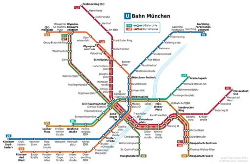
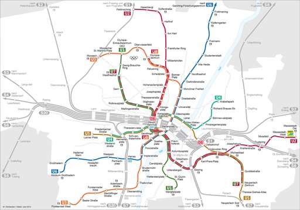
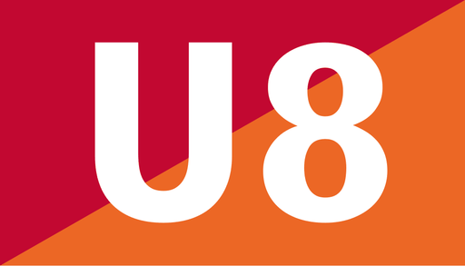

# U-Bahn München

Die **U-Bahn München** ist neben der S-Bahn das wichtigste Verkehrsmittel des öffentlichen Personennahverkehrs in München. Seit der Eröffnung der ersten Strecke am 19. Oktober 1971 wurde ein Netz mit 103,1 km Streckenlänge und 96 Haltestellen errichtet, an das auch die Nachbarstadt Garching bei München angeschlossen ist und in Zukunft auch der Planegger Ortsteil Martinsried (beide Landkreis München).

Die Münchner U-Bahn wird von der Münchner Verkehrsgesellschaft (MVG) betrieben und ist in den Münchner Verkehrs- und Tarifverbund (MVV) integriert. Im Jahr 2024 wurden 452 Millionen Fahrgäste verzeichnet.

## Liniennetz

Das Netz der Münchner U-Bahn hat eine Gesamtlänge von 103,1 km mit insgesamt 100 U-Bahnhöfen. Dabei werden die vier Turmbahnhöfe Olympia-Einkaufszentrum, Hauptbahnhof, Sendlinger Tor und Odeonsplatz mit ihren zwei Ebenen doppelt gezählt. Der kürzeste Abstand zwischen zwei Haltestellen beträgt 513 m zwischen Josephsplatz und Theresienstraße, der größte beträgt 4208 m zwischen Fröttmaning und Garching-Hochbrück.

Bis auf die Linien U5 und U6 verkehren alle Linien komplett in Tunneln. Die Linie U5 tritt kurz vor dem südlichen Linienende in Neuperlach Süd an die Oberfläche, die U6 im nördlichen Abschnitt zwischen Studentenstadt und Garching-Hochbrück sowie auf einem kurzen Stück zwischen Garching und Garching-Forschungszentrum.

Im gesamten Netz beträgt die Streckenhöchstgeschwindigkeit 80 km/h.

Auf allen Linien verkehren die Züge im 10-Minuten- sowie insbesondere zur Hauptverkehrszeit auch im 5-Minuten-Takt, teilweise jedoch nicht auf dem kompletten Linienlauf. Zu Betriebsbeginn und im Spätverkehr nach Mitternacht verkehren die Züge meist nur im 20-Minuten-Takt oder seltener. In Nächten auf Werktage außer Samstag herrscht von ca. 1 bis 4 Uhr Betriebsruhe; der Nachtverkehr wird durch die Trambahn und Nachtbuslinien geleistet. In Nächten von Freitag auf Samstag und Samstag auf Sonntag sowie vor Feiertagen wurde mit dem Jahr 2025 ein durchgehender Nachtverkehr im 30-Minuten-Takt eingeführt, auf der U6 allerdings nur bis Fröttmaning und nicht bis nach Garching. Zuvor herrschte von ca. 2 bis 4 Uhr Betriebsruhe. Durch Linienüberlagerungen ergeben sich abschnittsweise entsprechend dichtere Takte.

Bis auf den Früh- und Spätverkehr verkehren die meisten Linien mit Langzügen (6-Wagen-Züge), lediglich die Linie U4 und die Verstärkerlinie U7 zwischen Neuperlach Zentrum und Olympia-Einkaufszentrum werden überwiegend mit Vollzügen bedient, die heute als Kurzzüge bezeichnet werden. Die ehemaligen Kurzzüge aus nur einem Doppeltriebwagen werden nicht mehr eingesetzt.

### Stammstrecken

Das Netz der Münchner U-Bahn besteht aus drei Stammstrecken durch die Innenstadt, die von jeweils zwei Linien befahren werden. Auf den gemeinsamen Abschnitten der Linien sind die Fahrpläne so abgestimmt, dass sich durch die sich überlagernden Takte in der Regel eine gleichmäßige Zugfolge ergibt.
Die älteste Stammstrecke wird von den Linien U3 und U6 befahren (Abschnitt Münchner Freiheit bis Implerstraße), die zugehörige Kennfarbe der Haltestellenbeschilderung ist Blau. Die U1 und U2 befahren zwischen Hauptbahnhof und Kolumbusplatz die mit einem roten Linienband ausgestattete zweite Stammstrecke. Die zuletzt gebaute Stammstrecke, die Stammstrecke 3, wird zwischen Westendstraße und Max-Weber-Platz von der U4 und der U5 befahren und ist mit einem gelben Linienband versehen. Die meisten anderen Bahnhöfe der jeweiligen Linienfamilien sind ebenfalls mit dieser Kennfarbe an den Bahnhofswänden versehen.

Bis 1980 erhielt das Linienband die Farbe der Linie, die bei der Eröffnung des entsprechenden U-Bahnhofes dort verkehrte; daher wurde der Nordast der U3 mit einem orangen Linienband ausgestattet. Mit Eröffnung der Strecke der U1 zum Rotkreuzplatz im Jahr 1983 änderte man das Konzept und führte die Kennfarben für die Liniengruppen der Stammstrecken ein. Eine Abweichung bestand auf der Strecke zwischen Innsbrucker Ring und Neuperlach Süd, die als Teil der heutigen U2 (damals U8) eröffnet wurde und folglich mit einem roten Linienband ausgestattet war, seit 1999 aber nur noch von der U5 bedient wird; die zugehörige Kennfarbe Gelb wurde erst 2022 im Zuge von Renovierungsarbeiten installiert. Seit der Eröffnung des Bahnhofs Georg-Brauchle-Ring im Jahr 2003 wurden die Kennfarben nur noch bei einzelnen Bahnhöfen verwendet, außerdem sind sie bei einigen älteren Bahnhöfen durch Austauschen der Bahnhofsbeschilderung verschwunden.

### Nummerierung

Die Nummerierung der Linien ist nicht in der Reihenfolge ihrer Eröffnung erfolgt, vielmehr wurden ursprünglich die Nummern der jeweiligen verkehrenden Straßenbahnlinien übernommen. So hat die zuerst eröffnete Linie U6 ihre Bezeichnung von der Tramlinie 6 übernommen, die auf einer Trasse mit ähnlichem Einzugsgebiet die Stadt von Nord nach Süd durchquerte. Um Lücken zu vermeiden, wurde ab 1988 aber mit der Umnummerierung der U8 in U2 und der bis zur Inbetriebnahme in Planungen als U9 (Ersatz für Trambahnlinien 9, 19, 29) bezeichneten Linie in U4 davon abgewichen.

Die MVG betreibt acht U-Bahn-Linien, davon zwei nur zeitweise verkehrende Verstärkerlinien (Signets mit zweifarbigem Hintergrund).

### Linie U1

→ *Hauptartikel: Stammstrecke 2*

Die U1 beginnt seit 2004 am Olympia-Einkaufszentrum im Stadtteil Moosach, wo auch die U3 unter dem Bahnhof der U1 eine Haltestelle hat. Hier existiert auch die in München einmalige Einrichtung eines unterirdischen „Bike-and-Ride“-Parkhauses, also eines Fahrrad-Parkhauses direkt im U-Bahnhof.

Auf dem Weg zum Westfriedhof folgt die U1 der Hanauer Straße, an der Kreuzung zum Georg-Brauchle-Ring befindet sich der 2003 eröffnete und vom Künstler Franz Ackermann gestaltete gleichnamige Bahnhof. Der Bahnhof Westfriedhof ist wegen seiner von Ingo Maurer entworfenen Beleuchtung ein beliebtes Fotomotiv auch für Werbeagenturen. Weiter führt die U1 über Gern, wo die Stadtteilgeschichte auf großen Glasflächen in der Hintergleiswand nachzulesen ist, zum Rotkreuzplatz, zwischen 1983 und 1998 der nördliche Endpunkt der U1. Unter der Nymphenburger Straße führt die Linie nun über die Maillingerstraße zum Stiglmaierplatz, um schließlich am viergleisigen Hauptbahnhof mit der U2 in die gemeinsame Innenstadt-Stammstrecke zu münden.

Auf dem dicht befahrenen Innenstadtabschnitt verkehren U1 und U2 gegeneinander so versetzt, dass sich ein 3/7-Minuten-Takt ergibt. Von Montag bis Freitag ergibt sich durch Verdichterzüge zu bestimmten Tageszeiten ein gleichmäßigerer Takt. Am Hauptbahnhof unterqueren sie zudem die Stammstrecke der S-Bahn sowie die U4 und U5. Gleich am nächsten Bahnhof Sendlinger Tor unterquert die U1 die Gleise der U3 und U6 in einem Bahnhof mit zwei weit auseinander liegenden Einzelröhren, die durch einen Querbahnsteig verbunden sind.

Der folgende Bahnhof Fraunhoferstraße ist wegen seiner Nähe zur Isar im Schildvortrieb in zwei Einzelröhren aufgefahren, die jedoch im Bahnhofsbereich verbunden sind. Aus diesem Grund ist der Bahnhof durch dicke Säulen geprägt. Der folgende Bahnhof Kolumbusplatz ist als dreigleisiger Verzweigungsbahnhof ausgeführt, hier trennen sich nun die Linienwege von U1 und U2 wieder.

Die 1997 eröffnete Strecke der U1 biegt hier Richtung Süden ab, durchquert den bunt gestalteten Bahnhof Candidplatz und erreicht schließlich den Wettersteinplatz. Der folgende Bahnhof St.-Quirin-Platz ist architektonisch einzigartig und für die Münchner U-Bahn ebenso ungewöhnlich, da er zur Seite mit einem großen „Auge“ geöffnet ist und sich über ihm eine muschelförmige Dachkonstruktion aus Glas wölbt. Als einziger Bahnhof ist er mit zwei unmittelbar nebeneinander liegenden Aufzügen ausgestattet, da sich in der Nähe eine Einrichtung der Behindertenbetreuung befindet, was diese ungewöhnliche Maßnahme rechtfertigt. Ursprünglich geplant war hier lediglich ein Aufzug, die Aussparung hierfür kann man an der Decke des Bahnsteiggeschosses erkennen.

Unter der Naupliastraße befindet sich schließlich der Endbahnhof Mangfallplatz, an den sich eine große unterirdische Park-and-Ride-Anlage anschließt. Vom Wettersteinplatz aus war hier ursprünglich eine Trambahnstrecke vorgesehen, doch wurde die U-Bahn favorisiert.

Pläne über eine Verlängerung der U1 im Süden weiter bis zum Krankenhaus Harlaching oder gar zur Großhesseloher Brücke sind aus Kostengründen und wegen zweifelhaftem verkehrlichen Nutzen zurückgestellt worden. Ursprünglich sollte hier die Trambahnlinie 25 ersetzt werden, da bis Mitte der 1980er Jahre die Tram vollständig durch die U-Bahn ersetzt werden sollte. Eine Verlängerung im Norden Richtung Fasanerie ist mittelfristig ebenfalls nicht zu erwarten.

### Linie U2

→ *Hauptartikel: Stammstrecke 2*

Die U2 dürfte die Linie mit den am häufigsten gewechselten Linienenden sein. Auch änderte sie ihre Bezeichnung, da sie anfangs als Linie U8 bezeichnet wurde. Sie ist die einzige Linie (U2- und U8-Geschichte zusammengenommen), die auf allen drei Linienfamilien (U1/2, U3/6, U4/5) fährt bzw. gefahren ist. Die U2 hat heute eine Betriebslänge von ca. 24,4 km.

Heute beginnt die U2 im Norden unter dem S-Bahnhof Feldmoching, wo Anschluss zur S-Bahn-Linie S1 nach Freising und zum Flughafen und – zeitweise – auch zum Regionalzugverkehr nach Landshut besteht. Nach dem Bahnhof Milbertshofen trifft die U2 am viergleisigen Bahnhof Scheidplatz auf die U3, wo am selben Bahnsteig ein direktes Umsteigen möglich ist, der Anschluss wird in der Regel abgewartet. Bis zur Eröffnung der Strecke zur Dülferstraße im Jahr 1993 verkehrte die U2 ab Scheidplatz wie die U3 zum Olympiazentrum. Durch Schwabing und die Maxvorstadt geht es schließlich weiter in Richtung Innenstadt durch die Bahnhöfe Hohenzollernplatz, Josephsplatz, Theresienstraße und Königsplatz.

Am Hauptbahnhof trifft die U2 nun auf die gemeinsame Stammstrecke mit der U1 durch die Innenstadt bis Kolumbusplatz, genauere Informationen siehe U1. Ab dem Kolumbusplatz führt die U2 über Silberhornstraße und Untersbergstraße zum Bahnhof Giesing, wo eine Umsteigemöglichkeit zur S3 und S5 an der Oberfläche besteht. Über Karl-Preis-Platz verläuft die U2 weiter zum Innsbrucker Ring, wo – ebenso wie am Scheidplatz – in der Regel ein direkter Anschluss am selben Bahnsteig zu einer kreuzenden Linie besteht, hier zur U5. Bis zur Eröffnung des Streckenastes zur Messestadt im Jahr 1999 verkehrte die U2 hier ebenso wie die U5 nach Neuperlach Süd. Nun durchquert sie die Stadtteile Berg am Laim und Trudering, wo am Bahnhof Trudering eine weitere Verknüpfung mit der S-Bahn besteht.

Nach dem Bahnhof Moosfeld folgen nun noch die beiden Bahnhöfe Messestadt West und Messestadt Ost. Unmittelbar angrenzend zu den U-Bahnhöfen befindet sich nördlich das Messegelände und südlich ein Neubaugebiet, das Einkaufszentrum Riem Arcaden sowie die Flächen des Riemer Parks, in dem im Jahr 2005 die Bundesgartenschau stattfand.

### Linie U3

→ *Hauptartikel: Stammstrecke 1*

Der Bau der Linie U3 wurde drastisch beschleunigt, nachdem am 26. April 1966 die Olympischen Sommerspiele 1972 an München vergeben wurden. Der erst ein Jahr zuvor verabschiedete Liniennetzplan wurde geändert und die U3 als Zubringer zum Olympiagelände geplant, da die ursprüngliche Streckenführung über den Hauptbahnhof in der Kürze der Zeit nicht realisiert werden konnte. Außerdem wurde der Betrieb ohne Anbindung an die in Fröttmaning gelegene Technische Basis als zu riskant eingeschätzt. Die U3 hat eine Streckenlänge von 19 km.

Im Norden beginnt die U3 seit dem 11. Dezember 2010 am Bahnhof Moosach. Vorher begann sie am Bahnhof Olympia-Einkaufszentrum, wo die U1 beginnt. Über den Bahnhof Oberwiesenfeld, der den nördlichen Teil des Olympiaparks erschließt, wird der viergleisige Bahnhof Olympiazentrum erreicht, wo die U3 von 1972 bis 2007 ihren nördlichen Endpunkt hatte. Schon der jetzige Bahnhof *Olympiazentrum* hätte eigentlich bereits *Oberwiesenfeld* heißen sollen, weswegen im Linienband bis zu dessen Erneuerung 2014 jeweils einmal *Olympiazentrum (Oberwiesenfeld)* zu lesen war. Um den ursprünglichen Namen des Stadtteils im Stadtbild zu bewahren, heißt daher die provisorisch als *Olympiapark Nord* benannte neue Station nördlich von der Station *Olympiazentrum* *Oberwiesenfeld*.

Über den Bahnhof Petuelring wird der Scheidplatz erreicht, wo man am selben Bahnsteig gegenüber zeitgleich zur U2 Anschluss findet. Über Bonner Platz wird schließlich der Bahnhof Münchner Freiheit erreicht, wo die Strecke in die gemeinsame U3/U6-Stammstrecke einmündet. Über Giselastraße und Universität trifft die U3 am Odeonsplatz auf die kreuzenden Linien U4 und U5, die dort überquert werden. Ursprünglich war diese Umsteigemöglichkeit nicht vorgesehen, deswegen musste der Südkopf des Bahnhofs aufwändig umgebaut werden. Die Wege zwischen den beiden Stammstrecken sind daher auch nicht in der für München gewohnten Großzügigkeit angelegt.

Am von Alexander von Branca entworfenen Bahnhof Marienplatz werden die S-Bahn-Linien S1–S8 gekreuzt, hier kommt es vor allem im Berufs- und im Stadionverkehr häufig zu Überlastungen. Der Bahnhof ist der am stärksten frequentierte im gesamten U-Bahn-Netz, weswegen man sich nach der Entscheidung zum Neubau eines Fußballstadions in Fröttmaning dazu entschloss, hier durch zusätzliche Fußgängertunnel für Entlastung zu sorgen.

Am Sendlinger Tor werden schließlich die Linien U1 und U2 gekreuzt, deren Verlauf überquert wird. Über den bereits 35 Jahre zuvor errichteten Lindwurmtunnel wird der ebenfalls im Rohbau vor 1941 gebaute Bahnhof Goetheplatz erreicht. In diesem Tunnelabschnitt sind die Wandausbuchtungen für die ursprünglich vorgesehenen Oberleitungsmasten ebenso wie die Kennzeichnungen an den Wänden als Luftschutzraum im Zweiten Weltkrieg noch erkennbar. Der folgende Bahnhof Poccistraße (nahe dem ehemaligen Nahverkehrsbahnhof München Süd) wurde nachträglich zwischen den bereits bestehenden und in Betrieb befindlichen Tunneln eingebaut und am 28. Mai 1978, also knapp drei Jahre nach dem Rest der Strecke, eröffnet. Am Bahnhof Implerstraße trennen sich die Linienwege von U3 und U6 wieder, hier besteht außerdem in Gegenrichtung ein eingleisiger Abzweig zur Betriebsanlage Theresienwiese, über die die Strecke der U4/U5 erreicht wird.

Vom dreigleisigen Verzweigungsbahnhof *Implerstraße* aus führt die U3 fast genau Richtung Süden. Der nächste Bahnhof Brudermühlstraße wurde zusammen mit dem darüberliegenden Brudermühltunnel des Mittleren Rings gebaut, weswegen er vergleichsweise tief im Grundwasser liegt. Ein alter Mühlstein im Sperrengeschoss erinnert an die Tradition der Straße. Im folgenden Bahnhof Thalkirchen (Tierpark) erinnern Tiermotive an den von Ricarda Dietz gestalteten Hintergleiswänden an den nahegelegenen Tierpark Hellabrunn.

Von Thalkirchen führt die Linie erst in westlicher Richtung über die Stationen Obersendling (mit Anschluss an die S- und Regionalbahnstation Siemenswerke), Aidenbachstraße, Machtlfinger Straße, Forstenrieder Allee zur Station Basler Straße.
Der Endbahnhof Fürstenried West liegt bereits unmittelbar an der Stadtgrenze, eine weitere Verlängerung nach Neuried ist allerdings denkbar.

### Linie U4

→ *Hauptartikel: Stammstrecke 3*

Die U4 ist mit 9,247 km die kürzeste Münchner U-Bahn-Linie mit nur 13 Stationen. Sie wurde ursprünglich als U9 geplant und verkehrte bis zum Fahrplanwechsel 2006 als einzige Linie in der Regel nur mit Kurzzügen (4-Wagen-Züge). Ausnahmen bilden die Freitagnachmittage und die Zeit des Oktoberfests, seit dem Fahrplanwechsel am 10. Dezember 2006 verkehrt die U4 in den Ferien unter der Woche täglich zur Hauptverkehrszeit mit Langzügen mit sechs Wagen, dafür dann aber nur noch alle zehn Minuten statt bisher fünf.

Im Westen (betrieblich gesehen im Norden, obwohl das Südende der U4 als einziger Münchner Linie nördlicher liegt als das betriebliche Nordende) beginnt die U4 an der *Westendstraße*, wo auch die U5 verkehrt. Anfangs verkehrte die U4 wie die U5 bis zum *Laimer Platz*, wurde dann aber wegen mangelnder Auslastung um zwei Stationen zurückgenommen. U4 und U5 haben als einziges Linienpaar nur an einem Ende eine Aufgabelung der gemeinsamen Stammstrecke in zwei Strecken.

Am *Heimeranplatz* besteht Anschluss zu den S-Bahn-Linien S7 und S20. Der folgende Bahnhof *Schwanthalerhöhe* hieß bis 1998 (Umzug der Münchner Messe nach Riem) *Messegelände*. Kurz nach dem Bahnhof zweigt die einzige Betriebsstrecke der Münchner U-Bahn in die dreigleisige Betriebsanlage Theresienwiese ab, diese ist am südlichen Ende an den U-Bahnhof Implerstraße angeschlossen. In den ersten Betriebsjahren war dies die einzige Verbindung zum Restnetz der U-Bahn, und damit zur Technischen Basis in Fröttmaning. Heute besteht am Innsbrucker Ring eine weitere Verbindung.

Der Bahnhof *Theresienwiese* ist mit einer Aufsichtskanzel ausgestattet, um die Fahrgastmengen während des Oktoberfestes bewältigen zu können – bis zum Umbau des Bahnhofs in Fröttmaning war dies einzigartig im Münchner U-Bahn-Netz. Der südliche Ausgang des Bahnhofs endet auch direkt auf der Festwiese. Während der *Wiesn* wird hier auch grundsätzlich vom örtlichen Aufsichtspersonal und nicht vom Fahrer abgefertigt, wie es ansonsten der Fall ist. Tagsüber außerhalb der Hauptverkehrszeit beginnt die U4 an der Westendstraße, in der Hauptverkehrszeit und an Wochenenden (ausgenommen am frühen Morgen) erst an der Theresienwiese, da im westlichen Abschnitt die Fahrgastzahlen keine derartige Bedienung rechtfertigen.

Am *Hauptbahnhof* besteht Anschluss zu allen S-Bahnlinien und zur Stammstrecke der U1 und U2, die dort überquert wird. Nach Unterqueren der S-Bahn-Stammstrecke wird der Bahnhof *Karlsplatz (Stachus)* erreicht, bei dem erneut Anschluss zur S-Bahn besteht. Der U-Bahnhof hier ist der tiefste im Münchner U-Bahn-Netz, die Fahrtreppe am Ausgang Lenbachplatz ist mit 247 Stufen, 56,5 Metern Länge und 20,63 Metern Förderhöhe die längste in München. Im weiteren Verlauf zum *Odeonsplatz*, wo Anschluss zur U3 und U6 besteht, wird mit etwa 36 Metern auch die tiefste Stelle des gesamten Netzes erreicht. Am Odeonsplatz befindet sich mit 52,8 Metern Länge die zweitlängste Fahrtreppe Münchens. Zum Vergleich: Der tiefste U-Bahnhof Deutschlands (26 m) gleichzeitig der mit der Fahrtreppe mit der größten Förderhöhe (22 m) befindet sich in Hamburg (U-Bahnhof Messehallen).

Wie der Odeonsplatz ist auch der folgende Bahnhof *Lehel* ein bergmännisch aufgefahrener Bahnhof mit zwei Einzelröhren, die durch Querschläge verbunden sind. Die Strecke unterquert nun die Isar, um im dreigleisigen Verzweigungsbahnhof *Max-Weber-Platz* beim Maximilianeum die gemeinsame U4-/U5-Stammstrecke wieder zu verlassen. Einer der Ausgänge des U-Bahnhofs am Max-Weber-Platz ist in einem unter Denkmalschutz stehenden Trambahnpavillon untergebracht, der im Rahmen des U-Bahn-Baus den Verkehrsträger gewechselt hat.

Über den wie Marienplatz durch Alexander Freiherr von Branca entworfenen Bahnhof *Prinzregentenplatz* und dem in seiner grünen Gestaltung an seinen Namensgeber erinnernden Bahnhof *Böhmerwaldplatz* erreicht die U4 den Bahnhof *Richard-Strauss-Straße*, der bedingt durch die Lage als einziger auf dieser Strecke mit Seitenbahnsteigen ausgestattet ist. Am Böhmerwaldplatz wird auch direkt ein Straßentunnel des Mittleren Rings unterquert, der wie auch die U-Bahn unter der Richard-Strauss-Straße liegt. Am Bahnhof *Arabellapark* endet die U4, die Abstellanlage führt jedoch noch 600 Meter fast bis zum ursprünglich geplanten Bahnhof Cosimapark weiter.

Eine Weiterführung der U4 über *Cosimapark* und *Fideliopark* Richtung Englschalking ist im 3. Mittelfristprogramm für den U-Bahn-Bau der Landeshauptstadt München zwar enthalten, aufgrund der ohnehin schon relativ geringen Auslastung der U4 jedoch mittelfristig nicht zu erwarten.

### Linie U5

→ *Hauptartikel: Stammstrecke 3*

Die U5 beginnt derzeit am *Laimer Platz* (eine Verlängerung nach Pasing ist im Bau, siehe unten). Die derzeitige Betriebslänge beträgt 15,4 km.

Die U5 führt über den ebenfalls sehr hell gestalteten Bahnhof *Friedenheimer Straße* zur *Westendstraße*, wo sie dann über *Heimeranplatz*, *Schwanthalerhöhe*, *Theresienwiese*, *Hauptbahnhof*, *Karlsplatz (Stachus)*, *Odeonsplatz* und *Lehel* bis *Max-Weber-Platz* denselben Verlauf wie die U4 hat, siehe U4.

Am Max-Weber-Platz trennt sich die Stammstrecke der U4/U5 schließlich, die U5 biegt in einer Rechtskurve nach Süden zum in starkem weiß-roten Kontrast gestalteten *Ostbahnhof* ab. Dort besteht Anschluss zur S-Bahn-Stammstrecke, die hier auch unterquert wird. Nach dem mit 1602 Metern drittlängsten innerstädtischen Abstand zwischen zwei Bahnhöfen folgt am Bahnhof *Innsbrucker Ring* direkte Anschlussmöglichkeit zur U2 Richtung Messestadt am selben Bahnsteig gegenüber.

Nach dem Bahnhof *Michaelibad* folgt mit 1708 Metern der längste innerstädtische Abschnitt zwischen zwei Bahnhöfen. Dabei verläuft die Strecke am Rande des Ostparks und erreicht den Bahnhof *Quiddestraße*. Als nächster Bahnhof folgt *Neuperlach Zentrum*, in der seit den 1960er Jahren erbauten Neubaugroßsiedlung Neuperlach. Nach dem Bahnhof *Therese-Giehse-Allee* kommt die U5 schließlich an die Oberfläche, um im Bahnhof *Neuperlach Süd* zu enden. Den ähnlich den Berliner Hochbahnstrecken auf einer Brücke gelegenen Bahnhof erkennt man schon von weitem durch seine gezackte Dachstruktur. Diese Strecke wurde ursprünglich von der U8, ab 1988 gemeinsam von der U2 und U5 und wird seit 1999 nur noch von der U5 bedient. Der Bahnhof *Neuperlach Süd* wurde im Rahmen einer Renovierung von 2007 bis 2008 auf der Bahnsteigebene teilweise umgestaltet. So wurde die für diese Linie ungewohnte Farbe Orange an den Säulen der Bedachung verwendet. Ebenso wurde hier das neue Wegweisersystem der Stationen, das teilweise zuvor schon beim Umbau der Station *Marienplatz* bzw. an der Haltestelle *Odeonsplatz* verwendet und seither in weiteren Stationen eingeführt wurde, installiert. Die Zugangsebene des Bahnhofs wurde nur mit zusätzlichen Verkaufsflächen ausgestattet und nicht wesentlich renoviert.

In Neuperlach Süd gibt es die Besonderheit, dass sich S-Bahn und U-Bahn einen Bahnsteig teilen – auf Gleis 3 verkehrt die S5, auf Gleis 2 an der anderen Seite des Bahnsteigs kommen die Züge der U5 an. Es besteht also ein direkter Übergang von der U-Bahn zur S-Bahn am selben Bahnsteig. In Neuperlach Süd befindet sich außerdem eine größere Abstellanlage (Betriebsanlage Süd), in der zu Schwachlastzeiten und nachts viele Züge abgestellt werden, die nicht in Fröttmaning oder in Abstellanlagen im Netz verteilt abgestellt werden können.

Zu Anfang des Regelbetriebs der Münchner U-Bahn gab es eine kurzlebige Verstärkerlinie U5 zwischen *Münchner Freiheit* und *Goetheplatz*, nach nur gut einem Jahr wurde diese Linie zum 2. Juli 1973 wieder eingestellt und die Fahrten in die Linie U6 eingegliedert.

### Linie U6

→ *Hauptartikel: Stammstrecke 1*

Die U6 hat 26 Stationen und ist mit 27,4 km die längste Münchner U-Bahn-Linie und verfügt als einzige Linie über längere oberirdische Strecken. Sie wurde als erste Linie in Betrieb genommen. Der Lindwurmtunnel (Abschnitt zwischen Sendlinger Tor und einschließlich Bahnhof Goetheplatz) wurde bereits 1938–1941 als Teil einer Nord-Süd-S-Bahn-Strecke erbaut. Diese ähnelt weitgehend dem heutigen Verlauf der U6, sollte aber am Karlsplatz/Stachus die Ost-West-S-Bahn kreuzen.

Als einzige Linie verlässt sie das Münchner Stadtgebiet. So beginnt sie unter dem Hochschul- und Forschungszentrum der Stadt Garching bei München am Bahnhof Garching-Forschungszentrum. Von dort aus unterquert die Strecke Garching selber und bindet die Stadt mit einem U-Bahnhof an, ehe sie kurz vor dem Bahnhof Garching-Hochbrück im gleichnamigen Garchinger Stadtteil an die Oberfläche kommt. Anschließend fahren die U-Bahnen 4208 Meter ohne Halt bis nach München. Die erste Station in München selbst heißt Fröttmaning und bindet die Allianz Arena an. Mit dem Bau der Arena musste die Station viergleisig neu gebaut werden, um die hohen Fahrgastzahlen bei Fußballspielen bewältigen zu können. Der folgende Bahnhof Kieferngarten, Endstation der ersten Münchner U-Bahn-Strecke, ist ein viergleisiger Verzweigungsbahnhof, hier befindet sich in Gegenrichtung der Abzweig zur Technischen Basis. Weiter an der Oberfläche führt die Strecke über Freimann zur Studentenstadt. Danach fahren die U-Bahnen wieder unterirdisch. Die Strecke folgt nun der Ungererstraße mit den Stationen Alte Heide, Nordfriedhof und Dietlindenstraße bis zur Münchner Freiheit. Ab hier fährt die U6 den gleichen Weg wie die U3 südwärts unter der Innenstadt hindurch nach Sendling, wo sich die Wege der beiden Linien am Bahnhof Implerstraße wieder trennen.

Hinter der Implerstraße biegt die Strecke nach Westen zum Harras ab, an dem man zur S-Bahnlinie S7 umsteigen kann. Anschließend unterquert sie den Stadtbezirk Sendling-Westpark in Ost-West-Richtung. Dieser Streckenabschnitt mit seinen Stationen Partnachplatz, Westpark und Holzapfelkreuth wurde mit der Internationalen Gartenausstellung im Westpark eröffnet. Schließlich erreichen die U-Bahnen über die Bahnhöfe Haderner Stern und Großhadern das Südende der U6 beim Klinikum Großhadern. Aktuell finden die Bauarbeiten zur Verlängerung bis nach Martinsried statt, um das Biozentrum und die LMU besser an den Münchner Nahverkehr anzuschließen. Stand Anfang 2023 war die Eröffnung 2027 geplant.

### Linie U7

Die U7 ist eine Verstärkerlinie und verkehrt nur während der Hauptverkehrszeiten auf der gesamten Streckenlänge, ausgenommen Freitagnachmittag und während Schulferien. Sie besitzt 19 Stationen und bedient zwei Stammstrecken. Die U7 beginnt am Olympia-Einkaufszentrum und fährt parallel zur U1 auf der Stammstrecke 2 zum *Hauptbahnhof*. Zusammen mit U1 und U2 führt die Linie über das *Sendlinger Tor* zum *Kolumbusplatz* und zusammen mit der U2 weiter über *Giesing* zum *Innsbrucker Ring*. Dort fährt die U7 auf dem Gleis ein, auf dem sonst die U2 abgefertigt wird. Bei Ausfahrt aus dem Bahnhof biegt die U7 auf die Stammstrecke 3 ab und fährt parallel zur U5 zu ihrem Endpunkt *Neuperlach Zentrum*.

Die U7 wurde zum Fahrplanwechsel am 12. Dezember 2011 eingeführt. Sie ersetzte die bisherigen Verstärkerfahrten der U1 zwischen *Westfriedhof* und *Sendlinger Tor*. Im Betrieb werden auf der U7 in der Regel sogenannte Kurzzüge mit vier Wagen eingesetzt, weswegen nur die Wagentypen A und B verkehren. Bis zum 14. Dezember 2013 fuhr die Linie nur in der morgendlichen Hauptverkehrszeit an Schultagen auf der gesamten Streckenlänge, während nachmittags und in den Ferien nur der Abschnitt zwischen *Westfriedhof* und *Sendlinger Tor* bedient wurde. Seit dem 15. Dezember 2013 fahren die Züge an Schultagen auch nachmittags bis *Neuperlach Zentrum*, während sie in den Ferien weiterhin nur bis *Sendlinger Tor* verkehren.

Im Zuge von Bauarbeiten an der U3 zwischen den Bahnhöfen Scheidplatz und Münchner Freiheit im Jahr 2017, bei denen die Strecke für mehrere Monate gesperrt werden musste, wurde die U7 zunächst temporär zum Olympia-Einkaufszentrum verlängert. Die MVG hat sich entschieden, die U7 auch weiterhin bis zum Olympia-Einkaufszentrum zu führen. Zum 9. Oktober 2023 wurde die U7 wegen eingeschränkter Fahrzeugverfügbarkeit bis auf Weiteres auf den Abschnitt zwischen Olympia-Einkaufszentrum und Sendlinger Tor gekürzt.

### Linie U8

Die U8 ist eine Verstärkerlinie und verkehrt nur am Samstagnachmittag. Mit dem Fahrplanwechsel am 15. Dezember 2013 erhielten die bereits seit einiger Zeit samstags durchgeführten Fahrten zwischen *Olympiazentrum* und *Sendlinger Tor* über den Hauptbahnhof eine eigene Liniennummer. Seit dem 9. Dezember 2018 fahren die Züge weiter bis *Neuperlach Zentrum.* Die U8 bedient 19 Stationen an allen drei Stammstrecken. Zwischen *Olympiazentrum* und *Scheidplatz* fährt sie parallel zur U3 auf der Stammstrecke 1, im weiteren Verlauf bis *Innsbrucker Ring* parallel zur U2 auf der Stammstrecke 2, ehe sie dort auf die Stammstrecke 3 wechselt und dem Verlauf der U5 bis *Neuperlach Zentrum* folgt. Damit fährt sie auf einer Teilstrecke der bereits von 1980 bis 1988 von *Olympiazentrum* über *Sendlinger Tor* nach *Neuperlach Süd* verkehrenden U8 (heute U2).

## Bahnhöfe

→ *Hauptartikel: Liste der Münchner U-Bahnhöfe*

### Struktur und Ausstattung

Bis auf die ebenerdig gelegenen Bahnhöfe *Studentenstadt*, *Freimann*, *Kieferngarten*, *Fröttmaning*, *Garching-Hochbrück* (alle U6) sowie den in Hochlage errichteten Bahnhof *Neuperlach Süd* (U5) sind alle Bahnhöfe als Tunnelbahnhöfe in mindestens einfacher Tiefenlage ausgeführt. Die Bahnsteige sind in der Regel etwa 120 Meter lang. Alle Bahnhöfe wurden mit einem taktilen Rillenband vor der Bahnsteigkante ausgestattet, neuere Bahnhöfe verfügen über ein komplettes taktiles Leitsystem von den Liften und Treppen zum Bahnsteig. Dafür wurde den Stadtwerken 1996 der Integrationspreis des Bayerischen Blindenbundes verliehen. Die ursprünglichen Rillen wurden inzwischen durch besser fühlbare Rillen- und Noppenplatten ersetzt.

Die meisten Bahnhöfe sind zweigleisig und mit einem Mittelbahnsteig ausgestattet, zweigleisig mit Seitenbahnsteigen sind lediglich die Bahnhöfe *Olympia-Einkaufszentrum* (U1), *Richard-Strauss-Straße* (U4), *Neuperlach Süd* (U5), *Garching-Hochbrück* und *Nordfriedhof* (beide U6). Vier Gleise besitzen die beiden Kreuzungsbahnhöfe *Scheidplatz* und *Innsbrucker Ring*, die Verzweigungsbahnhöfe *Hauptbahnhof* (U1 und U2), *Münchner Freiheit* und *Kieferngarten* sowie die Bahnhöfe *Olympiazentrum* und *Fröttmaning*, in deren Umgebung regelmäßig Großveranstaltungen stattfinden. Die Verzweigungsbahnhöfe *Implerstraße*, *Max-Weber-Platz* und *Kolumbusplatz* sind dreigleisig ausgeführt; im Unterschied zu den viergleisigen Verzweigungsbahnhöfen besitzen die Linien stadtauswärts hier ein gemeinsames Gleis und trennen sich erst hinter dem Bahnhof.

Im Bahnsteigbereich aller Bahnhöfe ist an den Wänden, teilweise auch in der Bahnsteigmitte und gegebenenfalls zwischen den Gleisen wiederholt, der Stationsname ausgeschildert, entweder auf einem durchgängigen Linienband in der Farbe der jeweiligen Liniengruppe oder auf Tafeln in der gleichen Farbe. Hiervon weichen lediglich die beiden 2006 eröffneten Bahnhöfe der U6 in Garching ab: Am Forschungszentrum wurde auf den Stationsnamen an den Wänden verzichtet, und in Garching wurde der Name im Stil des Logos der Stadt Garching ohne weitere Hervorhebung an die Wandverkleidung gezeichnet. Bei Neubeschriftungen mit dem neuen Leitsystem, wie zum Beispiel an den U4/U5-Stationen *Lehel*, *Odeonsplatz* und *Karlsplatz (Stachus)*, wird der Stationsname auf der Bahnsteigseite auf Tafeln über dem Linienband angebracht.

Die Mehrzahl der Bahnhöfe verfügt über zwei voneinander getrennte Zugänge, alle Bahnhöfe sind mit Rolltreppen und Aufzügen barrierefrei erreichbar. Die Bahnsteighöhe beträgt 100 beziehungsweise 105 Zentimeter über Schienenoberkante, was ein rasches Zusteigen in die Züge mit ebenso hohen Fußböden ermöglicht. Die Mehrzahl der Bahnhöfe verfügt über einen Kiosk oder andere Verkaufsstände, meistens sind auch Toiletten vorhanden. In weiteren Betriebsräumen sind technische Betriebsanlagen untergebracht, etwa Gleichrichterwerke zur Stromversorgung oder Stellwerkstechnik.

Die meisten U-Bahnhöfe haben ein oder mehrere Zwischengeschosse, die als Sperrengeschosse bezeichnet werden. Sie verbinden mehrere Stationseingänge mit den Gleisen. Bis zum Sommer 2019 war der Zutritt zu den Bahnsteigen nur Personen mit einer Fahrkarte oder einer Bahnsteigkarte erlaubt, die nur zum Betreten der Plattform, aber nicht zur Fahrt mit der U-Bahn berechtigte. Die Bahnsteigkarte wurde mittlerweile abgeschafft. Derartige Bahnsteigbeschränkungen gibt es nur noch im Hamburger Verkehrsverbund. Einige U-Bahnhöfe haben von ihren Sperrengeschossen auch direkten Zugang zu angrenzenden Kaufhäusern: *Marienplatz*, *Münchner Freiheit*, *Hauptbahnhof*, *Dülferstraße*, *Karlsplatz (Stachus)* und *Olympia-Einkaufszentrum*.

Die derzeit installierten Notrufsäulen (mit gesondertem Inforuf) sind auch im Rollstuhl bedienbar und haben für sehbehinderte Menschen sowohl Brailleschrift auf den einzelnen Tasten als auch tastbare Buchstaben.

### Entwicklung der Anzeigetechnologie in der Münchner U-Bahn

Ab der Eröffnung waren zuerst Lichtkastenanzeiger an den Bahnsteigen angebracht. Diese bestanden aus einem Metallgehäuse mit hinterglas-bedruckten Tafeln. Für die entsprechende Anzeige leuchtete eine Leuchtstofflampe im Gehäuse auf und beleuchtete die Tafeln von hinten. So wurde das Zugziel bzw. die Information wie „nicht einsteigen“ für den Fahrgast sichtbar. Etwas später, Anfang der 1970er Jahre, wurden die Lichtkastenanzeiger durch Fallblattanzeigen der Firma Solari di Udine durch AEG-Telefunken ersetzt. Die Firma stattete auch die A-Wagen sowie die ersten Serien der B-Wagen mit Zugzielanzeigen aus. Diese älteren Fallblattanzeigen basierten auf einem rein analogen Kommunikationssystem. Die Codierung erfolgte über zwei Schleifkontakte am Fallblattmodul selbst, welche 40 Stromlaufmöglichkeiten einstellen konnten. Daraus ergibt sich auch die maximal mögliche Blattzahl, nämlich 40 Fallblätter. Vorhanden waren pro Seite je zwei Module. Das obere, kürzere zeigte die Linie sowie Anzahl und Position der Traktionen am Bahnsteig an. Das untere, längere Modul zeigte das Zugziel und Informationen wie „Einrückfahrt“, „Bitte auf Lautsprecherdurchsage achten“ oder „Nicht einsteigen“ an. Im Gegensatz zu den Anzeigen der U-Bahn Nürnberg enthielten die Anzeigen der Münchner U-Bahn keinen Zuglauf.

Anfang 1980 wurde damit begonnen, die alten Solari-Anzeiger durch modernere Anzeiger der Firma Krone-Informationssysteme zu ersetzen und neue Bahnhöfe mit Krone-Anzeigen auszustatten. Deren Ansteuerung basiert eigentlich auf einem RS-485-System, jedoch wurden sie für die Münchner U-Bahn modifiziert geliefert. Um das vorhandene System von AEG-Telefunken und die Leitungen nicht ersetzen zu müssen, wurde in die Anzeiger ein digitaler Wandler mit Mikrocontroller montiert, welcher die analogen Signale des alten Zentralrechners in modernere TTL-Signale für die Fallblattmodule umwandelt. Somit waren die Fallblattanzeiger der Münchner U-Bahn technisch einzigartig im Vergleich zu den sonstigen Anzeigern, die Krone beispielsweise für die Deutsche Bahn hergestellt hat.

Auch die neueren Krone-Anzeiger enthielten nur jeweils 40 Blätter im Ziel- und Linienmodul.

2004 wurde damit begonnen, die bestehenden Fallblattanzeigen durch Anzeiger in TFT-Technik auszutauschen. Zuvor wurden an einigen Bahnhöfen testweise Anzeiger auf LCD-Technik installiert.

Am 10. Juni 2013 wurde der letzte Fallblattanzeiger am Bahnhof *Harthof* demontiert. Damit endete die Ära der Fallblattanzeigen bei der Münchner U-Bahn. Viele Anzeiger überlebten bis heute nicht, da sie durch die SWM mit Verschrottungsnachweis entsorgt werden mussten. Es gibt nachweislich drei Krone-Anzeiger in Privatsammlungen (zwei Voranzeiger vom Bahnhof *Marienplatz* und einen doppelseitigen Bahnsteiganzeiger) und einen Solari-Anzeiger im MVG-Museum München.

2025 wurde die bisherige Schriftart der TFT-Anzeiger an den Bahnsteigen sowie in den Zügen schrittweise durch die barrierefreie Schriftart Atkinson Hyperlegible ersetzt. Dadurch soll die Lesbarkeit der Anzeigen erhöht werden.

### Architektur

Als die ersten U-Bahnhöfe Mitte der 1960er Jahre ausgeschrieben wurden, war das Interesse vieler Architekten an deren Bau mitzuwirken eher gering. Die von Schlichtheit und Funktionalität geprägte Untergrundarchitektur galt als wenig interessant und einträglich. Im Laufe der 1980er Jahre stiegen allmählich die Ansprüche an eine ansprechende Gestaltung der U-Bahnhöfe. Helle lichte Räume sollten dem Gefühl der Beklemmung unter der Erde entgegenwirken. Gerade Linien, welche die Geometrie in den Anfangsjahren prägten, wichen allmählich geschwungenen Linienformen. Auch der Charakter der Oberfläche wurde bei der Gestaltung der Bahnhöfe zunehmend mit berücksichtigt. Der Bau vieler Bahnhöfe wurden von den eigenen Architekten des U-Bahn- und später Baureferats, darunter Garabede Chahbasian, Hans-Alfred Schaller und Paul Kramer, geplant und durchgeführt.

Auf der zuerst gebauten Linie U6 zeichnete Paolo Nestler für die Mehrzahl der Regelbahnhöfe zwischen *Alte Heide* und *Harras* verantwortlich. Die eher schlichten, fast an Bauhaus-Ideale erinnernden Bahnhofsbauten sind durch gerade Linien und funktionale Raumgestaltung gekennzeichnet. Unterscheidbar sind die Bahnhöfe durch verschiedene Farben und Formen der mit Keramikplatten verkleideten Bahnsteigsäulen und durch leicht unterschiedliche Farbtöne der Wandpaneele aus Faserzementtafeln. An der *Münchner Freiheit* durchbricht ein von Jürgen Reipka gestaltetes Wandfries die ansonsten monotone Gestaltung. Von Mai 2008 bis Ende 2009 wurde der Bahnhof *Münchner Freiheit* saniert und bekam durch das Lichtkonzept von Ingo Maurer ein neues Gesicht.

Der zentrale Umsteigebahnhof am Marienplatz sticht aus dem Design der Regelbahnhöfe heraus. Hier gewann das Büro des renommierten Architekten Alexander Freiherr von Branca den Wettbewerb und gestaltete den Bahnhof in kräftigen Orange-, Dunkelblau- und Dunkelgrün-Tönen. Für den Bahnhofsumbau von 2004 bis 2006 war von Branca ebenfalls verantwortlich: Behutsam integrierte er die Erweiterungsbauten in das bestehende Konzept.

Die nur wenige Jahre später geplanten und ausgeführten Bahnhöfe der U3 zum Olympiapark wurden ganz anders als die Nestler’schen Regelbahnhöfe in Sichtbeton mit Wandreliefs von Christine Stadler und Waki Zöllner ausgeführt. Die erfolgreiche Olympiabewerbung ermöglichte hier ein neues Selbstbewusstsein in der Gestaltung.

Die 1980 eröffneten Bahnhöfe der damaligen Linie U8 zwischen *Scheidplatz* und *Neuperlach Süd* (heute bis *Innsbrucker Ring* U2, anschließend U5) gleichen sich in der Gestaltung stark. In Anlehnung an die U6 wurde hier dasselbe Grundkonzept für fast alle Bahnhöfe verwendet. Lediglich die Farbgebung und die Art der Zugangsanlagen unterscheidet die meisten Bahnhöfe. Hervorzuheben ist auf dieser Strecke der von Josef Wiedemann gestaltete *U-Bahnhof Königsplatz*: Hier wurden Repliken, allerdings erst 1988, und Faksimiles der auf dem darüber liegenden Kunstareal ausgestellten Kunstwerke direkt auf dem Bahnsteig und an den Hintergleiswänden platziert. Über dem Bahnsteig befindet sich seit 1994 in einem bis dahin weitgehend ungenutzten Hohlraum ein Ausstellungsraum (Kunstbau). Die Umsteigebahnhöfe *Sendlinger Tor* und *Hauptbahnhof* wurden ebenfalls anders gestaltet, um ihre Bedeutung hervorzuheben.

Ab Anfang der 1980er Jahre legte man zunehmend Wert auf die Gestaltung. Die in Brauntönen gehaltenen Bahnhöfe der Linie U1 zum *Rotkreuzplatz* machten den Anfang, konnten die Fachwelt jedoch nicht überzeugen. Die zur Internationalen Gartenbauausstellung 1983 eröffneten Bahnhöfe der als *Blumenlinie* bezeichneten Verlängerung der Linie U6 mit den Stationen *Partnachplatz*, *Westpark* und *Holzapfelkreuth* gefielen mit ihrer Gestaltung in abgestuften Grün- und Gelbtönen schon besser. Die kurz darauf eröffneten Bahnhöfe der Linien U4 und U5 waren gestalterisch noch detailreicher. Erstmals wurde jeder Bahnhof individuell gestaltet und auch – wie schon am *Königsplatz* vier Jahre zuvor – die Oberfläche in die Gestaltung mit einbezogen. Der Bahnhof *Theresienwiese* lehnt sich in der Gestaltung an einen Brauereikeller an. Unter dem *Stachus* erinnern von Volker Sander gestaltete Bilder vergangener Straßenbahnfahrzeuge an die Tradition als Umsteigeknoten im öffentlichen Nahverkehr. Im Bahnhof *Messegelände* (heute *Schwanthalerhöhe*) verbreiten Fahnen und Silhouetten von Messebesuchern an den Wänden internationalen Flair. Auch bei den Materialien gab es Änderungen: waren anfangs Kunststein, Faserzementtafeln und Beton beliebte Elemente, gewannen später Stahl, Aluminium und Glas an Bedeutung.

Teilweise aufwendige Gestaltungen der Bahnsteige und vor allem der Hintergleiswände zeichnen die Mehrzahl der jüngeren Bahnhöfe aus. Durch hohe, säulenlose Bahnhofshallen konnte meist ein heller und freundlicher Raumeindruck vermittelt werden. Bei Bahnhöfen in geringer Tieflage, wie *Oberwiesenfeld*, *Machtlfinger Straße* (beide U3), *Messestadt West* (U2) und *St.-Quirin-Platz* (U1), wurde auch das Tageslicht bei der Raumgestaltung und Innenbeleuchtung genutzt. Die zuletzt genannte an einem Hang liegende Station wurde mit einer aufwändigen Dachkonstruktion überspannt. *St.-Quirin-Platz* ist somit der einzige unterirdisch gelegene Bahnhof in München, in dem durchfahrende Fahrgäste einen kurzen Blick „nach draußen“ (in die Grünanlage *Am Hohen Weg*) werfen können. Wo kein Tageslicht verfügbar war, wurden aus indirekter künstlicher Beleuchtung mittels reflektierender Wand- und Deckenelemente bestehende Lichtkonzepte realisiert und so der aus lang gezogenen Leuchtstoffröhrenreihen bestehende „Einheitsbrei“ bei der Beleuchtung früherer Stationen vermieden.

## Geschichte

### Frühe Planungen 1905–1928

Bereits 1905 gab es Pläne, eine unterirdische Gleistrasse in etwa auf der Trasse der heutigen S-Bahn-Stammstrecke zwischen Haupt- und Ostbahnhof sowie eine Ringbahn, die die Altstadt umrundet, zu bauen. Da diese Planungen für das damalige Verkehrsaufkommen aber deutlich überdimensioniert waren, wurden sie nicht umgesetzt. Das Straßenbahnnetz konnte die Verkehrsströme in der damaligen Halbmillionenstadt noch abdecken.

1928 gab es erneut Pläne, die Straßenbahnen in München durch ein U-Bahn-Netz zu ersetzen, jedoch vereitelte die Weltwirtschaftskrise alle Pläne. Es sollte ein Netz von fünf U-Bahn-Strecken, die mit der heutigen Streckenverteilung einige Gemeinsamkeiten hatten, verwirklicht werden.

### Post-U-Bahn (1910–1988)

→ *Hauptartikel: Post-U-Bahn München*

Ab 1910 verband die nur 450 m lange, automatisierte *Post-U-Bahn München* den Hauptbahnhof mit dem Bahnpostamt an der Hopfenstraße. Sie diente nur dem Transport von Briefpost. Sie stand mit der eigentlichen (für Personenverkehr bestimmten) U-Bahn weder konzeptionell noch bautechnisch in Zusammenhang.

### Planungen und unvollendete Bauten 1936–1941

In der Zeit des Nationalsozialismus plante man ab 1936 ein Netz elektrischer unterirdischer Bahnen für die „Hauptstadt der Bewegung“ und es wurde auch schon mit dem Bau begonnen, doch der Zweite Weltkrieg setzte dem ein Ende. Der Tunnel der heutigen U6 zwischen *Sendlinger Tor* und *Goetheplatz* – einschließlich des dortigen Bahnhofs – wurde bereits im Rohbau fertiggestellt, allerdings noch als Teil einer S-Bahn-Trasse. So erklärt sich auch die relative Großzügigkeit des Goetheplatzes (insbesondere im Sperrengeschoss Eingang Goetheplatz passt die Architektur nicht zur heutigen Nutzung) und die Enge des jetzigen Umsteigebahnhofs Sendlinger Tor auf dem Bahnsteig der U3/U6 (siehe unten „Planungen nach dem Zweiten Weltkrieg“: Kreuzungspunkt der Linien C und D).

In der Lindwurmstraße erfolgte am 22. Mai 1938 der erste Spatenstich für diesen Tunnel, der den Anfang vom Ende der Trambahn einläuten sollte. Zwischen dem Goetheplatz und der Reisingerstraße wurde ein Tunnel von 590 Meter Länge gegraben, der bis 1941 im Rohbau fertiggestellt war. Erste Triebwagen sollten im selben Jahr geliefert werden. Die kriegsbedingte Verknappung der Ressourcen führte zur Einstellung dieser Arbeiten. Der Rohbau diente während des Krieges als Luftschutzkeller, wovon heute noch Beschriftungen an den Tunnelwänden zeugen.

Teile des Tunnels wurden nach dem Krieg mit Trümmerschutt verfüllt, andere dienten noch eine Weile als Zuchtstätte für Pilze, ehe eindringendes Grundwasser das kurze Stück früher U-Bahn-Geschichte unbenutzbar machte.

### Planungen nach dem Zweiten Weltkrieg

Schon kurz nach dem Krieg gab es in der Stadtverwaltung München Stimmen, die sich für die Planung eines Schnellbahnsystems in München starkmachten, jedoch begann erst 1953 mit der Bildung der „Studiengesellschaft für den Bau einer Münchner Hoch- und Untergrundbahn“ eine neue Planungsphase. Zunächst war es jedoch vordringlich, dass das Straßenbahnnetz wieder instand gesetzt wurde, so dass kein Geld für eine U-Bahn vorhanden war. Die Planungen für eine U-Bahn in München dümpelten dahin, während der Verkehrsraum für den Oberflächenverkehr immer mehr ausgelastet war und die Straßenbahnen in der Innenstadt immer häufiger im Verkehrsgetümmel stecken blieben. Die Durchschnittsgeschwindigkeit der Trambahnen lag teilweise bei nur noch 4–13 km/h, zwischen Karlsplatz und Marienplatz verkehrten pro Stunde 62 Straßenbahnzüge. Der starke Bevölkerungsanstieg um jährlich etwa 50.000 Einwohner in den späten 1950er Jahren – 1958 zählte München bereits eine Million Einwohner – und die zunehmende Motorisierung trugen ihren Teil zum Verkehrschaos bei. Etwa 130 000 Pendler strömten tagtäglich in die Landeshauptstadt, im Stadtgebiet waren täglich 400 000 Münchner unterwegs.

Zunächst war strittig, ob auf der Ost-West-Trasse zwischen dem Ostbahnhof und dem Hauptbahnhof die S-Bahn oder die Tiefbahn verkehren sollte. Die Stadt München favorisierte eine in den Boden verlegte Trambahn mit Oberleitung, die Bundesbahn wollte mit einer unterirdisch verlegten S-Bahn den Hauptbahnhof mit dem Ostbahnhof verbinden. Erst 1963 gab es eine Einigung im Trassenstreit, die „klassische Trasse“ wurde der S-Bahn zugeschlagen, die S-Bahn-Stammstrecke konnte gebaut werden. Auch war lange Zeit strittig, ob sich die Nord-Süd-U-Bahn mit der S-Bahn am Stachus, also dem modernen verkehrlichen Zentrum der Stadt, oder am Marienplatz, dem historischen Zentrum, treffen sollten. Die Wahl fiel schließlich auf den Marienplatz, um in der Stadtgestaltung der kommenden Jahrzehnte eine Fokussierung auf das historische Zentrum vornehmen zu können.

Mitte der 1950er Jahre sah die Arbeitsgemeinschaft für die Verkehrsplanung München vier Durchmesserlinien (Bezeichnung A, B, C, D) vor, welche die Stadt in acht Sektoren aufteilt und wesentliche Elemente des heutigen Liniennetzes enthält.

- Linie „A“ (Ost-West-Linie): Pasing – Laim – Westend – Stachus (Umstieg in Linie „B“) – Marienplatz (Umstieg in Linie „C“) – Ostbahnhof – Berg-am-Laim;
- Linie „B“: Moosach – Gern – Rotkreuzplatz – Stiglmaierplatz – Stachus (Umstieg in Linie „A“) – Odeonsplatz – Max-Weber-Platz – Bogenhausen – Zamdorf – Riem;
- Linie „C“ (Nord-Süd-Linie): Freimann – Münchner-Freiheit – Marienplatz (Umstieg in Linie „A“) – Goetheplatz (bereits 1938–1941 erbauter Umsteigebahnhof zur Linie „D“) – Harras – Waldfriedhof;
- Linie „D“ (weitere Nord-Süd-Linie): Siedlung am Hart – Scheidplatz – Elisabethplatz – Hauptbahnhof – Goetheplatz (Umstieg in Linie „C“) – Giesing.

Verschiedene Planungsszenarien wurden zwischen 1955 und 1959 ausgearbeitet, unter anderem auch für eine Unterpflasterbahn, bei der die Straßenbahnlinien weitgehend erhalten bleiben sollten, jedoch mit einer unterirdischen Streckenführung in der Innenstadt. Am 15. Dezember 1959 beschloss der Stadtrat dieses U-Straßenbahn-Netz, das mit Tunnelanlagen über insgesamt 17 km Länge in den kommenden Jahren die Straßenbahn in der Innenstadt sukzessive ablösen sollte, während in den Außenbezirken weiterhin auf bestehenden oberirdischen Trassen gefahren werden sollte, ähnlich dem Stadtbahnkonzept.

1963 billigte der Stadtrat ferner einen Gesamtverkehrsplan, der neben dem Bau der V-Bahn (heute S-Bahn-Stammstrecke) vier unterirdische Tunnelstrecken in der Innenstadt mit insgesamt 35 km Länge vorsah, die erst ab 1990 zur eigentlichen U-Bahn ausgebaut werden sollten. Bis dahin sollte der Betrieb mit Straßenbahnwagen durchgeführt werden. 1963 gründeten der Freistaat Bayern, die Landeshauptstadt München und die Deutsche Bundesbahn eine GbR mit dem Ziel, eine Bau- und Finanzierungsgesellschaft für die U-Bahn zu gründen, einen Finanzplan zu erstellen, die Bundesregierung als Partner für das Vorhaben zu gewinnen sowie die U-Bahn gemeinsam zu planen.

Am 15. Januar 1964 wurde das *Amt zur Förderung des Baues unterirdischer Massenverkehrsanlagen*, das direkt dem Oberbürgermeister unterstand, gegründet und schon zwei Jahre später in ein städtisches Referat umgewandelt. Ebenfalls 1964 entschied man sich, die Linie 6 zwischen Harras und Freimann sofort als U-Bahn zu bauen und überprüfte auch nochmals das Konzept der anderen Strecken. Der zunehmende Autoverkehr in der Stadt zwang schließlich zur Verabschiedung des ersten U-Bahn-Liniennetzes am 16. Juni 1965 durch den Münchner Stadtrat. Der Planungsentwurf sah noch vier Stammstrecken vor, die sich in den Außenbezirken aufspalten sollten. Auch weite Teile des Netzes stimmten noch nicht mit dem heute tatsächlich verwirklichten Netz überein. Die damals geplanten Linien:

- U1: Moosach Bf – (Dachauer Str.) – Hbf – Goetheplatz – Kolumbusplatz – Giesing Bf – Neuperlach Zentrum
- U2: Amalienburgstr. – Rotkreuzplatz – Hbf – Goetheplatz – Kolumbusplatz – KH Harlaching – Großhesseloher Brücke
- U3: Heidemannstr. – Scheidplatz – Münchener Freiheit – Marienplatz – Goetheplatz – Fürstenrieder Str. – Blumenau
- U4: Pasing – Laimer Pl. – Heimeranplatz – Hbf – Theatinerstr. (Marienplatz Nord) – Max-Weber-Pl. – Arabellapark – St. Emmeram
- U5: Pasing – *wie U4* – Max-Weber-Pl. – Leuchtenbergring – St.-Veit-Str. – Waldtrudering
- U6: Kieferngarten – Münchner Freiheit – Marienplatz – Goetheplatz – Harras – Waldfriedhof – Großhadern
- U8: Hasenbergl – Am Hart – Scheidplatz – Theresienstr. – Karlsplatz (Stachus) – Sendlinger Tor (4. Stammstrecke) – Kapuzinerstr. *(Kreuzungsbf mit U1/2)* – Thalkirchen – Aidenbachstr. – Fürstenried West

Pläne für eine Ringlinie der U-Bahn wurden zwar bald verworfen, da hierzu das tangentiale Fahrgastaufkommen zu niedrig war, jedoch nahm man beim Bau der S-Bahn-Stammstrecke am Bahnhof Rosenheimer Platz darauf Rücksicht, dass hier nicht die Möglichkeit eines Kreuzungsbahnhofes verbaut werden sollte. Heute nimmt die Tram die meisten tangentialen Verkehrsströme auf, vom Konzept einer Ring-U-Bahn hat man sich verabschiedet.

### Bau und Eröffnung der ersten Strecken

Am 1. Februar 1965 gründeten die Stadt München und die Bayerische Staatsregierung die *Münchner Tunnel-Gesellschaft mbH*, welche die Finanzierung der U-Bahn sowie des S-Bahn-Stammstreckentunnels koordinieren sollte. Verantwortlich für die Planung und den Bau der U-Bahn wurde das neu geschaffene U-Bahn-Referat, dessen Leiter und treibende Kraft zu Beginn Klaus Zimniok war.

#### Bauarbeiten von 1965 bis 1972

Der Bau der Münchner U-Bahn begann ebenfalls am 1. Februar 1965 mit dem ersten Spatenstich durch den Bayerischen Ministerpräsidenten Alfons Goppel sowie den Münchner Oberbürgermeister Hans-Jochen Vogel auf der Baustelle des U-Bahnhofs am Nordfriedhof, der damals noch den Namen „Schenkendorfstraße“ erhalten sollte. Die erste 13,2 Kilometer lange U-Bahn-Strecke zwischen *Kieferngarten* und *Harras* mit zwölf unterirdischen und drei oberirdischen Bahnhöfen sollte 1974 fertiggestellt werden.

Die Vergabe der Olympischen Sommerspiele 1972 nach München am 26. April 1966 beschleunigte die Realisierung der U-Bahn-Pläne. In kürzester Zeit musste ein leistungsfähiges Verkehrsnetz aufgebaut werden. Der Stadtrat änderte durch seinen Beschluss vom 16. Juni 1966 die bisherigen Planungen und räumte der U-Bahn-Strecke zum Olympiagelände den Vorrang ein, so dass hier die Bauarbeiten bereits am 10. Mai 1967 begannen. Der Bau eines 2,7 Kilometer langen Abschnittes mit den U-Bahnhöfen *Implerstraße* und *Harras* wurde dagegen zurückgestellt.

Bereits im Sommer 1967 konnten die ersten Tests mit den gelieferten Prototypen der U-Bahn-Wagen auf der Strecke zwischen *Alte Heide* und *Studentenstadt* fahren. Werkstattarbeiten wurden provisorisch im Abstellgleis nördlich des U-Bahnhofs Alte Heide ausgeführt. Die drei Prototypen der künftigen Fahrzeuge drehten ihre ersten Runden noch in einem Straßenbahnbetriebshof, ehe sie 1967 auf U-Bahn-Gleise gestellt wurden. 1969 konnte bereits die Strecke zum Betriebshof Nord in Fröttmaning befahren werden. Südlich des Bahnhofs Freimann wurde ein Gleisanschluss zum Netz der Deutschen Bundesbahn gebaut, über die alle künftigen U-Bahn-Fahrzeuge angeliefert werden konnten.

#### Die ersten Züge fahren

Am 19. Oktober 1971 – rund drei Jahre früher als zunächst geplant – startete auf der 10,5 Kilometer langen Strecke zwischen *Kieferngarten* und *Goetheplatz* der Fahrgastbetrieb der ersten Münchner U-Bahn-Linie U6. Damit war der Anfang für das dritte U-Bahn-Netz Deutschlands nach Berlin (seit 18. Februar 1902) und Hamburg (seit 15. Februar 1912) gemacht. Die U-Bahn Nürnberg war allerdings nahezu zeitgleich zu München beschlossen worden, und bereits in Bau (Inbetriebnahme 1. März 1972), wobei man sich sehr nah an das für München vorgesehene System hielt. Dadurch wurde es möglich, dass München und Nürnberg sich in den Anfangsjahren immer wieder gegenseitig Fahrzeuge bei eigener Wagenknappheit „ausliehen“. Spätere, für den jeweils individuellen Bedarf vorgenommene Umbauten verhindern inzwischen aber einen weiteren reibungslosen Austausch von Fahrzeugen.

Am 8. Mai 1972 wurde der vier Kilometer lange Abzweig *Münchner Freiheit* – *Olympiazentrum* („Olympialinie“) zum Olympiapark eröffnet und von der zweiten Münchener U-Bahn-Linie U3 (ebenfalls ab *Goetheplatz*) bedient. In Verbindung mit der S-Bahn, die zehn Tage zuvor ihren Betrieb aufgenommen hatte, war München für den Besucherandrang anlässlich der Olympischen Spiele gerüstet. Vom 26. August bis zum 11. September 1972 verkehrte die Linie U3 stets im 5-Minuten-Takt, bei größeren olympischen Veranstaltungen sogar alle 2½ Minuten. In 17 Tagen wurden etwa vier Millionen Besucher befördert. Für den verstärkten Betrieb wurden von der VAG aus Nürnberg vier DT1-Züge ausgeliehen, die zu den Münchner Wagen vom Typ A weitestgehend baugleich waren.

#### Erweiterungen 1975 und 1978

Am 22. November 1975 wurde die Verlängerung der Linien U3 und U6 vom *Goetheplatz* nach *Harras* dem Verkehr übergeben. Ein im U-Bahnhof *Implerstraße* gebautes drittes Gleis konnte 14 Jahre nicht genutzt werden. Diese Bauvorleistung wird erst seit 1989 benötigt, um die über einen eigenen südlichen Ast der Linie U3 verkehrenden Züge auf die gemeinsame Strecke von U3 und U6 zu führen. Vorbereitet wurde auch der Abzweig eines Verbindungstunnels zur geplanten dritten Stammstrecke (heute U4/U5).

Am 28. Mai 1978 wurde auf dem Streckenabschnitt zwischen *Goetheplatz* und *Implerstraße* der nachträglich gebaute Bahnhof *Poccistraße* eröffnet. Sein Bau verzögerte sich aufgrund einer geplanten Stadtautobahn, die schließlich doch nicht gebaut wurde, und musste unter laufendem Betrieb der Linien U3 und U6 erfolgen, weshalb der Bahnhof stark von den tragenden Säulen geprägt ist.

### Hauptphase des Netzausbaus

Am 7. Oktober 1970 fiel der Entschluss, nur drei statt vier Stammstrecken durch das Zentrum zu bauen und in jeder Stammstrecke zwei Linienäste aus den Außenbezirken zu bündeln. Die Gründe waren einerseits die hohen Kosten der unterirdischen Bauwerke in der eng bebauten historischen Innenstadt, andererseits eine bessere Netzwirkung durch weniger Umsteigeverbindungen. Auch sollte eine Übererschließung durch zu viele Strecken vermieden werden. Die Verringerung der Anzahl an Stammstrecken erhöhte nach einer Studie des U-Bahn-Referates die Wirtschaftlichkeit der Strecken stark, auch die Umsteigebeziehungen in der Innenstadt konnten durch Bündelung entlastet werden. Etwa eine halbe Milliarde DM sollte damit eingespart werden.

Das damals geplante Liniennetz ist in seinen Grundzügen in den folgenden zwei Jahrzehnten komplett verwirklicht worden, lediglich in den Außenbezirken gab es Änderungen. Der Kern des Netzes war ein innerstädtisches Dreieck aus *Hauptbahnhof*, *Odeonsplatz* und *Sendlinger Tor*, das an den erwähnten, sowie an den eingeschlossenen Bahnhöfen *Karlsplatz (Stachus)* sowie *Marienplatz*, optimale Umsteigebeziehungen zwischen allen Linien und der S-Bahn-Stammstrecke ermöglichen sollte. Die Kernziele wurden damals in drei Mittelfristprogrammen festgelegt, die im Jahre 2006 nahezu erfüllt waren.

Schon seit Anfang der 1970er Jahre wurde aber auch an anderen Stellen der Innenstadt und darüber hinaus gebaut. Der Bahnhofplatz war jahrelang eine Großbaustelle, da hier ein vierstöckiges Kreuzungsbauwerk der S-Bahn-Stammstrecke, der U8/U1-Stammstrecke (heute U1/U2) sowie der zukünftigen U5/U9-Stammstrecke (heute U4/U5) entstand. Die Breite und Tiefe des Bauwerks machten hier eine Schlitzwand-Deckelbauweise erforderlich, bei der zuerst die Seitenwände und der Deckel des Bauwerks erstellt werden und erst danach die einzelnen Etagen von oben nach unten. Zwischen *Scheidplatz*, wo die neue Strecke in die Olympialinie einfädelte (sich mittlerweile mit ihr kreuzt), und der neuen Großsiedlung in Neuperlach wühlten sich die Baumaschinen über *Hauptbahnhof*, *Sendlinger Tor*, *Giesing* und *Michaelibad* schließlich bis Neuperlach Süd, wo eine zweite große Abstellanlage entstand. Am 18. Oktober 1980 wurde dieser Abschnitt eröffnet, er ist mit etwa 16 km der bisher längste in einem Stück eröffnete Abschnitt der Münchner U-Bahn.

Die Anbindung der neuen Großsiedlung in Neuperlach mit der U-Bahn war nicht unumstritten, die Deutsche Bundesbahn favorisierte eine Anbindung durch ihre S-Bahn-Tunnelstrecke, weswegen sogar eine Aufweitung des Tunnels für eine spätere Einfädelung dieser Strecke zwischen Rosenheimer Platz und Ostbahnhof mitgebaut wurde. Dieser Streit, der schließlich zugunsten der U-Bahn ausging, verzögerte die Planung und die Bauarbeiten zur zweiten U-Bahn-Stammstrecke um mehrere Jahre und ermöglichte erst 1980 eine Eröffnung.

Zur Internationalen Gartenbauausstellung 1983 im Westpark wurden am 16. April 1983 die U3 und U6 um drei Bahnhöfe bis *Holzapfelkreuth* verlängert („Blumenlinie“), nur wenige Wochen später am 28. Mai ging der Abzweig der U1 zum *Rotkreuzplatz* in Betrieb. Mit gut 40 km und zwei Stammstrecken mit insgesamt vier Linien waren nur zwölf Jahre nach Betriebsaufnahme die Innenstadt und einzelne Außenbezirke schon gut erschlossen, dennoch ging der Ausbau weiter.

Schon am 10. März 1984 wurde das erste Teilstück der U5/U9-Stammstrecke (heute U4/U5) von der *Westendstraße* bis zum *Karlsplatz (Stachus)* eröffnet. Da sonst keine Verbindung zum restlichen Netz und vor allem zur Technischen Basis in Fröttmaning bestand, wurde unter der Theresienwiese ein Tunnel mit einer zweigleisigen Abstellanlage gebaut, der die Stummelstrecke mit dem Bahnhof *Implerstraße* und damit dem Restnetz verbindet. Fahrten mit Fahrgästen fanden auf diesem Abschnitt bisher nur als Baustellenumleitungen statt.

Die U5 wuchs rasch, am 1. März 1986 wurde mit dem *Odeonsplatz* auch die Stammstrecke der U3 und U6 erreicht, am 24. März 1988 wurde die Linie im Westen um zwei Bahnhöfe bis zum *Laimer Platz* verlängert. Am 27. Oktober desselben Jahres eröffnete man schließlich die beiden Linienäste über *Max-Weber-Platz* zum *Innsbrucker Ring* bzw. zum *Arabellapark*. Die U5 teilte sich von nun an bis 1999 die Strecke nach Neuperlach Süd mit der U2. Diese Eröffnung sollte für die U4 und U5 bis in die 2020er-Jahre die letzte sein.

### Weiterer Ausbau zum heutigen Netz

Etwa ein Jahr später, am 27. Oktober 1989, wurde der Südast der U3 von der *Implerstraße* bis zur *Forstenrieder Allee* eröffnet, die U6 bediente den Abschnitt bis *Holzapfelkreuth* nun alleine. Am 1. Juni 1991 folgte die Verlängerung bis *Fürstenried West*, wo auch heute der südliche Endpunkt der U3 ist.

1993 wurden die beiden Hauptlinien U2 und U6 verlängert: Seit 22. Mai fährt die U6 im Süden bis zu ihrem aktuellen Endpunkt am *Klinikum Großhadern*, seit 20. November zweigte die U2 am *Scheidplatz* ab und fand an der *Dülferstraße* ihre vorläufige Endstation. Die U6 wurde schon am 30. Juni 1994 abermals verlängert, dieses Mal im Norden um eine Station nach *Fröttmaning*. Der Bahnhof entstand neben der Technischen Basis, sodass kein Streckenneubau nötig war. Er erschließt kein Wohngebiet, stattdessen wurde zwischen U-Bahnhof und Autobahn A 9 ein großes Park-and-Ride-Parkhaus errichtet, welches Autofahrer dazu bewegen soll, nicht mit dem Kfz in die Innenstadt zu fahren, sondern hier in die U-Bahn umzusteigen. Außerdem wurden die Abfahrten vieler internationaler Fernbuslinien aus der Innenstadt hierher verlegt. Zwischen 2002 und 2005 wurde der Bahnhof um etwa 150 Meter verlegt, sodass der bisherige Nord- zum neuen Südzugang wurde, und auf vier Gleise erweitert. Dadurch wird die 2005 eröffnete Allianz Arena besser erschlossen, und die zu erwartenden Fahrgastmengen werden entzerrt.

Da nördlich der Nachbargemeinde Garching seit den 1980er Jahren eine Konzentration von Forschungsinstituten geplant war, gab es seither auch Pläne, die U6 bis dorthin zu verlängern. In einem ersten Schritt fuhr die U6 erstmals am 28. Oktober 1995 bis *Garching-Hochbrück*, die erste und bisher einzige Strecke, die die Stadtgrenze überquert. Die weitere Strecke bis *Garching Forschungszentrum* wurde im Oktober 2006 eröffnet (siehe unten).

Am 26. Oktober 1996 wurde die U2 im Norden um zwei Bahnhöfe bis zum S-Bahnhof *Feldmoching* verlängert, am 9. November 1997 folgte der südliche Ast der U1 bis zum *Mangfallplatz*. Ein halbes Jahr später, am 23. Mai 1998, wurde auch der Nordast der U1 um zwei Bahnhöfe bis zum *Westfriedhof* verlängert. Bei diesen sowie auch bei den meisten Eröffnungen seit Anfang der 1990er Jahre hatte sich das U-Bahn-Referat verstärkt auch um die Gestaltung der Bahnhöfe Gedanken gemacht und jeden Bahnhof mit einem eigenen Charakter versehen bzw. versehen lassen. So spiegelt zum Beispiel die Wandverkleidung im Bahnhof *Feldmoching* das dörfliche Leben dort wider, die Bahnhöfe *Dülferstraße* und *Candidplatz* sind farbenfroher als die meisten anderen Bahnhöfe.

Mit diesen Netzerweiterungen einher ging die Stilllegung zahlreicher Tramstrecken, darunter des gesamten Südwest-Netzes und der Schnellstraßenbahn-Trasse ins Hasenbergl (Linie 8). Bis in die 1980er Jahre hinein herrschte in der Politik noch die Absicht vor, das Trambahnnetz komplett durch U-Bahnen zu ersetzen, erst Anfang der 1990er Jahre setzte hier ein Umdenken ein. Dies verhalf der Trambahn zu einer Renaissance, als Ergänzung zur U-Bahn.

Am 29. Mai 1999 wurde wieder ein Linienast eröffnet, als die U2 ab *Innsbrucker Ring* über *Trudering* bis zur Neuen Messe in Riem verlängert wurde. Die Bauarbeiten für diesen knapp 8 km langen Abschnitt hatten sich 1994 durch einen schweren Unfall in Trudering verzögert. Dort war ein Linienbus in einen Stollen des künftigen U-Bahnhofs eingebrochen, mehrere Fahrgäste fanden im Krater den Tod. Dieser Zwischenfall verlängerte die Bauzeit und erhöhte die Baukosten für diese Strecke signifikant, so dass zur Eröffnung des neuen Messegeländes nur ein massiver Bus-Pendelverkehr als ÖPNV-Anbindung angeboten wurde. Um die Baukosten in Grenzen zu halten, wurden die Bahnhöfe im Stil „veredelter Rohbau“ realisiert.

Die Verlängerung der U6 nach *Garching Forschungszentrum* zum 14. Oktober 2006 band die Stadt Garching sowie die Hochschul- und Forschungsinstitute im Forschungsgelände Garching verkehrstechnisch deutlich besser an, als es die vorherige Bus-Anbindung ab Ismaning beziehungsweise *Garching-Hochbrück* zuließ. Diese Verlängerung wurde notwendig, da sich in den letzten Jahrzehnten immer mehr Institute im Forschungsgelände ansiedelten, darunter besonders viele der TU München. Inzwischen arbeiten hier mehr als 10.000 Studenten und Angestellte, sodass die Erschließung mittels Bus- und Individualverkehr an ihre Kapazitätsgrenzen stieß.

Direkt nach dem Bahnhof *Garching-Hochbrück* beginnt die Tunnelrampe unter der Stadt Garching, wo in 17 Metern Tiefe in bergmännischer Bauweise zwei mit Querschlägen verbundene Bahnsteige gebaut wurden, ähnlich wie in Trudering. Nach dem Stadtgebiet taucht die Strecke nach ca. drei Kilometern wieder aus dem Untergrund auf und führt bis kurz vor dem unterirdischen Bahnhof *Forschungsgelände* ca. 1000 Meter weit oberirdisch über Felder. Unter Garching selbst sowie unter dem Forschungsgelände wurden die Gleise in elastisch gelagerten Gleiströgen verlegt, um Anwohner und empfindliche Messeinrichtungen in den Instituten nicht durch Erschütterungen zu beeinträchtigen. Im Abschnitt zwischen Hochbrück und Garching wurden Unterschottermatten verwendet, die nur eine geringere Dämpfung ermöglichen. Der oberirdische Abschnitt hat keine Dämpfung.

Die Aktivitäten der Abteilung U-Bahn-Bau des Baureferats konzentrierten sich nun auf den Stadtteil Moosach: hier sollten sowohl die U3 als auch die U1 noch weiter verlängert werden. Den Anfang machte die Verlängerung der U1 zum *Georg-Brauchle-Ring* am 18. Oktober 2003, ein Jahr später am 31. Oktober 2004 erreichte sie schließlich das *Olympia-Einkaufszentrum* (OEZ), wo darunter der Kreuzungsbahnhof der U3 bereits im Rohbau fertiggestellt war. Die U3 führte seit dem 28. Oktober 2007 bis zum Olympia-Einkaufszentrum, seit dem 11. Dezember 2010 führt sie bis zum S-Bahnhof Moosach.

Die lange Verzögerung der Strecken nach Moosach rührt daher, dass lange Uneinigkeit darüber herrschte, ob die U1 oder die U3 zum Moosacher Bahnhof führen sollte. Auch die Streckenführung und die Lage der Bahnhöfe führten zu vielen Diskussionen, die erst spät ausgeräumt werden konnten. Der Kreuzungsbahnhof am Olympia-Einkaufszentrum war die teuerste vorgeschlagene Lösung, aber auch die mit dem größten verkehrlichen Nutzen.

Mittelfristig dürften noch einige Linienverlängerungen um einzelne Bahnhöfe zu erwarten sein, die meisten Linien müssten dazu allerdings die Stadtgrenze überqueren und weiter ins Umland vordringen.

### Sanierung älterer Anlagen

Die teilweise mittlerweile 50-jährigen Bauwerke benötigen aber auch optische wie funktionelle Auffrischungen. Betonsanierungen und Austausch der Technik (wie z. B. von Rolltreppen in größerer Stückzahl) beschäftigen die Mitarbeiter der Münchner Verkehrsgesellschaft und des Baureferates auch weiterhin. Umbauten wie die nachträglich erstellten zusätzlichen Bahnsteigtunnel am Marienplatz erfordern ähnlichen Aufwand wie ein gänzlicher Bahnhofsneubau, zumal sie unter laufendem Betrieb stattfinden müssen. Bis Ende 2008 fand eine grundlegende Sanierung und Modernisierung des Bahnhofs *Neuperlach Süd* statt, durch die auch der Linienverkehr etwas beeinträchtigt wurde. Des Weiteren wurde auch der U-Bahnhof *Freimann* saniert. Dabei erhielt er eine neue Dachkonstruktion und – als letzter Bahnhof der Münchner U-Bahn – einen rollstuhlgerechten Zugang mittels Fahrstühlen. Ab Mai 2008 bis Ende 2009 wurde ebenfalls der U-Bahnhof *Münchner Freiheit* komplett saniert und modernisiert.

Nach einer Modernisierung des Sperrengeschosses am Karlsplatz (Stachus) erfolgte ab Mitte 2011 die Modernisierung des Zwischengeschosses des Hauptbahnhofes. Wegen Schäden der Bausubstanz durch Feuchtigkeit und vor allem durch aggressive Streusalzrückstände wurden die Gebäudehülle und die Bewehrung während des laufenden Betriebes erneuert. Im Februar 2014 wurde das modernisierte Zwischengeschoss eröffnet.

Ab 2017 wurde der Bahnhof *Sendlinger Tor* umfangreich umgebaut und saniert. Es wurden zusätzliche Zugänge und erweiterte Wegeführungen gebaut. Die Gestaltung des umgebauten U-Bahnhofes wurde in den Farben gelb und blau ausgeführt. Die Zugangsbereiche und die unterste Ebene mit den Bahnsteigen der U1/U2/U7/U8 sind in gelb und die der U3/U6 in blau gestaltet. Im Dezember 2023 wurde das modernisierte Zwischengeschoss eröffnet und am 20. September 2024 die Gesamtfertigstellung gefeiert.

### Ehemalige Linien

#### U1 (1980)

Am 19. Oktober 1980 wurde die U1 zu den Hauptverkehrszeiten als Verstärkerlinie der neugebauten U8 (jetzt U2) zwischen Hauptbahnhof und Innsbrucker Ring eingeführt. Schon nach wenigen Wochen wurde sie aber wegen Fahrplanproblemen (zu kurze Wendezeit am Hbf) eingestellt. Einige deutsche Zeitungen vermeldeten damals sogar die Einstellung einer neugebauten U-Bahn-Linie.

#### U5 (1972/1973)

Zu Anfang des Linienbetriebs der Münchner U-Bahn gab es eine kurzlebige Verstärkerlinie U5 zwischen *Münchner Freiheit* und *Goetheplatz*, nach nur gut einem Jahr wurde diese Linie zum 2. Juli 1973 wieder eingestellt und die Fahrten in die Linie U6 eingegliedert.

#### U7 (1999–2006)

Die Verstärkerlinie verkehrte nur montags bis freitags in der Hauptverkehrszeit von *Rotkreuzplatz* bis *Kolumbusplatz* (gesamter Linienweg in der U1 enthalten, in der Regel nur Kurzzüge) sowie bei Großmessen zusätzlich nach *Messestadt Ost* (ab *Kolumbusplatz* Linienweg der U2, in der Regel Langzüge). Sie wurde 1999 mit der Eröffnung der U2 zur *Messestadt Ost* eingeführt.

Am 8. Dezember 2006 entfiel die U7, stattdessen wurde die U1 in der Hauptverkehrszeit zwischen *Westfriedhof* und *Sendlinger Tor* auf einen 5-Minuten-Takt verstärkt.

Zum Fahrplanwechsel am 12. Dezember 2011 wurde die U7 zwischen *Westfriedhof* und *Neuperlach Zentrum* wieder eingeführt.

#### U8 (1980–1988)

Zwischen 1980 und 1988 trug die heutige U2 die Bezeichnung U8. Sie verkehrte damals vom *Olympiazentrum* nach *Neuperlach Süd*.

#### U8 (1999–2006)

Bis zum 9. Dezember 2006 war die U8 die Bezeichnung für die Verstärkerlinie zwischen *Harthof* und *Neuperlach Zentrum*, die zur Eröffnung der U2 zur Messestadt Ost im Mai 1999 eingeführt wurde. Sie verkehrte von *Feldmoching* bis *Innsbrucker Ring* über den Linienweg der U2 und ab dort auf dem Weg der U5 bis *Neuperlach Zentrum*. Sie fuhr montags bis freitags jeweils zu den Hauptverkehrszeiten, freitags jedoch nur vormittags. Damit sollte der Wegfall der U2 zwischen *Innsbrucker Ring* und *Neuperlach Süd* kompensiert werden.

Am Freitagnachmittag (sowie zu einzelnen Ausrückfahrten an anderen Wochentagen) verkehrte die U8 ab *Olympiazentrum*. Sie befuhr dann als einzige Linie alle drei Stammstrecken: *Olympiazentrum* bis *Scheidplatz* über den Linienweg der U3, anschließend bis *Innsbrucker Ring* auf dem Weg der U2 und von dort aus bis *Neuperlach Zentrum* auf dem Weg der U5.

Am 8. Dezember 2005 wurde die U8 an ihrem Nordende verkürzt, der Abschnitt *Feldmoching* – *Harthof* wurde seitdem von der U8 nicht mehr fahrplanmäßig befahren. Am Nordende der U2 ergab sich deshalb auch in den Hauptverkehrszeiten ein 10-Minuten-Takt.

Am 8. Dezember 2006 wurde die Linie U8, die bis dahin zwischen *Harthof* und *Neuperlach Zentrum* verkehrte, eingestellt. Stattdessen bedient die U2 den Streckenabschnitt zwischen *Harthof* und *Messestadt Ost* im 5-Minuten-Takt während der Hauptverkehrszeiten.

#### U2E/U8 (2006–2010)

Seit Dezember 2006 verkehrte an Freitagen außerhalb der Schulferien nachmittags eine Verstärkerlinie zwischen *Harthof* und *Neuperlach Zentrum*, an Ferienfreitagen zwischen *Milbertshofen* und *Kolumbusplatz*. In der Online-Fahrplanauskunft des MVV wurde diese als U2E bezeichnet. An den Fahrzeugen und in den Stationen wurde sie teilweise als U8 ausgeschildert. Durch die Linienführung hielten diese Züge am Bahnhof Innsbrucker Ring auf dem Gleis der U2 und fuhren von dort in Richtung Neuperlach weiter. Zum Fahrplanwechsel am 12. Dezember 2010 wurden die Verstärkerfahrten bis Innsbrucker Ring verkürzt und in den Fahrplan der U2 integriert.

### Strecken- und Linienchronik

Änderungen im Liniennetz, bei denen bestehende Streckenabschnitte von anderen Linien befahren werden, sind kursiv dargestellt. Bei grau unterlegten Zellen wurde die Linie von dem Abschnitt zurückgezogen.

Quelle: Landeshauptstadt München, Baureferat

## Fahrbetrieb

Die U-Bahn in München fährt auf Normalspurgleisen mit der Spurweite 1435 mm, die Stromversorgung der Triebzüge erfolgt über eine außen seitlich angebrachte Stromschiene. Die Betriebsspannung beträgt 750 V Gleichspannung, etwa alle zwei Streckenkilometer befinden sich Gleichrichterwerke zur Speisung der Stromschienen, die ihre Energie aus dem 10-kV-Drehstromnetz der Stadtwerke München beziehen. Die Steuerung und Überwachung der Gleichrichterwerke erfolgt über die Schaltwarte in der Stadtwerkezentrale.

Das Profil der Bahnsteige ist für eine Fahrzeugbreite von 2900 mm und eine Fußbodenhöhe von 1100 mm über Schienenoberkante (SOK) ausgelegt, die Bahnsteighöhe beträgt 1000 mm und ab 1987 1050 mm über SOK. Zwillingsbahnsteige, die getrenntes Ein- und Aussteigen ermöglichen (Spanische Lösung), wurden im Gegensatz zur Münchner S-Bahn-Stammstrecke bei der U-Bahn nicht errichtet.

### U-Bahn-Betriebszentrale

Der gesamte Fahrbetrieb wird über die Münchner U-Bahn-Betriebszentrale (UBZ) in der Emmy-Noether-Straße überwacht und gesteuert. Von dort werden unter anderem die Streckenstellwerke, die über das U-Bahn-Netz verteilt liegen, ferngesteuert. Dies geschieht im Regelfall automatisch und wird von den Stellwerkern überwacht, die nur im Ausnahmefall, zum Beispiel bei Störungen, eingreifen. Für die Zugeinsätze, die Pünktlichkeit und Umleitungen im Störungsfall sind die Disponenten verantwortlich, die ebenfalls in der U-Bahn-Betriebszentrale untergebracht sind. Auch die Fernsehbilder der Überwachungskameras und die Verbindungen der Notrufeinrichtungen in den U-Bahnhöfen laufen in der UBZ zusammen.

Über das sogenannte VIP-Net („Video-, Informations- und Prozessnetz“) können sämtliche Anlagen wie Kameras, Rolltreppen, Aufzüge und Fahrkartenautomaten überwacht und teilweise ferngesteuert werden.

### Fahrzeuge

Die Münchner U-Bahn setzt elektrische Triebfahrzeuge aus drei beziehungsweise vier Fahrzeuggenerationen ein, die als Baureihe A, B, C1 und C2 bezeichnet werden.

#### Typ A

→ *Hauptartikel: MVG-Baureihe A*

Die zwischen 1967 (drei Prototypen) und 1983 hergestellten Züge vom Typ A sind als Doppeltriebwagen (DT) ausgeführt, deren Nord- und Südteil im Normalbetrieb immer kurzgekuppelt sind. Über den Kupplungen sind die Triebwagen jeweils 37,15 Meter lang, 3,55 Meter hoch und 2,9 Meter breit. Jeder DT hat auf beiden Seiten sechs zweiflügelige Türen und eine Kapazität von 98 Sitz- und 192 Stehplätzen. Die reguläre Höchstgeschwindigkeit beträgt 80 km/h, die Motorleistung 721 kW und das Gewicht zwischen 51,6 und 53,2 Tonnen (Typ A2.5 und A2.6).

Insgesamt wurden 194 A-Züge in sechs Serien geliefert, wovon sechs Einheiten im Jahr 2003 an die VAG Nürnberg verkauft wurden und dort bis 2009 im Einsatz waren. Vier weitere Einheiten waren zwischenzeitlich nach Nürnberg verliehen (2006–2008), sind aber wieder zurückgekehrt. Drei Einheiten wurden nach Unfällen verschrottet, zwei Prototypen sind ausgemustert. Nach der Fußball-Weltmeisterschaft 2006 war geplant, einen nennenswerten Teil der älteren A-Triebwagen durch Einheiten vom Typ C zu ersetzen, dies verzögerte sich aber, da die C1-Züge teilweise wegen Qualitätsmängeln an den Radsatzwellen vorübergehend stillgelegt werden mussten. Aufgrund gestiegener Verkehrsleistungen werden die A-Triebwagen auch weiterhin gebraucht.

Fahrzeuge des Typs A kommen gegenwärtig auf allen Linien zum Einsatz, insgesamt sind derzeit nur noch 18 (Stand 6. Juli 2026) Einheiten im aktiven Bestand der MVG und sollen bis 2026 ausscheiden.

#### Typ B

→ *Hauptartikel: MVG-Baureihe B*

Die zwischen 1981 und 1995 beschafften Züge des Typs B mussten den gestiegenen Fahrzeugbedarf nach den vollzogenen und erwarteten Netzerweiterungen der 1980er-Jahre decken. Es wurden ähnlich wie beim Typ A vor der Lieferung der ersten Serienfahrzeuge sechs Prototypen geordert. Bis zur Auslieferung der Serienfahrzeuge vergingen allerdings wegen diverser technischer Kinderkrankheiten der Prototypen noch sechs Jahre, während derer noch zwei Lieferungen (A2.5 und A2.6) des bewährten, aber eigentlich schon veralteten Typs A bestellt wurden.

Die Änderungen an den schließlich gelieferten Serienfahrzeugen führten dazu, dass die Prototypen anfangs nicht in einem Zugverband mit den Serienfahrzeugen laufen konnten, so dass diese zwischen 1992 und 1995 umgebaut werden mussten, um die Kompatibilität herzustellen.

Die Abmessungen entsprechen denen der Baureihe A, optisch unterscheidbar sind die Züge vor allem durch die durchgezogene Frontscheibe des Typs B und die bei den 1994/95 beschafften 22 Einheiten (Typ B2.8) neu eingeführte Matrixanzeige als Zugzielanzeiger an der Stirnseite. Die Wagen des Typs B verfügen im Gegensatz zu den Gleichstrom-Motoren des Typs A über Drehstrom-Motoren.

Insgesamt wurden 63 Einheiten geliefert. Fünf der sechs Prototypen wurden zwischen 2005 und 2007 ausgemustert, außer Einheit 498, da diese von Siemens als Erprobungsträger für die Syntega-Technik eingesetzt wurde. Vor Ausmusterung des Wagens 7497 wurde der dazugehörige Führerstand abgetrennt und an das MVG-Museum verkauft, das diesen für den Bau eines Fahrsimulators verwendete. Die Wagen des Typ B werden auf allen Linien eingesetzt, sind aber mit der Baureihe A nicht im Regelbetrieb kuppelbar.

Insgesamt sind aktuell noch 51 (Stand 6. Juli 2026) Fahrzeuge des Typ B im Bestand der MVG.

#### Typ C1

→ *Hauptartikel: MVG-Baureihe C1*

Nachdem die ersten Fahrzeuge des Typs A Ende der 1990er-Jahre mit 30 Jahren Betriebsdauer am Ende ihrer betriebswirtschaftlich sinnvollen Nutzbarkeit angelangt waren, begann die Beschaffung eines Typs C1. Ein weiterer Beweggrund war der erhöhte Bedarf an Fahrzeugen für die Streckenverlängerungen der U1 und U3 nach Moosach und der U6 nach Garching.

Erstmals wurde ein Zug mit sechs durchgängig verbundenen Wagenkästen gebaut, der also nur in der vollen Länge (äquivalent zu drei Einheiten Typ A oder B) verkehrt, ähnlich der Baureihe H der Berliner U-Bahn. In der Werkstatt können die Sechswagenzüge bis auf einen Mittelwagen verkürzt werden, was aber in der Regel nur zu Wartungszwecken geschieht. Bei Wagenmangel verkehren vereinzelt auch Züge mit fünf Wagen, zum Beispiel während der Fußball-Weltmeisterschaft 2006 auf der U4 und im April 2007 auf der U1 und U6. Der sechsgliedrige Zug hat im ersten und letzten Wagen Reihensitze in Längsrichtung. Auch vor und hinter den Wagenübergängen befinden sich jeweils drei hölzerne Reihensitze auf jeder Seite. In den Mittelwagen sind Vis-à-vis-Sitzgruppen vorzufinden.

Diesmal verzichtete man auf Prototypen und bestellte gleich eine Lieferung von zehn Sechswagenzügen. Seit dem 11. November 2002 gingen nach diversen Verzögerungen die ersten Einheiten der neuen Wagengeneration in Betrieb, die nun auch über computergesteuerte optische und akustische Fahrgastinformationssysteme verfügen. Insgesamt gibt es zehn Fahrzeuge vom Typ C1.9 sowie ursprünglich acht Fahrzeuge (sieben noch im Betrieb) des lediglich geringfügig abgewandelten Typs C1.10. Sie werden auf allen Linien eingesetzt, auf der U4 aber nur in seltenen Fällen, wenn dort nicht, wie meist der Fall, Kurzzüge verkehren.

Zwischen Dezember 2006 und April 2007 waren alle zehn Züge vom Typ C1.9 zeitweilig außer Betrieb, da Probleme mit den Radsatzwellen festgestellt wurden.

#### Typ C2

→ *Hauptartikel: MVG-Baureihe C2*

Zwischen Ende 2013 und 2015 war die Inbetriebnahme von 21 Fahrzeugen des Typs C2 avisiert, die äußerlich und bei der Innenausstattung dem C1 stark ähneln. Der Einsatz des ersten Zuges dieser Serie erfolgte allerdings mit zweieinhalb Jahren Verspätung im Juni 2016.

Weitere 24 Fahrzeuge vom Typ C2 (MVG-Serienbezeichnung C2.12) wurden nach Auslösung der ersten Option zwischen 2019 und Anfang 2022 geliefert und in Betrieb genommen.

Mitte 2020 wurde die zweite Option über 22 weitere C2-Züge eingelöst. Die Auslieferung begann im April 2022, das letzte Fahrzeug der Lieferserie ist seit September 2024 im Linienbetrieb.

Auch diese Züge wurden als Sechswagenzüge bestellt. Durch eine Reduzierung der Anzahl der Sitzplätze bietet der Innenraum dann Platz für 940 Fahrgäste, im Vergleich zu 912 bei den Modellen C1.9 und C1.10. Mit dieser Bestellung will die Münchner Verkehrsgesellschaft ihre Angebotsoffensive mit dichterer Taktfolge von zweieinhalb auf zwei Minuten auf Teilstrecken umsetzen sowie die ältesten Fahrzeuge vom Typ A ersetzen.

Nach einer Ausschreibung der Stadtwerke München ab dem 24. September 2021 wurde Siemens Mobility mit der Lieferung 18 zusätzlicher C2-Züge beauftragt. Zur Außerdienststellung der letzten Fahrzeuge der A-Serie bis spätestens Ende 2025[veraltet], sollten nach der Auslieferung 2024[veraltet] und 2025[veraltet] 18 weitere sechsteilige Gliederzüge die Flotte der U-Bahn verstärken.

#### Typ D

→ *Hauptartikel: MVG-Baureihe D*

Die Stadtwerke München kündigten im September 2021 eine neue Fahrzeuggeneration an.

#### Einsatz

Auf allen Linien verkehren tagsüber fast ausschließlich Züge bestehend aus drei Doppeltriebwagen der Typen A oder B oder einem Triebzug vom Typ C. Bei schwächerer Auslastung, zum Beispiel im Früh- und Spätverkehr, verkehren sogenannte Kurzzüge aus nur zwei Doppelwagen der Typen A oder B. Die Zuglänge wird auf den Zuganzeigebildschirmen angezeigt, die Halteposition der Kurzzüge ist den Bildschirmen und Hinweisbeschriftungen am Gleis entnehmbar.

Während einiger Großeinsätze kam es zum vorübergehenden Wagenaustausch zwischen der U-Bahn Nürnberg und München, z. B. während der Olympischen Spiele 1972, des Nürnberger Christkindlesmarktes 1978 oder des Papstbesuchs 1980. Die erste Wagengeneration in Nürnberg war ursprünglich mit den Zügen vom Typ A baugleich, spätere Umbauten verhindern mittlerweile ein Kuppeln der Züge.

Alle Züge haben eine zugelassene Höchstgeschwindigkeit von 80 km/h, die mittlere Reisegeschwindigkeit der Münchner U-Bahn beträgt 36 km/h.

Das Münchner U-Bahn-Netz ist ebenso wie das in Wien bereits seit seiner Inbetriebnahme mit dem Kurzschleifensystem LZB 500 (LZB 502/512) ausgestattet. Im Gegensatz zum Wiener U-Bahn-Netz verzichtete man nicht auf ortsfeste Signale. Bis Mitte der 1990er Jahre wurde ausschließlich von Hand nach ortsfesten Signalen (FO) gefahren. Erst danach wurde die LZB abschnittsweise, damals noch mit hell geschalteten Signalen, aktiviert.
Im Regelbetrieb wird tagsüber mit LZB gefahren. Jeweils der erste Zug morgens wird von Hand und unter Beachtung der ortsfesten Signale gefahren, auch damit die Fahrer im Handfahrbetrieb (sog. „Fahren nach ortsfesten Signalen (FO)“) geübt bleiben. Früher wurde nach 21 Uhr sowie sonntags von Hand gefahren. Es ist dabei vorgeschrieben, dass jeder Fahrer eine bestimmte monatliche Anzahl an Fahrstunden nach ortsfesten Signalen erreichen muss.

Beim „Fahren nach LZB“ bedient der Fahrer nach dem Aufstarten bzw. nach jeder Zugabfertigung gleichzeitig zwei Starttasten. Anschließend überwacht der Fahrer den Gleisraum, bedient die Türen, übernimmt die Zugabfertigung und steht für den Störungsfall bereit. Dabei kann der Fahrer sowohl manuell anhand der im Führerstand angezeigten Maximalgeschwindigkeit als auch mit Automatischer Fahr- und Bremssteuerung (AFB) fahren; ortsfeste Signale sind in beiden LZB-Fahrweisen dunkelgeschaltet. Die zugnummernabhängige Umschaltung zwischen „Fahren nach ortsfesten Signalen (FO)“ und „Fahren nach LZB“ erfolgt stellwerkseitig, das heißt inzwischen per Fernsteuerung von der U-Bahn-Betriebsleitzentrale aus. Bei Störungen der Zugsicherung wird manuell auf Ersatzsignal gefahren.

Die Münchner U-Bahn ist standardmäßig mit 78 m langen LZB-Schleifen ausgestattet, die im Gefälle der Regelfahrtrichtung entsprechend verlängert werden. Dadurch wird zumindest in Regelfahrtrichtung der LZB-Standardbremsweg über stets drei LZB-Schleifen gewährleistet; eine weitere LZB-Schleife dient der sicheren Abstandshaltung. Dabei kann ein nachfolgender Zug auf bis zu 80 Meter auf einen an einem Bahnsteig stehenden oder aus dem Bahnsteig ausfahrenden Zug aufrücken. In der LZB können zusätzliche Haltepositionen festgelegt werden. Im Bereich der Bahnhöfe werden aufgrund der Bahnsteiglänge von 120 m die LZB-Schleifen so angeordnet, dass am jeweiligen Ausfahrsignal ein Durchrutschweg von 96 m in der Ebene resultiert.

Erwogen wurde zeitweise außerdem, die sogenannte „fahrerlose Wende“ nachzurüsten und somit die an Endhaltestellen nötige Wendefahrt ohne Fahrer durchzuführen. Die Motivation hierfür sind kürzere Wendezeiten, die zu Kosteneinsparungen führen würden.

Da die Elektrik in den Kupplungen der Fahrzeuge nur halbseitig ausgelegt ist, können alle Züge nur in eine Richtung gekuppelt werden. Dies führt zu der oben erwähnten Besonderheit des Nord- und Süd-Endes einer Strecke (siehe U4). Das „Nordende“ eines Zuges kann nur mit dem „Südende“ eines anderen gekuppelt werden. Deshalb gibt es im gesamten Netz keine Gleisanlage, die das Drehen des Zuges ermöglicht (also keine Dreiecksfahrten).

#### Spezialfahrzeuge

Zum Transport von Baumaterialien, Gleisen oder neuen Rolltreppen stehen einige Schwerkleinwagen mit Kran sowie eine Diesel- und zwei Akkuloks mit Flachwagen, Schotterwagen und Wagen mit aufgebauter Hebebühne zur Verfügung. Neben einigen weiteren Spezialfahrzeugen besaß die Münchner Verkehrsgesellschaft ab 2004 einen auf den Namen „Schlucki“ getauften Staubsaugerzug (VakTrak), der in der Betriebsruhe sukzessive das Gleisbett von Dreck und Müll reinigte. Der 56 Meter lange Spezialzug durchfuhr das Netz mit einer Geschwindigkeit von bis zu 10 km/h mit einem Reinigungsluftdurchsatz von 300.000 m³/h. In Deutschland war dieser Zug einmalig. Die Münchner Verkehrsgesellschaft verkaufte den Staubsaugerzug aufgrund von häufigen Standzeiten durch Defekte und gestiegenen Sicherheitsanforderungen. Er verließ München im Februar 2023.

### Unfälle

- Am 20. September 1994 stürzte in der Truderinger Straße ein Bus der Linie 192 rückwärts in ein plötzlich entstandenes, großes Loch in die Tiefe; der Bus verschwand fast vollständig in dem Wasser, das die Straße unterspült hatte. Ursache war Subrosion beim Bau der U-Bahn. Drei Todesopfer und eine zweistellige Zahl von Verletzten waren die Folge.
- Am 10. Juni 2009 stürzte am Bahnhof Silberhornstraße eine blinde Frau beim Versuch, die Bahn zu betreten, in den Spalt zwischen zwei U-Bahn-Waggons und wurde vom anfahrenden Zug getötet.
- Am 28. Mai 2017 geriet am Bahnhof Giselastraße ein betrunkener 21-Jähriger bei einem schnellen Lauf neben einer abfahrenden U-Bahn ins Gleisbett und wurde von der Bahn mitgerissen und getötet.
- Im Juli 2021 stürzte – ebenfalls am Bahnhof Giselastraße – ein 76-Jähriger offenbar ohne Fremdeinwirkung rückwärts ins Gleisbett und wurde von einer einfahrenden U-Bahn tödlich verletzt.
- Im August 2025 ging ein junger Mann am Bahnhof Olympiazentrum in Richtung Bahnsteigkante, stolperte und fiel ins Gleisbett. Daraufhin wurde er von einer einfahrenden U-Bahn trotz einer sofort eingeleiteten Notbremsung erfasst und getötet.
- Bislang mussten drei Doppeltriebwagen unfallbedingt aus dem Fahrzeugbestand gestrichen werden, im Fahrgastbetrieb der Münchner U-Bahn kam es aber bisher zu keinen schweren Unfällen, bei denen Fahrzeuge beschädigt wurden.
  - Zwei DT (149 und 176) wurden am 5. September 1983 bei einem Brand in einer Abstellanlage komplett zerstört. Wegen des Ausfalls eines Lüfters der Bremswiderstände nahm man den Zug am Hauptbahnhof aus dem Plandienst und brachte ihn in die nördlich anschließende Kehranlage Königsplatz. Dort fingen die Wagen dann Feuer, beide Einheiten brannten dabei aus. Die Tunneldecke der Abstellanlage wurde ebenfalls schwer beschädigt, der reguläre Verkehr konnte jedoch schnell wieder aufgenommen werden, auf der U1 bereits nach wenigen Stunden. Ein Teil einer der beiden Einheiten kann zusammen mit Einsatzprotokollen und Fotos im Münchner Feuerwehrmuseum besichtigt werden. Ein anderer Teil wurde 1985 bei einem Brandversuch des Forschungs- und Versuchsamts des Internationalen Eisenbahnverbandes in einem stillgelegten norwegischen Eisenbahntunnel benutzt und anschließend verschrottet.
  - Ein weiterer DT wurde am 28. Dezember 1995 durch einen Verschubunfall schwer beschädigt, als beim Aufkuppeln zu schnell gefahren wurde. Der stark beschädigte DT war der Prototyp 092. Die unversehrte Hälfte wird seit 2006 im Verkehrszentrum des Deutschen Museums in der Abteilung „Städtischer Schienenverkehr“ ausgestellt.

### Sicherheit

Die U-Bahn-Fahrer werden unter anderem an einem Fahrsimulator in der technischen Basis in Fröttmaning ausgebildet.

Die Türen fast aller Züge verfügen mittlerweile über eine Einklemmerkennung sowie eine optische und akustische Signalisierung des Schließvorganges. Notsprechstellen in jedem Türbereich ermöglichen eine direkte Kommunikation mit dem Fahrer. Alle Bahnhöfe verfügen über Nothaltsysteme, mit denen die Einfahrt in ein Gleis von Fahrgästen gesperrt werden kann, wenn zum Beispiel eine Person in den Gleisbereich geraten ist. Die Betätigung des Nothalts aktiviert Nothaltsignale, die sich unmittelbar vor und kurz hinter dem Bahnhof im Tunnelbereich befinden. Diese veranlassen den Fahrer, sofort eine Notbremsung einzuleiten. Bei Automatikbetrieb wird der U-Bahn-Zug automatisch gebremst.

Eine Besonderheit ist die halbkommunale Einrichtung der U-Bahn-Wache, die für Sicherheit in der U-Bahn und in den U-Bahnhöfen sorgt und bei Großeinsätzen wie Fußballspielen auch die Abfertigung der Fahrzeuge an Knotenbahnhöfen wie dem Marienplatz unterstützt.

In sämtlichen Bahnhöfen sind insgesamt 121 halbautomatische Defibrillatoren für die Erste Hilfe bei Herz-Kreislauf-Stillstand (Kammerflimmern) installiert.

In der Nacht zum 26. April 2013 wurden am U-Bahnhof Rotkreuzplatz drei unterschiedliche Systeme zur Gleisbettüberwachung offiziell in Betrieb genommen. Dabei kommen Laser-, Radar- und Videosysteme zum Einsatz. Der Einsatz solcher Systeme wurde sowohl vom Fahrgast- wie auch vom Blindenverband gefordert. Die verschiedenen Systeme sollen ein Jahr lang getestet werden. Der U-Bahnhof Studentenstadt wurde für die Erprobung an der Oberfläche ausgesucht.

### Barrierefreiheit

Alle U-Bahnhöfe sind barrierefrei mit Fahrstühlen oder Rampen ausgestattet. Die meisten der ursprünglich ohne Lift gebauten Haltestellen wurden in den Neunzigern und um die Jahrtausendwende entsprechend ausgestattet. Die Bahnhofsarchitektur und die Beleuchtung sind auf Barrierefreiheit hin optimiert, zusätzlich ist jede Bahnsteigkante mit einem Tastrillenstreifen für Sehbehinderte versehen, der den Anfang des Sicherheitsstreifens markiert.

Die U-Bahn-Züge vom Typ C1 und C2 verfügen über barrierefrei ausgeführte Einstiegsbereiche und Haltestangen und über ein optisches und akustisches Fahrgastinformationssystem.

Einige Züge der Typen A und B sind zwischenzeitlich mit akustischem und optischem Fahrgastinformationssystem ausgestattet worden. Bei vielen Einheiten werden die Haltestellen noch von den Fahrern angesagt.

Seit ersten Tests 2014 gibt es an den niedrigeren Bahnsteigen fix installierte, gelbe Rampen für problemlosen Rollstuhlzugang vorne an der Tür direkt hinter der Fahrerkabine.

## Betriebsanlagen

Neben drei größeren Anlagen sind über das gesamte Netz zwischen den Bahnhöfen und vor allem an den Linienenden Abstellanlagen, in denen die Züge der U-Bahn nachts und außerhalb der Hauptverkehrszeiten abgestellt werden können, verteilt. Ferner werden an einigen Stellen im Netz hier auch Ersatzzüge hinterstellt, die im Fall eines Defektes Regelzüge ersetzen.

### Technische Basis in Fröttmaning

Vor Beginn des U-Bahn-Baus wurde nach einer geeigneten Stelle für ein Betriebswerk für die U-Bahn gesucht. Die bisherigen Straßenbahnwerkstätten kamen allein schon aus Platzgründen nicht in Frage, eine unterirdische Werkstatt im Zentrum schied aus finanziellen Gründen aus. Schnell stand deswegen fest, dass im nördlichen Stadtgebiet oberirdisch am Kieferngarten eine Werkstatt entstehen sollte. Aus diesem betrieblichen Grund hatte auch der Bau der U6 bis Kieferngarten Priorität, obgleich andere Strecken vom Verkehrsbedarf her wichtiger gewesen wären.

Anfangs bestand das Betriebswerk in Fröttmaning hauptsächlich aus Abstellanlagen und Lagergebäuden sowie Wartungshallen, in denen kleinere Reparaturen und teilweise auch Überholungen erledigt wurden. Da der noch kleine Wagenpark keine Hauptwerkstätte rechtfertigte, mussten einzelne Teile zur Reparatur in die Straßenbahnhauptwerkstätte überführt werden.

Als Mitte der 1970er Jahre der U-Bahn-Bau immer weiter voranschritt, führte der erhöhte Wagenbedarf zum Bau einer Hauptwerkstätte neben den Wartungshallen, in der alle nötigen Aufgaben für die U-Bahn ausgeführt werden können. In den 1980er Jahren folgte der weitere Ausbau des Betriebshofs Nord zum jetzigen Zustand, der Technischen Basis in Fröttmaning mit mittlerweile eigenem angrenzenden U-Bahnhof.

Vor Fertigstellung des Betriebshofs Nord fand auf einer Teilstrecke der U6 bereits ein Testbetrieb mit den drei Prototyp-Zügen statt. Dafür wurde die Abstellanlage nördlich des Bahnhofs Alte Heide vorübergehend als behelfsmäßige Werkstatt genutzt.

### Betriebsanlage Süd

Am südlichen Linienende der U5 in Neuperlach Süd befindet sich eine umfangreiche oberirdische Abstellanlage, die mit dem Bau der damaligen U8 nötig wurde, um die Technische Basis im Norden der Stadt zu entlasten. Außerhalb der Hauptverkehrszeiten sowie während der Nacht werden hier diejenigen Züge hinterstellt, die auf der U5 nicht in anderen Abstellanlagen hinterstellt werden können. Insgesamt können hier bis zu 41 Doppeltriebwagen abgestellt werden.

### Betriebsanlage Theresienwiese

Da beim Bau der U5-West keine Verbindung zum sonstigen Gleisnetz und vor allem zur Technischen Basis in Fröttmaning bestand, wurde unter der Theresienwiese eine Verbindungsstrecke errichtet, die nördlich des Bahnhofs *Implerstraße* (U3/U6) sowie östlich des Bahnhofs *Schwanthalerhöhe* (U4/U5) jeweils eingleisig angebunden ist. Zwei auf der Theresienwiese befindliche Notausstiege lassen den Verlauf erkennen. Auf zwei Abstellgleisen ist Platz für 18 Doppeltriebwagen, ein drittes Gleis dient als Durchfahrtgleis für Fahrzeuge zwischen den beiden Strecken.

Im regulären Fahrplanbetrieb wird die Strecke nicht mit Fahrgästen befahren, lediglich während einer Baustelle am *Odeonsplatz* (Einbau eines doppelten Gleiswechsels) wurde im Mai 2003 die Linie U3 außerplanmäßig aus Richtung *Fürstenried West* kommend an der Schwanthalerhöhe gewendet.

## Ausbau

Der Ausbau des Münchner U-Bahn-Netzes war mit Eröffnung der U3 nach Moosach im Dezember 2010 vorerst zur Ruhe gekommen, erst 2022 erfolgte wieder ein Baubeginn (für den Streckenabschnitt Laimer Platz – Pasing). In der Zwischenzeit gab es zum ersten Mal seit 1965 keine im Bau befindlichen U-Bahn-Abschnitte mehr in München.

### Im Bau

#### U5 West: Laimer Platz – Pasing

Die Strecke befand sich schon vor 2005 im Planfeststellungsverfahren, wurde jedoch zunächst nicht weiter verfolgt. Für das Jahr 2008 waren vorbereitende Maßnahmen im Haushaltsplan vorgesehen. Da parallel zur geplanten Strecke bereits die S-Bahn sowie die Tram 19 fahren, war der verkehrliche Nutzen umstritten. Einige Fahrgastverbände forderten eine Führung der Verlängerung mit fünf bis sechs Stationen über die Blumenau, um ein Gebiet zu erschließen, das weiter von der S-Bahn entfernt ist und seinerzeit (und mit Stand Mitte 2022 immer noch) nur von Buslinien bedient wurde.

Im Juli 2013 wurden vom Stadtrat erneut vertiefte Planungen der U-Bahn-Verlängerung nach Pasing beauftragt. Die ca. 3,8 km lange Strecke soll über die geplanten Stationen *Willibaldstraße* und *Am Knie* zum Fernbahnhof *Pasing* geführt werden. Der U-Bahnsteig am Bahnhof Pasing soll in so großer Tiefe gebaut werden, dass eine spätere Verlängerung unter der Würm hindurch bis in das Neubaugebiet Freiham möglich ist. Der Münchner Stadtrat hat den Bau am 14. Juli 2015 beschlossen. 2015 ging das Baureferat noch von einer Bauzeit von sechs Jahren sowie Kosten von 547 Mio. Euro aus. Ein Planfeststellungsbeschluss für den Teilabschnitt bis zur Willibaldstraße wurde am 21. November 2019 erlassen. Im April 2021 folgte die Planfeststellung bis Pasing und im Dezember 2021 der einstimmige formelle Stadtratsbeschluss für den Bau dieses Abschnitts. Im November 2022 wurde von 988 Millionen Euro Gesamtbaukosten ausgegangen, von denen zu diesem Zeitpunkt 666 Millionen Euro als Förderung vom Bund erwartet wurden, aber noch nicht fest zugesagt waren. Im Dezember 2023 wurde über einen Anstieg der Gesamtbaukosten auf 1,3 Milliarden Euro berichtet.

Im September 2023 reichte die DB Station&Service wegen bauzeitlicher und dauerhafter Einschränkungen am Bahnhof eine Klage gegen den Planfeststellungsbeschluss ein. Im selben Monat einigte sie sich vor Gericht mit dem Freistaat Bayern.

Baubeginn war im Januar 2022, die Strecke soll bis zur Station *Baumschule Laim* (ehemals *Willibaldstraße*) 2030, bis Pasing 2034 in Betrieb gehen.

#### U5 West: Vorhaltebauwerk Freiham-Zentrum

Obwohl die Erweiterung bis Pasing erst in den 2030er Jahren abgeschlossen sein soll, wurde bereits 2024 mit dem Bau der darauffolgenden Erweiterung bis Freiham begonnen. Dazu wird bis 2027 der künftige Endbahnhof Freiham-Zentrum als Vorhaltebauwerk gebaut. Durch den Bau auf der grünen Wiese können 50 Millionen Euro eingespart werden; zudem werden spätere Anwohner nicht durch Baulärm belastet. Westlich des Bahnhofsbauwerks entsteht eine Abstell- und Wendeanlage sowie ein optionaler Ausbau Richtung Germering unterhalb der A 99. Mit einer Anbindung nach Pasing über drei weitere, noch zu bauende Halte (*Riesenburgstraße*, *Radolfzeller Straße* und *Westkreuz*) ist erst in den 2040ern zu rechnen.

#### U6 West: Klinikum Großhadern – Martinsried

Die 1,3 km lange Strecke soll das Biotechnologiezentrum mit dem Campus Martinsried im Planegger Ortsteil Martinsried an das U-Bahn-Netz anschließen. Da die Strecke hier die Stadtgrenze überschreiten wird, sind für die Planung und Finanzierung die Gemeinde Planegg beziehungsweise der Freistaat Bayern verantwortlich. Die Landeshauptstadt München leitete auf Veranlassung des Bayerischen Wirtschaftsministeriums Vorplanungen ein und ließ ein Gutachten erstellen, das einen positiven Kosten-Nutzen-Faktor für diese Strecke prognostizierte. Die Gemeinde Planegg ließ 2007 Probebohrungen durchführen, die ergaben, dass der Weiterbau aus technischer Sicht möglich ist. 2008 vergab sie außerdem einen Auftrag zur Erneuerung der inzwischen zehn Jahre alten Kosten-Nutzen-Analyse der Verlängerung.

Der Kreistag des Landkreises München beschloss am 20. Juli 2009, die Verlängerung zu bauen. Die seinerzeit mit 67 Millionen Euro Kosten geschätzte Strecke sollte ursprünglich bis 2014/2015 in Betrieb gehen. Verwaltungsrechtliche Abwägungen sowie Verzögerungen bei der Vertragsgestaltung durch das Wirtschaftsministerium führten jedoch dazu, dass der für 2012 geplante erste Spatenstich verschoben werden musste. Im Oktober 2013 wurde das Vorhaben schließlich genehmigt, die Verhandlungen zur Kostenübernahme und Zuständigkeit zogen sich jedoch in die Länge. Im Dezember 2014 gab das Bayerische Kabinett schließlich grünes Licht für den Weiterbau. Nachdem alle Verträge ausgehandelt waren, forderte das Finanzamt noch die Einarbeitung von Änderungen am Umsatzsteuergesetz, was zu weiteren Verzögerungen beim Baubeginn führte. Im Frühjahr 2017 sollte eine Projektmanagement-Gesellschaft zwischen den Trägern gegründet werden, eine Fertigstellung der Verlängerung war bis 2022 in Aussicht. Im Juni 2017 war von einer Kostensteigerung auf ca. 100 Millionen Euro die Rede. Als vorbereitende Maßnahme wurde von November 2020 bis Oktober 2021 ein Parkdeck nahe dem geplanten Bahnhof Martinsried errichtet. Im Juni 2021 wurde ein Gestaltungswettbewerb für den Bahnhof Martinsried abgeschlossen. Im Oktober 2021 wurden die Kosten auf 168 Millionen Euro geschätzt, im Mai 2023 hingegen auf 212 Millionen Euro einschließlich der oberirdischen Bauten und des Busbahnhofs in Martinsried, auf den 12 Millionen Euro entfallen.

Ab November 2022 fanden die ersten Arbeiten zum Erdaushub statt. Der Baubeginn (erster Spatenstich) für den geplanten Tunnel wurde am 6. Februar 2023 vom Bayerischen Ministerpräsidenten Markus Söder getätigt, und eine Inbetriebnahme der Strecke für 2027 als möglich angesehen.

#### U9-Entlastungsspange: Vorhaltebauwerk Hauptbahnhof

Die geplante U9-Entlastungsspange soll an den Münchner Hauptbahnhof angebunden sein. Um dies später zu ermöglichen, muss im Rahmen der Sanierung des Münchner Hauptbahnhofs und der Bauarbeiten zur 2. Münchner S-Bahn-Stammstrecke ein Vorhaltekörper für den zukünftigen U9-Bahnhof errichtet werden. Die Stadt München investiert hierfür über 500 Millionen Euro.

### In Planung

#### Betriebshof Süd

Um den wachsenden Fahrzeugpark besser warten zu können und die Abhängigkeit von der Strecke zum Betriebshof Fröttmaning zu reduzieren, ist der Bau eines neuen Betriebshofes angrenzend an die Station Neuperlach Süd und die dortige Abstellanlage geplant.

Die Anlage soll eine Abstellanlage, eine Werkstatthalle mit vier Gleisen und verschiedene Nebenbauten umfassen. Ähnlich zum Betriebshof Nord ist ein direkter Gleisanschluss zum DB-Netz an die in direkter Nachbarschaft verlaufende S-Bahn-Strecke München-Giesing–Kreuzstraße geplant. Mit Stand Ende 2021 war eine Fertigstellung für 2026 beabsichtigt, während laut einem Zeitungsbericht vom Februar 2022 nur noch von einer Inbetriebnahme „Ende der 2020er Jahre“ ausgegangen wird.

Das Projekt steht wegen möglicher Lärmbelästigung speziell durch Bremstests in der Kritik von Bürgerinitiativen. In diesem Zusammenhang wird mit Stand Mitte 2022 das Lärmschutzkonzept überarbeitet.

#### U4 Ost: Arabellapark – Englschalking – Pellegrinistraße

Die Strecke würde die Lücke zwischen der bisherigen Endstation *Arabellapark* und dem von der S8 bedienten Haltepunkt München-Englschalking schließen und die Fahrzeit aus Bogenhausen und dem Bereich Arabellapark zum Flughafen München mit Umsteigen zur S8 deutlich verkürzen. Dadurch würde auch die S-Bahn-Stammstrecke entlastet, und die Fahrgäste der S8 könnten bei etwaigen Störungen ab *Englschalking* über die U4 ausweichen. Derzeit ist die Finanzierung ungeklärt, Kritiker stehen einer Verlängerung der ohnehin eher schwach ausgelasteten U4 skeptisch gegenüber. In einem Flyer der MVG wurde eine Variante mit nur einem Zwischenbahnhof *(Fideliopark)* vorgestellt, ein in älteren Planungen enthaltener weiterer Zwischenbahnhof *Cosimapark* war darin nicht mehr enthalten. Parallel dazu wurde der Bau einer Straßenbahnstrecke zwischen den beiden Bahnhöfen untersucht.

Da hinter dem Haltepunkt Englschalking ein unter dem Arbeitstitel München Nordost geplantes Neubaugebiet für bis zu 30.000 Personen entsteht, soll dieses nach aktuellen Planungsstand durch einen weiteren U-Bahnhof *Pellegrinistraße* erschlossen werden. Im Rahmen der Vorplanung soll entschieden werden, ob die Strecke zwischen Arabellapark und *Englschalking* mit einem oder zwei Bahnhöfen (*Cosimapark* und *Fideliopark*) gebaut werden soll, sodass im Gesamten auf der ca. 3 Kilometer langen Strecke drei oder vier neue Bahnhöfe entstehen sollen.

Ferner besteht die Option, die U4 später von Englschalking bis zur Messestadt Riem oder nach Aschheim weiterzuführen. Im Februar 2022 gab die Deutsche Bahn bekannt, dass bei der Planung für den viergleisigen Ausbau der S8 der Bau eines Kreuzungsbauwerks in Englschalking berücksichtigt wird. Auch hier könnte – wie im Rahmen der Planung für den zukünftigen U-Bahnhof Freiham-Zentrum und den neuen Bahnhof Hauptbahnhof für die U9 – zunächst ein Vorhaltebauwerk realisiert werden.

#### U5 West: Pasing – Freiham-Zentrum

Zur Anbindung des neu entstehenden Stadtteils Freiham an den öffentlichen Nahverkehr wurde 2015 alternativ eine Verlängerung der U5 oder der Tramlinie 19 ab dem Bahnhof Pasing in Betracht gezogen. Der Stadtrat nahm diese Möglichkeit in die Planungen für die Verlängerung der U5 Laimer Platz – Pasing auf. Hierfür hat das Münchner Planungsreferat einen Trassenvorschlag erarbeitet. Anfang 2019 entschied sich der Stadtrat gegen die Tram 19 und nahm die Verlängerung der U5 nach Freiham in die Kategorie „in Planung / im Bau“ auf.

Zwischen Pasing und dem Endpunkt *Freiham-Zentrum* sind die Haltestellen *Westkreuz*, *Radolfzeller Straße* und *Riesenburgstraße* geplant.

Im Dezember 2022 beschloss der Bauausschuss des Münchner Stadtrats die Errichtung des Rohbaus für den unterirdischen U-Bahnhof Freiham-Zentrum bis Ende 2025[veraltet] als Bauvorleistung, um danach dort Straßen- und Wohnungsbau ohne Beeinträchtigung durchführen zu können. Im Dezember 2023 wurden die Baukosten mit 94 Millionen benannt, und als Fertigstellungstermin 2026.

Für den Bau der Strecke war im Dezember 2022 der Abschluss der Entwurfs- und Genehmigungsplanung bis Ende 2024[veraltet] und nach erfolgtem Planfeststellungsverfahren ein möglicher Baubeginn im Jahr 2029 vorgesehen. Die Inbetriebnahme wäre Mitte der 2030er-Jahre möglich.

#### U9 Entlastungsspange: Implerstraße – Münchner Freiheit / Theresienstraße

→ *Hauptartikel: U9-Spange (U-Bahn München)*

Als Entlastung für die Linien U3 und U6 soll diese Strecke zwischen den Bahnhöfen Münchner Freiheit und Implerstraße westlich der Stammlinie dieser beiden U-Bahn-Linien über einen neuen Bahnhof an den Pinakotheken und einen dritten U-Bahnhof unter dem Hauptbahnhof verlaufen. Am 12. Dezember 2008 beantragte die SPD-Fraktion im Münchner Stadtrat diese neue U-Bahn-Verbindung zu prüfen, um die hochbelastete Strecke der U3/U6 und vor allem die stark frequentierten und nicht mehr erweiterbaren Umsteigebahnhöfe Odeonsplatz und Sendlinger Tor zu entlasten.
Eine gemeinsame Studie der MVG und des MVV aus dem Jahr 2014 kommt zum Ergebnis, dass die Linie baulich möglich wäre. Ein Einfädeln in die Stammstrecke 1 sollte jedoch aus betrieblichen Gründen bereits am dann viergleisig zu erweiternden U-Bahnhof Giselastraße statt erst an der Münchner Freiheit erfolgen. Zudem wird, als mögliche Alternative zum viergleisigen Ausbau des Bahnhofs Theresienwiese, über einen neuen Bahnhof unter dem Bavariapark nachgedacht. Es wird ferner geprüft, ob nördlich des Hauptbahnhofs eine Spange zwischen dieser U9 und dem Tunnel der U2 zwischen den U-Bahnhöfen Theresienstraße und Königsplatz eingerichtet werden kann. Durch die resultierende Entlastung einzelner Streckenabschnitte könnte man neue Verstärkerlinien einrichten.

Mit Planungsstand Oktober 2024 sollen fünf neue U-Bahnhöfe entstehen und zwei Bahnhöfe als zukünftige Kreuzungsbahnhöfe erheblich baulich überarbeitet werden, welche durch zwei U-Bahnlinien bedient werden. Die U9 – welche die derzeitige U6 ersetzen soll – soll auf der Trasse der U6 von Martinsried bis zum Harras fahren und dann über die neue U9-Entlastungsspange die neuen U-Bahnhöfe *Impler-/Poccistraße* (mit Umsteigemöglichkeit zur U3), *Esperantoplatz*, *Hauptbahnhof*, *Pinakotheken* und *Elisabethplatz* bedienen, bevor sie auf den Kreuzungsbahnhof *Münchner Freiheit* wieder mit der U3 zusammentrifft und von dort die Trasse der U6 bis nach Garching-Forschungszentrum bedient. Eine neue U29 soll vom Klinikum Großhadern bis zum *Hauptbahnhof* parallel zur U9 verkehren und von dort zum neuen Kreuzungsbahnhof *Theresienstraße* verkehren, wo sie auf die U2 trifft und mit dieser parallel Richtung Norden verkehrt.

Mit Stand Oktober 2022 ist eine Realisierung wegen der zu dem Zeitpunkt auf vier Milliarden Euro geschätzten Baukosten und deren unklarer Finanzierung nach wie vor nicht gesichert. Die Stadt München hat aber entschieden ein Vorhaltebauwerk für den zukünftigen neuen U9-Bahnhof *Hauptbahnhof* mit über 500 Millionen Euro zu finanzieren. Am 17. April 2024 wurden die dafür notwendigen vertraglichen Vereinbarungen zwischen Landeshauptstadt München, der Deutschen Bahn und dem Freistaat Bayern getroffen. Am 18. September 2024 wurde zudem vom zuständigen Ausschuss des Stadtrats ein Bebauungsplan als vorbehaltliche Satzung zur Sicherung des neuen U9-Bahnhofs *Impler-/Poccistraße* erlassen.

### In Untersuchung

#### U1 Nord: Olympia-Einkaufszentrum – Lerchenauer See

Durch diese Verlängerung durch den Stadtteil Lerchenau würde auch die U1 im Norden an einer S-Bahn-Station enden und sich am Olympia-Einkaufszentrum (OEZ) das ursprünglich vom U-Bahn-Referat angestrebte *Kreuz des Nordens* ergeben. Die ursprünglich bis zum S-Bahn-Halt Fasanerie vorgesehene Strecke wurde nach dem Nahverkehrsplan 2021 durch das Baureferat bis zur Siedlung am Lerchenauer See zur Untersuchung aufgenommen. Neben der Siedlung am Lerchenauer See soll auch das neue Entwicklungsgebiet Eggarten und perspektivisch das potenzielle Stadtentwicklungsgebiet München Nordwest angeschlossen werden. Daneben ist eine Verknüpfung mit einer zukünftig auf dem Münchner Nordring geplanten S-Bahn möglich.

#### U1 Süd: Mangfallplatz – Klinikum Harlaching

Die relativ weit fortgeschrittene Planung einer Verlängerung vom Mangfallplatz zum Klinikum Harlaching war zunächst aufgrund des geringen zu erwartenden Fahrgastaufkommens aufgegeben worden. 2015 wurden die Pläne einer Verlängerung der Linie U1 wieder aufgegriffen, diesmal sogar bis nach Solln. Parallel dazu wird die Verlängerung der Straßenbahnlinie 18 ab Schwanseestraße zum Klinikum untersucht.

Das Baureferat der Stadt München hat im Zuge des Nahverkehrsplan 2021 die ca. 2,5 Kilometer lange Strecke von Mangfallplatz zum *Klinikum Harlaching* als zu untersuchendes Vorhaben aufgenommen. Geplant sind zwei neue U-Bahn-Stationen.

#### U4 Ost: Pellegrinistraße – Messestadt Riem (alternativ: Aschheim)

Das Planungsreferat der Stadt München legte Mitte 2016 Pläne für ein neues Stadtviertel im Osten von Bogenhausen vor, das Wohnungen für bis zu 36.000 Einwohner bieten soll. Die Pläne enthielten auch eine Verlängerung der U4 bis zur Messestadt, um das neue Viertel an den öffentlichen Nahverkehr anzubinden. In Planung ist derzeit die Strecke vom Arabellapark über Englschalking in das Neubaugebiet zu einem neuen U-Bahnhof *Pellegrinistraße*.

Eine weitere Verlängerung hinaus bis zur Messestadt befindet sich in Untersuchung. Damit entstünde in Englschalking auch eine direkte Umsteigeverbindung zwischen der Flughafen-S-Bahn und der Messe München. Nach Vollendung des Erdinger Ringschlusses wäre zudem eine weitere Verknüpfung Flughafen/Messe am Bahnhof München-Riem mit der S2 möglich. Alternativ wäre auch eine Verlängerung von der *Pellegrinistraße* nach Aschheim denkbar und soll ebenfalls offengehalten werden.

#### U5 Ost: Neuperlach Süd – Gewerbegebiet Taufkirchen

Die Gemeinden Ottobrunn, Taufkirchen und Neubiberg verfolgen das Ziel, dass künftig die bisher in Neuperlach endende U5 über die Universität der Bundeswehr München sowie den Ludwig Bölkow Campus in Ottobrunn bis zu Ikea in Taufkirchen-Ost fahren soll. Im Februar 2020 signalisierte die bayerische Staatsregierung Förderungsmöglichkeiten für ein solches Projekt. Mit Stand Mitte 2024 sind noch fünf Trassen für die Streckenführung denkbar und die Lage der Bahnhöfe unklar. Die Wirtschaftlichkeit des Vorhabens ist noch ungeklärt.

#### U26 Verbindungsspange: Am Hart – Kieferngarten

Zusammen mit der U9-Spange soll eine Verbindung zwischen den U-Bahn-Linien U2 und U6 im Norden Münchens untersucht werden. Endpunkte der Strecke sind die Bahnhöfe Am Hart und Kieferngarten. Mit Stand 2014 gab es Untersuchungen mit dem Ergebnis, dass die Strecke unwirtschaftlich sei. 2015 wurde alternativ eine Straßenbahnlinie auf dieser Strecke in Erwägung gezogen. Im Mehrjahresinvestitionsplan 2016 hielt sich der Stadtrat die U-Bahn-Linie als Option offen. 2019 beschloss der Stadtrat die Verlängerung der Straßenbahnlinie 23 von Schwabing-Nord zum U-Bahnhof Kieferngarten, deren Endstrecke dann auf dem östlichen Teil der Verbindungsstrecke verlaufen würde; konkrete Planungen für den Verlauf wurden Anfang 2021 bekannt. Dabei wird sowohl der spätere Bau einer Straßenbahnlinie 24 (Arbeitstitel) auf der Verbindungsstrecke offengehalten als auch die Realisierung der U-Bahn-Strecke, dieser allerdings frühestens für die 2040er Jahre. Im Februar 2020 wurde beschlossen, auf der Strecke bis 2026 eine Schnellbuslinie zu realisieren.

Eine genauere Realisierung der U26 Entlastungsspange ist erst nach einer Realisierung der U9-Entlastungsspange denkbar. Derzeit wären auf der ca. vier Kilometer langen Strecke zwischen zwei neue Bahnhöfe geplant, wobei die genaue Lage noch unklar ist.

### Weitere Ausbauoptionen

Im Stadtratsbeschluss zur Fortschreibung des Nahverkehrsplans aus dem Jahr 2021 wurde die Untersuchung einiger Ausbau-Strecken beschlossen. Darüber hinaus gibt es die Forderung einzelner Stadtratsfraktionen oder Landkreise hinsichtlich weiterer Ausbauüberlegungen. Im Einzelnen betrifft dies folgende Erweiterungen des bestehenden Netzes:

#### U1 Nord: Lerchenauer See – Fasanerie – Entwicklungsgebiet Nord

Nach einer sich in Untersuchung befindlichen Erweiterung der U1 vom Olympia-Einkaufszentrum zur Siedlung am Lerchenauer See ist eine Erweiterung zum S-Bahnhof Fasanerie und von dort in das geplante Entwicklungsgebiet München Nord denkbar. Da bereits die benachbarten Bahnhöfe Feldmoching und Moosach an das U-Bahn-Netz angeschlossen sind, bestanden von Anfang an Zweifel am Nutzen dieser Verbindung. Nachdem Untersuchungen einen Kosten-Nutzen-Faktor von 0,5 ergeben hatten, wurde diese Option zunächst nicht weiter verfolgt.

Im Zuge der Überlegungen zur Stadtentwicklung im Münchner Norden wurden bereits mehrere Trassenvorschläge vom S-Bahnhof Fasanerie aus in das Neubaugebiet entwickelt.

Zur besseren Anbindung des Flughafens wurde in der Vergangenheit auch eine Verlängerung der U1 bis Neufahrn untersucht, wobei die Linie ab Feldmoching dann entlang der S-Bahn-Trasse der S1 verlaufen sollte. Eine Ausarbeitung der ÖDP schlug dahingehend für den Abschnitt zwischen Olympia-Einkaufszentrum und Feldmoching zwei Varianten vor. Die eine umfasste eine Untertunnelung der Siedlung am Lerchenauer See. Die andere ging von einer oberirdischen Streckenführung aus, entlang der bestehenden Trasse östlich des Lerchenauer Sees, die ursprünglich für den Transrapid München vorgesehen war und derzeit für Güterzüge genutzt wird.

#### U1 Süd: Klinikum Harlaching – Solln / Unterhaching

2015 wurde eine Verlängerung der U1 bis nach Solln vorgeschlagen. Dabei würde die U1 die Isar queren. Ende 2016 wurde der Plan als Bestandteil des Mehrjahresinvestitionsplans vorgestellt. Gleichzeitig strebt aber die Gemeinde Unterhaching eine Verlängerung der U1 vom Mangfallplatz über das Infineon-Gelände in Neubiberg und das Gewerbegebiet Unterhaching-Nord an. Die Stadt München verfolgt bisher nur eine Erweiterung bis zum Klinikum Harlaching.

#### U2 Nord: Feldmoching – Entwicklungsgebiet Nord / Karlsfeld

Die Stadtratsfraktion von Bündnis 90/Die Grünen sowie die CSU-Fraktion im Gemeinderat von Karlsfeld schlug die oberirdische Verlängerung der U2 von Feldmoching bis nach Karlsfeld als Maßnahme vor, um die Gemeinde vom hohen Pkw-Verkehr zu entlasten. Überdies sollte damit für die Mitarbeiter der Großbetriebe MAN und MTU ein größerer Anreiz geschaffen werden, um für ihren Arbeitsweg den öffentlichen Personennahverkehr zu nutzen. Nachdem erste Untersuchungen ein geringes Kosten-Nutzen-Verhältnis für diese Strecke ergeben hatten, wurde auf vertiefende Planungen verzichtet.

Im Zuge der Überlegungen zur Stadtentwicklung im Münchner Norden wurden bereits mehrere Trassenvorschläge für eine Erweiterung der U2 in das neue Entwicklungsgebiet entworfen. Die Ausbauoption findet sich auch im Nahverkehrsplan 2021 und soll langfristig offengehalten werden.

#### U3 Nord: Moosach – Untermenzing – Pasing

Eine Untersuchung aus dem Jahr 2011 ergab für die Verlängerung der U3 von Moosach bis zum S-Bahnhof Untermenzing ein Nutzen-Kosten-Verhältnis von 0,3. Laut einem Beschluss aus dem Jahr 2015 sollte diese Untersuchung aktualisiert und nun vor dem Hintergrund einer Weiterführung nicht nur bis nach Untermenzing, sondern von dort weiter bis nach Pasing durchgeführt werden. Die Stadtratsfraktion Bürgerliche Mitte schlug dazu Anfang 2014 vor, die Strecke dann am Ende der A 8 nordwestlich von Schloss Blutenburg vorbei zu führen und dort eine U-Bahn-Station mit angeschlossener Park+Ride-Anlage zu errichten. Auch dieser Plan ist Bestandteil des Mehrjahresinvestitionsplans 2016 und des Nahverkehrsplans 2021. Im November 2025 forderten Lokalpolitiker einen zügigen Planungsbeginn, während seinerzeit vonseiten der Stadt München eine Planung frühestens ab 2035 vorgesehen war.

#### U5 West: Freiham-Zentrum – Germering

Nach einer Erweiterung der U5 bis an die Münchner Stadtgrenze nach Freiham, existieren auch Ideen zur Weiterführung über die Stadtgrenze hinaus. Mitte 2019 fanden mit der Stadt Germering Gespräche über eine Verlängerung statt. Im November 2019 wurde eine Fertigstellung einer solchen Verlängerung um 2040 bis 2050 als möglich angesehen. Die Erweiterungsoption findet sich im Nahverkehrsplan 2021 und ist auch Stand August 2024 weiterhin denkbar.

#### U5 West: Viergleisiger Ausbau des U-Bahnhofs Theresienwiese

Im Jahr 2015 wurde diskutiert, den U-Bahnhof Theresienwiese auf vier Gleise zu erweitern. Während des Oktoberfests ist dieser Bahnhof mit bis zu 20.000 Menschen pro Stunde überlastet, so dass dieser bisher während des Oktoberfests oftmals temporär gesperrt werden musste. Durch die Verlängerung der U5-West nach Pasing wird sich diese Situation weiter verschärfen, da die Oktoberfestbesucher dann mit der U-Bahn aus zwei Richtungen zur Theresienwiese anreisen werden. Der viergleisige Ausbau des Bahnhofs ist daher nach seinerzeitiger Ansicht von Stadtrat und MVG die zwingende Konsequenz aus der Verlängerung der U5 nach Pasing. In solche Ausbau-Planungen sollen auch bereits die sich an diesen Bahnhof ergebenden Anforderungen für die geplante U9-Spange einbezogen werden.

#### U5 Ost: Neuer Zwischenhalt im Werksviertel

Aufgrund der geplanten Taktverdichtung der U5 muss zwischen Ostbahnhof und Innsbrucker Ring ein neuer Notausstieg errichtet werden. Mit Stand Ende 2021 existieren Überlegungen, diesen gleich zu einem Zwischenhalt im Werksviertel auszubauen.

#### U6 Süd: Martinsried – Planegg

Über die bereits bis Martinsried vorgesehene Verlängerung der U6 hinaus wurde beschlossen, die Weiterführung der U6 von Martinsried nach Planegg als zu untersuchende Strecke in den Nahverkehrsplan aufzunehmen. In Planegg würde eine Umsteigemöglichkeit zur S-Bahnlinie S6 bestehen.

### Aufgegebene Maßnahmen

In der Vergangenheit wurden zudem noch andere Ausbauüberlegungen angestellt. Die meisten dieser Maßnahmen haben sich jedoch – im Verhältnis zum Nutzen – als unangemessen teuer erwiesen und wurden daher aufgegeben. Dies betrifft die folgenden Erweiterungen des bestehenden Netzes.

#### U2 Ost: Messestadt-Ost – Feldkirchen – Heimstetten

Eine Verlängerung der U2 von Messestadt-Ost um etwa sechs Kilometer über Feldkirchen in den Kirchheimer Ortsteil Heimstetten – die sich im Nahverkehrsplan 2021 befindet – wurde aufgrund von schlechten Kosten-Nutzen-Analysen sowohl in einer Variante mit Tunneln als auch einer komplett oberirdischen Variante mit Haltestellen am Ortsrand vom Münchner Kreistag abgelehnt.

#### U3 Süd: Fürstenried West – Neuried

Eine Erweiterung der U3 bis nach Neuried findet sich im Nahverkehrsplan 2021 als mögliche Ausbauoption. Das Projekt wird Stand 2023 vom Kreisausschuss des Landkreises München nicht mehr weiterverfolgt und eine Realisierung ist eher unrealistisch.

#### U5 West: Abzweig Baumschule Laim – Blumenau

In die Planungen für die Verlängerung der U5 Laimer Platz – Pasing wurde auch die Option einer Abzweigung in den Stadtteil Blumenau westlich der U-Bahn-Station Baumschule Laim aufgenommen. Diese Station ist Bestandteil dieser am 14. Juli 2015 vom Stadtrat beschlossenen Verlängerung. Laut einem Zeitungsbericht vom Oktober 2019 ist jedoch nicht mit der baldigen Realisierung einer solchen Abzweigstrecke zu rechnen, da laut Experten aus dem Münchner Planungsreferat eine U-Bahn-Verbindung „mit der vorhandenen Siedlungsstruktur verkehrlich nicht sinnvoll“ sei. Stattdessen werde die Anbindung der Blumenau durch eine Straßenbahnlinie erwogen.

#### U6 Nord: Garching – Landkreis Freising

Da die Endhaltestelle Garching-Forschungszentrum bereits an der Grenze zum Landkreis Freising liegt, wird eine Verlängerung nach Norden zu den nur etwa sechs Kilometer entfernen S-Bahn-Haltestellen Neufahrn oder Eching oder gar zum nurmehr 13 Kilometer entfernten Flughafen gefordert (siehe Regionalplan München 2004).
In einer von der MVG selbst in Auftrag gegebenen Machbarkeitsstudie wurde eine Verlängerung der U6 zum Neufahrner S-Bahnhof untersucht. Während die Studie den Erwartungen entsprechend aufzeigte, dass diese Planungen wegen der geringen Geschwindigkeit der U-Bahn-Züge und der daraus resultierenden langen Fahrzeiten keinen Ersatz für eine Schnellbahn- bzw. Express-S-Bahn-Verbindung zwischen dem Münchner Hauptbahnhof und dem Flughafen darstellt, kam sie doch zu dem Ergebnis, dass die Vernetzung von U6 und S1 viele Vorteile bringen würde. So wurde neben den Fahrzeitgewinnen zum Flughafen ab der U6-Haltestelle Universität vor allem die Erreichbarkeit der Allianz-Arena von Nord- und Ostbayern sowie vom Flughafen aus und die Verbindung der Standorte Garching und Freising-Weihenstephan der TU München hervorgehoben. In einer anschließenden ersten Kosten-Nutzen-Untersuchung im Jahr 2009 wurde lediglich ein Wert von 0,10 erzielt und das Projekt aufgrund der fehlenden Förderung nach Gemeindeverkehrsfinanzierungsgesetz zunächst nicht weiter verfolgt. Eine Erneuerung der Studie errechnete im Jahr 2020 einen Kosten-Nutzen-Faktor von 0,11. Die Alternativen einer Verlängerung der Linie nach Eching oder Hallbergmoos, die ebenfalls untersucht worden waren, erzielten ein negatives Ergebnis. Die Gruppierungen im Freisinger Kreistag kündigten an, ihre Bemühungen nicht einstellen und das Projekt weiterverfolgen zu wollen.

#### Mini-U-Bahn-Ringlinie

Die für den Verkehrsentwicklungsplan 2006 der Stadt München untersuchte Mini-U-Bahn-Ringlinie mit einer Streckenführung entlang des Mittleren Rings wurde nicht in den Verkehrsentwicklungsplan aufgenommen.

#### U-Bahn- oder S-Bahn-Ringlinie entlang bestehender Trassen

Ebenso in der Diskussion war eine Ringlinie („Ringbahn“) entlang bestehender Trassen (Bahn-Nordring im Norden, Ost-Korridor im Osten), wobei offen blieb, ob eine solche Ringlinie als S-Bahn oder als U-Bahn realisiert würde. Ein Vorschlag des Fahrgastverbands Pro Bahn sieht vor, diese Strecke mit Mehrsystemfahrzeugen zu betreiben, die sowohl U-Bahn- als auch S-Bahn-Strecken befahren können, um westlich der U-Bahn-Station Oberwiesenfeld die Tunnelstrecke der Linie U3 mitbenutzen zu können. Eine Initiative der Freien Wähler aus dem Jahr 2016 fordert hingegen, eine erweiterte Variante dieser Strecke, nämlich zwischen Pasing, Moosach, Bahn-Nordring, Ost-Korridor und Berg am Laim, als S-Bahn-Nordring auszubauen. Dies beinhaltet nach deren Ansicht auch eine Verlängerung der U1-Nord bis mindestens zum Bahn-Nordring (Kreuzungsbahnhof Lasallestraße), einen Kreuzungsbahnhof Knorrstraße mit der Linie U2 sowie einen Kreuzungsbahnhof Freimann Süd mit der Linie U6.

#### Tangente Westfriedhof – Hohenzollernplatz

Die zeitweise vom Bezirksausschuss Schwabing-West sowie von der FDP-Stadtratsfraktion geforderte U-Bahn-Querverbindung zwischen den bestehenden Linien U1 und U2 (vorgeschlagen war eine Verbindung zwischen den Bahnhöfen Westfriedhof und Hohenzollernplatz) wurde nicht in den Nahverkehrsplan aufgenommen, da eine zusätzliche Linie dort nicht in das U-Bahn-Netz integriert werden kann. Zudem hält die Münchner Verkehrsgesellschaft die bestehenden Tangentialverbindungen (Straßenbahnlinie 12 und Buslinie 53) für ausreichend.

## Sonstige Einrichtungen

### Mobilfunkempfang

Seit dem 8. September 2009 besteht erstmals offiziell Mobilfunknetzversorgung in einigen Münchner U-Bahn-Stationen in der Innenstadt und auf den dazwischenliegenden Strecken. Das Mobilfunknetz wurde durch ein Konsortium der damals vier großen deutschen Mobilfunkprovider unter der Federführung von Vodafone aufgebaut. Am 2. Juli 2011 wurde der Ausbau eines UMTS-Netzes in München abgeschlossen. Seitdem besteht im gesamten U-Bahn-Netz München Mobilfunk-Empfang. Bis 2012 sollte auch der außerstädtische Abschnitt Garching-Hochbrück – Garching Forschungszentrum mit Funkverbindung versorgt werden. Im November 2013 wurde auch dieser Abschnitt mit einem Mobilfunknetz versehen. Am 31. März 2017 wurde das LTE-Netz in Betrieb genommen. Am 8. Juli 2022 wurde das 5G-Netz in Betrieb genommen.

### Fahrgastfernsehen / Münchner Fenster

Im April 2009 wurde darüber hinaus bekannt, dass alle Waggons der Münchner U-Bahn ab Ende 2013 mit Bildschirmen zur Darstellung von Kundeninformationen, Nachrichten sowie Unterhaltungsbeiträgen ausgestattet werden sollen. Das Projekt wird durch Werbung finanziert. Im Jahr 2016 sind allerdings erst wenige Waggons, ausschließlich vom Typ A2.5 und A2.6 sowie C2.11, mit Bildschirmen ausgerüstet.

Am 21. November 2013 wurde das Fahrgastfernsehen gestartet. Der linke Monitor zeigt den nächsten Bahnhof, den weiteren Fahrtverlauf und aktuelle Anschlusshinweise an. Der andere Monitor wird zu 80 % mit redaktionellem Inhalt (Nachrichten, Unterhaltung, aktuelle MVG-Informationen) und zu 20 % mit Werbung bespielt. Pro Wagen werden vier Doppelmonitore installiert. Mit dieser Umbaumaßnahme erhalten die Züge der Typen A erstmals auch automatische Ansagen. Die neuen C2.11-Züge werden bereits mit den Monitoren ausgeliefert. Bei der Münchner Straßenbahn wurde das Fahrgastfernsehen Ende 2015 eingeführt.

2021 wurde die erste Einheit des Types B mit Monitoren ausgestattet. Vom Typ C1 wurde mit Stand Mai 2021 noch keine Einheit umgerüstet.
