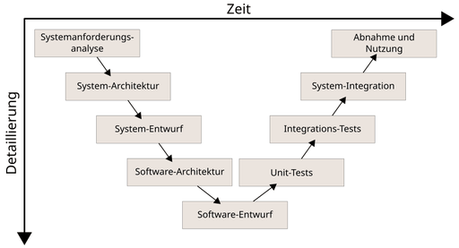
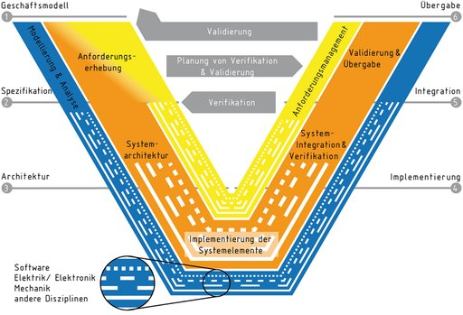

# V-Modell

Das **V-Modell** ist ein Vorgehensmodell bzw. Prozessreferenzmodell, welches ursprünglich für die Softwareentwicklung konzipiert wurde. Ähnlich dem Wasserfallmodell organisiert es den Softwareentwicklungsprozess in Phasen. Zusätzlich zu diesen Entwicklungsphasen definiert das V-Modell auch das Vorgehen zur Qualitätssicherung (Testen), indem den einzelnen Entwicklungsphasen Testphasen gegenübergestellt werden. Auf der linken Seite wird mit einer funktionalen/fachlichen Spezifikation begonnen, die immer tiefer detailliert zu einer technischen Spezifikation und Implementierungsgrundlage ausgebaut wird. In der Spitze erfolgt die Implementierung, die anschließend auf der rechten Seite gegen die entsprechenden Spezifikationen der linken Seite getestet wird. So entsteht bildlich das namensgebende „V“, welches die einzelnen Entwicklungsebenen ihren jeweiligen Testebenen gegenüberstellt.

Zum V-Modell im Allgemeinen werden in der Literatur die Anzahl der Phasen und auch deren Bezeichnungen unterschiedlich dargestellt, jedoch immer mit 1:1-Gegenüberstellung von Entwurfs- und Teststufen.

Die Prozesse des V-Modells werden mit einem Prozessbewertungsmodell, z. B. nach ISO 33000-Familie bewertet. Eine Umsetzung der Norm ist die Automotive SPICE.

Das V-Modell ist nicht zu verwechseln mit dem Verfügbarkeitsmodell (auch abgekürzt als "V-Modell").

## Geschichte

Vorgeschlagen wurde dieses Vorgehen zuerst von dem US-amerikanischen Softwareingenieur Barry Boehm im Jahre 1979 und basiert auf dem Wasserfallmodell: Die Phasenergebnisse sind bindende Vorgaben für die nächsttiefere Projektphase. Der linke, nach unten führende Ast für die Spezifizierungsphasen schließt mit der Realisierungsphase ab. Eine Erweiterung gegenüber dem Wasserfallmodell sind die zeitlich nachfolgenden Testphasen, die im rechten, nach oben führenden Ast dargestellt werden. Den spezifizierenden Phasen stehen jeweils testende Phasen gegenüber, was in der Darstellung ein charakteristisches „V“ ergibt, das dem Modell auch den Namen gab. Diese Gegenüberstellung soll zu einer möglichst hohen Testabdeckung führen, weil die Spezifikationen der jeweiligen Entwicklungsstufen die Grundlage für die Tests (Testfälle) in den entsprechenden Teststufen sind.

## Anwendungen

### IT-Entwicklungsprojekte

Das allgemeine V-Modell ist die Grundlage von Entwicklungsstandards wie z. B. dem V-Modell (Entwicklungsstandard) der öffentlichen Hand in Deutschland.

### Das V-Modell in der Entwicklung mechatronischer Systeme

Spätestens seit 2004 wird das V-Modell auch allgemeiner in Entwicklungsprozessen verwendet. So empfiehlt die Richtlinie VDI/VDE 2206 das V-Modell als Teil der „Entwicklungsmethodik für mechatronische Systeme“. Hintergrund ist dabei die zunehmende Integration von mechanischen, elektrischen und informationstechnischen Komponenten in mechatronischen Systemen und die damit verbundene Steigerung der Komplexität.

Ausgangspunkt ist dabei meist eine konkrete Anforderung bzw. eine Anforderungsliste in Form eines Entwicklungsauftrags. Diese Anforderungen stellen zugleich den Maßstab dar, nach dem das spätere Produkt zu bewerten ist. Im Systementwurf wird die Gesamtfunktion des Systems bzw. des späteren Produktes in Teilfunktionen zerlegt. Sind die Teilfunktionen ermittelt erfolgt die Konkretisierung des Lösungskonzeptes meist getrennt in den einzelnen Fachdisziplinen (Domänen). Die konkreten Lösungen der einzelnen Disziplinen werden im Rahmen der Systemintegration zu einem Gesamtsystem verbunden und ihr Zusammenwirken untersucht. Fortlaufend wird dabei im Zuge der Eigenschaftsabsicherung der jetzige Entwurf gegen die spezifizierten Anforderungen geprüft, dadurch wird sichergestellt, dass die gewünschten Eigenschaften mit den tatsächlichen Eigenschaften übereinstimmen. Der gesamte Prozess kann dabei durch rechnergestützte Modellierung und Simulation unterstützt werden. Ergebnis eines durchlaufenen Zyklus des V-Modells ist das „Produkt“, wobei es sich hierbei um einen bestimmten Reifegrad (Funktionsmuster, Prototyp, Vorserienmuster etc.) des geplanten Endproduktes handeln kann. Das V-Modell stellt also einen iterativen Prozess dar, der sich schrittweise der endgültigen Lösung annähert und je nach Komplexität des Endproduktes vielfach durchlaufen wird.

### Das V-Modell als Datenstruktur

Neben der Funktion als Prozessmodell kann das V-Modell auch die Grundlage für die Datenstruktur in der Entwicklung übernehmen. Dabei werden die verschiedenen Artefakte der Entwicklung auf dem V positioniert: Links oben die Anforderungen, bis zur Mitte unten zur Implementierung und auf dem rechten Arm die dazugehörigen Verifizierungs- und Validierungs-Artefakte. Eine Rückverfolgbarkeit (engl. "Traceability") zwischen den Artefakten unterstützt das Arbeiten mit den Artefakten. Diese Umsetzung ist in den gängigen Anforderungsmanagementwerkzeugen üblich.

## Weiterentwicklung

Auf Basis von Erfahrungen aus der industriellen Anwendung und dem technologischen Fortschritt wurde seither eine Vielzahl von Weiterentwicklungen des V-Modells publiziert. Durch Hinwendung zu agilen Methoden, Concurrent-Engineering-Prozessen und die zeitgleiche Relevanz des Systems Engineerings wurde das V-Modell um 2000 beispielsweise zum *W-Modell* weiterentwickelt. Mit einer vorgezogenen Testphase und der Einbindung von Simulationsprozessen und statistischen Methoden zur Fehlervermeidung greift das W-Modell Maßnahmen auf, die zur Parallelisierung von Arbeitsschritten genutzt werden können. Es dient damit als Möglichkeit, agile Ansätze in klassische Arbeitsumfelder einzubetten. Der Begriff findet vorrangig im deutschsprachigen Raum Verwendung.

Die Richtlinie VDI 2206 wurde im VDI in den Jahren 2014 bis 2021 von dem Fachausschuss 4.10 „Interdisziplinäre Produktentstehung“ der VDI/VDE-Gesellschaft Mess- und Automatisierungstechnik überarbeitet und im November 2021 veröffentlicht. Hierbei wurden auf Basis einer Schwachstellenanalyse der hohen Interdisziplinarität, Komplexität und Heterogenität moderner Systeme Rechnung getragen und das V-Modell erneuert. Die Entwicklungen moderner Produkte, die neben einem mechanischen, häufig elektronischen sowie möglichen Software-Anteile mit einer Verbindung zum Internet der Dinge und Dienste umfassen kann, angepasst. Es existieren neben der neuen Richtlinie VDI/VDE 2206 „Entwicklung mechatronischer und cyber-physischer Systeme“ weitere wissenschaftliche Veröffentlichungen. Zentral war die Erneuerung des Bildes des V-Modells, das zum Download zur Verfügung steht, siehe bei den **Weblinks**.
