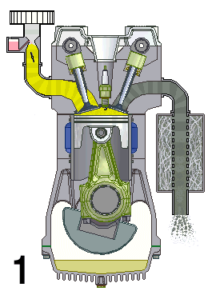
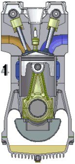
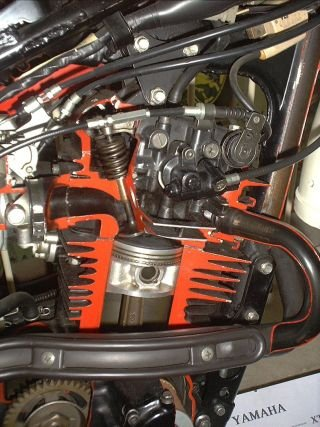

# Viertaktmotor

Ein **Viertaktmotor** ist eine Wärme-, genauer Verbrennungskraftmaschine, die thermische Leistung aus der Verbrennung von Kraftstoff in Drehmoment an einer rotierenden Welle, also rotatorische Leistung, umwandelt. Die inneren Vorgänge lassen sich als rechtslaufenden thermodynamischen Kreisprozess beschreiben (Otto- oder Diesel-Kreisprozess). Für einen Kreisprozess-Umlauf (ein „Arbeitsspiel“) benötigt die Maschine vier „Takte“ genannte Arbeitsschritte. Bei einem Hubkolbenmotor ist ein Takt die Bewegung des Kolbens von einem Endpunkt des Hubes zum anderen. Die Kurbelwelle vollführt daher während eines Taktes eine halbe Umdrehung.

Der Österreicher Christian Reithmann hatte am 26. Oktober 1860 mehrere Patente auf einen Viertaktmotor erhalten. Unabhängig davon beschrieb im Jahr 1861 der Techniker Alphonse Beau de Rochas das Viertaktverfahren. Ottomotoren und Dieselmotoren unterscheiden sich in der Gemischbildung und im Zündverfahren. Es gibt von beiden sowohl Viertakt- als auch Zweitaktvarianten.

## Funktionsweise eines Viertakt-Hubkolbenmotors

### Takt 1: Ansaugen

Zu Beginn des 1. Taktes steht der Kolben am oberen Totpunkt (OT). Das Auslassventil wird geschlossen und das Einlassventil geöffnet. Der Kolben bewegt sich in Richtung Kurbelwelle, der Brennraum vergrößert sich. Bei der Abwärtsbewegung des Kolbens wird ein Gasgemisch oder Luft durch das Einlassventil in den Zylinder gesaugt.
Bei Motoren mit innerer Gemischbildung, wie Dieselmotoren oder Ottomotoren mit Direkteinspritzung, wird nur Luft angesaugt. Bei äußerer Gemischbildung, wie bei Vergaser-Motoren oder Motoren mit Saugrohreinspritzung, wird ein Gemisch aus Luft und dem zerstäubten Kraftstoff angesaugt.
Wenn der Kolben den unteren Totpunkt erreicht, wird das Einlassventil geschlossen und der erste Takt ist beendet.

Als *Nachladeeffekt* bezeichnet man es, wenn das Einlassventil erst nach dem unteren Totpunkt schließt, so dass bei bereits wieder aufwärts gehendem Kolben wegen der kinetischen Energie des Gases im Einlasskanal noch weiter Gas einströmt. Idealerweise schließt das Ventil genau dann, wenn die Gassäule zum Stehen gekommen ist. Dies bewirkt eine bessere Befüllung und dadurch eine Leistungssteigerung des Motors.

### Takt 2: Verdichten und Zünden

Der Kolben bewegt sich zurück in Richtung oberer Totpunkt.
Die dafür benötigte mechanische Arbeit stammt aus der Rotationsenergie der Schwungmasse bzw. bei Mehrzylindermotoren
aus der Schwungmasse sowie dem Arbeitstakt eines anderen Zylinders. Das Gemisch oder die Luft im Zylinder wird nun auf einen Bruchteil des ursprünglichen Volumens verdichtet. Die Höhe des Kompressionsgrades ist von der Motorbauart abhängig. Bei Ottomotoren ohne Aufladung ist ein Verdichtungsverhältnis von über 10:1 üblich (es gibt Großserienmotoren mit über 14:1), bei Dieselmotoren ohne Aufladung über 20:1. Mit Aufladung ist es erheblich weniger, bis herunter zu 7:1 (Otto) und 14:1 (Diesel). Durch die Kompression wird das Gemisch bei Ottomotoren auf etwa 450 °C und die Luft beim Diesel auf etwa 650 °C erhitzt. Kurz vor dem Erreichen des oberen Totpunktes wird beim Ottomotor die Zündung und beim Dieselmotor die Voreinspritzung ausgelöst. Der Zeitpunkt wird abhängig von Last und Drehzahl geregelt.

### Takt 3: Arbeiten

Nach dem oberen Totpunkt – beim Dieselmotor folgt noch die Haupteinspritzung – verbrennt die Gemischladung selbstständig weiter.
Die Temperatur im brennenden Gasgemisch eines Ottomotors erreicht zwischen 2200 und 2500 °C und der Druck bei Volllast bis zu 120 bar. Beim Dieselmotor sind es zwischen 1800 und 2500 °C und 160 bar.
Der Kolben bewegt sich in Richtung des unteren Totpunktes, das Brenngas verrichtet mechanische Arbeit am Kolben und kühlt sich dabei ab. Kurz vor dem unteren Totpunkt besteht beim Ottomotor noch ein Restdruck von knapp 4 bar und beim Diesel knapp 3 bar. Das Auslassventil beginnt sich zu öffnen.

### Takt 4: Ausstoßen

Wenn der Kolben den unteren Totpunkt wieder verlässt, wird mit der Aufwärtsbewegung des Kolbens das Abgas aus dem Zylinder geschoben. Am Ende des Ausstoßtaktes kommt es zur so genannten Ventilüberschneidung. Das Einlassventil wird geöffnet, bevor der Kolben den oberen Totpunkt erreicht und bevor das Auslassventil geschlossen hat. Erst kurz nachdem der Kolben den oberen Totpunkt erreicht hat, schließt das Auslassventil.

### Überblick über die Ausführungen

Pro Zylinder gibt es mindestens ein Einlass- und ein Auslass-Ventil, aber auch 3 oder 4 Ventile pro Zylinder sind heute weit verbreitet (siehe nächsten Abschnitt), manchmal 5 (Audi) oder sogar 8 Ventile (Honda NR). Der Gaswechsel kann auch mit Schiebern gesteuert werden.

Die Ventile werden von einer oder mehreren Nockenwellen gesteuert. Diese wird von der Kurbelwelle über Zahnriemen, Steuerkette(n), Stirnräder oder Königswelle(n) angetrieben. Bei Hochleistungsmotoren, etwa in Rennfahrzeugen, Flugzeugen und Motorrädern, wurde für den Ventiltrieb früher oft eine Königswelle verwendet. Die Nockenwelle dreht sich immer mit halber Kurbelwellendrehzahl, da ein Arbeitsspiel zwei Kurbelwellenumdrehungen erfordert.

Liegt die Nockenwelle unten, das heißt im Kurbelgehäuse, werden im Zylinderkopf *hängende* Ventile (OHV-Ventilsteuerung – overhead valve) in der Regel über Stößel, Stoßstangen und Kipphebel betätigt, bei neben dem Zylinder *stehenden* Ventilen (SV-Ventilsteuerung – sidevalve) direkt über Stößel oder Schlepphebel. Beide Bauarten waren früher verbreitet, werden aber in Neukonstruktionen außer bei Großmotoren nicht mehr verwendet. Stehende Ventile gibt es seit etwa 1960 wegen der ungünstigen Brennraumform nur noch in einfachen Industriemotoren, Rasenmähern oder Notstromaggregaten. Ottomotoren für Pkw mit untenliegender Nockenwelle werden im Wesentlichen nur noch in den USA gebaut. Wird eine Nockenwelle oberhalb der im Kopf hängend angeordneten Ventile vorgesehen (OHC-Ventilsteuerung – overhead camshaft), entfallen die Stoßstangen, für Betätigung der Ventile kommen unter anderem Kipp- oder Schlepphebel und Tassenstößel in Frage. Bei zwei obenliegenden Nockenwellen (DOHC, double overhead camshaft) werden die Ventile über Tassenstößel oder Schlepphebel betätigt, was durch die dynamische Steifigkeit des Systems eine gleichbleibende Genauigkeit der vorgegebenen Steuerzeiten bis in hohe Drehzahlen gewährleistet. Mit zwei obenliegenden Nockenwellen lassen sich auch über zwei verstellbare Nockenwellen eine variable Ventilsteuerung realisieren, bei der Ein- und Auslasssteuerzeiten unabhängig voneinander verändert werden können.

### Mehrventiltechnik

Nur zwei kreisrunde Ventilteller pro kreisrundem Brennraum zu haben, lässt viel Fläche ungenutzt und kaum eine zentral platzierte Zündkerze zu. Mit jedem Ventil mehr nimmt der Anteil nicht zu öffnender Fläche ab und der bei jeweils gleichem Ventilhub gerade verfügbare Strömungsquerschnitt zu. In Folge ist der Strömungswiderstand geringer, sodass gegebener Druck jederzeit mehr Volumen bewegt. Für besseren Liefergrad genügt ein zusätzliches Einlassventil. Mehr Ventile pro Zylinder bedeuten auch kleinere Ventilteller und damit weniger Masse, die höheren Drehzahlen entgegensteht. So ergibt sich mehr Leistung als bei Motoren mit zwei Ventilen. Die nebenstehende Tabelle macht dies anhand zweier Formel-2-Motoren (BMW-Vierzylinder) aus den 1970er Jahren deutlich: Bei gleichem Hubraum von 2 Litern ergab sich nach der Umstellung auf einen Vierventil-Zylinderkopf in Verbindung mit der erhöhten Nenndrehzahl eine Leistungssteigerung um 22 Prozent.

Auch bei Pkw-Motoren für den Alltagseinsatz ergibt sich mit vier Ventilen eine ähnliche Steigerung. Beispielsweise wurde der 1,8-Liter-Vierzylinder M40B18 (83 kW/113 PS bei 5500/min) des BMW 318i aus der Reihe E30 durch einen anderen Zylinderkopf im Modell 318is zum Vierventiler M42B18 mit einer Leistung von 100 kW/136 PS bei 6000/min; allerdings ist dieser mit 10:1 auch höher verdichtet und benötigt daher Superbenzin 95 ROZ (M40B18: Verdichtung 8,8:1 für Normalbenzin 91 ROZ).

Einer der ersten Serien-Pkw mit alltagstauglicher Vierventil-Technik war der Triumph Dolomite Sprint. Mit der Yamaha FZ 750 kam 1985 das erste Serienmotorrad mit Fünfventiltechnik auf den Markt. Mit dem Audi A4 entstand 1994 erstmals deutsche Fünfventiltechnik in Großserie.

Aus Angaben wie 12V kann oft nicht auf die Anzahl der Ventile pro Zylinder geschlossen werden, denn 12V kann einen Dreizylindermotor mit vier Ventilen pro Zylinder, einen Vierzylindermotor mit drei Ventilen pro Zylinder oder einen Sechszylindermotor mit zwei Ventilen pro Zylinder bezeichnen.

Die in Kleinserie hergestellte Honda NR 750 mit Ovalkolbenmotor hat 8 Ventile pro Zylinder.

## Vor- und Nachteile

Vorteile und Nachteile des Viertaktmotors gegenüber dem Zweitaktmotor sind:

### Vorteile

- Der Gaswechsel erfolgt großteils durch Volumenverdrängung im ersten und vierten Takt (Ausstoßen / Ansaugen), und nur zu einem geringen Teil durch die Dynamik der Gassäule während der Ventilüberschneidung. Dadurch werden Frischgas und Abgas über einen weiten Drehzahlbereich gut voneinander getrennt, was den Kraftstoffverbrauch verringert und das Abgasverhalten verbessert.
- Ein geschlossener Ölkreislauf mit Druckumlaufschmierung ist Standard, dadurch ist der Schmierölverlust sehr niedrig. Nur das Öl, das zur Schmierung der Kompressionsringe dient, geht dabei prinzipbedingt verloren. Durch die Fertigungsqualität moderner Motoren tendiert dieser Schmierölverlust gegen Null. Zweitaktmotoren können zwar auch mit einer geschlossenen Druckumlaufschmierung ausgelegt sein, was jedoch meist nur in aufwändigen Großmotoren umgesetzt wird. Beim Wankelmotor muss die Laufbahnoberfläche mit Verlustöl geschmiert werden.
- Die thermische Belastung ist tendenziell geringer, da nur bei jeder zweiten Kurbelwellenumdrehung eine Verbrennung erfolgt.

### Nachteile

- Eine geringere Leistungsdichte des Viertakt-Hubkolbenmotors. Grund dafür ist der Leerhub: Jeder Zylinder liefert nur bei jeder zweiten Umdrehung einen Arbeitstakt und läuft eine Umdrehung als Spülpumpe.
- Daraus resultiert auch eine ungleichmäßigere Abgabe des Drehmomentes. Das trifft jedoch nicht auf den Wankelmotor zu; jede Einheit („Scheibe“) liefert je Umdrehung der Exzenterwelle einen Arbeitstakt.
- Viertaktmotoren haben einen mechanisch aufwändigeren Aufbau als Zweitaktmotoren. Der Aufwand erklärt sich aus den gesteuerten Ventilen und der fast immer verwendeten Druckumlaufschmierung.
- Daraus ergeben sich auch höhere Herstellungskosten.

## Heutiger Gebrauch

Viertaktmotoren dominieren heute im gesamten Automobil- und Motorradbau. Sogar bei Kleinkrafträdern mit 50 cm³ (z. B. Kymco Agility, Keeway), bei Rasenmähern und bei anderen Kleingeräten kommen sie vor, beispielsweise der Motor Honda GX25, bis hinab zu einer Größe von 25 cm³. Ottomotoren gibt es mit Hubraumgrößen von bis zu 3,5 Litern pro Zylinder (zum Beispiel Lycoming XR-7755). Die größten Viertaktmotoren sind Dieselmotoren mit Hubvolumen bis 50 Liter pro Zylinder und einem Treibstoffverbrauch im Bestpunkt von 175 g/kWh Schweröl (zum Beispiel Wärtsilä 38) und einem thermischen Wirkungsgrad von ca. 50 %. Mit Erdgas betrieben erreichen sie einen Treibstoffverbrauch von 165 g/kWh oder einen Wirkungsgrad von 52 % (zum Beispiel Wärtsilä 31).

## Varianten

Einige das Prinzip des Viertaktmotors variierende Formen sind technisch und wirtschaftlich von Bedeutung.

Es werden serienmäßig Motoren mit Varianten der Taktung produziert, siehe Miller-Kreisprozess oder Atkinson-Kreisprozess. Im Automobilbau werden gelegentlich *Ausgleichwellen* verwendet. Sie reduzieren die durch die auf- und abgehenden Kolben entstehenden *freien Massekräfte*.

Für Anwendungsbereiche, in denen leichte und lageunabhängig geschmierte Viertaktmotoren von Vorteil sind, gibt es mit Zweitaktgemisch betriebene Varianten. Wie bei anderen gemischgeschmierten Motoren entfallen Öltank, Ölwanne, Ölpumpe, Ölrückhaltesysteme und Ölfilter. Durch geeignete Konstruktion, Kraftstoff und Öl lässt sich die Schadstoffemission durch Ölverbrennung unter die Grenzwerte der Abgasnorm für Viertaktmotoren senken. Solche Motoren werden bevorzugt als Antrieb für tragbare Motorgeräte eingesetzt (zum Beispiel Stihl „4-Mix“).

Bestimmte Sonderbauformen von Viertaktmotoren haben keine Nockenwelle. Die Ventile werden pneumatisch, hydraulisch oder elektrisch betätigt. Diese Art des Ventiltriebes hat sich im Serienmotorenbau noch nicht etabliert. Aber die Entwicklung einer elektromagnetischen Ventilbetätigung wird seit dem Ende der 1990er Jahre vorangetrieben.

Ferner gibt es verschiedene Bauarten von Schiebersteuerungen. Motoren dieser Bauarten haben Hülsen- oder Drehschieber für den Gaswechsel und können mit weniger bewegten Bauteilen auskommen als herkömmlich gesteuerte 4-Takt Motoren.

Eine weitere, bisher in der Serienfertigung nicht verwendete Bauform ist der Viertakt-Verbrennungsmotor ohne Ventile (2), der in den vier Takten Frischgaszuführung, Verdichtung, Arbeitshub und Abgasabführung in bekannter Weise funktioniert. Der Ablauf wird hier allerdings nicht durch Schieber oder Nockenwelle und Ventile gesteuert, sondern durch den periodisch gedrehten Arbeitskolben, der an seinem Umfang Einströmnuten und Ausströmnuten trägt. Die Drehung erfolgt über das ankerförmige Pleuel, das mit seinen Zähnen in den an der Unterseite des Kolbens befindlichen Zahnkranz bei jeder Kurbelwellen-Umdrehung eingreift und um eine Teilung weiter befördert. Dadurch wird bei jedem Zyklus der Kolben um vier Teilungen gedreht. Je nach Umfang des Kolbens muss die Anzahl der Zähne am Zahnkranz durch vier teilbar sein. Die Verbindung von Pleuel und Arbeitskolben ist ein freibewegliches Bauelement wie zum Beispiel eine Kugel oder ein Pendelkugellager. Die Kolbenlänge muss länger als der Kolben-Hub sein, was zu vergleichsweise großen schwingenden Massen führt und sich deshalb eher für niedrige Drehzahlen eignet. Der komplette Funktionsablauf ist in nebenstehender Animation ersichtlich, wie er auch in der Patent-Offenlegungs-Schrift DE 10 2006 027 166 beschrieben ist.

Eine besondere Bauform des Viertaktmotors ist neben dem hier beschriebenen Hubkolbenmotor der Kreiskolben-Wankelmotor, bei dem Ansaugen, Verdichten, Arbeiten und Ausstoßen während einer Kolbenumdrehung erfolgen.

## Terminologie

Alle hier verwendeten Attribute des Ortes (*oberer* Totpunkt, *Abwärts*bewegung, *Unter*seite, *oben liegende* Nockenwelle) sind feststehende Fachbegriffe und ändern sich nicht, wenn ein Motor „liegend“ oder „hängend“ (auf dem Kopf stehend) betrieben wird.
