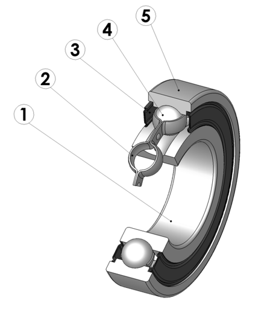
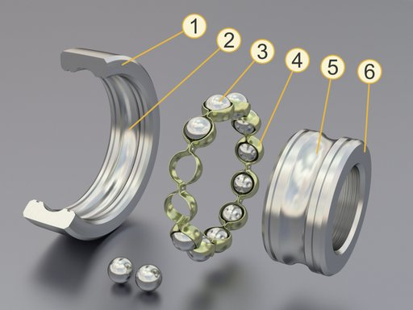
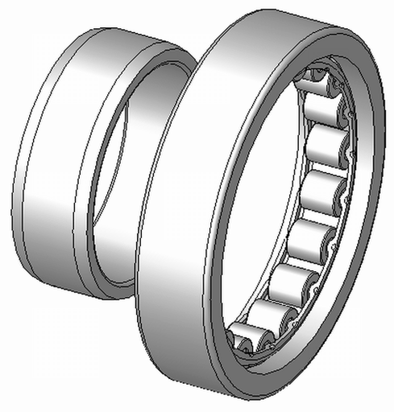

# Wälzlager

Das **Wälzlager** ist neben dem Gleitlager die im Maschinen- und Gerätebau am häufigsten gebrauchte Lagerbauart. Wälzlager sind Lager, bei denen zwischen einem Innenring und einem Außenring rollende Körper den Reibungswiderstand verringern. Sie dienen als Fixierung von Achsen und Wellen, wobei sie, je nach Bauform, radiale und/oder axiale Kräfte aufnehmen und gleichzeitig die Rotation der Welle oder der so auf einer Achse gelagerten Bauteile (z. B. ein Rad) ermöglichen.

Wälzlager sind leichtgängig, da im Gegensatz zur Gleitreibung in Gleitlagern zwischen Innenring, Außenring und Wälzkörpern hauptsächlich Rollreibung auftritt. Die Kontaktflächen bestehen meist aus gehärtetem Stahl oder Keramik. Gewöhnlich befindet sich ein Schmierfilm zwischen den Kontaktflächen von Wälzkörpern und Laufringen, der Reibung, Verschleiß und das Auftreten von Wälzlagerschäden vermindert.

Wälzlager werden nach der Art des Wälzkörpers (Kugel, Rolle, *Nadel* usw.) unterschieden, siehe Abschnitt *Wälzlager-Bauformen*. Umgangssprachlich werden meist sämtliche Arten von Wälzlagern als **Kugellager** bezeichnet. Kugellager haben die größte Verbreitung, da sie sich einfach fertigen lassen, sind aber deutlich weniger belastbar als andere Bauformen.

Heute wird meist vorausgesetzt, dass es sich bei einem *Wälzlager* oder *Kugellager* um eine kompakte Einheit aus innerem und äußerem Lagerring und Wälzkörpern handelt, da Anwendungen mit separat montierten Wälzkörpern bzw. Wälzkörper-Käfigen, Laufringen und Dichtringen selten geworden sind.

## Geschichte des Wälzlagers

Die Geschichte des Wälzlagers reicht über 2700 Jahre zurück. Bei Ausgrabungen eines keltischen Streitwagens wurden kleine zylinderförmige Buchenholzstücke in der Nähe der Radnaben der Fahrzeuge entdeckt. Forscher schließen daraus, dass die Kelten bereits gegen 700 v. Chr. das Zylinderrollenlager kannten.

Im römischen Reich wurden Wälzlager von Vitruv beschrieben und gegen Ende der Republik Kugellager in Hebezeugen verwendet. Bei der Bergung der Nemi-Schiffe des Kaisers Caligula (Amtszeit: 37–41 n. Chr.) wurde ein Drucklager gefunden, das möglicherweise zu einer drehbaren Statuenbasis gehörte.

Im Zuge der Industrialisierung entstand der Bedarf nach einer Lagerung, die sich bei niedriger Drehzahl besser verhielt als Gleitlager. Das Gleitlager verschleißt bei niedriger Drehzahl und/oder bei unzureichender Schmierung sehr schnell. In alten Dampflokomotiven etwa wurden diese Radlager häufig ersetzt.

- 1759 erfand der Uhrmacher John Harrison für sein drittes Marine-Chronometer H3 ein Rollenlager mit Käfig.
- 1794 erhielt der Engländer Philip Vaughan das erste Patent für Achsen, hier kann man die ersten Rillenkugellager finden.
- 1869 erhielt der Franzose Jules Suriray ein Patent für Kugellager am Fahrrad.
- 1883 baute Friedrich Fischer in Schweinfurt die erste Kugelschleifmaschine. Fischer und Wilhelm Höpflinger entwickelten die Kugelschleifmaschine entscheidend weiter. Nun konnten Kugeln mit sehr geringer Abweichung von der Idealform produziert werden. Diese Idee gilt als historischer Beginn der Wälzlagerindustrie.
- 1890–1910: Kugellagerpatente von den Schweinfurter Industriellen Friedrich Fischer, Wilhelm Höpflinger, Ernst Sachs sowie von August Riebe
- 1898 meldete Henry Timken in den USA ein Patent für das Kegelrollenlager an. Heute Timken Company.
- 1898–1901: Die Grundlagen der Wälzkörpertechnik wurden von der Technischen Versuchsanstalt Potsdam-Neubabelsberg unter der Leitung von Richard Stribeck erstmals wissenschaftlich untersucht.
- 1907: Sven Gustaf Wingqvist erfand das Pendelkugellager und gründete in Göteborg die Firma Svenska Kullagerfabriken – SKF.
- 1934: Erich Franke erfand das Drahtwälzlager nach dem Prinzip der eingelegten Laufdrähte.

Im Laufe der Zeit kamen zahlreiche weitere Varianten hinzu. Insbesondere entwickelten sich die Fertigungsgenauigkeit und die Schmierstoffentwicklung weiter. Zahlreiche Normen legten auch gängige Standardabmessungen fest und vereinfachten so Konstruktion und Fertigung. Heute werden Lager mit integrierten Sensoren wie elektronischer Kraft- und Verschleißermittlung angeboten.

## Geschichte der deutschen Wälzlagerindustrie

- 1883 baute Friedrich Fischer in Schweinfurt die erste Kugelschleifmaschine und legte damit den Grundstein für die industrielle Fertigung von runden Stahlkugeln hinreichender Genauigkeit und der Wälzlagerindustrie. Im selben Jahr gründete er die Firma Kugelfischer. Sein Mitarbeiter Wilhelm Höpflinger entwickelte die Kugelschleifmaschine entscheidend weiter. Höpflinger machte sich 1890 selbständig und gründete gemeinsam mit Engelbert Fries ebenfalls in Schweinfurt das Unternehmen Fries & Höpflinger. *Die großen Drei* Kugelfischer, Fries & Höpflinger und Fichtel & Sachs begründeten die Stellung Schweinfurts als Zentrum der deutschen, wie auch der europäischen Wälzlagerindustrie.
- Um 1910: Weitere deutsche Wälzlagerproduzenten waren die Deutsche Waffen- und Munitionsfabriken AG Berlin-Karlsruhe (DWM), die Maschinenfabrik Rheinland (Düsseldorf), die Riebe-Werk (Berlin), die Deutsche Kugellagerfabrik (DKF, Leipzig), Fritz Hollmann (Wetzlar), G. u. J. Jäger (Wuppertal).
- 1912: SKF beteiligte sich an der von Albert Hirth gegründeten Norma-Compagnie in Stuttgart-Cannstatt.
- 1929: Unter dem Druck von SKF schlossen sich sechs deutsche Wälzlagerproduzenten (Wälzlagerabteilung von Fichtel & Sachs, Wälzlagerabteilung von Berlin-Karlsruher Industriewerke (DWF), Fries & Höpflinger, Maschinenfabrik Rheinland, Riebe-Werke und SKF-Norma) unter schwedischer Führung zu den Vereinigten Kugellagerfabriken AG (VKF, Schweinfurt), zusammen. Als einziger deutscher Wälzlagerhersteller von Rang blieb FAG Kugelfischer selbständig. Die beiden Schweinfurter Firmen VKF und FAG Kugelfischer waren für die nächsten Jahrzehnte die dominierenden deutschen Wälzlagerhersteller.
- 1933: Kugelfischer übernimmt G. u. J. Jaeger G.m.b.H., Wuppertal-Elberfeld.
- 1943–1945: Im Zweiten Weltkrieg fügten 15 größere Luftangriffe der Briten und US-Amerikaner der Stadt Schweinfurt und deren Produktionsstätten der Wälzlagerindustrie schwere Schäden zu.
- 1946: Georg und Wilhelm Schaeffler gründeten in Herzogenaurach die Firma INA-Nadellager.
- 1949 gründeten Erich Franke und Gerhard Heydrich die Firma Franke & Heydrich KG – inzwischen Franke GmbH – in Aalen. Erich Franke erfand 1934 das Drahtwälzlager nach dem Prinzip der eingelegten Laufdrähte.
- 1953: Umbenennung der Vereinigten Kugellagerfabriken AG (VKF) in SKF Deutschland GmbH mit Sitz in Schweinfurt.
- 1991: FAG Kugelfischer übernahm von der Treuhand den DDR-Wälzlagerproduzenten DKF in Leipzig. Dieses Engagement erwies sich als wirtschaftlich nicht tragfähig, FAG Kugelfischer geriet dadurch 1993 in eine existenziell gefährliche Schieflage.
- 2001: Die bis dahin allgemein unbekannte INA-Holding Schaeffler KG erwarb im Rahmen der ersten feindlichen Übernahme Deutschlands nach dem Krieg den mittlerweile sanierten DAX-Konzern FAG Kugelfischer.
- 2006: FAG Kugelfischer und INA werden in der Schaeffler KG zusammengefasst und dadurch zum zweitgrößten Wälzlagerkonzern der Welt; nach SKF, dessen weltweit größtes Werk sich ebenfalls in Deutschland (Schweinfurt) befindet.

## Wälzkörper und Wälzkörperkäfig

Die umgangssprachlich bekannten *Kugellager* sind eine Untergruppe der Wälzlager, bei denen Kugeln als Wälzkörper dienen.

Bei modernen Wälzlagern werden die Wälzkörper (Kugeln, Zylinder, Nadeln, Tonnen oder Kegel) durch einen Käfig in gleichem Abstand gehalten. Ältere Wälzlagertypen und Sonderausführungen kommen ohne Käfig aus. Vor allem Wälzlager in Steuerungssystemen von Flugzeugen haben keinen Käfig. Dadurch können mehr Wälzkörper pro Lager eingesetzt werden, was die Belastbarkeit deutlich erhöht. Jedoch eignen sie sich nur bedingt für höhere Drehzahlen.

Käfigwerkstoff war früher wegen der erhöhten Laufruhe Messing. Heute wird der Käfig aus Kosten- und Gewichtsgründen oft aus (meist glasfaserverstärktem) Kunststoff (Polyamid) gefertigt. Bei vielen Wälzlagertypen wird ein Käfig aus niedriglegiertem, ungehärtetem Stahl verwendet. Messingkäfige gibt es weiterhin; insbesondere für größere Lager, bei denen sich die Werkzeugkosten für Kunststoff- oder Stahlblechkäfig nicht lohnen.

## Zusammenbau eines Kugellagers

Ein einfaches Radialrillenkugellager wird wie folgt zusammengesetzt:

Anschließend werden die Kugellager gefettet oder geölt und gegebenenfalls mit Deck- oder Dichtscheiben versehen.

## Lagerwerkstoffe

Üblicherweise werden Wälzlager aus Chromstahl gefertigt, sehr hart, aber leicht rostend, in der Stahlsorte 100Cr6 (Werkstoff-Nr. 1.3505), ein Stahl mit einem Gehalt von ca. 1 % Kohlenstoff und 1,5 % Chrom. Weitere Stähle sind zum Beispiel 100CrMnSi6-4 und 100CrMo7, die Legierungselemente Mangan (Mn) und Molybdän (Mo) dienen der besseren Durchhärtbarkeit.

Für Anwendungen in korrosiver Umgebung werden auch die hochlegierten Stähle X65Cr13 (Werkstoff-Nr. 1.4037) und X30CrMoN15-1 (Werkstoff-Nr. 1.4108) verwendet. Letzterer kann, zumindest für einige Tage, auch im menschlichen Organismus zum Einsatz kommen. Härtbare Stähle sind nie vollkommen „rostfrei“, sondern nur für einen gewissen Zeitraum erhöht korrosionsbeständig.

Für besondere Betriebsbedingungen gibt es folgende Wälzlager in folgenden Ausführungen:

- Aus rostfreiem Stahl (zum Beispiel Kugellager S6204 oder W6204)
- Hybridlager (zwei Werkstoffe), bei denen die Lagerringe aus Stahl, die Wälzkörper aus Keramik (Siliciumnitrid oder Zirkondioxid) bestehen, zum Beispiel bei Spindellagern für Werkzeugmaschinen
- Keramiklager, bei denen sowohl die Lagerringe als auch die Wälzkörper aus Siliciumnitrid, Zirconiumoxid oder Siliciumcarbid bestehen
- Kunststofflager mit Wälzkörpern aus Glas oder Keramik gegen aggressive Säuren oder Laugen in Chemie- und Lebensmittelindustrie
- Lager mit Kunststoff-Käfig (zum Beispiel Kugellager 6205 *TN9*.C3) für geräuscharmen Lauf
- Lager mit einer stromisolierenden Beschichtung des Außen- bzw. Innenringes, um einen ungewollten Stromdurchgang durch das Lager und damit die Entstehung von Schäden durch Elektroerosion zu verhindern, zum Beispiel bei Einsatz von Frequenzumrichtern zur Drehzahlregelung von Drehstrommotoren

## Lebensdauer von Wälzlagern

Siehe auch: Wälzlagerschäden

Zur Berechnung der Lebensdauer von Wälzlagern siehe: Lebensdauer nach ISO 281.

Die Haltbarkeit eines Lagers hängt von zahlreichen Faktoren ab. Einige Einflussgrößen sind mess- oder berechenbar (wie etwa Lagerbelastung oder Oberflächengüte der Komponenten). Andere können nicht numerisch bestimmt werden (Verschmutzung oder genauer Schmierzustand). Einfache Berechnungstools gibt es auf den Websites der Hersteller (siehe Weblinks).

Die von Wälzlagern geforderten Lebensdauern reichen von wenigen hundert Stunden, zum Beispiel für Haushaltsgeräte oder medizinisch-technische Geräte, bis zu ca. 100.000 Stunden für Lauflager von Hochseeschiffen, Grubenpumpen und -gebläse und Papiermaschinen.

Je nach Belastung wird von einer Lebensdauer von über 3 Milliarden Umdrehungen ausgegangen. SKF gibt zum Beispiel für einige Lager eine Lebensdauer von 2 Mrd. Umdrehungen an, was jedoch oft weit überschritten wird.

Ob ein Lager seine Lebensdauer erreicht, hängt stark von den Einsatzbedingungen ab. Hohe Lagerbelastungen sollten ebenso möglichst vermieden werden wie schmutzige Einsatzbedingungen, hohe Betriebstemperaturen oder Eindringen von Wasser ins Lager. Um das Eindringen von Schmutz und Wasser zu erschweren, gibt es viele Lager auch mit integrierter Dichtung. Andernfalls sollten sie in ein Lagergehäuse eingesetzt werden, das etwa mit einem Wellendichtring abgedichtet ist.

Defekte Lager erkennt man an

- ungleichmäßigem, rauem Lauf beim Drehen mit der Hand,
- Schwergängigkeit, die über die übliche Reibung der Dichtscheiben hinausgeht,
- fühlbarem Lagerspiel oder
- Laufgeräuschen und Vibrationen bei Betriebsdrehzahl oder
- Wärmeentwicklung, im Extremfall Auftreten von Anlauffarben oder
- erhöhtem Energiebedarf von Antriebsmotoren.

Zum Beispiel sind Schäden an Lagern im Auto oft durch ungewöhnliche Geräusche bemerkbar. Dazu zählen metallische Rollgeräusche, Pfeif- und Schleifgeräusche sowie mahlende Klänge bei gerader Fahrt. In Kurven können Klopf- oder Vibrationsgeräusche auftreten. Verändertes Fahrverhalten, wie ein instabiles Lenkgefühl oder einseitiges Ziehen beim Bremsen, deutet ebenfalls auf mögliche Defekte hin.

Gedichtete Wälzlager können vom Hersteller mit einer Lebensdauerschmierung angeboten werden. Ungeschmierte Lager fallen sogleich aus.

## Steifigkeit und Dämpfungsverhalten von Wälzlagern

Zur Bestimmung der statischen Steifigkeit von Wälzlagern stehen auf Basis der Hertzschen Theorie relativ genaue und experimentell gut abgesicherte Berechnungsmethoden zur Verfügung, siehe z. B. die Ausführungen im Buch *Rolling Bearing Analysis* von Tedric A. Harris (4th ed., 2000, Wiley-Interscience. ISBN 0-471-35457-0).

Es existieren aus jüngeren wissenschaftlichen Untersuchungen aber auch experimentell verifizierte Rechenmodelle zur Beschreibung der dynamischen Wälzlagereigenschaften, inklusive der Lagerdämpfungseigenschaften, siehe z. B. die umfangreiche Literaturübersicht in der Arbeit *Damping and Stiffness Characteristics of Rolling Element Bearings* (Paul Dietl, Dissertation TU Wien, 1997).

Ausgangspunkt der mathematischen Modelle ist zumeist ein linearisiertes Feder-Dämpfermodell des elasto-hydrodynamischen EHD-Wälzkontaktes. Mittels eines Computerprogramms zur Lösung des instationären EHD-Kontaktproblems können dann auf numerischem Wege äquivalente Dämpfungskoeffzienten für den hochbelasteten Schmierfilm im Wälzkontakt ermittelt werden. Aus den numerischen Ergebnissen wurde in der oben genannten Arbeit von Dietl ein empirisches Näherungsgesetz zur Abschätzung der Ölfilmdämpfung im Wälzkontakt abgeleitet.

Die in den Wälzkontakten wirksame Material- und Trockenreibungsdämpfung kann durch einen in der Theorie der Materialdämpfung häufig verwendeten Verlustfaktor beschrieben werden, der nach Messungen in der oben genannten Arbeit von Dietl in etwa 1 bis 2 % beträgt, je nachdem, wie groß der Einfluss der Fügestelle zwischen Außenring und Gehäuse ausfällt.

## Anwendungen

Wälzlager werden verwendet, wo Lagerungen bei kleinen Drehzahlen und hohen Lasten reibungsarm arbeiten sollen und wo sich Drehzahlen häufig ändern.

## Wälzlager-Bauformen

Einteilung nach Wälzkörper, Belastungsrichtung und möglicher Aufnahme von Achsfehlstellung:

Legende
:   **R** = Radiale Kraft (blauer Pfeil)
:   **A** = Axiale Kraft (grün)
:   **?** = sphärische Kraft (brauner Pfeil)

Nach der Belastungsrichtung unterscheidet man zwischen Radial- und Axiallagern. Zur Einordnung in diese beiden Kategorien wird der *Druckwinkel*  zur Hilfe genommen, der Winkel zwischen der *Radialebene* und der *Drucklinie*, wobei die Lage der Drucklinie stark von verwendeten Wälzkörpern und Rollbahnen abhängt.

- Radiallager:
- Axiallager:

Es gibt sechs Grundformen von Wälzlagern:

1. Kugellager
2. Zylinderrollenlager
3. Nadellager
4. Kegelrollenlager
5. Tonnenlager
6. Toroidalrollenlager (SKF CARB, FAG TORB)

Kugellager sind die häufigsten verwendeten Wälzlager. Hier gibt es die breiteste Auswahl unterschiedlicher Abmessungen. Sie sind kostengünstig, verfügen bauartbedingt allerdings über eine begrenzte Tragfähigkeit.

### Radiallager

#### Rillenkugellager (DIN 625)

Der bekannteste Typ ist das *Rillenkugellager*. Es ist dafür ausgelegt, überwiegend radiale Kräfte aufzunehmen. Da die Kugeln auch seitlich eng an den Laufrillen anliegen, somit Ringe und Kugeln axial nicht gegeneinander verschiebbar sind, kann dieses Lager auch geringe axiale Kräfte aufnehmen. Eine Faustregel besagt, dass die axiale Belastbarkeit ungefähr 50 % der radialen Belastbarkeit beträgt. Laut SKF-Katalog 2005 sollte die axiale Belastung im Allgemeinen den Wert 0,5 C0, bei kleinen und leichten Lagern 0,25 C0 nicht übersteigen.
Druckwinkel

Rillenkugellager gibt es als Miniaturkugellager bereits ab der Abmessung von 0,6 × 2,5 × 1 mm (d × D × B). Natürlich eignen sich auch diese Rillenkugellager für eine axiale Belastung, z. B. bei der Lagerung von Spindeln in kleinen CNC-Maschinen. Wie schon geschrieben wurde, ist die Leistung bei solchen Lagern aber dann auf etwa 50 % der radialen Tragkraft begrenzt. Aber größere Lager haben bei 50 % Belastung auch sicher keinerlei Probleme, in axialer Richtung eine sichere Lagerung darzustellen. C0 ist die radiale Tragfähigkeit eines Lagers. Bei kleinen Lagern (Bohrungsdurchmesser bis etwa 12 mm) und bei den leichten Lagern mit den Endziffern 0, 1, 8 und 9 sollte die axiale Belastung auf 0,25 mal C0 begrenzt bleiben. Zu große Axialbelastungen können eine erhebliche Verringerung der Lagerlebensdauer zur Folge haben.

#### Schrägkugellager (DIN 628)

Das Schrägkugellager kann radiale Kräfte und axiale Kräfte in einer Richtung aufnehmen. Auch hiervon gibt es ein- und zweireihige Ausführungen. Das zweireihige Schrägkugellager entspricht zwei einreihigen Schrägkugellagern in O-Anordnung und ist radial und axial in beide Richtungen hoch belastbar (Druckwinkel ).

##### Konuslager

Als Konuslager oder *Konenlager* werden Schrägkugellager im Fahrzeugbau bezeichnet, deren Laufflächen und Kugeln nicht zu einem zusammenhängenden Bauelement zusammengefasst sind (zur Unterscheidung wird letzteres bei Fahrrädern als „Industrielager“ bezeichnet).
Die Laufflächen eines Konuslagers werden meist von einer äußeren Lagerschale und einem inneren Konus gebildet. Die Lagerschale wird in ein Gehäuse eingeschoben, eingepresst oder eingeschraubt. Der innere Konus besteht entweder aus der Lauffläche auf einer in eine entsprechende Form geschmiedeten Achse oder Welle oder er wird als eigenes Bauelement auf Achse oder Welle geschraubt. Die Kugeln werden heute oft in einem *Kugelkäfig* geführt, der die Montage vereinfacht. Die Laufflächen der Kugeln entsprechen in der Regel nur ungefähr der Form eines *Konus* (Kegelstumpfs). Denn um die Kontaktfläche der Kugeln zu erhöhen, sind sie meist leicht konkav ausgebildet, ähnlich dem Rillenkugellager.

Konenlager werden meist paarweise eingebaut und vorgespannt. Der paarweise Einbau kann in Form von Tandem-, O- oder X-Ausführung erfolgen. Je nach Einbauart verändern sich die axial aufnehmbaren Kräfte. Durch die Rollbahnneigung resultiert auch aus einer rein radialen Belastung eine nennenswerte (innere) Axialkraft. Der Druckwinkel beträgt .

Typische Anwendungen bei Fahrrädern sind Radnabe, Steuersatz und traditionelle Tretlager.

##### Vierpunktlager (DIN 628-4)

Dieses Wälzlager ist eine der verschiedenen DIN-genormten Sonderformen des Schrägkugellagers, mit einem Druckwinkel von . Es gibt vier Berührpunkte der Wälzkörper mit den Laufbahnen. Durch den geteilten Innenring oder Außenring können mehr Kugeln bei einer geringeren Abmessung verwendet werden. Aus diesem Grund erhöhen sich sowohl die aufnehmbaren axialen als auch radialen Kräfte in beide Richtungen.

#### Schulterkugellager (DIN 615)

Das Schulterkugellager ist eine spezielle und zerlegbare Form des Rillenkugellagers. Es hat nur eine geringe Tragfähigkeit in radialer und in einseitig axialer Richtung und wird für Geräte mit geringen Belastungen verwendet, wie zum Beispiel Messgeräte und Haushaltsgeräte. Bei Doppellagerung (Lager-Schleuderscheibe-Lager) sind Belastungen von bis zu 2000 kg möglich. Es ist meist zerlegbar. Der Druckwinkel ist .
Schulterkugellager sind bis zu 30 mm genormt und für hohe Drehzahlen geeignet.

#### Pendelkugellager (DIN 630)

Das Pendelkugellager besitzt zwei Kugelreihen. Die Rollenlaufbahn des Außenrings hat eine Hohlkugelform. Innenring, Käfig und Kugeln lassen sich um wenige Winkelgrade aus der Mittelstellung schwenken. So können Fluchtfehler oder Durchbiegungen der Welle durch das Pendellager ausgeglichen werden. Die Belastung kann sowohl axial als auch radial in beide Richtungen verlaufen.

#### Zylinderrollenlager (DIN 5412)

Das Zylinderrollenlager hat eine große radiale Tragfähigkeit, allerdings ist es in axialer Richtung nicht bzw. nur sehr wenig belastbar. Wälzkörper von Zylinderrollenlagern sind Kreiszylinder. Zylinderrollenlager werden in unterschiedlichen Bauformen gefertigt (siehe Tabelle unten).

Abhängig von der Bauform können sie ausschließlich radiale (zum Beispiel NU wie abgebildet), oder zusätzlich axiale Kräfte aufnehmen (zum Beispiel einseitig mit Typ NJ). Die Bauformen unterscheiden sich durch Anordnung der „Borde“ am Innen- und Außenring. Bei fehlenden Borden kann der Innenring abgezogen werden, bei der Variante NU sogar von beiden Seiten. Daher eignen sich Zylinderrollenlager bei Fest-Los-Lagerungen als Loslager, denn Axialverschiebungen sind in gewissen Grenzen möglich.

Standard-Bauformen einreihiger Zylinderrollenlager:

1. NU: zwei feste Borde am Außenring, kein Bord am Innenring
2. N: kein Bord am Außenring, zwei Borde am Innenring
3. NJ: zwei Borde am Außenring, ein Bord am Innenring
4. NUP: zwei Borde am Außenring, ein Bord am Innenring und eine lose Bordscheibe am Innenring

Ein Lager ohne den abziehbaren Ring bekommt den Vorsetzbuchstaben „R“, so bezeichnet RNU202 einen Zylinderrollenlager-Außenring samt Wälzkörpersatz und Käfig vom Komplettlager NU202. In diesen kann ggf. auch ein NJ202-Innenring eingesteckt werden. Das führt bei Reparaturen zu Verwirrungen. Den Vorsatz „R“ findet man weiter bei vielen Typen von Nadellagern und Stützrollen.

#### Kegelrollenlager (DIN 720, ISO 355)

Dieses Lager ist sowohl in radialer als auch in axialer Richtung sehr hoch belastbar. Es wird in der Regel paarweise eingebaut: Zwei Lager werden gegeneinander angestellt, denn das Lager besteht aus zwei losen Elementen: dem Innenring (engl. cone) mit Wälzkörpern, und dem Außenring (engl. cup) als Lagerschale. Gängige Anwendungen sind: Radlager in Pkw, Lkw; Lenkkopflager für Motorräder.

Die Wälzkörper auf dem Innenring haben die Form eines Kegelstumpfes, außerdem sind sie etwas gegen die Wellenachse geneigt. Das Spiel ist einstellbar. Die Kegelspitzen (und beliebige Erzeugende der Kegelmäntel) von Innenring, Außenring und aller Kegelrollen treffen sich in einem Punkt auf der Drehachse, denn nur dann können die Kegelrollen ohne Schlupf abrollen.

Zwei Kegelrollenlager ([<) können in „O“- ([< >]) oder „X“-Anordnung ([> <]) als Lagerung montiert werden. Beispiel: Bei der Motorrad-Lenkkopflagerung ist die O-Anordnung gängig, da so von außen einwirkende Kippmomente vom Vorderrad besser aufgenommen werden können. Der Außenring wird oben unter dem Lenker eingepresst, der Innenring wird nach unten zeigend in den Außenring gelegt. Das untere Gegenlager wird mit Innenring nach oben zeigend montiert.
Gängig sind Lager in metrischen und auch Zollabmessungen, letztere haben ein völlig anderes Bezeichnungsschema.

#### Tonnen- und Pendelrollenlager (DIN 635)

##### Tonnenrollenlager DIN 635-1

Dieses einreihige Tonnenrollenlager ist für hohe stoßartige Radialkräfte ausgelegt, allerdings in Axialrichtung nur gering belastbar. Es eignet sich gut zum Ausgleichen von Fluchtfehlern. Diese sind winkeleinstellbar (bis zu 4° aus der Mittellage), da der Außenring eine kugelförmige Lauffläche hat. Die Rollkörper, die sogenannten Tonnenrollen, sind fassförmig. Tonnenlager sind einreihig, d. h., sie besitzen eine Reihe von Tonnenrollen in einem Käfig. Es wurde 1912 durch Johann Modler entwickelt.

##### Pendelrollenlager DIN 635-2

Das Pendelrollenlager hält axialen und radialen Belastungen stand und eignet sich gut, um Fluchtfehler auszugleichen. Pendelrollenlager sind, wie die Tonnenlager, winkeleinstellbar (bis zu 2° bei geringer Belastung, sonst bis 0,5°), jedoch zweireihig. Sie sind für schwerste Belastungen geeignet, weisen also hohe Tragzahlen auf.

#### Nadellager (DIN 617)

Ein Nadellager hat kreiszylindrische Wälzkörper (Nadeln) mit sehr großen Längen im Verhältnis zum Wälzkörperdurchmesser (>2,5). Es bietet sehr geringe Baugröße, wird häufig in Getrieben und Motoren verwendet. Gerade bei Nadellagern wird häufig auf einen Innenring verzichtet, dann dient die entsprechend ausgelegte Welle (gehärtete Oberfläche) als Laufbahn. Nadellager eignen sich nicht dazu, Verkippungen der Welle aufzunehmen, da hierbei hohe Kantenpressung auftritt, was die Lebensdauer stark herabsetzt.

Nadellager ist der Oberbegriff für eine ganze Reihe spezieller Typen:

- Nadelkränze
- Nadelhülsen, Nadelbüchsen
- Nadellager mit massivem Außenring
- kombinierte Nadellager (Nadellager und Axial-Lager in einer Einheit)
- Sonderformen wie nadelgelagerte Stützrollen

#### Toroidalrollenlager

Toroidalrollenlager ähneln den Pendelrollenlagern, verfügen aber über leicht ballige Rollen. Zusammen mit entsprechend geformten Rollbahnen können sie sowohl Axial- als auch Winkelversatz ausgleichen, ohne dass sich das Reibmoment des Lagers erhöht. Somit kann ein Toroidalrollenlager die Funktion eines Zylinderrollenlagers und eines Pendelrollenlagers gleichzeitig erfüllen.

#### Kugelrollenlager

Kugelrollenlager sind mit den Rillenkugellagern verwandte Wälzlager. Sie verwenden seitlich abgeflachte Kugeln und bieten durch ihre geringere Breite Bauraumvorteile im Vergleich zu den Rillenkugellagern. Ein weiterer Vorteil dieses Lagertyps ist die höhere Belastbarkeit in Radialrichtung, da durch die Gestaltung der Wälzkörper eine größere Anzahl montiert werden kann als bei einem Rillenkugellager gleicher Baugröße.

Dieser Lagertyp wurde erst vor wenigen Jahren entwickelt, er ist aktuell noch nicht genormt (Stand: Dezember 2012).

### Axiallager

#### Axial-Rillenkugellager (DIN 711 bzw. DIN 715)

Beim Axial-Rillenkugellager laufen die Kugeln zwischen zwei oder drei Scheiben, abhängig davon, ob die Axialkraft in beiden Richtungen auftritt oder nur in einer. Bei beidseitiger Krafteinwirkung wird die mittlere Scheibe auf der Welle festgehalten, die beiden äußeren im Gehäuse. Diese Lager können ausschließlich Axialkräfte aufnehmen.

#### Axial-Zylinderrollenlager (DIN 722)

Dieser Lagertyp ist aufgebaut aus einer Wellenscheibe, einer Gehäusescheibe und einer Einheit mit zylindrischen Rollen und Käfig. Er eignet sich besonders bei schweren Axiallasten. Auf Grund der Geschwindigkeitsdifferenzen zwischen Innen- und Außenseite der Rollen sind diese Lager nur für geringe Geschwindigkeiten geeignet.

#### Axial-Pendelrollenlager (DIN 728)

Der Aufbau des Axial-Pendelrollenlagers ist ähnlich dem radialen Pendelrollenlager, allerdings wird nur eine Reihe von Wälzkörpern verwendet. Aufgrund der sphärischen Form der Laufbahnen können sowohl hohe Axiallasten aufgenommen als auch Fluchtfehler (bei geringer Belastung bis zu 3°) korrigiert werden.

## Lagerauswahl

### Bemessung

Werte, die notwendig sind, ein Lager zu bemessen, sind:

- Radialkraft
- Axialkraft
- Drehzahl oder
- Geschwindigkeit (insb. bei Linearlagern)
- Belastungsrichtung
- Durchbiegung und Schiefstellung der Welle oder Achse
- Tragzahl statisch, dynamisch
- Umgebungswerte, wie
  - Temperatur
  - Staubwerte
  - Schwingungen
- Einbaubedingungen, wie z. B. die Steifheit eines Maschinengehäuses im Bereich der Lagerstelle

### Lebensdauer (ISO 281)

**1. Schritt**

Die dynamische äquivalente Belastung errechnen.

Input-Variablen:

:   = Anpassungsfaktoren, aus einem Lagerkatalog entnehmen
:   = Radialkraft am Lager, in kN, selbst ermitteln
:   = Axialkraft am Lager, in kN, selbst ermitteln

Formel ausrechnen:

Ergebnis:

:   = Dynamische äquivalente Belastung in kN

**2. Schritt**

Input-Variablen:

:   = Dynamische Tragzahl in kN (= Kilonewton. Tragzahl für gegebenes Lager aus Lagertabelle der Hersteller entnehmen)
:   = Dynamische äquivalente Belastung in kN (muss zuerst berechnet werden, siehe oben 1. Schritt)
:   = Lebensdauerexponent, =3 (für Kugellager), =10/3 (für alle anderen Lager)
:   = Drehzahl in 1/min (Umdrehungen pro Minute)

Ergebnisse:
 Lebensdauer in *Millionen Umdrehungen* bei 10 % Ausfallwahrscheinlichkeit

Lebensdauer in *Stunden* bei 10 % Ausfallwahrscheinlichkeit

Die Lebensdauer für andere Ausfallwahrscheinlichkeiten wird durch Multiplikation von  mit einem Faktor berechnet:

:   in Millionen Umdrehungen bei 5 % Ausfallwahrscheinlichkeit
:   in Millionen Umdrehungen bei 4 % Ausfallwahrscheinlichkeit
:   in Millionen Umdrehungen bei 3 % Ausfallwahrscheinlichkeit
:   in Millionen Umdrehungen bei 2 % Ausfallwahrscheinlichkeit
:   in Millionen Umdrehungen bei 1 % Ausfallwahrscheinlichkeit

Bei veränderlicher Drehzahl n muss mit der mittleren Drehzahl  gerechnet werden. Diese mittlere Drehzahl wird aus den Einzeldrehzahlen und der jeweiligen Wirkdauer  in % berechnet:

Wie aus der zweiten Formel ersichtlich wird, geht die Belastung des Lagers durch die Potenz sehr stark in die Lebensdauer mit ein. Bei veränderlicher Belastung haben deshalb auch über nur kurze Zeitanteile wirkende, hohe Belastungen einen erheblichen Einfluss auf die Lebensdauer. Für die dynamisch äquivalente Lagerbelastung gilt dann:

### Berechnungsbeispiel

An einer Lagerstelle nimmt die Welle 12 kN Radialkraft auf. Die Welle dreht sich im Betrieb mit 6000/min. Als Teil einer Fest/Los-Lagerung soll dieses Lager als das Loslager axial verschiebbar sein, also keine Axialkräfte aufnehmen. Dieses Lager soll ein Zylinderrollenlager sein. Es soll mindestens 10.000 Stunden Lebensdauer erreichen.

Um ein Lager auszuwählen, welches diese Last tragen kann, muss man zuerst die notwendige dynamische Tragzahl bestimmen. Dazu berechnet man zuerst die dynamische äquivalente Belastung.

Für die Lagerbauart *Zylinderrollenlager* finden sich im Lagerkatalog die Werte
 und

Mit anderen Worten:

In die Formel für  setzen wir nun die geforderte Betriebszeit von 10.000 Stunden, die Umdrehungszahl und unser ermitteltes  ein. Diese Formel muss dann nur noch nach  umgeformt werden, um die notwendige dynamische Tragzahl zu erhalten:

Aus

wird

mit

und

folgt

bzw.

Die dynamische Tragzahl sollte also zumindest  betragen. Damit lässt sich im Lagerkatalog nun ein geeignetes Lager mit passendem Wellendurchmesser finden. Zur Abschätzung der Belastung der Lager können folgende Richtwerte herangezogen werden:

:   niedrige Belastung
:   mittlere Belastung
:   hohe Belastung
:   sehr hohe Belastung des Lagers

Bei der Auslegung des Lagers sollten unbedingt, selbst bei niedrigen Drehzahlen, sehr hohe Belastungen vermieden werden. Ebenso sollten niedrige Belastungen vermieden werden, da dann kein Rollen der Wälzkörper, sondern Gleiten stattfindet. Gleitreibung muss unbedingt vermieden werden, denn sie sorgt für starken Verschleiß und verkürzte Lebensdauer.

Bei Schrägkugellagern oder Kegelrollenlagern in einer angestellten Lagerung verursacht eine vom Lager aufzunehmende Radialkraft eine innere Axialkraft, welche in der Lebensdauerberechnung durch entsprechende - und -Faktoren berücksichtigt wird.

Für die meisten Anwendungen des allgemeinen Maschinenbaus reicht die obige Lebensdauerberechnungsmethode aus. In bestimmten Fällen kann es jedoch erforderlich sein, eine erweiterte Lebensdauerberechnung durchzuführen, welche weitere Einflüsse wie Viskosität des Schmierstoffes, Betriebstemperatur, Erlebniswahrscheinlichkeit und Sauberkeit berücksichtigt. Die entsprechende Vorschrift ist ebenfalls in der ISO 281 enthalten.

### Bezeichnungsschema

Wälzlager werden fast nur nach Tabellenbüchern oder Online-Katalogen ausgewählt.

Die Bezeichnungen bestehen aus Kombinationen von Buchstaben und Zahlen, die nach einem logischen, in DIN 623 genormten Prinzip aufgebaut sind. So können Lager der gleichen Bezeichnung unabhängig vom Hersteller eingesetzt werden.

Das Bezeichnungsschema umfasst Vorsetzzeichen, Basiskennzeichen und Nachsetzzeichen. Ein S608 2RS ist so aufgeschlüsselt: ein Edelstahllager (Vorsatz „S“), mit den Hauptabmessungen 8 × 22 × 7 mm (Basiskennzeichen „608“), das beidseitig abgedichtet ist (Nachsatz „2RS“).

#### Lagerabmessungen

Wälzlager sind sowohl in den Abmessungen (Bohrung, Außendurchmesser, Breite), als auch in den Belastbarkeiten weitgehend genormt.

Außerdem gibt es diese Lager auch in fertigen Lagerböcken (siehe Lagereinheiten, Gehäuselager), die ggf. schwenkbar sind oder Gummipuffer zur Stoßdämpfung haben.

Manche Bauformen werden auch mit Dichtscheiben und Dauerschmierung oder Abdeckscheiben geliefert (siehe Abdichtung; Nachsetzzeichen: 2RS, bzw. 2Z oder, je nach Hersteller, ZZ), so dass die Laufflächen vor Schmutz oder Staub geschützt sind.

Eine einfache Zuordnung der Lagerbezeichnung zu den Hauptabmessungen: Wellendurchmesser (d) und Außenring-Durchmesser (D) können für Lager mit einem Wellendurchmesser von 10 bis 80 mm aus folgender Tabelle entnommen werden. Einige Lagerbauarten werden zusätzlich in unterschiedlichen Breiten gebaut und sind daher in Lagerkatalogen (s. Weblink) nachzuschlagen.

Die Bezeichnung der unterschiedlichen Lagertypen lässt sich wie folgt bestimmen (wobei „xxx“ aus der Tabelle zu entnehmen ist): Hierzu identifiziert man zuerst die Lagerbauform und dann den Innenring-Innendurchmesser sowie den Außenring-Außendurchmesser. Wälzlager werden also über gleich zwei Nenndurchmesser definiert.

Jetzt folgt man in der Tabelle der Innendurchmesser-Spalte nach unten und der Außendurchmesser-Zeile nach rechts bis zum Schnittpunkt. Mit der hier stehenden Ziffer ergänzt man die Typenbezeichnung.

Beispiel: Ein einreihiges Rillenkugellager, Typenbezeichnung beginnt also mit 6, hat d = 25 mm und D = 52 mm, im Schnittpunkt befindet sich die Ziffer 205. Das passende Ersatzlager ist also ein Typ 6205 mit möglicherweise noch Nachsetzzeichen für Deck- oder Dichtscheiben.

#### Gängige Wälzlagerserien

Sondertypen und seltene Wälzlagerungen sind nicht angeführt. Es wird unterschieden zwischen

Hiermit lässt sich jedes noch so verrostete Lager auf einfache Weise identifizieren.

#### Kombinationstabelle Innen- und Außendurchmesser

#### Abdichtung

Viele Wälzlager sind als abgedichtete Ausführung erhältlich. Die Abdichtung erfolgt nach dem Prinzip des Wellendichtrings. Folgende herstellerspezifische Dichtungsbezeichnungen sind möglich:

- Z = einseitige Blechdeckscheibe mit Spaltdichtung
- ZZ/2Z = wie oben, beidseitig
- RS = einseitige, schleifende Gummidichtung
- LU = wie oben
- 2RS = wie oben, beidseitig
- LLU = wie oben
- EE = wie oben, beidseitig berührend, schleifend
- RZ = einseitige, berührungslose Gummidichtung
- LB = wie oben
- 2RZ = wie oben, beidseitig
- LLB = wie oben

#### Axialluft

Axialluft ist das Maß bei nicht eingebauten Lagern, um das sich die Lagerringe in axialer Richtung von einer Endlage in die andere bis zur spannungsfreien Anlage gegeneinander verschieben lassen. Dabei werden die Lager gedreht.
In der Praxis werden die Lager einzeln vermessen. Es wird der Abstand zwischen den beiden Stirnseiten (Innen- und Außenring) gemessen. Zueinander addiert ergibt die Zwischenringbreite, bzw. wie viel von den entsprechenden Ringen (auch Innen- oder Außenlagerring) abgeschliffen werden muss.
Im Betrieb sollte die Lagerung unter Null Axialluft bzw. mit leichter Vorspannung laufen. Dadurch verteilen sich die äußeren Kräfte auf mehr bzw. alle Wälzelemente.

## Einbau

Wälzlager werden meist auf Wellen oder Achsen montiert. Sie bestehen heute in der Regel aus einer kompakten Einheit aus innerem und äußerem Laufring sowie den Wälzkörpern.

Alternativ können die Laufflächen der Wälzkörper aber auch einzeln und separat auf Welle bzw. Achse und in das Lagergehäuse gesetzt werden oder bereits Bestandteil dieser sein. Da es bei den Laufflächen auf eine große Genauigkeit und Oberflächenhärte ankommt, ist es in der Regel günstiger, Laufringe in Standardformaten zu fertigen und zu montieren, als individuelle Bauteile mit einer gleichwertigen Oberflächenqualität herzustellen. Letztere Variante wird nur noch dann gewählt, wenn es auf eine besonders leichte oder platzsparende Bauform ankommt.

### Sicherung gegen Verschieben

Je nachdem, ob es sich bei der Lagerung um ein Festlager oder ein Loslager handelt, werden Außenring und/oder Innenring mit dem Gehäuse bzw. mit der Welle fest verbunden. Grundsätzlich kann man davon ausgehen, dass der rotierende Ring (man spricht hier von Umfangslast, außen oder innen) in einem Festsitz (Übermaßpassung) und der stehende Ring (Punktlast) in einem Lossitz (Spiel- bis Übergangspassung) ausgeführt wird. Wirken Stöße auf das Lager, werden beide Ringe in Festsitzen ausgeführt. Es muss ein Kompromiss zwischen leichter (De-)Montierbarkeit und Verhindern des Mitdrehens des Ringes gefunden werden.

Lager werden entweder durch Kraftschluss (Einpressen) oder Formschluss (Einschrauben, Bund, Aufsatzdeckel, Sicherungsring, Abstandshülse etc.) gegen Verschieben gesichert.

Zum Ein- bzw. Aufpressen der Laufringe müssen Welle und Gehäuse eine bestimmte Maßtoleranz aufweisen. Auf einer Welle kann der Innenring auch zwischen einem Anlaufbund (Schulter) und einer Spannschraube oder einer Mutter eingespannt sein oder mit einer Spannhülse auf der Welle verklemmt werden. Im Gehäuse wird meist der Außenring mit dem Deckel gegen einen Anlaufbund (Schulter) gepresst oder mit einem Sicherungsring gehalten. Bei Loslagern gewährt man dem Außenring ein gewisses Längsspiel, der Ring muss aber so eingepresst sein, dass er sich nicht mitdreht.

**Kleben**

Bei Präzisionslagerungen haben sich auch Klebeverbindungen bewährt. Dabei werden anaerobe Klebstoffe mit Klebespalten von 0,0004 bis 0,001 x Durchmesser der Welle bzw. der Gehäusebohrung verwendet. Die Temperaturgrenzen liegen zwischen ca. −20 °C und +100 °C. Eine anwendungsgerechte Klebstoffdosierung ist wichtig, überdosierter Klebstoff kann in die Lager gelangen und diese festsetzen.

### Montage von eingepressten Lagern

Die Einpresskraft darf nicht über die Wälzkörper eingeleitet werden. Je nachdem ob der Presssitz im Gehäuse oder auf der Welle vorgesehen ist, wird das Lager mit Hilfe einer Einschlaghülse am Außen- oder Innenring eingetrieben. Nadellager mit vormontierter äußerer Lauffläche können mit einem Dorn eingepresst werden. Wenn ein Lager zum Ausbau nicht mit Hilfe einer Hülse herausgeschlagen werden kann, können passende Abzieher verwendet werden.

Um die nötige Einpresskraft bei Montage auf einer Welle zu verringern bzw. zum Aufschrumpfen wird das Lager mit einem elektrischen Heizgerät (Induktionsgerät) oder in einem Ölbad auf 80–100 °C erwärmt (um eine Stahlgefügeveränderung zu verhindern, je nach Hersteller max. ca. 125 °C). Die Ringe dehnen sich minimal aus und lassen sich so leichter auf die Welle oder Achse schieben. Anschließend muss das Lager gegebenenfalls nachgeschmiert werden. Zur Innenmontage kann das Gehäuse vor der Montage durch ein Heizgerät erwärmt werden.

### Lagerungskonzepte

→ *Hauptartikel: Lagerungskonzepte*

Die Anordnung der Lager wird unterschieden in *Fest-Los-Lagerung* und *Trag-Stütz-Lagerung*. Die Trag-Stütz-Lagerung kann wiederum als *schwimmende Lagerung* und *angestellte Lagerung* ausgeführt werden.

Die Lageranordnungen berücksichtigen, dass sich das zu lagernde Element (Welle, Achse, …) bei Erwärmung ausdehnt. Bis auf die *angestellte Lagerung* wird die Wärmedehnung zugelassen, ohne dass sich dabei die Lager verspannen. Bei der Wahl der Anordnung müssen zudem auch die Fertigungstoleranzen berücksichtigt werden.

#### Fest-Los-Lagerung

Bei der klassischen Fest-Los-Lagerung ist eines der Lager verschiebbar und das andere fixiert. Das *Festlager* ist so auf dem zu lagernden Element montiert, dass es sich nicht in axialer Richtung verschieben kann. Das Festlager nimmt also sowohl Radial- als auch Axialkräfte auf. Wie groß die maximal aufnehmbare Axialkraft sein kann, hängt von der Ausführung dieses Lagers ab.

Das *Loslager* kann im Gegensatz zum Festlager in axialer Richtung wandern. Vom Loslager werden keine Axialkräfte aufgenommen.

#### Trag-Stütz-Lagerung

Bei dieser Art der Lagerung nimmt jedes der beiden Lager die axiale Kraft in jeweils nur einer Richtung auf. Bei der *schwimmenden Lagerung* wird ein Axialspiel zwischen den inneren oder äußeren Laufringen der beiden Lager vorgesehen, um die Wärmedehnung kompensieren zu können und eine Verspannung der Lager zu vermeiden. Bei der *angestellten Lagerung* werden Schrägkugellager oder Kegelrollenlager verwendet und so ausgelegt, dass diese in der Lage sind, die durch Wärmedehnung planmäßig auftretende axiale Normalspannung aufzunehmen.

### Lagereinheiten

Lagereinheiten bilden eine besonders einfache Möglichkeit für die Lagerung von Wellen. Sie werden hauptsächlich im Sondermaschinenbau und in landwirtschaftlichen Maschinen eingesetzt. Sie bestehen aus einem Radial-Rillenkugellager mit balligem (kugelförmigem) Außenring und einem Lagergehäuse.

In dem Gehäuse kann das Lager um einige Winkelgrade verstellt werden, um Fluchtungsfehler auszugleichen. Die Lagergehäuse werden je nach Einsatzzweck aus Grauguss, Leichtmetallguss, Kunststoff oder Stahlblech gefertigt und können sehr einfach am Maschinenträger befestigt werden.

Gängige Gehäuseformen sind:

- UCP und UCPE = Stehlager
- UCF und UCFE = Quadratische Flanschlager, vier Befestigungslöcher,
- UCFL und UCFLE = Flanschlager, zwei Befestigungslöcher (FD),
- UCT = Spannlager.

Darüber hinaus sind weitere Bauformen verfügbar, wie zum Beispiel spannbare Flanschlager.

Befestigt wird die Welle entweder mit Gewindestiften in einem einseitig verlängerten Innenring oder mit einem Klemmring. Hierzu haben der Innenring der Lagereinheit und der Klemmring jeweils eine exzentrisch-kegelige Eindrehung.

## Andere Bauformen

Wälzlagerung kann auch anders als durch das tauschbare Bauteil Wälzlager erfolgen.

### Konenlager

Der – einfachere – Großteil von Fahrrädern weist seit mehr als hundert Jahren *Konenlager* an Rädern, Kurbelwelle (auch: Mittellager), Pedalen und Steuerung (Lager der Gabel im Steuerkopf des Rahmens) auf, die meist auch justiert und nachgefettet werden müssen. Die Konen werden auf das Feingewinde der Radachsen geschraubt und drücken mit ihrer kegeligen Rille die Kugeln (eventuell in Kugelringen zusammengefasst) in die Rille der fix in die Naben eingepressten Lagerschalen. Die Konen werden je nach Bauart und Verschleißzustand mit wenig oder ohne Lagerspiel durch Kontermuttern fixiert. Pedalachsen verjüngen sich nach außen und haben an der dickeren Seite eine konisch liegende Lagerrille eingewalzt. Der äußere kleine Konus von Glasfaserkunststoff-Pedalen kann zwar aufgeschraubt und doch mit der Achse vernietet sein. Die meisten Steuer- und Tretlager werden durch Schrauben einer der Lagerschalen eingestellt, es gibt jedoch auch die inverse Konstruktion.

### Drehteller-Lager

Um die ehemals schweren Computermonitore, eine Tortenplatte und anderes drehbar zu machen, wurden Drehscheiben mit Kugelführung zwischen zwei dünnen Blechringen mit 20 bis 30 cm Durchmesser entwickelt. Für schwere Lasten werden Axial-Zylinderrollenlager verwendet.

### Linearlager

Linearlager mit je zwei Kugelreihen werden beispielsweise für Schubladen-Auszüge verwendet. Meist sind sie 2-fach, für "Vollauszüge" auch 3-fach teleskopierend. Diese Bauteile sind im Lager weder justier- noch trennbar.
