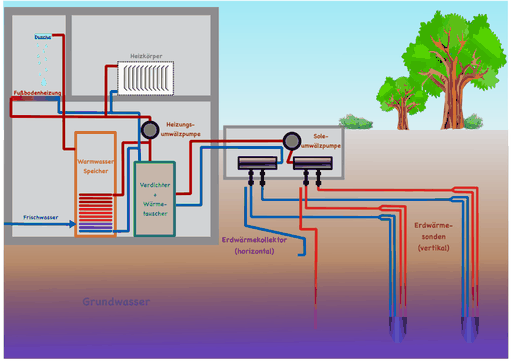
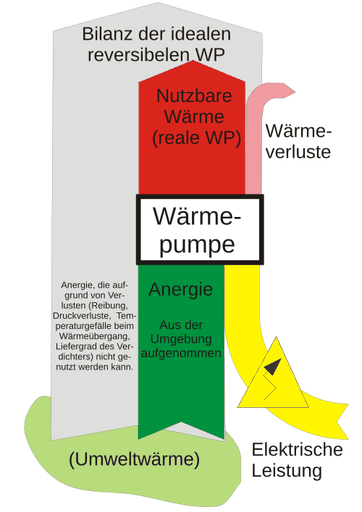

# Wärmepumpe

Eine **Wärmepumpe** ist allgemein eine Kraftwärmemaschine, die unter Aufwendung technischer Arbeit thermische Energie aus einem Reservoir mit niedrigerer Temperatur (in der Regel ist das die Umgebung) aufnimmt und – zusammen mit der Antriebsenergie – als Nutzwärme auf ein zu beheizendes System mit höherer Temperatur überträgt. Umgangssprachlich ist damit meist die Wärmepumpenheizung gemeint, die in Gebäuden für Heizzwecke eingesetzt wird.

Weitere Anwendungen sind die Brauchwassererwärmung, die Erzeugung von Prozesswärme und der Einsatz in Wäschetrocknern. Den Kreisprozess der Wärmepumpe verwendet man auch zum Kühlen (so beim Kühlschrank oder der Klimaanlage). Im Gegensatz zur Wärmepumpe ist beim Kälteprozess die aus dem zu kühlenden Raum abgeführte Wärme die Nutzenergie, die zusammen mit der Antriebsenergie als Abwärme an die Umgebung abgeführt wird.

## Einteilung

*nach dem Verfahren:*

- Verdichten (Kompression) (mechanische Energie als Antriebsleistung)
- Absorption (Hochtemperaturwärme als Antriebsleistung; siehe: Absorptionswärmepumpe)
- Adsorption (zum Beispiel Adsorption und Desorption eines Stoffes an einer Oberfläche wie Aktivkohle oder einem Zeolith, dabei wird die Adsorptionswärme frei oder auch die Desorptionswärme aufgenommen)
- Peltier-Effekt
- Magnetokalorischer Effekt
- Elektrokalorischer Effekt
- Elastokalorischer Effekt

*nach der Wärmequelle:*

- Außenluft
- Abluft
- Grundwasser (mit Schluckbrunnen)
- Oberflächenwasser
- Erdwärme
  - Erdwärmesonde
  - CO2-Sonde
  - Direktverdampfer-Sonde mit Kältemittel gefüllt
  - Spiralkollektor
  - flächig verlegter Wärmeübertrager mit Soleflüssigkeit befüllt
  - flächig verlegter Wärmeübertrager mit Kältemittel befüllt
  - thermisch aktivierte Fundamente
- Abwärme von industriellen Anlagen
- Abwasserwärmerückgewinnung (AWRG)
- Nutzung von Umwandlungsenthalpie beim Phasenübergang in Form eines Eisspeichers

*nach der Wärmenutzung:*

- Kühlen
- Gefrieren
- Warmwasser
- Heizung
  - mit Flächenheizung, Fußbodenheizung, Wandheizung, Deckenheizung
  - mit Heizkörpern, Radiatoren, Konvektoren
  - mit Gebläse-Konvektoren

*nach der Arbeitsweise:*

Es gibt verschiedene physikalische Effekte, die in einer Wärmepumpe Verwendung finden können. Die wichtigsten sind:

- die Verdampfungsenthalpie bei Wechsel des Aggregatzustandes (flüssig/gasförmig);
- die Reaktionsenthalpie bei Mischung zweier verschiedener Stoffe;
- die Temperaturabsenkung bei der Expansion eines (nicht idealen) Gases (Joule-Thomson-Effekt);
- der thermoelektrische Effekt;
- das Thermotunneling-Verfahren;
- der magnetokalorische Effekt;
- der elektrokalorische Effekt;
- der elastokalorische Effekt.

*in der Gebäudetechnik:*

Wärmepumpen werden vielfach auch zur Erwärmung von Wasser für die Gebäudeheizung (Wärmepumpenheizung) und Bereitstellung von Warmwasser eingesetzt. Wärmepumpen können allein, in Kombination mit anderen Heizungsarten sowie in Fern- und Nahwärmesystemen eingesetzt werden. Zu letzteren zählt z. B. die Kalte Nahwärme. Üblich sind die folgenden Kombinationen (Abkürzungen in Klammern):

- Wasser/Wasser-Wärmepumpe (WWWP) mit Entzug der Wärme aus dem Grundwasser über Förder- und Schluckbrunnen, aus Oberflächenwässern oder Abwässern
- Sole/Wasser-Wärmepumpe (SWWP), als Wärmequellen dienen:
  - Erdwärmesonden und Erdwärmekollektoren (Spiralkollektoren, Grabenkollektoren, Erdwärmekörbe etc.)
  - die Sonnenenergie über Sonnenkollektoren und Pufferspeicher
  - der Umgebung über Massivabsorber, Energiezaun, o. ä.
- Luft/Wasser-Wärmepumpe (LWWP) mit Entzug der Wärme aus Abluft oder Außenluft, seltener auch mit Vorerwärmung durch Erdwärmetauscher, Fassadenkollektoren oder ähnliches; Wärmeabgabe über wasserführende Heizsysteme, preiswert und häufig verwendet
- Luft/Luft-Wärmepumpen (LLWP) werden in Gebäuden zur Erwärmung oder Kühlung der Zuluft von Lüftungsanlagen (Klimaanlagen) verwendet

*nach der Bauart:*

- Monoblock-Wärmepumpen (werksseitig geschlossener Kältekreis in einer Einheit)
- Split-Wärmepumpen (Kältekreis verteilt auf Baugruppen, Erstellung vor Ort, bei Montage)

Wärmepumpen können reversibel sowohl zum Heizen, als auch zum Kühlen eingesetzt werden, indem der Kältekreislauf durch ein Umschaltventil umgekehrt wird und die Wärmepumpe im Sommer Wärme aus dem Gebäude an die Aussenluft oder das Erdreich abgibt. Bei simultanen Systemen (gleichzeitiges Heizen und Kühlen) wird die bei der Kühlung einer Zone anfallende Abwärme direkt zur Erwärmung einer anderen Zone genutzt, was in Gebäuden mit gemischten Nutzungsprofilen — etwa Büro und Serverräumen — den Gesamtenergiebedarf erheblich senkt. Alternativ können Wärmepumpen mit einem separaten passiven Kühlkreislauf kombiniert werden, bei dem das Erdreich oder Grundwasser im Sommer direkt als Kältequelle dient, ohne dass der Kompressor läuft (sogenanntes «Free Cooling»), was den elektrischen Energieverbrauch für die Kühlung auf ein Minimum reduziert. Die Auslegung von Wärmepumpensystemen mit Kühlfunktion erfordert eine dynamische Gebäudesimulation, da die gleichzeitigen Lastprofile für Heizung und Kühlung zeitlich variieren und eine statische Berechnung weder die optimale Maschinengrösse noch die Speicherkapazität zuverlässig bestimmen kann.

## Funktionsprinzipien

Die Kompressionswärmepumpe
:   nutzt den physikalischen Effekt der Verdampfungsenthalpie. In ihr zirkuliert ein Kältemittel in einem Kreislauf, das, angetrieben durch einen Kompressor, die Aggregatzustände flüssig und gasförmig abwechselnd annimmt.

Die Absorptionswärmepumpe
:   nutzt den physikalischen Effekt der Reaktionswärme bei Mischung zweier Flüssigkeiten oder Gase. Sie verfügt über einen Lösungsmittelkreis und einen Kältemittelkreis. Das Lösungsmittel wird im Kältemittel wiederholt gelöst oder ausgetrieben.

Die Adsorptionswärmepumpe
:   arbeitet mit einem festen Lösungsmittel, dem „Adsorbens“, an dem das Kältemittel ad- oder desorbiert wird. Dem Prozess wird Wärme bei der Desorption zugeführt und bei der Adsorption entnommen. Da das Adsorbens nicht in einem Kreislauf umgewälzt werden kann, kann der Prozess nur diskontinuierlich ablaufen, indem zwischen Ad- und Desorption zyklisch gewechselt wird.

Die magnetokalorische Wärmepumpe
:   nutzt die magnetische Kühlung. Prototypen erreichen Wirkungsgrade ähnlich denen von Kompressions-Wärmepumpen.

Die elektrisch angetriebene Kompressionswärmepumpe stellt den Hauptanwendungsfall von Wärmepumpen dar. Mit der Wärmepumpe kann ein Vielfaches der eingesetzten elektrischen Energie als Wärmeenergie bereitgestellt werden. Der Wärmepumpenprozess, nach Rudolf Plank *Plank-Prozess* genannt, wird auch als Kraftwärmemaschine bezeichnet. Der Grenzfall einer reversibel arbeitenden Kraftwärmemaschine ist der linksläufige Carnot-Prozess.

Elektrisch angetriebene Wärmepumpen werden mit einem geschlossenen Kältemittelkreislauf betrieben. Das Kältemittel verdampft bei niedrigem Druck unter Wärmezufuhr und nach der Verdichtung kondensiert das Kältemittel unter Abgabe der Nutzwärme. In der Drossel wird das flüssige Kältemittel von dem Hochdruck auf den Niederdruck entspannt. Dabei verdampft der größte Anteil des Kältemittels und die Temperatur sinkt. Die Drossel besteht bei sehr kleinen Anlagen aus einer Kapillaren, bei größeren Anlagen werden geregelte Ventile eingesetzt, die den Druck im Verdampfer so einstellen, dass die entsprechende Sattdampftemperatur etwas tiefer als die Temperatur der Wärmequelle liegt, so dass das Kältemittel durch die Wärmeaufnahmen verdampft. Der Abluft, der Außenluft, dem Erdboden, dem Abwasser oder dem Grundwasser kann Wärme durch Einsatz einer Wärmepumpe entzogen werden.

Der Verdichter wird so geregelt, dass die zum Verdichtungsenddruck zugehörige Sattdampftemperatur geringfügig über der Temperatur der Wärmesenke liegt. Die Wärmequelle für Wärmepumpen ist die Umgebungsluft, die Erdwärme oder ein Wasserfluss. Die Wärmesenke ist z. B. der Heizkreis- oder Warmwasserkreislauf, der eine Seite des Verflüssiger-Wärmetauschers bildet.

Das Verhältnis von in den Heizkreis abgegebener Wärmeleistung zu zugeführter elektrischer Verdichterleistung wird als Leistungszahl (*coefficient of performance,* kurz COP) bezeichnet. Die Leistungszahl hat einen oberen Wert, der aus dem Carnot-Kreisprozess abgeleitet und nicht überschritten werden kann. Die Leistungszahl wird auf einem Prüfstand gemäß der Norm EN 14511 (früher EN 255) ermittelt und gilt nur unter den jeweiligen Prüfbedingungen. Der COP ist Gütekriterium für Wärmepumpen, erlaubt jedoch keine energetische Bewertung der Gesamtanlage.

Das Verhältnis des COP bezogen auf die jahreszeitabhängigen Temperaturen wird als SCOP (*seasonal coefficient of performance*), jahreszeitabhängige Raumeffizienz, bezeichnet und gemäß Norm EN 14825 ermittelt und gilt nur unter den dort genannten Prüfbedingungen. Er erlaubt einen Vergleich gleichartiger Geräte, jedoch keine Bewertung einer Gesamtanlage.

Das Kältemittel wird in Bezug auf den Prozess so gewählt, dass die Temperaturen des Phasenübergangs einen für die Wärmeübertragung ausreichenden Abstand zu den Temperaturen von Wärmequelle und Wärmesenke haben. Soweit möglich wird ein Kältemittel verwendet, dessen Verdampfungsdruck bei der niedrigsten Arbeitstemperatur über dem Umgebungsdruck liegt, um das Eindringen von Luft in den Kältemittelkreislauf zu verhindern. Weitere Aspekte zur Auswahl des Kältemittels siehe Abschnitt *Kältemittel (Arbeitsgase)*.

Im Gegensatz zur Kältemaschine wird bei der Wärmepumpe die Energie auf der warmen Seite genutzt. Der Wärmepumpenkreislauf ist in der Abbildung 1 dargestellt. Eine Wärmepumpe besteht mindestens aus den vier dargestellten Komponenten: Verdampfer, Verdichter (Kompressor), Verflüssiger und Drossel (Expansionsventil).

## Der Kreisprozess

Die in der Thermodynamik verwendeten Diagramme für Kreislaufprozesse (Log-p-h-Diagramm oder T-s-Diagramm) sind gute Hilfen, um Kreisprozesse darzustellen. Die spezifischen Parameter können in dem Diagramm des betrachteten Stoffes direkt ermittelt werden. In dem Log-p-h-Diagramm können zu den Arbeitspunkten direkt die Enthalpien h für die spezifischen Wärmeströme und Verdichterarbeit auf der Ordinate abgelesen werden.

Bei der Wärmepumpe werden oft physikalische Effekte des Phasenübergangs einer Flüssigkeit in die gasförmige Phase und umgekehrt ausgenutzt. So kann zum Beispiel Propan – technische Bezeichnung R-290 – in Wärmepumpen als Kältemittel verwendet werden, da es in dem Temperaturbereich für Gebäudeheizungen je nach Druckstufe in der Gas- und Flüssigphase auftritt. Der Einsatz von Kältemitteln in dem Zweiphasengebiet ist effektiv, da die Stoffe bei dem Phasenübergang einen sehr hohen Wärmeübergangskoeffizienten aufweisen und der Wärmeübergang bei einer durch den Druck eingestellten konstanten Temperatur erfolgt.

In Abbildung 6 ist in dem T-s-Diagramm die Taulinie (rechts vom kritischen Punkt an der Spitze der Kurve) und die Siedelinie (links vom kritischen Punkt) dargestellt. Propan ist bei normalem Luftdruck (1,013 bar) und niedriger Außentemperatur (zum Beispiel 5 °C) gasförmig. Wenn das Gas komprimiert, bleibt es gasförmig und wird überhitzt. Kühlt das Gas bei dem hohen Druck ab, wird es flüssig, wenn die Taulinie erreicht wird. Beim Verflüssigen (Kondensieren) und konstantem Druck bleibt die Temperatur konstant, bis das gesamte Kältemittel kondensiert ist. Wenn das flüssige Kältemittel anschließend ohne Wärmeübertragung nach außen entspannt wird (adiabate Drosselung), verdampft es zum größten Teil und die Temperatur fällt. Diesen Effekt kann man an einer Propangasflasche nachvollziehen; bei starker Entnahme kann sich ein Eisansatz an der Flasche bilden.

- Verdichten

Das gasförmige Kältemittel wird im Verdichter durch einen elektrisch angetriebenen Verdichter komprimiert (verdichtet), wobei sich das Gas erhitzt. Der Enddruck des Verdichters wird so geregelt, dass die zugehörige Sattdampftemperatur einige Grad über der Temperatur der Wärmesenke liegt. Dies ist bei Heizungen die Vorlauftemperatur.

- Verflüssigen

Das heiße, komprimierte Gas gibt im Wärmetauscher seine Wärme an das Wasser der Heizungsanlage ab. Dabei kühlt sich das komprimierte und überhitzte Gas erst geringfügig ab (Überhitzung des Gases), bis die Temperatur erreicht ist, die dem Sattdampfdruck entspricht. Anschließend kondensiert das Kältemittel bei einer konstanten Temperatur in einem Wärmetauscher (Kondensator, in der Kältetechnik ist der Begriff Verflüssiger üblich). Das Kältemittel im flüssigen Zustand wird noch geringfügig unterkühlt, damit Blasen sicher vermieden werden, die die Funktion des nachgeschalteten thermostatischen Expansionsventils beeinträchtigen können.

- Entspannen

Beim anschließenden Durchgang durch das Expansionsventil, einer Drossel, wird das flüssige Kältemittel entspannt, verdampft dabei weitgehend und kühlt ab und wird dem Verdampfer zugeführt.

- Verdampfen

Der Verdampfer ist der zweite Wärmetauscher, an dem bei niedriger Temperatur die Wärme aus der Umgebungsluft oder dem Erdreich an das Kältemittel übertragen wird. Hierbei verdampft das Kältemittel bei konstanter Temperatur. Optimalerweise sollte der Druck im Verdampfer von dem Expansionsventil so geregelt werden, dass die Temperatur des Gases nur geringfügig über der Umgebungstemperatur liegt. Außerdem muss verhindert werden, dass flüssiges Kältemittel in den Verdichter gelangt und diesen beschädigt (Flüssigkeitsschlag, Kavitation). Die Temperatur der Wärmequelle muss immer höher sein als die Verdampfungstemperatur des Kältemittels, damit ein Temperaturgradient vorhanden ist, der für eine Wärmeübertragung erforderlich ist. Eine Wärmepumpe muss nicht zwingend diesem typischen Wärmepumpenprozess folgen, beispielsweise kann auch ein linkslaufender Stirlingmotor die Funktion der Wärmepumpe erfüllen.

### Beispiel Kältemittel R-134a

In der Abbildung 4 ist der ideale Wärmepumpenprozess mit dem Kältemittel R-134a dargestellt. Die Anergie (Umweltwärme) wird bei 0 °C dem Verdampfer zugeführt und bei 50 °C wird die Wärme ins Heizungssystem abgeführt. Die einzelnen Prozessschritte sind:

- 1 - 2: Isentrope Verdichtung von 2,93 bar auf 13,18 bar; Das Kältemittel ist geringfügig überhitzt (50,1 °C).
- 2 - 3: Das Kältemittel kühlt im Verflüssiger auf die Sattdampftemperatur (50,1 °C auf 50 °C) ab und anschließend kondensiert das gesamte Kältemittel bei einer Temperatur von 50 °C durch Wärmeabgabe an das Heizungssystem.
- 3 - 4 Das flüssige Kältemittel wird auf den Sattdampfdruck von 0 °C entspannt. Der Endpunkt liegt im Zweiphasengebiet, wobei bei dem speziellen Arbeitspunkt „4“ 64 % des Kältemittels noch flüssig sind.
- 4 - 1 Das gesamte Kältemittel verdampft im Verdampfer durch Wärmeaufnahme aus der Umgebung. Es wird anschließend wieder dem Verdichter zugeführt.

Aus dem Beispiel kann auf der Koordinate oder anhand thermodynamischer Näherungsfunktionen abgelesen werden:

:   ;
:   ;

Mit diesen Angaben kann der COP dieses idealisierten Prozesses berechnet werden:

Vergleicht man den COPideal mit dem Kehrwert des Carnotwirkungsgrades des reversiblen Prozesses

so liegt der COPideal niedriger. Die Ursache ist, dass auch der idealisierte Wärmepumpenprozess (isentrope Verdichtung, Temperaturgradient an den Wärmetauschern wird vernachlässigt, Druckverluste werden nicht berücksichtigt) nicht reversibel ist. Die realen Gase weichen von den idealen Gasen ab, und die Entspannung an der Drossel ist adiabat und nicht reversibel, da aus dem Druckgefälle auch bei dem idealisierten Prozess keine Arbeit gewonnen wird. Der Kehrwert des Carnotfaktors ist aber sehr hilfreich, die Auswirkung unterschiedlicher Arbeitstemperaturen abzuschätzen. Der COP des realen Prozesses kann man mit dem Produkt aus COPmax und dem Gütegrad ηWP abgeschätzt werden, der hier mit 0,5 als Erfahrungswert herangezogen wird. Damit erhält man einen COP von 3,23, wobei in dem Beispiel (0 °C / 50 °C) ein ungünstiger Betriebspunkt gewählt wurde.

Abbildung 6 zeigt den Prozess im T-s-Diagramm. Theoretisch wäre es möglich, die Arbeitsfähigkeit des Kondensates beim Entspannen (Drossel) auf den niedrigeren Druck durch eine Kraftmaschine, beispielsweise eine Turbine, zu nutzen, wie es der reversible Carnot-Prozess beschreibt. Doch dabei würde die Flüssigkeit teilweise verdampfen. Die Nutzung der Entspannungsenthalpie ist technisch nur sehr aufwändig zu realisieren und wird daher nicht angewendet. Deshalb verwendet man der Einfachheit halber hier eine Drossel (Entspannung mit konstanter Totalenthalpie). Insofern liegt der COP des idealen Wärmepumpenprozesses mit Drosselung niedriger als der Carnot-Faktor.

### Thermodynamische Betrachtung

#### Leistungszahl

→ *Hauptartikel: Leistungszahl*

Die Leistungszahl ε einer Wärmepumpe, in der Literatur auch als Heizzahl bezeichnet (englisch *coefficient of performance* ), ist der Quotient aus der Wärme Qc, die in den Heizkreis abgegeben wird, und der eingesetzten Energie :

Bei typischen Leistungszahlen von 4 bis 5 steht das Vier- bis Fünffache der eingesetzten Leistung als nutzbare Wärmeleistung zur Verfügung, der Zugewinn stammt aus der entzogenen Umgebungswärme.

Die Leistungszahl hängt stark vom unteren und oberen Temperaturniveau ab. Die theoretisch maximal erreichbare Leistungszahl  einer Wärmepumpe ist entsprechend dem zweiten Hauptsatz der Thermodynamik begrenzt durch den Kehrwert des Carnot-Wirkungsgrads

Für die Temperaturen sind die absoluten Werte einzusetzen.

#### Gütegrad

→ *Hauptartikel: Gütegrad*

Der Gütegrad  einer Wärmepumpe ist die tatsächliche Leistungszahl bezogen auf die ideale Leistungszahl bei den verwendeten Temperaturniveaus. Er berechnet sich zu:

Praktisch werden Wärmepumpengütegrade  im Bereich 0,45 bis 0,55 erreicht.

## Komponenten

### Verdichter

Die in der Tabelle aufgeführten Verdichterbauarten sind unabhängig von dem Einsatz als Bauteil in einer Wärmepumpe oder Kälteanlage. Die Bauart des Verdichters gibt die Ausführung der Abdichtung des Verdichtergehäuses zur Umgebung an. Der hermetische Verdichter hat keine lösbaren Verbindungen; der Motor liegt im Verdichtergehäuse und im Kältemittel. Der halbhermetische Verdichter hat ein abgedichtetes Maschinengehäuse, in dem der Motor eingebaut ist; das Gehäuse hat aber keine dynamisch belastete Wellendurchführung nach außen. Der offene Verdichter hat eine Wellendurchführung und ist über eine Kupplung an den Motor angeflanscht, der ein separates Bauteil ist.

Der Scrollverdichter hat sich als Verdichter in kleineren und mittleren Wärmepumpen etabliert; vorteilhaft sind die relativ einfache Bauform und der leise Betrieb, da nur eine Drehbewegung erfolgt und keine translatorische Bewegung auftritt. Er besitzt keine Ventile und hat im Vergleich zum Kolbenverdichter einen höheren isentropischen und volumetrischen Wirkungsgrad. Verdichter und Motor sind in einem hermetisch geschlossenen Gehäuse eingebaut und der Motor wird in der Regel mit einem Wechselrichter betrieben, um die Drehzahl an den Wärmebedarf anzupassen. Der Scrollverdichter hat bauartbedingt ein festes Verdichtungsverhältnis. Es kann daher eine unzureichende Verdichtung auftreten, so dass keine Förderung des Fluides möglich ist. Eine zu hohe Verdichtung verringert den Wirkungsgrad. Um diese zu vermeiden, werden dynamische Auslassventile verwendet.

### Verdampfer

#### Lufterwärmter Verdampfer

Bei dem lufterwärmten Verdampfer wird Umgebungsluft mit einem Gebläse zu den Wärmetauscherflächen geführt, die als Rippenrohrbündel ausgeführt sind. Diese sind zumeist aus Kupfer hergestellt. Der Verdampfer kann im Gebäude installiert sein, so dass Außenluft über einen Kanal zugeführt wird. In der Regel sind die Verdampfer allerdings in einem Maschinengehäuse im Freien aufgestellt, um die Antriebsleistung für den Luftgebläsemotor niedrig zu halten und Lärmemissionen im Gebäude zu vermeiden. Das primär gasförmige Kältemittel wird durch parallel angeordnete Rohre geleitet, die mit Metallrippen versehen sind, um die Wärmeaustauschfläche zu erhöhen. Das Kältemittel wird über das Expansionsventil eingespritzt; es verdampft und wird im letzten Teil der Verdampferrohre geringfügig überhitzt. Als Temperaturdifferenz zwischen Verdampfungstemperatur des Kältemittels und der Außentemperatur wird typisch 4 K angesetzt. Je höher diese Temperaturdifferenz ist, desto ineffizienter arbeitet die Wärmepumpe. Technisch ausgereifte Produkte erreichen Werte von 3 K, marktüblich sind eher 6 K. Soweit die Außentemperatur einen niedrigeren Abstand zum Gefrierpunkt hat als diese Temperaturdifferenz, bildet sich Eis auf der Außenseite des Verdampfers, was ein zyklisches Abtauen erfordert. Dies führt zu Wirkungsgradeinbußen. Eine hohe Luftfeuchtigkeit bei Temperaturen oberhalb der Vereisung erhöht hingegen die Effizienz, da die Luftfeuchtigkeit auf den Verdampferflächen kondensiert und so Wärmeenergie abgibt.

## Effizienz

Die Leistungszahl COP (engl. *coefficient of performance*) einer Wärmepumpe wird durch viele Faktoren beeinflusst. Im Falle einer reversiblen Wärmepumpe könnte durch die Umkehrung des Kreisprozesses an dem Generator einer Entspannungsturbine wieder die eingebrachte elektrische Leistung abgegriffen werden, wenn die Wärmemengen wieder in den Prozess eingebracht werden. Bei dem Grenzfall des Carnot-Prozesses und der Verwendung eines idealen Gases wäre der COP identisch mit dem Kehrwert des Carnot-Faktors ηc.

Aus der Gleichung kann entnommen werden, dass der COP steigt, wenn die Temperatur der Senke kleiner wird (niedrigere Heiztemperatur) und die Temperatur der Quelle (z. B. Außenluft) steigt. Um eine möglichst hohe Leistungszahl und somit eine hohe Energieeffizienz zu erlangen, sollte die Temperaturdifferenz zwischen der Wärmequelle (Umgebung) und der Wärmesenke (Heizungsvorlauf) möglichst gering sein. Die Wärmeübertrager sollten effizient sein und die Temperaturdifferenz zwischen der Primär- und Sekundärseite sollte gering sein.

Der Kehrwert des Carnotwirkungsgrades kann bei realen Kreisprozessen für den COPmax schon aufgrund der Energieverluste bei der Drosselung nicht erreicht werden. Bei vorgegebener oberer und unterer Temperatur des Kreisprozesses müssen folgende weitere Verluste berücksichtigt werden:

- Wirkungsgrad des elektrischen Motors am Verdichter
- Dissipation bei der Verdichtung, Reibungsverluste, Spülverluste
- Druckverluste in den Rohrleitungen und Druckbehältern
- Wärmeverluste an den Bauteilen
- Temperaturdifferenz der Medien im Verflüssiger (Verflüssigungstemperatur des Kältemittels > Temperatur der Wärmesenke)
- Temperaturdifferenz der Medien im Verdampfer (Verdampfungstemperatur des Kältemittels < Temperatur der Wärmequelle)
- In der Regel muss das Medium der Wärmequelle mit einer Pumpe oder einem Lüfter zu den Wärmetauscherflächen des Verdampfers geleitet werden. Die elektrische Antriebsenergie muss bei dem realen Prozess berücksichtigt werden.

### Maßnahmen zur Erhöhung der Effizienz

#### Kältemitteleinspritzung

Die höchste Leistungszahl für eine Wärmepumpe hat der reversible Carnot-Prozess. Dieser Prozess kann technisch aber nur annähernd erreicht werden. Bei dem realen Wärmepumpenprozess verursachen insbesondere die adiabate Drosselung und die nicht isentrope Verdichtung eine Begrenzung der Gütezahl. Daher werden Verfahren angewandt, die den realen Prozess dem Carnot-Prozess annähern; man spricht von einer Carnotisierung. Eine bewährte Anwendung ist die Einspritzung von Kältemitteldampf in den Verdichter. Es wird eine Teilmenge des flüssigen Kältemittels hinter dem Verflüssiger (3) entnommen entspannt (3"). Dieser abgekühlte Teilstrom wird an dem ECO-Wärmetauscher durch den Hauptkältmittelstrom wieder erhitzt, der somit unterkühlt ist (3'). Der Hauptstrom wird dann am Expansionsventil entspannt und im Verdampfer durch Aufnahme der Umgebungswärme in die Gasphase überführt. Der erwärmte Teilstrom wird an einer optimierten Stelle des Verdichters in einem mittleren Druckniveau eingespritzt (2'). Durch diese Maßnahme wird die spezifische Verdichterarbeit verringert und die Überhitzung des Kältemittels nach der Verdichtung am Punkt 2 ist bei gleichem Druckniveau bei der Einspritzung geringer. Unter Berücksichtigung des thermischen Belastbarkeit des Kältemaschinenöls kann dieser Prozess auch für höhere Verdichtungsenddrücke und Verflüssigungstemperaturen genutzt werden.

Eine Voraussetzung für die Anwendung dieses Verfahrens ist die Bauart des Verdichters: Bei Schrauben- und Scrollverdichtern kann diese Methode angewandt werden.

#### Optimierung der Wärmeübertrager

Die Wärmeübertrager sollten für möglichst geringe Temperaturdifferenzen zwischen der Primär- und Sekundärseite ausgelegt sein. Zur Vermeidung von Druckverlusten und Verschlechterung des Wärmeübergangs sollten verschmutzende Flächen der Wärmetauscher regelmäßig gesäubert werden (z. B. Rohranordnung der luftbeaufschlagten Verdampfer). Auf der Verflüssigerseite sind niedrige Vorlauftemperaturen anzustreben. Im Falle einer Gebäudeheizung ist der Anschluss einer Fußboden-, Wand- oder Deckenheizung die optimale Lösung. Bei Bestandsgebäuden kann auch durch Tausch von Heizkörpern die Heizfläche vergrößert werden, etwa wenn Gussheizkörper durch groß dimensionierte Plattenheizkörper ersetzt werden.

An den Heizkörpern sollte ein hydraulischer Abgleich vorgenommen werden, so dass alle Heizkörper entsprechend ihrer Dimensionierung mit dem optimalen Wasservolumenstrom versorgt werden. Damit kann oft die Vorlauftemperatur reduziert werden, da auch Heizkörper mit langem Rohrleitungsverlauf mit der optimalen Wassermenge versorgt werden.

#### Reduzierung der Vorlauftemperatur

Um günstige COP-Werte und Jahresarbeitszahlen der Wärmepumpe zu erzielen, sollte die Temperatur, die die Wärmepumpe bereitstellen soll, so niedrig wie möglich sein. Je Grad weniger erreicht man eine Energieersparnis von ca. 2 % (bei Reduktion von 60 °C auf 59 °C) bis ca. 4 % (bei Reduktion von 31° auf 30 °C).

Die Verflüssigungstemperatur von einstufigen Wärmepumpen ist begrenzt. Die im Wärmepumpenprozess maximal erreichbare Temperatur ist maßgeblich abhängig vom Kältemittel (Druck). Eine Begrenzung kann auch durch den Verdichter verursacht werden, die Schmierung ist nicht wechselbar und droht thermisch zu vercracken. Handelsübliche moderne Heizungswärmepumpen erreichen heute mit dem Kältemittel Propan (R-290) Temperaturen von 70 °C bis 75 °C. Wärmepumpen (R-407/R-410A) liefern häufig eine maximale Vorlauftemperatur von 55 bis 60 °C.

Sollten höhere Temperaturen erforderlich sein, muss das zu heizende Medium noch mit einem elektrischen Heizstab nacherhitzt werden. Bei dieser direkten elektrischen Beheizung entspricht die erzeugte Wärmeenergie genau der eingesetzten elektrischen Energie (COP=1).

Unter anderem mit zweistufigen Wärmepumpen können deutlich höhere Verflüssigungstemperaturen (>80 °C) ermöglicht werden, die allerdings physikalisch bedingt einen deutlich schlechteren COP-Wert aufweisen und technisch aufwändiger sind.

#### Senkung des Energiebedarfs

Fälschlicherweise wird häufig behauptet, dass vor der Installation einer Heizungswärmepumpe der Energiebedarf des Gebäudes gesenkt werden muss. Tatsächlich wird das Potential vieler Gebäude nicht genutzt, d. h. die Senkung der tatsächliche notwendigen Heizkreisvorlauftemperatur ist zu prüfen. Technisch notwendig ist dies aber nur, wenn das Gebäude so hohe Vorlauftemperaturen benötigt, dass diese nicht über den Wärmepumpenprozess bereitgestellt werden können. Durch Wärmedämmung, hochwertige Fenster mit niedrigem k-Wert und ggf. mit einer Wärmerückgewinnung bei der Lüftung kann dann erreicht werden, dass niedrigere Vorlauftemperaturen ausreichen.

Als Faustformel für die Gebäudeheizung gilt im Jahr 2025 in Deutschland: Reicht an den kältesten Tagen eine Vorlauftemperatur von 55 °C aus, ist eine Heizungswärmepumpe wirtschaftlich. Mit zukünftig zunehmendem Preis für fossile Energie und damit geringerem Verhältnis des Preises von elektrischer Energie zu Energie aus Gas oder Erdöl lohnt eine Heizungswärmepumpe auch bei höheren benötigten Vorlauftemperaturen.

### Jahresarbeitszahl

Die Effizienz einer Wärmepumpe, gemessen als die Jahresarbeitszahl , ist das Verhältnis der genutzten Wärme  zur aufgewendeten elektrischen Energie  über ein Jahr:

Dabei geht es nicht nur um das Wärmepumpenaggregat selbst, sondern die Anwendung in einer konkreten Umgebung, also einem konkreten Haus in dem dort herrschenden Klima. Die Jahresarbeitszahl ist der Quotient von Jahresheizwärmeabgabe und Jahreselektroenergieaufnahme.
Je nach Bilanzierungskreis werden die Verluste wie Wärmeabgabe von Speichern und Pumpenenergie einbezogen oder nicht. Je höher die Jahresarbeitszahl, desto effizienter arbeitet die Wärmepumpe. Die JAZ einer geplanten Heizanlage kann rechnerisch abgeschätzt werden, hierfür gibt es Normen und Tools.

In die Jahresarbeitszahl gehen alle Betriebszustände ein; Übergangszeiträume mit relativ hohen Außentemperaturen und niedrigen Vorlauftemperaturen führen zu hohen COP-Werten der Wärmepumpe. In Zeiträumen mit niedrigen Außentemperaturen sind höhere Vorlauftemperaturen notwendig, um den notwendigen Wärmestrom über die Heizflächen an den Raum zu übertragen, daher ist in diesen Zeiträumen der COP deutlich niedriger. Die Höhe der JAZ kann in einem gut gedämmten Haus, das hauptsächlich bei Frost beheizt wird und in Übergangszeiträumen gar keine Heizung benötigt, niedriger sein, als wenn eine baugleiche Wärmepumpe in einem schlechter gedämmten Haus auch bei mildem Wetter schon oder noch arbeitet.

Zu durchschnittlichen JAZ werden je nach Quelle verschiedene Zahlen genannt. In folgender Tabelle sind Angaben zum Durchschnitt und Maximalwert der JAZ für jeweilige Wärmepumpentypen aus zwei beispielhaften Quellen.

(Abkürzungen: LW: Luft-Wasser-Wärmepumpe, SW: Sole-Wasser-Wärmepumpe (darunter: F: Flächenkollektoren, S: Erdsonden), WW: Wasser-Wasser-Wärmepumpe)

Die Nutzenergie übersteigt in allen Anordnungen die aufgewendete elektrische Energie.

Mithilfe der JAZ lässt sich der Stromverbrauch abschätzen. An dem Beispiel einer Luft-Wasser-Wärmepumpe für ein Einfamilienhaus mit einem Heizenergiebedarf von 150 kWh/(m²⋅a), einer Wohnfläche von 120 m² ergibt sich bei einer JAZ von 3 der Strombedarf:

Hinsichtlich des Kältekreislaufes und des Heizkreislaufes gibt es noch Optimierungsmöglichkeiten. Das Kältemittel kann nach der Verflüssigung bei der hohen Temperatur für die Vorwärmung des Brauchwassers bei niedrigeren Temperaturen genutzt werden. Mit dieser Maßnahme kann der COP erhöht werden, da die nutzbare Wärme zunimmt.
Der Heizungswasserkreislauf kann mit Wärmespeichern ausgerüstet werden, damit die Wärmepumpe bei niedrigen Außentemperaturen nicht an den kältesten Tagesstunden betrieben werden muss.

## Nachhaltigkeit

### Kältemittel (Arbeitsgase)

Bis zur Entwicklung der späteren Sicherheitskältemittel(unbrennbar/ungiftig) waren anfangs natürliche Kältemittel wie Ammoniak R-717 (giftig) und Propan R-290 (brennbar) im Einsatz. Von 1930 bis zum Anfang der 1990er Jahre waren die Fluorchlorkohlenwasserstoffe (FCKW) die bevorzugten Kältemittel. Sie kondensieren bei Raumtemperatur unter leicht handhabbarem Druck. Sie sind nicht giftig, nicht brennbar und reagieren nicht mit den üblichen Werkstoffen. Wenn FCKW freigesetzt werden, schädigen sie jedoch die Ozonschicht der Atmosphäre und tragen zum Ozonloch bei. In Deutschland wurde daher im Jahr 1995 der Einsatz von Fluorchlorkohlenwasserstoffen verboten. Die als Ersatz verwendeten Fluorkohlenwasserstoffe (FKW) schädigen nicht die Ozonschicht, tragen jedoch zum Treibhauseffekt bei und sind im Kyoto-Protokoll als umweltgefährdend erfasst. Als natürliche Kältemittel gelten reine Kohlenwasserstoffe wie Propan oder Propylen, wobei deren Brennbarkeit besondere Sicherheitsmaßnahmen (beispielsweise Mindestabstände zum Gebäude bzw. zur nächsten Gebäudeöffnung) erforderlich macht. Anorganische Alternativen wie Ammoniak, Kohlendioxid oder Wasser wurden ebenfalls für Wärmepumpen eingesetzt. Aufgrund spezifischer Nachteile haben sich diese Kältemittel nicht im größeren technischen Maßstab durchsetzen können. Ammoniak (NH3) und Kohlendioxid (CO2) werden generell in industriellen Kühlanlagen wie Kühlhäusern und Brauereien eingesetzt.

## Bauarten

Wärmepumpen werden in zwei Bauarten angeboten, der Monoblock- und der Splitwärmepumpe. Die Monoblockwärmepumpe ist eine kompakte Ausführung, bei der alle Kältemittel beaufschlagten Komponenten (Verdampfer, Verdichter, Verflüssiger, Expansionsventil) in einem Maschinengehäuse angeordnet sind, das zumeist im Freien aufgestellt wird. Da der Kältekreislauf werksmäßig erstellt und gefüllt wird, ist nur ein Anschluss an die Wasserleitungen des Heizungssystems erforderlich. Bei den Verbindungsrohrleitungen müssen Wärmedämmung und Frostschutzmaßnahmen beachtet werden. Die Monoblockanlage ist etwas preisgünstiger als die Splitanlage.

Luft-Wärmepumpen sind darüber hinaus auch in der von Klimageräten bekannten Splitbauweise erhältlich. Sie bestehen aus einer Außen- sowie mindestens einer Inneneinheit, die durch Kältemittelleitungen miteinander verbunden sind. Die Außeneinheit enthält den Verdampfer mit dem Luftgebläse sowie meistens auch den Verdichter und damit alle Bauteile, die im Betrieb Geräusche verursachen. In der Inneneinheit - bei *Multisplit*-Anlagen auch mehreren - befindet sich hingegen nur der Verflüssiger. Außerdem ist die Steuerungs-Einheit meist an der Inneneinheit angeschlossen. Da die Aggregate mit den Kältemittelrohrleitungen verbunden sind, entfallen Maßnahmen zum Frostschutz. Da allerdings am Kältemittelkreis gearbeitet wird und ggf. Kältemittel aufzufüllen ist, darf die Inbetriebnahme nur von einem Kältesachkundigen durchgeführt werden.

## Abtauen und Kühlbetrieb

Beim Betrieb des lufterwärmten Verdampfers tritt das Problem auf, dass auf den Wärmeübertragungsflächen Wasser aus der Luftströmung kondensieren kann. Wenn die Sattdampftemperatur im Verdampfer unter 0 °C fällt, vereisen die Übertragungsflächen und der Wärmeaustausch wird schlechter und versagt bei durchgehendem Eisfilm. Dies kann schon bei einer Außentemperatur einige Grad über 0 °C auftreten, da die Sattdampftemperatur des Kältemittels unter der Außentemperatur liegen muss, um einen Wärmeübergang aufrechtzuerhalten.

Die effektivste Methode ist die Heißgasabtauung. Dabei wird der Prozesskreislauf umgekehrt, indem ein 4-2-Wegeventil auf der Saug- und Druckseite des Verdichters installiert wird. Im normalen Wärmepumpenbetrieb strömt das verdichtete warme Gas durch den Verflüssiger und gibt die Verdampfungsenthalpie an das Heizungssystem ab. Die Wärmeaufnahme erfolgt durch den lufterwärmten Verdampfer bei niedrigem Arbeitsdruck. Für die Abtauung wird das Heißgas zuerst auf den Verdampfer geleitet, der nunmehr als Verflüssiger fungiert. Die hohe Temperatur der Wärmeübertragungsflächen sorgt für ein effektives Abtauen, das nach einem kurzen Zeitraum abgeschlossen ist. Bei dem Zustand wird dem Verflüssiger Wärme entzogen, der jetzt als Verdampfer wirkt. Die Wärme für das Abtauen wird somit dem Heizungssystem entzogen, das jetzt als Wärmesenke wirkt. Häufig werden Pufferspeicher verwendet, um zu garantieren, dass die Wärmepumpe unabhängig von der Stellung der Thermostatventile ausreichend warmes Wasser während des Abtauprozesses zur Verfügung hat.

Eine ineffiziente Methode der Abtauung ist der Einsatz eines Heizstabs.

Diese Schaltung der Funktionsumkehrung von Verflüssiger und Verdampfer ist auch geeignet, die Wärmepumpe als Kälteanlage für die Raumkühlung zu nutzen. Da allerdings im Kühlbetrieb bei größeren Temperaturdifferenzen zur Raumtemperatur Kondenswasser an den nun als Kühlkörper genutzten Heizkörpern anfallen kann und diese nicht für das Auffangen von Kondensat ausgelegt sind, kann diese Betriebsweise nur eingeschränkt genutzt werden.

## Beispielwerte

Das untere Temperaturniveau einer Wärmepumpe liegt bei 10 °C (= 283,15 K), und die Nutzwärme wird bei 50 °C (= 323,15 K) übertragen. Bei einem idealen reversiblen Wärmepumpenprozess, der Umkehrung des Carnotprozesses, würde die Leistungszahl bei 8,1 liegen. Real erreichbar ist bei diesem Temperaturniveau eine Leistungszahl von 4,5. Mit einer Energieeinheit Exergie, die als mechanische oder elektrische Leistung eingebracht wird, können 3,5 Einheiten Anergie aus der Umgebung auf das hohe Temperaturniveau gepumpt werden, so dass 4,5 Energieeinheiten als Wärme bei 50 °C Heizungs-Vorlauftemperatur genutzt werden können. (*1 Einheit Exergie + 3,5 Einheiten Anergie = 4,5 Einheiten Wärmeenergie*).

In der Gesamtbetrachtung müssen aber der exergetische Kraftwerkwirkungsgrad und die Netzübertragungsverluste berücksichtigt werden, die einen Gesamtwirkungsgrad von ca. 35 % erreichen. Die benötigte 1 kWh Exergie erfordert einen Primärenergieeinsatz von 100 / 35 × 1 kWh = 2,86 kWh. Wenn die Primärenergie nicht im Kraftwerk eingesetzt, sondern direkt vor Ort zur Beheizung genutzt wird, erhält man bei einem Feuerungswirkungsgrad von 95 % – demnach 2,86 kWh × 95 % = 2,71 kWh thermische Energie.

Mit Bezug auf das oben aufgeführte Beispiel kann im Idealfall (Leistungszahl = 4,5) mit einer Heizungswärmepumpe das 1,6fache und bei einer konventionellen Heizung das 0,95fache der eingesetzten Brennstoffenthalpie als Wärmeenergie umgesetzt werden. Unter sehr günstigen Randbedingungen kann so bei dem Umweg Kraftwerk → Strom → Wärmepumpe eine 1,65-fach höhere Wärmemenge gegenüber der direkten Verbrennung erreicht werden.

Am Prüfstand wird bei einer Grundwassertemperatur von 10 °C und einer Temperatur der Nutzwärme von 35 °C eine Leistungszahl von bis zu COP=6,8 erreicht. In der Praxis wird allerdings der tatsächlich über das Jahr erreichbare Leistungswert, die Jahresarbeitszahl (JAZ) inkl. Verluste und Nebenantriebe, von nur 4,2 erzielt. Bei Luft/Wasser-Wärmepumpen liegen die Werte deutlich darunter, was die Reduzierung des Primärenergiebedarfs mindert. Unter ungünstigen Bedingungen – etwa bei Strom aus fossilen Brennstoffen – kann mehr Primärenergie verbraucht werden als bei einer konventionellen Heizung, in der Regel (für JAZ > 2,5) aber nicht viel mehr. Ein solcher Einsatz von Strom zur Heizung ist im Hinblick auf den Klimaschutz und volkswirtschaftlich dann weder besonders effizient noch besonders ineffizient, wird aber mit zunehmendem Anteil erneuerbarer Energien an der Stromerzeugung immer sinnvoller.

Eine Wärmepumpe mit einer JAZ > 3 gilt als energieeffizient. Allerdings werden laut einer Studie bereits bei dem Strommix aus dem Jahr 2008 schon ab einer JAZ von 2 Kohlendioxidemissionen eingespart, mit weiterem Ausbau der Erneuerbaren Energien sowie dem Ersatz älterer Kraftwerke durch modernere und effizientere steigt das Einsparpotential, auch bestehender Wärmepumpen, weiter an. Mit modernen Wärmepumpen der höchsten Effizienz werden auch mit Luft-Wärmepumpen Jahresarbeitszahlen von über 4 auch in Häusern erreicht, die an sehr kalten Tagen Vorlauftemperaturen von 55 °C benötigen.

Eine Untersuchung in Mittel- und Nordeuropa eingesetzter Wärmepumpen kommt zu dem Schluss, dass in milden bis kalten Klimazonen bis unter dem Gefrierpunkt mit einer Leistungszahl COP von 2 bis 3 zu rechnen ist. Die analysierten Luftwärmepumpen in Regionen bis −30 °C wiesen eine COP von 1,5 auf.

## Großwärmepumpen

In Bezug auf die Dekarbonisierung der Gebäudebeheizung besteht als Alternative zu einer dezentralen Wärmepumpenheizung für Einzelgebäude bzw. Gebäudegruppen der Anschluss an ein Fernwärmenetz, soweit dieses vorhanden oder in den Wärmebedarfsplan der betrachteten Kommune aufgenommen ist. Derzeit dienen als Wärmequelle für die Fernwärme die Auskopplung von Niederdruckdampf aus Gegendruckturbinen, die Abwärmenutzung an fossil beheizten Kraftwerken und aus Müllverbrennungsanlagen, die Wärmekraftkopplung sowie fossil beheizte Heizkessel. Daher müssen zukünftig regenerative Wärmequellen für die Wärmeerzeugung genutzt werden. Bestehende Wärmenetze müssen bis 2030 einen Anteil von 30 % und bis 2040 einen Anteil von 80 % erneuerbarer Energie für die Wärmeerzeugung erreichen.

Eine Möglichkeit zur Umsetzung ist der Einsatz von Großwärmepumpen, die in ein Wärmenetz einspeisen. Der in den Studien zu Großwärmepumpen aufgeführte thermische Leistungsbereich liegt zwischen 0,5 MWtherm und mehreren 100 MWtherm. Der Einsatzbereich liegt demnach zwischen der Wärmeversorgung für einen Gebäudekomplexe und der Einspeisung in ein ausgedehntes Fernwärmenetz. Bei den kleineren Großwärmepumpen können ggf. in der Nähe befindliche Wärmequellen (z. B. Grubenwasser, Grundwasser, Abhitze aus Rechenzentren, Kühlwasserkreise) oder Außenluft genutzt werden. Bei Wärmepumpenanlagen für große Fernwärmenetze, die z. B. von lokalen Stadtwerken betrieben werden, kann die Abwärme aus großen Industriebetrieben oder Fluss- bzw. Meerwasser genutzt werden. Außenluft als Wärmequelle wird bei den Großanlagen aufgrund der erforderlichen Wärmeaustauschfläche und der Lärmemission großer Lüfter nicht verwendet. Daher werden Großwärmepumpen mit sehr hohen thermischen Leistungen immer als Wasser-Wasser-Wärmepumpe ausgeführt. Die Nutzung der Tiefengeothermie ist aufgrund der nur lokalen Verfügbarkeit und Unabwägbarkeiten (Erfolg von Bohrungen, langfristige Verfügbarkeit, Auslösen von Erdverwerfungen) eher im Versuchsstadium.

Folgende Besonderheiten sind bei Großwärmepumpen für Fernwärmenetze zu betrachten:

- Die Vorlauftemperatur bei Großwärmepumpen muss deutlich höher sein als bei einer Wärmepumpenheizung, da Gebäude mit sehr unterschiedlicher technischer Ausstattung (Wärmebedarf, Bauart der Heizkörper) an das Netz angeschlossen sind und das Temperaturgefälle im Vorlauf bei langen Rohrstrecken zu berücksichtigen ist. Während bei dezentralen Wärmepumpenheizungen eine Vorlauftemperatur von maximal 55 °C angestrebt wird, sind bei Fernwärmenetzen maximale Vorlauftemperaturen von etwa 100 °C erforderlich.
- Bei sehr hohen Vorlauftemperaturen kann auch bei Nutzung von Abwärmequellen die Leistungszahl und somit auch die Jahresarbeitszahl signifikant schlechter sein als bei einer dezentralen Wärmepumpenheizung; dies gilt insbesondere für Gebäude mit niedrigem Wärmebedarf und Flächenheizkörper.
- Bei der Nutzung industrieller Abwärme kann das Wärmemengenangebot aufgrund der Produktionsauslastung des Wärmelieferanten und des witterungsabhängigen Wärmebedarfs stark schwanken.
- Da die Drücke auf der Hochdruckseite von Großwärmepumpen deutlich höher sind, müssen die Bauteile für den höheren Druck ausgelegt sein; kritisch sind Undichtigkeiten an offenen Verdichtern mit einer Wellenabdichtung zur Umgebung.
- Bei Temperaturen um 100 °C auf der Hochdruckseite des Kältemittelkreislaufs liegt der Dampfdruck des Kältemittels etwa bei der kritischen Temperatur (R-134a (Tkrit = 101 °C), R-1234yf (95 °C), R-410a (73 °C), R-290a (97 °C)), so dass ein Wärmeübergang durch Kondensation nicht mehr möglich ist und Gaskühler verwendet werden müssen. Dies hat zur Folge, dass die Temperatur des Kältemittels beim Wärmeübergang sinkt.
- Bei dem Kältemittel Ammoniak mit einer kritischen Temperatur von 132 °C ist noch ein Wärmeübergang durch Kondensation möglich. Allerdings sind die Verdichtungsendtemperaturen von Ammoniak relativ hoch, so dass eine zweistufige Verdichtung erforderlich sein kann und der apparative Aufwand somit größer wird. Auf der Hochdruckseite ergibt sich bei einer Verflüssigungstemperatur von 100 °C ein Dampfdruck von 62,5 bar. Da Kupfer gegenüber Ammoniak nicht beständig ist, können bei diesem Kältemittel keine hermetisch geschlossenen Verdichter eingesetzt werden. Der Einsatz von Ammoniak für Großwärmepumpen ist aufgrund der Wellenabdichtung schwierig.
- Da Großwärmepumpen in speziellen Maschinenräumen aufgestellt werden und in der Regel geschultes Personal der Betreiber die Anlagen betreut, ist die Verwendung von Kältemitteln mit höherem Gefährdungspotenzial (Ammoniak, Kohlenwasserstoffe) sicherheitstechnisch vertretbar.
- In neuen Großwärmepumpen wird insbesondere Kohlenstoffdioxid CO2 R-744 als Kältemittel verwendet. Als natürliches Kältemittel unterliegt es keinem Verwendungsverbot. Die Betriebsdrücke sind sehr hoch (Hochdruckseite: ca. 120 bar, Niederdruck ca. 80 bar), so dass ausreichend dimensionierte Bauteile verwendet werden müssen. Allerdings ergeben sich bei den hohen Drücken geringere Volumina der Bauteile bei gleicher Leistung. Zur Vermeidung einer dynamisch belasteten Wellenabdichtung und Ölfüllung wird ein halbhermetischer Verdichter (Anlage Esbjerg) verwendet, dessen Welle magnetgelagert und bei der der Motor im Kältemittelraum angeordnet ist. Bei Großwärmepumpen ist der zusätzliche Aufwand zur Optimierung der Fahrweise vertretbar. Diese Optimierungen für eine höhere Leistungszahl (COP) betreffen einmal die Installation eines internen Wärmetauschers zwischen dem Hoch- und Niederdruckkreis und die Optimierung des Wärmeüberganges am Gaskühler zur Einhaltung eines günstigen und möglichst gleich bleibenden Temperaturgefälles zwischen Fernwärmewasser und dem Kältemittel.
- Im Fall von Vorlauftemperaturen des Fernwärmenetzes über 80 °C muss die Verdichtung im Allgemeinen zweistufig erfolgen, da ansonsten sehr hohe Verdichtungsendtemperaturen erreicht werden, die zu einer Zersetzung des Kältemaschinenöls führen würden. Hierdurch werden der apparative Aufwand und die Investitionskosten für die Anlage erhöht.
- Bei Fernwärmenetzen besteht die Möglichkeit, die maximale Endtemperatur zu begrenzen und das Heizungswasser bei sehr niedrigen Außentemperaturen und hohen Vorlauftemperaturen durch elektrische Direktbeheizung oder fossil beheizte Kessel nachzuerwärmen. Hiermit können die maximalen Drücke im Kältemittelkreis und die Belastung des Öls reduziert werden.

### Geplante und betriebene Anlagen

- In der dänischen Hafenstadt Esbjerg ist im Jahr 2024 eine Großwärmepumpenanlage mit zwei Maschinensätzen in Betrieb genommen worden. Als Wärmequelle wird Meerwasser genutzt, und als Kältemittel wird CO2 (R-744) eingesetzt. Die maximale Heizleistung der beiden Einheiten beträgt gesamthaft 70 MW; Hersteller ist die Firma MAN Energy Solutions. Als Energiequelle für die beiden Turbokompressoren wird elektrische Energie eingesetzt, die vorzugsweise aus den an der Küste existierenden Windkraftanlagen stammt. Zum Ausgleich zwischen einem Über- oder Unterangebot an Windstrom und dem jeweiligen Wärmeenergiebedarf gehört zur Anlage ein Heißwasserspeicher mit 46'000m³ Nutzinhalt.
- In Stockholm wurden bereits zwischen 1984 und 1986 Großwärmepumpen mit dem Kältemittel R-22 (FCKW) und später R-134a (FKW) errichtet. Als Wärmequelle wird auch hier Meerwasser eingesetzt. Die Gesamtheizleistung beträgt 180 MW.
- In Stuttgart ist eine Großwärmepumpe mit 20 MW thermisch in das Fernwärmenetz integriert.
- In Köln-Niehl soll von MAN Energy Solutions im Auftrag der RheinEnergie AG die größte Flusswasser-Wärmepumpe Europas mit einer thermischen Leistung von 150 MW gebaut werden, die voraussichtlich 2027 in Betrieb gehen soll. Sie wird das Wasser des Rheins als Wärmequelle nutzen, um das Fernwärmenetz auf 110 °C aufzuheizen und genügend Wärmeleistung liefern, um 50.000 Haushalte zu versorgen. Errichtet wird sie in drei Modulen, die jeweils eine thermische Leistung von 50 MW erreichen. Die JAZ der Anlage soll ungefähr bei 3 liegen, weshalb eine durchschnittliche elektrische Leistungsaufnahme von insgesamt 50 MW angenommen werden kann, um die angegebenen 150 MW thermischer Leistung zu erreichen. Das Gesamtinvestitionsvolumen beläuft sich auf 280 Mio. Euro, wobei sich der Deutsche Staat und die Europäische Union zusammen mit rund 100 Mio. Euro an den Kosten beteiligen. Als Standort dient das Gelände des bestehenden Heizkraftwerks Köln-Niehl.

## Datenblätter

In den Datenblättern zu den diversen Wärmepumpenerzeugnissen sind die Leistungsparameter jeweils auf Medium und Quell- und Zieltemperatur bezogen; zum Beispiel:

- W10/W50: COP = 4,5,
- A10/W35: Heizleistung 8,8 kW; COP = 4,3,
- A2/W50: Heizleistung 6,8 kW; COP = 2,7,
- B0/W35: Heizleistung 10,35 kW; COP = 4,8,
- B0/W50: Heizleistung 9 kW; COP = 3,6,
- B10/W35: Heizleistung 13,8 kW; COP = 6,1

Nach mehreren gemessenen COP-Werten am Wärmepumpen-Testzentrum (WPZ) Buchs. Angaben wie W10/W50 bezeichnen die Eingangs- und Ausgangstemperaturen der beiden Medien. W steht für Wasser, A für Luft (englisch *air*) und B für Sole (englisch *brine*), die Zahl dahinter für die Temperatur in °C. B0/W35 ist beispielsweise ein Betriebspunkt der Wärmepumpe mit einer Soleeintrittstemperatur von 0 °C und einer Wasseraustrittstemperatur von 35 °C.

## Mit Öl- oder Gasmotorantrieb

Ein deutlich höherer thermischer Wirkungsgrad kann erreicht werden, wenn die Primärenergie als Gas oder Öl in einem Motor zur Erzeugung technischer Arbeit zum direkten Antrieb des Wärmepumpenverdichters genutzt werden kann. Bei einem exergetischen Wirkungsgrad des Motors von 35 % und einer Nutzung der Motorabwärme zu 90 % kann ein gesamtthermischer Wirkungsgrad von 1,8 erzielt werden. Allerdings muss der erhebliche Mehraufwand gegenüber der direkten Beheizung berücksichtigt werden, der durch wesentlich höhere Investitionen und Wartungsaufwand begründet ist. Es gibt jedoch bereits Gaswärmepumpen am Markt (ab 20 kW Heiz-/Kühlleistung aufwärts), die mit Service-Intervallen von 10.000 Stunden (übliche Wartungsarbeiten für Motor) und alle 30.000 Betriebsstunden für den Ölwechsel auskommen und so längere Wartungsintervalle haben als Kesselanlagen. Zusätzlich ist zu bemerken, dass es in Serienproduktion hergestellte, motorgetriebene Gaswärmepumpen gibt, die in Europa auf eine Lebensdauer von mehr als 80.000 Betriebsstunden kommen. Die Niedertemperatur-Wärmeerzeugung mit einer Wärmepumpe, deren Verdichter durch einen Verbrennungsmotor angetrieben wird, ist gegenüber einer Verbrennung im Heizkessel zwar sehr effektiv, aber es wird ausschließlich fossiler Brennstoff eingesetzt.

## Geschichte

Die Geschichte der Wärmepumpe begann mit der Entwicklung der Dampfkompressionsmaschine. Sie wird je nach Nutzung der zu- oder der abgeführten Wärme als Kältemaschine oder als Wärmepumpe bezeichnet. Ziel war noch lange Zeit die künstliche Eiserzeugung zu Kühlzwecken. Dem aus den USA stammenden Jacob Perkins ist 1834 der Bau einer entsprechenden Maschine als Erstem gelungen. Sie enthielt bereits die vier Hauptkomponenten einer modernen Wärmepumpe: einen Kompressor, einen Kondensator, einen Verdampfer und ein Expansionsventil.

Lord Kelvin sagte die Wärmepumpenheizung bereits 1852 voraus, indem er erkannte, dass eine „umgekehrte Wärmekraftmaschine“ für Heizzwecke eingesetzt werden könnte. Er erkannte, dass eine solche Heizeinrichtung dank des Wärmeentzuges aus der Umgebung (Luft, Wasser, Erdreich) weniger Primärenergie benötigen würde als beim konventionellen Heizen. Aber es sollte noch rund 85 Jahre dauern, bis die erste Wärmepumpe zur Raumheizung in Betrieb ging. In dieser Periode wurden die Funktionsmuster der Pioniere auf der Basis einer rasch fortschreitenden wissenschaftlichen Durchdringung insbesondere auch durch Carl von Linde und des Fortschritts der industriellen Produktion durch verlässlichere und besser ausgelegte Maschinen ersetzt. Die Kältemaschinen und -anlagen wurden zu industriellen Produkten und im industriellen Maßstab gefertigt. Um 1900 lagen die meisten fundamentalen Innovationen der Kältetechnik für die Eisherstellung und später auch die direkte Kühlung von Lebensmitteln und Getränken bereits vor. Darauf konnte später auch die Wärmepumpentechnik aufbauen.

In der Periode vor 1875 wurden Wärmepumpen erst für die Brüdenkompression (offener Wärmepumpenprozess) in Salzwerken mit ihren offensichtlichen Vorteilen zur Holz- und Kohleeinsparung verfolgt. Der österreichische Ingenieur Peter von Rittinger versuchte 1857 als erster, die Idee der Brüdenkompression in einer kleinen Pilotanlage zu realisieren. Vermutlich angeregt durch die Experimente von Rittinger in Ebensee, wurde in der Schweiz 1876 von Antoine-Paul Piccard von der Universität Lausanne und dem Ingenieur J. H. Weibel vom Unternehmen Weibel-Briquet in Genf die weltweit erste wirklich funktionierende Brüdenkompressionsanlage mit einem zweistufigen Kompressor gebaut. 1877 wurde diese erste Wärmepumpe der Schweiz in der Saline Bex installiert. Um 1900 blieben Wärmepumpen Visionen einiger Ingenieure. Der Schweizer Heinrich Zoelly schlug als erster eine elektrisch angetriebene Wärmepumpe mit Erdwärme als Wärmequelle vor. Er erhielt dafür 1919 das Schweizer Patent 59350. Aber der Stand der Technik war noch nicht bereit für seine Ideen. Bis zur ersten technischen Realisierung dauerte es noch rund zwanzig Jahre. In den USA wurden ab 1930 Klimaanlagen zur Raumkühlung mit zusätzlicher Möglichkeit zur Raumheizung gebaut. Die Effizienz bei der Raumheizung war allerdings bescheiden.

Während und nach dem Ersten Weltkrieg litt die Schweiz an stark erschwerten Energieimporten; in der Folge baute sie ihre Wasserkraftwerke stark aus. In der Zeit vor und erst recht während des Zweiten Weltkriegs, als die neutrale Schweiz vollständig von kriegführenden faschistisch regierten Ländern umringt war, wurde die Kohleknappheit erneut zu einem großen Problem. Dank ihrer Spitzenposition in der Energietechnik bauten die Schweizer Firmen Sulzer, Escher Wyss und Brown Boveri in den Jahren 1937 bis 1945 rund 35 Wärmepumpen und nahmen sie in Betrieb. Hauptwärmequellen waren Seewasser, Flusswasser, Grundwasser und Abwärme. Besonders hervorzuheben sind die sechs historischen Wärmepumpen der Stadt Zürich mit Wärmeleistungen von 100 kW bis 6 MW. Ein internationaler Meilenstein ist die in den Jahren 1937/38 von Escher Wyss gebaute *Wärmepumpe zum Ersatz von Holzöfen im Rathaus Zürich*. Zur Vermeidung von Lärm und Vibrationen wurde ein erst kurz zuvor entwickelter Rollkolbenkompressor eingesetzt. Diese historische Wärmepumpe beheizte das Rathaus während 63 Jahren bis ins Jahr 2001. Erst dann wurde sie durch eine neue, effizientere Wärmepumpe ersetzt. Zwar wurden durch die erwähnten Firmen bis 1955 noch weitere 25 Wärmepumpen gebaut. Die in den 1950er und 1960er Jahren laufend fallenden Erdölpreise führten dann aber zu einem dramatischen Verkaufseinbruch für Wärmepumpen. Im Gegensatz dazu blieb das Geschäft im Brüdenkompressionsbereich weiterhin erfolgreich. In anderen europäischen Ländern wurden Wärmepumpen nur sporadisch bei gleichzeitigem Kühlen und Heizen (z. B. Molkereien) eingesetzt. In Deutschland wurde 1968 die erste erdgekoppelte Wärmepumpe für ein Einfamilienhaus in Kombination mit einer Niedertemperatur-Fußbodenheizung von Klemens Oskar Waterkotte realisiert.

Das Erdölembargo von 1973 und die zweite Erdölkrise 1979 führten zu einer Verteuerung des Erdöls um bis zu 300 %. Diese Situation begünstigte die Wärmepumpentechnik enorm. Es kam zu einem eigentlichen Wärmepumpenboom. Dieser wurde aber durch zu viele inkompetente Anbieter im Kleinwärmepumpenbereich und den nächsten Ölpreisverfall gegen Ende der 1980er Jahre jäh beendet. In den 1980er Jahren wurden auch zahlreiche von Gas- und Dieselmotoren angetriebene Wärmepumpen gebaut. Sie waren allerdings nicht erfolgreich. Nach einigen Betriebsjahren hatten sie mit zu häufigen Pannen und zu hohen Unterhaltungskosten zu kämpfen. Demgegenüber setzte sich im Bereich größerer Wärmeleistung die als „Totalenergiesysteme“ bezeichnete Kombination von Blockheizkraftwerken mit Wärmepumpen durch. So wurde an der ETH Lausanne nach dem Konzept von Lucien Borel und Ludwig Silberring durch Sulzer-Escher-Wyss 1986 eine 19,2-MW-Totalenergieanlage mit einem Nutzungsgrad von 170 % realisiert. Als größtes Wärmepumpensystem der Welt mit Meerwasser als Wärmequelle wurde 1984–1986 durch *Sulzer-Escher-Wyss* für das Fernwärmenetz von Stockholm ein 180-MW-Wärmepumpensystem mit 6 Wärmepumpeneinheiten zu je 30 MW geliefert. Die Palette der Wärmequellen wurde erweitert durch thermoaktive Gebäudeelemente mit integrierten Rohrleitungen, Abwasser, Tunnelabwasser und Niedertemperatur-Wärmenetze.

1985 wurde das Ozonloch über der Antarktis entdeckt. Darauf wurde 1987 mit dem Montreal-Protokoll eine weltweite konzertierte Aktion zum rigorosen Ausstieg aus den FCK-Kältemitteln beschlossen. Dies führte zu weltweiten Notprogrammen und einer Wiedergeburt von Ammoniak als Kältemittel. Innerhalb von nur vier Jahren wurde das chlorfreie Kältemittel R-134a entwickelt und zum Einsatz gebracht. In Europa wurde auch die Verwendung brennbarer Kohlenwasserstoffe wie Propan und Isobutan als Kältemittel vorangetrieben. Auch Kohlenstoffdioxid gelangte vermehrt zum Einsatz. Nach 1990 begannen die hermetischen Scrollkompressoren die Kolbenkompressoren zu verdrängen. Die Kleinwärmepumpen wurden weniger voluminös und wiesen einen geringeren Kältemittelinhalt auf. Der Markt für Kleinwärmepumpen benötigte aber noch einen gewissen „Selbstreinigungseffekt“ und konzertierte flankierende Maßnahmen zur Qualitätssicherung, bevor gegen Ende der 1980er Jahre ein erfolgreicher Neustart möglich wurde.

Ab 1990 begann eine rasante Verbreitung der Wärmepumpenheizung. Dieser Erfolg fußt auf technischen Fortschritten, größerer Zuverlässigkeit, ruhigeren und effizienteren Kompressoren sowie besserer Regelung – aber nicht weniger auch auf besser ausgebildeten Planern und Installateuren, Gütesiegeln für Mindestanforderungen und nicht zuletzt auch auf einer massiven Preisreduktion. Dank Leistungsregulierung durch kostengünstigere Inverter und aufwändigere Prozessführungen vermögen heute Wärmepumpen auch die Anforderungen des Sanierungsmarktes mit hoher energetischer Effizienz zu erfüllen.

In Deutschland sind mindestens 75 Prozent der Bestandsgebäude für die Versorgung mit einer Wärmepumpe geeignet (Stand: 2022). In die Eignungsanalyse nicht einbezogen ist das Potenzial für Grundwasser-Wärmepumpen. Im gleichen Jahr deckten Wärmepumpen 60 Prozent des Wärmebedarfs in Norwegen ab.

## Richtlinien und Normen

Für Wärmepumpen ist eine Vielzahl europäischer Normen erstellt worden. Diese beschäftigen sich mit Sicherheitsaspekten, um die Übereinstimmung mit den europäischen Richtlinien nachzuweisen, und mit Aspekten der Leistungsprüfung, um Geräte vergleichen zu können. Wärmepumpenanlagen sind nach den europäischen Richtlinien *Maschinen* und Druckgerätebaugruppen. Daher muss die Wärmepumpenanlage nach der Maschinenrichtlinie 2006/42/EG und ab einer bestimmten Größe auch die Druckgeräte (Komponenten: hermetische Verdichter, Wärmetauscher, Sammler, Rohrleitungen) sowie die Druckgeräte-Baugruppe nach der Druckgeräterichtlinie 2014/68/EU zertifiziert werden. Der Nachweis wird durch die Vorlage des Zertifikates und der CE-Kennzeichnung erbracht.

Die Normenreihe EN 378 *Kälteanlagen und Wärmepumpen – Sicherheitstechnische und umweltrelevante Anforderungen* ist eine europäische Normenreihe. Der Teil 2 ist nach der Maschinenrichtlinie 2006/42/EG und der Druckgeräterichtlinie 2014/68/EU mandatiert. Wärmepumpen, die nach der aktuellen Ausgabe der Norm gefertigt sind, erfüllen die in den Anhängen aufgeführten Teile der europäischen Norm.

- In der *EN 14276-1* werden Anforderungen an Druckbehälter und in der *EN 14276-2* Anforderungen an Rohrleitungen für Kälteanlagen und Wärmepumpen unter Bezug auf die Druckgeräterichtlinie aufgeführt.
- Die Normenreihe *EN 14511* Luftkonditionierer, Flüssigkeitskühlsätze und Wärmepumpen für die Raumheizung und Raumkühlung sowie Prozess-Kühler mit elektrisch angetriebenen Verdichtern beschreibt die Prüfungen und Prüfverfahren.
- Die *EN 15879-1* hat den Titel Prüfungen und Leistungsmessungen von erdreichgekoppelten Direktübertragungs-Wärmepumpen mit elektrisch angetriebenen Verdichtern zur Raumheizung und/oder Kühlung.
- Die Normenreihe *EN 12903* beinhaltet u. a. Prüfverfahren für gasbefeuerte Sorptionsgeräte.
