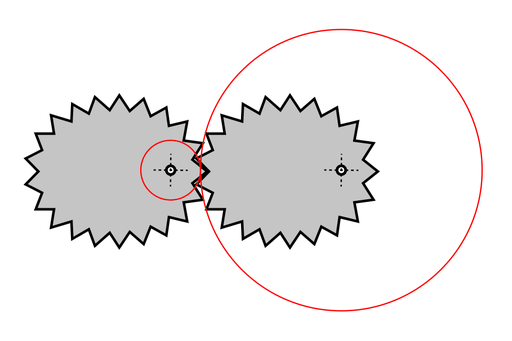
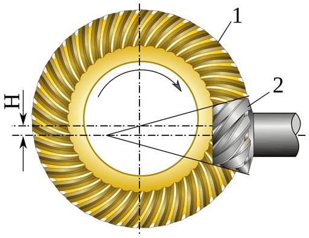
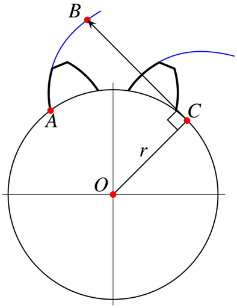

# Zahnrad

Das Maschinenelement **Zahnrad** ist ein Rad mit über den Umfang gleichmäßig verteilten Zähnen. Zwei oder mehr miteinander gepaarte Zahnräder bilden ein **Zahnradgetriebe**. Es wird vorwiegend zur Übertragung zwischen zwei Drehungen oder einer Drehung und einer linearen Bewegung (Paarung eines Zahnrades mit einer Zahnstange) gebraucht. Zahnradgetriebe bilden unter den Getrieben die größte Gruppe. Sie sind formschlüssig, und somit schlupffrei.

Soll das Übersetzungsverhältnis auch im Kleinen konstant sein, das heißt vom Eingriff des vorherigen bis zum Eingriff des nachfolgenden Zahns in die Lücken des Gegenrades, so ist das *erste Verzahnungsgesetz* zu beachten. Der Formschluss geht nicht verloren, wenn dafür gesorgt wird, dass der nachfolgende Zahn bereits im Eingriff ist, bevor der Eingriff des vorangehenden Zahns abbricht *(zweites Verzahnungsgesetz)*.

Die Form der Zähne ist unter Beachtung der *Verzahnungsgesetze* grundsätzlich beliebig. Die für eine Eingriffsfläche gewählte Form bestimmt aber die Form der Eingriffsfläche am Gegenrad. Praktisch beschränkt man sich auf Zahnformen, die einfach herstellbar (damit auch geometrisch einfach beschreibbar) sind. Die größte Verbreitung haben die Evolventenverzahnung und die Zykloidenverzahnung mit jeweils eigenen Vorteilen im Gebrauch.

Neben reinen Zahnpaarungen in Zahnradgetrieben gibt es Paarungen zwischen Kettengliedern und Zähnen von Zahnrädern in Kettengetrieben. Hier greifen Kettenglieder in Zahnlücken ein (zum Beispiel bei einer Fahrradkette am Kettenrad und Ritzel). In einem Zahnriemengetriebe ist die Kette durch einen Riemen mit Zähnen (Zahnriemen) ersetzt (zum Beispiel für den Antrieb der Nockenwelle in Viertaktmotoren).

## Allgemeines

Die Räder eines Zahnradgetriebes drehen sich zusammen mit den Wellen, auf denen sie befestigt sind, oder drehen sich auf Achsen, auf denen sie gelagert sind.

Der Radabstand ist so ausgelegt, dass die Zähne ineinander greifen, und somit die Drehbewegung des einen Zahnrades auf das andere übertragen wird. Bei der Paarung zweier außen verzahnter Räder kehrt sich die Drehrichtung um. Falls das nicht erwünscht ist, wird ein drittes Zahnrad beliebiger Größe dazwischen angeordnet. Sind die Räder unterschiedlich groß, wird die Drehzahl erhöht oder verringert, wobei das Drehmoment vermindert oder erhöht wird (Änderung des Übersetzungsverhältnisses).

## Geschichte

### Frühe Beispiele für die Verwendung von Zahnrädern

Bei den altägyptischen Göpeln findet man nach 300 v. Chr. die älteste Form des Zahnrades, ein Holzrad, in dessen Umfang man Pflöcke hineinstreckte. Die Rolle war bereits bei den Assyrern in Gebrauch und wurde von den Ägyptern übernommen, die Verbindung dieser Rollen mittels Seil führte zum bekannten Flaschenzug. Eine direkte Verbindung dieser Rollen wurde bereits 330 v. Chr. von Aristoteles erwähnt, gesichert ist die Anwendung von Zahnrädern bei Heron von Alexandria, überliefert durch Vitruv. Ktesibios verwendete um 250 v. Chr. an seiner Wasseruhr einen Stab, der mit Zahnrädchen besetzt war, ebenso Philon von Byzanz um 230 v. Chr. an zwei Apparaten.

Das bedeutendste Artefakt für die Anwendung von Zahnrädern in der Antike ist der Mechanismus von Antikythera von ca. 100 v. Chr.
Seit dem 9. Jahrhundert erfolgte in Europa der Einsatz von Zahnrädern in Wassermühlen, ab dem 12. Jahrhundert auch in Windmühlen. In Manuskripten Leonardo da Vincis finden sich um 1500 Zahnräder in verschiedenen Anwendungen.

Georgius Agricola gab 1556 in seiner Schrift *De re metallica libri XII* erstmals den Einsatz von Zahnrädern aus Eisen an. Allerdings wird in Xi’an im Geschichtsmuseum der Provinz Shaanxi ein Eisenzahnrad gezeigt, das ca. 2000 Jahre alt sein soll.

### Erste Überlegungen zur Form der Zähne

Anfangs wurde wenig auf die geeignete Form der Zähne geachtet. Nach Angaben von Christiaan Huygens und Gottfried Wilhelm Leibniz empfahl der dänische Astronom Ole Rømer um 1674 die Epizykloide als Zahnform. Vermutlich war er beim Bau seiner Planetarien, z. B. des Jovilabium an der Pariser Academie des Sciences darauf gekommen. Schriftliche Belege dafür gibt es nicht mehr. Eine erste gründliche mathematische Untersuchung dieser Zahnräder beschrieb das Akademiemitglied Philippe de La Hire (1640–1718) um 1694 *Traite des epicycloides* (erschienen 1730). Diese epizykloidische Zahnform sichert eine gleichförmige Bewegung der Zahnräder bei gleichmäßiger Gleitreibung. Diese wurden gezielt in Uhrwerken eingebaut. 1759 entwickelte John Smeaton eine eigene Form, gefolgt von Leonhard Euler, der 1760 die Evolvente für die Zahnform vorschlug (Evolventenverzahnung).

### Zeitalter der Industrialisierung

Die Entwicklung der Dampfmaschine im 18. Jahrhundert führte zu einem steigenden Bedarf an Zahnrädern, da die zu übertragende Leistung kontinuierlich stieg und Zahnräder aus Metall anstatt wie bisher aus Holz gefertigt werden mussten. 1820 erfand Joseph Woollams die Schrägverzahnung und Pfeilverzahnung (Doppelschrägverzahnung) (englisches Patent Nr. 4477 vom 20. Juni 1820), James White baute 1824 daraus ein Differentialgetriebe. 1829 stellte Clavet eine Zahnhobelmaschine her, da der Werkzeugmaschinenbau ab dem 19. Jahrhundert eine steigende Genauigkeit der Verzahnungen erforderte. Die erste brauchbare Maschine zum Fräsen geradverzahnter Stirnräder baute 1887 G. Grant. 1897 entwickelte Hermann Pfauter daraus eine universale Maschine, mit der sich auch Schnecken- und Schraubräder fertigen ließen. Ab 1922 entwickelte Heinrich Schicht bei Klingelnberg ein Verfahren zur Herstellung von Kegelrädern zur Serienreife. Neu war, dass hier nun ebenso wie bei Stirnrädern das kontinuierliche Wälzfräsverfahren eingesetzt werden konnte.

## Arten von Zahnrädern

### Stirnrad

→ *Hauptartikel: Stirnradgetriebe*

Das *Stirnrad* (oder *Zylinderrad*) ist das am häufigsten verwendete Zahnrad. Eine zylindrische Scheibe ist auf ihrem Umfang verzahnt. Wenn das Gegenrad ebenfalls ein Stirnrad oder eine stirnverzahnte Welle ist, sind die Achsen der beiden Räder parallel, und es entsteht ein *Stirnradgetriebe*. Stirnräder werden aber auch in Getrieben mit sich kreuzenden Achsen verwendet, etwa in Schneckengetrieben und Kronenradgetrieben. Neben dem Stirnrad als Außenrad gibt es auch das Innenrad, welches nicht als Stirnrad bezeichnet wird, da mit Stirn eine Außenform gemeint ist.

Es gibt gerade (achsparallele) Verzahnungen, Schrägverzahnungen, Doppelschräg-Verzahnungen und verschiedene Bogenverzahnungen. Bei Doppelschräg-Verzahnungen unterscheidet man zwischen denen mit Freistich oder ohne als echte Pfeilverzahnung.

### Zahnstange

→ *Hauptartikel: Zahnstange*

Die Zahnstange ist als ein Stirnrad mit unendlich großem Durchmesser vorstellbar. Die Paarung einer Zahnstange mit einem Stirnrad wird als *Zahnstangengetriebe* bezeichnet. Die Bewegung der Zahnstange ist geradlinig und durch ihre endliche Länge begrenzt. In üblichen Anwendungen findet eine Hin- und Herbewegung statt.

Eine ungewöhnlich lange, aus vielen Einzelstücken zusammengesetzte Zahnstange ist die Zahnschiene einer Zahnradbahn.

### Ellipsenrad

Die meisten Zahnradgetriebe bestehen aus runden Zahnrädern beziehungsweise aus Radkörpern mit runden Wälzlinien. Wenn sich das antreibende Rad gleichmäßig dreht, dreht sich auch das getriebene Rad gleichmäßig. Beispiel für ein ungleichmäßig übersetzendes, und damit aus unrunden Rädern bestehendes Zahnradgetriebe ist ein Ellipsenrad-Getriebe. Ein Ellipsenrad ist ein unrundes Zahnrad.

Werden zwei gleiche und gleich große Ellipsenräder kombiniert, so ist der Achsabstand konstant. Die Räder drehen je um einen ihrer Ellipsenbrennpunkte. Das Übersetzungsverhältnis variiert über eine Umdrehung um den Mittelwert **i** = 1. Ist nur ein Rad elliptisch, so muss ein Rad auf einer Schwingachse montiert sein. Verwendet werden solche Zahnräder zum Beispiel in Webmaschinen. Besser bekannt ist ein elliptisches Kettenblatt im Kettenantrieb von Fahrrädern.

### Kegelrad

→ *Hauptartikel: Kegelradgetriebe*

Die Achsen von Kegelrädern sind nicht parallel, sondern schneiden sich. Meistens liegt der Schnittwinkel bei 90°. Die Grundform ist ein Kegelstumpf, dessen Mantelfläche verzahnt ist. Bei zwei miteinander gepaarten Kegelrädern fallen deren Spitzen zusammen. Die Zähne verlaufen meistens gerade in Richtung der Mantellinien, beim sogenannten Hypoidgetriebe sind sie bogenförmig.

Bei Kegelrädern spricht man von Oktoidenverzahnung. Im Gegensatz zur Evolvente, die bei Stirnrädern das Zahnhöhenprofil beschreibt, handelt es sich bei der Oktoide nicht um das Zahnhöhenprofil eines Kegelrads, sondern seine Eingriffslinie stellt ein Teilstück einer Oktoide dar (die in voller Länge auf der gedachten Kugeloberfläche als 8-förmige Kurve erscheint).

Bei Spiralkegelrädern unterscheidet man hauptsächlich wie folgt:

- Kreisbogenverzahnung mit nicht konstanter Zahnhöhe (Hersteller Gleason)
- Kreisbogenverzahnung mit konstanter Zahnhöhe (Kurvex)
- Zyklo-Palloid-Verzahnung (Klingelnberg)
- Palloid-Verzahnung (Klingelnberg)

### Kronenrad

→ *Hauptartikel: Kronenrad*

Ein Getriebe mit Kronenrad ist ein Winkelgetriebe und eine Variante zum Kegelradgetriebe. Es wurde früher öfter als ein Kegelradgetriebe verwendet (siehe Abbildung: Kronenradgetriebe aus Holz). Beim Kronenrad ist die Verzahnung auf der Kreisfläche eines Zylinders angebracht. Es bildet zusammen mit einem Stirnrad ein Kronenradgetriebe.

### Schneckenrad und Schnecke

→ *Hauptartikel: Schneckengetriebe*

Ein aus Schneckenrad und Schnecke gebildetes Schneckengetriebe wird neben anderen Getrieben dann verwendet, wenn sich die Wellen kreuzen, aber nicht schneiden. Weiteres Merkmal ist das relativ hohe Übersetzungsverhältnis.

Das Schneckenrad kann im einfachsten Fall ein schräg verzahntes Stirnrad sein. Um Linien- anstatt nur Punktberührung zwischen den Zähnen im Getriebe zu erreichen, werden die Zahnflanken des Schneckenrades hohl ausgeführt.

Die Verzahnung auf der kleinen Schnecke ähnelt einem Gewinde. Die Schnecke ist quasi ein Stirnrad mit wenigen sehr schrägen Zähnen, die schraubförmig um den Zylinder gewunden sind. Eine Windung entspricht einem Zahn. Bei der *Globoidschnecke* ist die gewindeartige Verzahnung nicht zylindrisch. Der Zylinder ist tailliert und passt sich so der Rundung des Schneckenrades an.

## Grundarten der Zahnradgetriebe

Die Zahnradgetriebe lassen sich nach der Lage der Achsen und der im Eingriff stehenden Räder in *Wälzgetriebe* und in *Schraubgetriebe* unterteilen.

### Wälzgetriebe

Bei Wälzgetrieben liegen die Achsen entweder parallel (Stirnradgetriebe), oder sie schneiden sich (Kegelradgetriebe). Bei der Bewegungsübertragung rollen gedachte Wälzzylinder oder Wälzkegel – ohne zu gleiten – aufeinander ab. Gleiten findet nur auf den sich berührenden Zahnflächen in der Profilebene der Zähne statt *(Wälzgleiten)*. Die Zähne berühren sich in Linien.

### Schraubgetriebe

Bei Schraubgetrieben liegen die Achsen weder parallel zueinander, noch schneiden sie sich. Die sich berührenden Zähne gleiten zusätzlich senkrecht zur Profilebene (diese Form des Gleitens ist de typische Bewegung im Schraubgewinde). Schraubgetriebe sind

- das Schraubenradgetriebe mit der Paarung zweier schräg verzahnter Stirnräder (Punktberührung im Achslot),
- das Schneckengetriebe mit der Paarung eines Schneckenrades und einer Schnecke (Linienberührung) und
- das Hypoidgetriebe mit der Paarung zweier Schraubenkegelräder (Punktberührung außerhalb des Achslotes).

## Verzahnungsarten – Gestalt der Zahnflanke

### Evolventenverzahnung

→ *Hauptartikel: Evolventenverzahnung*

- Verwendung: beim Antrieb vom Schnellen ins Langsame oder umgekehrt (z. B. im Fahrzeug- und Maschinenbau), bedeutendste Verzahnungsart
- leichte Normierung
- Räderpaare können bei gleicher Reibung links- und rechtsherum angetrieben werden
- relativ spielarme Verzahnung
- unempfindlich gegenüber Achsabstandsänderung, da die Eingriffslinie eine Gerade ist
- im Wälzpunkt ausschließlich Rollreibung; vom Wälzpunkt weggehend zunehmend Gleitreibung
- Durch die konvexe Zahnform entsteht eine hohe Flächenpressung, was einen Nachteil hinsichtlich der Lebensdauer bedeutet.
- Herstellung der Zahnräder relativ einfach und kostengünstig
- Die Evolventenverzahnung ist ein Spezialfall der Zykloidenverzahnung, bei dem der abrollende *Rollkreis* während der Konstruktion der Zykloide einen unendlich großen Durchmesser hat und somit zur *Rollgerade* wird. Die entstehende Zykloide wird dann Evolvente genannt.

### Zykloidenverzahnung

Die Flanke eines Zahns ist oberhalb des Wälzpunktes eine Epizykloide und unterhalb eine Hypozykloide.

- Verwendung: Beim Antrieb vom Langsamen ins Schnelle (z. B. bei mechanisch angetriebenen Uhren).
- Bei einem Antrieb vom Langsamen ins Schnelle besteht eine geringere Reibung als bei Evolventenverzahnung.
- Größere Übersetzungsverhältnisse auf kleinem Raum sind möglich, da die Zähne am Fuß schmaler sind als bei der Evolventenverzahnung.
- Reine Rollreibung erst ab einer bestimmten Mindestzähnezahl des kleineren angetriebenen Rades möglich.
- Normierung schwierig, da die Zahnform gegenüber der Evolvente zusätzlich von der Zähnezahl des kleineren angetriebenen Rades abhängt. Man muss also, um ideale Eingriffs- und Reibungsverhältnisse zu bekommen, die Zahnformen eines Räderpaares speziell aufeinander abstimmen. In der Uhrmacherei wurden Normierungskompromisse unternommen.
- Größeres Zahnspiel (staubverträglicher).
- Kein Vorwärts-Rückwärtslauf möglich: Eine Drehbewegung ist nur in eine Richtung sinnvoll möglich. Gründe sind ein deutlich größeres Zahnspiel als bei der Evolventenverzahnung und unterschiedliche Reibungsverhältnisse für verschiedene Drehrichtungen.
- Geschmiert werden nur die Radlager, die Räder selbst werden trocken betrieben, um Schmutzansammlung zu vermeiden.
- Die Eingriffstiefe ist kritischer als bei der Evolventenverzahnung. In der Uhrmacherei reicht der mathematisch ermittelte Abstand als Ideal nicht aus. Er wird zusätzlich empirisch angepasst (muss erfühlt werden).

### Triebstockverzahnung

Siehe auch: Triebstock

Die Triebstockverzahnung ist ein Sonderfall der Zykloidenverzahnung: Rollkreis und Wälzkreis sind gleich groß.

- Verwendung: z. B. alte Mühlenräder, Schwarzwälder Uhren, Zahnstangen, Rollenketten
- Anwendung weitgehend durch die Evolventen- und Zykloidenverzahnung verdrängt. Früherer Vorteil dieser Verzahnung war die leichtere Herstellung von Rädern. Außerdem war eine ausreichend genaue Teilung mittels einer Bohrschablone leicht zu erreichen.

Die Verzahnung kann gerade, d. h. achsparallel, schräg (Schrägverzahnung) oder als Bogenverzahnung ausgeführt sein. Die Größe der Verzahnung wird bestimmt als Modul. Das Gegenrad muss eine Verzahnung von gleichem Modul aufweisen.

### Wildhaber-Novikov-Verzahnung

Die Wildhaber-Novikov-Verzahnung ist eine Kreisbogenverzahnung.

- Verwendung: in Stirnverzahnungen (Laufverzahnungen).
- Konvexe, halbkreisförmige Zähne greifen in gleichartig ausgebildete konkave Lücken ein. Der theoretische Radius von Zahn und Zahnlücke ist gleich, in der Praxis wird der Zahnlückenradius etwas größer ausgeführt.
- Es kann keine Profilüberdeckung realisiert werden, für eine gleichmäßige Bewegungsübertragung ist eine Schrägverzahnung mit einer Sprungüberdeckung >1 erforderlich. Der Eingriffswinkel ist in jeder Zahnstellung konstant, so dass die Zahnkraft ihre Richtung nicht ändert.
- Vorteilhaft wirkt sich die konstruktionsbedingte gute Schmiegung von Zahn und Zahnlücke aus. Weitere Vorteile liegen in der guten Tragfähigkeit (höher als Evolventenverzahnung), im gleichmäßigen Verschleiß (geringe Relativbewegung der Flanken zueinander) und im günstigen Geräusch- und Schwingungsverhalten.
- Kritisch ist diese Verzahnung bei geometrischen Abweichungen wie Teilungs- und Zahnrichtungsfehlern sowie bei Achsabstands- und Achsneigungsabweichungen.
- Der Herstellungsaufwand ist groß, da für Rad und Gegenrad verschiedene Verzahnwerkzeuge erforderlich sind.

## Geometrische Grundlagen von Geradstirnrädern

### Unkorrigierte Zahnräder

→ *Hauptartikel: Profilverschiebung*

Alle Angaben gelten nur für Zahnräder ohne Profilverschiebung, d. h. unkorrigierte Zahnräder.

### Zahnradgröße

→ *Hauptartikel: Modul (Zahnrad)*

Mit der zum Übersetzungsverhältnis  passend gewählten Zähnezahl  und dem Modul  ist der Teilkreisdurchmesser  bestimmt. Der Modul ist damit indirekt auch eine Maßzahl für die Zahnradgröße:

- *Kopfkreisdurchmesser*  und *Kopfhöhe*

- *Fußkreisdurchmesser*  und *Fußhöhe*

### Hohlräder

→ *Hauptartikel: Hohlrad*

Bei innenverzahnten Hohlrädern ist die Zähnezahl als negativer Wert einzusetzen, sodass sich negative Durchmesser ergeben. Der Fußkreisdurchmesser eines Hohlrades ist betragsmäßig größer als der Kopfkreisdurchmesser.

### Achsabstand

Der kleinstmögliche *Achsabstand*  kämmender Zahnradpaare beträgt:

Beträgt der Achsabstand kämmender Zahnräder genau , so sind die jeweiligen Wälz- und Teilkreise kongruent.

### Fertigungstoleranzen

Für störungsfreies Kämmen von Zahnradpaaren muss den Fertigungstoleranzen Rechnung getragen werden.

- ein üblicher Wert für die Kopfhöhe ist der Modul:

- das Kopfspiel findet Berücksichtigung, indem der Fußkreis verkleinert wird, um nicht Gefahr zu laufen, mit dem Kopfkreis des kämmenden Zahnrades zu kollidieren. Dazu wird die Fußhöhe geringfügig größer als der Modul gewählt; nach DIN 780 beträgt der Zuschlag dafür

Für die drei Kreisdurchmesser bedeutet das:

### Zahnteilung

Die *Teilung*  der Verzahnung ist die Länge des Bogens von Zahnmitte zu Zahnmitte auf dem Teilkreis:

:   (Definition für den Modul).

### Normung

Der Modul bei Stirnrädern ist gemäß DIN 780-1 zu wählen.

## Herstellung

Die Herstellung von Zahnrädern kann auf drei Arten erfolgen:

- Zerspanen
- Urformen
- Umformen

Aufgrund von höherer Festigkeit und Genauigkeit werden in der industriellen Fertigung von Zahnrädern spanende Fertigungsverfahren bevorzugt.

### Spanende Verfahren

#### Übersicht

Die spanenden Verfahren zur Zahnradherstellung sind:

- mit geometrisch bestimmter Schneide
  - Wälzhobeln
  - Wälzfräsen, das wichtigste Verfahren für die Grobbearbeitung
  - Profilfräsen
  - Wälzstoßen
  - Wälzschälen
  - Profilräumen
  - Schaben
  - Freiformfräsen / 5-Achs-Fräsen
- mit geometrisch unbestimmter Schneide
  - Wälz- und Profilschleifen (Varianten des Schleifens)
  - Honen
  - Läppen

Beim Profilfräsen und -schleifen hat das Werkzeug die exakte Form der Zahnflanke. Bei *Wälz*verfahren wird ein Werkzeug von der Herstellungsmaschine so geführt, dass es mit der herzustellenden Zahnflanke „abwälzt“. Der Materialabtrag erfolgt nur an einem Punkt bzw. auf einer Linie. Hier kann ein Werkzeug für viele verschiedene Verzahnungsgeometrien genutzt werden, die Kinematik und somit die Steuerung der Maschine ist aber relativ kompliziert. Beim *Profil*verfahren benötigt man eine große Anzahl verschiedener Werkzeuge oder muss die Schleifscheibe vor ihrem Einsatz erst in die Form der Zahnflanke bringen („abrichten“ der Schleifscheibe). Wälzverfahren können kontinuierlich erfolgen, d. h. das ganze Zahnrad kann in einer durchgehenden Bewegung gefertigt werden (z. B. durch einen schneckenförmigen Fräser). Profilverfahren arbeiten immer im Teilverfahren, es kann also nur jeweils eine Zahnlücke gefertigt werden, danach wird das Werkrad um eine Lücke weitergedreht.

#### Freiformfräsen

Seit einigen Jahren wird bei Einzelteilfertigung oder geringen Stückzahlen verstärkt das *Freiformfräsen bzw. 5-Achs-Fräsen auf Bearbeitungszentren* angewendet.
Die Grundidee basiert auf der Erkenntnis, dass ein Zahnrad letztendlich nichts anderes ist als eine Form – vergleichbar aus dem Werkzeug- und Formenbau – jedoch mit komplexer Verzahnungsgeometrie.
Hierfür werden unprofilierte, von den Verzahnungsdaten des Werkstücks losgelöste, unabhängige Vollhartmetall-Werkzeuge eingesetzt. Typische Verzahnungswerkzeuge wie Wälzfräser und Scheibenfräser, Schneidräder, Hobelkämme und Hobelstähle, Messerköpfe mit Kegelradverzahnungsmesser, Kegelradfräser, Schneckenradwälzfräser entfallen.

Prinzipiell können unterschiedliche Zahnradtypen auf demselben *5-Achs-simultanfähigen* Bearbeitungszentrum in der Weich- und Hartbearbeitung (± 62 HRC) produziert werden. Die 5-Achs-Simultanfähigkeit stellt sicher, dass für die Schlichtbearbeitung von Schrägverzahnungen und Spiralverzahnungen unprofilierte Schaftfräser eingesetzt werden können, anstelle eines langwierigen Abzeilens mittels eines Kugelfräsers.

Für die Fräsprogrammierung wird in der Regel eine separate CAM-Software verwendet, die den Schwerpunkt auf das Fräsen von Freiformflächen setzt und daher hervorragend auch für Zahnprofile genutzt werden kann. Je nach Art des Werkstücks, dem Zahnradmodul und der daraus resultierenden Größe der Zahnlücke können individuelle Frässtrategien für Schrupp-, Zahnfuß- und Schlichtbearbeitung gewählt werden.

### Urformende und umformende Fertigungsverfahren

Zahnräder lassen sich nicht nur durch spanende Fertigungsverfahren, sondern auch durch Urform- und Umformverfahren herstellen. Diese Herstellungsverfahren spielen im Vergleich zu spanenden Fertigungsverfahren jedoch eine untergeordnete Rolle.

Urformend können Zahnräder durch Gießen oder Sintern hergestellt werden; bei Zahnrädern aus Kunststoff kommt Spritzgießen zum Einsatz. Hauptanwendung ist die Feinwerktechnik, wo keine großen Drehmomente übertragen werden müssen. Kleine Zahnräder werden auch geätzt (ähnlich Lithographie) oder galvanisch hergestellt.

Umformende Verfahren wie Schmieden, Pressen, Ziehen, Walzen (Ringwalzen) oder Stanzen kommen zum Einsatz, wenn keine hohen Anforderungen an die Genauigkeit gestellt werden. Geschmiedete Zahnräder finden dabei auch Verwendung in großtechnischen Anwendungen, so werden beispielsweise die Kegelräder von Differentialgetrieben im Fahrzeugbau durch Gesenkschmieden hergestellt.

### Nachbearbeitung und Wärmebehandlung

Zahnräder werden nach dem Verzahnen häufig gehärtet. Die Zahnflanken werden dadurch verschleißfester, im Besonderen gegen die sogenannte Grübchenbildung, und das Zahnrad erträgt höhere Belastungen und hält länger. Allerdings entsteht beim Härten Härteverzug, deshalb müssen in der Regel die Flanken nach dem Härten durch Schleifen nachbearbeitet werden, um die gewünschte Verzahnungsqualität zu erreichen.

### Konstruktion / CAD

Die Konstruktion von Zahnrädern erfolgt rechnergestützt mittels CAD. Für die Zahnradfertigung mit Wälzfräsverfahren werden 2D-Zeichnungsdaten und Maschineneinstelldatenblätter, für die Zahnradfertigung mittels Freiformfräsen 3D-Zeichnungsdaten benötigt. Zahnräder werden nicht manuell auf Basis von Punktewolken, sondern mit speziell entwickelter Software konstruiert. Auf diese Weise wird sichergestellt, dass die Zahnräder im Betrieb sauber ineinandergreifen. Einige Programme bieten neben der mathematischen Berechnung auch eine Simulation der Kinematik bei der Herstellung, um beispielsweise unbeabsichtigten Unterschnitt zu vermeiden.

## Prüfen von Zahnrädern

### Allgemeines

Die Prüfung von Zahnrädern ist umfangreich und richtet sich nach der Art des Zahnrades. Bei der Zahnradprüfung werden die verschiedenen Bestimmungsgrößen von Zahnrädern mittels konventioneller Längen- und Winkelmessverfahren und spezieller Zahnradmessverfahren ermittelt. Für sicherheitskritische Anwendungen kommen bei der Fertigungsendprüfung Materialprüfverfahren wie das Röntgen oder Scannen mit Teilchenbeschleunigern zur Anwendung.

### Prüfen von Kegelrädern

Die Prüfung von Kegelrädern erfolgt hauptsächlich durch Laufprüfung. Unter Verwendung einer Laufprüfmaschine wird das zu prüfende Kegelrad mit einem Meisterrad in Eingriff gebracht und bei Sollachsabstand, Sollachswinkel und Solldrehzahl abgewälzt. Es wird eigentlich die spätere Funktion im Getriebe simuliert.

Die Qualität des Kegelrades wird durch das entstandene Tragbild, die Geräuschentwicklung während der Laufprüfung und das Verdrehflankenspiel beurteilt.

Bei den Laufprüfungen unterscheidet man zwischen Zweiflankenwälzprüfungen und Einflankenwälzprüfungen.

Ergänzende Prüfungen sind weiterhin die Rundlaufprüfung durch Rundlaufprüfgeräte und die Zahndickenprüfung mit Zahndickenmessgeräten. Die rasante Entwicklung der Prüfmethoden ist auch bei der Kegelradprüfung erkennbar. Die Verwendung von Koordinatenmessgeräten hat inzwischen auch auf die Kegelradprüfung großen Einfluss. Mit entsprechender Software wird die Topografie des Kegelrades ermittelt, das Tragbild und Verdrehflankenspiel berechnet und simuliert. Korrekturwerte werden direkt an die Kegelradfräsmaschine weitergeleitet (Closed-Loop).

Bei der traditionellen Fertigung auf Kegelradfräsmaschinen kommt es grundsätzlich zu mehr oder weniger großen Abweichungen zwischen den theoretischen Berechnungen und dem praktischen Fräsergebnis.
Beim 5-Achs-Fräsen auf 5-Achs-simultanfähigen Bearbeitungszentren entfallen in der Regel solche nachträglichen Korrekturen, da aufgrund der Herstellmethode das Fräsergebnis und somit auch Position und Größe des Tragbildes auf Anhieb der Berechnung entspricht.

### Prüfen von Stirnrädern

Wichtigste Grundlagen für die Prüfung von Stirnrädern ist die Norm DIN ISO 1328, in welcher die Toleranzen für Stirnradverzahnungen festgelegt sind.

Abhängig von den Qualitätsansprüchen werden unterschiedliche Prüfverfahren angewandt.

Für die Funktion eines Stirnrades ist die Einhaltung der korrekten Zahndicke entscheidend. Die direkte Messung der Zahndicke ist jedoch nicht möglich, daher misst man zur Ermittlung der Zahndicke die Zahnweite oder das Maß über zwei in gegenüberliegende Zahnlücken eingelegte Meßrollen (Messung des Rollenmaßes). Zur Fertigung von Stirnrädern gibt der Konstrukteur in der Regel die Zahnweite oder das Rollenmaß mit entsprechenden Toleranzen vor.

Bei der Herstellung von Stirnrädern ist fast immer die Zahnweite das einzuhaltende Fertigungsmaß und daher wird die Zahnweite bei fast allen Stirnrädern direkt an der Maschine gemessen. Die Zahnweite kann mit Bügelmeßschrauben auch am noch eingespannten Zahnrad gemessen werden.

Bei der Zweiflankenwälzprüfung wird der Prüfling mit einem beweglich gelagerten Lehrzahnrad spielfrei in Eingriff gebracht und abgewälzt.

Die entstehenden Achsabstandsänderungen werden registriert und als Zweiflankenwälzabweichung und Zweiflankenwälzsprung ausgewertet. Dabei werden nur Summenabweichungen ermittelt, d. h. Fehlerursachen sind teilweise schwer erkennbar. Das Lehrzahnrad muss geometriebezogen mit dem Prüfling übereinstimmen, das heißt in der Regel den gleichen Modul haben. Für Zahnräder mit hohen Qualitätsanforderungen ist dieses Verfahren weniger geeignet. Die Wälzprüfung kann hervorragend in Fertigungsabläufe integriert werden. Vergleichbar mit der Zweiflankenwälzprüfung ist das Verfahren der Einflankenwälzprüfung. Vorteilhaft bei diesem Prüfverfahren ist die Zuordnung der Abweichungen zur Rechts- bzw. Linksflanke.

Die Ermittlung der Einzelfehler eines Stirnrades ist die sicherste und genaueste Methode zur Qualitätsbestimmung. Mit speziellen Verzahnungsmeßmaschinen und auch mit Koordinatenmessmaschinen und entsprechender Software werden die Profil-, Flanken- und Teilungsabweichungen sowie die Zahnweite ermittelt und im Messprotokoll ausgewertet. Dieser Messvorgang erfolgt automatisch. Aus den gemessenen Verzahnungsabweichungen lässt sich die Verzahnungsqualität des Zahnrades bestimmen. Eine gezielte Korrektur der Bearbeitungsmaschine ist danach möglich.

## Verzahnungsqualitäten

Nach DIN 3961 (zurückgezogen) gibt es 12 Verzahnungsqualitäten, die mit unterschiedlichen Fertigungsmethoden erreicht werden können, wobei 1 die feinste und 12 die gröbste Verzahnungsqualität ist.

Fertigungsverfahren:

- Qualität 1–6 gehont
- Qualität 1–7 geschliffen
- Qualität 5–7 geschabt, (kaltgewalzt)
- Qualität 5–9 wälzgefräst, wälzgehobelt, wälzgestoßen
- Qualität 7–12 formgefräst, formgestoßen, geräumt
- Qualität 8–12 gestanzt, gepresst, gesintert, spritzgegossen

## Schadensarten

Folgende Schäden können auftreten:

- Grübchenbildung (Pitting)
- Zahnbruch, meist im Bereich des Zahnfußes
- Graufleckigkeit (Micro-Pitting)
- Fressen
- Verschleiß (bei Langsamlauf)
