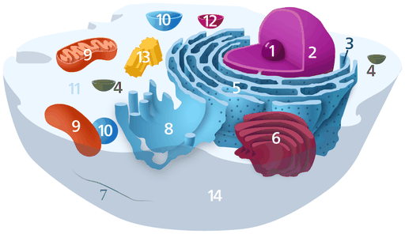
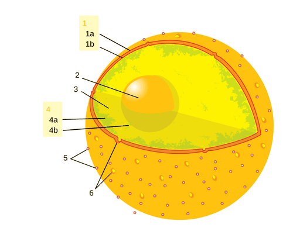
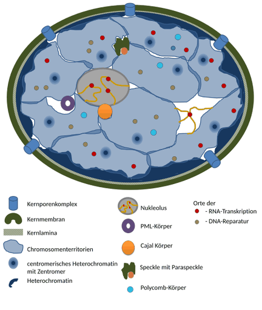

# Zellkern

Ein **Zellkern** oder **Nukleus** (lateinisch nucleus „Kern“) ist ein im Cytoplasma gelegenes, meist rundlich geformtes Organell der eukaryotischen Zelle, welches das Erbgut enthält. Mit *nukleär* oder *karyo* (altgriechisch κάρυον *káryon* „Kern“) wird ein Bezug auf den Zellkern ausgedrückt, das nukleäre Genom heißt (im Gegensatz zu dem in peripheren Organellen) beispielsweise auch *Karyom*. Die Wissenschaft vom Zellkern wird auch Karyologie genannt.

## Beschreibung

Der Zellkern ist das Hauptmerkmal zur Unterscheidung zwischen Eukaryoten (Lebewesen mit abgegrenztem Zellkern) und Prokaryoten (Lebewesen ohne abgegrenzten Zellkern, also Bakterien und Archaeen). Er enthält den größten Teil des genetischen Materials der eukaryotischen Zellen in Form von mehreren Chromosomen (Kern-DNA oder nukleäre DNA). Weitere Gene finden sich in den Mitochondrien und eher ausnahmsweise in Hydrogenosomen sowie bei Algen und Landpflanzen auch in Chloroplasten und anderen Plastiden. Die meisten Zellen enthalten genau einen Kern. Es gibt jedoch auch Ausnahmen (Syncytium); beispielsweise enthalten Myotuben, die durch Verschmelzung von Myoblasten entstehen, mehrere Kerne (*polynukleäre Zellen*). Der Kern selbst ist durch eine Kernhülle oder Kernmembran, die zum Schutz des Erbguts sowie der Regulierung des Stofftransports zwischen Nucleoplasma und Cytoplasma dient, vom sie umgebenden Cytoplasma abgetrennt. In Embryonen der Fruchtfliege teilen sich Kerne sehr schnell, ohne dass zunächst trennende Zellmembranen entstehen. Reife Erythrozyten der Säuger enthalten keinen Kern mehr, er wird während der Reifung abgestoßen.

Wichtige Vorgänge, die innerhalb des Zellkerns ablaufen, sind DNA-Replikation (die Duplizierung des in Form von DNA vorliegenden genetischen Materials) und Transkription (das Erstellen einer mRNA-Kopie eines gegebenen DNA-Abschnitts, der oft, aber nicht immer, einem Gen entspricht).

## Aufbau

Der Zellkern, welcher bei Säugern typischerweise einen Durchmesser von 5 bis 16 µm hat, ist das im Mikroskop am leichtesten zu erkennende Organell der Zelle. Er wird durch die Kernhülle, bestehend aus zwei biologischen Membranen, der inneren und äußeren Kernmembran, begrenzt, welche die sogenannte perinukleäre Zisterne (Breite 10–15 nm, gefestigt von Mikrofilamenten – Dicke 2 bis 3 nm), umschließen. Die Gesamtdicke der Kernhülle beträgt etwa 35 nm. Die äußere Kernmembran geht fließend in das raue Endoplasmatische Retikulum (rER) über und hat wie dieses auch Ribosomen auf ihrer Oberfläche. Die innere Kernmembran grenzt an einen 20–100 nm breiten „Filz“, der Kernlamina (Lamina fibrosa nuclei), die aus Laminen, einer Gruppe von Intermediärfilamenten, besteht, welche den Zellkern stützt und die innere Membran vom Chromatin des Zellkerns trennt.

Zellkerne können je nach Zelltyp sehr unterschiedlich aussehen. Meistens sind sie kugelförmig oder oval. In einigen Zellen sehen sie eher geweihförmig aus. Manchmal kann der Zellkern in knotenartige Abschnitte untergliedert sein, so beim rosenkranzförmigen Zellkern der Trompetentierchen. Auch die Granulocyten der Säuger enthalten gelappte Kerne.

Durch die in der Kernhülle enthaltenen Kernporen, die ca. 25 % der Oberfläche bedecken, findet der aktive Stoffaustausch (z. B. rRNA oder mRNA) zwischen dem Kern und dem Zellplasma, gesteuert von einem Kernporenkomplex, statt. Regulatorische Proteine gelangen aus dem Cytoplasma in den Zellkern, Transkriptionsprodukte wie die mRNA werden zur Proteinsynthese, die an den Ribosomen des Cytoplasmas stattfindet, aus dem Kern in das Plasma exportiert. Die Flüssigkeit im Kern wird auch als Karyoplasma bezeichnet.
Zellkerne können durch Anfärben der DNA lichtmikroskopisch hervorgehoben werden, z. B. durch die Feulgen-Färbung, durch Giemsa oder durch Fluoreszenzfarbstoffe wie DAPI.

Das Vorhandensein einer Kernmatrix wurde erstmals in den 1970er Jahren vorgeschlagen. Ihre Existenz ist jedoch weiterhin umstritten.

Das im Zellkern vorhandene Erbgut der Zelle befindet sich in den Chromosomen, d. h. mehreren zu Chromatin verpackten DNA-Fäden, die neben der DNA auch Proteine wie Histone enthalten. Neben den Histonen kommen auch andere Kernproteine, wie z. B. DNA-Polymerasen und RNA-Polymerasen, weitere Transkriptionsfaktoren sowie Ribonukleinsäuren im Kern vor.

## Nukleärkörper

Lichtmikroskopisch fallen in vielen Zellkernen ein oder mehrere rundliche Gebilde auf, die Kernkörperchen oder Nucleoli. Sie enthalten die Gene für ribosomale RNA (rRNA). Hier werden die Untereinheiten der Ribosomen gebildet, welche durch die Kernporen ins Cytoplasma gelangen. Nucleoli enthalten im Vergleich zum Rest des Kerns nur geringe Konzentrationen von DNA, stattdessen mehr RNA. Andere „Körperchen“ des Zellkerns lassen sich nur durch spezielle Färbetechniken darstellen, etwa durch Antikörperfärbung. Die Funktion dieser Körperchen ist meistens noch unbekannt. Hierunter fallen etwa „Speckles“ (Ansammlungen von Faktoren, die für Splicing benötigt werden), Cajal-Körper oder PML-Körper. Die räumliche Trennung der unterschiedlichen Komponenten bestimmter Kernkörperchen könnte die molekularen Wechselwirkungen in der extrem überfüllten Umgebung im Kern effizienter ermöglichen.

## Anordnung der Chromosomen

Chromosomen nehmen während der Interphase abgegrenzte Bereiche im Zellkern ein, die Chromosomenterritorien. Deren Existenz wurde zuerst von Carl Rabl (1885) und Theodor Boveri (1909) vorgeschlagen, der direkte Nachweis gelang erst 1985 mit Hilfe der Fluoreszenz-in-situ-Hybridisierung.

Die Verteilung des Chromatins und somit der Chromosomen innerhalb des Zellkerns erscheint auf den ersten Blick zufällig: Die Anordnung der Chromosomen zueinander wechselt von Kern zu Kern, Nachbarn in einem können im nächsten weit auseinanderliegen. Seit den 1990er Jahren konnten jedoch einige Ordnungsprinzipien gefunden werden. Die DNA-Replikation erfolgt während der S-Phase nicht gleichmäßig, sondern an manchen Stellen der Chromosomen früher, an anderen später. Frühe oder späte Replikation sind dabei Eigenschaften, die für alle Abschnitte der Chromosomen in einem gegebenen Zelltyp konstant sind. Es stellte sich heraus, dass sich früh replizierte Bereiche vorwiegend im Inneren des Kerns befinden, während spät replizierte Bereiche vorwiegend an der Kernhülle und um die Nucleoli herum lokalisiert sind. Für die Anordnung der Chromosomenterritorien im Zellkern wurde beobachtet, dass Chromosomen mit hoher Gendichte bevorzugt in der Mitte des Kerns liegen, während Chromosomen mit niedriger Gendichte häufiger an der Peripherie zu finden sind. Für manche Zelltypen wurde auch beschrieben, dass kleine Chromosomen eher in der Mitte liegen, während große außen sind. Beide Motive sind dabei miteinander vereinbar.

## Kernteilung

Bei der Mitose und der Meiose, den bei eukaryotischen Zellen vorkommenden Arten der Kernteilung, verschwindet der Zellkern zeitweilig, weil die Kernhülle während des Teilungsvorgangs aufgelöst wird. Während Chromosomen in der Interphase keine lichtmikroskopisch sichtbaren Abgrenzungen ausbilden, kondensieren sie für die Kernteilung zu den kompakten Metaphase-Chromosomen. In dieser Transportform wird das Erbgut auf die Tochterzellen verteilt. Nach der Teilung bilden sich die Kernhüllen um die Chromosomen der Tochterzellen wieder aus und die Chromosomen dekondensieren wieder.

## Forschungsgeschichte

Der Zellkern ist das zuerst entdeckte Organell der Zelle. Die älteste erhaltene Zeichnung geht zurück auf den frühen Mikroskopiker Antoni van Leeuwenhoek (1632–1723). Dieser untersuchte rote Blutkörperchen des Lachses und beschrieb darin ein „Lumen“, den Zellkern. Im Gegensatz zu den roten Blutkörperchen der Säugetiere haben jene der anderen Wirbeltiere Zellkerne. Eine weitere Erwähnung erfolgte 1804 durch Franz Andreas Bauer. 1831 wurde der Zellkern vom schottischen Botaniker Robert Brown in einem Vortrag vor der Linnéschen Gesellschaft in London als „areola“ beschrieben. Mögliche Bedeutungen erwähnte er nicht. Eine solche wurde zuerst 1838 von Matthias Schleiden vorgeschlagen, nämlich dass er eine Rolle bei der Bildung der Zelle spielt. Daher führte Schleiden den Namen „Cytoblast“ (Zellenbildner) ein. Er meinte beobachtet zu haben, dass sich neue Zellen an diesen Cytoblasten bildeten. Franz Julius Ferdinand Meyen widersprach entschieden der Ansicht, dass „der Zellenkern die Zelle selbst erzeuge“. Er hatte schon zuvor beschrieben, dass sich Zellen durch Teilung vermehren. Allerdings war Meyen auch der Ansicht, dass viele Zellen keine Zellkerne hätten. Überwunden wurde die Vorstellung einer Neubildung von Zellen erst durch die Arbeiten von Robert Remak (1852) und durch Rudolf Virchow (*Omnis cellula e cellula*, 1855), welcher die neue Lehre von der ausschließlichen Bildung von Zellen aus Zellen offensiv vertrat. Die Funktion des Zellkerns blieb weiter ungeklärt.

Christian Gottfried Ehrenberg hatte 1838 erstmals die Teilung eines Zellkerns beobachtet und auf dessen Rolle aufmerksam gemacht. Bei Orchideen entdeckte 1842 Robert Brown den Zellkern.

Von 1876 bis 1878 veröffentlichte Oscar Hertwig mehrere Studien über die Befruchtungsvorgänge des Seeigel-Eies, aus denen hervorging, dass der Zellkern des Spermiums in das Ei eindringt und dort mit dem Zellkern des Eies verschmilzt. Damit wurde zum ersten Mal behauptet, dass sich ein Individuum aus einer (einzelnen) kernhaltigen Zelle entwickle. Dies widersprach der von Ernst Haeckel vertretenen Ansicht, dass während der Embryonalentwicklung die gesamte Stammesgeschichte wiederholt würde, insbesondere auch die Entstehung der ersten kernhaltigen Zelle aus einer „Monerula“, einer strukturlosen Masse aus Urschleim. Die Notwendigkeit des Spermienkerns zur Befruchtung wurde daher noch lange Zeit kontrovers diskutiert. Hertwig bestätigte jedoch seine Befunde an anderen Tiergruppen, z. B. Amphibien und Mollusken. Eduard Strasburger kam an Pflanzen zum gleichen Ergebnis (1884). Dies ebnete den Weg, dem Kern eine wichtige Bedeutung bei der Vererbung zuzuweisen. Bereits 1873 hatte August Weismann die Gleichwertigkeit der mütterlichen und väterlichen Keim*zellen* für die Vererbung postuliert. Die Rolle des Kerns hierbei wurde erst später offenbar, nachdem die Mitose beschrieben wurde und Anfang des 20. Jahrhunderts die Mendel’schen Regeln wiederentdeckt wurden: Die Chromosomentheorie der Vererbung wurde entwickelt (siehe dort und Chromosom).

1874 isolierte Friedrich Miescher aus Zellkernen eine Substanz, die er als **Nuclein** bezeichnete (siehe Entdeckungsgeschichte im Artikel DNA). Nur wenige Jahre später kamen weitere Bestandteile wie Histone und Adenin (Albrecht Kossel) hinzu. 1996 wurde mit der Backhefe (*Saccharomyces cerevisiae*), die zu den Pilzen gehört, das erste Genom eines Eukaryonten veröffentlicht. Es ist erst seit dem 21. Jahrhundert möglich, das Genom, das Transkriptom oder durch Massenspektrometrie auch das Proteom einer Zelle zu einem bestimmten Zeitpunkt zu bestimmen, um sich so ein umfassendes Bild dieses Systems zu machen.
