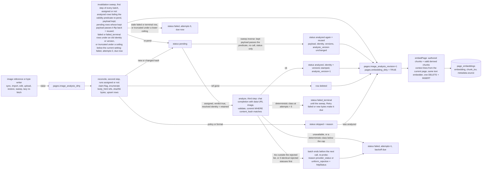
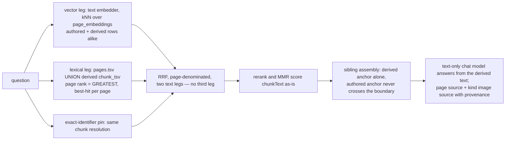

# Architectural Decisions Record (ADR)

This document captures all key architectural decisions for the Compendiq project.
Each decision includes context, options considered, and the chosen approach with rationale.

---

## ADR-001: Project Structure

### Context
The reference project (ai-portainer-dashboard) evolved into a complex monorepo with 10+ npm workspace packages. Our project is simpler in scope.

### Options

| Option | Pros | Cons |
|--------|------|------|
| **A: Flat monorepo** (`backend/` + `frontend/`) | Simple, fast to set up, easy to navigate | Services grow into large files over time |
| **B: Packages monorepo** (like reference) | Clean boundaries, enforced architecture | Over-engineered for this project's scope |
| **C: Flat + shared contracts** (`backend/` + `frontend/` + `packages/contracts/`) | Type safety across boundary, still simple | Slight extra complexity |

### Decision: **Option C - Flat monorepo with shared contracts package**

```
compendiq/
├── backend/
│   └── src/
│       ├── plugins/          # Fastify plugins (auth, cors, etc.)
│       ├── routes/           # REST API routes grouped by domain
│       │   ├── auth.ts
│       │   ├── pages.ts
│       │   ├── spaces.ts
│       │   ├── llm.ts
│       │   ├── ollama.ts
│       │   ├── settings.ts
│       │   └── sync.ts
│       ├── services/         # Business logic
│       │   ├── confluence-client.ts
│       │   ├── ollama-service.ts
│       │   ├── embedding-service.ts  # pgvector + chunking + embedding
│       │   ├── rag-service.ts        # Hybrid search + prompt building
│       │   ├── redis-cache.ts        # Redis caching layer
│       │   ├── sync-service.ts
│       │   └── content-converter.ts  # XHTML ↔ HTML ↔ Markdown + draw.io
│       ├── db/
│       │   ├── postgres.ts   # Connection + migration runner
│       │   └── migrations/   # Sequential SQL files
│       ├── utils/
│       └── index.ts          # Entry point
├── frontend/
│   └── src/
│       ├── features/         # Domain-grouped UI
│       │   ├── dashboard/
│       │   ├── pages/        # Browse, view, edit articles
│       │   ├── ai-assistant/ # LLM panel (improve, generate, Q&A)
│       │   └── settings/
│       ├── shared/
│       │   ├── components/   # Glass cards, layout, etc.
│       │   ├── hooks/
│       │   └── lib/
│       ├── stores/           # Zustand stores
│       ├── providers/        # Context providers
│       └── App.tsx
├── packages/
│   └── contracts/            # Shared Zod schemas + TypeScript types
│       └── src/
│           ├── schemas/      # Zod validation schemas
│           └── types/        # Shared TypeScript interfaces
├── docker/
│   ├── docker-compose.yml
│   └── docker-compose.test.yml
└── docs/
```

**Rationale**: Our scope (Confluence + Ollama + CRUD) is ~20% of the reference project's complexity. A flat structure with shared contracts gives us type safety at the API boundary without the overhead of 10+ packages. We can always extract packages later if needed.

---

## ADR-002: Rich Text Editor

### Context
We need an editor that can:
- Import HTML content from Confluence (XHTML storage format)
- Export HTML back to Confluence storage format
- Provide a good editing UX (formatting toolbar, tables, code blocks, lists)
- Work with React 19

### Options

| Editor | React 19 | HTML Import/Export | Maturity | Bundle Size | Notes |
|--------|----------|-------------------|----------|-------------|-------|
| **TipTap** | Partial (UI components need React 18) | Native | Very mature, ProseMirror-based | ~200KB | Industry standard, extensible |
| **BlockNote** | Full | `tryParseHTMLToBlocks` / `blocksToHTMLLossy` | Good, built on TipTap/ProseMirror | ~350KB | Notion-style blocks, opinionated |
| **Lexical** (Meta) | Full | Via plugins | Mature | ~100KB | Complex API, more low-level |
| **Plate** | Full | Via plugins | Good, built on Slate | ~250KB | Highly modular |

### Decision: **TipTap**

**Rationale**:
1. **HTML is our native format** - Confluence stores XHTML. TipTap's ProseMirror core natively parses and generates HTML, making round-trip conversion the most reliable.
2. **Extension ecosystem** - TipTap has extensions for everything Confluence uses: tables, task lists, code blocks, images, headings, etc. We can add custom extensions for Confluence-specific macros.
3. **Headless/unstyled** - We control the look completely, fitting the glassmorphic design.
4. **Server-side rendering** - `@tiptap/static-renderer` can render content server-side for previews.
5. **React 19 note** - The core editor works fine with React 19. Only the premium "UI Components" package requires React 18, which we don't need (we build our own toolbar with Radix UI).

**Editor configuration approach**:
```typescript
// Core extensions matching Confluence capabilities
const extensions = [
  StarterKit,         // Bold, italic, headings, lists, code, blockquote
  Table,              // Confluence tables
  TaskList, TaskItem, // Confluence task lists (ac:task-list)
  CodeBlockLowlight,  // Code blocks with syntax highlighting
  Image,              // Inline images
  Link,               // Hyperlinks
  Placeholder,        // Empty state guidance
]
```

---

## ADR-003: Content Format Pipeline

### Context
Content flows between 4 systems with different format needs:

```
Confluence (XHTML Storage Format)
    ↕
PostgreSQL Cache (store both formats)
    ↕
Editor (HTML via TipTap)
    ↕
LLM/Ollama (Markdown - best for LLM comprehension)
```

### Decision: **Dual-format storage with on-demand conversion**

```
                    ┌─────────────────────────┐
                    │   Confluence REST API    │
                    │  (XHTML Storage Format)  │
                    └────────┬────────────────┘
                             │ GET/PUT
                    ┌────────▼────────────────┐
                    │   Content Converter     │
                    │  confluenceToHtml()     │  Strip ac:*/ri:* → clean HTML
                    │  htmlToConfluence()     │  Wrap back to storage format
                    │  htmlToMarkdown()       │  For LLM consumption
                    │  markdownToHtml()       │  For LLM output → editor
                    └────────┬────────────────┘
                             │
                    ┌────────▼────────────────┐
                    │     PostgreSQL Cache     │
                    │  body_storage (XHTML)   │  Original Confluence format
                    │  body_html (clean HTML) │  For editor loading
                    └────────┬────────────────┘
                             │
              ┌──────────────┼──────────────┐
              │                             │
     ┌────────▼──────┐          ┌──────────▼──────┐
     │  TipTap Editor │          │  Ollama LLM     │
     │  (HTML in/out) │          │  (Markdown)     │
     └───────────────┘          └─────────────────┘
```

### Conversion Libraries

| Conversion | Library | Notes |
|------------|---------|-------|
| Confluence XHTML → Clean HTML | `jsdom` + custom DOM transform | Parse XHTML, walk DOM, convert `ac:*/ri:*` to standard HTML |
| Confluence XHTML → Markdown | `turndown` + `jsdom` + `turndown-plugin-gfm` + custom rules | Best approach for LLM consumption |
| Markdown → HTML | `marked` | Fast, GFM support |
| Clean HTML → Confluence XHTML | Custom serializer | Re-wrap with Confluence macro tags |

**Important**: Confluence Data Center 9.2.15 does NOT support ADF (Atlassian Document Format)
or REST API v2. We must use the **Storage Format (XHTML)** via `/rest/api/content`.
ADF is Cloud-only. Verified against the DC 9.2.17 REST API reference.

### Turndown custom rules implementation

`jsdom` parses the XHTML, and namespace tags appear **uppercased** in the DOM
(e.g. `AC:STRUCTURED-MACRO`). CSS selectors require escaped colons
(e.g. `node.querySelector('ac\\:parameter')`).

```
npm install turndown jsdom turndown-plugin-gfm he
npm install -D @types/turndown @types/jsdom @types/he
```

### Confluence macro mapping

| Confluence Macro | Editor HTML | Markdown |
|-----------------|-------------|----------|
| `<ac:structured-macro ac:name="code">` + `<ac:plain-text-body>` | `<pre><code class="language-X">` | ````lang\ncode```` |
| `<ac:task-list>/<ac:task>` + `<ac:task-status>` | `<ul data-type="taskList">` | `- [x]`/`- [ ] task` |
| `<ac:structured-macro ac:name="info\|warning\|note\|tip">` | `<div class="panel-info\|warning">` | `> [!INFO] text` |
| `<ac:link><ri:page ri:content-title="X">` | `<a href="...">` | `[text](url)` |
| `<ac:link><ri:user>` | `<span class="mention">@user</span>` | `@userId` |
| `<ac:image><ri:attachment>` | `` | `` |
| `<ac:structured-macro ac:name="drawio">` | `<div class="confluence-drawio">` | `` |

**Rationale**: Storing both `body_storage` (original) and `body_html` (clean) avoids re-converting on every page load. The LLM always gets Markdown (proven to be the best format for LLM comprehension). The editor always gets clean HTML (what TipTap expects).

### #1115 (2026-08-17) — images stop being invisible to RETRIEVAL; the pipeline above is unchanged

**Nothing in the conversion pipeline changes.** Confluence XHTML ⇄ clean HTML ⇄
Markdown stays exactly as specified above, with the same libraries and the same
macro mapping. An `` still converts to ``, and its *text* contribution
to embedding input is still whatever alt text it carries.

What changed (ADR-025; the intake in **P2**, retrieval in **P3**, the answer
path in **P4**, all shipped) is that the attachment's **bytes**
become a second, parallel index — `page_image_embeddings`, embedded by a
vision-language model, fused as a third retrieval leg. Five consequences are
worth stating here, where a reader of the pipeline will look for them:

- **Images never join the pipeline above.** They stay bytes from disk to model,
  exactly as #1154's uploaded images do. There is no image → Markdown step, no
  OCR, and no new conversion rule.
- **The enumeration key is the pipeline's own output, URL-DECODED.** The
  converter writes `/<file>">` into `body_html`
  with `<file>` percent-encoded (`content-converter.ts:366`, `:386`, `:410`;
  the paste/import routes do the same at `pages-crud.ts:2730` and `:2945`),
  while the file on disk carries the DECODED name — `cacheAttachment` and
  `writeAttachmentCache` are handed the raw filename. So the `attachment_key`
  is `decodeURIComponent(basename(src))`. Take the basename literally and
  every filename containing a space or a non-ASCII character is keyed in a
  form `resolveAttachmentBytes` can never resolve, and the miss is silent —
  an absent file and a mis-encoded key both answer `null`. (The attachment
  route never trips over this because Fastify decodes its `:filename` param
  for it; an enumerator walking HTML has no such decoder in front of it.)
  The id is `confluence_id` when `pages.source = 'confluence'` and the numeric
  page id otherwise — the derivation `pages-crud.ts:2723-2728` and
  `parentKeyFor` (`page-relocate-service.ts:140-142`) both use, and which the
  hoisted reader restates rather than inferring from a null `confluence_id`.
- **`body_html` carries BOTH attachment prefixes, and the store follows the
  PREFIX.** `/api/attachments/<key>/<file>` is the Confluence cache;
  `/api/local-attachments/<page_id>/<file>` is the local store, and it is
  persisted, not rendered: `relocateToLocal` copies every cached attachment
  into the local store (`page-relocate-service.ts:672-684`), rewrites the body
  (`:692-696`) and writes it in the same UPDATE that nulls `confluence_id`
  (`:729-752`), then deletes the old cache directory (`:820`). Nothing rewrites
  an `` at render time. So the enumerator reads
  `/api/attachments/` ⇒ `source: 'confluence'` and `/api/local-attachments/`
  ⇒ `source: 'local'` — **never** `pages.confluence_id IS NULL`, which names
  the Confluence tree for precisely the pages whose bytes were moved out of it
  and produces the same silent `null` as an absent file. A relocated page that
  is then pasted into carries both prefixes at once, which is why `source` is
  part of `page_image_embeddings`' unique key. It also keeps the enumerator on
  **HTML**: a relocated page's `body_storage` is deliberately left verbatim
  (`page-relocate-service.ts:698-700`), so it still describes the Confluence
  attachments the body no longer points at.
- **draw.io PNGs are indexed only where they are really rasters.** Confluence's
  export is sometimes `<mxfile>` XML behind a `.png` name (ADR-013); magic-byte
  sniffing refuses it and the file is skipped and counted, never guessed at from
  the extension.
- **A page whose text is below the embedding floor becomes reachable.** Today an
  image-only page produces no chunk at all; the image leg gives it a row,
  synthesising `chunkText` from the title for the downstream stages.

---

## ADR-004: Caching & Sync Strategy

### Context
Loading all pages from Confluence REST API on every request is slow (~200-500ms per page, pagination needed for lists). We need fast caching for the UI layer and persistent storage for articles + embeddings.

### Decision: **Redis for hot cache + PostgreSQL for persistent storage + background sync**

#### Two-tier caching architecture
```
                    ┌──────────────────────┐
                    │   Confluence REST API │
                    └──────────┬───────────┘
                               │
                    ┌──────────▼───────────┐
                    │     Sync Service      │
                    │  (background worker)  │
                    └──┬───────────────┬───┘
                       │               │
            ┌──────────▼──┐    ┌───────▼──────────┐
            │   Redis      │    │   PostgreSQL      │
            │  (hot cache) │    │  (persistent)     │
            │              │    │                   │
            │ - Page lists │    │ - Full articles   │
            │ - Space data │    │ - body_storage    │
            │ - Search idx │    │ - body_html       │
            │ - API resp.  │    │ - Embeddings      │
            │ - TTL: 15min │    │   (pgvector)      │
            └──────────────┘    └───────────────────┘
```

**Redis layer** (hot cache, TTL-based):
- Page list responses (per space, per user)
- Space metadata
- Search results
- Confluence API response caching
- Default TTL: 15 minutes (configurable)
- Invalidated on write operations

**PostgreSQL layer** (persistent storage):
- Full article content (body_storage + body_html)
- Vector embeddings for RAG (pgvector)
- User settings, conversations, improvements
- Source of truth for offline/fast access

#### Sync Flow
```
Initial Setup (user configures PAT + spaces)
    │
    ▼
Full Sync: Fetch all pages → store in PostgreSQL → generate embeddings → warm Redis
    │
    ▼
Background Sync (every 15 min, configurable):
    - CQL: `lastmodified > "last_sync_timestamp" AND space IN (selected_spaces)`
    - Update changed pages in PostgreSQL
    - Re-generate embeddings for changed pages
    - Invalidate Redis cache for affected keys
    - Detect deleted pages (compare ID sets)
    │
    ▼
Write-through: When user creates/updates via our app:
    1. Write to Confluence REST API
    2. On success, update PostgreSQL immediately
    3. Generate embeddings for new/changed content
    4. Invalidate relevant Redis keys
```

#### Cache invalidation triggers
- User clicks "Sync Now" button
- Background timer fires (configurable interval)
- After any write operation (create/update/delete)
- On login (check if last sync > threshold)
- Redis TTL expiry (automatic)

**Rationale**: Redis handles the fast UI layer (page lists, search results) while PostgreSQL stores the full articles and vector embeddings. Confluence Data Center's REST API doesn't support webhooks, so we poll with CQL `lastmodified >` for efficient delta sync.

---

## ADR-005: LLM Communication Protocol

### Context
LLM responses stream token-by-token from Ollama. We need to deliver these to the browser in real-time.

### Options

| Option | Pros | Cons |
|--------|------|------|
| **SSE (Server-Sent Events)** | Simple, HTTP-native, works through proxies, auto-reconnect | Unidirectional, limited to text |
| **WebSocket** | Bidirectional, binary support | More complex, needs Socket.IO/ws setup, proxy issues |
| **HTTP Streaming** (chunked transfer) | Simplest | No standard reconnect, harder to parse |

### Decision: **SSE for LLM streaming**

**Rationale**:
- LLM output is inherently unidirectional (server → client)
- SSE is simpler to implement (standard `text/event-stream` + `EventSource` API)
- No Socket.IO dependency needed (we don't have real-time features that need bidirectional comms)
- Works reliably through nginx reverse proxies in Docker

**Implementation pattern**:
```typescript
// Backend: Fastify SSE route
fastify.post('/api/llm/improve', async (request, reply) => {
  reply.raw.writeHead(200, {
    'Content-Type': 'text/event-stream',
    'Cache-Control': 'no-cache',
    Connection: 'keep-alive',
  });

  await ollamaService.chatStream(messages, model, (chunk) => {
    reply.raw.write(`data: ${JSON.stringify({ token: chunk })}\n\n`);
  });

  reply.raw.write(`data: ${JSON.stringify({ done: true })}\n\n`);
  reply.raw.end();
});

// Frontend: fetch + ReadableStream (not EventSource, since we POST)
const response = await fetch('/api/llm/improve', { method: 'POST', body, headers });
const reader = response.body.getReader();
// ... read chunks
```

**Note**: We use `fetch` with streaming response rather than `EventSource` because EventSource only supports GET. Our LLM endpoints need POST with request bodies.

---

## ADR-006: Database Schema Design

### Decision: Single PostgreSQL instance, hand-rolled SQL migrations

**Migration pattern** (same as reference project):
```
backend/src/db/migrations/
  001_extensions.sql
  002_users.sql
  003_user_settings.sql
  004_cached_spaces.sql
  005_cached_pages.sql
  006_page_embeddings.sql
  007_llm_conversations.sql
  008_llm_improvements.sql
  009_admin_roles.sql
```

Auto-run on server start via a `_migrations` tracking table.

### Schema

```sql
-- 001_extensions.sql
CREATE EXTENSION IF NOT EXISTS vector;    -- pgvector for embeddings
CREATE EXTENSION IF NOT EXISTS pg_trgm;   -- trigram index for fuzzy text search

-- 002_users.sql
CREATE TABLE users (
  id            UUID PRIMARY KEY DEFAULT gen_random_uuid(),
  username      TEXT NOT NULL UNIQUE,
  password_hash TEXT NOT NULL,
  created_at    TIMESTAMPTZ NOT NULL DEFAULT NOW(),
  updated_at    TIMESTAMPTZ NOT NULL DEFAULT NOW()
);

-- 003_user_settings.sql
CREATE TABLE user_settings (
  user_id           UUID PRIMARY KEY REFERENCES users(id) ON DELETE CASCADE,
  confluence_url    TEXT,              -- e.g. https://confluence.company.com
  confluence_pat    TEXT,              -- AES-256-GCM encrypted
  selected_spaces   TEXT[] DEFAULT '{}', -- array of space keys
  ollama_model      TEXT DEFAULT 'qwen3.5',
  theme             TEXT DEFAULT 'glass-dark',
  sync_interval_min INT DEFAULT 15,
  updated_at        TIMESTAMPTZ NOT NULL DEFAULT NOW()
);

-- 004_cached_spaces.sql
CREATE TABLE cached_spaces (
  id          SERIAL PRIMARY KEY,
  user_id     UUID NOT NULL REFERENCES users(id) ON DELETE CASCADE,
  space_key   TEXT NOT NULL,
  space_name  TEXT NOT NULL,
  description TEXT,
  homepage_id TEXT,                    -- Confluence page ID
  last_synced TIMESTAMPTZ,
  UNIQUE(user_id, space_key)
);

-- 005_cached_pages.sql
CREATE TABLE cached_pages (
  id                SERIAL PRIMARY KEY,
  user_id           UUID NOT NULL REFERENCES users(id) ON DELETE CASCADE,
  confluence_id     TEXT NOT NULL,      -- Confluence content ID
  space_key         TEXT NOT NULL,
  title             TEXT NOT NULL,
  body_storage      TEXT,               -- Original Confluence XHTML
  body_html         TEXT,               -- Clean HTML for editor
  body_text         TEXT,               -- Plain text (stripped) for search
  version           INT NOT NULL DEFAULT 1,
  parent_id         TEXT,               -- Confluence parent page ID
  labels            TEXT[] DEFAULT '{}',
  author            TEXT,
  last_modified_at  TIMESTAMPTZ,
  last_synced       TIMESTAMPTZ NOT NULL DEFAULT NOW(),
  embedding_dirty   BOOLEAN DEFAULT TRUE, -- needs re-embedding
  UNIQUE(user_id, confluence_id)
);

CREATE INDEX idx_cached_pages_space ON cached_pages(user_id, space_key);
CREATE INDEX idx_cached_pages_title ON cached_pages(user_id, title text_pattern_ops);
CREATE INDEX idx_cached_pages_parent ON cached_pages(user_id, parent_id);
CREATE INDEX idx_cached_pages_dirty ON cached_pages(embedding_dirty) WHERE embedding_dirty = TRUE;
-- Full-text search index (fallback when vector search is unavailable)
CREATE INDEX idx_cached_pages_fts ON cached_pages
  USING gin(to_tsvector('english', coalesce(title, '') || ' ' || coalesce(body_text, '')));

-- 006_page_embeddings.sql (pgvector)
-- Chunks: each page is split into ~500 token chunks for embedding
CREATE TABLE page_embeddings (
  id              SERIAL PRIMARY KEY,
  user_id         UUID NOT NULL REFERENCES users(id) ON DELETE CASCADE,
  confluence_id   TEXT NOT NULL,        -- FK to cached_pages.confluence_id
  chunk_index     INT NOT NULL,         -- Order within the page
  chunk_text      TEXT NOT NULL,         -- The text chunk
  embedding       vector(1024) NOT NULL,  -- historical: bge-m3 at 1024 dimensions
  metadata        JSONB DEFAULT '{}',    -- {section_title, page_title, space_key}
  created_at      TIMESTAMPTZ NOT NULL DEFAULT NOW(),
  UNIQUE(user_id, confluence_id, chunk_index)
);

-- HNSW index for fast approximate nearest neighbor search
CREATE INDEX idx_page_embeddings_vector ON page_embeddings
  USING hnsw (embedding vector_cosine_ops)
  WITH (m = 16, ef_construction = 64);

CREATE INDEX idx_page_embeddings_user ON page_embeddings(user_id);

-- 007_llm_conversations.sql
CREATE TABLE llm_conversations (
  id         UUID PRIMARY KEY DEFAULT gen_random_uuid(),
  user_id    UUID NOT NULL REFERENCES users(id) ON DELETE CASCADE,
  page_id    TEXT,                     -- never written; dropped by 094 (page_ref)
  model      TEXT NOT NULL,
  title      TEXT,                     -- question fallback; #1361 auto-title may replace it
  messages   JSONB NOT NULL DEFAULT '[]',
  created_at TIMESTAMPTZ NOT NULL DEFAULT NOW(),
  updated_at TIMESTAMPTZ NOT NULL DEFAULT NOW()
);

-- 094_llm_conversations_history.sql (#1361)
ALTER TABLE llm_conversations DROP COLUMN page_id;
ALTER TABLE llm_conversations
  ADD COLUMN page_ref INTEGER REFERENCES pages(id) ON DELETE SET NULL,
  ADD COLUMN title_source TEXT NOT NULL DEFAULT 'question'
    CHECK (title_source IN ('question', 'generated', 'user'));
CREATE INDEX IF NOT EXISTS llm_conversations_user_updated_idx
  ON llm_conversations (user_id, updated_at DESC, id DESC);

-- 008_llm_improvements.sql
-- (see below)

-- 009_admin_roles.sql
ALTER TABLE users ADD COLUMN role TEXT NOT NULL DEFAULT 'user';
-- Valid roles: 'user', 'admin'. First registered user gets 'admin' automatically.

-- 008_llm_improvements.sql
CREATE TABLE llm_improvements (
  id                UUID PRIMARY KEY DEFAULT gen_random_uuid(),
  user_id           UUID NOT NULL REFERENCES users(id) ON DELETE CASCADE,
  confluence_id     TEXT NOT NULL,
  improvement_type  TEXT NOT NULL,      -- grammar, structure, clarity, technical, completeness
  model             TEXT NOT NULL,
  original_content  TEXT NOT NULL,
  improved_content  TEXT NOT NULL,
  status            TEXT NOT NULL DEFAULT 'draft', -- draft, applied, rejected
  created_at        TIMESTAMPTZ NOT NULL DEFAULT NOW()
);
```

> **Note on `page_embeddings.embedding` (#1114):** the DDL above is this ADR's
> schema snapshot, not the migration file, and its `-- historical:` comment is an
> annotation added here rather than migration text — `006_page_embeddings.sql`
> actually shipped `embedding vector(768) NOT NULL` with no comment, and 1024
> arrives only with migration 048 (`ALTER COLUMN embedding TYPE vector(1024)`,
> which also writes `admin_settings.embedding_dimensions = '1024'`). **The live
> column type is dimension-driven** — `columnTypeFor` picks `vector(n)` + HNSW
> `vector_cosine_ops` up to 2000 dims, `halfvec(n)` + `halfvec_cosine_ops` from
> 2001 to 4000, and an unindexed `vector(n)` above — from a width probed off the
> resolved `embedding` model, not from a constant. So `vector(1024)` is where the
> migrations leave a fresh install, not a width the schema mandates: a model swap
> re-types the column. See ADR-012's `#1114` amendment and
> `docs/architecture/06-data-model.md`.

**Rationale**:
- No ORM (same pattern as reference project) - parameterized SQL only for security
- Per-user data isolation via `user_id` foreign keys
- `body_storage` + `body_html` dual storage (see ADR-003)
- JSONB for conversation messages (flexible schema for multi-turn chat)
- Text arrays for labels and selected_spaces (native PostgreSQL arrays)

---

## ADR-007: Security Model

### PAT Storage
- User enters PAT in settings UI
- Backend encrypts with **AES-256-GCM** before storing
- Encryption key: derived from `PAT_ENCRYPTION_KEY` env var (required, 32+ chars)
- Decrypted only when making Confluence API calls (never sent to frontend)
- IV is unique per encryption, stored alongside ciphertext

### Authentication
- **JWT** via `jose` library (same as reference project)
- Access token: 15 min expiry, stored in memory (not localStorage)
- Refresh token: 7 day expiry, httpOnly cookie
- Password hashing: `bcrypt` with salt rounds 12
- `fastify.authenticate` decorator on all protected routes

### LLM Safety
- **Prompt injection guard**: Sanitize user-provided content before sending to Ollama
- **Output sanitization**: Strip any potential system prompt leakage
- Rate limiting on LLM endpoints (prevent abuse of local Ollama resources)

### Input Validation
- **Zod** schemas on all API boundaries (from `@compendiq/contracts`)
- Parameterized SQL only (no string concatenation)

---

## ADR-008: Simplified vs Full Packages Architecture

### Context
The reference project has 10 npm workspace packages. Should we replicate this?

### Decision: **No. Start flat, extract if needed.**

| Reference Project | Our Project | Rationale |
|-------------------|-------------|-----------|
| `packages/contracts/` | `packages/contracts/` | Keep - shared types across API boundary |
| `packages/core/` | `backend/src/db/` + `backend/src/plugins/` | Flatten - we have one domain, not five |
| `packages/ai-intelligence/` | `backend/src/services/ollama-service.ts` | Single file, not a package |
| `packages/server/` | `backend/src/index.ts` + `backend/src/app.ts` | Direct bootstrap, no wiring needed |
| `packages/infrastructure/` | N/A | We don't have Docker/K8s management |
| `packages/security/` | N/A | We don't have security scanning |
| `packages/observability/` | N/A | We don't have metrics/timeseries |

**Rationale**: The reference project's package architecture exists because it manages 5+ external integrations (Portainer, Harbor, Prometheus, Ollama, Redis) across multiple domains (containers, security, observability, operations). Our project has 2 integrations (Confluence, Ollama) in a single domain (knowledge base management). A flat structure with good file organization is sufficient.

---

## ADR-009: Frontend State Management

### Decision: Same pattern as reference project

| State Type | Tool | Example |
|------------|------|---------|
| **Server data** | TanStack Query | Page list, spaces, sync status |
| **Global UI** | Zustand (persisted) | Theme, sidebar, preferences |
| **Auth** | Zustand + Context | JWT tokens, user info |
| **Editor** | TipTap internal | Document state, selection |
| **LLM streaming** | Local state (useState) | Current stream, pending state |

### Zustand Stores

```
stores/
  auth-store.ts     # User session, tokens, login/logout
  theme-store.ts    # Theme selection, glassmorphic prefs
  ui-store.ts       # Sidebar collapse, view modes
  settings-store.ts # Cached user settings (Confluence URL, model, etc.)
```

**Rationale**: TanStack Query handles all the caching, refetching, and loading states for server data. Zustand handles client-only state. No Redux overhead needed.

---

## ADR-010: UI Component Strategy

### Decision: Custom glassmorphic components built on Radix UI primitives

**Same approach as reference project:**
- **Radix UI** for accessible primitives (Dialog, Select, Tabs, Tooltip, ScrollArea, etc.)
- **TailwindCSS 4** for styling with CSS variables for theming
- **Framer Motion** (`LazyMotion` with `domAnimation`) for animations
- **Custom glass components** wrapping Radix with glassmorphic styling:

```css
/* Glass card base */
.glass-card {
  @apply rounded-xl border border-white/10 bg-card/80 backdrop-blur-md shadow-lg;
}

/* Glass card hover */
.glass-card-hover {
  @apply glass-card transition-all hover:border-white/20 hover:shadow-xl;
}
```

**Theme system**: CSS variables at `:root` and `.dark` scope (start with light + dark, expand later).

**Animation philosophy**: All animations respect `prefers-reduced-motion`. Staggered entrance animations for lists/grids.

### Addendum (v0.4 — #30): Neumorphic theme system supersedes glassmorphic

The v0.3-era glassmorphic surfaces (`backdrop-filter: blur` + alpha bg + thin top-light highlight) are retired as of v0.4 in favour of a neumorphic theme system that mirrors the public landing page (`compendiq-landing/src/styles/tokens.css`) for cross-surface brand parity. Two themes ship — **Graphite Honey** (dark, default) and **Honey Linen** (light) — both anchored on the brand palette (black `#0A0A0A` + honey `#F9C74F`) with theme-tinted neumorphic shadow recipes rather than backdrop blur. Eleven `nm-*` `@utility` classes (`nm-card`, `nm-card-elevated`, `nm-card-interactive`, `nm-toolbar`, `nm-sidebar`, `nm-header`, `nm-pill-active`, `nm-button-primary`, `nm-button-ghost`, `nm-icon-button`, `nm-input`) replace the glass equivalents one-to-one. **Hybrid neumorphism is mandatory**: every interactive surface carries a 1px solid border so chrome remains visible at 3:1 contrast under WCAG 1.4.11, in `forced-colors: active` mode (where `box-shadow` is zeroed by the browser — each utility falls back to a `ButtonText` system border), and on edge-case display calibrations. Focus rings live on `:focus-visible` with `outline-offset` so they don't visually merge with the surface shadow; press states swap raised → inset shadow. `prefers-reduced-motion: reduce` strips the press transform/transition. Status colours have been lifted to `--color-status-*` semantic tokens (`connected` / `syncing` / `embedding` / `ai` / `disconnected` / `inactive`) so badges shift correctly between dark and light themes; `--color-primary-ink` provides a darkened honey for AA-safe accent-as-text use on cream surfaces. The animated gradient mesh on the setup wizard is preserved (it sits behind the neumorphic surfaces without conflict). Migration of persisted theme preferences: any retired theme ID (`void-indigo`, `obsidian-violet`, `polar-slate`, `parchment-glow`, plus older legacy IDs) silently falls back to `graphite-honey` on first load — no data migration is required.

### Amendment v0.5 (2026-05-17) — Amber-as-AI

The brand palette stays black `#0A0A0A` + honey `#F9C74F`, but **honey is reassigned a single semantic meaning across the product: "AI is involved here."** It is no longer used as the primary affordance color.

Three rules:

1. **Honey appears only on AI surfaces** — AI affordances (Ask / Generate / Summarize / Improve / Diagram / Quality / Think / chat composer / duplicate detection), AI-state status (`--color-status-ai` is honey-amber for "AI is processing this"), the AI tab's icon when active in the main rail, and the brand mark's Q-magnifier strokes.
2. **Primary affordance becomes ink** — `--color-action` (#0A0A0A light, #ECE9E2 dark). Non-AI primary buttons use an outline-fills-on-hover treatment. Active sidebar/tab/article-row pills use ink-fill.
3. **Focus ring is the one allowed exception** — `--color-ring` stays honey across all surfaces for brand-mark continuity. Focus is intentionally loud.

Status indicators retain their domain palette (green=connected, red=disconnected, yellow=syncing, blue=embedding, purple=AI-processing, gray=inactive) — these are state colors, not affordance colors, and the new rule does not collide.

Badge palette unified: every status pill (Local / Shared / Private / Failed / Skipped / Not Embedded / Recent / Draft) uses a tinted-pill recipe with AA-pass text in both themes. "Private" moves from amber to neutral gray; "Recent" moves from amber to sage; "Draft" moves from orange to neutral gray.

WCAG-AA regression guard: `e2e/contrast.spec.ts` audits 6 routes × 2 themes; any text-on-bg pair below AA fails CI.

### v0.5 — Slate Steel / Frost Steel palette (supersedes the honey palette)

**Owner decision.** The honey palette above is retired. The colour system is
replaced wholesale by the cool slate-and-steel system ported from the
`lifecycle-management` console (`apps/web/src/styles.css`, "Mission Bento").
The **structural** decisions of v0.4 are unchanged and still binding: Radix
primitives, the neumorphic `nm-*` surface system, mandatory hybrid borders,
`:focus-visible` rings with offset, press = inset swap, reduced-motion
stripping, and the `--color-status-*` semantic tokens.

What changes is the palette, the accent semantics, and the type system:

- **Themes.** `graphite-honey` → **`slate-steel`** (dark, default, navy
  `#0E1220`); `honey-linen` → **`frost-steel`** (light, `#F4F6FA`). Both IDs
  migrate on read — in `validateThemeId` *and* in the `index.html` FOUC script,
  so a light-theme user does not flash dark before React mounts. Brightness is
  preserved across the migration.
- **Accent semantics inverted from v0.4.** Steel (`#6EA8FF` / `#2F6BD8`) is now
  the single brand **and** interaction accent — primary CTAs, links, active
  states, `--color-ring`. Honey's "AI is involved here" role moves to **violet**
  (`--color-status-ai`, `#C084FC` / `#6D28D9`) — which is a rule about
  *ornament*, not about controls: an AI-labelled affordance you can operate
  still takes steel, because steel is what "operable" means. **Amber is reserved for
  warning/attention only**, which is what makes the ~36 files of literal
  `amber-*`/`yellow-*` warning callouts semantically correct rather than stray
  brand colour — they were deliberately left as-is.
- **`--color-primary-ink`** keeps its v0.4 job only in the light theme, where
  steel-as-text needs darkening (`#2857B3`). In dark, steel clears AA as text
  unaided (7.73:1 on background), so ink and fill are one value.
- **New: `--color-border-interactive`.** v0.4 mandated a 1px border at 3:1 for
  WCAG 1.4.11 but used a single `--color-border` for both separators and
  control edges — measured at **1.60:1** (dark) and **1.28:1** (light), the
  requirement was not actually met. Borders are now split by role: the quiet
  hairline stays `--color-border`; operable surfaces take
  `--color-border-interactive`, measured ≥3:1 on every surface.
- **New: gradient-lit chassis.** `--surface-backdrop` (radial) on the app shell
  and `--surface-card` (linear) on content panes; `nm-card-elevated` takes its
  own `--surface-card-elevated` one step up, so elevation survives in the
  surface and not only in the shadow. Chrome stays flat. Text contrast is
  measured against the *lightest* stop of **both** pane gradients.
- **Consequence: card surfaces are background *images*.** A Tailwind `bg-*`
  utility sets background-*color*, which is painted underneath an opaque
  gradient and does nothing. Card-surfaced controls tint via the new
  `nm-card-hover` utility, which composes the tint as an additional image
  layer. `neumorphic-themes.test.ts` walks the `.tsx` sources and fails on any
  card utility paired with `hover:bg-*` — the failure mode is silent, so it
  needs a guard rather than a convention.
- **All three faces are variable builds.** `font-synthesis: style` forbids the
  browser from faking a weight, and Tailwind's preflight resets headings to
  `font-weight: inherit` — so a static cut set would snap a bare `<h1>` (400)
  and a prose `h1` (800) onto whichever weights happened to be imported.
- **Typography.** Newsreader/IBM Plex Sans → **Space Grotesk Variable**
  (display, headings) + **Inter Variable** (body); JetBrains Mono unchanged.
- **Regression guard strengthened.** `frontend/src/neumorphic-themes.test.ts`
  now parses tokens out of `index.css` and **computes** WCAG ratios instead of
  pinning hex literals, so a bad retune fails with the measured ratio. This
  covers both themes, all status and syntax hues, and both border roles.
  `e2e/contrast.spec.ts` still audits 6 routes × 2 themes.

**Known consequence, accepted:** the app no longer mirrors
`compendiq-landing/src/styles/tokens.css`, so the cross-surface brand parity
that motivated v0.4's palette choice is broken until the landing page adopts
the steel tokens. The brand mark itself was retinted (tile `#151B2C`, glyph
`#E8ECF5`, magnifier strokes steel) across the React `Logo`, the standalone
SVGs, and the generated favicons.

### v0.6 — Graphite / Paper, a flat workspace system (supersedes neumorphism)

**Owner decision (2026-08-06).** Presented with four distinct visual worlds
against the category convention, the owner chose **the convention, executed at
full fidelity**, with **Linear, Plane and Notion** named as the craft bar. This
is recorded as a durable brand commitment in `PRODUCT.md`, not a one-off: future
work does not re-open it with a concept round.

This retires the **neumorphic depth model** that v0.4 introduced and v0.5 kept.
What survives from v0.4/v0.5 and is still binding: Radix primitives, Framer
Motion `LazyMotion`, `:focus-visible` rings with offset, `prefers-reduced-motion`
honoured, the `--color-status-*` semantic tokens, the split border roles, and
the mandatory 1px border on every operable surface for WCAG 1.4.11 and
`forced-colors: active`. **The 1px border matters more now, not less** — there is
no shadow left to fall back on.

- **Themes.** `slate-steel` → **`graphite`** (dark, `#0d0e11`); `frost-steel` →
  **`paper`** (light, `#fbfbfc`). Both are neutral. Retired IDs migrate on read
  in `validateThemeId` *and* the `index.html` FOUC script, preserving brightness
  so a light-theme user does not flash dark before React mounts.
- **Accent.** Steel → **teal** (`#4dd0e1` dark / `#0e7490` light), still the
  single brand *and* interaction colour. Amber stays warning-only; violet stays
  AI. The v0.5 rule that an AI-labelled *control* takes the interaction accent
  (not violet) is unchanged.

  The two values are not one hue at two lightnesses. Dark carries a bright
  cyan-teal because it has to clear 4.5:1 against `#16181d`; Paper carries a
  deep teal because that same bright value measures under 2:1 on white. An
  indigo was trialled first and swapped for teal on owner preference; the
  ratios are computed from the tokens in `workspace-themes.test.ts`, so a
  retune of either fails with the measured number rather than a hex diff.
- **Depth is a value step plus a hairline.** The two-light-source extrusion
  recipe is gone. `--nm-shadow-*` / `--nm-highlight-*` remain declared but
  resolve to `transparent`, so a missed callsite renders flat rather than
  leaving one embossed control behind. Exactly one real shadow exists —
  `--shadow-overlay`, carried by `nm-card-elevated` alone, for content that
  genuinely floats above the page.
- **Chrome is the ground, content is the pane.** Sidebar, header and toolbars
  paint `--color-background`; the content pane sits one step up. This inverts
  v0.4/v0.5, where chrome was the lighter card colour. It is why the document is
  the brightest thing on screen. Consequence: the six
  `[data-theme-type="light"]` shell overrides are deleted — both themes are one
  token-driven ladder, and a light-only override was the mechanism by which the
  two themes drifted apart.
- **Surfaces are flat colours.** The gradient chassis is reverted. A gradient
  under dense 13px text means the same row measures differently at the top of a
  pane than at the bottom, and every surface needs measuring twice. **This also
  reverses v0.5's "card surfaces are background images" consequence**: a
  Tailwind `hover:bg-*` composes normally again, and the trap is designed out
  rather than documented around.
- **No lift, no scale.** `translateY` on hover and `scale` on press
  are removed from both the utilities and the components. The `--glass-*` tokens
  resolve onto `--color-*` and must not be revived as in-page chrome.
  `backdrop-blur` on a Tailwind class survives **only** on modal scrims,
  where it is a specific effect rather than decoration standing in for
  hierarchy. Floating popovers and dropdowns use `nm-popover-glass`: a softened
  border with reduced contrast (18% of the interactive edge), `--shadow-overlay`,
  and frosted glass with 12px blur across both dark (90% fill) and bright (82% fill)
  modes so the glass effect is visible in light mode.
  `prefers-reduced-transparency` makes the fill opaque and removes blur.
  Theme tests composite the fill over black and white document images,
  requiring ≥4.5:1 text contrast in both themes; measuring
  the opaque token alone misses translucent-overlay failures.
  Dialogs stay opaque `nm-card-elevated`. Blur is not a substitute for
  measured contrast. 307 fractional `border-border/NN` opacities collapse
  to one measurable hairline, and 56 translucent `bg-card/NN` panes become
  opaque, keeping in-flow surface contrast independent of content beneath.
- **Typography.** Space Grotesk is retired; there is **no display face**. Inter
  carries everything, JetBrains Mono carries code and data figures.
  `--font-display` is an alias onto Inter so existing callsites cannot drift.
  Both remain variable builds for the `font-synthesis: style` reason above.
- **Density.** 32px controls, 28px/13px tree rows, 48px header, 10/8/6/4 corner
  scale, 18px semibold route titles, list rows as rows (`px-3 py-2`) rather than
  cards.
- **The setup wizard's animated gradient mesh is retired.** v0.4 explicitly
  preserved it ("it sits behind the neumorphic surfaces without conflict");
  under a flat system there is nothing for it to sit behind. Three separate
  rules were against it: it was the last gradient in the app and sat on the one
  screen a new operator sees first, so it promised a surface the rest of the
  product does not have; its `rgba(120, 80, 255, …)` was a hardcoded violet, and
  violet means AI here, on a screen that has not asked about a model yet; and it
  animated `background` — a paint property, not a compositable one — on
  `repeat: Infinity` with no `prefers-reduced-motion` guard, for as long as the
  wizard was open. The wizard sits on the chassis like every other surface.
- **Theme preference follows the OS by default** (`system | dark | light`). The
  *preference* is persisted; the resolved palette is not, so a stale value
  cannot win over the live OS reading. `startSystemThemeSync` is gated on
  hydration — an OS event in the gap re-serialised the initial `system` over the
  user's stored choice.
- **Regression guard retargeted.** `neumorphic-themes.test.ts` →
  `workspace-themes.test.ts`. Its computed-WCAG machinery is carried over
  intact; the structural half now fails on a reintroduced shadow, `transform`,
  gradient surface, or light-theme shell override — drift that looks like polish
  in review. `ui-text-legibility.test.ts` enforces an 11px floor.

### v0.7 — Steel accent and five-step surface ladder (2026-08-20)

> **Paper's values here are superseded by v0.8 below (2026-08-30):** its ramp is
> now warm and its Pane is pure white. The roles, Graphite column, and every
> rule in this section still stand.

**Owner decision.** After comparing four independently contrast-tuned accent
pairs in a representative workspace mockup, the owner selected **Steel** and
approved the following Graphite/Paper surface ladder. This amendment supersedes
v0.6's teal values and its three-step palette; v0.6's flatness, typography,
density, motion, border, shadow, semantic-colour, and theme-preference rules are
unchanged.

These are eight **semantic implementation roles**, not eight equally prominent
colours and not user-selectable swatches. Only one theme is visible at a time;
within it, five neutrals establish depth, two borders establish structure and
operability, and one chromatic accent identifies action.

| Role | Production token | Graphite | Paper | Use |
|---|---|---:|---:|---|
| Canvas | `--app-chassis` | `#09090A` | `#EEEFF0` | Outer app frame, top app header, and overscroll |
| Chrome | `--app-header-bg` | `#0C0C0D` | `#F5F5F6` | Internal panel headers and toolbars |
| Workspace | `--color-background` | `#0F0F10` | `#F7F7F8` | Navigation and AI/context rails |
| Pane | `--color-card` | `#161617` | `#FAFAFB` | Eye-comfort document and route content |
| Raised | `--color-card-elevated` | `#1B1B1D` | `#FFFFFF` | Popovers, dialogs, command palette, toasts |
| Border | `--color-border` | `#2A2A2D` | `#DEDFE3` | Quiet pane separators and prose rules |
| Interactive border | `--color-border-interactive` | `#71717A` | `#7D818B` | Input and operable-surface outlines |
| Accent | `--color-primary` | `#86AEC8` | `#3F627C` | Brand, primary action, focus, links, selection, and provenance |

The low-contrast neutral steps are intentional. Paper Workspace→Pane is
1.03:1 and Graphite Workspace→Pane is 1.06:1; the 1px quiet hairline completes
the boundary without turning every pane into a card. The panes deliberately
avoid the luminance extremes: Graphite is lifted above near-black and Paper
stops short of pure white, reducing glare during long reading and editing
sessions. True white is reserved for transient Raised content in Paper.
Operable edges do not use
that hairline: `--color-border-interactive` measures at least 3.19:1 on every
surface where it appears. Steel itself clears AA with headroom: Graphite
`#86AEC8` is 7.67:1 on Pane, Paper `#3F627C` is 6.20:1 on Pane, and the paired
fill inks clear 4.5:1.

The top app header deliberately uses Canvas rather than Chrome. This makes the
top edge continuous with the visible left, right, and bottom chassis gutters;
Chrome remains an internal hierarchy cue for panel headers and toolbars.

Supporting ink and semantic values remain role-bound rather than joining the
eight-role surface set:

| Role | Graphite | Paper |
|---|---:|---:|
| Foreground | `#E7E9EB` | `#17181A` |
| Muted foreground | `#A0A4AA` | `#63666D` |
| Connected / success | `#4ADE80` | `#16794A` |
| Syncing / warning | `#FBBF24` | `#8A5A00` |
| Disconnected / destructive | `#F87171` | `#C03434` |
| AI | `#C084FC` | `#7041A8` |
| Informational | `#8B93F8` | `#3F49B8` |

Steel is still deliberately rare. It owns brand, interaction, focus,
selection, provenance, and the active embedding pipeline state. Violet marks
AI identity but an AI-labelled *control* remains Steel because it is operable;
green, amber, and red remain success, warning, and failure. Measurements,
categories, and resting capability badges stay neutral.

The palette reaches every production representation of the identity: theme
metadata/previews, browser and PWA chrome, the React logo, all static SVGs, and
generated raster icons. `logo-color-parity.test.ts` ties the static mark to the
Graphite Pane/Foreground/Accent tokens. `compendiq-landing` still carries the
preceding teal pair, so cross-surface palette parity is reopened; the app is
the source of truth for the outward port.

**Accepted exception:** the 3px `border-left` on `.panel-*` in `.prose` /
`.tiptap` is the rendering of a Confluence panel macro in *document body*
content. Its left rule carries meaning from the source document, and "the source
of record wins" outranks our surface conventions. The equivalent decoration on
app chrome stays refused.

**Cross-surface parity — v0.6 state (closed then; reopened by v0.7 above).**
At v0.6, `compendiq-landing` carried Graphite/Paper: same chassis, same teal,
same Inter, `paper`/`graphite` theme IDs. The app was the source of truth and
the port went outward.

Parity is **brand-deep, not rule-deep**. v0.6's flat surfaces, its 10/8/6/4
radii and its single shadow are answers to being a workspace that recedes behind
a document; a marketing page has the opposite job and keeps its radial backdrop
and softer radii. The two surfaces share an identity, not a density.

Three things a token port structurally cannot reach, all of which had silently
survived at least one rebrand:

- **The mark.** Its colours must be literals, because four of its five files are
  static SVGs rendering with no custom properties available (a favicon has no
  document; a maskable icon is rasterised by the OS). Honey survived into steel
  and steel survived into Graphite the same way. `logo-color-parity.test.ts` now
  ties the literals back to `--color-card` / `--color-foreground` /
  `--color-primary` parsed out of `index.css`.
- **A second mark.** The landing page had its own honey raster of a *visually
  different* mark serving as header, footer and favicon. It now serves the app's
  SVGs.
- **The social card.** A PNG, so it stayed honey through two rebrands — cream
  ground, honey underline, serif headline — as the first thing anyone sees when
  a link is shared. It is now generated (`npm run og`) from a template carrying
  the palette literals, and guarded (`npm run og:check`) by content hash rather
  than mtime, since git does not preserve mtimes.

The general lesson: a palette guard that reads only the stylesheet certifies the
part of the brand that was never at risk. Rasters, static SVGs and anything with
a baked literal need their own tie back to the tokens.

### v0.8 — Paper turns warm, and its panes turn white (2026-08-30)

**Owner decision, in two rounds on the same day.** First: *"The background colors
are a bit on the blue side. Make it a bit warmer, and for the background of the
main area, left and right panel I want pure white."* Then, on seeing it: *"Set the
colour of the nav rail, the border around the main area and header to 249/248/247"*
and *"the other colors we made warmer — it was a bit too warm."* Then: *"Set the
app-chassis and hover effect and selected effect to #FDFDFD."* Finally, on seeing
that: *"Make it slightly darker — the grey. Also adjust the other colours to fit with
that colour and the white main space."* Light mode only; Graphite is untouched. This amendment supersedes v0.7's Paper column, its "Paper
stops short of pure white" rationale, and its Canvas-is-darkest ladder.
Everything else in v0.7 — the eight roles, the flatness rules, the single
shadow, the borders, the semantics, Steel itself — is unchanged.

Three changes, and they are separable:

1. **Pure white panes.** Pane (`--color-card`) is `#FFFFFF`. That token paints
   the three surfaces named in the decision: route content (`app-content-pane`),
   the left navigation pane (`app-sidebar`) and the detached context rail
   (`--app-rail-bg`). Raised follows it to `#FFFFFF` — above white there is no
   step left to take — so an overlay now separates on its offset shadow and its
   hairline alone, and the light `--shadow-overlay` recipe was deepened two
   points to pay for the lost value step.
2. **A warm neutral ramp, quietly.** Every Paper neutral moved from OKLCH hue
   ~250–286 (cool) to ~68–70 (warm) at the **same OKLCH lightness**, so warmth
   changed and the value ladder did not: every measured ratio below moved by
   hundredths. The first pass overshot at chroma 0.006–0.011, which read as
   beige; the second cut surfaces to 0.002–0.005 and mid-tone greys and inks to
   0.003–0.007, calibrated against the owner's own Canvas value (`#F9F8F7` is
   chroma 0.0017 — one 8-bit step per channel). Hue and lightness were untouched
   by that second pass, so it moved no ratio by more than 0.03. Inks move with
   the surfaces; a cool-black ink on warm paper is what gives away a palette
   warmed only in its backgrounds. Steel and the semantic hues (success, warning,
   AI, destructive, informational) did **not** move — they are brand and meaning,
   not neutrals. `--color-status-inactive` did, being neutral grey by role.
3. **The frame is near-white, and Canvas is no longer the darkest step.**
   *(Superseded by v0.9: Canvas is `#EBEAE8` and the darkest step again.)* The
   owner set the gutter around the main area, the left destination rail and the
   top app header — all three are `--app-chassis` — to `#F9F8F7`. Paper's order
   is now Chrome → Workspace → Canvas → Pane. The document is still the
   brightest surface, which is the part that was load-bearing; the workspace
   card is now read off its `--color-border` hairline rather than off a value
   step against the gutter.

| Role | Production token | Paper v0.7 | Paper v0.8 | Use |
|---|---|---:|---:|---|
| Canvas | `--app-chassis` | `#EEEFF0` | `#FAFAF9` | Outer frame, left destination rail, top app header, overscroll |
| Chrome | `--app-header-bg` | `#F5F5F6` | `#F5F5F4` | Internal panel headers and toolbars |
| Workspace | `--color-background` | `#F7F7F8` | `#F8F8F7` | Workspace card ground, `bg-background` fills |
| Pane | `--color-card` | `#FAFAFB` | `#FFFFFF` | Document, route content, left pane, context rail |
| Raised | `--color-card-elevated` | `#FFFFFF` | `#FFFFFF` | Popovers, dialogs, command palette, toasts |
| Border | `--color-border` | `#DEDFE3` | `#E4E4E2` | Quiet pane separators and prose rules |
| Interactive border | `--color-border-interactive` | `#7D818B` | `#838281` | Input and operable-surface outlines |
| Foreground | `--color-foreground` | `#17181A` | `#191918` | Body ink |
| Muted foreground | `--color-muted-foreground` | `#63666D` | `#6A6A68` | Secondary labels, counts, hints |
| Secondary / muted fill | `--color-secondary`, `--color-muted` | `#EEEEF0` | `#EBEBEA` | Pressed state, quiet field and chip fills |
| Accent fill | `--color-accent` | `#E8E8EB` | `#F2F2F1` | Hover and selected rows |
| Code surface | `--color-code-bg` | `#ECEEF1` | `#F1F1EF` | Recessed code blocks |

Measured, from the tokens rather than pinned (`workspace-themes.test.ts`):
foreground 16.56:1 Workspace / 17.59:1 Pane; muted foreground 5.10 / 5.42;
Steel `#3F627C` 6.08 / 6.46; every status colour ≥5.10 on both; every syntax
colour ≥4.80 on the code surface; and the operable edge `#838281` clears the
1.4.11 3:1 floor on every Paper ground — 3.22 muted / 3.42 accent / 3.52 Chrome /
3.61 Workspace / 3.67 Canvas / 3.84 Pane / 3.84 Raised. The state fills separate
from the white Pane at 1.12:1 (hover/selected) and 1.19:1 (pressed), and the four
surfaces form an ordered ladder: Chrome 0.913 → Workspace 0.938 → Canvas 0.955 →
Pane 1.000 in relative luminance.

**The #FDFDFD round, and why the palette was refitted after it.** The owner pinned
both `--app-chassis` and `--color-accent` to that pure neutral. `--color-accent` is
the hover **and** selected fill — one token serving `nav-selection`,
`nm-card-hover`, `nm-card-interactive:hover` and 23 `hover:bg-accent` callsites —
and at `#FDFDFD` it measured **1.02:1 on the white Pane**: a state no user can
see. Canvas measured the same against the panes, leaving the workspace card's
boundary to its hairline alone. The next round ("slightly darker — the grey…
adjust the other colours to fit") resolved both:

- **Canvas `#FAFAF9`** — three 8-bit steps darker, 1.04:1 on Pane. Quiet, but the
  frame and the card boundary exist again.
- **Every other neutral refitted to that grey and to white**, not to the earlier
  beige ramp. The family is a whisper — one to three 8-bit steps of red over blue
  — and the surfaces are spaced so each step is a step.
- **The state fills got their own steps back:** hover/selected `#F2F2F1` (1.12:1
  on Pane), pressed/field `#EBEBEA` (1.19:1), press deeper than hover by
  construction. `workspace-themes.test.ts` now holds a 1.10 floor under both, so
  the invisible-state failure cannot recur silently.

Selection is still reinforced by `nav-selection`'s 1px `--color-border-interactive`
outline, ink and weight 500 — the only part that survives `forced-colors: active`
— and an interactive card's hover still switches its border to the same token. The
left destination rail is unaffected by any of this: it marks hover and selection
with ink and a Steel indicator line, never a fill.

**What the guards learned.** Two of them pinned rules rather than measurements,
and both rules were the ones the owner overruled. `workspace-themes.test.ts`
asserted "the Paper pane is not `#FFFFFF`"; it now pins Pane is white, Workspace
stays below it, the light overlay shadow keeps a real Y offset and blur (a white
popover on a white page has nothing else), and — new — the warmth itself, red
channel above blue on every Paper neutral *under the ramp*, because a warm ramp is
exactly the kind of decision that decays one cool token at a time. `--app-chassis` is excluded from that check as the one owner-pinned value and gets a
stricter one — its exact value, catching drift in either direction. Three further
assertions encode the #FDFDFD lesson: the state fills must clear 1.10:1 against the
white Pane with press deeper than hover, the four surfaces must form an ordered
luminance ladder, and the interactive edge must still clear 3:1 on the hover fill
while `nav-selection` keeps its outline.
`app-shell-layout.test.ts` asserted "the light chassis is darker than the shell
ground"; it now asserts what survives a near-white frame — Canvas stays below
Pane in both themes, and Canvas stays the darkest step in Graphite.

**Still open (inherited from v0.7):** `compendiq-landing` carries neither the
Steel pair nor this warm ramp. The app remains the source of truth.

### v0.9 — What the palette critique found, and what it cost to fix (2026-08-30)

A dual-assessment design critique of the palette (design review + deterministic
detector/browser evidence, archived at
`.impeccable/critique/2026-08-30T19-41-17Z__frontend-src-index-css.md`, scored
26/36) found the token *system* strong and its *states* weak. Three findings were
P1. This amendment records the fixes, the numbers behind them, and one thing that
turned out to be mathematically impossible.

**1. Hover, press and selection were one colour.** `--color-accent` served hover
AND selection, and in Graphite `--color-secondary` and `--color-muted` held the
same `#1c1d1d`, so hover, selection, press and a resting field fill were a single
value — ΔE-OK **0.0000**. In a Confluence-scale tree of 40+ rows, sweeping the
cursor repainted every row to look like the current destination.

There are now three state tokens, each a further rung from the pane, with
selection deepest because it is the only one that persists:

| State | Token | Graphite | on Pane | Paper | on Pane |
|---|---|---:|---:|---:|---:|
| Hover | `--color-accent` | `#1C1D1D` | 1.070:1 | `#F6F6F5` | 1.081:1 |
| Press | `--color-pressed` | `#1E1F21` | 1.096:1 | `#F0F0EF` | 1.140:1 |
| Selection | `--color-selected` | `#232427` | 1.165:1 | `#EBEBEA` | 1.193:1 |

`--color-secondary` / `--color-muted` remain the resting FIELD fill and are no
longer read by any state. Selection keeps its `--color-border-interactive`
outline and weight 500 on top of the deeper fill. Paper's band is bounded from
below: no state fill may be darker than Y=0.820 or a status label sitting on it
drops under AA, which is why the three rungs are ~1.05:1 apart rather than
comfortably spaced.

**2. Dark document ink was never in the palette.** `--tw-prose-*` was declared
only under `[data-theme-type="light"] .prose`. Dark prose came from toggling
Tailwind Typography's `prose-invert` class in JSX at eight callsites, which
painted body copy `#d1d5dc` — hue 258°, 12.28:1 on the pane, a value appearing
nowhere in `index.css` — where `--color-foreground` (`#E7E9EB`) is 14.86:1. Any
component that forgot the conditional rendered Tailwind's *light* ink at
**1.75:1**. Both themes now declare prose ink in CSS from the tokens, the class
and its theme conditionals are deleted, and `AiContextValue` no longer carries an
`isLight` flag it only existed to feed.

**3. Status colour was single-channel — and cannot be fixed by colour alone.**
On the white pane the six statuses were nearly iso-luminant (Y 0.101–0.144), so
under Machado severity-1.0 simulation a healthy sync merged with a disabled item
(connected ↔ inactive, ΔE-OK 0.038) and a failing sync merged with a working one
(syncing ↔ disconnected, 0.040). `--color-status-ai` ↔ `--color-info` collided in
**every** deficiency type in **both** themes (0.0148–0.0391), while this file
claimed indigo "deliberately collides with no reserved hue" — a claim that was
only ever tested for normal vision.

Three moves. Paper's statuses were spread across Y 0.048–0.131:

| Role | Paper v0.8 | Paper v0.9 | Y | Graphite v0.8 | Graphite v0.9 |
|---|---:|---:|---:|---:|---:|
| Connected | `#16794A` | `#007544` | 0.131 | `#4ADE80` | unchanged |
| Syncing | `#8A5A00` | `#80590F` | 0.118 | `#FBBF24` | unchanged |
| Embedding | `#3F627C` | unchanged | 0.113 | `#86AEC8` | unchanged |
| AI | `#7041A8` | unchanged | 0.101 | `#C084FC` | unchanged |
| Disconnected | `#C03434` | `#BC3031` | 0.130 | `#F87171` | unchanged |
| Inactive | `#6A6A68` | `#5C5C5A` | 0.107 | `#8B8F99` | unchanged |
| Informational | `#3F49B8` | `#2A3977` | 0.048 | `#8B93F8` | `#B2C3FF` |

`--color-info` moved in **lightness, not hue** (it stays at 270–272°, still the
same indigo notice), because hue has nowhere to go: indigo is boxed between Steel
at 237–242° and AI violet at 302–306°, and any move toward either makes it read
as a second Steel or a second AI in normal vision. Graphite now has **zero**
simulated collisions among the seven roles. `--color-status-inactive` is also
decoupled from `--color-muted-foreground`: one is a status hue that must clear
`connected` under deuteranopia, the other is body-adjacent reading ink.

**The impossibility, stated so nobody re-litigates it.** Seven semantic hues
cannot be mutually separated under CVD while every one clears 4.5:1 on a white
pane. The AA ceiling puts every Paper status at Y ≤ 0.133, which is OKLab
L 0.354–0.512; seven roles spread evenly across that band sit ΔL ≈ 0.026 apart
against a ~0.05 discrimination threshold. Four simulated pairs therefore remain
within 0.044 and always will. That residue is why **colour is never the only
channel for state** (recorded in PRODUCT.md): every status indicator carries an
icon, a distinct shape, or an accessible name, guarded by
`status-non-colour-channel.test.ts`. WCAG 1.4.1 is satisfied by that channel; the
palette's job is to reduce how often it carries the load alone.

**4. Paying for the near-white frame (P2).** Canvas `#FAFAF9` sits 1.044:1 from
the white pane and Raised shares Pane's white outright, so the quiet hairline was
carrying a boundary a value step used to carry — at 1.273:1. `--color-border`
goes to `#D9D9D6` (**1.414:1** on Pane) and the overlay edge on
`nm-card-elevated` is promoted from the quiet hairline to
`--color-border-interactive` (**3.84:1**), the half of an overlay's separation
that survives `forced-colors`. The owner's pinned frame and pure-white panes are
unchanged; this is the cost of keeping them.

**5. Colour that escaped the token system (P2).** Three instances, one cause:
- **Charts ran a second and third palette** — Tailwind-v3 hexes in four analytics
  dashboards plus a twelve-hue array in the graph view, theme-blind and landing
  1.6–3.8 ratio points below the token owning the same role (`#10b981` measured
  **2.54:1** on white where `--color-status-connected` measures 5.43). Chart
  series now resolve tokens from computed style at render.
- **`.prose a` had no focus ring** and inherited Chrome's UA blue `#005FCC` at
  **3.02:1** in Graphite — the narrowest margin in the system, on a control users
  hit on every article. It now takes `--color-ring`.
- **`nm-button-primary` and `nm-button-destructive` declared `border: 1px solid
  transparent`** while the guard asserted "every operable utility keeps a 1px
  border (WCAG 1.4.11, forced-colors)". `transparent` is *preserved* by
  forced-colors, so the two most consequential actions were the ones with no
  forced edge. Both now declare their own fill colour as the border — invisible
  in normal rendering, a real edge under forced-colors — and the guard asserts a
  painted colour rather than the presence of a declaration.

**What the guards learned, again.** Every one of these was a place where a test
asserted a *rule* or a *declaration* instead of a *measurement*:
`workspace-themes.test.ts` now pins the three state rungs and their order in both
themes, measures statuses against all nine grounds they can land on (including
the hover, press, selection and field fills — the old test used `{ bg, card }`,
which is how a success label sat at 4.44:1 on a hovered row), asserts prose ink
resolves from `--color-foreground` in both themes, asserts operable borders paint,
and carries a new `describe` block that applies Machado matrices in linear light
and holds floors on the pairs that share a status strip.

**Not done in v0.9, and deliberately so.** Graphite's quiet hairline stays at
1.20–1.39:1 — the near-white-frame argument is Paper's, and dark's boundary was
not the finding. `--color-status-embedding` remains Steel, so ambient pipeline
telemetry still wears the interaction colour; splitting it is a vocabulary change
worth its own decision. (v1.0 below takes that decision.) `compendiq-landing`
still carries neither the Steel pair nor this ramp.

### v1.0 — The second critique: what the guards still could not see (2026-08-31)

A re-run of the same dual-assessment critique scored **28/36**, up from 26, with
P1 count 3 → 1: every v0.9 fix held under independent measurement (Paper's status
matrix minimum 4.544 with zero sub-floor cells, Graphite zero simulated CVD
collisions, `ai ↔ info` from 0.0148 to a minimum of 0.0997, all five focus stops
ringing at ≥5.82:1 under real `Tab` presses). The evidence agent reproduced
**eleven** independent claims from this file to 2–4 decimal places, which is why
the following findings can be trusted.

What the second pass exposed is a different class of defect: **the palette's rules
had become stronger than the surfaces allowed to ignore them.** Both new findings
are composition failures, not token failures — the tokens measured correctly and
were guarded; what escaped was a ratio between two inks that no ink-on-surface
matrix computes, and a sibling paint layer no ancestor-chain compositor can see.

**1. Prose links failed WCAG G183, and colour could not fix it.** `.prose
:where(a)` shipped `text-decoration: none`, underlining only on hover. G183
requires ≥3:1 between link text and the **surrounding body text** when a link is
not underlined at rest; Steel against body ink measures **2.72:1** (Paper) and
**1.94:1** (Graphite). Every contrast guard passed the element, because they all
measure ink-on-surface — 6.46:1 here, comfortably AA — and none measured
ink-on-ink.

Retuning Steel was arithmetically impossible: clearing 3:1 against Graphite's
`#E7E9EB` ink requires Y ≤ 0.238, and that value measures 3.04:1 on the dark pane,
i.e. unreadable as text. The underline is the only channel available, so it is now
permanent at 40% of Steel (full strength on hover) and guarded. The guard asserts
the *decoration* and measures the ink-on-ink ratio only to prove the underline is
load-bearing — with a failure message telling a future author to revisit rather
than delete the test if that ratio ever reaches 3:1.

**2. An undeclared halo on `/login` broke this file's own canon.** Two login
variants painted a blurred accent disc as raw utilities (`bg-primary
opacity-[0.08] blur-[120px]`, 512px, plus a violet twin). It contradicted three
rules stated here — flat surfaces, never a zero-offset halo, and the stated reason
gradients were removed: *"a moving value under dense 13px text… the same row reads
at a different contrast at the top of a pane than at the bottom."* That is exactly
what it did: the hero's lead paragraph ran 5.19:1 on the declared ground and
**4.648:1** on the painted one. Its deviation from the chassis is ΔE-OK 0.034
(Paper) / 0.054 (Graphite) — larger than the palette's own deliberate
hover→selected state step.

The owner's ruling was **declare and measure, not delete.** The login page is not
a workspace surface: no tree, no document, no dense rows, one paragraph of body
copy. So `@utility login-halo` now owns the colour, opacity, blur and stacking
context, the flatness rule carries an explicit exception naming where decoration
is permitted, and `login-halo-surface.test.ts` composites the halo over the
chassis **in sRGB** — the space a browser actually blends in — and asserts the
paragraph's muted ink still clears 4.5:1. Measured worst case at the shipped
opacity: `#EBEEEF` → 4.648:1 (Paper/steel), `#EFEBF3` → **4.607:1** (Paper/violet,
the binding case), 7.25:1 and 7.29:1 in Graphite. The guard derives the breach
point by stepping alpha and asserts it equals 0.10, so the ceiling and this
paragraph are coupled in both directions.

*A modelling note worth keeping, because it nearly shipped as a permissive guard:*
compositing this in linear light gives 4.83:1 and would have passed a halo that
actually fails. Browsers alpha-blend on gamma-encoded bytes. The sRGB model
reproduces the pixel measurement to within one quantisation step.

**3. Graphite's press state was invisible — and its edge token was the cause.**
v0.9 split hover/press/selection into three tokens, but Graphite shipped press one
step off hover: **ΔE-OK 0.0101 at 1.024:1**, which the reviewer could not
distinguish in rendered 13px rows. The v0.9 guard asserted ordering and
distinctness but no perceptual floor, so an invisible step passed.

Widening downward was blocked by two other tokens, and the fix was to move THEM
rather than hug a floor: at the wider selected fill the old
`--color-border-interactive` (`#71717A`) measured **2.97:1** — the edge that *is*
the selected state, under 1.4.11 — and `--color-status-inactive` (`#8B8F99`)
measured 4.44:1. Both were lifted. The dark ladder was compressed because its edge
token was too dark, not because the state values were wrong.

| State | Token | Graphite v0.9 | Graphite v1.0 | on Pane | ΔE-OK step |
|---|---|---:|---:|---:|---:|
| Hover | `--color-accent` | `#1C1D1D` | `#1C1D1D` | 1.070:1 | 0.0292 |
| Press | `--color-pressed` | `#1E1F21` | `#212226` | 1.138:1 | 0.0241 |
| Selection | `--color-selected` | `#232427` | `#282A2E` | 1.258:1 | 0.0321 |
| Interactive border | `--color-border-interactive` | `#71717A` | `#7C7C85` | 4.37:1 | — |
| Inactive status | `--color-status-inactive` | `#8B8F99` | `#979AA3` | 5.11:1 worst | — |

Paper's rungs were left alone at 0.0180 / 0.0151, and the new floor is **0.014**,
*derived rather than chosen*: Paper's usable band is capped at both ends — hover
must stay ≥1.05:1 against the pane, and the deepest fill must keep
muted-foreground at 4.5:1 — which allows ΔE-OK 0.048 in total, so the best
possible minimum step is ~0.024 and the shipped 0.0151 is 63% of that ceiling.
Pushing closer costs AA headroom (the optimum lands muted-foreground at 4.51:1 and
the edge at 3.19:1, versus 4.54 and 3.22 today) for a gain of 0.003 nobody can
see. The floor sits below what light can physically deliver and well above what
failed review.

**4. Embedding left the hue vocabulary.** `--color-status-embedding` was
byte-identical to `--color-primary` through three critiques, so ambient pipeline
telemetry wore the one colour that means "you can act on this", and under
tritanopia it collapsed onto `connected` at ΔE-OK 0.0399. It now resolves to
`var(--color-foreground)`: an embedding surface is ordinary text plus a progress
affordance, and the arc from 237–306° carries one role fewer.

Hueless had exactly one safe landing place, and the analysis is the point. Pointed
at a muted neutral it measured ΔE-OK **0.0000–0.0477** against
`--color-status-inactive` — "indexing" and "idle" would have become the same
colour, trading one collision for a worse one. Pointed at the foreground it sits
0.12–0.16 from every other role. The guard asserts the **alias**, not a value, so
the reasoning survives a retune, and the CVD block now excludes embedding from the
hue matrix by construction.

**5. Paper's resting field fill was its selection fill.** `--color-muted` and
`--color-selected` were both `#EBEBEA`, so an input resting inside a selected row
painted the row's own value with only its border between them. The field fill goes
one rung lighter to `#EEEEED`, which also lifts the interactive edge's binding
ground from 3.22:1 to 3.30:1. Guarded: no state token may share the field value.

**6. Three ratio claims in this file were stale, all from the v0.9 pass.** The
interactive border's "3.42 accent" was measured against the pass-3 accent, not the
declared one (3.55 today). A preamble paragraph still described pass-3 state
values as current. And the light-mode amber remap attributed `#8A5A00` to
`--color-warning`, when that hex is `--color-code-number` — the quoted ratios were
arithmetically correct for a colour that was not the one named, and the shipped
value is *better* than the text claimed (5.89/6.26 versus 5.58/5.93).

Comments here are load-bearing documentation — two critiques in a row used them as
claims to verify — so they now have a guard. `workspace-themes.test.ts` scans each
theme block **and its preamble** and fails when a comment names a hex the block no
longer declares, unless the sentence marks itself as history (a date, a version, a
past-tense marker). It deliberately does not try to verify prose ratios; it catches
the failure that has actually happened twice.

**7. Two smaller edges.** `nm-pill-active` marked the current tab with the quiet
hairline over a pane fill, inside a group that itself sits on `bg-muted` — the
thinnest cue on screen for "where am I" in a settings grid; it now takes the
measured interactive edge, while keeping the pane fill, because the fill was never
the problem (swapping it to the selection fill measured 1.028:1 against the group,
worse than what it replaced). And the inline-code chip's border, composited from
two translucent layers, landed at 1.18:1 — below even Graphite's hairline floor —
so its edge takes `--color-border` at full strength, 1.309:1 on the composited
chip.

**What the guards learned this time.** Every finding above was invisible to a test
that measured the right thing in the wrong place. The three new guards therefore
measure *relationships* rather than values: ink against adjacent ink (G183), a
composited sibling layer in the space browsers actually blend in, and a perceptual
floor between adjacent states derived from the band's own arithmetic. A fourth
guards the documentation itself.

**Corrected in this round.** A claim in v0.9's own record — that 15 literal-palette
Tailwind utilities ship because the scanner reads comments — was half right. The
utilities did ship from test-file comments and are now gone, but `index.css` is
**not** a scanner source: Tailwind does not scan its own input stylesheet, so the
`.text-amber-*` and `.text-yellow-*` names in this file's remap selectors never
generated rules at all. Four of six stock colour-variable families left `:root`;
two remain, generated by live test fixtures rather than prose.

**Still open.** Graphite's quiet hairline stays at 1.20–1.39:1. `--color-primary`
still carries brand, primary action, link, focus ring and active nav — four roles
on one hue, now that embedding has left. The blue–violet arc still holds five roles
(Steel, informational indigo, function syntax, type syntax, AI violet). Paper's
four residual CVD pairs remain within 0.044 and always will, which is why the
non-colour channel is mandatory. `compendiq-landing` still carries neither the
Steel pair nor this ramp.

### v1.1 — the shell loses its lines (2026-08-31)

**Decision.** The 1px hairline around the workspace card and the one around the
detached context rail are removed. Nothing replaces them: the card is drawn by
the chassis inset, the 12–14px radius, and the Pane-over-Canvas value step.

The owner's reading was that the shell had too many lines and that these two —
the frame around the work and the frame around the inspector — were the loudest.
They were also the most redundant: each traced a boundary that the inset and the
radius already state, and in Graphite a third statement (the value step) as well.

Three consequences follow, and all three are the point:

1. **Canvas moved twice in Paper, ending at `#EBEAE8`.** With no line, the value
   step is the entire boundary, and at `#FAFAF9` it measured **1.04:1** against
   the white Pane — not an edge. `#F4F3F1` took it to **1.11:1**, matching the
   1.10:1 Graphite gets from `#161617` on `#09090A`. The owner then asked for
   "more gray" and it went to **`#EBEAE8`, 1.20:1** — the same step the
   hover/selected fill uses, so the frame reads as grey rather than as a lighter
   white. Paper's ladder returns to v0.7's order and now has real spacing in it:
   Canvas `#EBEAE8` → Chrome `#F5F5F4` → Workspace `#F8F8F7` → Pane `#FFFFFF`.
   **`#EBEAE8` is the floor of the range, and the constraint is ink, not taste:**
   the left destination rail's inactive labels are 12px `--color-muted-foreground`
   on Canvas, and `#6A6A68` there measures **4.51:1** against 1.4.3's 4.5 — the
   next step of grey has to be paid for by darkening the secondary ink first.
   `workspace-themes.test.ts` pins that pair so the rail cannot lose its labels
   to a later retune. `--color-border-interactive` on Canvas is 3.19:1, still
   over the 1.4.11 floor.
2. **The context rail's tab row stopped painting Chrome.** `.app-context-rail
   .panel-toolbar` inherits the rail, exactly as `.app-sidebar .panel-toolbar`
   already inherited the pane. While a border traced the rail, a Chrome band at
   its top edge was fine; without one it measured 1.03:1 against Canvas in
   Graphite and 1.00:1 in Paper, which dissolved the rail's top 48px and its top
   corners into the frame and left that row's hairline floating in the gutter.
   Chrome now belongs to toolbars *inside* a bordered panel (the Library results
   panels), never to a pane's own first row.
3. **`--app-shell-border-width` is gone.** It existed only to switch that
   hairline off below `md`. `app-shell-layout.test.ts` fails if the name returns.

**Ten more hairlines came out of the article inspector**, all of them a second
statement of a grouping the panel already made with an 11px eyebrow label and
spacing: the six `divide-y` rules between Page details rows (the "Document
health" and "Labels" sections in the same panel never had them), the `border-t`
above Page actions in both the read and edit variants, the one above the More
actions disclosure, and the one between the outline header and the outline tree —
where a scroll mask already fades the boundary and the reading-progress bar
already terminates the header.

**Then the 48px rule came off too, in the same session.** The owner named its
three instances one by one — the line under the space selector, the line under
Edit, the line under the inspector's tabs — so the band that ran across the top
of every pane now draws nothing. The argument for keeping it (it is one line, and
both surfaces either side of it are the same `--color-card`) was an argument for
a *seam*, and the owner does not want a seam. What survives is the thing the
seam was made of: **all three rows still resolve to exactly 48px**, so the panes
start their content on one y. `toolbar-rule-alignment.test.ts` therefore outlives
the line — it now holds the height and additionally fails if any one row
reinstates a `border-b`, because one line back on its own is a rule that starts
and stops mid-width.

Two mechanical consequences. `PageViewPage`'s read row and `EditorToolbar` move
from `calc(3rem-1px)` to the full `3rem`: the subtraction existed to fit a row
plus its parent's hairline into 48, and without the hairline it left the article
strip a pixel short of the panes beside it. And the space selector — the one
operable thing left in the sidebar's chrome row — takes a Workspace fill
(`bg-background`), so the row is read off the control rather than off a rule
under it. Workspace is the only surface that is *darker than Pane in both
themes* (1.06:1 either side), and it keeps hover direction honest: the hover
fill `--color-accent` is darker still, where a `--color-muted` rest fill would
have made hover *lighten* while every tree row beside it darkens.

**What was kept, and why it is not the same case.** Three families of line are
load-bearing and were left alone:

- **`app-sidebar`'s `border-r`.** Left navigation and `<main>` deliberately share
  Pane so the workspace reads as one card; the hairline is the only split.
- **`nm-card` and panel borders.** A card paints `--color-card` on a pane that is
  already `--color-card`, in both themes. There the border *is* the card.
- **`--color-border-interactive` on operable surfaces.** WCAG 1.4.11 non-text
  contrast, measured from the token file, and the only boundary that survives
  `forced-colors: active`.

Two lines are kept for a mechanical reason rather than a compositional one, and
both are **sticky headers over their own scroller**: `SettingsLayout`'s title
strip and `Editor`'s fallback toolbar. Content passes *under* those, and both
sides of the boundary are `bg-card`, so removing the line would let paragraphs
slide into the chrome. `SettingsLayout` is why one `min-h-[calc(3rem-1px)]`
remains in the codebase. The sidebar and conversation-pane **footers** keep their
`border-t` for the same reason in the other direction: a scrolling list ends
against them.

**The segmented controls lost their tracks' borders, and their selected chips
gained a real edge.** Seven call sites shared one recipe — `rounded-md border
border-border bg-muted p-0.5` — and the Notes filter track beside them was
already borderless, so the border was the odd one out rather than the pattern.
With it gone the track reads on fill alone (`--color-muted` on Pane: 1.19:1
Paper, 1.07:1 Graphite) and the chip's edge is the only line left in the
control. That edge therefore moved from `--color-border` to
`--color-border-interactive` in BOTH `panel-tab-active` and `nm-pill-active` —
the same correction `nav-selection` already took, and for the same reason: a
selected segment is an operable component whose STATE must be identifiable
under 1.4.11, and at 1.27:1 it was not. This is why the shadow-compare picks
needed a glyph to carry selection at all; the glyph stays as a redundant
channel, not as the only one.

**One deliberate 1.4.11 exception: `nm-composer`.** The owner asked for the
assistant's input to read "like the other lines" once the shell's own lines came
off, and chose the quiet hairline over the floor with the numbers in front of
them: `--color-border` measures **1.27:1** in Paper where
`--color-border-interactive` measured 3.84:1, so the resting state no longer
meets non-text contrast on all six composers (dock, Ask, Improve, Generate,
Diagram, the URL row). What still carries it: `:focus-within` swaps the border to
Steel *and* adds a 1px ring, both ≥3:1; the placeholder names the field; the
send button keeps its own operable edge. The exception is asserted in
`workspace-themes.test.ts` rather than dropped from the guard list, so restoring
the interactive token has to come back through that test — and so that nobody
reads it as drift and copies it to `nm-input` or the buttons. The same box also
moved from `--radius-md` to `--radius-lg`, matching `nm-card`: the composer is a
container that grows with its content, not a 32px control, and at 6px it read
sharper than every card and message bubble around it.

**And the dock lost two more lines.** The `border-t` above the composer drew a
second rule 10px from the boundary the composer's own box already provides. The
1px `bg-border` track under the panel header now paints only when there IS a
header above it: in the inspector's `tab` variant the header is not rendered, so
that hairline sat directly under the inspector's own chrome row and read as the
tab row's border coming back one pixel lower. The box stays in flow at
`bg-transparent` so nothing shifts when a stream starts painting it violet.

**The grey frame collided with v0.9's login halo, and the surfaces were split.**
`login-halo-surface.test.ts` — added in the same session by the palette
remediation — composites the login page's 8% halo over the frame and requires
the hero's 18px lead paragraph to hold 4.5:1 on the result. It was calibrated
against `#FAFAF9`, where it measures 4.607:1. Against a grey frame it fails:
4.355:1 at `#F4F3F1` and **4.013:1 at `#EBEAE8`**. The two changes are both
right and genuinely incompatible at the current secondary ink, so the choice was
real: darken `--color-muted-foreground` app-wide (to about `#5F5F5D`, which buys
4.738:1 and makes every muted label heavier), dim the halo to 0.03 and soften the
frame to `#F0EFED`, or stop making one token serve both surfaces.

The owner chose the split. `--app-login-ground` is now its own token — `#FAFAF9`
in Paper, the chassis value in Graphite, where the composite measures 7.25:1 and
nothing forced anything — and `@utility login-backdrop` paints it on the two
login shells in place of `app-backdrop`. The argument is the one the halo
amendment already makes: **the login page is not a workspace surface.** It has no
tree, no document, no dense rows and one paragraph of body copy, so a frame value
tuned for a workspace has no claim on it. The guard now reads
`--app-login-ground`, which means the frame can keep moving without dragging the
hero under AA, and re-pointing the login ground back at `--app-chassis` fails
there by name.

**Guards.** `app-shell-layout.test.ts` inverts its two card assertions — the
workspace and rail utilities must now carry no border in any spelling — and adds
the measurement that replaces them: Pane over Canvas ≥ 1.08:1 in both themes,
because the failure mode of an unlined card is a silent chassis retune that keeps
"Canvas below Pane" true while flattening the edge to nothing.
`workspace-themes.test.ts` re-pins the owner value at `#EBEAE8`, holds muted
foreground ≥4.5:1 on it for the rail labels, and reorders the
Paper ladder with Canvas at the bottom. `toolbar-rule-alignment.test.ts` keeps
the 48px band by height and forbids a `border-b` on any chrome row; it reads
quoted class strings rather than source lines, so prose naming `panel-toolbar`
and a ternary's other branch cannot be mistaken for a row's own classes.

### v1.2 — the rule becomes a whisper (2026-08-31)

**Decision.** The owner looked at the result of v1.1 and said the elements that
still carried a hard hairline should be very slim or gone. Two moves, one new
token, and a line the pass deliberately did not cross.

1. **`--color-border` softened in both themes**, from `#2A2A2D` → `#222225`
   (Graphite) and `#D9D9D6` → `#EFEEEC` (Paper): **1.26:1 / 1.41:1 → ~1.15:1
   against the Pane**. This is the app's structural rule — the left
   navigation's `border-r`, a card's own ring, list-row dividers, the sticky
   headers content scrolls under, pane footers, badge and `kbd` edges. Nothing
   rests on it after v1.1: the shell, the workspace card, the context rail and
   now the content panes are all drawn by a value step and a radius. Paper
   stays on the warm side of the ramp (239 R over 236 B).
2. **The content panes lost their rings.** The two Library results panels
   (`overflow-hidden rounded-lg bg-card`) and the AI page's options row, message
   pane and diagram-type row. Each ring was the last statement of a boundary
   something else already made: the results list has a Chrome header band on
   top, a divider under every row and the last divider closing the bottom; the
   AI panes are Pane on the sticky strip's Workspace ground plus a radius. The
   results headers dropped their own `border-b` at the same time — the band's
   fill (1.09:1 Paper / 1.11:1 Graphite on Pane) is that edge, which also makes
   the band Chrome's one remaining home in the app.
3. **`--doc-rule` is a new token, held at the app rule's pre-softening value**
   (`#2A2A2D` / `#D9D9D6`), carrying document content only: `.prose` and
   `.tiptap` table cells — including the `--tw-prose-th-borders` /
   `--tw-prose-td-borders` / `--tw-prose-hr` / `--tw-prose-quote-borders`
   typography variables in both prose blocks — the blockquote marker and `hr`.
   A data grid is content structure, not chrome: at the softened weight a `td`
   (0.6 alpha of the token) measured **1.09:1** and the table stopped reading as
   a table. Notion's tables are stronger than its chrome for the same reason.

**The Paper ≥1.35 floor is retired with its reason.** It was added on 2026-08-30
to pay for the owner-pinned near-white frame, when the quiet line was "the only
thing drawing the workspace card". v1.1 removed that card's border and deepened
Canvas to `#EBEAE8`, so the card is drawn by a 1.11:1 value step that
`app-shell-layout.test.ts` measures at ≥1.08:1. The other half of the old
argument keeps its test: a Raised surface in Paper shares Pane's pure white
outright, so an overlay separates on `--color-border-interactive` plus the one
real shadow — and that assertion now also pins `--color-card-elevated ===
--color-card`, so the day Raised stops sharing Pane the edge gets revisited.

**What did not move: `--color-border-interactive`.** The loudest lines in the
app are the resting edges of inputs, selects, ghost buttons, the Library search
surface and the selected segment of a segmented control. They are also exactly
the edges WCAG 1.4.11 requires at 3:1 and the only boundary that survives
`forced-colors: active`. The owner was offered the trade — extend the
`nm-composer` exception app-wide, edit the rule in `CLAUDE.md` and the contrast
tests — and declined. Quieting an operable edge stays a decision on the record,
not a taste pass. One control moved the other way: `graph-picker-input` was a
text field on the quiet token, which the softening took to 1.16:1, so it now
carries the interactive edge like every other field.

**Guards.** `workspace-themes.test.ts` adds the three-weight order (app rule <
document rule < operable edge, measured against the Pane), a 1.20:1 ceiling on
the app rule with a 1.10:1 floor under it — a divider under 222 library rows
still has to be findable — and a sweep that fails if anything outside `.prose` /
`.tiptap` borrows `--doc-rule`. `app-shell-layout.test.ts` gains a `Content
panes carry no ring` block over the Library and AI sources, the same shape as
its workspace-card assertions.


### v1.3 — Light mode Header, destination rail, and bottom rail are light gray; sidebars return to white (2026-09-07)

**Owner decision.** *"Set the app-chasis to #e8e8e8. also fit the other colors to this color. keep the colro of the left and right panes and main are ffffff"*.

Light mode only; Graphite is untouched. The framing chassis around the central workspace (top app header, left destination rail, and bottom chassis rail) paints the neutral light gray chassis tone (`--app-chassis`: `#E8E8E8`).

- The left navigation sidebar (`app-sidebar`) and the right context rail (`app-context-rail`) paint pure white (`#FFFFFF`, `var(--color-card)` / `var(--app-rail-bg)`), unified with the central document canvas (`app-content-pane`).
- The outer chassis frame — top app header (`app-header`), left destination rail (`MainNavChassisRail`), and bottom rail (chassis bottom padding) — paints the light gray frame tone (`#E8E8E8`, `var(--app-chassis)`).
- `--color-muted-foreground` is fitted to `#686866` to maintain WCAG AA contrast (4.56:1) against the `#E8E8E8` chassis while preserving warmth (`r > b`).

### v1.4 — the light frame stops reading as a border (2026-09-11)

**Owner decision.** *"Make the grey of the app-shell — the top, left, bottom and right border — lighter, still visible."*

Light mode only; Graphite is untouched. `--app-chassis` goes from `#E8E8E8` to
`#F0EFED`: eight 8-bit steps lighter, 1.149:1 against the white Pane (it was
1.23:1). Nothing else in the ramp moves — a lighter frame only adds contrast to
the inks and edges fitted against it.

- The frame is still a step you can see. The workspace card and the context rail have carried no hairline since v1.1, so the Canvas→Pane value step is the entire boundary; `app-shell-layout.test.ts` holds a 1.08:1 floor under it, and `workspace-themes.test.ts` pins the owner's exact value.
- Rail labels gain headroom: 12px `--color-muted-foreground` (`#686866`) on the frame measures 4.86:1, up from 4.56:1 against 1.4.3's 4.5:1. `--color-border-interactive` on the frame is 3.34:1, up from 3.13:1 against 1.4.11's 3:1. The secondary ink is therefore a floor under how GREY the frame may go, never a ceiling on how light.
- A frame light enough to stop reading as a border necessarily lands inside the state-fill band (hover 1.081:1 → selected 1.193:1). That costs nothing: state fills paint rows inside the panes, the frame paints the gutter outside them, and no surface carries both.
- `--app-login-ground` (`#FAFAF9`) keeps its split from Canvas. It is the ground the login halo was measured against and is owned by `login-halo-surface.test.ts`; the frame having moved past it again does not re-merge the two tokens.

### v1.5 — owner pin: Paper chassis `#EDEDED` (2026-09-12)

**Owner decision.** *"Set --app-chassis color to #ededed also make the background of the tabs in the right panel a bit brighter."*

Light mode only; Graphite is untouched. `--app-chassis` goes from `#F0EFED` to
`#EDEDED`: a few 8-bit steps deeper and cooler, 1.171:1 against the white Pane
(it was 1.149:1). Nothing else in the ramp moves. The inspector Assistant /
Outline / Details track (`panel-tab-track`) mixes muted halfway to Pane in
Paper so the trough is a light step under the white active chip.

`workspace-themes.test.ts` pins the exact chassis value. Rail-label 4.5:1 on
Canvas still holds.

### v1.6 — restrained multi-grey chassis (2026-09-12)

**Owner decision.** Give the app chassis a slight gradient effect using more than one grey.

The outer frame gains a static four-stop wash through three close grey values,
returning to the base at the final stop. Paper keeps its `#EDEDED` base between
`#F3F3F3` and `#E8E8E8`; Graphite keeps `#09090A` between `#0C0C0D` and
`#070708`. The shared `--app-chassis-tones` image is painted by `.app-chassis`
and the first-paint boot shell once theme CSS is available. The top header is
transparent so the wash continues into the rails without a seam.

This is a narrow exception to v0.6, not a return to gradient cards: panes,
controls, login ground, layout and interactions are unchanged. Body overscroll
keeps the flat base. `app-shell-layout.test.ts` measures every stop for ≥4.5:1
rail-label contrast, ≥3:1 focus-indicator contrast and ≥1.08:1 separation from
the unlined document pane.

**Dark-mode follow-up (same day).** The owner asks for the same chassis effect
in dark mode and slightly brighter, identically coloured main, left and right
panes. Graphite's highlight lifts to `#101011` to make the wash more apparent;
the shared `--color-card` lifts from `#161617` to `#19191A`. Hover lifts from
`#1C1D1D` to `#1D1E1E` to retain ≥1.05:1 contrast against the brighter pane;
pressed and selected remain distinct at their existing values. The theme
picker preview follows the pane token. Paper, login, layout and typography
are unchanged.

**Dependent palette fixes (#1613).** The brand tile follows `--color-card`
across `Logo.tsx`, all four SVG mirrors and the PNG/ICO icon variants.
The dusty-rose collaboration caret moves to `#9C4D6E`: the old swatch measured
2.98:1 on the brighter pane; the replacement measures 3.10:1 on Graphite and
5.68:1 on Paper. The existing logo-parity and caret-contrast guards remain
unchanged.

---
## ADR-011: Docker Deployment Architecture

### Decision: 4-service stack (frontend + backend + PostgreSQL with pgvector + Redis)

```yaml
# docker/docker-compose.yml
services:
  backend:
    build: ./backend
    ports: ["3051:3051"]
    depends_on: [postgres, redis]
    environment:
      - POSTGRES_URL=postgresql://...
      - REDIS_URL=redis://redis:6379
      - PAT_ENCRYPTION_KEY=${PAT_ENCRYPTION_KEY}
      - JWT_SECRET=${JWT_SECRET}
      - OLLAMA_BASE_URL=http://host.docker.internal:11434

  frontend:
    build: ./frontend
    ports: ["5273:5273"]
    depends_on: [backend]

  postgres:
    image: pgvector/pgvector:pg17      # PostgreSQL 17 + pgvector extension
    volumes: [postgres-data:/var/lib/postgresql/data]

  redis:
    image: redis:8-alpine
    command: >
      redis-server
      --maxmemory 256mb
      --maxmemory-policy noeviction
      --requirepass ${REDIS_PASSWORD}
```

> **Amended:** this ADR originally specified `--maxmemory-policy allkeys-lru`. Adopting BullMQ (`docs/plans/2026-05-04-ee-143-146-design.md`) required **`noeviction`** — evicting queue keys breaks job durability — and the compose file has run `noeviction` since. The snippet above reflects the shipped configuration; do not set `allkeys-lru` to match the original text. The consequence, which ADR-021's `#1183` amendment builds on, is that a full instance rejects **writes** rather than evicting, so exhausting Redis stops job enqueue application-wide.

**PostgreSQL with pgvector**: Using the `pgvector/pgvector:pg17` Docker image which includes the vector extension pre-installed. No separate vector DB service needed.

**Redis**: Hot cache for UI responsiveness (page lists, search results, API responses). TTL-based, and — since the BullMQ amendment above — **without** eviction: entries leave on expiry, never under memory pressure.

**Ollama runs on the host**: Not containerized by us (user manages their own Ollama installation). Accessed via `host.docker.internal`.

**Rationale**: 4 containers keep operational complexity low while providing proper caching (Redis) and vector search (pgvector) capabilities.

---

## ADR-012: RAG Pipeline with pgvector

> **Amended (#1265, #1103, #1104, #1106 — epic #1100):** four parts of the
> pipeline below have evolved. (1) The chunking input is **Markdown from
> `htmlToEmbeddingText(body_html)`**, not stripped plain text — the
> plain-text step made the heading/paragraph strategy unreachable (#1265).
> (2) Retrieval fetch width is decoupled from return width behind the
> `rag_fetch_width` knob with stable-head fusion (#1103). (3) Retrieval is no
> longer "RRF order is the final order": when a provider is assigned to the
> `rerank` use case (ADR-021's #1104 amendment), a **cross-encoder rerank
> stage** re-scores the fused candidate pool on the chat path before the
> final slice, with honest bypass on failure. (4) The vector leg is
> **page-denominated with best-chunk-only fusion** (#1106): a retrieval
> limit counts distinct pages (vectorSearch over-fetches raw chunk rows and
> truncates at the requested page count), and a page's RRF contribution is
> its best chunk's reciprocal rank per leg — per-chunk summing was removed
> on measured head-dilution evidence, making the fusion-score ceiling a
> width-invariant constant; the chat path then reassembles each surviving
> page's sibling chunks into a budget-bounded, best-chunk-anchored context
> window (`rag_context_chars_per_page`, 0 = off) read only by the prompt
> builder — ranking and search snippets keep the best chunk. The embedding
> model/dimensions
> named below are the original defaults; the live pair is DB-configured per
> ADR-021, and the measured recommendation on top of it is the **`#1114`
> amendment at the end of this ADR** — `bge-m3`@1024 is the bootstrap default,
> Qwen3-Embedding-4B@2560 (`halfvec` tier) is what the numbers point at.

### Context
For the "Q&A over knowledge base" feature, we need to provide relevant article context to the LLM. Full articles don't fit in small model context windows. Semantic search outperforms keyword search for natural language questions.

### Decision: **Full RAG pipeline with pgvector + hybrid search**

#### Embedding Pipeline
```
Page synced/updated from Confluence
    │
    ▼
1. Extract plain text (strip HTML tags)
    │
    ▼
2. Chunk into ~500 token segments with overlap (~50 tokens)
   Strategy: split on headings (h1-h6) first, then paragraphs,
   then sentence boundaries. Preserve section context.
    │
    ▼
3. Generate embeddings via Ollama
   Model: bge-m3 (1024 dimensions, multilingual, MIT license)
   Endpoint: ollama.embed({ model, input })
    │
    ▼
4. Store chunks + embeddings in page_embeddings table (pgvector)
   Include metadata: {page_title, section_title, space_key}
    │
    ▼
5. Mark page as embedding_dirty = FALSE
```

#### Chunking Strategy
```
┌─────────────────────────────────────┐
│ Page: "Kubernetes Deployment Guide" │
├─────────────────────────────────────┤
│ Chunk 0: Title + Introduction       │ ← ~500 tokens
│ Chunk 1: Prerequisites section      │ ← ~500 tokens
│ Chunk 2: Step 1 - Setup (overlap)   │ ← ~500 tokens, 50 token overlap with chunk 1
│ Chunk 3: Step 2 - Deploy            │
│ Chunk 4: Troubleshooting            │
└─────────────────────────────────────┘

Each chunk stored with metadata:
{
  "page_title": "Kubernetes Deployment Guide",
  "section_title": "Prerequisites",
  "space_key": "OPS",
  "chunk_index": 1
}
```

#### Q&A Query Flow (Hybrid Search)
```
User Question: "How do I deploy to staging?"
    │
    ▼
1. Generate question embedding via Ollama (bge-m3)
    │
    ▼
2. Hybrid search (vector + keyword):
   a) Vector search: cosine similarity on page_embeddings
      SELECT chunk_text, metadata, 1 - (embedding <=> $query_vec) AS score
      FROM page_embeddings WHERE user_id = $uid
      ORDER BY embedding <=> $query_vec LIMIT 10
   b) Full-text search: PostgreSQL ts_vector on cached_pages
      SELECT title, body_text FROM cached_pages
      WHERE to_tsvector('english', body_text) @@ plainto_tsquery($question)
    │
    ▼
3. Re-rank: combine vector + keyword scores (RRF - Reciprocal Rank Fusion)
   Take top 5 unique chunks
    │
    ▼
4. Build RAG prompt:
   "You are a helpful knowledge base assistant.
    Answer based ONLY on the following sources.
    Cite sources as [Source N] in your answer.

    [Source 1: {page_title} > {section_title}]
    {chunk_text}

    [Source 2: {page_title} > {section_title}]
    {chunk_text}
    ...

    Question: {user_question}"
    │
    ▼
5. Stream response via SSE with source citations
   Include links to original Confluence pages
```

#### Embedding Model Selection
| Model | Dimensions | Speed | Quality | Notes |
|-------|-----------|-------|---------|-------|
| **bge-m3** (bootstrap default) | 1024 | Fast | Very High | Multilingual, MIT license, best balance |
| nomic-embed-text | 768 | Fast | High | Previous default, still usable |
| snowflake-arctic-embed | 1024 | Fast | High | Alternative option |
| qwen3-embedding:0.6b | 1024 | Medium | Very High | **Not an upgrade** — MMTEB retrieval 80.83 vs `bge-m3`'s 80.76 is a tie |
| **qwen3-embedding:4b** | **2560** | **~10× slower to ingest** | **Highest measured here** | `halfvec` + HNSW tier, no truncation; **measured production recommendation** (#1114) |
| qwen3-embedding:8b | 4096 | Slow | Highest on paper | Above pgvector's `halfvec` HNSW cap → seq-scan tier unless MRL-truncated; rejected, see the `#1114` amendment |

The `qwen3-embedding` row was previously unqualified at 1024, which is only
true of the 0.6B variant — the three sizes are **1024 / 2560 / 4096**, and the
width is what decides the column type and index tier, so the variant has to be
named.

The embedding dimension is configurable via admin settings (`EMBEDDING_DIMENSIONS` env var, default 1024). Users can select
their chat model freely, but the embedding model is a server-wide setting (`EMBEDDING_MODEL` env var).
Changing the embedding model via admin settings triggers automatic re-embedding of all content. This
rebuilds the HNSW index with the new dimensions. This is
a deliberate trade-off: dimension changes require HNSW index rebuilds.

> **Corrected (#1114, 2026-08-16):** the two env vars named in the paragraph
> above are historical. Since ADR-021 / migration 054 the embedding **model** is
> a DB use-case assignment (`resolveUsecase('embedding')`), and `EMBEDDING_MODEL`
> has no effect whatsoever — `llm-provider-bootstrap.ts` keeps it only to log a
> deprecation notice, and nothing reads its value. The **width** is probed from
> the resolved model rather than typed by an operator; `EMBEDDING_DIMENSIONS`
> survives only as the fallback for a missing `admin_settings.embedding_dimensions`
> row. The rest still holds — the pair is server-wide, and a change still means a
> re-embed and an index rebuild — except that since #1116 the non-destructive
> route is the shadow migration rather than the in-place `enqueueReembedAll`. See
> the `#1114` amendment at the end of this ADR.

#### Background Embedding Worker
- Runs as a background task after sync
- Processes pages where `embedding_dirty = TRUE`
- Concurrency limited (max 2 parallel embedding calls to Ollama)
- Progress indicator in UI ("Embedding 42/150 pages...")
- Can be paused/resumed

**Rationale**: Full vector search gives the LLM the best possible context for Q&A. pgvector keeps it in PostgreSQL (no new service). Hybrid search (vector + keyword) handles both semantic similarity and exact term matching. bge-m3 provides multilingual support and is fast enough for incremental re-embedding on sync.

### #1114 (2026-08-16) — the embedding model is dimension-driven, not `bge-m3` by definition

**What changes:** nothing in the pipeline above, and everything about how the
model is written down. `bge-m3`@1024 is the **bootstrap shape** — and the two
halves of that pair reach a fresh install by different routes, which is worth
being exact about, because the ADR's own text above still says both come from
env vars.

- **The width does ship in the schema.** Migration 048 types the column
  `vector(1024)` and writes `admin_settings.embedding_dimensions = '1024'`;
  `getEmbeddingDimensions()` falls back to the deprecated `EMBEDDING_DIMENSIONS`
  env (default 1024) only if that row is missing.
- **The model does not.** `EMBEDDING_MODEL` has had **no effect since migration
  054**: it survives only inside `llm-provider-bootstrap.ts`'s `DEPRECATED_VARS`
  list so that setting it logs a notice — nothing reads its value, and
  `docker-compose.yml` does not even pass it. No migration seeds a `bge-m3` row
  either (054 seeds the `embedding` assignment only from a *pre-existing* legacy
  `admin_settings.embedding_model`, which a fresh install does not have). So on
  a fresh install `resolveUsecase('embedding')` falls through to the default
  provider's `default_model` — whatever that happens to be — until an admin
  assigns the `embedding` use case in Settings → AI Models. `bge-m3` is a
  documented recommendation to pull (`.env.example`: "BGE-M3 via Ollama
  (1024 dims). Run: `ollama pull bge-m3`") that matches the width the schema
  ships, not a value the code injects.

The live pair is `resolveUsecase('embedding')` (ADR-021) plus a width **probed
from the model** (`startShadowMigration` embeds the literal text `probe` and
takes `vectors[0].length`; no operator types a number). This amendment records
the measured recommendation on top of that: **Qwen3-Embedding-4B at 2560
native.**

**Model choice: 4B@2560 native, over 8B+MRL and over 0.6B.** The epic's going-in
choice was Qwen3-Embedding-8B truncated by MRL to 2000, to stay under pgvector's
`vector` HNSW ceiling. Rejected. 2000 is **not an MRL-trained boundary** —
Qwen3's nested sizes are 512/1024/2048 — so the truncation would sit off the
trained manifold, and 2048 needs `halfvec` anyway. Once you are paying the
`halfvec` cost, 4B at its **native** 2560 is strictly less risky than 8B at 2048
truncated: no truncation means the MRL-correctness question is deleted from the
issue rather than answered, at roughly half the GPU footprint, for ~77% of the
8B's paper gain over `bge-m3` (MMTEB retrieval 85.05 vs 86.40 vs 80.76). It also
needs no `dimensions` field on the outbound embeddings body, which stays
`{model, input}`. **0.6B is ruled out explicitly**: 80.83 against `bge-m3`'s
80.76 is a tie, not an upgrade.

**Tier: `halfvec(2560)` + `halfvec_cosine_ops` HNSW.** That is what
`columnTypeFor` returns at this width, and the framing matters — at 2560, fp16
is not a fallback anyone chose, it is **the only indexed representation pgvector
offers**. Measured directly rather than end-to-end (see below): on `kb_eval`,
200 probe vectors, the largest fp16-induced |Δdistance| observed was **2.67e-5**
against a **p01 adjacent-rank gap of 4.44e-5** — the worst rounding error is
smaller than the tightest 1% of rank boundaries in the corpus, so fp16 cannot
reorder what it cannot perturb across a boundary (0/200 top-1 changes). An
end-to-end Recall@K run has **no discriminating power** on this question and
must not be used as the gate: it would report "no difference" whether or not
fp16 were harmful. (Caveat as stated in #1114: measured at 768 dims with
`nomic-embed-text`, on real corpus vectors, not at 2560 with Qwen3.)

**Query-side instruction prefix (#1329, completed by #1335).** Qwen3's embedding
family is trained asymmetrically — a QUERY carries `Instruct: {task}\nQuery:{query}`
(no space after `Query:`), a DOCUMENT is embedded bare. `query-instruction.ts`'s
`formatQueryForEmbedding` wraps **both** query-side `generateEmbedding` calls,
keyed off the **resolved** model, so it turns on exactly when a swap makes Qwen3
live and off again on rollback with no second setting to keep in step: the
vector leg in
`rag-service.ts` (`/llm/ask`, and `/api/search?mode=hybrid` through
`hybridSearch`), and `routes/knowledge/search.ts`, which embeds the query itself
for `/api/search?mode=semantic` rather than delegating. Documents are bare under
every model, so the stored corpus is byte-identical either way and **flipping it
needs no re-embed**.

That second site was missed by #1329 and shipped bare — filed as **#1339**, and
inert only because `bge-m3` is not instruction-aware, so it would have become a
silent retrieval regression on exactly the swap this amendment recommends.
**#1335** applied the prefix there and rebuilt the structural guard, which had
scanned `domains/llm/{services,eval}` only and so certified a claim it had never
looked at. `query-instruction.test.ts` now walks all of `backend/src` and
`backend/scripts` and requires every `generateEmbedding` caller to be either one
of the two query sites or named in a commented allow-list of non-query embeds
(index-time, the eval seeder, the admin width probe, the eval harness's width
probe). It is therefore no longer a prerequisite of the swap.

**Measured, on #1102's 197-query fixture, plain runs, no rerank, every arm
scored with `admin_settings.fts_language` = `simple`.** Significance
columns are McNemar exact on the paired per-query hits, except MRR, which is a
graded score and gets a paired bootstrap CI instead. **The DE column was
re-measured under `german` on 2026-08-16 — see the resolved caveat below; only
the R@1 verdict changed:**

| | EN bge-m3 | EN Qwen3-4B | EN significance | DE bge-m3 | DE Qwen3-4B | DE significance |
|---|---|---|---|---|---|---|
| Recall@1 | 0.6091 | 0.6599 | **p = 0.174 — not established** | 0.6091 | 0.6904 | p = 0.026 under `simple` — **superseded: not established** (p = 0.088 under `german`) |
| Recall@3 | 0.7919 | 0.9086 | p = 0.00003 | 0.7817 | 0.8680 | p = 0.0023 |
| Recall@5 | 0.8477 | 0.9289 | p = 0.0015 | 0.8528 | 0.8985 | p = 0.12 |
| Recall@10 | 0.9137 | 0.9645 | p = 0.013 | 0.8883 | 0.9492 | p = 0.0075 |
| MRR | 0.7131 | 0.7839 | CI [+0.025, +0.115] | 0.7119 | 0.7878 | CI [+0.0302, +0.1218] |

**Say the English R@1 result out loud, because the mean flatters it.** +0.051
reads like the headline, but paired by query it is 27 wins against 17 losses —
heavy churn for a five-point gain — and both the exact test (p = 0.17) and the
bootstrap CI (crosses zero) decline to call it. **In English, Qwen3 has not been
shown to improve the top-1 answer**; everything at K≥3 is solid. On the German
translation of the same corpus (#1332, content held constant so only the
language varies) R@1 measured +0.081 at p = 0.026, which read as the English
run understating the benefit on the result users see first — production content
being German. **Superseded on 2026-08-16:** the re-run under `german` puts that
cell at p = 0.088, and top-1 is unestablished in *both* languages. See the
resolved caveat below. Read the per-K p-values with care either way: four correlated
tests per language, and DE R@5 at p = 0.12 sitting between two clearly
significant neighbours reads as sampling noise. What is robust across both
languages: every delta is positive and the MRR interval excludes zero in both.

**Caveat, now RESOLVED (2026-08-16).** Every German number in the table above
was scored with `admin_settings.fts_language` = `simple`, so the lexical leg did
no German stemming or decompounding. (The setting is that row, edited in
Settings → AI Models → Retrieval and pinned per run by the eval's
`--fts-language`. The `FTS_LANGUAGE` env var these runs predate was inert on
every migrated instance and is retired — #1114; naming it here would send a
reader to a variable the product ignores.) Both arms were re-run on the same 275-page corpus
under `--fts-language german` (same `corpusManifestSha`, same 197 `queryId`s,
scored by the repo's own `metrics.ts`), and the answer is **no detectable
effect**: R@10 came back **bit-identical query-for-query on both models** — 197
ties, zero movement, so the stemmer never changed *which* pages reached the top
ten — and the only nominally significant cell in either arm (Qwen3 R@1, 1W/8L,
p = 0.039) rests on nine discordant queries, dies under a Bonferroni ×4
correction and has no partner on the other model. Plausibly because this is
technical German **translated from English OSS documentation** — content held
constant by construction — where identifiers, loanwords and code tokens carry
the lexical match and `simple` already does exact-token work; that is a
post-hoc reading, not something the runs tested. **The provenance travels with
the conclusion**: a translation holds less of the compounding and inflection a
German stemmer exists to fold than natively-authored pages, so what this
establishes is that `german` is not an assumable recall upgrade, not that it is
inert on a German-authored corpus. See *On the stemmer null result, and how far
it travels* in `docs/runbooks/shadow-reembed.md`.

**Two corrections follow, and they point in opposite directions.**

1. **The model gap survives the stemmer, and is the sturdy part.** Re-measured
   with `german` on both sides, Qwen3 is ahead at every K and on MRR
   (+0.061 / +0.081 / +0.056 / +0.061, MRR +0.065), and **R@3 (p = 0.0037) and
   R@10 (p = 0.0075) clear significance even after Bonferroni ×4** — the same
   two cells that carried it under `simple` (p = 0.0023 and p = 0.0075). So the
   comparison in the table was not an artefact of scoring German text under
   `simple`.
2. **German R@1 is NOT established.** Under `german` it is 27W/15L, p = 0.088
   (CI [−0.005, +0.127]) where under `simple` it was 31W/15L, p = 0.026. The
   point estimate barely moved (+0.081 → +0.061), so this is not the stemmer
   eroding the gap — it is a reminder that R@1 was always the weakest of the
   four numbers quoted above. **Neither value survives a ×4 multiplicity
   correction** (0.026 × 4 = 0.104), and on the `simple` run's 46-query
   discordant set a *single* query flipping the other way (30W/16L) already
   takes it to p = 0.054. **Top-1 is therefore unestablished in BOTH
   languages**, which is what the shipped benchmark panel now renders
   (`embedding-benchmarks.ts`, `established: false` on both).

Sources: the #1114 comment *German re-run under `fts=german`*, and
`docs/runbooks/retrieval-eval.md`, which carries both configurations' tables.

**The counterweight is ingest cost: ~10× slower.** Embedding the same 2,198
chunks took **36m 13s** against `bge-m3`'s **3m 31s** (~1 chunk/s vs ~10). The
`german` re-run reproduced it independently on a full re-seed of the 275-page
corpus: **40m 55s** against **4m 21s**, ~9.4×. On a
real corpus that is the dominant cost of the cutover, which is why the swap is a
scheduling decision run through **#1116's shadow path** — dual-write plus
background backfill plus an atomic rename — and not `enqueueReembedAll`, whose
`TRUNCATE` leaves RAG on keyword fallback and `page_avg_embedding` NULL until
the last page re-embeds, with the old vectors gone.

**`bge-m3` stays the default.** This amendment is a recommendation with numbers
behind it, not a change of shipped behaviour: a fresh install still lands on
`vector(1024)` with `bge-m3` as the model the docs tell an operator to pull, and
opting into 2560 is a deliberate act — Settings → AI Models plus the shadow
migration.

**Was open, and explicitly not settled by the numbers above.** Items 1 and 2
were answered on 2026-08-16 and are kept here with their results and their
limits rather than deleted, because what each measurement does *not* cover is
the part a production swap has to plan around. **The proposed go/no-go and
revert criteria that consume all of this live in
`docs/runbooks/shadow-reembed.md`** (*Cutover to Qwen3-Embedding-4B*) — they
are proposals until the owner agrees them, and #1114 asks for that agreement
**before** a re-embed starts.

1. **Query-time latency at 2560** — **measured 2026-08-16, on a dev rig only.**
   `backend/scripts/benchmark-query-latency.ts` puts the model gap at roughly
   **12× on the embedding call** at concurrency 1 (224 ms vs 18 ms p50) and ~8×
   end-to-end. The concurrency rungs above 1 do **not** answer the "realistic
   concurrency" half: LM Studio serialises inference, so p50 rises almost
   exactly linearly with in-flight requests (×3.5 at 4-wide, ×8.0 at 8-wide) —
   those rungs measure queue depth, not request cost. **A batching server has a
   different shape, and an operator must measure their own endpoint**; the
   runbook's pre-flight (i) is that step. Table in
   `docs/runbooks/shadow-reembed.md`.
2. **`ef_search` sizing at 2560** — **measured 2026-08-16 on a 2,377-chunk
   corpus** (the same 275-page German corpus as above; 2,377 counted directly
   out of `page_embeddings` in that session, while the **2,198** quoted for
   ingest cost is the earlier run's count — the two are not reconciled, and
   which figures ride on which is set out in *On the chunk count* in
   `docs/runbooks/shadow-reembed.md`). `halfvec(2560)` HNSW is effectively
   exact from `ef_search` = 40:
   recall@10 = 0.9995 at the default floor of 100 (`RAG_EF_SEARCH` when this
   was measured; `admin_settings.rag_ef_search` since #1285) and *identical* at
   200, 240, 400 and pgvector's 1000 ceiling, with the single non-matching row
   a 7×10⁻⁷ distance tie inside halfvec's own fp16 noise. Leave the default
   alone; the number that moved is **footprint** — 18.6 MiB of HNSW for 2,377
   vectors, 8.2 kB per vector, larger than heap and TOAST combined, scaling
   linearly with chunk count. **Still open inside this item:** HNSW **build**
   time, unmeasured at any scale (that session built no index), and cache
   behaviour — all 35 MiB fit in a 128 MB `shared_buffers`, so the timings are
   CPU-only and the planner's index-vs-seqscan choice will flip as the corpus
   grows. None of it licenses extrapolating to a corpus two or three orders of
   magnitude larger without re-measuring. Source: the #1114 comment
   *`ef_search` at `halfvec(2560)`*; caveats carried in
   `docs/runbooks/shadow-reembed.md`.
3. **Cosine constants calibrated on `bge-m3` must be re-checked after a swap.**
   Similarity scores are not comparable across embedding models, and three
   places read a raw cosine against a number chosen under `bge-m3`:
   `ConfidenceBadge`'s High/Medium/Low ladder at 0.7 / 0.4
   (`frontend/src/shared/components/badges/ConfidenceBadge.tsx:14`, whose own
   comment already says "calibrated for bge-m3; may need adjustment for other
   models"); `SIMILARITY_THRESHOLD = 0.4` for knowledge-graph relationships
   (`backend/src/domains/llm/services/embedding-service.ts:1305`); and #1105's
   refuse gate, where `rag_confidence_threshold` is compared against the
   `similarity` basis produced by `retrieval-confidence.ts` — an operator-set
   value rather than a literal, which makes it *worse*, not better: a swap
   leaves the number where the operator tuned it while silently changing what it
   means. The observable symptoms are the refusal rate, the badge distribution
   and the graph's edge count, none of which fail loudly.
4. **Rerank interaction** — every run above is plain. #1104's cross-encoder
   stage was not live.

A fifth item stood here — `/api/search?mode=semantic` embedding the query
without the prefix (**#1339**) — and it is **closed**: #1335 applied the prefix
at that call site and widened the structural guard to the whole backend, so the
asymmetry is now enforced app-wide rather than at one remembered call. See the
query-side prefix paragraph above.

### #1115 (2026-08-17) — a third retrieval leg, over a separate image index

ADR-025 adds a **third leg** to the fusion described above (**shipped in P3**):
alongside the vector leg over `page_embeddings` and the keyword leg over
`pages.tsv`, an image leg does kNN over `page_image_embeddings` — a separate
table, embedded by a separate vision-language model, under the same visibility
predicate as the other two. It runs only when the `image_embedding` use case is
assigned, the table is non-empty and `rag_image_leg_enabled` is on; otherwise
there is no query embed, no kNN and no row. The gate itself is not free — a
cached boolean plus one indexed read of the assignment, which on an unassigned
instance answers first and never reaches the non-empty check — but that is a
round-trip, not a model call.

Three properties keep it from disturbing what is already here:

1. **It fuses by RANK, never by score.** A text-tuned scalar cutoff has no
   defined meaning on a cross-modal score. The published worked examples sit in
   different absolute bands — text→image around 0.46–0.72, text↔text as high as
   0.75–0.81 (`arXiv:2601.04720v2` Appendix C: Table 9's MS COCO rows are 0.46
   and 0.52, Table 8's SQuAD rows 0.75 and 0.81; the model card's own matrix
   scores a matching text query 0.7155 against an image document and 0.8160
   against a text one). The bands are **not** claimed to be disjoint — Table 8's
   own AG News pairs score 0.55 and 0.57 — which is the point: there is no
   threshold that separates them, so any score-space arithmetic across the two
   (a weighted blend, a shared cutoff) is meaningless. RRF only ever sees
   positions. Page-denominated like #1106: a page's best image rank counts once
   — and, because those pages were denominated from a raw image-row stream,
   each carries the raw position of its best image so #1103's stable head can
   reconstruct what a narrower request's leg held rather than taking a plain
   prefix of a page-crowded window.
2. **The image SIMILARITY never feeds the confidence number.**
   `retrieval-confidence.ts` compares an operator-tuned scalar against a
   text-cosine distribution; an image similarity on that scale is a different
   unit wearing the same name. So an image hit contributes no `vectorScore` and
   can never establish the `similarity` basis, and the `sources[]` entry for an
   image carries `similarity: null` so the badge's sample stays honest. **That
   is narrower than "an image-only hit set never refuses", and the difference
   is load-bearing for P3.** The `rerank` basis is tested FIRST and carries no
   vector-led precondition — `if (maxRerank !== null && allReranked)`,
   `backend/src/domains/llm/services/retrieval-confidence.ts:124`; only the
   *similarity* basis below it requires a vector-led set. With #1104's stage
   assigned, any fully-reranked set gets `basis: 'rerank'` regardless of which
   leg found it, which is already true of keyword-only sets today. And an
   image-reached page does reach rerank, because it enters the pipeline as an
   ordinary `SearchResult` (point 3). **P3 ruled: it may not.** A row reached
   ONLY by the image leg is filtered out of `computeRetrievalConfidence`'s
   sample entirely (`SearchResult.imageOnly`), in both directions. It could
   REFUSE a turn — a rerank score over a lede or a title that no leg matched
   measures the wrong thing, and an *unreranked* image-only row flips
   `allReranked` false and silently demotes a fully reranked set to the
   similarity basis. And it could not raise the number honestly either: with no
   `vectorScore` it can only displace a measured row from position 0 and make a
   vector-led set unmeasurable, which is why the vector-led test now reads the
   best MEASURABLE row rather than `results[0]`. A set of nothing but image
   hits is therefore `basis: 'none'`, score `null` — the keyword-only verdict,
   and deliberately not the empty-corpus `score: 0` that a threshold refuses. A
   page found by BOTH an image and a text leg stays in the sample: its cosine
   is real.
3. **The stages after fusion see text, never pixels.** A
   `page_image_embeddings` row is never itself a `SearchResult`: the fused
   result for an image-reached page is an ordinary text row — its
   `chunk_index 0` row, or, for a page below the text floor that has no chunk
   at all, one whose `chunkText` is synthesised from the title (design record
   §5). Rerank, the ranking prior, MMR and sibling assembly therefore need no
   image-specific branch. **P3's judgement on the synthesised row**: it stays,
   unchanged, and the cost is accepted rather than mitigated. It carries text
   the page did not originally have, so a title-only row ranks poorly under
   rerank and looks maximally distinct under MMR — both acceptable, because the
   row still carries the page, the picture and a title a person can read, and
   because the alternative (special-casing three stages) puts half a ranking
   rule in each of them. It is flagged `imageTextSynthesized` so the fact is
   visible rather than inferred, and it carries no `chunkIndex`: that field
   means "the chunk the vector leg matched" and is the sibling-assembly anchor,
   which an image-reached page does not have.

Failure is honest in the shape #1104 established: a VL call that fails, times
out or meets an open breaker bypasses the leg, records
`degraded_reason = 'image_leg_unavailable'`, and leaves `searchTypeFinal` and
the text legs exactly as they were. **Precedence, added by P3:** that value is
recorded only when the text side is healthy. There is one `degraded_reason`
column and the value that belongs in it is the outage that hurt the answer
most — during an embedding outage an operator needs `embedding_failed`, and an
image leg that fell over in the same second is a footnote to it. A second
column would buy a fact nobody has asked a question about at the cost of every
existing reader's `=` predicate.

---

## ADR-013: Draw.io / Diagrams.net Support

### Context
Confluence pages often contain draw.io diagrams. These are stored as Confluence macros (`ac:structured-macro` with `ac:name="drawio"`) with diagram data in page attachments.

### How draw.io works in Confluence
1. The macro references an attachment on the page
2. The attachment contains two files:
   - A rendered **PNG/SVG image** (for display)
   - The **XML diagram source** (for editing)
3. The REST API returns the macro in `body.storage` as XHTML
4. The rendered image can be fetched via `body.export_view` (base64-encoded PNG) or via the attachments API

### Decision: **Read-only rendering with link to edit in Confluence**

#### Display approach
```
Confluence page with draw.io macro
    │
    ▼
During sync: fetch page attachments via REST API
    GET /rest/api/content/{id}/child/attachment
    │
    ▼
For draw.io attachments:
    1. Download the rendered PNG/SVG
    2. Store locally (filesystem or DB as BLOB)
    3. In cached body_html, replace the macro with  tag
    │
    ▼
In the editor/viewer:
    - Display as rendered image
    - Show "Edit in Confluence" overlay button
    - Click opens the page in Confluence for draw.io editing
```

#### Macro conversion
```html
<!-- Confluence storage format -->
<ac:structured-macro ac:name="drawio" ac:schema-version="1">
  <ac:parameter ac:name="diagramName">architecture-diagram</ac:parameter>
  <ac:parameter ac:name="width">800</ac:parameter>
</ac:structured-macro>

<!-- Converted to HTML for our editor -->
<div class="confluence-macro confluence-drawio" data-diagram-name="architecture-diagram">
  
  <a href="{confluence_url}/pages/viewpage.action?pageId={id}"
     target="_blank" class="edit-in-confluence">
    Edit in Confluence
  </a>
</div>
```

#### TipTap custom node for draw.io
```typescript
// Custom ProseMirror node that renders draw.io diagrams as images
const DrawioDiagram = Node.create({
  name: 'drawioDiagram',
  group: 'block',
  atom: true, // Not editable inline
  addAttributes() {
    return {
      src: {},
      alt: {},
      diagramName: {},
      confluencePageId: {},
      width: { default: '100%' },
    }
  },
  parseHTML() {
    return [{ tag: 'div.confluence-drawio' }]
  },
  renderHTML({ HTMLAttributes }) {
    // Renders as image with overlay
  },
})
```

#### What's NOT supported (and why)
- **Inline editing of draw.io diagrams**: Would require embedding the full draw.io editor (1MB+ JS), maintaining sync of diagram XML back to Confluence attachments, and handling concurrent edits. The complexity is enormous for marginal benefit.
- **Creating new draw.io diagrams**: Same complexity issue. Users create diagrams in Confluence, our app displays them.

**Rationale**: Draw.io diagrams are visual assets, not text content. Displaying the rendered image is sufficient for our knowledge base use case. Users who need to edit diagrams already have Confluence. The "Edit in Confluence" link provides a seamless escape hatch.

---

## ADR-014: Background Workers

### Context
The app needs several background tasks: Confluence sync, embedding generation, article quality analysis, and auto-summarization. Fastify has no built-in job scheduler.

### Decision: **BullMQ (Redis-backed) primary; legacy `setInterval` behind `USE_BULLMQ=false`**

All recurring background work runs on BullMQ queues, registered in `backend/src/core/services/queue-service.ts`. Each queue gets a dedicated `Worker` with its own concurrency, and a repeatable-job scheduler drives it at a configurable cadence. A feature flag (`USE_BULLMQ`, default `true`) gates the behaviour: setting `USE_BULLMQ=false` falls back to the legacy `setInterval` code path, which remains in tree as a single-process escape hatch for dev environments where Redis is unavailable.

```typescript
// queue-service.ts (excerpt)
registerWorkerDef({
  queueName: 'sync',
  concurrency: 3,
  repeatPattern: { every: syncInterval * 60 * 1000 },
  processor: async () => {
    const { runScheduledSync } = await import(
      '../../domains/confluence/services/sync-service.js'
    );
    const result = await runScheduledSync();
    return `Synced ${result} users`;
  },
});
```

#### Queue inventory

| Queue | Concurrency | Schedule | Purpose |
|-------|-------------|----------|---------|
| `sync` | 3 | `SYNC_INTERVAL_MIN` (15 min) | Confluence delta sync |
| `quality` | 2 | `QUALITY_CHECK_INTERVAL_MINUTES` (60 min) | Quality scoring batch |
| `summary` | 2 | `SUMMARY_CHECK_INTERVAL_MINUTES` (60 min) | Summary generation batch |
| `maintenance` | 1 | `TOKEN_CLEANUP_INTERVAL_HOURS` (24 h) + 24 h data-retention | Token cleanup + retention |
| `reembed-all` | 1 | on-demand (#257) | One-shot reembed-all run, admin-triggered |
| `analytics-aggregation` | — | registered-only | Reserved for EE analytics workers |

Worker definitions live in `registerAllWorkers()` (`queue-service.ts:337–429`). Job history is persisted to the `job_history` table on every completion / failure (`queue-service.ts:63–81`).

#### Why BullMQ over the old `setInterval`

- **Multi-process safety.** The embedding path uses a Redis SET-NX lock (`redis-cache.ts:55–71`); PR #261 adds per-user lock visibility. In-memory `let running = false` flags don't generalise.
- **Job history and observability.** BullMQ's `Worker` events + `recordJobHistory` sink give admins a real audit trail; dashboard consumes via `getQueueMetrics()`.
- **On-demand jobs.** The `reembed-all` queue (#257) is a one-shot job admin UI triggers via `enqueueJob('reembed-all', …)` and polls via `getJobStatus(jobId)`. `setInterval` can't express "run once, now, track progress".
- **Feature-flag escape hatch.** `USE_BULLMQ=false` keeps the legacy path alive for envs without Redis.

#### Superseded rationale (preserved for audit trail)

The original ADR argued for `setInterval`:

> *4-15 users, ~1000 pages total. A simple interval is sufficient.*
> *No distributed workers needed (single backend instance).*
> *Redis-based job queues add complexity for zero benefit at this scale.*

That argument no longer holds as of issue #256 (multi-LLM-provider) and #257 (admin-triggered reembed-all). On-demand jobs, multi-provider fan-out, and per-user lock visibility can't be absorbed without re-inventing a queue. Paragraphs retained so the decision trail stays auditable.

#### Legacy worker inventory (USE_BULLMQ=false fallback)

| Worker | Interval | Batch Size | Model Env Var | Retry Limit |
|--------|----------|------------|---------------|-------------|
| Sync | `SYNC_INTERVAL_MINUTES` (15) | All changed pages | N/A | N/A |
| Embedding | After sync | All dirty pages | `EMBEDDING_MODEL` | N/A |
| Re-embed-all (#257) | On-demand via `POST /api/admin/embedding/reembed` | All non-folder pages | `EMBEDDING_MODEL` | No automatic retry (fixed `jobId='reembed-all'` collapses concurrent POSTs; admin can re-trigger after completion) |
| Quality Analysis | `QUALITY_CHECK_INTERVAL_MINUTES` (60) | `admin_settings.quality_batch_size` (5, Settings → AI Models → Workers) | `QUALITY_MODEL` → `DEFAULT_LLM_MODEL` → `qwen3:4b` | 3 (`quality_retry_count`) |
| Summary | `SUMMARY_CHECK_INTERVAL_MINUTES` (60) | `admin_settings.summary_batch_size` (5, Settings → AI Models → Workers) | `SUMMARY_MODEL` → `DEFAULT_LLM_MODEL` | 3 (`summary_retry_count`) |

#### Legacy worker lifecycle (USE_BULLMQ=false fallback)

Describes the `setInterval` path only; the primary BullMQ path is driven by the repeatable-job scheduler and `Worker` events documented above.

1. **Startup**: `startXxxWorker()` called from `index.ts`, registers `setInterval`
2. **Initial batch**: Runs 30 seconds after startup via `triggerXxxBatch()` (lock-guarded)
3. **Interval batches**: Every N minutes, processes up to the worker's admin-configured batch size (read from `admin_settings` at the start of each batch)
4. **Priority**: Pending pages first, then stale/changed content, then failed (with retries remaining)
5. **Shutdown**: `stopXxxWorker()` called on SIGTERM/SIGINT, clears interval

#### Quality Analysis Worker

Scores articles across 6 dimensions (overall, completeness, clarity, structure, accuracy, readability) by sending content to the LLM with a structured prompt. Results stored in `cached_pages` columns. Pages with changed content (`last_modified_at > quality_analyzed_at`) are automatically re-analyzed. Status: `pending → analyzing → analyzed | failed | skipped`.

#### Summary Worker

Generates plain-text and HTML summaries by sending article content to the LLM. Detects content changes via SHA-256 hash comparison (using PostgreSQL built-in `sha256()`, no pgcrypto extension needed). Status: `pending → summarizing → summarized | failed | skipped`.

**Crash recovery**: On restart, all status flags and `embedding_dirty` markers are still set in PostgreSQL. The next interval picks them up automatically. No work is lost. Failed pages retry up to 3 times before being left in `failed` state.

**Per-user sync**: The worker iterates all users with configured Confluence connections and syncs each user's spaces sequentially. At 15 users × 1000 pages, a full delta sync takes seconds (CQL returns only changed pages).

**Admin controls**: Force rescan endpoints (`POST /api/llm/quality-rescan`, `POST /api/llm/summary-rescan`) reset all pages to pending. Status endpoints (`GET /api/llm/quality-status`, `GET /api/llm/summary-status`) expose aggregate stats. All visible in Settings > Sync tab.

---

## ADR-015: Ollama Service Architecture

### Context
The critic flagged ambiguity about whether Ollama is per-user or shared.

### Decision: **Shared Ollama server, server-wide configuration**

- **Single `OLLAMA_BASE_URL` env var** — not per-user. All users share the same Ollama instance.
- **Chat model**: per-user preference (stored in `user_settings.ollama_model`). Users can pick different models.
- **Embedding model**: server-wide (`EMBEDDING_MODEL` env var, default `bge-m3`). Configurable dimensions via `EMBEDDING_DIMENSIONS` (default 1024).
- **Global concurrency limiter**: `p-limit(2)` — max 2 concurrent Ollama calls across all users. At 4-15 users this is fine; most requests are short (summarize, improve) and naturally serialize.
- **Singleton service**: One `OllamaService` instance, created at server start. Chat calls pass the user's preferred model as a parameter.

---

## ADR-016: Diff View Strategy

### Context
When the AI improves an article, the user needs to compare original vs improved content and decide whether to apply changes.

### Decision: **v1: Accept All / Reject All. v2: Individual changes.**

**v1 (ship first)**:
- Side-by-side view: original (left) vs improved (right)
- Visual diff highlighting using `diff` library (word-level on plain text)
- Two buttons: "Apply All" (replaces editor content) / "Discard" (keeps original)
- Simple, reliable, ships fast

**v2 (future)**:
- Individual change acceptance requires mapping diffs back to editor positions
- Use TipTap's transaction API to apply/reject individual edits
- Significantly harder — deferred to after v1 is stable

---

## ADR-017: PAT Change / Re-sync Behavior

### Context
When a user changes their Confluence PAT or URL, cached data may be invalid.

### Decision: **Invalidate all cached data and trigger full re-sync**

When `confluence_url` or `confluence_pat` changes in user_settings:
1. Delete all rows from `cached_spaces` for that user
2. Delete all rows from `cached_pages` for that user
3. Delete all rows from `page_embeddings` for that user
4. Invalidate all Redis keys for that user (`DEL kb:{userId}:*`)
5. Trigger an immediate full sync + embedding generation

This is the safest approach. A different Confluence URL means different page IDs.
A new PAT on the same instance means permissions may have changed.

---

## ADR-018: Draw.io Image Storage

### Context
Draw.io diagrams need to be displayed in the viewer/editor. The images come from Confluence attachments API. We need to decide where to store them.

### Options
| Option | Pros | Cons |
|--------|------|------|
| **A: Proxy on demand** | No storage needed | Every image load hits Confluence, needs PAT in request cycle |
| **B: Cache locally (filesystem)** | Fast, no Confluence dependency for viewing | Needs Docker volume, disk management |
| **C: Store as BLOB in PostgreSQL** | No extra volume | Inflates DB, complicates backups |

### Decision: **Option B - Cache locally on filesystem**

- Draw.io attachment PNGs/SVGs are downloaded during sync and stored on the local filesystem
- Storage path: `data/attachments/{userId}/{confluencePageId}/{filename}`
- Docker volume: `attachments-data:/app/data/attachments` in docker-compose
- Backend serves via `GET /api/attachments/:pageId/:filename` (authenticated, reads from disk)
- On sync: re-download if attachment `modifiedDate` has changed
- On page delete or PAT change: delete user's attachment directory

**Rationale**: Local cache avoids hitting Confluence on every page view. Filesystem is simplest for binary blobs. Docker volume provides persistence across container restarts.

---

## ADR-019: Admin Role & Re-embed Endpoint

### Context
The embedding model is server-wide. Changing it requires re-generating all embeddings (`POST /api/admin/re-embed`). This is a destructive, resource-intensive operation that should not be available to all users.

### Decision: **Simple admin role, first user is admin**

- Add `role` column to `users` table (migration 009): values `'user'` or `'admin'`
- First registered user automatically gets `role = 'admin'`
- Subsequent users get `role = 'user'`
- Admin-only endpoints use a `fastify.requireAdmin` decorator (checks `role` from JWT claims)
- Admin-only routes:
  - `POST /api/admin/re-embed` — truncates `page_embeddings`, marks all pages `embedding_dirty = TRUE`, triggers background re-embedding
  - Future: user management, server settings

**Re-embed behavior**:
1. Validate new model exists on Ollama (`ollama.show(model)`)
2. Update `EMBEDDING_MODEL` in server config (or require env var change + restart)
3. Truncate `page_embeddings` for all users
4. Set `embedding_dirty = TRUE` on all `cached_pages`
5. Background worker picks up dirty pages on next interval
6. Progress visible via `GET /api/embeddings/status`

**PAT_ENCRYPTION_KEY rotation**: Out of scope for v1. If the key changes, all stored PATs become unreadable and users must re-enter them. This is acceptable for 4-15 users.

---

## ADR-020: Standalone KB Articles & Confluence-Free Mode

### Context
The app was originally a Confluence-only cache — every article required a `confluence_id` and `space_key`. Users without Confluence couldn't use the app at all. Issue #353 proposed making the app work standalone and as a hybrid Confluence + local KB.

### Decision: **Shared `pages` table with `source` discriminator + universal SERIAL FK**

**Table rename**: `cached_pages` → `pages` — the table is no longer just a cache; standalone articles are the source of truth.

**New columns on `pages`**:
- `source` (`'confluence'` | `'standalone'`) — discriminates article origin
- `created_by_user_id` (UUID FK) — owner for standalone articles
- `visibility` (`'private'` | `'shared'`) — access control for standalone articles
- `deleted_at` (TIMESTAMPTZ) — soft delete for standalone articles (trash/restore)

**Universal FK migration**: All 5 dependent tables (`page_embeddings`, `page_versions`, `llm_improvements`, `pinned_pages`, `page_relationships`) migrated from `confluence_id TEXT` to `page_id INT REFERENCES pages(id)`. The SERIAL `id` is now the canonical identifier everywhere. This eliminates orphaning when standalone articles are published to Confluence.

**RAG dual-path access control**: Every query that previously used `INNER JOIN user_space_selections` now uses `LEFT JOIN` with a triple-OR WHERE clause:
1. Confluence pages where user has selected the space
2. Standalone shared pages (visible to all)
3. Standalone private pages (visible to owner only)

**Soft delete**: Standalone articles use `deleted_at` instead of hard delete. Workers skip `deleted_at IS NOT NULL`. Trash endpoint lists deleted articles with restore/permanent-delete.

**Content verification**: Per-article `review_interval_days`, `next_review_at`, `verified_by`, `verified_at` — Guru-style staleness system.

**Draft-while-published**: Separate `draft_body_html` columns allow editing without affecting the live article. Atomic publish swaps draft → live.

### Alternatives Considered
1. **Separate table for standalone articles** — rejected because all existing features (RAG, embeddings, quality scoring, summaries) would need duplication
2. **Keep `cached_pages` name** — rejected because standalone articles are the source of truth, not a cache
3. **Keep `confluence_id` as FK target** — rejected because standalone articles have no `confluence_id`, creating a dual-identifier problem

### Consequences
- All existing features work on standalone articles with zero extra code (embeddings, RAG, quality, summaries, tagging, duplicate detection)
- Every SELECT query on `pages` must include `AND deleted_at IS NULL`
- `confluence_id` remains on the table as metadata (nullable, partial unique index) but is no longer a join key
- Migrations 028-037 must apply in order; historical migrations (001-027) are never modified

---

## ADR-021: Multi-LLM-Provider Configuration

### Context
Until this ADR the app supported exactly two LLM backends selected by the `LLM_PROVIDER` env var (`ollama` | `openai`) with the credentials and model name stored as scalar rows in `admin_settings`. Operators who wanted to point different use-cases (chat, summary, quality, auto-tag, embedding) at different backends had no way to express that without editing the source. The design spec at `docs/superpowers/specs/2026-04-20-multi-llm-providers-design.md` captures the full requirements gathering.

### Decision: **`llm_providers` table + per-use-case assignments + OpenAI-compatible client everywhere**

**Providers are rows, not env vars**: The new `llm_providers` table (migration 054) stores one row per configured upstream endpoint (`id`, `name`, `base_url`, `api_key` (AES-256-GCM encrypted), `auth_type`, `verify_ssl`, `default_model`, `is_default`). Admins CRUD these in Settings → AI → AI Models. Ollama is just an OpenAI-compatible provider whose base URL points at the local Ollama server — no separate client library.

**Per-use-case assignments**: The new `llm_usecase_assignments` table maps each of `chat | summary | quality | auto_tag | embedding` to a `(provider_id, model)` pair. Either field can be `NULL` to inherit from the provider's default or the globally-default provider. The resolver (`llm-provider-resolver.ts`) combines both inheritance paths in a single cached lookup.

That five-item list records the original migration. Later amendments add
`rerank`, `image_embedding`, and `inline_completion`; all three are explicitly
assigned and never inherit the globally-default provider.

**Unified client**: `openai-compatible-client.ts` replaces both `ollama-service.ts` and `openai-service.ts`. It queues requests (`LLM_CONCURRENCY`) and wraps calls in per-provider circuit breakers. Rate-limit and retry behavior is per-provider, not per-call-site.

**Embedding dimension safety**: Changing the embedding model to one that returns a different vector length is a destructive operation gated by the `/admin/embedding/probe` + `/admin/embedding/reembed {newDimensions}` flow with a two-step confirmation banner in the UI. The reembed transaction picks a column type + index strategy from the requested dimension count (pgvector 0.8 caps: HNSW on `vector` ≤ 2000 dims; HNSW on `halfvec` ≤ 4000 dims):

| Dimensions  | Column type   | Index                                           |
|-------------|---------------|-------------------------------------------------|
| `n ≤ 2000`  | `vector(n)`   | HNSW `vector_cosine_ops` (default tier)         |
| `2001–4000` | `halfvec(n)`  | HNSW `halfvec_cosine_ops` (float16, ~50% size)  |
| `n > 4000`  | `vector(n)`   | no index (sequential scan; warning logged)      |

The DDL order inside the transaction is `TRUNCATE` → `DROP INDEX IF EXISTS` → `ALTER COLUMN TYPE` → `INSERT/UPDATE admin_settings.embedding_dimensions` → `CREATE INDEX` (skipped for the seq-scan tier). Dropping the index before the `ALTER` is mandatory: the old index is bound to its opclass (`vector_cosine_ops`), which Postgres tries to rebuild on the new column type and rejects when the new type is `halfvec` or the new dim exceeds the opclass cap. The validator caps `newDimensions` at `1..16000` (pgvector's absolute max for both `vector` and `halfvec`); pgvector implicitly casts vector literals to `halfvec` on the `<=>` operator, so RAG retrieval needs no per-tier code paths.

**First-boot seed**: `llm-provider-bootstrap.ts` seeds one row from legacy env vars (`OLLAMA_BASE_URL`, `OPENAI_BASE_URL`, …) when `llm_providers` is empty. On subsequent boots the env vars are ignored.

### Alternatives Considered
1. **Keep two-slot `llm_provider='ollama'|'openai'` enum** — rejected because it blocks multi-endpoint deployments (e.g. production chat + a sandboxed summary model on a GPU host).
2. **Multiple concrete clients (one per provider family)** — rejected because every major provider exposes an OpenAI-compatible API; maintaining three code paths triples the test surface for no gain.
3. **Resolver on every call-site** — rejected; the resolver is one function in one service, queued requests share a client instance, and per-provider circuit breakers live inside the client.

### Consequences
- Every LLM route now calls `resolveUsecase(usecase)` instead of reading `admin_settings.llm_provider`; the resolver cache is busted on provider writes via `llm-cache-bus.ts`.
- The legacy `llmProvider`, `ollamaModel`, `openaiModel`, `openaiBaseUrl`, `openaiApiKey`, `embeddingModel` fields were removed from the `admin_settings` row (migration 054 + `AdminSettings` contract in `packages/contracts`).
- Deleting a provider that's assigned to any use-case returns HTTP 409. The default provider cannot be deleted.
- Embedding dimension changes are irreversibly destructive (TRUNCATE `page_embeddings` + `ALTER TABLE` + rebuild HNSW); the UI requires explicit confirmation.
- Frontend settings page uses three new components: `ProviderListSection`, `UsecaseAssignmentsSection`, `EmbeddingReembedBanner`, composed from `LlmTab.tsx`.

### #1154 — image input and model capability

**Context:** #1154 lets a user attach a screenshot, diagram, or photo to Generate/Improve as source material — Option B ("a vision-capable model") from the issue, with the OCR fallback explicitly rejected (see `docs/superpowers/specs/2026-07-29-image-ai-source-material-design.md`). `ChatMessage.content` (canonical in `domains/llm/services/prompts.ts`) widens to `string | ChatContentPart[]`, the OpenAI-compatible content-part shape Ollama's `/v1` shim also accepts — no new protocol, consistent with this ADR's "the shim is not a separate protocol" rule.

**Capability is per `(provider_id, model)`, never per provider.** One host commonly serves both a vision model and a text-only one behind the same base URL, and use-case assignments already pin `provider+model` — so `llm_model_capabilities` (migration 087) is keyed the same way, with `ON DELETE CASCADE` to `llm_providers` (unlike `llm_usecase_assignments`' `ON DELETE RESTRICT`): capability is derived data that should vanish with its provider, not user configuration that should block the delete.

**Capability is probed, not declared.** An OpenAI-compatible `/v1/models` response carries no capability field, and Ollama's capability data lives on native `/api/show` — off-limits under this ADR's shim rule. `vision-probe.ts` sends a committed three-band PNG (yellow/purple/green, deliberately not red/green/blue — the sequence a blind guesser is likeliest to emit) with a prompt constraining the reply to naming the bands in order. Only a reply that does so counts as `true`; the read path (`getVisionCapability`) never blocks a request on a probe — it returns the stored verdict immediately and schedules a background refresh, bounded by in-flight de-duplication per `provider+model` and a cooldown, so a model stuck at `null` cannot fire a probe on every request.

**`null` means undetermined, and is refused.** Verdicts are `true` (the model demonstrably read the pixels); `false` only for a response that definitively rejected the image part or a 200 that ignored it; `null` for everything else, including 5xx, network errors, an open circuit breaker, and every other 4xx. "Definitively rejected" is deliberately narrow: **415 on its own** (Unsupported Media Type has no other reading), and **400 or 422 only when the response body actually mentions the image**. `chat()` throws `LlmHttpError`, which carries the status and a truncated slice of the provider's body as *fields* precisely so this decision can be made without re-parsing a human-readable message — and so the body stays off `message`, which `pages-tags.ts` surfaces to callers.

422 gets the same body condition as 400 rather than counting on its own, which reads stricter than it is: 422 is pydantic's default for **any** request-body validation failure, so every FastAPI-based OpenAI-compatible server (vLLM, LocalAI, llama-cpp-python) answers 422 for an unrecognised field — including `max_tokens`, which the probe itself sends, and whatever `thinkingExtras` adds. A bare 400 or 422, or one saying `Unsupported parameter: 'max_tokens'` / `maximum context length` / `invalid role` / `extra fields not permitted`, falls through to `null` — those come back from fully vision-capable models, and 429/401/403/404/413 say nothing about image support at all.

A `false` verdict is **cached, not permanent**: it is re-probed once the row passes `CAPABILITY_MAX_AGE_DAYS` (30), which is the only thing that bounds a misclassification. That window is why these rules have to be this careful — the cost of getting one wrong is a capable model treated as blind for a month, not for one request. `null` must never be conflated with `false`: `/llm/generate` and `/llm/improve` fail closed on `imageHandle`, returning 422 unless the resolved `chat` model's capability is exactly `true` — the same rule the composer's own gate uses, so the backend never trusts a client-side check it cannot verify.

**Staged images are bounded, because Redis is shared and `noeviction`.** The same instance backs BullMQ, the LLM response cache, the embedding locks and the cache-bus, and is deployed with `--maxmemory 256mb --maxmemory-policy noeviction` — a full instance rejects **writes**, so an unbounded staging namespace is an application-wide job-enqueue outage rather than merely wasted memory. Three properties keep it bounded: only the newest handle per user survives (pruned with a `SCAN` cursor walk — never `KEYS` — immediately after the write), so the ceiling is `users x MAX_IMAGE_BYTES` rather than `uploads x MAX_IMAGE_BYTES`; the value is the raw bytes behind a short ASCII `<format>\n` header instead of base64 inside JSON; and the write is pre-flighted against Redis's own memory reading (**#1183**, next paragraph). A staged value that does not parse is a **miss** (410), and an unreachable Redis on the *read* path is a **503**, not a 410 — telling a user to re-attach when the store is down sends them into a retry that cannot succeed.

**#1183 — the staging write is pre-flighted, and the byte ceiling is 5 MB.** The per-user cap above is a mitigation, not a bound: `users x 10 MB` filled the shipped 256 MB with roughly 26 people uploading inside one TTL window, which is a plausible Tuesday rather than an attack. So `stageImage` reads `INFO memory` and refuses with **503** when `used_memory + incoming` would exceed `IMAGE_STAGING_MAX_REDIS_PERCENT` (default **80**) of `maxmemory` — the remaining fifth is headroom the co-tenants keep writing into. The rejected upload writes nothing and the message names the 15-minute expiry, so the user has something to wait for. This is the whole point of the change: exhaustion degrades **one feature** instead of failing job enqueue for sync, re-embed, summary and quality alike — wherever Redis answers `INFO`, which is the condition the fail-open note below makes explicit. Even there the pre-flight is check-then-write, not a reservation: concurrent uploads inside the read-to-write window all pass on the same pre-write `used_memory`, so a burst can collectively overshoot the headroom — the percentage is a soft target under concurrency, not a hard guarantee.

Three decisions inside that are not obvious. **It fails open, so the bound is conditional on `INFO` being readable.** `maxmemory: 0` means unlimited and passes; an unreadable or missing `INFO` passes too, because `INFO` is renamed or ACL-blocked on plenty of hardened and managed deployments and an unreadable reply is not evidence that memory is short — failing closed would 503 the feature permanently on a healthy instance. Be precise about what that costs, because it is easy to overstate: per *request*, the write is its own backstop — a full `noeviction` instance rejects the `SET` with `OOM`, that reply maps to the same error, and the caller gets the clean 503 one round-trip later instead of a 500. Per *deployment*, it is weaker than that. Where `INFO` is unreadable the 80% ceiling never engages, staging is admitted until Redis is hard-full, and by the time the `OOM` backstop fires the co-tenant headroom this change exists to preserve is already gone — BullMQ enqueue is failing alongside it. **On such a deployment #1183 reverts to the pre-existing mitigation (`users x MAX_IMAGE_BYTES`), not to a bound, and the operator has to watch `used_memory` themselves.** `.env.example` says so at the knob; treat a renamed `INFO` as a monitoring obligation rather than a solved problem. **It is not cached.** One `INFO` is O(1) on a path that already streams megabytes through multipart, hashes them and `SET`s them, so a cache saves nothing measurable — while a stale "there is room" admits every upload inside the window on one reading, which is the exact overshoot being prevented. **No separate staged-bytes counter.** A counter cannot be decremented by a TTL expiry without keyspace notifications, so it drifts upward until it wedges the feature permanently; a `SCAN` + `MEMORY USAGE` sweep per upload walks a keyspace shared with BullMQ. `used_memory` measures the thing that actually matters — including co-tenant growth, which a staging-only counter cannot see.

`MAX_IMAGE_BYTES` drops 10 MB → **5 MB** as the complementary half. It is the only *memory* ceiling of the two: it bounds the staged entry and the ~1.37x base64 inflation `resolveImagePart` holds for the life of a stream (`1.37 x 5 MB x streams`, so ~21 MB per actively-streaming user at the SSE limiter's default of 3, down from ~41 MB — higher transiently during dispatch, and higher again wherever an admin has raised that cap, which `sse-stream-limiter.ts` allows up to 20), and 5 MB is the smallest per-image limit any mainstream vision API accepts. `MAX_IMAGE_DIMENSION` deliberately **stays 4096**: dimensions bound what the model is asked to look at, not what Redis holds, and 4096 remains reachable in the formats this feature uses (a 4096×4096 WebP, or a JPEG at moderate quality, typically lands under 5 MB — a maximum-quality JPEG of detailed content at 16.7 MP can still exceed it, which is why the 413 names lowering the quality too). Cutting it to "restore coherence" would refuse 4K screenshots from direct API callers and save no memory. Lossless PNG at full dimensions is the case that meets the byte ceiling first and most reliably. The UI is unaffected either way — `downscale-image.ts` re-encodes every attachment to WebP within a 1568px edge, one to two orders of magnitude below the cap — so this binds direct API callers only.

**Prompt injection rendered as pixels is unmitigated, and accepted.** `core/utils/sanitize-llm-input.ts` operates on text; instructions drawn into an image reach the model untouched, and there is no mitigation short of an OCR pass — which this design rejects outright as the fallback path. This is a stated limitation, not an oversight: the residual risk is accepted in exchange for not degrading screenshots and diagrams (the feature's core use case) to OCR fragments.

**#1115 P4 widens who can reach that risk, on the same terms.** Retrieved knowledge-base images now ride this exact gate — the same `(provider_id, model)` verdict, read with the same `getVisionCapability`, refused on anything but `true` — so **an image already in the corpus is model input**, and the unmitigated-pixels paragraph above applies to it unchanged. The threat model moves rather than grows: the KB text on those same pages is first-party content that the ASKING user did not author and that `sanitizeLlmInput` already scans (`/llm/ask` audits detections with `contentOrigin: 'first_party_kb'`), so the new exposure is the part of that content nothing can scan. Whoever can attach a picture to a page can put instructions in front of the chat model of anyone whose question retrieves it. Accepted for the same reason and with the same remedy as above: no OCR, no pixel inspection, and the ceilings (`MAX_IMAGE_BYTES`, `MAX_IMAGE_DIMENSION`, `rag_answer_max_images`, the byte budget) bound the volume, never the content.

---

### #1104 — the `rerank` use case

ADR-021 is amended to add a sixth use case, `rerank`, to the provider model.
Reranking is an outbound, provider-routed LLM call that inherits the same
queue, per-provider circuit breaker, and per-use-case provider/model
assignment as the existing five. Unlike the others it targets a `/v1/rerank`
endpoint (Cohere/Jina/TEI shape), which is **not** OpenAI-compatible; it is
therefore implemented as a distinct client (`rerank-client.ts`, sharing the
request infrastructure via `providerRequestInfra`) rather than through
`openai-compatible-client`'s chat/embeddings paths. The supported shape is
Cohere/Jina-style `/v1/rerank` (llama.cpp's `llama-server --rerank` serves
it, verified live); **TEI's bare `POST /rerank` with `{query, texts}` and an
array response is NOT compatible** — a TEI adapter would be its own
decision. Note the circuit breaker is keyed per PROVIDER, not per use case:
pointing rerank at a provider that also serves chat/embedding means rerank
failures can open the shared breaker for those too — assign rerank its own
provider row when that isolation matters. This **narrows, not
reverses,** Alternative 2's "every provider is OpenAI-compatible" premise —
it holds for chat/embeddings, not for rerank.

**Resolution semantics differ deliberately:** an unassigned `rerank` use case
means the rerank stage is **disabled** (`resolveRerankUsecase` → null) —
never "inherit the default provider". The default provider speaks
`/chat/completions`; handing it `/v1/rerank` traffic would break retrieval
the moment an admin configured a default. Enterprise org-policy overrides do
not apply either, for the same shape reason. The settings grid renders the
unassigned state as "Disabled (no reranking)".

**Egress decision (the PII question #1104 raised):** an active rerank stage
ships up to `rag_rerank_candidates` (≤ 100) truncated candidate chunks per
query to the assigned provider. Candidates pass through `sanitize-llm-input`
first (same prompt-injection guard as chat context). Rerank joins **neither**
PII-policy list: not the scan call sites (like `embedding`, it is a
corpus-infrastructure path — bulk KB egress is governed by provider choice,
i.e. assign a local/trusted endpoint where that matters) and not the
judge-billing dropdown (judge calls are chat-shaped; a rerank endpoint cannot
serve them).

**Failure is honest, and the budget aborts:** `RERANK_TIMEOUT_MS` is
enforced inside the client as an AbortSignal spanning queue wait plus the
request, so an expired budget frees its global LLM-queue slot immediately
and counts as a breaker failure — a persistently slow reranker trips the
breaker and the stage self-disables for the cool-down instead of paying
full cost for bypassed results (measured: pool 30 at 4 concurrent requests
already grazes a 5s budget on fast local hardware). On any error or expiry
the stage is bypassed — the fused order is served, analytics record plain
`hybrid` (never `hybrid_rerank`), and no score is faked or renormalised.
One consequence worth knowing: a reranked and a bypassed run of the same
question can retrieve different top-K sets, and the chat cache keys on doc
ids — the two legitimately cache as separate entries. `search_analytics.rerank_score` (migration 088) gets its first
writer; `max_score` keeps the fusion unit.

### #1115 — the `image_embedding` use case (Phase 2)

ADR-021 gains a **seventh** use case, `image_embedding` (ADR-025). Migration
`093` widened the `llm_usecase_assignments` CHECK in **P0**; the resolver, the
client, the probe and the settings row shipped in **P1**; **P2 gave it a
consumer** — `image-embedding-service.ts` embeds every referenced page image
through it; **P3 gave it a second** — `image-leg-search.ts` embeds the QUERY
through the same resolved pair (once per request, `VL_QUERY_INSTRUCTION`, 3s)
and searches the index it filled. **P4 made the results model input** — up to
`rag_answer_max_images` of the matched pictures are attached to the chat
request when the resolved `chat` pair has probed vision-capable, gated on the
#1154 verdict and text-only (unqualified) otherwise.

**It is the `rerank` rule, one rung stronger.** `resolveImageEmbeddingUsecase()`
returns `null` when unassigned and the image leg is simply off; `resolveUsecase('image_embedding')`
throws, exactly as it does for rerank. The reason to refuse inheritance is
sharper here than it was for #1104: a default chat provider handed `/v1/rerank`
traffic **errors**, which is loud, whereas a default text-embedding provider
handed an image-embedding request will happily answer the plain-`input` shape
with a well-formed vector that is simply wrong — and wrong vectors are
indistinguishable from bad retrieval.

**A second non-OpenAI-shaped endpoint, beside `/v1/rerank`.** The path is
`/v1/embeddings`, but the body is vLLM's chat-embeddings extension: a `messages`
array (system = instruction, user = image and/or text parts, plus a trailing
**empty `assistant` message**) with `continue_final_message: true`. The trailing
turn is load-bearing — the checkpoint pools the last token, so the prompt must
end at `<|im_start|>assistant\n` — and vLLM applies the chat template on the
`messages` path only, so the plain `{model, input}` shape pools a different
position and produces vectors that must never be mixed into the same index. This
is why `vl-embedding-client.ts` is its own client (sharing `providerRequestInfra`
with `rerank-client.ts`) rather than a branch inside
`openai-compatible-client.ts`'s embeddings path, and it narrows Alternative 2's
"every provider is OpenAI-compatible" premise a second time.

**Non-support list, recorded so nobody re-derives it:** Hugging Face **TEI**
(no image concept in its OpenAPI spec; the request for this family,
`text-embeddings-inference#822`, is open with zero comments), **LM Studio**
`/v1/embeddings` (text `input` only), **llama.cpp `llama-server`** (multimodal
embeddings exist, but on the non-OpenAI `POST /embedding` route with a
hand-built template and a per-server random media marker), and the plain
`{model, input}` shape on any server. The supported production path is **vLLM
≥ 0.14.0 with `--runner pooling`**, pinned by version because a bump changes the
vector space (ADR-025 D12).

**The probe follows `vision-probe.ts`, and records a width.**
`probeImageEmbedding` embeds a known image *and* a text through the client and
refuses the pair if the endpoint rejects the `messages` shape, never answers, or
returns **mismatched widths** — the third is not paranoia: `mlx_vlm.server`
applies the chat template to images and skips it for text, which puts two vector
spaces into one column, and a width disagreement is the only symptom reachable
from here. The width it records picks the column type and index tier for
`page_image_embeddings`, the same probe-then-DDL pattern the text column already
uses. Capability is established by asking, never by declaration.

**The probe GATES the assignment, unlike the vision probe.** #1154's vision
probe is fire-and-forget after the save, because a wrong verdict only disables an
optional composer control. Here the probe is **blocking** and a failure is a
**422 that refuses the assignment**: a leg that cannot embed must not be
assignable, and the failure it prevents is silent — the default text provider
*answers* the request in the plain shape with a well-formed vector. The 422
carries the failure **category** (`shape_rejected`, `provider_error`,
`unreachable`, `width_mismatch`, `dimensions_ignored`, `unusable_width`), never
the provider's body, which stays on
`GET /admin/llm-usecases/image_embedding/probe` beside
`POST …/reprobe` — both `requireAdmin`, both mirroring the #1184 pair, and
`UsecaseDefaultSchema` must never gain either. Clearing the assignment is not
probed: the leg simply goes off, and the index is left in place so re-assigning
the same pair costs nothing.

### #1417 — the `inline_completion` use case

ADR-021 gains an **eighth** use case, `inline_completion`. It follows the
non-inheriting rule established by `rerank` and `image_embedding`: an
unassigned row means ghost text is off. High-frequency typing traffic must not
silently land on an operator's default chat model, so neither the global
default nor Enterprise chat-policy overrides apply. The admin assignment row
warns operators to choose a dedicated small, fast model.

**This path is latency-specialized, not a new provider protocol.**
`POST /api/llm/inline-completion` authenticates the user, requires
`llm:query`, rate-limits the route, validates bounded context, and sanitizes
each prompt field. It then calls the assigned provider directly through
undici, retaining the shared provider authentication, TLS policy, tracing, and
circuit breaker but deliberately bypassing the general LLM queue. The browser
disconnect signal reaches undici, so stale cursor requests do not keep using a
provider slot. FIM-capable coder models receive
`<PRE>prefix<SUF>suffix<MID>` on `/completions`; other models receive a short
continuation instruction on `/chat/completions`. Output is capped at 64 tokens
(48 by default), one line, with stop sequences for newline and code fences.

**Content observability is deliberately absent.** Inline prompts and
completions are not written to `llm_audit_log`; only fixed-field aggregate
request/token counters are incremented in Redis, best-effort and off the
response path. Personal settings in `user_settings` control enabled state,
delay (`fast | balanced | deliberate | manual`), default output mode
(`word | full`), and code-block-only mode. Word mode caps generation at 8
tokens and clips the visible completion at its first word boundary; full mode
retains the 48-token cap.
The TipTap plugin owns the transient suggestion and abort controller; it
suppresses requests during IME composition, in tables, and on coarse pointers,
and accepts insertions as one undoable transaction.

### #1361 — conversation persistence adds no use case

ADR-021 is NOT amended with a new use case by #1361. Conversation persistence
(`page_ref`, per-turn `sources`, atomic append, the `title_source` column, the
keyset-paged list, `PATCH` rename, the history replay budget) is storage and
routing, not an outbound model call. The one model call #1361 adds — the
auto-title — resolves `resolveUsecase('chat')` deliberately, the #1112
argument: a one-line title is a rewrite any chat model can do, and an eighth
assignment (after `rerank`, #1104, `image_embedding`, #1115, and
`inline_completion`, #1417) would be a ninth knob
every operator must set before titles work at all.
It runs after the answer's terminal frame, never in front of it, sanitises its
inputs, constrains its output, and soft-fails to the word-boundary-trimmed
question. Its write compares `title_source = 'question'`, so a manual rename
that lands while the completion runs is never overwritten. Design of record:
`docs/superpowers/specs/2026-08-17-ai-conversation-history-design.md`.

## ADR-022: RAG retrieval honours per-user space permissions

**Date:** 2026-04-21
**Status:** Accepted
**Context:** Confluence instances can host spaces with restricted read access. When multiple users share a Compendiq instance, RAG must not surface a chunk from a space the querying user cannot read in Confluence, even if a different user on the same instance synced that space.

**Decision:** Enforce per-user space permissions as a **post-filter** on both vector (pgvector HNSW) and keyword (PostgreSQL FTS) candidate sets, before reciprocal-rank fusion. The allowed space set is resolved from `space_role_assignments` + `group_memberships` via `rbac-service.getUserAccessibleSpaces(userId)` and memoised for the lifetime of the request via `AsyncLocalStorage` so downstream callers pay a single DB round-trip regardless of how many retrieval paths execute per request.

Standalone (non-Confluence) articles are filtered by the same visibility rules already enforced in the knowledge-search route: `shared` articles are visible to all authenticated users; `private` articles are visible only to their creator.

**Why post-filter, not query-time HNSW index filter:** pgvector HNSW has a selectivity penalty when the filter column is sparse; adding `space_key = ANY(...)` as an ORDER-BY-time predicate would force oversampled top-K per call. Post-filter with candidate overfetch is simpler, keeps the vector index unconditioned on per-user state, and is adequate while per-user readable sets stay small (typically < 50 spaces per user in observed deployments).

**Scope boundary (CE-only):** This ADR covers space-level RBAC enforcement. Per-page ACL enforcement against Confluence view restrictions — syncing them into `access_control_entries` and running a second post-filter via `userCanAccessPage` after the RRF merge — is gated behind the Enterprise Edition `ENTERPRISE_FEATURES.RAG_PERMISSION_ENFORCEMENT` flag and is documented in **ADR-023**. The unrelated `ADVANCED_RBAC` flag governs custom RBAC roles (named permissions, configurable role hierarchies) which is separate from per-page ACL enforcement; do not conflate them when reasoning about tier packaging.

**Consequences:**
- Any new **RAG retrieval** path MUST use `getUserAccessibleSpacesMemoized` (not the raw resolver) to inherit the request-scoped cache. Non-retrieval callers (admin tooling, sync workers, one-shot operations that run outside an authenticated HTTP request scope where `AsyncLocalStorage` has no context) continue to call `getUserAccessibleSpaces` directly — memoisation has no benefit there.
- RBAC mutation paths MUST invalidate the Redis RBAC cache (`invalidateRbacCache(userId)`) so the next request sees the new ACL within the 60-second global TTL window.
- Integration test `backend/src/domains/llm/services/rag-service.integration.test.ts` is the regression guard.

---

## ADR-023: Per-page ACL enforcement for RAG retrieval (Enterprise)

**Date:** 2026-04-24
**Status:** Accepted
**Context:** ADR-022 post-filters RAG candidates by the user's readable space set. That is sufficient when "can see the space" ≡ "can see every page in the space". It is NOT sufficient when a Confluence space is readable at the space level but individual pages inside it carry view restrictions (e.g. HR, legal, security teams commonly do this for onboarding checklists, draft policies, incident reports). Without per-page enforcement, any user with space access could retrieve restricted-page chunks via RAG — a confidentiality regression vs. the Confluence-native reading experience.

Confluence DC semantics (per Atlassian's official documentation, not the issue body's claim): **view restrictions ARE inherited** from ancestor pages; edit restrictions are not. The issue body's statement that "restrictions are per-page; not inherited from parent" is wrong, and treating it literally would silently under-enforce whenever an organisation restricts a section root without re-restricting every child.

**Decision:** Mirror Confluence per-page view restrictions into `access_control_entries` at sync time (resolving ancestor inheritance into the child's effective list), and run a **second** post-filter after the ADR-022 RRF merge that gates each candidate via `userCanAccessPage(userId, pageId)`. The whole behaviour is Enterprise-gated behind `ENTERPRISE_FEATURES.RAG_PERMISSION_ENFORCEMENT`; CE deployments and EE deployments without the feature see exactly the ADR-022 behaviour.

**Sync-time contract (`backend/src/domains/confluence/services/sync-service.ts`):**
- For each page, call `confluence-client.getPageRestrictions(pageId)` using the stable `/rest/api/content/{id}/restriction` path; fall back to `/rest/experimental/content/{id}/restriction` on a non-404 error. Return `[]` on either path's 404 — page has no restrictions.
- If the page has its own non-empty `read` restriction: its user + group lists are the effective set. Ancestors are NOT consulted (own overrides inherited — matches Confluence's own precedence).
- If the page has no own `read` restriction: walk `getPageAncestors(pageId)` immediate-parent-first; the first ancestor with a non-empty `read` restriction contributes its list as the effective set. Cache ancestor restrictions within the sync run to avoid refetching a shared ancestor across sibling pages.
- Persist the effective set as `(resource_type='page', principal_type='user'|'group', permission='read', source='confluence', synced_at=<run start>)` rows. UPSERT on the existing uniqueness constraint so re-syncs refresh `synced_at`.
- After all pages are processed, sweep: `DELETE FROM access_control_entries WHERE source='confluence' AND synced_at < <run start>`. Rows that were not refreshed are gone (restriction removed in Confluence, or a specific user was de-listed). `source='local'` rows are never touched.
- A Confluence `userKey` that has no matching Compendiq user (no OIDC login yet) is skipped with an `ACE_SYNC_SKIPPED_UNMAPPED_USER` audit event. Safe default: implicit deny — the ACE never materialises, so `userCanAccessPage` will not grant read.

**Query-time contract (`backend/src/domains/llm/services/rag-service.ts`):**
- Overfetch compensation: when the flag is on, both the vector-search and keyword-search stages pull `ceil(topK * 1.5)` candidates instead of `topK`. The post-filter needs headroom because any given page can be filtered out.
- After `reciprocalRankFusion`, iterate the merged list and keep only entries where `userCanAccessPage(userId, page.id)` is true. Slice to `topK` at the end to keep the response size stable.
- Rank order is preserved — the post-filter is a `filter`, not a re-rank.

> **Amended (#1103, 2026-08-10):** the per-leg stage limit is now
> `resolveStageLimit(topK, fetchWidth, aclEnforced)` =
> `max(fetchWidth, topK)`, with `ceil(topK * 1.5)` kept as an **additional
> floor** when the flag is on — compensation can only ever add candidates
> (its old form fetched 8/leg on the EE chat path vs CE's 10, a net
> under-fetch, #1263). `fetchWidth` is the `rag_fetch_width` row in
> `admin_settings` (default 10 — the legacy per-leg limit — clamped to
> [10, 200], TTL-cached in `admin-settings-service.ts`). **Two consequences
> below are amended with it:** the fetch width and the `topK` floor apply in
> BOTH branches, so "CE deployments and EE without the flag: zero behaviour
> change" now covers the ACE consultation and the post-filter only — a CE
> `/api/search?mode=hybrid&limit=20` fetches 20 rows/leg where it used to
> fetch an unsatisfiable 10.
>
> **Amended again by #1104**, which raised the pool to the rerank candidate
> budget (default 30, up to 100) and delivered the batched check the
> previous paragraph of this amendment assigned to it: the post-filter is
> now `filterAccessiblePages(userId, pageIds)` — one admin probe, one
> memoized space resolve (ADR-022), and ONE set-based query
> spec-matched to `userCanAccessPage` (an integration test compares the two
> verdict-for-verdict). The old "N ≤ topK×1.5, typically ≤15 sequential
> per-page checks" rationale bullet is superseded: the query path is one
> round-trip regardless of pool size, and the per-page `userCanAccessPage`
> remains the single-page API and the batch's specification. The
> `inherit_perms = true` arm evaluates the same memoized space snapshot the
> legs enforced in SQL — the deliberate defence-in-depth trade recorded
> above stands; the ACE arm is the filter's real job and runs in the same
> query. Fusion note: when the stage limit exceeds the configured width,
> ranking uses a stable head (`fuseWithStableHead`) — the pool floors widen
> what the filter sees, never the head ordering.

**Rationale:**
- **Ancestor inheritance is resolved at sync time, not query time.** The RAG post-filter calls `userCanAccessPage` N times per query (N ≤ topK×1.5, typically ≤15 in observed deployments). Each call is 1-3 pooled SQL queries. Resolving inheritance at query time would require either walking the ancestor chain per candidate (unbounded fan-out on hot paths) or duplicating the ancestor-walk logic into `userCanAccessPage` (tight coupling). Putting the walk in the sync path keeps the query path O(topK) and lets us reuse the existing `userCanAccessPage` as-is.
- **`source` + `synced_at` columns instead of a second table.** Adds two columns to `access_control_entries`; preserves the existing uniqueness constraint and the `userCanAccessPage` query path. A separate `confluence_page_aces` table would double the join count on a request-hot function for no correctness benefit.
- **Synchronous mode.** The sync run accepts the extra Confluence API calls (+1 per page, mitigated by conditional fetch on `metadata.restrictions.updated` + the ancestor cache). The alternative — async backfill via a BullMQ job after the main content sync — opens a RAG-leak window during which a restricted-page chunk could surface to a space-member who lacks per-page read. Not acceptable for regulated-buyer deployments. Async-backfill remains available as a future v0.5 option for latency-sensitive customers who accept the leak window.

**Consequences:**
- EE deployments with the flag on: sync runs take longer (proportional to restricted-page count), and RAG respects Confluence's per-page visibility.
- CE deployments and EE without the flag: zero behaviour change. The Confluence client methods, the post-filter branch, and the 1.5x overfetch bump are all gated by `isFeatureEnabled('rag_permission_enforcement')`.
- A Confluence admin removing a restriction or adding a user to an existing one takes effect on Compendiq's next sync (not instant). The sync cadence is `SYNC_INTERVAL_MIN` (default 15 min); documented in the ADMIN-GUIDE.
- Integration tests in `backend/src/domains/confluence/services/sync-service.integration.test.ts` + `backend/src/domains/llm/services/rag-service.integration.test.ts` are the regression guard.

---

## ADR-024: Multi-instance readiness (horizontally-scaled `backend`)

**Date:** 2026-05-05
**Status:** Accepted (drafted alongside Compendiq/compendiq-ee#113 sub-PR 1d; some pieces shipped earlier — see "Already shipped" below)

**Context:** v0.3 ran the `backend` service as a single replica. Process-local `Map`/`Set` state was correct because every request, every cache invalidation, and every scheduled tick lived in the same Node process. v0.4's enterprise scope (multi-instance management in `compendiq-mgmt`, IP-allowlist hot-reload, webhook outbox, SSE co-presence) requires running multiple replicas behind a load balancer for both availability and horizontal capacity. Process-local state silently misbehaves under multi-replica deployment: provider config edits land on one pod and not others; SSRF allowlist drifts; scheduled jobs fire N times per tick; admin-changed concurrency is observed by only the pod that handled the PUT.

The challenge is to deliver multi-replica correctness **without** introducing a separate worker container or a stateful coordinator service — both of which would expand the operator footprint of the v0.3 four-service compose stack we explicitly wanted to keep small.

**Decision:** Adopt a **light-touch coordination model** built on Redis primitives we already use, with five components:

1. **Generic Redis pub/sub cache-bus** for cluster-wide invalidation. Advisory-only payloads — handlers re-fetch from the authoritative store on every event. No durable event log.
2. **BullMQ `upsertJobScheduler`** with stable, semantic IDs for every recurring job, replacing v4's `repeat: { every }` pattern. BullMQ's Redis-side dedup ensures exactly-once-per-tick semantics under N replicas.
3. **In-place mutation of `_limiter.concurrency`** (p-limit 7) when admin-set LLM concurrency changes, rather than allocating a fresh `pLimit(...)` and orphaning in-flight work.
4. **Graceful-shutdown order** for the Fastify+BullMQ process: workers drain first, then HTTP, then DB pools — bounded by a 60s `stop_grace_period` with the BullMQ stall detector as the safety net. Workers-first (not the canonical BullMQ-docs HTTP-first) is the correct choice for this codebase because Compendiq's LLM streaming routes (`/api/llm/*`) hold an SSE response open while in-process `_limiter`-gated `streamChat` produces chunks; closing HTTP first would abort in-flight streams mid-answer. Background BullMQ workers (sync / embedding / quality / summary) drain-first too so any in-flight DB work finishes before the Postgres pools close.
5. **Soft-fail per-pod fallbacks** so single-pod deployments and Redis outages degrade to local-only behaviour rather than hard-erroring the request path.

CE-side primitives (the bus, the BullMQ migration, the p-limit hot-swap, the SSRF allowlist bus) are implemented in CE so the same scale-safety applies to community deployments that choose to run multi-replica. EE does not carry a parallel implementation; it only consumes the primitives.

**Already shipped (per-row Issue/PR citations in the right column are the canonical reference; do not re-cite branch-tip hashes here, they rot every merge):**

| Component | Where | Issue |
|---|---|---|
| `redis-cache-bus.ts` (generic pub/sub) | `backend/src/core/services/redis-cache-bus.ts` — `node-redis` v5; channel union covers `provider:cache:bump`, `provider:deleted`, `admin:llm:settings`, `ip_allowlist:changed`, `confluence:allowlist:changed`, `sync:conflict:policy:changed`, `pii:policy:changed`, `license:changed`. Subscriber on a `main.duplicate()` connection (node-redis requires this). `onReconnect` skips initial `ready`, fires after every reconnect-after-disconnect — drives cold-reload-on-recovery. | CE PR #325 |
| `ssrf-allowlist-bus.ts` + `bootstrapSsrfAllowlist()` wired at boot | `backend/src/app.ts:285` (boot wire), `backend/src/domains/confluence/services/sync-service.ts:1398` (definition). Multi-pod allowlist coherency on `confluence:allowlist:changed`. | CE#306 |
| BullMQ JobScheduler audit | `backend/src/core/services/queue-service.ts:167, 411` use `upsertJobScheduler` exclusively; 0 legacy `{ repeat: { every } }` call sites across `ce/backend/src` and `overlay/backend/src`. | EE#113 (this issue) |
| LLM-queue cluster coordination + #404 hot-swap fix | `backend/src/domains/llm/services/llm-queue.ts:208` (init), `:298, :315` (cluster-wide setters publishing on `admin:llm:settings`). `_limiter.concurrency` mutated in place; `_limiter`'s internal queue + activeCount survive concurrency changes, so in-flight and pending jobs continue to feed `getMetrics()`. | EE#113 + CE#404 |
| Health-API endpoint with constant-time token compare | `backend/src/routes/foundation/health-api.ts` — `GET /internal/health?token=<t>`. Length-mismatched compares spend the same `timingSafeEqual` work against zeroed buffers (`:84-92`) so timing does not leak the expected token's length. Migration `072_admin_settings_health_api_token.sql` seeds the token via `encode(gen_random_bytes(32),'hex')`. | EE#113 Part A |

**Cache-bus contract (the load-bearing rule):**

- **At-most-once delivery.** Pub/sub does not persist messages; a subscriber that is reconnecting at the moment a message is published does not see it. The `redis-cache-bus.onReconnect` hook fires after `ready` events that are NOT the initial connect, so subscribers can cold-reload from Postgres after any disconnect.
- **Payloads are advisory only.** Handlers MUST re-fetch from the authoritative store on every event. Payloads carry IDs (e.g. `providerDeleted: { providerId }`) only to scope the cleanup work; they never carry state. A receiver that "trusts" payload state would silently desync from the publisher.
- **Soft-fail to single-pod.** When `initCacheBus` cannot duplicate the subscriber connection or subscribe, the bus falls back to no-op publish + noop unsubscribe. Single-pod deployments and Redis outages stay request-serving — their bus events become local-only fan-outs in each domain module that wraps the bus (e.g. the LLM `cache-bus.ts` in #113 sub-PR 1d).

**Why not Redis Streams (`XADD` / `XREADGROUP`):**

Streams give at-least-once delivery and crash-recovery semantics, which would eliminate the post-reconnect cold-reload step. We rejected them for v0.4 because:
- Every cache-bus event we publish today is **idempotent on re-emit** and **inexpensive to recompute** — the cold-reload-on-reconnect cost is one Postgres read per cached subsystem, observed empirically at sub-50ms.
- Streams add per-consumer-group bookkeeping (`XACK`, `XPENDING`, `XCLAIM` for stuck consumers) and a continuous-storage-growth concern (`MAXLEN` tuning) that are operational burden for an advisory channel.
- The hot path is already covered: `BullMQ` (durable, at-least-once) for scheduled jobs that must run, and `outbox + worker` (durable, at-least-once) for webhook deliveries — both backed by Redis but using the right primitives for durability-required work.

If the at-most-once trade-off becomes user-visible (e.g. a customer reports caches drifting under sustained Redis flapping), Streams remain a future option for the cache-bus channels that prove most affected. The decision is reversible at the channel granularity — we don't have to migrate all eight channels at once.

**BullMQ JobScheduler stable-id convention:**

- Format: `<domain>:<job-name>:<cadence>` — e.g. `embedding:reembed-tick:hourly`, `data-retention:prune:daily`, `mgmt:instance-poller:5min`.
- IDs are **semantic**, not derived from timing or hash. Changing the interval reuses the same ID, which is what the v5 API requires for in-place updates without orphaning the old schedule.
- BullMQ uses the Redis server's `TIME` command as authoritative "now" — client clock skew is benign for triggering. The residual risk (multiple producers concurrently calling `upsertJobScheduler` with drifted clocks computing different "next tick" timestamps) is mitigated by NTP on all nodes.
- **No catch-up policy:** a tick missed during a Redis outage is not replayed — only the next future occurrence fires after recovery. This is intentional to prevent job storms after extended outages. Daily retention prune and embedding ticks are tolerant; SLA-critical work uses the durable outbox pattern instead.

**p-limit hot-swap (CE#404):**

- The naïve setter would `_limiter = pLimit(newConcurrency)` — but the new instance has an empty internal queue and a zero `activeCount`, leaving in-flight tasks attached to the orphaned old instance. `getMetrics()` would under-report; `enqueue`'s queue-depth backpressure check would over-admit.
- p-limit 7 exposes a writable `concurrency` setter that mutates the existing instance: lowering it lets in-flight finish naturally before new admits, raising it drains pending on the next microtask. Both transitions are observable through the same `_limiter`, keeping `getMetrics()` and `QueueFullError` checks coherent across changes.
- Documented in `llm-queue.ts:23-29` (module-top comment) so future contributors don't "fix" the in-place mutation back into a fresh `pLimit(...)` allocation.

**Graceful-shutdown order:**

Bound to a 60s `stop_grace_period` (set on the `backend` service in `docker/docker-compose.yml`, the `scripts/install.sh` installer compose, and `docker/docker-compose.ee.yml` — issue #931) with the BullMQ stall detector (`stalledInterval` default 30s) as the safety net for jobs that don't complete. The step order is declared in `backend/src/index.ts` and executed by `createShutdownHandler()` (`backend/src/core/utils/graceful-shutdown.ts`, added for issue #745):

```
SIGTERM
  → stopQueueWorkers()           // worker.close() awaits in-flight jobs;
                                 // queue.close() then releases the producer pool.
                                 // QueueEvents is NOT used in this codebase
                                 // (`grep -r 'new QueueEvents' ce/backend/src` → 0 hits),
                                 // so no XREAD connection to release.
  → closeEmailService()          // synchronous teardown of nodemailer transports
  → app.close()                  // stop accepting HTTP, await in-flight handlers
                                 // (Fastify Redis plugin's onClose runs here →
                                 //  Redis client.quit() is implicit)
  → closeVectorPool()            // pgvector pool
  → closePool()                  // primary Postgres pool
  → shutdownTelemetry()          // OTEL flush + transport close
  → process.exit(0 | 1)          // 0 if every step succeeded, 1 otherwise
```

Each step is isolated in its own try/catch (a failing step — e.g. a Redis
`quit()` against a server that is already gone — is logged and skipped, so the
Postgres pools still close), a re-entrancy guard makes a second SIGTERM/SIGINT
during an in-flight shutdown a no-op instead of a parallel teardown, and the
process always reaches `process.exit` (issue #745).

**Why workers-first, not the BullMQ-docs HTTP-first?** Two distinct kinds of "in-flight work" need to drain before HTTP closes:

1. **LLM streaming routes** (`/api/llm/*` chat-completion, summary, generate). These hold an SSE response open while in-process `_limiter`-gated `streamChat` (NOT BullMQ — `streamChat` bypasses `enqueue()` per `openai-compatible-client.ts:94-103` for back-pressure-free streaming) produces chunks. Closing HTTP first would abort streams mid-answer. Closing the LLM `_limiter`-protected path first via `stopQueueWorkers()`'s upstream effects — actually moot here because `_limiter` doesn't have a graceful-close hook — but the point is the HTTP response must remain open until the in-process work that's writing to it is done.

2. **Background BullMQ workers** (sync, embedding, quality, summary). These hold real `enqueue()` slots. They write to Postgres on completion. Closing HTTP before they finish would close the Fastify-managed Postgres pool that the workers are still trying to use, producing late-shutdown error logs and potentially leaving rows half-written.

The canonical BullMQ recommendation (HTTP-first) assumes a typical job-queue pattern where the HTTP handler returns immediately after enqueueing — that doesn't match Compendiq's HTTP-bound-to-worker-output streaming model OR the workers-write-back-to-DB pattern.

**Trade-off accepted:** during the workers-draining window, in-flight HTTP handlers can still call `enqueue()` and add jobs to a closing queue. Those jobs are picked up by the next pod that boots (Redis-persisted) or, if no pod boots within `stalledInterval`, reclaimed and retried via stall detection. The risk is a small backlog at restart — acceptable for v0.4. v0.5 may add an HTTP-side guard that rejects new `enqueue()` calls once shutdown begins.

**No permanently orphaned `active` jobs:** any job that does not finish in 60s is interrupted, but BullMQ's stall detector reclaims and retries it. Long-running LLM streams (`LLM_STREAM_TIMEOUT_MS=300_000`) are accepted as occasional stall-and-retry casualties for v0.4. v0.5 either lowers the timeout default or moves LLM work to a dedicated worker container with a longer grace period.

**Hard deadline inside the handler (v0.5, issue #745).** v0.4 had no in-process timeout — a hanging `await` waited for Docker's `stop_grace_period: 60s` + SIGKILL. `createShutdownHandler()` now arms an unref'ed timer when shutdown begins — default **50s**, tunable via `SHUTDOWN_TIMEOUT_MS` (positive integer of milliseconds; invalid values fall back to the default). If the step chain has not finished by then, the process force-exits with code 1. 50s deliberately spends most of the 60s `stop_grace_period` budget on draining — LLM summary/quality/sync jobs awaited by `stopQueueWorkers()` can legitimately run for tens of seconds — while leaving Docker's SIGKILL backstop a 10s margin. Operators tuning `SHUTDOWN_TIMEOUT_MS` should keep it below their container runtime's stop grace period so the in-process timer fires first.

**Trust-proxy posture (cross-reference ADR for #111):**

Multi-replica deployments sit behind a load balancer. `trustProxy` MUST be set to a specific CIDR or hop-count, never `true` — trust-proxy=true lets any client forge `X-Forwarded-For`, breaking IP-allowlist enforcement (#111) and audit-log accuracy. Documented as a deployment requirement in `docs/architecture/05-deployment.md`; defaulted in code to a single-hop loopback-only configuration that is safe for single-replica dev.

**Consequences:**

- The `backend` service is safe to run with `--scale backend=N` for N≥2 from v0.4 onward, given Redis and Postgres are reachable from every replica. The compose stack does not impose a replica count; operators choose.
- Boot-time migrations are replica-safe (issue #745): `runMigrations()` serializes on a session-level `pg_advisory_lock` taken on its dedicated pool client, and re-reads `_migrations` after acquiring the lock, so N replicas booting concurrently (rolling deploy / HPA scale-up) apply each migration exactly once. The migration session sets `statement_timeout = 0` and `lock_timeout = 0` before acquiring the lock (and `RESET`s both before the client returns to the pool) so a pool-wide `PG_STATEMENT_TIMEOUT` cannot cancel replicas blocked behind a slow migration winner. The lock is released in a `finally`; if the holding session dies, Postgres frees it automatically.
- Every future cache that holds non-trivial cluster-wide invariants (LLM provider config, IP allowlist, SSRF allowlist, conflict-resolution policy, PII policy, license info) registers a channel in the `CacheBusChannel` union and wires both publish and `onReconnect` cold-reload. The union is the canonical inventory.
- Process-local Maps/Sets remain acceptable for per-pod artifacts that are correct to vary per-replica: undici dispatcher pools (`openai-compatible-client.ts:21`), circuit-breaker state (`circuit-breaker.ts:158`), BullMQ client refs (`queue-service.ts:48-49`). The contract is simple — if removing the structure on one pod and re-creating it on another would observably change behaviour to the user, it must be cluster-coordinated.
- Adding a new recurring job means picking a stable namespaced ID and using `upsertJobScheduler`. Reviewers reject any new `{ repeat: { every } }` usage. `grep -rn '{ repeat: { every' ce/backend/src overlay/backend/src` is the boundary check.
- The 2-replica topology is documented in `docs/architecture/05-deployment.md` (added in #113 sub-PR 1f). Single-replica remains the default in dev compose; multi-replica is an operator choice in production.
- Health-API token (`admin_settings.health_api_token`) is the cluster-wide identity for external mgmt-side polling. The token is read from Postgres on every request — there is no in-process cache to invalidate, so rotation (`POST /api/admin/health-api/rotate`) is atomically observable on every replica without bus interaction.

---

## ADR-025: Multimodal image retrieval — dual space

> **Superseded in part by ADR-027 (#1611, 2026-09-15).** ADR-027 replaces the
> image *embedding* space with ingestion-time image *analysis* whose text is
> indexed by the ordinary text embedder. **D1 is superseded on scope** (its
> MMTEB evidence concerned embedding *text* through a VL embedder, which the
> new design never does) and **D6 is reversed** (derived chunks live in
> `page_embeddings`, every hazard D6 listed answered in ADR-027 D2). Every
> other decision below — D2–D5, D7–D12, the intake, the leg, the answer path
> and the Settings surfaces — describes the **active** deployment and stays
> live until #1618 retires it after the #1619 quality gate. The **Measured**
> section is historical evidence about this design and is never re-labelled
> as evidence for ADR-027's. Nothing here is rewritten; read it as "what the
> current release does", and ADR-027 as "what the candidate does and how the
> two are compared".

**Date:** 2026-08-17
**Status:** Accepted (owner interview, 2026-08-17). **Shipped, P0 through
P5b** — the feature is complete and measured on a local shim; the production
run is what settles the checkpoint (see **Measured**, below, and D11).
**Superseded in part by ADR-027** — D1 on scope, D6 reversed; the rest retired
by #1618 after the #1619 gate (see the banner above).

| PR | Landed | What |
|---|---|---|
| P0 | 2026-08-17 | #1350 — this ADR, migration `093`, the core `attachment-store` hoist |
| P1 | 2026-08-17 | #1356 — the `image_embedding` use case end to end |
| shim | 2026-08-17 | #1352 — `tools/vl-embedding-shim/` |
| P2 | 2026-08-17 | #1360 — the intake, the dirty flags, the worker, the Embeddings-tab card |
| P5a | 2026-08-17 | #1353 — `eval/corpus-de-images/` |
| P5c | 2026-08-17 | #1358 — `fixture-de-images.json` |
| P3 | 2026-08-17 | #1362 — the third RRF leg, the image sources, the Retrieval-tab knobs |
| P4 | 2026-08-18 | #1367 — the answer path, `rag_answer_max_images`, `image_only_context` |
| P5b | 2026-08-18 | #1366 — the `--images` axis |
| P6 | 2026-08-18 | this sweep — CLAUDE.md consolidation, this **Measured** section, diagrams and runbooks |

P0: this ADR, migration `093` (the
`page_image_embeddings` table, `pages.image_embedding_dirty`, the widened
use-case CHECK) and the core `attachment-store` hoist. P1: the
`image_embedding` use case end to end — `vl-embedding-client.ts`,
`resolveImageEmbeddingUsecase`, `image-embedding-probe.ts`, the probe-time
runtime DDL `ensureImageEmbeddingColumn`, the probe-gated assignment routes and
the Settings row. **P2: the index fills** — `image-embedding-service.ts`
(`embedPageImages` + `processDirtyPageImages`), the `image_embedding_dirty`
writers at every place an image can change under a page, the two intake knobs,
the admin status/re-scan/process routes and the Embeddings-tab card. **P3: the
index is read** — `image-leg-search.ts`, the third RRF leg in `hybridSearch`,
`rag_image_leg_enabled`, `degraded_reason = 'image_leg_unavailable'`, the
`kind: 'image'` source entries and their thumbnails, and the Retrieval tab's
Image retrieval group. **P4: the model sees them** — `retrieved-images.ts`
(`pickRetrievedImages`, round-robin across pages with a byte-identity dedupe,
`validateImage` unforked, the derived base64 budget), the vision-gated image
parts on the user turn,
`rag_answer_max_images` and its Retrieval-tab control, the
`image_only_context` refusal, the two optional audit fields and the
attached-image component of the answer cache key. **P5 measured it** — P5a the
corpus, P5c the labels, P5b the `--images` axis and the run recorded under
**Measured** below. Every paragraph below names the PR that owns the behaviour
it describes; none of them is outstanding.
**Design of record:** `docs/superpowers/specs/2026-08-16-multimodal-image-retrieval-design.md`
(issue #1115, epic #1100 Phase 2).

### Context

Confluence pages carry meaning in pictures — architecture diagrams, screenshots
of a UI, flowcharts, photos of hardware — and Compendiq's retrieval cannot see
any of it. `embedPage` embeds `htmlToEmbeddingText(body_html)`, in which an
`` contributes at most its alt text, so a page whose answer lives in a
diagram is reachable only through whatever prose happens to surround it. Pages
whose text falls below the 20-character floor are not indexed at all.

Qwen3-VL-Embedding (released 2026-01-07, Apache-2.0, 2B and 8B checkpoints)
embeds images and text into one space, which makes a text query able to retrieve
an image directly. The epic framed Phase 1 (a better *text* embedder, #1114) and
Phase 2 (a multimodal embedder) as **mutually exclusive** — one column, one
model. That framing is what this ADR overturns.

### Decision

Twelve decisions. The reasons matter more than the list, because most of them
are a choice between "one model for everything" and "the product's primary path
stays on its best model".

**D1 — Dual space, not shared.** Text keeps the Phase-1 text embedder
(Qwen3-Embedding-4B @ 2560 on the `halfvec` HNSW tier). A VL model embeds
**images** into a separate index, and embeds the **query** a second time for
that index only. Two citations decide it:

- On **MMTEB Retrieval** (text-only), the VL models *lose* to the text models:
  Qwen3-Embedding-8B **70.88**, Qwen3-Embedding-4B **69.60**,
  Qwen3-VL-Embedding-8B **69.41**, Qwen3-VL-Embedding-2B **67.12**, `bge-m3`
  **54.60** (published model-card table; the same comparison is **Table 4** of
  `arXiv:2601.04720v2`, "Performance on MTEB Multilingual", which prints one
  decimal — 70.9 / 69.6 / 69.4 / 67.1 / 54.6. Table 1 of that paper is the
  checkpoint-spec table, not a results table). The 8B multimodal model is
  beaten on text retrieval by the *4B* text model. A shared space is therefore
  a measured regression on the path almost every query takes.
- A shared space also forces **every** text embed through the VL chat-template
  request shape (D4), which only vLLM — or a self-written shim — serves. That
  ends Ollama, LM Studio and plain-OpenAI text embedding for every CE
  deployment, which is the opposite of ADR-021's N-provider model.

**D2 — Phase 1 and Phase 2 are increments.** #1114's cutover proceeds on its own
schedule; #1115 adds an index beside it. The epic's "mutually exclusive"
paragraph is superseded.

**D3 — A new ADR-021 use case, `image_embedding`, modelled on `rerank` (P1,
shipped).** It never inherits the default provider, it has its own resolver
(`resolveImageEmbeddingUsecase`, returning `null` when unassigned) and its own
client, and **unassigned means the image leg is disabled**. Same argument that
made `rerank` non-inheriting in #1104, one rung stronger: a chat provider cannot
answer `/v1/rerank` and would error, whereas a text embedder *will* answer the
plain-`input` shape with a plausible vector that is simply wrong. Silent
garbage is worse than a 404.

**D4 — The request shape is vLLM's chat-embeddings extension, never plain
`input` (P1, shipped in `vl-embedding-client.ts`).** `POST /v1/embeddings` with
a `messages` array — system message
carrying the instruction, user message carrying the image and/or text, and a
trailing **empty `assistant` message** with `continue_final_message: true`:

```json
{ "model": "Qwen/Qwen3-VL-Embedding-2B",
  "messages": [
    {"role": "system",    "content": [{"type": "text", "text": "Represent the user's input."}]},
    {"role": "user",      "content": [{"type": "image_url", "image_url": {"url": "data:image/webp;base64,…"}},
                                      {"type": "text", "text": ""}]},
    {"role": "assistant", "content": [{"type": "text", "text": ""}]}
  ],
  "encoding_format": "float", "continue_final_message": true, "add_special_tokens": true }
```

The trailing empty assistant turn is the single easiest thing to get wrong: the
checkpoint pools the **last token** (`1_Pooling`: `"pooling_mode": "lasttoken"`,
then L2-normalise), and the prompt has to end with `<|im_start|>assistant\n` for
that token to be the one the model was trained to pool. vLLM applies the chat
template on the `messages` path **only** — a plain `{model, input}` request is
tokenised bare, pooling a different position, off-distribution. Mixing the two
inside one index is the failure this rule exists to prevent. Instruction on the
**query** (`"Retrieve images or text relevant to the user's query."`), the
checkpoint's default (`"Represent the user's input."`) on the **corpus**, and the
instruction is written in **English regardless of corpus language**, per the
model card's own guidance.

**D5 — Default recommendation: Qwen3-VL-Embedding-2B at its native 2048, on the
`halfvec` HNSW tier.** The 8B is allowed only with MRL truncation to
`dimensions ≤ 4000`, because its native 4096 lands in pgvector's **unindexed**
tier (HNSW caps at 2000 for `vector` and 4000 for `halfvec`). **That truncation
is a request parameter, so P1 ships the knob that sends it** (review round 2):
`--hf-overrides '{"is_matryoshka": true}'` only makes vLLM *accept*
`dimensions` — neither checkpoint declares the flag, and no serve-time flag
changes the default output width — so the width lives in
`admin_settings.image_embedding_target_dimensions` (Settings → AI Models →
Image embedding), is sent on **every** image-side call, and is verified by the
probe, which refuses (`dimensions_ignored`) when the answer comes back at a
different width. It is part of the rebuild identity for the same reason. The
client re-normalises after truncation, because slicing a unit vector does not
leave one and vLLM is not documented to re-normalise on every path. Weights are 4.26 GB (2B) and 16.29 GB (8B) in bf16; production is an
**RTX 6000 96 GB Blackwell**, so **VRAM is not the constraint** and the choice
is quality. The image eval measured both, and the recommendation held: the 2B
was **≥** the 8B on this corpus at a quarter of the intake cost and a fifth of
the query cost (**Measured** §B). The truncation
cost is small where it applies — the authors measure ~1.4% MRR@10 going from
1024 to 512 dims, with int8 quantisation nearly free and binary decidedly not.

**D6 — Storage is a new table, `page_image_embeddings`, not rows in
`page_embeddings` (P0, shipped).** A `kind` discriminator on the existing table
would have made every text path conditional: `embedPage`'s unscoped `DELETE`,
its `AVG(embedding)` for `pages.page_avg_embedding`, the `(page_id,
chunk_index)` uniqueness, #1116's shadow columns, MMR, rerank and sibling
assembly. Three of the issue's ten listed blockers disappear structurally rather
than by everyone remembering a `WHERE`. It is also the only shape that can hold
two different widths from two different models at once.

**D7 — Changing the image model truncates the index and re-scans. No shadow
swap (P1 shipped the truncate; P2 shipped the re-scan).** #1116's shadow path
exists because a text re-embed degrades live search for hours; here the leg is
simply *disabled* while the index is empty, so text retrieval is untouched.
Images are far cheaper to redo: only referenced files, content-addressed by
sha256, and typically a handful per page. `ensureImageEmbeddingColumn(dims,
{providerId, model, baseUrl, targetDimensions})` is D7 in code: it rebuilds when
the probed **width** differs from the live column **or** when the recorded
`admin_settings.image_embedding_index_model` differs from the newly assigned
`provider:model@baseUrl#dims` — the second half matters because two different
models at the same width are two incompatible spaces that a column type cannot
tell apart. The `#dims` half is the **requested** MRL truncation width (D5): it
is what every image-side call sends, so it belongs to the space's identity even
in the cases where the returned width alone would also have caught the move. The **base URL is part of that identity in its own right** (review round
1): `PATCH /admin/llm-providers/:id` moves a provider row's endpoint to a
different container without changing its id, and one model NAME can mean two
different checkpoints on two servers, so recording only `provider:model` kept
the old index across exactly the move D12 calls a re-index event. And the
`model` half only means anything because the assignment route **writes the
RESOLVED model into `llm_usecase_assignments.model`** when the probe succeeds:
an assignment that leaves the model to `provider.default_model` re-resolves on
every read, so editing that default repointed the live image model with no probe
and no rebuild. What no identity can see is a server **upgraded in place at the
same URL** — that stays an operator responsibility, and the runbook says so.
A rebuild TRUNCATEs, retypes, rebuilds the HNSW index for
the new tier and marks every non-folder page `image_embedding_dirty`;
`embedding_dirty` is deliberately untouched, which is why migration 093 gave the
two flags separate columns. `POST …/reprobe` performs the same rebuild, so it
reports `rebuilt` and `dirtiedPages` back to the panel — "Re-check" reads as
diagnostic and on a width change is not.

**D8 — The answer path degrades to text-only when the chat model's vision
verdict is not `true`, and retrieved images never count as grounding (P4,
shipped).** `resolveImagePart` (#1154) *throws* on `false`/`null`, which is
right for a user who explicitly attached an image and wrong for retrieval that
merely found one — so P4 reads the stored verdict directly through
`getVisionCapability` and treats anything but `true` as a gate that quietly
shuts. And the refusal gate (#1105) must not count a retrieved image as "other
grounding": doing so would stop honest refusals on every weak retrieval that
happens to touch a page with a picture on it. (Owner ruling, 2026-08-10.)

As shipped, "degrades" means **unqualified**: no sentence in the prompt, no
caveat on the answer, no badge and no change to the announcement — the pictures
simply stay in `sources[]` where the reader can open them. A per-answer "the
assistant could not see the diagram" would recur on every answer on such a
deployment, which is how a notice stops being read; the fact is stated once,
beside the knob in Settings → Retrieval, which is the only place it appears.
The gate's non-grounding half is enforced structurally rather than by
inspection: the pick step runs *after* the refusal decision, so at the moment
`otherGrounding` is computed there is nothing to count and a refused turn has
read no image bytes.

Two mechanisms fell out of implementing it. The pick lives in a
`domains/llm` **service** (`retrieved-images.ts`) rather than in the route,
because D9's reader is ACL-free and the P0 guard forbids any file under
`src/routes` from naming it — the read is safe only because retrieval already
applied the visibility predicate, and the service boundary is where that
argument is written down. And selection across pages is **round-robin**: a page
carrying several near-identical screenshots would otherwise take every slot at
the default cap of 2 and hide the second page, which is image count beating
image breadth — the same head dilution `MAX_IMAGE_HITS_PER_PAGE` bounds inside
a page.

**D8a — An all-image-only context with nothing attached REFUSES
(`image_only_context`; P4, shipped — supersedes P3's interim ruling).** P3
ruled that an image-only hit set never refuses, and justified it as thin
evidence rather than absent evidence *because P4 was about to show the model
the picture*. Where P4 does, the turn answers exactly as P3 said. Where it
cannot — no vision-capable chat model, `rag_answer_max_images` at 0, or every
candidate skipped — and **every** returned row is a page whose only context is
a synthesised title, the prompt is a list of titles and a question, which is
absent evidence wearing a source list. That case now refuses with its own
reason, runs no completion, and carries the pictures beneath it as the closest
matches.

`every`, never `any`: one real text row is grounding, and widening it would
refuse ordinary answers whose fifth source happens to be a picture. It stands
down on `otherGrounding` like the other reasons, and it is its own reason
rather than one of the three because neither fits — `weak_match` is a measured
verdict about relevance and nothing here was measured (the pages may match
perfectly), and `no_context` is false on its face, since retrieval did find
pages. It is decided after the pick step, because it needs the attached count,
and still before any completion.

**D8b — `rag_answer_max_images` is a COUNT and the byte ceiling is a CONSTANT
(P4, shipped).** The admin knob (default 2, range 0–8, and **0 is a legal
value** — the honest off switch, since a zero answer cap subtracts nothing
durable) bounds a thing an operator can reason about. `RETRIEVED_IMAGES_BYTE_BUDGET`
is not exposed, because a byte ceiling depends on what the
corpus happens to hold and its failure mode is a provider timing out on a
request whose size nobody can see. It exists because this path bypasses the LLM
queue's sizing by design — the queue counts requests, not bytes — so the cap
alone would admit ~55 MB of base64 into a single prompt at
`MAX_IMAGE_BYTES` × 8.

The budget is **derived from `MAX_IMAGE_BYTES`** (its base64 length, ~6.7 MB),
not a literal (review r1). It shipped as a flat 6 MiB described as "roughly one
`MAX_IMAGE_BYTES` image", which is 14% short of it — so an image between 4.5 MB
and the 5 MB intake ceiling was indexed, ranked by the leg and shown to the
reader as a source while being categorically unshowable to the model, a cliff
with no symptom. Deriving it states the intent (whatever the intake admits, the
answer path can carry one of) and stops the two drifting apart. The
concurrency in front of it is the **SSE stream cap**
(`llm_max_concurrent_streams_per_user`, hard default 3, admin-raisable to 20),
not `LLM_CONCURRENCY`: the pick runs on the request path, above the LLM queue
entirely.

**And `MAX_IMAGE_BYTES` is a ceiling on what is READ, not only on what is
accepted (review r3).** The budget bounds the request and `validateImage`
bounds the candidate, but both measure a buffer that already exists —
`resolveAttachmentBytes` calls `fs.readFile` with no limit. The intake applied
the same 5 MB gate before it wrote the row, so the reachable state is the one
`skipped.invalid` names: the bytes on disk are no longer the bytes that were
indexed, and the store will hold 40 MiB. On the intake worker that costs a
background read; on the answer path it is a request-path read with no cache in
front of it, so the pick now `stat`s each candidate first
(`resolveAttachmentByteSize`, sharing the reader's own path resolution so the
two can never measure different files) and refuses an oversized one without
loading it. It fails **open** — an unreadable size is "unknown", not "too big",
and the checks behind it still bound the read — and it is a mitigation rather
than a guarantee, since a file can grow between the `stat` and the read.

Two consequences of the two caps being separate numbers are worth stating
where an operator meets them, because D8 forbids saying either on an answer.
**Above 4, the model can be shown a picture the reader has no chip for**:
`MAX_IMAGE_SOURCES` (4) bounds the source list and `rag_answer_max_images`
(0–8) bounds the attachments, and the two also select by different rules —
sources are a flat best-first sort across pages, the pick is round-robin — so
even below 4 a round-robin slot can land on a page the flat sort has already
filled past. The page is still cited either way. And **byte-identical pictures
are attached once**: P2 indexes per page, so one diagram reused across five
pages is five candidates with the same bytes, the same embedding and therefore
the same similarity, which sorts them adjacent inside one round; without the
dedupe the model received one piece of evidence in both default slots, which
is the count-beats-breadth failure round-robin exists to prevent, reached from
inside a round.

**D9 — Bytes come from disk, never Redis staging (P0, shipped).**
`core/services/attachment-store.ts` is the hoisted path-resolution + read half
of `attachment-handler.ts`, plus one new `resolveAttachmentBytes`. Two reasons
it had to be in `core`: `domains/llm` may import `core` and nothing else
(`backend/eslint.config.js:50-53`), and #1154's staging path exists to carry a
*user upload* across two requests against a `noeviction` Redis (#1183) — a
retrieved attachment already has a stable path on disk. The function applies
**no ACL**; a test walks `src/routes` and fails if any route file names it.

**D10 — No server-side pixel processing in v1 (P2, shipped).** SVG and draw.io
XML-in-`.png` are excluded because `sniffImageFormat` refuses them; images over
`MAX_IMAGE_BYTES` (5 MB) or `MAX_IMAGE_DIMENSION` (4096) are **skipped and
counted**, never resized. The backend has deliberately no `sharp` and no
`image-size` (`core/services/image-validator.ts:3-13`), and adding a native
image decoder is a supply-chain decision of its own. The model server resizes to
its own budget anyway (~1.31 Mpx ≈ 1280 visual tokens, the trained ceiling in
`preprocessor_config.json`; the paper reports a *regression* at the highest
resource levels, so sending more pixels is not free upside).

**D11 — Local development runs a ~30-line Python shim** (`mlx-embeddings`
behind FastAPI) exposing exactly the D4 shape, committed under
`tools/vl-embedding-shim/` with a runbook (P5). Everything else fails on the
input side, which is worth recording because it looks solvable and is not:

| Serving path | Verdict |
|---|---|
| **vLLM** ≥ 0.14.0, `--runner pooling` | The production path. `/v1/embeddings` with `messages`. |
| **TEI** | No image concept anywhere in its OpenAPI spec; the feature request for this exact family (`huggingface/text-embeddings-inference#822`, opened 2026-02-12) is open with zero comments, and a generic image-embedding request has been open since March 2025. |
| **LM Studio** `/v1/embeddings` | Text `input` only; images are documented for chat, not embeddings. |
| **llama.cpp `llama-server`** | Multimodal embeddings exist, but on the **non-OpenAI** `POST /embedding` route, with a hand-built chat template and a **per-server random media marker** fetched from `/props` (two open bugs: `ggml-org/llama.cpp#26201`, `#25088`). The OpenAI-shaped PR (`#18665`) is closed unmerged. |
| **`mlx_vlm.server`** | Templates images but not text — usable for smoke-testing plumbing, not for judging quality. |

**Local vectors never decide anything.** Quantisation, MLX-vs-CUDA numerics and
vLLM's own preprocessing divergence all shift the space; see "what only
production can prove".

**D12 — The vLLM version is pinned, and bumping it is a re-index event.**
`vllm#33204` (open) reports ~0.92 cosine against the reference
`qwen_vl_utils` preprocessing, which vLLM's docs acknowledge; `vllm#33954`
(closed) reported quality *declining* between 0.14.0rc2 and 0.15.2; `vllm#33986` is the
open tracking issue for the family. A corpus embedded on one version and queried
on another is silently degraded. D7 makes honouring this cheap — but only
*partly automatic*: a move to a different endpoint changes the recorded
identity and rebuilds at the next probe, while an in-place upgrade behind the
same base URL is invisible to every signal this code has, and stays an operator
step (`docs/runbooks/image-index.md` §2).

### Intake, in one paragraph (P2, shipped)

`image-embedding-service.ts` owns it. `embedPageImages(pageId)` enumerates the
page's stored `body_html` for the two attachment prefixes — **the store follows
the URL prefix, never `confluence_id IS NULL`** (D9's reader, and the reason
`source` is part of the unique key) — dedupes by `(source, key)`, drops
`external-<hash>` names when `rag_image_index_external` is off, caps at
`rag_images_per_page_max` (default 20) and, for each survivor, reads the bytes
through `resolveAttachmentBytes`. Anything that sniffs as no raster format, or
exceeds either ceiling, is **skipped and counted by reason** (D10) — the page
still clears. An image whose sha256 and model match its existing row is
**reused with no request at all**, which is what makes a re-scan cheap enough
for D7's truncate-and-rescan to be the right trade. The writes go in one
transaction that re-reads `admin_settings.image_embedding_index_model` after
its DELETE and rolls back on a change, mirroring `embedPage`'s shadow-epoch
recheck for the same reason: vectors produced for one space must never land in
a column another rebuild has just emptied. `image_embedding_dirty` clears only
when nothing FAILED — a skip is a fact about the file, a failure is a fact about
the endpoint, and only the second has to be retried. **Unassigned is not a
failure and not a success**: the worker returns without clearing the flag, so
the backlog survives until the leg is assigned. A page whose write THROWS is
counted and stepped past rather than aborting the scan, and a returned vector
whose width disagrees with the recorded one is refused before the INSERT — the
guarded-DDL branch (an assignment that saved while its `ALTER` did not) leaves
the new pair live against the old column, so a raw pgvector error there would
have killed the corpus scan on its first page on every trigger, permanently,
and recorded nothing on the card.

The flag has two kinds of writer. **Attachment** writes go through
`core/services/image-embedding-dirty.ts`: the two sync attachment writers on a
real download (which closes the "attachment changed under an unchanged page
version" hole), `fetchAndCachePageImage` (the lazy per-request fetch — the
recovery path for a `missing` skip, which is terminal and would otherwise never
re-queue), `writeAttachmentCache`, `putLocalAttachment` and
`cleanPageAttachments`. **Body** writes raise the column inline in the statement
they already own, in two flavours. **Unconditionally**, where the statement is
rewriting the body wholesale and has nothing to diff against: the sync upsert,
both relocate directions (also a `RELOCATABLE_COLUMNS` snapshot entry, or a
compensated move keeps the moved value) and both create arms in
`routes/knowledge/pages-crud.ts`. **Gated on `body_html` alone** — never
`body_text`, which cannot move an `img src` — on the edit paths: the
conflict-policy update, the four `body_html` writers in
`routes/knowledge/pages-crud.ts` (the editor save, the app-side Confluence push,
publish-draft and the bulk refresh), `restoreVersion` and both branches of
`POST /llm/improvements/apply`. That second group is the reconcile's only
trigger for a locally-edited page: deleting an `` in the editor, or
restoring a version that never had it, writes no attachment at all. Plus the
Embeddings-tab **Re-scan all**.
The worker runs off the sync cadence (fire-and-forget beside
`processDirtyPages`, which is how the text embedder is scheduled) plus the two
admin routes, under its own `worker:lock:` key rather than the per-user
embedding lock, whose holders `processDirtyPages` backs off from — with the
holder-epoch guard renewing from a **timer armed for the lifetime of the run**,
since one page may spend `rag_images_per_page_max × IMAGE_EMBED_TIMEOUT_MS` and
neither a page-count cadence nor a time cadence evaluated at a page BOUNDARY can
renew during the one page slow enough to need it.

### Retrieval, in one paragraph (P3, shipped)

The image leg (`domains/llm/services/image-leg-search.ts`) runs only when the
caller has not forced it off, `rag_image_leg_enabled` is on (default true), the
use case is assigned and the table is non-empty — otherwise no query embed, no
kNN and no row (the gate's own cost is a cached boolean plus one indexed
assignment read, which on an unassigned instance returns before the
non-empty check runs). The last condition is re-read per request rather than cached, because
it flips on the first embed and on a rebuild's `TRUNCATE`. It embeds the query
ONCE through `embedTextsVl` under `VL_QUERY_INSTRUCTION`, bounded at 3s
(shorter than the rerank stage's 5s because it runs in PARALLEL with the text
legs, so everything past them is added to every question), gives the kNN its
own 2s `SET LOCAL statement_timeout` — a second budget, not a restatement of
the first: the gate has no `indexed` condition, and above 4000 dimensions no
HNSW index is built, so the leg legitimately scans sequentially while the
answer path waits (review r3) — kNN-searches
`page_image_embeddings` under the same `visiblePagesPredicate` the vector leg
uses — the shared fragment, never a copy, since an image row carries no ACL of
its own — and fuses as a **third RRF leg**, page-denominated like #1106 (a
page's best image ranks it once, so image COUNT cannot beat image QUALITY).
Rank, not score: the published worked examples put text→image around 0.46–0.72
and text↔text as high as 0.75–0.81 (`arXiv:2601.04720v2` Appendix C: Table 9's
MS COCO rows are 0.46 and 0.52, Table 8's SQuAD rows 0.75 and 0.81; the model
card's own matrix scores a matching text query 0.7155 against an image document
and 0.8160 against a text one), and they are not cleanly separable — Table 8's
AG News pairs score 0.55 and 0.57 — so a cutoff tuned on text has no defined
meaning on a cross-modal score.

**P3's ruling on the confidence gate, which P0 left open.** The image
similarity never feeds the number, and — the part P0 flagged as undecided — an
image-ONLY row is excluded from `computeRetrievalConfidence`'s sample
altogether. Both directions matter: a `rerankScore` over a lede or a title that
no leg matched is a measurement of the wrong thing and could REFUSE a turn,
while an unreranked image-only row would flip `allReranked` false and silently
demote a fully reranked set to the similarity basis; and the row carries no
`vectorScore`, so left in it could only displace a measured row from position 0
and make a vector-led set unmeasurable. A set of nothing but image hits is
`basis: 'none'` with score `null` — the keyword-only verdict, not the
empty-corpus `score: 0` a threshold would refuse. **The one arm of #1105 the
leg does move is `no_context`** (review r3): it fires on an EMPTY result set,
so a page the leg made retrievable stands it down and a question that used to
refuse honestly now answers. That follows from the ruling above rather than
contradicting it, and `no_context` is never the reason for such a set. **What
happens next is the answer path's, and D8a superseded P3's "an image-only hit
set never refuses"**: where the picture is attached the turn answers as P3 said, and
where it cannot be — and every row is a title-synthesised one — the request
refuses with `image_only_context` instead. P3's own justification is what
carries the supersession: thin-evidence-not-absent-evidence held *because* the
model was about to be shown the picture, and a prompt of nothing but titles is
absent evidence. The `kind: 'image'` source still puts that evidence in front
of the reader either way, and an operator who disagrees turns the leg off.
Rerank, the ranking prior,
MMR, sibling assembly and the #1107 pin need no image-specific branch, because
a `page_image_embeddings` row never becomes a `SearchResult`: an image-reached
page enters them as its `chunk_index 0` row, or (with no chunk at all) as a
title-synthesised one flagged `imageTextSynthesized`.

**Failure is a bypass and is recorded.** `degraded_reason =
'image_leg_unavailable'`, but only when the text side is healthy: there is one
column, and the value that belongs in it is the outage that hurt the answer
most. `searchTypeFinal` is unchanged. **Every read that can throw is a failure,
not a verdict** (review r2): the resolver's throw-vs-`null` distinction is the
one the module is built around, and the gate's `EXISTS` probe and the image-only
lede fetch each got their own catch for the same reason — an unanswerable probe
is not an empty index, and a lede fetch that throws silently deletes exactly the
pages this leg exists to make retrievable while the analytics row claims health. Deep search runs the leg on the ORIGINAL
question only (`imageLeg: false` on the paraphrase legs) — one VL call per
gesture, and it keeps the image evidence at weight 1 instead of the 1 + 0.6 +
0.6 a merge that sums weighted per-leg ranks would give the same evidence
repeated three times. `/api/search?mode=hybrid` gets the leg for ranking with
its wire shape unchanged; `mode=semantic` never reaches `hybridSearch` at all.
On `/llm/ask` the wire gains `kind: 'image'` source entries carrying
`attachmentUrl` (built by the inverse of the `` enumerator) and
`similarity: null`, capped at four per answer. The page and web source shapes
are untouched. Operations: `docs/runbooks/image-index.md` §6.

### v1 scope fence

No SVG rasterisation and no server-side downscale (D10). No joint
image+caption document embedding — v1 embeds the image alone so the vector is
purely visual, and captions already reach the *text* leg through `body_text`;
this is the first tuning knob to measure afterwards. No Qwen3-VL-Reranker, no
video, no OCR. No attachment retention policy (**#1349**). External images are
embedded once cached — they are already corpus content on disk — with a
one-line opt-out knob.

### Evaluation plan (P5)

A new axis on the #1102 harness, not a new harness. Corpus:
`eval/corpus-de-images/` — ~60 German Wikipedia articles with 2–3 images each,
committed downscaled (≤ 512 px longest edge, ≤ ~80 KB, ≈ 5–10 MB total) under
CC0 / PD / CC BY / CC BY-SA with per-page and per-image attribution, covering
technical diagrams, science figures, organisational/process charts and photos.
Pages carry the images **without captions**, which is the case the feature
exists for. Queries are German plus a small English subset (the cross-lingual
case), labelled by an independent vision-capable agent on a different model than
the implementer, blind to the retrieval code (the owner's #1102 amendment).
Metric: page Recall@K / MRR **paired, leg on vs off**, McNemar exact — the
harness's own gate — plus `imageHit@K`, embed throughput and the query-time cost
of the extra leg. Both checkpoints are measured (2B via the D11 shim, 8B via
`llama-server` with MRL ≤ 4000), and a **text-parity run for both checkpoints,
EN + DE**, through the shim's chat-template path is recorded here beside the
MMTEB figures — informational, since D1 does not depend on it. Not in CI: the
gate has no runnable VL model (`nomic-embed-text` is text-only), so CI tests
plumbing against a fake embedder.

**Status: both the harness and the first measurement have landed.** P5a
vendored the corpus (65 articles, 187 images), P5c the labels (307 queries) and
**P5b the `--images` axis** — the flag, the seeder, the paired runner, the
metrics and the report; the run they produced is in **Measured** below. Four
things about the shipped axis are decisions rather
than implementation detail, and each has a wrong-looking obvious alternative.
The corpus is seeded **through the real intake** (`embedPageImages` over bytes
on disk under `attachment-store`'s own layout, with the body rewritten by
`buildPageImageUrl`), never by inserting vectors — a mis-keyed directory or a
mis-encoded filename resolves to the same silent `null` as a missing file, so a
seeder that wrote its own rows would measure its own fixture. The two arms run
**in one process on one seeded database, interleaved per query**, forced with
`HybridSearchOptions.imageLeg` rather than by writing
`admin_settings.rag_image_leg_enabled` — pairing is McNemar's precondition, and
a global setting would change what every other request on the instance
retrieves for the duration of the run. The axis's **VL endpoint is its own pair
of environment variables and never falls back to the text one**, which is D3's
non-inheriting rule enforced by refusal rather than by prose. And the run is
**refused rather than reported** in every state where the two arms would be the
same configuration: an intake that skipped an image, a leg that contributed
hits to fewer than half the queries, or a leg-off arm that came back carrying
image hits — all of which otherwise produce a delta of exactly zero that reads
as "the leg does not help". Two further refusals follow from the same premise
(review r2): **`--deep-search` is refused on this axis**, because expansion
reformulates per request, so the arms would be paraphrased separately and two of
each arm's three fused legs would be different questions; and **`--baseline`
refuses a pair whose VL model, width or index endpoint differs**, which the
existing model guard cannot see — `report.model` is the TEXT embedder and reads
the same on a 2B run and an 8B one. Recipe and report fields:
`docs/runbooks/retrieval-eval.md`, "Image axis (`--images`)".

### Measured

Two runs, both through the D11 shim, both recorded on #1115. **Everything here
is a local number**, which per D11 and "What only production can prove" below
means it is evidence about the rig and the ranking logic, not about the
checkpoint — the production stack decides. Reproduce either with
`docs/runbooks/retrieval-eval.md`.

#### A. Text-parity gate

2026-08-17, #1102 fixture, 275 pages, 197 queries per language, rerank off,
deep-search off, local shim. Posted on #1115. This is the run D1 promised as
*informational*: it asks whether a VL checkpoint could serve the TEXT side, so
that "dual space" is a measured choice rather than a citation.

| Model (EN, `fts=simple`) | R@1 | R@3 | R@5 | R@10 | MRR |
|---|---|---|---|---|---|
| `bge-m3` | .6091 | .7919 | .8477 | .9137 | .7131 |
| Qwen3-Embedding-4B | .6599 | .9086 | .9289 | .9645 | .7839 |
| Qwen3-VL-Embedding-2B (mlx 8-bit, 2048) | .6193 | .8579 | .9239 | .9543 | .7460 |
| Qwen3-VL-Embedding-8B (llama Q6_K, native 4096, unindexed exact scan) | .6802 | .9086 | .9442 | .9746 | .7967 |

| Model (DE, `fts=german`) | R@1 | R@3 | R@5 | R@10 | MRR |
|---|---|---|---|---|---|
| `bge-m3` | .5939 | .7919 | .8477 | .8883 | .7052 |
| Qwen3-Embedding-4B | .6548 | .8731 | .9036 | .9492 | .7702 |
| Qwen3-VL-Embedding-2B | .6142 | .8122 | .8934 | .9492 | .7313 |
| Qwen3-VL-Embedding-8B | .6548 | .8832 | .9492 | .9797 | .7793 |

Ordering in both languages: VL-8B ≳ Qwen3-4B > VL-2B > `bge-m3`. Both VL
checkpoints clear `bge-m3` — the gate — VL-8B decisively (EN R@3 +.117,
p = 3.4e-5; DE R@5 +.102, p = 1.8e-4) and VL-2B narrowly (EN R@5 +.076,
p = .0026; DE R@10 +.061, p = .0042). Qwen3-4B → VL-2B is a small **loss**
(EN/DE R@1 −.041, DE R@3 −.061, p = .029); Qwen3-4B → VL-8B is a **tie** —
nothing survives Bonferroni ×4. **Consequence: D1 stands.** Text stays on the
Phase-1 text embedder and the VL model embeds images only.

#### B. Image axis

2026-08-18, `--images`, the #1366 harness, dev `8b07d9e4`. 65 pages / 187
images / 307 labels (249 de, 58 en; 22 image-negative — the **pre-#1370**
fixture; the shipped one is 309 / 24); text side
Qwen3-Embedding-4B; `fts=german`; no rerank; leg on/off paired per query in one
process; McNemar exact. Local shim — the D11 caveat applies.

| | VL-2B (mlx 8-bit, native 2048) | VL-8B (llama Q6_K, MRL 2048) |
|---|---|---|
| Page R@1, off→on | .9381→.9381 (6W/6L) | .9414→.9414 (4W/4L) |
| Page R@3 | .9837→1.000 (5W/0L, p = .0625) | same |
| Page R@5 | .9870→1.000 (4W/0L, p = .125) | same |
| Page R@10 | .9967→1.000 (1W/0L) | same |
| MRR | .9616→.9674 | .9633→.9696 |
| image-negative R@1 (n = 22) | 1.000→.9091 (0W/2L: `img-00-058`, `img-05-032`) | same two |
| `imageHit@1/@3/@5` (n = 285) | .8175 / .9719 / .9895 | .8070 / .9649 / .9825 |
| `imageNegLeak@1/@3/@5` | .0909 / .6818 / .9545 | same |
| index throughput | 4.26 img/s (187 in 44 s) | 0.98 img/s (190 s) |
| query cost, paired p50/p95 | +35 / +56 ms | +171 / +211 ms |

**Reading it.** The leg never costs a page at K ≥ 3 — every discordant pair at
those Ks is a win — and R@1 is a tie. The corpus is text-easy (R@10 .9967 with
the leg off), so the paired page delta *cannot* reach significance here; the
leg's contribution shows in `imageHit@K` instead (.82 at 1, .97 at 3). Every
image R@1 loss is a diagram confused with a neighbouring diagram. The two
negative losses are exactly the class the negatives exist to expose (2 of 22).
The 2B is **≥** the 8B at a quarter of the intake cost and a fifth of the query
cost — but this is **not a clean checkpoint comparison** (Q6_K + MRL 2048
against 8-bit native), so it is evidence for the default rather than a
refutation of the 8B.

**Recommendation: the 2B default (D5) stands. The 8B is not justified by these
numbers. The production run decides.**

Full comment, with the raw reports:
<https://github.com/Compendiq/compendiq-ce/issues/1115#issuecomment-5322826145>.

**Debts these numbers leave open.** The English `image-negative` slice these
numbers were scored on was four labels written by the merger rather than a blind
labeller; **#1370** has since replaced them with six blind-labelled ones
(`img-07/08/09-*`), so the fixture is 309 labels with 24 negatives and **the
table above was measured on the pre-#1370 fixture**. A run today therefore
scores a different negative slice: say so beside
`delta.perStyle['image-negative']`, and do not try to pair the two through
`--baseline` — `pairedBootstrapCi` refuses run sets that are not the same
queries, and no image-axis report is committed to pair against anyway. And
`IMAGE_PAGE_FANOUT` (4), `minImageLegParticipation` and `rag_answer_max_images`
are still **by-analogy** defaults: this corpus is too easy to retune them
against, so they wait on the production run.

### What only production can prove

Everything above is either published, measured on a local shim, or read out of
this codebase. Four things are none of those, and this section exists so that
nobody reads the numbers above as if they were ours:

1. **Retrieval quality on real Confluence pages.** The eval corpus is German
   Wikipedia because it is licensable and committable. Real instances have
   screenshots of internal tools, hand-drawn whiteboards and 12-year-old Visio
   exports, and no published benchmark covers them.
2. **Any number produced locally.** MLX-vs-CUDA numerics, 4/8-bit quantisation
   and vLLM's ~0.92-cosine preprocessing divergence (D12) each move the space.
   Local runs are for plumbing and for eyeballing ranked lists.
3. **Throughput and backfill duration.** No published figures exist — searching
   the model cards, the GitHub README and the full text of `arXiv:2601.04720v2`
   for throughput, images/s or GPU timings returns nothing. What is defensible
   is the *shape*: cost is dominated by visual tokens, so a 1280-token image is
   roughly 10–25× a short text query at any model size, and the 8B is ~4× the
   2B's weights. Measure the real corpus on the real card before scheduling a
   backfill.
4. **Whether 2B or 8B is worth it here.** The local run (**Measured** §B) put
   the 2B at or above the 8B on both quality and cost, which is why D5's
   recommendation ships — but it ran the 8B quantised (Q6_K) and MRL-truncated
   against an 8-bit native 2B, on a corpus whose leg-off page recall@10 was
   already .9967. That is not a checkpoint comparison, and it cannot become one
   locally. Re-run the axis on the production stack against the real corpus
   before treating "2B" as settled.

### Consequences

- **Two indexes, two models, two failure modes.** An operator who never assigns
  `image_embedding` gets today's behaviour exactly: the leg does not run and the
  query is embedded once. The shut gate is not free — as shipped in P3 every
  hybrid search pays one cached boolean plus one indexed read of the assignment,
  which on an unassigned instance answers first and stops there — but that is a
  round-trip, not a model call (ADR-012's #1115 amendment).
- **`page_embeddings` stays text-only by construction (D6)**, so #1116's shadow
  swap, `page_avg_embedding`, MMR, rerank and sibling assembly need no
  image-awareness — now or later.
- **A model change on the image side is destructive and cheap** (D7), and a
  vLLM upgrade is one (D12). Both are operator-visible actions, not background
  drift.
- **The image leg can degrade alone.** A VL failure bypasses the leg, records
  `degraded_reason = 'image_leg_unavailable'`, and leaves text retrieval and the
  `searchType` label untouched.
- **`resolveAttachmentBytes` is a system read with no ACL** (D9). Its safety is
  a boundary, not a check: routes must keep using the gated readers, and the
  test that walks `src/routes` is what keeps that true as new routes appear.
- **The instruction matcher learned about `vl` (P1, shipped).**
  `wantsInstructionPrefix` (#1329) matches `qwen3` + `embed`, so a
  Qwen3-**VL**-Embedding id would have got the flat `Instruct:/Query:` text-side
  prefix — the wrong format for this family. The VL client owns its own
  formatting and the text-side matcher now excludes any id containing `vl`, so
  an operator who points the *text* `embedding` assignment at a VL model gets a
  bare query rather than a garbled one. The exclusion is a bare substring on
  purpose: ids arrive in at least four spellings, and over-matching costs a bare
  query while under-matching corrupts every query vector.
- **The tiering rule and the bounded-lock DDL transaction now have one
  definition each (P1).** `columnTypeFor` lived in
  `shadow-migration-service.ts`, `embedding-service.ts` and `eval/seed.ts`; the
  image index would have been a fourth. It is
  `core/db/vector-column-tier.ts`, and `withLockRetry` is
  `core/db/with-lock-retry.ts`. A private copy is how the rule drifts, and it
  drifts quietly — a `halfvec` column indexed with `vector_cosine_ops` fails
  loudly, but an index that is simply never created shows up only as latency.
- **Prompt injection rendered as pixels remains unmitigated** and is now
  reachable without a user attaching anything: a synced page can carry an image
  containing instructions. `sanitizeLlmInput` cannot inspect pixels (ADR-021's
  #1154 amendment states the same limitation for uploads); D10's no-OCR fence
  means v1 does not mitigate it. What v1 does do is bound the exposure — at most
  `rag_answer_max_images` (default 2) retrieved images ever reach a completion,
  and only when the chat model is vision-capable.

---

## Summary of All Decisions

| # | Decision | Choice | Key Rationale |
|---|----------|--------|---------------|
| 001 | Project Structure | Flat + shared contracts | Simpler than reference, sufficient for scope |
| 002 | Rich Text Editor | TipTap v3 | Best HTML round-trip, headless, extensible, React 19 |
| 003 | Content Pipeline | Dual-format (XHTML + HTML), Markdown for LLM | Each consumer gets optimal format |
| 004 | Caching Strategy | Redis (hot) + PostgreSQL (persistent) + background sync | Fast UI + durable storage + vector embeddings |
| 005 | LLM Communication | SSE via fetch streaming | Unidirectional, simple, proxy-friendly |
| 006 | Database Schema | PostgreSQL + pgvector, hand-rolled SQL migrations | Proven pattern + native vector search |
| 007 | Security Model | AES-256-GCM PAT encryption, JWT auth, Zod | Defense in depth, no plaintext secrets |
| 008 | Package Architecture | Flat (not full packages) | 2 integrations vs 5+, single domain |
| 009 | State Management | TanStack Query + Zustand | Server data vs client state separation |
| 010 | UI Components | Radix UI + TailwindCSS + Framer Motion | Glassmorphic, accessible, same as reference |
| 011 | Docker Stack | 4 services (frontend, backend, postgres+pgvector, redis) | Proper caching + vector search, manageable ops |
| 012 | RAG Pipeline | pgvector + hybrid search (vector + keyword); embedding model is a DB-resolved use case, column type follows its probed width | Best LLM context quality for Q&A, multilingual; `bge-m3`@1024 bootstrap default, Qwen3-Embedding-4B@2560 `halfvec` measured/recommended (#1114) |
| 013 | Draw.io Support | Read-only rendering + "Edit in Confluence" link | Display diagrams, edit in Confluence |
| 014 | Background Workers | `setInterval` + lock flag + retry limits | Simple, 4 workers (sync, embedding, quality, summary), crash-safe, admin controls |
| 015 | Ollama Architecture | Shared server, global concurrency limit, per-user chat model | Single instance, no per-user URL complexity |
| 016 | Diff View | v1: Accept All/Reject All, v2: individual changes | Ship simple first, iterate |
| 017 | PAT Change Behavior | Invalidate all user data + full re-sync | Safest approach for URL/PAT changes |
| 018 | Draw.io Image Storage | Local filesystem cache + Docker volume | Fast, no Confluence dependency for viewing |
| 019 | Admin Role & Re-embed | Simple role column, first user is admin | Protects destructive re-embed operation |
| 020 | Standalone KB Articles | Shared `pages` table + `source` discriminator + universal SERIAL FK | All features work on standalone articles; no dual-identifier problem |
| 021 | Multi-LLM-Provider Configuration | N named `openai-compatible` providers + per-use-case assignments | Replaces two-slot env-var toggle; supports Ollama via `/v1` shim |
| 022 | RAG retrieval honours per-user space permissions | Post-filter RRF merge by readable space set | Cheap, correct for space-level RBAC; pairs with ADR-023 for per-page |
| 023 | Per-page ACL enforcement for RAG retrieval (Enterprise) | Mirror Confluence per-page view restrictions; resolve ancestor inheritance at sync time | Keeps query path O(topK); regulated-buyer RAG never leaks restricted-page chunks |
| 024 | Multi-instance readiness | Generic Redis pub/sub cache-bus + BullMQ `upsertJobScheduler` + p-limit in-place hot-swap + bounded graceful shutdown + soft-fail per-pod fallbacks | Multi-replica `backend` without an extra coordinator service; advisory-only pub/sub keeps the operator footprint small |
| 025 | Multimodal image retrieval (superseded in part by ADR-027; active until #1618) | Dual space: text keeps its embedder, images get their own `page_image_embeddings` index + a non-inheriting `image_embedding` use case + a third RRF leg | VL text retrieval is a measured regression vs. the text model, and a shared space would force every text embed through vLLM's chat-embeddings shape |
| 026 | Client-side WebGPU editor inference | Optional same-origin SLM + Hunspell EN/DE; fall through to #1417/#708; no new ADR-021 use case | Keystroke traffic should not consume the shared LLM queue; Hub CDN is forbidden by `connect-src 'self'` |
| 027 | Image analysis in the text index | A generative vision model describes page images at ingestion; the text embedder indexes the description as provenance-marked `page_embeddings` rows beside the authored chunks; no second vector space, no third RRF leg; gated on a pre-registered paired A/B/C measurement | Supersedes ADR-025 D1 on scope and reverses D6; one index, one query embed, text-only chat models can answer from image facts — a hypothesis until #1619 measures it |

---

## ADR-026: Client-side WebGPU inference for editor micro-tasks

**Date:** 2026-08-26
**Status:** Accepted
**GitHub:** #1418

### Decision

Ghost text and ImprovePanel rewrite may run on an optional browser WebGPU
instruct SLM (`qwen2.5-0.5b-instruct-q4`). Hunspell EN/DE spell lint is a
separate MIT worker. Both fetch assets only from `GET /api/models/client-assets`.
Missing WebGPU, a cold cache, or a failed load falls through to the existing
server paths. Dual opt-in (admin + user) defaults off. No Hugging Face Hub,
no new ADR-021 use case, no COEP.

The local-only editor gate admits eligible requests before the worker is ready,
allowing the request path to warm OPFS after reload/unload without a server
assignment. The worker uses the installed tokenizer's chat template with
thinking disabled for inline completion and disposes the pipeline on unload.
Transformers v4's matching ORT runtime is the asyncify pair; nginx serves its
`.mjs` as JavaScript. `useWasmCache` is off to avoid executable blob imports
without weakening CSP; model weights remain in OPFS.

See `docs/runbooks/client-inference.md`.

---

## ADR-027: Image analysis in the text index — supersedes ADR-025 D1 on scope, reverses D6

**Date:** 2026-09-15
**Status:** Accepted as the **binding contract** for #1615–#1619. The
architecture below is decided, and the evaluation numbers under "Owner
decisions" were **confirmed by the owner on 2026-09-15** (each O-item is
marked). Nothing in this ADR claims a measured result: better RAG is the
hypothesis #1619 tests.
**GitHub:** #1611 (epic) · #1614 (this package) · consumed by #1615 (analysis
and assignment), #1616 (ingestion and indexing), #1617 (evidence and
citations), #1618 (migration and retirement), #1619 (quality gate).
**Supersedes:** ADR-025 **D1 on scope** and **D6 reversed**; every other
ADR-025 decision stays live until #1618 retires it after the #1619 gate (see
"Supersession of ADR-025" at the end).

### Context

ADR-025 made pictures retrievable by embedding them with a vision-language
*embedding* model into a second vector space (`page_image_embeddings`), fused
as a third, page-denominated RRF leg, with the question embedded a second time
per request. It works, it is measured on a local shim (ADR-025 **Measured**,
historical), and it has three structural costs this ADR removes: a second
model family that only vLLM serves (ADR-025 D4/D11), a second query-time
embedding call plus a kNN on every hybrid search, and — the one that matters
for answers — the matched picture reaches the chat model only when that model
has separately probed vision-capable; a text-only chat model gets a title.

The epic (#1611) replaces the image *embedding* with image *analysis*: a
generative vision model reads each referenced raster image once, at ingestion,
and produces bounded, versioned text (description, faithful visible text,
structured relationships, limitations). That text is derived data. The
ordinary text embedder embeds it as extra `page_embeddings` rows for the page,
the lexical leg indexes it, rerank and context assembly carry it, and a
text-only chat model can cite it. There is one index, one query embedding,
and one retrieval pipeline.

This ADR is the contract #1615–#1619 implement against. It resolves the six
design questions the epic left open (the derived FTS shape, the analysis
store and backlog carrier, the closed list of analysis-affecting settings, the
revision token, the citation shape, the paused-assignment identity), records
the rules the epic already fixed so nobody re-derives them, and pre-registers
the measurement that decides the cutover.

### Decision

Sixteen decisions. D1–D3 are the architecture; D4–D7 answer the open design
questions on storage and identity; D8–D12 fix the ingestion and retrieval
contracts; D13–D14 fix operations and security; D15–D16 fix measurement and
retirement. Rules the epic (#1611) already decided are marked *(epic)*.

**D1 — Analysis, not embedding. ADR-025 D1 is superseded on scope, not
contradicted.** D1's evidence (MMTEB: VL *text* embedding loses to the text
embedder) argued against embedding text through a VL embedder. This design
never does that: the text embedder stays exactly what ADR-012's #1114 amendment
recommends, and the vision model produces *text*, never a vector. D1's
conclusion — text keeps its own embedder — therefore still holds; its
premise (that images need a second vector space) no longer applies, because
the picture's content is now text like any other. Retrieval makes **no
image-space embedding call and no image kNN query** *(epic)*; deep search
keeps its per-question semantics and never analyzes per paraphrase; `/api/search`
never expands.

**D2 — Derived chunks are rows in `page_embeddings`. ADR-025 D6 is
reversed, and every hazard D6 listed is answered explicitly, not by a
`WHERE` everyone must remember.** D6 rejected a `kind` discriminator on the
text table because seven text paths would become conditional. They become
conditional now, by design, and each has one owner:

| D6 hazard | Where it lives | Resolution |
|---|---|---|
| Unscoped `DELETE FROM page_embeddings WHERE page_id = $1` (`embedding-service.ts:731`) | `embedPage` | **Correct as-is.** `embedPage` is the sole writer of a page's chunks *(epic)*; it composes authored **and** derived rows in one transaction, so replacing all of them is the intended atomic swap (D9). Nothing else inserts into `page_embeddings`. |
| `AVG(embedding)` → `pages.page_avg_embedding` (`:796`) | `embedPage` | `… WHERE page_id = $1 AND (metadata->>'source') IS DISTINCT FROM 'image_analysis'`. Averages measure authored prose only *(epic)*; a page of screenshots must not drift toward every other screenshot page in `computePageRelationships` and the duplicate detector. |
| `page_avg_embedding_next` (`:805`) | `embedPage` | Same predicate. The `COUNT(*) FILTER (WHERE embedding_next IS NULL) = 0` guard keeps counting derived rows — a derived row whose shadow embed failed still blocks the average, exactly as an authored one does. |
| `UNIQUE (page_id, chunk_index)` (migration 079) | `embedPage` | Derived rows take `chunk_index = authoredCount + i`, allocated after the last authored index in one composition (D9). No independent writer can collide. |
| #1116 shadow columns | `embedPage` | Derived rows are dual-written like every row, take part in the epoch recheck, and leave `embedding_next` NULL on a shadow failure exactly as an authored row does *(epic)*. |
| MMR, rerank | `rag-service.ts` | Score the derived `chunk_text` as-is *(epic)*, through the same `RERANK_DOC_MAX_CHARS` window as every chunk (D11 states why the serialization order fits it). It is real text about the page; a title-synthesised stand-in (ADR-025 P3) is what needed a branch, and it is retired by #1618. |
| Sibling assembly by `chunk_index` adjacency (`rag-service.ts:2260-2267`) | `rag-service.ts` | The window query gains `AND (pe.metadata->>'source') IS DISTINCT FROM 'image_analysis'` **and** a derived anchor is not expanded at all: a derived anchor returns only itself; an authored anchor never crosses into derived rows *(epic)*. Provenance is `metadata`, never position or text shape. |

**D3 — A new non-inheriting ADR-021 use case, `image_analysis`, gated by
the existing tri-state vision probe, probed BEFORE the assignment row is
written.** Same rule as `rerank` and `image_embedding`: `resolveUsecase('image_analysis')`
throws; `resolveImageAnalysisUsecase()` returns `null` when unassigned, and
unassigned means **no new inference, ever** — never the default provider,
never the chat provider, never a cloud fallback *(epic)*. The probe is
`vision-probe.ts`'s known-content probe through
`refreshVisionCapability(providerId, model)` (per-pair verdict persisted in
`llm_model_capabilities`, migration 087), run **synchronously in the
assignment PUT** following `image_embedding`'s pre-write pattern in
`routes/llm/llm-usecases.ts` — not the chat path's fire-and-forget post-save
probe. Only `true` writes the row. `false` and `null` are both 422s that leave
the previous assignment untouched, with different machine-readable reasons
(D-settings below). The **assignment is the egress control** *(epic)*: no
provider-level egress or residency flag exists and this ADR adds none; no
image byte leaves the host until an administrator has explicitly assigned a
provider for this purpose, and the selector's copy names that provider.

**D4 (Q2) — The analysis store is one table, `page_image_analyses`, one row
per referenced image per page, and the backlog has two carriers: the row's
own `status`, and a page-level `pages.image_analysis_dirty` flag that means
"re-enumerate this page's images".** The two carry different facts. The
page flag is raised by every writer that can move an image reference or its
bytes — the exact writer list ADR-025 P2 wired for `image_embedding_dirty`
(the attachment writers through the `core/services` helper; the `body_html`
writers inline in the UPDATE they own; the sweep; the lazy re-fetch) — and it
is consumed by a **reconcile** step that enumerates the page's current
references and upserts rows. The row status is the per-image work queue the
**analyze** step drains. Skipped and failed rows live in the same table as
analyzed ones (they are what the operator's card counts, and a policy change
flips them in place). `pages.image_embedding_dirty` and this flag coexist
until #1618 removes the legacy one; #1616 raises both from every writer.

**D5 (Q3) — The inference identity is the provider three-tuple, retained in
settings; the prompt and schema versions are code constants stored per row
and compared at read time; page context never enters inference, so there is
no context hash; and the closed list of analysis-affecting `admin_settings`
is EMPTY.** Identity = (`provider_id`, resolved `model`, provider `base_url`),
hashed to `identity_hash` in canonical form (`sha256(providerId + '\n' +
model + '\n' + baseUrl)`). The base URL is in it for ADR-025 D7's reason: a
provider row's endpoint can move without its id changing — and because it
can move without an assignment PUT, the worker never derives a row's hash
from the live provider row: rows carry the **retained** identity (D7), and
the worker compares the identity the assignment resolves to against it
before every batch and refuses to call on a mismatch (D13, `identity_drift`).
`IMAGE_ANALYSIS_PROMPT_VERSION` and `IMAGE_ANALYSIS_SCHEMA_VERSION` are
**not** in the hash: they are constants of the running code, and a hash that
snapshotted them at assignment time would either ignore a deploy that bumps
them or disagree forever with a worker analyzing under the new constants.
Every attempt — success or failure — records the `identity_hash`,
`prompt_version` and `schema_version` it ran under, and the one **validity
predicate** every reader uses (composition, coverage, readiness, the D13
sweep) is

```sql
status = 'analyzed' AND identity_hash = $retained
  AND prompt_version = $IMAGE_ANALYSIS_PROMPT_VERSION
  AND schema_version = $IMAGE_ANALYSIS_SCHEMA_VERSION
```

with the two constants bound from the running code on every query, never
stored in settings. **Cache key = (`content_hash`, `identity_hash`,
`prompt_version`, `schema_version`)**: a row is reused, at no request, only
when all four match. A deploy that bumps a constant makes every analyzed row
fail the predicate at once; the next batch's invalidation sweep (D13)
re-pends them and drops their chunks, and the worker re-analyzes them under
the new constants — the rows it writes satisfy the predicate and are not
selected again, so a bump is one corpus-wide pass, never a loop. Page
context — title, caption, nearest heading — is **never sent to the vision
model** (D8): `embedPage` composes it into the derived chunk from the page's
*current* state (D9), so a title or caption edit is a recompose with no
vision call and nothing about it is hashed or stored on the row. **Which
settings enter the key: none.** Everything that changes what the request
asks of the model for *every* image — the prompt text, the output schema,
temperature, the image-detail hint — is a constant folded into
`IMAGE_ANALYSIS_PROMPT_VERSION`; bumping it is the documented way to force
corpus-wide re-analysis from code. The settings that do exist and
deliberately do **not** enter the key, with the reason each is excluded:
`rag_images_per_page_max` and `rag_image_index_external` decide *which*
images have rows, not what an analysis says (a change flips rows to
`skipped` or back to `pending` in the reconcile); `MAX_IMAGE_BYTES` /
`MAX_IMAGE_DIMENSION` are intake bounds with the same property;
`fts_language` re-indexes derived text without touching the analysis; the
text `embedding` assignment re-embeds cached descriptions *(epic)*;
`rag_answer_max_images` is answer-time; and
**`image_analysis_max_output_tokens`** (the output-token ceiling, an admin
setting since the owner's 2026-09-15 decision — D8) bounds how *much* a
reply may say, never what the image shows or which model read it: an
analysis written under a smaller ceiling is a shorter valid analysis of the
same bytes, so the ceiling is not in the identity, not in the hash, and a
change to it invalidates **no** analyzed row (a stored `payload` is
validated against the bounds in force at write time and is never
re-validated on read — D8). Its one effect on existing rows is targeted and
forward-only: raising it re-opens rows that failed **`truncated`** under a
lower ceiling (D13's sweep). #1615's "every identity dimension" test
therefore has exactly six dimensions to exercise: the three identity
fields, the two version constants, and `content_hash` for the bytes — and a
seventh negative case, the ceiling, which must change nothing.

**D6 (Q4) — The revision token is the content hash per row, a
claim-before-work on the page flag, a per-page `image_analysis_revision`
counter for `embedPage`, and the lease epoch.** `pages.version` is not it:
an attachment can change under an unchanged page version (sync's
version-unchanged branch, ADR-025 P2). Four rules:

1. **Row commit predicate.** An analysis result is written with
   `UPDATE page_image_analyses SET … WHERE id = $1 AND content_hash = $2 AND NOT (status = 'analyzed' AND identity_hash = $3 AND prompt_version = $4 AND schema_version = $5)`,
   where `$2` is the hash of the bytes the worker actually sent, `$3` the
   **retained** identity hash the batch read at its start (D13 refuses to
   call at all unless the assignment resolves to that same identity, so it
   is also the identity the bytes went to) and `$4`–`$5` the constants the
   result was produced under (so a row a concurrent pass already analyzed
   under exactly those is not overwritten). Every write — success or
   failure — stamps the same retained triple and constants. Zero rows
   updated means the reference moved under the worker (reconcile replaced
   the hash, or the row was deleted): the result is discarded, never
   published, and the row's new state stands.
2. **Page claim.** The reconcile clears `image_analysis_dirty` **before**
   enumerating (`UPDATE pages SET image_analysis_dirty = FALSE WHERE id = $1 AND image_analysis_dirty RETURNING id`),
   so a writer that raises it during the reconcile raises it *after* the
   claim and the next pass re-enumerates. A reconcile that throws re-raises
   the flag — and so does one that completed only in PART: a reference whose
   bytes are there but unreadable leaves the desired set incomplete, so its
   readable siblings are written (D8's unreadable row in D13's table), the
   page is re-dirtied and it counts in the batch's `pagesFailed`. Discarding
   the whole desired set instead left a page's readable images with no rows
   at all for as long as one locked file lasted. This inverts ADR-025 P2's
   clear-at-the-end, which lost a raise that landed mid-scan.
3. **`pages.image_analysis_revision`** is bumped (`+1`) in the same statement
   that raises `embedding_dirty` whenever a page's **valid** derived set
   changes (row added, deleted, hash replaced, status moved to or from
   `analyzed`, or an analyzed row re-pended by the D13 invalidation sweep).
   `embedPage` snapshots it before generating vectors and, in its write
   transaction, clears `embedding_dirty` **only if the revision still
   matches**; otherwise the chunks are written (they are current for the
   authored text) and the page stays dirty for a recompose on the next pass —
   which spends no vision call. Neither worker can lose the other's update.
4. **Lease epoch.** Every DB write of the analysis worker is preceded by the
   #1612 `assertLockHeld()` check on `worker:lock:image-analysis`; a lost
   lease stops the batch before its next write. No transaction spans
   inference.

**D7 (Q6) — The last explicit vision identity survives a pause in
`admin_settings.image_analysis_identity`.** Written as JSON `{ providerId,
model, baseUrl, identityHash, assignedAt }` (the same role
`image_embedding_index_model` plays for ADR-025 D7; no version constants —
D5) by exactly two routes, each only after a `true` probe of the pair the
assignment resolves to: the assignment PUT and the capability re-check
(D-settings below); **never cleared by an unassign**, and never written by
the worker, which reads it and stamps it on every row (D13). Composition
(D9), coverage and the readiness counts define "still-valid" by D5's
validity predicate. On re-assign or re-check, the route compares the newly
resolved identity with the retained one: equal → resume (rows stay valid,
backlog drains); different → the retained identity is replaced, every
analyzed row fails the predicate, and the route answers with the count of
rows it invalidated (`reanalyzeRows`). The disclosure **before** the
operator confirms is the scope-preview route's job: it computes the same
count for a candidate pair without probing or writing, so #1618's confirm
dialog shows the scope first and the PUT reports what it actually did. Those
rows leave composition at the next batch's invalidation sweep (D13), which
runs whether or not anything is assigned; their payloads are kept, so an
operator who comes back to the previous identity gets them back without a
call — the sweep's inverse flips them (`reused`, D13). A pause is therefore
**pause, not purge** *(epic)*: unassigned means no new inference — the sweep
and the reconcile still run, so a replaced image is re-pended, a removed one
loses its row, still-valid descriptions remain searchable, and a stale
description is never composed even when nothing newer exists yet. An
endpoint that moved under the retained identity (a provider `base_url` edit)
is the same pause with a different reason (`identity_drift`, D13), ended
by the re-check.

**D8 — The analysis contract: schema v1 with bounds sized to the output
budget, a deterministic serialization composed with page context at embed
time, and six failure classes.** The wire is the existing OpenAI-compatible
chat completion through `openai-compatible-client.ts`, `ChatMessage` content
parts of type `text` and `image_url` (the shape `prompts.ts` already
declares), the image as a `data:` URL of the validated bytes — never a
private attachment URL a provider cannot authenticate *(epic)*. The prompt
is the fixed instruction and the image, **nothing from the page**: no title,
caption or heading, so the model reports only what it sees, an author's
caption cannot be echoed back as an observation, and the analysis is
reusable across every edit of the text around it (D5). `tools` omitted,
`temperature: 0`, `max_tokens` = **`admin_settings.image_analysis_max_output_tokens`**
(the output-token ceiling — an admin setting by the owner's 2026-09-15
decision, default **8,192**, allowed range **[4,096, 16,384]**, read once
per batch — "Settings and capability semantics" below; the schema's bounds
are derived from it at one token per character — see the budget
invariant). No `response_format`: JSON is requested in the prompt and the
first JSON object in the reply is parsed after stripping code fences, so
providers without structured-output features go through the same validated
contract *(epic)*. Zod schema in
`@compendiq/contracts` (`ImageAnalysisPayloadV1Schema`; #1615 owns it):

```ts
{
  schemaVersion: 1,
  kind: 'screenshot' | 'diagram' | 'chart' | 'table' | 'photo' | 'other',
  language: string,          // ≤ 16 chars: BCP-47 tag of the visible text ('de', 'de-CH', 'zh-Hant'), or 'none'
  description: string,       // ≤ 1200 chars, retrieval-oriented, only what is visible — FIXED, never scaled (D11's rerank window)
  visibleText: string,       // ≤ 2500 × s chars, verbatim transcription in reading order, '' when none
  structured?: {             // at most ONE block, and only the one matching `kind`
    tableRows?: string[],    // kind 'table': ≤ 30 rows × ≤ 100 × s chars, cells joined by ' | ', header row first
    chart?: { xAxis?: string; yAxis?: string; trend?: string; series?: string[] },
                             // kind 'chart': ≤ 120 × s chars each, series ≤ 10 × ≤ 60 × s chars
    diagram?: { nodes?: string[]; edges?: string[] },
                             // kind 'diagram': nodes ≤ 25 × ≤ 50 × s, edges ≤ 30 × ≤ 70 × s chars, 'A -> B: label', direction only when drawn
  },
  limitations: string[],     // ≤ 6 × ≤ 120 × s chars: unreadable regions, cut-off text, ambiguity
}
```

`s` is the **ceiling scale** — `1` at the default ceiling, below `1` under a
smaller one, never above `1` — defined in the budget invariant below;
`× s` bounds are `floor(base × s)`. The **counts** (30 rows, 10 series, 25
nodes, 30 edges, 6 limitations), `description`, `language` and `kind` never
scale: a smaller ceiling shortens what each row, node or limitation may
say, not how many there are, and the description keeps the width D11's
rerank window is sized to.

Every string bound above is on the **emitted** length — the JSON-encoded
string without its quotes, `JSON.stringify(s).length - 2` — so a line break
or a quote inside `visibleText` costs the two characters the model actually
writes (`\n`, `\"`), not one. The Zod schema refines each bound that way (a
`max` on the raw length would admit a 2,500-character transcription that
encodes to 5,000), which is what makes the budget below exact rather than
"plus escapes".

**Output budget invariant.** The bounds are sized against the token
ceiling, not the other way round, and the rate they are sized at is the
floor, not an average. The ceiling `T` is the admin setting
`image_analysis_max_output_tokens`, and the bounds follow it through one
formula, with three code constants beside the schema in
`@compendiq/contracts` (#1615 owns them): the **reference** ceiling
`IMAGE_ANALYSIS_OUTPUT_TOKENS_REFERENCE = 8192` at which the base bounds
above are sized (a part of schema v1's definition — moving it is a
`schema_version` bump); the **fixed characters**
`IMAGE_ANALYSIS_FIXED_CHARS = 1622`, which is the largest per-kind sum of
everything that does not scale — `description` at 1,200, `language` at 16,
`kind`, `schemaVersion`, every key, quote, comma and bracket of the
encoding (1,546 for the diagram kind, the largest) — plus the 76-character
headroom; and the scale

```
s(T) = min(1, (T − 1622) / (8192 − 1622))
```

where `8192 − 1622 = 6,570` is exactly the diagram kind's scaled string
budget at the reference. Every `× s` bound in the schema is
`floor(base × s(T))`, computed by the schema module from the ceiling it is
given; the Zod schema is built per ceiling (`imageAnalysisPayloadSchema(T)`),
and the worker builds it once per batch from the same read that sets
`max_tokens`. The largest conforming JSON of any kind — every string at its
emitted bound, `language` at 16, the keys and punctuation of the encoding
counted — is exact, not estimated. At the reference, and at every ceiling
above it (`s = 1`): **table 7,671**, **diagram 8,116**, **chart 5,611**,
and 4,557 for the kinds that carry no block, so the largest, 8,116, at
**one token per character** is under 8,192 by 76 characters, and every
token above the reference is pure headroom. At the floor of the range,
4,096 (`s ≈ 0.377`: `visibleText` ≤ 941, table cells ≤ 37, chart fields
≤ 45, series ≤ 22, nodes ≤ 18, edges ≤ 26, limitations ≤ 45 characters
each): table 3,772, diagram 3,987, chart 2,997, no-block 2,548. The
invariant holds at every integer ceiling in `[4,096, 16,384]` — **the
largest conforming payload of every kind is at most `T − 76`** — and it
holds by construction, not by check: for `s ≤ 1` the diagram kind's
maximum is `s × 6,570 + 1,546 = T − 76` exactly, every other kind has
fewer fixed and fewer scaled characters, and above the reference nothing
grows. Because the bounds are on emitted length there is no escape
residual outside those figures. The range's two ends are chosen, not
derived: **4,096** is the smallest ceiling at which every transcription
bound keeps at least a third of its width (an edge still fits
`A -> B: label`; a table cell still holds a number and its unit) — below it
the structured blocks stop carrying what the epic's target classes need,
and a smaller `max_tokens` would be an unconditional refusal to transcribe
rather than a budget; **16,384** is twice the reference, and since nothing
grows above the reference every token past 8,192 buys only headroom for
the residual scripts named below, while the whole ceiling is charged
against the served context on every request (`max_model_len` must admit
visual tokens + prompt + `T`; a server that cannot answers 400 on every
image — below). One per character is the honest floor for the classes the
epic targets: byte-level BPE pre-tokenizers of the Qwen family
(`tokenizer.json`, a bare `\p{N}` alternative in the split regex) emit one
token per **digit**, and the repo's own `CHARS_PER_TOKEN` comment
(`embedding-service.ts:56`) records that code and tables run at 1
char/token — a digit-dense table or chart near the bounds is the payload
this design exists for, and it is exactly the one a 2-chars/token estimate
undercounts by half. The one residual above that floor is a payload
dominated by characters a byte-level vocabulary carries only as byte
fragments (emoji, combining sequences, scripts outside its merges — not
Latin, German or the digits and punctuation of a table); it is handled as
`truncated` below, not assumed away, and a raised ceiling is the
operator's remedy for it (D13 re-opens exactly those rows). #1615's schema
test builds the maximal payload of each kind with every string at its
emitted bound and filled from the one-token-per-character alphabet (digits
and separators, which encode to themselves) and asserts
`JSON.stringify(payload).length ≤ T − 76` for **three ceilings**: the
minimum 4,096 (where the four figures are the floor ones above), the
reference 8,192 (where they are 7,671 / 8,116 / 5,611 / 4,557 exactly) and
the maximum 16,384 (where they are unchanged and the headroom is
8,268) — a token bound at the floor rate, where the setting and the
payload compare directly; a base bound or a fixed-character constant that
moves moves those figures, and the test names them. It deliberately uses
**no model tokenizer** (the contract is provider-agnostic) and neither of
the repo's estimators: `CHARS_PER_TOKEN` (3) sizes chunks and
`estimateTokens` (4 chars/token, `llm-audit-hook.ts`) prices audits; both
are averages, and an average is the wrong side of this inequality. A
`finish_reason = 'length'` is therefore never a conforming answer cut off
by the ceiling for any payload the floor covers; it is a reply that ignored
the bounds — and at `temperature: 0` the same request produces the same
cut, which is why `truncated` is a deterministic failure class below (the
retry is the same reply, the cap stops paying for it), not a transient
one; the ceiling the reply overran is recorded with the class
(`truncated:8192`), which is what lets a later, higher ceiling re-open
the row (D13). **Validation is at write time only.** A stored `payload`
was validated against the bounds of the ceiling in force when it was
written and is never re-validated on read: composition (D9), coverage and
readiness take the row as it is, so lowering the ceiling never orphans a
row written under a higher one, and the ceiling stays out of the cache key
(D5). The served model must admit the ceiling: `max_model_len` ≥ visual
tokens + prompt + `T` (≈ 10k at the default; the assigned model's context
is the operator's to check — O8 no longer mandates a checkpoint). A server
that refuses it answers 400 on every image — a server fact arriving as a
per-request status, which is why D13's uniform-rejection stop ends the
batch after three identical `rejected` answers, names the status on the
card, and the runbook names the two remedies: serve a larger context, or
lower the ceiling in Settings. A typical payload is a few hundred tokens;
the ceiling is a bound, not the norm, and O11 reports tokens per image as
a corpus mean for that reason.

Serialization (`serializeImageAnalysis(payload, context)`, deterministic,
pure) is the chunk text, built by `embedPage` at composition time (D9) from
the stored `payload` and the page's **current** context, in this fixed order
with these fixed labels:

```
[Image: <attachment_key> — <kind>]
Page: <title>                                     (context, bounded ≤ 200 chars)
Caption (author-supplied): <alt/figcaption>       (context, bounded ≤ 300 chars; line omitted when none)
Section: <nearest preceding heading>              (context, bounded ≤ 200 chars; line omitted when none)
Description: <description>
Visible text:
<visibleText>
Table:                                             (structured.* blocks, each omitted when absent)
<row> …
Chart: x: …; y: …; series: …; trend: …
Diagram: <node>, … / <edge> …
Limitations: <l1>; <l2>; …
```

Author-supplied context is labelled as such so it is never conflated with
model-observed facts *(epic)*; it is compose-time text, never prompt input
(D5), so `page_image_analyses` stores the validated `payload` and no
serialization — the chunk text is derived from `payload` plus the page
whenever the page is embedded. One derived chunk per image; if the
serialization exceeds `CHUNK_HARD_LIMIT` (6000) it splits on the block
boundaries above into at most **3** parts, each carrying the full provenance
plus `part`/`parts`. A **substantive** analysis — the one that makes an
image-only page embeddable *(epic)* — has
`description.length + visibleText.length ≥ MIN_EMBEDDABLE_TEXT_CHARS` (20)
after trimming; URLs alone never count, and context lines are not in the
sum. Six outcomes are failures, not analyses, and set `status = 'failed'`
with the class in `error`. Five are **deterministic** — the same request
produces the same outcome at `temperature: 0`, so a retry is the same
reply again: **malformed** (no JSON object, or Zod rejects), **empty** (not
substantive), **refused** (the reply matches the provider refusal patterns
`sanitize-llm-input.ts` already knows — *erratum, #1615: that module carries
prompt-injection patterns only; `REFUSAL_PATTERNS` live in
`image-analysis-client.ts`, beside the prompt they are matched against.
Second erratum, #1615 review r2: "the reply" is the whole reply only when no
JSON object parsed; inside a conforming payload the patterns run on
`description` alone — never on `visibleText`, which transcribes the image —
and a match there is `refused` only when nothing outside the description
observed the image (no transcription clearing the floor, no `structured`
block with content). A description OF a refusal or error screenshot, the
image class a software knowledge base is full of, is otherwise a
`failed_terminal` row whose page never contributes its
text*), **truncated** (`finish_reason =
'length'`: a reply that ignored the bounds, or in the residual case above
spent more than a token per character — either way the same request cuts
at the same place), **rejected** (a 4xx the provider attributes to *this
request body*: **exactly** 400, 413, 415, 422 — payload too large,
unsupported image, an invalid content part, a ceiling the served context
refuses). The sixth, **transient** class (`unavailable`) is everything
else that is not a reply: a transport error, timeout, open breaker, 408,
429, any 5xx, **and every other 4xx** — 401, 402, 403, 404 (unknown model
or path) by name, and 405, 409, 410, 414, 416–418, 421, 423–426, 428, 431,
451 or any status this ADR does not list by the **default arm**. The
classing is total: the implementer's `switch` has one `case` list for
`rejected`, one for the statuses that keep the batch running (408, 429,
5xx, non-HTTP failures), and a `default` that is the **provider-level**
treatment — `unavailable` for the row, and the batch **ends** before its
next call and re-runs the capability probe (D13). The default goes to the
side that stops spending: a status this ADR did not foresee is a fact
about the endpoint until an operator has looked, costs one call per batch
at most, never goes terminal, and `error` carries the status
(`unavailable:405`) so the card can show it. All six leave the row
`failed`, in D13's backoff, re-selected as work when due; a deterministic
class at the attempt cap moves the row to `failed_terminal` (D13); none is
ever composed. One more stop is batch-level, not per row: when the first
**three** calls of a batch all fail `rejected` with the **same** status,
the fact is about the server, not three images (D13's uniform-rejection
stop).

**D9 — `embedPage` composes authored and derived chunks in one pass, and
these are the composition rules.** In order:

1. Authored chunks exactly as today (`htmlToEmbeddingText` → `chunkText`).
2. Derived rows: `SELECT … FROM page_image_analyses WHERE page_id = $1 AND <D5 validity predicate> ORDER BY source, attachment_key`
   — the retained identity from D7 and the two constants from the running
   code; when no identity is retained (never assigned), the set is empty. The
   order is by key, not body order, because it must be stable across
   re-embeds and reconciles; retrieval does not depend on it. Each row's
   chunk text is `serializeImageAnalysis(row.payload, context)` where
   `context` is the page's current title plus the caption and nearest
   preceding heading of that reference, read from the same `body_html` pass
   that produced the authored chunks (`extractImageReferencesFromHtml`
   returns them beside store and key).
3. `chunk_index` for derived rows = `authoredCount + i`, in that order.
4. `metadata` for a derived row = the authored `ChunkMetadata` fields
   (`page_title`, `section_title` = the `[Image: …]` label, `space_key`,
   `confluence_id`) **plus** `{ source: 'image_analysis', attachment_source:
   'confluence' | 'local', attachment_key, content_hash, analysis_id,
   analysis_version, part, parts }`. Nothing downstream may infer provenance
   from anything but `metadata.source` *(epic)*.
5. **Embeddability.** The 20-character floor applies to `authoredText.length + Σ derivedText.length`:
   an image-only page with one substantive analysis is embedded, its
   `embedding_status` becomes `embedded`, and the coverage query in
   `rag-service.ts` (`char_length(cp.body_text) >= 20`) gains
   `OR EXISTS (SELECT 1 FROM page_image_analyses a WHERE a.page_id = cp.id AND <D5 validity predicate>)`.
6. **Partial pages** *(epic)*: only the currently valid rows are composed; a
   page with three of five images analyzed is embedded with three derived
   chunks, its readiness reads `partial`, the two stay `pending`, and their
   completion bumps `image_analysis_revision` + raises `embedding_dirty` so
   the ordinary path recomposes with no further vision call.
7. Averages exclude derived rows; the shadow dual-write includes them (D2).
8. `embedPage` never calls the vision model. A text-model change re-embeds
   cached descriptions with zero vision calls *(epic)*.
9. A title, caption or heading edit is an `embedding_dirty` raise like any
   page edit; the recompose rebuilds the context lines from the current page
   and touches no `page_image_analyses` row.

**D10 (Q1) — Derived text enters the lexical leg through a per-chunk
`tsvector` on `page_embeddings`, combined with `pages.tsv` at query time,
and a lexical page hit resolves to the best-ranked chunk of that page.**
Two alternatives were on the table: fold derived text into `pages.tsv` by
trigger, or keep a page-level derived document and select a chunk by
`ts_rank` afterwards. Both were rejected for the same reason: `pages.tsv` is a
page-level document over `title || body_text` (migration 049) and #1617 must
return the *matching chunk* as `chunkText` for authored hits too, which
neither alternative can do without a second per-chunk structure anyway. So:

- Migration 116 (#1616) adds `page_embeddings.chunk_tsv tsvector NOT NULL`,
  maintained by a `BEFORE INSERT OR UPDATE OF chunk_text` trigger that reads
  `admin_settings.fts_language` exactly as `pages_tsv_update()` does, with a
  GIN index. It is populated for **every** chunk, authored and derived — the
  authored ones are what chunk resolution needs.
- The admin FTS-language change (`routes/foundation/admin.ts`, the
  `UPDATE pages SET tsv = to_tsvector($1::regconfig, …)` inside one
  transaction) gains `UPDATE page_embeddings SET chunk_tsv = to_tsvector($1::regconfig, chunk_text)`
  in the **same transaction**, or a language switch leaves derived text
  indexed under the previous configuration.
- `pages.tsv` is **not** changed. Authored page ranking in the lexical leg is
  bit-identical to today's, which is what lets arm C's lexical numbers stand
  beside the historical ones.
- Query-time combination (the keyword leg and the exact-identifier pin share
  it): the page candidate set is the union of pages whose `tsv` matches and
  pages with a **derived** chunk whose `chunk_tsv` matches; a page's lexical
  rank is `GREATEST(ts_rank(pages.tsv, q), MAX(ts_rank(derived.chunk_tsv, q)))`.
  Authored chunks do **not** contribute to the page's rank (that would
  double-count `pages.tsv`); they only take part in chunk resolution.
- **Chunk resolution**, per matched page, one `LATERAL` over that page's
  chunks: `ORDER BY (chunk_tsv @@ q) DESC, ts_rank(chunk_tsv, q) DESC, chunk_index ASC LIMIT 1`.
  A title-only match therefore yields chunk 0; a page with **no** chunks at
  all (not yet embedded) falls back to `substring(body_text, 1, 500)` — the
  only place that prefix survives. `chunkIndex` is returned so sibling
  assembly gets an anchor.
- Page-level best-hit fusion, `/api/search` pagination and `#1107` exact-identifier
  behaviour are unchanged; a page with five matching images is still one
  vote. **No third RRF leg** *(epic)*.
- *Erratum, #1617 (owner decision, 2026-09-16 — open question Q1):* the
  exact-identifier pin adopts the resolved chunk **only when a chunk really
  matches** (`chunk_tsv @@ q`); with no match it keeps its
  `rag_context_chars_per_page`-sized lede and reports no `chunkIndex`. Applied
  literally, the chunk-0 rule above would replace that lede with one ~1–2 k
  chunk on every "find the page called X" pin — and the pin is the one row
  sibling assembly cannot reach (it runs after that stage, #1273 F9), so the
  row can never grow the window back. The narrowing is what fixes the OCR-only
  `issueKey` case #1617's acceptance names, and nothing else.
- *Erratum, #1617 (owner decision, 2026-09-16 — open question Q2):*
  `/api/search?mode=keyword` keeps its own authored-text SQL and is **out of
  scope**. That path never calls `keywordSearch`: it has its own `ts_rank`,
  `ts_headline` snippet, facets, `COUNT(*) OVER()` pagination and a pg_trgm
  title arm, so unioning derived chunks there means a second union plus a
  `ts_headline` over `chunk_text` and it MOVES `total_count` — a
  pagination-visible change the "existing search pagination" clause above did
  not price. The consequence is a recorded asymmetry, not an oversight: an
  image-only page is findable by `mode=hybrid` and by `/llm/ask` and is
  invisible in the default keyword search box. It is stated in
  `docs/runbooks/retrieval-eval.md` beside what #1619 measures, and no
  follow-up issue is opened.

**D11 — Retrieval and answer rules for derived chunks (#1617).** A derived
chunk is an ordinary `SearchResult` with `chunkIndex` set and a `derived`
provenance object read from `metadata`. MMR and rerank score it as-is (D2),
which for rerank means through the same `RERANK_DOC_MAX_CHARS` (2,000)
window every authored chunk gets — no derived exception, no second window.
The serialization order (D8) is chosen for that window: the label, the
bounded context lines (≤ 700 chars together) and the ≤ 1,200-char
description come first, so the cross-encoder always sees the provenance,
the page context and the retrieval-oriented summary, and only the tail of a
long `visibleText` falls outside it. That is deliberate — the legs that
*found* the chunk (vector, `chunk_tsv`) scored its full text, and the
reranker re-scores the head the description is written to carry; #1617 must
not widen the window for derived rows, and #1619's eval measures the
consequence rather than discovering it. That is also why the description
bound is the one bound the output-token ceiling never scales (D8): at any
allowed ceiling the head the reranker sees is the same width.
Sibling assembly obeys the boundary in D2. Bounded page context keeps the
matched derived chunk even when the image sits at the end of a long page —
the anchor is never dropped for budget. `computeRetrievalConfidence` treats
the row as measured text (it carries a real `vectorScore`/`rerankScore`); the
`imageTextSynthesized` exclusion and the `image_only_context` refusal apply
only to ADR-025's title-synthesised rows and are retired with them in #1618
once the replacement is exercised. No operator threshold moves.
*Erratum, #1617:* rewiring the byte pick off `image-leg-search.ts` would make
the `image_only_context` refusal UNCONDITIONAL for the set it still reaches. A
row is `imageTextSynthesized` exactly when its page has no `page_embeddings`
row at all, and a derived chunk IS such a row (for an image-only page, chunk
0) — so a page with a valid analysis is embedded (D9.5), reached by the text
legs and never synthesised, while a page without one has no provenance and
therefore, on derived provenance alone, no attachable picture. The rule's
`retrievedImages.parts.length === 0` conjunct would be always true where the
rule fires, and `REFUSAL_SOURCES_NOTE`'s "They are attached below as the
closest matches" would promise attachments the turn cannot produce.
*Erratum, #1617 review r1 (the decision taken):* **both consumers are
derived-FIRST with ADR-025's `imageHits` as a whole-set fallback**, for the
window in which D3's `image_embedding` leg is still live (that is, until
#1618). `buildDerivedImageSources` and `pickRetrievedImages` prefer
provenance; when NO row in the set carries any, the citation append and the
byte pick read the leg's hits exactly as they did before #1617. The
alternative — rewording the refusal so it stops promising attachments — was
rejected because it leaves an instance that has `image_embedding` assigned
and no analyses yet (the only instance the refusal can fire on) strictly
worse off than before #1617: no image chips, no answer-time pictures, from a
release that adds a retrieval path it cannot yet use. The fallback is
WHOLE-SET rather than per-page so the two ordering quantities (a fused rank;
a cross-modal cosine) never interleave inside one round and no attachment is
ever cited twice, and a legacy citation carries none of D12's four provenance
fields — which is what those fields being optional on `SourceSchema` is for.
With it, the rule keeps its three discriminating arms (no vision, cap 0,
every candidate skipped) and the sentence is true wherever it fires: every
row the predicate can match carries `imageHits` by construction
(`buildImageLegResults`). **#1618 deletes the fallback with the leg, the
flag and the rule** — the #1615-era tests that discriminated between the
vision gate, the cap and a missing file are restored as part of this
decision rather than deleted, because the path they assert exists again.
The optional
retrieved-image attachment for a separately confirmed vision-capable **chat**
model is kept *(epic)*, rewired from `image-leg-search.ts` to the derived
provenance of the answer's top-K rows, under the existing count, byte,
format and ACL limits; the vision gate stays in the caller (`llm-ask.ts`), as
ADR-025 D8 placed it. Derived text is untrusted content: it goes through the
same sanitization and prompt separation as authored chunk text, tools are
disabled for analysis, and nothing here can prove pixels free of prompt
injection.

**D12 (Q5) — The citation shape keeps ADR-025's `kind: 'image'` source
entry and adds provenance to it.** On `/llm/ask` a page whose best hit is a
derived chunk is cited as a page source exactly as today (its `chunkText` is
the evidence the model saw). Additionally, for each distinct
`(pageId, attachment_source, attachment_key)` among the answer's top-K
derived rows — best fused rank first, capped at `MAX_IMAGE_SOURCES` (4) —
one `kind: 'image'` entry is appended after the page and web entries, with
`similarity: null` (there is no cross-modal score to fabricate *(epic)*),
`attachmentUrl` from `buildPageImageUrl` (so `SourceThumbnail`, the
`ATTACHMENT_URL_PATTERN` guard and the attachment sweep's persisted-URL walk
all keep working), and four new optional fields: `attachmentStore`
(`'confluence' | 'local'`), `attachmentKey`, `contentHash`, `analysisVersion`.
`SourceSchema` and `toPersistedSources` (`persisted-source.ts`) copy the four
together with `kind`/`attachmentUrl`, never singly; conversation replay
re-applies visibility so a revoked page's entry is dropped, hash or no hash.
A shared `contentHash` is provenance, never an authorization shortcut
*(epic)*.

**D13 — The analysis worker adopts the #1612 batch pattern, one queue, one
lease, a three-step batch of which only the last needs a model, and a
bounded backoff with a terminal state.** `worker:lock:image-analysis` (lease
600 s, renewed every 60 s from a timer armed for the run's lifetime,
`assertLockHeld` before every write, stop after loss), BullMQ queue
`image-analysis` with concurrency 1, scheduled beside `processDirtyPages` on
the sync cadence plus the admin routes. **Run Now is one bounded batch**,
`admin_settings.image_analysis_batch_size` (default 50 images, `[1, 500]`,
Settings → AI Models → Workers, read through `getWorkerBatchSize`). A batch
is three steps, in order:

1. **Invalidation sweep, and its inverse.** Every `analyzed` row that fails
   D5's validity predicate — identity replaced by a D7 re-assign or re-check,
   or a constant bumped by a deploy — becomes `pending` with its `payload`
   kept, and each affected page gets `image_analysis_revision + 1` and
   `embedding_dirty = TRUE` in the same statement (D6.3), so the next
   `embedPage` drops the obsolete chunks before any new analysis exists.
   The inverse runs in the same step: every `pending` row whose `payload`
   is non-NULL and whose identity columns **pass** the predicate (the sweep
   re-pended it and the operator has since returned to that identity, or a
   deploy was rolled back) flips back to `analyzed` with no call, bumps its
   page the same way, and is counted as **`reused`**, the word the card
   shows — the flip needs no model, so it is never behind the step-3 gate,
   and a bump-then-rollback during a pause leaves nothing valid out of
   composition. Also in this step, every `failed` **or** `failed_terminal`
   row whose recorded identity or versions differ from the current ones
   becomes `failed` with `attempts = 0, next_attempt_at = NOW()` — due at
   once, with a fresh attempt budget: what failed under the old model or
   prompt is no evidence about the new one, and a stale `failed` row would
   otherwise carry its old count (one attempt from terminal) and its old
   backoff (up to 24 h) into an identity it has never been tried under,
   behind the terminal rows the sweep made due at once. The `UPDATE`'s
   `WHERE` excludes a row already in that state (`failed`, `attempts = 0`,
   due), so a gate-shut instance does not rewrite it every batch. A
   **fourth** `UPDATE` in this step answers the one setting that can
   change a row's prospects without changing its identity: every `failed`
   **or** `failed_terminal` row whose `error` is `truncated:<ceiling>` with
   a recorded ceiling **below** the current
   `image_analysis_max_output_tokens` gets the same write — `failed`,
   `attempts = 0`, `next_attempt_at = NOW()` — with the same
   already-in-that-state exclusion; the row's `error` keeps naming the
   ceiling it overran until the next attempt overwrites it. A reply that
   ignored the bounds at 8,192 may or may not fit at 16,384, and the raised
   ceiling is exactly the operator's remedy for the byte-fragment residual
   D8 names, so the rows it can help are tried once more under it, at a
   fresh budget, without a **Retry failed** over every unrelated failure.
   Lowering the ceiling re-opens nothing (a reply that overran 16,384
   overruns 8,192) and, per D5, invalidates nothing. All four are one
   `UPDATE … RETURNING page_id` each, idempotent, and no-ops when
   nothing changed — the mechanism that makes "an obsolete description is
   never composed" true without a settings rewrite on deploy.
2. **Reconcile** every dirty page (D6.2; cheap: hashes and rows).
3. **Analyze** up to the batch size of work rows.

Steps 1 and 2 run on every batch, assigned or not; step 3 alone is gated,
and its gate has three terms read **once per batch** before the first call:
the use case is assigned, the stored verdict for the assigned pair is
`true`, and the identity the assignment **resolves to** now —
`(provider_id, assignment model, provider base_url)` hashed exactly as D5
hashes it — equals the **retained** identity of D7. The same once-per-batch
read takes `image_analysis_max_output_tokens` (D8), which sets
`max_tokens` and builds the batch's payload schema; a change to the
setting mid-batch applies from the next batch, and since the ceiling is
not in the identity that is a bound changing, not a row invalidated.
When the gate is shut
the batch returns
`{ processed: 0, reused, skipped, failed: 0, terminal: 0, reason: 'unassigned' | 'capability' | 'identity_drift' }`
carrying the sweep's and reconcile's counts — the result shape is the same
on every path (the #1612 review's open warning is closed here rather than
inherited). A batch that opened the gate and then **stopped early** (the
two stops below) returns the same shape with its real counts and
`reason: 'provider_status' | 'uniform_rejection'` plus `httpStatus`; a
batch that ran to its size carries no `reason`. The third term is what
pins the row's identity source: **every
row the worker writes carries the retained identity** — the D7 snapshot,
the hash composition compares against — and the equality check is what
makes that also the identity the bytes went to. A provider `base_url` edit
in Settings (the one identity dimension no assignment PUT touches) therefore
cannot start a loop: the worker writes nothing under it, so no row ever
carries a hash the next sweep disagrees with, every valid row stays
composed, and the state ends only when an operator's re-check or re-save
adopts the resolved identity through D7 (one sweep pass, then rows carry
the new retained hash and pass) or the URL is reverted (resolved equals
retained again; resume, no call). That is what makes D7's pause a pause and
not a hole: while nothing is assigned, or the endpoint has moved, a
replaced image is still re-pended and its old text dropped, a removed
reference still loses its row, a stale row still leaves composition, a
returned identity still gets its payloads back; only the vision call waits.

**Work predicate** — the one definition of "due" (the worker's selection,
the partial index; the readiness section below deliberately does not read
it): a row is **work** when
`status = 'pending'`, or `status = 'failed' AND next_attempt_at <= NOW()`.
Step 3 selects work rows pending first, then oldest `next_attempt_at`,
`LIMIT` batch size (the partial work index below serves exactly this). A
`failed` row always has a `next_attempt_at` (migration 115's CHECK): the
backoff, or `NOW()` when **Retry failed** or the sweep returned it — so
there is no `failed` row the predicate cannot reach. The row invariant
behind reuse: the identity columns
describe the **last attempt**, and `payload` is non-NULL only when it was
produced under exactly those columns — a success writes both, a failure
writes the identity columns and NULLs `payload`, the reconcile NULLs
`payload` (and resets the attempt budget) when the bytes change, and the
sweep changes neither. Because step 1 already flipped every pending row
with a valid kept payload, every work row step 3 selects goes to the model.

**Backoff and the terminal state.** A failure sets `attempts = attempts + 1`,
`next_attempt_at = NOW() + LEAST(15 min × 2^LEAST(attempts, 7), 24 h)` — the
EXPONENT is clamped, not only the result, because the multiplication is
evaluated before the `LEAST` and `15 min × 2^34` raises `interval out of
range`, while nothing caps `attempts` for a class that never goes terminal
(one attempt per due batch, about 28 days of a persistent `unavailable`); 2^7
already exceeds the ceiling, so no schedule a row can reach changes — and the
class in `error` — with the number that class needs read back later beside it:
the HTTP status for `rejected` and `unavailable` (`rejected:413`), and the
ceiling the reply overran for `truncated` (`truncated:8192`, the batch's
`image_analysis_max_output_tokens`), which is what the sweep's re-open
compares against. When the class is deterministic (malformed, empty, refused,
truncated, rejected — D8) and `attempts` has reached
`IMAGE_ANALYSIS_MAX_ATTEMPTS` (**5**; the quality worker's `MAX_RETRIES`
shape at 3, two attempts wider because a lease loss or a timeout mid-reply
looks like a failure too), the row becomes `status = 'failed_terminal'` with
`next_attempt_at = NULL`: at `temperature: 0` the fifth identical reply is
not evidence that a sixth will differ, and the alternative was one vision
call per such image per day, forever. `unavailable` never goes terminal (it
is a fact about the provider, not the image), but it does count in
`attempts`, so an outage shortens a row's deterministic budget — the
direction that stops spending, and **Retry failed** restores it. The same
class carries the one failure that is not about the provider at all: a work
row whose file is there but cannot be READ (`EACCES`, `EIO`, `ESTALE`) is
written `error = 'unavailable:bytes'` — the only non-numeric suffix — with
no call spent, an attempt charged, backoff and no terminal state, because
the disk being unreadable now is no evidence about the image either (D13's
failure table). Every 4xx
**outside** D8's `rejected` list — 401, 402, 403, 404 by name and every
other 4xx by D8's default arm — is **provider-level**: `unavailable` for the
row it hit, `error = 'unavailable:<status>'`, and additionally **ends the
batch** before the next call (`reason: 'provider_status'`) and re-runs
`refreshVisionCapability` for the pair: rows not yet attempted are not
charged, and a verdict other than `true` shuts the gate (`capability`) until
the operator's re-check restores it — a bad key or a renamed model costs one
call, not five per image corpus-wide. The **uniform-rejection stop** is the
same treatment for a server fact that arrives as a per-request `rejected`
status: when the first `IMAGE_ANALYSIS_UNIFORM_REJECT_LIMIT` (**3**) calls of
a batch all fail `rejected` with one HTTP status and nothing in the batch
has succeeded, the batch ends before its next call and those three rows are
rewritten `status = 'failed', error = 'unavailable:<status>',
next_attempt_at = NOW() + LEAST(15 min × 2^LEAST(attempts, 7), 24 h)` — one
unconditional write per row, `attempts` unchanged (the per-row write above
already counted it), and never terminal: a row whose rejection was its
fifth attempt has just been written `failed_terminal` with
`next_attempt_at = NULL` by the per-row rule, and for these three rows the
stop's rewrite **takes precedence over the cap**, so the row is `failed`
again with a due time and both of migration 115's CHECKs hold. The rewrite
is unconditional because a fact about the server is not evidence about the
images. The probe re-runs exactly as above, and the result
carries `reason: 'uniform_rejection', httpStatus`. Three, because one
rejection is any image, two can be two bad images in a row, and three
identical statuses before any success is the shape of `max_model_len`
refusing the ceiling (400 on every image, D8) or a text model swapped in
behind the vision model's name (415 on every image — the probe's own
unconditional "not vision" status, `vision-probe.ts`, so that re-probe shuts
the gate); a false trip costs one batch delayed to the next cadence, a
missed one at most two more cheap calls. Without it a server fact cost five
calls per image corpus-wide, `failed_terminal` everywhere, and a manual
**Retry failed** after the fix. The operator surface is the card's last-run
line, from the batch result: *"Stopped after 3 images: the provider
rejected each with HTTP 400. This is a server-side limit, not the images —
serve the model with a larger context, or lower Max output tokens below,
then Run Now; Retry failed makes the three rows due at once."* Success
resets `attempts = 0`.
Terminal rows are counted apart from `failed` on the card and in the batch
result (`failed` is the batch's failures, `terminal` the rows that hit the
cap in it), and leave `failed_terminal` only three ways, each of which makes
the row selectable at once: the sweep (identity or version changed, **or**
`truncated` under a ceiling lower than the current one:
`failed, attempts = 0, next_attempt_at = NOW()` — the same write it gives a
stale non-terminal `failed` row, step 1), **Retry failed**
(`status = 'failed', attempts = 0, next_attempt_at = NOW()` for every
`failed` and `failed_terminal` row in scope — the `error` class stays
readable on the inspection route until the next attempt overwrites it), or
a reconcile that sees new bytes (`pending`, budget reset). The attempt
budget therefore has exactly five resetters — success, Retry failed, new
bytes, the sweep's return of a row whose identity or versions changed, and
the sweep's re-open of a `truncated` row under a raised ceiling — and the
`attempts` column comment lists the same five. Per-image
failures are counted apart from processed and skipped, and a batch with
errors fails the BullMQ job with its partial counts and **no provider
bodies**. Inference goes through the shared LLM queue and the per-provider
breaker; no DB transaction spans a call. Bulk operations — **Re-analyze
all**, text **Re-embed all**, the #1116 shadow backfill and the production
benchmark — share the existing one-active-run rule and 409 each other
*(epic)*. **Re-analyze all** re-pends every `analyzed`, `failed` and
`failed_terminal` row with `payload = NULL, attempts = 0, next_attempt_at = NULL`
and bumps the affected pages exactly as the sweep does; nulling the payload
is what makes it different from the sweep — nothing is `reused`, which is
the point of the one documented action for an in-place server upgrade
behind an unchanged identity (ADR-025 D12's counterpart).

**D14 — Security is the existing rules applied to a new payload.** Raw
images, base64, descriptions and provider error bodies never enter general
logs or audit events; `page_image_analyses.error` and the analysis inspection
route are `requireAdmin`. Retrieval, snippets, thumbnails, byte access and
conversation replay apply `visiblePagesPredicate` and the EE per-page filter
before any derived text or byte is read. Derived text never touches
`body_storage`, `body_html`, `body_text`, editor content or any upstream
round trip *(epic)*.

**D15 — The quality gate is pre-registered here, and it decides the cutover
on quality alone.** The arms, revisions, endpoints, statistics, sample
size, judging protocol and the cost measurements are in "Measurement plan"
below; cost is measured and reported there but is **not a gate** (owner
decision, 2026-09-15 — O11). The harness changes that execute it (the
`--arm` axis, the per-arm answer generation, the blind judgment sheet and
fresh A and C baselines) are #1614's deliverable but **not this PR**: they
are **PR2 on #1614** (owner decision, 2026-09-15), a second PR that runs
**in parallel with #1615 and #1616** — it touches only the eval harness
and its artifacts, so it needs nothing from either package — and lands
before #1619 runs it. No result in this ADR is measured; ADR-025
**Measured** is historical evidence about the legacy design and is never
re-labelled as evidence for this one.

**D16 — Retirement happens in two halves, and the destructive half is gated
on #1619's verdict.** #1618 stage 1 prepares the candidate UI, forward
migrations and recovery procedure on an isolated candidate after #1617; stage
2 merges the destructive removal only after a passing pre-registered verdict.
Rollback is a tested restore procedure, never a shipped second image mode
*(epic)*. Details under "Retirement plan".

### Data model

Two forward migrations, numbered from the next free slot after
`114_page_icon_filled.sql`. **115 belongs to #1615, 116 to #1616.** They are
independent (116 does not reference 115's table), so the two packages can
merge in either order; #1618's retirement migration takes the next free number
at its merge time.

**Migration 115 — `115_page_image_analyses.sql` (#1615):**

```sql
CREATE TABLE IF NOT EXISTS page_image_analyses (
  id               BIGSERIAL    PRIMARY KEY,
  page_id          INTEGER      NOT NULL REFERENCES pages(id) ON DELETE CASCADE,
  -- Which attachment store `attachment_key` resolves in; follows the URL
  -- PREFIX in body_html, never `confluence_id IS NULL` (migration 093's note).
  source           TEXT         NOT NULL CHECK (source IN ('confluence', 'local')),
  -- URL-DECODED basename inside that store (the on-disk name).
  attachment_key   TEXT         NOT NULL,
  -- sha256 of the bytes this row describes: the reference revision (D6).
  content_hash     TEXT         NOT NULL,
  format           TEXT         NOT NULL,          -- sniffed: png | jpeg | webp | gif
  width            INTEGER,
  height           INTEGER,
  -- failed_terminal: a deterministic failure class at IMAGE_ANALYSIS_MAX_ATTEMPTS (D13);
  -- left only by the sweep, Retry failed, or new bytes.
  status           TEXT         NOT NULL CHECK (status IN ('pending', 'analyzed', 'failed', 'failed_terminal', 'skipped')),
  skip_reason      TEXT         CHECK (skip_reason IN ('missing', 'unsupported', 'oversized', 'too_large', 'external', 'capped')),
  -- Identity (D5) and constants of the LAST attempt, success or failure; NULL until the first attempt.
  -- The identity columns are the RETAINED identity the batch read (D13 refuses to call when the
  -- resolved pair differs from it), compared — never snapshotted — by the validity predicate.
  provider_id      UUID         REFERENCES llm_providers(id) ON DELETE SET NULL,
  model            TEXT,
  base_url         TEXT,
  identity_hash    TEXT,                           -- sha256(provider_id, model, base_url)
  prompt_version   INTEGER,                        -- IMAGE_ANALYSIS_PROMPT_VERSION at the attempt
  schema_version   INTEGER,                        -- IMAGE_ANALYSIS_SCHEMA_VERSION at the attempt
  -- Non-NULL only when produced under the identity columns beside it (D13): NULLed by a failure
  -- write and by the reconcile when the bytes change; kept across a sweep re-pend so a return to
  -- the same identity is `reused`, not re-analyzed. The chunk text is derived from it at embed time (D8/D9).
  -- ImageAnalysisPayloadV1, validated before write against the bounds of the ceiling
  -- (image_analysis_max_output_tokens) in force at that write; never re-validated on read (D8).
  payload          JSONB,
  analysis_version INTEGER      NOT NULL DEFAULT 0, -- +1 on every successful payload write; a sweep-inverse flip (reused) does not bump it
  -- Failures since the last reset. Five resetters (D13): success, Retry failed, new bytes, the
  -- sweep returning a failed / failed_terminal row whose identity or versions changed, and the
  -- sweep re-opening a 'truncated:<ceiling>' row once the ceiling setting is above <ceiling>.
  attempts         INTEGER      NOT NULL DEFAULT 0,
  -- Due time while failed: the backoff, or NOW() when Retry failed / the sweep return a row (due at
  -- once). NULL for every other status; the CHECK below makes "failed but never due" unrepresentable.
  next_attempt_at  TIMESTAMPTZ,
  -- Failure class (D8), with the number the class needs read back: the HTTP status when one was
  -- received ('rejected:413', 'unavailable:404'), the overrun ceiling for 'truncated:8192', bare
  -- otherwise ('malformed'). One non-numeric suffix: 'unavailable:bytes' for a work row whose file
  -- was there but could not be read (EACCES, EIO). Admin-only; never the provider body.
  error            TEXT,
  analyzed_at      TIMESTAMPTZ,
  created_at       TIMESTAMPTZ  NOT NULL DEFAULT NOW(),
  updated_at       TIMESTAMPTZ  NOT NULL DEFAULT NOW(),
  UNIQUE (page_id, source, attachment_key),
  CHECK (status <> 'analyzed'
         OR (payload IS NOT NULL AND identity_hash IS NOT NULL AND prompt_version IS NOT NULL AND schema_version IS NOT NULL)),
  CHECK (status <> 'failed' OR next_attempt_at IS NOT NULL),
  CHECK (status <> 'failed_terminal' OR next_attempt_at IS NULL),
  CHECK (status <> 'skipped' OR skip_reason IS NOT NULL)
);
CREATE INDEX IF NOT EXISTS page_image_analyses_page_id_idx ON page_image_analyses (page_id);
-- The worker's question, D13's work predicate: "what is pending, or failed and due?"
CREATE INDEX IF NOT EXISTS page_image_analyses_work_idx
  ON page_image_analyses (next_attempt_at) WHERE status IN ('pending', 'failed');

-- Widen the use-case CHECK, dropping and re-adding with the FULL list, as
-- 097_inline_completion.sql does.
ALTER TABLE llm_usecase_assignments DROP CONSTRAINT IF EXISTS llm_usecase_assignments_usecase_check;
ALTER TABLE llm_usecase_assignments ADD CONSTRAINT llm_usecase_assignments_usecase_check
  CHECK (usecase IN ('chat', 'summary', 'quality', 'auto_tag', 'embedding', 'rerank',
                     'image_embedding', 'inline_completion', 'image_analysis'));
INSERT INTO llm_usecase_assignments (usecase, provider_id, model)
VALUES ('image_analysis', NULL, NULL) ON CONFLICT (usecase) DO NOTHING;

-- The output-token ceiling (D8): an admin setting, default 8192, [4096, 16384]. NOT part of the
-- retained identity and NOT in any row's cache key; the reader owns the same default for a missing row.
INSERT INTO admin_settings (setting_key, setting_value, updated_at)
VALUES ('image_analysis_max_output_tokens', '8192', NOW()) ON CONFLICT (setting_key) DO NOTHING;
```

**Migration 116 — `116_image_analysis_index.sql` (#1616):**

```sql
ALTER TABLE pages ADD COLUMN IF NOT EXISTS image_analysis_dirty    BOOLEAN NOT NULL DEFAULT FALSE;
ALTER TABLE pages ADD COLUMN IF NOT EXISTS image_analysis_revision BIGINT  NOT NULL DEFAULT 0;
CREATE INDEX IF NOT EXISTS pages_image_analysis_dirty_idx ON pages (id) WHERE image_analysis_dirty;

-- Per-chunk lexical document (D10), maintained like pages.tsv (049).
ALTER TABLE page_embeddings ADD COLUMN IF NOT EXISTS chunk_tsv tsvector;
CREATE OR REPLACE FUNCTION page_embeddings_tsv_update() RETURNS trigger AS $$
DECLARE lang regconfig;
BEGIN
  SELECT COALESCE((SELECT setting_value::regconfig FROM admin_settings WHERE setting_key = 'fts_language'),
                  'simple'::regconfig) INTO lang;
  NEW.chunk_tsv := to_tsvector(lang, coalesce(NEW.chunk_text, ''));
  RETURN NEW;
END;
$$ LANGUAGE plpgsql;
CREATE TRIGGER trg_page_embeddings_tsv
  BEFORE INSERT OR UPDATE OF chunk_text ON page_embeddings
  FOR EACH ROW EXECUTE FUNCTION page_embeddings_tsv_update();
UPDATE page_embeddings SET chunk_tsv = to_tsvector(
  COALESCE((SELECT setting_value::regconfig FROM admin_settings WHERE setting_key = 'fts_language'), 'simple'::regconfig),
  coalesce(chunk_text, ''));
ALTER TABLE page_embeddings ALTER COLUMN chunk_tsv SET NOT NULL;
CREATE INDEX IF NOT EXISTS page_embeddings_chunk_tsv_idx ON page_embeddings USING gin (chunk_tsv);
-- The derived-candidate half of the lexical union and the composition read.
CREATE INDEX IF NOT EXISTS page_embeddings_derived_idx
  ON page_embeddings (page_id) WHERE (metadata->>'source') = 'image_analysis';

-- Initial backlog: every non-folder page that references an attachment image.
UPDATE pages SET image_analysis_dirty = TRUE
 WHERE deleted_at IS NULL AND COALESCE(page_type, 'page') <> 'folder'
   AND body_html ~ '/api/(local-)?attachments/';

INSERT INTO admin_settings (setting_key, setting_value, updated_at)
VALUES ('image_analysis_batch_size', '50', NOW()) ON CONFLICT (setting_key) DO NOTHING;
```

The `UPDATE page_embeddings` backfill runs under `statement_timeout = 0`
like migration 049's page rebuild; it is one pass over the chunk table and
is the price of authored chunk resolution on day one. **No runtime DDL** is
involved anywhere in this design — the derived rows use the live text column
and its tier, so `ensureImageEmbeddingColumn`'s probe-time retype has no
counterpart.

Settings rows: `image_analysis_identity` (JSON, D7; written by the assignment
route, read by composition and readiness; **not** seeded), `image_analysis_batch_size`
(above), `image_analysis_max_output_tokens` (migration 115, D8; the
ceiling — not part of the identity). Retained and relabelled in #1618:
`rag_images_per_page_max`, `rag_image_index_external`,
`rag_answer_max_images`. Everything under `image_embedding_*` and
`rag_image_leg_enabled` is legacy and retired by #1618.

### Ingestion flow (#1616)



Reconcile detail, per claimed page: references come from
`extractImageReferencesFromHtml(body_html)` (store from the URL prefix; key
URL-decoded), deduped by `(source, key)`, external keys dropped to `skipped
(external)` when `rag_image_index_external` is off, the first
`rag_images_per_page_max` kept and the rest `skipped (capped)`; for each
survivor the bytes are read through `resolveAttachmentBytes`, sniffed
(`sniffImageFormat`) and bounded (`MAX_IMAGE_BYTES`, `MAX_IMAGE_DIMENSION`)
exactly as `image-embedding-service.ts` does today — that intake logic moves
under #1616's ownership before #1618 deletes the old module *(epic)*. An
**unreadable** file is not a deletion: an existing row is left untouched
(a `missing` skip is recorded only for a reference that has never had a row),
and the lazy re-fetch writer re-raises the page flag when the bytes arrive. A
reference that is **gone** from `body_html` deletes its row. A row whose
hash changed becomes `pending` with `payload = NULL, attempts = 0,
next_attempt_at = NULL, error = NULL` — new bytes are a new image with a
fresh attempt budget, whatever the old bytes did (a `failed_terminal` row
leaves the terminal state here), and the old text is not eligible while the
new bytes wait *(epic)*. The reconcile compares
bytes and policy only, never page text: a caption, heading or title edit
changes no row, because those lines are composed from the current page at
embed time (D8/D9). A row change that moves the page's **valid** derived set
(D6.3 — an `analyzed` row deleted, re-pended under new bytes, or moved to
`skipped`) bumps `image_analysis_revision` and raises `embedding_dirty` in
one statement, so `embedPage` drops stale derived chunks on its next pass
even if no analysis has yet succeeded; a new `pending` or `skipped` row, or
a `pending`/`failed` row re-pended, composes nothing before or after and
bumps nothing (the first batch after 115 lands drains 116's backlog seed
into `pending` rows without a corpus-wide re-embed) — and the reconcile runs
whether or not a vision model is assigned (D13), so a pause never composes a
description of bytes that are gone.

Readiness (#1616 computes it, #1618 renders it): per page, from the rows'
`status`, the retained identity and the version constants (D5's predicate
decides **valid**) — and from nothing else: readiness is a pure function
of (row status, retained identity, current constants). It never reads the
clock, so a `failed` row whose backoff has elapsed is still `failed` here
until the worker selects it under D13's work predicate and rewrites it;
it does change without a row write when the retained identity or a
constant changes: an `analyzed` row that then fails the predicate (stale
between an identity change and the next sweep) counts as `pending` here,
which the sweep then makes literal.
The states are disjoint by construction, evaluated in this order, first
match wins: `none` (no rows); `complete` (≥1 valid row, every other row a
policy or format skip); `partial` (≥1 valid row, and ≥1 row `pending`,
`failed`, `failed_terminal` or `skipped (missing)` — a missing file is a
gap in the page's evidence, not a verdict on it, so the issue's "report
partial" holds for it); `pending` (no valid row, ≥1 `pending` row); `failed`
(no valid row, no `pending` row, ≥1 `failed` or `failed_terminal` row);
`skipped` (only `skipped` rows, `missing` included — nothing is in the work
window for them). Orthogonally, **embedding readiness** =
`NOT pages.embedding_dirty`; "analysis complete, text embedding pending" is
`complete AND embedding_dirty` *(epic)*. The card counts rows by status
(terminal apart from failed) and skip reason, the last run, the retained
identity and the batch result (including a stop's `reason` and
`httpStatus`, D13).

### Retrieval flow (#1617)



What is gone from the query path relative to ADR-025 P3: the second query
embed, the kNN over `page_image_embeddings`, the `EXISTS` gate, the second
vector-pool connection, and `degraded_reason = 'image_leg_unavailable'`.
What is unchanged: `visiblePagesPredicate` and the EE per-page filter run
before any chunk is read; `rag_ef_search` sizing; `/api/search` pagination;
deep search's opt-in/reset behaviour; the #1107 pin's identifier detection.

### Settings and capability semantics (#1615)

- **Contracts.** `LlmUsecaseSchema` gains `'image_analysis'`;
  `UsecaseAssignmentsSchema` / `UpdateUsecaseAssignmentsInputSchema` gain the
  key with the same non-inheriting comment as `rerank`/`image_embedding`.
  `ImageAnalysisPayloadV1Schema` (D8) is exported as the factory
  `imageAnalysisPayloadSchema(maxOutputTokens)` beside the three constants
  (`IMAGE_ANALYSIS_OUTPUT_TOKENS_REFERENCE`, `IMAGE_ANALYSIS_FIXED_CHARS`,
  and the bounds table) so the backend validates and the schema test
  computes from one definition. `SourceSchema` gains the four provenance
  fields (D12). `WorkerBatchSizeKey` gains `image_analysis_batch_size`
  (*erratum, #1616:* the setting, its `WorkerBatchSizeKey` member, the
  `imageAnalysisBatchSize` contract field and the Workers-tab row ship with
  #1616, whose migration 116 seeds the row and whose worker reads it — not
  with #1615 as this bullet's placement implies).
  The scope preview below has both halves in `@compendiq/contracts`:
  `ImageAnalysisReanalysisScopeQuerySchema` (`{ providerId: uuid, model?:
  non-empty string }`) on the way in and `ImageAnalysisReanalysisScopeSchema`
  (`{ identityHash: string, changed: boolean, reanalyzeRows: int ≥ 0 }`) on
  the way out — every boundary here is a named Zod schema, like
  `VisionCapabilityDetailSchema` and `ImageEmbeddingProbeSchema` beside it.
- **The output-token ceiling** (owner decision, 2026-09-15: *"Make it
  configurable in the settings"*). Row `admin_settings.image_analysis_max_output_tokens`
  (seeded `'8192'` by migration 115). Contract: `AdminSettingsSchema` /
  `UpdateAdminSettingsSchema` gain `imageAnalysisMaxOutputTokens:
  z.number().int().min(4096).max(16384)` (optional on update, like
  `ragImagesPerPageMax` beside it), with a doc comment carrying D8's range
  reasoning. Reader: `getImageAnalysisMaxOutputTokens()` in
  `core/services/admin-settings-service.ts` with
  `IMAGE_ANALYSIS_MAX_OUTPUT_TOKENS_DEFAULT = 8192`, `_MIN = 4096`,
  `_MAX = 16384` (the contract mirrors these, as `RAG_IMAGES_PER_PAGE_MAX_*`
  does), cached and invalidated through the admin PUT's key table
  (`'image_analysis_max_output_tokens'` → `invalidateImageAnalysisMaxOutputTokensCache`,
  the `rag_images_per_page_max` → `invalidateRagImageIntakeCache` row's
  shape); an unparseable or out-of-range row reads as the default, never as
  a refusal. The worker reads it once per batch (D13). **UI:** a `NumberRow`
  **"Max output tokens"** (unit *tokens*, min 4,096, max 16,384, default
  8,192) on the #1615 **image-analysis card** in Settings → AI Models —
  the card that carries the `image_analysis` selector, its capability chip
  and the re-check, the counterpart of `ImageIndexCard.tsx` — saved through
  `PUT /admin/settings` exactly as the Retrieval tab's image knobs are.
  Copy beside it: *"The most tokens one image analysis may return. Lower it
  if the vision model's context refuses the default; raise it for scripts
  that tokenize below one character per token. Changing it never
  re-analyzes an image: analyses already stored stay valid, and only images
  that failed because their reply was cut off are tried again under a
  higher value."* It is **not** part of the retained identity, the
  selector's disclosure and the scope preview ignore it, and the card must
  not render it inside the identity row (provider, model, endpoint, hash):
  it is its own row below the selector and the capability chip, with the
  copy above, and #1618's progress card (which the #1615 card grows into)
  keeps it there. Saving it triggers no probe, no re-check and no
  `reanalyzeRows` disclosure.
- **Resolver.** `resolveImageAnalysisUsecase()` beside
  `resolveImageEmbeddingUsecase()` in `llm-provider-resolver.ts`, through
  `resolveExplicitOnlyUsecase('image_analysis')`; `resolveNonInheriting` in
  `routes/llm/llm-usecases.ts` dispatches it.
- **Assignment PUT** (`PUT /admin/llm-usecases`, `image_analysis: { providerId, model? }`):
  resolve the pair the row *would* produce (a `providerId` no provider row
  carries → 422 `{ reason: 'no_provider' }`, the image-embedding PUT's "that
  provider no longer exists" answer in `llm-usecases.ts`; assignment model,
  else `provider.default_model`, else 422 `{ reason: 'no_model' }`); run
  `refreshVisionCapability(providerId, model)` synchronously with the same
  bounded timeout the image-embedding probe uses; `true` → write the row with
  the **resolved** model pinned (ADR-025 D7's reason) and, when the resolved
  identity differs from the retained one, replace `image_analysis_identity`
  (D7) and answer `{ reanalyzeRows }` — the count of analyzed rows the
  replacement invalidated, the after-the-fact figure; `false` → 422
  `{ reason: 'text_only' }`; `null` → 422 `{ reason: 'unconfirmed' }`
  (transport, auth, 429 and breaker-open all land here — none is a negative
  vision verdict *(epic)*). All four refusals leave the previous assignment
  and the retained identity untouched. Clearing the assignment
  (`providerId: null`) writes the NULL row and nothing else.
- **Scope preview** (`GET /admin/llm-usecases/image_analysis/reanalysis-scope`,
  query `ImageAnalysisReanalysisScopeQuerySchema`, response
  `ImageAnalysisReanalysisScopeSchema`, `requireAdmin` like every other
  admin route in `routes/llm/llm-usecases.ts`, where the handler lives beside
  the capability routes; the resolution, the hash and the count are one
  `domains/llm` service, `image-analysis-identity.ts`, the same module that
  hashes for the PUT, the re-check and the worker — #1615 owns it):
  resolves the pair by the PUT's rule, computes its `identity_hash`, and
  answers `{ identityHash, changed, reanalyzeRows }` — `changed` is
  "differs from the retained identity", `reanalyzeRows` the count of
  analyzed rows that would fail D5's predicate under it. Its refusals are
  the PUT's resolution refusals with the PUT's reasons — 422
  `{ reason: 'no_provider' }` for an unknown `providerId`, 422
  `{ reason: 'no_model' }` when nothing resolves — and never the probe's
  (`text_only`, `unconfirmed`), because it does not probe; an unparseable
  query is the boundary's ordinary 400, and 404 is not an answer here (the
  route exists; the provider is a parameter). No probe, no write, no call:
  it is what #1618's confirm dialog shows **before** the operator commits a
  PUT or a re-check, and the PUT's own `reanalyzeRows` is the same count
  after the write, so the two can be compared. With no identity retained it
  answers `changed: true, reanalyzeRows: 0`.
- **Capability routes.** `GET /admin/llm-usecases/image_analysis/capability`
  → `VisionCapabilityDetailSchema` for the assigned pair (admin-only, the
  provider's error body stays here as #1184 requires);
  `POST /admin/llm-usecases/image_analysis/recheck` → refresh and return the
  detail. A re-check that comes back `false`/`null` does **not** unassign and
  does not touch the retained identity; the worker gate (D13) is "assigned
  **and** stored verdict `true` **and** resolved identity = retained", so
  inference pauses until a re-check restores it. A re-check that comes back
  `true` while the resolved identity differs from the retained one (a
  provider `base_url` edit — the one identity dimension no assignment PUT
  touches) adopts the resolved identity exactly as the PUT does (D7,
  `{ reanalyzeRows }` in the detail); it is the documented way out of
  `identity_drift`, and the card's copy sends the operator through the
  scope preview first. The retained identity therefore has exactly two
  writers, both after a `true` probe of the resolved pair: this route and
  the assignment PUT. `UsecaseDefaultSchema` never gains the error body.
- **Selector copy** beside the row states: which provider will receive page
  images; that this is the ingestion model, distinct from the chat model;
  that unassigning pauses new analysis and keeps still-valid descriptions
  searchable. Manual model IDs are accepted where discovery is incomplete;
  the probe is what validates them.
- **Analysis inspection** (`GET /admin/pages/:id/image-analyses`, admin-only,
  page-visibility checked) returns rows without `payload` bodies by default
  and with them on `?payload=1`; it is a diagnostic, not a wire for readers.

### Failure and concurrency

Enumerated so #1616 and #1619 can exercise each:

| Event | Effect |
|---|---|
| Page body edited mid-analysis | Writer raises `image_analysis_dirty` (and `embedding_dirty`) after the claim; the in-flight row commit still passes (bytes unchanged) or fails the `content_hash` predicate (bytes replaced) — the next reconcile settles the rows. A title, caption or heading edit changes no row: the recompose rebuilds the context lines from the current page (D9.9). |
| Attachment bytes replaced mid-analysis | Reconcile rewrote `content_hash` and nulled the payload; the worker's commit updates 0 rows and is discarded. |
| Work row's bytes ABSENT at call time (`ENOENT`: attachment cleaned while its reference stayed in `body_html`, cache evicted) | The analyze step writes the row `skipped (missing)` — or the intake's other reason when the bytes read but are no longer a raster — under the `content_hash` commit predicate: out of the work window, no attempt charged, no call spent, no page bump (a `pending`/`failed` row composes nothing). The reconcile keeps such a row (an absent file is not a deletion) and, when a writer raises the page flag with the bytes back, re-pends it as it does any `skipped` row whose bytes read. Bytes that read but hash differently from the row re-raise the page flag instead, and the reconcile re-pends under the new hash. Without this, ≥ `image_analysis_batch_size` such rows filled every batch's window forever (#1626 review r1). |
| Work row's bytes UNREADABLE at call time for any other reason (`EACCES` after a restore, `EIO`, `ESTALE`, a network volume blinking) | A fact about the disk, not the image, so it is D8's `unavailable` class: the row → `failed (unavailable:bytes)`, `attempts + 1`, backoff, never terminal, no call spent; the worker re-reads it when due and the sweep, **Retry failed** and new bytes reach it like any failed row. Never `skipped (missing)` — that state has no re-read short of a page writer, and a batch's worth of recoverable rows per cycle would park behind it. At reconcile time the same read failure writes no row for THAT reference — there is no hash to pend under — while the page's other references are reconciled as usual, so a partial failure still indexes the evidence that is available: the reference is counted `unreadable`, an existing row for it is kept, the page is left dirty (D6.2) for the next cycle and counts in the batch's `pagesFailed`, which is what puts the condition on the card. A transient never writes a `missing` row for a file that is there. The store's reader answers `null` for `ENOENT` alone and throws for the rest; the answer path (`retrieved-images.ts`) catches and fails open (#1626 review r2). |
| Assignment changed mid-batch | The retained identity and the resolved pair are read once per batch (D13); rows committed in that batch carry the identity read at its start, fail D5's validity predicate under the new retained one, and the next batch's sweep re-pends them (payloads kept) and drops their chunks; the worker re-analyzes them under the new identity. One extra pass bounded by the batch size; nothing stale is composed. |
| Provider `base_url` edited (no assignment PUT) | The resolved identity no longer equals the retained one: the sweep and reconcile run, the analyze step is skipped with `reason: 'identity_drift'`, no row is written, and every valid row stays composed — a pause, not a purge. The card names the drift; the operator's **Re-check** (or a re-save of the assignment) re-probes the moved endpoint and, on `true`, adopts the new identity through D7 with the scope disclosed by the preview route first. Reverting the URL resumes without a call. There is no batch on which a row is written under a hash the next sweep disagrees with (D13). |
| Prompt/schema version bumped by a deploy, or the identity replaced | The constants are bound on every query, so every analyzed row fails the validity predicate at the first batch after the deploy: the sweep re-pends them corpus-wide (one `UPDATE`, payloads kept), raises `embedding_dirty` on their pages, and the worker re-analyzes them under the new constants — rows that pass the predicate and are never selected again. In the same step every `failed` and `failed_terminal` row recorded under the old identity or versions becomes `failed, attempts = 0, next_attempt_at = NOW()`: a fresh budget, due at once, terminal or not. No settings row is rewritten and nothing loops; the operator sees the backlog on the card. |
| Operator returns to a previous identity, or a deploy is rolled back | The sweep had re-pended those rows with payloads kept; the next sweep (step 1, assigned or not) flips each back to `analyzed` without a call (`reused`) and the page recomposes. |
| Lease lost | `assertLockHeld` fails before the next write; the batch stops; rows already committed stand; the BullMQ job fails with partial counts. |
| Worker restart | No transaction spanned inference; pending rows are re-selected; a row is never analyzed twice for the same `(content_hash, identity_hash, prompt_version, schema_version)`. |
| `embedPage` and analysis completion race | D6 rule 3: `embedding_dirty` is cleared only if `image_analysis_revision` is unchanged since the snapshot. |
| Provider down / breaker open / 5xx / timeout / 408 / 429 | Rows → `failed (unavailable)`, backoff, never terminal, batch continues through the breaker; authored indexing continues; card shows failed count; text RAG unaffected. |
| Any 4xx outside the `rejected` list — 401, 402, 403, 404 by name; 405, 409, 410, 414, 416–418, 421, 423–426, 428, 431, 451 and anything unlisted by D8's default arm | The row → `failed (unavailable:<status>)`; the batch stops before its next call (rows not yet attempted are not charged an attempt), returns `reason: 'provider_status', httpStatus`, and `refreshVisionCapability` re-runs for the pair; a verdict other than `true` shuts the D13 gate (`reason: 'capability'`) until the operator's re-check restores it. One bad key, or a status this ADR did not foresee, costs one call per batch, not five per image. |
| Malformed / empty / refused / truncated / rejected (400, 413, 415, 422) reply | Rows → `failed (<class>)`, backoff; never composed; `truncated` records the ceiling it overran (`truncated:8192`). At `IMAGE_ANALYSIS_MAX_ATTEMPTS` (5) → `failed_terminal`, counted apart on the card and in the batch result, re-tried only by the sweep (identity or version changed, or `truncated` under a ceiling below the current setting), **Retry failed**, or new bytes — each of which writes a due `next_attempt_at` or `pending`, so the row is selectable at once. |
| The first 3 calls of a batch all `rejected` with one status (`max_model_len` refusing the ceiling → 400 everywhere; a text model behind the vision model's name → 415 everywhere) | Uniform-rejection stop (D13): the batch ends before its fourth call, the three rows are rewritten `failed (unavailable:<status>)` with `next_attempt_at = NOW() + backoff(attempts)` set unconditionally and `attempts` unchanged — never terminal: for a row the rejection had just taken to `failed_terminal`, the rewrite takes precedence over the cap (the fact is about the server) — `refreshVisionCapability` re-runs (415 is the probe's unconditional "not vision", so that one shuts the gate), and the result carries `reason: 'uniform_rejection', httpStatus`; the card's last-run line names the status and the two remedies (serve a larger context or lower **Max output tokens**, then Run Now; Retry failed makes the three rows due at once). Three cheap calls per batch, never five per image corpus-wide. |
| `image_analysis_max_output_tokens` raised | No row is invalidated (D5: the ceiling is not in the identity or the cache key; stored payloads are never re-validated). The next batch's sweep (step 1, assigned or not) returns every `failed` / `failed_terminal` row whose `error` is `truncated:<ceiling>` with `<ceiling>` below the new value to `failed, attempts = 0, next_attempt_at = NOW()`; the next batch under an open gate sends them with the higher `max_tokens` (and, when the old ceiling was below the reference, the wider scaled bounds — above it the bounds do not move and the extra is headroom). Nothing else is touched; no page is re-embedded. |
| `image_analysis_max_output_tokens` lowered | No row is invalidated and none is re-opened (a reply that overran a higher ceiling overruns a lower one). From the next batch `max_tokens` and the scaled bounds are the lower ones; rows already `analyzed` under the higher ceiling stay valid and composed. This is the in-product remedy for a server whose context refuses the default (the 400 uniform stop above). |
| Unassigned, capability not `true`, or identity drift | The sweep and the reconcile still run (a replaced image is re-pended and its old text dropped, a removed reference loses its row, a stale row leaves composition, a valid kept payload is `reused`); only the analyze step is skipped, and the batch returns the skipped result shape with the reconcile's counts. Still-valid rows remain composed. |
| Bulk conflict (re-analyze all vs shadow backfill vs re-embed all) | 409 under the one-active-run rule; the holder is named per the #1260 wording rule. |
| Attachment orphan sweep deletes a file | Sweep prunes the `page_image_analyses` row (#1618 re-points the prune and the `RETENTION_PRUNED` `table`) and raises the page flag. |
| Page deleted / trashed | `ON DELETE CASCADE`; replay drops the source under visibility. |

### Measurement plan (executed by #1619; tooling per D15)

**Arms and revisions** *(epic; issue #1614)*:

| Arm | What | Code revision | Index state |
|---|---|---|---|
| **A** | legacy: text + `page_image_embeddings` leg | the last `dev` commit before #1618 stage 2 merges (pre-registered SHA recorded in the baseline artifact) | `image_embedding` assigned to the real VL endpoint (production vLLM, not the shim), legacy index filled |
| **B** | candidate: vision-analysis chunks, no image leg | the candidate revision (post-#1617) | `image_analysis` assigned, backfill complete on the corpus |
| **C** | ablation: authored text only | the **same** candidate revision as B | `image_analysis` **unassigned**, no derived chunks, `page_image_embeddings` empty |

B − C isolates vision enrichment; B − A measures the whole product change
including #1617's chunk resolution and sibling changes. A legacy-revision C
(if captured) is a regression control for #1617's authored-hit change,
labelled as such, never substituted for C. Historical 307/22 and shim numbers
are unpairable and stay labelled historical.

**Held fixed across arms**: text embedder (Qwen3-Embedding-4B @ 2560 `halfvec`,
per ADR-012's #1114 recommendation) and its instruction prefix; `fts_language`
(`german` for the image corpus, `simple` for the EN control, `german` for the
DE control — recorded per block); rerank stage (the production `rerank`
assignment at freeze time, identical in all arms, `provider:model` recorded;
off if none is assigned); `rag_ef_search` 100; `rag_fetch_width`,
`rag_rerank_candidates`, `rag_context_chars_per_page`, `rag_pin_identifiers`,
the confidence thresholds — all production defaults, recorded; the answer
model (below) with `rag_answer_max_images = 0` in **every** arm so no image
byte ever reaches the chat model and the endpoint measures text-only
grounding; corpus and query-set hashes; prompts; and, for arm B,
`image_analysis_max_output_tokens` at the value the backfill ran under
(recorded, not prescribed). The report refuses a pair whose arm, revision,
corpus hash, query-set hash, embedder, FTS language, rerank assignment or
answer model differ.

**Corpus and labels.** Start from `eval/corpus-de-images/` (65 pages / 187
images, CC BY-SA and friends) and `fixture-de-images.json` (309 labels, 285
with `expectedImages`, 24 `image-negative`; 249 de / 60 en; 2–7 labels per
page, mean 4.75). An independent labelling pass (a labeller who has seen
neither the candidate's descriptions nor the retrieval code) classifies each
existing label as **image-dependent** (the fact is absent from the surrounding
prose) or not, and adds EN/DE image-dependent items across the classes the
epic names — screenshots/error codes, charts/units, tables, directional and
nearly identical diagrams, unreadable text, decorative images — plus new
image-negative questions, until the counts under "Owner decisions" (O2, confirmed) are met.
Labels are written from the source image, never from any model description,
and never appear in any prompt.

**Endpoints**:

| # | Endpoint | Unit | Arms | Test |
|---|---|---|---|---|
| Primary | image-dependent **answer correctness** (human-judged, binary: *correct* vs *partially correct / incorrect / refused*) | per query, paired | B vs A | McNemar exact on discordant pairs; paired difference with a 95% **cluster** bootstrap CI (resampling pages, 10,000 draws) |
| Secondary | answer correctness | paired | B vs C, C vs A | same |
| Secondary | citation faithfulness (cited page+image contains the fact: yes/no/n.a.) | paired | B vs A | McNemar exact |
| Safety | **unsupported-claim rate** (any claim not supported by the source page or image) and refusal rate | paired | B vs A | McNemar exact, one-sided against the margin |
| Safety | image-negative **leakage@1** (a negative question answered from an image chunk) | paired | B vs A | McNemar exact against the margin |
| Retrieval | page Recall@1/5/10, MRR; image-evidence Recall@5 (A: leg hit keyed on `page_image_embeddings.attachment_key`; B: any top-5 chunk whose `metadata.attachment_key` is an expected image; C: reported as none) | paired | all pairs | McNemar exact (recall), paired bootstrap (MRR) |
| Control | standard EN and DE text suites (197 queries each): R@1/5/10, MRR | paired | B vs C, C vs A | non-inferiority per the margin. **Erratum (PR2, 2026-09-16):** of the two pairs, only **C vs A** can detect a text regression. The text corpora carry no attachments, so on them nothing can be analysed and no derived chunk can exist: B's and C's index states differ only where images do, which makes the **B vs C** control δ ≡ 0 by construction and that condition unfailable. It is still captured and still scored — a report is the arm's configuration, and an unexpected non-zero δ there would mean the states differ where the recipe says they cannot — but the pair that carries #1617's lexical chunk resolution, and therefore the pair the gate's text guarantee rests on, is C vs A |

Non-significance is not non-inferiority; an endpoint whose CI does not
exclude the margin is **inconclusive**, and any inconclusive gate endpoint
blocks cutover *(epic)*. Multiple questions per page are handled by the
page-cluster bootstrap and by the design effect in the sample size.

**Decision rule (pass requires all three; quality only, owner decision
2026-09-15):** (1) primary point estimate ≥ the margin **and** its
cluster-bootstrap 95% CI excludes 0; (2) every non-inferiority endpoint's
one-sided 95% lower bound is above its margin — for image-evidence R@5 the
margin is a deliberately underpowered guardrail (O5) and its CI is reported
beside the verdict; (3) neither safety endpoint worsens beyond its margin
at the one-sided 95% level. **There is no cost gate**: throughput, tokens
per image, backfill wall-clock and query p50/p95 are measured under the
protocol below and **reported** in the same document as the verdict, and
none of them can fail the gate — the retirement decision is on quality
alone, and cost goes to the owner as information beside it. Otherwise:
fail, or inconclusive where an interval straddles — both block automatic
cutover and the "improved RAG" claim, and go back to the owner as a
measured tradeoff.

**Sample size (primary endpoint).** For McNemar's test on paired binary
outcomes with discordant proportion ψ = p₁₀ + p₀₁ and true difference
δ = p₁₀ − p₀₁ (Connor 1987):

$$N = \frac{\left(z_{1-\alpha/2}\sqrt{\psi} + z_{1-\beta}\sqrt{\psi-\delta^2}\right)^2}{\delta^2}, \qquad N_{\text{clustered}} = N \times \bigl(1 + (m-1)\rho\bigr), \qquad \text{power}(N) = \Phi\!\left(\frac{\delta\sqrt{N/\mathrm{DE}} - z_{1-\alpha/2}\sqrt{\psi}}{\sqrt{\psi-\delta^2}}\right)$$

Assumptions, all pre-registered and all to be checked against the pilot
(the first 30 judged pairs) before the full run: two-sided α = 0.05, power
1 − β = 0.80; **ψ = 0.30** (30% of image-dependent questions change verdict
between A and B — plausible when A's text-only answer model has no image
evidence at all and B's has a description); **δ = 0.15** (B is right on 22.5%
of questions A misses and wrong on 7.5% A gets); m = 5 labels per page —
O2's per-page cap for the image-dependent set, not a fixture fact (the
existing fixture carries 2–7 per page, mean 4.75, so the cap binds) —
intra-page correlation **ρ = 0.10**, design effect DE = 1 + 4 × 0.10 =
**1.4**, applied to every figure below as N_eff = N / 1.4. Then N = 103
unclustered, **N = 144** image-dependent queries, power 0.80 there by
construction. The decision rule's point-estimate condition (δ̂ ≥ 0.05) adds
nothing to the power: McNemar rejects only when δ̂ exceeds
z₀.₉₇₅ √(ψ / N_eff) ≈ 0.09–0.11 at these N, already above 0.05, so the joint
power is the test's power. With the design effect throughout: ≈ 0.80 at
N = 144, ≈ 0.82 at N = 150, **≈ 0.90 at N = 190** (N_eff ≈ 136, rejection
threshold ≈ 0.092, SE(δ̂) ≈ 0.045). A more pessimistic pilot (ψ = 0.25,
δ = 0.12) needs 134 × 1.4 = **188**, and N = 190 gives ≈ 0.80 there;
ψ = 0.25, δ = 0.10 needs 272 and is declared out of budget. **N = 190**
(O2, confirmed by the owner 2026-09-15) so the second scenario is also
powered; if the pilot's discordant rate is below 0.20, stop and report the
run as inconclusive by design rather than judge more.

**The floor is a DECIDING mode, not a label (erratum, PR2 2026-09-16).** The
two sizes above are two modes of the same rule, and the harness applies them
as such (`auditSample`, `judgments.ts`):

- **≥ 190** image-dependent labels — the pre-registered sample; the verdict
  decides at power ≈ 0.90.
- **144–189** — at or above the hard floor and below the target: the verdict
  **decides**, the document prints the achieved power beside ≈ 0.90 and every
  figure is labelled **REDUCED POWER**. No flag is needed and nothing about
  the decision rule changes; what changes is that an inconclusive endpoint is
  likelier than it was at N = 190, which the label says.
- **< 144** — refused. `--allow-underpowered` still scores such a sheet, and
  that document is labelled TOOLING VERIFICATION ONLY and decides nothing.

The first version of the harness thresholded on 190 alone and only PRINTED
the floor, so a floor-sized labelling pass could produce no deciding
document at all and the hard floor pre-registered here had no effect. The
other O2/O3 counts are NOT power-continuous and stay hard at any N: 48
image-negative labels (O7's margin is literally 2 of 48), ≥ 45 pages and ≤ 5
image-dependent labels per page (the m and ρ the design effect is computed
under), and 197 control queries per language (O4's pooled n = 394).

**Non-inferiority arithmetic, stated so the margin is chosen with eyes open.**
The controls are clustered by page too (O3, cluster bootstrap for every
CI), but their design effect is negligible: the EN and DE suites put 197
labels on 162 pages each (mean 1.22 per page), DE = 1 + 0.22 × 0.10 ≈ 1.02.
On them the discordant rate between B and C is small (derived chunks rarely
outrank authored text on text questions): at ψ = 0.02 and n = 394 (EN + DE
pooled), SE(δ̂) ≈ 0.0072. A **1-point** margin has one-sided power ≈ 0.40 at
a true δ = 0 (≈ 0.25 per language at n = 197); a **2-point** margin has
power ≈ 0.87 pooled. Image-evidence R@5 runs on the primary set and carries
its DE = 1.4: at n = 190 (N_eff ≈ 136), ψ ≈ 0.15, SE ≈ 0.033, a 1-point
margin has power ≈ 0.09 and cannot be decided at any plausible N; a
**5-point** margin has power ≈ 0.44 at δ = 0 — a guard against collapse,
not a fine comparison. The owner confirmed both on 2026-09-15 (O4, O5):
2 points on the pooled text controls, where it is decidable, and 5 points
on image-evidence R@5 **explicitly as an underpowered guardrail** — the
report states its power (≈ 0.44) and prints the endpoint's one-sided CI
beside the verdict, so a pass on it is read as "no collapse", never as
parity.

**Judging protocol (single judge, owner decision 2026-09-15).** The judge
is the repository owner (Simon), blind to arm, judging against the source
image and page; there is **no second rater and no adjudicator**, and the
report is labelled **single-judge** wherever a correctness figure appears.
The per-arm answer generation runs the real ask path per label with
the fixed answer model and budgets, and writes one artifact per run:
`answers-<runId>.jsonl` with `{ itemId, question, answer, refused, sources: [{ pageTitle, attachmentUrl? }], evidenceImages: [paths] }`
where `itemId` is a random UUID and **no arm, query id, run config or chunk
provenance appears**; the mapping `itemId → { arm, queryId }` is written to a
separate `mapping-<runId>.json` whose sha256 is recorded in the report before
judging starts. The judgment sheet (`judgments-<runId>.jsonl`, one row per
item) carries `{ itemId, judge, correctness: 'correct' | 'partial' | 'incorrect' | 'refused', citationFaithful: 'yes' | 'no' | 'na', unsupportedClaim: boolean, notes, judgedAt }`;
`judge` is kept on the row so the sheet's shape does not change if a second
rater is ever added, and there is no `adjudicates` field. **No
inter-rater statistic is reported** — Cohen's κ needs two raters and none is
computed or substituted; the report says so in one sentence beside the
primary result, as the protocol's stated limitation. An LLM judge may run
first to **flag** items for extra scrutiny and to pre-screen obvious
refusals — a pre-screen only: it contributes no published number and
never fills a judgment row, because the candidate's own descriptions sit
in the context it would be judging *(epic)*. Un-blinding (`--unblind`)
refuses until every item has exactly one judgment; paired scoring runs only
after un-blinding. Raw anonymised judgments and the mapping are preserved
with the report. **Erratum (PR2, 2026-09-15):** the artifacts' home is
`backend/src/domains/llm/eval/artifacts/1611/` (its README states the
provenance rule); the tooling is `run-retrieval-eval.ts --images --arm`,
`run-arm-answers.ts` and `judge-arms.ts` (`--merge` / `--check` /
`--unblind`), recipe in `docs/runbooks/retrieval-eval.md` "Arm protocol".
**Erratum (PR2, 2026-09-16), three points of this protocol as implemented:**
(a) `sources[].attachmentUrl` above is present only where an arm surfaced an
image source (A's leg hit, B's D11 citation) and never on C, so the row
shape this ADR fixes carries one per-row **arm tell** by design — the judge
is told in the runbook to read it as a citation and never as evidence or as
a reason to guess the arm; every other arm-revealing key is refused outright
by the blinding walk. The asymmetry that follows, stated rather than left
implicit: for the PRIMARY B-vs-A pair the blinding holds (both arms carry
the field wherever an image source surfaced), but the field is absent from
EVERY arm C row by construction, so **C is the separable arm** and its
correctness — a secondary endpoint — is the one a judge reading the field as
a tell could separate out. (b) The route's `refusalReason` is counted in the
run's provenance file and never written to the judge's file, and an
INFRASTRUCTURE refusal (`semantic_index_unavailable` — the embedder or the
semantic index failed) **aborts the arm** instead of being scored: an outage
scored as refusals would enter the primary and refusal endpoints as that
arm's quality. (c) The pilot stop of "Sample size" is a STEP, not a label:
`judge-arms.ts --check --mapping` prints one aggregate ψ over the first 30
image-dependent A/B pairs **in `judgedAt` order** and exits non-zero below
the floor, so the judge can stop there rather than after all ≈ 714 rows.
That readout needs O15's `imageDependent` labels: the shipped fixture
carries none, so until that pass lands the CLI can only report `pilot: 0/30`
and the exit-3 stop is **unreachable from the command line** — the rule
itself (`pilotCheck`, `pilotDiscordance`) is unit-tested directly.

**Cost and operational qualification — measured and reported, never a
gate** (owner decision 2026-09-15; on the hardware that serves the assigned
model, O9, with concurrent ingestion): cold and cached analysis throughput
(img/s), total backfill wall-clock for the corpus and extrapolated per 10k
images, vision tokens per image (prompt + completion, from `usage`, as a
corpus mean beside the ceiling in force), failure/skip rates,
`page_embeddings` row and byte growth, `chunk_tsv` GIN size, query p50/p95
for B and C against A through `benchmark-query-latency.ts` — fewer calls is
not a latency claim; the extra chunks and the shared queue are in the
number. The protocol is kept exactly so the figures are comparable across
runs; none of them enters the decision rule.

**Report provenance** (refused if absent): commit SHAs per arm; corpus
manifest sha; query-set sha; per-arm provider/model/endpoint for embedder,
reranker, answer model, vision model; `image_analysis_max_output_tokens`
in force for arm B's backfill; embedder width; `fts_language`; every
retrieval knob; prompts and their versions; hardware; the judge's identity
and the single-judge statement; mapping-file sha; per-query paired outcomes;
and **the command line that produced each file** (`command`, carried by the
arm report, the answer provenance, the sheet and the verdict — added PR2,
2026-09-16, so "commands" is a field and not only a sentence). Everything
the "Held fixed" list names is refused when it DIFFERS between two arms,
key by key over the recorded retrieval knobs, and everything one arm must
carry and another must not (A's VL endpoint, B's vision model and ceiling)
is refused per arm.

**Two errata on that sentence, both PR2 2026-09-16.**

*The knob comparison is over a NAMED set.* `retrieval` used to be an
unkeyed record, so "key by key over the recorded retrieval knobs" was only
as strong as what two files happened to record: two reports that both
omitted a knob compared nothing. The knobs the "Held fixed" list names
(`HELD_FIXED_KNOBS`, the eleven `readHeldFixedProvenance` reads) are now
REQUIRED of the arm report and of the answer-run provenance alike, and the
answer side's check is symmetric over that set rather than one-directional.
Two further kinds of key ride along and are not held fixed: the retrieval
run's own flags (`topK`, `rerankRequested`, `mmr`, …), which the ask path has
no counterpart for, and a knob that exists on ONE REVISION only. The second
is the arm-A case: A runs on the legacy revision by design, so a
candidate-only knob can never be made to agree and no re-run would fix it —
it is RECORDED on the comparison (`revisionSpecificKnobs`) instead of
refusing the pair. Within one revision (B vs C) a one-sided knob is still a
drift and still refused. **That escape hatch is keyed on ABSENCE, so the
RECORD is what covers it, not a refusal**: a non-named knob present on one
side only is accepted whenever the two arms sit on different revisions, so
deleting such a key from one report file in an A-containing pair hides a
value drift instead of raising one. What bounds it is that the eleven named
knobs are schema-required of both files and can never be skipped, and that
every key taken this way is listed as `revisionSpecificKnobs` on the
comparison in the verdict document — the audit trail a reader checks when an
A-containing pair is questioned (review r3 finding 5).

*The judge's file is verified, not merely recorded.* `sheet-<id>.json`
records the sha256 of `answers-<id>.jsonl` and `mapping-<id>.json` before
judging starts, and `--unblind` re-reads BOTH — plus every answer run's
`provenance-<runId>.json`. The sheet is not its own witness: `--unblind`
also RE-DERIVES the sheet's rows from the per-arm answers files it names
(each held to the hash the sheet and that run's own provenance recorded) and
refuses on any differing row, so rewriting the judge's file and its recorded
hash together is not enough. `--check` performs the same verification
whenever the operator's sheet file is at hand — over the file it was handed
as `--answers`, which is the file whose judgments it just read, never the
out-dir copy of that name — so a rewritten row surfaces
while judging is still under way. Consequence for the operator: every run's
three files stay in the artifacts directory under the run id they were
written with.

### Owner decisions — confirmed by the owner on 2026-09-15

Every item below was confirmed by the repository owner on 2026-09-15 and is
binding as written; the same numbers are copied into
`docs/runbooks/retrieval-eval.md` "Arm protocol", which must say the same
thing. Two items changed from the proposal in the confirmation and the
body of this ADR follows the confirmed form: **O11** (cost is measured and
reported, never gated) and **O12/O13** (a single judge). O8 names no
checkpoint: the candidate is whatever vision model is assigned on the
instance under test, and the output-token ceiling that used to be a
constant in D8 is an admin setting by the same decision.

| # | Decision | Confirmed value | Why this number | Status |
|---|---|---|---|---|
| O1 | Primary-endpoint margin | **+5 absolute points**, B vs A, paired image-dependent answer correctness, point estimate ≥ 0.05 and cluster-bootstrap 95% CI excluding 0 | The epic's proposal; the power calculation shows it is decidable at N = 190 under the stated assumptions | Confirmed by owner 2026-09-15 |
| O2 | Sample size | **N = 190** image-dependent queries (hard floor 144), ≤ 5 per page, ≥ 45 pages, EN:DE ≈ 1:2; **48** image-negative queries (24 existing + 24 new); EN/DE text controls unchanged at **197 × 2**; pilot of 30 pairs checks ψ. **Erratum (PR2, 2026-09-16):** the hard floor is a **deciding mode**, and the harness implements it as one — ≥ 190 decides at full power, **144–189 decides at reduced power** with the achieved power printed and the document labelled REDUCED POWER, and only **< 144** is refused (`--allow-underpowered` then labels the output TOOLING VERIFICATION ONLY, and such a document reports NO achieved power: a power figure describes a decision, and a document that decides nothing has none to describe). The first harness thresholded on 190 alone and merely printed the floor, which left this floor with no effect. The other counts here (48 negatives, ≥ 45 pages, ≤ 5 per page, 197 × 2 controls) are not power-continuous and stay hard at any N — see "Sample size" | With the page design effect applied: power ≈ 0.90 for ψ = 0.30/δ = 0.15 (floor 144 at 0.80) and ≈ 0.80 for ψ = 0.25/δ = 0.12 (188); DE-heavy because the corpus is | Confirmed by owner 2026-09-15 |
| O3 | Page clustering | cluster bootstrap by page for every CI; design effect ρ = 0.10 in the sample size; ≤ 5 labels per page | Fixture pages already carry 2–7 labels; a page-level failure mode (one bad description) would otherwise look like five independent losses | Confirmed by owner 2026-09-15 |
| O4 | Non-inferiority, ordinary text | **2 absolute points** on R@5 and MRR, EN + DE pooled (n = 394), one-sided 95% | The epic's 1 point has power ≈ 0.40 at this n (DE ≈ 1.02 on these suites) and would most likely read inconclusive; 2 points reaches ≈ 0.87 | Confirmed by owner 2026-09-15 |
| O5 | Non-inferiority, image-evidence R@5 | **5 absolute points**, B vs A on the primary set — **explicitly an underpowered guardrail**: the report states power ≈ 0.44 at δ = 0 and prints the one-sided CI beside the verdict; a pass reads "no collapse", never parity | A 1-point margin is undecidable at N = 190 (SE ≈ 0.033 with the page design effect, power ≈ 0.09); the primary endpoint is where the answer quality is decided | Confirmed by owner 2026-09-15 |
| O6 | Unsupported-claim margin | B's rate may exceed A's by at most **3 absolute points**, applied as the one-sided 95% upper bound of the difference ≤ **3 absolute points**. **Erratum (PR2, 2026-09-16):** the confirmation wrote this margin twice — once as "3 absolute points" and once as "upper bound ≤ 0.05" — and they are not the same condition. The confirmed margin is **3 pp**, and the gate applies it to the one-sided bound: `ARM_MARGINS.unsupportedClaimPoints = 0.03` is the only constant the verdict reads, there is no 5 pp anywhere in the code, and the runbook says the same | Descriptions are fallible evidence; a small increase is the expected price of answering questions A refuses, a large one is the failure mode the endpoint exists to catch | Confirmed by owner 2026-09-15 (erratum 2026-09-16) |
| O7 | Image-negative leakage margin | leakage@1 may exceed A's by at most **2 queries of 48** (≈ 4 points) | ADR-025 measured 2/22 losses on this class for the legacy leg; the candidate must not do worse than that shape | Confirmed by owner 2026-09-15 |
| O8 | Vision candidate | **The vision model assigned to `image_analysis` in Settings → AI Models on the instance under test** — no mandated checkpoint, no fallback list; the report records `provider:model@endpoint` and the ceiling in force. **On the local instance at ADR time (read 2026-09-15): UNASSIGNED** — the one configured provider is `RTX3090` (`openai-compatible`, no auth, `http://192.168.178.47:1234/v1` — an LM Studio-style host), no vision-capable use case is assigned (`image_embedding` has no row) and the only two probed pairs (`google/gemma-4-26b-a4b-qat`, `qwen/qwen3.8-27b`) carry a `null` vision verdict (`fetch failed` / model failed to load). **The owner must assign a vision-capable model before the #1615 smoke test and before #1619.** | The candidate is the operator's choice, and the ADR's contract (D3's probe, D8's ceiling setting, D13's stops) is what makes any assigned model safe to run; a model-card claim is not a measurement | Confirmed by owner 2026-09-15 |
| O9 | Hardware | the host that serves the assigned vision model (O8), recorded in the report by name, GPU and server software; text embedder, Postgres and Redis wherever production runs them, recorded the same way. The ADR-025 96 GB card is no longer mandated | Cost is reported, not gated (O11), so the hardware is provenance, not a pass condition; "representative" means "the one the report names" | Confirmed by owner 2026-09-15 (follows from O8/O11) |
| O10 | Answer model and budgets | the production `chat` assignment at freeze time, text-only by construction via `rag_answer_max_images = 0`; temperature: **provider default, recorded in provenance** (erratum, PR2 2026-09-15 — the ask path exposes no temperature option, so `temperature 0` is unimplementable through the route; the owner may pin it server-side on the provider before the run, and the run's provenance file records `temperature: provider default` — **erratum, PR2 2026-09-16:** that literal lives in `provenance-<runId>.json` (`AnswerRunProvenanceSchema`), NOT in the answers file, which is `.strict()` with no configuration key by design so nothing in it can tell the judge which arm produced a row); `rag_context_chars_per_page` 6000, fetch width 10, rerank candidates 30, top-K 5 — production defaults, recorded. On the local instance at ADR time `chat` is `google/gemma-4-26b-a4b-qat` on `RTX3090` | The hypothesis is that a text-only model can answer from the description; fixing the model removes it as a variable | Confirmed by owner 2026-09-15 |
| O11 | Ingestion cost — **measured and reported, no gate** | Measured under the "Cost and operational qualification" protocol on O9: cold and cached throughput (img/s), tokens per image (prompt + completion from `usage`, corpus mean beside the ceiling in force — the per-request ceiling is ≈ 1.3k visual + prompt + `image_analysis_max_output_tokens`, default 8,192, so the served context must admit ≈ 10k at the default — D8), corpus backfill wall-clock (187 images) and the per-10k extrapolation, failure and skip rates, `page_embeddings` rows per image, query p50/p95 for B and C against A. **None of these can fail the gate**; the retirement decision is on quality alone (decision rule) and the figures go to the owner beside the verdict | The owner's call: a slow but better candidate is a scheduling problem, not a quality verdict; the measurement protocol is kept exactly so runs stay comparable | Confirmed by owner 2026-09-15 |
| O12 | Judges | **one judge: the repository owner (Simon)**, blind to arm; no second rater, no adjudicator; the report is labelled single-judge and states that no inter-rater statistic exists. An LLM may pre-screen and flag only | Blind human judging is the epic's rule; the owner is the one person who will act on the verdict, and a single named judge with the limitation stated is more honest than a second rater recruited for the statistic | Confirmed by owner 2026-09-15 |
| O13 | Judging burden | all three arms single-judged: ≈ 3 × 238 items ≈ **714 judgments** at ~2 min each ≈ **24 judge-hours**; C may be judged last, since its correctness is secondary | The primary endpoint is B vs A; C's correctness is secondary | Confirmed by owner 2026-09-15 |
| O14 | Gate granularity | #1618 split into stage-1 (blocked by #1617) and stage-2 (blocked by #1619) sub-issues so the native graph matches the two halves | The issue text already authorises the split; making it native removes the "blocked but allowed" reading | Confirmed by owner 2026-09-15 |
| O15 | Labelling additions | independent labeller who has seen no candidate output; ≥ 10 items per class in the epic's list; licence of every added image recorded per the corpus's existing attribution file | The labels must not leak from or into the candidate | Confirmed by owner 2026-09-15 |

Also confirmed on the same date, as designed in the body: no page context
in vision inference (D5/D8); `failed_terminal` after 5 attempts and the
uniform-rejection stop after 3 (D13); the three-step sweep → reconcile →
analyze batch (D13); PR2's placement (D15); and the output-token ceiling
as an admin setting (D8, "Settings and capability semantics").

### Retirement plan (#1618, two halves)

**Stage 1 — prepare (after #1617, on an isolated candidate):** the Image
analysis progress card (analyzed / reused / pending / failed / terminal /
skipped by reason, last run with a stop's reason and HTTP status (D13),
retained identity, the Max output tokens row carried over from #1615,
Retry failed / Process now /
Re-analyze all with the D7 scope disclosure); the selector relabel and the removal of
MRL width, image-embedding probe chip and the Image leg toggle from the UI;
the forward migration (below) written but not merged; the backup/restore
procedure written and exercised on disposable data; coverage/health counts
updated (D9.5).

**Erratum (#1618 stage 1, 2026-09-16) — the three UI removals move to stage 2.**
Stage 1 above and stage 2 below cannot both be true on a merged `dev`:
`rag_image_leg_enabled` still gates live code (`image-leg-search.ts:308`,
`admin-settings-service.ts:641`, default `true`) and
`image_embedding_target_dimensions` still shapes live vectors
(`image-leg-search.ts:77`, `image-embedding-service.ts:66`), so merging the
MRL-width row, the image-embedding probe chip and the **Image leg** toggle out
of the UI in stage 1 leaves an upgrading operator with a serving image leg, no
off switch and no width control — which #1611's "keep the current release
serving during candidate evaluation" forbids. All three removals, and the
selector relabel that names the retired use case, belong to stage 2 with the
code and the settings keys they control. **Stage 1 is purely additive.**

**Erratum (#1618 stage 1, 2026-09-16) — `image_index_last_run`.** Stage 2's
enumeration below names `admin_settings.image_embedding_*` and
`rag_image_leg_enabled`; `image_index_last_run`
(`image-embedding-service.ts:138`) is neither prefix and was therefore unnamed.
It is deleted with them: it is the last legacy scan's audit trail and it
describes a worker stage 2 removes. It is also the one row whose deletion loses
operator-visible history, which is why the recovery dump set is the whole
`admin_settings` table
(`docs/runbooks/image-embedding-retirement.md`).

**Stage 2 — retire (after #1619's passing verdict):** one forward migration
drops `page_image_embeddings`, `pages.image_embedding_dirty`, removes
`'image_embedding'` from the use-case CHECK (drop/re-add with the full list),
deletes the `image_embedding` assignment row and the
`admin_settings.image_embedding_*` and `rag_image_leg_enabled` rows. Code:
`vl-embedding-client.ts`, `image-embedding-probe.ts`, `image-embedding-index.ts`,
`image-embedding-service.ts` (after its intake moved under #1616),
`image-leg-search.ts`, `core/services/image-embedding-dirty.ts`,
`image-embedding-target-dimensions.ts`, the `vl` exclusion in the text-side
instruction matcher, `degraded_reason = 'image_leg_unavailable'`, the
`imageTextSynthesized` and `image_only_context` paths once #1619 has
exercised their replacement, the eval `--images` axis's `page_image_embeddings`
coupling, `ImageEmbeddingCapability.tsx`, `ImageIndexCard.tsx`, the
Retrieval-tab Image leg group, `tools/vl-embedding-shim/` with its `vl`
change flag and pytest job in `pr-check.yml`, and `docs/runbooks/vl-embedding-dev.md`
(deleted or marked historical). The attachment sweep prunes
`page_image_analyses` instead, `RETENTION_PRUNED` carries
`table: 'page_image_analyses'`, and `deleted.imageEmbeddingRows` becomes
`deleted.imageAnalysisRows` in the contract and in `AttachmentStorageCard`.
EE type/policy consumers migrate the same way. Historical migrations and
labelled historical benchmark artifacts stay; arm A's baseline stays
reproducible against its recorded SHA, not as a shipped runtime.

**Recovery boundary.** Before stage 2: `pg_dump` of `page_image_embeddings`,
`llm_usecase_assignments`, `admin_settings` and the schema-migrations table,
plus the attachment directories (bytes are never removed by this migration).
Rollback = restore that dump into a deployment of the pre-stage-2 release;
the procedure is exercised on disposable data by #1619 before authorisation.
There is no in-product rollback mode.

**The procedure is `docs/runbooks/image-embedding-retirement.md`** (#1618 stage
1), with the held migration text in `docs/held-migrations/` — outside
`backend/src/core/db/migrations/`, because `postgres.ts` applies every `*.sql`
in that directory on boot. Stage 1 exercised the whole cycle on a disposable
database and recorded it there (§5); #1619 re-exercises it against a real
upgraded deployment before authorisation. Three findings of that rehearsal
amend the dump set above rather than merely restating it:
`pages.image_embedding_dirty` is NOT in it (dumping `pages` means dumping the
corpus), so a restore re-adds the column at its default and the corpus must be
re-marked; the dump needs `--clean --if-exists`, because three of its four
tables survive the migration and a restore without it fails on its first
`CREATE TABLE`; and — **erratum, #1618 stage 1 review round 1, 2026-09-16** —
that third finding has a consequence for the REPLACEMENT which the first
rehearsal could not see, because it restored an `admin_settings` table nothing
had touched since the dump. `admin_settings` and `llm_usecase_assignments` are
restored WHOLESALE, so a rollback of the legacy leg also rewinds
`admin_settings.image_analysis_identity`, the `image_analysis` assignment row,
the output-token ceiling, the batch size and (by deletion, if it was written
after the dump) `image_analysis_last_run`. Re-rehearsed with the
replacement re-assigned between the dump and the rollback: without a targeted
capture the retained identity and the assignment both returned to their
dump-time pair, leaving the gate OPEN against the superseded model and every
description written under the newer one failing D5's validity predicate — a
corpus-wide re-analysis, not merely the paused index of D13's
`identity_drift`. The runbook's restore therefore has two extra steps that are
part of the procedure, not a note: capture exactly those rows before the
restore (§4 step 3) and replay them after it (§4 step 5), with §4.1 verifying
them rather than asserting they were never at risk. `page_image_analyses`
itself is genuinely outside the dump set, and so is the capability verdict in
`llm_model_capabilities`.

### Supersession of ADR-025

| ADR-025 | Status under ADR-027 |
|---|---|
| D1 dual space | **Superseded on scope** (D1 here). Its MMTEB evidence stands and is not contradicted. |
| D2 Phase 1 / Phase 2 as increments | Unaffected; the text embedder still moves on its own schedule. |
| D3 `image_embedding` use case | Live until #1618; `image_analysis` (D3 here) is the replacement, same non-inheriting rule. |
| D4 chat-embeddings request shape | Live until #1618; no counterpart — the candidate uses plain chat completions. |
| D5 VL-2B default, MRL | Live until #1618; retired with the space. |
| D6 separate table | **Reversed** (D2 here), every hazard answered. |
| D7 truncate-and-rescan on model change | Live until #1618; the counterpart is D7 here (identity replacement re-pends rows; no DDL). |
| D8 / D8a / D8b answer-path gate, refusal, byte budget | Live; D8's vision gate and D8b's byte budget survive the cutover for the optional chat attachment (D11 here); D8a's refusal retires with the synthesised rows. |
| D9 bytes from disk, no ACL in the reader | Unchanged and reused. |
| D10 no server-side pixel processing | Unchanged and reused as the intake bound. |
| D11 local shim | Live until #1618; retired. |
| D12 vLLM pin as a re-index event | Live until #1618; the counterpart is `IMAGE_ANALYSIS_PROMPT_VERSION` plus the operator's explicit Re-analyze all for an in-place server upgrade. |
| **Measured** | Historical evidence about the legacy design; quoted verbatim, never re-labelled. |

### Consequences

- **One index, one query embed, one pipeline.** Every hybrid search loses the
  image leg's second embedding call, its kNN and its second vector-pool
  connection once #1618 lands; until then both paths exist and the shut
  legacy gate still costs what ADR-025 says it costs.
- **Text-only chat models can answer image questions — if the gate says so.**
  That is the hypothesis, and it is only ever claimed with the #1619 report
  beside it.
- **`page_embeddings` is no longer text-only by construction.** Seven paths
  carry an explicit provenance predicate (D2). A new consumer of
  `page_embeddings` must decide what it does with `metadata.source = 'image_analysis'`
  rows and say so; the averages test on a page that gains derived chunks is
  what keeps the two averaging sites honest.
- **A model or prompt-version change empties image evidence until the
  backfill refills it.** D5's validity predicate fails every analyzed row at
  once, and D13's invalidation sweep drops their chunks at the next batch;
  the disclosure before Re-analyze all and the readiness card are how the
  operator sees it. This is the epic's rule (no obsolete description is ever
  composed) made visible, not a defect — and payloads are kept, so a return
  to the previous identity costs no call.
- **Ingestion cost moved from cheap embeddings to generative inference.**
  A ~1.3k-visual-token image plus a few hundred output tokens (ceiling
  `image_analysis_max_output_tokens`, default 8,192, an admin setting whose
  value sizes the schema's transcription bounds at one token per character)
  per image is the shape; O11 measures and reports the mean but **no cost
  figure gates the cutover** (owner decision 2026-09-15), the backfill is
  resumable and bounded per batch, the cache key makes unchanged
  reprocessing free, and the attempt cap (D13) makes an image the model
  cannot describe a fixed cost rather than a daily one.
- **One setting can change a request without invalidating a row.** The
  output-token ceiling is deliberately outside the identity and the cache
  key (D5): lowering it shortens what new analyses may say and orphans
  nothing; raising it re-opens only the rows that failed `truncated` under
  the lower value (D13). An operator who wants every image re-read under a
  new ceiling has Re-analyze all, the same action as for an in-place server
  upgrade.
- **The gate is single-judge and says so.** The primary endpoint is judged
  by one named person (O12); the report carries that as a stated limitation
  beside the result rather than a κ it cannot compute.
- **The lexical leg gains a per-chunk index.** `chunk_tsv` plus its GIN index
  is the price of returning the matching chunk; `pages.tsv` and every
  authored ranking stay as they were.
- **Prompt injection rendered as pixels is now text in the index.** It was
  unmitigated before (ADR-025 Consequences); it is now reachable through
  every retrieval path, bounded by the same sanitization and prompt
  separation authored content gets, with tools disabled at analysis time. The
  limitation is stated in the settings copy and here.
- **Two dirty flags and two image tables coexist until #1618.** That is the
  cost of keeping the current release serving during qualification; #1616
  raises both flags from every writer, and #1618 drops the old ones.
