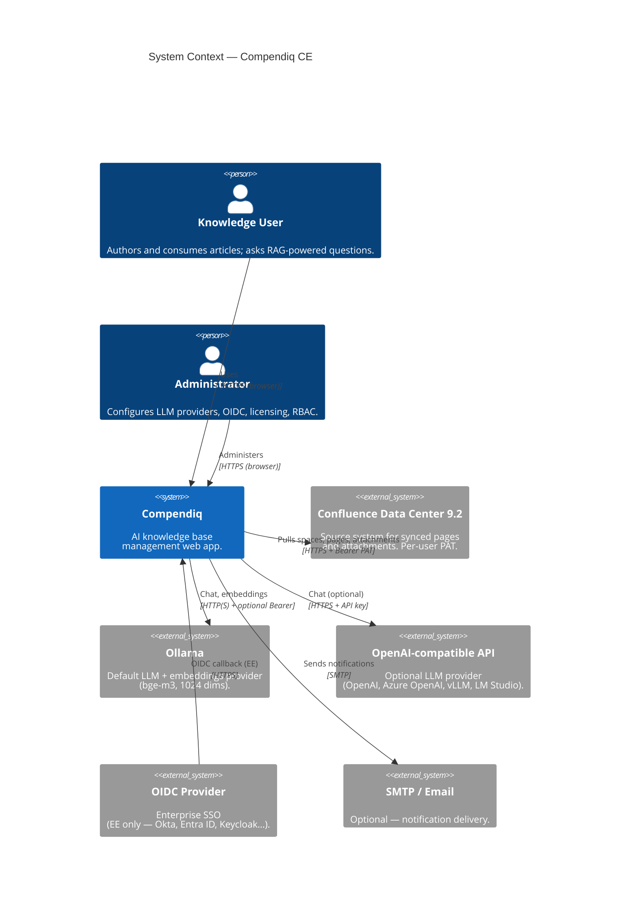

# 1. System Context (C4 Level 1)

Shows Compendiq as a single system and the people and external systems it
interacts with. This is the 10 000-foot view — nothing about containers,
databases, or code.

## Notes

- **Confluence PATs** are stored per-user, AES-256-GCM encrypted with
  `PAT_ENCRYPTION_KEY`. They never leave the backend to the browser.
- **LLM provider** is resolved per-user (user setting) with server-wide
  fallbacks set via `LLM_PROVIDER`, `OLLAMA_BASE_URL`, `OPENAI_BASE_URL`.
- **OIDC** is an Enterprise Edition feature gated by
  `ENTERPRISE_FEATURES.OIDC_SSO`. In CE the arrow does not exist.
- **SMTP** is optional and used by `notification-service`.

No other outbound network calls are made from the backend by default.
(`searxng` is an internal sidecar — see `02-container.md`.)
