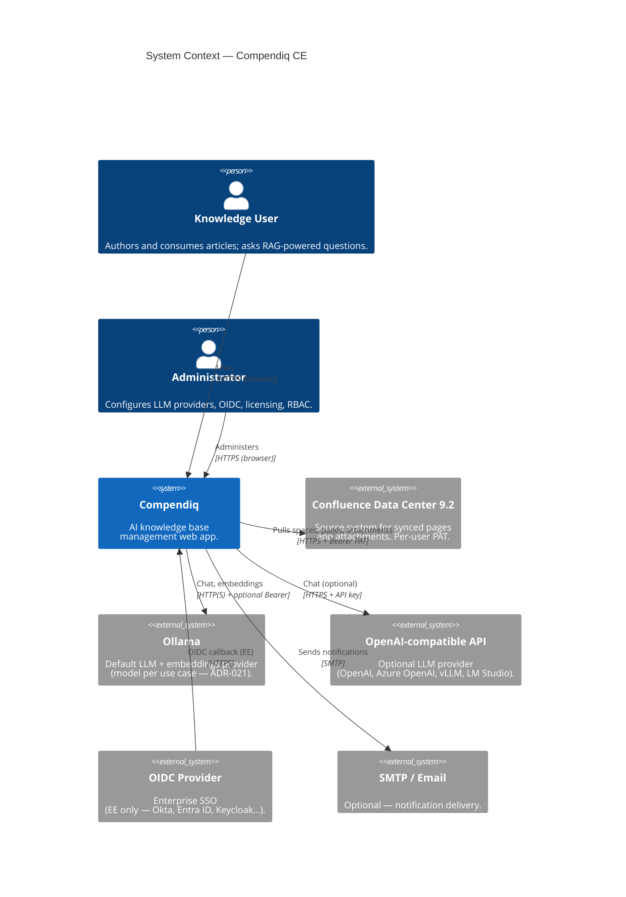

# 1. System Context (C4 Level 1)

Shows Compendiq as a single system and the people and external systems it
interacts with. This is the 10 000-foot view — nothing about containers,
databases, or code.

```mermaid
C4Context
    title System Context — Compendiq CE

    Person(user, "Knowledge User", "Authors and consumes articles; asks RAG-powered questions.")
    Person(admin, "Administrator", "Configures LLM providers, OIDC, licensing, RBAC.")

    System(compendiq, "Compendiq", "AI knowledge base<br/>management web app.")

    System_Ext(confluence, "Confluence Data Center 9.2", "Source system for synced pages<br/>and attachments. Per-user PAT.")
    System_Ext(ollama, "Ollama", "Default LLM + embeddings provider<br/>(model per use case — ADR-021).")
    System_Ext(openai, "OpenAI-compatible API", "Optional LLM provider<br/>(OpenAI, Azure OpenAI, vLLM, LM Studio).")
    System_Ext(oidc, "OIDC Provider", "Enterprise SSO<br/>(EE only — Okta, Entra ID, Keycloak…).")
    System_Ext(smtp, "SMTP / Email", "Optional — notification delivery.")

    Rel(user, compendiq, "Uses", "HTTPS (browser)")
    Rel(admin, compendiq, "Administers", "HTTPS (browser)")

    Rel(compendiq, confluence, "Pulls spaces, pages, attachments", "HTTPS + Bearer PAT")
    Rel(compendiq, ollama, "Chat, embeddings", "HTTP(S) + optional Bearer")
    Rel(compendiq, openai, "Chat (optional)", "HTTPS + API key")
    Rel(oidc, compendiq, "OIDC callback (EE)", "HTTPS")
    Rel(compendiq, smtp, "Sends notifications", "SMTP")

    UpdateLayoutConfig($c4ShapeInRow="3", $c4BoundaryInRow="1")
```

## Notes

- **Confluence PATs** are stored per-user, AES-256-GCM encrypted with
  `PAT_ENCRYPTION_KEY`. They never leave the backend to the browser.
- **LLM providers** are configured as rows in the `llm_providers` table
  with per-use-case assignments (ADR-021). `OLLAMA_BASE_URL` /
  `OPENAI_BASE_URL` survive only as deprecated fresh-install bootstrap
  fallbacks.
- **The embedding model is one of those assignments**, not a property of the
  Ollama box above — which is why the label says "per use case" rather than
  naming a model. `resolveUsecase('embedding')` picks the `provider + model`
  pair and the vector width is probed from it; the width then drives the
  column type in `page_embeddings` (see
  [`06-data-model.md`](./06-data-model.md)). `bge-m3` at 1024 is the
  bootstrap **default**; **Qwen3-Embedding-4B at 2560** (the `halfvec` +
  HNSW tier) is the measured recommendation for production — see ADR-012's
  `#1114` amendment. Either can be served by the box drawn as "Ollama" or by
  any OpenAI-compatible endpoint.
- **OIDC** is an Enterprise Edition feature gated by
  `ENTERPRISE_FEATURES.OIDC_SSO`. In CE the arrow does not exist.
- **SMTP** is optional and used by `notification-service`.

No other outbound network calls are made from the backend by default.
(`searxng` is an internal sidecar — see `02-container.md`.)
