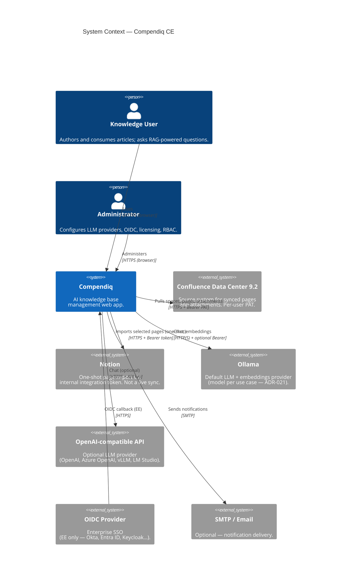

# 1. System Context (C4 Level 1)

Shows Compendiq as a single system and the people and external systems it
interacts with. This is the 10 000-foot view — nothing about containers,
databases, or code.

```mermaid
C4Context
    title System Context — Compendiq CE

    Person(user, "Knowledge User", "Authors and consumes articles; asks RAG-powered questions.")
    Person(admin, "Administrator", "Configures LLM providers, OIDC, licensing, RBAC.")

    System(compendiq, "Compendiq", "AI knowledge base<br/>management web app.")

    System_Ext(confluence, "Confluence Data Center 9.2", "Source system for synced pages<br/>and attachments. Per-user PAT.")
    System_Ext(notion, "Notion", "One-shot page import via<br/>internal integration token. Not a live sync.")
    System_Ext(ollama, "Ollama", "Default LLM + embeddings provider<br/>(model per use case — ADR-021).")
    System_Ext(openai, "OpenAI-compatible API", "Optional LLM provider<br/>(OpenAI, Azure OpenAI, vLLM, LM Studio).")
    System_Ext(oidc, "OIDC Provider", "Enterprise SSO<br/>(EE only — Okta, Entra ID, Keycloak…).")
    System_Ext(smtp, "SMTP / Email", "Optional — notification delivery.")

    Rel(user, compendiq, "Uses", "HTTPS (browser)")
    Rel(admin, compendiq, "Administers", "HTTPS (browser)")

    Rel(compendiq, confluence, "Pulls spaces, pages, attachments", "HTTPS + Bearer PAT")
    Rel(compendiq, notion, "Imports selected pages (one-shot)", "HTTPS + Bearer token")
    Rel(compendiq, ollama, "Chat, embeddings", "HTTP(S) + optional Bearer")
    Rel(compendiq, openai, "Chat (optional)", "HTTPS + API key")
    Rel(oidc, compendiq, "OIDC callback (EE)", "HTTPS")
    Rel(compendiq, smtp, "Sends notifications", "SMTP")

    UpdateLayoutConfig($c4ShapeInRow="3", $c4BoundaryInRow="1")
```

## Notes

- **Confluence PATs** are stored per-user, AES-256-GCM encrypted with
  `PAT_ENCRYPTION_KEY`. They never leave the backend to the browser.
- **Notion** is a one-shot migrate of selected pages (#1459 / #1462), not a
  live two-way sync. The internal integration token is stored per-user with
  the same `encryptPat` helpers as the Confluence PAT. Client-visible APIs
  return `hasToken` only.
- **LLM providers** are configured as rows in the `llm_providers` table
  with per-use-case assignments (ADR-021). `OLLAMA_BASE_URL` /
  `OPENAI_BASE_URL` survive only as deprecated fresh-install bootstrap
  fallbacks.
- **The embedding model is one of those assignments**, not a property of the
  Ollama box above — which is why the label says "per use case" rather than
  naming a model. `resolveUsecase('embedding')` picks the `provider + model`
  pair and the vector width is probed from it; the width then drives the
  column type in `page_embeddings` (see
  [`06-data-model.md`](./06-data-model.md)). `bge-m3` at 1024 is the
  bootstrap **default**; **Qwen3-Embedding-4B at 2560** (the `halfvec` +
  HNSW tier) is the measured recommendation for production — see ADR-012's
  `#1114` amendment. Either can be served by the box drawn as "Ollama" or by
  any OpenAI-compatible endpoint.
- **OIDC** is an Enterprise Edition feature gated by
  `ENTERPRISE_FEATURES.OIDC_SSO`. In CE the arrow does not exist.
- **SMTP** is optional and used by `notification-service`.

No other outbound network calls are made from the backend by default.
(`searxng` is an internal sidecar — see `02-container.md`.) Notion is
reached only when a user connects or runs an import.

Check knip and architecture-docs tests. Also admin.test.ts mock - SELECT notion might need handling if someone asserts call count.

There's a test in admin.test.ts that FROM user_settings is called... 

Also need to fix token-service: when INSERT happens but UPDATE uses user_id, if no row (conflict nothing on missing user) ...

When user exists, INSERT ON CONFLICT DO NOTHING then UPDATE. First connect: no settings row, INSERT creates it, UPDATE sets token. Good.

connectNotionToken on probe success encrypts then writes. If UPDATE matches 0 because ensure failed, we still return hasToken true. Edge case.

invalid token 'wrong-token-secret' - the fake server 401. NotionError. The integration test expects no persist - but ensure isn't called. user_settings might not exist. Query returns empty. rows[0]?.notion_integration_token ?? null. Good.

GET connection when no user_settings row: getNotionConnectionStatus returns hasToken false. Good.

Route PUT needs user_settings after connect - ensure creates it.

insertUser doesn't create user_settings. connect does.

audit_log NOTION_TOKEN_UPDATED - AuditAction union includes it.

Check if there's a exhaustive list of AuditAction elsewhere.

There's architecture-docs-embedding-model.test.ts - skip.

Look at knip.config.ts for unused files.

Also frontend architecture mermaid test runs mermaid.parse on all docs - C4Context with Notion should work.

C4 Rel text "Imports selected pages (one-shot)" - parentheses OK.

Let me check if createTlsDispatcher Agent works with HTTP (not HTTPS) to 127.0.0.1. Should be fine.

Potential issue: AbortSignal.timeout in tests.

Potential issue: NotionClient addAllowedBaseUrl on every construct - tests OK.

Token in PUT payload is in the request, not the response. GET doesn't have it.

invalid token TOKEN + '-wrong' - 401 body must not contain either. Message is 'Invalid Notion token'. Good.

If Fastify serializes the error differently... we use reply.status().send.

Need to add audit-service type-level test? Optional.

Check admin.test.ts for mock of query that counts FROM user_settings queries...

Look at knip.

Also fix: routes/knowledge/notion.ts expectNoSecret throwing is extra.

There's a lint issue: knowledge domain notion-test-helpers is production. Fine.

eslint no-unused for FAKE_NOTION_VERSION - I exported it but may not use it. Remove from helpers.

Let me remove unused FAKE_NOTION_VERSION.

Also check packages/contracts NotionConnectionResponseSchema.shape - in Zod 4, .strict() object might have .shape.

If Zod 4 strict wrappers don't have .shape, the contracts test fails. I'll check how other schemas access shape.
