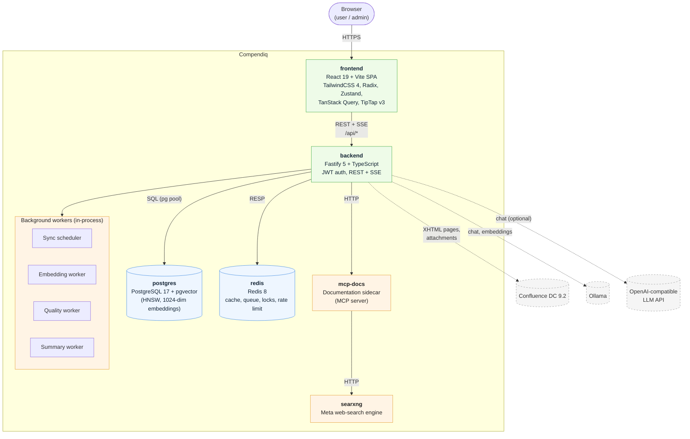

# 2. Container Diagram (C4 Level 2)

Zooms into Compendiq and shows each deployable unit (a "container" in C4
terms — not strictly a Docker container, though in this project they map
1-to-1). For the infra view with networks and ports see
[`05-deployment.md`](./05-deployment.md).

## Containers at a glance

| Container | Tech | Port (internal) | Image |
|-----------|------|-----------------|-------|
| frontend  | React 19 SPA, Vite, Nginx-served | 8081 | `ghcr.io/compendiq/compendiq-ce-frontend` |
| backend   | Node.js 22, Fastify 5 | 3051 | `ghcr.io/compendiq/compendiq-ce-backend` |
| postgres  | `pgvector/pgvector:pg17` | 5432 | upstream |
| redis     | `redis:8-alpine` | 6379 | upstream |
| mcp-docs  | MCP server (Node) | 3100 | `ghcr.io/compendiq/compendiq-ce-mcp-docs` |
| searxng   | Python meta search | 8080 | `ghcr.io/compendiq/compendiq-ce-searxng` |

## Background workers

Workers run **inside the backend process** — there is no separate worker
container. They are started from `backend/src/index.ts` via
`startQueueWorkers()` (BullMQ) and fall back to interval-based polling when
`USE_BULLMQ=false`.

- **Sync scheduler** — polls `user_settings`, respects `SYNC_INTERVAL_MIN`,
  guarded by a Redis lock (`sync:worker:lock`).
- **Embedding worker** — consumes dirty pages (`pages.embedding_dirty=true`).
- **Quality worker** — rates page clarity/completeness.
- **Summary worker** — auto-summarizes pages.

## Shared contracts

`packages/contracts` (published as `@compendiq/contracts`) is imported by
both frontend and backend and defines Zod schemas / TypeScript types for API
boundaries. It is a build-time dependency, not a runtime container.

## Enterprise plugin

When `@compendiq/enterprise` is installed, the backend loads it dynamically
at boot (`core/enterprise/loader.ts`). The frontend image is **identical**
in CE and EE deployments; enterprise UI is gated at runtime by the
`/api/admin/license` response. See
[`10-flow-enterprise-license.md`](./10-flow-enterprise-license.md).
