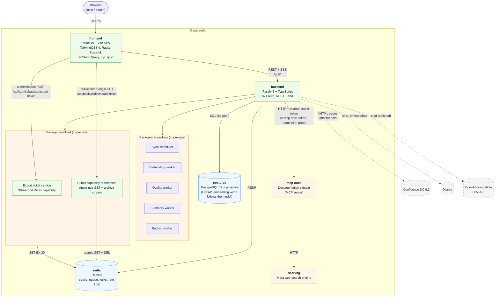

# 2. Container Diagram (C4 Level 2)

Zooms into Compendiq and shows each deployable unit (a "container" in C4
terms — not strictly a Docker container, though in this project they map
1-to-1). For the infra view with networks and ports see
[`05-deployment.md`](./05-deployment.md).

```mermaid
flowchart TB
    user(["Browser<br/>(user / admin)"])
    confluence[("Confluence DC 9.2")]
    ollama[("Ollama")]
    openai[("OpenAI-compatible<br/>LLM API")]

    subgraph compendiq["Compendiq"]
        direction TB
        fe["<b>frontend</b><br/>React 19 + Vite SPA<br/>TailwindCSS 4, Radix, Zustand,<br/>TanStack Query, TipTap v3"]
        be["<b>backend</b><br/>Fastify 5 + TypeScript<br/>JWT auth, REST + SSE"]

        subgraph workers["Background workers (in-process)"]
            direction LR
            wsync["Sync scheduler"]
            wemb["Embedding worker"]
            wqual["Quality worker"]
            wsum["Summary worker"]
            wbackup["Backup worker"]
        end

        subgraph backup_download["Backup download (in-process)"]
            direction LR
            bticket["Export ticket service<br/>30-second Redis capability"]
            bredeem["Public capability redemption<br/>single-use GET + archive stream"]
        end

        pg[("<b>postgres</b><br/>PostgreSQL 17 + pgvector<br/>(HNSW; embedding width follows the model)")]
        redis[("<b>redis</b><br/>Redis 8<br/>cache, queue, locks, rate limit")]

        mcp["<b>mcp-docs</b><br/>Documentation sidecar<br/>(MCP server)"]
        searx["<b>searxng</b><br/>Meta web-search engine"]
    end

    user -- "HTTPS" --> fe
    fe  -- "REST + SSE<br/>/api/*" --> be

    be --> workers
    be --> backup_download
    fe -- "authenticated POST<br/>/api/admin/backup/export-ticket" --> bticket
    fe -- "public same-origin GET<br/>/api/backup/download/:ticket" --> bredeem
    bticket -- "SET EX 30" --> redis
    bredeem -- "atomic GET + DEL" --> redis
    be -- "SQL (pg pool)" --> pg
    be -- "RESP" --> redis
    be -- "HTTP + shared-secret token<br/>(x-mcp-docs-token, required in prod)" --> mcp
    mcp -- "HTTP" --> searx

    be -. "XHTML pages,<br/>attachments" .-> confluence
    be -. "chat, embeddings" .-> ollama
    be -. "chat (optional)" .-> openai

    classDef ext fill:#f5f5f5,stroke:#999,stroke-dasharray: 4 4,color:#333
    classDef data fill:#eef6ff,stroke:#4a90e2,color:#123
    classDef app fill:#eefbe8,stroke:#4caf50,color:#123
    classDef side fill:#fff4e5,stroke:#e5a23c,color:#222
    class confluence,ollama,openai ext
    class pg,redis data
    class fe,be,bticket,bredeem app
    class mcp,searx,workers,backup_download side
```

The `backend → mcp-docs` call is authenticated with a shared-secret token
(`MCP_DOCS_TOKEN`, sent as the `x-mcp-docs-token` header) layered on top of
network isolation. The sidecar runs `NODE_ENV=production` and **fails closed**
— `/mcp` returns `401` until the token is set on both services (`/health`
stays open). See [`05-deployment.md`](./05-deployment.md) → MCP sidecar
authentication.

Backup downloads use two in-process backend components. The admin-only POST
creates a 256-bit ticket in Redis; the browser then navigates through the
frontend proxy to the public GET route. That GET has no JWT hook because a
top-level navigation cannot attach the access-token header. Instead, the
30-second ticket is the single-use bearer capability and Redis consumption is
atomic. The URL contains neither backup bytes nor a passphrase.

**The postgres box carries no vector width on purpose.** `page_embeddings.embedding`
is typed from the *resolved* embedding model's probed width, not from a constant:
`vector(n)` + HNSW up to 2000 dims, `halfvec(n)` + `halfvec_cosine_ops` from 2001
to 4000, unindexed above that. `bge-m3` at 1024 is the bootstrap default and
**Qwen3-Embedding-4B at 2560 (`halfvec`) is the measured recommendation** (#1114);
switching between them changes the column type, so it goes through #1116's shadow
path rather than a redeploy. Details in [`06-data-model.md`](./06-data-model.md)
and ADR-012's `#1114` amendment.

## Containers at a glance

| Container | Tech | Port (internal) | Image |
|-----------|------|-----------------|-------|
| frontend  | React 19 SPA, Vite, Nginx-served | 8081 | `ghcr.io/compendiq/compendiq-ce-frontend` |
| backend   | Node.js 22, Fastify 5 | 3051 | `ghcr.io/compendiq/compendiq-ce-backend` |
| postgres  | `pgvector/pgvector:pg17` | 5432 | upstream |
| redis     | `redis:8-alpine` | 6379 | upstream |
| mcp-docs  | MCP server (Node) | 3100 | `ghcr.io/compendiq/compendiq-ce-mcp-docs` |
| searxng   | Python meta search | 8080 | `ghcr.io/compendiq/compendiq-ce-searxng` |

Each Compendiq image carries three tag classes published by the GitHub Actions Docker workflow: `:latest` (refreshed on every push to `main` — recommended default for production), `:X.Y.Z` and `:X.Y` (e.g. `:0.6.2` / `:0.6`; refreshed on every `v*` release tag — pin these for exact-version reproducibility), and `:dev` (refreshed on every push to `dev` — useful for staging / smoke environments). `:dev` and `:latest` are linux/amd64 only (arm64 is published on `v*` tags); `docker/docker-compose.yml` pins `platform: linux/amd64` on the four Compendiq services so Apple Silicon pulls request that manifest. The shared `compendiq-ce-frontend` image is consumed by both Community and Enterprise editions; there is no separate `compendiq-ee-frontend` image.

## Background workers

Workers run **inside the backend process** — there is no separate worker
container. They are started from `backend/src/index.ts` via
`startQueueWorkers()` (BullMQ) and fall back to interval-based polling when
`USE_BULLMQ=false`.

- **Sync scheduler** — polls `user_settings`, respects `SYNC_INTERVAL_MIN`,
  guarded by a Redis lock (`sync:worker:lock`).
- **Embedding worker** — consumes dirty pages (`pages.embedding_dirty=true`).
- **Quality worker** — rates page clarity/completeness.
- **Summary worker** — auto-summarizes pages.
- **Backup worker** — checks the persisted schedule, then streams one
  cluster-locked encrypted archive to a configured public S3 endpoint.

## Shared contracts

`packages/contracts` (published as `@compendiq/contracts`) is imported by
both frontend and backend and defines Zod schemas / TypeScript types for API
boundaries. It is a build-time dependency, not a runtime container.

## Enterprise plugin

When `@compendiq/enterprise` is installed, the backend loads it dynamically
at boot (`core/enterprise/loader.ts`). The frontend image is **identical**
in CE and EE deployments; enterprise UI is gated at runtime by the
`/api/admin/license` response. See
[`10-flow-enterprise-license.md`](./10-flow-enterprise-license.md).
