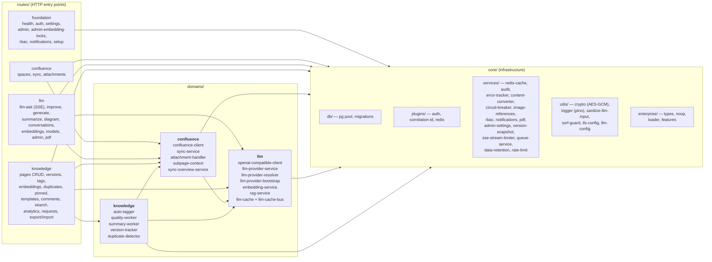
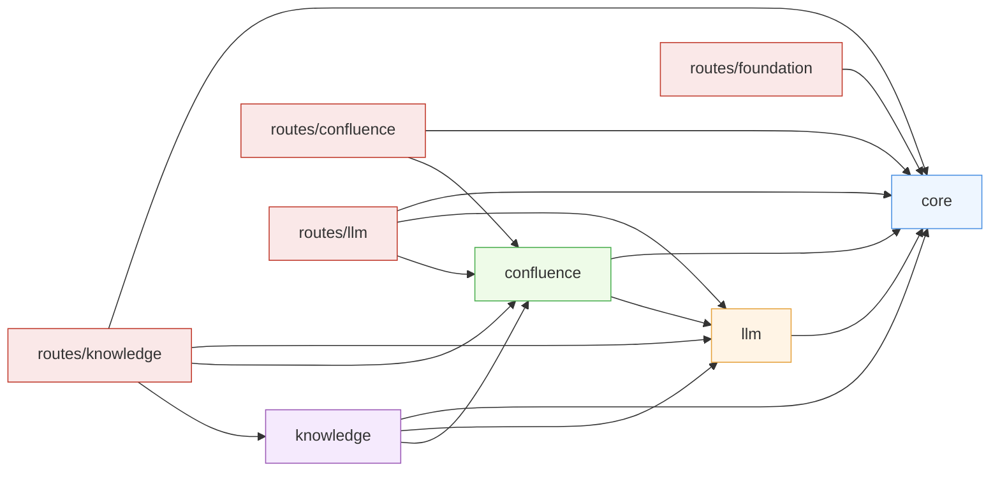

# 3. Backend Domains (C4 Level 3 — Components)

Zooms into the `backend` container. The code is organized by domain with
imports enforced by `eslint-plugin-boundaries` (see
`backend/eslint.config.js`).

## Domain map

## ESLint-enforced boundary rules

Defined in `backend/eslint.config.js` with `eslint-plugin-boundaries`:

**Rules (mnemonic):**

- `core` imports **nothing** from domains/routes. It is pure infrastructure.
- `confluence` may use `llm` (for sync-time embedding).
- `llm` is self-contained (core only).
- `knowledge` is the integrator and may use all three other domains.
- Each `routes/*` group may import `core` plus the domains it exposes;
  `routes/knowledge` is the top-level aggregator and may import anything.

Adding a new import across these lines without updating the ESLint config is
a build failure — update the config *and* this diagram together.

## Background workers

Workers live inside the `domains/*/services/` layer and are started from
`backend/src/index.ts`. See [`08-flow-sync.md`](./08-flow-sync.md) and
[`09-flow-rag-chat.md`](./09-flow-rag-chat.md) for the runtime behaviour.
